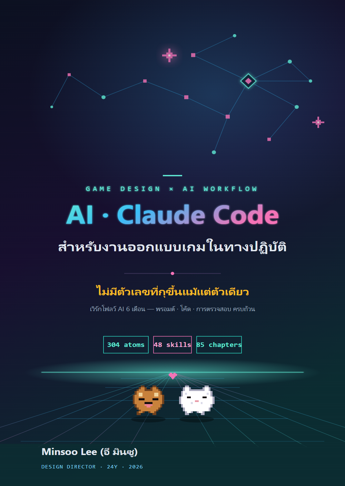

# AI และ Claude Code สำหรับงานออกแบบเกมในทางปฏิบัติ

> ไม่มีตัวเลขที่กุขึ้นแม้แต่ตัวเดียว — คู่มือภาคสนาม 6 เดือนของเวิร์กโฟลว์ AI: พรอมต์ โค้ด และการตรวจสอบ ครบถ้วน

[](LICENSE)
[-blue.svg)](https://github.com/eremes81/game-design-ai-practice)
[-orange.svg)](https://bookk.co.kr/bookStore/6a298be0ff49b1a6034c7703)

**🌐 ฉบับภาษาต่าง ๆ:** [한국어 — ต้นฉบับ](https://github.com/eremes81/game-design-ai-practice) · [English](https://github.com/eremes81/game-design-ai-practice-en) · [日本語](https://github.com/eremes81/game-design-ai-practice-ja) · **ไทย**



คู่มือภาคสนามเชิงปฏิบัติโดยผู้กำกับฝ่ายออกแบบที่มีประสบการณ์ 24 ปีในวงการเกม ว่าด้วยการนำ generative AI (Claude Code) มาใช้ใน **งานผลิตประจำวันจริง** ไม่ใช่ทฤษฎีหรือการคาดการณ์ — หนังสือพาไปทีละงานตั้งแต่หน้าจอแรกสุด (การติดตั้ง บัญชี ราคา) ผ่านการออกแบบระบบ การต่อสู้ เนื้อเรื่อง เลเวลดีไซน์ การปรับสมดุล UX และ Live Ops ไปจนถึงการแปลงบันทึกการประชุมเป็นการตัดสินใจ ด่านตรวจสอบ การบริหารต้นทุน และลิขสิทธิ์

ชื่อรอง — **"ไม่มีตัวเลขที่กุขึ้น"** — คือคำสัญญาของหนังสือเล่มนี้ ทุกตัวเลขและทุกกรณีในเนื้อหามาจากงานจริง ไม่ใช่ตัวอย่างที่แต่งขึ้น และโค้ดส่วนใหญ่รันได้ทันทีด้วยไลบรารีมาตรฐานของ Python เพียงอย่างเดียว

หนังสือเล่มนี้เปิดกว้างสำหรับผู้อ่านนอกวงการเกมด้วย เวิร์กโฟลว์อย่างการแปลงบันทึกการประชุมเป็นการตัดสินใจ การติดตามผลกระทบของการตัดสินใจ และการคุมคุณภาพด้วยด่านตรวจสอบ ใช้ได้ไม่ว่าคุณจะทำงานสายไหน กล่อง "การประยุกต์นอกเกม" ในแต่ละบทคือสะพานเชื่อม และทุกบทยังมี "ฉบับย่อสำหรับคนเดียว" สำหรับผู้ที่สร้างงานคนเดียวโดยไม่มีทีม

---

## 🌐 เกี่ยวกับฉบับนี้

นี่คือ **ฉบับภาษาไทย** ของต้นฉบับภาษาเกาหลี *게임 기획 실무에서 바로 쓰는 AI·클로드 코드 활용법* (BOOKK, 2026 · ISBN 979-11-12-21479-9)

ตามหลักการ "ความซื่อตรงมาก่อน" ของหนังสือเล่มนี้ ขอบอกตรง ๆ ว่าฉบับนี้ทำขึ้นอย่างไร: มันถูก **แปลจากต้นฉบับภาษาเกาหลีด้วยเวิร์กโฟลว์ AI ของหนังสือเอง** (แปลโดยมี Claude ช่วย ภายใต้คลังศัพท์ตายตัว) แล้วตรวจสอบโดยผู้เขียน — ซึ่งไม่ใช่เจ้าของภาษาไทย บันทึกเซสชันจริง (worked transcript) ทั้งหมดเป็นการแปลจากเซสชันภาษาเกาหลีต้นฉบับ **ไม่ใช่การรันใหม่เป็นภาษาไทย** ต้นฉบับภาษาเกาหลีที่ไม่ถูกแก้ไขอยู่ที่ [repository ภาษาเกาหลี](https://github.com/eremes81/game-design-ai-practice) ส่วนไวยากรณ์ของโค้ด ตัวระบุ ตัวเลข และค่าตรวจสอบ ไม่ถูกแก้ไขใด ๆ

**ยินดีรับการแก้ไขจากเจ้าของภาษาเป็นอย่างยิ่ง** — หากพบประโยคที่อ่านแล้วผิดเพี้ยน โปรดเปิด Issue หรือ Pull Request

---

## 📖 เริ่มอ่าน

- **[คำนำ · วิธีอ่านหนังสือเล่มนี้](manuscript/_front-matter.md)** — เริ่มที่นี่เพื่อดูเส้นทางการอ่าน
- **[1.0 ก่อนเริ่มต้น — การติดตั้ง บัญชี ราคา และชุดเอาตัวรอดบนเทอร์มินัล](manuscript/part01-foundation/chapter-0-setup-survival-kit.md)** — ทำตามไปทีละขั้นจากหน้าจอแรกสุด
- แผนภาพเขียนเป็นบล็อกโค้ด ` ```mermaid ` และ **เรนเดอร์ได้เองบน GitHub** คลิกบทใดก็ได้ด้านล่างแล้วอ่านได้เลย

## ฉบับพิมพ์ต้นฉบับ (ภาษาเกาหลี)

| | |
|---|---|
| ผู้เขียน | Minsoo Lee (이민수) |
| สำนักพิมพ์ | BOOKK · ปกอ่อน (ภาษาเกาหลี) |
| ISBN | 979-11-12-21479-9 |
| ตีพิมพ์ | 2026-06-11 |
| ขนาด | 876 หน้า · 24 ส่วน + ภาคผนวก A\~N + บทส่งท้าย |
| ซื้อ | **[ร้าน BOOKK (ฉบับพิมพ์ภาษาเกาหลี)](https://bookk.co.kr/bookStore/6a298be0ff49b1a6034c7703)** |

repository นี้คือ **ฉบับภาษาไทย (ซอร์สมาร์กดาวน์)** ของหนังสือเล่มเดียวกัน เผยแพร่ภายใต้สัญญาอนุญาตด้านล่าง ต้นฉบับภาษาเกาหลีอยู่ที่ [eremes81/game-design-ai-practice](https://github.com/eremes81/game-design-ai-practice)

## สารบัญฉบับเต็ม

> **24 ส่วน + ภาคผนวก A\~N + บทส่งท้าย · 100 บท** ภาคผนวกอยู่ใน [`manuscript/part99-appendix/`](manuscript/part99-appendix) ส่วนผู้จัดทำอยู่ที่ [`manuscript/_colophon.md`](manuscript/_colophon.md)

### ส่วนที่ 1 · พื้นฐาน

- [1.0 ก่อนเริ่มต้น — การติดตั้ง บัญชี ค่าบริการ และชุดเอาตัวรอดบนเทอร์มินัล](manuscript/part01-foundation/chapter-0-setup-survival-kit.md)
- [1.1 การพบกันครั้งแรกระหว่างนักออกแบบเกมกับ Claude Code](manuscript/part01-foundation/chapter-1-first-encounter.md)
- [1.2 โมเดล·โทเค็น·ฮาร์เนส — เส้นทางที่โทเค็นของงานหนึ่งไหลผ่าน](manuscript/part01-foundation/chapter-2-model-token-harness.md)
- [1.3 โครงสร้างพื้นฐาน: หน่วยความจำ สิทธิ์ และการตั้งค่า](manuscript/part01-foundation/chapter-3-memory-permission-setting.md)

### ส่วนที่ 2 · สถาปัตยกรรมข้อมูล

- [2.1 YAML Frontmatter — เปลี่ยนทุกเอกสารให้เป็นข้อมูล](manuscript/part02-info-architecture/chapter-4-yaml-frontmatter.md)
- [2.2 Atom รายหน้า — กายวิภาคของ 1 เอกสาร 1 การตัดสินใจ](manuscript/part02-info-architecture/chapter-5-page-atom.md)
- [2.3 การออกแบบ Layer — การทำให้ระบบเกมเป็นนามธรรม](manuscript/part02-info-architecture/chapter-6-layer-design.md)
- [2.4 ออนโทโลยีและกราฟ wikilink — ตรวจสอบลูกศรเชิงความหมาย](manuscript/part02-info-architecture/chapter-7-ontology-graph.md)

### ส่วนที่ 3 · การออกแบบระบบ

- [3.1 งานของ System Designer และพิกัด Layer](manuscript/part03-system-design/chapter-09-system-designer-and-layer.md)
- [3.2 สคีมามาก่อน — $สคีมาต้องมาก่อนข้อมูล](manuscript/part03-system-design/chapter-10-schema-first.md)
- [3.3 การแสดงผลแผนผังความสัมพันธ์ — มองเห็นการพึ่งพากันด้วยตา](manuscript/part03-system-design/chapter-11-relation-map.md)
- [3.4 รูปแบบพรอมต์สำหรับการออกแบบระบบโดยมี AI ช่วย](manuscript/part03-system-design/chapter-12-ai-assist-prompt-patterns.md)

### ส่วนที่ 4 · การออกแบบการต่อสู้

- [4.1 นักออกแบบการต่อสู้กับ Layer — สัมผัสของการตีอยู่ในช่องไหน](manuscript/part04-combat-design/chapter-13-combat-designer-and-layer.md)
- [4.2 Look & Feel ของการต่อสู้ — จุดที่ใช้ข้อมูลจับ 'สัมผัสมือ'](manuscript/part04-combat-design/chapter-14-look-and-feel.md)
- [4.3 คอมโบ คานเซิล และคิวอินพุต — แจกแจงทุกเส้นทางแล้วตรวจสอบ](manuscript/part04-combat-design/chapter-15-combo-cancel-input.md)
- [4.4 การจำลองและตรวจสอบการต่อสู้ด้วยความช่วยเหลือของ AI](manuscript/part04-combat-design/chapter-16-ai-combat-simulation.md)

### ส่วนที่ 5 · เนื้อเรื่อง

- [5.1 โครงสร้าง NarrativeDocs Layer 0\~4](manuscript/part05-narrative-design/chapter-1-narrative-docs-layers.md)
- [5.2 การตรวจสอบความสอดคล้อง โลก → ตัวละคร → เควสต์](manuscript/part05-narrative-design/chapter-2-consistency-verification.md)
- [5.3 การเขียนเนื้อเรื่องโดยมี AI ช่วย](manuscript/part05-narrative-design/chapter-3-ai-assisted-narrative.md)
- [5.4 ความสอดคล้องของบทพูดและเสียงตัวละคร](manuscript/part05-narrative-design/chapter-4-dialogue-voice-consistency.md)

### ส่วนที่ 6 · การออกแบบเนื้อหา

- [6.1 การสร้างเนื้อหาแบบโพรซีเดอรัลกับ AI — ช่องเดียวที่สองแกนตัดกัน](manuscript/part06-content-design/chapter-1-procedural-content-ai.md)
- [6.2 city_hunting_generator — สร้างเมือง 30 แห่งภายใน 4 สัปดาห์](manuscript/part06-content-design/chapter-2-city-hunting-generator.md)
- [6.3 NPC Persona และ Squad — จากพิพิธภัณฑ์ตุ๊กตาสู่สังคมเล็ก ๆ](manuscript/part06-content-design/chapter-3-npc-persona-squad-pipeline.md)
- [6.4 เวิร์กโฟลว์การผลิตเนื้อหาจำนวนมาก — ร้อย generator หลายตัวเข้าเป็นไลน์เดียว](manuscript/part06-content-design/chapter-4-content-production-workflow.md)

### ส่วนที่ 7 · Level Design

- [7.1 มาสเตอร์การออกแบบเลเวลแบบโพรซีเดอรัล](manuscript/part07-level-design/chapter-1-procedural-level-design-master.md)
- [7.2 เอดิเตอร์ BehaviorTree — บันทึกเซสชันจริงที่คนกับ AI ร่วมกันแก้ไขและตรวจสอบ BT json](manuscript/part07-level-design/chapter-2-behaviortree-editor.md)
- [7.3 ไลบรารีแพตเทิร์นของดันเจี้ยนและสนาม](manuscript/part07-level-design/chapter-3-dungeon-field-pattern-library.md)

### ส่วนที่ 8 · การปรับสมดุล

- [8.1 สูตรปรับสมดุลการต่อสู้ — ที่ทางของรูลบุ๊กแบบเชิงกำหนด](manuscript/part08-balance-design/chapter-1-combat-balance-formula.md)
- [8.2 สร้างโมเดลเศรษฐกิจด้วย Machinations — จับเงินเฟ้อด้วยซิมูเลชันแทนการประชุม](manuscript/part08-balance-design/chapter-2-economy-machinations.md)
- [8.3 Damage Simulator — วันที่ DPS ในเอกสารกับผลลัพธ์จากการจำลองแยกทางกัน](manuscript/part08-balance-design/chapter-3-damage-simulator-2008.md)
- [8.4 การจำลองสมดุลด้วยความช่วยเหลือของ AI](manuscript/part08-balance-design/chapter-4-ai-balance-simulation.md)
- [8.5 บาลานซ์ PvP·การแข่งขัน — เมทริกซ์อัตราชนะ·แมตช์เมกกิง·สิทธิ์การตัดสินของเซิร์ฟเวอร์](manuscript/part08-balance-design/chapter-5-pvp-competitive-balance.md)

### ส่วนที่ 9 · UX/UI

- [9.1 นำภาพหน้าจอ HUD เข้าสู่ lint — จุดที่ AI จับการหลุดสายตาและคอนทราสต์ที่ไม่ผ่านเกณฑ์](manuscript/part09-ux-ui-design/chapter-1-hud-layout.md)
- [9.2 การจัดเรียงปุ่มสกิล — ให้ AI ร่างแบบจัดวาง 3 แบบ แล้วให้ lint คัดทิ้ง](manuscript/part09-ux-ui-design/chapter-2-skill-ui-button-column.md)
- [9.3 ArtGuide/06_UI การทำงานร่วมกัน — นักออกแบบเกมเขียนด้วย md ส่วนทีมอาร์ตดูเฉพาะ html](manuscript/part09-ux-ui-design/chapter-3-artguide-ui-collaboration.md)

### ส่วนที่ 10 · QA

- [10.1 atom ตรวจสอบความสอดคล้อง — cascade ที่รักษา FK ของ 30 ชีต](manuscript/part10-qa-design/chapter-1-integrity-check-atoms.md)
- [10.2 เซนเซอร์ตรวจสอบการตัดสินใจแบบ 3 ชั้น (3-layer) — ที่ทางของหลักฐานการตรวจสอบโดยมนุษย์](manuscript/part10-qa-design/chapter-2-decision-validation-3-layer.md)
- [10.3 Alpha Gap Report — จัดหมวดหมู่ช่องว่างด้วยภาษาธรรมชาติ แล้วให้คนจัดลำดับความสำคัญ](manuscript/part10-qa-design/chapter-3-alpha-gap-report.md)

### ส่วนที่ 11 · ตัวละคร เพ็ต และพาหนะ

- [11.1 ข้อตกลงการตั้งชื่อและการแมประหว่างสกิลกับอาร์ต](manuscript/part11-character-pet-mount/chapter-1-naming-and-skill-art-mapping.md)
- [11.2 ระบบเพ็ตและพาหนะ — จากเทมเพลต 1 แบบสู่อินสแตนซ์ 50 แบบ](manuscript/part11-character-pet-mount/chapter-2-pet-mount-system.md)

### ส่วนที่ 12 · อาร์ต

- [12.1 ไปป์ไลน์อาร์ตแอสเซต AI — ผลิตจำนวนมากในขั้นที่ย้อนกลับได้ และหยุดไว้หน้าด่านที่ย้อนกลับไม่ได้](manuscript/part12-art-direction/chapter-1-ai-art-asset-pipeline.md)
- [12.2 7 พื้นที่ของ ArtGuide (ตัวละคร·แอนิเมชัน·มอนสเตอร์·NPC·VFX·UI·สภาพแวดล้อม)](manuscript/part12-art-direction/chapter-2-artguide-7-areas.md)
- [12.3 จากเอกสารออกแบบ → คอนเซปต์ → แอสเซตในเกม](manuscript/part12-art-direction/chapter-3-spec-to-asset-flow.md)

### ส่วนที่ 13 · ข้อมูลและ KPI

- [13.1 เปลี่ยนคำตอบปลายเปิดหลายร้อยข้อให้เป็นหัวข้อ — การจัดกลุ่มให้ AI ทำ การวินิจฉัยให้คนทำ](manuscript/part13-data-kpi/chapter-1-faq-meta-game-analysis.md)
- [13.2 การนิยามและติดตาม KPI — นิยามให้คนทำ การวินิจฉัยสัญญาณผิดปกติให้ AI ทำ](manuscript/part13-data-kpi/chapter-2-kpi-definition-tracking.md)
- [13.3 จากตัวเลขผิดปกติสู่การตัดสินใจ — AI ตั้งสมมติฐาน คนเป็นผู้ตัดสินใจ](manuscript/part13-data-kpi/chapter-3-data-driven-decisions.md)

### ส่วนที่ 14 · มือถือ

- [14.1 จาก HUD บน PC 30 รายการสู่ 10 รายการบนมือถือ — เปลี่ยนข้อจำกัดให้เป็น rulebook เปลี่ยนการบีบอัดให้ AI ทำ](manuscript/part14-mobile-platform/chapter-1-mobile-hud-compression.md)
- [14.2 ความแตกต่างระหว่างแพลตฟอร์ม (iOS / Android / PC)](manuscript/part14-mobile-platform/chapter-2-platform-differences.md)
- [14.3 การออกแบบอินพุตแบบทัช / เมาส์](manuscript/part14-mobile-platform/chapter-3-touch-mouse-input-design.md)

### ส่วนที่ 15 · Live Ops

- [15.1 ภาพรวมการให้บริการเกม (Live Ops) — AI ประกอบตัวเลือกอีเวนต์ rulebook คัดกรอง และคนเลือก](manuscript/part15-live-ops/chapter-1-live-ops-overview.md)
- [15.2 การดำเนินงานอีเวนต์และซีซัน — จากเทมเพลตหนึ่งฉบับสู่ตัวเลือกแบบแปรผัน 10 แบบ โดยให้มนุษย์ทำแค่การตรวจสอบ](manuscript/part15-live-ops/chapter-2-event-season-ops.md)
- [15.3 เปลี่ยนฟีดแบ็ก 100 รายการให้เป็นหัวข้อ — ให้ LLM ทำการคลัสเตอร์ ให้คนจัดลำดับความสำคัญ](manuscript/part15-live-ops/chapter-3-user-feedback-cycle.md)

### ส่วนที่ 16 · ผู้ประสานงาน

- [16.1 การดำเนินงาน TF การต่อสู้ — แยกพื้นที่ทำงานออกมา และให้เฉพาะการตัดสินใจเท่านั้นที่กลายเป็นฉบับจริง](manuscript/part16-communicator/chapter-1-taskforce-operations.md)
- [16.2 การทำงานร่วมกับสายงานอื่น — จำแนกคำขอจากภายนอกออกเป็น 3-track](manuscript/part16-communicator/chapter-2-cross-job-collaboration.md)
- [16.3 หนึ่งการตัดสินใจ สามรูปแบบการห่อหุ้ม — การจัด framing ผลงานตามสายงาน](manuscript/part16-communicator/chapter-3-cross-team-artifact-framing.md)

### ส่วนที่ 17 · บันทึกการประชุม

- [17.1 ทำไมบันทึกการประชุมจึงเป็นจุดที่เจ็บปวดที่สุด](manuscript/part17-meeting-notes/chapter-1-concept-and-motivation.md)
- [17.2 ไปป์ไลน์สกัดการตัดสินใจจากบันทึกการประชุม](manuscript/part17-meeting-notes/chapter-2-extraction-pipeline.md)
- [17.3 การจัดหมวดหมู่·คำบรรยายภาพ·การซิงค์การประชุม — สามแกนของบันทึกการประชุมที่กลายเป็นสินทรัพย์](manuscript/part17-meeting-notes/chapter-3-categories-and-sync.md)
- [17.4 เปลี่ยนบันทึกการประชุมให้เป็นฐานข้อมูลการตัดสินใจ — 5 จุดที่ AI เข้าทำงานอัตโนมัติ](manuscript/part17-meeting-notes/chapter-4-ai-meeting-automation.md)

### ส่วนที่ 18 · การตัดสินใจและผลกระทบ

- [18.1 ระบบติดตามการตัดสินใจ](manuscript/part18-decision-impact/chapter-1-decision-tracking-system.md)
- [18.2 การแพร่กระจายอิมแพ็กต์และการจัดระดับ](manuscript/part18-decision-impact/chapter-2-impact-propagation-classification.md)
- [18.3 เวิร์กโฟลว์ติดตามผลกระทบก่อน-หลังการตัดสินใจ — จากการประเมินล่วงหน้าสู่การตรวจสอบภายหลัง](manuscript/part18-decision-impact/chapter-3-pre-post-tracking-workflow.md)
- [18.4 เวิร์กโฟลว์ grep วัดผลกระทบของเอกสาร — ดึงขอบเขตผลกระทบออกมาด้วย impact](manuscript/part18-decision-impact/chapter-4-doc-impact-grep-workflow.md)

### ส่วนที่ 19 · หัวหน้าทีมและภาวะผู้นำ

- [19.1 เปลี่ยนวิสัยทัศน์ให้เป็นเกณฑ์ให้คะแนนการตัดสินใจ — ลองส่ง decisions/ ทั้ง 26 รายการให้ LLM ตรวจ](manuscript/part19-team-lead/chapter-1-vision-and-delegation.md)
- [19.2 จำแนกความขัดแย้งและไม่ปล่อยให้การตัดสินใจในที่ประชุมหลุดหาย — AI ช่วยเรื่องภาวะผู้นำในการประชุม](manuscript/part19-team-lead/chapter-2-conflict-and-meeting-leadership.md)
- [19.3 กลยุทธ์การนำ AI มาใช้และการโน้มน้าวผู้บริหาร — จากแบบอนุรักษนิยมสู่แบบก้าวหน้า, ROI ที่ไม่ปรุงแต่ง](manuscript/part19-team-lead/chapter-3-ai-adoption-strategy.md)

### ส่วนที่ 20 · การทำงานร่วมกันในทีม

- [20.1 DD คนเดียวบริหารหน่วยความจำการทำงานร่วมกันของห้าคน — ระบบ team_memory](manuscript/part20-team-collab/chapter-1-team-memory-operations.md)
- [20.2 หน่วยความจำแยกตามสมาชิกทีม — การแยกช่องของผู้ใช้ออกจากช่องที่ใช้ร่วมกัน](manuscript/part20-team-collab/chapter-2-team-member-memory.md)
- [20.3 พอร์ทัลงานออกแบบ — ประตูที่ทีมเดินเข้ามาผ่านเบราว์เซอร์](manuscript/part20-team-collab/chapter-3-portal-web.md)
- [20.4 การจัดการโปรเจกต์ด้วย MCP — เชื่อมเครื่องมือทำงานร่วมกันและเอกสารเข้ากับ LLM](manuscript/part20-team-collab/chapter-4-mcp-project-management.md)

### ส่วนที่ 21 · การพัฒนาตนเอง

- [ส่วนที่ 21 · บทที่ 1 การทบทวนคือจุดเริ่มต้นของทุกสิ่ง](manuscript/part21-self-improving/chapter-1-retro-as-origin.md)
- [ส่วนที่ 21 · บทที่ 2 ระบบการทบทวนกับการเลื่อนขั้น atom — เปลี่ยนสิ่งที่ค้นพบให้เป็นทรัพย์สินถาวร](manuscript/part21-self-improving/chapter-2-retro-system-atom-promotion.md)
- [ส่วนที่ 21 · บทที่ 3 ปิดลูป self-improving](manuscript/part21-self-improving/chapter-3-closing-the-loop.md)

### ส่วนที่ 22 · ธรรมาภิบาล

- [22.1 วิศวกรรมพรอมต์ — ใบสั่งงานหนึ่งหน้าของนักออกแบบเกม](manuscript/part22-governance/chapter-1-prompt-engineering.md)
- [22.2 เพื่อนร่วมงานที่พูดเท็จอย่างมั่นใจ — สกัดอาการหลอนด้วย verification gate](manuscript/part22-governance/chapter-2-ai-safety-hallucination.md)
- [22.3 การจัดการต้นทุน AI — ปกป้องงบโทเค็นด้วยโค้ด](manuscript/part22-governance/chapter-3-ai-cost-management.md)
- [22.4 ลิขสิทธิ์และจริยธรรม — ปิดเรื่องสิทธิ์ การแสดงที่มา และการตกลงร่วมของผลงานด้วยกระบวนการเดียว](manuscript/part22-governance/chapter-4-copyright-ethics.md)

### ส่วนที่ 23 · ส่วนขยายและก้าวต่อไป

- [ส่วนที่ 23 · บทที่ 1 รูปแบบ Wrapper·Cascade·Junction](manuscript/part23-extension/chapter-1-wrapper-cascade-junction.md)
- [Part 23 · บทที่ 2 บันทึกการนำ Hermes Agent มาใช้](manuscript/part23-extension/chapter-2-hermes-agent.md)
- [Part 23 · บทที่ 3 การคัดสรรเครื่องมือ — ตัดเครื่องมือที่ไม่ได้ใช้ออกด้วยข้อมูล](manuscript/part23-extension/chapter-3-tool-curation.md)
- [ส่วนที่ 23 · บทที่ 4 เกมพัซเซิลที่สร้างคนเดียว — บันทึกภาคปฏิบัติ Critter Sort](manuscript/part23-extension/chapter-4-personal-game-dev.md)

### ส่วนที่ 24 · เคล็ดลับการดำเนินงาน

- [24.1 ระบบตรวจสอบ — จับความสอดคล้อง ลิงก์ และ stale ด้วยโค้ด](manuscript/part24-ops-deep/chapter-1-verification-system.md)
- [24.2 การทำไดอะแกรม Mermaid อัตโนมัติ — ให้เอกสารวาดภาพของตัวเอง](manuscript/part24-ops-deep/chapter-2-mermaid-diagram-automation.md)
- [24.3 Wikilink กับลำดับชั้นของเอกสาร — สองทางเข้าของการเชื่อมโยงและการจัดหมวด รวมถึงการค้นหา](manuscript/part24-ops-deep/chapter-3-wikilink-and-hierarchy.md)
- [24.4 การติดตามแหล่งที่มา·data lineage](manuscript/part24-ops-deep/chapter-4-source-tracking-data-lineage.md)

### บทส่งท้าย · ภาคผนวก

- [บทส่งท้าย — จากช่องคำถามสู่ห้องออกแบบเกม](manuscript/part99-appendix/epilogue.md)
- [ภาคผนวก A. รายการสินทรัพย์โดยละเอียดของระบบเครื่อง PC ในบริษัท](manuscript/part99-appendix/appendix-A-company-inventory.md)
- [ภาคผนวก B. ขั้นตอนการยืมเครื่องมือ (การทำให้ใช้ได้ทั่วไปจากบริษัทสู่การใช้งานส่วนตัว)](manuscript/part99-appendix/appendix-B-tool-adoption-procedure.md)
- [ภาคผนวก C. เอกสารอ้างอิงสิทธิ์และการตั้งค่า](manuscript/part99-appendix/appendix-C-permissions-settings.md)
- [ภาคผนวก D. มาตรฐานการตั้งชื่อและ Frontmatter ของเอกสาร R&D](manuscript/part99-appendix/appendix-D-naming-frontmatter-standard.md)
- [ภาคผนวก E. แคตตาล็อกเซิร์ฟเวอร์ MCP (มุมมองการออกแบบเกม)](manuscript/part99-appendix/appendix-E-mcp-server-catalog.md)
- [ภาคผนวก F. ดัชนีกรณีศึกษา (บริษัท / พีซีส่วนตัว)](manuscript/part99-appendix/appendix-F-case-index.md)
- [ภาคผนวก G. รวมตัวอย่างสคริปต์สำหรับการดำเนินงาน](manuscript/part99-appendix/appendix-G-operation-scripts.md)
- [ภาคผนวก H. การนำวัสดุงานในอดีตกลับมาใช้ใหม่](manuscript/part99-appendix/appendix-H-past-work-reuse.md)
- [ภาคผนวก I. กรณีศึกษาเอดิเตอร์ BehaviorTree (เชิงลึก)](manuscript/part99-appendix/appendix-I-behaviortree-editor.md)
- [ภาคผนวก J. คำย่อ·อภิธานศัพท์](manuscript/part99-appendix/appendix-J-glossary.md)
- [ภาคผนวก K. การพอร์ตไปยัง LLM และฮาร์เนสอื่น](manuscript/part99-appendix/appendix-K-tool-neutral-porting.md)
- [ภาคผนวก L. เวิร์กชีต TCO และการ Onboarding สำหรับการนำไปใช้ในทีม](manuscript/part99-appendix/appendix-L-team-adoption-tco.md)
- [ภาคผนวก M. เวกเตอร์มิติ·เอ็มเบดดิง — สัญชาตญาณสำหรับนักออกแบบเกม](manuscript/part99-appendix/appendix-M-embedding-intuition.md)
- [ภาคผนวก N. ตารางความก้าวหน้า 15 สัปดาห์สำหรับการสอน·คู่มือระดับความยาก](manuscript/part99-appendix/appendix-N-course-syllabus.md)


---

## สัญญาอนุญาต

ผลงานนี้เผยแพร่ภายใต้ **[CC BY-NC-SA 4.0](LICENSE)** (แสดงที่มา-ไม่ใช้เพื่อการค้า-อนุญาตแบบเดียวกัน)

- อนุญาตให้แบ่งปัน แปล และดัดแปลงเพื่อจุดประสงค์ที่ไม่ใช่การค้า โดยให้เครดิตผู้เขียนต้นฉบับ (Minsoo Lee · 이민수) และแหล่งที่มา
- การใช้เพื่อการค้าต้องได้รับอนุญาตจากผู้เขียนเป็นการเฉพาะ

ภาพตัวอย่างบางส่วน (เช่น `char_skill_ui.png`) เป็นที่ยึดตำแหน่งซึ่งไม่มีไฟล์ต้นฉบับ และอาจแสดงเป็นภาพเสีย — ในฉบับพิมพ์/PDF อย่างเป็นทางการ ช่องเหล่านั้นจะถูกเติมเต็ม

ⓒ Minsoo Lee 2026
