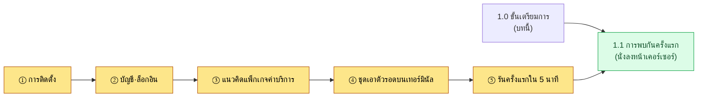
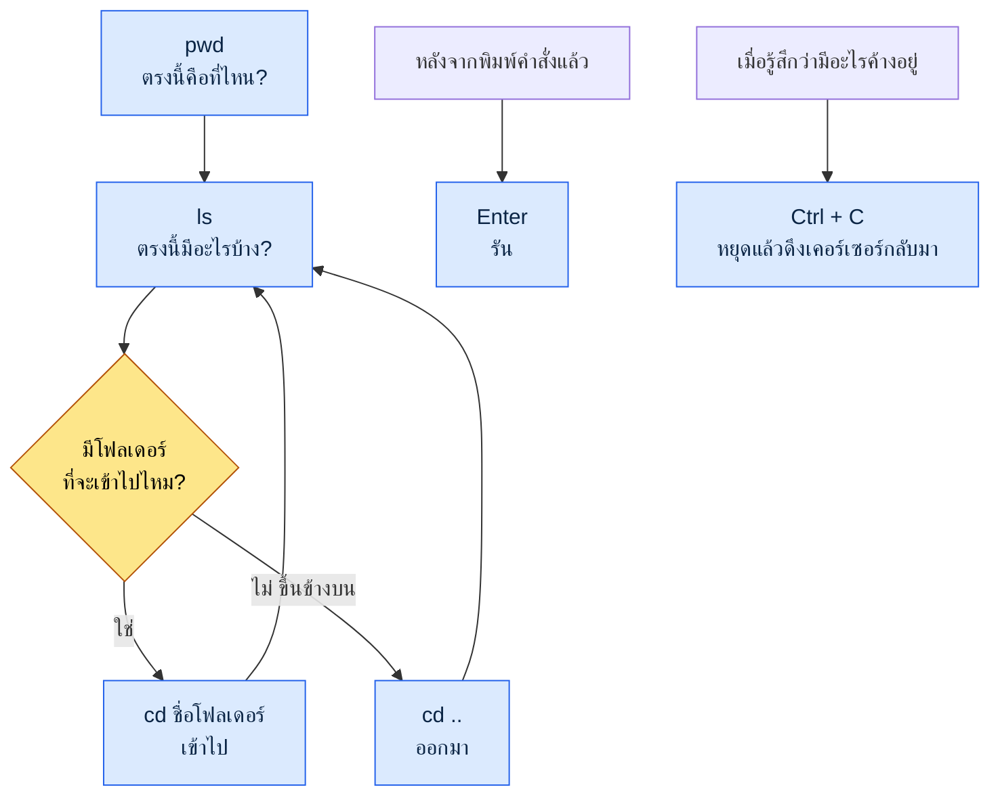
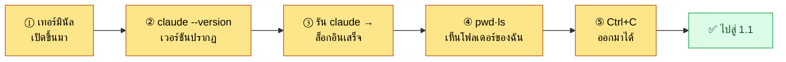

# 1.0 ก่อนเริ่มต้น — การติดตั้ง บัญชี ค่าบริการ และชุดเอาตัวรอดบนเทอร์มินัล

หัวข้อ 1.1 คือ "การพบกันครั้งแรก" เป็นช่วงที่คุณนั่งอยู่หน้าเคอร์เซอร์ที่กะพริบและลองพิมพ์อะไรบางอย่าง แต่ก่อนจะนั่งลงตรงนั้นได้ มีสิ่งที่ต้องเตรียมพร้อมก่อน เครื่องมือต้องติดตั้งไว้แล้ว ต้องล็อกอินไว้แล้ว ต้องพอเข้าใจคร่าว ๆ ว่าค่าบริการคิดอย่างไร และต้องพิมพ์ตัวอักษรสักสองสามตัวบนหน้าจอดำได้ บทนี้จึงอยู่ก่อนหน้า 1.1 หนึ่งขั้น

หนังสือสำหรับผู้เริ่มต้นจำนวนมากข้ามขั้นตอนนี้ไป เขียนแค่บรรทัดเดียวว่า "เปิดเทอร์มินัล" แล้วผ่านเลยไป แต่ผู้เริ่มต้นกลับติดอยู่ที่บรรทัดนั้นเอง เทอร์มินัลอยู่ตรงไหน ต้องติดตั้งอะไร ถ้าติดตั้งแล้วเจอตัวอักษรสีแดงต้องทำอย่างไร — คนที่หยุดอยู่ที่บรรทัดแรกไปไม่ถึง 1.1 เป้าหมายของบทนี้มีเพียงข้อเดียว คือทำให้คุณไม่ติดอยู่ที่บรรทัดแรก

บทนี้แบ่งออกเป็นห้าส่วน ได้แก่ การติดตั้ง บัญชีและการล็อกอิน แนวคิดเรื่องแพ็กเกจค่าบริการ ชุดเอาตัวรอดบนเทอร์มินัล และเช็กลิสต์ "รันครั้งแรกใน 5 นาที" หากทำตามไปทีละขั้น คุณก็จะพร้อมนั่งลงตรงที่หัวข้อ 1.1 รออยู่



---

## 1.0.1 การติดตั้ง — หนึ่งบรรทัดต่อหนึ่ง OS

หลักการของการติดตั้งคือทำตามคำแนะนำอย่างเป็นทางการ เครื่องมือเปลี่ยนแปลงบ่อย และไฟล์ติดตั้งที่ได้มาจากแหล่งที่ไม่เป็นทางการนั้นอันตราย ด้วยเหตุนี้หนังสือเล่มนี้จึงไม่ได้ใส่ลิงก์ดาวน์โหลดไว้ แต่จะแนะนำวิธีค้นหาเส้นทางอย่างเป็นทางการแทน หากพิมพ์ "Claude Code เอกสารทางการ" หรือ "Claude Code install" ในช่องค้นหา หน้าเอกสารทางการของบริษัท Anthropic จะปรากฏขึ้นมาเป็นอันดับแรก การใช้คำสั่งติดตั้งจากหน้านั้นตามที่ระบุไว้คือวิธีที่ปลอดภัยที่สุด

ควรเข้าใจภาพรวมไว้ด้วย Claude Code (หนังสือเล่มนี้ใช้การสะกดแบบอักษรละตินเป็นมาตรฐาน) เป็นเครื่องมือที่ทำงานบนเทอร์มินัล และโดยทั่วไปติดตั้งด้วยคำสั่งบรรทัดเดียว ขั้นตอนจะต่างกันเล็กน้อยตามแต่ละ OS

| OS | สิ่งที่ต้องเตรียม | ขั้นตอนการติดตั้ง (แนวคิด) |
|---|---|---|
| Windows | PowerShell (มีมาให้ในตัว) | วางคำสั่งติดตั้งหนึ่งบรรทัดจากเอกสารทางการลงใน PowerShell |
| macOS | เทอร์มินัล (มีมาให้ในตัว) | วางคำสั่งติดตั้งหนึ่งบรรทัดจากเอกสารทางการลงในเทอร์มินัล |
| Linux | เทอร์มินัล | วางคำสั่งติดตั้งหนึ่งบรรทัดจากเอกสารทางการลงในเทอร์มินัล |

ทั้งสาม OS มีขั้นตอนเหมือนกัน คือ "เปิดเทอร์มินัล → วางคำสั่งหนึ่งบรรทัดจากเอกสารทางการ → กด Enter" ไม่จำเป็นต้องท่องจำคำสั่ง การคัดลอกจากเอกสารทางการแล้ววางคือวิธีมาตรฐาน

แม้ระหว่างติดตั้งจะมีตัวอักษรสีแดง (ข้อผิดพลาด) ปรากฏขึ้นก็ไม่ต้องตกใจ ข้อผิดพลาดในการติดตั้งที่ผู้เริ่มต้นพบมักเป็นหนึ่งในสองอย่าง คือปัญหาเรื่องสิทธิ์ หรือกรณีที่ไม่มีเครื่องมือพื้นฐาน (เช่น รันไทม์อย่าง Node.js) หากมีตัวอักษรสีแดงปรากฏขึ้น ให้คัดลอกทั้งประโยคนั้นตามเดิมเพื่อไปค้นหา หรือถาม AI ก็มักจะแก้ได้เกือบทุกครั้ง ข้อความข้อผิดพลาดไม่ใช่ศัตรู แต่เป็นเบาะแส

> วิธีตรวจสอบว่าติดตั้งสำเร็จหรือไม่: พิมพ์ `claude --version` ในเทอร์มินัลแล้วกด Enter ถ้าหมายเลขเวอร์ชันปรากฏขึ้นมาหนึ่งบรรทัด แสดงว่าติดตั้งสำเร็จ หากมีข้อความทำนองว่า "ไม่พบคำสั่ง" ปรากฏขึ้น แสดงว่ายังติดตั้งไม่เสร็จ หรือเป็นกรณีที่ต้องเปิดเทอร์มินัลใหม่ ลองปิดเทอร์มินัลให้สนิทแล้วเปิดขึ้นมาใหม่ จากนั้นตรวจสอบอีกครั้ง

---

## 1.0.2 บัญชีและการล็อกอิน

ติดตั้งเสร็จแล้วไม่ได้แปลว่าใช้งานได้ทันที Claude Code เป็นเครื่องมือที่ยืมโมเดล AI ของ Anthropic มาใช้ จึงต้องมีขั้นตอนล็อกอินเพื่อยืนยันว่าใครเป็นผู้ใช้

ขั้นตอนนั้นเรียบง่าย เมื่อรัน `claude` ในเทอร์มินัลเป็นครั้งแรก คำแนะนำการล็อกอินจะปรากฏขึ้น โดยทั่วไปเว็บเบราว์เซอร์จะเปิดขึ้นมาเองโดยอัตโนมัติ จากนั้นล็อกอินด้วยบัญชี Anthropic ตรงนั้น (หากไม่มี ก็สามารถสร้างใหม่ได้จากหน้าจอนั้น) เมื่อล็อกอินเสร็จ เบราว์เซอร์จะแสดงคำแนะนำทำนองว่า "ตอนนี้กลับไปที่เทอร์มินัลได้แล้ว" และฝั่งเทอร์มินัลเองก็จะแสดงเครื่องหมายว่าเสร็จสมบูรณ์

ตรงนี้มีอยู่สองจุดที่ผู้เริ่มต้นมักจะติด

จุดแรก คือกรณีที่เบราว์เซอร์ไม่เปิดขึ้นมาเองโดยอัตโนมัติ ในกรณีนี้จะมีที่อยู่ยาว ๆ (URL) ปรากฏขึ้นหนึ่งบรรทัดในเทอร์มินัล ให้คัดลอกที่อยู่นั้นไปวางในช่องที่อยู่ของเบราว์เซอร์แล้วเข้าไป ไม่ได้ตันแต่อย่างใด เพียงแค่ต้องทำด้วยตัวเองเพิ่มอีกขั้นเดียวเท่านั้น

จุดที่สอง คือกรณีที่สับสนเรื่องประเภทบัญชี การเชื่อมโยงระหว่างบัญชีที่เคยใช้กับเว็บแชต (Claude.ai) กับบัญชีและค่าบริการของ Claude Code นั้นอาจมีนโยบายต่างกันไปในแต่ละช่วงเวลา การทำตามคำแนะนำบนหน้าจอล็อกอินและเอกสารทางการคือวิธีที่ถูกต้องที่สุด หากทำตามที่หน้าจอการรันครั้งแรกบอก ส่วนใหญ่ก็จะล็อกอินได้โดยไม่มีปัญหา

ล็อกอินครั้งเดียวแล้วจะคงอยู่บนเครื่องนั้น ไม่จำเป็นต้องทำใหม่ทุกครั้ง

---

## 1.0.3 แนวคิดเรื่องแพ็กเกจค่าบริการ — สมาชิกรายเดือนแบบเหมาจ่าย vs API แบบจ่ายตามการใช้

สิ่งที่ผู้เริ่มต้นกังวลมากที่สุดคือ "จะเสียเงินเท่าไหร่กันแน่" มีความกลัวคลุมเครืออยู่ว่าทุกครั้งที่พิมพ์ตัวอักษรจะมีค่าบริการเพิ่มขึ้นหรือเปล่า หากจับภาพรวมได้ก่อน ความกังวลนี้ก็จะลดลง รูปแบบค่าบริการแบ่งใหญ่ ๆ ออกเป็นสองแนวทาง

| รูปแบบ | ลักษณะการคิดเงิน | การเปรียบเทียบ | เหมาะกับใคร |
|---|---|---|---|
| สมาชิกรายเดือนแบบเหมาจ่าย | จำนวนเงินคงที่ต่อเดือน | แพ็กเกจเหมาจ่ายค่าโทรศัพท์ | ผู้เริ่มต้น·การใช้งานทั่วไป |
| API แบบจ่ายตามการใช้ | จ่ายตามที่ใช้ (หน่วยเป็นโทเค็น) | มิเตอร์ไฟฟ้า | งานปริมาณมาก·ระบบอัตโนมัติ·การเชื่อมต่อสำหรับนักพัฒนา |

**สมาชิกรายเดือนแบบเหมาจ่าย** คือรูปแบบที่จ่ายเงินตามจำนวนที่กำหนดไว้เป็นรายเดือนแล้วใช้ได้จนถึงเพดานที่กำหนด คล้ายกับแพ็กเกจเหมาจ่ายค่ามือถือ เพราะจ่ายเท่ากันทุกเดือนจึงคาดการณ์ง่าย และไม่ต้องคอยกังวลว่า "พิมพ์หนึ่งบรรทัดแล้วเสียเท่าไหร่" ด้วยเหตุนี้ผู้เริ่มต้นจึงมักจะเริ่มต้นด้วยสมาชิกรายเดือนแบบเหมาจ่ายเพื่อความสบายใจ (การประมาณของผู้เขียน (ยังไม่ได้ตรวจสอบ) — เนื่องจากองค์ประกอบของแพ็กเกจและเพดานที่แน่นอนเปลี่ยนแปลงไปตามแต่ละช่วงเวลา จึงควรตรวจสอบที่หน้าค่าบริการอย่างเป็นทางการ) หากใช้เกินเพดาน ก็รอจนถึงรอบบิลถัดไป หรืออัปเกรดไปเป็นแพ็กเกจระดับสูงกว่า

**API แบบจ่ายตามการใช้** คือรูปแบบที่คิดเงินตามสัดส่วนของปริมาณที่ใช้จริง (โทเค็น) เหมือนมิเตอร์ไฟฟ้าที่เรียกเก็บตามที่ใช้ไป เหมาะกับการประมวลผลปริมาณมาก ระบบอัตโนมัติ (pipeline) หรือกรณีที่เชื่อมต่อกับโปรแกรมอื่น หากใช้อย่างพิถีพิถันก็มีประสิทธิภาพ แต่ในขั้นเริ่มต้น การคาดการณ์ค่าใช้จ่ายอาจทำได้ยากจนกว่าจะจับทางปริมาณการใช้ได้

โทเค็นคืออะไรและทำไมจึงคิดเงินด้วยมัน จะกล่าวถึงอย่างละเอียดในหัวข้อ 1.2 (โมเดล AI·โทเค็น·ฮาร์เนส) ตรงนี้ขอให้จำไว้เพียงข้อเดียว **ผู้เริ่มต้นมักจะเริ่มต้นด้วยสมาชิกรายเดือนแบบเหมาจ่าย** เพราะจำนวนเงินคงที่ทุกเดือน จึงฝึกฝนได้โดยไม่ต้องกลัวว่า "ใช้ไปแล้วจะโดนบิลก้อนโต" ชื่อแพ็กเกจ ราคา และเพดานเปลี่ยนแปลงบ่อย หนังสือเล่มนี้จึงไม่ได้ใส่ตัวเลขเฉพาะเจาะจงไว้ เนื้อหาของหนังสือเล่มนี้เขียนขึ้นโดยอ้างอิงช่วงกลางปี 2026 และแพ็กเกจค่าบริการ โมเดล รวมถึงฟีเจอร์ต่าง ๆ ก็ยังคงเปลี่ยนแปลงต่อไปหลังจากนั้น การตรวจสอบค่าปัจจุบันที่หน้าค่าบริการอย่างเป็นทางการคือวิธีที่ถูกต้องที่สุด

> สรุปหนึ่งบรรทัด: ความกลัวว่าทุกครั้งที่ใช้จะเสียเงินหรือเปล่า → ถ้าเป็นสมาชิกรายเดือนแบบเหมาจ่ายก็คงที่ทุกเดือน ผู้เริ่มต้นเริ่มด้วยแบบเหมาจ่ายจะสบายใจกว่า

---

## 1.0.4 ชุดเอาตัวรอดบนเทอร์มินัล — ลดความกลัวหน้าจอดำ

ทีนี้มาถึงกำแพงที่ใหญ่ที่สุด นั่นคือหน้าจอดำ เหตุผลที่หัวข้อ 1.1 เริ่มต้นด้วย "ลังเลอยู่หน้าเคอร์เซอร์ที่กะพริบ" ก็อยู่ตรงนี้ สำหรับมือที่ทำงานกับ GUI มา 24 ปี เทอร์มินัลเป็นสิ่งแปลกหน้า แต่คำสั่งที่จำเป็นเพื่อไม่ให้ติดอยู่ที่บรรทัดแรกนั้นมีไม่มากนัก หกคำสั่งด้านล่างนี้ก็เพียงพอแล้ว

| คำสั่ง | วิธีอ่าน | หน้าที่ | การเปรียบเทียบ |
|---|---|---|---|
| `pwd` | พีดับเบิลยูดี | แสดงว่าตอนนี้ฉันอยู่ในโฟลเดอร์ไหน | "ตรงนี้คือที่ไหน?" |
| `ls` | แอลเอส | รายการสิ่งที่อยู่ในโฟลเดอร์ตอนนี้ | เปิดหน้าต่างโฟลเดอร์ดู |
| `cd ชื่อโฟลเดอร์` | ซีดี | เข้าไปในโฟลเดอร์นั้น | ดับเบิลคลิกโฟลเดอร์ |
| `cd ..` | ซีดีจุดจุด | ออกขึ้นไปยังโฟลเดอร์ระดับบนหนึ่งขั้น | ย้อนกลับ |
| `Enter` | เอนเทอร์ | รันคำสั่งที่พิมพ์ไป | ปุ่มยืนยัน |
| `Ctrl + C` | คอนโทรลซี | หยุดสิ่งที่กำลังทำงานอยู่ตอนนี้ | ปุ่มหยุด |

(บน Windows PowerShell ก็ใช้ `ls`·`cd`·`pwd` ได้ตามนี้ macOS·Linux ก็เหมือนกัน ดังนั้นหกคำสั่งนี้จึงใช้ได้ไม่ว่าจะ OS ใด)

หากดูสิ่งที่หกคำสั่งนี้ทำเป็นภาพ ก็จะเป็นแบบนี้ การเคลื่อนที่บนเทอร์มินัลสุดท้ายแล้วก็คือการเข้า ๆ ออก ๆ ในและนอกโฟลเดอร์ ซึ่งเป็นการกระทำแบบเดียวกับการดับเบิลคลิกโฟลเดอร์หรือการย้อนกลับใน GUI



เหตุผลที่แท้จริงที่หน้าจอดำน่ากลัวคือความรู้สึกว่า "ถ้าพิมพ์ผิดแล้วมันจะพังเสียหาย" แต่ในหกคำสั่งข้างต้นไม่มีคำสั่งใดที่ทำให้อะไรพังเสียหายได้ `pwd`·`ls`·`cd` แค่ดูหรือย้ายที่เท่านั้น ไม่ได้ลบหรือเปลี่ยนแปลงไฟล์ `Enter` คือการรัน `Ctrl + C` ก็เป็นเพียงการหยุด ดังนั้นหกคำสั่งนี้พิมพ์ได้อย่างสบายใจเมื่อไหร่ก็ได้

มีบางครั้งที่หน้าจอดูเหมือนค้างอยู่ คือเมื่อพิมพ์คำสั่งไปแล้วไม่มีอะไรตอบสนองอยู่นาน หรือเคอร์เซอร์กะพริบอยู่ที่อีกบรรทัดหนึ่งราวกับกำลังรออะไรเพิ่มเติม ในกรณีเช่นนั้น หากกด `Ctrl + C` หนึ่งครั้ง ส่วนใหญ่ก็จะกลับมาที่เคอร์เซอร์เดิม เพียงแค่รู้ว่ามี "ปุ่มหยุด" นี้อยู่ หน้าจอดำก็ดูน่ากลัวน้อยลงมาก ถ้าติดก็ใช้ `Ctrl + C` ออกมาแล้วเริ่มใหม่ก็ได้

สุดท้าย เมื่อตัวอักษรที่พิมพ์ไปกองพะเนินจนตาลาย ก็สามารถล้างหน้าจอได้ ทั้ง Windows PowerShell·macOS·Linux ล้างด้วยคำสั่ง `clear` ทั้งหมด แม้จะล้างไปแล้ว สิ่งที่ทำไปก็ไม่ได้หายไป เพียงแต่ตัวอักษรที่มองเห็นถูกจัดให้เรียบร้อยเท่านั้น

---

## 1.0.5 เช็กลิสต์ "รันครั้งแรกใน 5 นาที"

หากมาถึงตรงนี้ การเตรียมการก็เสร็จสิ้นแล้ว หากผ่านห้าช่องด้านล่างนี้ได้ภายใน 5 นาที ก็แสดงว่าคุณมีคุณสมบัติพอจะนั่งลงตรงที่หัวข้อ 1.1 หากติดแม้แต่ช่องเดียว ก็ย้อนกลับไปยังหัวข้อนั้น (1.0.1\~1.0.4) ได้



- [ ] ① เปิดเทอร์มินัลได้ (Windows: PowerShell / macOS: เทอร์มินัล)
- [ ] ② พิมพ์ `claude --version` แล้วหมายเลขเวอร์ชันปรากฏขึ้นมาหนึ่งบรรทัด (ยืนยันการติดตั้ง)
- [ ] ③ รัน `claude` แล้วล็อกอินไว้แล้ว (หรือล็อกอินเสร็จตามคำแนะนำ)
- [ ] ④ ดูตำแหน่งปัจจุบันด้วย `pwd` และดูเนื้อหาในโฟลเดอร์ด้วย `ls` ได้
- [ ] ⑤ เมื่อมีอะไรค้าง ออกมาได้ด้วย `Ctrl + C`

หากเติมครบทั้งห้าช่อง หน้าจอดำก็ไม่ใช่กำแพงลึกลับอีกต่อไป เครื่องมือติดตั้งไว้แล้ว ล็อกอินไว้แล้ว รู้ภาพรวมของรูปแบบค่าบริการ และรู้วิธีเคลื่อนที่กับหยุดภายในหน้าจอ หัวข้อ 1.1 เริ่มต้นบนพื้นฐานของการเตรียมการนี้ ก็ไปยังที่ตรงนั้น ตรงที่นั่งลงหน้าเคอร์เซอร์ที่กะพริบแล้วลองพิมพ์ "สรุปให้หน่อยว่าในโฟลเดอร์นี้มีอะไรบ้าง" เป็นครั้งแรกได้เลย

---

## 1.0.6 Python·pip — หากต้องรันเครื่องมือ (เฉพาะเมื่อจำเป็น)

ส่วนต้นของหนังสือเล่มนี้ (ส่วนที่ 1·2) สามารถทำตามได้ด้วยพรอมต์ภาษาธรรมชาติเพียงอย่างเดียว เพียงแต่บางบทตั้งแต่ส่วนที่ 4 เป็นต้นไปจะรันสคริปต์ Python เล็ก ๆ ด้วยตัวเอง (เช่น `pip install pyyaml`, `pip install pyvis`) ถึงจะเพิ่งเริ่มใช้ Python ก็ไม่เป็นไร มีอยู่สองเส้นทาง


เส้นทางแรก **เส้นทางติดตั้งเอง** ดาวน์โหลด Python จาก python.org มาติดตั้ง (อย่าลืมเลือก "Add to PATH" ในหน้าจอติดตั้ง) แล้วตรวจสอบด้วย `python --version` ในเทอร์มินัล `pip` เป็นเครื่องมือติดตั้งแพ็กเกจที่ติดตั้งมาพร้อมกับ Python ดังนั้นจึงรับแพ็กเกจที่ต้องการได้ในบรรทัดเดียวอย่าง `pip install pyyaml`

เส้นทางที่สอง **เส้นทางมอบหมายให้ AI (แนะนำ)** เส้นทางที่ง่ายกว่าคือสั่งให้ AI สร้างสภาพแวดล้อมให้เอง เพียงร้องขอในเทอร์มินัลแบบนี้

```
ตรวจสอบว่ามี Python ติดตั้งอยู่หรือไม่ ถ้าไม่มี ช่วยบอกวิธีติดตั้งที่เหมาะกับ OS ของฉัน
และช่วยให้คำสั่งติดตั้งแพ็กเกจ pyyaml ที่จำเป็นในบทนี้มาเป็นหนึ่งบรรทัด
```

AI จะตรวจสภาพแวดล้อมของคุณและสร้างคำสั่งติดตั้งให้ หากติด ก็วางข้อความข้อผิดพลาดตรงนั้นตามที่เป็นแล้วถามว่า "ข้อผิดพลาดนี้แก้อย่างไร" ได้เลย ในทุกบทที่ต้องรันเครื่องมือ แพตเทิร์นนี้เพียงอย่างเดียวก็เพียงพอ ในขั้นที่ Python·pip เป็นภาระ "ฉบับย่อสำหรับคนเดียว" ของบทนั้นจะแนะนำเส้นทางที่เบากว่าซึ่งไปได้โดยไม่ต้องใช้โค้ด

---

### ตัวอย่างบทถัดไป
- 1.1 การพบกันครั้งแรกของนักออกแบบเกมกับ Claude Code — นั่งลงหน้าเคอร์เซอร์แล้วประคองตัวให้ผ่าน 30 นาทีแรก

---

## ลองทำดู

**setup**
1. เปิดเทอร์มินัลของ OS ที่คุณใช้อยู่ (Windows: PowerShell, macOS: เทอร์มินัล)
2. ค้นหา "Claude Code เอกสารทางการ" แล้วเปิดหน้าคำแนะนำการติดตั้งอย่างเป็นทางการค้างไว้
3. ตั้งเวลา 5 นาที — เป้าหมายคือการผ่านทั้งห้าช่องของเช็กลิสต์ 1.0.5

**prompt** (ลองพิมพ์ทีละบรรทัดตามลำดับ นี่เป็นคำสั่ง ไม่ใช่คำถามภาษาธรรมชาติ)
```
① claude --version      # ถ้าเวอร์ชันปรากฏ แสดงว่าติดตั้งสำเร็จ
② pwd                   # ตอนนี้ฉันอยู่ในโฟลเดอร์ไหน
③ ls                    # ในโฟลเดอร์นี้มีอะไรบ้าง
④ cd ..                 # ออกขึ้นไปข้างบนหนึ่งขั้น (แล้ว ls อีกครั้ง)
⑤ claude                # รัน Claude Code (ถ้าคำแนะนำการล็อกอินปรากฏ ก็ทำตาม)
```

**verify**
- หากในข้อ ① หมายเลขเวอร์ชันปรากฏขึ้นมาหนึ่งบรรทัด แสดงว่าการติดตั้งเสร็จสิ้นแล้ว หากปรากฏข้อความ "ไม่พบคำสั่ง" ให้ปิดเทอร์มินัลแล้วเปิดใหม่ จากนั้นลองอีกครั้ง
- ระหว่างที่ดูและย้ายโฟลเดอร์ด้วยข้อ ②·③·④ ให้ลองยืนยันด้วยตัวเองว่าไม่มีอะไรพังเสียหาย ทั้งสามนี้เป็นคำสั่งที่ปลอดภัยซึ่งแค่ดูและย้ายที่เท่านั้น
- หากระหว่างรันข้อ ⑤ ดูเหมือนค้าง ให้ออกมาด้วย `Ctrl + C` หากออกมาได้ ก็แสดงว่าคุณได้ยืนยันด้วยตัวเองแล้วว่า "มีปุ่มหยุดอยู่"

### ฉบับย่อสำหรับคนเดียว

หากคุณเป็นบุคคลที่ไม่มีทั้งทีมและไม่มีโฟลเดอร์บริษัท ขอให้ฝึกแค่การติดตั้ง (①) และการออกมาด้วย `Ctrl + C` ก่อน หากยืนยัน "เครื่องมือติดตั้งแล้ว" ด้วย `claude --version` และยืนยัน "ติดแล้วก็ออกมาได้" ด้วย `Ctrl + C` ความกลัวหน้าจอดำครึ่งหนึ่งก็จัดการได้ภายใน 5 นาทีแม้อยู่คนเดียว ส่วนค่าบริการ หากเริ่มต้นด้วยสมาชิกรายเดือนแบบเหมาจ่ายไปก่อน ก็จะฝึกฝนได้อย่างเต็มที่โดยไม่ต้องกังวลเรื่องค่าใช้จ่าย
