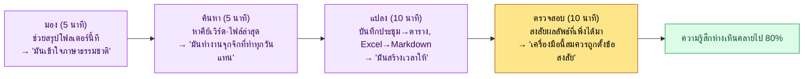

# 1.1 การพบกันครั้งแรกระหว่างนักออกแบบเกมกับ Claude Code

หน้าจอสีดำปรากฏขึ้น เคอร์เซอร์กะพริบอยู่ ตรงหน้าจอนั้นมีนักออกแบบเกมประสบการณ์ 24 ปีนั่งอยู่ มือที่ทำงานมา 24 ปีด้วย PPT และ Excel ด้วยวิกิและ Figma หยุดนิ่งอยู่ครู่หนึ่งเหนือแป้นพิมพ์ มันชวนให้นึกถึง DOS ในยุคที่ยังมีโรงเรียนสอนคอมพิวเตอร์อยู่ หลังจากนั้นสิ่งที่เรียกว่าเทอร์มินัลก็เป็นของที่เห็นได้แต่บนโต๊ะของโปรแกรมเมอร์เท่านั้น ไม่รู้ว่าต้องพิมพ์อะไร และรู้สึกว่าถ้าพิมพ์ผิดแล้วอะไรบางอย่างจะพังไป ความลังเลตรงจุดนี้คือจุดเริ่มต้นของหนังสือเล่มนี้

คนส่วนใหญ่ปิดหน้าต่างไปตรงนี้ แล้วก็กลับมาพูดซ้ำในที่ประชุมว่า "พวกเราก็น่าจะต้องลองทำอะไรสักอย่างนะ" บทนี้จะนั่งลงข้าง ๆ ในตำแหน่งที่ไม่ปิดหน้าต่างนั้นและอดทนผ่าน 30 นาทีแรกไปด้วยกัน เป้าหมายไม่ใช่กลยุทธ์การนำเข้ามาใช้อันยิ่งใหญ่ แต่เป็นการยื่นใส่มือว่า เมื่ออยู่หน้าเคอร์เซอร์ที่กะพริบ ลองพิมพ์อะไรลงไปแล้วความรู้สึกห่างเหินจึงจะคลายลง

---

เมื่อนักออกแบบเกมนั่งลงต่อหน้าเครื่องมือเขียนโค้ดด้วย AI อย่าง Claude Code เป็นครั้งแรก ความรู้สึกแปลกใหม่และความรู้สึกอึดอัดเกิดขึ้นพร้อมกัน ณ ที่เดียวกัน ข้อเท็จจริงที่ว่าอารมณ์สองอย่างนี้ปะทะกันเองนั้นคือเบาะแสแรกของการนำเข้ามาใช้

เหตุผลที่รู้สึกแปลกใหม่นั้นชัดเจน การตรวจสอบความสอดคล้องของชีตข้อมูลที่เคยกินเวลาครึ่งวันจบลงในไม่กี่นาที บันทึกการประชุมที่ยืดยาวถูกสรุปเป็นตารางสิ่งที่ตัดสินใจ และเอกสารออกแบบที่ฝังหายไปเมื่อปีก่อนสามารถดึงกลับขึ้นมาได้อีกครั้งด้วยภาษาธรรมชาติเพียงบรรทัดเดียว

เหตุผลที่รู้สึกอึดอัดก็ชัดเจนไม่แพ้กัน หน้าจอสีดำ เคอร์เซอร์ที่กะพริบ และคำสั่งภาษาอังกฤษนั้นต่างจากภาพการทำงานในชีวิตประจำวันมากเกินไป วันหนึ่งของนักออกแบบเกมไหลไปบน GUI แต่การพิมพ์ตัวอักษรลงบนเทอร์มินัลสีดำกลับเข้ากันไม่ค่อยได้กับอัตลักษณ์ของอาชีพ เพียงแต่ความอึดอัดนี้ไม่ใช่ข้อบกพร่องของเครื่องมือ แต่เป็นต้นทุนการปรับตัวของคนที่คุ้นเคยกับ GUI เพียงยอมรับจุดนี้ ความรู้สึกห่างเหินก็คลายลงไปครึ่งหนึ่งแล้ว

หนังสือเล่มนี้เป็นหนังสือที่พยายามลดความรู้สึกห่างเหินนั้น หัวข้อ 1.1 จะนั่งลงด้วยกันในตำแหน่งของการพบกันครั้งแรก แล้วเรียบเรียงว่าควรมองอะไร ควรลองทำอะไร และอะไรที่เลื่อนไว้ก่อนได้

---

## 1.1.1 ทำไมต้องเป็นตอนนี้ ทำไมนักออกแบบเกมจึงต้องใช้ AI

การออกแบบเกมเข้าร่วมกระแส AI ช้ากว่าอาชีพอื่น คนที่ทำงานกับโค้ดเข้าก่อน ตามด้วยนักออกแบบและศิลปิน นักออกแบบเกมมักมีรูปแบบที่ผัดผ่อนไปเรื่อย ๆ พร้อมพูดซ้ำว่า "พวกเราก็น่าจะต้องลองทำอะไรสักอย่างนะ"

เหตุผลที่ผัดผ่อนนั้นมีเหตุมีผล ผลงานของนักออกแบบเกมไม่ได้ถูกจัดรูปแบบตายตัวเหมือนโค้ด แต่ปะปนกันทั้งข้อความ ตาราง ไดอะแกรม การประชุม และข้อตกลงด้วยวาจา ความน่าเชื่อถือของผลลัพธ์ AI ดูต่ำ การโกหกที่ฟังดูสมเหตุสมผลนั้นอันตราย และยังน่าสงสัยด้วยว่า AI เข้าใจระบบเกมจริง ๆ หรือไม่

แต่ระหว่างปี 2024 ถึง 2026 มีสามสิ่งที่เปลี่ยนไป

ประการแรก ความสามารถในการให้เหตุผลของโมเดล AI ก้าวข้ามจุดวิกฤต มันก้าวข้ามการสร้างประโยคง่าย ๆ ไปจัดการกับการออกแบบระบบที่ซับซ้อน การตรวจสอบความสอดคล้อง และการวิเคราะห์ผลกระทบ Claude รุ่นล่าสุดช่วยสนับสนุนเวิร์กโฟลว์การออกแบบเกมได้เป็นส่วนใหญ่ เพียงแต่ไม่ได้หมายความว่ามอบหมายทั้งหมดให้ได้ การตรวจสอบและความรับผิดชอบยังคงเป็นหน้าที่ของมนุษย์ (ขอบเขตที่ช่วยได้แตกต่างกันมากตามชนิดของงานและความสมบูรณ์ของทีม — การประมาณของผู้เขียน ยังไม่ได้ตรวจสอบ)

ประการที่สอง ฮาร์เนส (harness) สมบูรณ์ขึ้น เครื่องมืออย่าง Claude Code ไม่ใช่แค่แชตธรรมดา มันอ่านและเขียนไฟล์ได้โดยตรง รันคำสั่งได้ และรับผลลัพธ์กลับมาเป็นอินพุตอีกครั้ง คล้ายกับวิธีที่มนุษย์ทำงาน

ประการที่สาม เทคนิคการใช้งานอย่างเมโมรี atom และ skill ลงตัวแล้ว ไม่ใช่การใช้ AI ครั้งเดียวแล้วจบ แต่เป็นการสะสมความรู้ของทีมเพื่อทำให้ฉลาดขึ้นเรื่อย ๆ เมื่อเวลาผ่านไป ซึ่งระเบียบวิธีนี้ได้ลงหลักปักฐานแล้ว แก่นที่ส่วนหลังของหนังสือเล่มนี้กล่าวถึงก็คือการสะสมนี้เอง

เมื่อสามสิ่งนี้มารวมกัน การนำ AI เข้ามาใช้ก็กลายเป็นจังหวะที่สมเหตุสมผลแม้แต่สำหรับนักออกแบบเกม การเริ่มก่อนสายเกินไปย่อมได้เปรียบ

---

## 1.1.2 Claude Code คืออะไร — ความแตกต่างจากเครื่องมืออื่น

เครื่องมือ AI ที่นักออกแบบเกมมักพบเจอมีอยู่สองชนิด ได้แก่ ชนิดแชตบอตที่โยนคำถามลงในช่องแชต (ChatGPT, เว็บแอป Claude) และชนิดผนวกกับเอดิเตอร์ที่ทำการเติมข้อความอัตโนมัติภายในโค้ดเอดิเตอร์ (Cursor, Copilot)

Claude Code เป็นชนิดที่สาม มันทำงานบน CLI (เทอร์มินัล) และเข้าถึงสภาพแวดล้อมการทำงานทั้งหมดของมนุษย์ หากมองเป็นภาพเดียวว่าทั้งสามชนิดแยกกันตรงไหน จะได้ดังนี้

<svg viewBox="0 0 720 300" xmlns="http://www.w3.org/2000/svg" font-family="sans-serif" font-size="13">
  <rect x="0" y="0" width="720" height="300" fill="#fafafa" stroke="#ddd"/>
  <!-- column headers -->
  <rect x="200" y="10" width="160" height="34" fill="#eef2f7" stroke="#bbb"/>
  <text x="280" y="32" text-anchor="middle" font-weight="bold">ชนิดแชตบอต</text>
  <rect x="360" y="10" width="160" height="34" fill="#eef2f7" stroke="#bbb"/>
  <text x="440" y="32" text-anchor="middle" font-weight="bold">ชนิดผนวกเอดิเตอร์</text>
  <rect x="520" y="10" width="180" height="34" fill="#e8f0e6" stroke="#9bbf8f"/>
  <text x="610" y="32" text-anchor="middle" font-weight="bold">Claude Code</text>
  <!-- rows -->
  <text x="10" y="68" font-weight="bold">ตำแหน่งอินพุต</text>
  <text x="280" y="68" text-anchor="middle">ช่องแชตบนเว็บ</text>
  <text x="440" y="68" text-anchor="middle">โค้ดเอดิเตอร์</text>
  <text x="610" y="68" text-anchor="middle" font-weight="bold">เทอร์มินัล</text>
  <line x1="10" y1="80" x2="700" y2="80" stroke="#e0e0e0"/>
  <text x="10" y="108" font-weight="bold">การเข้าถึงไฟล์</text>
  <text x="280" y="108" text-anchor="middle">ต้องอัปโหลด</text>
  <text x="440" y="108" text-anchor="middle">ไฟล์ที่เปิดอยู่</text>
  <text x="610" y="108" text-anchor="middle" font-weight="bold">ทั้งโปรเจกต์</text>
  <line x1="10" y1="120" x2="700" y2="120" stroke="#e0e0e0"/>
  <text x="10" y="148" font-weight="bold">การรันคำสั่ง</text>
  <text x="280" y="148" text-anchor="middle">ทำไม่ได้</text>
  <text x="440" y="148" text-anchor="middle">ทำได้บางส่วน</text>
  <text x="610" y="148" text-anchor="middle" font-weight="bold">อิสระ (ภายในสิทธิ์)</text>
  <line x1="10" y1="160" x2="700" y2="160" stroke="#e0e0e0"/>
  <text x="10" y="188" font-weight="bold">รูปแบบผลลัพธ์</text>
  <text x="280" y="188" text-anchor="middle">ข้อความ</text>
  <text x="440" y="188" text-anchor="middle">ข้อเสนอโค้ด</text>
  <text x="610" y="188" text-anchor="middle" font-weight="bold">การแก้ไขไฟล์·ผลการรัน</text>
  <line x1="10" y1="200" x2="700" y2="200" stroke="#e0e0e0"/>
  <text x="10" y="228" font-weight="bold">ความเหมาะกับงานออกแบบ</text>
  <text x="280" y="228" text-anchor="middle">ต่ำ</text>
  <text x="440" y="228" text-anchor="middle">ต่ำ</text>
  <text x="610" y="228" text-anchor="middle" font-weight="bold" fill="#3a7a2f">สูง</text>
  <line x1="10" y1="240" x2="700" y2="240" stroke="#e0e0e0"/>
  <text x="10" y="270" font-weight="bold">การเปรียบเทียบ</text>
  <text x="280" y="270" text-anchor="middle">เคาน์เตอร์ประชาสัมพันธ์</text>
  <text x="440" y="270" text-anchor="middle">ปากกาเติมข้อความอัตโนมัติ</text>
  <text x="610" y="270" text-anchor="middle" font-weight="bold">เพื่อนร่วมงานข้างโต๊ะ</text>
</svg>

งานของนักออกแบบเกมไม่ใช่โค้ด แต่เป็นเอกสาร ตาราง และความสัมพันธ์ จุดแข็งของ Claude Code คือมันมองเห็น เข้าใจ และจัดการทั้งโฟลเดอร์ที่มนุษย์ทำงานอยู่ ไม่ต้องคัดลอกวางข้อมูลทุกครั้งเหมือนแชตบอต

หากมองด้วยการเปรียบเทียบกับสำนักงาน ชนิดแชตบอตคือเคาน์เตอร์ประชาสัมพันธ์ ถามหนึ่งครั้งตอบหนึ่งครั้ง ข้อมูลต้องหยิบออกมาใหม่ทุกครั้ง ส่วน Claude Code ใกล้เคียงกับเพื่อนร่วมงานข้างโต๊ะ มันรู้ว่าข้อมูลอยู่ที่ไหน เปิดไฟล์ด้วยมือตัวเอง และเรียบเรียงผลลัพธ์วางกลับขึ้นบนโต๊ะ Claude ตัวเดียวกันแต่จะทำอะไรได้ดีนั้นต่างกันไปตามว่าให้นั่งที่โต๊ะไหน

---

## 1.1.3 30 นาทีแรก — จะมองอะไรและจะลองทำอะไร

การติดตั้งและตั้งค่ากล่าวถึงในหัวข้อ 1.0 หัวข้อ 1.1 มุ่งไปที่ว่าใน 30 นาทีแรกควรได้ประสบการณ์อะไรเพื่อให้ความรู้สึกห่างเหินลดลง 30 นาทีแรกแบ่งออกเป็นสี่ช่วง และในแต่ละช่วงความรู้สึกห่างเหินส่วนหนึ่งจะค่อย ๆ หายไปทีละขั้น



### 5 นาทีแรก — มอง

เมื่อเปิดเทอร์มินัลและรัน Claude Code หน้าจอสีดำจะปรากฏขึ้นและเคอร์เซอร์กะพริบ หลายคนหยุดอยู่ตรงนี้ แต่ถ้าหยุดก็จะพลาดโอกาสแรกที่ความรู้สึกห่างเหินจะคลายลง ลองพิมพ์ประโยคภาษาธรรมชาติหนึ่งประโยคลงไป

```
ช่วยสรุปให้หน่อยว่าในโฟลเดอร์นี้มีอะไรบ้าง
```

ไม่ใช่ทั้งโค้ดและไม่ใช่ทั้งคำสั่ง เป็นเพียงประโยคเดียว Claude Code จะสแกนโครงสร้างโฟลเดอร์ แล้วเรียบเรียงตอบว่ามีไฟล์อะไรบ้าง และดูเหมือนเป็นโปรเจกต์ที่จัดการเรื่องอะไร เมื่อพิมพ์บรรทัดเดียวนี้ในโฟลเดอร์ที่บรรจุเอกสารออกแบบ จะได้คำตอบประมาณนี้กลับมา

```text
> ช่วยสรุปให้หน่อยว่าในโฟลเดอร์นี้มีอะไรบ้าง

สแกนโฟลเดอร์นี้แล้ว ดูเหมือนเป็นโฟลเดอร์ทำงานข้อมูลเกมและเอกสารออกแบบ

  ชนิดไฟล์         จำนวน   ประมาณเนื้อหา
  ─────────────   ────    ───────────────────────────
  .xlsm            12     ชีตข้อมูล (ไอเทม·เควสต์·NPC ฯลฯ)
  .md              34     ร่างเอกสารออกแบบ·บันทึกประชุม
  .png             88     ม็อกอัป UI·ภาพอ้างอิง
  โฟลเดอร์ย่อย      6     /data /docs /ref /meeting /export /tmp

ข้อสังเกต:
  - ในโฟลเดอร์ /meeting มีบันทึกประชุมของสัปดาห์ที่ผ่านมา 5 รายการสะสมอยู่
  - item_table.xlsm กับ quest_table.xlsm ดูเหมือนใช้คอลัมน์ ID
    เดียวกันร่วมกัน (เป็นผู้ต้องสงสัย FK)
  - ในโฟลเดอร์ /tmp มีไฟล์ export ชั่วคราวจำนวนมาก — อาจเป็นเป้าหมายที่ควรจัดระเบียบ

จะให้ดูส่วนไหนก่อนดี
```

จากคำตอบครั้งเดียวนี้ ข้อเท็จจริงที่ว่า "เครื่องมือนี้เข้าใจภาษาธรรมชาติ ไม่ใช่คำสั่ง" จะซึมเข้าสู่ร่างกาย ประสบการณ์ที่ได้รับภาพอันเรียบเรียงแล้วว่าอะไรอยู่ที่ไหนโดยไม่ต้องเปิดโฟลเดอร์เองนั้นตัดความรู้สึกห่างเหินลงครึ่งหนึ่ง ณ จุดนั้นทันที

### 5 นาทีต่อมา — ค้นหา

ลองสั่งค้นหาเล็ก ๆ เช่น "บอกไฟล์ Markdown 5 ไฟล์ที่แก้ไขในสัปดาห์ที่ผ่านมาหน่อย" หรือ "ไฟล์ที่มีคำว่า 'รีวอร์ด' อยู่ที่ไหน" งานที่นักออกแบบเกมเคยเปิด Find in Files พิมพ์คีย์เวิร์ดและเลื่อนดูผลลัพธ์ทุกวัน Claude Code รับด้วยภาษาธรรมชาติแล้วเรียบเรียงคืนมาให้ ความรู้สึกที่ว่าเครื่องมือนี้ทำงานจุกจิกที่ทำทุกวันแทนนั้นจะลงตัวในช่วง 5 นาทีที่สอง

### 10 นาทีต่อมา — แปลง

ลองสั่งการแปลงเล็ก ๆ เช่น "ดึงเฉพาะสิ่งที่ตัดสินใจจากบันทึกประชุมนี้แล้วทำเป็นตารางหน่อย" หรือ "เปลี่ยนแถวที่ 1 ถึง 10 ของชีต Excel นี้เป็นตาราง Markdown หน่อย" ประสบการณ์ที่การแปลงซึ่งใช้มือทำ 5 ถึง 10 นาทีถูกจัดการในเวลาสั้น ๆ จะนำไปสู่ความรู้สึกที่ว่าเครื่องมือนี้ไม่ได้แค่ทำการค้นหาแทน แต่สร้างเวลาให้ด้วย

### 10 นาทีสุดท้าย — ตรวจสอบ

เหตุผลที่การหยุดเพียงเท่านี้เป็นอันตรายก็เพราะ AI โกหกอย่างฟังดูสมเหตุสมผล จึงต้องทำให้มันตั้งข้อสงสัยผลลัพธ์ที่เพิ่งสร้างขึ้นเอง

```
ช่วยตรวจอีกครั้งว่าตารางที่เพิ่งทำให้ตรงกับต้นฉบับไหม มีรายการที่ตกหล่นไหม
```

จากนั้น Claude Code จะอ่านต้นฉบับอีกครั้ง เทียบกับผลลัพธ์ของตัวเองทีละบรรทัด แล้วรายงานจุดที่ไม่ตรงกัน ในช่วงนี้มักปรากฏหน้าจอแบบนี้บ่อยครั้ง

```text
> ช่วยตรวจอีกครั้งว่าตารางที่เพิ่งทำให้ตรงกับต้นฉบับไหม มีรายการที่ตกหล่นไหม

เทียบต้นฉบับ (meeting_0603.md) กับตารางที่เพิ่งทำอีกครั้งแล้ว
พบจุดที่ไม่ตรงกัน 3 รายการ

  ⚠ ตกหล่น   "ปรับลดรางวัลทูทอเรียลลง 50%" — มีในแถวที่ 12 ของต้นฉบับแต่ตกหล่นในตาราง
  ⚠ เขียนผิด  ผู้รับผิดชอบ "คิม OO" → ในตารางกรอกผิดเป็น "อี OO"
  ⚠ คลุมเครือ "พิจารณารีวอร์ดใหม่" — ต้นฉบับไม่ชัดเจนว่าตัดสินใจแล้วหรือพักไว้
           ได้ใส่ไว้ใน 'ตัดสินใจแล้ว' ตามดุลยพินิจเอง แต่จำเป็นต้องยืนยัน

จะให้ทำตารางที่แก้ไขแล้วใหม่อีกครั้งหรือไม่ ส่วนรายการที่คลุมเครือ
หากบอกมาว่าจะให้จัดการอย่างไร จะนำไปปรับให้
```

ประเด็นสำคัญของ 10 นาทีสุดท้ายคือ เครื่องมือรู้จักตั้งข้อสงสัยผลลัพธ์ของตัวเอง และทำการตั้งข้อสงสัยนั้นร่วมกับมนุษย์ ท่าทีที่ย้อนถามกลับมาอย่างรายการที่สามว่า "ผมตัดสินใจตามดุลยพินิจของตัวเอง จึงขอให้ช่วยยืนยัน" นั้นคือกลไกความปลอดภัยที่ทิ้งการตรวจสอบไว้ในมือมนุษย์

เมื่อผ่านไป 30 นาที ความรู้สึกห่างเหิน 80% หายไปแล้ว ส่วนอีก 20% ที่เหลือจะค่อย ๆ ลดลงในบทถัด ๆ ไป

---

## 1.1.4 ภาพที่เห็นในบริษัท — 6 เดือนของทีมขนาดกลาง

โปรเจกต์ MMORPG แห่งหนึ่งที่ผู้เขียนดูแลในฐานะ Design Director (ต่อไปเรียกว่า "โปรเจกต์ A") ได้ดำเนินเวิร์กโฟลว์ที่มี Claude Code เป็นศูนย์กลางร่วมกับทีมออกแบบ (4 ถึง 5 คน) มาประมาณ 6 เดือน (ทีมพัฒนาทั้งหมดของโปรเจกต์ A เป็นขนาดกลาง 10 ถึง 50 คน) ขอยกภาพมาบางส่วน

ขอแยกออกมาเพียงกรณีเดียวที่จับต้องได้ที่สุดด้วยการวัดจริง นั่นคือการตรวจสอบความสอดคล้องของ FK (foreign key, คีย์นอก) ที่พาดผ่านชีตข้อมูลกว่า 30 ชีต เป็นงานที่ใช้สายตามนุษย์ไล่ตามว่า ID ของชีตหนึ่งถูกอ้างอิงอย่างถูกต้องในอีกชีตหรือไม่ ยิ่งชีตเพิ่มขึ้น การจับคู่ก็ยิ่งเพิ่มแบบทวีคูณ

- **Before**: นักออกแบบหนึ่งคนเปิดชีตสลับไปมาเพื่อเทียบ ID ไล่ครบกว่า 30 ชีตหนึ่งรอบใช้เวลาครึ่งวัน (ประมาณ 4 ชั่วโมง) หากสมาธิขาดกลางคันก็จะมีแถวที่หลุดไป
- **After**: เครื่องมือตรวจจับความสัมพันธ์เทียบ FK ระหว่างชีตโดยอัตโนมัติ แล้วแสดงเฉพาะการอ้างอิงที่ขาดออกมาเป็นรายการ ไล่หนึ่งรอบประมาณ 5 นาที

จากครึ่งวันเหลือ 5 นาที ผู้เขียนจะไม่นำบรรทัดนี้ไปสรุปเหมารวม งานอื่น ๆ มีช่วงการประหยัดที่น้อยกว่า หรือบางครั้งก็มีเวลาตรวจทานเพิ่มเข้ามาใหม่ ภาพอื่น ๆ ที่เห็นในช่วง 6 เดือนเดียวกันนี้ขอเขียนไว้เป็นเพียงทิศทางและสัดส่วน

- การดึงสิ่งที่ตัดสินใจจากบันทึกประชุม (สะสม 5 ถึง 10 รายการต่อสัปดาห์): งานที่มนุษย์เคยติดตามด้วยการค้นหาและเลื่อนดู → ตารางดึงข้อมูลอัตโนมัติ ภาระการติดตามเกือบหายไป
- ร่าง GDD (Game Design Document): เวลาเขียนลดลงเหลือไม่ถึงครึ่ง แต่แทนที่ด้วยเวลาตรวจทานและขัดเกลาที่เพิ่มขึ้น ปริมาณรวมลดลงแต่จุดศูนย์ถ่วงของงานย้ายจาก 'การเขียน' ไปสู่ 'การตัดสินใจ'
- แผนผังความสัมพันธ์ของชีตข้อมูล: โครงสร้างการพึ่งพาที่เคยอธิบายซ้ำด้วยวาจาในที่ประชุม → สร้างเป็น HTML แบบอินเทอแร็กทีฟครั้งเดียวแล้วแชร์

เวลาที่ประหยัดสะสมตลอด 6 เดือนหลังจากเครื่องมือแต่ละตัวถูกสร้างขึ้นครั้งเดียวนั้น สำหรับความรู้สึกของผู้เขียนคิดเป็นหน่วยคน-เดือน (person-month) ไม่ใช่คน-สัปดาห์ (person-week) (การรวมยอดที่แม่นยำยังไม่ได้วัด เป็นค่าประมาณ) ด้วยเวลานั้นจึงสามารถทุ่มเทกับการออกแบบที่ลึกขึ้นได้

เครื่องมือเช่นนี้เมื่อสร้างขึ้นครั้งเดียวก็ทำงานได้ยาวนาน เพียงแต่ 'ยาวนาน' ไม่ได้แปลว่า 'ไร้คน' มันจะอยู่ได้นานก็ต่อเมื่อมีคนดูแลและโครงสร้างการตรวจสอบพร้อมไปด้วยกัน หากทิ้งไว้แต่เครื่องมือแล้วคนจากไป มันจะผุพังภายในสองไตรมาส ส่วนหลัง ๆ ของหนังสือเล่มนี้จะกล่าวถึงว่าเครื่องมือแต่ละตัวข้างต้นถูกสร้างและดำเนินการอย่างไร

---

## 1.1.5 ความกลัวและความคาดหวัง — จัดการอย่างตรงไปตรงมา

ขอชี้ความกลัวที่นักออกแบบเกมมักมีต่อหน้าเครื่องมือ AI อย่างตรงไปตรงมา การจัดการโดยไม่หลีกหนีคือขั้นตอนแรกของการนำเข้ามาใช้

ความกลัวที่ว่า "AI จะมาแทนที่งานของฉัน" นั้นถูกครึ่งหนึ่งและผิดครึ่งหนึ่ง งานจุกจิกง่าย ๆ (ตรวจสอบความสอดคล้อง·แปลงเอกสาร·ค้นหา) AI แทนที่ได้ แต่การตัดสินใจ การจัดลำดับความสำคัญ และการออกแบบอารมณ์ของผู้เล่นนั้นแทนที่ไม่ได้ ตรงกันข้าม นักออกแบบเกมที่ใช้ AI ได้ดีจะหลุดพ้นจากงานจุกจิกแล้วทุ่มเทกับแก่นแท้ ลองถามตัวเองดูว่า "สัดส่วนของงานจุกจิกกับแก่นแท้ในงานของฉันเป็นเท่าไร" หากงานจุกจิกเป็น 70% แก่นแท้อีก 30% ก็ยังคงเป็นหน้าที่ของตัวเองอยู่ดี และประเด็นสำคัญคือ 30% นั้นจะยิ่งสำคัญมากขึ้น

คำถามที่ว่า "ถ้า AI ทำผิด ใครจะรับผิดชอบ" ก็พบบ่อย ความรับผิดชอบต่อการตัดสินใจของนักออกแบบเกมเป็นของนักออกแบบเกมเสมอ การนำผลลัพธ์ AI ไปใช้โดยไม่ตรวจสอบนั้นเป็นความผิดพลาดของนักออกแบบเกม ไม่ใช่ความผิดพลาดของ AI การออกแบบขั้นตอนการตรวจสอบไปด้วยกันคือส่วนหนึ่งของการนำเข้ามาใช้ 'การทำให้ตั้งข้อสงสัยผลลัพธ์ของตัวเอง' ที่เห็นใน 10 นาทีสุดท้ายของหัวข้อ 1.1.3 คือเมล็ดพันธุ์ที่เล็กที่สุดของขั้นตอนนั้น

ความกลัวที่ว่า "ไม่ค่อยรู้เรื่องโค้ดเลยใช้ไม่ได้" จะคลายลงในไม่ช้า Claude Code ทำงานด้วยภาษาธรรมชาติ ดังนั้นไม่รู้เรื่องโค้ดก็เริ่มได้ตามที่ไม่รู้นั้น เพราะได้อ่านสคริปต์ที่ AI สร้างไปด้วยกัน พอผ่านไปสักสองสามเดือนก็จะอ่านและแก้ไขสคริปต์ง่าย ๆ ได้ การเรียนรู้จะตามมาเองโดยอัตโนมัติ

"เครื่องมือเปลี่ยนเร็วเกินไป" ก็เป็นความกังวลที่พบบ่อย หากพยายามตามให้ทันทั้งโมเดล ฟีเชอร์ และเทรนด์ทั้งหมดก็จะเหนื่อย ให้เรียนรู้เพียง 1 ถึง 2 ฟีเชอร์ที่เป็นประโยชน์ต่อเวิร์กโฟลว์ของตัวเองให้ลึก ส่วนที่เหลือค่อยดูเมื่อจำเป็น

ขอบอกไว้ล่วงหน้า แม้หน้าจอคำตอบในหัวข้อ 1.1.3 จะดูราบรื่น แต่ใน 30 นาทีแรกจริง ๆ จะมีคำตอบที่เพี้ยน การสรุปไฟล์ที่ผิดที่ผิดทาง และผลลัพธ์ที่ติดขัดปะปนกันออกมา นั่นเป็นเรื่องปกติ หนังสือเล่มนี้ไม่ใช่เรื่องราวความสำเร็จที่ราบรื่น แต่กล่าวถึงมากกว่าว่าจะร้องขอใหม่อย่างไรเพื่อแก้ไขผลลัพธ์ที่เพี้ยนไป

---

## 1.1.6 วิธีใช้หนังสือเล่มนี้

หนังสือเล่มนี้ประกอบด้วย 24 ส่วน ไม่จำเป็นต้องอ่านเรียงลำดับตั้งแต่ต้นจนจบ เลือกหนึ่งในสามรูปแบบต่อไปนี้ที่เหมาะกับสถานการณ์ของตัวเองได้

| รูปแบบ | เส้นทาง | เวลาที่ใช้ |
|---|---|---|
| รูปแบบเริ่มต้นนำเข้า | ส่วนที่ 1 (นำเข้า) → ส่วนที่ 2 (สถาปัตยกรรมสารสนเทศ) → สาขาของตัวเอง 1 สาขา | 1 ถึง 2 เดือน |
| รูปแบบครบทั้งเล่ม | ส่วนที่ 1 ถึง 2 → แยกตามสาขา (3 ถึง 15) → กระบวนการ (16 ถึง 19) → การดำเนินงาน (20 ถึง 24) | 6 เดือนถึง 1 ปี เหมาะกับระดับทีม |
| รูปแบบแก้ปัญหา | ดัชนีภาคผนวก → ย้อนกลับไปยังบทที่เกี่ยวข้อง | ประมาณ 1 สัปดาห์ เมื่อมีปัญหาเฉพาะหน้า |

หากยังนึกไม่ออกว่าจะเลือกเส้นทางไหน แบ่งตามว่าตัวเองใกล้เคียงกับอะไรก็ได้ **หากคุณเป็นนักออกแบบนอกวงการเกม·PM·พนักงานบริษัททั่วไป** แทนที่จะใช้สามรูปแบบข้างต้น ขอแนะนำ 「เส้นทางของงานทั่วไป」 (ส่วนที่ 1·2 → ส่วนที่ 17 บันทึกประชุม → ส่วนที่ 16 การทำงานร่วมกัน → ส่วนที่ 18 การตัดสินใจ → ส่วนที่ 21·22 การพัฒนาตนเอง·ธรรมาภิบาล) — แม้ข้ามบทที่เป็นโดเมนเกมไป โครงกระดูกหลักก็ยังตั้งอยู่ได้ตามเดิม และกล่อง 「การประยุกต์นอกเกม」 ในแต่ละบทเป็นสะพานให้ย้ายไปอ่านในแง่งานของตัวเอง (ดัชนีอยู่ในภาคผนวก F.5) หากไม่มีเวลา ตามไปเพียงสี่บท 17.1 → 16.2 → 22.1 → 21.1 ก็ได้ **หากคุณเป็นผู้อ่านที่ไม่ได้เรียนมาทางนี้และเพิ่งเริ่มใช้เครื่องมือ AI** ให้ใช้ 'รูปแบบเริ่มต้นนำเข้า' ยึดสาขาของตัวเอง (หรือสาขาที่ใกล้เคียงที่สุด) เพียงสาขาเดียวจนจบ ส่วนสาขาที่ลงลึก (4·8·11 ฯลฯ) ให้เก็บเฉพาะ 'บรรทัดเดียวสำหรับผู้ที่ไม่ได้เรียนมาทางนี้' ในส่วนนำของบทไว้ก่อน แล้วค่อยลงไปยังเนื้อหาเมื่อจำเป็น

ทุกบทของหนังสือเล่มนี้ไม่ได้ลงลึกถึงระดับวิชาการ แต่หยุดอยู่ที่ระดับที่ดำเนินการได้ เป้าหมายคือนำเทคนิคที่เดินจริงในทีมขนาดกลางตลอด 6 เดือนมาถ่ายทอดตามเดิม แล้วเดินไปด้วยกันบนเส้นทางที่เริ่มเล็กแล้วขยายให้ใหญ่

---

## 1.1.7 เชื่อมต่อไปยังบทถัดไป

หัวข้อ 1.1 เป็นบทที่ลดความรู้สึกห่างเหิน ส่วนหัวข้อ 1.2 จะก้าวเข้าไปอีกขั้น แล้วอธิบายกลไกพื้นฐานของเครื่องมือนี้ด้วยภาษาที่เป็นมิตรต่อนักออกแบบเกม เป้าหมายของหัวข้อ 1.2 คือทำให้ไม่กลัวคำอย่างโมเดล·โทเค็น·คอนเท็กซ์·ฮาร์เนส ส่วนการตั้งค่าอย่างจริงจัง (เมโมรี·สิทธิ์·settings.json) จะกล่าวถึงในหัวข้อ 1.3

---

### สรุปประเด็นสำคัญของบท
- ความรู้สึกห่างเหินในการพบกันครั้งแรกไม่ใช่ข้อบกพร่องของเครื่องมือ แต่เป็นต้นทุนการปรับตัวของคนที่คุ้นเคยกับ GUI
- Claude Code ไม่ใช่แชตบอต แต่ใกล้เคียงกับเพื่อนร่วมงานข้างโต๊ะที่จัดการทั้งโฟลเดอร์
- เมื่อผ่านการมอง·ค้นหา·แปลง·ตรวจสอบใน 30 นาทีแรกอย่างละครั้ง ความรู้สึกห่างเหิน 80% จะหายไป

### ตัวอย่างบทถัดไป
- บทที่ 2. โมเดล AI·โทเค็น·ฮาร์เนส — กลไกพื้นฐานสำหรับนักออกแบบเกม

---

## ลองทำดู

**setup**
1. เปิดเทอร์มินัล (Windows ใช้ PowerShell, macOS ใช้เทอร์มินัล)
2. ย้ายไปยังโฟลเดอร์ที่รวมเอกสารออกแบบไว้ แล้วรัน Claude Code (การติดตั้งอยู่ในหัวข้อ 1.0)
3. ตั้งเวลา 30 นาที — 5 นาที (มอง)·5 นาที (ค้นหา)·10 นาที (แปลง)·10 นาที (ตรวจสอบ)

**prompt** (หนึ่งบรรทัดต่อหนึ่งช่วง ลองพิมพ์ตามลำดับ)
```
① ช่วยสรุปให้หน่อยว่าในโฟลเดอร์นี้มีอะไรบ้าง
② ไฟล์ที่มีคำว่า 'รีวอร์ด' อยู่ที่ไหน
③ ดึงเฉพาะสิ่งที่ตัดสินใจจากบันทึกประชุมนี้มาทำเป็นตารางหน่อย
④ ช่วยตรวจอีกครั้งว่าตารางที่เพิ่งทำตรงกับต้นฉบับไหม มีรายการที่ตกหล่นไหม
```

**verify**
- ในข้อ ① ให้เทียบด้วยสายตาว่าการสรุปโครงสร้างโฟลเดอร์ตรงกับโฟลเดอร์จริงหรือไม่
- ในข้อ ④ หากรายงานจุดที่ไม่ตรงกันออกมาแม้เพียงรายการเดียวก็ถือว่าสำเร็จ หมายความว่าคุณได้เห็นฉากที่ AI ตั้งข้อสงสัยผลลัพธ์ของตัวเองกับตา
- แม้คำตอบจะเพี้ยนออกมาก็ไม่ใช่ความล้มเหลว การร้องขอใหม่อย่าง "คำตอบเมื่อกี้ผิด ช่วยดูเฉพาะไฟล์นี้อีกครั้ง" ก็นับเป็นส่วนหนึ่งของการฝึก 30 นาทีแรกด้วย

### ฉบับย่อสำหรับคนเดียว

หากคุณเป็นบุคคลที่ไม่มีทั้งทีมและโฟลเดอร์บริษัท ให้ลองพิมพ์เฉพาะ prompt ข้อ ① และ ④ ข้างต้นในโฟลเดอร์ทำงานใด ๆ บน PC ของตัวเอง (เช่น โฟลเดอร์ดาวน์โหลด โฟลเดอร์บันทึกย่อ) เมื่อยืนยัน "มันเข้าใจภาษาธรรมชาติ" ด้วยข้อ ① และ "สามารถตั้งข้อสงสัยผลลัพธ์ได้" ด้วยข้อ ④ แก่นสำคัญสองอย่างของบทนี้ก็สัมผัสได้ภายใน 5 นาทีแม้อยู่คนเดียว
