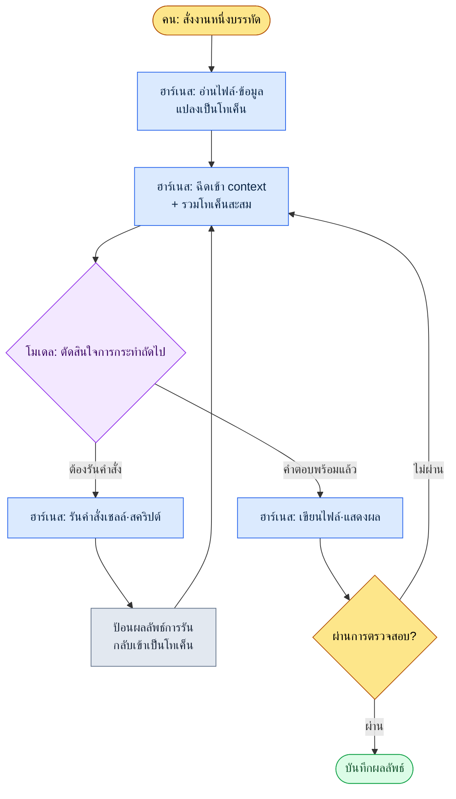

# 1.2 โมเดล·โทเค็น·ฮาร์เนส — เส้นทางที่โทเค็นของงานหนึ่งไหลผ่าน

เรื่องนี้เกิดขึ้นตอนที่ผมทำงานชิ้นหนึ่งเสร็จแล้วมองดูปริมาณการใช้งาน บันทึกการประชุมห้าฉบับของสัปดาห์นี้กองอยู่ในโฟลเดอร์ และก่อนการประชุมสแตนด์อัปเช้าวันจันทร์ ผมต้องสรุป "เฉพาะสิ่งที่ตัดสินใจกันแล้ว" ลงในหน้าเดียว ผมพิมพ์ข้อความบรรทัดหนึ่งลงในหน้าต่าง Claude Code "ช่วยดึงเฉพาะข้อตัดสินใจจากบันทึกการประชุมในโฟลเดอร์นี้มาทำเป็นตาราง" หลังจากกด Enter ไปราว 0.4 วินาที ก็มีตัวอักษรสีเทาเล็ก ๆ กะพริบขึ้นที่ด้านล่างของหน้าจอ

```
Reading meeting-2026-05-25.md ... (1,840 tokens)
Reading meeting-2026-05-27.md ... (2,310 tokens)
```

ตัวอักษรสีเทานี้คือหัวข้อของบทนี้ เมื่อเราโยนประโยคภาษาเกาหลีหนึ่งประโยคเข้าไป เครื่องมือจะหั่นมันเป็นโทเค็น อ่านไฟล์เป็นโทเค็นแล้วป้อนให้โมเดล รับคำตอบของโมเดลมาเขียนลงไฟล์ ทุกครั้งที่การไป-กลับนี้หมุนรอบหนึ่ง ก็จะมีการคิดค่าใช้จ่าย และมีข้อมูลสะสมอยู่ใน "มุมมอง" ของโมเดล บทนี้จะแยกสิ่งที่เกิดขึ้นเบื้องหลังตัวอักษรสีเทานั้นออกมาด้วยภาษาของนักออกแบบเกม สี่คำก็พอ — โมเดล·โทเค็น·context window·ฮาร์เนส

> **บันทึกศัพท์**
> - โมเดล (model): สมองที่สร้างคำตอบ มีหลายชนิดที่ขนาดและนิสัยต่างกัน เช่น Opus·Sonnet·Haiku
> - โทเค็น (token): ชิ้นส่วนที่หั่นตัวหนังสือออกเป็นชิ้นเล็ก ๆ ค่าใช้จ่าย·ความเร็ว·มุมมอง ล้วนนับด้วยหน่วยนี้ทั้งสิ้น
> - context window: จำนวนโทเค็นสูงสุดที่โมเดลบรรจุไว้ในหัวได้ในคราวเดียว
> - ฮาร์เนส (harness): ตัวถังที่ทำให้โมเดลทำงานได้ Claude Code คือตัวอย่างหนึ่งของมัน

---

## 1.2.1 ลูปของฮาร์เนส — ตัวตนของตัวอักษรสีเทา

ตัวอักษรสีเทาข้างต้นไม่ใช่ล็อกแบบสุ่ม แต่เป็นช่องหนึ่งของวงจรที่กำหนดไว้แล้ว สิ่งที่ฮาร์เนสทำสุดท้ายก็คือการหมุนวงเดิมซ้ำ ๆ อย่างรวดเร็ว อ่านไฟล์แล้วป้อนให้โมเดล เมื่อโมเดลบอกว่า "ให้รันคำสั่งนี้" ก็รัน แล้วป้อนผลลัพธ์กลับเข้าโมเดลอีกครั้ง วงนี้จะหมุนไปจนกว่างานจะเสร็จ



ในภาพนี้ ช่องที่คนลงมือมีเพียงสองช่องคือบนสุด (สั่งงาน) และล่างสุด (ตรวจยืนยันผลการตรวจสอบ) ส่วนวงตรงกลางฮาร์เนสหมุนเองโดยอัตโนมัติ ที่ตัวอักษรสีเทากะพริบห้าครั้งระหว่างอ่านบันทึกการประชุมห้าฉบับ ก็คือการหมุนช่อง `Read → Inject` ไปห้ารอบ ถ้าเป็นแชตบนเว็บ เราต้องเปิดไฟล์ทั้งห้ามาคัดลอก·วางเองทีละไฟล์ การที่ฮาร์เนสทำงานนั้นแทนเราได้ นี่คือความต่างชี้ขาดที่ทำให้แชตบอตกับฮาร์เนสแบบ CLI กลายเป็นเครื่องมือคนละชนิด

ทุกครั้งที่ลูปหมุนหนึ่งรอบ ช่อง `Inject` จะรวมโทเค็นสะสมเข้าด้วยกัน ดังนั้นถ้ายังไม่เข้าใจโทเค็นเสียก่อน ก็จะมองไม่เห็นทั้งค่าใช้จ่ายและขีดจำกัดของลูปนี้ เราจึงดูที่โทเค็นก่อน

---

## 1.2.2 โทเค็น — เงินตราจริงที่งานหนึ่งใช้จ่าย

โทเค็นไม่ใช่ตัวอักษร แต่เป็นชิ้นส่วนที่โมเดลหั่นตัวหนังสือออกมา ตามหลักประสบการณ์ ภาษาอังกฤษราว 4 ตัวอักษรเท่ากับ 1 โทเค็น ภาษาเกาหลีราว 2 ตัวอักษรใกล้เคียง 1 โทเค็น (ไม่ใช่อัตราแปลงทางการ แต่เป็นค่าประมาณสำหรับใช้งานจริง — ค่าจริงนั้นตัวตัดโทเค็น (tokenizer) ของโมเดลเป็นผู้กำหนด และต่างกันไปในแต่ละประโยค) ภาษาเกาหลีรวมเว้นวรรค 20 ตัวอักษรก็ราว 10 โทเค็น

ลองไล่ตามงานบันทึกการประชุมนั้นเป็นโทเค็นดู (ตัวเลขด้านล่างคือการวัดเพียงครั้งเดียวของงานเดียวกัน เนื่องจากผันแปรตามปริมาณบันทึกการประชุมและความยาวของบทสรุป จึงขอแนะนำให้อ่านเป็นจำนวนหลักและสัดส่วน ไม่ใช่ค่าสัมบูรณ์)

| ขั้นตอน | คืออะไร | โทเค็น (อินพุต) | โทเค็น (เอาต์พุต) |
|---|---|---|---|
| สั่งงาน | "ดึงเฉพาะข้อตัดสินใจมาทำตาราง" หนึ่งบรรทัด | \~25 | — |
| อ่านบันทึกการประชุม ×5 | เนื้อหาไฟล์ md 5 ไฟล์ | \~10,400 | — |
| ฉีดกฎการจัดหมวด | atom หมวดการประชุม 1 รายการ (JIT) | \~480 | — |
| โมเดลให้เหตุผล·เขียนตาราง | ข้อตัดสินใจ 12 รายการเป็นตาราง | — | \~1,600 |
| ป้อนซ้ำเพื่อตรวจสอบ | ถามซ้ำรายการตกหล่น 1 รายการที่ Linter จับได้ | \~320 | \~210 |
| **สะสม** | | **\~11,225** | **\~1,810** |

มีสองสิ่งที่สะดุดตา หนึ่ง คำสั่งที่ผมพิมพ์มีแค่ 25 โทเค็น แต่ทั้งงานมีเฉพาะอินพุตเกินหนึ่งหมื่นหนึ่งพันโทเค็น ค่าใช้จ่ายเกือบทั้งหมดไม่ได้มาจากประโยคของผม แต่มาจากข้อมูลที่เครื่องมืออ่านเข้าไป สอง เอาต์พุต (1,810) เป็นราวหนึ่งในหกของอินพุต (11,225) งานอัตโนมัติด้านการออกแบบเกมส่วนใหญ่อ่านมากเขียนน้อยแบบนี้ ดังนั้นหากต้องการลดค่าใช้จ่าย การจัดการปริมาณข้อมูลอินพุตได้ผลกว่าการขัดเกลาเอาต์พุตมากนัก

หลังงานเสร็จ พอพิมพ์ `/context` ก็จะเห็นว่าเซสชันนั้นใช้ context ไปเท่าไร ถ้าไม่ใส่ใจโทเค็น มันก็ไหลออกไปโดยไม่รู้ตัวเหมือนกระดาษพิมพ์ แต่พอทำให้มองเห็นได้สักครั้ง ท่าทีก็เปลี่ยนไป การทำให้มองเห็นนี้คือจุดเริ่มต้นของการประหยัด

เครื่องมือที่ใช้จัดการโทเค็นไม่ใช่จิตวิญญาณการประหยัดอันคลุมเครือ แต่เป็นเทคนิครูปธรรมที่จัดการข้อมูลอินพุตให้ละเอียด

1. **การฉีดแบบ JIT** — ไม่บรรทุกข้อมูลทั้งหมดไว้ล่วงหน้า แต่ดึงมาด้วยการจับคู่คีย์เวิร์ดเฉพาะเมื่อจำเป็น "การฉีดกฎการจัดหมวด 480 โทเค็น" ในตารางข้างบนคือตัวอย่างนั้น ไม่ใช่เอกสารกฎการจัดหมวดการประชุมทั้งฉบับ (หลายพันโทเค็น) แต่เข้ามาเพียง atom ที่จับคู่ได้หนึ่งรายการ
2. **แคชบทสรุป** — เอกสารยาวให้แยกฉบับสรุปสำหรับ AI ออกจากต้นฉบับสำหรับคน AI จะอ่านฉบับสรุป
3. **การแบ่ง atom** — ถ้าบรรจุข้อตัดสินใจเดียวต่อหนึ่งไฟล์ (รายละเอียดในข้อ 2.2) ก็ดึงเฉพาะชิ้นที่ต้องการได้อย่างแม่นยำ ประหยัดโทเค็น
4. **การจัดระเบียบ context** — เมื่อเซสชันยาวขึ้นก็บีบอัด Claude Code รองรับการบีบอัดอัตโนมัติ
5. **การเลือกโมเดล** — ถ้าใช้โมเดลใหญ่กับงานแปลงข้อมูลง่าย ๆ โทเค็นเท่ากันก็ค่าใช้จ่ายแพงขึ้น นี่คือหัวข้อของหัวข้อถัดไป

ในจำนวนนี้ ข้อ 1 การฉีดแบบ JIT คือกลไกที่หมุนอยู่จริงในสภาพแวดล้อมการทำงานของหนังสือเล่มนี้ เมื่ออินพุตหนึ่งบรรทัดเข้ามา ฮุก `inject_memory.py` จะจับคู่ atom ในหน่วยความจำตามลำดับคะแนน คัดเฉพาะไม่กี่อันดับแรกมาฉีด และแม้ล้มเหลวก็ไม่ขวางการไหลของงาน (รายละเอียดการอิมพลีเมนต์อยู่ใน 1.3) หลักการประหยัดโทเค็นที่ว่า "เฉพาะข้อมูลที่จำเป็น เฉพาะไม่กี่อันดับแรก ล้มเหลวก็เงียบ ๆ" บรรจุอยู่ในไฟล์โค้ดไฟล์เดียวอย่างนั้นเลย

---

## 1.2.3 โมเดล — ตัวถังเดียวกัน เครื่องยนต์ต่างกัน

โมเดลเปรียบเหมือนเครื่องยนต์รถยนต์ บนตัวถังเดียวกันที่ชื่อ Claude Code เราสามารถใส่เครื่องยนต์ต่างกันอย่าง Opus·Sonnet·Haiku ได้ เปลี่ยนเครื่องยนต์แล้วลักษณะของงานก็เปลี่ยน

<svg viewBox="0 0 640 230" xmlns="http://www.w3.org/2000/svg" font-family="sans-serif" font-size="13">
  <rect x="0" y="0" width="640" height="230" fill="#fafafa" stroke="#ddd"/>
  <text x="20" y="28" font-size="15" font-weight="bold">การจับคู่โมเดล — ความลึก vs ความเร็ว·ค่าใช้จ่าย</text>
  <!-- axes -->
  <line x1="80" y1="190" x2="600" y2="190" stroke="#888" stroke-width="1.5"/>
  <line x1="80" y1="190" x2="80" y2="55" stroke="#888" stroke-width="1.5"/>
  <text x="600" y="224" text-anchor="end" fill="#555">→ ความเร็ว·ค่าใช้จ่ายต่ำ</text>
  <text x="76" y="50" text-anchor="end" fill="#555">ความลึกในการให้เหตุผล ↑</text>
  <!-- Opus -->
  <circle cx="150" cy="80" r="34" fill="#7b4fbf" opacity="0.85"/>
  <text x="150" y="78" text-anchor="middle" fill="#fff" font-weight="bold">Opus</text>
  <text x="150" y="94" text-anchor="middle" fill="#fff" font-size="11">เครื่องยนต์ใหญ่</text>
  <text x="150" y="138" text-anchor="middle" fill="#444" font-size="11">ตรวจการออกแบบ·สังเคราะห์ GDD</text>
  <!-- Sonnet -->
  <circle cx="330" cy="120" r="34" fill="#3a86c8" opacity="0.85"/>
  <text x="330" y="118" text-anchor="middle" fill="#fff" font-weight="bold">Sonnet</text>
  <text x="330" y="134" text-anchor="middle" fill="#fff" font-size="11">เครื่องยนต์กลาง</text>
  <text x="330" y="170" text-anchor="middle" fill="#444" font-size="11">บันทึกประชุม·งานประจำ 80%</text>
  <!-- Haiku -->
  <circle cx="510" cy="155" r="34" fill="#2a9d6f" opacity="0.85"/>
  <text x="510" y="153" text-anchor="middle" fill="#fff" font-weight="bold">Haiku</text>
  <text x="510" y="169" text-anchor="middle" fill="#fff" font-size="11">คอมแพกต์</text>
  <text x="510" y="205" text-anchor="middle" fill="#444" font-size="11">แปลงรูปแบบชีตง่าย ๆ</text>
</svg>

เมื่อเทียบกับงานออกแบบเกมก็แบ่งได้อย่างนี้ งานที่ต้องการการให้เหตุผลลึกและความสอดคล้อง เช่น การตรวจการออกแบบระบบหรือการสังเคราะห์ร่าง GDD (Game Design Document, เอกสารออกแบบเกม — เอกสารสเปกละเอียด) ที่รวมข้อมูลหลายแหล่ง ใช้ Opus งานประจำส่วนใหญ่ เช่น การดึงข้อตัดสินใจจากบันทึกการประชุมหรือบทสรุปรายวัน ใช้ Sonnet งานที่แทบไม่มีการตัดสิน เช่น การแปลงรูปแบบของชีตข้อมูลง่าย ๆ ก็ส่งไปที่ Haiku ที่งานบันทึกการประชุมในหัวข้อก่อนหน้ารันด้วย Sonnet ก็ด้วยเกณฑ์นี้ — งานคัดข้อตัดสินใจมาย้ายลงตารางนั้น ความสมดุลและความเร็วเหมาะกว่าการให้เหตุผลลึก

ในช่วงเริ่มนำมาใช้ มีกับดักที่ทุกคนตกลงไป นั่นคือแรงกระตุ้นที่อยากรันทุกงานด้วยเครื่องยนต์ที่ดีที่สุด คือ Opus หากตามแรงกระตุ้นนั้น ภาระค่าใช้จ่ายและความเร็วก็จะย้อนกลับมาเป็นภาระการดำเนินงานในไม่ช้า และจะไม่ได้สั่งสมความรู้สึกในการจับคู่โมเดลให้เข้ากับงาน ทักษะที่แท้จริงของการดำเนินงานไม่ใช่การเลือกโมเดลในหัวทุกครั้ง แต่เป็นการตรึงมันให้ตายตัวด้วยระบบอัตโนมัติหลังจากจับรูปแบบได้แล้ว

- การเขียนการทบทวนรายวัน → ใช้ Sonnet อัตโนมัติ
- การรีวิวการออกแบบระบบ → ใช้ Opus อัตโนมัติ
- การตรวจความสอดคล้องของชีตข้อมูล → ใช้ Haiku อัตโนมัติ

การตรึงเช่นนี้ทำได้โดยระบุโมเดลไว้ใน settings.json หรือในคำสั่งสแลช (รายละเอียดใน 1.3) ตรึงไว้ครั้งเดียว ความยุ่งยากในการเลือกทุกครั้งก็หายไป

โมเดลออกเวอร์ชันใหม่ราวทุกครึ่งปี และแม้ชื่อเดียวกัน 4.5 กับ 4.6 ก็ต่างกัน เมื่อมีเวอร์ชันใหม่ออกมา ให้เปรียบเทียบเฉพาะงานหลักห้างานของเวิร์กโฟลว์ด้วยอินพุตเดียวกัน ถ้าจะทดสอบทั้งหมดก็จะเหนื่อย แค่ความต่างของผลลัพธ์ห้างานก็เพียงพอจะตัดสินว่าจะเปลี่ยนไปใช้หรือไม่

---

## 1.2.4 context window — ขีดจำกัดที่ลูปเติมจนเต็ม

ผมบอกไปแล้วว่าทุกครั้งที่ลูปหมุนหนึ่งรอบ โทเค็นจะสะสมที่ช่อง `Inject` เพดานที่การสะสมนั้นชนคือ context window กล่าวคือจำนวนโทเค็นสูงสุดที่โมเดลประมวลผลได้ในคราวเดียว ถ้าเทียบกับคนก็คือความจำใช้งาน (working memory)

- ตระกูล Claude 4: มาตรฐาน 200K โทเค็น มีตัวเลือกขยาย 1M โทเค็น
- 200K โทเค็น ≈ ปริมาณราว 400 หน้า A4 โดยอิงภาษาเกาหลี

งานบันทึกการประชุมข้างต้นมีอินพุตสะสมในระดับหนึ่งหมื่นหนึ่งพันโทเค็น เทียบกับเพดาน 200K แล้วราว 6% เศษ จึงยังเหลือเฟือ แต่ถ้าไม่เปลี่ยนงานแล้วลากเซสชันยาวอยู่ในหน้าต่างเดิม ก็จะเข้าใกล้เพดาน เมื่อเต็มแล้ว เนื้อหาเก่าจะถูกตัด โมเดลเริ่มลืม "ความทรงจำ" ส่วนต้น และการบีบอัดอัตโนมัติจะทำงานแทนที่บทสนทนาก่อนหน้าด้วยฉบับสรุป

นิสัยที่ใช้จัดการเพดานนี้มีสี่อย่าง

| รูปแบบ | เมื่อใด |
|---|---|
| แยกเซสชัน | เมื่อข้ามไปหัวข้ออื่น ให้เปิดเซสชันใหม่ |
| บีบอัดอย่างชัดเจน | เมื่องานหนึ่งเสร็จ ให้เหลือเฉพาะแก่นแล้วบีบอัด |
| นำหน่วยความจำออกนอก | ข้อมูลที่ใช้บ่อยให้แยกเป็น atom แล้วฉีดด้วย JIT ตามจังหวะ |
| ทำให้ context มองเห็นได้ | ใช้ `/context` ตรวจดูปริมาณการใช้งานปัจจุบันด้วยตา |

กรณีหนักที่นักออกแบบเกมเจอบ่อยคืองานที่ต้องใช้ทั้งเอกสารการประชุม·เอกสารออกแบบ·ชีตข้อมูลพร้อมกัน ตอนนั้นตัวเลือก 1M มีประโยชน์ เพียงแต่ 1M มาพร้อมภาระค่าใช้จ่ายและความเร็ว ปกติ 200K ก็เพียงพอ และจะหยิบ 1M ออกมาเฉพาะเมื่อกองข้อมูลใหญ่จริง ๆ เท่านั้น

---

## 1.2.5 เมื่อฮาร์เนสกรองความเท็จได้จริง — ช่องตรวจสอบ

กลับมาที่ช่อง `ผ่านการตรวจสอบ?` ล่างสุดของภาพลูป หากไม่มีช่องนี้ คำโกหกที่ดูน่าเชื่อของโมเดลก็จะถูกบันทึกลงไฟล์ตรง ๆ บางครั้งโมเดลก็เสนอคำตอบที่ผิดอย่างมั่นใจราวกับเป็นคำตอบที่ถูก (อาการหลอน, hallucination) ความถี่นั้นลดลงเมื่อรุ่นสูงขึ้น แต่ไม่ถึงศูนย์ จึงต้องตั้งการตรวจสอบไว้เป็นช่องประจำ

อาการหลอนที่อันตรายในงานออกแบบเกมนั้นเป็นรูปธรรม เช่น อ้างคอลัมน์ของชีตข้อมูลที่ไม่มีอยู่จริง คำนวณการปรับสมดุลด้วยสูตรผิด หรือสรุปสิ่งที่ยังไม่ได้ตัดสินในที่ประชุมว่าตัดสินกันแล้ว ในงานบันทึกการประชุม สิ่งที่น่ากลัวที่สุดคือข้อสาม — กรณีที่ "เรื่องที่แค่หารือกันแล้วพักไว้" แอบขึ้นไปอยู่ในตารางข้อตัดสินใจ

การตรวจสอบมีอยู่ห้ารูปแบบ

1. **การเทียบกับต้นฉบับ** — นำเอาต์พุตของ AI มาเทียบกับข้อมูลต้นฉบับอีกครั้ง ("ช่วยตรวจว่าสิ่งนี้มีอยู่ในข้อมูลนั้นจริงหรือไม่")
2. **การแปลงสองทาง** — เปลี่ยน A→B แล้วแปลงกลับ B→A เพื่อดูว่าตรงกันหรือไม่
3. **การตรวจตัวอย่าง** — ให้คนตรวจเอาต์พุตแบบสุ่ม 3\~5 รายการด้วยตนเอง
4. **ระบบอัตโนมัติด้วย Linter** — ตรวจอัตโนมัติว่าเอาต์พุตละเมิดรูปแบบ·ช่วง·กฎที่กำหนดไว้หรือไม่
5. **การตรวจไขว้สองโมเดล** — ให้ Opus ตรวจเอาต์พุตของ Sonnet

ไม่ได้ทำทั้งห้าทุกครั้ง แต่เลือก 1\~3 อย่างตามระดับความเสี่ยงของงาน ในงานบันทึกการประชุม ผมรวมข้อ 4 Linter ("ในข้อตัดสินใจมีผู้รับผิดชอบ·เนื้อหา·กำหนดเวลาครบหรือไม่") เข้ากับข้อ 3 การตรวจตัวอย่างหนึ่งครั้ง บรรทัดสุดท้ายของตารางโทเค็นก่อนหน้า "ป้อนซ้ำเพื่อตรวจสอบ 320 โทเค็น" ก็คือการไป-กลับที่ Linter จับรายการตกหล่นได้แล้วถามกลับไปยังโมเดลนั้นเอง ถ้าเทียบกับภาพลูปก็คือการหมุนเพิ่มอีกหนึ่งรอบจาก `ไม่ผ่านการตรวจสอบ → Inject`

ถ้าให้คนตรวจสอบทั้งหมดทุกครั้ง ผลของการนำมาใช้ก็ลดครึ่ง การตรวจสอบจึงเป็นเป้าหมายของการทำให้อัตโนมัติด้วย การดึงข้อตัดสินใจจากบันทึกการประชุมให้ Linter ตรวจรายการที่ตกหล่นในรูปแบบ การแปลงชีตข้อมูลให้ตรวจความสอดคล้องของจำนวนแถว·ผลรวม·foreign key การสร้าง GDD อัตโนมัติให้ตรวจหัวข้อสำคัญที่ตกหล่น ทั้งหมดตรวจอัตโนมัติ ผ่านแล้วคนไม่ต้องดูก็ได้ ดูเฉพาะที่ไม่ผ่าน เป็นภาพของการหยิบเฉพาะโฟลเดอร์ที่ติดธงแดงขึ้นมาจากกองเอกสารที่เต็มตู้ การออกแบบให้สายตาของคนตกลงเฉพาะที่อันตรายเท่านั้น คือจุดประสงค์ของการทำการตรวจสอบให้อัตโนมัติ

---

## 1.2.6 จุดที่สี่คำถูกร้อยเข้าด้วยกันเป็นงานหนึ่ง

ทีนี้มาสรุปงานบันทึกการประชุมนั้นตั้งแต่ต้นจนจบ ว่าสี่คำถูกร้อยเข้าในบรรทัดเดียวอย่างไร

| ช่อง | เกิดอะไรขึ้น | แนวคิดใด |
|---|---|---|
| 1 | รัน Claude Code ในโฟลเดอร์บันทึกการประชุม | ฮาร์เนส |
| 2 | งานเป็นการวิเคราะห์บันทึกการประชุม จึงเลือก Sonnet | โมเดล |
| 3 | รวมราว 11K โทเค็น อยู่ในหน้าต่าง 200K — OK | โทเค็น·context |
| 4 | ฉีด atom กฎการจัดหมวดการประชุมด้วย JIT อัตโนมัติ | โทเค็น (ประหยัด) |
| 5 | โมเดลแสดงข้อตัดสินใจ 12 รายการเป็นตาราง | ลูปโมเดล·ฮาร์เนส |
| 6 | Linter จับรายการตกหล่นในรูปแบบ 1 รายการ → ถามกลับเพื่อเสริม | การตรวจสอบ (เพิ่มลูป 1 รอบ) |
| 7 | บันทึก·commit เป็น `weekly-decisions-2026-W21.md` | ฮาร์เนส |

ถ้าทำด้วยมือ การเปิดอ่านบันทึกการประชุมห้าฉบับ คัดเฉพาะข้อตัดสินใจมาคัดลอก แล้วจัดรูปแบบ จะใช้เวลา 30 นาที พอทำเป็นอัตโนมัติก็ลดเหลือ 5 นาที และในห้านาทีนั้น มือของคนทำเพียงงานเดียวคือกวาดดูตัวอย่างการตรวจสอบหนึ่งครั้ง เวลาของคนจะตกลงเฉพาะที่ต้องการมันจริง ๆ เท่านั้น (ว่าเรื่องที่พักไว้ไม่ได้ถูกยกขึ้นเป็นข้อตัดสินใจผิด ๆ หรือไม่) แก่นไม่ได้อยู่ที่ 25 นาทีที่ประหยัดได้ แต่อยู่ที่ตำแหน่งที่สายตาตกลงไปนั้นเปลี่ยนไป

---

## 1.2.7 ความเข้าใจผิดที่พบบ่อย

"Opus ดีกว่าเสมอ" คือสิ่งที่พบบ่อยที่สุด ถ้าไม่สนใจค่าใช้จ่าย·ความเร็วก็จริงอยู่ แต่กับงานง่าย ๆ Opus คือความสิ้นเปลือง การจับคู่ตามงานคือคำตอบ

"context 1M จำเป็นเสมอ" ก็โผล่มาบ่อย ส่วนใหญ่ 200K ก็เพียงพอ และ 1M มาพร้อมภาระ จึงใช้เฉพาะกับกองข้อมูลที่ใหญ่จริง ๆ

"การตรวจสอบเป็นงานของคน" ถูกแค่ครึ่งเดียว ส่วนที่ตรวจอัตโนมัติได้เป็นส่วนใหญ่ และคนทุ่มเทไปที่ส่วนที่เหลือ

"ไม่ต้องใส่ใจโทเค็นก็ได้" ในงานส่วนตัวก็พอใช้ได้ระดับหนึ่ง แต่พอหลายคนใช้ร่วมกัน ค่าใช้จ่ายสะสมจะโตขึ้นเร็ว การปลูกฝังรูปแบบการทำให้มองเห็น·การประหยัดตั้งแต่แรกจะปลอดภัยกว่า

"ฮาร์เนสไม่มีความต่าง" ก็มีมากอย่างไม่คาดคิด แม้เป็นโมเดลเดียวกัน แต่จะแชตบอตหรือ CLI ก็แยกออกเป็นเครื่องมือคนละชนิด การมีหรือไม่มีงานคัดลอก·วางที่เห็นมาข้างต้นคือความต่างนั้น

---

## 1.2.8 ลองทำดู

ลองหมุนสี่คำของบทนี้ด้วยตนเองผ่านงานเล็ก ๆ ชิ้นหนึ่ง

**setup**

- ในสภาพที่ติดตั้ง Claude Code แล้ว ให้เตรียมโฟลเดอร์หนึ่งที่มีโน้ตข้อความ (บันทึกการประชุม·บันทึกย่อ) 2\~3 ไฟล์
- เปิด Claude Code ในโฟลเดอร์นั้น

**prompt**

```
ช่วยคัดเฉพาะ "สิ่งที่ตัดสินใจกันแล้ว" จากโน้ตในโฟลเดอร์นี้
มาทำเป็นตาราง 3 คอลัมน์ ผู้รับผิดชอบ·เนื้อหา·กำหนดเวลา
เรื่องที่พักไว้·ยังหารือกันอยู่ให้ตัดออก และในแต่ละบรรทัดที่ใส่ในตาราง
ให้ระบุชื่อไฟล์ด้วยว่ามาจากไฟล์ใด
```

**verify**

- เมื่องานเสร็จ ให้พิมพ์ `/context` เพื่อดูโทเค็นที่เซสชันนี้ใช้ (คุณจะได้เห็นว่าอินพุตใหญ่กว่าที่คิด)
- เลือกสักหนึ่งหรือสองบรรทัดในตาราง เปิดไฟล์ตามชื่อที่ระบุไว้ แล้วเทียบกับต้นฉบับว่าเขียนไว้ว่าเป็น "ข้อตัดสินใจ" จริงหรือไม่ (การตรวจสอบแบบเทียบกับต้นฉบับ)
- กวาดดูสักครั้งว่าเรื่องที่พักไว้ไม่ได้ถูกยกขึ้นในตารางผิด ๆ หรือไม่ (การตรวจตัวอย่าง)

**ฉบับย่อสำหรับคนเดียว**

ถ้าเพิ่งเริ่มใช้เครื่องมือ ให้เก็บแค่สองอย่างจากข้างบนนี้ก็พอ หนึ่ง มอบโน้ตทั้งโฟลเดอร์ไปและอย่าคัดลอก·วางเอง (มอบให้ลูปของฮาร์เนสทำ) สอง ตารางเอาต์พุตให้รับชื่อไฟล์มาพร้อมกันเสมอ แล้วเปิดต้นฉบับดูเฉพาะบรรทัดที่น่าสงสัย การเลือกโมเดลหรือการทำให้โทเค็นมองเห็นได้ ค่อยเพิ่มหลังจากคุ้นแล้วก็ไม่สาย แค่สองนิสัยนี้ — ไม่ขนข้อมูลด้วยมือ และเทียบเอาต์พุตกับต้นฉบับ — ครึ่งหนึ่งของการนำมาใช้ก็เข้าที่แล้ว

---

### สรุปประเด็นสำคัญของบท
- ฮาร์เนสหมุนลูป อ่าน→รัน→ป้อนซ้ำ โดยอัตโนมัติ คนลงมือแค่สองช่องคือสั่งงานและตรวจสอบ
- ค่าใช้จ่ายของงานหนึ่งเกือบทั้งหมดมาจากข้อมูลที่เครื่องมืออ่านเข้าไป ไม่ใช่คำสั่งที่ผมพิมพ์
- โมเดลให้เปลี่ยนสลับตามงาน ส่วนเพดาน context และการตรวจสอบให้จัดการด้วยระบบอัตโนมัติ

### ตัวอย่างบทถัดไป
- บทที่ 3 หน่วยความจำ·สิทธิ์·โครงสร้างพื้นฐานการตั้งค่า — ตั้งค่าครั้งเดียวก็เป็นฐานที่ทำงานถาวร
