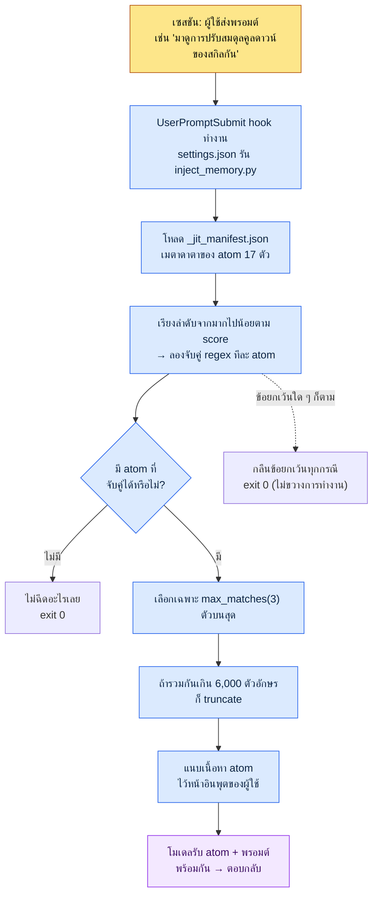

# 1.3 โครงสร้างพื้นฐาน: หน่วยความจำ สิทธิ์ และการตั้งค่า

ผมเปิดเซสชันใหม่แล้วพิมพ์ว่า "มาดูการปรับสมดุลคูลดาวน์ของสกิลกันหน่อย" ก่อนจะกดเอนเทอร์ มีตัวอักษรสีเทาเล็ก ๆ บรรทัดหนึ่งวาบผ่านที่ส่วนล่างของหน้าจอ `[memory injected: 2 atoms, 1,842 chars]` แม้ผมจะยังไม่ได้เปิดไฟล์ใด ๆ เลย แต่เอกสารกฎคูลดาวน์ที่ผมตรึงเป็นกฎไว้เมื่อสัปดาห์ก่อนได้ถูกแนบเข้าไปไว้หน้าอินพุตของโมเดลเรียบร้อยแล้ว นี่คือสัญญาณแรกของสภาพแวดล้อมการทำงานที่มีโครงสร้างพื้นฐานวางอยู่ ทันทีที่เปิดเครื่องมือ เครื่องมือก็จดจำผมได้

เพื่อให้ฉากนี้เป็นไปได้ สามสิ่งต้องเข้าที่เข้าทางไว้ก่อน ได้แก่ สิ่งที่ AI จะจดจำ (หน่วยความจำ) สิ่งที่ AI ทำได้โดยไม่ต้องให้คนอนุมัติ (สิทธิ์) และสวิตช์กลางที่เปิด-ปิดทั้งสองอย่างนั้น (settings.json) เวลาที่ใช้ติดตั้งครั้งแรกอย่างมากก็แค่ราวหนึ่งชั่วโมง และหนึ่งชั่วโมงนั้นจะกลับคืนมาเป็นเวลาที่ประหยัดได้ทุกวันตลอด 6 เดือนหลังจากนั้น แทบจะเป็นการลงทุนที่ถอนคืนได้เต็มจำนวน

บทนี้คือการเดินตามทีละขั้น (walkthrough) ของ `settings.json` หนึ่งบรรทัดที่ผมรันจริงบนพีซีส่วนตัว บรรทัดนั้นเรียก `inject_memory.py` และไฟล์นั้นอ่าน `_jit_manifest.json` ตามลำดับ เมื่ออ่านจบ คุณจะสามารถชี้ด้วยมือได้ว่าคำว่า "หน่วยความจำถูกฉีดเข้าไปอัตโนมัติ" นั้นเกิดขึ้นที่บรรทัดไหนของไฟล์ไหน

---

## 1.3.1 settings.json — บรรทัดเดียวที่ทุกอย่างเริ่มต้น

ขอดูข้อสรุปก่อน สิ่งที่เปิดการฉีดหน่วยความจำอัตโนมัติบนพีซีส่วนตัวของผมคือบล็อกเพียงบล็อกเดียวภายใน `settings.json`

```json
{
  "hooks": {
    "UserPromptSubmit": [
      {
        "hooks": [
          {
            "type": "command",
            "command": "python ~/.claude/hooks/inject_memory.py"
          }
        ]
      }
    ]
  }
}
```

ถ้าจะแปลความหมายของบล็อกนี้ออกมาเป็นภาษาคน ก็คือ "ทุกครั้งที่เกิดเหตุการณ์ที่ผู้ใช้ส่งพรอมต์ (`UserPromptSubmit`) ให้รันสคริปต์ Python ชื่อ `inject_memory.py` หนึ่งครั้ง" แค่นั้น ไม่ใช่ว่า AI ฉลาดจนจดจำได้เอง แต่เป็นโครงสร้างที่ทุกครั้งที่มีอินพุตเข้ามา สคริปต์ที่คนลงทะเบียนไว้จะแทรกตัวเข้ามาทำงานหนึ่งครั้ง

`settings.json` คือไฟล์กลางที่ควบคุมการทำงานทั้งหมดของ Claude Code และแบ่งออกเป็นสองชั้น

- `~/.claude/settings.json` — ระดับโกลบอล ใช้กับทุกเซสชัน เป็นการตั้งค่าที่แชร์กับทีมได้
- `~/.claude/settings.local.json` — ระดับโลคัล ใช้กับพีซีเครื่องนี้เท่านั้น เป็นการตั้งค่าเฉพาะของพีซีส่วนตัว

ทั้งสองจะถูกผสาน (merge) เข้าด้วยกันแล้วนำไปใช้ ด้วยเหตุนี้ผมจึงแยก hook และสิทธิ์ที่ต้องแชร์กับทีมไว้ใน `settings.json` ส่วนพาธสัมบูรณ์หรือพาธเครื่องมือส่วนตัวที่ใช้บนพีซีบ้านเครื่องนี้เท่านั้นก็แยกไว้ใน `settings.local.json` เป็นการแบ่งแยกเพื่อหลีกเลี่ยงการชน (conflict) ของ git ตอนทำงานร่วมกัน และป้องกันอุบัติเหตุที่การตั้งค่าส่วนตัวรั่วไหลเข้าไปใน repository ของทีม

นอกจาก hook แล้ว ยังมีรายการอื่นที่เข้าไปตั้งบ่อยอีกหลายอย่าง

- `effortLevel` — ความลึกในการให้เหตุผลของโมเดล มี low / medium / high งานที่ต้องใช้การตัดสินใจเชิงลึกอย่างการออกแบบเอกสารออกแบบเกม ก็ตั้งเป็น high
- `permissions` — ขอบเขตของคำสั่งที่ AI สามารถรันได้โดยไม่ต้องขออนุมัติ (รายละเอียดใน 1.3.4)
- `enabledPlugins` — รายการปลั๊กอินที่เปิดใช้งาน

ตรงนี้มีนิสัยในการปฏิบัติงานที่สำคัญที่สุดเพียงข้อเดียว `settings.json` พิมพ์ผิดแค่ตัวเดียวก็อาจทำให้เครื่องมือเปิดไม่ขึ้นได้เลย แค่ลืมใส่จุลภาคของ JSON ตัวเดียว การแจงไวยากรณ์ (parsing) ก็พังแล้ว ฉะนั้นการสำรองข้อมูลก่อนแก้ไขจึงเป็นสิ่งจำเป็น บนพีซีของผมก็มีไฟล์สำรองแบบนี้เก็บไว้จริง

```
settings.json.bak_2026-05
settings.local.json.bak_2026-05
```

ถ้าทำสำเนาไว้หนึ่งชุดพร้อมต่อท้ายด้วยวันที่ การย้อนกลับ (rollback) ก็ใช้เวลาแค่ 1 วินาที ถ้าจัดการด้วย git ได้ก็ยิ่งดี เหมือนกุญแจเก่าหนึ่งชุดในลิ้นชัก ปกติไม่ได้ใช้ แต่จะมีสักจังหวะที่จำเป็นต้องใช้แน่ ๆ เมื่อยืนอยู่หน้าประตูที่ถูกล็อก

---

## 1.3.2 inject_memory.py — สิ่งที่เกิดขึ้นจริงภายใน hook

ทีนี้เราเข้าไปในสคริปต์ที่ `settings.json` เรียกใช้ นี่คือกระดูกสันหลังของ walkthrough โค้ดมีประมาณ 100 บรรทัด แต่แก่นอยู่ที่ห้าการกระทำ



ถ้าจะอธิบายห้าการกระทำให้กระจ่าง ก็เป็นดังนี้

**1) อ่าน manifest** ก่อนอื่นสคริปต์จะเปิด `~/.claude/projects/C--Users-user/memory/_jit_manifest.json` ไฟล์นี้รวบรวมเมตาดาตาของ atom (ชื่อ พาธ regex สำหรับจับคู่ และคะแนน) ไว้ บนพีซีส่วนตัวของผมในตอนนี้มี atom ลงทะเบียนไว้ 17 ตัว

**2) เรียงลำดับจากมากไปน้อยตาม score** ทุก atom มีค่า `score` กำกับ atom ที่คะแนนสูงกว่าจะถูกลองจับคู่ก่อน เวลามีหลาย atom เข้าเงื่อนไขด้วยคีย์เวิร์ดเดียวกัน คะแนนนี้เป็นตัวตัดสินว่าใครได้สิทธิ์ก่อน

**3) จับคู่ด้วย regex** เปรียบเทียบสตริงอินพุตของผู้ใช้กับแพตเทิร์น `regex` ของแต่ละ atom ถ้ามีคำว่า "คูลดาวน์" อยู่ในอินพุต atom ที่มีแพตเทิร์น `쿨다운|cooldown|GCD` ก็จะเข้าเงื่อนไข การเปรียบเทียบไม่แยกตัวพิมพ์ใหญ่-เล็ก

**4) ตัดให้เหลือไม่เกิน 3 ตัว** ต่อให้จับคู่ได้มากแค่ไหน ถ้าเกิน `max_matches` (สภาพแวดล้อมของผมตั้งไว้ที่ 3) ก็จะเก็บไว้แค่ 3 ตัวบนสุด และถ้าความยาวรวมของเนื้อหา atom ที่ถูกเลือกเกิน 6,000 ตัวอักษร ก็จะ truncate เป็นกลไกความปลอดภัยสองชั้นที่ป้องกันไม่ให้อินพุตบวมเกินไป

**5) จบด้วย exit 0 ไม่ว่าจะเกิดข้อยกเว้นใด** นี่คือแก่นของการออกแบบ ไม่ว่า manifest จะพัง ไฟล์จะหาย หรือ regex จะผิด สคริปต์ก็จะกลืนข้อยกเว้นไว้เงียบ ๆ แล้วจบด้วยโค้ดสถานะ 0 เพราะถ้า hook ตายด้วยโค้ดที่ไม่ใช่ 0 พรอมต์ของผู้ใช้เองก็อาจถูกขวางได้ หลักการที่ว่า "ต่อให้การฉีดหน่วยความจำล้มเหลว ก็จะไม่ขวางการทำงานของผู้ใช้เด็ดขาด" ถูกบันทึกไว้ที่ try/except ชั้นนอกสุดของโค้ด

จุดศูนย์ถ่วงอยู่ที่ข้อ 4 และข้อ 5 ข้อ 4 (เพดานบน) ป้องกันไม่ให้หน่วยความจำทำให้โทเค็นระเบิด ส่วนข้อ 5 (กลืนข้อยกเว้น) ป้องกันไม่ให้โครงสร้างพื้นฐานมาขัดขวางการทำงาน ทั้งสองเป็นสองด้านของปรัชญาเดียวกันที่ว่า "ระบบอัตโนมัติต้องไม่ทำให้คนรู้สึกรุงรัง"

---

## 1.3.3 _jit_manifest.json — พจนานุกรมคีย์เวิร์ดที่ปลุก atom ให้ตื่น

ใน 1.2 ผมได้สัญญาถึงหลักการประหยัดโทเค็นที่ว่า "เอาเฉพาะข้อมูลที่จำเป็น เฉพาะไม่กี่ตัวบนสุด และถ้าล้มเหลวก็เงียบ ๆ" แล้วเลื่อนรายละเอียดการนำไปปฏิบัติมาไว้ในบทนี้ รายละเอียดนั้นอยู่ใน manifest ที่ `inject_memory.py` อ่าน นี่คือหัวใจของ JIT (Just-In-Time วิธีดึงข้อมูลมาเฉพาะตอนที่จำเป็น) และเอนทรีของ atom หนึ่งตัวมีหน้าตาดังนี้

```json
{
  "atoms": [
    {
      "name": "combat_cooldown_rule_v2",
      "path": "atoms/combat/combat_cooldown_rule_v2.md",
      "regex": "쿨다운|cooldown|GCD",
      "score": 80
    },
    {
      "name": "user_health",
      "path": "memory/user_health.md",
      "regex": "건강|복약|컨디션|약물",
      "score": 95
    }
  ],
  "config": {
    "max_matches": 3,
    "case_insensitive": true
  }
}
```

สี่ฟิลด์ที่นิยาม atom หนึ่งตัว

- `name` — ชื่อเฉพาะของ atom
- `path` — พาธของไฟล์ที่จะอ่านเนื้อหามาเมื่อจับคู่ได้
- `regex` — แพตเทิร์นที่นิยามว่าถ้าคีย์เวิร์ดใดเข้ามาในอินพุตจะปลุก atom นี้
- `score` — ลำดับความสำคัญในการเรียง ยิ่งสูงยิ่งถูกจับคู่ก่อนและได้ที่นั่งก่อน

`max_matches: 3` ในบล็อก `config` คือที่มาของเพดาน "ไม่เกิน 3 ตัว" ที่เห็นใน 1.3.2 ถ้าแก้ manifest ด้วยมือ การทำงานก็เปลี่ยนทันที

ขอชี้ให้เห็นความรู้สึกเรื่องสเกลสักเรื่อง **พีซีส่วนตัว** ของผมดำเนินงานอย่างเบาบางด้วย atom 17 ตัวและ manifest เพียงหนึ่งชุด ในทางกลับกัน สภาพแวดล้อมการทำงานจริงในบริษัท (โปรเจกต์ A) นั้น เมื่ออ้างอิงข้อมูลสำรอง ณ เดือนพฤษภาคม 2026 มี atom ของทีมลงทะเบียนไว้ 304 ตัว และ skill 48 ตัว มี Hot atom ตัวหนึ่งที่ score ไต่ขึ้นไปถึง 356.53 (อยู่ในตระกูล `view_html_filename_convention` ที่ว่าด้วยกฎการตั้งชื่อไฟล์) ซึ่งไม่ได้สูงมาตั้งแต่ต้น แต่เป็นร่องรอยที่สะสมขึ้นจากการถูกเรียกซ้ำและถูกตรวจสอบ

สิ่งที่ความต่างระหว่าง 17 ตัวบนพีซีส่วนตัวกับ 304 ตัวในบริษัทบอกเราก็คือ ต่อให้เป็นกลไก JIT เดียวกัน ความเร็วและขนาดที่ข้อมูลสะสมขึ้นก็แปรผันตามความหนาแน่นของโปรเจกต์ ไม่จำเป็นต้องสร้าง 304 ตัวตั้งแต่ต้น เริ่มจาก atom หลักห้าตัว แล้วตรึงเป็นกฎเพิ่มสัปดาห์ละหนึ่งถึงสองตัว ไม่ทันไร manifest ก็จะหนาขึ้นเอง

> การประมาณของผู้เขียน (ยังไม่ได้ตรวจสอบ): คำอธิบายที่ว่า score สะสมขึ้นตามจำนวนครั้งที่จับคู่และถูกตรวจสอบ เป็นการตีความที่อิงจากแพตเทิร์นการดำเนินงาน สูตรการคิดคะแนนเองนั้นแปรเปลี่ยนไปตามการออกแบบ manifest ของแต่ละสภาพแวดล้อม ฉะนั้นค่าสัมบูรณ์อย่าง 356.53 ข้างต้นจึงเป็นเพียงภาพถ่าย ณ ขณะนั้นที่วัดได้จริงในสภาพแวดล้อมของผู้เขียน ไม่ใช่มาตรฐานทั่วไป

ตรงนี้ขอย้ำหลักการที่ว่าหน่วยความจำแบ่งเก็บเป็นสองชั้นอีกครั้ง

| ประเภท | ตำแหน่ง | โหลดเมื่อใด | การใช้งาน |
|---|---|---|---|
| โกลบอล | `~/.claude/memory/` | ทุกเซสชัน | ตัวตนของตนเอง กฎการทำงานร่วมกัน การตั้งค่าภาษา |
| โปรเจกต์ | `~/.claude/projects/<โปรเจกต์>/memory/` | เซสชันของโปรเจกต์นั้น | atom กฎ และข้อมูลเฉพาะของแต่ละโปรเจกต์ |

การเก็บโกลบอลให้เบาไว้ปลอดภัยกว่า เพราะถ้าโกลบอลหนักขึ้น น้ำหนักนั้นจะสะสมเป็นต้นทุนโทเค็นในทุกเซสชัน ถ้าเปรียบกับสำนักงาน โกลบอลก็คือสมุดนามบัตรบนโต๊ะ (ยิ่งเบายิ่งหยิบใช้สะดวกทุกวัน) ส่วนหน่วยความจำของโปรเจกต์คือแฟ้มในตู้ข้าง ๆ (ต่อให้หนาขึ้นต่อโปรเจกต์ก็ไม่เป็นภาระในยามปกติ) ด้วยเหตุนี้ในโกลบอลที่ถูกโหลดอัตโนมัติจึงควรเก็บแค่แก่น ส่วนข้อมูลที่อุดมสมบูรณ์ให้สะสมไว้ในหน่วยความจำของโปรเจกต์ แล้วค่อยปลุกด้วย JIT เฉพาะตอนที่จำเป็น

---

## 1.3.4 สิทธิ์ — ไวต์ลิสต์ที่ร่องรอยการสะสมงานทับถมกัน

ทีนี้มาถึงแกนที่สามของโครงสร้างพื้นฐาน คือสิทธิ์ Claude Code สามารถลบไฟล์ รันคำสั่ง และเรียก API ภายนอกได้ ความทรงพลังมาพร้อมความเสี่ยง ระบบสิทธิ์คือสิ่งที่บริหารจัดการความเสี่ยงนั้น

สิทธิ์แบ่งออกเป็นสองชนิด คือชนิดที่รันอัตโนมัติโดยไม่ต้องให้คนอนุมัติ กับชนิดที่ต้องขออนุมัติทุกครั้ง จะเอาอะไรไว้ฝั่งไหนนิยามได้ในบล็อก `permissions` ของ `settings.json`

```json
{
  "permissions": {
    "allow": [
      "Bash(ls:*)",
      "Bash(git status:*)",
      "Bash(git diff:*)",
      "Read(*)",
      "Grep(*)"
    ],
    "deny": [
      "Bash(rm -rf:*)",
      "Bash(git push --force:*)"
    ]
  }
}
```

ตรงนี้ต้องเปลี่ยนมุมมอง รายการ `allow` นี้ไม่ใช่แค่ค่าตั้งค่าธรรมดา แต่เป็น **ร่องรอยของการสะสมงาน** ตอนแรกก็แค่อนุญาตอัตโนมัติให้อ่านและค้นหาเท่านั้น และแทบจะว่างเปล่า แต่พอทำงานเดิมซ้ำ ๆ ไปสักหนึ่งถึงสองเดือน ก็จะเกิดแพตเทิร์นที่รู้สึกว่า "คำสั่งนี้ต้องกดอนุมัติทุกครั้งมันน่ารำคาญ" แล้วก็ค่อย ๆ ย้ายมันเข้าไปใน `allow` ทีละอย่าง รายการที่ยาวขึ้นก็คือลายนิ้วมือที่บอกว่าผมใช้เครื่องมือนี้ทำอะไรซ้ำ ๆ มาบ้าง

สภาพแวดล้อมการทำงานในบริษัทของผม (โปรเจกต์ A) มีแพตเทิร์นอนุญาตอัตโนมัติอยู่ราว 80 รายการ เริ่มจาก 20 รายการ แล้วเพิ่มขึ้นมาอีก 60 รายการตลอด 6 เดือน ซึ่งถ้าอ่าน 60 รายการนั้นย้อนกลับ ก็จะเผยว่าผมทำงานอะไรซ้ำ ๆ มาตลอดครึ่งปีที่ผ่านมา การดึงข้อมูลจากชีต การสร้างผังความสัมพันธ์ การจัดทำเอกสารสคีมา — เครื่องมือที่ใช้บ่อยก็คือสิทธิ์ที่อนุญาตบ่อยนั่นเอง

การดำเนินงานเรื่องสิทธิ์มีสี่แพตเทิร์นที่เข้าที่เข้าทาง

- **เริ่มจากไวต์ลิสต์** — การอนุญาตอัตโนมัติให้ออกตัวจากน้อยที่สุด แล้วค่อยเพิ่มเฉพาะตอนจำเป็น ไม่ใช่เปิดกว้างไว้แล้วค่อยหรี่ลง แต่เป็นทิศทางปิดแคบ ๆ ไว้แล้วค่อยเปิด
- **คำสั่งอันตรายให้บล็อกอย่างชัดเจน** — คำสั่งที่อุบัติเหตุครั้งเดียวถึงตายอย่าง `rm -rf` หรือ `git push --force` ให้ใส่ไว้ใน `deny` ต่อให้ขยายการอนุญาตอัตโนมัติแค่ไหน สองตัวนี้ก็อย่าไปแตะ
- **จัดระเบียบเป็นระยะ** — ทุกไตรมาสให้ทบทวน `allow` ใหม่ แล้วถอดสิทธิ์ที่เลิกใช้แล้วออก ร่องรอยถ้าเอาแต่สะสมก็จะกลายเป็นสัญญาณรบกวน (noise)
- **แยกตามโดเมน** — แยกสิทธิ์โกลบอลกับสิทธิ์โปรเจกต์ออกจากกัน เหมือนพีซีบ้านกับพีซีบริษัทมีนโยบายต่างกัน แต่ละสภาพแวดล้อมก็มีขอบเขตการอนุญาตต่างกัน

ถ้ามีป็อปอัปขออนุมัติเด้งขึ้นมาทุกครั้ง คนก็เหนื่อย จึงมีกลไกลดความเหนื่อยล้าด้วย เช่น ใช้คำสั่งสแลชอย่าง `fewer-permission-prompts` เพื่อลงทะเบียนแพตเทิร์นที่ปรากฏบ่อยทีเดียวทั้งชุด หรือให้สิทธิ์ชั่วคราวเฉพาะภายในเซสชันเดียว หรือใช้โหมดอนุญาตอัตโนมัติเต็มสิทธิ์เฉพาะกับงานส่วนตัวเท่านั้น อย่างไรก็ตาม ตัวเลือกสุดท้ายไม่แนะนำในสภาพแวดล้อมแบบทีม

ความสมดุลระหว่างความเหนื่อยล้ากับความปลอดภัยนั้นตัวคุณเองเป็นคนปรับ ถ้าเข้มงวดเกินไปงานก็ไม่เดิน ถ้าหละหลวมเกินไปก็เกิดอุบัติเหตุ ต่อให้เริ่มแบบหละหลวม แต่ถ้าวางรอบการจัดระเบียบรายไตรมาสไว้ ความสมดุลก็จะลงตัวได้เอง

---

## 1.3.5 เมื่อเซสชันเริ่มต้น — ภาพที่หน่วยความจำและสิทธิ์ถูกโหลดมาพร้อมกัน

ที่ผ่านมาเราดูสามแกน (settings · หน่วยความจำ · สิทธิ์) มาแล้ว ทีนี้มาคลี่ดูว่าทั้งสามทำงานพร้อมกันอย่างไรในเซสชันเดียว โดยยึดอินพุตหนึ่งบรรทัดเป็นเกณฑ์ ต่อไปนี้คือภาพตัดขวางของสิ่งที่เกิดขึ้นจริงเมื่อพิมพ์ว่า "มาดูการปรับสมดุลคูลดาวน์ของสกิลกัน"

<svg viewBox="0 0 720 400" xmlns="http://www.w3.org/2000/svg" font-family="sans-serif" font-size="13">
  <rect x="0" y="0" width="720" height="400" fill="#fafafa"/>
  <!-- 세로 레인 -->
  <rect x="20" y="20" width="200" height="360" fill="#eef3fb" stroke="#9bb8e0"/>
  <rect x="260" y="20" width="200" height="360" fill="#eef9f0" stroke="#9bd0a8"/>
  <rect x="500" y="20" width="200" height="360" fill="#fdf3ec" stroke="#e0b893"/>
  <text x="120" y="42" text-anchor="middle" font-weight="bold">settings.json</text>
  <text x="360" y="42" text-anchor="middle" font-weight="bold">หน่วยความจำ (JIT)</text>
  <text x="600" y="42" text-anchor="middle" font-weight="bold">สิทธิ์ (permissions)</text>
  <!-- settings 레인 박스 -->
  <rect x="35" y="60" width="170" height="46" rx="5" fill="#ffffff" stroke="#7aa0d0"/>
  <text x="120" y="80" text-anchor="middle">UserPromptSubmit</text>
  <text x="120" y="97" text-anchor="middle">hook ทำงาน</text>
  <rect x="35" y="130" width="170" height="46" rx="5" fill="#ffffff" stroke="#7aa0d0"/>
  <text x="120" y="150" text-anchor="middle">inject_memory.py</text>
  <text x="120" y="167" text-anchor="middle">รัน (รับประกัน exit 0)</text>
  <!-- 메모리 레인 박스 -->
  <rect x="275" y="130" width="170" height="46" rx="5" fill="#ffffff" stroke="#5fae7e"/>
  <text x="360" y="150" text-anchor="middle">manifest 17 atom</text>
  <text x="360" y="167" text-anchor="middle">เรียง score · regex</text>
  <rect x="275" y="200" width="170" height="46" rx="5" fill="#ffffff" stroke="#5fae7e"/>
  <text x="360" y="220" text-anchor="middle">3 ตัวบนสุด · 6000 ตัวอักษร</text>
  <text x="360" y="237" text-anchor="middle">บังคับใช้เพดาน</text>
  <rect x="275" y="270" width="170" height="46" rx="5" fill="#ffffff" stroke="#5fae7e"/>
  <text x="360" y="290" text-anchor="middle">cooldown atom</text>
  <text x="360" y="307" text-anchor="middle">แนบไว้หน้าอินพุต</text>
  <!-- 권한 레인 박스 -->
  <rect x="515" y="270" width="170" height="46" rx="5" fill="#ffffff" stroke="#cf9560"/>
  <text x="600" y="290" text-anchor="middle">allow / deny</text>
  <text x="600" y="307" text-anchor="middle">ตรวจทุกการเรียกเครื่องมือ</text>
  <rect x="515" y="340" width="170" height="34" rx="5" fill="#ffffff" stroke="#cf9560"/>
  <text x="600" y="361" text-anchor="middle">อ่านอัตโนมัติ · ลบต้องอนุมัติ</text>
  <!-- 화살표 -->
  <line x1="120" y1="106" x2="120" y2="130" stroke="#555" stroke-width="1.5" marker-end="url(#a)"/>
  <line x1="205" y1="153" x2="275" y2="153" stroke="#555" stroke-width="1.5" marker-end="url(#a)"/>
  <line x1="360" y1="176" x2="360" y2="200" stroke="#555" stroke-width="1.5" marker-end="url(#a)"/>
  <line x1="360" y1="246" x2="360" y2="270" stroke="#555" stroke-width="1.5" marker-end="url(#a)"/>
  <line x1="445" y1="293" x2="515" y2="293" stroke="#555" stroke-width="1.5" marker-end="url(#a)"/>
  <defs>
    <marker id="a" markerWidth="8" markerHeight="8" refX="6" refY="3" orient="auto">
      <path d="M0,0 L6,3 L0,6 Z" fill="#555"/>
    </marker>
  </defs>
</svg>

สามเลนมาบรรจบกันที่อินพุตเดียว settings.json ปลุก hook ขึ้นมา hook คัดเลือกหน่วยความจำมาแนบไว้กับอินพุต และเมื่อคำตอบที่สร้างขึ้นเช่นนั้นไปเรียกใช้เครื่องมือ สิทธิ์ก็ทำงานเป็นด่านตรวจสอบสุดท้าย ผู้ใช้แค่พิมพ์ว่า "มาดูคูลดาวน์กัน" บรรทัดเดียว แต่โครงสร้างพื้นฐานทั้งสามกลับทำงานตามลำดับอยู่ในที่ที่มองไม่เห็น นี่คือโครงสร้างภายในของช่วงเวลาที่เครื่องมือรู้สึกเหมือนเป็น "เครื่องมือของผม"

---

## 1.3.6 คู่มือการตั้งค่าครั้งแรก — สู่สภาวะพร้อมใช้งานภายใน 1 ชั่วโมง

เมื่อดูทฤษฎีแล้ว ก็ถึงเวลาขยับมือ หลังติดตั้ง Claude Code ครั้งแรก ใช้เวลาหนึ่งชั่วโมงก็วางภาพทั้งหมดข้างต้นลงบนพีซีของตัวเองได้ แบ่งเป็นห้าช่วง

**0\~10 นาที ยืนยันการติดตั้งและการรัน** หลังติดตั้งแล้วให้รัน Claude Code จากเทอร์มินัล ลองถามในโฟลเดอร์หนึ่งว่า "ในโฟลเดอร์นี้มีอะไรบ้าง?" แล้วดูคำตอบ เริ่มจากดูว่าเครื่องมือยังมีชีวิตอยู่หรือไม่ก่อน

**10\~25 นาที เขียนหน่วยความจำโกลบอลสามไฟล์** โกลบอลที่ถูกโหลดอัตโนมัตินั้นมีสามไฟล์ก็เพียงพอ

- `MEMORY.md` (5 บรรทัด) — ตัวตนของตนเองหนึ่งบรรทัด + ตัวชี้ไปยังไฟล์อื่น
- `user-profile.md` (20\~30 บรรทัด) — ชื่อ บทบาท สาขาความเชี่ยวชาญ ช่องทางติดต่อ
- `feedback-collaboration-style.md` (20\~30 บรรทัด) — กฎการทำงานร่วมกัน เช่น ภาษา น้ำเสียง การให้ความสำคัญกับการลงมือทำก่อน และคำอธิบายที่กระชับ

จะคัดลอกตัวอย่างของผู้เขียนไปเริ่มต้นเลยก็ได้ แล้วค่อยปรับแต่งระหว่างใช้งาน

**25\~40 นาที ตั้งค่า settings.json เบื้องต้น** ตั้ง `effortLevel` เป็น high ใส่ชุดสิทธิ์เริ่มต้น (อ่านและค้นหาให้อัตโนมัติ เขียนและลบต้องอนุมัติ) และทำสำเนาสำรองไว้หนึ่งชุด (`settings.json.bak_<วันที่>`) การสำรองข้อมูลคือบรรทัดที่สำคัญที่สุดในช่วงนี้

**40\~55 นาที atom ห้าตัวแรกของโปรเจกต์** เอาการตัดสินใจที่ตัวเองลืมอยู่ทุกที และข้อมูลที่ถามบ่อยห้าอย่างมาทำเป็น atom โฟลเดอร์คือ `~/.claude/projects/<โปรเจกต์>/memory/` ส่วนรูปแบบให้ดูบทที่ 5 ห้าตัวนี้แม้ยังไม่ทำ JIT manifest ในทันที แค่การโหลดอัตโนมัติของโกลบอลก็ให้ผลแล้ว

**55\~60 นาที ทดสอบหนึ่งครั้ง** เปิดเซสชันใหม่แล้วโยนคำถามในสาขาของตัวเองสักหนึ่งข้อ ดูว่าหน่วยความจำโกลบอลถูกโหลดอัตโนมัติหรือไม่ และน้ำเสียงของคำตอบเป็นไปตามกฎการทำงานร่วมกันของตัวเองหรือไม่

ถึงตรงนี้ก็หนึ่งชั่วโมง JIT manifest และ hook จะติดตั้งตอนที่ atom เริ่มเกิน 50 ตัว นั่นคือตอนที่การโหลดอัตโนมัติเริ่มหนัก ก็ยังไม่สาย ณ จุดนั้นค่อยติดตั้ง `inject_memory.py` ของ 1.3.2 ก็ได้

---

## 1.3.7 ความผิดพลาดที่พบบ่อยและวิธีเลี่ยง

ความผิดพลาดที่เกิดซ้ำในช่วงเริ่มนำมาใช้สามารถจัดกลุ่มได้ห้าอย่าง และแต่ละอย่างยืนอยู่บนต้นเหตุของอุบัติเหตุเดียวกัน

| ความผิดพลาด | ต้นเหตุของอุบัติเหตุ | วิธีเลี่ยง |
|---|---|---|
| ใส่ข้อมูลในโกลบอลมากเกินไป | ทุกเซสชันหนักขึ้นและสิ้นเปลืองโทเค็น | โกลบอลไม่เกิน 5KB รายละเอียดย้ายไปหน่วยความจำของโปรเจกต์ |
| อนุญาตทุกสิทธิ์อัตโนมัติ | ความสะดวกบดบังความเสี่ยงเป็นที่แรก | อ่านและค้นหาให้อัตโนมัติเท่านั้น เขียนและลบต้องอนุมัติ (รวมการจัดระเบียบรายไตรมาส) |
| แก้ settings โดยไม่สำรอง | settings ที่พังทำให้เครื่องมือเปิดไม่ขึ้น | บันทึก `settings.json.bak_<วันที่>` อัตโนมัติก่อนแก้ไข |
| ใส่ atom ลงโฟลเดอร์หน่วยความจำไม่จำกัด | การโหลดอัตโนมัติกดดันเพดานโทเค็น | นำ JIT manifest มาใช้ตั้งแต่ราว 50 ตัว |
| ปนการตั้งค่าทีมกับส่วนตัวไว้ในไฟล์เดียว | git ชนกัน · การตั้งค่าส่วนตัวรั่วไหล | ทีมใช้ `settings.json` ส่วนตัวใช้ `settings.local.json` |

ไม่จำเป็นต้องเลี่ยงทั้งห้าตั้งแต่วันแรก เรื่องโกลบอลบวมและการลืมสำรองข้อมูลควรวางแพตเทิร์นการเลี่ยงไว้ภายในหนึ่งชั่วโมงแรก ส่วนอีกสามอย่างที่เหลือ จะเป็นธรรมชาติกว่าถ้าค่อยใส่กลไกเลี่ยงไว้ตรงจุดที่ตัวเองมีโอกาสเกิดอุบัติเหตุสูง ระหว่างที่ดำเนินงานไปสักหนึ่งเดือน

---

## 1.3.8 ปิดท้ายส่วนที่ 1

1.1 เป็นที่ที่ลดระยะห่างที่มีต่อเครื่องมือ 1.2 เป็นที่ที่จับกลไกการทำงานขั้นต่ำของเครื่องมือนั้น และ 1.3 เป็นที่ที่วางโครงสร้างพื้นฐานชุดแรกด้วยหน่วยความจำ สิทธิ์ และ settings สามบทนี้ถือเป็นบทนำของหนังสือ เมื่อทำถึงตรงนี้จบ โครงกระดูกพื้นฐานสำหรับดำเนินงานเครื่องมือโดยไม่สะดุดก็เข้าที่เข้าทาง

แก่นคือ โครงกระดูกนี้ไม่ใช่การตั้งค่าที่อยู่นิ่ง atom ใน manifest เพิ่มขึ้นทุกสัปดาห์ รายการ `allow` ยาวขึ้นตามร่องรอยการทำงาน และ score สะสมขึ้นผ่านการตรวจสอบ โครงสร้างพื้นฐานไม่ได้เสร็จสมบูรณ์ในวินาทีที่วางลง แต่เติบโตไปพร้อมกับผู้ใช้บนสิ่งที่วางไว้ ความต่างที่ 17 ตัวบนพีซีส่วนตัวขยายไปสู่ 304 ตัวในบริษัท คือระยะทางของการเติบโตนั้น

ตั้งแต่ส่วนที่ 2 เป็นต้นไป เราจะเข้าสู่สถาปัตยกรรมข้อมูลอย่างจริงจัง บทที่ 4 YAML frontmatter บทที่ 5 Atom บทที่ 6 Layer และบทที่ 7 ออนโทโลยี จะตามมาตามลำดับ atom ที่ใน 1.3 เห็นเพียงในฐานะเอนทรีหนึ่งของ manifest จะกลายเป็นตัวเอกของทั้งบทใน 2.2 ต่อเมื่อจับกระดูกสันหลังได้แล้ว บทแยกตามสาขาแต่ละบทจึงจะหาที่ทางของตัวเองได้บนพิกัดเดียวกัน

---

### สรุปประเด็นสำคัญของบท
- การฉีดหน่วยความจำอัตโนมัติคือโครงสร้างที่ hook หนึ่งบรรทัดใน settings.json ปลุก inject_memory.py ให้ตื่น
- รายการ allow ของสิทธิ์ไม่ใช่การตั้งค่า แต่เป็นร่องรอยของการสะสมงาน และให้ทำความสะอาดทุกไตรมาส
- โครงสร้างพื้นฐานไม่ได้จบเมื่อวางลง แต่เป็นโครงกระดูกที่มีชีวิตซึ่ง atom สิทธิ์ และ score เติบโตไปด้วยกัน

### ตัวอย่างบทถัดไป
- เริ่มต้นส่วนที่ 2: บทที่ 4 YAML frontmatter — เปลี่ยนทุกเอกสารให้เป็นข้อมูล

---

## ลองทำดู

**setup**
1. เปิด `~/.claude/settings.json` แล้วทำสำเนาสำรองเป็น `settings.json.bak_<วันที่วันนี้>` ก่อนแก้ไข
2. ใส่ `Read(*)`, `Grep(*)`, `Bash(ls:*)`, `Bash(git status:*)` ลงใน `permissions.allow` และใส่ `Bash(rm -rf:*)`, `Bash(git push --force:*)` ลงใน `permissions.deny`
3. (เมื่อมี atom ตั้งแต่ 50 ตัวขึ้นไป) ลงทะเบียน `python ~/.claude/hooks/inject_memory.py` ไว้ใน `hooks.UserPromptSubmit` แล้วเขียนเอนทรีของ atom (name · path · regex · score) และ `config.max_matches: 3` ลงใน `_jit_manifest.json`

**prompt**
- ในเซสชันใหม่ ให้โยนคำถามที่จงใจใส่คีย์เวิร์ดของ atom ตัวใดตัวหนึ่งใน manifest เช่น "มาดูการปรับสมดุลของสกิลโดยอิงตามกฎคูลดาวน์กัน"

**verify**
- ทันทีหลังป้อนอินพุต ให้ดูว่ามีสัญญาณอย่าง `[memory injected: N atoms]` ขึ้นมาหรือไม่
- ดูว่า atom ที่ตั้งใจไว้สะท้อนอยู่ในคำตอบหรือไม่
- ลองจงใจใส่ JSON ที่พังลงใน manifest แล้วตรวจว่าพรอมต์ยังไม่ถูกขวางและทำงานได้อยู่ (รับประกัน exit 0) หลังจากนั้นค่อยย้อนกลับคืน

**ฉบับย่อสำหรับคนเดียว**
- เริ่มต้นโดยไม่มีทั้ง hook และ manifest เขียนแค่ตัวตน 3 บรรทัด + กฎการทำงานร่วมกัน 3 บรรทัดลงในไฟล์โกลบอล `MEMORY.md` เพียงไฟล์เดียว และตั้งสิทธิ์ให้อนุญาตอัตโนมัติแค่ `Read(*)` · `Grep(*)` เท่านั้น เมื่อ atom เริ่มเข้ามือและใกล้แตะ 50 ตัว ตอนนั้นค่อยวาง hook ของ 1.3.2 ลงไป โครงสร้างพื้นฐานคือสิ่งที่เริ่มจากเล็ก ๆ แล้วเลี้ยงให้โตตามร่องรอย ไม่ใช่การมี 304 ตัวพร้อมตั้งแต่ต้น
