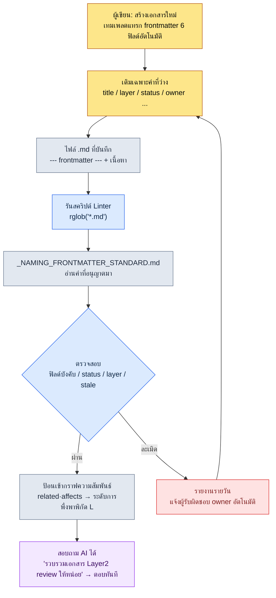

# 2.1 YAML Frontmatter — เปลี่ยนทุกเอกสารให้เป็นข้อมูล

คืนก่อนวันสร้างบิลด์มาตรฐานสำคัญ (milestone build) เพียงหนึ่งวัน เพื่อนร่วมทีม A ซึ่งเป็น System Designer ถามผมผ่านแชตภายในทีมว่า "สัปดาห์นี้มีเอกสารที่แตะเส้นโค้งรางวัล (reward curve) กี่ฉบับครับ แล้วที่ตรวจเสร็จแล้วไปถึงไหนแล้ว" ผมไม่รู้คำตอบ เอกสารอยู่ที่ใดที่หนึ่งในโฟลเดอร์ ส่วนข้อมูลว่าใครเป็นคนแก้ครั้งสุดท้าย เป็นของมาตรฐานสำคัญรอบไหน กระจัดกระจายอยู่ในความทรงจำของแต่ละคนและในข้อตกลงเรื่องการตั้งชื่อไฟล์ สิ่งที่เราทำในคืนนั้นคือสร้างข้อตกลงให้ใส่หกบรรทัดไว้ที่ต้นเอกสาร และหกบรรทัดนั้นเองที่ทำให้ตั้งแต่มาตรฐานสำคัญรอบถัดไป คำถามของเพื่อนร่วมทีม A สามารถตอบได้โดยที่คนไม่ต้องเปิดโฟลเดอร์เลย

YAML ไม่กี่บรรทัดที่เขียนไว้ระหว่าง `---` ด้านบนสุดของเอกสาร เราเรียกสิ่งนี้ว่า frontmatter ข้อตกลงนี้บอกทั้งคนและเครื่องพร้อมกันว่า "เอกสารนี้คืออะไร" โดยไม่ต้องอ่านเนื้อหาแม้แต่ตัวอักษรเดียว บทนี้จะตามรอยผ่านสคริปต์ที่ทำงานได้จริงว่า บรรทัดเดียวนั้นกลายเป็นพิกัดทางเข้าของสถาปัตยกรรมข้อมูล (information architecture) ทั้งระบบได้อย่างไร

ขอปูพื้นคำศัพท์ไว้เพียงคำเดียวก่อน หนังสือเล่มนี้แบ่งเอกสารออกแบบออกเป็นห้า **Layer** (จะกล่าวถึงอย่างจริงจังในบทที่ 6) L0 = โลกของเกม·คอนเซปต์, L1 = กฎของระบบ, L2 = เนื้อหา, L3 = ข้อมูล, L4 = พิกัดการ implement ทิศทางปกติคือพึ่งพาจากบนลงล่าง บรรทัด `layer: 2` ที่ปรากฏในหัวข้อถัดไปคือการประกาศพิกัดว่า "เอกสารนี้คือ Layer เนื้อหา"

---

## 2.1.1 ทำไมไม่ใช่ "เอกสาร" แต่เป็น "เอกสารในฐานะข้อมูล"

เอกสารออกแบบเกมแบบดั้งเดิมอยู่บน Word, PPT และ Google Docs มาโดยตลอด เนื้อหาถูกปรับให้เหมาะกับการอ่านของคน แต่ข้อมูลเชิงเมตา (meta information) อย่างประเภท·ความรับผิดชอบ·สถานะ·ตำแหน่งของเอกสาร กลับฝังอยู่ในเนื้อหา หรือไม่ก็ขึ้นอยู่กับโครงสร้างโฟลเดอร์และข้อตกลงเรื่องชื่อไฟล์ ดังนั้นถ้าจะรู้ว่า "เอกสารนี้เป็นของมาตรฐานสำคัญรอบไหน ใครเป็นผู้รับผิดชอบ และตรวจครั้งสุดท้ายเมื่อไหร่" ก็ต้องเปิดเนื้อหาขึ้นมาดู

ตรงนี้มีข้อจำกัดสองอย่างซ้อนกันอยู่ ข้อแรก เอกสารไม่บอกตัวตนของตัวเอง ตัวตนอยู่ในความทรงจำของคนและในข้อตกลงเรื่องโฟลเดอร์ ซึ่งข้อตกลงเหล่านั้นจะผุกร่อนเมื่อเวลาผ่านไป ข้อสอง AI ไม่มีเบาะแสที่จะอนุมานบริบทได้ ถ้าสั่ง Claude Code ว่า "ช่วยตรวจเอกสารนี้ให้หน่อย" มันก็จะอ่านเนื้อหาตั้งแต่ต้นจนจบ สิ้นเปลืองโทเค็น และยังไม่รู้ด้วยว่าขอบเขตความรับผิดชอบไปถึงไหน

YAML frontmatter แก้ทั้งสองข้อนี้พร้อมกัน ถ้าใส่เมตาดาตาไว้อย่างชัดเจนที่ต้นเอกสาร ทั้งคนและเครื่องก็ระบุเอกสารได้โดยไม่ต้องเปิดเนื้อหา เหมือนกับที่เมื่อมีป้ายติดอยู่หน้าลิ้นชักตู้เก็บเอกสาร เราก็รู้ว่าข้างในมีอะไรโดยไม่ต้องเปิดลิ้นชัก และป้ายนี้ไม่ได้เป็นเพียงเครื่องมือจัดหมวดหมู่เท่านั้น อย่างที่จะได้เห็นต่อไป ฟิลด์ `layer` เพียงฟิลด์เดียวกลายเป็นพิกัดทางเข้าของการสร้างแบบโพรซีเดอรัล (procedural generation) และการตรวจสอบอัตโนมัติ

---

## 2.1.2 Frontmatter จริง — 14 บรรทัดแรกของเอกสารหนึ่งฉบับ

แทนที่จะยกตัวอย่างนามธรรม เราจะดู frontmatter ที่เอกสารเส้นโค้งรางวัลของโปรเจกต์ A แบกไว้บนหัวจริง ๆ ตามที่เป็น (เปลี่ยนเฉพาะ ID·ชื่อจริงให้เป็นนามแฝง ส่วนโครงสร้างเป็นไปตามที่ใช้งานจริง)

```yaml
---
title: "เส้นโค้งรางวัล เควสต์หลัก บทที่ 12"
layer: 2
status: review
owner: teammate_a
created: 2026-04-15
updated: 2026-05-20
related:
  - quest_main_chapter12
  - reward_curve_milestone_2
affects:
  - L3_BalanceSheet_v2
ip_check: passed
---

# เส้นโค้งรางวัล เควสต์หลัก บทที่ 12

(เริ่มเนื้อหา)
```

หัวใจอยู่ที่การแยกส่วนเหนือและใต้ `---` ด้านบนคือข้อมูลที่ parser อ่าน ด้านล่างคือเนื้อหาที่คนอ่าน โดยปกติตัว render มาร์กดาวน์จะซ่อน frontmatter ไว้ จึงไม่รบกวนเวลาอ่าน ไฟล์เดียวบรรจุทั้งข้อมูล (frontmatter) และเนื้อหา (body) ไว้ด้วยกัน จึงกลายเป็นแหล่งข้อมูลจริงเพียงแหล่งเดียว (single source of truth)

ต้องสังเกตสองบรรทัดนี้ให้ดี คือ `layer: 2` และ `affects: [L3_BalanceSheet_v2]` นี่คือการประกาศว่า "เอกสารเนื้อหา (L2) ฉบับนี้ส่งผลต่อชีตปรับสมดุล (balance sheet) ใน Layer ข้อมูล (L3)" เพียงเท่านี้เครื่องมือก็วาดความสัมพันธ์การพึ่งพา L2→L3 เป็นกราฟได้โดยไม่ต้องดูเนื้อหา ในทางกลับกัน ถ้าเอกสารข้อมูล L3 อ้างถึงกฎของระบบ L1 ด้วย `depends_on` (เป็นการพึ่งพาย้อนทิศจากล่างขึ้นบน) นั่นคือกลิ่นของปัญหาในการออกแบบ และเครื่องมือจะตรวจจับการอ้างย้อนนั้นโดยอัตโนมัติ

เหตุผลที่ YAML เขียนด้วยมือง่ายกว่า JSON นั้นเรียบง่าย มันแสดงโครงสร้างด้วยการเยื้องบรรทัด (indentation) แทบไม่ต้องใช้เครื่องหมายคำพูด และใช้คอมเมนต์ `#` ได้ จึงเหมาะกับการให้นักออกแบบเกมกรอกเองโดยตรง

---

## 2.1.3 มาตรฐานอยู่ที่ไหน — `_NAMING_FRONTMATTER_STANDARD`

ฟิลด์เพิ่มได้ไม่จำกัด แต่ยิ่งเพิ่ม ภาระในการเขียนก็ยิ่งมากและมาตรฐานก็ยิ่งพังทลาย ดังนั้นโปรเจกต์ A จึงแยกการใช้งานออกเป็นสองชั้น คือ ฟิลด์หลักขั้นต่ำที่ทุกเอกสารมีร่วมกัน และฟิลด์ขยายเฉพาะโดเมนตามแต่ละสาขา

ฟิลด์หลักขั้นต่ำที่ใช้ร่วมกันมีหกฟิลด์

| ฟิลด์ | รูปแบบ | การใช้งาน |
|------|------|------|
| `title` | สตริง | ชื่อที่คนอ่านได้ ต่างจากชื่อไฟล์ก็ได้ |
| `layer` | 0\~4 | พิกัด Layer ตามบทที่ 6 |
| `status` | draft / review / approved / archived | สถานะเอกสาร |
| `owner` | ชื่อผู้ใช้ | ผู้รับผิดชอบ (1 คน) |
| `created` | YYYY-MM-DD | วันที่สร้าง |
| `updated` | YYYY-MM-DD | วันที่แก้ไขล่าสุด |

เพียงหกฟิลด์นี้ก็รู้ความสด·ความรับผิดชอบ·ตำแหน่งของเอกสารได้ทันที เดือนแรกให้อดทนต่อแรงกระตุ้นที่อยากใส่เพิ่ม เมื่อใช้งานไปสักพักก็จะเห็นได้เองว่าฟิลด์ไหนจำเป็นจริง ๆ

ฟิลด์ขยายเฉพาะสาขาต่างกันไปในแต่ละโดเมน System Designer ชอบใช้ `depends_on`·`affects`, ฝ่ายออกแบบการต่อสู้ใช้ `combat_phase`·`anim_target`, ฝ่ายเนื้อเรื่องใช้ `world_region`·`chapter`, ฝ่ายปรับสมดุลใช้ `data_sheet`·`formula_id` ฟิลด์ขยายเหล่านี้ห้ามกระจัดกระจายโดยอิสระ จึงต้องมีเอกสารมาตรฐานเพียงฉบับเดียวที่ตรึงชื่อทางการ·ค่าที่อนุญาต·ตัวอย่างไว้ตายตัว เอกสารฉบับนั้นคือ `_NAMING_FRONTMATTER_STANDARD.md` หากต้องการเพิ่มฟิลด์ใหม่ก็ต้องผ่านเอกสารนี้ และเอกสารมาตรฐานฉบับนี้เองก็ลงทะเบียนเป็น atom จึงได้รับการจัดการในสายเดียวกับกฎที่บังคับให้ใส่หมายเลข Layer ไว้หน้าชื่อเอกสาร (atom ชื่อ `docs_layer_numeric_prefix_naming`)

ตรงนี้เกิดการเปลี่ยนผ่านที่สำคัญ ถ้ามาตรฐานเป็นเพียงเอกสารที่คนอ่าน คนก็จะฝ่าฝืน แต่ถ้าทำมาตรฐานให้เป็น **ข้อมูลที่เครื่องอ่าน** เครื่องก็จะบังคับใช้มัน หัวข้อถัดไปคือโค้ดจริงของการเปลี่ยนผ่านนั้น

---

## 2.1.4 บันทึกเซสชันจริง (worked transcript) — บังคับมาตรฐานด้วยโค้ด และบทเรียนจากบั๊ก datetime

คราวนี้ผมให้ Claude Code สร้าง "Linter ที่ตรวจว่าเอกสารมาร์กดาวน์ทุกฉบับของโปรเจกต์ A ปฏิบัติตามมาตรฐาน frontmatter หรือไม่" ความต้องการหลักมีสองข้อ คือ ให้จับรายการตรวจสอบให้ได้ (ฟิลด์บังคับขาดหาย, ค่า status ที่ไม่เป็นมาตรฐาน, layer ละเมิดช่วง 0\~4, เอกสารที่เป็น review แต่ไม่ถูกแก้นานเกิน 90 วัน) และ **อย่าฮาร์ดโค้ดค่าที่อนุญาตลงในโค้ด แต่ให้อ่านมาจากเอกสารมาตรฐาน** การแยกส่วนนี้คือหัวใจ แก้มาตรฐานแล้วเกณฑ์การตรวจก็เปลี่ยนโดยไม่ต้องแก้โค้ด (สคริปต์ฉบับเต็มและขั้นตอนรันโดยตรง อยู่ใน «ลองทำดู» ท้ายบทนี้)

ตรงนี้เกิดเหตุการณ์หนึ่งขึ้น โค้ดที่ Claude เสนอมาในตอนแรกคำนวณผลต่างของวันที่ในการตรวจ STALE ด้วย `today - fm["updated"]` และเขียนคอมเมนต์ไว้ว่า "ถ้าเขียนแบบ `updated: 2026-05-20` PyYAML จะ parse เป็น `datetime.date` ให้อัตโนมัติ" คำพูดนี้ถูกแค่ครึ่งเดียว เมื่อรันกับเอกสารจริง บางไฟล์ก็เกิด traceback ขึ้น

```
TypeError: unsupported operand type(s) for -: 'datetime.date' and 'str'
```

ต้นตออยู่ที่มือคน ผู้เขียนบางคนเขียน `updated: 2026-05-20` (parse เป็น date) บางคนเขียน `updated: "2026-05-20"` โดยใส่เครื่องหมายคำพูด (parse เป็นสตริง) ตรงที่มาตรฐานไม่ได้ตรึงรูปแบบวันที่ไว้ มือคนก็แตกออกเป็นสองทาง และ Claude สมมติไว้เพียงทางเดียว ผมปฏิเสธโค้ดนั้นและขอใหม่ว่า "ให้ normalize ทั้งสองแบบเป็น date อย่างปลอดภัย และให้กรองกรณีที่ไม่มี `updated` ด้วย" Claude จึงเสริมฟังก์ชันช่วย (helper) ที่ตรวจชนิดของอินพุตแล้ว normalize ทั้งคู่ให้เป็น `datetime.date` (บล็อกที่แก้แล้วก็ดูได้ใน «ลองทำดู»)

บทเรียนที่แท้จริงไม่ใช่บั๊กของโค้ด แต่คือเรื่องที่ว่า **ตรงที่มาตรฐานไม่ได้ตรึงรูปแบบการเขียนวันที่ไว้ มือคนก็แตกออกเป็นสองทาง** ผมจึงเพิ่มบรรทัด `updated: YYYY-MM-DD (ไม่ใส่เครื่องหมายคำพูด)` ลงใน `_NAMING_FRONTMATTER_STANDARD.md` กลายเป็นว่า Linter กำลังตรวจโค้ดอยู่ แต่กลับเผยให้เห็นรูโหว่ของมาตรฐานซึ่งเป็นตัวสิ่งที่มันใช้ตรวจเสียเอง

ผลลัพธ์แรกของสคริปต์ที่แก้แล้วก็ยังไม่สะอาด ผมขอคงผลลัพธ์ที่รกออกมาจริง ๆ ไว้ตามนั้น

```
[NO-FM]   manuscript/legacy/old_combat_notes.md
[MISSING] manuscript/system/quest_flag_table.md: layer
[STATUS]  manuscript/content/town_intro.md: WIP
[LAYER]   manuscript/balance/dps_v2.md: None
[STALE]   manuscript/system/inventory_rules.md: 134d
```

ห้าบรรทัดนี้คือสถานะจริงของทีมในช่วงเริ่มนำมาใช้ เอกสารเก่าไม่มี frontmatter เลย (`NO-FM`), บางเอกสารตกหล่น `layer`, บางคนใช้ค่าที่ไม่เป็นมาตรฐานอย่าง `status: WIP`, เอกสารปรับสมดุลฉบับหนึ่งปล่อย `layer` เป็น `None`, และเอกสารกฎของระบบฉบับหนึ่งหลับอยู่ในสถานะ `review` มา 134 วันแล้ว มาตรฐานไม่เคยถูกปฏิบัติตามตั้งแต่แรก Linter เพียงแค่เผยข้อเท็จจริงนั้นออกมาให้เห็นทุกเช้าเท่านั้นเอง

---

## 2.1.5 จาก frontmatter ถึงสคริปต์ — กระแสการไหล

ถ้าบีบอัดบันทึกเซสชันจริงข้างต้นให้เป็นแผนภาพการไหลภาพเดียว จะได้ตามนี้ มันแสดงให้เห็นว่าบรรทัดเดียวที่คนเขียนไหลไปจนถึงด่านตรวจสอบของเครื่องได้อย่างไร



หัวใจมีสองอย่าง ข้อแรก มาตรฐาน (E) ถูกแยกจากสคริปต์ (D) แก้มาตรฐานแล้วเกณฑ์การตรวจก็เปลี่ยนโดยไม่ต้องแก้โค้ด ข้อสอง การละเมิด (H) ไม่ใช่ทางตัน แต่เป็นลูปที่วนกลับไปยังขั้นการเขียน (B) ไม่ใช่การโทษคน แต่ส่งกลับไปให้เจ้าของเอกสารแก้เอกสารของตัวเอง

---

## 2.1.6 กรณีใช้งานจริง — หกเดือนของทีมขนาดกลางทีมหนึ่ง

โปรเจกต์ A ที่ผู้เขียนดูแลในฐานะ Director ได้นำ frontmatter มาใช้กับทีมออกแบบทั้งหมด (4\~5 คน) เมื่อราวหกเดือนก่อน การนำมาใช้ไม่ได้สำเร็จในครั้งเดียว แต่ผ่านสี่ช่วงต่อ

แรงต้านที่ใหญ่ที่สุดในสัปดาห์แรกของการนำมาใช้คือ "ให้เขียนด้วยมือทุกครั้งเลยเหรอ" การจำหกบรรทัดมาเขียนทุกครั้งที่สร้างเอกสารใหม่นั้นน่ารำคาญ ทางแก้คือการแทรกเทมเพลตอัตโนมัติ snippet ของ VSCode, เทมเพลตของ Obsidian, ปุ่ม "เอกสารใหม่" ในพอร์ทัลออกแบบ ต่างก็แทรกบล็อก YAML เปล่าให้อัตโนมัติ ผู้เขียนเอกสารเพียงเติมค่าที่ว่าง แรงต้านก็หายไปภายในหนึ่งสัปดาห์

เดือนแรกเกิดความขัดแย้งเรื่องมาตรฐาน เมื่อหลายคนเพิ่มฟิลด์ได้อย่างอิสระ `owner`·`responsible`·`author` ก็ปรากฏขึ้นพร้อมกัน เป็นแนวคิดเดียวกันแต่เขียนได้สามแบบ การค้นหาและการทำงานอัตโนมัติจึงพังลง ทางแก้คือรวบรวมชื่อทางการ·ค่าที่อนุญาต·ตัวอย่างของทุกฟิลด์ไว้ในเอกสารเดียวคือ `_NAMING_FRONTMATTER_STANDARD.md` แล้วตั้งกฎให้การเพิ่มฟิลด์ใหม่ต้องผ่านเอกสารนี้ ภายในหนึ่งเดือนมาตรฐานก็มั่นคง

เดือนที่สาม Linter ที่เห็นในหัวข้อ 2.1.4 ก็เข้ามา ต่อให้มีมาตรฐานคนก็ยังฝ่าฝืน ดังนั้นจึงให้สร้างรายงานความสอดคล้องอัตโนมัติทุกเช้าแล้วส่งลงในช่องสาธารณะของแชตภายในทีม ผู้รับผิดชอบดูแค่เอกสารของตัวเองก็พอ หลังจากทำอัตโนมัติแล้ว การละเมิดมาตรฐานก็ลดลงอย่างเห็นได้ชัด (เป็นการประมาณของผู้เขียน ไม่ใช่ค่าที่วัดอย่างแม่นยำ — รู้สึกได้ราว ๆ ครึ่งหนึ่งลงไป)

เดือนที่หก การผสานเข้ากับ AI ก็เปล่งประกาย เมื่อมาตรฐานมั่นคง คำถามต่อไปนี้ก็ได้คำตอบกลับมาทันที

- "รวบรวมเอกสาร Layer 2 ที่อัปเดตในช่วงสองสัปดาห์ที่ผ่านมาและมี status เป็น review ให้หมด"
- "วาดไทม์ไลน์การเปลี่ยนสถานะของเอกสารทุกฉบับที่ผมเป็น owner ให้หน่อย"
- "ดึงรายการเอกสารอื่นที่คำขอแก้ไขนี้ส่งผลกระทบมาให้หน่อย" — โดยตามกราฟ `related`·`affects` อัตโนมัติ

ในที่สุด frontmatter ก็กลายเป็นคำศัพท์ร่วมระหว่างคนกับ AI คนเขียน AI ก็เข้าใจ AI เขียน คนก็ตรวจสอบ ทั้งคู่มองคีย์ชุดเดียวกัน อย่างไรก็ดี แรงต้านในสัปดาห์แรก, ความขัดแย้งในเดือนแรก, Linter ในเดือนที่สาม, การผสานในเดือนที่หก — เป็นผลที่หกเดือนสะสมกันสร้างขึ้น ไม่ได้เกิดในครั้งเดียว

---

## 2.1.7 ข้อผิดพลาดที่พบบ่อยและวิธีเลี่ยง

ข้อผิดพลาดที่เกิดซ้ำในช่วงเริ่มนำมาใช้รวบรวมได้เป็นห้าอย่าง ทุกข้อตั้งอยู่บนรากเดียวกัน — "ตรงที่ปล่อยมาตรฐานไว้กับเจตจำนงของคนเพียงอย่างเดียว"

| ข้อผิดพลาด | สาเหตุของปัญหา | วิธีเลี่ยง |
|---|---|---|
| นิยามฟิลด์มากเกินไปตั้งแต่แรก | ผู้เขียนเหนื่อยกับการเติมค่าว่างจนคุณภาพตก | เริ่มด้วยหกฟิลด์หลัก หลัง 1\~2 เดือนค่อยเพิ่มเฉพาะที่ใช้บ่อย |
| ชื่อฟิลด์เปลี่ยนไปเรื่อย ๆ (`tag`→`tags`→`category`) | ชื่อเก่าค้างในเอกสารสะสมจนการค้นหา·การทำงานอัตโนมัติพัง | เปลี่ยนชื่อต้องมาพร้อมสคริปต์ migration เจอชื่อเก่าให้แปลงอัตโนมัติหรือเตือน |
| คนเขียนด้วยมือทุกครั้ง | พิมพ์ผิด·ฟิลด์ตกหล่น·รูปแบบวันที่แตกทาง (บั๊กนั้นในหัวข้อ 2.1.4) กลายเป็นเรื่องปกติ | ทำเทมเพลต·snippet·"เอกสารใหม่" อัตโนมัติก่อน ให้มือคนแตะเฉพาะค่าที่มีความหมาย |
| วางมาตรฐานไว้เฉย ๆ โดยไม่มีการตรวจสอบ | ถึงมีมาตรฐานก็ไม่รู้ว่าใครฝ่าฝืน แล้วผุกร่อนไปตามธรรมชาติ | Linter + รายงานอัตโนมัติรายวันให้ผู้ฝ่าฝืนแก้เอง |
| ลืมฟิลด์ `layer` | ถ้าไม่มีพิกัด Layer ก็สร้างทั้งการมองเห็นข้ามสาขาและด่านตรวจสอบไม่ได้ทั้งคู่ | บังคับ `layer` เป็นฟิลด์จำเป็น Linter ตรวจจับการตกหล่น |

ไม่จำเป็นต้องกันข้อผิดพลาดทั้งห้าให้ครบตั้งแต่วันแรก ข้อ 1·3 ให้จับรูปแบบการเลี่ยงไว้ตั้งแต่สัปดาห์แรกของการนำมาใช้ ส่วนข้อ 2·4·5 ค่อย ๆ ใส่เข้าไปทีละข้อโดยเริ่มจากจุดที่ทีมของตัวเองชนบ่อยที่สุดในระหว่างการใช้งาน จะเป็นไปอย่างเป็นธรรมชาติกว่า

---

## 2.1.8 เริ่มจากเล็ก — ทำให้ลงตัวภายในสามสัปดาห์

การนำ frontmatter มาใช้เป็นงานที่เบากว่าที่คิด สามสัปดาห์ก็ลงตัวได้ในทีมหนึ่ง

สัปดาห์แรกให้นิยามหกฟิลด์หลัก ทำเทมเพลต แล้วใช้กับเอกสารใหม่เท่านั้นเพื่อให้ภาระการเขียนน้อยที่สุด สัปดาห์ที่สองให้ใช้กับเอกสารยอดนิยม 20 ฉบับแรกที่ดูบ่อยด้วยมือ เพื่อตรวจดูจากการใช้งานจริงว่าฟิลด์ไหนยังขาด สัปดาห์ที่สามเมื่อเปิดใช้ Linter และรายงานรายวัน ตั้งแต่นั้นมาตรฐานก็คงอยู่ด้วยพลังของเครื่องมือ ไม่ใช่ด้วยเจตจำนงของคน

ไม่ต้อง migrate เอกสารทั้งหมดในครั้งเดียว ใช้กับเอกสารที่ดูบ่อยก่อน กับเอกสารใหม่ก่อน พอผ่านไปราวหกเดือน เอกสารแทบทุกฉบับก็จะมี frontmatter ติด แต่ก็ไม่ได้หมายความว่าเป้าหมายคือ 100% การเสียเวลา migrate ไปจนถึงเอกสารเก่าที่ไม่เคยเปิดเลยแม้แต่ครั้งเดียวนั้นเป็นการสิ้นเปลือง

---

## ลองทำดู

เราจะลองรันหนึ่งรอบด้วยตัวเองในหน่วยที่เล็กที่สุด

**setup**
- วางเอกสาร `.md` ที่จะตรวจไว้ 2\~3 ฉบับในโฟลเดอร์งาน บางฉบับให้ตั้งใจลบ `layer` ออก หรือใส่ค่าที่ไม่เป็นมาตรฐานอย่าง `status: WIP` ไว้
- วางเอกสารมาตรฐานหนึ่งบรรทัดไว้ในโฟลเดอร์เดียวกัน
  ```
  status: allowed = ["draft", "review", "approved", "archived"]
  updated: YYYY-MM-DD (ไม่ใส่เครื่องหมายคำพูด)
  ```

**prompt** (ป้อนใน Claude Code)
> ช่วยเขียนสคริปต์ Python ที่ตรวจ YAML frontmatter ของไฟล์ .md ทุกไฟล์ใต้โฟลเดอร์นี้ให้หน่อย ให้จับ ฟิลด์บังคับ title·layer·status·owner ที่ขาดหาย, status ละเมิดค่าที่อนุญาต (อ่านมาจากเอกสารมาตรฐาน), layer ละเมิดจำนวนเต็มช่วง 0\~4, และที่เป็น review แต่ updated เกิน 90 วัน ให้จัดการได้อย่างปลอดภัยทั้งกรณีที่ `updated` มาเป็นสตริงและมาเป็น date แล้วแสดงการละเมิดแยกตามไฟล์

**verify**
- รันสคริปต์แล้วตรวจดูว่าการละเมิดที่ตั้งใจฝังไว้ถูกจับได้ทั้งหมดหรือไม่
- เพิ่ม `WIP` ลงในรายการ `allowed` ของเอกสารมาตรฐาน แล้วรันใหม่ ตรวจดูว่าทั้งที่ไม่ได้แก้โค้ดแม้แต่บรรทัดเดียว `status: WIP` กลับเปลี่ยนเป็นผ่านหรือไม่ นั่นคือหลักฐานว่ามาตรฐานกับโค้ดถูกแยกจากกัน
- ใส่ทั้งเอกสารที่ใส่เครื่องหมายคำพูดให้ `updated` และที่ไม่ใส่ ลงไปทั้งคู่ แล้วตรวจดูว่า `TypeError` ที่เห็นในหัวข้อ 2.1.4 ไม่เกิดขึ้น

**อ้างอิง: สคริปต์ Linter ฉบับเต็ม**

นี่คือโค้ดที่ Claude เสนอมาในตอนแรกในหัวข้อ 2.1.4 บรรทัดตรวจ STALE (`age = (today - fm["updated"]).days`) มีบั๊ก datetime ค้างอยู่ตามนั้น

```python
import sys, datetime, pathlib, re
import yaml  # PyYAML

ROOT = pathlib.Path("manuscript")
STANDARD = pathlib.Path("_NAMING_FRONTMATTER_STANDARD.md")
REQUIRED = ["title", "layer", "status", "owner"]

def load_allowed_status(standard_path):
    # ดึงค่าที่อนุญาตของ `status` มาจากเอกสารมาตรฐาน
    text = standard_path.read_text(encoding="utf-8")
    m = re.search(r"status:\s*allowed\s*=\s*\[(.*?)\]", text)
    if not m:
        return ["draft", "review", "approved", "archived"]
    return [s.strip().strip('"').strip("'") for s in m.group(1).split(",")]

def parse_frontmatter(md_path):
    text = md_path.read_text(encoding="utf-8")
    if not text.startswith("---"):
        return None
    end = text.find("---", 3)
    block = text[3:end]
    return yaml.safe_load(block)

def main():
    allowed = load_allowed_status(STANDARD)
    today = datetime.date.today()
    violations = 0
    for md in ROOT.rglob("*.md"):
        fm = parse_frontmatter(md)
        if fm is None:
            print(f"[NO-FM]   {md}")
            violations += 1
            continue
        for field in REQUIRED:
            if field not in fm:
                print(f"[MISSING] {md}: {field}")
                violations += 1
        if fm.get("status") not in allowed:
            print(f"[STATUS]  {md}: {fm.get('status')}")
            violations += 1
        if not isinstance(fm.get("layer"), int) or not (0 <= fm.get("layer") <= 4):
            print(f"[LAYER]   {md}: {fm.get('layer')}")
            violations += 1
        if fm.get("status") == "review":
            age = (today - fm["updated"]).days   # ← ตรงนี้พัง
            if age > 90:
                print(f"[STALE]   {md}: {age}d")
                violations += 1
    sys.exit(violations)
```

บล็อกหลักที่แก้กลับมาหลังการขอใหม่ normalize `updated` ให้เป็น date อย่างปลอดภัยทั้งกรณีที่มาเป็นสตริงและมาเป็น date

```python
def as_date(v):
    if isinstance(v, datetime.date):
        return v
    if isinstance(v, str):
        return datetime.date.fromisoformat(v.strip())
    return None

# ส่วนที่แทนการตรวจ STALE ภายใน main()
if fm.get("status") == "review":
    upd = as_date(fm.get("updated"))
    if upd is None:
        print(f"[MISSING] {md}: updated")
        violations += 1
    elif (today - upd).days > 90:
        print(f"[STALE]   {md}: {(today - upd).days}d")
        violations += 1
```

### ฉบับย่อสำหรับคนเดียว

ไม่มีทีมก็ได้ ในโฟลเดอร์โน้ตที่ใช้คนเดียว ให้ลดฟิลด์หลักเหลือสามคือ `title`·`status`·`updated` แล้วตั้ง Linter ให้จับเฉพาะ "เอกสารที่ status เป็น review แต่ updated เกิน 30 วัน" เพียงเท่านี้ "เอกสารที่ผมตรวจค้างไว้แล้วลืม" ก็จะลอยขึ้นมาเหนือผิวน้ำสัปดาห์ละครั้ง สามเหลี่ยมมาตรฐาน-เทมเพลต-การตรวจสอบทำงานได้เหมือนเดิมแม้ในขนาดคนเดียว

---

### สรุปประเด็นสำคัญของบท
- frontmatter หนึ่งบรรทัดคืออิฐข้อมูลก้อนเล็กที่สุดที่ใช้ระบุเอกสารได้โดยไม่ต้องอ่านเนื้อหา
- แยกมาตรฐานออกจากโค้ดแล้ววางไว้เป็นเอกสาร จะเปลี่ยนเกณฑ์การตรวจได้โดยไม่ต้องแก้โค้ด
- ฟิลด์ `layer` เพียงฟิลด์เดียวกลายเป็นพิกัดทางเข้าของการสร้างแบบโพรซีเดอรัลและการตรวจสอบอัตโนมัติ
