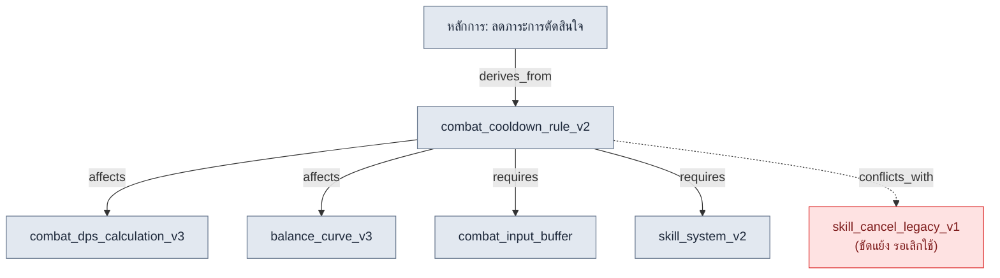
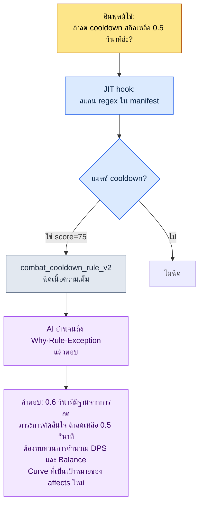

# 2.2 Atom รายหน้า — กายวิภาคของ 1 เอกสาร 1 การตัดสินใจ

สัปดาห์แรกที่พนักงานใหม่เข้ามา เขาถามผมผ่านแชตว่า "Cooldown ของการต่อสู้คือ 0.6 วินาทีใช่ไหมครับ มันเขียนอยู่ในเอกสารไหน" ผมตอบว่า "อยู่ใน GDD ของระบบสกิล (Game Design Document หรือเอกสารสเปกแบบละเอียด)" เขาถามต่อว่า "GDD นั้นอยู่ในหัวข้อไหน เพราะหลังจากการออกแบบคลาสก็เป็น Damage Curve ต่อด้วยวิธีแสดงผล UI รวมแล้ว 220 บรรทัด" ผมจึงเปิดไฟล์แล้วหาให้เขาเอง มันอยู่บรรทัดที่ 137 สุดท้ายเขาถามว่า "แต่ทำไมต้อง 0.6 วินาที 0.5 ไม่ได้เหรอครับ" คำตอบนั้นไม่มีอยู่ในเอกสารใดเลย ผมจำได้ว่าตัดสินใจกันในการประชุมเมื่อ 6 เดือนก่อน แต่เหตุผลถูกฝังอยู่ที่ไหนสักแห่งในบันทึกการประชุม

ในบทสนทนา 5 นาทีนี้บรรจุความล้มเหลวทั้งสามของเอกสารรวม 220 บรรทัดไว้ครบ — หาตำแหน่งไม่เจอ (การค้นหาล้มเหลว) ไม่มีเหตุผล (บริบทสูญหาย) และต้องให้คนเป็นตัวกลางทุกครั้ง (อัตโนมัติไม่ได้) ถ้าถามคำถามเดียวกันนี้กับ AI สถานการณ์จะยิ่งแย่ลง AI จะอ่านครบทั้ง 220 บรรทัด แล้วตอบโดยปนเรื่อง Damage Curve ที่ไม่เกี่ยวกับ cooldown เข้ามาด้วย

ยาที่บทนี้สั่งจ่ายนั้นเรียบง่าย **เอกสารหนึ่งฉบับบรรจุการตัดสินใจเพียงหนึ่งเดียว** เอกสารหน่วยการตัดสินใจที่ถูกซอยย่อยด้วยหลักการนี้ เราเรียกว่า atom เมื่อแยก GDD 220 บรรทัดออกเป็นชิ้น ๆ "cooldown คือ 0.6 วินาที" ก็จะกลายเป็น atom หนึ่ง และภายใน atom นั้นจะรวมตำแหน่ง เนื้อหา เหตุผล ข้อยกเว้น และความสัมพันธ์ไว้ในที่เดียวกัน บทนี้จะไม่พูดทฤษฎีลอย ๆ แต่จะผ่ากายวิภาค atom จริงหนึ่งตัวจนจบ — ตั้งชื่ออย่างไร ใส่ frontmatter แบบใด ระบุความสัมพันธ์อย่างไร และผลลัพธ์คือ AI หยิบเฉพาะ atom ตัวนั้นออกมาได้แม่นยำอย่างไร

---

## 2.2.1 เลือกตัวอย่างมาหนึ่งชิ้น — `combat_cooldown_rule_v2`

ตัวอย่างที่จะผ่าคือ atom หนึ่งตัวที่ใช้งานจริงอยู่ในโปรเจกต์ A ชื่อ `combat_cooldown_rule_v2` เนื้อไฟล์ทั้งหมดเป็นดังนี้ ไม่ยาว เพราะบรรจุการตัดสินใจเพียงหนึ่งเดียว

```markdown
---
name: combat_cooldown_rule_v2
title: "กฎ Cooldown การต่อสู้ — v2"
type: rule
layer: 1
status: approved
owner: อี มินซู
created: 2026-03-10
updated: 2026-05-12
applies_to: [skill_system, item_system]
---

# กฎ Cooldown การต่อสู้ v2

Why (ทำไม): เพื่อจำกัดจำนวนสกิลที่ใช้พร้อมกันได้ ลดภาระการ
ตัดสินใจชั่วขณะ และรักษาความหมายของการกดคอมโบไว้

Rule (กฎ): สกิลแอ็กทีฟทุกตัวมี Global Cooldown 0.6 วินาที +
Cooldown รายตัว (กำหนดตามแต่ละสกิล) ระหว่างที่ Global Cooldown
กำลังทำงาน จะร่ายสกิลแอ็กทีฟใดก็ไม่ได้

How to apply (การนำไปใช้):
- เมื่อนิยามสกิลใหม่ ต้องระบุ cooldown รายตัวเสมอ
- ถ้าคอลัมน์ cooldown ใน L3_SkillSheet เป็น 0 ถือว่าละเมิดกฎนี้
- การตรวจสอบความสอดคล้องในขั้น build จะตรวจจับการละเมิดอัตโนมัติ

Exceptions (ข้อยกเว้น):
- สกิลพาสซีฟไม่อยู่ภายใต้กฎนี้
- ท่าไม้ตายใช้ระบบเกจแยกต่างหาก (See: [[ultimate_gauge_system]])

Relations (ความสัมพันธ์):
- affects: [[combat_dps_calculation_v3]], [[balance_curve_v3]]
- derives_from: [[principle_decision_load_reduction]]
- conflicts_with: [[skill_cancel_rule_legacy_v1]]
- requires: [[combat_input_buffer_system]], [[skill_system_v2]]
- is_a: rule
- part_of: combat_system_master
```

ผมจะแยกไฟล์แผ่นนี้ออกเป็นห้าส่วนเพื่อพิจารณา — การตั้งชื่อ frontmatter การตัดสินใจเดี่ยว ความสัมพันธ์ และความสามารถในการสืบย้อน ทั้งห้าส่วนต้องครบ AI จึงจะอ่าน atom นี้เป็น "หน่วยที่มีความหมายในตัวเองได้แม้อยู่ลำพัง"

---

## 2.2.2 ส่วนที่ ① การตั้งชื่อ — ตัวชื่อเองคือพิกัด

ชื่อไฟล์คือ `combat_cooldown_rule_v2` ไม่ใช่ชื่อที่ตั้งขึ้นลอย ๆ แต่มีโครงสร้างสามท่อน

```
combat_         cooldown_rule          _v2
└ prefix        └ ตัวการตัดสินใจ       └ เวอร์ชัน
  (โดเมนใด)       (การตัดสินใจเรื่องอะไร) (ปรับครั้งที่เท่าไร)
```

prefix `combat_` คือพิกัดที่บอกว่า "นี่คือการตัดสินใจของโดเมนการต่อสู้" atom ประเภทกฎของโปรเจกต์ A แยกโดเมนกันด้วย prefix ได้แก่ `quest_` (เควสต์), `data_` (การจัดการข้อมูล), `docs_` (การจัดการเอกสาร), `meeting_` (บันทึกการประชุม), `portal_` (วิวเวอร์เอกสารออกแบบ) แค่ดู prefix ก็จับได้ว่าการตัดสินใจนี้อยู่ในขอบเขตความรับผิดชอบของใคร และได้รับผลกระทบจากที่ไหน

ถ้าการตั้งชื่อสั่นคลอน ทุกอย่างก็สั่นคลอนตาม ถ้าการตัดสินใจเดียวกันมีอยู่สองครั้งในชื่อ `skill-cooldown.md` กับ `cooldown_skill_v2.md` ทั้งการค้นหาก็พัง และการจับคู่ JIT ที่จะกล่าวถึงต่อไปก็พังด้วย ด้วยเหตุนี้โปรเจกต์ A จึงตรึงกฎการตั้งชื่อไว้เป็น atom หนึ่งตัวเสียก่อน นั่นคือ `atom_naming_convention_v1` ซึ่งบังคับ snake_case · บังคับมี prefix · บังคับมี suffix เวอร์ชัน และกฎนี้ไม่ได้อาศัยเจตจำนงของคน แต่ Linter เป็นผู้รักษา ถ้าชื่อไฟล์ที่ไม่มี prefix ถูก commit เข้ามา มันจะถูกดักไว้ในขั้น build

ในการตั้งชื่อยังมีการออกแบบที่ใหญ่กว่าซึ่งร้อยทะลุทั้งเล่มฝังอยู่ `layer: 1` ใน frontmatter คือพิกัดที่สอง ถ้า prefix บอก "โดเมนใด" Layer ก็บอก "ชั้นนามธรรมใด" พิกัดสองตัวต้องประกอบกัน ตำแหน่งของ atom จึงถูกตรึงเป็นจุดเดียวบนระนาบ ตรงนี้ Layer เป็นเพียงพิกัดเท่านั้น (รายละเอียดนิยามชั้น 0\~4 อยู่ใน 2.3) กฎ cooldown เป็น "กฎอินพุตที่ควบคุมการสร้าง" จึงนั่งอยู่ที่ Layer 1 ยังมีกฎที่บังคับให้ใส่พิกัด Layer นี้เป็นเลข prefix หน้าชื่อเอกสารแยกต่างหากด้วย — `docs_layer_numeric_prefix_naming` พูดอีกอย่างคือในชื่อเดียวมีแกนพิกัดสองแกนระบุไว้ครบ

แก่นแท้ของการออกแบบนี้ไม่ใช่นิสัยรักความเป็นระเบียบ มีคำหนึ่งที่ผมพูดกับทีมซ้ำ ๆ **"Layer ที่แบ่งไว้นั้น แบ่งไว้เพื่อการสร้างแบบโพรซีเดอรัล (procedural generation) นั่นเอง"** เมื่อแต่ละ atom ระบุพิกัดโดเมน (prefix) และพิกัดชั้น (Layer) ไว้ ต่อไปก็เป็นไปได้ที่ AI จะ "รับกฎ combat ของ Layer 1 ทั้งหมดเป็นอินพุต แล้วสร้างเนื้อหา (content) ของ Layer 2 โดยอัตโนมัติ" ชื่อคือระบบที่อยู่ (address) ของการทำงานอัตโนมัตินั้น

---

## 2.2.3 ส่วนที่ ② frontmatter — ป้ายกำกับที่เครื่องอ่าน

บล็อก YAML ระหว่าง `---` เหนือเนื้อความคือ frontmatter เป็นการนำมาตรฐานที่กล่าวใน 2.1 มาใช้กับ atom ตรง ๆ และเป็นป้ายกำกับที่ไม่ใช่คนอ่าน แต่เครื่อง (build script · JIT hook · ตัวสร้างแผนผังความสัมพันธ์) เป็นผู้อ่าน

| ฟิลด์ | ค่า | สิ่งที่เครื่องทำด้วยค่านี้ |
|---|---|---|
| `name` | combat_cooldown_rule_v2 | ID เฉพาะที่ใช้เป็นเป้าหมายของ link จาก atom อื่น |
| `type` | rule | สถิติ/ตัวกรองตามหมวด (rule / concept / decision …) |
| `layer` | 1 | สี/การจัดเรียงตาม Layer, แกนอ้างอิงสำหรับตรวจจับการอ้างย้อน |
| `status` | approved | จาก draft · approved · archived มีเพียง approved ที่รวมเข้า build |
| `applies_to` | [skill_system, item_system] | ขอบเขตผลกระทบ — ระบบที่กฎนี้แตะถึง |
| `created`/`updated` | 2026-03-10 / 2026-05-12 | ติดตามการเปลี่ยนแปลง, วันอ้างอิงสำหรับตรวจ atom เก่า |

เมื่อป้ายเหล่านี้ถูกใส่ไว้ การตรวจสอบอัตโนมัติก็ทำได้ ตัวอย่างเช่น ถ้ากฎระบบที่ประกาศเป็น `layer: 1` ไปอ้างถึง data atom (Layer 3) อย่าง `[[L3_SkillSheet_row_0042]]` โดยตรงในเนื้อความ นั่นคือ **การอ้างย้อน (L3→L1)** ที่ชั้นบนถูกผูกติดกับค่ารูปธรรมของชั้นล่าง โปรเจกต์ A ตรวจจับรูปแบบนี้อัตโนมัติในขั้น build เพราะกฎต้องอ้างถึงรูปแบบของข้อมูล ไม่ใช่ข้อมูลทีละแถว ถ้าไม่มีบรรทัด `layer` ใน frontmatter การตรวจสอบนี้ก็ไม่เกิดขึ้นเลย

การจัดการ `status: archived` ก็เป็นงานของ frontmatter เช่นกัน เมื่อการตัดสินใจเปลี่ยนไป atom จะไม่ถูกลบ แต่จะได้ `status: archived` + วันที่ `archived_at` ทั้ง build และ JIT จะคัด atom ที่ archived ออก คือเก็บบันทึกไว้แต่ถอนออกจากตัวที่ใช้งานจริง ตลอด 6 เดือนของการใช้งานในโปรเจกต์ A อัตราการเลิกใช้อยู่ที่ราว 15% (ผู้เขียนวัดจริง) ถ้าอัตรานี้เข้าใกล้ 0% ผมตีความว่าเป็นสัญญาณว่าเวิร์กโฟลว์การเลิกใช้ไม่ทำงาน

---

## 2.2.4 ส่วนที่ ③ การตัดสินใจเดี่ยว — สรุปได้เป็นประโยคเดียวหรือไม่

แก่นของการผ่า atom คือการยืนยันว่าเนื้อความบรรจุการตัดสินใจเพียงหนึ่งเดียวหรือไม่ วิธีตรวจเรียบง่าย **ลองสรุปการตัดสินใจของ atom นี้เป็นประโยคเดียว**

> "สกิลแอ็กทีฟทุกตัวมี Global Cooldown 0.6 วินาที"

จบในประโยคเดียว ผ่าน ถ้าสรุปออกมาเป็นสองประโยคเช่น "cooldown คือ 0.6 วินาที และระหว่างคอมโบลดลง 50%" นั่นคือสองการตัดสินใจ ต้องแยกเป็น `combat_cooldown_rule_v2` (cooldown พื้นฐาน) และ `combat_combo_cooldown_reduction_v1` (การลดในคอมโบ)

มีการตรวจสอบเสริมที่ดูความเป็นหนึ่งเดียวอีกสองข้อ

**การตรวจการเลิกใช้แบบอิสระ** ถ้าเลิกใช้ atom นี้เพียงตัวเดียว ระบบจะพังหรือไม่ ถ้าเลิกใช้กฎ cooldown สมดุลการต่อสู้จะสั่นคลอน แต่ระบบยังเดินได้ แสดงว่าหน่วยถูกต้อง ในทางกลับกัน ถ้าเลิกใช้แล้วอีกห้าตัวพังตามไปด้วย ที่จริงห้าตัวนั้นคือห้าชิ้นส่วนของการตัดสินใจเดียว ต้องรวมเข้าเป็น atom ที่ใหญ่กว่า

**การตรวจการอ้างอิงเดี่ยว** ถ้าที่อื่นวาง link เพียง `[[combat_cooldown_rule_v2]]` ตัวเดียว ความหมายยังเดินได้หรือไม่ ถ้าเดินได้ แสดงว่าหน่วยถูกต้อง ถ้าจะอ้างบรรทัดนี้แล้วต้องอ่านเนื้อความหลายที่ให้ครบ แสดงว่ายังแยกย่อยไม่พอ

เนื้อความที่ผ่านการตรวจเหล่านี้จะจัดเรียงเป็นห้าหัวข้อโดยธรรมชาติ — Why, Rule, How, Exceptions, Relations โดยเฉพาะ **อย่าลบ Why** คำตอบของคำถามสุดท้ายที่พนักงานใหม่ถามในบทนำว่า "ทำไมต้อง 0.6 วินาที" อยู่ตรงนี้ — "เพื่อลดภาระการตัดสินใจชั่วขณะและรักษาความหมายของการกดคอมโบ" เมื่อ 6 เดือนต่อมามีใครเสนอว่า "ลดเหลือ 0.5 วินาทีกันเถอะ" บรรทัดเดียวนี้จะกลายเป็นจุดตั้งต้นของการถกเถียง atom ที่ Why หายไปจะกลายเป็นฟอสซิลที่ไม่มีใครกล้าแตะ

---

## 2.2.5 ส่วนที่ ④ ความสัมพันธ์ — ลูกศรสร้างการวิเคราะห์ผลกระทบ

หัวข้อ Relations ที่ก้นสุดของ atom ทำให้ตัวอย่างนี้ไม่ใช่บันทึกโดดเดี่ยว แต่เป็นโหนดหนึ่งในกราฟ แก่นคือมันไม่ได้เป็นเพียง "เอกสารที่เกี่ยวข้อง" แต่ **ระบุชนิดของความสัมพันธ์**



ความสัมพันธ์หกชนิดต่างทำหน้าที่ต่างกัน

- `derives_from`: การตัดสินใจนี้แตกหน่อมาจากหลักการชั้นบนใด cooldown 0.6 วินาทีคือการทำให้หลักการ "ลดภาระการตัดสินใจ" เป็นรูปธรรม
- `affects`: ถ้า atom นี้เปลี่ยน อะไรจะได้รับผลกระทบ ถ้าเปลี่ยน 0.6 วินาทีเป็น 0.5 วินาที การคำนวณ DPS และ Balance Curve จะสั่นคลอน **ดึงขอบเขตผลกระทบออกมาได้อัตโนมัติก่อนเปลี่ยน**
- `requires`: การตัดสินใจนี้จะตั้งอยู่ได้ต้องมีอะไรอยู่ก่อน ถ้าไม่มีระบบ input buffer Global Cooldown จะกลืนอินพุตหายไป
- `conflicts_with`: ขัดแย้งกับอะไร มันขัดแย้งกับกฎ skill cancel เวอร์ชันเก่า และ link นี้คือสัญญาณว่า "หนึ่งในสองตัวต้องถูกเลิกใช้"
- `is_a` / `part_of`: การจัดประเภท (rule) และการสังกัด (combat_system_master) คือโครงกระดูกของกราฟ

ถ้าเป็นเพียง link แบบ "Related: [เอกสาร A], [เอกสาร B]" คนก็ต้องไล่พิจารณาเองทีละตัว แต่เมื่อชนิดของความสัมพันธ์ถูกใส่เป็น enum เครื่องจะพิจารณาให้ "เปลี่ยน atom นี้แล้วอะไรได้รับผลกระทบบ้าง แสดงมาให้หมด" กลายเป็นคิวรีอัตโนมัติที่ไล่ตาม `affects` และ "ตอนนี้กฎที่ขัดแย้งกันมีอะไรบ้าง หามาให้หมด" กลายเป็นการตรวจอัตโนมัติที่สแกน `conflicts_with` การออกแบบออนโทโลยีเต็มรูปแบบของ enum ทั้งหกนี้จะกล่าวใน 2.4 ส่วน 2.2 เพียงชี้ว่ามาตรฐาน atom ได้นำ enum นั้นมาใช้ล่วงหน้าในรูปแบบหนึ่ง

ลูกศรความสัมพันธ์ยังเป็นอินพุตของเครื่องมือสร้างแผนผังความสัมพันธ์ด้วย `gen_relation_map.py` ของโปรเจกต์ A อ่าน `layer` ใน frontmatter และหัวข้อ Relations ของ atom ทุกตัว แล้ววาดแผนผังความสัมพันธ์ HTML แบบอินเทอร์แอ็กทีฟที่ลงสีตาม Layer ให้อัตโนมัติ เป็นไปได้เพราะ atom แต่ละตัวมีพิกัด (Layer) และลูกศร (Relations)

---

## 2.2.6 ส่วนที่ ⑤ ความสามารถในการสืบย้อน — atom หนึ่งตัวที่กัน 30 นาทีไว้ได้

atom ที่มีครบทั้งห้าส่วนสามารถสืบย้อนได้ ใคร · เมื่อไร · ทำไม จึงตัดสินใจเช่นนี้ และจับอะไรเป็นการละเมิด ทั้งหมดอยู่ในที่เดียวกัน คุณค่าของความสามารถในการสืบย้อนจะคมชัดที่สุดเมื่อเห็นเป็นเหตุการณ์ที่กันไว้ได้จริง ไม่ใช่ตัวเลขสถิติ

atom `meeting_image_caption_standard` ของโปรเจกต์ A คือกฎที่กำหนดให้รูปภาพแนบในบันทึกการประชุมต้องระบุคำบรรยายว่า "เป็นหน้าจออะไร · ทำไมจึงแนบ · เป็นการตัดสินใจอะไร" เสมอ สมัยที่ยังไม่มี atom นี้ มีบันทึกการประชุมหนึ่งที่แนบสกรีนช็อตโดยไม่มีคำบรรยาย หนึ่งสัปดาห์ต่อมาเพื่อนร่วมทีมที่เห็นมัน ต้องใช้เวลา 30 นาทีไปยืนยันกับผู้เขียนว่า "นี่คือหน้าจออะไร" หลังจากมี atom นี้แล้ว เมื่อเกิดการตกหล่นแบบเดียวกันซ้ำ Linter ในขั้น build จับรูปภาพที่ไม่มีคำบรรยายได้อัตโนมัติ แก้ไขเสร็จใน 5 นาที จาก 30 นาทีเหลือ 5 นาที

ตัวอย่างอีกชิ้น `skill_listing_budget_wrapper_only_policy` คือกฎที่จำกัดสล็อตคำสั่งสแลช (slash command) ระดับ global ไว้ที่ 12 ตัว ให้เก็บสกิลตัวจริงไว้ในไดเรกทอรีแยก แต่เปิดเผยใน global เพียง wrapper 12 ตัว ก่อนถูกตรึงเป็นกฎ คำสั่งสแลชระดับ global พองตัวจนเกือบ 40 ตัว กัดกินงบโทเค็น (token) ทุกครั้งที่เริ่มเซสชัน หลังจากนิยาม atom แล้ว เครื่องมือจัดระเบียบอัตโนมัติจะเก็บกวาดส่วนเกินทุกครั้งที่เริ่มเซสชัน กฎถูกบังคับใช้ด้วยเครื่องมือ ไม่ใช่ความทรงจำของคน

atom แบบนี้สะสมอยู่ในโปรเจกต์ A ราว 304 ตัว (ผู้เขียนวัดจริง ณ จุด 6 เดือนของการใช้งาน) ถ้าดูเฉพาะกิ่งใหญ่ของการกระจาย กฎป้องกันการเกิดซ้ำ (rule) มีสัดส่วนใหญ่ที่สุด ถัดมาคือการตรึงการตัดสินใจครั้งเดียวจบ (decision) · แนวคิดของโดเมน (concept) · การปรับการทำงานร่วมกัน (feedback) ตามลำดับ เวลาที่ atom หนึ่งตัวกันไว้ได้นับเป็นนาที แต่เมื่อสะสมครบ 304 ตัว เวลาที่ประหยัดสะสมก็ข้ามไปเป็นหน่วยวัน นี่คือเหตุผลที่ผมเรียก atom ว่า "สินทรัพย์" ไม่ใช่ "การจัดระเบียบ"

---

## 2.2.7 จากการผ่ากายวิภาคสู่การฉีดอัตโนมัติ — การทำงานจริงของ JIT

จนถึงตอนนี้ผมผ่ากายวิภาค atom หนึ่งตัวแบบนิ่ง ตอนนี้มาดูช่วงเวลาที่มันมีชีวิตขยับ JIT (Just-In-Time) hook ที่กล่าวใน 1.3 คัดเฉพาะ atom ที่ตรงกับคำสำคัญของอินพุต แล้วฉีดเข้าสู่บริบท ณ ตรงนั้น JIT manifest คือ JSON ที่จับคู่คำสำคัญที่ใช้แมตช์และคะแนนให้กับ atom แต่ละตัว

```json
{
  "name": "combat_cooldown_rule_v2",
  "path": "atoms/combat/combat_cooldown_rule_v2.md",
  "regex": "쿨다운|cooldown|글로벌 쿨다운|GCD",
  "score": 75
}
```

การฉีดจริงไหลดังนี้



แก่นอยู่ที่ช่องสุดท้าย AI ไม่ได้ตอบเพียงว่า "มันคือ 0.6 วินาที" เพราะอ่าน Why ของ atom จึงยกเหตุผลมาประกอบ และเพราะอ่าน `affects` ใน Relations จึงชี้ล่วงหน้าถึงเป้าหมายที่จะสั่นคลอนเมื่อเปลี่ยน (การคำนวณ DPS · Balance Curve) ห้าส่วนที่ซอยย่อย เขียนเหตุผล และระบุความสัมพันธ์ไว้ ฟื้นคืนมีชีวิตในคำตอบครบทุกส่วน

ตรงนี้เผยให้เห็นว่าหลักการตัดสินใจเดี่ยวคือเงื่อนไขตั้งต้นของการทำงานอัตโนมัติ ถ้า atom นี้เป็น GDD รวม 220 บรรทัด ในวินาทีที่คำว่า "cooldown" เพียงคำเดียวแมตช์ การออกแบบคลาส · Damage Curve · UI จะถูกฉีดเข้ามาทั้งก้อน งบโทเค็นถูกหั่น และ AI จะหลงโฟกัสว่าควรตอบการตัดสินใจตัวไหนในห้าตัว **ยิ่ง atom เล็กและชัด ความแม่นยำของ JIT ยิ่งสูงขึ้น สภาพที่ซอยย่อยไว้ไม่ใช่คุณธรรมของการจัดระเบียบ แต่เป็นเงื่อนไขตั้งต้นของการฉีดอัตโนมัติ**

score คือกลไกที่รักษางบบริบท ถ้าอินพุตหนึ่งแมตช์หลาย atom จะฉีดเฉพาะ N ตัวบนสุดตาม score (ค่าเริ่มต้น 3 ตัว) เกณฑ์การให้คะแนนกำหนดไประหว่างใช้งานจริง

- atom เกี่ยวกับความปลอดภัย · ความมั่นคง · สุขภาพ = 95\~99 (ห้ามตกหล่นเด็ดขาด)
- atom ที่เป็นสารหลัก · ปรัชญา = 90\~94
- กฎหลักของโดเมน = 75\~89 (กฎ cooldown อยู่ตรงนี้ คือ 75)
- atom สำหรับอ้างอิง · ประวัติ = 30\~50

---

## 2.2.8 atom ส่วนตัวกับ atom ที่ทีมใช้ร่วม — การแยกสองชั้น

ตัวอย่างที่ผ่าไป `combat_cooldown_rule_v2` คือ atom ที่ทีมใช้ร่วมซึ่งได้รับ `status: approved` ไม่ใช่ทุก atom จะมาถึงตำแหน่งนี้ตั้งแต่แรก โปรเจกต์ A แบ่ง atom ออกเป็นสองชั้น

- **atom ส่วนตัว** — สมมติฐานที่ยังไม่ยืนยัน · บันทึกส่วนตัว · การตรึงไว้ตามช่วงเวลา มีเพียงเจ้าตัวเห็น มาตรฐานหลวม
- **atom ที่ทีมใช้ร่วม** — กฎที่ผ่านการยืนยันแล้ว ทุกคนในทีมเห็น ต้องผ่านขั้นตอนการตั้งชื่อ · โครงสร้าง · การอนุมัติ

เหตุผลที่แยกเป็นเรื่องของจิตวิทยา atom ส่วนตัวต้องอิสระ เจ้าตัวจึงจะจดสมมติฐานก่อนยืนยันได้โดยไม่กดดัน และเลิกใช้มันได้ในอีกหนึ่งสัปดาห์ ถ้าเปิดสู่ทีมตั้งแต่แรก จะคิดว่า "ถ้าผิดขึ้นมาจะทำยังไง" จนสุดท้ายไม่จดเลย ในทางกลับกัน atom ที่ทีมใช้ร่วมต้องเข้มงวด ทุกคนจึงจะเชื่อใจและอ้างอิง

`combat_cooldown_rule_v2` เองตอนแรกก็คงเป็นบันทึกสั้น ๆ บรรทัดเดียวใน atom ส่วนตัวว่า "ลองทดสอบ cooldown 0.6 วินาทีกัน" หลังถูกยืนยันในอัลฟาบิลด์ มันถูกเลื่อนขั้นสู่ atom ที่ทีมใช้ร่วมในรูปคำขอเปลี่ยนแปลง และผ่านการรีวิวของนักออกแบบเกมคนอื่นจึงกลายเป็น `approved` กระแสการเลื่อนขั้นจากส่วนตัวสู่ทีมนี้เองคือแกนหนึ่งของลูป self-improving ที่ทำให้ระบบ atom ฉลาดขึ้นตามกาลเวลา

---

## 2.2.9 ความผิดพลาดที่พบบ่อยห้าประการ

ความผิดพลาดที่เกิดซ้ำในช่วงต้นของการใช้งาน atom สรุปได้เป็นห้าข้อ ทั้งหมดออกมาจากรากเดียวกันคือ "ปฏิบัติต่อ atom เป็นบันทึกครั้งเดียวจบ ไม่ใช่สินทรัพย์"

| ความผิดพลาด | อะไรพัง | วิธีหลีกเลี่ยง |
|---|---|---|
| สร้างมากเกินไปในสัปดาห์แรก | atom ที่ยังไม่ยืนยันสะสมจนการใช้งานพังทลาย | เริ่มจากที่ยืนยันแล้วหนึ่งสองตัว ปล่อยให้เพิ่มตามธรรมชาติ |
| ไม่เลิกใช้ | atom เก่าแมตช์ JIT เรื่อย ๆ จนสร้างคำตอบผิด | ตรวจรายไตรมาส, `status: archived` + `archived_at` |
| นามธรรม/รูปธรรมเกินไป | "ทำการออกแบบที่ดี" ตรวจไม่ได้, บันทึกจิปาถะบรรทัดเดียวไร้ความหมาย | ระดับ "ระยะโจมตีมีเพียง 0.5/1.5/3.0/5.0" |
| ชื่อไม่สอดคล้องกัน | การค้นหา · การแมตช์ JIT พังทั้งยวง | สร้าง atom กฎการตั้งชื่อก่อน แล้วบังคับด้วย Linter |
| ไม่เขียน Why | เวลาผ่านไปจะกลายเป็นฟอสซิลที่ไม่มีใครกล้าแตะ | บังคับ 5 หัวข้อ Why·Rule·How·Exception·Relations |

ไม่จำเป็นต้องหลีกเลี่ยงทั้งห้าข้ออย่างสมบูรณ์ตั้งแต่เดือนแรก ข้อ 1 และ 4 คลายไปด้วยกันด้วย atom กฎการตั้งชื่อตัวเดียว ส่วนข้อ 2 · 3 · 5 พอรันการตรวจรายไตรมาสหนึ่งครั้ง ณ จุด 3 เดือนของการใช้งาน ก็จะจัดเรียงเข้าที่โดยธรรมชาติ

---

## 2.2.10 สู่บทถัดไป

บทนี้ผมแยก atom หนึ่งตัวออกเป็นห้าส่วนเพื่อพิจารณา — ชื่อ (พิกัด), frontmatter (ป้ายสำหรับเครื่อง), การตัดสินใจเดี่ยว (การตรวจหนึ่งประโยค), ความสัมพันธ์ (การวิเคราะห์ผลกระทบ), ความสามารถในการสืบย้อน (30 นาทีที่กันไว้ได้) และยืนยันแล้วว่าห้าส่วนนั้นฟื้นคืนมีชีวิตทั้งก้อนอย่างไรในการฉีดอัตโนมัติของ JIT

หนึ่งในสองพิกัดที่ระบุไว้ในชื่อ คือ `layer: 1` นั้น 2.2 เพียงแตะผ่านไปเบา ๆ 2.3 จะจัดการ Layer นั้นแบบเต็มหน้า เมื่อให้พิกัด Layer แก่ atom แต่ละตัว แม้คนละสาขาก็เริ่มมองเห็นว่าผลงานของกันและกันนั่งอยู่ตรงไหน และ 2.4 จะทำให้ความสัมพันธ์หกชนิด (affects · derives_from · conflicts_with · requires · is_a · part_of) ที่บทนี้หยิบยืมมาแค่ชื่อ enum กลายเป็นออนโทโลยีอย่างเป็นทางการ ในโครงกระดูกของสถาปัตยกรรมข้อมูลที่ไล่จาก YAML (2.1) → Atom (2.2) → Layer (2.3) → Ontology (2.4) บทนี้คือข้อต่อที่สอง

---

### สรุปประเด็นสำคัญของบท
- atom หนึ่งตัวคือผลรวมของห้าส่วน — ชื่อ · frontmatter · การตัดสินใจเดี่ยว · ความสัมพันธ์ · ความสามารถในการสืบย้อน
- หลักการตัดสินใจเดี่ยวไม่ใช่นิสัยรักความเป็นระเบียบ แต่เป็นเงื่อนไขตั้งต้นของการฉีดอัตโนมัติของ JIT
- พิกัดสองตัวคือโดเมนและ Layer ที่ระบุในชื่อ กลายเป็นระบบที่อยู่ของการสร้างแบบโพรซีเดอรัล

---

## ลองทำดู — สร้าง atom หนึ่งตัวแล้วฉีดด้วย JIT

**setup** สร้างไดเรกทอรี `atoms/` ในโฟลเดอร์งาน แล้วเขียน atom กฎการตั้งชื่อ (`atom_naming_convention_v1`) เป็นอันดับแรกสุด แค่จดสามบรรทัดคือ snake_case · บังคับ prefix · suffix เวอร์ชัน ก็พอ ถ้าใช้ JIT ก็วาง `_jit_manifest.json` ที่เป็นอาร์เรย์ว่างไว้หนึ่งไฟล์

**prompt** เลือกการตัดสินใจหนึ่งอย่างที่คุณลืมทุกครั้ง แล้วขอร่าง atom ด้วยพรอมต์ด้านล่าง

> "ช่วยทำการตัดสินใจต่อไปนี้ให้อยู่ในรูปแบบมาตรฐาน atom การตัดสินใจ: 'สกิลแอ็กทีฟมี Global Cooldown 0.6 วินาที' หัวข้อมีห้าหัวข้อคือ Why · Rule · How to apply · Exceptions · Relations ใส่ name (snake_case+prefix), type, layer, status: draft, owner, created ใน frontmatter และช่วยตรวจตอนท้ายด้วยว่าการตัดสินใจสรุปได้เป็นประโยคเดียวหรือไม่"

**verify** ตรวจ atom ที่ได้ด้วยสามข้อ ① การตัดสินใจสรุปได้เป็นประโยคเดียวหรือไม่ (ถ้าไม่ได้ ให้แยกย่อย) ② Why ไม่ว่างเปล่าใช่ไหม ③ เพิ่มบรรทัด `{"name", "path", "regex", "score"}` ใน manifest แล้วเมื่อโยนคำสำคัญของ regex นั้นเป็นอินพุตจริง atom ถูกฉีดหรือไม่ ถ้าผ่านทั้งสามข้อ atom แรกก็เสร็จสมบูรณ์

---

## ฉบับย่อสำหรับคนเดียว

ถ้าคุณเป็นนักพัฒนาคนเดียวที่ไม่มีทั้งทีม ไม่มี Linter ไม่มี build pipeline คุณสามารถย่อทั้งบทนี้ลงเหลือแค่โฟลเดอร์หนึ่งในแอปจดโน้ตได้

- **การตั้งชื่อ** รวมชื่อไฟล์ให้เป็นกฎเดียว `domain_decision_v1` แทน Linter ก็ใช้ตาตัวเองรักษา
- **การตัดสินใจเดี่ยว** โน้ตหนึ่งแผ่นต่อหนึ่งการตัดสินใจ ถ้าเขียนหัวข้อเป็นประโยคเดียวไม่ได้ ให้แยกเป็นสองแผ่น
- **Why บังคับ** จดบรรทัดบนสุดของโน้ตว่า "ทำไมจึงตัดสินใจเช่นนี้" บรรทัดเดียวนี้จะช่วยตัวคุณเองในอีก 6 เดือนข้างหน้า
- **ความสัมพันธ์** แทน enum ทางการ แค่ใช้สามเครื่องหมาย `→ ผลกระทบ:`, `↑ ฐานเหตุผล:`, `✕ ขัดแย้ง:` ก็คงการสืบย้อนผลกระทบไว้ได้ราว 90%
- **ใช้แทน JIT** แทน manifest ก่อนเริ่มงาน ให้เปิดโน้ต 1.2\~1.3 ที่เกี่ยวข้องเองแล้ววางให้ AI นี่คือ JIT แบบมือ

แก่นไม่ใช่เครื่องมือ แต่เป็นนิสัยห้าส่วน 10 โน้ตแรกยากที่สุด เมื่อข้ามด่านนั้นไปได้ อีก 100 โน้ตถัดไปมือจะสร้างเองโดยอัตโนมัติ
