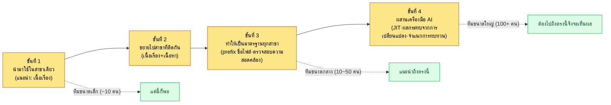

# 2.3 การออกแบบ Layer — การทำให้ระบบเกมเป็นนามธรรม

นั่นคือช่วงที่สาขางานขยายจากสามเป็นแปด นักออกแบบเกมฝ่ายต่อสู้กำหนดระยะของสกิลไว้ที่ 8 เมตร ในสัปดาห์เดียวกัน นักออกแบบเลเวลก็ล็อกความกว้างของทางเดินดันเจี้ยนไว้ที่ 6 เมตร ทั้งสองการตัดสินใจสมเหตุสมผลอย่างสมบูรณ์เมื่อมองในขอบเขตสาขาของตัวเอง ปัญหาเผยตัวออกมาในบิลด์อีกสามสัปดาห์ถัดมา สกิลโจมตีเป็นวงทะลุกำแพงทางเดินออกไปและศัตรูตายในที่ที่มองไม่เห็นด้วยซ้ำ ไม่ใช่ความผิดของใครเลย เพียงแต่ทั้งสองคนไม่มีหน้าต่างที่จะมองเห็นการตัดสินใจของอีกฝ่าย

บทนี้คือเรื่องราวของการสร้างหน้าต่างนั้น การทำให้แต่ละสาขายังคงมีห้องของตัวเองไว้ครบ แต่รู้ได้ด้วยพิกัดเพียงตัวเดียวว่ากำลังเกิดอะไรขึ้นในห้องข้างๆ ระบบพิกัดนั้นเราเรียกว่า Layer

---

## 2.3.1 การเกิดไซโล — ศัตรูที่ต้องเผชิญซ้ำทุกครั้ง

การออกแบบเกมแตกแขนงเป็นสาขางานย่อยๆ จำนวนมาก ทั้งระบบ ต่อสู้ เนื้อเรื่อง เนื้อหา เลเวล บาลานซ์ UX และ QA แต่ละสาขามีเครื่องมือ ผลงาน และการประชุมของตัวเอง ยิ่งโครงการใหญ่ขึ้นเท่าไร แต่ละคนก็ยิ่งดำดิ่งลึกเข้าไปในขอบเขตของตัวเอง จนกลายเป็นสภาพที่ไม่รู้ว่าสาขาอื่นกำลังทำอะไรอยู่ สภาพนี้เรียกว่าการเกิดไซโล (silo)

ต้นทุนของการเกิดไซโลจะปรากฏให้เห็นก็ต่อเมื่อเวลาผ่านไปแล้ว

- ระยะของสกิลที่ฝ่ายต่อสู้ตัดสินใจไว้ไม่เข้ากับความกว้างของทางเดินที่ฝ่ายออกแบบเลเวลกำหนด
- แรงจูงใจของ NPC ที่ฝ่ายเนื้อเรื่องออกแบบไว้ขัดแย้งกับโครงสร้างรางวัลเควสต์ที่ฝ่ายเนื้อหากำหนด
- วงจรเศรษฐกิจที่ฝ่ายบาลานซ์วางไว้ไม่ตรงกับกำหนดการรางวัลเช็กชื่อของ Live Ops

สาเหตุไม่ใช่การขาดฝีมือ แต่ละคนตัดสินใจอย่างสมเหตุสมผลในสาขาของตัวเอง เพียงแต่ไม่มีช่องทางที่จะรับรู้การตัดสินใจของสาขาอื่น หากจะอุดด้วยการประชุม การประชุมก็จะระเบิดเพิ่มจำนวน หากจะอุดด้วยแชตกลุ่ม สัญญาณก็จะจมหายไปในเสียงรบกวน ไม่ได้หมายความว่าการประชุมและแชตกลุ่มไร้ค่า แต่หัวใจสำคัญคือการแยกขอบเขตให้ชัดเจนระหว่างส่วนที่อุดได้กับส่วนที่อุดไม่ได้

ทางออกคือการทำให้รับรู้กระแสงานของกันและกันได้ (การมองเห็นแบบรวม) โดยไม่ต้องลดทอนขอบเขตของแต่ละสาขา (คงการแตกแขนงของสาขาไว้) ข้อเรียกร้องสองข้อที่ดูเหมือนขัดแย้งกันนี้จะบรรลุได้พร้อมกันเมื่อจัดวางลงบนระบบพิกัดเดียวกัน ระบบพิกัดนั้นคือ Layer หากเปรียบกับสำนักงานก็เหมือนกับการที่แต่ละคนมีโต๊ะของตัวเอง แต่ดูนาฬิกาแขวนผนังและปฏิทินอันเดียวกัน

---

## 2.3.2 นิยามของ Layer — การทำให้เป็นนามธรรม 5 ชั้น

Layer ที่ใช้ในหนังสือเล่มนี้คือการทำให้เป็นนามธรรม 5 ชั้น ตั้งแต่ 0 ถึง 4 ยิ่งสูงขึ้นยิ่งเป็นนามธรรมและเปลี่ยนแปลงน้อย ยิ่งต่ำลงยิ่งเป็นรูปธรรมและเปลี่ยนแปลงบ่อย

<svg viewBox="0 0 760 300" xmlns="http://www.w3.org/2000/svg" font-family="sans-serif" role="img" aria-label="โครงสร้างการทำให้เป็นนามธรรม 5 ชั้นตั้งแต่ Layer 0 ถึง 4 และบทบาทในการสร้างแบบโพรซีเดอรัลของแต่ละชั้น">
  <defs>
    <marker id="arrowDown" markerWidth="8" markerHeight="8" refX="4" refY="7" orient="auto">
      <path d="M0,0 L8,0 L4,8 z" fill="#555"/>
    </marker>
  </defs>
  <text x="20" y="24" font-size="13" fill="#888">นามธรรม · ไม่เปลี่ยนแปลง</text>
  <text x="640" y="24" font-size="13" fill="#888">รูปธรรม · ผันแปร</text>

  <rect x="20" y="36" width="720" height="42" rx="6" fill="#c0392b" opacity="0.9"/>
  <text x="34" y="55" font-size="14" fill="#fff" font-weight="bold">L0 วิสัยทัศน์ · คุณค่าหลัก</text>
  <text x="34" y="72" font-size="12" fill="#fff">บทบาทในการสร้างแบบโพรซีเดอรัล: จุดยึดบริบท — ไม่เปลี่ยนแปลง จุดอ้างอิงที่ถูกฉีดเข้าทุกครั้งที่เรียกใช้</text>

  <rect x="20" y="86" width="720" height="42" rx="6" fill="#e67e22" opacity="0.9"/>
  <text x="34" y="105" font-size="14" fill="#fff" font-weight="bold">L1 ระบบ · โครงสร้างของโลก</text>
  <text x="34" y="122" font-size="12" fill="#fff">บทบาทในการสร้างแบบโพรซีเดอรัล: กฎอินพุตการสร้าง — rulebook · ความสัมพันธ์ · แท็ก (ข้อจำกัดที่ตัวสร้างต้องปฏิบัติตาม)</text>

  <rect x="20" y="136" width="720" height="42" rx="6" fill="#f1c40f" opacity="0.95"/>
  <text x="34" y="155" font-size="14" fill="#333" font-weight="bold">L2 เนื้อหา · โฟลว์</text>
  <text x="34" y="172" font-size="12" fill="#333">บทบาทในการสร้างแบบโพรซีเดอรัล: ที่ที่เนื้อหาที่สร้างถูกสะสม — เควสต์ · ความคืบหน้า · เส้นโค้งเลเวล</text>

  <rect x="20" y="186" width="720" height="42" rx="6" fill="#27ae60" opacity="0.9"/>
  <text x="34" y="205" font-size="14" fill="#fff" font-weight="bold">L3 การพัฒนา · ชีตข้อมูล</text>
  <text x="34" y="222" font-size="12" fill="#fff">บทบาทในการสร้างแบบโพรซีเดอรัล: ค่า · ID · ความสัมพันธ์ — ค่าอินพุตของการจำลอง</text>

  <rect x="20" y="236" width="720" height="42" rx="6" fill="#2980b9" opacity="0.9"/>
  <text x="34" y="255" font-size="14" fill="#fff" font-weight="bold">L4 ผลผลิตจากบิลด์ · QA</text>
  <text x="34" y="272" font-size="12" fill="#fff">บทบาทในการสร้างแบบโพรซีเดอรัล: ด่านตรวจสอบ — ผลบิลด์ · บั๊ก · ภาพแคปเจอร์การเล่น</text>

  <line x1="10" y1="40" x2="10" y2="274" stroke="#555" stroke-width="1.5" marker-end="url(#arrowDown)"/>
</svg>

บทบาทที่แต่ละชั้นทั้งห้ารับผิดชอบในไปป์ไลน์การสร้างแบบโพรซีเดอรัลและการทำงานอัตโนมัติ อยู่ในป้ายกำกับด้านขวาของแผนภาพข้างต้น การแมปนี้คือกระดูกสันหลังของบทนี้ หากมอง Layer เป็นเพียง "โฟลเดอร์ที่จัดเรียงไว้อย่างเป็นระเบียบ" ก็เท่ากับเห็นเพียงครึ่งเดียว แต่ละชั้นสอดคล้องอย่างแม่นยำกับหนึ่งขั้นในไปป์ไลน์การสร้าง (จุดยึด → กฎ → เนื้อหา → ค่า → ด่าน)

| Layer | บรรจุอะไร | ความถี่ในการเปลี่ยนแปลง |
|-------|---------------|-----------|
| Layer 0 | ประสบการณ์หลักที่เกมต้องการมอบให้ผู้เล่น บีบอัดได้เป็นประโยคเดียว | ต่ำมาก (ตลอดอายุของโครงการ) |
| Layer 1 | โครงสร้างใหญ่ของระบบเกมและโครงสร้างของโลก | ต่ำ (ระดับไมล์สโตน) |
| Layer 2 | โฟลว์การเล่น เส้นเควสต์ ขั้นความคืบหน้า เส้นโค้งเลเวล | ปานกลาง (ระดับสปรินต์) |
| Layer 3 | ค่าข้อมูลจริง พารามิเตอร์ สูตร ตัวแปร | สูง (ระดับวัน) |
| Layer 4 | ผลที่ยืนยันได้จากบิลด์ รายงานบั๊ก วิดีโอการเล่น | สูงมาก (เรียลไทม์) |

5 ชั้นนี้ไม่ใช่แนวคิดเฉพาะเกม กระดูกสันหลังเดียวกันนี้สามารถย้ายไปใช้กับการพัฒนาผลิตภัณฑ์ IT ทั่วไปได้โดยตรง ผู้อ่านที่ไม่เคยทำเกมมาก่อน ขอให้ใช้ตารางแปลงสายงานด้านล่างเพื่อจับคู่แต่ละชั้นกับผลงานของตัวเอง (ด้านซ้ายคือ Layer ของการออกแบบเกม ด้านขวาคือผลงานที่อยู่ในตำแหน่งเดียวกันใน SaaS แอป หรือระบบภายในองค์กร เป็นต้น)

| Layer | การออกแบบเกม | ผลิตภัณฑ์ IT ทั่วไป | คำถามเดียวกัน |
|-------|-----------|--------------|-----------|
| L0 ประสบการณ์หลัก | ประสบการณ์หลักที่ต้องการมอบให้ผู้เล่น (หนึ่งประโยค) | วิสัยทัศน์ผลิตภัณฑ์ — แก้ปัญหาอะไรของใครอย่างไร | "ทำไมต้องสร้างสิ่งนี้" |
| L1 กฎของระบบ | โครงสร้างระบบ · โครงสร้างของโลก | กฎเชิงธุรกิจ · ฟังก์ชัน — กฎโดเมน โมเดลสิทธิ์ เวิร์กโฟลว์หลัก | "อะไรควรทำงานอย่างไร" |
| L2 เนื้อหา | เส้นเควสต์ · ขั้นความคืบหน้า · เส้นโค้งเลเวล | รีลีส · โรดแมป — กลุ่มฟีเจอร์ ลำดับการปล่อย ไมล์สโตน | "จะปล่อยอะไรเมื่อไร" |
| L3 ข้อมูล | ค่าข้อมูล · พารามิเตอร์ · สูตร | ชีตสเปก — API spec นิยามฟิลด์ ค่าตั้งค่า ค่าเกณฑ์ | "ค่าและนิยามที่แม่นยำคืออะไร" |
| L4 บิลด์ · QA | ผลบิลด์ · บั๊ก · วิดีโอการเล่น | การดีพลอย · QA — ผลผลิตการดีพลอย รายงานบั๊ก ล็อกมอนิเตอริง | "สิ่งที่ปล่อยออกไปจริงทำงานถูกต้องหรือไม่" |

วิธีอ่านเหมือนกับเกมทุกประการ ยิ่งสูงขึ้นยิ่งเปลี่ยนแปลงน้อย (วิสัยทัศน์ผลิตภัณฑ์เปลี่ยนปีละครั้งต่อไตรมาส) ยิ่งต่ำลงยิ่งเปลี่ยนบ่อย (ค่าตั้งค่าเปลี่ยนทุกวัน) อุบัติเหตุไซโลที่เห็นก่อนหน้านี้ — ฉากที่ระยะของสกิลกับความกว้างของทางเดินขัดแย้งกัน — มีโครงสร้างเหมือนกันเป๊ะกับเรื่องที่เกิดใน IT ทั่วไปอย่าง "นิยามฟิลด์ฝั่ง backend (L3) กับกฎหน้าจอฝั่ง front (L1) ไม่ตรงกันจนระเบิดก่อนปล่อยไม่นาน" ต่างกันแค่ชื่อสาขา แต่กระดูกสันหลังมีเพียงหนึ่งเดียว

5 ชั้นนี้ไม่ใช่สิ่งสัมบูรณ์ ขึ้นอยู่กับขนาดและโดเมน 4 ชั้นอาจเหมาะสม หรืออาจต้องการ 6 ชั้น หัวใจสำคัญไม่ใช่ว่าตัวเลขเป็น 5 แต่เป็นตัวการกระทำของการนิยามชั้นอย่างชัดแจ้งเอง

ผลงานหนึ่งชิ้นอาจคร่อมสอง Layer ได้ "GDD ระบบสกิล (Game Design Document หรือเอกสารสเปกละเอียด)" บรรจุทั้งการออกแบบระบบ (Layer 1) และข้อมูลรูปธรรม (Layer 3) ไว้พร้อมกัน ในกรณีนี้ให้แบ่งเอกสารออกหรือกำหนด Layer หลักเป็น 1 แล้วแยกส่วนข้อมูลออกไปเป็นชีตต่างหาก ไม่ว่าจะวิธีใดก็ต้องระบุชัดเจนว่าแต่ละส่วนอยู่ใน Layer ใด

---

## 2.3.3 หลักการเมตา — แตกแขนงและรวมเข้าด้วยกันไปพร้อมกัน

สาขางานแผ่ออกในแนวนอน และ Layer ซ้อนกันในแนวตั้ง งานของสาขาหนึ่งคร่อมหลาย Layer เมทริกซ์ด้านล่างแสดงจุดศูนย์ถ่วงของการกระจายของ 11 สาขา (แนวนอน) × Layer 0\~4 (แนวตั้ง) ด้วยความเข้มสีของช่อง ช่องที่เข้มคือ Layer ที่เป็นจุดศูนย์ถ่วงของสาขานั้น

<svg viewBox="0 0 820 320" xmlns="http://www.w3.org/2000/svg" font-family="sans-serif" font-size="11" role="img" aria-label="เมทริกซ์การแตกแขนงและการรวมเข้าด้วยกันของแกนนอน 11 สาขาและแกนตั้ง Layer 0 ถึง 4">
  <!-- column headers (분야) -->
  <g fill="#333">
    <text x="120" y="30" transform="rotate(-35 120 30)">ระบบ</text>
    <text x="180" y="30" transform="rotate(-35 180 30)">ต่อสู้</text>
    <text x="240" y="30" transform="rotate(-35 240 30)">เนื้อเรื่อง</text>
    <text x="300" y="30" transform="rotate(-35 300 30)">เนื้อหา</text>
    <text x="360" y="30" transform="rotate(-35 360 30)">เลเวล</text>
    <text x="420" y="30" transform="rotate(-35 420 30)">บาลานซ์</text>
    <text x="480" y="30" transform="rotate(-35 480 30)">UX/UI</text>
    <text x="540" y="30" transform="rotate(-35 540 30)">QA</text>
    <text x="600" y="30" transform="rotate(-35 600 30)">ตัวละคร</text>
    <text x="660" y="30" transform="rotate(-35 660 30)">อาร์ต</text>
    <text x="720" y="30" transform="rotate(-35 720 30)">ไลฟ์</text>
  </g>
  <!-- row labels (Layer) -->
  <g fill="#333" text-anchor="end">
    <text x="95" y="74">L0 วิสัยทัศน์</text>
    <text x="95" y="124">L1 ระบบ</text>
    <text x="95" y="174">L2 เนื้อหา</text>
    <text x="95" y="224">L3 ข้อมูล</text>
    <text x="95" y="274">L4 บิลด์·QA</text>
  </g>
  <!-- grid cells: x columns at 110,170,...,710 ; y rows at 60,110,160,210,260 ; cell 50x40 -->
  <!-- color helper: dark=#2c3e50 mid=#7f8c9b light=#dfe4ea -->
  <!-- L0 row (y=60) -->
  <g>
    <rect x="110" y="60" width="50" height="40" fill="#dfe4ea" stroke="#fff"/>
    <rect x="170" y="60" width="50" height="40" fill="#dfe4ea" stroke="#fff"/>
    <rect x="230" y="60" width="50" height="40" fill="#2c3e50" stroke="#fff"/>
    <rect x="290" y="60" width="50" height="40" fill="#dfe4ea" stroke="#fff"/>
    <rect x="350" y="60" width="50" height="40" fill="#dfe4ea" stroke="#fff"/>
    <rect x="410" y="60" width="50" height="40" fill="#dfe4ea" stroke="#fff"/>
    <rect x="470" y="60" width="50" height="40" fill="#dfe4ea" stroke="#fff"/>
    <rect x="530" y="60" width="50" height="40" fill="#7f8c9b" stroke="#fff"/>
    <rect x="590" y="60" width="50" height="40" fill="#dfe4ea" stroke="#fff"/>
    <rect x="650" y="60" width="50" height="40" fill="#2c3e50" stroke="#fff"/>
    <rect x="710" y="60" width="50" height="40" fill="#dfe4ea" stroke="#fff"/>
  </g>
  <!-- L1 row (y=110) -->
  <g>
    <rect x="110" y="110" width="50" height="40" fill="#2c3e50" stroke="#fff"/>
    <rect x="170" y="110" width="50" height="40" fill="#2c3e50" stroke="#fff"/>
    <rect x="230" y="110" width="50" height="40" fill="#7f8c9b" stroke="#fff"/>
    <rect x="290" y="110" width="50" height="40" fill="#dfe4ea" stroke="#fff"/>
    <rect x="350" y="110" width="50" height="40" fill="#7f8c9b" stroke="#fff"/>
    <rect x="410" y="110" width="50" height="40" fill="#dfe4ea" stroke="#fff"/>
    <rect x="470" y="110" width="50" height="40" fill="#2c3e50" stroke="#fff"/>
    <rect x="530" y="110" width="50" height="40" fill="#7f8c9b" stroke="#fff"/>
    <rect x="590" y="110" width="50" height="40" fill="#2c3e50" stroke="#fff"/>
    <rect x="650" y="110" width="50" height="40" fill="#7f8c9b" stroke="#fff"/>
    <rect x="710" y="110" width="50" height="40" fill="#dfe4ea" stroke="#fff"/>
  </g>
  <!-- L2 row (y=160) -->
  <g>
    <rect x="110" y="160" width="50" height="40" fill="#7f8c9b" stroke="#fff"/>
    <rect x="170" y="160" width="50" height="40" fill="#7f8c9b" stroke="#fff"/>
    <rect x="230" y="160" width="50" height="40" fill="#2c3e50" stroke="#fff"/>
    <rect x="290" y="160" width="50" height="40" fill="#2c3e50" stroke="#fff"/>
    <rect x="350" y="160" width="50" height="40" fill="#2c3e50" stroke="#fff"/>
    <rect x="410" y="160" width="50" height="40" fill="#dfe4ea" stroke="#fff"/>
    <rect x="470" y="160" width="50" height="40" fill="#7f8c9b" stroke="#fff"/>
    <rect x="530" y="160" width="50" height="40" fill="#dfe4ea" stroke="#fff"/>
    <rect x="590" y="160" width="50" height="40" fill="#7f8c9b" stroke="#fff"/>
    <rect x="650" y="160" width="50" height="40" fill="#dfe4ea" stroke="#fff"/>
    <rect x="710" y="160" width="50" height="40" fill="#2c3e50" stroke="#fff"/>
  </g>
  <!-- L3 row (y=210) -->
  <g>
    <rect x="110" y="210" width="50" height="40" fill="#2c3e50" stroke="#fff"/>
    <rect x="170" y="210" width="50" height="40" fill="#2c3e50" stroke="#fff"/>
    <rect x="230" y="210" width="50" height="40" fill="#7f8c9b" stroke="#fff"/>
    <rect x="290" y="210" width="50" height="40" fill="#7f8c9b" stroke="#fff"/>
    <rect x="350" y="210" width="50" height="40" fill="#2c3e50" stroke="#fff"/>
    <rect x="410" y="210" width="50" height="40" fill="#2c3e50" stroke="#fff"/>
    <rect x="470" y="210" width="50" height="40" fill="#7f8c9b" stroke="#fff"/>
    <rect x="530" y="210" width="50" height="40" fill="#7f8c9b" stroke="#fff"/>
    <rect x="590" y="210" width="50" height="40" fill="#2c3e50" stroke="#fff"/>
    <rect x="650" y="210" width="50" height="40" fill="#dfe4ea" stroke="#fff"/>
    <rect x="710" y="210" width="50" height="40" fill="#7f8c9b" stroke="#fff"/>
  </g>
  <!-- L4 row (y=260) -->
  <g>
    <rect x="110" y="260" width="50" height="40" fill="#dfe4ea" stroke="#fff"/>
    <rect x="170" y="260" width="50" height="40" fill="#7f8c9b" stroke="#fff"/>
    <rect x="230" y="260" width="50" height="40" fill="#7f8c9b" stroke="#fff"/>
    <rect x="290" y="260" width="50" height="40" fill="#dfe4ea" stroke="#fff"/>
    <rect x="350" y="260" width="50" height="40" fill="#dfe4ea" stroke="#fff"/>
    <rect x="410" y="260" width="50" height="40" fill="#7f8c9b" stroke="#fff"/>
    <rect x="470" y="260" width="50" height="40" fill="#dfe4ea" stroke="#fff"/>
    <rect x="530" y="260" width="50" height="40" fill="#2c3e50" stroke="#fff"/>
    <rect x="590" y="260" width="50" height="40" fill="#dfe4ea" stroke="#fff"/>
    <rect x="650" y="260" width="50" height="40" fill="#7f8c9b" stroke="#fff"/>
    <rect x="710" y="260" width="50" height="40" fill="#2c3e50" stroke="#fff"/>
  </g>
  <!-- legend -->
  <g>
    <rect x="110" y="305" width="14" height="12" fill="#2c3e50"/>
    <text x="128" y="315" fill="#333">จุดศูนย์ถ่วง</text>
    <rect x="220" y="305" width="14" height="12" fill="#7f8c9b"/>
    <text x="238" y="315" fill="#333">การกระจายรอง</text>
    <rect x="320" y="305" width="14" height="12" fill="#dfe4ea"/>
    <text x="338" y="315" fill="#333">น้อยมาก · ไม่มี</text>
  </g>
</svg>

อ่านในแนวตั้งจะเห็นว่าสาขาหนึ่งคร่อมอยู่ใน Layer ใดบ้าง อ่านในแนวนอนจะเห็นว่ามีสาขาใดบ้างที่มารวมอยู่ใน Layer หนึ่ง แถว L0 (วิสัยทัศน์) มีเนื้อเรื่องและอาร์ตไดเรกชันเข้มที่สุด — สองสาขาที่ใกล้วิสัยทัศน์มากที่สุด แถว L3 (ข้อมูล) มีระบบ ต่อสู้ เลเวล บาลานซ์ และตัวละครมารวมกันอย่างเข้มข้น — เป็นสัญญาณว่าสาขาเหล่านี้ปะทะกันที่ชีตข้อมูล

หากมีการกระจายนี้อยู่อย่างชัดแจ้ง สาขาอื่นจะรู้ตำแหน่งได้ทันทีว่า "ต้องไปดู Layer 2 ของฝ่ายต่อสู้" ไม่ใช่กำแพงของไซโลพังลง แต่เป็นการเจาะหน้าต่างบนกำแพงต่างหาก

หากย่อเมทริกซ์ทั้งหมดเป็นประโยคเดียวก็คือเช่นนี้ แกนตั้ง Layer แบ่งไว้เพื่อทำให้การสร้างเป็นอัตโนมัติ แกนนอนสาขาแบ่งไว้เพื่อรักษาความเชี่ยวชาญ ทั้งสองมาพบกันที่ช่องหนึ่งของตาราง

---

## 2.3.4 กรณีปฏิบัติงาน — การวัดจริงของโครงการ MMORPG หนึ่ง

โปรเจกต์ MMORPG A ที่ผู้เขียนดูแลในฐานะ Design Director ได้ใช้ระบบ Layer ร่วมกับทีมออกแบบ (4\~5 คน) มาประมาณ 6 เดือน (ทีมพัฒนาทั้งหมดเป็นขนาดกลาง 10\~50 คน) ลองดูกรณีตัวอย่างที่เป็นรูปธรรม

ก่อนอื่น เนื้อเรื่อง 5 ชั้น ตัวโฟลเดอร์ของฝ่ายออกแบบเนื้อเรื่องเองถูกแบ่งออกเป็น Layer

<svg viewBox="0 0 640 230" xmlns="http://www.w3.org/2000/svg" font-family="sans-serif" font-size="13" role="img" aria-label="โครงสร้างการแบ่งโฟลเดอร์เนื้อเรื่องตั้งแต่ Layer 0 ถึง 4">
  <text x="20" y="26" font-weight="bold" fill="#333">NarrativeDocs/</text>
  <g>
    <rect x="40" y="40" width="240" height="30" rx="4" fill="#c0392b" opacity="0.9"/>
    <text x="52" y="60" fill="#fff">Layer0_Vision/</text>
    <text x="300" y="60" fill="#555">สารหลักของโลก, 1.1~1.2</text>
  </g>
  <g>
    <rect x="40" y="76" width="240" height="30" rx="4" fill="#e67e22" opacity="0.9"/>
    <text x="52" y="96" fill="#fff">Layer1_World/</text>
    <text x="300" y="96" fill="#555">การตั้งค่าภูมิภาค · ฝ่าย · ยุคสมัย</text>
  </g>
  <g>
    <rect x="40" y="112" width="240" height="30" rx="4" fill="#f1c40f" opacity="0.95"/>
    <text x="52" y="132" fill="#333">Layer2_StoryLine/</text>
    <text x="300" y="132" fill="#555">โฟลว์เควสต์หลัก</text>
  </g>
  <g>
    <rect x="40" y="148" width="240" height="30" rx="4" fill="#27ae60" opacity="0.9"/>
    <text x="52" y="168" fill="#fff">Layer3_DialogueSheet/</text>
    <text x="300" y="168" fill="#555">ข้อมูลบทพูด · ชื่อจริง</text>
  </g>
  <g>
    <rect x="40" y="184" width="240" height="30" rx="4" fill="#2980b9" opacity="0.9"/>
    <text x="52" y="204" fill="#fff">Layer4_BuildVO/</text>
    <text x="300" y="204" fill="#555">เสียงพากย์ที่ใส่เข้าไปในบิลด์</text>
  </g>
</svg>

หากนักเขียนเนื้อเรื่องเปลี่ยนแขนงหนึ่งของเรื่องหลักใน Layer 2 ก็จะส่งผลต่อชีตบทพูดใน Layer 3 และอาจส่งผลแบบย้อนกลับไม่ได้ต่อเสียงพากย์ใน Layer 4 ที่อัดเสียงไปแล้ว เพราะระบุ Layer ไว้ชัด จึงติดตามขอบเขตผลกระทบได้ทันที

เครื่องมือสร้างแผนผังความสัมพันธ์อัตโนมัติ `gen_relation_map.py` ก็ทำงานควบคู่กันด้วย มันวิเคราะห์ความสัมพันธ์ foreign key (FK) ระหว่างชีตข้อมูล สร้างแผนผังความสัมพันธ์ HTML แบบโต้ตอบได้ และแสดง Layer ด้วยสีของโหนด (แดง=L1 ระบบ, เหลือง=L2 เนื้อหา, เขียว=L3 ข้อมูล) มองเห็นได้ในพริบตาว่าการพึ่งพิงไหลจาก Layer ใดไปยัง Layer ใด หากการพึ่งพิงไหลย้อนทาง — หาก L3 ยิงลูกศรไปหา L1 — เกือบจะเป็นข้อบกพร่องในการออกแบบเสมอ

เอกสารมาสเตอร์การสร้างเลเวลแบบโพรซีเดอรัลระบุพิกัด Layer ไว้ใน frontmatter

```yaml
---
title: มาสเตอร์การออกแบบเลเวลแบบโพรซีเดอรัล v0.1
layer_inputs: [L1.World, L2.StoryLine]
layer_outputs: [L3.LevelData, L4.PlayCapture]
---
```

สองบรรทัดนี้ประกาศว่า "ไปป์ไลน์นี้รับ Layer 1·2 เป็นอินพุตและสร้าง Layer 3·4 ออกมา" และการคำนวณขอบเขตผลกระทบเมื่อมีการเปลี่ยนแปลงก็เป็นอัตโนมัติ วิสัยทัศน์ L0 แม้ไม่ระบุก็เป็นอินพุตเสมอ — เพราะไม่ว่าจะเป็นการสร้างใด จุดยึดวิสัยทัศน์ก็พ่วงตามมาทุกครั้ง

ยังมี atom ที่บังคับให้มี Layer prefix ในชื่อเอกสารด้วย หนึ่งใน atom ที่แชร์กันในทีมเป็นเช่นนี้

> **`docs_layer_numeric_prefix_naming`**: ชื่อไฟล์ชีตข้อมูลต้องมี Layer prefix ของหมายเลข (`L1_`, `L2_`, `L3_`) เสมอ ชีตที่ไม่มี prefix จะถูกเตือนในการตรวจสอบความสอดคล้อง

กฎยิ่งเรียบง่ายยิ่งทรงพลัง เพียงเรียงตามชื่อก็จัดกลุ่มตาม Layer ได้แล้ว และเครื่องมือ AI ก็รู้ Layer ได้จากชื่อไฟล์เพียงอย่างเดียว แม้คนจะลืม การตรวจสอบความสอดคล้องก็จับได้

---

## 2.3.5 การตรวจจับการอ้างอิงย้อนทาง — บันทึกเซสชันจริง

ในหัวข้อก่อนหน้า (2.3.4) กล่าวไว้ว่า "หาก L3 ยิงลูกศรไปหา L1 ก็เกือบจะเป็นข้อบกพร่องในการออกแบบเสมอ" หากมอบการตรวจจับนี้ให้ AI แทนสายตามนุษย์ จะเป็นอย่างไร ผู้เขียนจะถ่ายทอดหนึ่งช่วงที่รันจริงตามนั้นโดยไม่ขัดเกลา (ปกปิดเฉพาะข้อมูลที่ระบุตัวบริษัทเท่านั้น)

**[พรอมต์ฉบับเต็ม]**

```
ดู frontmatter สองอันที่แนบมาแล้วช่วยตรวจว่าทิศทางการพึ่งพิงของ Layer ปกติหรือไม่
การอ้างอิงต้องไหลจากหมายเลขสูง→หมายเลขต่ำเท่านั้นจึงจะปกติ ถ้าย้อนทางให้เตือน

--- เอกสาร A (L1_combat_system.md) ---
title: โครงสร้างระบบต่อสู้
layer: L1
refs: [L3_skill_damage_sheet, L2_combat_flow]

--- เอกสาร B (L3_skill_damage_sheet.md) ---
title: ชีตดาเมจสกิล
layer: L3
refs: [L1_combat_system]
```

**[ผลลัพธ์ดิบจาก Claude — ตามจริงโดยไม่มีการสรุปย่อ]**

```
ได้ตรวจสอบเอกสารทั้งสองแล้ว

เอกสาร B (L3_skill_damage_sheet, L3):
  refs → [L1_combat_system]
  ทิศทาง: L3 → L1 (รูปธรรม → นามธรรม)
  ผลวินิจฉัย: ปกติ การที่ชีตข้อมูลอ้างอิงโครงสร้างระบบ
        ที่ตัวเองยึดถือเป็นทิศทางที่เป็นธรรมชาติ

เอกสาร A (L1_combat_system, L1):
  refs → [L3_skill_damage_sheet, L2_combat_flow]
  - L1 → L2 : ปกติ (การออกแบบชี้ไปยังโฟลว์ระดับล่าง)
  - L1 → L3 : ⚠ เตือนทิศทางย้อนกลับ
        โครงสร้างระบบ L1 อ้างอิงชีตข้อมูล L3 โดยตรง
        นี่หมายความว่า "เอกสารออกแบบขึ้นต่อค่าข้อมูล
        เฉพาะค่าหนึ่ง" ก่อให้เกิดการยึดเกาะที่ทำให้ต้อง
        แก้เอกสารออกแบบทุกครั้งที่ข้อมูลเปลี่ยน

ข้อแนะนำ: ลบ L3_skill_damage_sheet ออกจาก refs ของเอกสาร A
      หากโครงสร้างระบบจำเป็นต้องรู้ค่าตัวเลขที่เป็นรูปธรรม
      ให้ย้ายค่านั้นขึ้นเป็นกฎนามธรรมใน L1 (เช่น "ดาเมจพื้นฐาน
      คือ สัมประสิทธิ์คลาส × เลเวล") หรือผ่านเอกสารโฟลว์ L2

สรุป: ตรวจพบการอ้างอิงย้อนทาง 1 รายการ (A: L1 → L3)
```

**[การตรวจสอบโดยมนุษย์ / การปฏิเสธ]**

ผลวินิจฉัยของ AI ถูกต้อง แต่ข้อแนะนำว่า "ให้ผ่านเอกสารโฟลว์ L2" นั้นเกินไปในเคสนี้ สิ่งที่ L1 จำเป็นต้องรู้คือ *รูปแบบ* ของสูตรดาเมจ ไม่ใช่เซลล์เฉพาะใดของชีต ผู้เขียนจึงรับเฉพาะข้อแนะนำที่สอง (การยกขึ้นเป็นกฎนามธรรม) และปฏิเสธข้อเสนอให้ผ่านโฟลว์

**[การร้องขอใหม่]**

```
ตัดข้อเสนอให้ผ่านโฟลว์ออก แล้วแสดงเฉพาะ diff การแก้ไข
ของ L1_combat_system.md ในทิศทาง "ยกเฉพาะรูปแบบของสูตร
ดาเมจขึ้นเป็นกฎนามธรรมใน L1" เท่านั้น
จัดระเบียบ refs ด้วย
```

หนึ่งวงรอบนี้คือฐานที่มั่นของการตรวจจับการอ้างอิงย้อนทาง AI จับการละเมิดทิศทาง (อัตโนมัติ) คนเล็มความเหมาะสมของข้อแนะนำ (การตรวจสอบ) และสั่งทำใหม่เฉพาะงานที่แคบลงแล้ว (การร้องขอใหม่) ในโปรเจกต์ A นั้น `gen_relation_map.py` ทำงานในระดับกราฟ และ atom `portal_layer_change_impact_check` จะถูกกระตุ้น ณ จุดตรวจจับการเปลี่ยนแปลง เพื่อบังคับให้ตรวจสอบขอบเขตผลกระทบ

หากคนทำการเปรียบเทียบนี้เองโดยตรง การเปิดเอกสารสองฉบับมาเทียบ refs และวินิจฉัยทิศทางจะใช้เวลาหลายนาที หากเอกสารเพิ่มเป็นหลายร้อยฉบับ ก็แทบเป็นไปไม่ได้ การอ้างอิงย้อนทางมักแอบเข้ามาทีละหนึ่งสองรายการอยู่เสมอ และระเบิดในบิลด์ก็ต่อเมื่อผ่านไปนานแล้ว

---

## 2.3.6 การแยกย่อย Layer = เงื่อนไขเบื้องต้นของการสร้างแบบโพรซีเดอรัลและการทำงานอัตโนมัติ

จุดประสงค์ที่ผิวเผินของการรวม Layer คือการคลายไซโลและการทำให้ภาษาในการทำงานร่วมกันเป็นหนึ่งเดียว (2.3.1\~2.3.5) แต่จุดประสงค์ที่แท้จริงลึกลงไปอีกขั้นหนึ่ง เมื่อการแยกย่อย Layer ลงตัวแล้ว เงื่อนไขเบื้องต้นของการสร้างแบบโพรซีเดอรัลและการทำงานอัตโนมัติก็พร้อม

กรณีปฏิบัติงานในสองหัวข้อก่อนหน้าเป็นขั้นที่คนตัดสินใจและ AI ช่วยตรวจสอบและฉีดข้อมูล ขั้นถัดไปจะเข้าสู่ขั้นที่ AI สร้างผลผลิตของตัวสาขาเองเป็นตัวเลือกและคนเป็นผู้รับเลือก เหตุผลที่การแยกย่อย Layer เป็นเงื่อนไขเบื้องต้นของการเคลื่อนนี้มีสามประการ ① การสร้างตัวเลือกของ AI ต้องระบุได้ว่า "จะสร้างอะไรของ Layer ใด" ② การตรวจสอบความสอดคล้องอัตโนมัติทำงานได้ต่อเมื่อทิศทางการพึ่งพิงระหว่าง Layer ถูกทำให้เป็นมาตรฐาน (การตรวจจับการอ้างอิงย้อนทางใน 2.3.5) ③ การคำนวณผลกระทบจากการเปลี่ยนแปลงอัตโนมัติทำได้ก็ต่อเมื่อมีพิกัดว่าการเปลี่ยนแปลงเกิดขึ้นที่ Layer ใด ทั้งสามมารวมกันที่ "หากไม่มีการแยกย่อย Layer การทำงานอัตโนมัติเองก็ถูกปิดกั้น" ปลายทางของมือที่แบ่งพิกัดมีการสร้างแบบโพรซีเดอรัลรออยู่ตั้งแต่แรก

ในขั้นที่ยังไม่ได้ดูส่วนของแต่ละสาขา จึงไม่จำเป็นต้องลงลึก เราจะจับโครงไว้เพียงสองขั้นของการประยุกต์ **การประยุกต์เชิงอนุรักษ์** คือคนตัดสินใจ และ AI ช่วยตรวจสอบความสอดคล้อง คำนวณผลกระทบจากการเปลี่ยนแปลง และฉีดข้อมูลแบบ JIT โดยอัตโนมัติ — กรณีปฏิบัติงานใน 2.3.4·2.3.5 อยู่ตรงนี้ ต้นทุนของเครื่องมือต่ำและผลสะสมจะเผยตัวราวเดือนที่ 6 ของการใช้งาน ทีมขนาดกลาง (10\~50 คน) ส่วนใหญ่จึงเข้าถึงได้ **การประยุกต์เชิงก้าวหน้า** ก้าวไปอีกขั้นโดยให้ AI สร้างผลผลิตของตัวสาขาเองเป็นตัวเลือก (เนื้อเรื่อง Persona, rulebook PCG, เลเวลแบบโพรซีเดอรัล, ตัวเลือกการเปลี่ยนบาลานซ์, แอสเซตอาร์ต เป็นต้น) และคนตัดสินใจเพียง "จะรับตัวเลือกใด" เท่านั้น รูปแบบของแต่ละสาขาและความสุกงอมของเครื่องมือจะกล่าวถึงในส่วนของสาขานั้นๆ

3 องค์ประกอบที่การประยุกต์เชิงก้าวหน้าต้องการร่วมกันในทุกสาขาคือ ① โครงสร้างพื้นฐานของการแยกและติดป้าย Layer (frontmatter · atom · prefix ชื่อไฟล์) ② วงรอบการสร้างและประเมินตัวเลือก (ตัวเลือกจาก AI จำนวน N → ประเมินอัตโนมัติ → รายงานอันดับและเหตุผล) ③ ด่านตรวจสอบโดยมนุษย์ (เฉพาะผลที่ถูกรับเลือกเท่านั้นที่ไปสู่ Layer ถัดไป) ทั้งนี้ ไม่ว่าจุดใดก็ตาม แกนกลางเชิงกำหนด (การจำลอง · ฟิสิกส์ · ข้อจำกัดทางกฎหมาย) ยังคงเป็นความรับผิดชอบของคนและโค้ดเชิงกำหนด และการตรวจสอบทั้งหมดต้องจบลงในขั้นที่ย้อนกลับได้ก่อนเข้าสู่ขั้นที่ย้อนกลับไม่ได้ (การอัดเสียง · การแคสต์ · การเปิดเผยในไลฟ์ เป็นต้น) — เส้นแบ่งย้อนกลับได้/ย้อนกลับไม่ได้นี้เป็นหลักการร่วมของทุกสาขา

สุดท้าย จุดเรื่องเวลาหนึ่ง การประยุกต์เชิงอนุรักษ์เป็นไปได้บางส่วนแม้ในทศวรรษ 2010 แต่การประยุกต์เชิงก้าวหน้าติดอยู่ที่สามขีดจำกัด คือ พลังการแสดงออกของการสร้างตัวเลือกด้วย AI การตีความภาษาธรรมชาติของการประเมินอัตโนมัติ และภาระการตรวจสอบโดยมนุษย์ หลังจาก LLM พัฒนาขึ้น ทั้งสามก็เข้าสู่ขอบเขตที่ใช้งานได้จริง และการประยุกต์เชิงก้าวหน้าก็ลงจากวิสัยทัศน์บนกระดาษสู่ขั้นปฏิบัติงาน สารเมตาที่ร้อยทะลุทั้งเล่มนี้ — ว่าการพัฒนาของ AI ได้ยกระดับความเป็นไปได้ของการสร้างแบบโพรซีเดอรัลและการทำงานอัตโนมัติ — อยู่ตรงนี้

---

## 2.3.7 พิกัดของสาขา — ที่ที่ส่วนของแต่ละสาขาในหนังสือเล่มนี้อาศัยอยู่

ส่วนของแต่ละสาขาในหนังสือเล่มนี้จะระบุในบทนำว่าแต่ละสาขากระจายอยู่ใน Layer ใดเป็นหลัก และใช้พิกัด Layer บ่อยภายในบทด้วย ขอจัดระเบียบไว้ล่วงหน้า (เป็นการย้ายจุดศูนย์ถ่วงของเมทริกซ์ 2.3.3 มาเป็นตาราง)

| สาขา | Layer หลัก | หมายเหตุ |
|------|----------|------|
| ออกแบบระบบ | L1\~L3 | ตั้งแต่โครงสร้างออกแบบจนถึงชีตข้อมูลอย่างกว้างขวาง |
| ออกแบบต่อสู้ | L1\~L3, L4 บางส่วน | ตั้งแต่โครงสร้างคอมโบ\~ชีตดาเมจ การวัดในบิลด์ |
| ออกแบบเนื้อเรื่อง | L0\~L4 | ใช้งานโครงสร้าง 5 ชั้นเป็นโฟลเดอร์ |
| ออกแบบเนื้อหา | เน้น L2 | โฟลว์ความคืบหน้า · เส้นเควสต์ |
| Level Design | L2\~L3 | รวมไปป์ไลน์การสร้างแบบโพรซีเดอรัล |
| ปรับบาลานซ์ | เน้น L3, วัด L4 | ค่าข้อมูล · เส้นโค้ง · การวัดเพื่อตรวจสอบ |
| ออกแบบ UX/UI | L1\~L3 | ตั้งแต่โครงสร้างปฏิสัมพันธ์\~ข้อมูลหน้าจอ |
| ออกแบบ QA | เน้น L4, ตรวจสอบ L0\~L3 | ตรวจว่าทุก Layer ถูกสะท้อนในบิลด์หรือไม่ |
| ตัวละคร · เพ็ต · เมาท์ | L1\~L3 | ระบบ · โลก · ข้อมูล |
| อาร์ตไดเรกชัน | L0\~L1 + ผลผลิต L4 | ไกด์วิสัยทัศน์ · โลก + การตรวจสอบบิลด์ |
| Live Ops | L2\~L4 | วงจรการให้บริการ · ข้อมูลเรียลไทม์ |

แต่ละสาขาแตะ Layer อื่นด้วย แต่หากรู้จุดศูนย์ถ่วงก็จะเห็นช่องทางการทำงานร่วมกัน บาลานซ์ (L3) กับไลฟ์ (L2\~L4) มาพบกันที่ L3 จึงต้องทำงานร่วมกันใกล้ชิดเสมอ และสองสาขาที่ใกล้วิสัยทัศน์ (L0) มากที่สุดคือเนื้อเรื่องและอาร์ตไดเรกชัน ความสัมพันธ์ที่ติดกันเช่นนี้เผยตัวอย่างเป็นธรรมชาติบนระบบพิกัด

---

## 2.3.8 เริ่มเล็ก ขยายใหญ่

หากพยายามนำระบบ Layer มาใช้ให้สมบูรณ์แบบตั้งแต่แรก ก็จะเริ่มต้นไม่ได้ด้วยซ้ำ การค่อยๆ นำมาใช้แบบทีละขั้นต่างหากคือคำตอบ



- **ขั้นที่ 1 (สาขาเดียว)**: เลือกสาขาเดียว (แนะนำ: เนื้อเรื่อง) แล้วแบ่งโฟลเดอร์ออกเป็น Layer ทิ้งสาขาอื่นไว้ก่อน ใช้งานสักหนึ่งถึงสองเดือนพร้อมขัดเกลานิยาม Layer
- **ขั้นที่ 2 (ขยายไปสาขาที่ติดกัน)**: ประยุกต์พร้อมกันกับสองสาขาที่เส้นโค้งการแตกแขนงใกล้กัน (เช่น เนื้อเรื่อง+เนื้อหา) สังเกตรูปแบบที่ Layer ประสานกัน และสร้างกฎความสอดคล้อง 1\~2 ข้อด้วย atom
- **ขั้นที่ 3 (ทำให้เป็นมาตรฐานทุกสาขา)**: ให้พิกัด Layer แก่ทุกสาขา นำกฎชื่อไฟล์ (`L1_`·`L2_`·`L3_` prefix) มาใช้ และทำให้แผนผังความสัมพันธ์·การตรวจสอบความสอดคล้องเป็นอัตโนมัติ
- **ขั้นที่ 4 (ผสานเครื่องมือ AI)**: ใช้ประโยชน์จากเมทาดาทา Layer ใน JIT hook คำนวณขอบเขตผลกระทบจากการเปลี่ยนแปลงอัตโนมัติ และเพิ่มการจำแนก Layer เข้าไปในระบบการทบทวน

แต่ละขั้นใช้เวลาอย่างน้อยหนึ่งเดือน นานสุดเป็นระดับไตรมาส หากฝืนเกินไป คนก็จะหมดแรง การปรับความเร็วไม่ให้ภาระการใช้งานเกินคุณค่าที่ได้จากการนำมาใช้คืองานของผู้กำกับ

ขนาดเล็ก (\~10 คน) ทำขั้นที่ 1\~2 ขนาดกลาง (10\~50 คน) ทำขั้นที่ 3 ขนาดใหญ่ (100+ คน) ต้องไปถึงขั้นที่ 4 จึงจะเห็นผล ไม่ได้หมายความว่าทีมเล็กใช้ไม่ได้ ต่างกันแค่ความลึก แต่คุณค่าหลักเริ่มต้นแล้วตั้งแต่ขั้นที่ 1

---

## 2.3.9 บทสรุป — กระดูกสันหลังของทั้งเล่ม

Layer ไม่ใช่เพียงเทคนิคจัดระเบียบโฟลเดอร์ มันคือหลักการเมตาที่มัดการออกแบบเกมที่แตกแขนงไว้ด้วยระบบพิกัดเดียวเพื่อให้ AI สามารถใช้เหตุผลได้ และยิ่งไปกว่านั้นยังเป็นเงื่อนไขเบื้องต้นร่วมของการสร้างแบบโพรซีเดอรัลและการทำงานอัตโนมัติของแต่ละสาขา

- คงการแตกแขนงไว้ — ความเชี่ยวชาญและเครื่องมือของแต่ละสาขาคงไว้ตามเดิม
- เพิ่มการรวมเข้าด้วยกัน — ผลงานทุกชิ้นถูกจัดวางบนระบบพิกัดเดียวกัน
- AI เข้าใจระบบพิกัดนี้และดำเนินการฉีดข้อมูลอัตโนมัติ · ตรวจสอบความสอดคล้อง · การแพร่กระจายการเปลี่ยนแปลง (การประยุกต์เชิงอนุรักษ์)
- บนระบบพิกัดเดียวกันนี้ การประยุกต์เชิงก้าวหน้าของแต่ละสาขาเติบโตขึ้นทีละขั้น

ส่วนที่เหลือทั้งหมดของหนังสือเล่มนี้ตั้งอยู่บนสมมติฐานของบทนี้ ส่วนของแต่ละสาขาจะระบุพิกัดที่สาขานั้นครองอยู่ใน Layer ไว้ในบทนำ ส่วนกระบวนการจะกล่าวถึงระบบการใช้งานที่ตัดข้าม Layer และส่วนการให้บริการจะกล่าวถึงวงจร self-improving ของตัวระบบ Layer เอง

บทถัดไป (ภววิทยาเกมและกราฟความรู้) เพิ่มความสัมพันธ์เชิงความหมายลงบน Layer หาก Layer คือพิกัด ภววิทยาก็คือลูกศรเชิงความหมายบนพิกัดนั้น ทั้งสองต้องมารวมกันจึงจะทำให้ AI ใช้เหตุผลด้วยตัวเองได้ว่า "เอกสารนี้ส่งผลต่อเอกสารนั้น"

มีสิ่งที่ต้องทำให้ชัดเจน ไม่มีการทำงานอัตโนมัติใดในบทนี้ที่ตัดสินใจแทน ในการตรวจจับการอ้างอิงย้อนทาง เครื่องเพียงคลี่ตัวเลือกที่ละเมิดออกมาวางไว้ แต่ผู้ที่เลือกว่าจะรับอะไรไปถึงไหนคือมือของคน Layer คือระบบพิกัดที่ช่วยให้คนตัดสินใจได้ดีขึ้นและเร็วขึ้น ไม่ใช่อุปกรณ์ที่โยนการตัดสินใจทิ้งไป

---

### สรุปประเด็นสำคัญของบท

- Layer คือระบบพิกัดที่เพิ่มการมองเห็นแบบรวมเข้าไปในขณะที่คงการแตกแขนงของสาขาไว้ และเป็นกระดูกสันหลังของทั้งเล่ม
- แต่ละชั้นทั้งห้าสอดคล้องกับบทบาทหนึ่งของการสร้างแบบโพรซีเดอรัล (จุดยึด · กฎ · เนื้อหา · ค่า · ด่าน)
- รูปแบบที่เป็นคำตอบของการทำงานอัตโนมัติคือ AI จับและคนเล็ม เหมือนการตรวจจับการอ้างอิงย้อนทาง (L3→L1)

### atom หลักของบทนี้ (อ้างอิง)

- `layer_unified_design_philosophy` — atom แม่แบบของบทนี้
- `docs_layer_numeric_prefix_naming` — กฎบังคับ prefix ชื่อไฟล์
- `dead_table_5layer_cleanup` — กฎจัดระเบียบชีตนอก 5 ชั้น
- `portal_layer_change_impact_check` — ตรวจสอบผลกระทบจากการเปลี่ยนแปลงอัตโนมัติ

### ตัวอย่างบทถัดไป

- บทที่ 7 ภววิทยาเกมและกราฟความรู้ — เพิ่มลูกศรเชิงความหมายลงบนพิกัด Layer
- บทที่ 8 ระบบ Wikilink — รูปแบบการอ้างอิงที่สกัดจากองค์ความรู้ในการใช้งานจริง

---

## ลองทำดู

**setup** — เลือกโฟลเดอร์ของสาขาหนึ่ง (แนะนำ: เนื้อเรื่อง) แล้วแบ่งโฟลเดอร์ย่อยออกเป็น 5 อันตั้งแต่ `Layer0_Vision/` จนถึง `Layer4_BuildVO/` ย้ายไฟล์เดิมไปยัง Layer ที่เหมาะสม ไฟล์ที่ชื่อกำกวมให้จัดวางโดยใช้เกณฑ์ "ความถี่ที่เอกสารนี้เปลี่ยนแปลง" (ยิ่งเปลี่ยนบ่อยยิ่งอยู่ Layer ล่าง)

**prompt** — เลือก frontmatter ของชีตข้อมูลสองอัน แล้ววางพรอมต์ฉบับเต็มของ 2.3.5 ลงไปตามนั้น ให้วินิจฉัยทิศทางการพึ่งพิงของ Layer เพียงให้กฎหลักหนึ่งบรรทัดอย่างแม่นยำก็พอ "การอ้างอิงต้องไหลจากรูปธรรม→นามธรรม (หมายเลขสูง→หมายเลขต่ำ) เท่านั้นจึงจะปกติ"

**verify** — เมื่อ AI จับการอ้างอิงย้อนทางได้ อย่ารับข้อแนะนำนั้นมาตามนั้น แต่ให้เล็มความเหมาะสมด้วยตัวเอง (ดู "การตรวจสอบโดยมนุษย์/การปฏิเสธ" ของ 2.3.5) ร้องขอใหม่เป็น diff เฉพาะทิศทางที่รับเลือก หากเรียงตามชื่อแล้วเห็น Layer มัดรวมจากบนลงล่าง แสดงว่ากฎ prefix ลงตัวแล้ว

## ฉบับย่อสำหรับคนเดียว

แม้ทำงานคนเดียว Layer ก็ทำงานได้ เพราะไม่มีทีมจึงไม่มี "ไซโลระหว่างสาขา" แต่มี "ไซโลระหว่างช่วงเวลา" ตัวเราเมื่อ 3 สัปดาห์ก่อนกับตัวเราวันนี้ลืมการตัดสินใจของกันและกัน เพียงแบ่งโฟลเดอร์ออกเป็น Layer 0\~4 — วิสัยทัศน์หนึ่งแผ่น โครงสร้างระบบไม่กี่แผ่น โฟลว์ความคืบหน้า ชีตข้อมูล บันทึกบิลด์ — ก็หาได้ทันทีว่าตัวเราในอดีตวางอะไรไว้ในช่องไหน เพียงพ่วงหนึ่งบรรทัดให้ AI ว่า "ตอนนี้กำลังทำงาน L2 อยู่" มันก็จะไม่ดึงข้อมูล Layer ที่ไม่เกี่ยวข้องเข้ามา จะลดเหลือ 4 ชั้น · 3 ชั้นก็ได้ หัวใจสำคัญไม่ใช่ตัวเลข แต่เป็นตัวการกระทำของการ "ระบุชั้นอย่างชัดแจ้ง"
