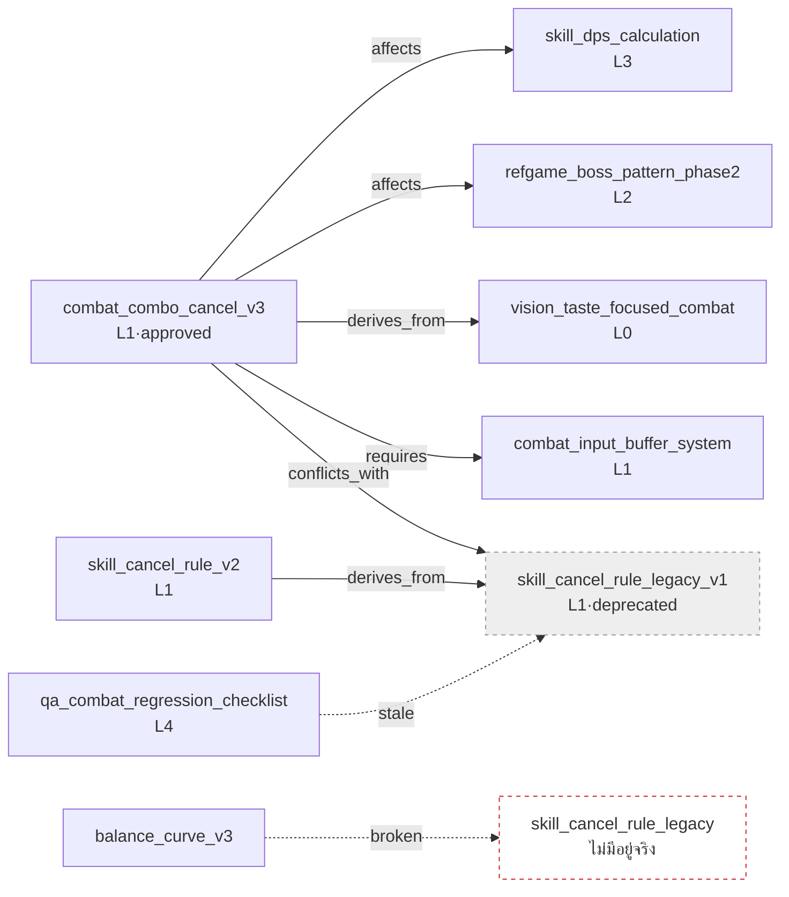

# 2.4 ออนโทโลยีและกราฟ wikilink — ตรวจสอบลูกศรเชิงความหมาย

เช้าวันจันทร์ มีคำขอเปลี่ยนแปลงหนึ่งรายการถูกส่งเข้ามา สมาชิกทีมต่อสู้ A เขียนข้อความหนึ่งบรรทัดลงในแชตภายในทีม "ผมจะเปลี่ยน global cooldown จาก 0.5 วินาทีเป็น 0.3 วินาทีนะ มีที่ไหนได้รับผลกระทบไหม" หากเป็นปกติแล้ว จากตรงนี้จะเริ่มต้นการประชุมยาว 30 นาที คนดูแลสูตรคำนวณดาเมจยกมือขึ้น คนดูแลกฎ combo cancel ก็แทรกเข้ามา และมีใครบางคนถามว่า "แพตเทิร์นบอสไม่ได้รับผลกระทบด้วยหรือ" เมื่อไม่มีใครเก็บภาพรวมทั้งหมดไว้ในหัว การประชุมจึงเต็มไปด้วยการพยายามรื้อความทรงจำ

แต่คราวนี้ต่างออกไป หนึ่งวินาทีหลังจากส่งคำขอ บอตได้แสดงคอมเมนต์อัตโนมัติขึ้นมา "หากเปลี่ยน atom นี้ จะมี atom 4 รายการที่ได้รับผลกระทบ ได้แก่ `skill_dps_calculation`, `combat_combo_cancel_v3`, `refgame_boss_pattern_phase2`, `balance_curve_v3` ผู้รับผิดชอบ: สมาชิกทีม B, สมาชิกทีม A, สมาชิกทีม C" การประชุมไม่ถูกเปิดขึ้น ทั้ง 4 คนต่างตรวจสอบเฉพาะ atom ของตัวเองแล้วก็จบ (บอตตัวนี้เราจะสร้างขึ้นเองในภายหลัง — 2.4.3)

คอมเมนต์นี้ไม่ใช่เวทมนตร์ ในหัวข้อ 2.3 เราได้กำหนดพิกัด Layer ให้กับ atom ทุกตัวไปแล้ว และบนพิกัดนั้น ในบทนี้เราได้เพิ่ม **ลูกศรเชิงความหมาย** — การตัดสินใจใดส่งผลต่อการตัดสินใจใด — เข้าไป พิกัดบอกได้เพียงแค่ "ตรงนี้มีอะไรอยู่" เท่านั้น ส่วนความสัมพันธ์อย่าง "สิ่งนี้ส่งผลต่อสิ่งนั้น" "สิ่งนั้นต้องมีอยู่ก่อนจึงจะตั้งอยู่ได้" "สองสิ่งนี้เปิดพร้อมกันไม่ได้" คือลูกศรที่ถูกวาดลงบนพิกัด บทนี้จะกล่าวถึงว่าจะเขียนกำกับลูกศรเหล่านั้นอย่างไร และจะตรวจจับลูกศรที่ขาดโดยอัตโนมัติได้อย่างไร

> **บันทึกศัพท์**
> - ออนโทโลยี (ontology): ระบบที่นิยามแนวคิดและความสัมพันธ์ระหว่างแนวคิดเหล่านั้นอย่างชัดเจน ในหนังสือเล่มนี้เราใช้เวอร์ชันเบาที่ลดรูปให้เหลือความสัมพันธ์ 6\~12 แบบ
> - wikilink: ลิงก์ระหว่างเอกสารในรูปแบบ `[[atom_name]]` ยืมการเขียนกำกับมาจากเครื่องมืออย่าง Obsidian และ Roam
> - การอ้างกลับ (backlink): รายการของ "atom ทั้งหลายที่ชี้มายัง atom นี้" ทิศทางตรงข้ามกับการอ้างไปข้างหน้า
> - โหนดกำพร้า (orphan): atom ที่ไม่ถูกอ้างถึงจากที่ใดเลย เป็นสัญญาณว่าเป็นผู้สมัครสำหรับการเลิกใช้
> - ลิงก์ที่ขาด (broken link): wikilink ที่ชี้ไปยัง atom ซึ่งไม่มีอยู่จริง ร่องรอยของการพิมพ์ผิดหรือการเปลี่ยนชื่อ

---

## 2.4.1 ความสัมพันธ์คือลูกศร — เหตุใด wikilink เพียงอย่างเดียวจึงไม่พอ

ในหัวข้อ 2.1 เราได้แนบเมตาดาตาด้วย YAML frontmatter และโปรยwikilink ไว้ในเนื้อหาของ atom เพียงเท่านั้นเอกสารก็เชื่อมโยงกันเป็นตาข่ายอยู่แล้ว ปัญหาคือการเชื่อมโยงเหล่านั้น **ไม่ได้เขียนกำกับไว้ว่าหมายความว่าอะไร**

```markdown
การตัดสินใจนี้ตั้งอยู่บน [[skill_cooldown_rule_v2]]
```

บรรทัดเดียวนี้บอกได้เพียงแค่ "กล่าวถึง skill_cooldown_rule_v2" เท่านั้น เหตุใดจึงกล่าวถึง การตัดสินใจนี้ **ต้องการ** (requires) กฎข้อนั้นหรือ **แตกแขนงมาจาก** (derives_from) กฎข้อนั้นหรือ หรือว่า **ขัดแย้งกับ** (conflicts_with) กฎข้อนั้น มนุษย์อ่านประโยคแล้วก็เข้าใจ แต่เครื่องไม่รู้ ต่อให้ถาม AI ว่า "ถ้าเปิดการตัดสินใจนี้ มีอะไรพังบ้าง" ลิงก์ที่ไร้ความหมายเพียงอย่างเดียวก็ตอบไม่ได้

ดังนั้นเราจึงสวม **ประเภทความสัมพันธ์** ลงบน wikilink ความสัมพันธ์ที่ใช้กันจริงในการออกแบบเกมนั้นน้อยอย่างคาดไม่ถึง หกแบบต่อไปนี้ครอบคลุมได้มากกว่า 90%

<svg viewBox="0 0 720 250" xmlns="http://www.w3.org/2000/svg" font-family="sans-serif" font-size="13">
  <rect x="0" y="0" width="720" height="250" fill="#fbfbfd" stroke="#ddd"/>
  <!-- affects -->
  <rect x="20" y="20" width="120" height="44" rx="6" fill="#fff" stroke="#222"/>
  <text x="80" y="40" text-anchor="middle" font-weight="bold">affects</text>
  <text x="80" y="56" text-anchor="middle" fill="#666">ส่งผลกระทบ</text>
  <!-- derives_from -->
  <rect x="160" y="20" width="120" height="44" rx="6" fill="#fff" stroke="#1a66cc"/>
  <text x="220" y="40" text-anchor="middle" font-weight="bold" fill="#1a66cc">derives_from</text>
  <text x="220" y="56" text-anchor="middle" fill="#666">แตกแขนงจาก ~</text>
  <!-- requires -->
  <rect x="300" y="20" width="120" height="44" rx="6" fill="#fff" stroke="#e08a00"/>
  <text x="360" y="40" text-anchor="middle" font-weight="bold" fill="#e08a00">requires</text>
  <text x="360" y="56" text-anchor="middle" fill="#666">ต้องมีก่อน</text>
  <!-- conflicts_with -->
  <rect x="440" y="20" width="130" height="44" rx="6" fill="#fff" stroke="#cc2222"/>
  <text x="505" y="40" text-anchor="middle" font-weight="bold" fill="#cc2222">conflicts_with</text>
  <text x="505" y="56" text-anchor="middle" fill="#666">ใช้พร้อมกันไม่ได้</text>
  <!-- is_a -->
  <rect x="590" y="20" width="110" height="44" rx="6" fill="#fff" stroke="#888"/>
  <text x="645" y="40" text-anchor="middle" font-weight="bold" fill="#888">is_a</text>
  <text x="645" y="56" text-anchor="middle" fill="#666">กรณีเฉพาะ</text>
  <!-- part_of -->
  <rect x="300" y="90" width="120" height="44" rx="6" fill="#fff" stroke="#bbb"/>
  <text x="360" y="110" text-anchor="middle" font-weight="bold" fill="#999">part_of</text>
  <text x="360" y="126" text-anchor="middle" fill="#666">เป็นส่วนของ ~</text>
  <!-- example wiring -->
  <text x="360" y="175" text-anchor="middle" fill="#333" font-size="14">ตัวอย่าง: combat_combo_cancel_v3 —[affects]→ skill_dps_calculation</text>
  <text x="360" y="200" text-anchor="middle" fill="#333" font-size="14">combat_combo_cancel_v3 —[derives_from]→ vision_taste_focused_combat</text>
  <text x="360" y="225" text-anchor="middle" fill="#333" font-size="14">combat_combo_cancel_v3 —[requires]→ combat_input_buffer_system</text>
</svg>

atom ที่ตรึงหกแบบนี้ไว้เป็น enum คือ `ontology_relation_enum_v1` หากต้องการเพิ่มประเภทความสัมพันธ์ใหม่ จะต้องผ่านการรีวิวคำขอเปลี่ยนแปลง แม้จะเพิ่มขึ้นเส้นที่เหมาะสมก็อยู่ที่ 10\~12 แบบ และในตอนเริ่มต้นจะเริ่มด้วยสามแบบคือ affects·derives_from·requires ก็เพียงพอแล้ว ที่ที่จะเขียนความสัมพันธ์ลงไปคือ YAML frontmatter ของ atom

```yaml
---
name: combat_combo_cancel_v3
layer: 1
affects: [skill_dps_calculation, refgame_boss_pattern_phase2]
derives_from: [vision_taste_focused_combat]
requires: [combat_input_buffer_system, skill_cooldown_rule_v2]
conflicts_with: [skill_cancel_rule_legacy_v1]
---
```

มนุษย์เขียนแค่ทิศทางไปข้างหน้าเพียงบรรทัดเดียว ส่วนทิศทางย้อนกลับ ("ใครที่ affects ฉัน") เครื่องมือจะสแกนทั้งหมดแล้วคำนวณให้เอง หากเขียน affects ไว้ทั้งสองฝั่ง ภาระในการซิงค์จะเพิ่มเป็นสองเท่า และวินาทีที่แก้ฝั่งหนึ่งแล้วลืมอีกฝั่ง กราฟก็จะเริ่มโกหก **ทิศทางเดียวด้วยมือ ทิศทางตรงข้ามด้วยเครื่องมือ** คือหลักการที่ร้อยเรียงทั้งบทนี้เข้าด้วยกัน

---

## 2.4.2 บันทึกเซสชันจริง (worked transcript) — ตรวจสอบการอ้างกลับของ wikilink และความสมบูรณ์ของกราฟในคราวเดียว

จากตรงนี้ไปจะถ่ายทอดเซสชันหนึ่งที่เกิดขึ้นจริงทั้งยวง สถานการณ์เป็นดังนี้ ในขณะที่รื้อกฎ combo cancel จาก v2 ไปเป็น v3 เราตัดสินใจจะเลิกใช้ `skill_cancel_rule_legacy_v1` แต่ก่อนจะเลิกใช้นั้น ต้องตรวจสอบก่อนว่า **มี atom อื่นที่ชี้มายัง atom นี้หรือไม่** (การอ้างกลับ) และ **หลังจากเลิกใช้แล้วจะไม่มีลิงก์ที่ขาดหรือความขัดแย้งหลงเหลืออยู่หรือไม่** (ความสมบูรณ์ของกราฟ) หากใช้มือ grep ก็จะตกหล่น เราจึงให้ Claude ทำ

### พรอมต์ (ฉบับเต็ม)

```
ในโฟลเดอร์ atom (decisions/) ที่แนบมา มี atom อยู่ และใน frontmatter
น่าจะมีความสัมพันธ์ (affects/derives_from/requires/conflicts_with/is_a/part_of)
เขียนไว้ ในเนื้อหาก็มี wikilink ด้วย ตอนนี้ฉันจะเลิกใช้
skill_cancel_rule_legacy_v1 ก่อนเลิกใช้ช่วยตรวจ 3 อย่างให้หน่อย:
1) การอ้างกลับ 2) ลิงก์ที่ขาด 3) ความขัดแย้ง อย่าเดา ให้อ่านไฟล์จริง ๆ
แล้วตอบ ถ้าหาไม่เจอก็บอกว่าหาไม่เจอ
// การอ้างกลับ=ทั้งความสัมพันธ์ใน YAML และ wikilink ในเนื้อหา / ลิงก์ที่ขาด=ลิงก์ที่กลายเป็น stale·ไม่มีอยู่เพราะการเลิกใช้
// ความขัดแย้ง=ในบรรดาคู่ conflicts_with มี status: approved ที่ยังมีชีวิตอยู่หรือไม่
```

### ผลลัพธ์จาก Claude (ดิบ — ไม่ได้สรุปหรือเรียบเรียง)

> ได้อ่านไฟล์ 47 ไฟล์ในโฟลเดอร์ decisions/ แล้ว นี่คือผลการตรวจสอบ 3 อย่างเกี่ยวกับ `skill_cancel_rule_legacy_v1`
>
> **1. การอ้างกลับ (atom ที่ชี้มายัง atom นี้)**
>
> atom ที่ชี้มาด้วยความสัมพันธ์ใน YAML:
> - `combat_combo_cancel_v3` — `conflicts_with: [skill_cancel_rule_legacy_v1]`
> - `skill_cancel_rule_v2` — `derives_from: [skill_cancel_rule_legacy_v1]`
>
> atom ที่ชี้มาด้วย wikilink ในเนื้อหา:
> - เนื้อหาของ `combat_combo_cancel_v3`: "แก้ปัญหา input buffer ของเวอร์ชันเก่า `[[skill_cancel_rule_legacy_v1]]`"
> - เนื้อหาของ `qa_combat_regression_checklist`: "รายการ regression ข้อ 3 เขียนขึ้นโดยอ้างอิง `[[skill_cancel_rule_legacy_v1]]`"
>
> กล่าวคือ **มี atom 4 รายการที่อ้างถึง atom นี้** (YAML 2 + wikilink ในเนื้อหา 2 แต่ combat_combo_cancel_v3 ปรากฏทั้งสองฝั่ง ดังนั้นจำนวน atom จริงคือ 3 รายการ)
>
> **2. ลิงก์ที่ขาด (จุดที่จะขาดเมื่อเลิกใช้)**
>
> การเลิกใช้ในตัวมันเองไม่ได้ทำให้ wikilink "ขาด" — เพราะไฟล์ยังอยู่ มีแค่ status ที่กลายเป็น deprecated เท่านั้น อย่างไรก็ตาม:
> - `qa_combat_regression_checklist` นิยามรายการ regression โดยอ้างอิง atom ที่ถูกเลิกใช้ จึง **ไร้ผลในเชิงเนื้อหา** นี่ไม่ใช่ลิงก์ที่ขาดแต่เป็น stale link จำเป็นต้องตรวจทาน
> - หากท่าน **ลบ** ไฟล์ออกไปด้วย การอ้างอิงทั้ง 4 รายการข้างต้นจะกลายเป็นลิงก์ที่ขาดทั้งหมด
>
> ⚠️ มีจุดหนึ่งที่คลุมเครือ: ในเนื้อหาของ `balance_curve_v3` มีลิงก์ `[[skill_cancel_rule_legacy]]` (ไม่มี `_v1` ต่อท้าย) อยู่ ไม่อาจมั่นใจได้จากตัวไฟล์เพียงอย่างเดียวว่านี่เป็นการพิมพ์ผิดที่ตั้งใจจะชี้ไปยัง `_v1` หรือว่าตั้งใจให้เป็น atom แยกอีกตัว ไฟล์ชื่อ `skill_cancel_rule_legacy` นั้น **ไม่มีอยู่** ในโฟลเดอร์ กล่าวคือนี่มีความเป็นไปได้สูงว่าเป็นลิงก์ที่ขาดอยู่แล้ว จำเป็นต้องตรวจสอบ
>
> **3. ความขัดแย้งที่หลงเหลือ (คู่ conflicts_with ยังมีชีวิตอยู่หรือไม่)**
>
> atom ที่ผูกกับ `skill_cancel_rule_legacy_v1` ด้วย `conflicts_with` มีเพียง `combat_combo_cancel_v3` ตัวเดียว
> - status ของ `combat_combo_cancel_v3`: **approved** (ยังมีชีวิตอยู่)
>
> → กฎใหม่ที่เคยขัดแย้งกับเป้าหมายการเลิกใช้อยู่ในสถานะอนุมัติตามปกติ นี่เป็นเรื่องปกติ เป็นการแทนที่ตามธรรมชาติที่เลิกใช้เวอร์ชันเก่าและเวอร์ชันใหม่อยู่รอด **ไม่ใช่คำเตือนความขัดแย้งที่หลงเหลือ**
>
> ---
> **สรุป**: การเลิกใช้ปลอดภัย แต่ให้จัดการสองอย่างก่อน
> (a) stale link ของ `qa_combat_regression_checklist` — อัปเดตรายการ regression ข้อ 3
> (b) `[[skill_cancel_rule_legacy]]` ของ `balance_curve_v3` — สงสัยว่าพิมพ์ผิด อาจเป็นลิงก์ที่ขาดอยู่แล้ว

### การตรวจสอบและการยับยั้งของมนุษย์

ตรงนี้ผมไม่ได้รับผลลัพธ์มาตามนั้นทั้งดุ้น (a) นั้นถูกต้อง — เช็กลิสต์ regression เป็นสิ่งที่ผมต้องอัปเดตเอง แต่ผมหยุดที่ (b) Claude บอกว่า `[[skill_cancel_rule_legacy]]` ของ `balance_curve_v3` "สงสัยว่าพิมพ์ผิด" แต่ผมต้องเปิดโฟลเดอร์ดูเองว่ามันเป็นลิงก์ที่ขาดจริงหรือไม่ คำว่า "ไม่อาจมั่นใจได้" ของ AI เป็นสัญญาณที่ซื่อสัตย์ ไม่ใช่ข้อสรุป

เมื่อเปิดโฟลเดอร์ดูก็พบว่าไฟล์ชื่อ `skill_cancel_rule_legacy` ไม่มีอยู่จริง แต่เมื่อดู git log ก็พบว่าเมื่อ 6 เดือนก่อนมีคอมมิตที่ **เปลี่ยนเพียงชื่อ** จาก `skill_cancel_rule_legacy` → `skill_cancel_rule_legacy_v1` ตอนนั้นเองที่ลิงก์ในเนื้อหาของ `balance_curve_v3` ไม่ได้รับการอัปเดตและถูกปล่อยผ่านไป กล่าวคือนี่ไม่ใช่การพิมพ์ผิดแต่เป็น **ลิงก์ที่ขาดซึ่งกลายเป็นกำพร้าหลังการเปลี่ยนชื่อ** การคาดเดาว่า "สงสัยว่าพิมพ์ผิด" ของ Claude ถูกเพียงครึ่งเดียว สาเหตุไม่ใช่การพิมพ์ผิดแต่เป็นการตกหล่นในการ rename หากผมไม่จับความต่างนี้ ก็คงแก้แค่เช็กลิสต์ regression แล้วฝังลิงก์ที่ขาดเอาไว้ตามเดิม

### การร้องขอใหม่ (สะท้อนข้อเท็จจริงที่ตรวจยืนยันแล้ว)

```
ตรวจสอบแล้ว [[skill_cancel_rule_legacy]] ไม่ใช่การพิมพ์ผิด แต่เป็นลิงก์ที่ขาด
ซึ่งตอน rename เมื่อ 6 เดือนก่อน (_legacy → _legacy_v1) ลืมแก้ลิงก์ในเนื้อหา

งั้นถือโอกาสนี้ ช่วยค้นหา "wikilink ที่ชี้ไปยัง atom ที่ไม่มีอยู่จริง"
ทั้งหมดในโฟลเดอร์ให้ที โดยยึดจาก wikilink ในเนื้อหา ที่ไฟล์เป้าหมายไม่มีในโฟลเดอร์ ทั้งหมด
แสดงชื่อไฟล์และลิงก์ที่ขาดในนั้นเป็นตาราง
```

> ได้รวบรวม wikilink ในเนื้อหาทุก `[[...]]` ของไฟล์ทั้ง 47 ไฟล์ แล้วเทียบกับรายชื่อไฟล์ในโฟลเดอร์ ลิงก์ที่ขาดซึ่งไฟล์เป้าหมายไม่มีอยู่จริงมี **3 รายการ**
>
> | ไฟล์ที่มีลิงก์ | wikilink ที่ขาด | สาเหตุที่คาดว่า |
> |---|---|---|
> | `balance_curve_v3` | `[[skill_cancel_rule_legacy]]` | ตกหล่นในการ rename (→ `_v1`) |
> | `quest_reward_table_v2` | `[[concept_reward_currency]]` | atom เป้าหมายยังไม่ได้เขียน (มีแต่แผน ไม่มีไฟล์) |
> | `refgame_boss_pattern_phase2` | `[[skill_global_cooldown]]` | ตกหล่นในการ rename (→ `skill_global_cooldown_rule`) |
>
> ใน 3 รายการ 2 รายการ (ตกหล่นในการ rename) แก้ได้โดยเปลี่ยนชื่อ atom เป้าหมายเป็น `_v1` / `_rule` ส่วน 1 รายการ (`concept_reward_currency`) ตัว atom ที่ชี้ไปนั้นไม่มีอยู่ จึงต้องเขียนขึ้นหรือไม่ก็ลบลิงก์ออก ผมไม่ได้แก้ให้โดยอัตโนมัติ — โปรดตรวจสอบว่าท่านตั้งใจแบบใดก่อนดำเนินการ

ทั้งสามรายการเป็นความจริง หากใช้มือ grep ก็เกือบจะแน่นอนว่าจะพลาดลิงก์ที่ขาดของ `quest_reward_table_v2` ลิงก์นั้นเป็น "การอ้างอิงอนาคตที่ตั้งใจ" ซึ่งชี้ล่วงหน้าไปยัง atom ที่ยังไม่ได้สร้าง แต่ตลอด 6 เดือนไม่มีใครสร้าง atom นั้นขึ้นมา มันจึงกลายเป็นคำสัญญาที่ตายไปแล้วในทางพฤตินัย

สิ่งที่เซสชันนี้แสดงให้เห็นนั้นเรียบง่าย **การตรวจจับการอ้างกลับและการตรวจจับลิงก์ที่ขาดเป็นงานที่ AI เก่งในการอ่านและเทียบทั้งโฟลเดอร์ ส่วนการตัดสินสาเหตุและการยืนยันเจตนาเป็นงานของมนุษย์** AI ทำได้ถึง "ตรงนี้ขาด" มนุษย์ทำต่อถึง "ขาดเพราะอะไรและจะแก้อย่างไร"

---

## 2.4.3 สิ่งที่มองเห็นเมื่อวาดเป็นกราฟ — ย้ายการตรวจสอบไปสู่ภาพ

การตรวจสอบในหัวข้อก่อนหน้าจะรันด้วยพรอมต์ทุกครั้งก็ได้ แต่หากตรึงการตรวจสอบเดียวกันนั้นไว้ในโค้ด ก็จะมองเห็นได้ในแวบเดียวบนกราฟ ในโปรเจกต์ A มีเครื่องมือกราฟที่ขยายจาก `gen_relation_map.py` ที่แนะนำในหัวข้อ 2.3 เดินงานในฐานะ R&D หัวใจคือการอ่าน atom ในโฟลเดอร์มาสร้างเป็นกราฟทิศทางด้วย `networkx` แล้ววางฟังก์ชันตรวจสอบสี่อย่างทับลงไป

```python
import networkx as nx

# build_graph(folder): อ่านโฟลเดอร์ atom แล้วสร้าง DiGraph
#   จากโหนด (=atom) และเอดจ์ความสัมพันธ์ใน YAML (ฉบับเต็มอยู่ใน「ลองทำดู」)

def find_cycles(G):                      # การพึ่งพาแบบวนรอบ
    return list(nx.simple_cycles(G))

def find_orphans(G):                     # inbound 0 = ผู้สมัครเป็นกำพร้า
    return [n for n in G.nodes if G.in_degree(n) == 0]
```

หัวใจอยู่ที่สองบรรทัด `simple_cycles` จับการพึ่งพาแบบวนรอบ (A requires B requires C requires A) และ `in_degree(n) == 0` จับโหนดกำพร้า — ไม่จำเป็นต้องเขียน DFS เอง ฟังก์ชันอีกสองตัวที่เหลือก็เป็นแบบหนึ่งบรรทัดในระนาบเดียวกัน `find_broken_wikilinks` รวบรวม `[[...]]` ในเนื้อหาด้วยregular expression (regex) แล้วคัดเลือกตัวที่ไม่มีอยู่ในรายชื่อโหนด ส่วนการอ้างกลับนั้นได้มาจากการไล่กราฟย้อนทาง (ฉบับเต็มอยู่ใน「ลองทำดู」) การทำให้เป็นภาพจะลงสีโหนดตาม Layer ลงสีเอดจ์ตามประเภทความสัมพันธ์ และวาดโหนดที่ถูกอ้างถึงมาก (โหนดที่มีเอดจ์ inbound เยอะ) ให้ใหญ่ขึ้นเพื่อให้ฮับปรากฏชัด เปรียบเหมือนโฟลเดอร์ที่จัดเรียงโดยติดป้ายสีไว้บนตู้ แพตเทิร์นจะลอยขึ้นมาก่อนภายในขอบเขตสายตา

ด้านล่างคือกราฟที่ถ่ายทอดความสัมพันธ์จริงของ atom ทั้งหลายที่กล่าวถึงในเซสชัน 2.4.2 ทิศทางลูกศรหมายถึง "atom ต้นทางสร้างความสัมพันธ์มุ่งไปยัง atom ปลายทาง"



สองเอดจ์ที่วาดด้วยเส้นประคือปัญหาที่จับได้ด้วยการตรวจสอบของมนุษย์ในหัวข้อ 2.4.2 `qa → legacy` คือ stale link ที่อ้างอิง atom ที่ถูกเลิกใช้ ส่วน `balance_curve_v3 → skill_cancel_rule_legacy` คือลิงก์ที่ขาดซึ่งชี้ไปยังโหนดที่ไม่มีอยู่จริง เมื่อวาดเป็นกราฟ เส้นประสองเส้นนี้จะโดดเด่นขึ้นมาท่ามกลางเส้นทึบ หากดำเนินการด้วยข้อความเพียงอย่างเดียว มันคงถูกฝังอยู่ที่ใดที่หนึ่งในไฟล์ 47 ไฟล์และมองไม่เห็นไปตลอดกาล

กฎที่รันโดยอัตโนมัติที่ verification gate (Layer 4) มีสี่อย่าง

- **การพึ่งพาแบบวนรอบ**: หากสายโซ่ `requires` วนกลับมายังตัวเอง ให้เตือน ตรวจจับด้วย `simple_cycles`
- **การเปิดใช้ความขัดแย้ง**: หาก atom สองตัวที่ผูกด้วย `conflicts_with` ทั้งคู่เป็น `status: approved` ให้เตือน (กรณีในหัวข้อ 2.4.2 ผ่านได้เพราะฝั่งหนึ่งเป็น deprecated)
- **โหนดกำพร้า**: atom ที่ inbound เป็น 0 และไม่มีพ่อแม่ด้วยจะเป็นผู้สมัครสำหรับการเลิกใช้ ตรวจตามรายไตรมาส atom ชื่อ `graph_orphan_detection_quarterly` ระบุรอบนี้ไว้
- **การไหลย้อนของ Layer**: L1 → L3 affects เป็นปกติ (การตัดสินใจระดับบนส่งผลต่อข้อมูลระดับล่าง) แต่ L3 → L1 affects น่าสงสัย เป็นหลักการเดียวกับการตรวจจับการอ้างถอยหลังในหัวข้อ 2.3 เพราะ atom ชื่อ `docs_layer_numeric_prefix_naming` บังคับให้ใส่ prefix หมายเลข Layer ในชื่อเอกสาร การไหลย้อนจึงถูกคัดกรองชั้นแรกได้แค่ดูชื่อไฟล์

เมื่อกฎสี่ข้อนี้ถูกตรึงไว้ในโค้ดแล้ว ก็ไม่จำเป็นต้องเขียนพรอมต์ทุกครั้งอย่างในหัวข้อ 2.4.2 ในวินาทีที่คำขอเปลี่ยนแปลงถูกส่งเข้ามา บอตจะ build กราฟใหม่ แล้วแสดงรายการ atom ที่ได้รับผลกระทบ พร้อมลิงก์ที่ขาด·การวนรอบ·ความขัดแย้งเป็นคอมเมนต์อัตโนมัติ คอมเมนต์ "atom 4 รายการได้รับผลกระทบ" ที่ต้นบทนี่เองคือสิ่งนี้ — บอตตัวนี้คือบอตที่ได้บอกล่วงหน้าไว้ก่อนหน้า

---

## 2.4.4 ทำไมจึงเป็น Layer — พิกัดที่แบ่งไว้เพื่อการสร้างแบบโพรซีเดอรัล

ตรงนี้ต้องชี้ให้ชัดว่าเหตุใด 2.3 และ 2.4 จึงเป็นชุดเดียวกัน พิกัด Layer และลูกศรความสัมพันธ์ไม่ได้นำมาใช้แยกกัน แต่เป็นสองด้านของจุดประสงค์เดียวกัน

ในเชิงผิวเผิน Layer ทำให้ภาษาในการทำงานร่วมกันเป็นหนึ่งเดียว — เมื่อเรียกว่า "อันนี้คือการตัดสินใจระบบ L1" "อันนั้นคือข้อมูล L3" ต่อให้สาขาต่างกันก็ใช้พิกัดเดียวกันร่วมกันได้ แต่จุดประสงค์ในเชิงแก่นแท้นั้นอยู่ที่อื่น **Layer คือพิกัดที่แบ่งไว้เพื่อการสร้างแบบโพรซีเดอรัล (procedural generation)**

วิสัยทัศน์ L0 คือ context anchor — ไม่เปลี่ยนแปลง และถูกฉีดเข้า AI ทุกครั้ง ระบบ L1 คือกฎอินพุตของการสร้าง — rulebook·ความสัมพันธ์·แท็กอาศัยอยู่ที่นี่ เนื้อหา L2 คือที่ที่เนื้อหาที่ถูกสร้างขึ้นสะสมตัว ข้อมูล L3 เป็นอินพุตของการจำลองด้วยตัวเลข·ID·ความสัมพันธ์ ส่วน build·QA ใน L4 คือ verification gate ลูกศรความสัมพันธ์ทำงานเป็น **เงื่อนไขจำกัดของการสร้าง** บนพิกัดนี้ เมื่อ AI สร้างเนื้อหาใหม่ ลูกศร `requires` กลายเป็นข้อสมมติฐานว่า "สิ่งนี้ต้องมีก่อน" และลูกศร `conflicts_with` กลายเป็นข้อห้ามว่า "สิ่งนี้เปิดร่วมกันไม่ได้"

สาขาแตกแขนงออกไป (ต่อสู้·เควสต์·เศรษฐกิจต่างมีความเชี่ยวชาญของตน) แต่เพราะผลผลิตทั้งหมดมีพิกัด Layer จึงรับรู้ซึ่งกันและกัน การแตกแขนงและการบูรณาการตั้งอยู่พร้อมกันบนระบบพิกัดเดียว เมื่อกราฟนี้เติบโตพอ AI จะอ่านลูกศรความสัมพันธ์เป็นข้อจำกัดอัตโนมัติขณะสร้างผู้สมัคร และมนุษย์เพียงตรวจสอบว่ามีการละเมิดหรือไม่ที่ด่านตรวจ บันทึกเซสชันจริงในหัวข้อ 2.4.2 คือฉบับย่อของสิ่งนั้น — AI อ่านกราฟเพื่อค้นหาการละเมิดข้อจำกัด (ลิงก์ที่ขาด·ความขัดแย้ง) และมนุษย์ตัดสินที่ด่าน

---

## 2.4.5 แนวคิดโดเมนก็เป็นโหนด — พจนานุกรมศัพท์เล็ก ๆ

โหนดที่เป็นจุดต้นทาง·จุดปลายทางของลูกศรความสัมพันธ์ไม่ได้มีแต่ atom การตัดสินใจเท่านั้น atom ที่นิยามแนวคิดโดเมนอย่าง "สกิล" "เควสต์" "รางวัล" ก็เป็นพลเมืองชั้นหนึ่งของกราฟ `concept_skill_definition_v1` มีหน้าตาแบบนี้

```markdown
# สกิล (Skill)
Definition: หน่วยแอ็กชันที่ตัวละครปลดปล่อยระหว่างการต่อสู้ ครอบคลุมอินพุต·คูลดาวน์·ทรัพยากร·เอฟเฟกต์
Required Properties: input / cooldown / cost / effects
Subtypes: active_skill (is_a) / passive_skill (is_a) / ultimate_skill (is_a)
Not a skill: การโจมตีอัตโนมัติ [[concept_auto_attack]] / การแปลงร่าง [[concept_transformation]]
```

หากเขียนว่า `boss_skill is_a skill` กฎของแนวคิดระดับบนจะถูกสืบทอดมาโดยอัตโนมัติ ในโปรเจกต์ A มี atom นิยามแนวคิดเช่นนี้ราว 19 ตัว และ atom การตัดสินใจทุกตัวอ้างถึงพวกมัน เมื่อศัพท์ถูกทำให้เป็นหนึ่งเดียวด้วยพจนานุกรมเล่มเดียว ภาระในการแปลระหว่างการประชุม·เอกสาร·โค้ดก็หายไป เปรียบเหมือนการที่ไม่ได้วางพจนานุกรมคนละเล่มไว้ตามโต๊ะแต่ละตัว แต่ใช้พจนานุกรมเล่มเดียวกันร่วมกัน `concept_reward_currency` ที่ถูกจับได้ว่าเป็นลิงก์ที่ขาดในบันทึกเซสชันจริงก่อนหน้านี้ ก็คือ "รายการว่างที่ตกลงกันว่าจะขึ้นทะเบียนในพจนานุกรมแต่ยังไม่ได้สร้าง" นั่นเอง

---

## 2.4.6 จงรักษาให้เบาไว้ — กับดักของออนโทโลยีเชิงวิชาการ

อ่านมาถึงตรงนี้ก็จะมีคำถามว่า "นี่มันออนโทโลยีอย่างเป็นทางการแบบ OWL/RDF ไม่ใช่หรือ" ไม่ใช่ และตั้งใจทำให้ไม่ใช่

ออนโทโลยีเชิงวิชาการ (OWL·RDF·SKOS) นั้นทรงพลัง แต่มีประเภทความสัมพันธ์หลายสิบถึงหลายร้อยแบบ ต้องใช้เอนจินอนุมานเฉพาะทาง และหากจะดำเนินการก็ต้องมีผู้เชี่ยวชาญด้านออนโทโลยีประจำอยู่ ในด้านที่การอนุมานแม่นยำตัดสินความเป็นความตายอย่างเสิร์ชเอนจิน·การแพทย์·กฎหมาย สิ่งนี้จำเป็น แต่การอนุมานที่จำเป็นจริงในการออกแบบเกมมีเพียง "ขอบเขตผลกระทบของการเปลี่ยนแปลง" "การพึ่งพาที่ต้องมาก่อน" "การตรวจจับความขัดแย้ง" เท่านั้น และทั้งหมดจบลงที่ระดับการค้นแบบเรียบง่าย (BFS·DFS) ที่ไล่ตามกราฟทีละช่อง หัวข้อก่อนหน้าที่จับการวนรอบได้ด้วย `networkx` บรรทัดเดียวคือหลักฐานของสิ่งนั้น เอนจินอนุมานอย่างเป็นทางการนั้นเกินจำเป็น

เกณฑ์มีเพียงข้อเดียว **นักออกแบบเกมดำเนินการด้วยมือได้หรือไม่** YAML enum 6 ตัว, การประมวลผลด้วย `networkx`, การทำเป็นภาพด้วย pyvis หรือ D3.js วินาทีที่ก้าวข้ามเส้นนี้ เครื่องมือก็เลิกเป็นเครื่องมือและกลายเป็นภาระอีกอย่างหนึ่ง ความเบาไม่ใช่การประนีประนอม แต่เป็นเจตนาในการออกแบบ

ในการหลีกเลี่ยงกับดักนี้มีความผิดพลาดที่เกิดซ้ำอยู่ห้าอย่าง ทั้งหมดงอกออกมาจากรากเดียวกันคือ "ที่ที่จัดการออนโทโลยีในฐานะมาตรฐานบังคับ"

| ความผิดพลาด | วิธีหลีกเลี่ยง |
|---|---|
| นิยามประเภทความสัมพันธ์มากเกินไปตั้งแต่แรก | เริ่มด้วยสามแบบ (affects·derives_from·requires) เพิ่มเฉพาะเมื่อจำเป็นเท่านั้น |
| บังคับให้ทุกการตัดสินใจมีความสัมพันธ์ | ยอมรับ atom ที่ไม่มีความสัมพันธ์ว่าเป็นเรื่องปกติด้วย — ความสัมพันธ์ที่ว่างเปล่าทำให้กราฟสกปรก |
| เขียน affects แบบสองทิศทาง | ทิศทางเดียวด้วยมือ ทิศทางย้อนกลับให้เครื่องมือคำนวณอัตโนมัติ |
| ยึดติดกับ OWL·RDF | คงอยู่ที่ระดับที่ดำเนินการได้ (YAML + enum) |
| ดำเนินการด้วยข้อความล้วนโดยไม่มีการทำเป็นภาพ | จัดให้มีตั้งแต่แรกแม้จะเป็น HTML view แบบเรียบง่ายก็ตาม — เหมือนเส้นประในหัวข้อ 2.4.3 ถ้ามองไม่เห็นก็ไม่ได้แก้ |

ข้อ 1·2·3 จะจับแพตเทิร์นได้ภายในเดือนแรกของการนำมาใช้ ส่วนข้อ 4·5 หากตรวจในการทบทวนเดือนที่สามก็จะเข้าที่เข้าทางไปเองโดยธรรมชาติ

---

## 2.4.7 การเริ่มต้นเล็ก ๆ และบทถัดไป

เดือนแรกขาดทุน มีแต่ภาระในการเขียนความสัมพันธ์สะสมขึ้น ส่วนผลที่มองเห็นนั้นไม่มี ดังนั้นจึงเริ่มต้นแบบเล็ก ๆ สัปดาห์แรกมีแค่สามความสัมพันธ์ affects·derives_from·requires สัปดาห์ที่ 2\~4 นำไปใช้กับ atom หลัก 20 ตัวพลางเฝ้าดูกราฟค่อย ๆ เติบโต หากในเดือนแรกสร้าง HTML graph view ระดับหัวข้อก่อนหน้าขึ้นมาสักหนึ่งอัน นับจากเดือนที่สองการทำเป็นภาพก็จะเริ่มแสดงคุณค่าให้เห็น และในเดือนที่สามการตรวจสอบอัตโนมัติ (การวนรอบ·ความขัดแย้ง·กำพร้า·ลิงก์ที่ขาด) จะลดเวลาการประชุมได้โดยตรง การทนเดือนแรกที่ขาดทุนให้ผ่านไปคือจุดแยกของความสำเร็จหรือล้มเหลวในการนำมาใช้

บทที่ 8 Wikilink บทถัดไปจะเจาะลึกการเขียนกำกับ `[[...]]` ที่บทนี้กล่าวถึงในรูปลูกศรไปสู่ระดับการดำเนินการ — ใช้แผงการอ้างกลับในแต่ละวันอย่างไร อัปเดตลิงก์ทั้งหมดพร้อมกันอย่างไรเมื่อเปลี่ยนชื่อ (วิธีป้องกันการตกหล่นในการ rename อย่างในหัวข้อ 2.4.2 ตั้งแต่ต้น) นำ graph view ของเครื่องมืออย่าง Obsidian มาหลอมรวมเข้ากับงานจริงอย่างไร YAML (บทที่ 4) → Atom (บทที่ 5) → Layer (บทที่ 6) → Ontology (บทที่ 7) → Wikilink (บทที่ 8) คือรูปห้าเหลี่ยมที่สมบูรณ์ของสถาปัตยกรรมสารสนเทศ

---

## ลองทำดู

**setup.** กำหนดโฟลเดอร์ที่รวบรวม atom ไว้ (เช่น `decisions/`) แล้วเตรียมเขียนคีย์ความสัมพันธ์ลงใน YAML ของแต่ละ atom ตอนแรกมีแค่สามตัว `affects`·`derives_from`·`requires` ลิงก์ในเนื้อหาให้รวมเป็นรูปแบบ `[[atom_name]]` ให้เป็นแบบเดียวกัน

**prompt.** ก่อนเลิกใช้·เปลี่ยนชื่อ ให้โยนคำสั่งด้านล่างนี้

```
อ่าน atom แบบ markdown ในโฟลเดอร์นี้ ฉันจะเลิกใช้/เปลี่ยน [atom_เป้าหมาย]
ช่วยตรวจสอบ
(1) การอ้างกลับ: atom ทั้งหมดที่ชี้มายัง atom นี้ด้วยความสัมพันธ์ใน YAML และ wikilink ในเนื้อหา
(2) ลิงก์ที่ขาด: ลิงก์ที่จะขาดหรือกลายเป็น stale เมื่อเปลี่ยน/ลบ
(3) ความขัดแย้งที่หลงเหลือ: ในบรรดาคู่ conflicts_with ตัวที่เป็น status: approved
อย่าเดา ให้อ่านไฟล์จริง ๆ ถ้าหาไม่เจอก็บอกว่าหาไม่เจอ
```

**verify.** จุดที่ AI กำกับว่า "สงสัยว่าพิมพ์ผิด" "ไม่อาจมั่นใจได้" ให้มนุษย์เปิดดูเอง **สาเหตุ** ของลิงก์ที่ขาด (พิมพ์ผิด หรือตกหล่นในการ rename หรือยังไม่ได้เขียน) มนุษย์ตัดสินด้วย git log และตัวจริงในโฟลเดอร์ อย่าสั่งให้แก้อัตโนมัติ แต่ให้แก้เองหลังยืนยันเจตนาแล้ว

### ฉบับเต็มของเครื่องมือกราฟ (ตัดตอนจาก 2.4.3)

ในเนื้อหา (2.4.3) ได้แสดงเพียงสองฟังก์ชันหลัก ฉบับเต็มที่ build ทั้งโฟลเดอร์เป็นกราฟและวางการตรวจสอบสี่อย่างมีดังนี้

```python
import networkx as nx
import re, yaml, glob, os

REL_TYPES = ["affects", "derives_from", "requires",
             "conflicts_with", "is_a", "part_of"]
WIKILINK = re.compile(r"\[\[([a-zA-Z0-9_]+)\]\]")

def build_graph(folder):
    G = nx.DiGraph()
    files = {}
    for path in glob.glob(os.path.join(folder, "*.md")):
        name = os.path.splitext(os.path.basename(path))[0]
        text = open(path, encoding="utf-8").read()
        fm = yaml.safe_load(text.split("---")[1]) or {}
        files[name] = fm
        G.add_node(name, layer=fm.get("layer"), status=fm.get("status"))
    # เอดจ์ความสัมพันธ์ใน YAML
    for name, fm in files.items():
        for rel in REL_TYPES:
            for tgt in (fm.get(rel) or []):
                G.add_edge(name, tgt, type=rel)
    return G, files

def find_broken_wikilinks(folder, known_nodes):
    broken = []
    for path in glob.glob(os.path.join(folder, "*.md")):
        text = open(path, encoding="utf-8").read()
        for m in WIKILINK.findall(text):
            if m not in known_nodes:
                broken.append((os.path.basename(path), m))
    return broken

def find_orphans(G):
    # โหนดที่ inbound เป็น 0 และไม่มีพ่อแม่ part_of/is_a ด้วย
    return [n for n in G.nodes if G.in_degree(n) == 0]

def find_cycles(G):
    return list(nx.simple_cycles(G))
```

### ฉบับย่อสำหรับคนเดียว

ไม่มีเครื่องมือก็ได้ โฟลเดอร์ atom หนึ่งโฟลเดอร์ Claude หนึ่งตัวก็เพียงพอ ตอนเขียนการตัดสินใจใหม่ ให้เพิ่มเพียงสองบรรทัด `requires`·`affects` ลงใน YAML และทุกครั้งที่เกิดการเลิกใช้·เปลี่ยนชื่อ ให้รัน prompt ข้างต้นสักหนึ่งครั้ง การทำกราฟเป็นภาพเป็นเรื่องของทีหลัง — นิสัยการไล่ดูลิงก์ที่ขาดและความขัดแย้งสักครั้งก่อนเปลี่ยนแปลง หนึ่งครั้งนั้นคือสิ่งที่ป้องกันการขาดทุนก้อนใหญ่ที่สุดในการดำเนินงานคนเดียว

---

### สรุปประเด็นสำคัญของบท
- ต้องสวมลูกศรเชิงความหมายลงบนพิกัด "อะไรส่งผลต่ออะไร" จึงจะถูกอนุมานโดยอัตโนมัติ
- การตรวจจับการอ้างกลับ·ลิงก์ที่ขาดเป็นงานของ AI ส่วนการตัดสินสาเหตุและการยืนยันเจตนาเป็นงานของมนุษย์
- ความเบาไม่ใช่การประนีประนอมแต่เป็นเจตนาในการออกแบบ — หากดำเนินการด้วยมือไม่ได้ เครื่องมือก็กลายเป็นภาระ
