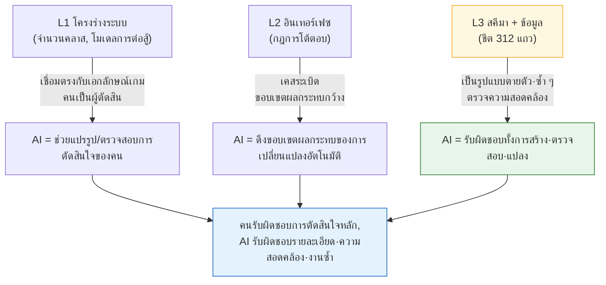

# 3.1 งานของ System Designer และพิกัด Layer

วันพฤหัสบดี เวลา 16:50 น. ชีตสกิลที่ผู้รับผิดชอบด้านบาลานซ์กรอกเสร็จเพิ่งถูกอัปโหลดขึ้นมา สกิลทั้งหมด 312 รายการ แต่ละสกิลต้องกรอกหมายเลขเอฟเฟกต์ลงในช่องชื่อ `effect_id` และหมายเลขนั้นชี้ไปยังแถวที่อยู่ในชีตเอฟเฟกต์อีกชีตหนึ่ง ทั้งสองต้องตรงกันเกมจึงจะทำงานได้ ถ้าไม่ตรงกัน ไคลเอนต์จะเรียกเอฟเฟกต์ที่ว่างเปล่าหรือไม่ก็ตายเงียบ ๆ

ตัวผมในอดีตตรวจเรื่องนี้ด้วยมือ ดูช่องหนึ่งในชีตสกิล กระโดดไปชีตเอฟเฟกต์ ตรวจหมายเลข แล้วกลับมา ทำซ้ำ 312 ครั้ง เร็วที่สุดก็สองชั่วโมง และในช่วง 50 รายการสุดท้ายที่ตาเริ่มพร่า ผมมักจะพลาดไปหนึ่งหรือสองรายการเสมอ และหนึ่งหรือสองรายการนั้นแหละที่ระเบิดในบิลด์ QA

บทนี้คือเรื่องราวว่าสองชั่วโมงนั้นหายไปไหน และการตรวจสอบความสอดคล้องนั้นเป็นพิกัดที่ปักอยู่ตรงไหนบนแผนที่งานของ System Designer ถ้าไม่ปักพิกัดให้ชัดเสียก่อน เราจะตัดสินใจว่าจะเสียบ AI เข้าตรงไหนได้แค่ด้วยความรู้สึกไปตลอดกาล

---

## 3.1.1 System Designer สร้างสี่สิ่ง

System Designer คือคนที่เดินทางไปมาระหว่างระดับนามธรรมกับระดับรูปธรรมได้กว้างที่สุด เขารับเอาหมอกที่ชื่อว่าวิสัยทัศน์มา แล้วลากมันลงมาจนถึงตัวเลขแข็ง ๆ อย่างเซลล์สุดท้ายของชีตข้อมูล สิ่งที่ถูกสร้างขึ้นในการเดินทางนั้นมีสี่ประเภท

**(1) แปลวิสัยทัศน์ให้เป็นโครงสร้าง** เมื่อ Design Director พูดว่า "การต่อสู้แบบแอ็กชันที่มีสัมผัสการกระแทกมีชีวิตชีวา" System Designer จะเปลี่ยนคำพูดนั้นให้เป็นโครงร่างอย่างสกิล คอมโบ แคนเซิล และ hit-stop ส่วน "สิทธิ์ในการกำหนดการเติบโตด้วยตัวเอง" ก็จะกลายเป็นระบบคลาส สกิลทรี และอุปกรณ์ นี่คือช่วงเวลาแรกที่หมอกกลายเป็นสิ่งก่อสร้าง

**(2) ระบุข้อกำหนดของอินเทอร์เฟซระหว่างระบบ** การต่อสู้ การเคลื่อนที่ อินเวนทอรี ร้านค้า เควสต์ และกิลด์ ทำงานพร้อมกัน ถ้าเปิดอินเวนทอรีระหว่างต่อสู้จะได้รับสถานะอมตะหรือไม่? ถ้ามีคำขอ PvP เข้ามากลางคันขณะตีบวกอุปกรณ์ล่ะ? คำตอบของเคสเหล่านี้มารวมกันแล้วสร้างสัมผัสที่เรียกว่า "ทำมาดีจริง ๆ" ทุกตำแหน่งที่คำตอบขาดหายไป ผู้ใช้จะรู้สึกหงุดหงิด

**(3) รับผิดชอบชีตข้อมูลและสคีมาของมัน** ค่าสัมประสิทธิ์ของสกิล 312 รายการ เอฟเฟกต์ของไอเทมหลายร้อยชิ้น พฤติกรรมของมอนสเตอร์หลายสิบชนิด ค่าต่าง ๆ จะกรอกเองหรือส่งต่อให้สายงานบาลานซ์กับเนื้อหาก็ได้ แต่อย่างน้อย **นิยามคอลัมน์ (schema)** ของชีตนั้น System Designer ต้องถือไว้เอง มันคืองานสร้างลิ้นชักที่ติดป้ายกำกับไว้ให้ ถ้าลิ้นชักหลวมเลื่อน แต่ละคนก็จะกรอกต่างกันจนความสอดคล้องพังลง

**(4) ออกแบบลอจิกของพฤติกรรม** AI ของตัวละครและมอนสเตอร์ออกมาในรูปแบบอย่างสเตตแมชชีน (FSM, Finite State Machine, เครื่องสถานะจำกัด) ทรีพฤติกรรม (Behavior Tree, ต่อไปเรียกว่า BT) ตารางการตัดสินใจ และกฎแบบโพรซีเดอรัล เอกสารเหล่านี้จะถูกส่งต่อไปยังโปรแกรมเมอร์แล้วกลายเป็นโค้ด

ประเด็นสำคัญคือทั้งสี่สิ่งนี้มาบรรจบกันบนโต๊ะทำงานของคนคนเดียว ดังนั้น "วันนี้จะใช้เวลาไปกับอะไร" จึงกลายเป็นการตัดสินใจด้านการบริหารงานที่ใหญ่ที่สุดของ System Designer

---

## 3.1.2 ผลงานของระบบมีพิกัด Layer

ในหัวข้อ 2.3 เราได้วางผลงานการผลิตเกมทั้งหมดลงบนแกนพิกัดตั้งแต่ L0 (วิสัยทัศน์) ถึง L4 (บิลด์) ตอนนี้เราจะปักผลงานทั้งสี่อย่างของ 3.1.1 ลงบนแกนนั้นโดยตรง กรณีที่ผลงานของสายงานเดียวกระจายกว้างหลาย Layer อย่างงาน System Designer นั้นหาได้ยาก

ต่อไปนี้คือแผนที่ที่เขียนลงในภาพเดียวว่าผลงานอาศัยอยู่ตรงไหนบน Layer และพบกับใครในแต่ละพิกัด

<svg viewBox="0 0 720 360" xmlns="http://www.w3.org/2000/svg" font-family="sans-serif" font-size="13">
  <!-- Layer bands -->
  <rect x="20" y="20" width="680" height="60" fill="#eceff1" stroke="#b0bec5"/>
  <rect x="20" y="80" width="680" height="60" fill="#e3f2fd" stroke="#90caf9"/>
  <rect x="20" y="140" width="680" height="60" fill="#e8f5e9" stroke="#a5d6a7"/>
  <rect x="20" y="200" width="680" height="60" fill="#fff8e1" stroke="#ffe082"/>
  <rect x="20" y="260" width="680" height="60" fill="#eceff1" stroke="#b0bec5"/>
  <!-- Layer labels -->
  <text x="34" y="55" font-weight="bold">L0</text>
  <text x="34" y="115" font-weight="bold" fill="#1565c0">L1</text>
  <text x="34" y="175" font-weight="bold" fill="#2e7d32">L2</text>
  <text x="34" y="235" font-weight="bold" fill="#f9a825">L3</text>
  <text x="34" y="295" font-weight="bold">L4</text>
  <!-- Layer descriptions -->
  <text x="80" y="55" fill="#607d8b">วิสัยทัศน์ — System Designer ทำได้แค่รับมา</text>
  <text x="80" y="108" fill="#0d47a1">โครงร่างระบบ: นิยามคลาส·การต่อสู้·อินเวนทอรี·กิลด์</text>
  <text x="80" y="168" fill="#1b5e20">อินเทอร์เฟซ: กฎและลำดับความสำคัญของการโต้ตอบระหว่างระบบ</text>
  <text x="80" y="228" fill="#e65100">สคีมา + ข้อมูล: นิยามคอลัมน์ของชีต, ค่าบางส่วน</text>
  <text x="80" y="295" fill="#607d8b">บิลด์ — QA ตรวจสอบว่าสะท้อนเจตนาหรือไม่</text>
  <!-- Collaborator column -->
  <line x1="500" y1="20" x2="500" y2="320" stroke="#90a4ae" stroke-dasharray="4 3"/>
  <text x="512" y="55" fill="#607d8b" font-size="12">↔ Director·เนื้อเรื่อง</text>
  <text x="512" y="115" fill="#1565c0" font-size="12">↔ Art Direction</text>
  <text x="512" y="175" fill="#2e7d32" font-size="12">↔ System Designer คนอื่น</text>
  <text x="512" y="235" fill="#f9a825" font-size="12">↔ บาลานซ์·เนื้อหา</text>
  <text x="512" y="295" fill="#607d8b" font-size="12">↔ QA</text>
  <!-- responsibility arrow -->
  <line x1="62" y1="90" x2="62" y2="250" stroke="#c62828" stroke-width="2.5" marker-end="url(#ah)"/>
  <defs>
    <marker id="ah" markerWidth="8" markerHeight="8" refX="4" refY="4" orient="auto">
      <path d="M0,0 L8,4 L0,8 Z" fill="#c62828"/>
    </marker>
  </defs>
  <text x="335" y="338" fill="#c62828" font-size="12" font-weight="bold">ช่วงที่ System Designer สร้างเองโดยตรง (L1→L3)</text>
</svg>

แผนที่นี้บอกอยู่สองอย่าง อย่างแรก System Designer รับผิดชอบระยะทางยาวที่ **รับ** L0 มาแล้ว **พา** ให้ไปถึง L4 อย่างที่สอง ช่วงที่ลงมือสร้างเองคือ L1 ถึง L3 และคู่ทำงานในแต่ละช่องสามช่องนั้นเปลี่ยนไป ทุกครั้งที่เปลี่ยนช่อง ภาษาที่ใช้ทำงานร่วมกันก็เปลี่ยน ดังนั้นหากไม่รู้ตัวว่าตอนนี้อยู่พิกัดไหน การประชุมก็จะวนเปล่าอยู่บ่อย ๆ

แต่ทั้งนี้ไม่ได้หมายความว่าคนคนเดียวจะแตะ L1 ถึง L3 ทั้งหมด ถ้าทีมใหญ่ ผู้รับผิดชอบ L1 ถึง L2 กับผู้รับผิดชอบ L3 จะแยกกัน ถ้าทีมเล็ก คนคนเดียวก็ดูทั้งหมด พิกัดคือแผนที่แบ่งบทบาท ไม่ใช่คำสั่งให้โยนทุกอย่างไปให้คนคนเดียว

---

## 3.1.3 เมื่อพิกัดถูกกำหนด ตำแหน่งที่จะเสียบ AI ก็จะปรากฏ

เมื่อวาดแผนที่เสร็จแล้ว ตอนนี้ก็ลงสี พิกัดไหนที่นำ AI เข้ามาแล้วได้ผลมาก? ไม่ใช่ "อัตโนมัติให้หมด" อย่างไม่ลืมหูลืมตา แต่เลือกโดยดูจากคุณสมบัติของพิกัด



ประเด็นสำคัญคือ **ยิ่งพิกัดเลื่อนลงล่างมากเท่าไร สัดส่วนที่ AI รับผิดชอบทั้งหมดก็ยิ่งมากขึ้น** "จะตั้งคลาสไว้กี่คลาส" ของ L1 เป็นเรื่องเอกลักษณ์เกม คนจึงต้องถือไว้ ในทางกลับกัน "foreign key (FK) ทั้ง 312 แถวตรงกันหมดไหม" ของ L3 เป็นรูปแบบตายตัวและซ้ำ ๆ AI จึงควรรับไปทั้งก้อน ส่วน L2 อยู่ตรงกลาง — การตัดสินใจเป็นของคน แต่ AI ช่วยหนุนด้วยการดึงขอบเขตผลกระทบว่า "ถ้าเปลี่ยนกฎนี้แล้วจะกระเทือนไปถึงไหน"

ภาพนี้อธิบายว่าทำไมการฝึกปฏิบัติทั้งหมดตั้งแต่ 3.1.4 เป็นต้นไปจึงเริ่มจากบริเวณ L3 เพราะเป็นตำแหน่งที่ได้ผลมากที่สุดและเสี่ยงน้อยที่สุด ต่อให้เครื่องมือสคีมาทำงานผิดพลาดก็ไม่เกิดอุบัติเหตุ แผนผังความสัมพันธ์ก็แค่วาดรูปเท่านั้น และการตรวจสอบความสอดคล้องก็เป็นสิ่งที่คนปฏิเสธได้

---

## 3.1.4 บันทึกเซสชันจริง (worked transcript): มอบหมายให้ AI ตรวจสอบความสอดคล้องที่พิกัด L3

ทฤษฎีมีแค่นี้ ตอนนี้เรากลับไปยังวันพฤหัสบดีที่ต้นบท 3.1 กัน เราจะลองสั่งให้ AI ตรวจว่า `effect_id` ของสกิลทั้ง 312 รายการในชีตสกิลตรงกับชีตเอฟเฟกต์หรือไม่ ผมจะคัดลอกบทสนทนาตามที่โต้ตอบกันจริงโดยไม่สรุปย่อ

การป้อนข้อมูลเป็นไปตามหลัก `schema-first` กล่าวคือคนเป็นผู้นิยาม **ชีตข้อมูลจำเพาะ (specification sheet)** ก่อน จากนั้น Enum และ `.proto` จึงออกมา (VBA (ภาษามาโครของ Excel) Export) แล้วสุดท้ายข้อมูล csv จึงถูกกรอกเข้าไป ดังนั้นพรอมต์ตรวจสอบจึงเริ่มด้วย "อ่านสคีมาก่อน" และตอกย้ำว่าฉบับจริงไม่ใช่เอกสารสคีมา แต่เป็น **JSON ที่ export ออกมาจริง** (`json_over_schema_doc_as_source_of_truth`) เพราะเอกสารโกหกได้ แต่ JSON ที่ export ออกมาโกหกไม่ได้

### พรอมต์ (ฉบับเต็ม)

> คุณคือตัวตรวจสอบความสอดคล้องของข้อมูลในโปรเจกต์ของเรา
> อินพุตคือ export JSON สองไฟล์
> 1) `skill.json` — แต่ละอ็อบเจกต์สกิลมีฟิลด์ `skill_id`, `name`, `effect_id`
> 2) `effect.json` — แต่ละอ็อบเจกต์เอฟเฟกต์มีฟิลด์ `effect_id`, `effect_type`
>
> จงตรวจสอบสิ่งต่อไปนี้
> (A) `effect_id` ทุกตัวใน `skill.json` มีอยู่ใน `effect.json` หรือไม่ (ความสอดคล้องของ foreign key)
> (B) เอฟเฟกต์กำพร้า (orphan) ที่อยู่ใน `effect.json` แต่ไม่มีสกิลใดอ้างถึง
> (C) แถวที่ `effect_id` ว่างเปล่าหรือเป็น 0 ใน `skill.json`
>
> กฎ: ห้ามเดา ฟิลด์ที่ไม่มีใน JSON ให้รายงานว่า "ไม่มีฟิลด์"
> เอาต์พุตให้แบ่งเป็นสามส่วนคือ (A)(B)(C) และแต่ละกรณีที่ละเมิดให้ระบุ `skill_id` (หรือ effect_id) กับเหตุผลในบรรทัดเดียว
> ถ้าไม่มีการละเมิด ให้เขียนในส่วนนั้นแค่ "ไม่มีการละเมิด"

### ผลลัพธ์ดิบของ Claude (ไม่ผ่านการตกแต่ง·เสริมแต่ง)

> ยังไม่ได้รับ input JSON สองไฟล์ ในข้อความปัจจุบันไม่มีเนื้อหาไฟล์แนบมาด้วย
> กรุณาส่งมาใหม่ด้วยวิธีใดวิธีหนึ่งต่อไปนี้
> - เนื้อหาจริงของ `skill.json` และ `effect.json` (วางข้อความหรือแนบไฟล์)
> - หรือพาธของไฟล์ทั้งสอง
>
> เมื่อได้รับเนื้อหาแล้ว ผมจะตรวจสอบตามลำดับ (A)(B)(C) ผมจะไม่กุผลลัพธ์ขึ้นมาเองโดยไม่มีไฟล์

การที่มันหยุดตรงนี้กลับเป็นสัญญาณของความน่าเชื่อถือ ถ้าอินพุตว่างเปล่าแต่กลับมีรายงานดูดีตอบกลับมา ความเรียบร้อยนั้นแหละคือสัญญาณอันตราย ฝ่ายที่ไม่สร้างผลการตรวจสอบขึ้นมาจากมือเปล่าแต่ย้อนถามว่า "ขอไฟล์ก่อน" ต่างหากที่น่าเชื่อถือ ผมจึงวาง JSON ทั้งสองไฟล์เข้าไปจริง ๆ แล้วร้องขอใหม่ (ในเนื้อหาหลักคัดมาแสดงเพียงบางส่วนเนื่องด้วยความยาว)

```json
// skill.json (คัดมาบางส่วน)
[
  {"skill_id": 1001, "name": "강타",     "effect_id": 5001},
  {"skill_id": 1002, "name": "회전베기", "effect_id": 5002},
  {"skill_id": 1003, "name": "방패올리기","effect_id": 0},
  {"skill_id": 1004, "name": "독바르기", "effect_id": 5099}
]
```

```json
// effect.json (คัดมาบางส่วน)
[
  {"effect_id": 5001, "effect_type": "DAMAGE"},
  {"effect_id": 5002, "effect_type": "DAMAGE"},
  {"effect_id": 5003, "effect_type": "BUFF"}
]
```

### ผลลัพธ์ครั้งที่สองของ Claude (อิงข้อมูลจริง)

> **(A) ความสอดคล้องของ foreign key — ละเมิด 1 รายการ**
> - `skill_id: 1004` → `effect_id: 5099` ไม่มีอยู่ใน `effect.json` (dangling reference)
>
> **(B) เอฟเฟกต์กำพร้า — ละเมิด 1 รายการ**
> - `effect_id: 5003` (BUFF) → ไม่มีสกิลใดอ้างถึง
>
> **(C) effect_id ว่าง/0 — ละเมิด 1 รายการ**
> - `skill_id: 1003` → `effect_id: 0` อาจเป็น "ไม่มีเอฟเฟกต์" ที่ตั้งใจไว้ก็ได้ จึงควรตรวจกับสคีมาว่า 0 เป็นค่าที่ใช้ได้หรือไม่

### การตรวจสอบและการปฏิเสธโดยคน

สองในสามรายการเป็นบั๊กชัดเจน `5099` เกิดจากการที่ผู้รับผิดชอบบาลานซ์เขียนไว้ในสกิลก่อนที่จะเพิ่มแถวลงในชีตเอฟเฟกต์ — เป็นเคสคลาสสิกของลำดับงานที่สลับกัน จับได้

แต่ (C) ผมกลับ **ปฏิเสธ** ในโปรเจกต์ของเรา `effect_id: 0` เป็นค่าที่ตกลงกันไว้และใช้ได้ ซึ่งหมายถึง "ช่อง passive, ไม่มีเอฟเฟกต์" AI ไม่รู้เรื่องนั้นจึงรายงานว่า "ควรตรวจสอบ" การตัดสินนั้นถูกต้อง แต่ไม่ใช่เรื่องที่ควรนับเป็นการละเมิด ผมจึงเดินหน้าต่อไป — นั่นคือการตรึงข้อตกลงนี้ไว้เป็น atom เพื่อให้ตั้งแต่การตรวจครั้งหน้าเป็นต้นไป AI รู้ว่า 0 เป็นค่าที่ใช้ได้

### ร้องขอใหม่ (ฉีดความรู้เชิงโดเมนเข้าไป)

> กฎเพิ่มเติม: `effect_id == 0` หมายถึง "passive, ไม่มีเอฟเฟกต์" ซึ่งเป็นค่าที่ตกลงกันไว้และใช้ได้ในโปรเจกต์ของเรา
> ดังนั้นใน (C) `effect_id == 0` ไม่ถือเป็นการละเมิด ให้รายงานเฉพาะสตริงว่าง·null·จำนวนลบเป็นการละเมิดของ (C) เท่านั้น

> **(C) effect_id ว่าง/0 — ไม่มีการละเมิด**
> (`effect_id: 0` ถือเป็นค่าที่ตกลงกันไว้และใช้ได้ ไม่มีค่าว่าง/null/จำนวนลบ)

ข้อตกลงบรรทัดเดียวนี้แหละคือการสะสมความรู้เชิงโดเมน การตัดสินใจของงานออกแบบระบบค่อนข้างถาวร เมื่อตรึงไว้ครั้งหนึ่ง อีกหนึ่งปีถัดไปการตรวจแบบเดียวกันก็ยังหมุนด้วยเกณฑ์เดียวกัน การ์ดการตัดสินใจหนึ่งใบถูกวางสะสมไว้ในตู้

ในบันทึกเซสชันนี้ สิ่งที่คนทำมี **เพียงสามอย่าง** เท่านั้น — (1) กำหนดลำดับอินพุตว่าให้อ่านจากสคีมาก่อน (2) ยืนยันว่า `5099` เป็นบั๊กจริง (3) รู้ว่า `0` เป็นค่าที่ใช้ได้แล้วปฏิเสธ·แก้ไขการตัดสินของ AI สองชั่วโมงที่เคยนั่งดูทีละช่องโดยกระโดดไปมาตลอด 312 แถวที่เหลือนั้นหายไป สิ่งที่ถูกทำเป็นอัตโนมัติคือแรงงานอย่างการกระโดดและการเทียบ ส่วนการตัดสินสามบรรทัดที่เหลือต่างหากคือแก่นแท้

---

## 3.1.5 สินทรัพย์ที่สะสมขึ้น: ตรึงพิกัดให้แข็งเป็นโค้ด

การตรวจในบันทึกเซสชันข้างต้นจะสั่งด้วยมือทุกครั้งก็ได้ แต่งานที่ซ้ำ ๆ ที่ L3 การตรึงให้แข็งเป็นเครื่องมือคือหลักปฏิบัติของงานออกแบบระบบ ผมขอยกตัวอย่างสองอย่างที่ผู้เขียนใช้งานอยู่ — ไม่ใช่ "เครื่องมือของโปรเจกต์ A" ที่เป็นนามธรรม แต่เป็นของที่หมุนอยู่บนโต๊ะทำงานจริง ๆ

`gen_relation_map.py` วิเคราะห์ชื่อคอลัมน์·ค่าของชีตเพื่อตรวจจับความสัมพันธ์ของ foreign key โดยอัตโนมัติ แล้วดึงออกมาเป็นแผนผังความสัมพันธ์ HTML แบบอินเทอร์แอ็กทีฟ ถ้าใน 3.1.4 คนเป็นผู้วาดลูกศร `skill.effect_id → effect.effect_id` ไว้ในหัว สคริปต์นี้ก็จะวาดลูกศรนั้นออกมาเป็นภาพสำหรับชีตทั้งหมด ตำแหน่งที่การพึ่งพิงไหลย้อนทาง (ความเสี่ยงที่ข้อมูล L3 ไปอ้างถึงโครงร่าง L1 แบบย้อนกลับ) จะกระโดดเด่นออกมาจากภาพในทันที

สกิล `schema-doc` ทำการพาร์ส **ชีต $สคีมา** ของ xlsm แล้วสร้างเอกสารสคีมาแบบ Markdown โดยอัตโนมัติ สคีมาที่ว่านี่เองคือสคีมาที่คำถามใน 3.1.4 (C) ที่ว่า "ควรตรวจกับสคีมาว่า 0 เป็นค่าที่ใช้ได้หรือไม่" โผล่ขึ้นมา — มันทำให้คนอ่านสคีมาล่าสุดได้ทันทีโดยไม่ต้องไปรื้อค้นไฟล์อื่น เมื่อชีตเปลี่ยน เอกสารก็เปลี่ยนตาม โรคเรื้อรังที่เอกสารกับข้อมูลจริงไม่ตรงกันจึงลดลง

หากพูดถึงตำแหน่งของเครื่องมือทั้งสองด้วยภาษาพิกัดอีกครั้งก็เป็นเช่นนี้ `schema-doc` ปกป้อง **นิยามคอลัมน์** ของ L3 ส่วน `gen_relation_map.py` ปกป้อง **ความสัมพันธ์** ระหว่าง L2 ถึง L3 ส่วนพรอมต์ผู้ช่วย AI (การตรวจสอบอย่างใน 3.1.4) หมุนอยู่ข้างบนทั้งสองอย่างนั้น ทั้งสามไม่ได้ต่างคนต่างเล่น แต่ต่างก็รับผิดชอบระดับความสูงที่ต่างกันบนแกนพิกัดเดียวกัน

วิธีใช้งานจริงของเครื่องมือเหล่านี้จะลองทำด้วยมือใน 3.2·3.3·3.4 หัวข้อ 3.1 คือแผนที่ที่กำหนดว่าจะเสียบเข้าตรงไหน และสามบทถัดไปคืองานเสียบ

---

## 3.1.6 การนำเข้ามาทีละขั้น: เริ่มจากพิกัดที่เสี่ยงน้อย

ถ้าเปิดเครื่องมือทั้งสามพร้อมกันในคราวเดียว ภาระการบริหารงานจะมาถึงก่อนผลลัพธ์ จากประสบการณ์ของผู้เขียน ลำดับที่ปลอดภัยคือเริ่มจากพิกัดที่เสี่ยงน้อย (ด้านล่าง) ก่อน

| ช่วงเวลา (แนะนำ) | สิ่งที่นำเข้ามา | พิกัด | สิ่งที่เกิดขึ้นแม้พลาด |
|---|---|---|---|
| 1 เดือน | สคีมาก่อน (3.2) | L3 | แค่เอกสารไม่อัปเดตหนึ่งครั้ง |
| 2\~3 เดือน | แสดงแผนผังความสัมพันธ์ (3.3) | L2\~L3 | แค่ภาพไม่แม่นยำ |
| 3\~6 เดือน | พรอมต์ผู้ช่วย AI (3.4) | L1\~L3 | ผ่านการตรวจสอบ คนจึงปฏิเสธได้ |

ระยะเวลาไม่ใช่เกณฑ์ตายตัว ขึ้นอยู่กับขนาดทีม·โครงสร้างพื้นฐานเดิม อาจใช้เวลาเป็นสองเท่า หรือจบในครึ่งเดียวก็ได้ (การประมาณของผู้เขียน ยังไม่ได้ตรวจสอบ) สิ่งที่ไม่เปลี่ยนคือ **ลำดับ** เมื่อวางตัวช่วยตัดสินใจที่เสี่ยงสูงไว้ท้ายสุด ทีมจะได้สร้างนิสัยการตรวจสอบจากเครื่องมือสองอย่างแรกไปแล้วก่อนที่จะไปแตะตำแหน่งที่อ่อนไหวที่สุด

---

## 3.1.7 การวัดผล — อย่างซื่อตรง

ผมจะบันทึกตัวเลขโดยไม่ตกแต่งให้ดูดี ต่อไปนี้คือสิ่งที่สังเกตได้จากทีมออกแบบ (กำลังคน 4\~5 คน ทั้งทีมพัฒนาขนาดกลาง 10\~50 คน เปิดให้บริการราว 6 เดือน) ของโปรเจกต์ MMORPG ที่ผู้เขียนบริหารในฐานะ Director (ต่อไปเรียกว่า "โปรเจกต์ A") ไม่ใช่การวัดอัตโนมัติที่แม่นยำ แต่เป็น **การสังเกตของผู้เขียน** ที่อิงบันทึกการทำงานและบันทึกการทบทวน ขอแนะนำให้อ่านเป็นเพียงทิศทางและอัตราส่วนคร่าว ๆ เท่านั้น

- **การตรวจสอบความสอดคล้อง**: การเทียบ foreign key ระหว่างสกิลกับเอฟเฟกต์ 312 แถวด้วยมือ เร็วที่สุดก็สองชั่วโมง (วันพฤหัสบดีที่ต้นบทนั้นแหละ) ส่วนการตรวจสอบด้วย AI นั้น ถ้าหักเวลาเตรียมอินพุตออก รายการที่ละเมิดก็ออกมาภายในไม่กี่นาที สิ่งที่ลดลงคือแรงงานในการกระโดด·เทียบ ไม่ใช่การตัดสิน
- **การออนบอร์ดนักออกแบบหน้าใหม่**: เมื่อมีแผนผังความสัมพันธ์ HTML หนึ่งภาพ ก็ช่วยลดการประชุมที่ต้องอธิบายโครงสร้างการพึ่งพิงระหว่างระบบด้วยปากเปล่าลงได้หลายครั้ง จำนวนครั้งที่แน่ชัดต่างกันไปในแต่ละคน ผมจึงไม่ฟันธง (การสังเกตของผู้เขียน)
- **การถกผลกระทบของการเปลี่ยนแปลง**: จากเดิมที่ต้องคลำหาในการประชุมว่า "ถ้าเปลี่ยนกฎนี้แล้วจะกระเทือนตรงไหน" ผมเปลี่ยนเป็นให้ AI ร่างขอบเขตผลกระทบมาก่อนแล้วคนค่อยตรวจสอบ การประชุมไม่ได้หายไป แต่การประชุมกลายเป็น **การตรวจสอบ** แทน

ประเด็นสำคัญคือเวลาที่ประหยัดได้ไม่ใช่เวลาที่ไม่ได้สร้างเกม เวลานั้นจะหมุนกลับไปสู่การตัดสินใจที่ลึกซึ้งซึ่งมอบให้ AI ไม่ได้ อย่างเช่นโครงร่าง L1 ลดแรงงานลงเพื่อนำไปใช้กับการตัดสิน — นั่นคือหนึ่งบรรทัดที่บทนี้แนะนำ

---

## ลองทำดู: ตรวจสอบความสอดคล้องที่พิกัด L3 หนึ่งครั้ง

**setup.** export ชีตสองชีต (เช่น สกิล, เอฟเฟกต์) เป็น csv ถ้าทำได้ก็แปลงเก็บไว้เป็น JSON (หลักการที่ว่าผลลัพธ์ที่ export ออกมาคือฉบับจริง ไม่ใช่เอกสาร) เลือก foreign key หนึ่งคู่ระหว่างสองชีต (เช่น `skill.effect_id → effect.effect_id`)

**prompt.** ใช้พรอมต์ฉบับเต็มของ 3.1.4 ตามนั้นเลย อย่าลืมสามบรรทัดสำคัญ — (1) "อ่านสคีมา/โครงสร้างก่อน" (2) "อย่าเดา สิ่งที่ไม่มีให้รายงานว่าไม่มี" (3) "ถ้าไม่มีการละเมิด ให้เขียนแค่ว่าไม่มีการละเมิด"

**verify.** คนตรวจรายการที่ละเมิดซึ่ง AI ส่งขึ้นมาทีละบรรทัด บั๊กจริงก็แก้ ส่วนผลตรวจผิดพลาด (false positive) ที่เกิดจากค่าที่ตกลงกันไว้ในโดเมน (เช่น `0 = ไม่มีเอฟเฟกต์`) ก็ **ปฏิเสธ** แล้วเพิ่มข้อตกลงนั้นเข้าไปในพรอมต์ (หรือ atom) เมื่อผลตรวจผิดพลาดแบบเดียวกันหายไปจากการตรวจครั้งถัดไป ก็แสดงว่าสินทรัพย์ถูกวางสะสมไปแล้วหนึ่งใบ

### ฉบับย่อสำหรับคนเดียว

ถ้าเป็นนักพัฒนาคนเดียวที่ไม่มีทั้งทีมและชีต แค่แท็บสองแท็บใน Google Sheets ก็พอ แท็บหนึ่งเป็น "สกิล" อีกแท็บเป็น "เอฟเฟกต์" เชื่อมทั้งสองด้วยคอลัมน์ `effect_id` เพียงคอลัมน์เดียว ดาวน์โหลดแท็บเป็น csv แล้ววางลงในพรอมต์ของ 3.1.4 ต่อให้เป็นชีต 30 แถวแทนที่จะเป็น 312 แถว ก็จับ dangling reference และเอฟเฟกต์กำพร้าได้เหมือนกัน ต่างกันแค่ขนาด แต่พิกัดเหมือนกัน เริ่มจาก L3 แล้วเมื่อมือเริ่มชิน ก็ค่อยไต่ขึ้นไปทีละช่องสู่แผนผังความสัมพันธ์และขอบเขตผลกระทบ

---

### สรุปประเด็นสำคัญของบท
- ผลงานของระบบทั้งสี่อย่างมีพิกัดตั้งแต่โครงร่าง L1 ถึงชีต L3 และพิกัดก็คือคู่ทำงานในการร่วมงาน
- ยิ่งพิกัดเลื่อนลง (L3) สัดส่วนที่ AI รับผิดชอบทั้งหมดก็ยิ่งมากขึ้นและความเสี่ยงก็ยิ่งน้อยลง
- สิ่งที่ถูกทำเป็นอัตโนมัติคือแรงงานในการกระโดด·เทียบ ส่วนการตัดสินอย่างการยืนยันบั๊กและการปฏิเสธผลตรวจผิดพลาดเป็นหน้าที่ของคน
