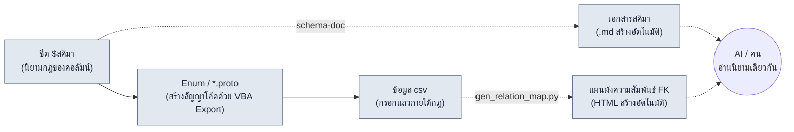

# 3.2 สคีมามาก่อน — $สคีมาต้องมาก่อนข้อมูล

เช้าวันจันทร์ ผู้เขียนได้บิลด์ชีตสกิลที่นักออกแบบเกมคนใหม่กรอกไว้ 120 แถวให้เป็น csv แล้วในล็อกฝั่งไคลเอนต์ก็ขึ้นบรรทัดสีแดงมา 28 บรรทัด `class_id` อ้างอิงไปที่หมายเลข 47 แต่ในชีตคลาสกลับไม่มีหมายเลข 47 ในช่อง `element` มีคนหนึ่งเขียนว่า `Fire` อีกคนเขียนว่า `fire` และมีอยู่แถวหนึ่งเขียนว่า `화염` เป็นภาษาเกาหลี การไล่บรรทัดสีแดงทั้ง 28 บรรทัดทีละบรรทัดด้วยมือ ทำให้ครึ่งหนึ่งของช่วงบ่ายหายไป

สาเหตุของอุบัติเหตุนี้ไม่ได้อยู่ที่ข้อมูลผิด แต่อยู่ที่ **การไม่ระบุกฎที่ข้อมูลต้องปฏิบัติตามก่อนที่จะสร้างข้อมูลขึ้นมา** ต่างหาก ถ้ากฎอยู่แค่ในหัวคน พอคนเปลี่ยน กฎก็เปลี่ยนตามทันที บทนี้จะกล่าวถึงเวิร์กโฟลว์ที่สร้างกฎ—สคีมา—ขึ้นมาก่อนข้อมูล และทำให้กฎนั้นถูกบังคับเป็นเอกสารด้วยเครื่องมือ ไม่ใช่ด้วยมือคน

---

> **บันทึกศัพท์**
> - สคีมา (schema): การนิยามคอลัมน์ของชีตข้อมูล ทั้งชื่อ·ชนิด·ช่วงค่า·foreign key·คำอธิบาย
> - `$สคีมา`: ชีตเฉพาะสำหรับนิยามคอลัมน์ที่วางไว้ในชีตข้อมูล Excel (xlsm) ไม่บรรจุแถวข้อมูล แต่บรรจุเฉพาะกฎของคอลัมน์
> - FK (foreign key): คอลัมน์ที่อ้างอิงไปยัง PK (primary key) ของอีกชีตหนึ่ง เช่น `class_id` ชี้ไปยังแถวของชีต Class
> - proto: นิยาม Protocol Buffers (`.proto`) สัญญาว่าด้วยโครงสร้างข้อมูล·Enum ที่ไคลเอนต์และเซิร์ฟเวอร์ใช้ร่วมกัน
> - แหล่งความจริงเดียว (single source of truth): หลักการบริหารที่จัดการข้อมูลเดียวกันไว้ที่เดียว เพื่อให้ทุกฝ่ายดูที่แหล่งนั้น

---

## 3.2.1 ลำดับการป้อนข้อมูลก็คือสคีมา

ถ้าเข้าใจหลักสคีมามาก่อนเพียงแค่ว่า "นิยามคอลัมน์ไว้ล่วงหน้า" ก็เท่ากับเข้าใจไปแค่ครึ่งเดียว แก่นของมันอยู่ที่ **ลำดับว่าจะป้อนอะไรก่อน** ต่างหาก ลำดับการเคลื่อนของมือที่กรอกข้อมูลนั่นแหละ เป็นตัวกำหนดว่าความสอดคล้องจะถูกรักษาไว้หรือพังทลาย

ลำดับการป้อนข้อมูลที่หนังสือเล่มนี้แนะนำ คือไปป์ไลน์สี่ช่อง



เส้นทึบที่ไหลจากซ้ายไปขวาคือ **ลำดับการป้อนที่ถูกบังคับ** นิยาม `$สคีมา` ก่อน จากนั้นดึง Enum และ proto ออกมาด้วย VBA (ภาษามาโครของ Excel) Export แล้วจึงกรอกข้อมูล csv ภายในขอบเขตของสัญญานั้นเท่านั้น เส้นประคือสิ่งที่ถูกสร้างขึ้นโดยอัตโนมัติจากการป้อนนั้น—เอกสารสคีมา (`schema-doc`) และแผนผังความสัมพันธ์ FK (`gen_relation_map.py`)—ซึ่งคนและ AI มองเห็นนิยามเดียวกันผ่านอนุพันธ์เหล่านี้

ตราบใดที่ลำดับนี้ถูกบังคับ บรรทัดสีแดง 28 บรรทัดที่เห็นในช่วงเปิดบทนี้ส่วนใหญ่จะถูกปิดลง **ก่อนจะกรอกข้อมูล** ถ้าข้อเท็จจริงที่ว่า `element` ต้องเป็นหนึ่งในสี่ค่า `fire/ice/lightning/none` ถูกตรึงไว้เป็น Enum ของ proto ทั้ง `Fire` และ `화염` ก็จะถูกดักไว้ตั้งแต่ขั้นตอนป้อนข้อมูล ถ้าข้อเท็จจริงที่ว่า `class_id` อ้างอิงไปยัง PK ของชีต Class ถูกระบุไว้ใน `$สคีมา` การขาดหายของหมายเลข 47 ก็จะถูกจับได้ที่ขั้นตรวจสอบก่อน ไม่ใช่ที่บิลด์

ถ้ากลับลำดับ—กรอกข้อมูลก่อนแล้วค่อยจัดการสคีมาทีหลัง—สคีมาก็จะกลายเป็นการตามเก็บกวาดภายหลัง การไปแก้กฎของคอลัมน์บนตำแหน่งที่สะสมข้อมูลไว้แล้ว 1000 แถว ทำให้กฎต้องวิ่งตามข้อมูล และในวินาทีนั้น แหล่งความจริงก็กลับหัวกลับหาง

---

## 3.2.2 บันทึกเซสชันจริง (worked transcript) — จาก `$สคีมา` ถึง csv ในครั้งเดียว

แทนที่จะอธิบายด้วยคำพูด ผู้เขียนจะพาชีตหนึ่งผ่านกระบวนการตั้งแต่ต้นจนจบจริง สมมติว่าจะสร้างชีตสกิลขึ้นใหม่ ด้านล่างคือบันทึกทั้งหมดที่ดำเนินไปโดยมี AI ช่วย ผู้เขียนจะไม่ย่อ และจะคงจุดที่ผิดพลาดและจุดที่คนปฏิเสธไว้ตามเดิม

### ขั้นที่ 1 — คนเขียน `$สคีมา` ด้วยมือก่อน

ยังไม่เรียกทั้งเครื่องมือและ AI คนนิยามกฎของคอลัมน์ด้วยตัวเอง เฉพาะขั้นตอนนี้จะไม่มอบหมายให้ใคร

```
# ชีต Skill $สคีมา (เขียนโดยคน)
คอลัมน์          ชนิด       ช่วงค่า/ข้อจำกัด        FK                  คำอธิบาย
skill_id       int        1000~9999            (PK)                ID เฉพาะของสกิล
name           string     1~30 ตัวอักษร          -                  ชื่อที่แสดง
class_id       int(FK)    -                    Class.class_id      คลาสที่ใช้ได้
cooldown       float      0.0~120.0            -                   เวลารอใช้ซ้ำ (วินาที)
damage_coef    float      0.0~10.0             -                   สัมประสิทธิ์คูณพลังโจมตี
element        enum       fire/ice/lightning/none  -              ธาตุ
is_passive     bool       true/false           -                  เป็นพาสซีฟหรือไม่
```

### ขั้นที่ 2 — สั่งให้ AI ร่าง proto Enum (พรอมต์ฉบับเต็ม)

งานคือนำ enum `element` และโครงสร้าง FK ของ `$สคีมา` ไปแปลงเป็นสัญญา proto เป็นการแปลงรูปแบบ จึงเป็นงานที่มอบหมายให้ AI ได้

> **พรอมต์ (ฉบับเต็ม):**
> ด้านล่างคือข้อกำหนดคอลัมน์ของชีตข้อมูลเกม จงแปลงข้อกำหนดนี้เป็นข้อความ (message) และ Enum ของ Protocol Buffers (proto3) กฎ: (1) คอลัมน์ชนิด enum ให้นิยามเป็น enum แยกต่างหาก และค่าแรกต้องเริ่มด้วย `_UNSPECIFIED = 0` เสมอ (2) คอลัมน์ FK ให้คงเป้าหมายอ้างอิงไว้เป็นคอมเมนต์ (3) ข้อจำกัดช่วงค่าไม่สามารถแสดงด้วย proto ได้ จึงให้คงไว้เป็นคอมเมนต์เท่านั้น อย่าเพิ่มคอลัมน์ที่ไม่มีในข้อกำหนด
> ```
> skill_id int PK / name string / class_id int FK→Class.class_id /
> cooldown float 0~120 / damage_coef float 0~10 /
> element enum{fire,ice,lightning,none} / is_passive bool
> ```

### ขั้นที่ 3 — ผลลัพธ์ดิบของ Claude (ตามเดิม ไม่แตะต้อง)

```proto
syntax = "proto3";

// สัญญาข้อมูลของชีต Skill
// หมายเหตุ: ข้อจำกัดช่วงค่า (cooldown 0~120, damage_coef 0~10)
//          ไม่สามารถบังคับด้วย proto ได้ ให้ตรวจสอบใน Linter
enum SkillElement {
  SKILL_ELEMENT_UNSPECIFIED = 0;
  SKILL_ELEMENT_FIRE = 1;
  SKILL_ELEMENT_ICE = 2;
  SKILL_ELEMENT_LIGHTNING = 3;
  SKILL_ELEMENT_NONE = 4;   // ← เครื่องหมายสำหรับให้คนตรวจสอบ
}

message Skill {
  int32 skill_id = 1;       // PK
  string name = 2;
  int32 class_id = 3;       // FK → Class.class_id
  float cooldown = 4;
  float damage_coef = 5;
  SkillElement element = 6;
  bool is_passive = 7;
}
```

### ขั้นที่ 4 — การตรวจสอบและการปฏิเสธของคน

ตรงนี้คนจะปฏิเสธอยู่จุดหนึ่ง AI วาง `none` ไว้เป็น `SKILL_ELEMENT_NONE = 4` ที่ตำแหน่ง **ท้ายสุด** ของ enum แต่ใน `$สคีมา` นั้น `none` คือสถานะตั้งต้นที่หมายความว่า "ไม่มีธาตุ" ประเด็นอยู่ที่ค่าหมายเลข 0 ของ proto ใน proto3 ค่าหมายเลข 0 ของ enum คือ "ตำแหน่งที่ถูกใส่เข้ามาอัตโนมัติเมื่อค่ายังไม่ถูกกรอก" จึงต้องเลือกว่าจะเว้นหมายเลข 0 ไว้เป็น `_UNSPECIFIED` (ไม่ได้ป้อนค่า) หรือจะเติมด้วยค่าที่มีความหมายอย่าง `none` (ไม่มีธาตุโดยตั้งใจ) ถ้ารวมทั้งสองไว้ที่ตำแหน่งเดียว **แถวที่เว้นช่องว่างไว้ (ความผิดพลาด)** กับ **แถวที่เลือกไม่มีธาตุโดยจงใจ (ความตั้งใจ)** จะเข้ามาเป็น 0 เหมือนกัน และแยกกันไม่ออกตลอดไป AI แยก `_UNSPECIFIED = 0` กับ `none` ออกจากกันก็จริง แต่ดัน `none` ไปอยู่ตำแหน่งหมายเลข 4 ท้ายสุด ทำให้สถานะตั้งต้นที่พบบ่อยที่สุดถูกผลักออกห่างจากการค้นหาและการดีบัก

การตัดสินใจที่คนลงไป:
- คง `_UNSPECIFIED = 0` ไว้ (สำหรับตรวจจับการขาดหาย)
- คง `none` ไว้ตามเดิม แต่เพิ่มในกฎการเขียน csv ว่า "ไม่มีธาตุต้องระบุ `none` เสมอ ห้ามเว้นว่าง" ช่องว่าง=0=UNSPECIFIED ให้ถือเป็นความผิดพลาดในการป้อนข้อมูล
- เพิ่มการตัดสินใจนี้ลงในคำอธิบายของแถว `element` ใน `$สคีมา` หนึ่งบรรทัด: "ไม่มีธาตุก็ต้องระบุ (none) ช่องว่างคือความผิดพลาด"

ไม่ได้ใช้ผลลัพธ์ของ AI ตามเดิม รับรูปแบบไว้ แต่ขอบเขตของความหมายเป็นสิ่งที่คนขีดเส้นเอง

### ขั้นที่ 5 — ดึง Enum/proto จากชีตด้วยปุ่ม VBA Export

นิยาม proto ที่ผ่านการตรวจสอบแล้วจะถูกแมโคร Export ของ Excel (ปุ่มในชีต `$สคีมา`) ส่งออกอย่างสม่ำเสมอ คนจะไม่พิมพ์ซ้ำอีกครั้งใน IDE เพราะชีตคือแหล่งความจริง proto จึงออกมาจากชีต ลำดับนี้เป็นการต่อยอดของหลักการ "ผลลัพธ์คือฉบับจริง" (`json_over_schema_doc_as_source_of_truth`) ที่จะกล่าวถึงใน 3.3—ไม่ใช่เอกสารอธิบายโค้ด แต่ชีตเป็นตัวให้กำเนิดโค้ด

### ขั้นที่ 6 — ถึงตอนนั้นจึงกรอกข้อมูล csv (มี AI ช่วย รวมการขอใหม่)

> **พรอมต์ (ฉบับเต็ม):**
> จงสร้างแถว csv 5 แถวที่เป็นไปตาม Skill proto และ $สคีมาข้างต้น ข้อจำกัด: class_id เป็นหนึ่งใน [1,2,3] (PK ที่มีอยู่ในชีต Class ปัจจุบัน), damage_coef ถ้าเป็นพาสซีฟ (is_passive=true) ให้เป็น 0.0, element ให้เป็นสตริง fire/ice/lightning/none ตามเดิม, ห้ามเว้นว่าง

ในผลลัพธ์ครั้งแรกของ Claude มีอยู่แถวหนึ่งที่ผิดพลาด

```
skill_id,name,class_id,cooldown,damage_coef,element,is_passive
1001,เฉือนเปลวเพลิง,1,3.5,2.4,fire,false
1002,มือเยือกแข็ง,2,8.0,3.1,ice,false
1003,ฟื้นฟูพลังชีวิต,1,0.0,1.2,none,true     ← ปฏิเสธ: เป็นพาสซีฟแต่ damage_coef≠0
1004,หอกสายฟ้า,3,5.0,2.8,lightning,false
1005,ท่าตั้งรับ,2,0.0,0.0,none,true
```

แถว 1003 ละเมิดกฎ (ถ้า `is_passive=true` ก็ต้องเป็น `damage_coef=0.0`) คนจึงปฏิเสธและขอใหม่

> **การขอใหม่ (ฉบับเต็ม):** แถว 1003 ละเมิดกฎ is_passive=true แต่ damage_coef=1.2 พาสซีฟต้องเป็น 0.0 จงแก้เฉพาะ 1003 แล้วส่งกลับมาใหม่

> **ผลลัพธ์ใหม่ของ Claude:** `1003,ฟื้นฟูพลังชีวิต,1,0.0,0.0,none,true`

การที่ AI ทำไม่ถูกหมดในครั้งแรกนั้นไม่ใช่ข้อบกพร่อง แต่เป็นเรื่องที่เกิดขึ้นได้เป็นปกติ สิ่งที่สำคัญคือ เพราะมีสคีมาปูรองอยู่ จึงสามารถ **มองเห็นแถวที่ผิดเพี้ยนนั้นด้วยตาแล้วย้อนกลับได้ด้วยบรรทัดเดียว** ถ้าไม่มีสคีมา แถว 1003 คงจะถูกพบเป็นบั๊กในเกมหลังบิลด์ ที่พาสซีฟกลับสร้างดาเมจออกมา

บทเรียนของบันทึกทั้งหมดนี้เรียบง่าย ถ้าลำดับการป้อนข้อมูลถูกตรึงไว้เป็น `$สคีมา → proto → csv` AI จะกรอกรูปแบบได้รวดเร็ว และคนจะตรวจสอบเฉพาะความหมายและการละเมิด ถ้าลำดับพังทลาย คนจะต้องแบกรับทั้งหมดตั้งแต่รูปแบบไปจนถึงความหมาย

---

## 3.2.3 schema-doc — เพื่อไม่ให้คนต้องคัดลอกสคีมาด้วยมือ

การวาง `$สคีมา` ไว้ใน Excel นั้นสะดวกสำหรับนักออกแบบเกม แต่เป็นที่ปิดสำหรับ AI กับ git และเครื่องมือภายนอก ดังนั้นจึงมีการใช้เครื่องมือที่แปลง `$สคีมา` เป็น Markdown โดยอัตโนมัติ คำสั่งสแลช (slash command) `schema-doc` ทำหน้าที่นี้

การทำงานมีสี่ขั้นตอน

1. parse ชีต `$สคีมา` ของ Excel (xlsm) (python-calamine, เร่งความเร็วด้วย Rust)
2. ดึงนิยามคอลัมน์ 5 องค์ประกอบออกมา
3. แปลงเป็นตาราง Markdown
4. สร้าง `<ชื่อชีต>_schema.md` ในโฟลเดอร์เดียวกัน

แก่นอยู่ที่ **คนจะไม่เขียนสคีมาสองครั้ง** นิยามใน Excel ครั้งเดียว แล้ว Markdown จะถูกเครื่องมือสร้างให้ ทั้งสองจึงไม่มีทางขัดแย้งกันได้ กับดักที่ว่า "ถ้าตั้งเอกสารสคีมาเป็นฉบับจริงจะขัดกับผลลัพธ์จริง" ซึ่งจะกล่าวถึงใน 3.3 นั้น ในที่นี้ถูกพลิกหลบด้วยการให้ "Excel เป็นฉบับจริง เอกสารเป็นอนุพันธ์"

ผลลัพธ์ที่ `schema-doc` สร้างขึ้น (อ้างอิงชีต Skill จากบันทึกก่อนหน้า):

```markdown
# สคีมาชีต Skill  (สร้างอัตโนมัติ — ห้ามแก้ไขโดยตรง)

| คอลัมน์ | ชนิด | ช่วงค่า/ข้อจำกัด | FK | คำอธิบาย |
|---|---|---|---|---|
| skill_id | int | 1000~9999 | (PK) | ID เฉพาะของสกิล |
| name | string | 1~30 ตัวอักษร | - | ชื่อที่แสดง |
| class_id | int(FK) | - | Class.class_id | คลาสที่ใช้ได้ |
| cooldown | float | 0.0~120.0 | - | เวลารอใช้ซ้ำ (วินาที) |
| damage_coef | float | 0.0~10.0 | - | สัมประสิทธิ์คูณพลังโจมตี |
| element | enum | fire/ice/lightning/none | - | ธาตุ ไม่มีธาตุก็ต้องระบุ (none) ช่องว่างคือความผิดพลาด |
| is_passive | bool | true/false | - | เป็นพาสซีฟหรือไม่ ถ้า true แล้ว damage_coef=0 |

_source: Skill.xlsm / generated by schema-doc_
```

โปรดสังเกตว่าขอบเขตที่คนขีดไว้ในขั้นที่ 4 และ 6 ของ 3.2.2 ตามเข้ามาในช่องคำอธิบายของ `element` และ `is_passive` ตามเดิม คนเขียนเพิ่มลงใน `$สคีมา` หนึ่งบรรทัด แล้วเอกสาร·proto·การตรวจสอบก็มาใช้กฎเดียวกันร่วมกันหมด นี่คือภาพที่แหล่งความจริงเดียวทำงานจริง

สคีมาที่ออกมาเป็น Markdown ถูกนำไปใช้ทันทีในสามที่

- **การสร้างข้อมูลด้วย AI**: ก่อนจะสร้างแถว AI อ่านตารางนี้แล้วสร้างเฉพาะแถวที่ปฏิบัติตามคอลัมน์ทั้ง 7·ข้อจำกัดแต่ละข้อ·FK ที่นิยามไว้
- **การปฐมนิเทศนักออกแบบเกมคนใหม่**: ตารางหนึ่งหน้านี้เร็วกว่าการประชุมสามครั้ง
- **Linter**: ตรวจสอบโดยอัตโนมัติว่าแต่ละแถวของ csv ละเมิดตารางนี้หรือไม่

---

## 3.2.4 gen_relation_map.py — ดูด้วยกราฟว่า FK ยังมีชีวิตอยู่หรือไม่

ถ้าสคีมาเป็นกฎ **ภายใน** ชีต FK ก็เป็นกฎ **ระหว่าง** ชีต นิยามที่ว่า `class_id` อ้างอิงไปยังชีต Class นั้นเขียนไว้ใน `$สคีมา` แต่การจะรู้ว่าการอ้างอิงนั้นยังมีชีวิตอยู่จริงในวินาทีนี้หรือไม่ ต้องมีการตรวจสอบแยกต่างหาก

`gen_relation_map.py` ตรวจจับความสัมพันธ์ FK ของชีตข้อมูลโดยอัตโนมัติ แล้ววาดเป็นแผนผังความสัมพันธ์ HTML แบบโต้ตอบได้ เมื่อลูกศรอย่าง `class_id`→Class ของ Skill, `set_id`→ItemSet ของ Item มารวมอยู่ในหน้าจอเดียว "FK ที่เป้าหมายอ้างอิงหายไป" ก็จะปรากฏให้เห็นเป็นลูกศรที่ขาด อุบัติเหตุอย่างการขาดหายของหมายเลข 47 ในช่วงเปิดบทนี้ จะปรากฏ **ระหว่างที่กำลังกรอกข้อมูล** เป็นเส้นที่ขาดในแผนผังความสัมพันธ์ ไม่ใช่เป็นบรรทัดสีแดงในล็อกบิลด์

การใช้งานจริงและการแสดงผลของเครื่องมือนี้จะกล่าวถึงอย่างเต็มที่ใน 3.3 สิ่งที่ต้องจดจำในบทนี้มีเพียงหนึ่งเดียว ถ้า `$สคีมา` ไม่ระบุ FK ทั้งแผนผังความสัมพันธ์และการตรวจสอบความสอดคล้องก็ไม่มีกราฟให้วาด **การระบุ FK ไม่ใช่ทางเลือก แต่เป็นเงื่อนไขเบื้องต้นของหลักสคีมามาก่อน**

---

## 3.2.5 เวิร์กโฟลว์สคีมามาก่อน 5 ขั้น

ถ้านำบันทึกของ 3.2.2 มาทำให้เป็นรูปทั่วไป จะได้ห้าขั้นตอน เมื่อแยกผู้รับผิดชอบและผลลัพธ์ของแต่ละขั้นออกมา จะเห็นชัดว่าอะไรที่คนกุมไว้และอะไรที่ส่งต่อให้เครื่องมือ

<svg xmlns="http://www.w3.org/2000/svg" width="720" height="300" font-family="sans-serif" font-size="13">
  <rect x="0" y="0" width="720" height="300" fill="#fbfbfb" stroke="#ddd"/>
  <text x="20" y="28" font-size="15" font-weight="bold">สคีมามาก่อน 5 ขั้น — ผู้รับผิดชอบ × ผลลัพธ์</text>
  <!-- columns header -->
  <text x="40" y="62" font-weight="bold">ขั้น</text>
  <text x="230" y="62" font-weight="bold">ผู้รับผิดชอบ</text>
  <text x="430" y="62" font-weight="bold">ผลลัพธ์</text>
  <line x1="20" y1="72" x2="700" y2="72" stroke="#bbb"/>
  <!-- rows -->
  <text x="40" y="100">1. ออกแบบสคีมา</text>
  <rect x="220" y="86" width="120" height="22" fill="#e8f0fe" stroke="#9bb"/>
  <text x="232" y="102">คน</text>
  <text x="430" y="100">นิยาม $สคีมา 5 องค์ประกอบ·FK</text>
  <text x="40" y="138">2. ทำเอกสารอัตโนมัติ</text>
  <rect x="220" y="124" width="120" height="22" fill="#e6f4ea" stroke="#9c9"/>
  <text x="232" y="140">schema-doc</text>
  <text x="430" y="138">สคีมา .md</text>
  <text x="40" y="176">3. ดึงสัญญา</text>
  <rect x="220" y="162" width="120" height="22" fill="#e6f4ea" stroke="#9c9"/>
  <text x="232" y="178">VBA Export</text>
  <text x="430" y="176">Enum / *.proto</text>
  <text x="40" y="214">4. ร่างข้อมูล</text>
  <rect x="220" y="200" width="120" height="22" fill="#fef7e0" stroke="#dca"/>
  <text x="232" y="216">AI + คน</text>
  <text x="430" y="214">แถว csv (ปฏิเสธการละเมิด·ขอใหม่)</text>
  <text x="40" y="252">5. ความสอดคล้อง·ผลกระทบ</text>
  <rect x="220" y="238" width="120" height="22" fill="#e6f4ea" stroke="#9c9"/>
  <text x="232" y="254">Linter / แผนผังความสัมพันธ์</text>
  <text x="430" y="252">รายงานการละเมิด·กราฟ FK</text>
  <line x1="20" y1="270" x2="700" y2="270" stroke="#bbb"/>
  <text x="40" y="290" font-size="11" fill="#666">น้ำเงิน=คนตัดสินใจ / เขียว=เครื่องมืออัตโนมัติ / เหลือง=AI ร่าง+คนตรวจสอบ</text>
</svg>

ไม่จำเป็นต้องมีครบทั้งห้าขั้นในเดือนแรก แค่หมุน 1·2 ขั้น (ออกแบบสคีมา + ทำเอกสารอัตโนมัติ) ก็ได้คุณค่าไปครึ่งหนึ่งแล้ว ขั้นที่ 3\~5 ค่อยต่อเติมทีละน้อยหลังจากคุ้นเคยกับการดำเนินงาน ถ้าบังคับครบห้าขั้นตั้งแต่ต้น ภาระของผู้เขียนข้อมูลจะทำให้การดำเนินงานหยุดก่อนจะตั้งหลักได้

---

## 3.2.6 สิ่งที่วัดได้จากโปรเจกต์ A

ในโปรเจกต์ MMORPG หนึ่งที่ผู้เขียนบริหารในฐานะ Director (ต่อไปนี้เรียก "โปรเจกต์ A") ผู้เขียนได้หมุนเวิร์กโฟลว์นี้ประมาณ 6 เดือน ในบรรดาตัวเลขด้านล่าง ความสม่ำเสมอของคอลัมน์ชีตข้อมูลและเวลาที่ใช้ร่างชีตใหม่ เป็นค่าที่วัดจริงซึ่งรวบรวมจากล็อกเครื่องมือและบันทึกการทำงาน ส่วนความถี่ของ FK ที่ขาด เป็น **การประมาณของผู้เขียน (ยังไม่ได้ตรวจสอบ)** ที่คำนวณย้อนจากปัญหาบิลด์ล้มเหลว

| รายการ | ก่อนนำมาใช้ | หลังนำมาใช้ | ที่มา |
|---|---|---|---|
| ความสม่ำเสมอของชื่อคอลัมน์ | ประมาณ 60% | ประมาณ 95% | วัดจริงด้วยการเทียบ schema-doc |
| ความถี่ที่ FK ขาด | สัปดาห์ละ 2\~3 ครั้ง | เดือนละไม่เกิน 1 ครั้ง | คำนวณย้อนจากปัญหาบิลด์ (ประมาณการของผู้เขียน) |
| เวลาที่ใช้ร่างชีตใหม่ | 4\~8 ชั่วโมง | 1\~2 ชั่วโมง | วัดจริงจากบันทึกการทำงาน |
| การที่นักออกแบบเกมคนใหม่เข้าใจชีต | ประชุม 3 ครั้ง | เอกสาร 1 ครั้ง + ประชุม 1 ครั้ง | กรณีปฐมนิเทศ (บอกได้แค่ทิศทาง) |

ต้นทุนการนำมาใช้คือการพัฒนาเครื่องมือเริ่มต้นประมาณ 3 วัน + การตั้งหลักดำเนินงานประมาณ 1 เดือน บทสรุปจากการดำเนินงานคือ ต้นทุนการนำมาใช้นั้นน้อยเมื่อเทียบกับผลสะสม 6 เดือน อย่างไรก็ตาม อัตราส่วนข้างต้นเป็นกรณีเดี่ยวของทีมเดียว·โปรเจกต์เดียว จึงไม่มีหลักประกันว่าจะนำไปใช้กับทีมอื่นได้ตามเดิม

---

## 3.2.7 การเสริมพลังกันระหว่าง AI กับสคีมา และขอบเขตของมัน

เมื่อมีสคีมาปูรองอยู่ ความน่าเชื่อถือของการสร้างข้อมูลด้วย AI จะพุ่งสูงขึ้นอย่างก้าวกระโดด เหตุผลคือสคีมาปิดช่วงการป้อนข้อมูลที่คลุมเครือซึ่งเป็นชนวนของอาการหลอน (hallucination) ไว้ล่วงหน้า เมื่อมีคำขอว่า "ช่วยสร้างสกิล 20 อัน" หากไม่มีสคีมา AI จะประดิษฐ์คอลัมน์ที่ดูเข้าท่าขึ้นมาแล้วเติมค่าที่ไม่เข้ากับชีตของเราเอง ถ้ามีสคีมา คำขอเดียวกันจะกลับมาเป็นแถวที่ปฏิบัติตามคอลัมน์ทั้ง 7·ข้อจำกัดแต่ละข้อ·FK ที่นิยามไว้ ต่อให้มีการละเมิดอย่างกรณีแถว 1003 ของ 3.2.2 ก็แค่ชี้บรรทัดเดียวแล้วขอใหม่ก็จบ

แต่ขอบเขตชัดเจน **ค่าบาลานซ์ (balance) ไม่สั่งให้ AI ทำ** ถ้าให้ AI กำหนด `damage_coef` "ตามที่เหมาะสม" มันจะขัดกับเจตนาของเกม สิ่งที่เป็นหน้าที่ของ AI คือการปูตัวเลือกที่รูปแบบถูกต้องให้เร็วเท่านั้น ส่วน "สัมประสิทธิ์ของสกิลนี้ที่เป็น 2.4 ถูกต้องหรือไม่" เป็นสิ่งที่คนตอบ แต่นั่นไม่ได้หมายความว่า AI ไร้ประโยชน์ต่อการบาลานซ์—ความเรียบลื่นของเส้นโค้ง·ค่าผิดปกติ·สถิติช่วงค่า AI จับได้รวดเร็ว มอบหมายการวัดตัวเลขให้เครื่องมือ ส่วนตัวเลขนั้นถูกต้องหรือไม่ คนเป็นผู้คัดแยก

---

## 3.2.8 ความผิดพลาดที่พบบ่อยและการหลีกเลี่ยง

| ความผิดพลาด | การหลีกเลี่ยง |
|---|---|
| นำสคีมามาใช้หลังสะสมข้อมูลไว้แล้ว 1000 แถว | ชีตใหม่ต้องทำ `$สคีมา` ก่อนเสมอ |
| การซิงค์ระหว่าง `$สคีมา` กับ csv พังทลาย | ผูกทั้งสองไว้ที่แหล่งเดียวด้วยการทำ schema-doc อัตโนมัติ |
| ไม่ระบุ FK | ถ้าไม่ระบุ FK แผนผังความสัมพันธ์·การตรวจสอบความสอดคล้องจะไร้ความหมาย |
| ใช้หมายเลข 0 ของ proto Enum เป็นค่าที่มีความหมาย | 0 คือ `_UNSPECIFIED` (ตรวจจับการขาดหาย) ค่าที่มีความหมายเริ่มจาก 1 |
| ให้เฉพาะคนอ่านเอกสารสคีมา | ทำให้ AI อ่านได้ด้วยตาราง Markdown + การรวมเมตาให้เป็นแบบเดียวกัน |

---

## ลองทำดู

**setup**
1. เลือกชีตที่เป็นแกนหลักที่สุดหนึ่งชีตในสายงานของคุณ (เลือกหนึ่งในสกิล·ไอเทม·มอนสเตอร์)
2. เพิ่มชีตชื่อ `$สคีมา` ลงในไฟล์ Excel นั้น แล้วเขียน 5 องค์ประกอบ (ชื่อ·ชนิด·ช่วงค่า·FK·คำอธิบาย) ของแต่ละคอลัมน์ทีละบรรทัด ขั้นตอนนี้คนทำเอง

**prompt** (ใช้ AI เฉพาะกับการร่าง proto/csv เท่านั้น)
> จงแปลง $สคีมาด้านล่างเป็นข้อความ (message) และ Enum ของ proto3 ค่าแรกของ enum คือ `_UNSPECIFIED = 0` FK ให้คงเป้าหมายอ้างอิงไว้เป็นคอมเมนต์ ข้อจำกัดช่วงค่าให้คงไว้เป็นคอมเมนต์เท่านั้น ห้ามเพิ่มคอลัมน์ที่ไม่มีในข้อกำหนด
> (วาง $สคีมาของคุณตรงนี้)

ต่อด้วย:
> แถว csv 5 แถวที่เป็นไปตาม proto และ $สคีมาข้างต้น อย่าสร้างแถวที่ละเมิดข้อจำกัด ถ้า is_passive=true ให้ damage_coef=0

**verify**
1. เทียบ 5 แถวที่ AI ให้มากับสคีมาทีละบรรทัด ถ้ามีแถวที่ละเมิด ให้ขอใหม่ว่า "แถว N ละเมิด แก้เฉพาะแถวนั้นให้หน่อย" (การปฏิเสธและการขอใหม่เป็นกระบวนการปกติ)
2. ดึง `$สคีมา` ออกมาเป็น `.md` ด้วย `schema-doc` (หรือสคริปต์ Python อย่างง่ายที่เทียบเท่า) แล้วตรวจว่านิยามใน Excel กับเอกสารตรงกันหรือไม่
3. ถ้ามี FK ให้เทียบสักครั้งว่า PK ของเป้าหมายอ้างอิงมีอยู่จริงหรือไม่

---

## ฉบับย่อสำหรับคนเดียว

ถ้าเริ่มต้นคนเดียวโดยไม่มีทั้งเครื่องมือและทีม ไฟล์ Excel หนึ่งไฟล์·เท็กซ์เอดิเตอร์หนึ่งตัวก็เพียงพอ

1. สร้าง `$สคีมา` ไว้ที่แท็บแรกของชีต แล้วเขียนกฎของคอลัมน์เป็น 5 องค์ประกอบ (15 นาที)
2. คัดลอกข้อกำหนดนั้นตามเดิม แล้วขอ "proto Enum + csv 5 แถว" จาก AI (10 นาที)
3. เทียบ csv ที่ได้รับกับสคีมาด้วยตา แล้วแก้บรรทัดที่ละเมิดหนึ่งบรรทัดด้วยการขอใหม่ (10 นาที)
4. บันทึกข้อความ `$สคีมา` ลง Notepad เป็น `skill_schema.md` ไว้ นี่คือแหล่งความจริงเดียวแหล่งแรกของคุณ

เมื่อขยับไปยังชีตถัดไป ให้ทำซ้ำ 4 ขั้นเดิม เมื่อชีตแกนหลัก 5\~10 ชีตในไตรมาสถูกจัดเรียงด้วยลำดับเดียวกัน ตอนนั้นแหละจึงจะเกิดคุณค่าที่จะต่อระบบอัตโนมัติอย่าง schema-doc เข้ามา

---

### สรุปประเด็นสำคัญของบท
- ถ้าบังคับลำดับการป้อนข้อมูลเป็น `$สคีมา→Enum/proto→csv` การละเมิดจะถูกปิดก่อนกรอกข้อมูล
- Excel เป็นฉบับจริง·เอกสารเป็นอนุพันธ์ schema-doc ผูกทั้งสองไว้ที่แหล่งเดียว เพื่อให้คน·AI มองเห็นนิยามเดียวกัน
- ค่าบาลานซ์ให้คนตัดสินใจ ส่วน AI รับเฉพาะการปูตัวเลือกรูปแบบและการวัดค่าผิดปกติ

### ตัวอย่างบทถัดไป
- 3.3 การแสดงผลแผนผังความสัมพันธ์ — ดู FK dependency ด้วยตาด้วย gen_relation_map.py
