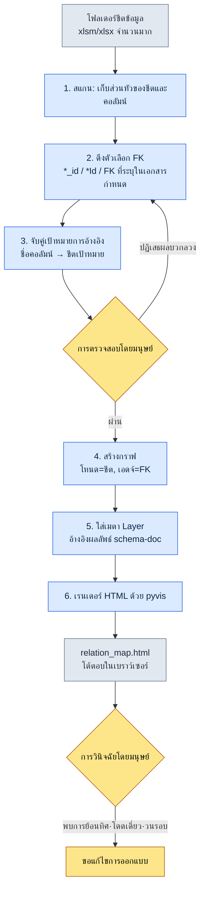

# 3.3 การแสดงผลแผนผังความสัมพันธ์ — มองเห็นการพึ่งพากันด้วยตา

นักออกแบบเกมที่เพิ่งเข้ามาใหม่เดินมาที่โต๊ะของผมในสัปดาห์แรกของการเริ่มงาน "ผมอยากแก้ตารางรางวัลของเควสต์ครับ ถ้าแตะตรงนี้แล้วมันจะพังตรงไหนบ้าง" ผมกำลังจะชี้ไปที่จอแล้วตอบ แต่ก็หยุดไว้ ในหัวของผมมีภาพอยู่ `RewardTable` ยึดอยู่กับ `ItemTable` `ItemTable` ยึดอยู่กับ `ItemEffectTable` และเหนือขึ้นไปก็มี `QuestTable` ที่อ้างอิงรางวัล… แต่พอผมพยายามแปลงภาพนั้นออกมาเป็นคำพูด รูปร่างมันก็พังทลายลงในหัวของคนฟัง ผมวาดกล่องเจ็ดกล่องลงบนไวต์บอร์ด ลูกศรเริ่มพันกันยุ่ง สามสิบนาทีต่อมา เขาพยักหน้าแล้วกลับไปที่โต๊ะ และวันรุ่งขึ้นก็กลับมาพร้อมคำถามเดิมอีกครั้ง

ฉากนี้แหละที่ทำให้ผมเขียนบทนี้ขึ้นมา ในหัวของนักออกแบบระบบมีกราฟการพึ่งพากันอยู่ ปัญหาคือมันอยู่แค่ในหัวเท่านั้น พอคนเปลี่ยน ภาพก็หายไปด้วย ผมต้องการเครื่องมือที่ดึงภาพนั้นออกมาไว้ภายนอก และสิ่งที่ผมสร้างขึ้นมาก็คือ `gen_relation_map.py`

เมื่อชีตข้อมูลมีอยู่ 5\~10 ชีต การใช้หัวคิดก็เพียงพอ แต่พอเกิน 30 ชีต ความจำขณะทำงานของคนก็รับไม่ไหว โฟลเดอร์ชีตของโปรเจกต์หนึ่งมักจะข้ามเส้นนั้นไปตั้งแต่เนิ่น ๆ ตารางที่เขียนเป็นข้อความว่าอะไรพึ่งพาอะไร อ่านแล้วก็วาดเป็นภาพไม่ออก บทนี้จะติดตามกระบวนการบันทึกเซสชันจริงในการสร้างแผนผังความสัมพันธ์แบบ HTML เชิงโต้ตอบจากความสัมพันธ์ foreign key โดยอัตโนมัติ ตั้งแต่ต้นจนจบ

---

## 3.3.1 ปัญหาสี่ข้อที่แผนผังความสัมพันธ์ช่วยแก้

ก่อนสร้างเครื่องมือ ผมจะชี้ให้เห็นก่อนว่าเวลาไม่มีแผนผังความสัมพันธ์ จริง ๆ แล้วมันติดขัดตรงไหนบ้าง สี่ฉากนี้เกิดขึ้นซ้ำ ๆ

**การ onboarding นักออกแบบใหม่** นักออกแบบคนใหม่นัดประชุมเพื่อทำความเข้าใจโครงสร้างระบบ ก็คือฉากข้างบนนั่นแหละ การพึ่งพากันที่ถ่ายทอดด้วยคำพูดอยู่ในหัวของคนฟังได้ไม่กี่วัน แต่ถ้าคลิกดูแผนผังความสัมพันธ์ด้วยกันสักหนึ่งแผ่น ในการประชุมครั้งแรกก็เห็นภาพไปแล้วเกินครึ่ง จุดที่แตกต่างจากภาพวาดมือบนไวต์บอร์ดอย่างชัดเจนคือ ภาพนี้ไม่ถูกลบและยังคงอยู่ตรงนั้น

**การถกเถียงเรื่องขอบเขตผลกระทบของการเปลี่ยนแปลง** มีคำขอเปลี่ยนแปลงระบบเข้ามา "อันนี้ส่งผลกระทบตรงไหนบ้าง" ก็นัดประชุม ถกกันอยู่นาน แต่ก็ยังมีพื้นที่ที่ตกหล่นออกมาหนึ่งสองจุด ถ้ามีแผนผังความสัมพันธ์ แค่คลิกที่โหนดเป้าหมายการเปลี่ยนแปลงแล้วไล่ตาม inbound edge ขอบเขตผลกระทบก็เข้ามาอยู่ในสายตา การถกเถียงก็เหลือแค่ "ผลกระทบนี้ถูกต้องจริงไหม" และการจัดลำดับความสำคัญเท่านั้น

**การตรวจจับการพึ่งพาแบบย้อนทิศ** การที่ชีตข้อมูล L3 อ้างอิงเอกสารระบบ L1 เป็นเรื่องปกติ แต่ทิศทางตรงข้าม (Layer ที่อยู่ระดับสูงกว่าอ้างอิงชีตข้อมูลระดับล่างโดยตรง) เกือบจะเป็นข้อบกพร่องในการออกแบบเสมอ ในรายการ FK ที่เขียนเรียงเป็นข้อความ คนจับการย้อนทิศนี้ไม่ได้ แต่ในภาพ มันจะปรากฏให้เห็นทันทีด้วยลูกศรเส้นเดียวที่สีของ Layer ไม่เข้ากัน

**การค้นพบชีตที่โดดเดี่ยว** บางครั้งก็พบชีตที่ไม่ถูกอ้างอิงจากที่ไหนเลย อาจเป็นเศษซากของการออกแบบเก่า หรือเป็นกรณีที่ตัดสินใจเลิกใช้แล้วแต่ไฟล์ยังเหลืออยู่ เหมือนกล่องไร้ฉลากที่กลิ้งอยู่ตามมุมห้องทำงาน ต้องมีภาพถึงจะค้นพบเกาะร้างนั้นได้

จุดร่วมของปัญหาทั้งสี่ข้อคือ ทั้งหมด "ต้องมองโครงสร้างด้วยตาถึงจะแก้ได้" ด้วยข้อความและตารางมันตัน

---

## 3.3.2 บันทึกเซสชันจริง: จากชีตข้อมูลไปจนถึงแผนผังความสัมพันธ์

ทีนี้มาติดตามกันจริง ๆ อินพุตคือโฟลเดอร์หนึ่งที่บรรจุชีตข้อมูล เอาต์พุตคือ HTML เชิงโต้ตอบหนึ่งแผ่นที่เปิดในเบราว์เซอร์ ผมจะบันทึกสิ่งที่ AI ทำและจุดที่คนตรวจสอบ/ปฏิเสธไว้ในระหว่างนั้นโดยไม่ตกหล่น

### 3.3.2.1 ภาพรวมของกระบวนการทั้งหมด



หัวใจอยู่ที่ลูปการตรวจสอบโดยมนุษย์ระหว่างขั้นที่ 3 กับขั้นที่ 5 การดึงตัวเลือก FK นั้นเครื่องวางร่างต้นแบบ แล้วคนก็คัดผลบวกลวงออกจากตรงนั้น ถ้าข้ามลูปนี้ไป แผนผังความสัมพันธ์ก็จะดูน่าเชื่อถือแต่เป็นภาพที่ผิด

### 3.3.2.2 FK มาจากไหน — ลำดับของอินพุต

ความแม่นยำของเครื่องมือนี้ถูกกำหนดด้วยว่าดึงอินพุตมาจากไหน หลักการ schema-first ที่กำหนดไว้ใน 3.2 ถูกนำมาใช้ตรง ๆ ลำดับฉบับตั้งต้นของข้อมูล FK เป็นดังนี้

1. **ชีต `$스키마`** — ฉบับตั้งต้นอันดับแรกของแต่ละชีตข้อมูล มีการระบุประเภท·Enum·เป้าหมาย FK แยกตามคอลัมน์ ถ้ามี FK เขียนอยู่ตรงนี้ นั่นคืออันดับ 1
2. **นิยาม `*.proto` / Enum** — สคีมาที่ส่งออกมาด้วย Export ของ VBA (ภาษามาโครของ Excel) เสริมประเภทเมื่อเอกสารกำหนดว่างเปล่า
3. **เอาต์พุต `csv` จริง** — ข้อมูลจริงที่ชีตส่งออกมา ความสัมพันธ์ที่ไม่มีในเอกสารกำหนดก็ปรากฏเป็นแพตเทิร์นในข้อมูลได้ (เช่น ถ้าค่าของคอลัมน์ `npc_id` อยู่ในช่วงคีย์ของ `NPCTable` ทั้งหมด ก็ถือว่าเป็น FK โดยพฤตินัย)

ตรงนี้ผมขอกำหนดหลักการหนึ่งให้ชัดเจน **ฉบับตั้งต้นไม่ใช่เอกสารสคีมา แต่เป็นเอาต์พุต JSON/csv จริง** แม้ในเอกสารกำหนดจะเขียนว่า `reward_id` เป็น FK แต่ถ้าในข้อมูลจริงคอลัมน์นั้นว่างเปล่าหรือชี้ไปยังค่าที่ไม่เกี่ยวข้อง ก็แปลว่าเอกสารกำหนดผิด เครื่องมือจะเชื่อฝั่งข้อมูลเมื่อทั้งสองไม่ตรงกัน และจะบันทึกความไม่ตรงกันนั้นไว้ในรายงาน นี่คือเหตุผลที่ไม่ตั้งให้ schema-doc เป็นฉบับตั้งต้น

### 3.3.2.3 ขั้นที่ 1 — สแกนโฟลเดอร์และดึงตัวเลือก FK

การกระทำแรกของเครื่องมือคือ เปิด xlsm/xlsx ทุกไฟล์ในโฟลเดอร์เพื่อเก็บส่วนหัวของชีตและคอลัมน์ ขั้นนี้เป็นเชิงกลไกล้วน ๆ จึงไม่น่าสนใจ ที่น่าสนใจคือกฎในการดึงตัวเลือก FK ตอนแรกมันเรียบง่าย ถ้าชื่อคอลัมน์ลงท้ายด้วย `*_id` หรือ `*Id` ก็ถือเป็นตัวเลือก FK แต่กฎข้อเดียวนี้ทำให้เกิดทั้งผลบวกลวงและการตกหล่น

ตรงนี้ผมเอา AI มาเสริม ผมส่งรายการส่วนหัวของคอลัมน์ทั้งก้อนไปให้แล้วให้มันอนุมานชีตเป้าหมายของ FK ข้างล่างนี้คือพรอมต์เต็มที่ผมส่งไปจริงและผลลัพธ์ดิบ

> **พรอมต์:**
> ต่อไปนี้คือชื่อชีตและรายการส่วนหัวของคอลัมน์ของชีตข้อมูลเกม จงอนุมานว่าแต่ละคอลัมน์เป็น foreign key (FK) หรือไม่ และถ้าเป็น FK มันอ้างอิงคอลัมน์ใดของชีตใด กฎของชื่อคอลัมน์โดยทั่วไปคือ `<รูปเอกพจน์ของชีตเป้าหมาย>_id` แต่ถ้าไม่มั่นใจ จงทำเครื่องหมายว่า "ไม่แน่ใจ" แล้วเขียนเหตุผล อย่าเติมด้วยการเดา
>
> ```
> QuestTable: quest_id, title, npc_id, reward_id, prev_quest_id, region_id
> NPCTable: npc_id, name, region_id, faction_id
> RewardTable: reward_id, item_id, count, currency_id
> ItemTable: item_id, name, item_effect_id, grade
> ItemEffectTable: item_effect_id, effect_type, value
> RegionTable: region_id, name, parent_region_id
> ```

> **ผลลัพธ์ดิบของ Claude (ละแถว PK ไว้ คัดเฉพาะการตัดสิน FK):**
>
> **QuestTable**
> - `npc_id` → NPCTable.npc_id (คาดว่าเป็น NPC ที่ให้เควสต์)
> - `reward_id` → RewardTable.reward_id
> - `prev_quest_id` → QuestTable.quest_id (เควสต์ก่อนหน้า, **การอ้างอิงตัวเอง**)
> - `region_id` → RegionTable.region_id
>
> **NPCTable**
> - `region_id` → RegionTable.region_id
> - `faction_id` → **ไม่แน่ใจ**: ไม่มี FactionTable อยู่ในรายการอินพุต ตามกฎของชื่อคอลัมน์ดูเหมือนจะอ้างอิง FactionTable.faction_id แต่เนื่องจากไม่ได้ให้ชีตนั้นมา จึงไม่สามารถยืนยันเป้าหมายได้
>
> **RewardTable**
> - `item_id` → ItemTable.item_id
> - `currency_id` → **ไม่แน่ใจ**: ไม่มี CurrencyTable อยู่ในรายการ ประเภทของสกุลเงินอาจถูกจัดการเป็น Enum ก็ได้ ดังนั้นอาจไม่ใช่ FK จำเป็นต้องตรวจสอบเอกสารกำหนด
>
> **ItemTable**
> - `item_effect_id` → ItemEffectTable.item_effect_id
> - `grade` → ไม่ใช่ FK (คาดว่าเป็น Enum: ค่าระดับ)
>
> **ItemEffectTable**
> - `effect_type` → ไม่ใช่ FK (คาดว่าเป็น Enum)
>
> **RegionTable**
> - `parent_region_id` → RegionTable.region_id (**การอ้างอิงตัวเอง**, โครงสร้างลำดับชั้นของภูมิภาค)
>
> หมายเหตุ: การอนุมานข้างต้นอ้างอิงจากกฎของชื่อคอลัมน์ และไม่ได้ตรวจสอบค่าข้อมูลจริง โดยเฉพาะคอลัมน์ที่ไม่ได้ลงท้ายด้วย `_id` อย่าง `count` และ `value` ผมตัดออกจากเป้าหมายการตรวจ FK แต่ถ้ามีการอ้างอิงที่ซ่อนอยู่ ก็จะตกหล่นไป

ในผลลัพธ์นี้ สิ่งที่คนทำมีสามอย่าง

- **ปฏิเสธ 1:** `faction_id` → AI จัดให้เป็นไม่แน่ใจเพราะไม่มี FactionTable ถูกต้องแล้ว แต่จริง ๆ `faction_id` เป็น Enum เนื่องจากแฟกชันถูกตรึงไว้ที่ 6 ชนิด จึงจัดการด้วย Enum โดยไม่ต้องมีชีตแยก เพราะ AI ไม่ได้กุชีตที่ไม่มีขึ้นมาและหยุดการตัดสินไว้ คนจึงดูเอกสารกำหนดแล้วยืนยันเป็น Enum ได้ **ตัดออกจาก FK**
- **ปฏิเสธ 2:** `currency_id` → AI เปิดความเป็นไปได้ไว้ทั้งสองทาง พอดูข้อมูลจริงก็พบว่า `CurrencyTable` มีอยู่ (ผมเองที่ตกหล่นในรายการอินพุต) **ยืนยันเป็น FK** นี่เป็นการตกหล่นในอินพุตของคน ไม่อาจโทษ AI ได้
- **ยอมรับ:** การตรวจจับการอ้างอิงตัวเองของ `prev_quest_id` และ `parent_region_id` ถ้าเป็นแค่กฎ regex ธรรมดาก็คงพลาดไป การที่ AI ใส่ความหมายอย่าง "เควสต์ก่อนหน้า" "ลำดับชั้นของภูมิภาค" มาให้ด้วย ช่วยให้การตรวจสอบเร็วขึ้น

บทเรียนที่ได้จากตรงนี้ชัดเจน จุดที่ AI มีประโยชน์ที่สุดไม่ใช่การอนุมานที่รวดเร็ว แต่เป็น**ความยับยั้งชั่งใจที่เว้นตำแหน่งที่ไม่รู้ไว้เป็น "ไม่แน่ใจ"** ถ้ามันฝืนเติมช่องว่าง `faction_id` ก็คงถูกเชื่อมไปยังชีตที่ไม่เกี่ยวข้อง และผลบวกลวงนั้นก็จะเหลืออยู่ในแผนผังความสัมพันธ์เป็นลูกศรปลอม ซึ่งจะนำทางนักออกแบบใหม่ไปผิดทาง

### 3.3.2.4 ขั้นที่ 2 — สร้างกราฟและใส่ Layer

เมื่อได้รายการ FK ที่ผ่านการตรวจสอบแล้ว `gen_relation_map.py` ก็จะสร้างกราฟ ชีตเป็นโหนด FK เป็นเอดจ์แบบมีทิศทาง มันนับจำนวน inbound edge (ชีตอื่นอ้างอิงฉันมากแค่ไหน) เพื่อกำหนดขนาดของโหนด ยิ่งถูกอ้างอิงมากก็ยิ่งเป็นโหนดใหญ่ นั่นคือฮับของระบบ

เมตาดาตาของ Layer ดึงมาจากเอกสารสคีมา markdown ที่สกิล `schema-doc` สร้างขึ้น พิกัด Layer (L0\~L4) ที่นิยามไว้ใน 3.1 ถูกติดเป็นป้ายให้แต่ละชีต และเครื่องมือก็อ่านมันแล้วลงสีโหนด การเชื่อมนี้สำคัญ ถ้าแผนผังความสัมพันธ์ไม่รู้จัก Layer มันก็เป็นแค่กล่องกับลูกศร ต้องรู้จัก Layer ถึงจะวินิจฉัย "การย้อนทิศ" ด้วยสีได้

ถ้าแสดงโครงสร้างภายในของเครื่องมือออกมาเป็นโครงโค้ดก็เป็นดังนี้ (คัดเฉพาะกระแสหลัก)

```python
# gen_relation_map.py (คัดเฉพาะกระแสหลัก)
from pyvis.network import Network

LAYER_COLORS = {          # จานสี Layer — ทำให้เป็นมาตรฐานด้วย atom 1 ตัว
    "L0": "#2c3e50",      # เมตา/ใช้ร่วม
    "L1": "#2980b9",      # ระบบ
    "L2": "#27ae60",      # เนื้อหา
    "L3": "#f39c12",      # อินสแตนซ์ข้อมูล
    "L4": "#c0392b",      # อนุพันธ์/แคช
}

def build_graph(fk_list, layer_map):
    net = Network(directed=True, height="900px")
    inbound = count_inbound(fk_list)          # รวมจำนวน inbound edge
    for sheet in all_sheets(fk_list):
        layer = layer_map.get(sheet, "L0")
        size = 10 + inbound[sheet] * 3        # ยิ่งเป็นฮับยิ่งโหนดใหญ่
        net.add_node(sheet, color=LAYER_COLORS[layer],
                     size=size, title=sheet_tooltip(sheet))
    for src, dst, col in fk_list:
        # ตรวจจับการย้อนทิศของ Layer: ถ้า Layer ระดับสูงอ้างอิงระดับล่าง ให้ใช้สีเตือน
        edge_color = "#e74c3c" if is_reverse(src, dst, layer_map) else "#888"
        net.add_edge(src, dst, title=col, color=edge_color)
    return net
```

`is_reverse` คือหัวใจเล็ก ๆ ของเครื่องมือนี้ ถ้าชีตต้นทางของเอดจ์อยู่ Layer ระดับสูงกว่าชีตปลายทาง (เช่น L1 → L3) ก็ถือว่าเป็นการย้อนทิศและลงสีเอดจ์เป็นสีแดง พอคนเปิดภาพขึ้นมาแล้วเห็นลูกศรสีแดง นั่นเกือบจะเป็นจุดที่ต้องแก้เสมอ

### 3.3.2.5 ขั้นที่ 3 — เรนเดอร์ HTML และโครงสร้างผลลัพธ์

ขั้นสุดท้ายคือขั้นที่ pyvis พ่น HTML เชิงโต้ตอบออกมา เมื่อคลิกที่โหนด คอลัมน์·Layer·จำนวน inbound ของชีตนั้นจะแสดงเป็นทูลทิป และสามารถกรองด้วยชื่อชีตในช่องค้นหาได้ เหตุผลที่ต้องเป็น HTML ไม่ใช่ PNG แบบสแตติกอยู่ตรงนี้ — เมื่อจำนวนโหนดเกินหลายสิบ ในภาพแบบสแตติกลูกศรจะพันกันจนมองอะไรไม่เห็น ต้องลากด้วยเมาส์เพื่อคลี่ออก แล้วคลิกเจาะเฉพาะพื้นที่ที่สนใจ ถึงจะจับแพตเทิร์นได้

ถ้าแปลงโครงสร้างของแผนผังความสัมพันธ์ที่สร้างจากข้อมูลตัวอย่างข้างบนออกมาเป็น SVG ก็เป็นดังนี้ สีคือ Layer ลูกศรสีแดงหมายถึงตำแหน่งการย้อนทิศ (แม้ในตัวอย่างนี้จะไม่มีก็ตาม)

<svg viewBox="0 0 720 360" xmlns="http://www.w3.org/2000/svg" font-family="sans-serif" font-size="13">
  <defs>
    <marker id="arrow" markerWidth="10" markerHeight="10" refX="9" refY="3" orient="auto" markerUnits="strokeWidth">
      <path d="M0,0 L9,3 L0,6 Z" fill="#888"/>
    </marker>
  </defs>
  <!-- nodes -->
  <rect x="40" y="30" width="130" height="40" rx="6" fill="#2980b9"/>
  <text x="105" y="55" fill="#fff" text-anchor="middle">RegionTable (L1)</text>
  <rect x="300" y="30" width="130" height="40" rx="6" fill="#27ae60"/>
  <text x="365" y="55" fill="#fff" text-anchor="middle">QuestTable (L2)</text>
  <rect x="560" y="30" width="130" height="40" rx="6" fill="#27ae60"/>
  <text x="625" y="55" fill="#fff" text-anchor="middle">NPCTable (L2)</text>
  <rect x="300" y="150" width="130" height="40" rx="6" fill="#f39c12"/>
  <text x="365" y="175" fill="#fff" text-anchor="middle">RewardTable (L3)</text>
  <rect x="560" y="150" width="130" height="40" rx="6" fill="#f39c12"/>
  <text x="625" y="175" fill="#fff" text-anchor="middle">ItemTable (L3)</text>
  <rect x="560" y="270" width="150" height="40" rx="6" fill="#f39c12"/>
  <text x="635" y="295" fill="#fff" text-anchor="middle">ItemEffectTable (L3)</text>
  <!-- edges -->
  <line x1="300" y1="50" x2="172" y2="50" stroke="#888" stroke-width="2" marker-end="url(#arrow)"/>
  <line x1="560" y1="50" x2="432" y2="50" stroke="#888" stroke-width="2" marker-end="url(#arrow)"/>
  <line x1="625" y1="70" x2="380" y2="150" stroke="#888" stroke-width="2" marker-end="url(#arrow)"/>
  <line x1="365" y1="70" x2="365" y2="150" stroke="#888" stroke-width="2" marker-end="url(#arrow)"/>
  <line x1="560" y1="170" x2="432" y2="170" stroke="#888" stroke-width="2" marker-end="url(#arrow)"/>
  <line x1="625" y1="190" x2="625" y2="270" stroke="#888" stroke-width="2" marker-end="url(#arrow)"/>
  <!-- self-ref -->
  <path d="M170,40 q40,-30 0,-10" fill="none" stroke="#888" stroke-width="2" marker-end="url(#arrow)"/>
  <text x="200" y="20" fill="#666" font-size="11">parent_region_id (การอ้างอิงตัวเอง)</text>
</svg>

ดูจากขนาดของโหนดจะเห็นว่า `RegionTable` ถูกอ้างอิงมากที่สุด (ทั้ง Quest·NPC ชี้มาหมด) นี่คือฮับ ส่วน `ItemEffectTable` เป็นโหนดใบไม้จึงเล็ก คำตอบของคำถามที่นักออกแบบใหม่ถามว่า "ถ้าจะเข้าใจระบบนี้ ควรเริ่มดูจากตรงไหน" อยู่ในภาพอยู่แล้วตามลำดับขนาดของโหนด

---

## 3.3.3 การวินิจฉัยที่ภาพสร้างขึ้น — ผสานกับ Layer

ใน 3.1 ผมนิยามพิกัด Layer ไว้ พอแผนผังความสัมพันธ์ของบทนี้ยกพิกัดนั้นขึ้นมาสู่สายตา การวินิจฉัยสี่อย่างที่ข้อความหรือตารางทำไม่ได้ก็เป็นไปได้ในหน้าจอเดียว

- **การย้อนทิศของ Layer** — ลูกศร (สีแดง) ที่สีของ Layer ไหลย้อนทิศ เป็นโครงสร้างที่ไม่เป็นธรรมชาติ ที่ชีตข้อมูลส่งผลกระทบย้อนกลับไปยังการออกแบบระบบ
- **โหนดที่โดดเดี่ยว** — เกาะร้างที่ไม่เชื่อมต่อกับเอดจ์ใดเลย เป็นตัวเลือกที่จะถูกเลิกใช้
- **ฮับรับภาระเกิน** — โหนดยักษ์ที่มี inbound edge มากผิดปกติ เป็นสัญญาณว่าชีตหนึ่งแบกความรับผิดชอบมากเกินไป ควรพิจารณาการแบ่ง
- **การพึ่งพาแบบวนรอบ** — ตำแหน่งที่ลูกศรวาดเป็นวงกลม เกือบจะเป็นข้อบกพร่องในการออกแบบเสมอ และนำไปสู่ปัญหาเรื่องลำดับการโหลดข้อมูล

แต่ก็ไม่ได้หมายความว่าภาพจะจับทุกปัญหา ภาพจับ**ข้อบกพร่องเชิงโครงสร้าง** ส่วนที่ว่า FK นี้เป็นความสัมพันธ์ที่ถูกต้องตามความหมายจริงไหม (เช่น `npc_id` เป็น "NPC ที่ให้เควสต์" จริง หรือเป็น "NPC ที่ปรากฏในเควสต์" กันแน่) นั้นภาพแก้ไม่ได้ นั่นเป็นหน้าที่การตัดสินเชิงโดเมนของคน เครื่องมือเพียงแค่ปูเวทีให้การตัดสินของคนได้ทำงานเท่านั้น

---

## 3.3.4 ถ้าไม่มีการอัปเดตอัตโนมัติ มันจะผุ

แผนผังความสัมพันธ์ไม่ใช่สร้างครั้งเดียวจบ ชีตถูกเพิ่ม·เปลี่ยนทุกสัปดาห์ แผนผังความสัมพันธ์ที่ฝากไว้กับการอัปเดตด้วยมือ ภายในหนึ่งถึงสองเดือนก็จะไม่ตรงกับโครงสร้างจริง และแผนที่ที่ไม่ตรงก็นำทางผิด จึงสู้ไม่มีเสียยังดีกว่า สมาชิกทีมที่เคยถูกภาพที่ผิดทำเอาเจ็บตัวมาแล้ว ครั้งต่อไปก็จะไม่ดูภาพอีก — นี่คือความล้มเหลวที่แพงที่สุด

ดังนั้นผมจึงผูกการอัปเดตไว้กับทริกเกอร์อัตโนมัติ

- **Git pre-push hook** — สร้างแผนผังความสัมพันธ์ขึ้นใหม่ก่อนพุชชีตข้อมูล รับประกันว่าเป็นสถานะล่าสุดเสมอ
- **ณ จุดที่มีคำขอเปลี่ยนแปลง** — เมื่อมีคำขอเปลี่ยนแปลงชีตข้อมูลเข้ามา ก็เทียบแผนผังความสัมพันธ์ก่อนและหลังการเปลี่ยนแปลงด้วย diff แล้วแนบไว้ในคอมเมนต์ เอดจ์ที่เพิ่มมาเป็นสีเขียว เอดจ์ที่หายไปเป็นสีแดง ผู้รีวิวจะได้เห็นขอบเขตผลกระทบเป็นภาพ
- **แบตช์กลางคืน** — ทุกคืนสร้างแผนผังความสัมพันธ์ใหม่แล้วเก็บ diff เทียบกับวันก่อนหน้าไว้
- **คำสั่งด้วยมือ** — สร้างทันทีด้วยสแลช `/relation-map` ใช้ตอนอยากเปิดขึ้นมาแบบสด ๆ ระหว่างประชุม

HTML ที่สร้างขึ้นจะถูกดีพลอยไปยังโฮสติงสแตติกภายในองค์กร (พอร์ทัลการออกแบบ) โดยอัตโนมัติ ทุกคนเห็นแผนที่เดียวกันได้เพียงแค่มีเบราว์เซอร์ โดยไม่ต้องติดตั้งเครื่องมือเพิ่ม เหมือนแผนที่ที่กางคลี่ไว้ข้างโต๊ะตลอดเวลา ไม่ว่าใครจะถาม ก็ตอบโดยชี้ไปยังภาพเดียวกันด้วยกัน

---

## 3.3.5 ความผิดพลาดที่พบบ่อยและวิธีหลีกเลี่ยง

| ความผิดพลาด | เกิดจากอะไร | วิธีหลีกเลี่ยง |
|---|---|---|
| โหนดเกิน 100 ตัวจนภาพพันกัน | ยัดทุกสาขาเข้าหน้าจอเดียว | กรองตามโดเมน, มุมมองแบ่งตามกลุ่ม |
| สี Layer ต่างกันในแต่ละเครื่องมือ | นิยามจานสีใหม่ในแต่ละโค้ด | ทำให้จานสีเป็นมาตรฐานด้วย atom 1 ตัว (`LAYER_COLORS`) |
| การตรวจ FK จับแค่ `*_id` ทำให้ตกหล่น·ผลบวกลวง | พึ่ง regex บรรทัดเดียว | ระบุ FK ในเอกสารกำหนด + ตรวจค่าข้อมูลจริงควบคู่กัน |
| ภาพสร้างเสร็จแต่ไม่มีใครดู | ไม่ได้เชื่อมเข้ากับเวิร์กโฟลว์ | บังคับแนบภาพในคำขอเปลี่ยนแปลง·การประชุม |
| สร้างแล้วไม่อัปเดตจนผุ | พึ่งการอัปเดตด้วยมือ | ทริกเกอร์อัตโนมัติเป็นสิ่งจำเป็น ทำด้วยมือได้แค่เดือนเดียวก็ไร้ประโยชน์ |

ในการดำเนินงาน `gen_relation_map.py` สิ่งที่ผมเจ็บตัวบ่อยที่สุดคือบรรทัดที่สาม ถ้าเชื่อแค่กฎ `*_id` ก็จะพลาดการอ้างอิงที่ซ่อนอยู่อย่าง `count` หรือ `value` (AI ใน 3.3.2.3 ก็เตือนข้อจำกัดนี้ด้วยตัวเอง) และตรวจ Enum อย่าง `grade` ผิดเป็น FK ลูปการตรวจสอบที่ดูทั้งเอกสารกำหนดและข้อมูลจริงคือคำตอบของบรรทัดนี้

---

## 3.3.6 ลองทำฉบับย่อสำหรับคนเดียวก่อน

ถ้าพยายามจัดการชีตข้อมูลของทั้งบริษัทในคราวเดียว มันจะหนักและหมดแรงไปก่อนที่จะได้แสดงคุณค่าด้วยซ้ำ เริ่มเล็ก ๆ จากโฟลเดอร์เดียวในสาขาของคุณเองก่อน

### ลองทำดู

**setup.**
1. เลือกโฟลเดอร์หนึ่งที่บรรจุชีตข้อมูล 5\~10 ชีตที่คุณรับผิดชอบ
2. ติดตั้ง dependency ด้วย `pip install pyvis openpyxl` (การอ่าน Excel ใช้สกิล `excel-reader` หรือ openpyxl)
3. ตรวจดูก่อนว่าในชีต `$스키마` ของแต่ละชีตมีการระบุ FK ไว้หรือไม่ ถ้าไม่มี ก็เก็บแค่ส่วนหัวของคอลัมน์

**prompt.** รวบรวมรายการส่วนหัวของคอลัมน์แล้วส่งพรอมต์ของ 3.3.2.3 ไปตรง ๆ หัวใจคือบรรทัดสุดท้าย — "ถ้าไม่มั่นใจ จงทำเครื่องหมายว่าไม่แน่ใจ และอย่าเติมด้วยการเดา" ประโยคนี้กั้นลูกศรปลอมไว้

**verify.**
1. ดูตัวเลือก FK ที่ AI ส่งมาทีละบรรทัด ยืนยันบรรทัดที่ทำเครื่องหมาย "ไม่แน่ใจ" ด้วยเอกสารกำหนด/ข้อมูลจริง
2. คอลัมน์ที่สงสัยว่าเป็น Enum (อย่าง `grade`, `effect_type` ที่ไม่มี `_id` แต่ดูเหมือน FK) ให้ตัดออกจาก FK
3. ตรวจว่าการอ้างอิงตัวเอง (`prev_*_id`, `parent_*_id`) ถูกจับมาถูกต้องไหม
4. วาดกราฟด้วยรายการที่ผ่านการตรวจสอบ แล้วเปิดในเบราว์เซอร์เพื่อค้นหาลูกศรสีแดง (การย้อนทิศ) และเกาะร้าง (การโดดเดี่ยว) ด้วยตา

### ฉบับย่อสำหรับคนเดียว

ถ้าไม่มีเวลาสร้างเครื่องมือ ในสัปดาห์แรกจะเริ่มจาก mermaid ที่วาดด้วยมือสักหนึ่งแผ่นก็ได้ เขียน FK ของ 5 ชีตลงใน mermaid โดยตรงด้วยรูปแบบของ 3.3.2.3 พอเอาแผ่นนี้ไปประชุมแล้วแสดงให้ดูว่า "นี่คือการพึ่งพากันของระบบเรา" คุณค่าก็พิสูจน์ได้ตรงนั้นเลย พอเห็นคุณค่าแล้ว เครื่องมืออัตโนมัติก็จะตามมาเองในลำดับถัดไป คุณวางภาระที่ว่าต้องมีเครื่องมือที่ทำงานได้ออกมาตั้งแต่แรกลงได้

การขยายจะไหลไปตามลำดับนี้อย่างเป็นธรรมชาติ — สัปดาห์ที่ 1 ภาพวาดมือ mermaid ของชีตตัวเอง → สัปดาห์ที่ 2 เพิ่มสี Layer และการคลิก → 1 เดือน อัปเดตอัตโนมัติ (git hook หรือแบตช์กลางคืน) → 3 เดือน ดีพลอยขึ้นพอร์ทัลภายในองค์กร → 6 เดือน แผนผังความสัมพันธ์รวมของชีตทั้งหมด

---

## 3.3.7 เชื่อมต่อสู่บทถัดไป

ใน 3.2 ผมจัดการกับด้านในของชีต (สคีมา) ใน 3.3 ก็จัดการด้านนอกของชีต (ความสัมพันธ์) ส่วน 3.4 จะวางแพตเทิร์นพรอมต์ที่ AI ช่วยเสริมไว้เหนือสิ่งเหล่านี้ บนระบบที่สคีมาและความสัมพันธ์ลงตัวแล้ว มันจะต่อด้วยแพตเทิร์นเชิงปฏิบัติว่า AI ช่วยเสริมการตรวจความสอดคล้องและการดึงขอบเขตผลกระทบได้อย่างไร

---

### สรุปประเด็นสำคัญของบท
- การดึงกราฟการพึ่งพากันในหัวออกมาไว้ภายนอก ทำให้แม้คนเปลี่ยน ภาพเดียวกันก็ยังคงอยู่ตรงนั้น
- การดึง FK นั้น ลูปการตรวจสอบที่คนคัดผลบวกลวงออกจากร่างต้นแบบที่ AI วางไว้คือสิ่งที่สร้างความแม่นยำ
- แผนผังความสัมพันธ์ที่ไม่มีการอัปเดตอัตโนมัติ ภายในหนึ่งถึงสองเดือนก็จะผุและสูญเสียความน่าเชื่อถือ

### ตัวอย่างบทถัดไป
- 3.4. แพตเทิร์นพรอมต์การออกแบบระบบที่ AI ช่วยเสริม
