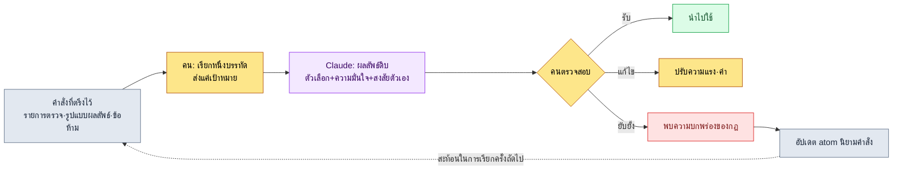
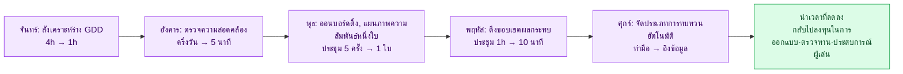

# 3.4 รูปแบบพรอมต์สำหรับการออกแบบระบบโดยมี AI ช่วย

เป็นสัปดาห์ที่ใกล้ถึงกำหนดทำอัลฟาบิลด์มาก ผมเพิ่มคลาสใหม่หนึ่งบรรทัดลงในชีตสกิลแล้วบันทึก แต่บัฟ ID ที่คลาสนั้นอ้างอิงถึงกลับเป็นแถวที่มีคนลบทิ้งไปเมื่อวันก่อน ซึ่งผมเพิ่งรู้ตอนเช้าวันรุ่งขึ้นหลังจากบิลด์พังไปแล้ว การไล่ย้อนหาสาเหตุของบิลด์ที่พังไปนั้นใช้เวลาสองชั่วโมง เป็นสองชั่วโมงที่ผมไม่ต้องเสียไปเลยถ้าหากก่อนลบแถวนั้นมีใครถามได้ว่า "ลบอันนี้ได้ไหม"

บทนี้ว่าด้วยวิธีให้ AI ถามคำถามนั้นแทน หัวใจไม่ได้อยู่ที่เคล็ดลับการเขียนพรอมต์ให้ดี แต่อยู่ที่การตรึงคำถามเดิมไว้เป็นกฎ เพื่อไม่ต้องเขียนคำถามเดียวกันใหม่จากศูนย์ทุกครั้ง ในหัวข้อ 3.2 เราวาง schema ไว้แล้ว ในหัวข้อ 3.3 เราวางแผนภาพความสัมพันธ์ไว้แล้ว ทั้งสองคือโครงกระดูกของข้อมูล บทนี้จะแปลงตัวคำถามที่คนโยนให้ AI บนโครงกระดูกนั้นให้กลายเป็นสินทรัพย์ที่ตรึงตายตัว

ก่อนอื่นขอตอกหมุดไว้หนึ่งข้อ สิ่งที่ AI สร้างไม่ใช่คำตอบ แต่เป็นตัวเลือก ในทุกรูปแบบที่ปรากฏในบทนี้ มือที่ตัดสินใจขั้นสุดท้ายยังคงอยู่ฝั่งมนุษย์จนถึงที่สุด

---

## 3.4.1 พรอมต์แบบด้นสดรั่วสองจุด

เมื่อเริ่มใช้ AI ครั้งแรก เรามักพิมพ์เป็นภาษาธรรมชาติด้นสดทุกครั้ง ในทำนองนี้

```
ช่วยดูชีตสกิลให้หน่อย ตรวจดูว่ามี foreign key พังไหม
ถ้ามีอะไรแปลก ๆ ก็บอกด้วย อ้อ แล้วก็ที่ cooldown ติดลบด้วยนะ
```

พรอมต์นี้รั่วอยู่สองจุด

จุดแรก รายการที่ตรวจเปลี่ยนไปทุกครั้ง วันนี้นึกถึง "cooldown ติดลบ" ได้ แต่พรุ่งนี้ลืม "PK ซ้ำ (Primary Key, คีย์หลัก)" ที่เคยกรองออกไปเมื่อวานหายไปจากพรอมต์ของวันนี้ การตรวจที่พึ่งพาความจำของคนย่อมตกหล่นตามสภาพร่างกายของคนในวันนั้น

จุดที่สอง รูปแบบผลลัพธ์เปลี่ยนไปทุกครั้ง ถ้าเขียนเจตนาเดียวกันต่างกันไปว่า "ช่วยตรวจที" "ตรวจหน่อย" "กวาดสายตาดูหน่อย" AI ก็จะตอบเป็นตารางในบางวัน และตอบเป็นความเรียงในบางวัน เมื่อรูปแบบไม่สม่ำเสมอ เราก็เอาผลลัพธ์นั้นไปประมวลผลอัตโนมัติต่อไม่ได้

ทางแก้คือปล่อยพรอมต์ออกจากมือแล้วเก็บเข้าลิ้นชัก เปลี่ยนบันทึกที่เคยจดด้วยมือทุกครั้งให้เป็นการ์ดที่ติดป้ายกำกับ แล้วหยิบออกจากลิ้นชักเดียวกัน การ์ดใบนั้นคือคำสั่งสแลช (slash command หรือ skill) และ atom ที่หนังสือเล่มนี้พูดถึง

---

## 3.4.2 สามรูปแบบของการตรึงเป็นกฎและเกณฑ์การเลือก

การตรึงเป็นกฎมีภาชนะอยู่สามแบบ การจะเก็บอะไรไว้ที่ไหนนั้นแบ่งกันด้วยความถี่ในการเรียกใช้และความเสถียร

<svg viewBox="0 0 720 300" xmlns="http://www.w3.org/2000/svg" font-family="sans-serif" font-size="13">
  <rect x="0" y="0" width="720" height="300" fill="#fbfbfd"/>
  <line x1="120" y1="40" x2="120" y2="280" stroke="#bbb" stroke-width="1"/>
  <line x1="120" y1="160" x2="700" y2="160" stroke="#bbb" stroke-width="1"/>
  <text x="60" y="35" text-anchor="middle" font-weight="bold">ความถี่การเรียก</text>
  <text x="60" y="55" text-anchor="middle" fill="#888" font-size="11">สูง ↑</text>
  <text x="60" y="270" text-anchor="middle" fill="#888" font-size="11">ต่ำ ↓</text>
  <text x="410" y="298" text-anchor="middle" font-weight="bold">ความเสถียรของนิยาม →</text>

  <rect x="150" y="70" width="200" height="70" rx="8" fill="#e8f0fe" stroke="#4285f4"/>
  <text x="250" y="98" text-anchor="middle" font-weight="bold">คำสั่งสแลช (skill)</text>
  <text x="250" y="118" text-anchor="middle" font-size="11" fill="#555">บ่อย·เสถียร → /check-sheet</text>
  <text x="250" y="133" text-anchor="middle" font-size="11" fill="#555">เรียกด้วยคำเดียว รูปแบบผลลัพธ์ตายตัว</text>

  <rect x="400" y="70" width="270" height="70" rx="8" fill="#fef7e0" stroke="#f9ab00"/>
  <text x="535" y="98" text-anchor="middle" font-weight="bold">การฉีด atom อัตโนมัติ (JIT)</text>
  <text x="535" y="118" text-anchor="middle" font-size="11" fill="#555">บ่อย·ข้อจำกัดหลัก → ทริกเกอร์ด้วยคีย์เวิร์ด</text>
  <text x="535" y="133" text-anchor="middle" font-size="11" fill="#555">ไม่ต้องจำ แทรกเข้ามาในภาษาธรรมชาติ</text>

  <rect x="150" y="190" width="200" height="70" rx="8" fill="#e6f4ea" stroke="#34a853"/>
  <text x="250" y="218" text-anchor="middle" font-weight="bold">ไฟล์เทมเพลต (.md)</text>
  <text x="250" y="238" text-anchor="middle" font-size="11" fill="#555">นาน ๆ ครั้ง·งานใหญ่ → เรียกไฟล์</text>
  <text x="250" y="253" text-anchor="middle" font-size="11" fill="#555">ดูด้วยตาและแก้ได้ง่าย</text>

  <rect x="400" y="190" width="270" height="70" rx="8" fill="#f1f3f4" stroke="#9aa0a6"/>
  <text x="535" y="225" text-anchor="middle" font-size="12" fill="#777">นาน ๆ ครั้ง·นิยามยังไม่นิ่ง →</text>
  <text x="535" y="243" text-anchor="middle" font-size="12" fill="#777">อย่าเพิ่งตรึงเป็นกฎ (ปล่อยให้ด้นสดไปก่อน)</text>
</svg>

งานที่ใช้บ่อยและนิยามนิ่งแล้วให้ทำเป็นคำสั่งสแลช งานที่ใช้บ่อยแต่เป็น "ข้อจำกัดที่ห้ามลืม" ให้ฉีดอัตโนมัติด้วย atom JIT งานที่ทำนาน ๆ ครั้งแต่ตัวใหญ่ให้ทำเป็นไฟล์เทมเพลต และงานที่นิยามยังคลอนแคลนอยู่ ก็ปล่อยให้ด้นสดไว้ก่อนโดยไม่ตรึงเป็นกฎ ไม่จำเป็นต้องมีครบทั้งสามตั้งแต่แรก เริ่มจากคำสั่งสแลชสักหนึ่งสองตัว แล้วค่อยเพิ่มเมื่อเห็นคุณค่า

---

## 3.4.3 รูปแบบที่ ① การตรวจความสอดคล้อง — บันทึกเซสชันจริง (worked transcript)

แทนที่จะอธิบายด้วยคำพูด ผมจะพาไล่ตามรูปแบบหนึ่งตั้งแต่ต้นจนจบ มันคือรูปแบบที่ถามให้อัตโนมัติว่า "ลบอันนี้ได้ไหม" ก่อนจะลบแถวว่างสักแถว ชื่อของมันคือ `/check-sheet` ภายในมีรายการที่ตรวจและรูปแบบผลลัพธ์ตรึงเอาไว้

สินทรัพย์ที่ใช้เป็นฐานอยู่ในบันทึกการทำงานจากการวัดจริงที่ฝังไว้ทั่วทั้งเล่ม การป้อนข้อมูลเป็นไปตามหลัก schema-first (atom `data_entry_schema_first`) ลำดับการป้อนคือ ชีต `$스키마` → `Enum/*.proto` (Export ด้วย VBA (ภาษามาโครของ Excel)) → csv และสิ่งที่เป็นต้นฉบับจริงไม่ใช่เอกสาร schema แต่เป็นผลลัพธ์ JSON ที่ออกมาจริง (atom `json_over_schema_doc_as_source_of_truth`) การตรวจความสอดคล้องก็คือการยกหลักสองข้อนี้มาเป็นกฎการตรวจตรง ๆ นั่นเอง

### setup — ส่วนในของคำสั่งที่ตรึงไว้

เมื่อกาง `/check-sheet` ออก ภายในมีเนื้อพรอมต์แบบนี้อยู่ นี่คือส่วนที่ไม่ต้องพิมพ์ด้วยมือทุกครั้ง

```
บทบาท: คุณคือตัวตรวจสอบความสอดคล้องของชีตข้อมูลเกม

ชีตที่จะตรวจ: {{sheet_name}}
schema ที่อ้างอิงได้: ชีต $스키마 (ชนิด·ช่วงค่า·เป้าหมาย FK ของแต่ละคอลัมน์)
ต้นฉบับจริงที่อ้างอิงได้: export JSON ของชีตเดียวกัน (สำคัญกว่าเอกสาร schema)

รายการที่ตรวจ (ตามลำดับนี้):
1. ความถูกต้องของ foreign key — ค่าในคอลัมน์ FK มีอยู่จริงในชีตเป้าหมายที่อ้างอิงหรือไม่
2. การละเมิดช่วงค่า — ค่าที่หลุดออกนอก min/max ที่นิยามไว้ใน $스키마
3. คอลัมน์ที่จำเป็นแต่ขาดหาย — แถวที่คอลัมน์ required=true ว่างเปล่า
4. PK ซ้ำ — PK เดียวกันมีตั้งแต่สองรายการขึ้นไป

รูปแบบผลลัพธ์ (ต้องเป็นตารางนี้เท่านั้น):
| # | แถว | คอลัมน์ | ชนิดการละเมิด | ค่าปัจจุบัน | ตัวเลือกการแก้ไข | ความมั่นใจ |

กฎ:
- ตัวเลือกการแก้ไขเป็นแค่ข้อเสนอ ห้ามแก้ชีตโดยตรงเด็ดขาด
- ความมั่นใจให้เลือกหนึ่งในสาม สูง/กลาง/ต่ำ ถ้าเป็นการเดาให้ระบุต่ำ
- ถ้าไม่มีการละเมิด ให้แสดงผลแค่ "ละเมิด 0 รายการ" แล้วจบ
```

ในเนื้อพรอมต์นี้ สิ่งที่สำคัญคือกฎสามบรรทัดสุดท้าย "ห้ามแก้โดยตรง" "ให้คะแนนความมั่นใจ" "ถ้าเป็นการเดาให้สารภาพว่าต่ำ" สามบรรทัดนี้มัด AI ไว้ที่ตำแหน่งของการเสนอตัวเลือก ไม่ใช่ตำแหน่งของการให้คำตอบ

### prompt — บรรทัดเดียวที่คนพิมพ์จริง

```
/check-sheet skill_table
```

จบแค่นั้น ส่งแค่ชื่อชีตชื่อเดียว ไม่ต้องเขียนทั้งรายการตรวจสี่ข้อและรูปแบบตารางผลลัพธ์ใหม่ นั่นแหละคือคุณค่าของการตรึงเป็นกฎ

### ผลลัพธ์ดิบของ Claude

ด้านล่างคือผลลัพธ์ที่ออกมาตอนรันจริง ผมไม่สรุปย่อ แต่นำมาลงไว้ทั้งหมดรวมถึงส่วนที่กำกวมและจุดที่ AI ลังเล

```
นี่คือผลการตรวจความสอดคล้องของ skill_table พบการละเมิดทั้งหมด 4 รายการ

| # | แถว | คอลัมน์      | ชนิดการละเมิด | ค่าปัจจุบัน | ตัวเลือกการแก้ไข            | ความมั่นใจ |
|---|-----|------------|------------|--------|----------------------|------|
| 1 | 142 | buff_id    | ละเมิด FK   | 9007   | 9070 (น่าจะพิมพ์ผิด 1 ตัว) | กลาง   |
| 2 | 142 | buff_id    | ละเมิด FK   | 9007   | 9012 (ชื่อ "맹독" คล้ายกัน) | ต่ำ   |
| 3 | 88  | cooldown   | ละเมิดช่วงค่า | -1     | 0 (ติดลบไม่ได้)         | สูง   |
| 4 | 215 | combo_next | จำเป็นแต่ขาด | (ว่าง)  | ขอพักการตัดสิน          | ต่ำ   |

ขอเสริมข้อสังเกตบางประการ

- รายการ 1 และ 2 เป็นตัวเลือกที่ต่างกันสำหรับคอลัมน์เดียวกันของแถวเดียวกัน (142)
  ID ที่ชื่อ 9007 ไม่มีอยู่ในชีต buff ส่วน 9070 ต่างกันแค่ตัวเลขหลักเดียว
  จึงมีความเป็นไปได้ว่าพิมพ์ผิด และ 9012 มีชื่อ "맹독" คล้ายกัน จึงนำมาเป็น
  ตัวเลือก ทั้งคู่มีความมั่นใจต่ำ คนต้องเป็นผู้เลือกเอง

- รายการ 4 (แถว 215 คอลัมน์ combo_next ว่าง) นั้นกำกวม ใน $스키마 ตั้งไว้เป็น
  required=true แต่เมื่อดู export JSON พบว่าคอลัมน์นี้มีแถวที่ว่างอีก 12 แถว
  อาจเป็นไปได้ว่าเอกสารกำหนดสเปกไม่ใช่ฉบับล่าสุด หรือมีกฎว่า "สกิลปิดท้าย
  คอมโบจะเว้น combo_next ว่างไว้" แต่ยังไม่ได้สะท้อนลงในเอกสารกำหนดสเปก
  ผมไม่สามารถฟันธงได้ จึงพักไว้เป็น "ขอพักการตัดสิน"

- ถ้าต้องการรันการตรวจช่วงค่าเพิ่มนอกจาก cooldown ต้องตรวจ min/max ของ
  คอลัมน์อื่นใน $스키마 แต่ในข้อมูลที่ผมได้รับ บางส่วนของคอลัมน์ range_check
  ว่างเปล่าอยู่ ผมจึงไม่สามารถตรวจคอลัมน์ cast_time ได้
```

ที่ผลลัพธ์นี้เป็นผลลัพธ์ที่ดี ไม่ใช่เพราะมันเรียบร้อย แต่เพราะมันตรงไปตรงมา มันไม่ได้ฟันธงรายการ 4 ว่า "จำเป็นก็ต้องเติม" แต่แสดงความสงสัยตัวเองว่า "เอกสารกำหนดสเปกอาจไม่ใช่ฉบับล่าสุด" และยังสารภาพข้อจำกัดว่ามองคอลัมน์ cast_time ไม่ได้ ถ้า AI มั่นอกมั่นใจบอกว่ารายการ 4 ให้ "เติม 0" นั่นอาจเป็นคำตอบผิดที่ทำให้สกิลปิดท้ายคอมโบพังได้

### verify — การตรวจสอบและการยับยั้งของมนุษย์

ตอนนี้คนตัดสินทีละบรรทัด การที่การตรวจสอบมาพร้อมกันโดยอัตโนมัติ หมายความว่าตารางนี้ออกมาเองโดยอัตโนมัติ ไม่ได้หมายความว่าคนไม่ดู

- **รายการ 3 (cooldown -1 → 0)**: รับ ความมั่นใจสูง cooldown ติดลบเป็นความผิดพลาดในการป้อนข้อมูลที่ชัดเจน แก้ทันที
- **รายการ 1·2 (buff_id 9007)**: พัก ทั้งคู่ความมั่นใจต่ำ จะเปิดชีต buff โดยตรงเพื่อตรวจสอบ ID จริงของบัฟตระกูล "맹독" ไม่รับตัวเลือกของ AI ทั้งสอง
- **รายการ 4 (combo_next ว่าง)**: **ยับยั้ง** สิ่งที่ AI สงสัยนั้นถูกต้อง สกิลนี้เป็นตัวปิดท้ายคอมโบ การที่ combo_next ว่างจึงเป็นเรื่องปกติ ไม่ใช่การละเมิด ยับยั้งไป และนี่เป็นปัญหาฝั่งเอกสารกำหนดสเปก

รายการ 4 ตัวสุดท้ายคือหัวใจ ในจุดที่ถ้าเชื่อผลลัพธ์ของ AI ไปดื้อ ๆ ก็จะทำให้ข้อมูลที่ดี ๆ พังเสียหาย การยับยั้งของมนุษย์ได้ทำงาน ในขณะเดียวกันรายการ 4 ก็เผยให้เห็นความบกพร่องของกฎการตรวจเองด้วย นั่นคือ `required=true` ในเอกสารกำหนดสเปกนั้นผิด

### การร้องขอใหม่ — การยับยั้งแก้ไขกฎ

เราไม่หยุดอยู่แค่นี้ การยับยั้งคืออินพุตที่ทำให้การตรวจครั้งถัดไปฉลาดขึ้น คนพิมพ์ต่อ

```
รายการ 4 ไม่ใช่การละเมิด เพราะสกิลที่ combo_finisher=true จะเว้น combo_next
ว่างไว้เป็นเรื่องปกติ ช่วยเพิ่มกฎข้อยกเว้นนี้ลงในรายการที่ตรวจด้วย ต่อจากนี้
อย่าจับว่าแถว finisher ที่ combo_next ว่างเป็นการละเมิด และรายการที่ดูเหมือน
นิยาม required ในเอกสารกำหนดสเปกผิด ให้แยกออกมาเป็นหัวข้อ "สงสัยเอกสารสเปก" แล้วแจ้งต่างหาก
```

```
เข้าใจแล้ว ผมจะสะท้อนข้อยกเว้นนี้ลงในกฎการตรวจของ /check-sheet

กฎที่เพิ่ม:
- ตอนตรวจ combo_next ว่าจำเป็นหรือไม่ ให้ตรวจค่า combo_finisher ของแถวเดียวกันก่อน
  ถ้า combo_finisher=true ให้ถือว่า combo_next ว่างเป็นเรื่องปกติ (ยกเว้นจากการละเมิด)

หัวข้อที่ตั้งใหม่:
- "สงสัยเอกสารสเปก" — เมื่อการกระจายตัวจริงใน export JSON ขัดกับนิยามใน $스키마
  ให้แยกออกมาเป็นตัวเลือกที่ต้องแก้เอกสารกำหนดสเปก ไม่ใช่แก้ข้อมูล แล้วรายงาน
  (ตามหลักที่ว่าต้นฉบับจริงคือ JSON หากข้อมูลส่วนใหญ่ขัดกับเอกสารกำหนดสเปก
   ก็ให้สงสัยฝั่งเอกสารกำหนดสเปก)

ต้องการให้บันทึกการเปลี่ยนแปลงนี้ลงใน atom นิยามคำสั่ง /check-sheet หรือไม่
```

บรรทัดสุดท้ายคือความสมบูรณ์ของรูปแบบนี้ การยับยั้งครั้งหนึ่งไม่ได้จบลงที่การแก้ครั้งเดียว แต่ถูกบันทึกลงใน atom นิยามคำสั่ง แล้วแพร่ต่อไปยังคนถัดไปและการตรวจครั้งถัดไป นี่คือดอกเบี้ยทบต้นของการตรึงเป็นกฎ ความผิดพลาดเดียวกันจะไม่ต้องกรองซ้ำสองครั้ง

---

## 3.4.4 รูปแบบที่ ② การดึงขอบเขตผลกระทบจากการเปลี่ยนแปลง — บันทึกเซสชันจริง (worked transcript)

รูปแบบที่สองคือการกำจัดสองชั่วโมงในฉากเปิดเรื่องนั้น ก่อนจะเปลี่ยนแถวหนึ่ง หรือการตัดสินใจหนึ่ง ให้ถามก่อนว่า "มันจะลามไปถึงไหน" ชื่อของมันคือ `/impact` แผนภาพความสัมพันธ์ที่สร้างไว้ในหัวข้อ 3.3 (HTML ความสัมพันธ์ FK ที่ `gen_relation_map.py` ดึงออกมา) คือเชื้อเพลิงของรูปแบบนี้

### setup — เส้นทางการค้นหาที่ตรึงไว้

ภายใน `/impact` มีการตรึง "ต้องไปค้นที่ไหนถึงจะหาผลกระทบได้ครบไม่ตกหล่น" ไว้สี่ทาง

```
บทบาท: คุณคือตัวดึงขอบเขตผลกระทบจากการเปลี่ยนแปลง

เป้าหมายที่เปลี่ยน: {{target}}  (อย่างใดอย่างหนึ่งจาก ชื่อชีต·คอลัมน์·atom_id·การตัดสินใจเชิงระบบ)

เส้นทางการค้นหา (ต้องเดินครบทั้งสี่):
1. inbound ของแผนภาพความสัมพันธ์ — ในผลลัพธ์ของ gen_relation_map.py ชีตที่อ้างอิง
   {{target}} เป็น FK (ลูกศรที่ชี้มายังชีตนี้)
2. การกล่าวถึงในเนื้อหา — เอกสารใน sources/manuscript ที่ ID·ชื่อของ {{target}}
   ปรากฏโดยตรง
3. ความสัมพันธ์ affects ของ atom — atom ที่เชื่อมกับ {{target}} ด้วย affects
4. การอ้างอิงย้อนกลับ — โน้ตที่ชี้ไปยัง {{target}} ด้วย [[wikilink]]

รูปแบบผลลัพธ์:
| ชนิด | ชื่อ | หลักฐานการเชื่อมโยง | ความแรงของผลกระทบ | ผู้รับผิดชอบ |

กฎ:
- ความแรงของผลกระทบมีสามระดับ ทางตรง/ทางอ้อม/อ่อน FK ตรงคือ 'ทางตรง' การกล่าวถึงในเนื้อหาคือ 'ทางอ้อม' การคาดเดาคือ 'อ่อน'
- ถ้ากลัวตกหล่น ให้ใส่ไว้เป็นอ่อนก็ยังดี ดีกว่าทำหล่น
- ไม่จัดลำดับความสำคัญและไม่สั่งงาน ทำแค่รายการเท่านั้น
```

### prompt

```
/impact buff_id=9012
```

ถามด้วยบรรทัดเดียวว่า "กำลังจะเปลี่ยนบัฟ 맹독 (9012) เป็นเอฟเฟกต์อื่น ตรงไหนจะกระเทือนบ้าง"

### ผลลัพธ์ดิบของ Claude

```
นี่คือขอบเขตผลกระทบจากการเปลี่ยน buff_id=9012 (맹독) ผมค้นหาครบทั้ง 4 เส้นทางแล้ว

| ชนิด    | ชื่อ                | หลักฐานการเชื่อมโยง        | ความแรง | ผู้รับผิดชอบ |
|--------|--------------------|----------------------|---------|----------|
| ชีต    | skill_table         | อ้างอิง buff_id FK ตรง  | ทางตรง   | teammate_a |
| ชีต    | monster_drop        | อ้างอิง reward_buff FK   | ทางตรง   | teammate_b |
| ชีต    | set_item_effect     | อ้างอิง proc_buff FK     | ทางตรง   | teammate_a |
| เอกสาร  | 독계열_밸런스_노트.md  | กล่าวถึง "9012" ในเนื้อหาโดยตรง | ทางอ้อม | (ผู้เขียน) |
| atom    | poison_stack_rule   | affects: 9012          | ทางอ้อม | (ผู้เขียน) |
| โน้ต    | 상태이상_설계.md       | อ้างอิงย้อน [[맹독]]      | อ่อน    | (ผู้เขียน) |

ขอเสริมบางประการ

- แถวใน skill_table ที่อ้างอิง 9012 มี 3 แถว (สกิลคลาสนักลอบสังหาร)
  ถ้าเปลี่ยน เอฟเฟกต์จริงของสกิล 3 ตัวนี้จะเปลี่ยนไป เป็นผลกระทบที่แรงที่สุด

- reward_buff ของ monster_drop ผมมั่นใจค่อนข้างอ่อน เพราะชื่อคอลัมน์คือ
  reward_buff แต่บางแถวดูเหมือนมีค่าที่ชี้ไปยัง item ไม่ใช่ buff ปนอยู่
  ผมแนะนำให้เปิดชีตนี้ตรวจสอบด้วยตัวเองสักครั้ง

- "독계열_밸런스_노트.md" แค่กล่าวถึง 9012 เป็นข้อความ ไม่ใช่ FK ผมจึงจัดไว้
  เป็นทางอ้อม แต่เนื่องจากเป็นเอกสารที่เขียนเจตนาด้านบาลานซ์ไว้ ผลกระทบจริง
  อาจแรงก็ได้ โปรดระวังว่าความแรง (ทางอ้อม) กับความสำคัญอาจไม่ตรงกัน

- set_item_effect ใช้ 9012 เป็น proc_buff ในไอเทมเซต 4 ชนิด ถ้าเอา 맹독 ออก
  คอนเซปต์ของเซตเหล่านี้จะเปลี่ยนไป
```

### verify — การตรวจสอบและการยับยั้งของมนุษย์

- **skill_table (ทางตรง, ทีมเมต A)**: ยืนยัน สกิลนักลอบสังหาร 3 ตัวได้รับผลกระทบโดยตรง ต้องแจ้งทีมเมต A รับ
- **monster_drop (ทางตรง)**: รายการที่ AI สงสัยตัวเอง เปิดชีตตรวจสอบโดยตรง ผล: คอลัมน์ reward_buff มี item ID ปนอยู่จริง และแถวที่อ้างอิง 9012 จริง ๆ มีแค่ 1 แถว การสารภาพว่า "มั่นใจอ่อน" ของ AI นั้นแม่นยำ **ปรับลด** ความแรงจากทางตรง→ทางอ้อม
- **set_item_effect (ทางตรง, ทีมเมต A)**: ยืนยัน เซต 4 ชนิดได้รับผลกระทบ รับ
- **상태이상_설계.md (อ่อน)**: เป็นแค่การอ้างอิงย้อน ไม่มีผลต่อเนื้อหา คงไว้ในรายการแต่ตัดออกจากเป้าหมายงาน

ตรงนี้ความตรงไปตรงมาของ AI ก็ช่วยการตรวจสอบอีกครั้ง ถ้าฟันธงว่า monster_drop เป็นทางตรง ก็จะปั่นผลกระทบให้พองเกินจริง จนต้องนัดประชุมประสานงานที่ไม่จำเป็น เพราะ AI โยนลูกกลับมาฝั่งคนว่า "แนะนำให้ตรวจสอบ" จึงได้แก้ความแรงให้ถูกต้อง

### การร้องขอใหม่ — จากการดึงข้อมูลสู่การแบ่งปัน

เมื่อรายการผ่านการตรวจสอบแล้ว มือถัดไปคือการส่งต่อสิ่งนี้ให้คน

```
ช่วยจัดกลุ่มตามผู้รับผิดชอบที่ได้รับผลกระทบโดยตรง แล้วร่างเมโมแบ่งปันสั้น ๆ
สำหรับส่งให้ teammate_a / teammate_b ในรูปแบบ "กำลังพิจารณาเปลี่ยน 9012 맹독
เป็น X ชีตของคุณได้รับผลกระทบ N แถว" การตัดสินใจยังไม่เคาะ ดังนั้นให้เป็นโทน
ขอความเห็น ไม่ใช่การแจ้งให้ทราบ
```

```
นี่คือร่างเมโมแบ่งปันแยกตามผู้รับผิดชอบ ผมจับโทนเป็นการขอความเห็น ไม่ใช่การแจ้งให้ทราบ

[ถึง teammate_a]
กำลังพิจารณาแนวทางเปลี่ยนบัฟ 맹독 (9012) เป็นเอฟเฟกต์อื่น ยังไม่เคาะ
อยากฟังความเห็นก่อน ขอบเขตผลกระทบ:
- skill_table: แถวสกิลนักลอบสังหาร 3 แถวอ้างอิง 9012 (ผลกระทบทางตรง)
- set_item_effect: ไอเทมเซต 4 ชนิดใช้ 9012 เป็น proc_buff
ถ้าเปลี่ยน คอนเซปต์ของสกิล·เซตเหล่านี้จะเปลี่ยนไป ถ้ามีความเห็นค้านหรือเสริม
ช่วยแจ้งภายในสัปดาห์นี้

[ถึง teammate_b]
ขอรบกวนตรวจสอบเรื่อง reward_buff ของ monster_drop กำลังพิจารณาเปลี่ยนบัฟ
맹독 (9012) อยู่ และดูเหมือนแถวที่ได้รับผลกระทบมี 1 แถว (เนื่องจากในคอลัมน์
reward_buff มี item ID ปนอยู่ ตอนแรกจึงดูเหมือนมีมากกว่านั้น) ช่วยตรวจสอบให้
หน่อยได้ไหมว่าตรง 1 แถวนี้ถูกต้องจริงหรือไม่

เมโมทั้งสองผมจัดเป็น "กำลังพิจารณา·ขอความเห็น" และไม่ได้ใส่ถ้อยคำแจ้งแบบฟันธง ก่อนส่งคุณต้องเติมเอฟเฟกต์ตัวเลือกที่จะเปลี่ยน (ตำแหน่ง X) ด้วย
```

สองชั่วโมงในฉากเปิดเรื่องหายไปตรงนี้ ถามผลกระทบก่อนเปลี่ยน แบ่งปันให้ผู้รับผิดชอบล่วงหน้า และประสานงานจบก่อนที่บิลด์จะพังในวันรุ่งขึ้น และสิ่งที่ AI สร้างก็เป็นแค่ร่างเมโมจนถึงที่สุด นิ้วที่กดส่งเป็นของคน

---

## 3.4.5 โครงกระดูกที่สองรูปแบบใช้ร่วมกัน

ทรานสคริปต์สองชุดข้างต้นเดินตามโครงกระดูกเดียวกัน รูปแบบอื่นทั้งหมดก็วางอยู่บนโครงกระดูกนี้



หัวใจคือเส้นประที่มุมขวาล่าง การยับยั้งไม่ใช่จุดจบ แต่ย้อนกลับมาเป็นอินพุตที่แก้ไขตัวคำสั่งเอง รายการ 4 ที่ถูกยับยั้งในการตรวจความสอดคล้องได้กลายเป็นกฎข้อยกเว้น finisher และกฎนั้นถูกบันทึกลงใน atom แล้วแพร่ต่อไปยังการตรวจครั้งถัดไป ถ้าไม่มีการป้อนกลับนี้ ก็ต้องกรองคำตอบผิดเดิมซ้ำใหม่ทุกสัปดาห์

มือของคนเหลืออยู่สามจุด การเรียก (เลือกเป้าหมาย) การตรวจสอบ (รับ·แก้ไข·ยับยั้ง) และการปรับปรุงกฎ (การป้อนกลับของการยับยั้ง) AI ทำแค่งานเสนอตัวเลือกอยู่ระหว่างนั้นเท่านั้น

---

## 3.4.6 รูปแบบที่เหลือ — การแปรผันของโครงกระดูกเดียวกัน

เมื่อย้ายโครงกระดูกเดียวกันไปทำงานอื่น รูปแบบก็เพิ่มขึ้น ผมจะชี้แค่ตำแหน่งโดยไม่ลงทรานสคริปต์ ทั้งหมดเดินตามโครงกระดูกของ 3.4.5 ตรง ๆ ดังนั้นตอนสร้าง หัวใจคือการไม่ลืม "รายการตรวจที่ตรึงไว้" และ "จุดที่คนตรวจสอบ"

| รูปแบบ | เรียกหนึ่งบรรทัด | ตัวเลือกที่ AI เสนอ | การตัดสินใจที่คนถือ |
|---|---|---|---|
| สังเคราะห์ร่าง GDD | `/gdd-new <ระบบ>` | ร่างมาตรฐาน 9 หัวข้อ, ที่ยังไม่กำหนดใส่ [TBD] | วิสัยทัศน์·ลำดับความสำคัญ·การตัดทิ้ง |
| แปลง state machine/BT | `/diagram-state` | ภาษาธรรมชาติ → mermaid + ตรวจการเข้าถึงได้ | นิยามสถานะ·เงื่อนไขการเปลี่ยนผ่าน |
| ตรวจการชนกันของอินเทอร์เฟซ | `/check-interface <GDD>` | เคสการชนของอินพุต/เอาต์พุต·หน้าต่างเวลา | กฎลำดับความสำคัญ |
| คำนวณบาลานซ์ | `/balance-calc <ชีต> <atom สูตร>` | ค่าที่คำนวณตามเส้นโค้ง + diff กับของเดิม | สูตร·เจตนาของเกม |
| จัดประเภทงานในการทบทวน | `/retro-classify <ช่วงเวลา>` | การกระจาย Layer×สาขา + สัญญาณผิดปกติ | การปรับแก้ประเภท·การตีความ |

ขอตอกหมุดไว้เพียงข้อเดียวเรื่องการคำนวณบาลานซ์ ต่อให้เส้นโค้งลดลงอย่างราบรื่นในเชิงตัวเลข ความราบรื่นนั้นจะตรงกับเจตนาของเกมหรือไม่เป็นอีกเรื่อง บางครั้งเราตั้งใจให้ช่วงก่อนถึงบอสชันขึ้นมาก แต่ AI กลับเกลาให้แบนราบโดยอ้างว่าเป็น "ค่าผิดปกติ" ด้วยเหตุนี้ ต่อให้การคำนวณบาลานซ์มีการตรวจเส้นโค้งติดมาอัตโนมัติ บรรทัดสุดท้ายก็จะปิดได้ต่อเมื่อคนเทียบกับเจตนาแล้วเท่านั้น

---

## 3.4.7 ห้าหลักของการดำเนินงานและจุดบรรจบ

เมื่อรูปแบบเพิ่มขึ้น ก็ต้องมีวินัยในการดำเนินงาน ห้าหลักด้านล่างไม่ใช่กฎที่ต้องท่องจำ แต่เป็นหลักการออกแบบที่ใส่ไว้ในตัวเครื่องมือเอง

| หลักการ | ทำไม |
|---|---|
| หนึ่งคำสั่ง = หนึ่งงาน | ยิ่งเล็กยิ่งนำกลับมาใช้·ดีบักได้ง่าย ไม่ยัดทั้งตรวจ·แก้·แบ่งปันลงใน `/check` ทั้งหมด |
| ให้คำสั่งมีการตรวจสอบติดมาอัตโนมัติ | ใส่ช่องความมั่นใจ·หลักฐานในตัวตารางผลลัพธ์เพื่อลดภาระการตรวจสอบของคน |
| ทำนิยามคำสั่งเป็น atom | เหมือนการป้อนกลับจากการยับยั้ง→กฎใน 3.4.3 ให้บันทึก ทำไม·ตัวอย่าง·ประวัติการเปลี่ยนแปลงไว้ใน atom |
| วัดความถี่การใช้ | คำสั่งที่ใช้น้อยกว่าเดือนละครั้งเป็นตัวเลือกที่จะเลิก ตัดด้วยข้อมูล |
| มือของคนอยู่ที่การตัดสินใจเท่านั้น | คำสั่งทำได้ถึงแค่การสร้างตัวเลือก ห้ามตัดสินใจอัตโนมัติ |

สุดท้าย จุดบรรจบหนึ่ง ในโปรเจกต์ MMORPG หนึ่งที่ผู้เขียนเคยดำเนินงาน คำสั่งสแลชที่อยู่อย่างเสถียรในการออกแบบระบบบรรจบลงที่ราว 12 ตัวเมื่อเวลาผ่านไป นี่ไม่ใช่มาตรฐานสาธารณะ แต่เป็นค่าจากการสังเกตของโปรเจกต์หนึ่ง (ประสบการณ์ของผู้เขียน ยังไม่ได้ตรวจสอบ) แต่ทิศทางนั้นชัดเจน คำสั่งไม่ใช่สิ่งที่จะเพิ่มไปเรื่อย ๆ ไม่มีที่สิ้นสุด แต่จะหยุดที่จำนวนที่จดจำในหัวไหว โดยเพิ่มและลดเดือนละ 1–2 ตัว ลิ้นชักที่ติดป้าย 100 ใบก็เหมือนกับลิ้นชักที่ไม่มีป้าย

การนำมาใช้ไม่ทำทีเดียวจนครบ เดือนแรกแค่ตรึงงานหนึ่งอย่างที่ทำซ้ำทุกสัปดาห์ให้เป็นคำสั่งสแลชก็พอ เมื่อหนึ่งอย่างนั้นแสดงคุณค่าออกมา เดือนถัดไปก็จะลามไปเป็นสอง สามอย่างเองตามธรรมชาติ

---

## 3.4.8 ปิดท้าย Part 3

ในหัวข้อ 3.1 เราวางพิกัด Layer ของการออกแบบระบบ ในหัวข้อ 3.2 วาง schema ในหัวข้อ 3.3 วางแผนภาพความสัมพันธ์ และในหัวข้อ 3.4 วางพรอมต์ที่ให้ AI ช่วยไว้บนนั้น หนึ่งสัปดาห์ของนักออกแบบระบบที่ผ่านสี่บทนี้จะเปลี่ยนไปแบบนี้



เวลาทำงานจุกจิกลดลง และเวลานั้นก็ย้อนกลับไปเป็นการครุ่นคิดเรื่องการออกแบบเชิงลึกและประสบการณ์ผู้เล่น การไม่เอาเวลาที่ลดลงไปเติมงานจุกจิกอีก นั่นแหละคือเหตุผลที่แท้จริงของการนำเครื่องมือเข้ามา

Part 4 ถัดไปคือการออกแบบการต่อสู้ ในฐานะพี่น้องที่ใกล้ชิดที่สุดของการออกแบบระบบ เครื่องมือและรูปแบบของ 3.1\~3.4 จะข้ามไปใช้ได้ตรง ๆ

---

## สรุปประเด็นสำคัญของบท

- วงจรการตรึงพรอมต์ด้นสดให้เป็นคำสั่งสแลช·atom·เทมเพลต คือจุดที่เก็บเกี่ยวคุณค่าได้มากที่สุดของการมี AI ช่วย
- ทุกรูปแบบเดินตามโครงกระดูกเดียวกัน เรียกหนึ่งบรรทัด → ผลลัพธ์ดิบ → คนตรวจสอบ·ยับยั้ง → ป้อนกลับสู่กฎ
- AI เสนอตัวเลือก ส่วนมือสุดท้ายของการรับ·แก้ไข·ยับยั้งยังคงอยู่ฝั่งมนุษย์จนถึงที่สุด

---

## ลองทำดู

**setup.** เลือกงานตรวจหนึ่งอย่างที่คุณทำซ้ำทุกสัปดาห์ (เช่น ตรวจความสอดคล้องของชีต) เขียนรายการที่ตรวจ 4 ข้อและรูปแบบตารางผลลัพธ์ของงานนั้น แล้วตรึงเป็นคำสั่งสแลชหนึ่งตัว อย่าลืมใส่กฎสามบรรทัด ("ห้ามแก้โดยตรง / ให้คะแนนความมั่นใจ / การเดาให้สารภาพ") ลงในเนื้อคำสั่งให้ครบ

**prompt.** เรียกโดยส่งแค่เป้าหมายหนึ่งบรรทัด

```
/check-sheet skill_table
```

**verify.** ตัดสินตารางที่ย้อนกลับมาทีละแถวว่ารับ·แก้ไข·ยับยั้ง ถ้ามีการยับยั้งออกมา นั่นไม่ใช่เรื่องโชค แต่เป็นความบกพร่องของกฎ ส่งบรรทัดที่เพิ่มข้อยกเว้นนั้นลงในนิยามคำสั่งกลับไปอีกครั้ง เพื่อให้การเรียกครั้งถัดไปไม่ต้องกรองความผิดพลาดเดียวกันซ้ำสองครั้ง

### ฉบับย่อสำหรับคนเดียว

ถ้าไม่มีทั้งทีมและระบบ atom แทนที่จะใช้คำสั่งสแลช ให้วางบล็อกข้อความหนึ่งบล็อกไว้ในแอปจดบันทึก ตั้งชื่อว่า "พรอมต์ตรวจชีต" เนื้อหาคือรายการที่ตรวจ 4 ข้อ + กฎ 3 บรรทัดจาก setup ข้างต้น ทุกครั้งที่จะตรวจ ก็คัดลอกบล็อกนี้แล้วเปลี่ยนแค่ชื่อชีตก่อนวางลงให้ AI เมื่อมีเรื่องที่ต้องยับยั้ง ก็เพิ่มข้อยกเว้นหนึ่งบรรทัดลงในบล็อกบันทึกนั้นด้วยตัวเอง ไม่ว่าเครื่องมือจะเป็นคำสั่งสแลชหรือบันทึกหนึ่งหน้า วงจร (ตรึงเป็นกฎ → เรียก → ตรวจสอบ·ยับยั้ง → อัปเดตกฎ) ก็หมุนเหมือนกัน
