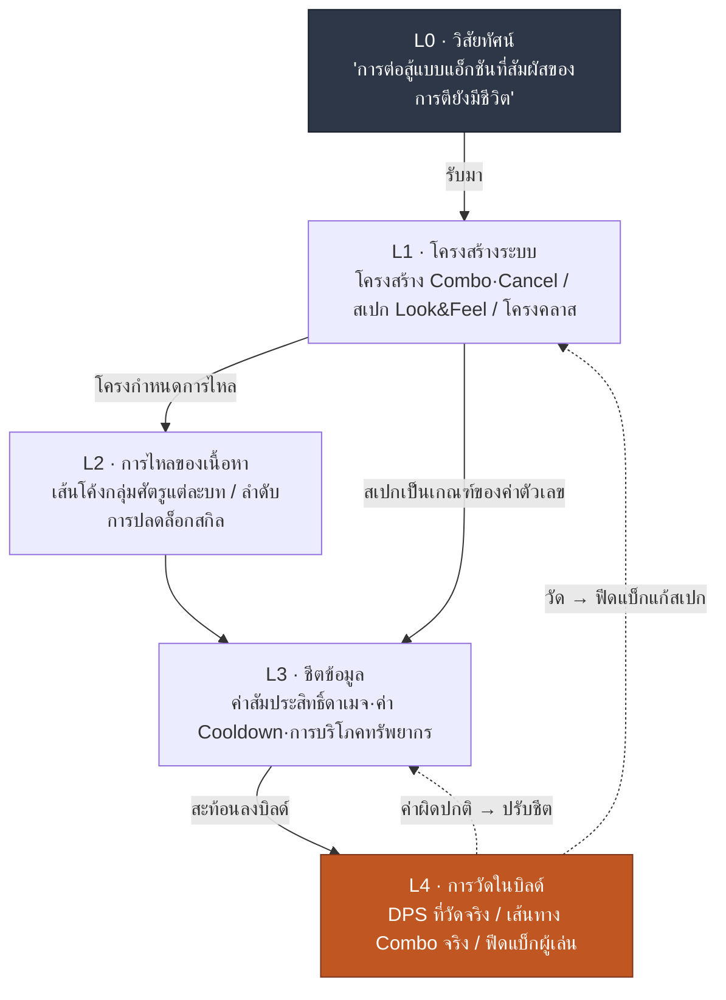

# 4.1 นักออกแบบการต่อสู้กับ Layer — สัมผัสของการตีอยู่ในช่องไหน

> **เป้าหมายการเรียนรู้ของบทนี้** (ระดับความยาก 🟡 ภาคปฏิบัติ · ความรู้พื้นฐานที่ต้องมี: การบวกลบคูณหาร·การคำนวณในตาราง): สามารถแยกย่อยคำคุณศัพท์เชิงนามธรรมอย่าง "สัมผัสของการตี" ออกมาเป็นสัญญาณที่วัดได้ และระบุเป็นพิกัดได้ว่าผลงานทั้งห้าอย่างของนักออกแบบการต่อสู้นั่งอยู่ในช่องไหนของ Layer

ห้องประชุมบิลด์ โปรแกรมเมอร์เปิดสกิลใหม่ที่เพิ่งต่อเข้าไปขึ้นบนมอนิเตอร์ ตัวละครเหวี่ยงดาบ ศัตรูกระเด็นถอยหลัง มีห้าคนนั่งดูอยู่ ใครคนหนึ่งเอ่ยขึ้น

"อืม… ทำไมสัมผัสของการตีมันอ่อนไปนิดนะ"

คนข้าง ๆ พยักหน้า "ใช่ครับ จืด ๆ ไปหน่อย"

โปรแกรมเมอร์ถาม "ต้องแก้ตรงไหนอย่างไรครับ"

ความเงียบ ในห้าคนที่อยู่ในห้องประชุมนี้ ไม่มีใครตอบคำถามนั้นเป็นตัวเลขได้ "สัมผัสของการตีมันอ่อน" เป็นสิ่งที่ทั้งห้าคนรู้สึกได้ แต่คนที่พูดได้ว่า "ปรับ hit stop จาก 3 เฟรมเป็น 5 เฟรม" กลับไม่มีสักคน การประชุมดำเนินไป 40 นาที โดยโยนคำคุณศัพท์อย่าง "ให้หนักแน่นกว่านี้อีกหน่อย" "อิมแพกต์ยังไม่พอ" ไปมา แล้วก็จบลงด้วย "เอาเป็นว่าไว้ดูกันใหม่ในบิลด์หน้านะ"

ฉากนี้บีบอัดปัญหาทั้งหมดของงานออกแบบการต่อสู้ไว้ มันเป็นแขนงที่ผู้เล่นสัมผัสได้โดยตรงที่สุด แต่พอจะถ่ายทอดสัมผัสนั้นออกมาเป็นคำพูด ก็เหลือแค่คำคุณศัพท์ คำคุณศัพท์วัดไม่ได้ และเมื่อวัดไม่ได้ ก็ปรับไม่ได้ งานแรกของนักออกแบบการต่อสู้คือการดึงคำคุณศัพท์เหล่านี้ลงมาเป็นตัวเลข

บทนี้กำหนดว่าตัวเลขนั้นเข้าไปอยู่ในช่องไหน ผลงานทั้งห้าอย่างที่นักออกแบบการต่อสู้สร้างขึ้น แต่ละอย่างนั่งอยู่ที่ตรงไหนของ Layer และทำไมพิกัดนั้นจึงกลายเป็นเงื่อนไขเบื้องต้นของการทำงานอัตโนมัติ เครื่องมือภาคปฏิบัติของ 4.2·4.3·4.4 ล้วนขับเคลื่อนอยู่บนพิกัดนี้

> **สรุปหนึ่งบรรทัดสำหรับผู้ที่ไม่ได้อยู่ในสายงานนี้** ในส่วนนี้คุณไม่จำเป็นต้องท่องค่าตัวเลขการต่อสู้หรือหน่วยเฟรม สิ่งเดียวที่คุณควรนำติดตัวไปคือสิ่งนี้ — **"คำขอที่โยนกันไปมาด้วยคำคุณศัพท์ ทั้งวัดและปรับไม่ได้"** แนวคิดที่ว่าทันทีที่ดึง "ให้หนักแน่นกว่านี้อีกหน่อย" ลงมาเป็น "ปรับอะไรให้เป็นเท่าไร" การทำงานร่วมกันก็เดินหน้าไปได้ ใช้ได้เหมือนกันกับฟีดแบ็กคลุมเครือของงานสายไหนก็ตามนอกวงการเกม ผลงานทั้งห้าอย่างใน 4.1.1 คุณอ่านผ่าน ๆ ได้ แล้วกุมเอาเพียงสิ่งเดียวนี้ไว้ในมือก็เพียงพอ

---

## 4.1.1 ห้าสิ่งที่อยู่บนโต๊ะทำงานของนักออกแบบการต่อสู้

หากรวบผลงานที่นักออกแบบการต่อสู้รับผิดชอบไว้ในบรรทัดเดียว ก็คือ "กระบวนการทั้งหมดที่อินพุตของผู้เล่นถูกแปลงเป็นแอ็กชันบนหน้าจอ" เราจะแยกสิ่งนี้ออกเป็นห้าก้อน

**ก้อนที่หนึ่ง สเปก Look & Feel ของการต่อสู้** เป็นเอกสารที่แปลความเชิงนามธรรมอย่างสัมผัสของการตี·การตอบสนอง·น้ำหนัก ให้เป็นค่าตัวเลขที่วัดได้ นี่เป็นผลงานที่ยากที่สุดของแขนงนี้ และเป็นเกณฑ์ในการประเมินอีกสี่อย่างที่เหลือ

Look & Feel ยังแยกย่อยออกได้อีกเป็นสี่สัญญาณ

- **Hit Timing** — นับจากจังหวะที่กดปุ่มอินพุต ไปจนถึงตอนที่ปฏิกิริยาทางสายตา·เสียงปรากฏบนหน้าจอ ใช้เวลากี่ ms
- **Hit Stop** — ในเสี้ยววินาทีที่การตีเข้าเป้า หน้าจอหยุดนิ่งกี่เฟรม (โดยทั่วไป 1\~6 เฟรม)
- **Camera Shake** — แอมพลิจูด·ระยะเวลา·เส้นโค้งการลดทอน
- **การซิงก์เอฟเฟกต์** — VFX·SFX·ปฏิกิริยา UI ถูกทริกเกอร์ในเฟรมเดียวกันหรือไม่

ถ้าไม่มีสเปกนี้ ฉากในห้องประชุมก็จะวนซ้ำ ถ้ามีสเปก ก็จะมีคำสั่งปรับออกมาว่า "Hit Stop 3→5 เฟรม แอมพลิจูด Camera Shake +20%"

**ก้อนที่สอง ระบบสกิล·Combo·Cancel** เป็นกฎที่อินพุตถูกแปลงเป็นแอ็กชัน

- ลำดับการใช้สกิล: อินพุต → ร่าย (cast) → เริ่มทำงาน → ดีเลย์ตอนจบ (recovery)
- กฎ Combo: หลังจากสกิลไหนต่อด้วยสกิลไหน และโบนัสคืออะไร
- กฎ Cancel: ระหว่างแอ็กชันใดสามารถ Cancel ไปเป็นแอ็กชันใดได้บ้าง
- Input Queue: หน้าต่างเวลา (ms) ที่รับอินพุตถัดไประหว่างแอ็กชันมีค่าเท่าไร

**ก้อนที่สาม AI ของตัวละคร·มอนสเตอร์** ลอจิกพฤติกรรมของ NPC — Behavior Tree (ต่อไปเรียก BT) สเตตแมชชีน (FSM (Finite State Machine, เครื่องสถานะจำกัด)/HFSM) ตารางการตัดสินใจ (decision table) แพตเทิร์นพฤติกรรมมอนสเตอร์ การเปลี่ยนเฟสบอส การทำงานร่วมกันของ NPC เพื่อน การจำลองฝูง (flocking) ล้วนอยู่ในก้อนนี้

**ก้อนที่สี่ สูตรดาเมจ·ทรัพยากร·Cooldown** เป็นคณิตศาสตร์ที่ตัวเลือกของผู้เล่นถูกแปลงเป็นผลลัพธ์ ค่าสัมประสิทธิ์ดาเมจ·การลดทอนจากการป้องกัน·คริติคอล·การปรับตามธาตุ การบริโภค·เส้นโค้งการฟื้นคืนของทรัพยากร (MP/พลังภายใน/สแตมินา) การกระจาย Cooldown

**ก้อนที่ห้า สเปกควบคุมแอนิเมชัน** เป็นแบบพิมพ์เขียวที่กำหนดว่าเจตนาในการออกแบบจะปรากฏอย่างไรในบิลด์จริง — แอนิเมชันกราฟ·BT·การเชื่อม IK โดยทั่วไปนี่เป็นงานที่ทำร่วมกับโปรแกรมเมอร์·แอนิเมเตอร์ แต่ถ้านักออกแบบเกมไม่ส่งมอบสเปกของเจตนา เจตนาก็จะพังในบิลด์ ถ้าโยนแต่วัสดุไปโดยไม่ให้แบบพิมพ์เขียว ก็จะได้บ้านอีกหลังที่ไม่ใช่ที่ตั้งใจ

จุดสำคัญตรงนี้คือ **ห้าสิ่งนี้มาเจอกันบนโต๊ะเดียวกัน** ถ้ากฎ Combo (ก้อนที่สอง) เปลี่ยน DPS ของสูตรดาเมจ (ก้อนที่สี่) ก็เปลี่ยน และนั่นก็ไปเปลี่ยนน้ำหนักที่รู้สึกได้ของ Look & Feel (ก้อนที่หนึ่ง) อีกที ถ้าไม่ระบุไว้ชัดว่าผลงานไหนเป็นอินพุตของผลงานไหน การเปลี่ยนเพียงครั้งเดียวก็สั่นสะเทือนถึงห้าจุด ด้วยเหตุนี้จึงต้องมีพิกัด

---

## 4.1.2 ผลงานทั้งห้าอย่างนั่งอยู่ในช่องไหนของ Layer

เราจะวางผลงานการต่อสู้ทั้งห้าลงบนพิกัด L0\~L4 ที่จับไว้ใน 2.3 การแมปนี้คือกระดูกสันหลังของบทนี้



หากเรียบเรียงใหม่เป็นตารางจะได้ดังนี้

| Layer | ผลงานของงานออกแบบการต่อสู้ | ความถี่ในการเปลี่ยน |
|---|---|---|
| L0 | (รับมา — วิสัยทัศน์: "การต่อสู้แบบแอ็กชันที่สัมผัสของการตียังมีชีวิต") | แทบคงที่ |
| L1 | โครงสร้าง Combo·Cancel / สเปก Look & Feel / โครงคลาส | ช้า |
| L2 | เส้นโค้งความก้าวหน้าของกลุ่มศัตรูแต่ละบท / การไหลของการปลดล็อกสกิล | ปานกลาง |
| L3 | ชีตค่าสัมประสิทธิ์ดาเมจของสกิล, ค่า Cooldown, การบริโภคทรัพยากร | เร็ว |
| L4 | DPS ที่วัดจริงในบิลด์, เส้นทาง Combo ที่ทำได้จริง, ฟีดแบ็กผู้เล่น | ทุกบิลด์ |

ลักษณะเด่นของงานออกแบบการต่อสู้คือ **สัดส่วน L4 ใหญ่กว่าแขนงอื่น ๆ** สำหรับงานออกแบบเนื้อเรื่อง สเปก L1 แทบจะเท่ากับฉบับสุดท้ายในตัว แต่การต่อสู้ต่างออกไป "สัมผัสของการตีดี" เป็นพื้นที่ที่ต้องลงมือตีในบิลด์จริงและดูหน้าจอเองเท่านั้นจึงจะรู้ได้ แม้จะเขียนในสเปกว่า "Hit Stop 5 เฟรม" แต่ว่ามันรู้สึกหนักแน่นจริงหรือไม่ จะยืนยันได้แค่ที่ L4 เท่านั้น ด้วยเหตุนี้เครื่องมือจำลอง (simulation) และการวัดอัตโนมัติจึงสร้างคุณค่าได้มากที่สุดในแขนงนี้ (4.4)

อย่างไรก็ตาม การที่ L4 ใหญ่ไม่ได้แปลว่า L1 สำคัญน้อยลง ดูลูกศรเส้นประให้ดี ค่าที่วัดได้ของ L4 จะป้อนกลับเข้าสู่สเปก L1 ถ้าไม่มีสเปก ค่าที่วัดได้ก็จะสูญเสีย "เกณฑ์ในการเปรียบเทียบ" ต้องมีสเปก 5 เฟรมก่อน จึงจะมีคำวินิจฉัยออกมาว่า "วัดจริงได้ 4 เฟรม ขาดไป 1 เฟรม" วัฏจักร สเปก → บิลด์ → วัด → แก้สเปก เดินผ่านทั้งห้า Layer ครบ นักออกแบบการต่อสู้เป็นตำแหน่งที่วางมือไว้บนวัฏจักรนี้ทั้งกระบวนการ เป็นที่นั่งซึ่งมี Layer หมุนพร้อมกันมากที่สุดบนโต๊ะเดียว

---

## 4.1.3 เปลี่ยนคำคุณศัพท์ให้เป็นตัวเลข — กระดูกสันหลังหนึ่งของงานจริง

ทฤษฎีเชิงนามธรรมจบลงตรงนี้ ทีนี้จะกลับไปที่ฉากในห้องประชุม แล้วดูกระบวนการดึง "สัมผัสของการตีอ่อน" ลงมาเป็นตัวเลขจริง ๆ ผ่านบันทึกเซสชันจริง (worked transcript — บันทึกการทำงานจริงกับ AI ทั้งพรอมต์และผลลัพธ์) เครื่องมือคือ LLM เพียงตัวเดียว ผลลัพธ์ไม่ได้ขัดเกลา และส่วนที่คนปฏิเสธก็เก็บไว้ตามเดิม

ผู้เขียนจะเรียบเรียงใหม่จากการไหลจริงของการกำหนดสเปก Look & Feel ของสกิลระยะประชิดใหม่หนึ่งตัว ใน TF การต่อสู้ของโปรเจกต์ MMORPG หนึ่ง (ต่อไปเรียก "โปรเจกต์ A") ที่ผู้เขียนบริหารในฐานะ Director

### พรอมต์ (เต็ม)

```
ช่วยเปลี่ยน Look & Feel ของสกิลนี้จากคำคุณศัพท์ให้เป็นค่าตัวเลขหน่วย ms·เฟรมหน่อย
ห้าหัวข้อ ได้แก่ hit timing, hit stop, camera shake, การซิงก์เอฟเฟกต์, ดีเลย์ตอนจบ
อันไหนไม่มั่นใจ ให้เขียนกำกับว่า "ต้องตรวจสอบในเกมนี้"

สกิล: ฟันลงตรงด้วยดาบใหญ่ (heavy_overhead_slash)
เจตนา: "ฟันลงอย่างหนักแน่น ให้รู้สึกว่าศัตรูเสียหลัก"
เฟรมเรต: 60fps
```

### ผลลัพธ์ดิบจาก Claude (ไม่สรุป·ไม่เรียบเรียง)

> "ความหนักแน่น" ของการฟันลงตรงด้วยดาบใหญ่ ถูกสร้างขึ้นจาก **ความยาวของ hit stop และดีเลย์ตอนจบ** เป็นหลัก และจาก **การลดทอนของ camera shake** ขอเสนอแยกเป็นรายหัวข้อ
>
> **1) Hit Timing** ยิ่งเป็นอาวุธหนัก ดีเลย์ตอนเริ่ม (startup) จากอินพุต→เริ่มทำงานยิ่งต้องยาว น้ำหนักจึงจะมีชีวิต แนะนำ **50\~80ms** (3\~5 เฟรม) จากอินพุตไปจนถึงปฏิกิริยาทางสายตาแรก (ตัวละครเริ่มยกดาบขึ้น) แต่ปฏิกิริยา *ทางสายตา* แรก กับปฏิกิริยา *การตีโดน* แรก เป็นคนละอย่างกัน เวลาจนถึงตอนตีเข้าเป้าขึ้นอยู่กับความยาวของโมชัน จึงฟันธงตรงนี้ไม่ได้ — **ต้องตรวจสอบด้วยความยาวโมชันของเกมนี้**
>
> **2) Hit Stop** เป็นตัวแปรหลักของการโจมตีหนักแน่น ถ้าการโจมตีเบาอยู่ที่ 1\~2 เฟรม การฟันลงตรงด้วยดาบใหญ่แนะนำ **4\~6 เฟรม** (ราว 67\~100ms) ถ้าเกิน 6 เฟรม "ความหนักแน่น" จะข้ามไปเป็น "การกระตุก" ทำให้การตอบสนองแย่ลง
>
> **3) Camera Shake** แอมพลิจูดราว 1\~2% ของความสูงหน้าจอ ระยะเวลา 0.2\~0.3 วินาที การลดทอนใช้ **ease-out (อ่อนลงอย่างรวดเร็ว)** มากกว่าแบบเชิงเส้น การโจมตีหนักจะเป็นธรรมชาติเมื่อเป็นเส้นโค้งที่การสั่นครั้งแรกแรงและจางหายไปอย่างรวดเร็ว
>
> **4) การซิงก์เอฟเฟกต์** VFX (เอฟเฟกต์การตี)·SFX (เสียงการตี)·hit stop **ต้องถูกทริกเกอร์เหมือนกันในเฟรมที่ตีเข้าเป้าเสมอ** แค่คลาดเคลื่อนไป 1\~2 เฟรมก็จะรู้สึกได้เป็น "ความจืด" ปฏิกิริยา UI (ตัวเลขดาเมจ) ช้าไป 1\~2 เฟรมไม่เป็นไร
>
> **5) ดีเลย์ตอนจบ** ค่าที่ต้องจ่ายเพื่อความหนักแน่นคือดีเลย์ตอนจบที่ยาว แนะนำ **20\~30 เฟรม** (333\~500ms) นับจากตีเข้าเป้าจนกลับมารับการโจมตีได้ แต่ค่านี้เปลี่ยนแปลงไปมากตามจังหวะการต่อสู้โดยรวมของเกม (แอ็กชันเร็ว vs แนวโซลที่หนักแน่นจริงจัง) — **ต้องตรวจสอบที่จังหวะมาตรฐานของเกมนี้**
>
> สรุปแล้ว "ความหนักแน่น = ดีเลย์ตอนเริ่มยาว + hit stop 4\~6 เฟรม + camera shake แบบ ease-out + VFX/SFX/stop ในเฟรมเดียวกัน + ดีเลย์ตอนจบยาว" อย่างไรก็ตาม ตัวเลขข้างต้นเป็นช่วงคำแนะนำทั่วไป ส่วน **น้ำหนักจริงต้องลงมือตีในบิลด์และปรับจึงจะสรุปได้**

### การตรวจสอบ·ปฏิเสธ·ขอใหม่ของคน

ตรงนี้นักออกแบบเกมไม่รับผลลัพธ์ทั้งก้อน เขาหยุดที่สองจุด

**ปฏิเสธ 1 — แอมพลิจูด camera shake "1\~2% ของความสูงหน้าจอ"** เกมนี้ให้มือถือมาก่อน บนหน้าจอเล็ก 1\~2% แทบมองไม่เห็น ทั้งยังมีปัญหาอาการเมาบนมือถืออีก นักออกแบบเกมปฏิเสธค่าแนะนำนี้ และนำหลักการของตัวเองมาใช้ว่า "บนมือถือจะเน้น hit stop แทน shake เพื่อสื่อถึงน้ำหนัก" LLM ให้แค่ทฤษฎีทั่วไป มันไม่รู้ข้อจำกัดของแพลตฟอร์มในเกมนี้

**ระงับ 2 — hit stop "4\~6 เฟรม"** อันนี้ไม่ใช่การปฏิเสธ แต่เป็นการพักไว้ ในแง่ช่วงค่าถือว่าถูก แต่ค่าที่แม่นยำจะกำหนดในบิลด์ด้วยสัมผัสมือ ในสเปกจะเขียนว่า "ใส่ 4 เฟรมเป็นค่าตั้งต้นลงในบิลด์ แล้วทำตัวแปร 5·6 เฟรมขึ้นมา เปรียบเทียบทั้งสามด้วยมือ"

การขอใหม่ออกไปแบบนี้

```
นี่เป็นโปรเจกต์ที่ให้มือถือมาก่อน ให้ลด camera shake ให้น้อยที่สุด
แล้วเขียนสเปกใหม่ในทิศทางที่ใช้ hit stop·ดีเลย์ตอนจบ·SFX สื่อถึงน้ำหนัก
ทำ hit stop เป็นสามตัวแปร 4/5/6 เฟรม เป็นตารางสำหรับเปรียบเทียบในบิลด์
```

ในผลลัพธ์ครั้งที่สองนี้ LLM สร้างตารางสเปกที่สะท้อนข้อจำกัดของมือถือ ตารางนั้นเข้าสู่บิลด์ และในการประชุมบิลด์ครั้งถัดมา นักออกแบบเกมพูดแทนคำคุณศัพท์ว่า "ตัวแปร 4 เฟรมเบาเกินไป เลือก 5 เฟรม" การประชุม 40 นาทีหดเหลือเป็นการตัดสินใจ 5 นาที

### สิ่งที่บันทึกเซสชันนี้แสดงให้เห็น

มีสามอย่าง หนึ่ง LLM **สร้างร่างแรกที่ดึงคำคุณศัพท์ลงมาเป็นช่วงตัวเลข** ได้ดี — นี่ทลายความเงียบในห้องประชุม สอง LLM **ไม่รู้ข้อจำกัดของเกมนี้ (มือถือ·จังหวะ·ความยาวโมชัน)** — มันจึงให้แค่ค่าแนะนำทั่วไป ส่วนการปฏิเสธ·ปรับเป็นหน้าที่ของคน สาม LLM ตอกย้ำด้วยตัวเองถึงสองครั้งว่า "ต้องลงมือตีในบิลด์จึงจะสรุปได้" — แม้แต่เครื่องมือก็รู้ว่าการตัดสินขั้นสุดท้ายของน้ำหนักคือมือคนที่ L4

---

## 4.1.4 สี่ตำแหน่งที่ AI คืนค่าของการนำมาใช้

บันทึกเซสชันข้างต้นแสดงเพียงตำแหน่งเดียว (การกำหนดสเปก) ในงานออกแบบการต่อสู้ทั้งหมด ตำแหน่งที่ AI สร้างคุณค่ามีอยู่สี่แห่ง

**1) การจำลอง — คุณค่าใหญ่ที่สุด** คำนวณเส้นโค้ง DPS (Damage Per Second, ดาเมจต่อวินาที)·เส้นทาง Combo·การบริโภคทรัพยากรไว้ล่วงหน้าโดยไม่ต้องมีบิลด์ เร็วกว่าการสร้างบิลด์แล้ววัดด้วยมืออย่างเทียบกันไม่ได้ ใน 4.4 จะลงมือทำกับตัวจำลอง `simulate_dps` โดยตรง

**2) การสร้างสเตตแมชชีน·BT อัตโนมัติ** แปลงคำอธิบายเป็นภาษาธรรมชาติอย่าง "บอสตัวนี้จะคลั่งเมื่อพลังชีวิตต่ำกว่า 50% และระหว่างคลั่งจะใช้แพตเทิร์น 3 ทีติด" ให้เป็นไดอะแกรม BT/FSM ความแม่นยำสูง — โครงสร้างกฎเป็นพื้นที่ที่ LLM จัดการได้ดี ประหยัดเวลาในการย้ายลอจิกในหัวออกมาเป็นภาพ

**3) การวิเคราะห์บันทึกจากบิลด์โดยอัตโนมัติ** สกัด hit timing·อัตราความสำเร็จของ Combo·การกระจายความเสียหายออกมาจากคลิปการเล่นโดยอัตโนมัติ แต่ว่านี่เป็น **ตำแหน่งที่ความยากในการ implement สูงที่สุด** (จะพิจารณาอย่างตรงไปตรงมาด้านล่าง)

**4) การเสนอตัวเลือกในการปรับสมดุล** วิเคราะห์แต่ละแถวของชีตข้อมูลเพื่อตรวจหาค่าผิดปกติ·ความไม่ราบเรียบของเส้นโค้ง แล้วเสนอตัวเลือกในการปรับ คนแค่เลือกเท่านั้น

ในสี่ตำแหน่งนี้ การวิเคราะห์บันทึกจากบิลด์โดยอัตโนมัติ (3) มีระยะห่างระหว่าง "ทำได้" กับ "ทำได้ง่าย" ไกลที่สุด ในหนังสือมักเขียนกันว่า "AI ดึงทุกอย่างออกมาจากคลิปวิดีโอให้โดยอัตโนมัติ" แต่ในความเป็นจริงไม่ได้ง่ายขนาดนั้น คอมพิวเตอร์วิทัศน์ที่อิงพิกเซลในวิดีโอ, vision API สำเร็จรูป, บันทึก telemetry ในเกม — การเปรียบเทียบความแม่นยำ·ภาระในการ implement ของสามวิธีจับข้อมูลนี้ **4.4 เป็นฉบับหลัก จึงให้ไปอ้างอิงที่นั่น** ตรงนี้จะชี้แค่ข้อสรุป

เส้นทางที่สมจริงที่สุดคือ **บันทึก telemetry ในเกม** ทำให้เอนจินบันทึกอีเวนต์อย่าง "ที่เฟรม 1204 skill_overhead ตีเข้าเป้า, ดาเมจ 340, นับ Combo 3" ออกมาเองโดยตรง นี่เป็นข้อมูลต้นทางจึงแม่นยำ และจบในการแทรกโค้ดการบันทึกเพียงครั้งเดียว LLM ใช้ในการอ่านบันทึกนั้นแล้วสรุปเป็นรายงานภาษาธรรมชาติ ("จนถึง 3 Combo ประสิทธิภาพทรัพยากรดี แต่ตั้งแต่ 4 Combo ลดลงฮวบ") ส่วนวิดีโอเก็บไว้เป็นตัวเสริมให้คนตรวจด้วยตาเฉพาะเคสที่น่าสงสัยเท่านั้น

กล่าวคือ รูปแบบที่สมจริงของวิสัยทัศน์ "AI วิเคราะห์วิดีโออัตโนมัติ" คือ **บันทึก telemetry + การสรุปด้วย LLM** ไม่ใช่ pixel vision การแยกแยะอย่างตรงไปตรงมานี้เป็นจุดตั้งต้นของการเลือกเครื่องมือใน 4.4

และมีสิ่งหนึ่งที่ไม่เปลี่ยนในทั้งสี่ตำแหน่ง **การตัดสินขั้นสุดท้ายว่า "สัมผัสของการตีดี" AI ทำไม่ได้** นั่นเป็นพื้นที่ของอารมณ์ผู้เล่น และความรับผิดชอบต่ออารมณ์นั้นเป็นของคน AI แค่สร้าง **ข้อมูลที่เป็นหลักฐาน** ของการตัดสินทางอารมณ์นั้นให้อย่างรวดเร็วเท่านั้น ค่าจากการจำลอง, ไดอะแกรม BT, รายงาน telemetry — ล้วนเป็นวัตถุดิบเพื่อให้คนตัดสินใจด้วยสัมผัสมือ

---

## 4.1.5 เหตุผลที่แท้จริงในการแบ่งพิกัด — เงื่อนไขเบื้องต้นของการทำงานอัตโนมัติ

ที่ผ่านมานี้เป็นเหตุผลผิวเผินว่า "ถ้าแบ่งผลงานออกเป็น Layer เวลาทำงานร่วมกันจะคุยกันรู้เรื่อง" ที่อธิบายไว้ว่าวางกฎ Combo ไว้ที่ L1 และชีตดาเมจไว้ที่ L3 เพราะความถี่ในการเปลี่ยนต่างกัน เป็นคำที่ถูกต้อง แต่นั่นไม่ใช่ทั้งหมด

เหตุผลเชิงสาระในการแบ่งพิกัดคือ **การทำงานอัตโนมัติทำงานได้บนพิกัดนั้นเท่านั้น** ประเด็นทั่วไปที่ว่าการแยกย่อย Layer เป็นเงื่อนไขเบื้องต้นของการสร้างแบบโพรซีเดอรัล·การทำงานอัตโนมัตินั้น ได้กล่าวไว้แล้วใน 2.3 ตรงนี้จะแคบลงมาดูว่าเงื่อนไขเบื้องต้นนั้นแยกออกอย่างไรในการทำงานอัตโนมัติสามอย่างของแขนงการต่อสู้

**ก้อนที่หนึ่ง การจำลองจะทำงานได้ก็ต่อเมื่อแยก "อะไรที่ป้อนเข้าไปได้ และอะไรที่เปลี่ยนได้" ออกจากกัน** ถ้าคอร์เชิงกำหนด (ฟิสิกส์·Hitbox — โครง L1) กับสเปกที่เปลี่ยนได้ (ค่าดาเมจ·Cooldown — ชีต L3) ปนกัน ตัวจำลองก็จะนิยาม "พื้นที่ของตัวเลือกที่จะเปลี่ยน" ไม่ได้ คอร์คงที่ ชีตเป็นตัวแปร — ต้องมีการแยกนี้ก่อน `simulate_dps` จึงจะทำการค้นหาอย่าง "ค่อย ๆ ดันค่าสัมประสิทธิ์ดาเมจจาก 280 ไปจนถึง 340 ทีละ 20 แล้ววาดเส้นโค้ง DPS"

**ก้อนที่สอง การวิเคราะห์บันทึกจากบิลด์โดยอัตโนมัติจะมีความหมายก็ต่อเมื่อ atom ของแอ็กชันถูกติดป้าย (labeling)** ต้องมี atom ที่ติดป้ายไว้ในระดับสเปกว่า "ช่วงเฟรมนี้คือสเตจ hit ของ `skill_overhead`" เสียก่อน จึงจะสามารถนำสัญญาณที่สกัดจากบันทึก telemetry มาเทียบกับสเปกโดยอัตโนมัติได้ ถ้าไม่มีป้าย บันทึกก็เป็นแค่การเรียงต่อกันของจุดที่ไร้ความหมายว่า "ที่เฟรม 1204 มีบางอย่างตีเข้าเป้า"

**ก้อนที่สาม การสร้างลำดับ Combo ด้วย LLM จะทำงานได้ก็ต่อเมื่อกฎ Cancel·Input Queue ถูกแยกออกมาเป็นเอกสารภายนอก** คำขอแบบจำกัดอย่าง "เสนอลำดับ 5 Combo มา 10 ชุด จากคู่ที่ Cancel ได้ 7 คู่ของตัวละครนี้ ภายใน Input Queue 200ms" จะเป็นไปได้ก็ต่อเมื่อกฎ Cancel ไม่ได้ฝังตายอยู่ในโค้ด แต่ถูกแยกออกมาเป็นเอกสารเท่านั้น

ทั้งสามก้อนพูดประโยคเดียวกัน **ถ้าคอร์เชิงกำหนดปนกับสเปก การทำงานอัตโนมัติจะตัน ถ้าแยกออก การทำงานอัตโนมัติจะเปิด** การแยกย่อย Layer มีการทำให้ภาษาการทำงานร่วมกันเป็นหนึ่งเดียวเป็นจุดประสงค์ผิวเผิน ส่วนจุดประสงค์เชิงสาระคือการปูเงื่อนไขเบื้องต้นของการจำลองอัตโนมัติ·การวิเคราะห์ข้อมูลที่จับมา·การค้นหาลำดับด้วย LLM

### จากการประยุกต์แบบอนุรักษ์นิยมสู่การประยุกต์แบบก้าวหน้า

เมื่อปูเงื่อนไขเบื้องต้นนี้แล้ว การดำเนินงานการต่อสู้จะวิวัฒน์เป็นสองขั้น

**การประยุกต์แบบอนุรักษ์นิยม — คนออกแบบ ระบบอัตโนมัติตรวจสอบ** ตอนนี้การดำเนินงานการต่อสู้ของเกมแอ็กชัน·MMORPG ส่วนใหญ่อยู่ตรงนี้ เมื่อคนเขียนสเปก Combo·Cancel ด้วยตัวเอง ระบบอัตโนมัติก็จำลอง DPS·ทรัพยากร และจับด้วย telemetry แล้วออกรายงานเปรียบเทียบ "สเปก vs ค่าที่วัด" คนตีความความต่างนั้นแล้วตัดสินใจแก้สเปก แล้วก็กลับไปที่การเขียนสเปก วัฏจักรหมุนอีกครั้ง การออกแบบเป็นของคน ส่วนการจำลอง·การจับ·การเปรียบเทียบเป็นของระบบอัตโนมัติ

**การประยุกต์แบบก้าวหน้า — AI เสนอตัวเลือก คนแค่เลือกใช้** เป็นขั้นถัดไป AI แจกแจงลำดับออกมา 10\~30 ชุดโดยอัตโนมัติภายในคู่ Cancel และ Input Queue ระบบอัตโนมัติจำลอง DPS·ทรัพยากรของแต่ละลำดับแบบขนาน และ LLM ติดอันดับ·การตีความให้ในรูปแบบ "ประสิทธิภาพทรัพยากรอันดับ 1, ความยากในการอินพุตปานกลาง" การตัดสินใจที่เหลืออยู่ในมือคนมีแค่ "จะเลือกลำดับไหนในบรรดาตัวเลือกมาเป็นซิกเนเจอร์" หนึ่งเดียว กับการตัดสินใจสะท้อนลงบิลด์·การจับโมชันของ Director เท่านั้น การสร้างลำดับจากศูนย์ กับการเลือกจาก 30 ชุด มีมิติของภาระงานต่างกัน

การที่การประยุกต์แบบก้าวหน้าจะตั้งหลักได้ ต้องมีพร้อมสามอย่าง (1) โครงสร้างพื้นฐานการจำลองเชิงกำหนดที่คำนวณ DPS·ทรัพยากร·เวลารอดได้ภายใน 1 วินาทีโดยไม่ต้องมีบิลด์ (2) atom ของแอ็กชันที่ Combo·Cancel·Input Queue ถูกแยก·ติดป้ายเป็นเอกสารภายนอก (3) การวิเคราะห์ข้อมูลที่จับมาอัตโนมัติบนฐาน telemetry ทั้งสามอย่างล้วนเป็นผลลัพธ์โดยตรงของการแยกย่อย Layer ที่กล่าวมาข้างต้น

### การจับโมชันเป็นขั้นที่ย้อนกลับไม่ได้ — ด่านการตัดสินใจ

สุดท้ายคือเรื่องความย้อนกลับได้ ในวัฏจักรการตรวจสอบของนักออกแบบการต่อสู้ มีทั้งขั้นที่ย้อนกลับได้และย้อนกลับไม่ได้ปนกันอยู่ และการรู้เส้นแบ่งนั้นเป็นเรื่องสำคัญ

<svg viewBox="0 0 720 230" xmlns="http://www.w3.org/2000/svg" font-family="sans-serif">
  <rect x="0" y="0" width="720" height="230" fill="#fbfbfb"/>
  <text x="20" y="30" font-size="15" font-weight="bold" fill="#1a202c">ย้อนกลับได้ ──────────────────▶ ด่านการตัดสินใจ ──────▶ ย้อนกลับไม่ได้</text>

  <!-- 가역 단계 박스들 -->
  <rect x="20" y="55" width="150" height="44" rx="6" fill="#c6f6d5" stroke="#2f855a"/>
  <text x="95" y="78" font-size="12" text-anchor="middle" fill="#22543d">แก้สเปก</text>
  <text x="95" y="93" font-size="12" text-anchor="middle" fill="#22543d">Combo·Cancel</text>

  <rect x="20" y="110" width="150" height="44" rx="6" fill="#c6f6d5" stroke="#2f855a"/>
  <text x="95" y="133" font-size="12" text-anchor="middle" fill="#22543d">รันจำลอง·รายงาน</text>
  <text x="95" y="148" font-size="11" text-anchor="middle" fill="#22543d">(ทิ้งผลได้อิสระ)</text>

  <rect x="20" y="165" width="150" height="44" rx="6" fill="#c6f6d5" stroke="#2f855a"/>
  <text x="95" y="188" font-size="12" text-anchor="middle" fill="#22543d">ปรับค่าตัวเลข</text>
  <text x="95" y="203" font-size="12" text-anchor="middle" fill="#22543d">ในชีตข้อมูล</text>

  <!-- 부분 가역 -->
  <rect x="220" y="110" width="160" height="44" rx="6" fill="#feebc8" stroke="#c05621"/>
  <text x="300" y="133" font-size="12" text-anchor="middle" fill="#7b341e">สะท้อนลงบิลด์ (พัฒนา)</text>
  <text x="300" y="148" font-size="11" text-anchor="middle" fill="#7b341e">ย้อนกลับได้บางส่วน</text>

  <!-- 게이트 -->
  <line x1="430" y1="40" x2="430" y2="215" stroke="#e53e3e" stroke-width="2.5" stroke-dasharray="6 4"/>
  <text x="430" y="225" font-size="12" text-anchor="middle" fill="#e53e3e" font-weight="bold">ด่านการตัดสินใจ</text>

  <!-- 비가역 -->
  <rect x="480" y="80" width="210" height="48" rx="6" fill="#fed7d7" stroke="#c53030"/>
  <text x="585" y="103" font-size="12" text-anchor="middle" fill="#742a2a">การจับโมชัน (แอ็กชันซิกเนเจอร์)</text>
  <text x="585" y="119" font-size="11" text-anchor="middle" fill="#742a2a">ค่าสตูดิโอ·นักแสดง·ถ่ายซ้ำ</text>

  <rect x="480" y="140" width="210" height="48" rx="6" fill="#fed7d7" stroke="#c53030"/>
  <text x="585" y="163" font-size="12" text-anchor="middle" fill="#742a2a">สะท้อนลงบิลด์ (ไลฟ์)</text>
  <text x="585" y="179" font-size="11" text-anchor="middle" fill="#742a2a">ค่า hotfix·การรับรู้ของผู้ใช้เปลี่ยน</text>
</svg>

การจับโมชันเป็นขั้นที่ย้อนกลับไม่ได้ที่หนาที่สุดในการต่อสู้ ตารางคิวสตูดิโอจับภาพ การจ้างนักแสดง ค่าถ่ายซ้ำ ล้วนสูงทั้งสิ้น ด้วยเหตุนี้การจับโมชันของแอ็กชันซิกเนเจอร์จึงดำเนินการ **หลังจากที่การวิเคราะห์อัตโนมัติด้วยการจำลอง·การจับข้อมูลทำงานได้เพียงพอจนกำหนดลำดับเสร็จแล้ว** เท่านั้น ไม่ว่าจะแบบอนุรักษ์นิยมหรือก้าวหน้า ก็วางการจับโมชันกับจังหวะก่อนหน้าบิลด์ไลฟ์ไว้เป็นด่านการตัดสินใจ การตรวจสอบทั้งหมดของนักออกแบบการต่อสู้ต้องจบลงในขั้นที่ย้อนกลับได้ทางซ้ายของด่านนี้จึงจะปลอดภัย

---

## 4.1.6 ภาพในบริษัท — อะไรที่ลดลง

นี่เป็นความเปลี่ยนแปลงที่ TF การต่อสู้ของโปรเจกต์ A วัดได้จากการใช้พิกัดและเครื่องมือข้างต้นมา 6 เดือน ตัวเลขด้านล่างเป็นค่าเฉลี่ยคร่าว ๆ ที่ดึงจากบันทึกการดำเนินงานของ TF ไม่ใช่ค่าที่วัดอย่างละเอียด จึงอ่านเป็น **ทิศทางของความเปลี่ยนแปลงที่รู้สึกได้** จึงจะถูกต้อง

| หัวข้อ | ก่อนนำมาใช้ | หลังนำมาใช้ |
|---|---|---|
| เวลาประชุม Look & Feel | เฉลี่ย 2 ชั่วโมง (ถกอัตวิสัย) | เฉลี่ย 30 นาที (อิงค่าที่วัดได้) |
| การเขียนไดอะแกรม Combo | 1\~2 ชั่วโมง/ชุดสกิล | 10 นาที/ชุดสกิล |
| การตรวจสอบเส้นโค้ง DPS | วัดด้วยมือหลังบิลด์ (≈1 วัน) | จำลอง (≈10 นาที) |
| การปรับสมดุลสกิลใหม่ | 3\~4 รอบวัฏจักรบิลด์ | 1\~2 รอบวัฏจักรบิลด์ |

ทิศทางสำคัญกว่าตัวเลขเอง ทั้งสี่หัวข้อล้วนเคลื่อนจาก "ถกอัตวิสัย·วัดด้วยมือ·บิลด์ซ้ำ" ไปสู่ "ค่าที่วัดได้·จำลอง·ทำไดอะแกรมอัตโนมัติ" ในห้องประชุมคำคุณศัพท์ลดลง ตัวเลขเพิ่มขึ้น นั่นคือประโยคเดียวที่บททั้งบทต้องการจะพูด — งานของนักออกแบบการต่อสู้คือการสร้างสะพานที่เคลื่อนจากอัตวิสัย (สัมผัสของการตี·ความสนุก) ไปสู่ภววิสัย (ค่าตัวเลข·การจำลอง) และ AI คือเครื่องมือที่ปูสะพานนั้นได้อย่างรวดเร็ว ส่วนมือที่ตัดสินว่า "หนักแน่น" ที่ปลายสะพานยังคงเป็นของคนอยู่ดี

---

## สรุปประเด็นสำคัญของบท

- งานออกแบบการต่อสู้เป็นที่นั่งซึ่งมี Layer หมุนพร้อมกันมากที่สุดบนโต๊ะเดียว ตั้งแต่สเปก L1, ชีต L3, ไปจนถึงการวัดจริงในบิลด์ L4
- การแยกย่อย Layer มีการทำให้ภาษาการทำงานร่วมกันเป็นหนึ่งเดียวเป็นเปลือกนอก ส่วนสาระคือเงื่อนไขเบื้องต้นของการทำงานอัตโนมัติที่ได้แก่ การจำลอง·การจับข้อมูล·การค้นหาด้วย LLM
- การตัดสินขั้นสุดท้ายว่า "สัมผัสของการตีดี" เป็นหน้าที่ของคน ส่วน AI สร้างข้อมูลที่เป็นหลักฐานของการตัดสินนั้นได้อย่างรวดเร็ว

---

## ลองทำดู — ดึงคำคุณศัพท์ลงมาเป็นตัวเลข

**setup** มี LLM ตัวเดียวก็พอ เลือกสกิลหนึ่งที่อยู่ในมือคุณ (จะใหม่หรือเก่าก็ได้) เขียนเจตนาของสกิลนั้นเป็นคำคุณศัพท์หนึ่งบรรทัด — อย่าง "หนักแน่น" "ฉับไว" "ทื่อหนัก"

**prompt** เติมข้อมูลสกิลลงในโครงด้านล่าง

```
คุณคือผู้ช่วยงานออกแบบการต่อสู้ ให้แปลง Look & Feel ของสกิลด้านล่าง
ให้เป็น "สเปกค่าตัวเลขที่วัดได้" ไม่ใช่คำคุณศัพท์ แต่เป็นหน่วย ms·เฟรม·%
หัวข้อที่ไม่มั่นใจ ให้ระบุว่า "ต้องตรวจสอบในเกมนี้"

สกิล: [ชื่อ]
เจตนา: "[คำคุณศัพท์หนึ่งบรรทัด]"
เฟรมเรต: [60fps เป็นต้น]
หัวข้อ: 1)hit timing 2)hit stop 3)camera shake 4)การซิงก์เอฟเฟกต์ 5)ดีเลย์ตอนจบ
```

**verify** โยนคำถามสองข้อให้กับทุกตัวเลขในผลลัพธ์ (1) ภายใต้ข้อจำกัดของเกมนี้ (แพลตฟอร์ม·จังหวะ·ความยาวโมชัน) ค่านี้ถูกต้องไหม → ถ้าไม่ถูก ให้บอกข้อจำกัดแล้วขอใหม่ (2) ค่านี้ต้องกำหนดด้วยมือในบิลด์หรือไม่ → ถ้าใช่ ให้เขียนตัวแปร 2\~3 ตัวลงในสเปกแทนค่าเดียว แล้วเปรียบเทียบในบิลด์ หัวข้อที่ LLM ตอกย้ำว่า "ต้องตรวจสอบ" อย่ารับมาใช้ตามนั้นเด็ดขาด

## 4.1.7 ฉบับย่อสำหรับคนเดียว

ถ้าเป็นเกมที่ทำคนเดียว ไม่จำเป็นต้องมีผลงานทั้งห้า·Layer ทั้งห้าครบ ทำแค่สองอย่างขั้นต่ำพอ **หนึ่ง สเปก Look & Feel หนึ่งหน้า** — สำหรับแอ็กชันหลัก 3\~5 อย่าง ให้เขียนแค่ hit stop·ดีเลย์ตอนจบ·การซิงก์เป็นตัวเลข บันทึกที่เขียนด้วยคำคุณศัพท์ ตัวคุณเองในอีก 6 เดือนข้างหน้าก็จะอ่านไม่ออก **สอง แยก Combo·Cancel ออกจากโค้ดมาไว้เป็นไฟล์เดียว** — ถ้าดึงคู่ Cancel ออกมาเป็นข้อมูล ภายหลังก็สามารถให้ LLM "เสนอ 5 Combo ที่สร้างได้จากคู่นี้" ได้ สองอย่างนี้คือพิกัดขั้นต่ำที่เปิดประตูสู่การทำงานอัตโนมัติไว้แม้ในการพัฒนาคนเดียว
