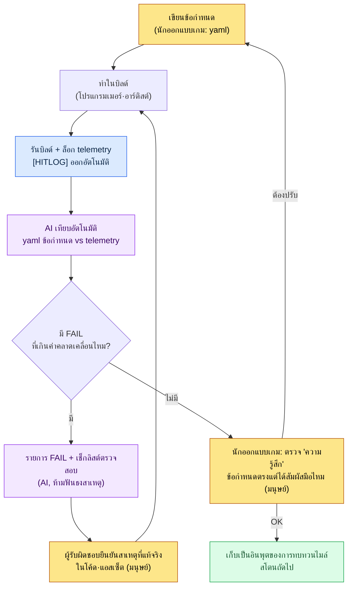

# 4.2 Look & Feel ของการต่อสู้ — จุดที่ใช้ข้อมูลจับ 'สัมผัสมือ'

หน้าจอมอนิเตอร์ในห้องประชุมมีคนยืนล้อมอยู่ห้าคน บิลด์เดียวกัน สกิลเดียวกัน วิดีโอความยาว 30 วินาทีคลิปเดิมกำลังเล่นวนซ้ำเป็นรอบที่สามบนจอ โปรแกรมเมอร์ฝั่งไคลเอนต์เอ่ยปากก่อน "ผมว่าโอเคนะ" คนดูแลฝั่งอาร์ตกอดอก "มันอ่อนไป รู้สึกเหมือนขาดอะไรไป" นักออกแบบเกมที่อยู่ข้าง ๆ แทรกขึ้นมา "เอฟเฟกต์ดีนะ แต่มันไม่ติดมือ" ผู้กำกับมองอยู่นานแล้วตัดสินใจ "อืม… เอาให้หนักแน่นขึ้นอีกนิดละกัน"

แล้วการประชุมก็จบลง 'หนักแน่นขึ้นอีกนิด' นั้นแม่นยำคือกี่ ms กี่เฟรม ไม่มีใครจดเอาไว้ ในบิลด์ถัดไปโปรแกรมเมอร์ก็สร้าง 'ความหนักแน่น' ตามที่ตัวเองเข้าใจ ส่วนฝั่งอาร์ตก็เติม 'ความหนักแน่น' ตามที่ตัวเองเข้าใจ แล้วสัปดาห์ถัดมาในห้องประชุมเดียวกันก็ดูวิดีโอเดียวกัน บทสนทนาเดิมก็วนซ้ำอีกครั้ง

ความรู้สึกของแรงปะทะ สัมผัสมือ Look & Feel — เป็นคำที่ถูกใช้บ่อยที่สุดและถูกนิยามไว้น้อยที่สุดในงานออกแบบการต่อสู้ ทุกคนเชื่อว่าตัวเองรู้ แต่นิยามในหัวของแต่ละคนแตกต่างกัน พอถกกันจบแล้วจึงไม่มีอะไรเหลือ บทนี้ว่าด้วยงานแยกย่อย 'ความรู้สึก' นั้นออกมาเป็นตัวเลขที่วัดได้ เป็นจุดที่ดึงสัมผัสมือลงมาจากนามธรรมสู่ข้อมูล

---

## 4.2.1 การต่อสู้ = Look & Feel, ระบบ = การทำงาน

ก่อนอื่นขอลากเส้นแบ่งเอาไว้ งานออกแบบการต่อสู้แบ่งใหญ่ ๆ ได้สองสาย

- **ระบบการต่อสู้ (combat system)**: ทำงานอย่างไร สูตรดาเมจ คูลดาวน์ การสะสมสแต็ก กฎของสถานะผิดปกติ เป็นพื้นที่ของบทถัดไป (4.3 คอมโบ·แคนเซิล, 4.4 การจำลองด้วย AI)
- **Look & Feel ของการต่อสู้**: ให้ความรู้สึกอย่างไร หลังกดปุ่มแล้วหน้าจอตอบสนองเมื่อไร ในจังหวะที่โจมตีโดน หน้าจอหยุดนานแค่ไหน เอฟเฟกต์ เสียง และแรงสั่นพุ่งขึ้นในจังหวะเดียวกันหรือไม่

บทนี้ว่าด้วยอย่างหลังเท่านั้น ดาเมจจะเป็น 100 หรือ 120 ก็ไม่เกี่ยวข้องโดยตรงกับสัมผัสมือ สิ่งที่เป็นสัมผัสมือคือผู้เล่นรู้สึกอย่างไรกับ 'จังหวะที่ดาเมจ 100 นั้นเข้าไป' แม้จะเป็นสูตรดาเมจเดียวกัน หากจังหวะการเข้าโจมตี (hit timing) และฮิตสต็อป (hitstop) ต่างกัน ก็จะรู้สึกเหมือนเป็นคนละเกมกันเลย

ก่อนอื่นมีเรื่องที่ต้องพูดกันตรง ๆ ความรู้สึกของแรงปะทะไม่ได้สมบูรณ์ด้วยตัวเลขเพียงสามตัว ต้องมีทั้งเส้นโค้งความเร่ง·ความหน่วงของโมชันโจมตี (แอนิเมชัน) ปฏิกิริยาของฝั่งที่โดน (hit reaction·อาการชะงัก) ไปจนถึงเดฟอร์เม (deformation — การยืดและบีบอัดตัวละครให้เกินจริงในจังหวะปะทะ เป็นการแสดงภาพ ภาพซ้อน·การเบลอ ที่นิยมใช้ในเกมแอ็กชันญี่ปุ่นยุค 80–90) ทั้งหมดจึงจะประกอบกันเป็นความรู้สึก "โดนแล้ว" ก้อนเดียว **สิ่งที่บทนี้มุ่งดึงลงมาเป็นตัวเลขที่วัดได้** คือสามแกนในจำนวนนั้น ส่วนโมชัน·ปฏิกิริยา·เดฟอร์เมเป็นพื้นที่ที่มือของแอนิเมเตอร์·อาร์ติสต์สัมผัสมากกว่า จึงยกไปพูดในบทถัด ๆ ไปและในส่วนของอาร์ต ในที่นี้เราจะเน้นน้ำหนักไปที่สามแกนที่นักออกแบบเกมสามารถตรึงไว้เป็นข้อกำหนด (spec) และตรวจสอบในบิลด์ได้ สามแกนนั้นแยกย่อยได้ดังนี้

<svg viewBox="0 0 720 250" xmlns="http://www.w3.org/2000/svg" font-family="sans-serif">
  <rect x="0" y="0" width="720" height="250" fill="#fafafa" stroke="#ddd"/>
  <text x="360" y="32" text-anchor="middle" font-size="17" font-weight="bold" fill="#222">สามแกนที่วัดได้ (ไม่ใช่ทั้งหมดของสัมผัสมือ)</text>
  <!-- axis 1 -->
  <rect x="40" y="70" width="190" height="140" rx="8" fill="#e8f0fe" stroke="#4a76d4" stroke-width="2"/>
  <text x="135" y="100" text-anchor="middle" font-size="15" font-weight="bold" fill="#2a4a9a">จังหวะการเข้าโจมตี</text>
  <text x="135" y="128" text-anchor="middle" font-size="12" fill="#444">อินพุต → ตอบสนอง</text>
  <text x="135" y="148" text-anchor="middle" font-size="12" fill="#444">ตอบสนองเมื่อไร</text>
  <text x="135" y="178" text-anchor="middle" font-size="13" font-weight="bold" fill="#2a4a9a">หน่วย: ms</text>
  <text x="135" y="198" text-anchor="middle" font-size="11" fill="#777">"ตอบสนองเร็วไหม"</text>
  <!-- axis 2 -->
  <rect x="265" y="70" width="190" height="140" rx="8" fill="#fde8e8" stroke="#d44a4a" stroke-width="2"/>
  <text x="360" y="100" text-anchor="middle" font-size="15" font-weight="bold" fill="#9a2a2a">ฮิตสต็อป</text>
  <text x="360" y="128" text-anchor="middle" font-size="12" fill="#444">จังหวะที่ปะทะโดน</text>
  <text x="360" y="148" text-anchor="middle" font-size="12" fill="#444">ความยาวที่หยุดเวลา</text>
  <text x="360" y="178" text-anchor="middle" font-size="13" font-weight="bold" fill="#9a2a2a">หน่วย: frame</text>
  <text x="360" y="198" text-anchor="middle" font-size="11" fill="#777">"หนักแน่นไหม"</text>
  <!-- axis 3 -->
  <rect x="490" y="70" width="190" height="140" rx="8" fill="#e8f6ec" stroke="#3a9a5a" stroke-width="2"/>
  <text x="585" y="100" text-anchor="middle" font-size="15" font-weight="bold" fill="#1a6a3a">การซิงค์เอฟเฟกต์</text>
  <text x="585" y="128" text-anchor="middle" font-size="12" fill="#444">VFX·SFX·UI·</text>
  <text x="585" y="148" text-anchor="middle" font-size="12" fill="#444">กล้อง·แรงสั่น</text>
  <text x="585" y="178" text-anchor="middle" font-size="13" font-weight="bold" fill="#1a6a3a">หน่วย: frame offset</text>
  <text x="585" y="198" text-anchor="middle" font-size="11" fill="#777">"พุ่งเหมือนเป็นเหตุการณ์เดียวไหม"</text>
  <!-- plus signs -->
  <text x="247" y="148" text-anchor="middle" font-size="26" fill="#999">+</text>
  <text x="472" y="148" text-anchor="middle" font-size="26" fill="#999">+</text>
  <text x="360" y="240" text-anchor="middle" font-size="12" fill="#666">สามแกนนี้คือสิ่งที่วัด — โมชัน·hit reaction·เดฟอร์เม เป็นพื้นที่อาร์ต·แอนิเมชัน (แยกต่างหาก)</text>
</svg>

เมื่อมีใครในห้องประชุมพูดว่า "มันอ่อน" ความอ่อนนั้นมาจากหนึ่งในสามแกน ตอบสนองช้าไป (จังหวะ) ไม่มีความรู้สึกของการปะทะ (ฮิตสต็อป) หรือต่างคนต่างเล่น (การซิงค์)? เมื่อแยกออกเป็นสามแกนแล้วถาม คำว่า 'อ่อน' จึงกลายเป็นประโยคที่แก้ไขได้เสียที

อย่างไรก็ตาม สาเหตุของ 'ความอ่อน' ไม่ได้อยู่ที่สามแกนนี้เสมอไป เราจะวางองค์ประกอบทั้งหมดที่ประกอบกันเป็นสัมผัสมือไว้ให้ครบ แล้วลากเส้นว่าบทนี้รับผิดชอบไปถึงไหน

| องค์ประกอบ Look & Feel | คืออะไร | ในบทนี้ |
|---|---|---|
| **จังหวะการเข้าโจมตี** | ms ตั้งแต่อินพุต → การตอบสนองครั้งแรก องค์ประกอบที่ถูกตั้งข้อสงสัยเป็นอันดับแรก | วัด·ทำข้อกำหนด (แกน 1) |
| **ฮิตสต็อป** | ความยาวของการหยุดเวลาในจังหวะปะทะเพื่อให้น้ำหนัก | วัด·ทำข้อกำหนด (แกน 2) |
| **การสั่นของกล้อง (camera shake)** | แรงสะท้อนที่หน้าจอสั่นให้เข้ากับการปะทะ | วัด·ทำข้อกำหนด (รวมอยู่ในแกน 3) |
| **จังหวะ VFX·SFX** | เอฟเฟกต์และเสียงซิงค์กับเฟรมที่ปะทะโดนหรือไม่ | วัด·ทำข้อกำหนด (รวมอยู่ในแกน 3) |
| โมชันโจมตี (แอนิเมชัน) | ความเร่ง·ความหน่วงของการเหวี่ยง เส้นโค้งของท่าเตรียมและท่าตาม | กล่าวถึง (พื้นที่อาร์ต·แอนิเมชัน) |
| hit reaction·อาการชะงัก | ปฏิกิริยาที่ฝั่งโดนสะดุ้งและชะงัก | กล่าวถึง (บทถัดไป·ส่วนอาร์ต) |
| เดฟอร์เม | การยืดและบีบอัดให้เกินจริงในจังหวะปะทะ (ภาพซ้อน·การเบลอ) | กล่าวถึง (ส่วนอาร์ต) |
| แรงสั่นของคอนโทรลเลอร์ | ฟีดแบ็กเชิงกายภาพที่ส่งมาถึงมือ | วัด·ทำข้อกำหนด (รวมอยู่ในแกน 3) |

สี่ตัวด้านบนถูกมัดรวมเป็นสามแกนของบทนี้และกลายเป็นเป้าหมายของการวัด·ทำข้อกำหนด ส่วนสามตัวตรงกลาง (โมชัน·ปฏิกิริยา·เดฟอร์เม) เป็นสิ่งที่ขาดไม่ได้ แต่เป็นพื้นที่อาร์ต·แอนิเมชันที่นักออกแบบเกมคนเดียวปิดด้วยตัวเลขได้ยาก จึงทำเพียงระบุให้ชัดว่า 'มันมีอยู่' เท่านั้น หากโมชันแข็งทื่อหรือฝั่งที่โดนยังยืนเฉยอยู่ดี ๆ ต่อให้สามแกนตรงครบก็ไม่เกิดความรู้สึกของแรงปะทะ

---

## 4.2.2 จังหวะการเข้าโจมตี — จากอินพุตถึงการตอบสนอง

ในสามแกนนี้ การที่จัดการเรื่องจังหวะเป็นอันดับแรกนั้นมีเหตุผล เมื่อผู้เล่นเริ่มสงสัยในสัมผัสมือ สิ่งแรกที่สะดุดคือความรู้สึกว่า 'ตอบสนองช้า' และไม่ว่าอย่างอื่นจะหวือหวาแค่ไหน ถ้าอินพุตเชื่องช้า ทุกอย่างก็พังในจังหวะนั้น ด้วยเหตุนี้จึงเริ่มจับที่จังหวะก่อน

แกนแรกของสัมผัสมือคือเวลา ตั้งแต่ขณะที่กดปุ่ม (0ms) จนถึงขณะที่หน้าจอตอบสนองเป็นครั้งแรก ใช้เวลากี่ ms มนุษย์ไวต่อความหน่วงนี้อย่างน่าประหลาดใจ ความต่างระหว่าง 60ms กับ 120ms นั้น 'อธิบายเป็นคำพูดไม่ได้ แต่มือรู้'

การโจมตีหนึ่งครั้งไม่ใช่จุดเดียวเรียบ ๆ แต่เป็นหลายเหตุการณ์ที่กางออกบนแกนเวลา เมื่อนำการโจมตีปกติหนึ่งจังหวะมาวางบนแกนเวลา หน้าตาจะเป็นแบบนี้

<svg viewBox="0 0 720 270" xmlns="http://www.w3.org/2000/svg" font-family="sans-serif">
  <rect x="0" y="0" width="720" height="270" fill="#fafafa" stroke="#ddd"/>
  <text x="360" y="28" text-anchor="middle" font-size="16" font-weight="bold" fill="#222">การโจมตีปกติ 1 จังหวะ — แกนเวลา (warrior / skill_id 1001)</text>
  <!-- timeline axis -->
  <line x1="60" y1="220" x2="680" y2="220" stroke="#333" stroke-width="2"/>
  <!-- ticks: 0,100,150,250,350 ms mapped 60..680 over 0..380ms => scale (680-60)/380=1.63px/ms -->
  <g font-size="11" fill="#555">
    <line x1="60" y1="215" x2="60" y2="225" stroke="#333"/><text x="60" y="245" text-anchor="middle">0ms</text>
    <line x1="223" y1="215" x2="223" y2="225" stroke="#333"/><text x="223" y="245" text-anchor="middle">100</text>
    <line x1="305" y1="215" x2="305" y2="225" stroke="#333"/><text x="305" y="245" text-anchor="middle">150</text>
    <line x1="468" y1="215" x2="468" y2="225" stroke="#333"/><text x="468" y="245" text-anchor="middle">250</text>
    <line x1="631" y1="215" x2="631" y2="225" stroke="#333"/><text x="631" y="245" text-anchor="middle">350</text>
  </g>
  <!-- input -->
  <line x1="60" y1="60" x2="60" y2="220" stroke="#4a76d4" stroke-width="2" stroke-dasharray="4 3"/>
  <text x="62" y="55" font-size="11" fill="#2a4a9a">อินพุต(0)</text>
  <!-- casting motion bar 0..100 -->
  <rect x="60" y="70" width="163" height="20" rx="4" fill="#c9d8f5" stroke="#4a76d4"/>
  <text x="141" y="84" text-anchor="middle" font-size="11" fill="#2a4a9a">โมชันร่าย 0~100</text>
  <!-- hitbox 100..150 -->
  <rect x="223" y="98" width="82" height="20" rx="4" fill="#f5d6c9" stroke="#d4764a"/>
  <text x="264" y="112" text-anchor="middle" font-size="10" fill="#9a4a2a">Hitbox 100~150</text>
  <!-- vfx 100..250 -->
  <rect x="223" y="126" width="245" height="20" rx="4" fill="#d6e8d9" stroke="#3a9a5a"/>
  <text x="345" y="140" text-anchor="middle" font-size="11" fill="#1a6a3a">เอฟเฟกต์ภาพ 100~250 (เฟดหลังหน่วง 50ms)</text>
  <!-- damage at 110 -->
  <line x1="76" y1="154" x2="76" y2="172" stroke="#d44a4a" stroke-width="0"/>
  <circle cx="239" cy="164" r="6" fill="#d44a4a"/>
  <text x="248" y="168" font-size="10" fill="#9a2a2a">ดาเมจเข้า 110 (ช้ากว่าภาพ 10ms → รับรู้พร้อมกันโดยพฤตินัย)</text>
  <!-- afterdelay 150..350 -->
  <rect x="305" y="182" width="326" height="18" rx="4" fill="#eee" stroke="#aaa"/>
  <text x="468" y="195" text-anchor="middle" font-size="10" fill="#777">ดีเลย์ท้าย 150~350 (จนกว่าจะรับอินพุตถัดไป)</text>
</svg>

ในภาพนี้ ตัวเลขที่สำคัญที่สุดคือ '100ms ที่ hitbox เปิดเป็นครั้งแรก' หมายความว่าหลังกดปุ่ม 100ms การตัดสินการโจมตีจึงเริ่มขึ้น ค่านี้กำหนดความเร็วที่สัมผัสได้ของสัมผัสมือ

ช่วงที่แนะนำต่างกันไปตามแนวเกม·ตัวละคร แต่ก็มีเส้นมาตรฐานคร่าว ๆ อยู่

| ประเภท | อินพุต→ตอบสนองที่แนะนำ | หมายเหตุ |
|---|---|---|
| ตอบสนองทันที (โจมตีเบา) | 60\~120ms | ช่วงหัวใจของความรู้สึก 'ติดมือ' |
| ตอบสนองหนัก (สกิลใหญ่) | 200\~400ms | ดีเลย์ต้นที่ตั้งใจไว้เพื่อความหนักแน่น |
| ชาร์จ (อัดพลังนาน) | 500\~2000ms | การรอที่ตั้งใจ จัดการแยกต่างหาก |

ช่วงนี้ไม่ใช่มาตรฐานตายตัว **เป็นการประมาณของผู้เขียน (ยังไม่ได้ตรวจสอบ)** ว่าเกมมือถือแคชวลมักแกว่งไปทางผ่อนปรนอินพุต ±50ms ส่วนเกมต่อสู้บนคอนโซลมักรัดให้เข้มงวดกว่า สิ่งสำคัญยิ่งกว่าตัวเลขเองคือการที่ทีมมีเส้นมาตรฐานร่วมกันว่า 'การโจมตีเบาของเกมเราตกลงกันที่ 90ms' เมื่อมีเส้นมาตรฐานแล้วจึงจะพูดได้ว่า 'ถูก/ผิด' เมื่อดูบิลด์

แต่ตรงนี้มีกับดักอยู่หนึ่งอย่าง สายตามนุษย์แยกระหว่าง 90ms กับ 110ms ไม่ออก ที่ 60fps หนึ่งเฟรมประมาณ 16.67ms และความต่าง 20ms นี้ก็แค่หนึ่งเฟรมนิด ๆ ในห้องประชุม ประโยค "รู้สึกช้าไปหน่อยมั้ย?" จะถูกหรือผิด สุดท้ายก็ตัดสินด้วยสายตาไม่ได้ ด้วยเหตุนี้จึงต้องวัด

---

## 4.2.3 จะดึงจังหวะออกมาจากบิลด์อย่างไร — การเปรียบเทียบอย่างซื่อตรง

ในข้อกำหนดเขียนว่า 'hitbox 100ms' จะตรวจในบิลด์ได้อย่างไรว่าจริง ๆ มันเปิดที่ 100ms เส้นทางของการทำงานอัตโนมัติแยกออกเป็นสาม (วิเคราะห์วิดีโอ·เครื่องมือ vision สำเร็จรูป·telemetry ในเกม) ซึ่งการเปรียบเทียบความแม่นยำ·ความยากของสามวิธีนี้จะกล่าวเป็นฉบับหลักใน 4.4 ในที่นี้ขอเก็บเฉพาะข้อสรุป สิ่งที่ต้องวางในงานจริงเป็นอันดับแรกคือ **telemetry ในเกม** เหตุผลเรียบง่าย การที่โค้ดยิง `[HITLOG]` หนึ่งบรรทัดลงตรงเฟรมที่เหตุการณ์ `OnHit` เกิดขึ้นโดยตรงนั้น แม่นยำและถูกกว่าการอนุมานจากวิดีโอว่า VFX 'ปรากฏที่เฟรมไหน' บนหน้าจอแบบเทียบกันไม่ติด การวิเคราะห์วิดีโอใช้กับวิดีโอภายนอกที่ไม่มีโอเวอร์เลย์อินพุต (เช่น การวิเคราะห์เกมคู่แข่ง) ส่วนบิลด์ของเราให้เริ่มวางจาก telemetry ก่อน

ล็อก telemetry มีหน้าตาแบบนี้

```
[HITLOG] frame=6  t_ms=100  evt=hitbox_on    skill=1001 char=warrior
[HITLOG] frame=6  t_ms=100  evt=vfx_trigger  skill=1001
[HITLOG] frame=6  t_ms=100  evt=sfx_trigger  skill=1001
[HITLOG] frame=7  t_ms=117  evt=damage_apply skill=1001 dmg=124
[HITLOG] frame=7  t_ms=117  evt=ui_dmgnum    skill=1001
[HITLOG] frame=6  t_ms=100  evt=cam_shake    skill=1001 amp=0.4
```

สิ่งที่นักออกแบบเกมต้องทำคือนำล็อกนี้มาเทียบกับข้อกำหนดทีละบรรทัด เนื่องจากส่วนใหญ่เป็นการแปลงตัวเลขและการเทียบเชิงกลไก หากให้คนทำซ้ำด้วยสายตาก็เหนื่อยและผิดพลาด แต่ LLM ไม่เหนื่อย ในหัวข้อถัดไปจะลองสั่งทำดูจริง ๆ

---

## 4.2.4 บันทึกเซสชันจริง (worked transcript) — ให้เทียบล็อก telemetry กับข้อกำหนด

วางทั้ง yaml ข้อกำหนดและล็อก telemetry จากบิลด์เข้าไปทั้งคู่ แล้วสั่งให้ AI เทียบสองอย่างนี้และหาจุดที่คลาดเคลื่อน ด้านล่างคือพรอมต์เต็ม ผลลัพธ์ดิบของ Claude และกระบวนการตรวจสอบของมนุษย์ทั้งหมด ผมยกมาตามเดิมโดยไม่สรุปย่อ

### พรอมต์ครั้งที่ 1

```
ต่อไปนี้คือ 'ข้อกำหนดจังหวะการเข้าโจมตี' ของสกิลต่อสู้หนึ่งตัว และล็อก
telemetry ที่ดึงจากบิลด์จริง ช่วยจัดรายการที่บิลด์คลาดเคลื่อนจากข้อกำหนดเป็นตารางให้หน่อย

[ข้อกำหนด]
character: warrior
skill_id: 1001
fps: 60
events:
  hitbox_on:    {expect_ms: 100, tol_frame: 0}
  vfx_trigger:  {expect_ms: 100, tol_frame: 0}
  sfx_trigger:  {expect_ms: 100, tol_frame: 1}
  damage_apply: {expect_ms: 110, tol_frame: 1}
  ui_dmgnum:    {expect_ms: 100, tol_frame: 2}
  cam_shake:    {expect_ms: 100, tol_frame: 1}

[ล็อก telemetry]
[HITLOG] frame=6  t_ms=100  evt=hitbox_on    skill=1001
[HITLOG] frame=6  t_ms=100  evt=vfx_trigger  skill=1001
[HITLOG] frame=8  t_ms=133  evt=sfx_trigger  skill=1001
[HITLOG] frame=7  t_ms=117  evt=damage_apply skill=1001
[HITLOG] frame=9  t_ms=150  evt=ui_dmgnum    skill=1001
[HITLOG] frame=6  t_ms=100  evt=cam_shake    skill=1001

60fps (1 เฟรม=16.67ms) ช่วยแปลง expect_ms เป็นเฟรมแล้วเทียบกับ frame ของล็อก
ถ้าส่วนต่างเกิน tol_frame ให้แสดงเป็น FAIL
```

### ผลลัพธ์ดิบของ Claude (ตามเดิม)

> ก่อนอื่นผมจะแปลง expect_ms ของข้อกำหนดเป็นเฟรม ที่ 60fps frame = round(ms / 16.67)
>
> - hitbox_on: 100 / 16.67 ≈ 6.0 → frame 6
> - vfx_trigger: 100 → frame 6
> - sfx_trigger: 100 → frame 6
> - damage_apply: 110 / 16.67 ≈ 6.6 → frame 7 (ปัดขึ้น)
> - ui_dmgnum: 100 → frame 6
> - cam_shake: 100 → frame 6
>
> ผลการเทียบกับ frame จริงในล็อกเป็นดังนี้
>
> | เหตุการณ์ | frame ที่คาด | frame จริง | ส่วนต่าง(frame) | ค่าที่ยอม | ผลตัดสิน |
> |---|---|---|---|---|---|
> | hitbox_on | 6 | 6 | 0 | 0 | PASS |
> | vfx_trigger | 6 | 6 | 0 | 0 | PASS |
> | sfx_trigger | 6 | 8 | +2 | 1 | **FAIL** |
> | damage_apply | 7 | 7 | 0 | 1 | PASS |
> | ui_dmgnum | 6 | 9 | +3 | 2 | **FAIL** |
> | cam_shake | 6 | 6 | 0 | 1 | PASS |
>
> มีสองรายการที่เกินค่าความคลาดเคลื่อนที่ยอมรับได้
> - **sfx_trigger**: เสียงช้ากว่าการปะทะทางภาพ 2 เฟรม (ประมาณ 33ms) เกินค่าที่ยอม 1 เฟรม มีความเป็นไปได้สูงที่ผู้เล่นจะรู้สึกว่า "เสียงมันหลุดออกไปนิด ๆ"
> - **ui_dmgnum**: ตัวเลขดาเมจขึ้นช้าไป 3 เฟรม (ประมาณ 50ms) เกินค่าที่ยอม 2 เฟรม อาจนำไปสู่ความรู้สึกขัด ๆ ว่า "ตีโดนแล้วแต่ตัวเลขขึ้นช้า"
>
> การที่ damage_apply เป็น frame 7 ตรงกับ frame 7 ตามข้อกำหนด (แปลงจาก 110ms) จึงถือว่าปกติ อย่างไรก็ตาม การที่ damage_apply ช้ากว่า hitbox_on (frame 6) อยู่ 1 เฟรม เป็นจุดที่ต้องยืนยันว่าเป็นการออกแบบที่ตั้งใจหรือไม่

### การตรวจสอบของมนุษย์ — ปฏิเสธไปหนึ่งช่อง

พอได้ผลลัพธ์มาก็ไม่เชื่อทั้งหมดในทันที มีจุดที่ต้องตรวจสอบอยู่สองจุด

**ตรวจสอบ 1 (เส้นแบ่งการปัดเศษ — ผ่าน)** การแปลง 110ms ของ damage_apply ดูน่าสงสัย 110 / 16.67 = 6.598… เมื่อปัดเศษได้ 7 ถูกต้อง แต่ถ้าเจตนาของข้อกำหนดคือ '6 เฟรม = เฟรมเดียวกับ 100ms' ล่ะ? พอเช็กเองโดยตรงก็พบว่าในข้อกำหนดระบุ `damage_apply: expect_ms 110` ตั้งใจให้ต่างจาก vfx (100) อยู่ 10ms จริง ดังนั้นการแปลงเป็น frame 7 จึงแม่นยำ AI ผ่าน

**ตรวจสอบ 2 (ประโยคสุดท้าย — ปฏิเสธ)** ประโยคที่ AI เติมท้ายว่า "การที่ damage_apply ช้ากว่า hitbox_on อยู่ 1 เฟรม เป็นจุดที่ต้องยืนยันว่าเป็นการออกแบบที่ตั้งใจหรือไม่" นั้นเป็นสัญญาณรบกวน ทั้งที่ในข้อกำหนดระบุเจตนาไว้แล้วด้วย expect_ms 110 แต่ AI กลับย้อนถามว่า 'ต้องยืนยัน' เมื่อให้ข้อกำหนดไปแล้วก็ควรปิดคำตอบภายในข้อกำหนด แต่กลับสร้างคำถามที่ไม่จำเป็นขึ้นมา ประโยคนี้จึงไม่นำมาใช้

ผมจึงร้องขอใหม่โดยใส่เหตุผลของการปฏิเสธลงไป

### พรอมต์ครั้งที่ 2 (ร้องขอใหม่)

```
damage_apply มีเจตนาตรึงไว้ในข้อกำหนดที่ 110 อยู่แล้ว ตัดคอมเมนต์ 'ต้องยืนยัน' ออก
// หมายถึงอย่าย้อนถามรายการที่ปิดคำตอบไว้ในข้อกำหนดแล้ว
เหลือไว้แค่ FAIL สองรายการ (sfx, ui_dmgnum) และแทนที่จะฟันธงสาเหตุ
ให้เป็นเช็กลิสต์ 'ตำแหน่งโค้ด/รีซอร์สที่ต้องตรวจ'
```

### ผลลัพธ์ครั้งที่ 2 ของ Claude (ตามเดิม)

> นี่คือเช็กลิสต์การตรวจสอบสำหรับ FAIL สองรายการ ไม่ฟันธงสาเหตุ แต่จัดเฉพาะจุดที่ต้องตรวจ
>
> **sfx_trigger (ดีเลย์ +2 เฟรม)**
> - [ ] ทริกเกอร์เสียงผูกไว้กับเหตุการณ์เดียวกับ `hitbox_on` หรือผูกไว้กับ animation notify แยกต่างหาก
> - [ ] ตัวแอสเซ็ตเสียงเองมีช่วงเงียบนำหน้า (leading silence) หรือไม่ — ช่วงว่างหัวไฟล์อาจดูเหมือนเป็นดีเลย์ได้
> - [ ] การเรียกเล่นเสียงเข้าในเฟรมเดียวกันแล้ว แต่ถูกเลื่อนด้วยเลเทนซีเอาต์พุตหรือไม่ (บัฟเฟอร์เสียงของแพลตฟอร์ม)
>
> **ui_dmgnum (ดีเลย์ +3 เฟรม)**
> - [ ] UI ตัวเลขดาเมจมีโครงสร้างที่อัปเดตในติกแยกหลังจาก `damage_apply` (frame 7) หรือไม่
> - [ ] การอัปเดต UI ถูกประมวลผลรวบยอดที่ท้ายเฟรมถัดไปหรือไม่ (คิวเรนเดอร์แบบหน่วง)
> - [ ] เฟรมเริ่มต้นของแอนิเมชันป็อปอัปตัวเลขมีค่าดีเลย์เพิ่มแทรกอยู่หรือไม่
>
> สิ่งที่ฟันธงได้: ทั้งสองรายการเกินค่าความคลาดเคลื่อนที่ยอมในข้อกำหนด และช้ากว่าการปะทะทางภาพ (frame 6) สิ่งที่ฟันธงไม่ได้: ในบรรดาสาเหตุข้างต้นว่าเป็นอันไหน ไม่อาจทราบได้จนกว่าจะตรวจโค้ด/แอสเซ็ต

ผลลัพธ์ครั้งที่สองนี้นำมาใช้ตามเดิม การที่ไม่กุสาเหตุขึ้นมาแต่เปลี่ยนเป็น 'จุดที่ต้องตรวจ' เป็นรูปแบบที่ต้องการพอดี ผมส่งเช็กลิสต์นี้ให้ผู้รับผิดชอบฝั่งเสียงและฝั่ง UI ตามเดิม ฝั่งเสียงพบว่าตัวการคือช่วงเงียบนำหน้าของแอสเซ็ตเสียง 33ms (เช็กลิสต์ข้อ 2) ส่วน UI เป็นโครงสร้างอัปเดตในเฟรมถัดไป (ข้อ 1)

ตรงนี้เส้นแบ่งของการแบ่งงานก็ชัดเจน **AI เทียบข้อกำหนดกับล็อกเชิงกลไกเพื่อจับ FAIL ส่วนมนุษย์ (a) ปฏิเสธคำย้อนถามที่ไม่จำเป็นซึ่ง AI สร้างขึ้น และ (b) ยืนยันสาเหตุที่แท้จริงของ FAIL ในโค้ด** หากให้ AI ฟันธงสาเหตุ มันจะกุคำโกหกที่ฟังดูน่าเชื่อขึ้นมา การสั่งให้ทำแค่ถึง 'จุดที่ต้องตรวจ' จึงปลอดภัย

---

## 4.2.5 ฮิตสต็อป — น้ำหนักของการปะทะ

แกนที่สองคือการหยุด เอฟเฟกต์ที่หยุดเวลาเกมไว้สั้น ๆ มาก หรือทำให้ช้าลงในจังหวะที่การปะทะเข้าโดน นี่กำหนดความเข้มของความรู้สึก "ตีโดน" เป็นเครื่องมือสัมผัสมือที่ทรงพลังที่สุดในเกมต่อสู้และแอ็กชัน RPG ยาวไปก็อึดอัด สั้นไปก็ไม่มีน้ำหนัก

ช่วงที่แนะนำ (อิงที่ 60fps) เป็นดังนี้ ตัวเลขนี้เป็นแนวปฏิบัติคร่าว ๆ ที่ใช้กันในเกมแอ็กชัน ส่วนค่าตายตัวให้ปรับตามแต่ละเกม

| ประเภท | เฟรมที่แนะนำ | แปลงค่า |
|---|---|---|
| ปะทะเบา | 1\~2 เฟรม | 16\~33ms |
| ปะทะกลาง | 3\~5 เฟรม | 50\~83ms |
| ปะทะหนัก (ท่าไม้ตาย) | 6\~12 เฟรม | 100\~200ms |
| คริติคัล·โดนจุดอ่อน | ค่าข้างบน + 2\~3 เฟรม | — |

ต้องให้ค่าต่างกันไปตามแต่ละตัวละคร·สกิล ถ้าให้เหมือนกันหมดความต่างของน้ำหนักก็จะไม่ปรากฏ และสุดท้ายการโจมตีทั้งหมดก็จะลู่เข้าหาโทนเดียวกัน นี่คือจุดที่เชื่อมโยงไปยังหนึ่งในสามข้อความหลักของ 4.2

'ใครหยุด' ก็เป็นทางเลือกในการออกแบบเช่นกัน

| ตัวเลือก | ผล | เหมาะกับ |
|---|---|---|
| หยุดเฉพาะผู้โจมตี | ให้น้ำหนักฝั่งผู้โจมตี ฝั่งโดนยังดำเนินแรงสะท้อน·ล้ม | แอ็กชัน |
| หยุดเฉพาะผู้ถูกโจมตี | ผู้ถูกโจมตีหยุดชั่วขณะ ผู้โจมตีเคลื่อนที่ได้อิสระ | เป็นมิตรกับคอมโบ |
| หยุดทั้งคู่ | ให้น้ำหนักแรงที่สุด | ธรรมเนียมเกมต่อสู้ |

ข้อกำหนดป้อนเข้าแบบนี้

```yaml
character: warrior
skill_id: 1001
hit_stop:
  attacker: 2          # frames
  victim: 4
  critical_multiplier: 1.5   # ตอนคริติคัลคูณ 1.5 เท่า (ปัดเศษ)
```

ฮิตสต็อปเป็นแกนที่ตรวจสอบสัมผัสมือยากที่สุด เพราะไม่อาจปิด 'ถูก/ผิด' ด้วยตัวเลขข้อกำหนดเพียงอย่างเดียว telemetry จับได้ว่า 'หยุดไป 4 เฟรมจริงหรือไม่' แต่ '4 เฟรมเหมาะสมหรือไม่' มนุษย์ต้องลงมือลองในบิลด์เองแล้วตัดสิน AI รับประกันความตรงตามข้อกำหนด ส่วนมนุษย์ดูความเหมาะสมของค่าข้อกำหนดนั้นเอง

---

## 4.2.6 การซิงค์เอฟเฟกต์ — ทุกอย่างพุ่งขึ้นในเฟรมเดียวกันหรือไม่

แกนที่สามคือความพร้อมเพรียง เมื่อ VFX (เอฟเฟกต์ภาพ)·SFX (เสียง)·UI (ตัวเลขดาเมจ)·กล้อง (การสั่น)·แรงสั่น (คอนโทรลเลอร์) เริ่มในเฟรมเดียวกัน สมองผู้เล่นจะมัดมันเข้าด้วยกันเป็น 'เหตุการณ์เดียว' คลาดเคลื่อนแค่ 1\~2 เฟรมก็จะได้ปฏิกิริยา "ขัด ๆ" คลาดไป 3\~5 เฟรมก็จะได้ปฏิกิริยา "เหมือนบั๊ก" เรื่องที่ sfx ช้า 2 เฟรมและ ui ช้า 3 เฟรมจน FAIL ในบันทึกเซสชันจริงก่อนหน้านี้ก็คือปัญหาของแกนนี้พอดี

เป้าหมายการซิงค์ 5 อย่างและค่าความคลาดเคลื่อนที่ยอมรับได้

| องค์ประกอบ | จังหวะทริกเกอร์ | ค่าที่ยอม |
|---|---|---|
| VFX (เอฟเฟกต์ภาพ) | เฟรมปะทะ | ±0 (ต้องพร้อมกันเสมอ) |
| SFX (เสียง) | เฟรมปะทะ | ±1 เฟรม (16ms) |
| UI ตัวเลขดาเมจ | เฟรมปะทะ | ±2 เฟรม |
| การสั่นของกล้อง | เฟรมปะทะ | ±1 เฟรม |
| แรงสั่นคอนโทรลเลอร์ | เฟรมปะทะ | ±2 เฟรม |

หัวใจคือ 5 อย่างนี้ต้องเข้าไปอยู่ในข้อกำหนด **ทั้งหมด** ความผิดพลาดที่พบบ่อยคือเขียนเฉพาะ VFX ลงข้อกำหนด แล้วปล่อยอีกสี่อย่างไว้แบบ 'เดี๋ยวมันคงเข้าจังหวะกันเอง' ถ้าไม่มีในข้อกำหนด เกณฑ์ของการตรวจสอบบิลด์ก็ไม่มี และต่อให้จับด้วย telemetry ได้ ก็ไม่มีสิ่งที่จะเอามาเทียบ 5 อย่างต้องอยู่ในข้อกำหนดครบ การเทียบอัตโนมัติจึงจะปิดได้

การเทียบอัตโนมัติใช้บันทึกเซสชันจริงในหัวข้อก่อนหน้าได้ตามเดิม หากเฟรมทริกเกอร์ของทั้ง 5 อย่างถูกบันทึกครบในล็อก telemetry AI จะเทียบกับข้อกำหนดและรายงานเฉพาะรายการที่เกินค่าความคลาดเคลื่อน คนไม่จำเป็นต้องเอาตา 100 สกิลมาตรวจทุกบิลด์ อย่างไรก็ตาม การที่ AI จับความคลาดเคลื่อนจากข้อกำหนด กับการที่มนุษย์จับพื้นที่ "ข้อกำหนดตรงครบแต่ก็ยังไม่ได้ความรู้สึก" ยังคงเป็นคนละเรื่องที่แยกกันอยู่

---

## 4.2.7 จากข้อกำหนดถึงบิลด์ถัดไป — ลูปทั้งหมด

เราจะร้อยชิ้นส่วนทั้งหมดที่ผ่านมาเป็นกระแสเดียว เมื่อลูปนี้เริ่มหมุน 'หนักแน่นขึ้นอีกนิด' ในห้องประชุมก็จะถูกแปลเป็น 'ฮิตสต็อป victim 4→6 เฟรม'



ในลูปนี้ ช่องที่ AI รับ (D, F) กับช่องที่มนุษย์รับ (A, G, H) แยกออกจากกันชัดเจน AI เก่งการเทียบเชิงกลไกและการสร้างเช็กลิสต์ ส่วนมนุษย์เก่งการตั้งเส้นมาตรฐาน·ยืนยันสาเหตุ·ตัดสินความรู้สึกขั้นสุดท้าย การทำงานอัตโนมัติไม่ได้ถอดคนออก แต่ปลดคนออกจาก 'การนับเฟรมด้วยสายตา' ที่เคยใช้ครึ่งวันทุกครั้ง ให้ไปจดจ่อกับ 'ความรู้สึก' เพียงอย่างเดียว

ช่องสุดท้ายของลูป (I) สำคัญ ข้อมูลการวัดนี้ไม่ใช่ใช้แล้วทิ้ง แต่จะกลับเข้าไปเป็นอินพุตของการทบทวนไมล์สโตนถัดไปอีกครั้ง เมื่อแพตเทิร์นอย่าง 'FAIL ของสัมผัสมือไตรมาสที่แล้วกระจุกอยู่ที่การซิงค์ sfx' เหลือไว้เป็นข้อมูล ไตรมาสถัดไปก็จะลงมือแก้ไปป์ไลน์เสียงก่อน

---

## 4.2.8 จุดที่การวัดลดการถกเถียง — การสังเกตจากการปฏิบัติงาน

ในโปรเจกต์เกมมือถือ MMORPG หนึ่ง (ต่อไปเรียก 'โปรเจกต์ A') ที่ผู้เขียนเข้าร่วมในฐานะผู้กำกับ นี่คือความเปลี่ยนแปลงที่สังเกตได้จากการหมุนลูปข้างต้นราว 6 เดือน ตัวเลขด้านล่างไม่ใช่การวัดอย่างละเอียด แต่เป็น **การสังเกตจากการปฏิบัติงานของผู้เขียน (รวมการประมาณ)** ที่อิงจากไทม์สแตมป์ในบันทึกการประชุมและบันทึกการตรวจสอบบิลด์ ขออ่านในแง่ทิศทางและสัดส่วน อย่านำค่าตายตัวไปใช้เป็นเบนช์มาร์กที่อ้างอิงได้

| รายการ | ก่อนนำมาใช้ | หลังนำมาใช้ | ลักษณะ |
|---|---|---|---|
| เวลาที่ใช้ในการประชุม Look & Feel 1 ครั้ง | ยืดยาว | ลดเหลือไม่ถึงครึ่ง | อิงบันทึกการประชุม การรับรู้ |
| การตรวจสอบบิลด์ (สกิลจำนวนมาก) | เกือบทั้งวัน | ลดลงมาก | ผลของการเทียบอัตโนมัติด้วย telemetry |
| การปิดฟีดแบ็ก "แรงปะทะอ่อน" | หลายรอบบิลด์ | 1\~2 รอบ | ตัวอย่างน้อย ดูเฉพาะทิศทาง |
| อัตราความตรงกันของข้อกำหนด vs บิลด์ | ราวครึ่ง | ตรงกันเป็นส่วนใหญ่ | วัดได้หลังนำ telemetry มาใช้ |

สิ่งที่เป็นแก่นคือความเปลี่ยนแปลงเชิงคุณภาพยิ่งกว่าตัวเลขเอง พอมีคนพูดในห้องประชุมว่า "มันอ่อนนะ" ก็จะย้อนถามได้ทันทีว่า "แกนไหนล่ะ? จังหวะ? ฮิตสต็อป? การซิงค์?" และเมื่อยังไม่ได้คำตอบก็เปิด telemetry ขึ้นมาดูด้วยกัน **การที่ความเป็นปรวิสัยซึ่งวัดได้สร้างจุดสิ้นสุดให้การถกเถียง** คือความเปลี่ยนแปลงที่ใหญ่ที่สุดในรอบ 6 เดือน เรื่องที่ 'หนักแน่นขึ้นอีกนิด' หลุดออกไปนอกห้องประชุมก็ลดลง

---

## 4.2.9 ความผิดพลาดที่พบบ่อยและการหลีกเลี่ยง

| ความผิดพลาด | การหลีกเลี่ยง |
|---|---|
| ตรวจจากบิลด์โดยไม่มีข้อกำหนด | ข้อกำหนดต้องมาก่อน ไม่มีเกณฑ์ก็พูด 'ถูก/ผิด' ไม่ได้ |
| พยายามวางการวิเคราะห์วิดีโอก่อน | บิลด์ของเราเริ่มจาก telemetry การวิเคราะห์วิดีโอใช้กับวิดีโอภายนอกเท่านั้น |
| ให้ AI ฟันธงสาเหตุของ FAIL | แค่ถึงเช็กลิสต์ 'จุดที่ต้องตรวจ' สาเหตุให้มนุษย์ยืนยันในโค้ด |
| ทำข้อกำหนดเฉพาะ VFX ตกอีก 4 อย่าง | ทั้ง 5 อย่าง (VFX·SFX·UI·กล้อง·แรงสั่น) ต้องอยู่ในข้อกำหนด |
| ก๊อปข้อกำหนดตัวละครหนึ่งไปทุกตัวละคร | แยกความต่างตามแต่ละตัวละคร·สกิล ถ้าเหมือนกันสัมผัสมือจะลู่เข้าโทนเดียว |
| ใส่ฮิตสต็อปพร่ำเพรื่อในทุกการปะทะ | ใส่เฉพาะการปะทะที่มีความหมาย พร่ำเพรื่อแล้วจะอึดอัด |
| รับคำย้อนถามของผลลัพธ์ AI มาตามเดิม | คอมเมนต์ 'ต้องยืนยัน' ของรายการที่ปิดในข้อกำหนดแล้วให้ปฏิเสธ |

---

## ลองทำดู

นี่คือขั้นตอนการลองวางลูปนี้ลงในโปรเจกต์ของคุณด้วยขนาดที่เล็กที่สุด

**setup**
1. เลือกสกิลที่จะตรวจสอบ 1 ตัว (แนะนำการโจมตีปกติ)
2. ฝังล็อกบรรทัดละหนึ่งลงในจุดทริกเกอร์ 6 จุดของโค้ด (hitbox_on, vfx, sfx, damage_apply, ui_dmgnum, cam_shake): `[HITLOG] frame=X t_ms=Y evt=... skill=...`
3. เขียน yaml ข้อกำหนด (ในบล็อก events ใส่ expect_ms + tol_frame) ใช้ตัวอย่างพรอมต์ครั้งที่ 1 ของบทนี้เป็นเทมเพลต

**prompt**
4. รันบิลด์หนึ่งครั้งเพื่อรวบรวมล็อก telemetry
5. วาง yaml ข้อกำหนด + ล็อก telemetry เข้าไปใน AI พร้อมกัน แล้วสั่งแบบนี้: "ช่วยเทียบรายการที่บิลด์คลาดเคลื่อนจากข้อกำหนดด้วยการแปลงเป็นเฟรมที่ 60fps แล้วให้เฉพาะ FAIL เป็นตาราง อย่าฟันธงสาเหตุ ให้เป็นเช็กลิสต์ 'จุดที่ต้องตรวจ'" (รูปแบบพรอมต์ครั้งที่ 2 ของบทนี้)

**verify**
6. คำนวณตรวจสอบการแปลงเฟรมในผลลัพธ์ AI ด้วยตัวเองสักหนึ่งช่อง (ms / 16.67 ปัดเศษ) ถ้าผิดแม้แต่ช่องเดียวให้สงสัยทั้งหมด
7. ถ้า AI ย้อนถามรายการที่ปิดในข้อกำหนดแล้วหรือฟันธงสาเหตุ ให้ปฏิเสธและร้องขอใหม่
8. ส่งเช็กลิสต์ FAIL ให้ผู้รับผิดชอบเพื่อยืนยันสาเหตุที่แท้จริงในโค้ด·แอสเซ็ต

### ฉบับย่อสำหรับคนเดียว

ถ้าเป็นนักพัฒนาคนเดียวที่ไม่มีทั้งทีมและโครงสร้างพื้นฐาน telemetry ให้ลดทอนแบบนี้ บันทึกหน้าจอบิลด์ที่ 60fps แล้วเปิดโอเวอร์เลย์อินพุตปุ่มให้เห็นจังหวะที่กด หลังจากบันทึกสกิลที่จะตรวจสอบหนึ่งครั้ง ในโปรแกรมตัดต่อวิดีโอให้นับ 'เฟรมที่กดปุ่ม' และ 'เฟรมที่หน้าจอเปลี่ยนเป็นครั้งแรก' ด้วยตัวเอง ป้อนเลขเฟรมสองค่าและค่าที่คาดในข้อกำหนดให้ AI แล้วสั่งว่า "ช่วยแปลงเป็น ms ที่ 60fps แล้วเทียบกับข้อกำหนดให้หน่อย" ก็จะตรวจสอบแกนหลักหนึ่งแกน (จังหวะการเข้าโจมตี) ได้แม้ไม่มี telemetry การซิงค์ครบ 5 อย่างทำได้ยาก แต่เพียงจับแกน 'อินพุต→ตอบสนอง' แกนเดียวได้ ครึ่งหนึ่งของการถกเรื่องสัมผัสมือก็ย้ายมาอยู่บนความเป็นปรวิสัยแล้ว

---

บทถัดไปจะข้ามจากการปะทะหนึ่งครั้งไปสู่การปะทะที่ต่อเนื่องกัน คอมโบ·แคนเซิล·คิวอินพุต — ว่าด้วยกฎที่ทำให้การปะทะหนึ่งเชื่อมไปสู่การปะทะถัดไปอย่างเป็นธรรมชาติ

---

### สรุปประเด็นสำคัญของบท
- สัมผัสมือคือผลรวมของสามแกน จังหวะการเข้าโจมตี·ฮิตสต็อป·การซิงค์เอฟเฟกต์ การแก้เพียงแกนเดียวจะทำให้อีกสองแกนสั่นคลอน
- ล็อก telemetry ในเกมแม่นยำและถูกกว่าการวิเคราะห์วิดีโอ — บิลด์ของเราเริ่มวางจาก telemetry ก่อน
- AI จับ FAIL ด้วยการเทียบข้อกำหนด ส่วนมนุษย์ปฏิเสธคำย้อนถามและยืนยันสาเหตุในโค้ด

### ตัวอย่างบทถัดไป
- 4.3. คอมโบ·แคนเซิล·คิวอินพุต
