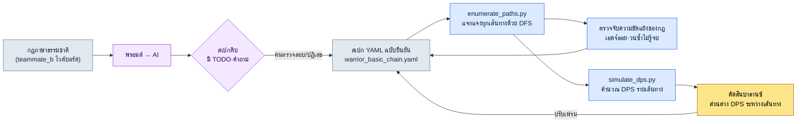

# 4.3 คอมโบ คานเซิล และคิวอินพุต — แจกแจงทุกเส้นทางแล้วตรวจสอบ

สมาชิกทีม B ซึ่งเป็นดีไซเนอร์ฝ่ายการต่อสู้ ยืนอยู่หน้าไวต์บอร์ดในห้องประชุมและกำลังวาดกล่องด้วยปากกามาร์กเกอร์ เบสิก1 เบสิก2 เบสิก3 และกิ่งที่แตกออกข้างไปเป็นการโจมตีหนัก เมื่อมีลูกศรเพิ่มขึ้นราวเจ็ดเส้น มีคนหนึ่งถามขึ้นว่า "งั้นถ้าหลังจากใช้ท่าดีดศัตรูขึ้นจากการโจมตีหนัก แล้วคานเซิลด้วยการหลบ จะกลับมาเริ่มที่เบสิก1 ได้อีกไหม" สมาชิกทีม B หยุดปากกาไว้ บนกราฟที่อยู่บนไวต์บอร์ดไม่มีเส้นทางนั้นวาดเอาไว้ จะวาดได้แต่ไม่ได้วาด หรือกฎไม่อนุญาตให้ทำกันแน่ แม้แต่เจ้าตัวเองก็ตอบทันทีไม่ได้

นี่คือปัญหาที่แท้จริงของการออกแบบคอมโบ คอมโบเมื่อคิดในหัวจะดูเหมือนเส้นเดียวเรียบง่ายแบบ "1-2-3 ต่อกัน แล้วแตกกิ่งไปการโจมตีหนัก" แต่เมื่อมีคานเซิลและคิวอินพุตเข้ามาเกี่ยว เส้นนั้นก็กลายเป็นกราฟ แค่เพิ่มเอดจ์คานเซิลไม่กี่เส้นบนโหนดหกตัว เส้นทางที่เหยียบได้จริงก็เพิ่มขึ้นเป็นหลายสิบสาย คนเราไม่สามารถกางทั้งหลายสิบสายนั้นออกในหัวได้หมด ความคิดเรื่องบาลานซ์อย่าง "เส้นทางนี้แรงเกินไป" จึงมักถูกค้นพบก็ต่อเมื่อมันเข้าไปอยู่ในบิลด์แล้วเท่านั้น

เป้าหมายของบทนี้มีหนึ่งเดียว คือการสร้าง **เวิร์กโฟลว์ที่แจกแจงเส้นทางคอมโบทั้งหมดโดยอัตโนมัติแทนที่จะวาดด้วยมือ แล้วตรวจสอบแต่ละเส้นทาง** เราจะเปลี่ยนกฎที่เขียนเป็นภาษาธรรมชาติให้เป็นสเปก แจกแจงเส้นทางจากสเปก แล้วเอาเส้นทางที่แจกแจงได้ไปป้อนเข้าการจำลอง ในระหว่างนั้นผู้เขียนจะแสดงให้เห็นแบบดิบ ๆ ว่า AI ช่วยได้ถึงไหน และมันโกหกตรงไหน

---

## 4.3.1 คอมโบไม่ใช่ตาราง แต่เป็นกราฟ

ถ้าเขียนคอมโบเป็นตารางก็จะออกมาแบบนี้ "หลังเบสิก1 เป็นเบสิก2 หลังเบสิก2 เป็นเบสิก3" เป็นแถวและคอลัมน์ที่เรียบร้อย แต่ตารางนี้โกหก เพราะตารางตั้งสมมติฐานว่ามันเป็นเส้นตรง ในการต่อสู้จริง ผู้เล่นแยกออกไปการโจมตีหนักจากเบสิก2 คานเซิลการโจมตีหนักด้วยการหลบ แล้วกดเบสิก1 อีกครั้งทันทีหลังหลบ การแตกกิ่งและวนซ้ำนี้ซ่อนตัวอยู่ระหว่างแถวของตาราง

ดังนั้นรูปร่างที่แท้จริงของคอมโบจึงเป็น **กราฟแบบมีทิศทาง (directed graph)** แอ็กชันคือโหนด การเชื่อมต่อคือเอดจ์ แต่ละเอดจ์มีหน้าต่างอินพุต (input window — รับอินพุตเมื่อไหร่) และคีย์อินพุตติดอยู่ โหนดมีเฟรมที่กินเวลาติดอยู่ และบางโหนดมีเงื่อนไขโบนัส (ต้องผ่านโหนดเฉพาะจึงจะได้ตัวคูณดาเมจ) ติดอยู่

ถ้าวาดคอมโบพื้นฐานหนึ่งชุดของตัวละครนักรบเป็นกราฟก็จะได้ดังนี้ หกโหนด รวมกิ่งคานเซิล

<svg viewBox="0 0 720 300" xmlns="http://www.w3.org/2000/svg" font-family="sans-serif" font-size="13">
  <defs>
    <marker id="arrow" markerWidth="10" markerHeight="10" refX="8" refY="3" orient="auto" markerUnits="strokeWidth">
      <path d="M0,0 L8,3 L0,6 Z" fill="#444"/>
    </marker>
  </defs>
  <!-- main chain -->
  <rect x="20" y="40" width="110" height="40" rx="6" fill="#e8f0fe" stroke="#3367d6"/>
  <text x="75" y="65" text-anchor="middle">เบสิก1 (21f)</text>
  <rect x="200" y="40" width="110" height="40" rx="6" fill="#e8f0fe" stroke="#3367d6"/>
  <text x="255" y="65" text-anchor="middle">เบสิก2 (24f)</text>
  <rect x="380" y="40" width="110" height="40" rx="6" fill="#e8f0fe" stroke="#3367d6"/>
  <text x="435" y="65" text-anchor="middle">เบสิก3 (30f)</text>
  <rect x="560" y="40" width="140" height="40" rx="6" fill="#fce8e6" stroke="#c5221f"/>
  <text x="630" y="65" text-anchor="middle">ฟินิชเชอร์ ×1.5</text>
  <!-- branch -->
  <rect x="200" y="150" width="110" height="40" rx="6" fill="#fef7e0" stroke="#e8a000"/>
  <text x="255" y="175" text-anchor="middle">โจมตีหนัก (33f)</text>
  <rect x="380" y="150" width="110" height="40" rx="6" fill="#fef7e0" stroke="#e8a000"/>
  <text x="435" y="175" text-anchor="middle">ดีดขึ้น (28f)</text>
  <rect x="200" y="240" width="110" height="40" rx="6" fill="#e6f4ea" stroke="#137333"/>
  <text x="255" y="265" text-anchor="middle">หลบ (18f)</text>
  <!-- edges main -->
  <line x1="130" y1="60" x2="200" y2="60" stroke="#444" marker-end="url(#arrow)"/>
  <text x="165" y="52" text-anchor="middle" font-size="11">10~21f</text>
  <line x1="310" y1="60" x2="380" y2="60" stroke="#444" marker-end="url(#arrow)"/>
  <text x="345" y="52" text-anchor="middle" font-size="11">12~24f</text>
  <line x1="490" y1="60" x2="560" y2="60" stroke="#444" marker-end="url(#arrow)"/>
  <text x="525" y="52" text-anchor="middle" font-size="11">14~30f</text>
  <!-- branch edges -->
  <line x1="255" y1="80" x2="255" y2="150" stroke="#444" marker-end="url(#arrow)"/>
  <text x="300" y="118" text-anchor="middle" font-size="11">โจมตีหนัก 6~24f</text>
  <line x1="310" y1="170" x2="380" y2="170" stroke="#444" marker-end="url(#arrow)"/>
  <line x1="255" y1="190" x2="255" y2="240" stroke="#444" marker-end="url(#arrow)"/>
  <text x="300" y="218" text-anchor="middle" font-size="11">คานเซิลด้วยการหลบ</text>
  <!-- loop back -->
  <path d="M200,260 C90,260 75,140 75,80" fill="none" stroke="#137333" stroke-dasharray="5,4" marker-end="url(#arrow)"/>
  <text x="110" y="160" text-anchor="middle" font-size="11" fill="#137333">เข้าเบสิก1 ใหม่หลังหลบ</text>
</svg>

จุดที่ต่างจากไวต์บอร์ดอย่างชัดเจนมีสองอย่าง อย่างแรก แต่ละเอดจ์มีช่วงเฟรมของหน้าต่างอินพุตระบุไว้ "โจมตีหนัก 6\~24f" หมายความว่ารับอินพุตการโจมตีหนักได้ตั้งแต่เฟรมที่ 6 จนถึงเฟรมที่ 24 หลังจากเบสิก2 เริ่มขึ้น อย่างที่สอง มีเอดจ์เข้าเบสิก1 ใหม่จากการหลบ (หลบ→เบสิก1) ที่วาดด้วยเส้นประ นี่คือเส้นทางที่สมาชิกทีม B ตอบทันทีในห้องประชุมไม่ได้ เมื่อระบุลงในกราฟแล้ว "มี/ไม่มี" ก็ชัดเจน

ถ้าคนวาดกราฟนี้ด้วยมือ ก็จะได้หกโหนดและเอดจ์เจ็ดแปดเส้น ถ้ามีตัวละครยี่สิบตัว และแต่ละตัวมีชุดคอมโบสามสี่ชุด กราฟก็จะกลายเป็นหลายร้อยแผ่น มือตามไม่ทัน ดังนั้นเราจึงเขียนกราฟไว้เป็น **สเปกข้อความ (text spec)** แล้วสร้างรูปภาพและการตรวจสอบขึ้นจากตรงนั้นโดยอัตโนมัติ

---

## 4.3.2 สเปกที่คนอ่านได้แต่เครื่องพาร์สได้

เราย้ายกราฟข้างต้นไปเป็นสเปก YAML แก่นกลางคือสามบล็อก ได้แก่ โหนด (`nodes`) เอดจ์ (`edges`) และโบนัส (`bonuses`) กฎคานเซิลก็มองเป็นเอดจ์ชนิดหนึ่งด้วย เพราะการตัดแล้วไปยังโหนดอื่นก็คือเอดจ์เช่นกัน

```yaml
# warrior_basic_chain.yaml
character: warrior
combo_id: basic_chain

nodes:
  - { id: basic_1,  name: เบสิก1,   duration_frames: 21 }
  - { id: basic_2,  name: เบสิก2,   duration_frames: 24 }
  - { id: basic_3,  name: เบสิก3,   duration_frames: 30 }
  - { id: heavy,    name: โจมตีหนัก,  duration_frames: 33 }
  - { id: launch,   name: ดีดขึ้น,  duration_frames: 28 }
  - { id: dodge,    name: หลบ,    duration_frames: 18, cancels_recovery: true }

edges:
  - { from: basic_1, to: basic_2, input: light, window: [10, 21] }
  - { from: basic_2, to: basic_3, input: light, window: [12, 24] }
  - { from: basic_2, to: heavy,   input: heavy, window: [6, 24] }
  - { from: heavy,   to: launch,  input: heavy, window: [10, 33] }
  - { from: heavy,   to: dodge,   input: dodge, window: [0, 33], type: cancel }
  - { from: basic_3, to: dodge,   input: dodge, window: [0, 30], type: cancel }
  - { from: dodge,   to: basic_1, input: light, window: [8, 18] }   # เข้าใหม่

bonuses:
  - { on: basic_3, requires_path: [basic_1, basic_2], damage_multiplier: 1.5 }
```

สเปกนี้ตอบสนองผู้อ่านสองฝ่ายพร้อมกัน คนอ่าน `window: [6, 24]` แล้วเข้าใจว่า "การโจมตีหนักเริ่มรับได้ตั้งแต่ช่วงกลางของเบสิก2" ส่วนเครื่องพาร์สบรรทัดเดียวกันเพื่อใช้วาดกราฟและแจกแจงเส้นทาง ความเข้าใจของคนและการตรวจสอบของเครื่องออกมาพร้อมกันจากแหล่งเดียว

ค่าเฟรมข้างต้น (`21`, `24`, `[6, 24]`) ไม่ใช่ค่าที่วัดจริง แต่เป็นค่าตัวอย่างที่ผู้เขียนกำหนดขึ้นเพื่ออธิบายในบทนี้ (ยังไม่ได้ตรวจสอบ) ในโปรเจกต์จริง ค่าเหล่านี้มาจากความยาวมอนทาจที่แอนิเมเตอร์สร้างและไทมิงของโนทิฟายในบิลด์ ตอนเขียนสเปกครั้งแรกให้ใส่ค่าตามเจตนาของดีไซเนอร์ไปก่อน แล้วเมื่อบิลด์ออกมาก็แคปเจอร์มาแก้ให้เป็นค่าที่วัดจริง ลูปการแก้ค่านี้จะกล่าวถึงใน 4.4

---

## 4.3.3 บันทึกเซสชันจริง (worked transcript) — จากภาษาธรรมชาติถึงสเปก

เราเอากฎที่สมาชิกทีม B วาดไว้บนไวต์บอร์ดมาให้เป็นภาษาธรรมชาติ แล้วให้แปลงเป็นสเปก YAML ผู้เขียนจะคัดลอกพรอมต์ฉบับเต็ม ผลลัพธ์ดิบของ Claude และการตรวจสอบ/ปฏิเสธของคนมาตามจริงโดยไม่สรุปย่อ

### พรอมต์ (ฉบับเต็ม)

```
ต่อไปนี้คือกฎคอมโบของตัวละครนักรบ จงแปลงสิ่งนี้เป็นสเปกคอมโบ YAML

กฎ:
- การโจมตีพื้นฐานต่อกันเป็นจังหวะที่ 1, 2, 3 ด้วยคีย์โจมตีเบา
- ถ้ากดคีย์โจมตีหนักระหว่างเบสิก2 จะแยกออกไปเป็นการโจมตีหนักได้
- ถ้ากดโจมตีหนักอีกครั้งหลังการโจมตีหนัก จะดีดศัตรูขึ้น (ดีดขึ้น)
- การโจมตีหนักคานเซิลด้วยการหลบได้ตลอดเวลา
- เบสิก3 ก็คานเซิลด้วยการหลบได้
- ทันทีหลังหลบ สามารถเริ่มเบสิก1 ใหม่ด้วยการโจมตีเบาได้
- เบสิก3 จะมีดาเมจ 1.5 เท่าก็ต่อเมื่อผ่านทั้งเบสิก1 และเบสิก2 แล้วเท่านั้น

รูปแบบสเปก:
- nodes(id, name, duration_frames), edges(from, to, input, window, type),
  bonuses(on, requires_path, damage_multiplier)
- เอดจ์คานเซิลให้ระบุด้วย type: cancel
- ค่าเฟรมที่ฉันไม่ได้ให้ ห้ามนายกำหนดเอง ให้เว้นไว้เป็น TODO
```

บรรทัดสุดท้ายคือแก่น ระบุชัดว่าถ้าไม่ได้ให้ค่าเฟรมมา ก็ห้ามกุขึ้น นี่คือการบังคับมาตรฐาน v3 ข้อ 3 (ความซื่อตรงของตัวเลข) ในระดับพรอมต์

### ผลลัพธ์ดิบของ Claude (ไม่ได้แก้ไข)

````
แปลงเป็นสเปกแล้ว ค่าเฟรมไม่ได้ถูกให้มา จึงเว้นไว้เป็น TODO

```yaml
character: warrior
combo_id: basic_chain
nodes:
  - { id: basic_1, name: เบสิก1, duration_frames: TODO }
  - { id: basic_2, name: เบสิก2, duration_frames: TODO }
  - { id: basic_3, name: เบสิก3, duration_frames: TODO }
  - { id: heavy,   name: โจมตีหนัก, duration_frames: TODO }
  - { id: launch,  name: ดีดขึ้น, duration_frames: TODO }
  - { id: dodge,   name: หลบ,   duration_frames: TODO }
edges:
  - { from: basic_1, to: basic_2, input: light, window: TODO }
  - { from: basic_2, to: basic_3, input: light, window: TODO }
  - { from: basic_2, to: heavy,   input: heavy, window: TODO }
  - { from: heavy,   to: launch,  input: heavy, window: TODO }
  - { from: heavy,   to: dodge,   input: dodge, window: TODO, type: cancel }
  - { from: basic_3, to: dodge,   input: dodge, window: TODO, type: cancel }
  - { from: dodge,   to: basic_1, input: light, window: TODO }
bonuses:
  - { on: basic_3, requires_path: [basic_1, basic_2], damage_multiplier: 1.5 }
```

ส่วนที่ต้องยืนยัน:
1. "เริ่มเบสิก1 ใหม่ทันทีหลังหลบ" ใส่ไว้เป็นเอดจ์ dodge -> basic_1 แต่ยังไม่ชัด
   ว่าเป็นการรับอินพุตระหว่างช่วงดีเลย์ท้ายท่าของการหลบ หรือหลังจากการหลบจบไปแล้วโดยสมบูรณ์
2. กฎไม่ได้ระบุว่ามีคอมโบกลางอากาศต่อจากการดีดขึ้น (launch) หรือไม่
   ต้องยืนยันว่าการดีดขึ้นเป็นจุดจบของคอมโบหรือไม่
3. ยังไม่ชัดว่าจะวางการหลบเป็นโหนด หรือเป็นเพียงเอดจ์ (แอ็กชันคานเซิล) ตอนนี้วางไว้
   เป็นโหนดก่อน โดยมองว่าตัวการหลบเองเป็นแอ็กชันที่มีระยะเวลากินเฟรม
````

มาประเมินกันตรงนี้ ข้อดี คือไม่กุค่าเฟรมขึ้นมา แต่เว้นไว้เป็น TODO ทั้งหมด เคารพข้อจำกัดของพรอมต์ และคำถามสามข้อที่ทิ้งไว้ตอนท้ายล้วนเป็นจุดที่คลุมเครือจริง ๆ ทั้งหมด โดยเฉพาะข้อ 1 (ไทมิงอินพุตของการเข้าใหม่) คือรูรั่วเดียวกันกับที่สมาชิกทีม B ตอบในห้องประชุมไม่ได้ AI หาเจอรูรั่วก่อนคนเสียอีก

จุดที่ยังก้ำกึ่ง คือข้อ 3 ที่วางการหลบเป็นโหนดนั้นเป็นเรื่องที่ความเห็นแยกกันได้ การหลบเป็นทั้ง "แอ็กชันคานเซิล" และในขณะเดียวกันก็เป็น "แอ็กชันที่มีระยะเวลากินเฟรม" จึงถูกทั้งสองด้าน การที่ AI เลือกด้านหนึ่งไว้แล้วรายงานว่ามันคลุมเครือนั้นซื่อตรง แต่นี่เป็นการตัดสินใจด้านการออกแบบ คนจึงต้องเป็นผู้กำหนด

### การตรวจสอบ/ปฏิเสธของคน

ตอบคำถามสามข้อและปฏิเสธบางส่วน

- **ข้อ 1 (ไทมิงการเข้าใหม่):** รับอินพุตในช่วงดีเลย์ท้ายท่าของการหลบ (8\~18f) ไม่ใช่หลังจากดูการหลบจนจบ แต่เป็นการคานเซิลดีเลย์ท้ายท่าเพื่อเข้าเบสิก1 ใหม่ → รับมา `window: [8, 18]`
- **ข้อ 2 (หลังการดีดขึ้น):** ในขอบเขตของบทนี้ ให้การดีดขึ้นเป็นจุดจบของคอมโบ คอมโบกลางอากาศแยกเป็นชุดต่างหาก → รับการตัดสินของ AI มา
- **ข้อ 3 (หลบ=โหนด):** วางเป็นโหนด แต่เพิ่มแอตทริบิวต์ `cancels_recovery: true` เพื่อระบุว่าเป็น "แอ็กชันที่ตัดดีเลย์ท้ายท่า" → รับมาบางส่วน + เพิ่มแอตทริบิวต์

และมีอีกหนึ่งอย่างที่ **ปฏิเสธ** AI ไม่ได้ติด `type: cancel` ให้เอดจ์ `dodge → basic_1` ซึ่งจริง ๆ นี่เป็นการตัดดีเลย์ท้ายท่าของการหลบแล้วเข้า จึงมีลักษณะเป็นคานเซิลตรงตามนั้น แต่ตรงนี้เรามองว่าเป็น "การเข้าตามปกติหลังหลบ" และวางไว้เป็นเอดจ์ทั่วไป เพราะการแยกระหว่างการคานเซิลดีเลย์ท้ายท่ากับการเชื่อมต่อตามปกติไม่ทำให้ฟีลของเกมต่างกันในตัวละครนี้ นี่เป็นตัวอย่างที่คนใช้การตัดสินเชิงโดเมนมาเขียนทับการจัดประเภทของ AI

### คำขอใหม่

```
ดี ต่อไปจงนำสิ่งเหล่านี้มาปรับแล้วออกสเปกฉบับสุดท้ายอีกครั้ง:
- เพิ่ม cancels_recovery: true ให้ dodge
- window ของเอดจ์ dodge -> basic_1 ให้เป็น [8, 18]
- ค่าเฟรมที่เหลือฉันยังไม่ได้ให้ จึงคง TODO ไว้ แต่ค่าตัวอย่างในกราฟข้างบน
  (basic_1=21, basic_2=24, basic_3=30, heavy=33, launch=28, dodge=18)
  ฉันจะใช้ ดังนั้นให้เติมด้วยค่าเหล่านั้น และให้ตรึงไว้ในคอมเมนต์ว่านี่เป็นค่าตัวอย่างที่ยังไม่ได้ตรวจสอบ
```

ผลลัพธ์ที่ออกมาจากคำขอใหม่นี้คือ YAML ใน 4.3.2 เราไม่ได้ทำให้เสร็จในครั้งเดียว พรอมต์ → ดิบ → ตรวจสอบ/ปฏิเสธ → ขอใหม่ วงจรนี้คือสิ่งที่สร้างความน่าเชื่อถือของสเปก AI ทำเครื่องหมายจุดที่คลุมเครือ และคนตัดสินใจด้วยความรู้เชิงโดเมน มีเพียงอย่างใดอย่างหนึ่งอย่างเดียวไม่ได้

---

## 4.3.4 แจกแจงเส้นทางโดยอัตโนมัติ

เนื่องจากสเปกเป็นกราฟ การแจกแจงเส้นทางคอมโบจึงกลายเป็นปัญหาของ **การค้นหาบนกราฟ** เป็นการค้นหาแบบลึกก่อน (depth-first search, DFS) ทุกเส้นทางที่ออกจากโหนดเริ่มต้นไปจนถึงโหนดปลาย (หรือฟินิชเชอร์) คนทำสิ่งนี้ในหัวไม่ได้ แต่โค้ดทำได้ในชั่วพริบตา

ใน `95_BattleTF` ซึ่งเป็นพื้นที่ทำงานแบบแยกของทีมผู้เขียน มีสคริปต์เล็ก ๆ ที่รับผิดชอบการแจกแจงนี้ มันอ่านสเปก YAML ดึงทุกเส้นทางออกมา แล้วตรวจสอบว่าแต่ละเส้นทางเป็นไปได้ตามกฎหรือไม่ (เอดจ์มีอยู่จริงไหม) ถ้าแสดงเฉพาะลอจิกแก่นกลางก็จะเป็นดังนี้

```python
# 95_BattleTF/enumerate_paths.py (ตัดตอน)
import yaml

def load_graph(path):
    spec = yaml.safe_load(open(path, encoding="utf-8"))
    adj = {}
    for e in spec["edges"]:
        adj.setdefault(e["from"], []).append(e)
    return spec, adj

def enumerate_paths(adj, start, max_depth=8):
    results = []
    def dfs(node, path, edges):
        # ถ้าเป็นโหนดปลาย (ไม่มีเอดจ์ออก) หรือถึงขีดจำกัดความลึก ให้ปิดเส้นทาง
        outs = adj.get(node, [])
        if not outs or len(path) >= max_depth:
            results.append((list(path), list(edges)))
            return
        for e in outs:
            if e["to"] in path:        # กันการวนซ้ำ: หนึ่งเส้นทางผ่านโหนดเดิมได้ครั้งเดียว
                results.append((list(path), list(edges)))
                continue
            dfs(e["to"], path + [e["to"]], edges + [e])
    dfs(start, [start], [])
    return results
```

เมื่อรันโดยเริ่มจาก `basic_1` เส้นทางที่มือไม่มีทางกางออกได้หมดก็หลั่งไหลออกมา ถ้าดูเพียงบางส่วนก็จะเป็นดังนี้

| # | เส้นทาง | หมายเหตุ |
|---|---|---|
| 1 | เบสิก1 → เบสิก2 → เบสิก3 | สามจังหวะมาตรฐาน ครบเงื่อนไขโบนัสฟินิชเชอร์ |
| 2 | เบสิก1 → เบสิก2 → โจมตีหนัก → ดีดขึ้น | คอมโบแยกกิ่ง |
| 3 | เบสิก1 → เบสิก2 → โจมตีหนัก → หลบ → เบสิก1 → … | การเข้าวนซ้ำ |
| 4 | เบสิก1 → เบสิก2 → เบสิก3 → หลบ → เบสิก1 → … | รีเซ็ตหลังฟินิชเชอร์ |

ข้อ 3 และ 4 สำคัญ เพราะเอดจ์เข้าใหม่จากการหลบทำให้คอมโบ **วนซ้ำ** เส้นทางวนซ้ำแบบนี้แหละคือสิ่งที่คนมองไม่เห็นบนไวต์บอร์ด ถ้าไม่ใส่การ์ดกันการวนซ้ำ (ผ่านโหนดเดิมในเส้นทางเดียวได้ครั้งเดียว) ลงใน DFS การแจกแจงก็จะตกลงในลูปไม่รู้จบ นี่เป็นกับดักที่ผู้เขียนรู้จริงตอนรันโค้ดครั้งแรกแล้วมันหยุดค้างไปจริง ๆ ครั้งหนึ่ง ถ้ากราฟมีการวนซ้ำ ตัวแจกแจงต้องมีการ์ดเสมอ

ผลผลิตของขั้นแจกแจงมีสองอย่าง อย่างแรก รายการทุกเส้นทางที่เป็นไปได้ตามกฎ อย่างที่สอง **การตรวจจับความขัดแย้งของกฎ** ถ้าในสเปกมีเอดจ์ `dodge → basic_1` แต่กลับไม่มีนิยามของโหนด `dodge` ตัวแจกแจงจะจับได้ว่าเป็น "เอดจ์ที่ชี้ไปยังโหนดที่ไม่ได้นิยามไว้" ความผิดพลาดที่พบบ่อยที่สุดเวลาเขียนสเปกด้วยมือคือการอ้างอิงลอย (dangling reference) นี้

---

## 4.3.5 ป้อนเส้นทางที่แจกแจงได้เข้าการจำลอง

ลำพังรายการเส้นทางอย่างเดียวเราไม่รู้ว่า "เส้นทางไหนแรงเกินไป" ต้องเอาแต่ละเส้นทางใส่เข้าตัวจำลอง DPS (DPS = ดาเมจต่อวินาที) `simulate_dps` ของทีมผู้เขียนทำหน้าที่นี้ มันรับเส้นทาง (ลำดับโหนด) พร้อมดาเมจ·เฟรมของแต่ละโหนดและกฎโบนัส แล้วคำนวณดาเมจรวมและเฟรมรวมที่ใช้ จากนั้นออกเป็นดาเมจต่อวินาที (DPS)

```python
# 95_BattleTF/simulate_dps.py (ตัดตอน, สมมติ 60fps)
def simulate(path_nodes, node_dmg, node_frames, bonuses):
    total_dmg = 0
    total_frames = 0
    visited = []
    for nid in path_nodes:
        dmg = node_dmg.get(nid, 0)
        # โบนัส: ถ้าผ่าน requires_path ครบทั้งหมด ให้ใช้ตัวคูณ
        for b in bonuses:
            if b["on"] == nid and all(r in visited for r in b["requires_path"]):
                dmg *= b["damage_multiplier"]
        total_dmg += dmg
        total_frames += node_frames[nid]
        visited.append(nid)
    seconds = total_frames / 60.0
    return {"dmg": total_dmg, "frames": total_frames,
            "dps": round(total_dmg / seconds, 1) if seconds else 0}
```

ถ้าไหลผลการแจกแจงจาก 4.3.4 เข้ามาทั้งก้อนตรงนี้ DPS ของแต่ละเส้นทางก็จะหล่นออกมาเป็นตาราง ด้านล่างคือผลที่ได้จากการใส่ดาเมจของโหนดเป็นค่าตัวอย่าง (ตีพื้นฐาน 100, โจมตีหนัก 180, ดีดขึ้น 140 — ทั้งหมดเป็นค่ากำกับที่ยังไม่ได้ตรวจสอบ) แล้วรัน

| เส้นทาง | ดาเมจรวม | เฟรมรวม | DPS |
|---|---|---|---|
| เบสิก1→เบสิก2→เบสิก3 (ฟินิชเชอร์ ×1.5) | 100+100+150 = 350 | 75 | 280.0 |
| เบสิก1→เบสิก2→โจมตีหนัก→ดีดขึ้น | 100+100+180+140 = 520 | 106 | 294.3 |
| เบสิก1→เบสิก2→เบสิก3→หลบ→เบสิก1 | 350+0+100 = 450 | 144 | 187.5 |

ตารางนี้เปลี่ยนบทสนทนา สัญชาตญาณที่ว่า "กิ่งโจมตีหนักดูแรงกว่าสามจังหวะมาตรฐานนะ" เปลี่ยนเป็นตัวเลข "DPS เส้นทางโจมตีหนัก 294 vs มาตรฐาน 280 เหนือกว่า 5%" ถ้า 5% ที่เหนือกว่าเป็นไปตามเจตนาก็ผ่าน ถ้าไม่ใช่ก็เพิ่มเฟรมของการโจมตีหนักเพื่อลด DPS ลง เราตัดสินใจเรื่องนี้ในขั้นสเปก **ก่อน** ที่บิลด์จะออกมา

ถ้ามองเวิร์กโฟลว์ทั้งหมดในแผ่นเดียวก็จะเป็นดังนี้



สเปก (D) อยู่ตรงกลาง และการแจกแจง (E) การตรวจสอบ (F) การจำลอง (G) ก็แตกกิ่งออกไปจากตรงนั้น ถ้าจับความขัดแย้งได้หรือบาลานซ์ผิดเพี้ยน ก็ย้อนกลับมาที่สเปกเพื่อแก้ ไวต์บอร์ดไม่มีลูปนี้ คอมโบบนไวต์บอร์ดจึงรู้ว่าผิดก็ต่อเมื่อมันเข้าไปอยู่ในบิลด์แล้วเท่านั้น

---

## 4.3.6 คานเซิลและคิวอินพุต — สองมือจับที่เพิ่มและบีบเส้นทาง

ที่ผ่านมาเราได้ดูกราฟคอมโบและการแจกแจงเส้นทาง คานเซิลและคิวอินพุตคือมือจับสองอันที่ปรับกราฟนี้ ทิศทางของทั้งสองตรงข้ามกัน

**คานเซิลเพิ่มเอดจ์** ทุกครั้งที่เพิ่มกฎคานเซิลหนึ่งข้อ จะมีเอดจ์มาติดที่กราฟ และจำนวนเส้นทางที่แจกแจงได้ก็พองตัวขึ้นแบบทวีคูณ ดังนั้นคานเซิลจึงไม่ใช่ "ยิ่งใจกว้างยิ่งดี" ยิ่งปลดคานเซิลออกมากเท่าไหร่ เส้นทางก็ยิ่งระเบิด และโอกาสที่เส้นทางแรงเกินคาด (อย่างเส้นทางวนซ้ำในหัวข้อก่อนหน้า) จะปนเข้ามาก็ยิ่งสูงขึ้น นี่คือเหตุผลที่ประเพณีเกมต่อสู้วางคานเซิลไว้อย่างเข้มงวด และที่เกมแอ็กชัน RPG วางไว้อย่างใจกว้าง แนวเกมเป็นตัวกำหนด "จำนวนเส้นทางที่จะอนุญาต" ไม่มีค่าหน้าต่างที่ถูกต้องแบบสัมบูรณ์

เวลาจัดการคานเซิล ต้องแยกระบุให้ชัดเสมอ ถ้าวางเป็น "คานเซิลอะไรก็ได้" แบบรวม ตัวแจกแจงจะสร้างเอดจ์คานเซิลระหว่างทุกโหนด ทำให้เส้นทางเพิ่มขึ้นจนควบคุมไม่ได้

| ประเภทคานเซิล | การเขียนในสเปก | ผลต่อเส้นทาง |
|---|---|---|
| Action Cancel | โหนดเฉพาะ → โหนดเฉพาะ, type: cancel | เพิ่มเฉพาะกิ่งที่เลือกได้ |
| Dodge Cancel | หลายโหนด → dodge, window: [0, dur] | เป็นทางออกได้แทบทุกโหนด |
| Guard Cancel | หลายโหนด → guard | เข้าสู่การป้องกัน โดยปกติจำกัดเฉพาะดีเลย์ท้ายท่า |
| No Cancel | ไม่มีเอดจ์ cancel ออก | ทำจนจบหลังเริ่ม (ซูเปอร์อาร์เมอร์) |

**คิวอินพุตไม่ได้บีบเส้นทาง แต่ทำให้เหยียบได้จริง** ถ้าไม่มีคิว ผู้เล่นต้องกะหน้าต่างอินพุตของแต่ละเอดจ์ (เช่น `[12, 24]`) ให้ตรงระดับเฟรม ซึ่งแทบเป็นไปไม่ได้ด้วยปฏิกิริยาของคน คิวจะเก็บอินพุตที่กดก่อนหน้าต่างไว้ในบัฟเฟอร์ แล้วลั่นออกโดยอัตโนมัติในวินาทีที่หน้าต่างเปิด นั่นคือคิวไม่ได้เปลี่ยนเส้นทางของกราฟ แต่ใส่รองเท้าให้คนเดินบนกราฟได้

```yaml
input_queue:
  window_start_ratio: 0.5   # เริ่มบัฟเฟอร์อินพุตถัดไปจากความคืบหน้าแอ็กชัน 50%
  expire_frames: 10         # อายุที่ใช้ได้ของอินพุตที่ถูกบัฟเฟอร์
  priority: latest          # เมื่อมีอินพุตหลายตัวพร้อมกัน ให้ตัวสุดท้ายมาก่อน
```

ความสมดุลของสามพารามิเตอร์คือแก่น ถ้า `window_start_ratio` เล็กเกินไป อินพุตช่วงต้นแอ็กชันก็จะถูกบัฟเฟอร์ด้วย ทำให้แอ็กชันถัดไปที่ไม่ได้ตั้งใจเด้งออกมา ถ้า `expire_frames` สั้นเกินไป คิวก็หมดความหมาย กลับไปเรียกร้องความแม่นยำอีก แต่ถ้ายาวเกินไป อินพุตที่กดไปนานแล้วก็ลั่นออกมาช้า ๆ เกิดเหตุ "ทำไมจู่ ๆ ถึงขยับ" ค่าตั้งต้นที่แนะนำคือ `expire_frames` 5\~15 และ `window_start_ratio` ราว 0.5 แต่นี่เป็นเส้นเริ่มต้นที่ต้องปรับตามแนวเกมและความหนักหน่วงของตัวละคร ไม่ใช่คำตอบสำเร็จรูป

เรื่องเชิงปฏิบัติการอีกหนึ่งข้อ อย่าตั้งค่าพารามิเตอร์คิวอินพุตให้ต่างกันหมดในแต่ละตัวละคร ให้มีค่าเริ่มต้นแบบโกลบอลหนึ่งชุด แล้ว override เฉพาะตัวละครที่ความหนักหน่วงต่างเป็นพิเศษ (แบบบอสตัวยักษ์เป็นต้น) ถ้าจัดการค่าคิวของตัวละครยี่สิบตัวแยกกัน ก็จะแยกไม่ออกว่าค่าไหนเป็นความต่างที่ตั้งใจ และค่าไหนเป็นความผิดพลาด

สุดท้าย มีอีกหนึ่งเรื่องที่ต้องชี้ไว้ ที่ผ่านมาเราจัดการเอดจ์เพียงแค่ "มี/ไม่มี" แต่ถึงจะมีเอดจ์ **การข้ามจากโหนดนั้นไปยังโหนดถัดไปจริง ๆ ทำอย่างไร** ก็เป็นอีกการตัดสินใจหนึ่ง วิธีเชื่อมต่อระหว่างคอมโบมีกิ่งหลักอยู่สามแบบ ซึ่งอยู่นอกความลึกของหนังสือเล่มนี้จึงไม่จัดการด้วยโค้ด แต่ถ้าไม่กล่าวถึงเลย สเปกก็เท่ากับวาดไว้เพียงครึ่งเดียว

- **Cancel Notify:** จะเริ่มตัดแอนิเมชันปัจจุบันแล้วรับอินพุตถัดไปตั้งแต่จุดไหน หน้าต่างเอดจ์ข้างต้น (`window: [10, 21]`) ก็คือการแสดงออกของโนทิฟายนี้นั่นเอง ถ้าเลื่อนโนทิฟายมาเร็วขึ้น คอมโบก็จะเร็วขึ้น (ไปยังท่าถัดไปก่อนที่การตีจะจบ) ถ้าเลื่อนช้าลง แต่ละจังหวะก็จะหนักแน่นขึ้น นั่นคือค่าเริ่มต้นของหน้าต่างไม่ใช่แค่ตัวเลขธรรมดา แต่เป็นการตัดสินด้านสัมผัสว่า "จะโชว์การตีนี้จนจบ หรือจะรีบข้ามไปท่าถัดไป"
- **Anim Blending:** ผสมระหว่างสองโหนดให้เนียนแล้วข้ามไป จากท่าจบของการโจมตีหนักไปยังท่าเริ่มของการดีดขึ้น โดยอินเตอร์โพเลตข้ามกันไปกี่เฟรม การเชื่อมต่อจะลื่นไหลเป็นธรรมชาติ แต่ในช่วงเบลนดิงมักเกิดช่องว่างของการตรวจจับการตี และ "รสชาติของการตัดขาด" ก็จะหายไป
- **Frame Skip:** ข้ามเฟรมที่เหลือของแอนิเมชันปัจจุบันโดยไม่เบลนดิง แล้วเริ่มโหนดถัดไปทันที การเชื่อมต่อจะฉับไวและตอบสนองเร็ว แต่ท่าทางอาจดูสะดุดเป็นช่วง ๆ "ฟีลคานเซิล" ของเกมต่อสู้·แอ็กชันส่วนใหญ่เป็นแบบนี้

ทั้งสามนี้ทำให้สัมผัสมือของเกมตรงข้ามกันโดยสิ้นเชิงแม้จะเป็นเอดจ์เดียวกัน ในขั้นสเปกให้กำหนดเพียงการมีอยู่ของเอดจ์และหน้าต่าง ส่วนวิธีเชื่อมต่อ (เบลนดิง vs เฟรมสกิป) มักจะกำหนดร่วมกับแอนิเมเตอร์ในขั้นบิลด์ อย่างไรก็ตามถ้าเว้นฟิลด์หนึ่งบรรทัดแบบ `transition: blend` / `transition: skip` ไว้ในสเปกล่วงหน้า ในขั้นบิลด์ก็ไม่ต้องมาถามซ้ำว่า "เอดจ์นี้ตกลงให้ข้ามแบบไหนนะ" วิธีเชื่อมต่อคือแกนที่สามที่ซ่อนอยู่ของกราฟคอมโบ

---

## 4.3.7 การตรวจสอบบิลด์เป็นงานต่างหาก (เกริ่น 4.4)

การตรวจสอบทั้งหมดมาจนถึงตรงนี้เกิดขึ้น **บนสเปก** การแจกแจงเส้นทาง การจำลอง DPS การตรวจจับความขัดแย้ง ทั้งหมดมีเป้าหมายเป็น YAML แต่ค่าเฟรมในสเปกเป็นค่าตามเจตนาของดีไซเนอร์ ไม่ใช่ค่าที่วัดจริงจากบิลด์ ความยาวจริงของมอนทาจที่แอนิเมเตอร์สร้าง เฟรมที่โนทิฟายในบิลด์ลั่นจริง หน้าต่างที่คิวอินพุตทำงานจริงในเอนจิน สิ่งเหล่านี้ต้องแคปเจอร์บิลด์มาวัด

การดึง 5 สัญญาณ (เฟรมที่การตีเกิดขึ้น, ดีเลย์ท้ายท่า, หน้าต่างคานเซิล, คิวอินพุต, ฮิตสต็อป) จากวิดีโอบิลด์โดยอัตโนมัติมีความยากในการอิมพลิเมนต์สูง สิ่งที่น่าเชื่อถือที่สุดในทางปฏิบัติคือเทเลเมทรีภายในเกม ให้ในบิลด์บันทึกล็อกว่า "แอ็กชันนี้รับอินพุตนี้ที่เฟรมนี้" แล้วเอาล็อกนั้นมาเทียบกับสเปก (การเปรียบเทียบวิธีแคปเจอร์ดูใน 4.4) ลูปการเทียบนี้คือหัวข้อของ 4.4 ถ้าหน้าต่างที่สเปกระบุว่า `[12, 24]` วัดได้ในบิลด์เป็น `[14, 26]` ก็แก้สเปกให้ตรงกับค่าที่วัดจริงในบิลด์

---

## 4.3.8 ความผิดพลาดที่พบบ่อยและวิธีหลีกเลี่ยง

| ความผิดพลาด | ทำไมจึงอันตราย | วิธีหลีกเลี่ยง |
|---|---|---|
| เขียนคอมโบเป็นตารางเส้นตรง | การแตกกิ่ง·วนซ้ำซ่อนอยู่ระหว่างแถวจนตกหล่น | เขียนสเปกเป็นกราฟ (โหนด+เอดจ์) ไม่วาดด้วยมือ |
| รวมคานเซิลเป็น "อะไรก็ได้" | เส้นทางที่แจกแจงระเบิด มีเส้นทางแรงปนเข้ามา | แยกระบุ Action·Dodge·Guard Cancel ให้ชัด |
| ตัวแจกแจงไม่มีการ์ดกันวนซ้ำ | ลูปไม่รู้จบที่การเข้าใหม่จากการหลบ | การ์ดผ่านโหนดเดิมได้ครั้งเดียวต่อหนึ่งเส้นทาง |
| เข้าใจผิดว่าเฟรมในสเปกคือค่าที่วัดจริง | ค่าตามเจตนาต่างจากค่าในบิลด์ | ระบุว่าเป็นค่าตามเจตนา แก้ด้วยการแคปเจอร์บิลด์ (4.4) |
| ตั้งคิวอินพุตแยกตามแต่ละตัวละคร | แยกความต่างที่ตั้งใจ/ความผิดพลาดไม่ออก | ค่าเริ่มต้นโกลบอล + override เฉพาะบางตัว |
| เชื่อค่าเฟรมที่ AI เติมตามนั้นเลย | ตัวเลขที่กุขึ้นถูกป้อนเข้าสเปก | บังคับด้วยพรอมต์ "ค่าที่ไม่ได้ให้คือ TODO" |

---

### สรุปประเด็นสำคัญของบท
- คอมโบไม่ใช่เส้นตรงแต่เป็นกราฟ ดังนั้นเส้นทางจึงแจกแจงด้วยโค้ดไม่ใช่ด้วยคน
- คานเซิลคือมือจับที่เพิ่มเส้นทาง คิวอินพุตคือรองเท้าที่ทำให้เดินบนเส้นทางได้
- แม้เป็นเอดจ์เดียวกัน วิธีเชื่อมต่อ (Cancel Notify·Anim Blending·Frame Skip) ก็ทำให้สัมผัสมือตรงข้ามกันโดยสิ้นเชิง
- การตรวจสอบบนสเปกกับการตรวจสอบบนบิลด์เป็นคนละงาน และอย่างหลังเทเลเมทรีคือทางที่เป็นไปได้จริง

---

## ลองทำดู — มินิไปป์ไลน์แจกแจงเส้นทางคอมโบ

นี่คือขั้นตอนขั้นต่ำที่คุณลองรันตามด้วยมือได้ ขอเพียงมีไพทอนและ `pyyaml` ก็พอ

**setup.** สร้างโฟลเดอร์ทำงานหนึ่งโฟลเดอร์ แล้ววางไฟล์สเปกและสคริปต์สองตัวไว้ในนั้น

```
combo-mini/
  warrior_basic_chain.yaml   # สเปกจาก 4.3.2
  enumerate_paths.py         # ตัวแจกแจง DFS จาก 4.3.4
  simulate_dps.py            # ตัวจำลองจาก 4.3.5
```

หลัง `pip install pyyaml` ให้แปะ YAML จาก 4.3.2 ลงในไฟล์สเปกตามนั้นเลย

**prompt.** ขั้นเปลี่ยนกฎภาษาธรรมชาติเป็นสเปกให้ฝากไว้กับ AI ใช้พรอมต์จาก 4.3.3 ตามนั้น แต่ต้องใส่ข้อจำกัดท้ายสุดเข้าไปด้วยเสมอ

```
ค่าเฟรมที่ฉันไม่ได้ให้ ห้ามนายกำหนดเอง ให้เว้นไว้เป็น TODO
เอดจ์คานเซิลให้ระบุด้วย type: cancel และส่วนที่คลุมเครือให้แยกออกมาเป็นคำถามต่างหาก
```

สองบรรทัดนี้กันการกุตัวเลขและการตัดสินตามอำเภอใจของ AI จากสเปกที่ออกมาให้คนเป็นผู้เติม TODO และรายการคำถาม

**verify.** เมื่อสเปกเสร็จแล้วให้ตรวจสอบสองครั้ง

```bash
python enumerate_paths.py warrior_basic_chain.yaml   # ทุกเส้นทาง + ความขัดแย้ง
python simulate_dps.py    warrior_basic_chain.yaml   # ตาราง DPS รายเส้นทาง
```

จากผลการแจกแจง ให้ตรวจว่า (1) เส้นทางวนซ้ำไม่เพิ่มขึ้นแบบไม่รู้จบหรือไม่ (2) ไม่มีเอดจ์ลอยที่ชี้ไปยังโหนดที่ไม่ได้นิยามไว้หรือไม่ จากผลของ DPS ให้ดูว่าส่วนต่างระหว่างเส้นทางอยู่ในช่วงที่ตั้งใจหรือไม่ ถ้าส่วนต่างมาก ให้แก้ค่าเฟรม/ดาเมจของสเปกแล้วรันใหม่

### ฉบับย่อสำหรับคนเดียว

ถ้าไม่มีเวลาสร้างเครื่องมือต่างหาก ก็จบการเขียนสเปกและการแจกแจงเส้นทางด้วยบทสนทนา AI ครั้งเดียวเลย ให้กฎภาษาธรรมชาติไปแล้วใส่ลงในพรอมต์เดียวว่า "เปลี่ยนเป็นสเปกคอมโบ YAML แล้วไล่เรียงทุกเส้นทางที่เป็นไปได้จากโหนดเริ่มต้นแบบลึกก่อนให้หมด การวนซ้ำให้ตัดให้วนแค่ครั้งเดียว ถ้ามีเอดจ์ที่ชี้ไปยังโหนดที่ไม่ได้นิยามไว้ให้ทำเครื่องหมายไว้" AI จะทำการแปลงเป็นสเปก·การแจกแจง·การตรวจจับความขัดแย้งให้ในครั้งเดียว ส่วนการจำลอง DPS ถ้าให้ดาเมจของโหนดมาเป็นตารางด้วย ก็รับได้ด้วยคำขอตามมาว่า "คำนวณดาเมจรวมและเฟรมของแต่ละเส้นทางแล้วทำเป็นตารางให้" ความแม่นยำจะลดลง แต่ก็มองได้ไกลกว่าไวต์บอร์ดมาก แก่นไม่เปลี่ยน — อย่ากางคอมโบในหัว แต่ให้แจกแจงออกมาแล้วดู
