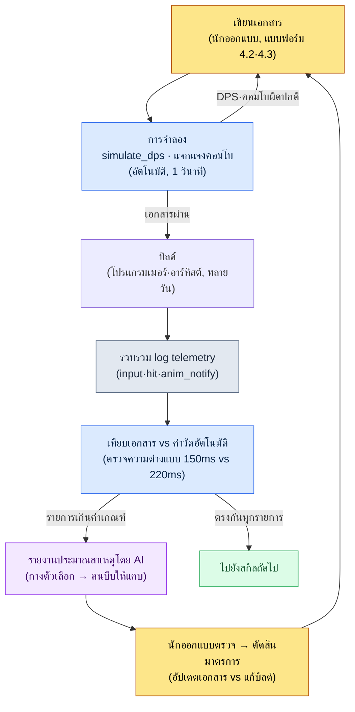

# 4.4 การจำลองและตรวจสอบการต่อสู้ด้วยความช่วยเหลือของ AI

บิลด์ #234 ของทีม TF การต่อสู้เพิ่งขึ้นมาหมาด ๆ เป็นบิลด์แรกที่ได้สัมผัสสกิลใหม่ `skill_thunder` ในเอกสารระบุว่า hit timing อยู่ที่ 150ms ผมลองกดอินพุตดู ความรู้สึกที่ปลายนิ้วบอกว่า ช้า ช้าแน่ ๆ ผมเรียกเพื่อนร่วมทีม A ที่นั่งข้าง ๆ ว่า "อันนี้มันดูลอย ๆ หน่อยไหม" เพื่อนร่วมทีม A ลองกดสองสามที "อืม… ก็เหมือนจะใช่อยู่" ทั้งคู่ไม่มั่นใจ เอกสารบอกว่า 150 แต่มือยืนยันว่าราว ๆ 200 ใครกันแน่ที่ถูก ศึกระหว่างปลายนิ้วกับกระดาษ ในบิลด์ถัดไปก็จะมีใครสักคนพูดอีกว่า "รู้สึกว่าก็โอเคนะ" และเพียงคำพูดประโยคเดียวนั้น บิลด์อีกหนึ่งบิลด์ก็ไหลผ่านไป

เป้าหมายของบทนี้คือการยุติศึกนั้น ถ้าปลายนิ้วบอกว่า 200 ก็แสดงให้เห็นด้วยตัวเลขว่ามันเป็น 200 จริงหรือไม่ และก่อนที่บิลด์จะขึ้นมา ให้รู้ล่วงหน้าเพียงแค่ดูจากเอกสารว่า "สกิลนี้มี DPS สูงกว่าเป้าหมาย 30%" แม้แต่ในสมัยที่ผมจัดการการต่อสู้ของเกม AAA MMORPG ที่มีคนทำงานร่วมกัน 200 คนตั้งแต่ช่วงต้น ความอึดอัดเมื่อความรู้สึกกับตัวเลขไม่ตรงกันก็เหมือนเดิม สิ่งที่เปลี่ยนไปคือ ตอนนี้เรามีเครื่องมือที่จะปิดความไม่ตรงกันนั้นด้วยตัวเลขอยู่ในมือแล้วเท่านั้นเอง

ถ้า 4.2 และ 4.3 พูดถึงว่าจะ *เขียน* เอกสารการต่อสู้อย่างไร 4.4 ก็พูดถึงว่าเอกสารนั้น *ทำงาน* ตามที่ตั้งใจไว้หรือไม่ การตรวจสอบมีสองแกน แกนหนึ่งคือการจำลอง (simulation) ที่ตรวจสอบด้วยการคำนวณล้วน ๆ โดยไม่ต้องมีบิลด์ อีกแกนหนึ่งคือการวิเคราะห์การจับภาพ (capture analysis) ที่ดึงค่าที่วัดได้ออกมาจากวิดีโอบิลด์จริง เมื่อสองแกนถูกผูกเข้าเป็นรอบเดียวกัน จำนวนรอบของการออกแบบการต่อสู้ก็ลดจากหน่วยวันลงมาเหลือหน่วยชั่วโมง

ขอบอกข้อสรุปก่อน หัวใจของบทนี้คือ *การวางตัวเลขที่ระบุในเอกสาร (150ms) กับตัวเลขที่วัดได้จากบิลด์ (220ms) ไว้เคียงกันแล้วอ่านความต่างนั้น* (4.4.5) ส่วนหัวข้อก่อนหน้า (ตัวจำลอง·การแจกแจงคอมโบ) ให้อ่านเป็นขั้นเตรียมการที่ทำให้การเปรียบเทียบนั้นเป็นไปได้

---

## 4.4.1 ต้นทุนของการรอบิลด์

เมื่อนักออกแบบการต่อสู้ต้องการตรวจสอบสกิลใหม่หนึ่งสกิล จะเกิดอะไรขึ้นบ้าง

นักออกแบบเขียนเอกสาร โปรแกรมเมอร์ใส่ข้อมูล อาร์ทิสต์เพิ่มโมชันและเอฟเฟกต์ บิลด์รัน QA ตรวจหนึ่งรอบ แล้วนักออกแบบถึงจะได้สัมผัสด้วยมือเอง เร็วก็สองวัน ปกติสามถึงสี่วัน หากพบ *ที่ปลายรอบ* ว่า "DPS สูงเกินไป" การค้นพบนั้นก็กลายเป็นคำสั่งให้ย้อนกลับไปเริ่มต้นใหม่ สามถึงสี่วันอีกหนึ่งรอบ

การจำลองคือเครื่องมือที่ให้คำตอบใน *ขั้นแรกสุด* ของรอบนี้ คำนวณดูจากเอกสารเพียงอย่างเดียว ถ้าคำตอบไม่ดีก็แก้เอกสารแล้วคำนวณใหม่ ก่อนเข้าสู่ขั้นบิลด์ซึ่งมีต้นทุนสูง ตัวเอกสารเองจะถูกกรองหนึ่งครั้ง เหมือนการเอารถจำลองเข้าอุโมงค์ลม (wind tunnel) ก่อน ก่อนที่จะนำรถจริงขึ้นถนน การออกแบบที่น่าสงสัยจะถูกคัดทิ้งบนโต๊ะทำงาน

แน่นอนว่าอุโมงค์ลมไม่ได้ทำนายถนนได้ 100% ด้วยเหตุนี้จึงต้องมีแกนที่สองคือการวิเคราะห์การจับภาพ ถ้าการจำลองคือ *คำตอบในอุดมคติ* การจับภาพก็คือ *คำตอบที่เกิดขึ้นจริงในบิลด์* การวางทั้งสองไว้เคียงกันแล้วอ่านความต่าง — นั่นคือทั้งหมดของบทนี้

---

## 4.4.2 simulate_dps — ตัวจำลองที่รันได้จริง

ซูโดโค้ดที่เป็นนามธรรมไม่สามารถตรวจสอบอะไรได้เลย ด้วยเหตุนี้จึงสร้างโค้ดที่ *รันได้* ขึ้นมาตั้งแต่ต้น ด้านล่างคือโครงสร้างหลักของ `simulate_dps.py` ที่ผมใช้ในทีม TF การต่อสู้ ซึ่งเรียบเรียงใหม่เพื่อนำมาลงในหนังสือโดยตัดข้อมูลของบริษัทออก มันรันด้วยไลบรารีมาตรฐานของ Python เพียงอย่างเดียวโดยไม่มี dependency (ไฟล์ทั้งหมดดูได้ใน「ลองทำดู」)

อินพุตนั้นเรียบง่าย สกิลหนึ่งสกิลคือ dataclass ที่มี `damage`·`cast_sec` (เวลาครองการร่าย)·`cooldown_sec`·`resource_cost` ส่วนตัวละครมีปริมาณทรัพยากรรวม·ปริมาณฟื้นฟูต่อวินาที·รายการสกิล·ลำดับการหมุนเวียนตามความสำคัญ ตัวหลักที่รันอยู่บนนั้นมีเพียงกฎละโมบ (greedy) ที่เรียบง่ายว่า "ในทุกขณะ ให้ใช้สกิลที่มีลำดับความสำคัญสูงสุดในบรรดาสกิลที่ใช้ได้" เป้าหมายคือการหา *ขีดสูงสุดในอุดมคติ* ที่ไม่ฉลาดและไม่โง่ไปกว่าผู้เล่นจริง เมื่อตัดเฉพาะส่วนที่เป็นกระดูกสันหลังออกมาก็ได้ดังนี้

```python
# สร้างไทม์ไลน์ด้วยติ๊ก 0.05 วินาที ถ้าไม่ได้อยู่ระหว่างร่าย ให้ใช้สกิลที่ใช้ได้ตัวแรกตามลำดับความสำคัญ
while t < duration_sec:
    resource = min(char.max_resource, resource + char.resource_regen * tick)
    for name in cooldowns:
        cooldowns[name] = max(0.0, cooldowns[name] - tick)
    if t >= busy_until:                     # ถ้าโมชันร่ายยังไม่จบ ให้รอ
        for name in char.rotation:          # ตามลำดับความสำคัญ
            s = skill_by_name[name]
            if cooldowns[name] <= 0 and resource >= s.resource_cost:
                total_damage += s.damage
                resource -= s.resource_cost
                cooldowns[name] = s.cooldown_sec
                busy_until = t + s.cast_sec  # ใช้สกิลถัดไปไม่ได้จนถึงเวลานี้
                break
    t += tick
# …(นิยาม dataclass·อินพุต warrior·ลูปเอาต์พุต ดูโค้ดทั้งหมดใน「ลองทำดู」)
```

เมื่อตั้ง `skill_thunder` (ดาเมจ 420·ร่าย 0.9s·คูลดาวน์ 6s) ไว้เป็นลำดับที่ 1 ให้ warrior แล้ววาง `skill_dash`·`basic_1` ไว้ข้างหลัง รัน 20 วินาที ได้ผลลัพธ์ดังนี้ (`python simulate_dps.py`):

```
평균 DPS: 261.0
  t=  0.0s  skill_thunder  자원=60
  t=  0.9s  skill_dash     자원=47
  t=  1.3s  basic_1        자원=50
  t=  1.6s  basic_1        자원=53
  t=  1.9s  basic_1        자원=55
  ...
```

ค่านี้มีความหมายอย่างไร มันหมายความว่าเรารู้ว่าขีดสูงสุด DPS ในอุดมคติของ warrior อยู่ที่ราว 261 ได้ *โดยไม่ต้องมีบิลด์* ภายใน 1 วินาที หากเป้าหมาย DPS คือ 180 เอกสารนี้ก็สูงเกินไป +45% ไม่ต้องรอบิลด์ แค่ปรับ `damage` หรือ `cooldown_sec` ตอนนี้ได้เลย

ขอเขียนข้อจำกัดไว้อย่างตรงไปตรงมาด้วย ตัวจำลองนี้ไม่ได้สะท้อนความผิดพลาดในการอินพุตของผู้เล่น·ช่องว่างจากการเคลื่อนที่·การหลบ·การรบกวนจากศัตรู ด้วยเหตุนี้ค่าที่วัดได้จึงสูงกว่าบิลด์จริงเสมอ นี่ไม่ใช่บั๊ก แต่เป็นนิยามของตัวจำลองในฐานะ *เส้นขีดสูงสุด* นั่นเอง ช่องว่างกับค่าที่วัดจริงจะถูกเติมด้วยการจับภาพใน 4.4.5

> **โน้ตการใช้ AI** โครงสร้างข้างต้นผมเป็นคนเขียนเอง แต่เมื่อจะเพิ่มโมเดลทรัพยากรใหม่ (เช่น โครงสร้างที่เกจความโกรธจะเพิ่มขึ้นเมื่อได้รับดาเมจ) ให้ร้องขอกับ Claude โดย *อ้างอิงโค้ดที่มีอยู่* เช่น "ช่วยเพิ่มกฎเมื่อโดนโจมตี ความโกรธ +5 ใน simulate_dps นี้ ภายในลูป tick โดยใช้ตัวแปรแยกต่างหากจากการฟื้นฟูทรัพยากรเดิม" หากสั่งให้สร้างตัวจำลองทั้งก้อนขึ้นมาจากกระดาษเปล่า จะได้โค้ดที่ตรวจสอบไม่ได้ออกมา กระดูกสันหลังให้คนจับ ส่วน AI ก็แตกกิ่งก้านออกไป

---

## 4.4.3 การแจกแจงเส้นทางคอมโบโดยอัตโนมัติ

ตัวเลข DPS เพียงตัวเดียวยังไม่พอ หากจะตรวจสอบว่า "คอมโบใดคือคอมโบหลักที่ตั้งใจไว้" ก็ต้องกาง *เส้นทางที่เป็นไปได้ทั้งหมด* ออกมาดู หากวาดทรีด้วยมือ แค่ 7\~8 โหนดหัวก็ระเบิดแล้ว การกางเส้นทางให้ครบถ้วนไม่ตกหล่นนั้น เครื่องทำได้ดีกว่าคนอย่างถล่มทลาย — แต่ต้องสั่งให้ดึงออกมาในรูปแบบที่คนสามารถย้อนทวนผลลัพธ์ได้

ต่อไปนี้คือโค้ดที่รับกราฟคอมโบ แจกแจงทุกเส้นทาง แล้วเรียงตาม DPS `combo_graph` คือการเขียน "หลังจากแอ็กชันใดสามารถ cancel ไปยังแอ็กชันใดได้" เป็น adjacency list ซึ่งถูกดึงออกมาจากเอกสาร state machine ของ 4.3 โดยตรง หัวใจคือเจเนอเรเตอร์ `all_paths` ที่กางด้วยการเรียกซ้ำ (recursion) จนถึงปลายทางตัน

```python
# enumerate_combos.py — กางทุกเส้นทางของกราฟคอมโบแล้วเรียงตาม DPS
combo_graph = {"start": ["A"], "A": ["B", "D"], "B": ["C", "E"], "D": ["C"], "C": [], "E": []}
action_stats = {  # (ดาเมจ, เวลาที่ใช้ หน่วยวินาที)
    "A": (300, 0.8), "B": (450, 1.0), "C": (450, 1.2), "D": (600, 1.4), "E": (200, 0.6),
}

def all_paths(node="start", path=None):
    path = (path or [])
    nexts = combo_graph.get(node, [])
    if not nexts:                       # ปลายทางตัน = คอมโบที่สมบูรณ์
        yield [n for n in path if n in action_stats]
        return
    for nxt in nexts:
        yield from all_paths(nxt, path + [nxt])

results = []
for p in all_paths():
    dmg = sum(action_stats[a][0] for a in p)
    dur = sum(action_stats[a][1] for a in p)
    results.append((p, dmg, round(dur, 1), round(dmg / dur, 1)))

for p, dmg, dur, dps in sorted(results, key=lambda r: -r[3]):
    print(f"{' → '.join(p):<18} {dmg:>5} dmg  {dur:>4}s  DPS {dps}")
```

ผลการรัน:

```
A → D → C            1350    3.4s  DPS 397.1
A → B → C            1200    3.0s  DPS 400.0
A → B → E             950    2.4s  DPS 395.8
```

สัญญาณที่นักออกแบบควรอ่านจากตรงนี้ไม่ใช่แค่อันดับหนึ่งเรียบ ๆ แต่คือการที่ DPS ของสามเส้นทางอยู่ที่ 396\~400 แทบจะติดกัน — นี่คือสัญญาณว่า "ใช้คอมโบไหนประสิทธิภาพก็พอ ๆ กัน จึง *ไม่มีอัตลักษณ์ของคอมโบหลัก*" หากเจตนาคือ "A→D→C ควรเป็นคอมโบหลักแบบเสี่ยงสูงผลตอบแทนสูง" ก็ต้องเพิ่มดาเมจของ D หรือลดเวลาลงเพื่อดัน DPS ให้สูงขึ้นอีกขั้น ถึงเวลากลับไปที่เอกสารแล้ว

ในจุดที่การแจกแจงอัตโนมัตินี้เข้ามาแทนการคำนวณด้วยมือ แม้โหนดคอมโบจะเพิ่มเป็น 20 โหนด คนก็แค่อ่านตารางที่เรียงไว้แล้วเท่านั้นพอ

---

## 4.4.4 การวิเคราะห์การจับภาพบิลด์ — วิธีที่สมจริงคือ telemetry

มาถึงแกนที่สอง เป็นขั้นวัดว่าในบิลด์เกิดอะไรขึ้นจริง ๆ คนมักนึกถึง "ให้ AI ดูวิดีโอบิลด์แล้ววิเคราะห์อัตโนมัติ" แต่ตรงนี้ขอแบ่งแยกแขนงอย่างตรงไปตรงมา เส้นทางสู่การได้ค่าที่วัดได้มีสามทาง และต้นทุน·ความแม่นยำของทั้งสามต่างกันมาก

<svg viewBox="0 0 720 250" xmlns="http://www.w3.org/2000/svg" font-family="sans-serif" font-size="13">
  <rect x="10" y="20" width="220" height="200" rx="8" fill="#fde8e8" stroke="#c0392b" stroke-width="1.5"/>
  <text x="120" y="45" text-anchor="middle" font-weight="bold" fill="#c0392b">A. วิเคราะห์วิดีโอโดยตรง</text>
  <text x="120" y="72" text-anchor="middle">ดึงอินพุต·โมชัน·VFX</text>
  <text x="120" y="92" text-anchor="middle">จากพิกเซลบนหน้าจอ</text>
  <text x="120" y="124" text-anchor="middle" font-weight="bold">ความแม่นยำ: ต่ำ~กลาง</text>
  <text x="120" y="148" text-anchor="middle">ความยากในการสร้าง: สูงมาก</text>
  <text x="120" y="172" text-anchor="middle">คลาดเคลื่อน ±1~2 เฟรม</text>
  <text x="120" y="200" text-anchor="middle" fill="#777">สำหรับงานวิจัย·เดโม</text>

  <rect x="250" y="20" width="220" height="200" rx="8" fill="#fef5e7" stroke="#d68910" stroke-width="1.5"/>
  <text x="360" y="45" text-anchor="middle" font-weight="bold" fill="#d68910">B. vision API สำเร็จรูป</text>
  <text x="360" y="72" text-anchor="middle">ส่งเฟรมที่จับภาพ</text>
  <text x="360" y="92" text-anchor="middle">ไปยังบริการ vision ภายนอก</text>
  <text x="360" y="124" text-anchor="middle" font-weight="bold">ความแม่นยำ: กลาง</text>
  <text x="360" y="148" text-anchor="middle">ความยากในการสร้าง: กลาง</text>
  <text x="360" y="172" text-anchor="middle">เสี่ยง IP รั่วไหล</text>
  <text x="360" y="200" text-anchor="middle" fill="#777">ต้องตรวจนโยบายภายในบริษัท</text>

  <rect x="490" y="20" width="220" height="200" rx="8" fill="#e8f6ef" stroke="#1e8449" stroke-width="1.5"/>
  <text x="600" y="45" text-anchor="middle" font-weight="bold" fill="#1e8449">C. telemetry ในเกม</text>
  <text x="600" y="72" text-anchor="middle">เอนจินบันทึกอีเวนต์</text>
  <text x="600" y="92" text-anchor="middle">พร้อม timestamp</text>
  <text x="600" y="124" text-anchor="middle" font-weight="bold">ความแม่นยำ: สูง</text>
  <text x="600" y="148" text-anchor="middle">ความยากในการสร้าง: ต่ำ~กลาง</text>
  <text x="600" y="172" text-anchor="middle">ใช้เวลาของเอนจินโดยตรง</text>
  <text x="600" y="200" text-anchor="middle" fill="#1e8449" font-weight="bold">ทางเลือกที่สมจริง</text>
</svg>

แนวทาง A (วิเคราะห์พิกเซลวิดีโอ) ฟังดูน่าดึงดูด เป็นภาพที่ดึงห้าสัญญาณ — การแสดงอินพุต·การเปลี่ยนโมชันตัวละคร·เฟรมแรกของเอฟเฟกต์·รูปคลื่นเสียง·UI ตัวเลขดาเมจ — ออกมาจากหน้าจออัตโนมัติ แต่เมื่อลองสร้างจริง ความคลาดเคลื่อน ±1\~2 เฟรมจะมาเป็นพื้นฐานเพราะ noise จากการบีบอัดเฟรม·UI บัง·motion blur ที่ 60fps หนึ่งเฟรมคือราว 16.7ms ในการตรวจสอบที่นับ hit timing เป็นหน่วย ms นั้น noise ±33ms ถือเป็นเรื่องร้ายแรง *ความยากในการสร้างสูงมาก แต่ความแม่นยำไม่คุ้มกับความพยายามนั้น*

ด้วยเหตุนี้คำตอบในความเป็นจริงคือแนวทาง C คือ **log telemetry ในเกม** เอนจิน *รู้เวลาที่แม่นยำอยู่แล้วภายใน* ทั้งเวลาที่รับอินพุต·เวลาที่ animation notify เกิด·เวลาที่ VFX สปอว์น·เวลาที่ดาเมจถูกใช้ แทนที่จะอนุมานเวลานั้นจากพิกเซล ก็แค่ทำให้มันถูกบันทึกเป็น log หนึ่งบรรทัด แทนที่จะ *กู้คืน* 100ms จากพิกเซล ก็ *รับเอา 100ms ที่เอนจินรู้มาจดไว้ตรง ๆ*

```cpp
// เพิ่มหนึ่งบรรทัดในโค้ดประมวลผลแอ็กชันการต่อสู้ (ตัวอย่างซูโด UE C++)
// เรียก logger ตัวเดียวกัน ณ จุดที่รับอินพุต / จุดที่ใช้ดาเมจ
CombatTelemetry::Log("input",  SkillName, GetWorld()->GetTimeSeconds());
CombatTelemetry::Log("hit",    SkillName, GetWorld()->GetTimeSeconds());
```

logger จะปล่อยออกมาทีละบรรทัดเป็น JSON Lines

```
{"event":"input","skill":"skill_thunder","t":12.340}
{"event":"hit",  "skill":"skill_thunder","t":12.560}
{"event":"input","skill":"basic_3","t":14.100}
{"event":"hit",  "skill":"basic_3","t":14.166}
```

ความต่างของเวลาระหว่าง `input` กับ `hit` ก็คือ hit timing ที่วัดได้นั่นเอง 12.560 − 12.340 = 0.220 วินาที = **220ms** ไม่ใช่ ±33ms ของการวิเคราะห์พิกเซล แต่เป็นค่าเวลาของเอนจินตรง ๆ การดึง log นี้มาแล้วเทียบกับเอกสารคือเนื้อหาของหัวข้อถัดไป

---

## 4.4.5 บันทึกเซสชันจริง (worked transcript): เอกสาร 150ms vs ค่าวัด 220ms

ตอนนี้นำสองแกนมารวมไว้ที่เดียวกัน เอกสารสัญญา 150ms ส่วน telemetry วัดได้ 220ms +70ms ปลายนิ้วถูก เราจะติดตามกระบวนการบีบ *สาเหตุ* ของช่องว่างนี้ไปกับ AI จนจบ โดยไม่สรุปย่อ แต่ลงไว้ทั้งหมดแม้กระทั่งฉากที่ AI เดาผิดทางในตอนแรก

### พรอมต์

เอกสารระบุ hit timing 150ms แต่ค่าวัดคือ 220ms แนบ log ด้านล่างแล้วถามด้วยความยาวเท่าที่คนพิมพ์จริง คำขอสั้น ๆ ที่เจตนาชัดเจนดีกว่าความเป็นทางการที่เยิ่นเย้อ — หนึ่งบรรทัดที่ให้เขียนถึงวิธีตรวจสอบด้วย กับอีกหนึ่งบรรทัดที่ห้ามฟันธง คือกระดูกสันหลังของพรอมต์นี้

> hit timing ของ skill_thunder ระบุในเอกสาร 150ms แต่ค่าวัด 220ms เกิน +70ms จาก telemetry ด้านล่าง ช่วยแยกสาเหตุที่เป็นไปได้ และเขียนด้วยว่า *แต่ละสาเหตุยืนยัน/ตัดออกได้ด้วย log ใด* อย่าฟันธง ถ้าไม่แน่ใจให้เขียนว่า 'ยังไม่ยืนยัน'  // "วิธีตรวจสอบด้วย"·"ห้ามฟันธง" สองอย่างนี้คือเจตนาหลัก ความเป็นทางการที่เหลือจะละไว้ผลลัพธ์ก็เหมือนเดิม
>
> ```
> {"event":"input","skill":"skill_thunder","t":12.340}
> {"event":"anim_start","skill":"skill_thunder","clip":"cast_thunder","t":12.340}
> {"event":"anim_notify","skill":"skill_thunder","notify":"HitWindow","t":12.560}
> {"event":"hit","skill":"skill_thunder","t":12.560}
> ```
> ตามเอกสาร notify HitWindow ของ cast_thunder อยู่ที่จุด 0.150s

### ผลลัพธ์ดิบของ Claude (ครั้งที่ 1 — ก่อนตรวจสอบ มีการเดาผิดทางรวมอยู่)

> ผมประมาณสาเหตุของการเกิน +70ms เป็นสี่ข้อดังนี้
>
> 1. **เลเทนซีเครือข่าย (network latency)** อินพุตอาจวิ่งไป-กลับเซิร์ฟเวอร์แล้วเพิ่มมา 70ms หากเป็นบิลด์ multiplayer ให้ตรวจ RTT
> 2. **เฟรมเรตตก** หากบิลด์รันที่ 30fps หนึ่งเฟรมคือ 33ms ทำให้ timing ของ notify ถูกปัดเข้าขอบเฟรมและเกิดความล่าช้าสะสม
> 3. **ความยาวโมชันร่ายเปลี่ยน** คลิป cast_thunder อาจยาวกว่าในเอกสาร ทำให้ notify HitWindow ถูกเลื่อนไปข้างหลัง
> 4. **บัฟเฟอร์อินพุตล่าช้า** คิวอินพุตอาจถูกประมวลผลช้าไปหนึ่งติ๊ก
>
> สาเหตุที่น่าจะเป็นไปได้มากที่สุดคือ **ข้อ 1 เลเทนซีเครือข่าย** 70ms เป็นช่วง RTT ที่พบได้ทั่วไป

### การตรวจสอบ·ปฏิเสธโดยคน

หยุดตรงนี้แล้วกลับไปดู log อีกครั้ง การประมาณอันดับ 1 ของ AI (เครือข่าย) นั้น *ถูกตัดออกด้วย log นี้อยู่แล้ว* `input` กับ `anim_start` ถูกบันทึกที่เวลา 12.340 ตรงกันเป๊ะ หมายความว่าโมชันเริ่มทันทีในวินาทีที่อินพุตเข้ามา ไม่มีช่องว่างให้การวิ่งไป-กลับเครือข่ายแทรกได้เลย ข้อ 1 ผิด

ข้อ 2 (เฟรมเรต) ก็อ่อน หากเป็น 30fps ควรจะเห็นความกระท่อนกระแท่นเป็นหน่วย 33ms แต่ input→hit อยู่ที่ 0.220 อย่างเรียบสะอาด นี่ไม่ใช่การปัดเข้าขอบเฟรม แต่กลิ่นของ *ตำแหน่งคงที่ภายในคลิป*

เบาะแสชี้ขาดอยู่ที่อื่น เวลาของ `anim_notify` อยู่ที่ +0.220 จากฐาน `anim_start` เอกสารบอกว่า HitWindow ควรอยู่ที่ 0.150 หลังคลิปเริ่ม แต่ในคลิปจริงถูกตรึงอยู่ที่จุด 0.220 นั่นคือ *คลิปเองถูกสร้างต่างจากเอกสาร หรือตำแหน่ง notify ถูกย้ายจาก 0.150 ไป 0.220* สาเหตุไม่ใช่เครือข่ายและไม่ใช่เฟรมเรต แต่เป็น **ข้อ 3 ข้อมูลโมชัน/notify** AI ใส่ตัวเลือกที่เป็นคำตอบไว้ในสี่ข้อ แต่จัดอันดับกลับหัวกลับหาง

### พรอมต์ขอใหม่

ให้คนเติมเหตุผลในการตัดออกด้วยมือแล้วโยนกลับไปอีกครั้ง ไม่ต้องอธิบายยาว แค่ตอกสั้น ๆ ว่าตัดอะไรออก และเหลือข้อเท็จจริงใดไว้

> ตัดเครือข่าย·เฟรมเรตออก (เหตุผล: input=anim_start เวลาตรงกัน จึงไม่มีดีเลย์อินพุต→โมชัน / input→hit อยู่ที่ 0.220 คงที่ไม่มี noise จากเฟรม) ข้อเท็จจริงที่เหลือ: anim_notify อยู่ที่ anim_start +0.220 เอกสารคือ +0.150 ใช้แค่ข้อเท็จจริงนี้บีบสาเหตุ และบอกว่าจะร้องขออะไรกับโปรแกรมเมอร์·อนิเมเตอร์ ใน *หน่วยการกระทำ*  // หัวใจคือ "ในหน่วยการกระทำ" — ให้จบที่ว่าจะร้องขอใครให้ทำอะไร ไม่ใช่การคาดเดา

### ผลลัพธ์ดิบของ Claude (ครั้งที่ 2)

> จากเหตุผลที่ให้มา สาเหตุถูกบีบลงเหลือ **การที่ notify HitWindow ของคลิป animation cast_thunder ถูกวางไว้ที่ 0.220s ไม่ใช่ 0.150s** เหลือสองแขนง
>
> - **(ก) notify อยู่ที่ 0.150 ถูกต้อง แต่ทั้งคลิปช้าลง** — หากความเร็วเล่น (play rate) ต่ำกว่าในเอกสาร หรือความยาวคลิปยืดขึ้น จุด 0.150 จะถูกยืดออกเป็น 0.220 ในเวลาจริง
> - **(ข) ตำแหน่ง notify เองถูกย้ายไป 0.220** — ความยาวคลิปเท่าเดิม แต่ marker ถูกย้ายเท่านั้น
>
> การตรวจที่แยกสองแขนงนี้:
> 1. **ขอจากอนิเมเตอร์**: ขอหมายเลขเฟรมของ notify HitWindow ของ cast_thunder และจำนวนเฟรมรวมของคลิป พร้อมประวัติการเปลี่ยนแปลงเทียบกับค่าตอนเขียนเอกสาร หาก marker ถูกย้ายก็เป็น (ข)
> 2. **ขอจากโปรแกรมเมอร์**: ตรวจว่า montage play rate ของ skill_thunder เป็น 1.0 หรือไม่ และสแตตความเร็วโจมตีของตัวละครถูกคูณเข้ากับคลิปนี้หรือไม่ หาก play rate เป็น 0.68 (=0.150/0.220) ก็เป็น (ก)
> 3. วัดช่วง anim_start→anim_notify อีกครั้งที่ความเร็วโจมตีของตัวละครค่าอื่น หากช่วงเปลี่ยนตามความเร็วโจมตีก็เป็น (ก) หากไม่เปลี่ยนก็เป็น (ข)
>
> มาตรการที่แนะนำ: หากยืนยันเป็น (ข) ให้ย้าย notify กลับไปที่ 0.150 หรืออัปเดตเอกสารเป็น 0.220 (เลือกฝั่งที่ตั้งใจไว้) หากยืนยันเป็น (ก) ให้ตรวจ logic การใช้ play rate

เอาต์พุตครั้งนี้น่ารับมาใช้ ไม่ได้ฟันธงการคาดเดา แต่แยกออกเป็นสองแขนง (ก)/(ข) และเขียน *วิธีแยกแต่ละแขนงด้วยข้อมูล* กับ *จะร้องขอใครให้ทำอะไร* ไว้ในหน่วยการกระทำ โดยเฉพาะการตรวจข้อ 3 (เปลี่ยนความเร็วโจมตีแล้ววัดใหม่) คือจุดแยกชี้ขาดที่คนมักพลาด หากนำรายงานนี้ไปเข้าประชุมตรง ๆ การประชุมก็จะไม่ใช่เวทีถกว่า "สาเหตุคืออะไร" แต่กลายเป็นเวที "ยืนยัน (ก) หรือ (ข) ภายใน 30 นาทีแล้วเลือกมาตรการ"

หัวใจที่บันทึกเซสชันจริงนี้แสดงให้เห็นคือข้อเท็จจริงที่ว่า AI ไม่ได้ให้คำตอบที่ถูกต้องตั้งแต่ต้น เอาต์พุตครั้งที่ 1 เป็นการเดาผิดทางที่ชี้เครือข่ายเป็นอันดับ 1 ต่อเมื่อมี *การตรวจสอบของคนที่อ่าน log แล้วตัดตัวเลือกออก* เข้ามาแทรก การวิเคราะห์จึงลู่เข้าสู่คำตอบที่ถูกต้อง AI กางตัวเลือกออกให้กว้าง ส่วนคนเป็นผู้บีบให้แคบ การแบ่งงานนี้คือวิธีวิทยาของทั้ง 4.4

---

## 4.4.6 ผูกสองแกนเป็นรอบเดียว — ลูปการตรวจสอบ

หากการจำลอง (4.4.2\~4.4.3) กับการวิเคราะห์การจับภาพ (4.4.4\~4.4.5) แยกกันรัน ก็ได้ค่าเพียงครึ่งเดียว เมื่อผูกรวมเป็นหนึ่ง ลูปต่อไปนี้ก็ถูกสร้างขึ้น



เนื่องจากการจำลองให้คำตอบ *ก่อน* บิลด์ เอกสารที่เข้าสู่บิลด์จึงเป็นเอกสารที่ถูกกรองมาแล้วหนึ่งครั้ง ด้วยเหตุนี้ ปัญหาที่ค้นพบหลังบิลด์จึงถูกบีบลักษณะให้แคบลงจาก "เอกสารผิด" เหลือ "เอกสารกับการ implement ไม่ตรงกัน" +70ms ของ 4.4.5 ก็คือกรณีหลังนั้นพอดี — เอกสาร 150 สมเหตุสมผล เพียงแต่การ implement ออกมาเป็น 220 ไม่ตรงกันเท่านั้น การแยกแยะนี้ขจัดการโต้เถียงเรื่องผู้รับผิดชอบในการประชุม

อย่างไรก็ตาม ลูปนี้ไม่ได้ครอบคลุมคอนเทนต์การต่อสู้ทั้งหมด พื้นที่ที่ *ความรู้สึกคือคอนเทนต์ในตัว* อย่างการกำกับฉากซิกเนเจอร์ของบอสหลักนั้นทอนลงเป็นตัวเลข DPS ไม่ได้ การจำลองแข็งแกร่งกับคอนเทนต์ที่อิงตัวเลข ส่วนการกำกับฉากยังคงต้องใช้การตรวจสอบวิดีโอด้วยตาคนเป็นคำตอบ ลูปหมุนอยู่ในแม่น้ำของตัวเลข ส่วนแม่น้ำของการกำกับฉากไหลแยกต่างหาก

---

## 4.4.7 สิ่งที่เห็นจากการให้บริการ 6 เดือน

นี่คือการวัด 6 เดือนของทีม TF การต่อสู้ใน MMORPG เกมหนึ่งที่ผมเคยให้บริการ (โปรเจกต์ A ที่ตั้งเป้าฟีลการบังคับแบบเกมตระกูล refgame) ตัวเลขด้านล่างคือ *ค่าวัดจริง* ที่คัดจากบันทึกภายในของทีม TF และขอแจ้งว่าจำนวนบิลด์·เวลาเป็นค่าที่ปัดเป็นหน่วยรอบ (เป็นการวัดเป็นหน่วยรอบ·ครึ่งวัน ไม่ใช่หน่วยนาทีที่แม่นยำ)

| รายการ | ก่อนนำมาใช้ | หลังนำมาใช้ |
|---|---|---|
| รอบตรวจสอบสกิลใหม่ | เฉลี่ย 3\~4 บิลด์ | เฉลี่ย 1\~2 บิลด์ |
| ตรวจสอบบิลด์สกิล 100 ตัว | ครึ่งวัน (ทำมือ) | 30 นาที (เทียบอัตโนมัติด้วย telemetry) |
| ประชุมปรับสมดุล | 2 ชั่วโมง (ถกตามความเห็นส่วนตัว) | 30 นาที (อิงข้อมูล) |
| ข้อบกพร่องที่พบก่อนบิลด์ | เฉลี่ย 5\~8 รายการ/บิลด์ | เฉลี่ย 1\~2 รายการ/บิลด์ |

การเปลี่ยนแปลงที่สำคัญกว่าตัวเลขคือ *ลักษณะ* ของการประชุม ครึ่งหนึ่งของการประชุมก่อนนำมาใช้คือ "สกิลนี้แรงเกินไป" กับ "ไม่หรอก พอดีแล้ว" ศึกปลายนิ้วกับปลายนิ้ว หลังนำมาใช้ ที่นั่งตรงนั้นเปลี่ยนไปเป็น "DPS ที่วัดได้คือเป้าหมาย +12% และ hit timing ที่วัดได้คือเอกสาร +70ms จะย่นโมชันดี หรือจะลดดาเมจ 10% ดี" เวลาที่เคยถกเถียง *ว่าอะไรคือปัญหา* เปลี่ยนไปเป็นเวลากำหนด *ว่าจะแก้อย่างไร*

ขอเขียนต้นทุนของการเปลี่ยนผ่านนี้ไว้อย่างตรงไปตรงมาด้วย งานช่วงต้นในการฝัง logger telemetry ไว้ทั่วโค้ดการต่อสู้ใช้เวลาราว 1\~2 สัปดาห์ และการทำให้ schema ของเอกสารเป็นมาตรฐานเดียวกันในทุกตัวละคร·ทุกสกิลใช้เวลาเพิ่มอีกหนึ่งไตรมาส ในไตรมาสแรกผมมองว่ามีการจำลองกับ telemetry รันแค่อย่างใดอย่างหนึ่งก็เพียงพอแล้ว ทั้งสองมาประสานเป็นลูปเดียวกันก็ตั้งแต่ไตรมาสที่สองเป็นต้นมา

---

## 4.4.8 ความผิดพลาดที่พบบ่อยและการหลีกเลี่ยง

มีห้าอย่างที่เกิดซ้ำ ๆ

หนึ่ง เชื่อค่าจำลองอย่างเด็ดขาด 261 ของ simulate_dps คือ *ขีดสูงสุด* ไม่ใช่ค่าวัดจริง หากไม่เทียบกับ telemetry ก็จะประเมินสูงเกินไปเสมอ

สอง ไม่วัด หากจำลองเฉพาะเอกสารแล้วไม่ดูบิลด์ด้วย telemetry +70ms แบบใน 4.4.5 ก็จะสะสมเงียบ ๆ การ logging telemetry ไม่ใช่ตัวเลือกเสริม แต่เป็นโครงสร้างพื้นฐานของโค้ดการต่อสู้

สาม ไม่นำรายงานเข้าประชุม ต่อให้รายงานอัตโนมัติขึ้นแล้ว หากไม่อยู่ในวาระประชุมก็ไม่มีใครดู ให้ใส่ "ตารางเทียบ telemetry ของบิลด์นี้" เป็นรายการตายตัวในวาระ

สี่ รับการประมาณของ AI มาใช้โดยไม่ตรวจสอบ ดังที่เห็นใน 4.4.5 การประมาณครั้งที่ 1 ของ AI เป็นการเดาผิดทาง AI เป็นเครื่องมือกางตัวเลือกให้กว้าง ไม่ใช่เครื่องมือสรุปข้อสรุป อย่าข้ามขั้นตอนของคนที่ตัดตัวเลือกออกด้วย log โดยเด็ดขาด

ห้า โครงสร้างเอกสารต่างกันในแต่ละสกิล หากบางสกิลเขียน `cast_sec` เป็น `cast_time` บางสกิลเขียนเป็น `castMs` ทั้งตัวจำลองและสคริปต์เทียบก็จะพังทุกครั้ง ให้บังคับใช้ schema เอกสารร่วมหนึ่งเดียวกับทุกสกิล — นี่คือเงื่อนไขที่ทำให้เครื่องมือทั้งหมดของ 4.4 รันได้

ไม่จำเป็นต้องจับให้ครบทั้งห้าในไตรมาสแรก แค่หนึ่งหรือสองอย่างเข้าที่ รอบก็สั้นลงอย่างเห็นได้ชัด ที่เหลือจะถูกเติมเต็มเองตามธรรมชาติขณะหมุนลูป

---

## 4.4.9 ปิดท้าย Part 4

ใน 4.1\~4.4 เราได้พูดถึงพิกัด·Look & Feel·คอมโบ·การจำลองของการออกแบบการต่อสู้ตามลำดับ 4.1 พูดถึงว่านักออกแบบการต่อสู้มองอะไรเป็นเป้าหมายที่วัดได้ 4.2 พูดถึงว่าจะวัดและปรับ hit timing·hitstop·การ sync เอฟเฟกต์อย่างไร 4.3 พูดถึงว่าจะเขียนคอมโบ·cancel·input queue เป็น state machine อย่างไร และ 4.4 พูดถึงว่าจะตรวจสอบทั้งหมดนั้นว่าทำงานตามที่ตั้งใจไว้หรือไม่ ทั้งแบบไม่มีบิลด์/แบบในบิลด์อย่างไร

หนึ่งสัปดาห์ของนักออกแบบการต่อสู้ที่จบ Part 4 จะเปลี่ยนไปเช่นนี้ วันจันทร์ การตรวจสอบอัตโนมัติด้วย simulate_dps ถูกแนบไปกับเอกสารสกิลใหม่ วันอังคาร ตรวจอัตลักษณ์ของคอมโบหลักด้วยการแจกแจงเส้นทางคอมโบอัตโนมัติ วันพุธ พอบิลด์ขึ้น ตารางเทียบ telemetry ก็ขึ้นมาอัตโนมัติ วันพฤหัส ถกเถียงอิงข้อมูล 30 นาที วันศุกร์ แก้เอกสารสำหรับรอบถัดไป รอบบิลด์ลดจาก 3\~4 ครั้งเหลือ 1\~2 ครั้ง และการประชุมสั้นลงเหลือไม่ถึงครึ่ง ความเป็นนามธรรมที่เรียกว่าฟีลการกระแทกเปลี่ยนไปเป็น 220ms ที่วัดได้

และฉากนั้นในบิลด์ #234 — กับคำถาม "อันนี้มันดูลอย ๆ หน่อยไหม" ตอนนี้ log telemetry ตอบแทนแล้วว่า 220ms ศึกระหว่างปลายนิ้วกับกระดาษจบลงแล้ว

Part 5 ถัดไปคือการออกแบบเนื้อเรื่อง เราจะข้ามไปยังกรณีการประยุกต์ใช้จริงของโครงสร้าง NarrativeDocs Layer 0\~4 ที่แนะนำไว้ใน 2.3

---

## ลองทำดู

**setup**
1. สร้าง `simulate_dps.py` ทั้งหมดด้านล่างตามนี้ตรง ๆ ไม่มี dependency รันได้ทันทีด้วย `python simulate_dps.py` และ "평균 DPS: 261.0" ของ 4.4.2 จะถูกสร้างซ้ำได้

```python
# simulate_dps.py — คำนวณ DPS จากเอกสารเพียงอย่างเดียวโดยไม่ต้องมีบิลด์
from dataclasses import dataclass

@dataclass
class Skill:
    name: str
    damage: float          # ดาเมจต่อการตีหนึ่งครั้ง
    cast_sec: float        # เวลาร่าย (ครองโมชัน) (วินาที)
    cooldown_sec: float    # เวลารอใช้ซ้ำ (วินาที)
    resource_cost: float   # ทรัพยากรที่ใช้ (MP/พลัง)

@dataclass
class Character:
    name: str
    max_resource: float
    resource_regen: float  # ฟื้นฟูทรัพยากรต่อวินาที
    skills: list           # list[Skill]
    rotation: list         # ลำดับตามความสำคัญ (ชื่อสกิล)

def simulate_dps(char: Character, duration_sec: float, tick=0.05):
    cooldowns = {s.name: 0.0 for s in char.skills}   # คูลดาวน์ที่เหลือ
    skill_by_name = {s.name: s for s in char.skills}
    resource = char.max_resource
    total_damage = 0.0
    busy_until = 0.0          # เวลาที่โมชันร่ายจบ
    log = []
    t = 0.0
    while t < duration_sec:
        resource = min(char.max_resource, resource + char.resource_regen * tick)
        for name in cooldowns:
            cooldowns[name] = max(0.0, cooldowns[name] - tick)
        if t >= busy_until:   # ถ้าไม่ได้อยู่ระหว่างร่าย ให้เลือกสกิลถัดไป
            for name in char.rotation:          # ตามลำดับความสำคัญ
                s = skill_by_name[name]
                if cooldowns[name] <= 0 and resource >= s.resource_cost:
                    total_damage += s.damage
                    resource -= s.resource_cost
                    cooldowns[name] = s.cooldown_sec
                    busy_until = t + s.cast_sec
                    log.append((round(t, 2), name, resource))
                    break
        t += tick
    return total_damage / duration_sec, log

if __name__ == "__main__":
    warrior = Character(
        name="warrior", max_resource=100, resource_regen=8,
        skills=[
            Skill("skill_thunder", damage=420, cast_sec=0.9, cooldown_sec=6, resource_cost=40),
            Skill("skill_dash",    damage=180, cast_sec=0.4, cooldown_sec=3, resource_cost=20),
            Skill("basic_1",       damage=60,  cast_sec=0.3, cooldown_sec=0, resource_cost=0),
        ],
        rotation=["skill_thunder", "skill_dash", "basic_1"],
    )
    dps, log = simulate_dps(warrior, duration_sec=20)
    print(f"평균 DPS: {dps:.1f}")
    for t, name, res in log[:8]:
        print(f"  t={t:>5}s  {name:<14} 자원={res:.0f}")
```

2. เพิ่ม log telemetry ทีละบรรทัด ณ จุดที่รับอินพุต·จุดที่ใช้ดาเมจในโค้ดเอนจินการต่อสู้ (4.4.4) หัวใจคือการจดเวลาของเอนจิน (`GetTimeSeconds` ฯลฯ) ลงไปตรง ๆ

**prompt** เลือกรายการหนึ่งที่ไม่ตรงกับเอกสารจาก telemetry ของบิลด์ แล้วถาม AI ด้วยแบบฟอร์มของ 4.4.5 — แนบ log ที่ตัดมา และต้องใส่ "อย่าฟันธงการคาดเดา ให้เขียนถึงวิธีตรวจสอบของแต่ละสาเหตุด้วย ถ้าไม่แน่ใจให้เขียนกำกับว่ายังไม่ยืนยัน" ไว้เสมอ

**verify** อย่ารับเอาต์พุตครั้งที่ 1 ของ AI *มาใช้ตรง ๆ* อ่าน log ด้วยตัวเองแล้วลบตัวเลือกที่ตัดออกได้ด้วยมือ (เหมือนการตัดเครือข่าย·เฟรมเรตใน 4.4.5) จากนั้นแนบเหตุผลแล้วขอใหม่ หากรายงานสุดท้ายจบที่หน่วยการกระทำ "ประมาณสาเหตุ + ร้องขอใครให้ทำอะไร" ก็นำเข้าประชุมได้

**ฉบับย่อสำหรับคนเดียว** หากการติดตั้ง logger telemetry ทั่วทั้งระบบเป็นภาระ ให้จด input·hit สองบรรทัดเฉพาะ *สกิลหนึ่งตัว* ที่ต้องการตรวจสอบ และให้ simulate_dps ดูเฉพาะ DPS ของสกิลตัวนั้นตัวเดียว อย่าติดตั้งเครื่องมือทั้งหมด แต่หมุนลูปหนึ่งรอบด้วยสกิลที่น่าสงสัยที่สุดตัวเดียวก่อนแล้วค่อยขยาย

---

### สรุปประเด็นสำคัญของบท
- การจำลองคำนวณขีดสูงสุดในอุดมคติของเอกสารก่อนบิลด์ ลดการตรวจสอบจากหน่วยวันลงเหลือหน่วยชั่วโมง
- การวัดในบิลด์ที่สมจริงคือ log telemetry ไม่ใช่วิดีโอ และจดเวลาของเอนจินมาตรง ๆ
- AI เป็นเครื่องมือกางตัวเลือกสาเหตุให้กว้าง ส่วนการตรวจสอบที่บีบตัวเลือกให้แคบด้วย log เป็นหน้าที่ของคน
