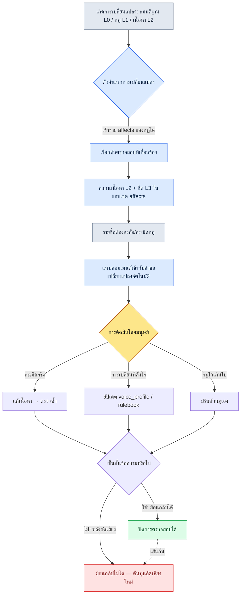

# 5.2 การตรวจสอบความสอดคล้อง โลก → ตัวละคร → เควสต์

ก่อนเข้าสู่ช่วงเบตาไม่นาน มีบั๊กรีพอร์ตหนึ่งใบถูกส่งขึ้นมาจากฝ่าย QA หัวข้อคือ "พระราชาพูดจาไม่มีหางเสียง" เนื้อความสั้นมาก "ในคัตซีนเปิดของฉาก 3.4 K_001 (กษัตริย์) พูดกับผู้เล่นว่า 'เฮ้ เดี๋ยวก่อน' ตัวละครนี้ตั้งแต่ฉาก 1.1 จนถึง 3.3 ใช้คำว่า 'ท่าน' มาตลอด"

เมื่อถามนักเขียนบท คำตอบกลับน่าประหลาดใจ "บทพูดนั้นผมไม่ได้เขียนนะครับ" พอตามรอยดูจึงพบว่าเป็นนักเขียนภายนอก (outsource) ที่รีบเติมบรรทัดแยกสาขาของคัตซีนเข้าไปอย่างรวดเร็ว ในไบเบิลตัวละครของเรามี voice_profile อยู่ก็จริง แต่นักเขียนภายนอกคนนั้นไม่เคยเห็นเอกสารฉบับนั้นเลย กฎอยู่ในเอกสาร แต่บทพูดเข้ามาจากนอกเอกสาร

นี่คือแก่นแท้ของอุบัติเหตุด้านความสอดคล้อง มันไม่ได้เกิดเพราะไม่มีกฎ แต่เกิดเพราะกฎตามไปไม่ถึงตัวเนื้อหา และถ้าบรรทัดนี้เป็นคัตซีน เรื่องจะยิ่งน่ากลัวขึ้น คัตซีนมักมีการอัดเสียงพากย์ของนักพากย์ติดมาด้วย ตอนเป็นข้อความ แก้ครั้งเดียวก็จบ แต่ถ้าพบหลังอัดเสียงไปแล้ว ก็จะตามมาด้วยต้นทุนที่ย้อนกลับไม่ได้ คือต้องเรียกนักพากย์มาใหม่ อัดเสียงใหม่ และมิกซ์เสียงใหม่ จุดประสงค์ที่แท้จริงของการตรวจสอบความสอดคล้องคือการดักให้ได้ "ก่อนการอัดเสียง"

บทนี้ว่าด้วยเวิร์กโฟลว์ที่ดักอุบัติเหตุนั้นด้วย rulebook และตัวตรวจสอบ (checker) แทนสายตามนุษย์ เราจะดูจากตัวผลงานจริง ว่า rulebook ของ lore_consistency_rule กลายเป็นอินพุตของตัวตรวจสอบได้อย่างไร voice_lint คัดความสั่นไหวของโทนออกมาเป็นรายชื่อต้องสงสัยได้อย่างไร และเหตุใดการตัดสินขั้นสุดท้ายจึงต้องคงไว้ที่มนุษย์จนถึงที่สุด

---

## 5.2.1 อุบัติเหตุด้านความสอดคล้องรั่วออกจากตรงไหน

เมื่อรวบรวมรีวิวผู้ใช้ของเกม RPG และ MMORPG ที่วางจำหน่ายแล้ว อุบัติเหตุด้านความสอดคล้องของเนื้อเรื่องจะลู่เข้าสู่รูปแบบไม่กี่อย่าง แม้ประเภทจะดูต่างกัน แต่สาเหตุแทบจะเป็นอันเดียวกัน

- **ความขัดแย้งของโลก**: ฉาก 1.1 บอกว่า "เวทมนตร์ถูกห้าม" → ฉาก 1.3 NPC กลับใช้เวทมนตร์อย่างไม่มีอะไรเกิดขึ้น
- **ความสั่นไหวของน้ำเสียง (voice)**: NPC คนเดียวกันเปลี่ยนน้ำเสียงและคำลงท้ายยกย่องไปตามแต่ละฉาก (อุบัติเหตุ "พระราชาพูดไม่มีหางเสียง" ข้างต้น)
- **ความขัดแย้งของเส้นเวลา**: NPC ที่ตายไปแล้วกลับมาปรากฏตัวอย่างไม่เป็นอะไรในช่วงท้าย (ตกหล่นการซิงค์แฟล็กการตาย)
- **รางวัลกับเรื่องเล่าไม่สอดคล้อง**: เรื่องเล่าบอกว่าเป็น "ดาบที่พระราชาประทานให้" แต่ในข้อมูลกลับเป็นไอเทมเกลื่อนกลาดธรรมดา
- **ความขัดแย้งของความสัมพันธ์ระหว่างฝ่าย**: ทันทีหลังประกาศเป็นศัตรูกับฝ่าย A NPC ของฝ่าย A กลับทักทายอย่างเป็นมิตร

ทั้งห้าอย่างดูเหมือนเป็นอุบัติเหตุที่ต่างกัน แต่เมื่อตามรอยดูแล้วล้วนรั่วจากจุดเดียวกัน คือ Layer 0 (สมมติฐานของโลก) หรือ Layer 1 (กฎ) เปลี่ยนไป แต่การเปลี่ยนแปลงนั้นไม่ได้แพร่กระจายไปถึง Layer 2 (เนื้อหา) และ Layer 3 (ชีตข้อมูล) กฎถูกอัปเดตแล้ว แต่เนื้อหายังหยุดอยู่บนกฎเก่า

การจะกันเรื่องนี้ด้วยการตรวจสอบด้วยมือนั้นเกินกำลัง ในหนึ่งฉากมี NPC 50 ตัว บทพูด 2,000 บรรทัด และเควสต์ 30 อันพันกันอยู่ การที่มนุษย์จะตามรอยได้ 100% ว่าเมื่อแก้กฎไปหนึ่งบรรทัดแล้วผลกระทบจะลามไปถึงไหนนั้นเป็นไปไม่ได้ บรรทัดที่ตกหล่นไปจะไม่ถูกจับในขั้นตรวจสอบ แต่จะไปถูกจับในช่องรีวิวหลังวางจำหน่าย

ถึงอย่างนั้น การตรวจสอบอัตโนมัติก็ไม่ได้รับประกัน 100% เช่นกัน หัวใจอยู่ที่การแบ่งบทบาท **การตรวจสอบอัตโนมัติคัดรายชื่อต้องสงสัยออกมาอย่างรวดเร็ว และมนุษย์เป็นผู้ตัดสิน** จุดประสงค์ของการทำให้เป็นอัตโนมัติคือการลดเวลาตรวจสอบของมนุษย์ ไม่ใช่การกำจัดมนุษย์ออกไป หากทำให้สมมติฐานข้อนี้พร่าเลือน ความล้มเหลวทั้งหมดที่จะกล่าวถึงข้างหลังก็จะตามมา

---

## 5.2.2 lore_consistency_rule — rulebook ที่ป้อนให้ตัวตรวจสอบ

เอกสาร L1 ฉบับหนึ่งของโปรเจกต์ A คือ `lore_consistency_rule.md` เอกสารนี้เป็นทั้งไกด์ที่มนุษย์อ่าน และในขณะเดียวกันก็เป็นอินพุตที่ตัวตรวจสอบนำไปพาร์ส `atoms` และ `affects` ในฟรอนต์แมตเตอร์มัดสองบทบาทนี้ไว้ในกายเดียวกัน

```markdown
---
title: กฎความสอดคล้องของโลก (lore)
layer: L1
atoms:
  - lore_check_world_rule
  - lore_check_character_voice
  - lore_check_timeline
  - lore_check_faction_relation
related:
  derives_from: [world_premise, narrative_pillar]
  affects: [main_quest/*, character_bible/*, dialogue_id_table]
---

## 1. กฎของโลก (World Rule)
- เริ่มต้นในสภาวะที่เวทมนตร์ถูกห้าม → เมื่อใช้เวทมนตร์ต้องระบุ (ช่วงเวลา ผู้ใช้ การอ้างความชอบธรรม) ให้ชัดเจน
- เทพเจ้าอยู่ในสภาวะนิ่งเงียบ → ห้ามบรรยายการตอบสนองโดยตรง (อนุญาตในความฝัน·ภาพนิมิต)

## 2. กฎน้ำเสียงตัวละคร
- บังคับให้อ้างอิง voice_profile ของแต่ละตัวละคร
- เมื่อเขียนบทพูดใหม่ ต้องปฏิบัติตาม voice_profile 5 หัวข้อ (คำศัพท์ ความยาวประโยค คำยกย่อง การแสดงอารมณ์ คำต้องห้าม)

## 3. กฎเส้นเวลา
- กำหนด status_timeline ให้ NPC ทุกตัว (มีชีวิต / บาดเจ็บ / เสียชีวิต / สูญหาย / เปลี่ยนตำแหน่ง)
- ตรวจ status_timeline อัตโนมัติ ณ ช่วงเวลาของบทพูดและการปรากฏตัว

## 4. กฎความสัมพันธ์ระหว่างฝ่าย
- บันทึกช่วงเวลาที่ faction_relation_matrix เปลี่ยน
- บทพูดหลังการเปลี่ยนต้องสะท้อนความสัมพันธ์ใหม่
```

บรรทัด `affects` เพียงบรรทัดเดียวกำหนดขอบเขตการสแกนของตัวตรวจสอบ เมื่อ world_premise เปลี่ยน ตัวตรวจสอบจะกวาดดู `main_quest/*`, `character_bible/*`, `dialogue_id_table` ทั้งหมดอีกครั้ง งานที่มนุษย์เคยตามรอยในหัวว่า "ผลกระทบจะไปถึงไหน?" กราฟความขึ้นต่อกัน (dependency graph) ที่เขียนไว้ใน rulebook ทำหน้าที่แทน

voice_profile เป็นทรัพยากร L2 แยกต่างหากที่ rulebook นี้อ้างอิงถึง โปรไฟล์ของตัวละครหนึ่งตัวถูกป้อนเป็นค่าตัวเลขและแบบแจกแจง (enumeration) เพื่อให้ตัวตรวจสอบใช้เป็นเกณฑ์เปรียบเทียบได้

```yaml
# character_bible/K_001_voice_profile.yaml
character_id: K_001
display_name: กษัตริย์
voice_profile:
  vocabulary_register: โบราณ_เป็นทางการ      # ระดับคำศัพท์
  avg_sentence_len: 18                   # ความยาวประโยคเฉลี่ย (อักขระ)
  honorific: "ท่าน"                      # คำยกย่องบุรุษที่ 2 (ตายตัว)
  emotion_expression: สำรวม               # ระดับการเปิดเผยอารมณ์
  forbidden_terms: ["เฮ้", "เดี๋ยวก่อน", "5555"] # คำต้องห้าม
```

ต้องมี yaml นี้ อุบัติเหตุที่ว่า "พระราชาพูดไม่มีหางเสียง" จึงจะกลายเป็นหัวข้อที่เครื่องเปรียบเทียบได้ ไม่ใช่สัญชาตญาณของมนุษย์ เมื่อ honorific เป็น "ท่าน" แต่ในบทพูดมี "เฮ้" นั่นไม่ใช่ความเห็น แต่เป็นรายการต้องสงสัยว่าละเมิดกฎ

---

## 5.2.3 ลำดับการตรวจสอบความสอดคล้อง

ตัวตรวจสอบจะทำงานในวินาทีที่เกิดการเปลี่ยนแปลง ลำดับเป็นดังนี้



สาขาสุดท้ายคือกระดูกสันหลังที่ซ่อนอยู่ของบทนี้ การตัดสินความสอดคล้องทั้งหมดต้อง **จบในขั้นข้อความ นั่นคือขั้นที่ย้อนกลับได้** หากการตรวจสอบเลยไปสู่หลังการอัดเสียงและคัดเลือกนักพากย์ การแก้ไขก็จะกลายเป็นเรื่องที่ย้อนกลับไม่ได้ ด้วยเหตุนี้ ตัวตรวจสอบอย่าง voice_lint และ timeline_lint จึงไม่ได้สำคัญที่ทำงาน "เร็ว" แต่สำคัญที่ทำงาน **แต่เนิ่น ๆ** บทพูดของคัตซีนต้องผ่านการตรวจอย่างน้อยหนึ่งครั้งก่อนเข้าคิวอัดเสียง

ตัวตรวจสอบมีสี่ชนิด แต่ละชนิดสอดคล้องแบบหนึ่งต่อหนึ่งกับหนึ่งหัวข้อใน rulebook

- `world_rule_lint.py` — กฎโลก L1 + เนื้อหา L2 ทั้งหมด → รายการต้องสงสัยว่าละเมิด เช่น การใช้เวทมนตร์·การตอบสนองของเทพเจ้า
- `voice_lint.py` — voice_profile + dialogue_id_table → บทพูดต้องสงสัยว่าน้ำเสียงสั่นไหว
- `timeline_lint.py` — npc status_timeline + ช่วงเวลาของบทพูดและการปรากฏตัวทั้งหมด → ความขัดแย้ง เช่น NPC ที่ตายแล้วกลับมาปรากฏ
- `faction_lint.py` — faction_relation_matrix + dialogue tone → บทพูดที่ขัดแย้งกับความสัมพันธ์

ตัวตรวจสอบทั้งสี่ไม่ได้แม่นยำ 100% ด้วยเหตุนี้ชื่อของผลลัพธ์จึงไม่ใช่ "การละเมิด" แต่เป็น "รายการต้องสงสัย"

---

## 5.2.4 บันทึกเซสชันจริง (worked transcript): รัน voice_lint หนึ่งรอบ

คำว่า "มีตัวตรวจสอบ" แบบนามธรรมนั้นยังจับต้องไม่ได้ เราจะลองรันจริงสักหนึ่งรอบ นี่คืออินพุตที่จำลองอุบัติเหตุ "พระราชาพูดไม่มีหางเสียง" ข้างต้น

**setup** — ดึงบทพูดสองบรรทัดที่จะตรวจสอบมาจาก dialogue_id_table

```
dialogue_id_204  speaker=K_001  text="เฮ้ เดี๋ยวก่อนสิ ฝั่งนั้นพูดมาก่อนเลย"
dialogue_id_217  speaker=K_007  text="...เวรเอ๊ย ล้มเหลวอีกแล้ว เริ่มใหม่ตั้งแต่ต้น"
```

**prompt** — ตัวตรวจสอบเองทำงานบนพื้นฐานของกฎ (regex·การเทียบความยาว·การจับคู่คำต้องห้าม) AI จะถูกใส่ไว้เฉพาะตำแหน่งที่อธิบาย "ทำไมจึงต้องสงสัย" ด้วยภาษาธรรมชาติที่นักเขียนบทอ่านได้ พรอมต์ LLM ของขั้นตรวจสอบมีเนื้อความเต็มดังนี้

```
นี่คือรายการต้องสงสัยที่ voice_lint คัดออกมา อย่าตัดสิน แต่ให้อธิบาย
เฉพาะว่าแต่ละรายการน่าจะละเมิดหัวข้อใดของ voice_profile พร้อมเหตุผล 1~2 ประโยค
อย่าฟันธงว่า "ละเมิด/ไม่ละเมิด" ให้พูดแค่ "ต้องสงสัยว่า~" เท่านั้น

[voice_profile]
K_001: honorific="ท่าน", avg_sentence_len=18, forbidden=["เฮ้","เดี๋ยวก่อน"]
K_007: forbidden=["เวรเอ๊ย"]

[รายการต้องสงสัย]
- dialogue_id_204 (K_001): "เฮ้ เดี๋ยวก่อนสิ ฝั่งนั้นพูดมาก่อนเลย"
- dialogue_id_217 (K_007): "...เวรเอ๊ย ล้มเหลวอีกแล้ว เริ่มใหม่ตั้งแต่ต้น"
```

**ผลลัพธ์ดิบจาก Claude** (ถอดมาตามเดิม ไม่ได้สรุปหรือเรียบเรียง)

```
[dialogue_id_204 / K_001]
บทพูดนี้ต้องสงสัยว่าขัดแย้งกับหัวข้อ honorific voice_profile กำหนดคำยกย่อง
บุรุษที่ 2 ไว้ตายตัวเป็น "ท่าน" แต่บทพูดนี้ใช้ "ฝั่งนั้น" และไม่ปรากฏคำยกย่อง
ตัวมันเองเลย อีกทั้ง "เฮ้" และ "เดี๋ยวก่อน" ใน forbidden_terms ปรากฏทั้งคู่
จึงต้องสงสัยว่าหลุดออกจากระดับคำศัพท์ (โบราณ_เป็นทางการ) แม้จะดูไม่ขัดกับ
เกณฑ์ความยาวประโยคเฉลี่ย 18 อักขระโดยตรง แต่การที่น้ำเสียงเองกลายเป็นกันเอง
ก็ต้องสงสัยว่าเป็นสัญญาณการละเมิด

[dialogue_id_217 / K_007]
"เวรเอ๊ย" ใน forbidden_terms ถูกใช้ตรง ๆ จึงต้องสงสัยว่าละเมิดหัวข้อคำต้องห้าม
อย่างไรก็ตาม เนื่องจากไม่ได้ระบุหัวข้อ emotion_expression ของ K_007 (นักวิชาการ)
มาให้ จึงยากที่จะตัดสินด้วยข้อมูลเพียงเท่านี้ว่าการแสดงออกนี้เป็นการขับเน้นอารมณ์
ที่ตั้งใจ หรือเป็นเพียงการหลุดออกนอกกรอบ ต้องให้นักเขียนบทพิจารณาตัดสิน
```

ในผลลัพธ์นี้มีความตรงไปตรงมาสองอย่างที่เราจงใจคงไว้ ประการแรก ใน 204 AI บอกว่า "ความยาวประโยคเฉลี่ยดูไม่ขัดกันโดยตรง" จึง **ไม่ดันทุรังว่าหัวข้อที่ไม่ได้ละเมิดเป็นการละเมิด** ประการที่สอง ใน 217 AI ยอมรับว่า "เนื่องจากไม่ได้ระบุหัวข้อ emotion_expression มาให้จึงตัดสินยาก" และ **ยอมรับว่าข้อมูลไม่พอ แล้วส่งการตัดสินคืนให้มนุษย์** ถ้า AI ดันทุกข้อสงสัยให้กลายเป็น "ยืนยันว่าละเมิด" นั่นคือตัวตรวจสอบที่อันตรายกว่า

**verify** — นักเขียนบทรับคอมเมนต์นี้มาตามเดิมจากคำขอเปลี่ยนแปลง การตัดสินเป็นหน้าที่ของนักเขียนบท

- 204: ละเมิดจริง เป็นบทพูดที่นักเขียนภายนอกใส่เข้าไปโดยไม่ได้ดู voice_profile → แก้เนื้อหา ตรวจซ้ำ
- 217: การละเมิดที่ตั้งใจ เป็นบทพูดขับเน้นอารมณ์ตอน K_007 พังทลายในฉาก 3.4 → เพิ่มแฟล็ก `emotion_peak_exception` ใน voice_profile แล้วลงทะเบียน 217 เป็นข้อยกเว้น

ตัวตรวจสอบเดียวกันคัดสองรายการนี้ออกมา แต่บทสรุปกลับตรงข้ามกัน อันหนึ่งแก้เนื้อหา อีกอันแก้กฎ การที่เครื่องทำการแยกสาขานี้เองโดยอัตโนมัติไม่ได้ คือหัวใจของหัวข้อถัดไป

---

## 5.2.5 ทำไมการตัดสินจึงเป็นที่ของมนุษย์

ที่ตัวตรวจสอบคัดได้แค่ระดับต้องสงสัยแล้วส่งการตัดสินต่อไป มีอยู่สามเหตุผล

ประการแรก **การละเมิดที่ตั้งใจมีอยู่จริง** ในฉากที่ตัวละครพังทลายหรือเปลี่ยนแปลง น้ำเสียงจะสั่นไหวอย่างจงใจ 217 ข้างต้นคือกรณีนั้น ตัวตรวจสอบแบบปฏิเสธอัตโนมัติจะปิดกั้นเจตนาการกำกับของนักเขียนบท

ประการที่สอง **ตัวกฎเองวิวัฒน์** หากข้อสงสัยชนิดเดียวกันถูกตัดสินเป็น "การเปลี่ยนที่ตั้งใจ" อยู่เรื่อย ๆ นั่นคือสัญญาณว่ากฎตามความเป็นจริงไม่ทัน ผลการตรวจไม่ได้ทำให้แก้แค่เนื้อหา แต่ทำให้แก้ rulebook ด้วย

ประการที่สาม **ตัวละครและฝ่ายใหม่ต้องการช่วงเรียนรู้** NPC ใหม่ที่ voice_profile ยังถูกเติมแค่สองสามหัวข้อนั้น เป็นเรื่องปกติที่จะมีข้อสงสัยขึ้นมาเยอะ หากในช่วงนี้ตั้งให้ปฏิเสธอัตโนมัติ นักเขียนบทก็จะมองตัวตรวจสอบเป็นศัตรู

เส้นแบ่งระหว่างการตรวจอัตโนมัติกับการตัดสินของมนุษย์ต้องชัดเจน ตัวตรวจสอบจึงจะอยู่รอด หากทำเป็นแบบปฏิเสธอัตโนมัติ ภายในหนึ่งเดือนเหล่านักเขียนบทจะบอกว่า "ปิดมันซะเถอะ" เหมือนกับการติดเซ็นเซอร์อัตโนมัติที่ไวเกินไปไว้ที่ประตูทางเข้าบริษัท พอคนเดินผ่านทีไรประตูก็ปิด สุดท้ายก็จะมีใครสักคนถอดเซ็นเซอร์นั้นทิ้ง ตัวตรวจสอบไม่ใช่อุปกรณ์ที่ทำหน้าที่ปิดประตู แต่ต้องเป็นอุปกรณ์ที่คอยบอกว่า "มีคนเดินผ่านมาทางนี้"

ขอเสริมข้อสังเกตหนึ่งข้อ หลักการที่ว่าการตรวจสอบต้องจบในขั้นข้อความ (เส้นกั้นในผังลำดับข้างต้น) ใช้กับการตัดสินของมนุษย์ด้วยเช่นกัน การตัดสิน "การละเมิดที่ตั้งใจ" ของนักเขียนบทก็ต้องจบก่อนการอัดเสียง การกลับคำหลังอัดเสียงไปแล้วจะเปลี่ยนจากปัญหาของตัวตรวจสอบกลายเป็นปัญหาต้นทุนกระบวนการผลิต (รายละเอียดทั้งหมดของเส้นแบ่งย้อนกลับได้/ย้อนกลับไม่ได้อยู่ที่ 5.4.5)

---

## 5.2.6 การวัดผล — ก่อนและหลัง 6 เดือน

ในโปรเจกต์ A เราทยอยนำตัวตรวจสอบทั้ง 4 ชนิดมาใช้เป็นขั้น ๆ และวัดผลตลอด 6 เดือน ด้านล่างอ้างอิงจากบันทึกการวัดจริง แต่ถอดมาเป็นทิศทาง·อัตราส่วนแทนค่าสัมบูรณ์ (วัดภายในบริษัท ไม่ใช่การประมาณของผู้เขียน)

- **เวลาตรวจสอบหนึ่งบท**: ก่อนนำมาใช้ราว 5 วัน → หลังนำมาใช้ราว 2 วัน (ไม่ถึงครึ่ง)
- **อุบัติเหตุด้านความสอดคล้องที่พบหลังวางจำหน่าย**: 3\~5 ครั้งต่อบท → 0\~1 ครั้ง
- **ความเร็วในการผลิตหนึ่งบทต่อนักเขียน 1 คน**: 4 สัปดาห์ → 2.5 สัปดาห์
- **ความถี่ในการอัปเดต rulebook (L1)**: ไตรมาสละ 1\~2 ครั้ง → เดือนละ 1\~2 ครั้ง

ข้อสุดท้ายน่าสนใจที่สุด เมื่อมีตัวตรวจสอบ การเปลี่ยนกฎบ่อยก็ปลอดภัย เพราะพอแก้กฎไปหนึ่งบรรทัด ผลกระทบจะปรากฏให้เห็นโดยอัตโนมัติ ความกลัวการเปลี่ยนแปลงจึงลดลง และกฎก็วิวัฒน์เร็วขึ้น ผลที่แท้จริงของเครื่องมือด้านความสอดคล้องจึงไม่ใช่ "ลดอุบัติเหตุได้" แต่ค่อนไปทาง "ทำให้กล้าเปลี่ยนกฎโดยไม่กลัว" เสียมากกว่า

อนึ่ง ตัวเลขข้างต้นเป็นตัวเลข ณ ช่วงที่ตัวตรวจสอบทั้ง 4 ชนิดทำงานครบ สิ่งที่สำคัญกว่าคือในช่วงเริ่มต้น แค่ voice_lint อันเดียวก็ให้ผลที่เห็นได้ชัดแล้ว ไม่จำเป็นต้องเปิดครบทั้ง 4 ชนิดตั้งแต่แรก

---

## 5.2.7 จะวาง AI ไว้ที่ไหน

ตัวตรวจสอบอัตโนมัติส่วนหลักนั้นใช้แบบอิงกฎจะมีประสิทธิภาพกว่า เพราะอินพุตเดียวกันต้องให้ผลเดียวกัน ความเชื่อมั่นจึงจะสะสม ในขณะที่ LLM เป็นแบบไม่กำหนดผลแน่นอน (non-deterministic) จึงไม่เหมาะกับตำแหน่งนั้น AI เข้าไปอยู่ในอีกสี่ตำแหน่ง

- **การตรวจจับรายการต้องสงสัยว่าละเมิดกฎ** → กฎ (regex·คีย์เวิร์ด·ความยาว·การตรวจโครงสร้าง) ไม่ใช่ LLM
- **การอธิบายเหตุผลของรายการต้องสงสัย** → LLM คำอธิบายภาษาธรรมชาติว่า "ทำไมจึงต้องสงสัย" ที่เห็นใน worked transcript ข้างต้น
- **การร่างบทพูดทางเลือก** → LLM ร่างเพื่อให้นักเขียนบทพิจารณา ผู้ตัดสินใจขั้นสุดท้ายคือนักเขียนบท
- **การเสนอรายการอัปเดต voice_profile อัตโนมัติ** → LLM ดึงรูปแบบจากเนื้อหาหลายสิบฉากเพื่อเสนอแนวทางเสริมหัวข้อ

กฎนั้นเร็วและกำหนดผลแน่นอน ส่วน LLM เก่งเรื่องการอธิบายและการสร้าง หากเอาบทบาทของสองสิ่งนี้มาปนกันจะพังทั้งคู่ ถ้าฝากการตรวจไว้กับ LLM จะเกิดเรื่องที่บทพูดเดียวกันเมื่อวานผ่านแต่วันนี้ติด และถ้าฝากการอธิบายไว้กับ regex ก็จะได้แค่ภาษาเครื่องว่า "ละเมิดหัวข้อ honorific" ออกมาเท่านั้น

---

## 5.2.8 ลำดับการนำมาใช้และความล้มเหลวที่พบบ่อย

ถ้าทำตัวตรวจสอบครบทั้ง 4 ชนิดตั้งแต่แรก ภาระจะมาก่อนผล ลำดับที่แนะนำคือเริ่มจากอันที่ถูกที่สุดและให้ผลมากที่สุด

1. **มาตรฐาน 5 หัวข้อของ voice_profile** (ราว 1 เดือน) — ตั้งฟอร์แมตของ character_bible ให้อยู่ตัวก่อน อันนี้มาก่อนตัวตรวจสอบ
2. **voice_lint เวอร์ชันขั้นต่ำ** (ราว 1 สัปดาห์) — แค่จับคู่คำต้องห้าม การกันแค่หนึ่งคำก็ลดอุบัติเหตุบน SNS หลังวางจำหน่ายได้ไตรมาสละ 1\~2 ครั้ง
3. **timeline_lint** (1\~2 สัปดาห์) — ตรวจแฟล็กการตาย แค่จับ NPC ที่ตายแล้วกลับมาปรากฏก็ให้ความรู้สึกต่างมาก
4. **world_rule_lint + faction_lint** (1\~2 เดือน) — อีกสองชนิดที่เหลือ
5. **AI ช่วยเสริม** (เพิ่มอีก 1\~2 เดือน) — รวมการอธิบายและการสร้างร่างเข้าด้วยกัน

ขอย้ำว่าแค่ขั้นที่ 2 (voice_lint) อันเดียวก็ให้ผลมากแล้ว อุบัติเหตุ "พระราชาพูดไม่มีหางเสียง" ข้างต้นคือชนิดที่ดักได้ด้วยขั้นนี้เพียงขั้นเดียวพอดี

ความล้มเหลวที่เกิดซ้ำในกระบวนการนำมาใช้ก็แทบจะกำหนดไว้ตายตัวแล้วเช่นกัน

- **ทำเป็นแบบปฏิเสธอัตโนมัติ** → คืนกลับสู่โครงสร้างรายการต้องสงสัย + การตัดสินโดยมนุษย์
- **rulebook ถูกดำเนินการแยกขาดจากนักเขียนบท** → กำหนดให้การเปลี่ยน rulebook ต้องมีฉันทามติของนักเขียนบท และให้นักเขียนบทขอเปลี่ยน rulebook ได้
- **voice_profile เป็นแค่พิธีการ** → เติม 5 หัวข้อให้ครบสมบูรณ์ด้วยตัวละคร 1 ตัวก่อนแล้วจึงขยาย
- **ไม่รู้ว่าผลการตรวจอยู่ที่ไหน** → บังคับให้แนบเข้ากับคอมเมนต์คำขอเปลี่ยนแปลงโดยอัตโนมัติ
- **ให้ LLM ทำการตรวจเอง** → การตรวจคือกฎ ส่วนการอธิบายเท่านั้นที่เป็น LLM
- **ตรวจสอบหลังอัดเสียง** → การตรวจสอบจบในขั้นข้อความ ไม่ปล่อยให้ข้ามช่วงที่ย้อนกลับได้ไป

ข้อสุดท้ายแพงกว่าข้ออื่นทั้งหมดข้างต้น ความล้มเหลวอื่นทำให้เสียเวลา แต่ความล้มเหลวนี้ทำให้เสียตารางงานของนักพากย์

---

ในบทถัดไป (5.3) จะว่าด้วยลำดับการเขียนเนื้อหาเนื้อเรื่องด้วย AI ช่วยเสริมแทนตัวตรวจสอบ เราจะดูวิธีฉีดโทน L0 และกฎ L1 เข้าไปเป็นคอนเทกซ์ เพื่อให้ AI ออกคำตอบของโลกของเราแทนที่จะเป็นคำตอบทั่วไป

---

### สรุปประเด็นสำคัญของบท
- อุบัติเหตุด้านความสอดคล้องไม่ได้เกิดเพราะไม่มีกฎ แต่เกิดเพราะกฎไม่แพร่กระจายไปถึงตัวเนื้อหา
- ตัวตรวจสอบต้องคัดแค่ระดับต้องสงสัยและให้มนุษย์เป็นผู้ตัดสิน ตัวตรวจสอบจึงจะไม่ถูกทิ้ง
- การตรวจสอบความสอดคล้องทั้งหมดต้องจบในขั้นข้อความ (ที่ย้อนกลับได้) ก่อนการอัดเสียง

### ตัวอย่างบทถัดไป
- 5.3 การเขียนเนื้อเรื่องด้วย AI ช่วยเสริม — การฉีดคอนเทกซ์โทน L0·กฎ L1

---

## ลองทำดู

**setup** — เลือกตัวละคร 1 ตัวจาก character_bible แล้วเติม voice_profile 5 หัวข้อ (ระดับคำศัพท์·ความยาวประโยคเฉลี่ย·คำยกย่อง·การแสดงอารมณ์·คำต้องห้าม) ให้ครบสมบูรณ์เป็น yaml จากนั้นดึงบทพูดเดิม 10 บรรทัดของตัวละครเดียวกันมาจาก dialogue_id_table รวมไว้ในไฟล์เดียว

**prompt** — ใช้พรอมต์ช่วยตรวจจาก worked transcript ข้างต้นตามเดิม หัวใจคือข้อจำกัดสองข้อ "อย่าตัดสิน" และ "พูดแค่ \~ต้องสงสัยว่า เท่านั้น" แนบ voice_profile yaml และบทพูด 10 บรรทัดเข้าไปในอินพุต

**verify** — ตัดสินรายการต้องสงสัยที่ออกมาทีละบรรทัดด้วยตัวคุณเอง ถ้าละเมิดจริงก็แก้เนื้อหา ถ้าเป็นการเปลี่ยนที่ตั้งใจก็เพิ่มแฟล็กข้อยกเว้นใน voice_profile ตรวจไปพร้อมกันด้วยว่า AI ดันทุรังว่า "หัวข้อที่ไม่ได้ละเมิด" เป็นการละเมิดหรือไม่ และยอมรับ "ข้อมูลไม่พอ" หรือไม่ หาก AI ฟันธงว่าทุกหัวข้อเป็นการละเมิด ให้เสริมข้อจำกัด "อย่าตัดสิน" ในพรอมต์ให้แข็งแรงขึ้น

### ฉบับย่อสำหรับคนเดียว

หากเป็นการพัฒนาคนเดียวที่ไม่มีทั้งตัวตรวจสอบ 4 ชนิดและ rulebook คุณก็ยังสร้างผลแบบเดียวกันได้ด้วยพรอมต์เพียงอันเดียวโดยไม่ต้องมีตัวตรวจสอบส่วนหลัก แค่ดูแล voice_profile yaml ของแต่ละตัวละครด้วยมือ และทุกครั้งที่เขียนบทพูดใหม่ ก็แนบ yaml ของตัวละครนั้น + บทพูดใหม่เข้ากับพรอมต์ช่วยตรวจข้างต้นเพื่อรับ "รายการต้องสงสัย" ไม่มีระบบอัตโนมัติก็จริง แต่โครงสร้างหัวใจที่ว่า **มนุษย์เป็นผู้ตัดสิน AI เป็นผู้อธิบาย** ยังคงอยู่เหมือนเดิม แค่รักษาบรรทัดเดียวให้ได้ก็พอ — ผ่านการตรวจนี้สักหนึ่งครั้งก่อนส่งต่อให้การอัดเสียงและการสังเคราะห์เสียง หลักการที่ว่าไม่ปล่อยให้ข้ามช่วงที่ย้อนกลับได้ไปนั้น ไม่ขึ้นกับขนาดของทีม
