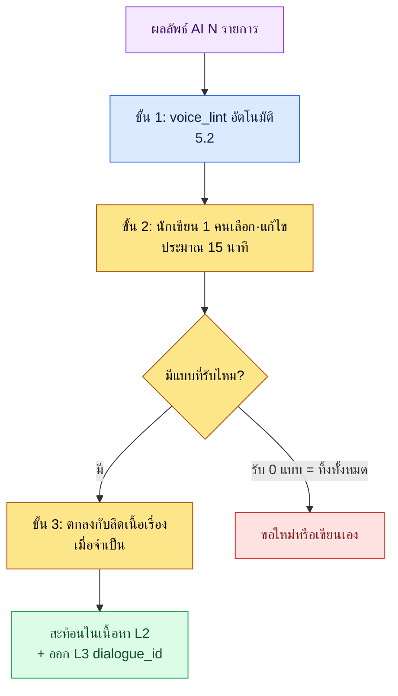
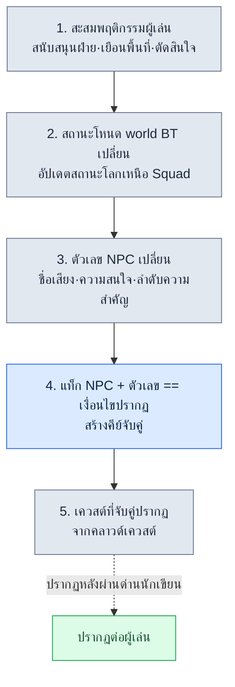

# 5.3 การเขียนเนื้อเรื่องโดยมี AI ช่วย

วันนั้นเป็นวันที่ผมกำลังร่างบทพูดแรกของ NPC ข้างเคียงตัวใหม่ ผมพิมพ์ลงในช่องแชตที่ว่างเปล่าว่า "ช่วยสร้างบทพูดให้ NPC ช่างตีเหล็กในหมู่บ้าน 5 บรรทัด" 5 วินาทีต่อมา หน้าจอก็แสดง "ผู้กล้าเอ๋ย จงมอบอาวุธของเจ้าไว้กับข้า" มันไม่ใช่แค่ประโยคที่รู้สึกเหมือนเคยเห็นที่ไหนสักแห่ง แต่เป็นประโยคที่ผมแทบจะบอกได้ว่าเห็นมาจากที่ไหนแน่ ๆ ต่อให้เอาพรอมต์เดียวกันไปใส่ในเกมอื่นของทีมอื่น ก็จะได้คำตอบแบบเดียวกันกลับมา สิ่งที่ผมตระหนักได้ในชั่วขณะนั้นไม่ใช่ว่าโมเดลอ่อนแอ แต่เป็นว่าผมไม่ได้บอกอะไรเกี่ยวกับเกมของเราให้โมเดลรู้เลยสักอย่าง

AI เขียนประโยคแฟนตาซีทั่ว ๆ ไปได้ดี แต่เขียนประโยคของโลกในเกมเราไม่ได้ ความต่างมีเพียงสิ่งเดียว นั่นคือการป้อนบริบท (context) ถ้าส่งโทน L0 และกฎ L1 ไปพร้อมกันในทุก ๆ คำขอ บรรทัดที่ AI พ่นออกมาจะเปลี่ยนจาก "ประโยคที่รู้สึกเหมือนเคยเห็นที่ไหนสักแห่ง" ไปเป็น "ประโยคของเกมนี้" บทนี้ว่าด้วยการปฏิบัติจริงในการบริหารการป้อนนั้นเป็น 4 ชั้น และในตอนท้ายจะชี้ให้เห็นถึงการประยุกต์ใช้แบบก้าวหน้า (world BT (BehaviorTree, ต้นไม้พฤติกรรม) + คลาวด์เควสต์) ที่ยกหลักการเดียวกันขึ้นไปสู่ระดับการจำลองโลกทั้งใบ ในฐานะแนวหน้าของงาน RnD

---

## 5.3.1 สิ่งที่เกิดขึ้นเมื่อบริบทว่างเปล่า

ในสายงานเนื้อเรื่อง การมี AI ช่วยเป็นพื้นที่ที่ถูกนำมาใช้เร็วที่สุด และสูญเสียความเชื่อมั่นเร็วที่สุดเช่นกัน เพราะรูปแบบความล้มเหลวแทบจะเหมือนกันทุกครั้ง

ถ้าโยนคำสั่ง "บทพูดเริ่มเควสต์ 5 บรรทัด" ไป ก็จะได้แฟนตาซีทั่วไป 5 แบบที่ขึ้นต้นด้วย "ผู้กล้าเอ๋ย หมู่บ้านของเรา..." กลับมา ถ้าบอก "ช่วยแก้บทพูดของตัวละครนี้หน่อย" เสียง (voice) ก็จะถูกปรับให้กลายเป็นมาตรฐานเดียวกัน จน NPC ทุกตัวลู่เข้าหาน้ำเสียงที่คล้าย ๆ กัน ถ้าบอก "ช่วยเขียนเรื่องย่อบทที่ 1" ก็จะได้ค่าเฉลี่ยของเรื่องย่อ RPG ที่เคยเห็น ๆ มาออกมา

ปัญหาไม่ได้อยู่ที่โมเดล แต่อยู่ที่บริบทว่างเปล่า โมเดลพ่นค่าเฉลี่ยของข้อมูลที่ใช้เทรนออกมา ถ้าไม่ต้องการค่าเฉลี่ย ก็ต้องให้เบาะแสที่จะพาให้ห่างจากค่าเฉลี่ย หัวข้อของบทนี้คือ จะสร้างเบาะแสนั้นอย่างไรและจะป้อนเข้าไปอย่างไร

ในโปรเจกต์ MMORPG ที่ผู้เขียนดูแล (ต่อไปนี้เรียกว่าโปรเจกต์ A) การมี AI ช่วยงานเนื้อเรื่องจะวางบริบท 4 ชั้นเรียงตามลำดับ โครงสร้างที่แยก NarrativeDocs ออกเป็น Layer 0\~4 ใน 5.1 ถูกนำกลับมาใช้เป็นหน่วยของการป้อนตรงนี้นั่นเอง

<svg viewBox="0 0 720 300" xmlns="http://www.w3.org/2000/svg" font-family="sans-serif">
  <rect x="20" y="20" width="680" height="46" rx="6" fill="#1f2d3d"/>
  <text x="40" y="40" fill="#fff" font-size="14" font-weight="bold">Layer A · ระบบพรอมต์</text>
  <text x="40" y="58" fill="#9fb3c8" font-size="11">เพอร์โซนานักเขียน · ข้อห้าม (แทบไม่เปลี่ยน นิยามครั้งเดียว)</text>

  <rect x="20" y="78" width="680" height="46" rx="6" fill="#27496d"/>
  <text x="40" y="98" fill="#fff" font-size="14" font-weight="bold">Layer B · วิสัยทัศน์ L0</text>
  <text x="40" y="116" fill="#bcd4e6" font-size="11">world_premise · narrative_pillar · tone_manifesto (≈7,000 tok, แคชชิง)</text>

  <rect x="20" y="136" width="680" height="46" rx="6" fill="#2e6171"/>
  <text x="40" y="156" fill="#fff" font-size="14" font-weight="bold">Layer C · กฎ L1 (ป้อนแบบเลือก)</text>
  <text x="40" y="174" fill="#cfe8df" font-size="11">เลือกเฉพาะหัวข้อ _summary ของกฎที่เกี่ยวกับงาน (แคชชิง)</text>

  <rect x="20" y="194" width="680" height="46" rx="6" fill="#3e885b"/>
  <text x="40" y="214" fill="#fff" font-size="14" font-weight="bold">Layer D · เนื้อหาใกล้เคียง L2</text>
  <text x="40" y="232" fill="#e3f2e8" font-size="11">บทพูดล่าสุดของตัวละครเดียวกัน · เรื่องย่อบทเดียวกัน (ต้นฉบับตามเดิม เปลี่ยนทุกครั้ง)</text>

  <rect x="180" y="254" width="360" height="36" rx="6" fill="#c0392b"/>
  <text x="200" y="277" fill="#fff" font-size="13" font-weight="bold">คำสั่งงาน: "บทพูด 3 แบบของ K_007 ณ จุดนี้"</text>

  <line x1="360" y1="66" x2="360" y2="78" stroke="#888" stroke-width="2"/>
  <line x1="360" y1="124" x2="360" y2="136" stroke="#888" stroke-width="2"/>
  <line x1="360" y1="182" x2="360" y2="194" stroke="#888" stroke-width="2"/>
  <line x1="360" y1="240" x2="360" y2="254" stroke="#888" stroke-width="2"/>
</svg>

ไม่ได้ใส่ครบทั้ง 4 ชั้นทุกครั้ง ดึงออกมาเฉพาะชั้นที่จำเป็นตามประเภทของงาน ถ้าเป็นร่างบทพูดถัดไปของตัวละครหนึ่ง A + B (เฉพาะโทน) + D (บทพูดล่าสุด 10 บรรทัดของตัวละครนั้น) ก็เพียงพอ ถ้าเป็นเรื่องย่อของเควสต์ข้างเคียงตัวใหม่ ก็เพิ่ม C (กฎโครงสร้าง quest) เข้าไป ถ้าเป็นทางแยก 4 แบบของผลลัพธ์ ก็จะหนักขึ้นด้วย C (กฎทางแยก) + D (เนื้อหาทั้งหมดก่อนหน้าทางแยก) เปรียบเสมือนหยิบชีตเพอร์โซนา ภาพรวมโลกหนึ่งบรรทัด หน้ารูลบุ๊ก และชุดเนื้อหาใกล้เคียงจากแฟ้มเอกสารบนโต๊ะ มาเลือกส่งให้พอดีกับขนาดของงาน

---

## 5.3.2 บันทึกเซสชันจริง (worked transcript) หนึ่งชุด — บทพูดที่เผยอารมณ์ครั้งแรกของ K_007

แทนที่จะอธิบายแบบนามธรรม จะตามคำขอจริงหนึ่งคำขอไปจนจบ เป็นงานร่างบทพูด 3 แบบในฉากที่ตัวละครเดียวกัน (NPC แบบนักวิชาการ ID ภายในบริษัทคือ `K_007`) ต้องเผยอารมณ์ออกมาเป็นครั้งแรก เริ่มจากตัวพรอมต์เต็ม

**พรอมต์ที่ส่งไป (Layer A + B (โทน) + D + คำสั่งงาน + รูปแบบผลลัพธ์):**

```
[ระบบ]
นายคือนักเขียนเนื้อเรื่องของโปรเจกต์ A อย่าใช้คำซ้ำซากของ RPG อย่าง "ผู้กล้า"·"ผู้ถูกเลือก"
น้ำเสียงให้ตามโทนของบทพูดก่อนหน้าด้านล่างเป๊ะ ๆ เซตติงที่ไม่รู้อย่ากุขึ้นเอง
ให้ตอบว่า "จากบริบทไม่สามารถตัดสินได้" นายเขียนแค่ร่าง การตัดสินใจเป็นของฉัน

[โทน L0 — ตัดตอนจาก tone_manifesto]
อารมณ์ของโลกใบนี้คือการเก็บงำ ตัวละครจะไม่พูดความรู้สึกออกมาง่าย ๆ
อารมณ์เผยออกมาไม่ใช่ในรูปการระเบิด แต่ในรูปรอยร้าว ประโยคขาดห้วนและสั้น

[อ้างอิง — บทพูด 5 บรรทัดล่าสุดของ K_007 (เรียงตามเวลา ต้นฉบับตามเดิม)]
1. "...อันนั้นผมเองก็เพิ่งเคยได้ยินเหมือนกันนะครับ"
2. "มีบันทึกไหม ถ้าไม่มีก็ต้องสงสัยไว้ก่อน"
3. "อย่าเพิ่งขยับจนกว่าจะแน่ใจ"
4. "ความเห็นของผมก็มีแค่นั้น"
5. "...ขอโทษครับ ผมเย็นชาเกินไปหรือเปล่า"

[สถานการณ์]
NPC เพื่อนร่วมทางกลับมาในสภาพบาดเจ็บ นักวิชาการต้องเผยอารมณ์ออกมาเป็นครั้งแรก

ขอแค่ 3 แบบเท่านั้น แต่ละแบบไม่เกิน 25 ตัวอักษร ต่อท้ายแต่ละแบบด้วยป้ายกำกับ (ประเภทปฏิกิริยา: โกรธ/เศร้า/ปฏิเสธ)
ตัดคำอธิบายและคำเกริ่นนำออก
```

**ผลลัพธ์ดิบของ Claude (ตามเดิม ไม่สรุปย่อหรือดัดแปลง):**

```
1. "...ทำไมต้องแบกมันไว้คนเดียว โง่จริง ๆ" (ประเภทปฏิกิริยา: เศร้า)
2. "ผมน่าจะดูบันทึก ผม ผมพลาดไปเอง" (ประเภทปฏิกิริยา: ปฏิเสธ)
3. "ไม่เป็นไร ทุกอย่างไม่เป็นไร เพราะงั้นหยุด—" (ประเภทปฏิกิริยา: ปฏิเสธ)
```

จุดสำคัญคือไม่หยุดอยู่ตรงนี้ นักเขียนอ่านทั้งสามแบบแล้วตรวจสอบ แบบที่ 1 โทนถูกต้อง รอยร้าวที่บทพูดล่าสุดบรรทัดที่ 5 "...ขอโทษครับ" แสดงออกมา แบบที่ 1 รับช่วงต่อด้วยคำเดียวว่า "โง่จริง ๆ" เป็นตัวเลือกที่จะรับไว้ แบบที่ 2 การพูดติด ๆ ขัด ๆ ของ "ผม ผมพลาดไปเอง" ขัดกับการเก็บงำของนักวิชาการอยู่นิดหน่อย พักไว้ก่อน แบบที่ 3 ป้ายกำกับผิด การพูดซ้ำ "ไม่เป็นไร" ไม่ใช่การปฏิเสธ แต่ใกล้เคียงการหลีกหนีมากกว่า ซึ่งใน voice_profile ของเราไม่มีรูปแบบที่นักวิชาการจัดการอารมณ์ด้วยการหลีกหนี ปฏิเสธ

**คำขอใหม่ (ส่งไปอีกครั้งพร้อมระบุเหตุผลที่ปฏิเสธ):**

```
แบบที่ 3 ปฏิเสธ การพูดซ้ำ "ไม่เป็นไร" ไม่ใช่รูปแบบของนักวิชาการคนนี้ หมอนี่จัดการอารมณ์
ไม่ใช่ด้วยการหลีกหนี แต่ด้วย 'การโทษตัวเองที่ตรวจสอบข้อเท็จจริงล้มเหลว' แบบที่ 1 ฉันจะรับไว้
ในตำแหน่งของแบบที่ 2·3 ขอสองแบบที่ผิวสัมผัสต่างจากแบบที่ 1 มาใหม่ ไม่ต้องพูดติดขัด ไม่เกิน 25 ตัวอักษร
```

**ผลลัพธ์ครั้งที่สองของ Claude:**

```
2. "บันทึกไม่โกหก ผมต่างหากที่ไม่ได้ดู" (ประเภทปฏิกิริยา: โทษตัวเอง)
3. "...นั่งลงก่อน รักษาแผลก่อน ค่อยพูดทีหลัง" (ประเภทปฏิกิริยา: เศร้า)
```

คราวนี้ผ่านทั้งสองแบบ แบบที่ 2 นำคำศัพท์หลักของนักวิชาการอย่าง "บันทึก" (บทพูดล่าสุดบรรทัดที่ 2 "มีบันทึกไหม") กลับมาเขียนใหม่ให้เป็นสื่อกลางของการโทษตัวเอง ส่วนแบบที่ 3 แสดงรูปแบบที่นักวิชาการกดอารมณ์ลงด้วยการกระทำ ผ่านประโยคสั่งแบบเก็บงำ การรับขั้นสุดท้ายคือแบบที่ 1 + แบบที่ 2 + แบบที่ 3 สามบรรทัดนี้ผ่านการตรวจสอบอัตโนมัติ `voice_lint` ใน 5.2 แล้วถูกนำไปสะท้อนในเนื้อหา L2 และได้รับ `dialogue_id` ออกมาที่ L3

ในบันทึกเซสชันชุดเดียวนี้มีทุกอย่างของบทนี้อยู่ครบ การป้อนโทน (L0) ช่วยกู้แบบที่ 1 ไว้ เนื้อหาใกล้เคียงที่เป็นต้นฉบับตามเดิม (L2) ทำให้คำศัพท์ "บันทึก" ของนักวิชาการถูกนำกลับมาใช้ในคำขอใหม่ การบังคับรูปแบบผลลัพธ์กันการพูดเรื่อยเปื่อย และด่านปฏิเสธของนักเขียนกรองป้ายกำกับที่ผิดของแบบที่ 3 ออกไป AI ไม่ได้ตัดสินใจขั้นสุดท้ายแม้แต่บรรทัดเดียว

---

## 5.3.3 Layer A — ระบบพรอมต์ บรรทัดเดียวกำหนดทุกสิ่ง

เป็นนิยามเพอร์โซนาที่ปูอยู่บนสุด กำหนดไว้ครั้งเดียวแล้วแทบไม่เปลี่ยน บล็อกระบบในบันทึกเซสชันข้างต้นคือตัวจริงของมัน ในห้าบรรทัด บรรทัดสุดท้าย ("เขียนร่าง การตัดสินใจเป็นของนักเขียน") สำคัญที่สุด ถ้าขาดบรรทัดนี้ไป AI จะเสนอประโยคที่ทำเป็น "ขั้นสุดท้าย" ออกมาอย่างมั่นใจ แล้วนักเขียนก็จะกลายเป็นคนให้คะแนนแทนที่จะตรวจสอบ และบรรทัดที่สาม ("เซตติงที่ไม่รู้อย่าสร้างขึ้น ให้ตอบว่าตัดสินไม่ได้") สำคัญเป็นอันดับสอง ถ้าไม่มีบรรทัดนี้ โมเดลจะเติมช่องว่างด้วยคำโกหกที่ดูเข้าท่า ในงานเนื้อเรื่อง คำโกหกที่ดูเข้าท่าจะย้อนกลับมาเป็นความขัดแย้งของ lore (เนื้อเรื่องโลก) ในอีกไม่กี่วันถัดมา

---

## 5.3.4 Layer B — วิสัยทัศน์ L0 และตำแหน่งของแคชชิง

L0 มีปริมาณน้อย (ตามเกณฑ์ 5.1 ประมาณ 4.5 บท) แทบจะป้อนทั้งหมดได้ทุกครั้ง โดยประมาณตามเกณฑ์ภาษาเกาหลี `world_premise.md` ประมาณ 2,500 โทเค็น `narrative_pillar.md` ประมาณ 1,500 โทเค็น `tone_manifesto.md` ประมาณ 3,000 โทเค็น รวมกันประมาณ 7,000 โทเค็น (ตัวเลขเหล่านี้เป็นการประมาณของผู้เขียน (ยังไม่ได้ตรวจสอบ) จะเปลี่ยนไปตาม tokenizer และการปรับปรุงเอกสาร)

ถ้าส่ง 7,000 โทเค็นใหม่ทุก ๆ คำขอ ค่าใช้จ่ายจะสะสมขึ้น ดังนั้นจึงเปิดใช้แคชชิงพรอมต์ (prompt caching) เป็นฟีเจอร์ที่ทั้ง Anthropic และ OpenAI รองรับ และเมื่อแคชเข้าเป้า (cache hit) ค่าใช้จ่ายโทเค็นอินพุตจะลดลงมาก หัวใจคือการแยกสิ่งที่เปลี่ยนกับสิ่งที่ไม่เปลี่ยนออกจากกันภายในข้อความ

```python
messages = [
    {"role": "system", "content": SYSTEM_PROMPT},
    {"role": "user", "content": [
        {"type": "text", "text": L0_FULL,      "cache_control": {"type": "ephemeral"}},
        {"type": "text", "text": L1_SELECTED,  "cache_control": {"type": "ephemeral"}},
        {"type": "text", "text": L2_ADJACENT},   # เปลี่ยนทุกครั้ง — ไม่แคช
        {"type": "text", "text": TASK_INSTRUCTION},  # เปลี่ยนทุกครั้ง
    ]},
]
```

L0 และ L1 ที่ติด `cache_control` เป็นเป้าหมายของการแคช ส่วนเนื้อหาใกล้เคียง L2 และคำสั่งงานเปลี่ยนทุกครั้งจึงไม่แคช การรวมบล็อกแคชไว้ส่วนหน้าของข้อความเสมอเป็นตัวกำหนดอัตราเข้าเป้า ถ้าบล็อกที่เปลี่ยนแทรกเข้ามาด้านหน้า แคชที่ตามหลังจะถูกทำให้เป็นโมฆะทั้งหมด การวางลำดับนี้ผิดคือสาเหตุที่พบบ่อยที่สุดของการเปิดแคชชิงแล้วค่าใช้จ่ายไม่ลดลง

> รายละเอียดของตัวเลขอัตราการเข้าเป้าแคชและการประหยัดค่าใช้จ่าย จะกล่าวในบทของ ส่วนที่ 22 (ค่าใช้จ่าย) ตรงนี้แค่จำหลักการ "ไล่สิ่งที่เปลี่ยนไปไว้ข้างหลัง" ก็พอ

---

## 5.3.5 Layer C — ไม่ใส่กฎ L1 ทั้งก้อน

รูลบุ๊ก L1 มีปริมาณมาก ถ้าใส่ทั้งหมดบริบทจะแตก และที่แย่กว่านั้นคือโมเดลจะพลาดประเด็นหลัก เลือกเฉพาะกฎที่เกี่ยวกับงาน แถมยังเลือกเฉพาะหัวข้อ `_summary` อีกด้วย

ตอนร่างผลลัพธ์ทางแยกของเควสต์หลัก จะเลือก `dialogue_branching_rule` และ `faction_relation_matrix` ถ้าเป็นบทพูด NPC ตัวใหม่ ก็เป็น `voice_profile` และ `tone_manifesto` ของ NPC ตัวนั้น ถ้าเป็นรายการใหม่ในพจนานุกรม lore ก็เป็น `lore_consistency_rule` และ `world_premise` ถ้าเป็นโครงเควสต์ข้างเคียง ก็เป็น `quest_template` และ `reputation_model` การเลือกทำโดยคนเองโดยตรง หรือสกัดอัตโนมัติตามกราฟ wikilink (ส่วนที่ 7) ซึ่งเมื่อสกัดอัตโนมัติจะให้ความสำคัญกับ recall มากกว่า precision เพราะความเสียหายจากการที่กฎหนึ่งข้อตกหล่นไป มากกว่าความเสียหายจากการที่กฎหนึ่งข้อเข้ามาเกินมาก

แทนที่จะใส่เนื้อหารูลบุ๊กทั้งหมด ให้วางหัวข้อ `_summary` ไว้ที่หัวไฟล์รูลบุ๊กแล้วป้อนแค่นั้น

```markdown
---
title: กฎทางแยก
layer: L1
---

## _summary
- ทางแยกเกิดเฉพาะตอนจบบทเท่านั้น
- ทางแยกมี 2~3 แบบ ห้ามเกิน 4 แบบขึ้นไป
- การเลือกทางแยกส่งผลต่อชื่อเสียง +/-1 ทางแยกตอนจบ +/-3
- ผลลัพธ์ของทุกทางแยกต้องแสดงผลภายใน 24 ชั่วโมง
- ทางแยกย้อนกลับไม่ได้ (แนะนำแยกเซฟ แสดงผลบน UI)

## 1. กฎจุดเวลาที่ทางแยกเกิดขึ้น
(คำอธิบายละเอียด สำหรับผู้ดูแลอ้างอิง — ไม่ป้อนให้ LLM)
...
```

`_summary` 5 บรรทัดมีผลต่อคุณภาพผลลัพธ์ของ LLM มากกว่าเนื้อหา 50 บรรทัด โมเดลปฏิบัติตามกฎที่สั้นและฟันธงได้ดีกว่า คำอธิบายยาว ๆ ทำให้ความสนใจของโมเดลกระจาย และความสนใจที่กระจายก็ย้อนกลับมาเป็นการละเมิดกฎ

---

## 5.3.6 Layer D — ไม่สรุปย่อเนื้อหาใกล้เคียง

บทพูดล่าสุด เควสต์ใกล้เคียง เรื่องย่อบทเดียวกัน เป็นบริบทที่ผันผวนมากที่สุด สำหรับบทพูดใหม่ของตัวละครเดียวกัน ให้ใส่บทพูดล่าสุด 10 บรรทัดของตัวละครนั้นเรียงตามเวลา สำหรับเควสต์กลางบท ให้ใส่เรื่องย่อบทและสรุปเควสต์ในบทเดียวกันบรรทัดละเรื่อง สำหรับตอนจบที่เป็นผลของทางแยก ให้ใส่เนื้อหาทั้งหมดก่อนหน้าทางแยกและข้อความของตัวเลือก ถ้าใส่มากเกินไป LLM จะพ่นค่าเฉลี่ยออกมา ถ้าใส่น้อยเกินไปก็จะได้ผลลัพธ์แบบทั่วไป จุดที่เหมาะสมอยู่ระหว่างโทเค็น 1,500\~3,000 (ตามการสังเกตของผู้เขียน ยังไม่ได้ตรวจสอบ)

กฎหลักหนึ่งข้อ เนื้อหาใกล้เคียงให้ใส่เป็นต้นฉบับตามเดิม โดยไม่แปรรูปหรือสรุปย่อ ที่บันทึกเซสชันข้างต้นใส่บทพูด 5 บรรทัดล่าสุดของนักวิชาการลงไปตามเดิมโดยไม่แตะต้อง โมเดลจึงสามารถหยิบคำว่า "บันทึก" มาได้อย่างแม่นยำในขั้นคำขอใหม่ และนำมาใช้ซ้ำเป็นสื่อกลางของการโทษตัวเอง หากใส่ 5 บรรทัดนั้นไปในรูปสรุปย่อว่า "นักวิชาการเป็นคนรอบคอบและเย็นชา" การเลือกอันละเอียดอ่อนของนักเขียนทั้งหมดจะหายไป แล้วโมเดลก็จะกลับไปสู่ค่าเฉลี่ยอีกครั้ง การสรุปย่อไม่ได้แค่ลดข้อมูล แต่ลบการตัดสินใจที่นักเขียนได้ตัดสินไปแล้ว

---

## 5.3.7 เวิร์กโฟลว์การตรวจสอบของนักเขียน — ใช้อัตราการทิ้งเป็นตัวชี้วัด

ผลลัพธ์ของ AI เป็นร่างเสมอ การตรวจสอบจะต้องผ่านด่านที่กำหนดไว้



กรณีที่นักเขียนเลือก 0 จาก N รายการ (ทิ้งทั้งหมด) ก็เป็นเรื่องปกติ ดังที่แบบที่ 3 ถูกปฏิเสธในบันทึกเซสชันข้างต้น การปฏิเสธไม่ใช่ความล้มเหลว แต่เป็นหลักฐานว่าด่านทำงาน ดังนั้นจึงวัดอัตราการทิ้งแยกตามนักเขียนและตามตัวละคร เพื่อใช้เป็นตัวชี้วัดคุณภาพของการป้อนบริบท

ถ้าอัตราการทิ้ง 0\~20% แสดงว่าบริบทเพียงพอ เป็นการเดินงานที่เสถียร ปล่อยไว้ตามเดิม 20\~50% เป็นช่วงการเดินงานทั่วไป แค่มอนิเตอร์ ถ้าขึ้นไป 50\~80% ให้กลับไปตรวจว่าการเลือกกฎ L1 ตกหล่นไปหรือไม่ ถ้าเกิน 80% ไม่ใช่ปัญหาของกฎรายข้อ แต่เป็นที่ระบบพรอมต์·เพอร์โซนาเองที่ผิดไป จึงต้องเขียน Layer A ใหม่ อัตราการทิ้งจะรวบรวมสัปดาห์ละครั้งแยกตามนักเขียนแล้วแชร์กันในการทบทวน (รายสัปดาห์)

อย่างไรก็ตาม อัตราการทิ้งไม่ใช่ตัวชี้วัดสัมบูรณ์ ตัวละครที่เปลี่ยนเร็ว (เช่น จุดเปลี่ยนที่เผยอารมณ์ครั้งแรกอย่าง K_007 ในบันทึกเซสชันข้างต้น) แม้อัตราการทิ้งสูงก็เป็นเรื่องปกติ ตัวเลขคือจุดเริ่มต้นของการสนทนา ไม่ใช่คำพิพากษา

---

## 5.3.8 ความปลอดภัย — จะกันการรั่วไหลของบริบทอย่างไร

L0\~L1 คือ IP หลักของเกม ถ้ารู้สึกเป็นภาระที่จะส่งให้ LLM API ภายนอกตามเดิม ทางเลือกก็จะแตกออกไป วิธีใช้ API ภายนอกตามเดิมด้วยสัญญาห้ามนำไปเทรนเร็วที่สุด แต่ต้องผ่านการตรวจสอบของฝ่ายกฎหมาย วิธีแทนชื่อบริษัท·ชื่อเฉพาะด้วย placeholder ก่อนส่ง มีค่าใช้จ่ายในการประมวลผลเพิ่ม และความเป็นธรรมชาติเสียหาย การโฮสต์เอง (โอเพนโมเดล) ข้อมูลปลอดภัยแต่ภาระด้านคุณภาพ·การเดินงานสูง ส่วนไฮบริดที่เก็บ L0 ไว้ภายในแล้วส่งแค่ร่างออกไปข้างนอกนั้นเดินงานซับซ้อน

โปรเจกต์ A ของผู้เขียนใช้วิธีแรก (API ภายนอก + สัญญาห้ามนำไปเทรน) เคยลองวิธีที่สองแล้วเลิก เพราะการแทนด้วย placeholder ทำให้เนื้อหากลายเป็นมาตรฐานเดียวกันในรูป "นักวิชาการ ○○ แห่งราชอาณาจักร ○○ พูดเรื่อง ○○" จนทำลายคุณภาพผลลัพธ์ การที่การทำให้ไม่ระบุตัวตน (anonymization) ฆ่าคุณภาพ เป็นการแลกได้แลกเสีย (trade-off) ที่ปรากฏซ้ำตลอดทั้งเล่ม (ดูบทการทำให้ไม่ระบุตัวตนใน ส่วนที่ 1) ในงานเนื้อเรื่องความเสียหายนั้นใหญ่เป็นพิเศษ เพราะชื่อเฉพาะคือโทนนั่นเอง

---

## 5.3.9 ความล้มเหลวที่พบบ่อยและวิธีแก้

ถ้าโยนแค่คำสั่งงานโดยไม่มีระบบพรอมต์ ก็จะได้ค่าเฉลี่ย ปูเพอร์โซนาและข้อห้ามก่อน ถ้าป้อน L0 ทั้งหมดทุกครั้งแต่ไม่ใช้แคชชิง ค่าใช้จ่ายจะรั่ว รวมบล็อกแคชไว้ข้างหน้า ถ้าใส่รูลบุ๊ก L1 ทั้งก้อน โมเดลจะพลาดประเด็นหลัก ดึงเฉพาะหัวข้อ `_summary` ถ้าใส่เนื้อหาใกล้เคียงแบบสรุปย่อ การเลือกของนักเขียนจะถูกลบ อ้างต้นฉบับตามเดิม ถ้าไม่กำหนดรูปแบบผลลัพธ์ คำตอบจำนวนมากจะขึ้นต้นด้วย "นี่คือ 3 ตัวเลือก:" แล้วก็ตามมาด้วยเหตุที่นักเขียนเข้าใจผิดว่าคำเกริ่นนั้นเป็นเนื้อหา ระบุจำนวน·ความยาว·ป้ายกำกับให้ชัด ถ้าใช้ผลลัพธ์ AI เป็นขั้นสุดท้าย ด่านตรวจสอบจะพังลง ให้ผ่านด่านนักเขียนเสมอ ถ้าไม่วัดอัตราการทิ้ง สุขภาพของเครื่องมือจะขึ้นกับความรู้สึกของคน รวบรวมเป็นรายสัปดาห์แล้วแชร์ในการทบทวน

---

## 5.3.10 จากการประยุกต์ใช้แบบอนุรักษ์นิยมสู่การประยุกต์ใช้แบบก้าวหน้า

ที่ผ่านมาเป็นการประยุกต์ใช้แบบอนุรักษ์นิยม นักเขียนป้อนบริบทอย่างพิถีพิถัน และ AI สร้างแค่ร่างทีละบรรทัด ๆ หน่วยงานคืองานเล็ก ๆ อย่าง "บทพูด 3 แบบถัดไปของตัวละครนี้" "เรื่องย่อของเควสต์นี้" เสถียร แต่มีขีดจำกัดด้านขนาดการผลิตจำนวนมากและการตอบสนองแบบไดนามิก

ตรงนี้ขอชี้สิ่งหนึ่งก่อน การสร้างแบบโพรซีเดอรัล (procedural generation)·การจำลองโลก·เควสต์ไดนามิก คือวิสัยทัศน์ที่นักออกแบบเกมวาดไว้บนกระดาษมาตั้งแต่ 20\~30 ปีก่อน PCG ที่อิงรูลบุ๊กแบบกำหนด (deterministic) จัดการกับพื้นที่ตัวเลขอย่างห้องดันเจี้ยน·ออปชันอาวุธ·การกระจายการสปอว์นได้ แต่เอื้อมไม่ถึงเนื้อหาภาษาธรรมชาติ·เพอร์โซนาตัวละคร·ทางแยกเรื่องราว·บทสนทนา NPC ส่วนสำคัญของงานออกแบบจึงยังคงค้างอยู่บนกระดาษ ความก้าวหน้าของ LLM และโมเดลภาพในช่วงปี 2024\~2026 ได้ดึงพื้นที่นั้นมาสู่ตำแหน่งที่ทำให้เป็นจริงได้ ความหมายหลักของความก้าวหน้าของ AI ไม่ใช่คะแนนของโมเดล แต่อยู่ที่ความเป็นไปได้ในการทำให้งานออกแบบที่อยู่บนกระดาษมานานกลายเป็นจริง อย่างไรก็ตาม การที่ความเป็นไปได้เปิดขึ้น กับการที่มันลงตัวเป็นระบบที่เดินงานได้จริง เป็นคนละเรื่องกัน

### การแยก Layer เป็นเงื่อนไขตั้งต้นของการสร้างแบบโพรซีเดอรัล

การแยก Layer 0\~4 ใน 5.1 ไม่ใช่แค่การจัดระเบียบ แต่เป็นเงื่อนไขตั้งต้นของการสร้างแบบโพรซีเดอรัล ห้าชั้นแต่ละชั้นสอดคล้องกับขั้นตอนใดของไปป์ไลน์การสร้าง (L0 anchor → L1 รูลบุ๊ก → L2 เนื้อหา → L3 ตัวเลข → L4 ด่าน) ได้กล่าวไว้ใน §6.6 และ 5.1.11 ประเด็นมีเพียงหนึ่ง — บนเอกสารก้อนเดียว ตัวสร้างจะกำหนดไม่ได้ว่าจะเริ่มอ่านจากไหนและเขียนลงที่ไหน ไม่รู้ว่า L0 อยู่ตรงไหนทำให้บริบทพร่ามัว และ L1·L2 ชนกันในไฟล์เดียวจนสายการผลิตจำนวนมากพังลง การแยก Layer ต้องมาก่อน แล้วการสร้างแบบโพรซีเดอรัลจึงทำงานได้บนนั้น ตรงนี้นำเงื่อนไขนั้นมาประยุกต์ใช้กับขั้นการผลิตจำนวนมากของการมี AI ช่วยงานเนื้อเรื่อง

### โครงของการประยุกต์ใช้แบบก้าวหน้า — คลาวด์เควสต์

สามองค์ประกอบผูกเข้าด้วยกัน หนึ่ง NPC Persona ถูกสร้างแบบโพรซีเดอรัล NPC หลักเป็นฝีมือนักเขียน แต่ NPC ข้างเคียงผลิตจำนวนมากด้วยไปป์ไลน์ generator·Squad ใน 6.2\~6.3 แต่ละ Persona จะติดแท็ก (อาชีพ·ฝ่าย·แนวโน้ม·บทบาท) มาพร้อมกับ `voice_profile` สอง world BT อยู่เหนือ Squad ขึ้นไป ถ้า Squad ผูกพฤติกรรมของกลุ่ม NPC ในจุดล่าหนึ่ง world BT ก็อยู่เหนือนั้นโดยรับค่าสะสมของพฤติกรรมผู้เล่นมาอัปเดตสถานะของโลกทั้งใบ ผู้เล่นช่วยฝ่ายไหน ไปพื้นที่ไหนบ่อย ตัดสินใจอย่างไร จะเขย่าสถานะโหนดของ world BT และโหนดที่ถูกเขย่าก็สะท้อนไปยังตัวเลข (ชื่อเสียง·ความสนใจ·ลำดับความสำคัญ) ของ NPC ในเขตอิทธิพล สาม เควสต์เป็นโมเดลคลาวด์ เควสต์ทั้งหมดยกเว้นเควสต์หลักถูกสร้างแบบโพรซีเดอรัล แต่ละเควสต์ลอยอยู่พร้อมแท็ก (ใคร·ที่ไหน·ทำไม·เมื่อไร) และเงื่อนไขการปรากฏ ไม่มีเควสต์ใดถูกตรึงไว้กับ NPC ตัวใดตัวหนึ่ง

การปรากฏผ่าน 5 ขั้นตอน



ถ้าเปรียบเทียบให้เห็นภาพ เควสต์ไม่ได้วางเรียงอยู่บนชั้นหนังสือในห้องสมุด แต่เป็นเมฆที่ลอยอยู่กลางอากาศ เมื่อ NPC ไปถึงสถานะใดสถานะหนึ่ง เมฆที่เข้ากับตัวเองก็จะลอยลงมาให้คว้าได้ ในโครงสร้างนี้ AI ไม่ใช่ผู้ช่วยที่เขียนทีละบรรทัด แต่จัดการสามสิ่งพร้อมกัน เนื้อหาภาษาธรรมชาติของ Persona·เควสต์ที่สร้างแบบโพรซีเดอรัล (คำอธิบาย·บทพูด) การแปรผันของคำศัพท์เมื่อสถานะ world BT สะท้อนลงใน NPC (คง `voice_profile` เดิมไว้แต่หัวข้อสนทนาแปรไปตามสถานะโลก) และตัวจำแนกความสงสัยในขั้นตรวจสอบ (เควสต์นี้ปรากฏกับ NPC ตัวนี้ได้หรือไม่)

### เส้นแบ่งย้อนกลับไม่ได้ — การตรวจสอบต้องจบที่ขั้นข้อความ

ในการประยุกต์ใช้แบบก้าวหน้า เส้นแบ่งย้อนกลับได้/ย้อนกลับไม่ได้ (5.4.5) ก็ยังคงมีชีวิตอยู่ตามเดิม ถ้าบทพูดของเควสต์ที่ปรากฏจากคลาวด์ไหลเข้าสู่ไปป์ไลน์เสียง (voice) โดยยังไม่ผ่านการตรวจสอบ จะย้อนคืนด้วยการ rollback โค้ดไม่ได้ ดังนั้นการวางด่านตรวจสอบทั้งหมด (`voice_lint`, ตัวจำแนกความสงสัย, ด่านนักเขียน) ไว้หน้าเส้นแบ่งย้อนกลับไม่ได้ จึงเป็นกลไกความปลอดภัยของการประยุกต์ใช้แบบก้าวหน้า ยิ่งเพิ่มการผลิตจำนวนมากแบบอัตโนมัติเข้ามา ด่านเหล่านี้ยิ่งต้องแข็งแกร่งกว่าการประยุกต์ใช้แบบอนุรักษ์นิยม

### หยุดที่ไหน และทำไมจึงไม่หยุด

หนังสือเล่มนี้ไม่ได้กล่าวถึงรูปแบบสมบูรณ์ของการประยุกต์ใช้แบบก้าวหน้า เพราะเป็นเนื้อหาขนาดหนังสืออีกเล่มหนึ่ง และเงื่อนไขโครงสร้างพื้นฐานต่างกันไปตามแต่ละบริษัท·โปรเจกต์ จำแค่สองอย่างก็พอ ก่อนอื่น ทีมที่ทำการประยุกต์ใช้แบบอนุรักษ์นิยมไม่ได้ ก็ทำการประยุกต์ใช้แบบก้าวหน้าไม่ได้เช่นกัน ถ้าด่านตรวจสอบไม่เดินในการประยุกต์ใช้แบบอนุรักษ์นิยม ในการประยุกต์ใช้แบบก้าวหน้าคลาวด์ก็จะพุ่งกระจาย การเดินงานจะอยู่รอดได้ ต้องมีโครงสร้างพื้นฐานการสร้างแบบโพรซีเดอรัล เครื่องมือนิยาม·ทดสอบโหนด world BT การจำแนกความสงสัยอัตโนมัติ + ด่านนักเขียนของเควสต์ที่ปรากฏ การติดตามอัตราการปรากฏ·อัตราการทิ้ง·ความพึงพอใจของผู้เล่นพร้อมกัน และการเก็บคืน·เปลี่ยนเควสต์ที่ปรากฏผิดโดยอัตโนมัติ ครบพร้อมกัน ถ้าขาดไปหนึ่งใน 5 อย่าง จะถูกล้มเลิกภายในหนึ่งไตรมาส เพราะอุบัติเหตุด้านความสอดคล้องจะพุ่งจนการตรวจสอบโดยมนุษย์ตามไม่ทัน

ต่อมา การประยุกต์ใช้แบบก้าวหน้าไม่ใช่เครื่องมือเพิ่มการผลิตจำนวนมาก แต่เป็นเครื่องมือเพิ่มการตอบสนองแบบไดนามิก ถ้ามุ่งแต่การผลิตจำนวนมาก ค่าเฉลี่ยของ RPG ทั่วไปจะเต็มอยู่ในคลาวด์ แล้วผู้เล่นก็จะเจอโลกที่ "ดูหลากหลายขึ้นแต่ว่างเปล่ายิ่งกว่า" แต่ก็ไม่ได้แปลว่าเส้นทางนี้มีแต่ความเสี่ยง พื้นที่นี้คือแนวหน้าของงาน RnD ในการออกแบบเกม ตรงจุดที่การสร้างแบบโพรซีเดอรัล·การจำลอง·LLM มาบรรจบกัน เป็นจุดที่มีความเป็นไปได้สูงที่สุดที่รูปแบบเกมใหม่จริง ๆ จะถือกำเนิด แม้จะมีโอกาสน้อยที่จะนำมาใช้ในบริษัทในตอนนี้ แต่ก็คุ้มค่าที่จะมองไว้เป็นหนึ่งในทิศทางของ 5\~10 ปีข้างหน้า

---

## 5.3.11 ลองทำดูตามจนจบทั้งบท

นี่คือขั้นตอนในการทำซ้ำการประยุกต์ใช้แบบอนุรักษ์นิยมของบทนี้ตามเดิม

**setup.** ให้รวมไฟล์ L0 สามไฟล์ (`world_premise.md`·`narrative_pillar.md`·`tone_manifesto.md`) เข้าเป็นข้อความเดียวแล้วเก็บไว้ในตัวแปร `L0_FULL` เขียนระบบพรอมต์ตามห้าบรรทัดในบันทึกเซสชันข้างต้นตามเดิม แต่อย่าตัดบรรทัดสุดท้าย ("เขียนร่าง การตัดสินใจเป็นของนักเขียน") ออก รวบรวมบทพูดล่าสุด 10 บรรทัดของตัวละครที่จะร่างบทพูดเป็นข้อความต้นฉบับตามเดิม

**prompt.** ประกอบข้อความตามลำดับ `[ระบบ] → [โทน L0] → [อ้างอิง: บทพูดก่อนหน้าต้นฉบับ] → [สถานการณ์] → [รูปแบบผลลัพธ์]` ในรูปแบบผลลัพธ์ ให้ระบุ "จำนวน N แบบเป๊ะ ๆ / จำนวนตัวอักษรสูงสุดต่อแบบ / ป้ายกำกับ / ห้ามใส่อย่างอื่นใดทั้งสิ้น" ให้แน่ชัด ติด `cache_control` เฉพาะ L0 และ L1 แล้วไล่บล็อกที่เปลี่ยนไปไว้หลังข้อความ

**verify.** ตรวจสอบ N แบบที่ได้รับมาทีละบรรทัด ดูว่าโทนต่อเนื่องกับบทพูดก่อนหน้าหรือไม่ ป้ายกำกับตรงกับปฏิกิริยาจริงหรือไม่ มีรูปแบบที่ตัวละครเราไม่ใช้ (หลีกหนี·พูดติดขัด ฯลฯ) แทรกเข้ามาหรือไม่ แบบที่จะปฏิเสธให้ระบุเหตุผลแล้วขอใหม่ การรับ 0 แบบก็เป็นเรื่องปกติ และให้บันทึกเป็นอัตราการทิ้ง เฉพาะแบบที่ผ่านให้ผ่าน `voice_lint` แล้วสะท้อนใน L2 และออก `dialogue_id` ที่ L3

**ฉบับย่อสำหรับคนเดียว.** แม้ไม่มี API·แคชชิง·`voice_lint` หัวใจก็ยังเหมือนเดิม มีช่องแชต ChatGPT/Claude หนึ่งช่องก็พอ ทุกครั้งให้คัดลอกวางบทพูดล่าสุด 5\~10 บรรทัดของตัวละครไว้ข้างหน้าสุด ต่อท้ายรูปแบบผลลัพธ์ 3 บรรทัดเสมอ และในคำตอบที่ได้รับ แบบที่จะปฏิเสธให้เขียนเหตุผลแล้วขอใหม่ แทนที่จะใช้แคชชิง ให้คงเธรดสนทนาเดียวกันไว้ บริบทก่อนหน้าก็จะคงอยู่ตามเดิม อัตราการทิ้งนั้น นับด้วยมือเขียนลงในกระดาษหนึ่งแผ่นว่า "สัปดาห์นี้รับ 12 / ทั้งหมด 30" ก็เพียงพอ ต่อให้เครื่องมือเล็ก โครงของการป้อน 4 ชั้นและด่านตรวจสอบก็ทำงานกับนักเขียนคนเดียวได้เหมือนกัน

---

### สรุปประเด็นสำคัญของบท
- ในบริบท 4 ชั้น (ระบบ·L0·L1·เนื้อหาใกล้เคียง) แค่ขาดไปชั้นเดียว ผลลัพธ์ก็ลู่เข้าหาค่าเฉลี่ย
- แคชชิงมีชีวิตอยู่บนการแยก คือไล่ L0·L1 ที่ไม่เปลี่ยนไว้ข้างหน้า แล้วเลื่อนเนื้อหาที่เปลี่ยนไว้ข้างหลัง
- ด่านตรวจสอบและอัตราการทิ้งต้องทำงาน การประยุกต์ใช้แบบก้าวหน้า (คลาวด์เควสต์) จึงจะไม่พุ่งกระจาย

### ตัวอย่างบทถัดไป
- 5.4 ความสอดคล้องของบทสนทนา·เสียง (voice) — สกัด·อัปเดต `voice_profile` ด้วย AI และตรวจสอบเสียง
