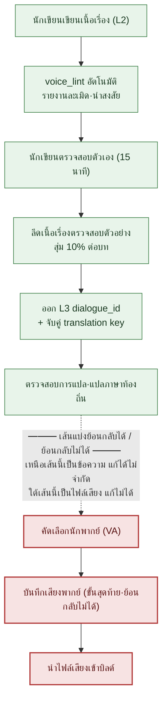

# 5.4 ความสอดคล้องของบทพูดและเสียงตัวละคร

ห้องอัดเสียง ผู้กำกับสวมหูฟังและยกมือขึ้นเพื่อให้คิว นักพากย์อ่านบทของ NPC ที่เป็นนักวิชาการ "ว้าว นี่มันสุดยอดไปเลยครับ" มือของผู้กำกับหยุดนิ่ง ตัวละครคนนี้ตลอด 5 บทไม่เคยใช้คำอุทานว่า "ว้าว" แม้แต่ครั้งเดียว เขาเป็นนักวิชาการที่ไม่เอ่ยคำหยาบหรือคำอุทานสมัยใหม่ออกจากปาก และพูดทิ้งท้ายประโยคแบบค่อย ๆ จางหายไปจนจบ แต่ในบทกลับมีบรรทัดนั้นปรากฏอยู่ตรง ๆ

ตรงนี้เกิดต้นทุนขึ้นสองอย่างพร้อมกัน อย่างแรก หากต้องแก้บรรทัดนั้น นักพากย์ก็ต้องอ่านใหม่ ค่าตัวและเวลาในสตูดิโอนับเป็นนาฬิกาที่เดินอยู่แล้ว อย่างที่สอง ซึ่งน่ากลัวกว่าคือกรณีที่ผู้กำกับจับบรรทัดนั้นไม่ได้แล้วปล่อยผ่านไป เมื่อบันทึกเสียงเสร็จและไฟล์เสียงเข้าไปอยู่ในบิลด์แล้ว นักวิชาการคนนั้นจะพูดแบบนั้นในเกมไปตลอดกาล ไฟล์เสียงที่อัดไว้แล้วย้อนกลับด้วยการแก้บรรทัดเดียวอย่างข้อความไม่ได้ ต้องจองนักพากย์คนเดิม สภาพเสียงแบบเดิม และห้องอัดเดิมขึ้นมาใหม่

บทนี้ว่าด้วยเส้นประที่อยู่หน้าห้องอัดนั้น เหนือเส้นประคือข้อความจึงแก้ได้ไม่จำกัด ใต้เส้นประคือไฟล์เสียงจึงแก้ไม่ได้ การตรวจสอบบทพูดทั้งหมดต้องจบลงเหนือเส้นประ และเพื่อให้เป็นเช่นนั้น แต่ละตัวละครต้องมีข้อกำหนดว่า "คนนี้พูดแบบนี้" บันทึกไว้เป็นไฟล์ ไม่ใช่อยู่ในหัว และทุกครั้งที่มีบทพูดใหม่ขึ้นมาก็ต้องถูกเทียบกับไฟล์นั้นโดยอัตโนมัติ ไฟล์นั้นเราเรียกว่า `voice_profile` และเครื่องมือเทียบเรียกว่า `voice_lint`

---

## 5.4.1 จุดที่เสียงตัวละครเริ่มแกว่ง

ในบรรดาอุบัติเหตุด้านความสอดคล้องของเนื้อเรื่อง สิ่งที่เกิดบ่อยที่สุดคือเสียงตัวละครที่แกว่ง หลังเปิดตัวไปแล้วถึงจะมีรายงานเข้ามาว่า "ทำไม NPC ตัวนี้จู่ ๆ ก็เปลี่ยนวิธีพูดไป" สาเหตุแทบจะเหมือนกันทุกครั้ง

เมื่อเปลี่ยนนักเขียน NPC ตัวเดิมก็กลายเป็นคนอื่นไป ต่อให้ไม่เปลี่ยนนักเขียน พอผ่านไป 6 เดือน นักเขียนคนเดิมก็ลืมโทนของตัวเอง เวลาเขียนบทพูดใหม่โดยไม่เปิดดูบทพูดเก่าของตัวละครนั้น บริบทก็ขาดตอน หากกฎเสียงตัวละครอยู่แต่ในหัวของนักเขียนและไม่มีเป็นเอกสาร ก็ส่งต่อให้คนถัดไปไม่ได้ และสาเหตุที่ห้าที่เพิ่มขึ้นเร็วที่สุดในช่วงสองปีมานี้ — เมื่อโยนคำสั่งใส่ LLM ว่า "ช่วยสร้างบทพูดของ NPC ตัวนี้ให้หน่อย" โดยไม่ให้ข้อมูลตัวละคร AI จะคืนบทพูดที่เฉลี่ย ๆ กลาง ๆ จึงไม่ใช่เสียงของใครเลย

สาเหตุที่ห้านี้คือผลข้างเคียงของการนำ AI เข้ามาใช้ การฉีดบริบท (context injection) ในบทก่อนหน้า (5.3) คือใบสั่งยา แต่ถ้าตัวบริบทที่จะฉีดเองนั้นบกพร่อง ก็ไม่มีอะไรจะฉีด บริบทนั้นก็คือ `voice_profile` นี่เอง บทนี้จะดูหนึ่งรอบของการสร้างไฟล์นั้น ตรวจสอบโดยอัตโนมัติ และปิดจบที่หน้าห้องอัด

---

## 5.4.2 voice_profile — เสียงที่ตรึงไว้ด้วยห้าหัวข้อ

ในโปรเจกต์ A ทุก NPC จะมี `voice_profile` ประกอบด้วยห้าหัวข้อ ได้แก่ ขอบเขตคำศัพท์ (กลุ่มคำที่ใช้บ่อย / กลุ่มคำที่ไม่ใช้เด็ดขาด), ความยาวประโยค (จำนวนตัวอักษรเฉลี่ย·สูงสุด), ระบบคำสุภาพ (สรรพนามบุรุษที่ 1·2, สัดส่วนการใช้ jondaetmal คือระบบคำยกย่องในภาษาเกาหลี, คำเรียกขาน), การแสดงอารมณ์ (ใช้วิธีตรง·อ้อม·หรือเก็บกด), และสำนวนต้องห้าม (คำหรือวลีที่ไม่ใช้เด็ดขาด) ทั้งห้าหัวข้อต้องมีตัวอย่างที่เป็นรูปธรรมกำกับ หากมีแต่คำพรรณนาเชิงนามธรรมอย่าง "นักวิชาการที่เคร่งขรึม" แต่ละคนก็จะอ่านต่างกันออกไป นักเขียนคนถัดไปจะจินตนาการนักวิชาการคนนั้นในแบบของตัวเอง

รูปแบบโปรไฟล์จริงของ NPC นักวิชาการ `K_007` เป็นดังนี้ ไฟล์นี้จะกลายเป็นอินพุตของ `voice_lint` ทันที

```markdown
---
title: K_007 นักวิชาการ voice_profile
layer: L1
character_id: K_007
atoms:
  - voice_profile_k_007
related:
  derives_from: [character_bible/k_007.md]
  affects: [dialogue_id_table (บทพูดทั้งหมดของ K_007)]
---

## 1. ขอบเขตคำศัพท์
- ใช้บ่อย: "บันทึก", "หลักฐาน", "สถานการณ์", "การประมาณ", "ข้อมูล", "กรณีตัวอย่าง"
- ไม่ใช้เด็ดขาด: "ความรู้สึก", "ลางสังหรณ์", "โชคชะตา", "พระประสงค์ของพระเจ้า", "เสียงในใจ"

## 2. ความยาวประโยค
- เฉลี่ย: 18 ตัวอักษร
- สูงสุด: 35 ตัวอักษร (เกินกว่านั้นแยกเป็นสองประโยค)
- ตัดจบสั้น ๆ บ่อย: "...ไม่ใช่ครับ" "เริ่มจากบันทึกก่อน"

## 3. ระบบคำสุภาพ
- บุรุษที่ 1: "ผม/ดิฉัน"
- บุรุษที่ 2: เรียกตามตำแหน่งก่อน (ท่านหัวหน้า, ท่านผู้บัญชาการ) เรียกชื่อต่อเมื่อสนิทกันแล้วเท่านั้น
- ใช้คำสุภาพ 100% (ยกเว้นฉากย้อนอดีต)
- แทบไม่มีคำอุทาน เมื่อมีจะเป็น "...อ่ะ"

## 4. การแสดงอารมณ์
- แทบไม่แสดงออกตรง ๆ (ความโกรธ·ความยินดี)
- แสดงผ่านความเงียบ·การพูดทิ้งท้ายให้จางหาย ("...ถ้าเป็นแบบนั้นล่ะก็")
- ความเศร้า: เลี่ยงด้วยการเปลี่ยนเรื่อง ("...คุยเรื่องอื่นกันเถอะ")

## 5. สำนวนต้องห้าม
- คำหยาบทุกชนิด
- คำอุทานสมัยใหม่ "ว้าว", "เฮ้ย", "สุดยอด"
- คำศัพท์รากจีน 3 พยางค์ขึ้นไป สองคำขึ้นไปในประโยคเดียว
- คำศัพท์เชิงไสยศาสตร์ เช่น "โชคชะตา", "คำพยากรณ์"
```

หัวใจของรูปแบบนี้คือการที่ทุกตำแหน่งของสิ่งนามธรรมจะมีบรรทัดตัวอย่างกำกับอยู่ ไม่ใช่ "เก็บกดอารมณ์" แต่มีบทพูดจริงอย่าง `"...ถ้าเป็นแบบนั้นล่ะก็"` กำกับไว้ เพื่อให้นักเขียนคนถัดไป ผู้แปล และ `voice_lint` มองเห็นเกณฑ์เดียวกัน

เมื่อมองห้าหัวข้อนี้ด้วยสายตาของการแปลและการแปลภาษาท้องถิ่น (localization) จะแยกได้เป็นสองกลุ่ม คุณสมบัติที่ **ขึ้นกับภาษา** (รูปลักษณ์ผิวเผินของขอบเขตคำศัพท์·ความยาวประโยค·ระบบคำสุภาพ) ต้องกำหนดใหม่ในแต่ละภาษาที่แปล ส่วนคุณสมบัติที่ **ไม่ขึ้นกับภาษา** (ท่าทีอย่างเช่น จะเก็บกดอารมณ์หรือแสดงออกตรง ๆ จะไม่พูดอะไรจนถึงที่สุด) ต้องคงไว้เช่นเดิมไม่ว่าจะแปลเป็นภาษาใด หากส่งต่อการแยกแยะนี้ไปพร้อมกับงานแปลภาษาท้องถิ่น ก็จะป้องกันไม่ให้ผู้แปลเปลี่ยนแค่คำศัพท์ผิวเผินแล้วเผลอทำให้ท่าทีของตัวละครแกว่งไปด้วย

---

## 5.4.3 บันทึกเซสชันจริง (worked transcript): สกัด profile ขึ้นมาจากเนื้อเรื่อง

หากเขียน NPC 50 ตัว × 5 หัวข้อ = 250 รายการ จากกระดาษเปล่าตั้งแต่ต้น มันจะไหลไปสู่ความเป็นนามธรรม หากเขียนว่า "ตัวละครนี้เป็นนักวิชาการเลือดเย็น" โดยไม่มีบทในเนื้อเรื่องแม้แต่บรรทัดเดียว ก็ไม่มีใครรู้ว่าความเลือดเย็นนั้นคืออะไร ดังนั้นจึงสลับลำดับ เขียน NPC หลักเพียง 5\~7 ตัวให้เต็มตั้งแต่ต้น ส่วนที่เหลือจะสกัด profile ย้อนกลับจากบทพูดหลังจากที่บทพูดในเนื้อเรื่องสะสมได้ 20\~30 บรรทัดแล้ว

ด้านล่างคือบันทึกเซสชันจริงของการดึงร่าง profile ออกมาหลังจากบทพูดของ `K_007` สะสมได้ 25 บรรทัด เราจะไม่สรุปย่อ และทิ้งจุดที่ AI ผิดไว้ตามเดิม

**[พรอมต์เต็มที่นักเขียนโยนเข้าไป]**

```
ต่อไปนี้คือบทพูดของตัวละคร K_007 จำนวน 25 บรรทัด

1. "เริ่มจากดูบันทึกกันก่อน"
2. "...สถานการณ์มันไม่สอดคล้องกัน"
3. "เป็นเพียงการประมาณเท่านั้น ไม่มีหลักฐาน"
4. "กรณีตัวอย่างนั้นผมก็ทราบอยู่"
5. "...ไม่ใช่ครับ ข้อมูลมันต่างกัน"
   (... อ้างอิงข้อ 6~23 เต็มโดยไม่ตัดทอน ...)
24. "...ถ้าเป็นแบบนั้นล่ะก็ ผมขอถอนตัว"
25. "คุยเรื่องอื่นกันเถอะ"

จากนี้ ช่วยดึงออกมาห้าอย่าง ได้แก่ คำศัพท์ที่ใช้บ่อย (เฉพาะที่ปรากฏจริง),
ความยาวประโยคเฉลี่ย, รูปแบบคำสุภาพ·คำเรียกขาน, วิธีแสดงอารมณ์,
และขอบเขตของสำนวนที่ไม่เคยใช้เลย
แต่ละหัวข้อให้อ้างอิงบทพูดที่เป็นหลักฐาน 2~3 บรรทัดด้วยหมายเลข และอย่าใช้
ความประทับใจเชิงอัตวิสัยอย่างคำว่า "เคร่งขรึม" หรือ "เลือดเย็น"
```

**[ผลลัพธ์ดิบของ Claude — ไม่ได้ขัดเกลา]**

```
1. คำศัพท์ที่ใช้บ่อย
   - "บันทึก" (ข้อ 1), "สถานการณ์" (ข้อ 2), "การประมาณ/หลักฐาน" (ข้อ 3),
     "กรณีตัวอย่าง" (ข้อ 4), "ข้อมูล" (ข้อ 5)
   → เน้นคำนามกลุ่มข้อเท็จจริง·หลักฐาน

2. ความยาวประโยคเฉลี่ย
   - เฉลี่ย 25 บรรทัด ราว 14.6 ตัวอักษร ยาวสุด 21 ตัวอักษร (ข้อ 24)
   → เน้นประโยคสั้นเดี่ยว

3. คำสุภาพ·คำเรียกขาน
   - บุรุษที่ 1 "ผม" (ข้อ 3·24) คำลงท้ายเป็นรูปสุภาพ "-ครับ/-ค่ะ"
   - คำเรียกขานบุรุษที่ 2 ไม่ปรากฏใน 25 บรรทัดนี้
     → ตัดสินรูปแบบคำเรียกขานจากตัวอย่างชุดนี้เพียงอย่างเดียวไม่ได้ (ต้องให้นักเขียนยืนยัน)

4. การแสดงอารมณ์
   - ไม่มีคำแสดงอารมณ์ตรง ๆ จัดการการปฏิเสธด้วย "ขอถอนตัว" (ข้อ 24)
     และความเศร้า/การหลีกเลี่ยงด้วยการเปลี่ยนเรื่อง "คุยเรื่องอื่นกันเถอะ" (ข้อ 25)
   → แบบเก็บกด·อ้อม

5. ขอบเขตที่ไม่เคยใช้เลย
   - คำอุทาน, คำหยาบ, คำศัพท์เชิงไสยศาสตร์ ล้วนไม่ปรากฏ
   ※ แต่ "ไม่ปรากฏ" ไม่ได้รับประกันว่าเป็น "ข้อห้าม"
      เนื่องจากตัวอย่างมีเพียง 25 บรรทัดซึ่งน้อย จึงอาจเป็นการไม่ปรากฏโดยบังเอิญ
```

ตรงนี้มีสองจุดที่ต้องชี้ให้เห็น อย่างแรก AI หยุดที่หัวข้อ 3 มันขีดเส้นจำกัดให้ตัวเองว่า "ตัดสินจากตัวอย่างชุดนี้เพียงอย่างเดียวไม่ได้" เนื่องจากคำเรียกขานไม่ปรากฏใน 25 บรรทัด มันจึงไม่คาดเดา — นี่คือผลลัพธ์ที่ซื่อตรง หาก AI เติมว่า "บุรุษที่ 2 ประมาณว่า 'ท่านหัวหน้า'" นั่นคืออาการหลอน (hallucination) และเมื่อเข้าไปอยู่ใน profile ก็คือการปนเปื้อน อย่างที่สอง ในหัวข้อ 5 AI แนบข้อจำกัดความรับผิดให้ตัวเอง "ไม่ปรากฏ ≠ ข้อห้าม" คือคำเตือนสำคัญ การที่คำอุทานไม่ปรากฏใน 25 บรรทัดอาจเป็นเรื่องบังเอิญก็ได้

**[การตรวจสอบและปฏิเสธของนักเขียน]**

นักเขียนรับหัวข้อ 1·2·4 ส่วนหัวข้อ 3 คำเรียกขานนั้น นักเขียนเปิด character_bible แล้วเติม "เรียกตามตำแหน่งก่อน เรียกชื่อหลังสนิท" ด้วยมือ — คนเติมเต็มตำแหน่งที่ AI เว้นว่างไว้ ส่วนหัวข้อ 5 นักเขียนไม่เลื่อนสถานะ "ไม่ปรากฏ" ขึ้นเป็น "ข้อห้าม" ทันทีตามคำเตือนของ AI แต่นักเขียนเทียบกับการตั้งค่าตัวละครแล้วยืนยันเป็นข้อห้ามเฉพาะ "คำอุทานสมัยใหม่·คำหยาบ·ไสยศาสตร์" เท่านั้น ส่วนคำศัพท์ที่ไม่ปรากฏที่เหลือก็พักไว้ก่อน

**[การขอใหม่ของนักเขียน]**

```
"โชคชะตา", "คำพยากรณ์" ผมจะยืนยันเป็นข้อห้าม ช่วยดึงคำศัพท์เชิงไสยศาสตร์
ที่ความหมายซ้อนทับกันมาเพิ่มอีก 10 คำ
แต่เนื่องจาก K_007 ในฐานะนักวิชาการอาจยกมาอ้างในบริบทของการหักล้าง·วิพากษ์ได้
ช่วยแสดงกรณียกเว้นเหล่านั้นกำกับมาด้วยบรรทัดเดียว
```

การขอใหม่ครั้งสุดท้ายนี้สำคัญ หากขยายข้อห้ามอย่างกลไก บทพูดที่ชอบธรรมอย่าง "นักวิชาการวิพากษ์ไสยศาสตร์ว่า 'โชคชะตาอะไรกัน'" ก็จะถูกบล็อกไปด้วย ดังนั้นจึงนิยามบริบทยกเว้นกำกับไว้กับข้อห้าม AI ขยายตัวเลือกให้กว้าง ส่วนนักเขียนขีดเส้นขอบเขต หลังจากหมุนครบหนึ่งรอบนี้แล้ว `voice_profile_k_007` จึงจะถูกยืนยันและตรึงไว้ที่ L1

เมื่อบังคับให้อ้างอิงหลักฐาน ("อ้างด้วยหมายเลข") และห้ามใช้คำคุณศัพท์เชิงอัตวิสัย ("ห้ามใช้ 'เคร่งขรึม'") อาการหลอนของ AI ก็ลดลง และนักเขียนก็มีพื้นผิวให้ตรวจสอบ profile ไม่ใช่สิ่งที่ AI เขียน แต่เป็นสิ่งที่ AI วางร่างไว้แล้วนักเขียนตรึงให้คงที่

---

## 5.4.4 voice_lint — เทียบกับทุกบทพูดใหม่โดยอัตโนมัติ

เมื่อ `voice_profile` มีเป็นไฟล์แล้ว ทุกครั้งที่มีบทพูดใหม่ขึ้นมาก็เทียบอัตโนมัติได้ ในบรรดาการตรวจห้าอย่าง สิ่งที่ได้ผลมากในงานจริงคือสองอย่าง ได้แก่ การจับคู่คำศัพท์ต้องห้าม (คำศัพท์ติดอยู่ในรายการต้องห้ามหรือไม่) และการละเมิดขอบเขตคำศัพท์ (เข้าไปอยู่ในกลุ่มคำที่ไม่ใช้เด็ดขาดหรือไม่) ส่วนการหลุดจากความยาวประโยค·การขาดคำสุภาพ·สัดส่วนคำที่ใช้บ่อยนั้นมีผลบวกลวง (false positive) มาก จึงใช้เป็นตัวเสริมเท่านั้น หากจับไปถึงขั้นที่ฉากย้อนอดีตบรรทัดเดียวทำให้ความยาวเฉลี่ยแกว่ง นักเขียนก็จะชินชาต่อคำเตือน

`voice_lint` รับชุดบทพูดใหม่ของบทแล้วออกรายงานแบบนี้

```
ผล voice_lint (ch04 บทพูดใหม่ 32 บรรทัด, profile=voice_profile_k_007)
─────────────────────────────────────────────
[ละเมิด] dialogue_id_412 — K_007
  เนื้อหา: "ว้าว นี่มันสุดยอดไปเลย!"
  เหตุผล: คำศัพท์ต้องห้าม "ว้าว", "สุดยอด" (profile §5)
  → ต้องให้นักเขียนตรวจสอบ

[น่าสงสัย] dialogue_id_421 — K_007
  เนื้อหา: "โชคชะตานั้นยอมรับได้ยาก"
  เหตุผล: ขอบเขตคำศัพท์ต้องห้าม "โชคชะตา" (profile §5)
        แต่อาจเข้าข่ายยกเว้น 'บริบทหักล้าง·วิพากษ์' — ให้นักเขียนตัดสิน
  → ต้องให้นักเขียนตรวจสอบ

[ปกติ] บทพูด 30 รายการ
─────────────────────────────────────────────
สรุป: ละเมิด 1 / น่าสงสัย 1 / ปกติ 30
```

ละเมิดคือสีแดง น่าสงสัยคือสีเหลือง ทั้งคู่ต้องผ่านการตัดสินของนักเขียนจึงจะผ่านไปได้ ตรงนี้มีหลักการเด็ดขาดข้อหนึ่ง — `voice_lint` จะไม่ปฏิเสธโดยอัตโนมัติ (เป็นการต่อยอดจากหลักการ 5.2) ลองดู `dialogue_id_421` ข้างบน "โชคชะตา" เป็นข้อห้าม แต่หากเป็นบริบทที่นักวิชาการกำลังโต้แย้งไสยศาสตร์ ก็อาจเป็นการอ้างอิงที่ชอบธรรมได้ การตัดสินนั้นเครื่องมือทำไม่ได้ lint แบบปฏิเสธอัตโนมัติจะปิดกั้นจุดละเอียดอ่อนนี้ทั้งหมด และพรากโอกาสที่นักเขียนจะได้ขัดเกลาโทนไปด้วย lint คือไฟฉายที่ส่องจุดน่าสงสัย ไม่ใช่กุญแจที่ล็อกประตู

---

## 5.4.5 ด่านตรวจสอบ — เส้นประระหว่างย้อนกลับได้กับย้อนกลับไม่ได้

กระดูกสันหลังของบทนี้คือแผนภาพภาพเดียวนี้ ในช่วงที่บทพูดบรรทัดหนึ่งเดินทางจากมือของนักเขียนไปสู่ปากของนักพากย์ ด่านตรวจสอบจะถูกวางไว้ในแต่ละขั้น และกลางทางของกระแสนั้นมีเส้นประหนาขีดอยู่



สีเขียวคือขั้นย้อนกลับได้ สีแดงคือขั้นย้อนกลับไม่ได้ เหนือเส้นประ (สีเขียว) ทั้งหมดเป็นข้อความ หากไม่พอใจบทพูดบรรทัดหนึ่งก็แก้ด้วยคีย์บอร์ดได้ ต้นทุนคือเวลาไม่กี่นาทีของนักเขียน ใต้เส้นประ (สีแดง) เป็นไฟล์เสียง ในวินาทีที่นักพากย์อ่านบรรทัดนั้นในห้องอัดและไฟล์เสียงเข้าไปอยู่ในบิลด์ บทพูดนั้นก็ถูกตรึงเป็นแอสเซต หากจะแก้ก็ต้องจองนักพากย์คนเดิม สภาพเสียงแบบเดิม สตูดิโอเดิมขึ้นมาใหม่ และค่าตัว·สตูดิโอ·เวลาของผู้กำกับก็เสียซ้ำเท่ากับครั้งแรกอีกรอบ หากตารางงานคับแคบ บางทีก็จองเซสชันเพิ่มของนักพากย์คนเดิมไม่ได้เลย

ดังนั้นกฎเพียงข้อเดียวจึงครอบงำเวิร์กโฟลว์ทั้งหมด — **ด่านตรวจสอบทุกด่านต้องจบลงเหนือเส้นประ** การบันทึกเสียงไม่ใช่ขั้นตรวจสอบ แต่เป็นขั้นที่ตรึงผลซึ่งตรวจสอบเสร็จแล้วให้กลายเป็นแอสเซต หากเกิดข้อสงสัยใต้เส้นประว่า "บทพูดนี้แปลก ๆ นะ" นั่นไม่ใช่จุดที่จะตรวจสอบเพิ่ม แต่เป็นสัญญาณว่าการตรวจสอบในขั้นบนตกหล่นไป ไฟฉายต้องส่องให้หมดเหนือเส้นประ ห้องอัดไม่ใช่ที่ที่มืดได้ แต่เป็นที่ที่มืดไม่ได้

กลางแผนภาพ การตรวจสอบตัวอย่างของลีดถูกกำหนดไว้ที่ "สุ่ม 10% ต่อบท" สัดส่วนนี้คือจุดสมดุลระหว่างเวลาตรวจสอบกับความแม่นยำ (ค่าที่ผู้เขียนใช้บริหารงานจริง, ยังไม่ได้ตรวจสอบ) หากลดต่ำกว่า 5% อุบัติเหตุจะรั่ว หากดันเกิน 20% ลีดคนเดียวก็จะกลายเป็นคอขวด เนื่องจาก lint กรองละเมิด·น่าสงสัยไว้ล่วงหน้า ตัวอย่างจึงสุ่มจากส่วนที่ผ่าน lint — สายตาของคนจะมุ่งไปที่ความผิดพลาดเชิงบริบทที่เครื่องมือจับไม่ได้ (เช่น การอ้างอิง "โชคชะตา" ที่ดูชอบธรรมแต่จริง ๆ คือการพังทลายของตัวละคร)

---

## 5.4.6 ตัวละครย่อมเปลี่ยนแปลง — การจัดการเวอร์ชันของ profile

หากตัวละครพูดเหมือนเดิมจนจบ plot ก็จะหยุดนิ่ง หากนักวิชาการที่ผ่านการสูญเสียเพื่อนร่วมทางมาพูดด้วยโทนเดิมเหมือนก่อนหน้า นั่นกลับยิ่งปลอม หากความเปลี่ยนแปลงนั้นเป็นสิ่งที่ตั้งใจ `voice_profile` ก็ต้องเลื่อนเวอร์ชันขึ้นไปด้วย

```markdown
---
character_id: K_007
voice_profile_versions:
  - v1: ch01~ch05 (ระยะแรก — เก็บกดอารมณ์, นักวิชาการประโยคสั้น)
  - v2: ch06~ch10 (หลังเพื่อนร่วมทางตาย — ความถี่การแสดงอารมณ์เพิ่มขึ้น)
  - v3: ch11~ (หลังตื่นรู้ — เริ่มมีการพูดตรง ๆ)
---
```

แต่ละเวอร์ชันมีไฟล์ profile แยกกัน และ `voice_lint` จะดูหมายเลขบทของบทพูดที่ตรวจสอบเพื่อเลือกว่าจะใช้เวอร์ชันไหน หากเอากฎ "เก็บกดอารมณ์" ของ v1 ไปจับบทพูดของ ch07 บทพูดที่เปลี่ยนแปลงไปอย่างปกติก็จะขึ้นเป็น "น่าสงสัย" กันหมด ความเปลี่ยนแปลงไม่ใช่บั๊ก แต่เป็นการออกแบบ

สัญญาณของการเลื่อนเวอร์ชันมีสามอย่าง เมื่อนักเขียนตั้งใจทำให้โทนแกว่ง ก็เสนอเวอร์ชันใหม่และตกลงกับลีด เมื่อจำนวน "น่าสงสัย" ของ `voice_lint` ในตัวละครหนึ่งเพิ่มขึ้นเรื่อย ๆ นั่นคือสัญญาณว่านักเขียนกำลังเลื่อนโทนไปโดยไม่รู้ตัว — ถึงเวลาอัปเดตเวอร์ชันแล้ว เมื่อมีเหตุการณ์เปลี่ยนแปลง (ความตาย·การตื่นรู้·การทรยศ) เพิ่มเข้าไปใน character_bible ก็จะมี alert เตือนให้อัปเดต profile ขึ้นมา อย่างไรก็ตาม หากตัวละครหนึ่งเปลี่ยนทุกบท ความสอดคล้องก็จะพังทลาย ดังนั้นจำนวนเวอร์ชันที่สมจริงคือ 2\~4 เวอร์ชันต่อตัวละคร

> **[ป้ายบอกทาง — หากมองระหว่างตัวละครผ่านปริภูมิเสียง (ยังเร็วเกินไปในตอนนี้)]** หาก `voice_lint` รักษาความสอดคล้อง 'ภายในตัวละครหนึ่ง' ด้วยกฎ 'ปริภูมิเสียง' (voice space) ที่ฝัง (embed) ชุดบทพูดจริงของแต่ละตัวละคร (บทพูดทั้งหมดที่ตัวละครหนึ่งพูด) เป็นจุดหนึ่งจุด จะมองว่า 'ระหว่างตัวละคร' แยกห่างกันมากพอหรือไม่ — หากจุดต่าง ๆ ค่อย ๆ เกาะกลุ่มเข้าหากัน นั่นก็จะกลายเป็นค่าวัดโดยตรงของการปรับเสียงให้เป็นมาตรฐาน·การลู่เข้าหากันที่ §5.3.1·§5.4.1 ชี้ไว้ แต่อย่าตรึงเกณฑ์ระยะทางเป็นตัวเลขสัมบูรณ์ ให้อ่านเป็นเพียงป้ายบอกทางว่า 'กำลังเกาะกลุ่ม' และไม่ใช่ด่านตัดสินที่มาแทน `voice_lint` (แนวคิดนี้อยู่ตำแหน่งเดียวกับการบีบอัดเวกเตอร์เชิงมิติใน §8.2.7 และสัญชาตญาณเชิงแนวคิดได้คลี่ไว้เป็นแผนที่หนึ่งภาพในภาคผนวก M — ไม่ใช่ใบสั่งยา แต่เป็นป้ายบอกทาง)

---

## 5.4.7 หน่วยความสอดคล้องที่เพิ่มขึ้นตามภาษาและนักพากย์ (VA)

เมื่อบทพูดถูกแปลเป็นหลายภาษาและมีเสียงนักพากย์มาสวมทับ หน่วยที่ต้องจัดการก็เพิ่มขึ้นเป็นทวีคูณ บทพูดภาษาเกาหลีบรรทัดหนึ่งแตกออกเป็นภาษาอังกฤษ·ภาษาเอเชียตะวันออกเฉียงใต้ และแต่ละภาษาก็มีโทนสวมทับเข้าไป

จุดที่รั่วบ่อยที่สุดในความสอดคล้องของการแปลคือ สำนวนเดียวกันถูกแปลต่างกันในแต่ละบท (จับด้วยการตรวจความสอดคล้องของหน่วยความจำการแปล หรือ translation memory) ตามมาด้วยการที่ `voice_profile` ของตัวละครไม่ถูกสะท้อนในการแปล (แนบไกด์การแปลแยกของแต่ละตัวละครต่างหาก) และคำศัพท์ใหม่ที่ยังไม่ลงทะเบียนในอภิธานศัพท์ (lint อภิธานศัพท์) ไกด์การแปลสร้างขึ้นโดยอัตโนมัติจาก `voice_profile` — นำ "ตัวละครนี้ใช้คำสุภาพ 100%, ไม่มีคำอุทาน, ห้ามใช้คำศัพท์เชิงไสยศาสตร์" ไปแปะหัวคำสั่งการแปลโดยอัตโนมัติ เมื่อผู้แปลย้ายนักวิชาการคนนั้นเป็นภาษาอังกฤษ ก็จะมองเห็นขอบเขตเดียวกัน

การตรวจสอบ VA (Voice Actor, นักพากย์) คือการตรวจสอบในขั้นข้อความที่ย้อนกลับได้ขั้นสุดท้าย ก่อนจะแตะถึงใต้เส้นประ ความสอดคล้องของโทน (ระดับความเข้มของการแสดงความโกรธ·ความเศร้า) ผู้กำกับและฝ่ายเนื้อเรื่องเป็นคนดู ความถูกต้องของการออกเสียง (คำเฉพาะ) ผู้รับผิดชอบอภิธานศัพท์เป็นคนดู ส่วนจังหวะหายใจ·การตัดจบ (คำสั่งอย่าง "ตัดจบสั้น ๆ บ่อย" ใน profile) ผู้กำกับเป็นคนดู ผลการตรวจสอบบันทึกเป็นผ่าน·ตีกลับใน `voice_review_log.md` (L4) และอ้างอิงตอนคัดเลือกนักพากย์ตัวละครถัดไป

การตีกลับให้จบก่อนการคัดเลือก·บันทึกเสียงให้ได้มากที่สุด ข้อผิดพลาดของบทที่ถูกพบในห้องอัดจะทำให้เซสชันของวันนั้นพังทั้งหมดและกระทบไปถึงตารางเซสชันถัดไป แต่การเลื่อนบันทึกเสียงออกไปแล้วปิดการตรวจสอบก็ไม่ใช่คำตอบ หากการตรวจสอบติดขัดบ่อยตรงหน้าห้องอัด นั่นคือเวิร์กโฟลว์ขั้นบน (นักเขียน·ลีด) ที่ล่าช้า ไม่ใช่ปัญหาของตารางบันทึกเสียง

---

## 5.4.8 การวัดผล 6 เดือนกับต้นทุน

ในโปรเจกต์ A เราติดตามก่อนและหลังการนำ `voice_profile` + `voice_lint` มาใช้เป็นเวลา 6 เดือน ตัวเลขจำนวนสัมบูรณ์เป็นการประมาณของผู้เขียน (ยังไม่ได้ตรวจสอบ) ให้เชื่อถือเฉพาะทิศทาง·สัดส่วนก็พอ

| รายการ | ก่อนนำมาใช้ | หลังนำมาใช้ | ทิศทาง |
|---|---|---|---|
| อุบัติเหตุเสียงตัวละครต่อบท (หลังเปิดตัว) | 5\~8 ครั้ง | 1\~2 ครั้ง | ราว 1/4 |
| การลงตัวของเสียง NPC ใหม่ | 3 บท | 1 บท | 1/3 |
| จำนวน NPC ที่นักเขียน 1 คนดูแล | ราว 15 ตัว | ราว 40 ตัว | ราว 2.5 เท่า |
| อุบัติเหตุความสอดคล้องของการแปล (ต่อบท) | 10\~15 ครั้ง | 2\~4 ครั้ง | ราว 1/4 |
| เวลาตรวจสอบเสียง (ต่อบท) | 3 วัน | 1 วัน | 1/3 |

บรรทัดที่มีความหมายมากที่สุดคือจำนวน NPC ที่นักเขียน 1 คนดูแล การที่เพิ่มราว 2.5 เท่าไม่ได้หมายความว่าลดจำนวนนักเขียน แต่หมายความว่านักเขียนคนเดิมสามารถเพิ่มความหลากหลายของ NPC ต่อบทได้ โลกในเกมก็คึกคักขึ้น

เมื่อดูโครงสร้างต้นทุน ต้นทุนการดำเนินงานเล็กกว่าต้นทุนการนำมาใช้มาก การเขียน `voice_profile` ใช้นักเขียน 2 สัปดาห์สำหรับตัวหลัก 7 ตัว เครื่องมือ `voice_lint` ใช้พัฒนา 1\~2 สัปดาห์และบำรุงรักษาเดือนละ 1 วัน ฝั่งดำเนินงาน ต่อบทใช้นักเขียนตรวจสอบตัวเอง 15 นาที ลีดตรวจสอบตัวอย่างราว 2 ชั่วโมง (สุ่ม 10%) ส่วนการอัปเดต profile ของบทที่มีการเปลี่ยนแปลงใช้ 1\~2 วันต่อตัวละคร ต้นทุนดำเนินงานต้องเล็กระบบจึงจะอยู่รอด เครื่องมือที่ดำเนินงานหนักจะถูกทิ้งอย่างเงียบ ๆ ภายในหนึ่งไตรมาส

---

## 5.4.9 ความล้มเหลวที่พบบ่อย

| รูปแบบ | ใบสั่งยา |
|---|---|
| profile มีแต่คำพรรณนานามธรรม ("เคร่งขรึม") | บังคับให้มีตัวอย่างบทพูดจริงทุกหัวข้อใน 5 หัวข้อ |
| ตั้งใจเขียนเต็มทั้ง 50 ตัวแต่แรก | ตัวหลัก 7 ตัวเขียนเต็ม + ที่เหลือสกัดย้อนกลับจากเนื้อเรื่องที่สะสม |
| voice_lint แบบปฏิเสธอัตโนมัติ | ละเมิด·น่าสงสัย + นักเขียนตัดสิน การปฏิเสธทำได้เฉพาะคน |
| ขยายข้อห้ามอย่างกลไก | นิยามบริบทยกเว้นกำกับข้อห้าม ("อ้างเพื่อหักล้างได้") |
| ตัวละครเปลี่ยนแต่ไม่อัปเดต profile | จัดการเวอร์ชัน (v1·v2·v3), ใช้ตามหมายเลขบท |
| ไม่ส่งต่อ profile ให้การแปล | สร้างไกด์การแปลอัตโนมัติจาก profile |
| พยายามแก้บทพูดหลังบันทึกเสียง | การบันทึกเสียงย้อนกลับไม่ได้ ตรวจสอบให้จบเหนือเส้นประ |
| บีบการตรวจสอบให้ตรงตารางบันทึกเสียง | แก้ด้วยการปรับปรุงเวิร์กโฟลว์ขั้นบน |
| เก็บ profile ไว้แต่ในหัว | ต้องทำเป็นไฟล์เสมอ สิ่งที่อยู่ในหัวจะสูญหายเมื่อเปลี่ยนนักเขียน |

---

## ลองทำดู — voice_lint หนึ่งรอบ

ขั้นตอนขั้นต่ำสำหรับหมุนหนึ่งรอบด้วย profile หนึ่งไฟล์ เมื่อมีบทพูดของบทใหม่ขึ้นมา

**setup**
1. เปิด `voice_profile_<id>.md` ของตัวละครเป้าหมาย หากไม่มี ให้รวบรวมบทพูดในเนื้อเรื่อง 20\~30 บรรทัด
2. เตรียมบทพูดใหม่เป็นชุดข้อความธรรมดาในรูปแบบ `id / ตัวละคร / เนื้อหา`

**prompt**

```
นี่คือ voice_profile §5 (สำนวนต้องห้าม) ของ K_007
[แปะรายการต้องห้าม]

ch04 บทพูดใหม่ 32 บรรทัด
[แปะในรูปแบบ id / เนื้อหา]

ช่วยจัดประเภทแต่ละบทพูดเป็น [ละเมิด] (มีคำศัพท์ต้องห้ามตรง ๆ) / [น่าสงสัย]
(แตะขอบเขตต้องห้ามแต่อาจเข้าข่ายบริบทยกเว้น) / [ปกติ]
[ละเมิด]·[น่าสงสัย] ให้แสดง id·เนื้อหา·เหตุผลเป็นตาราง การตัดสินผมเป็นคนทำเอง
ดังนั้นอย่าปฏิเสธโดยอัตโนมัติ
```

**verify**
1. ดู [ละเมิด] ก่อน หากชัดเจนก็แก้ข้อความ (อยู่เหนือเส้นประจึงฟรี)
2. [น่าสงสัย] ตัดสินด้วยบริบท หากเป็นการอ้างอิงที่ชอบธรรมก็ผ่าน หากไม่ใช่ก็แก้
3. จากส่วนที่ผ่าน สุ่ม 10% ส่งให้ลีดเพื่อกรองความผิดพลาดเชิงบริบทอีกครั้ง
4. ออก dialogue_id และส่งเข้าคิวบันทึกเสียงได้ก็ต่อเมื่อตัดสินทุกรายการเสร็จแล้วเท่านั้น หน้าห้องอัดจะไม่ตรวจสอบอีกต่อไป

**ฉบับย่อสำหรับคนเดียว** — หากเป็นนักพัฒนาคนเดียวที่ทำเครื่องมือไม่ได้ ให้เขียน `voice_profile` เพียงหัวข้อเดียวคือ §5 (สำนวนต้องห้าม) ต่อตัวละคร ทุกครั้งที่เขียนบทพูดใหม่ ให้แปะรายการต้องห้ามนั้นไว้หัวพรอมต์แล้วสั่ง AI ว่า "ช่วยทำเครื่องหมายเฉพาะบรรทัดที่ติดรายการนี้" คุณจะได้ 80% ของ lint ด้วยพรอมต์บรรทัดเดียวโดยไม่ต้องมีเครื่องมือ ก่อนส่งเข้าบันทึกเสียง (หรือ TTS) แค่ผ่านขั้นนี้ครั้งเดียว เส้นประหน้าห้องอัดก็จะถูกรักษาไว้

---

### สรุปประเด็นสำคัญของบท
- ในบรรดาห้าสาเหตุของเสียงตัวละครที่แกว่ง การปรับเป็นมาตรฐานโดย AI เพิ่มขึ้นเร็วที่สุด และใบสั่งยาไม่ใช่บริบทที่บกพร่อง แต่คือ voice_profile ที่มีตัวอย่างกำกับ
- voice_lint เพียงทำเครื่องหมายละเมิด·น่าสงสัยเท่านั้น การปฏิเสธเป็นหน้าที่ของคน และข้อห้ามต้องนิยามบริบทยกเว้นกำกับไปด้วย
- การตรวจสอบทุกอย่างจบลงเหนือเส้นประหน้าห้องอัด — ไฟล์เสียงใต้เส้นประย้อนกลับไม่ได้เหมือนข้อความ

### ตัวอย่างบทถัดไป
- 6.1. การสร้างคอนเทนต์แบบโพรซีเดอรัลกับ AI — มาบรรจบกันที่ตรงไหน
