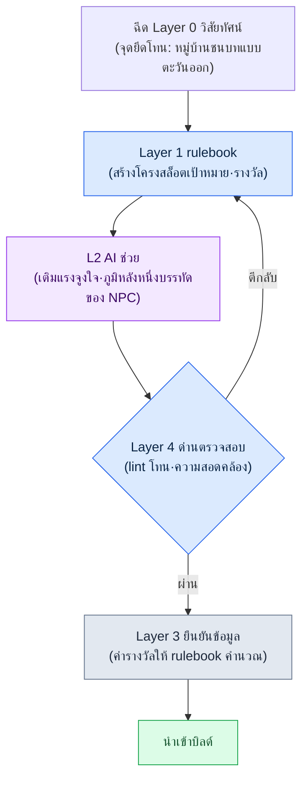

# 6.1 การสร้างเนื้อหาแบบโพรซีเดอรัลกับ AI — ช่องเดียวที่สองแกนตัดกัน

เช้าวันจันทร์ในห้องประชุมวางแผน บนไวต์บอร์ดมีข้อความบรรทัดเดียว "ก่อนเปิดตัว — เควสต์เสริม 1,000 ชุด" มีคนหยิบเครื่องคิดเลขมากด ถ้านักเขียนหนึ่งคนใช้เวลาหนึ่งวันต่อหนึ่งเควสต์ ก็เท่ากับ 4 ปี ต่อให้ห้าคนช่วยกันทำก็ยังเกือบหนึ่งปี อากาศในห้องเริ่มหนักอึ้ง ผู้เขียนนั่งอยู่ในห้องนี้มา 24 ปีแล้ว และรู้ว่าเมื่อเจอตัวเลขแบบนั้น ผู้คนมักแตกออกเป็นสองทางเดิมเสมอ ฝ่ายหนึ่งบอกว่า "ลดปริมาณลงเถอะ" อีกฝ่ายบอกว่า "ใช้เครื่องมือปั๊มออกมาเลย" และเกือบทุกครั้ง คำตอบสุดท้ายคือทั้งสองอย่าง

การสร้างเนื้อหาแบบโพรซีเดอรัล (Procedural Content Generation ต่อไปเรียกว่า PCG) คือคำตอบเก่าแก่ของฝ่าย "ใช้เครื่องมือปั๊มออกมา" การจัดวางห้องในดันเจี้ยน การผสมออปชันอาวุธ และพูลการสปอว์นศัตรู ถูกทำให้อัตโนมัติด้วย rulebook และตารางความน่าจะเป็นมาตั้งแต่ 20 ปีก่อน สิ่งที่ใหม่จึงไม่ใช่ตัว PCG เอง แต่คือการที่ LLM และโมเดลเจเนอเรทีฟเข้ามาอยู่ในตำแหน่งที่เป็นภาษาธรรมชาติ ภาพ และเนื้อเรื่อง

แต่สิ่งที่หนังสือเล่มนี้ต้องการจะบอกไม่ใช่ "เอา AI ไปต่อกับ PCG สิ" นั่นใคร ๆ ก็ทำ ปัญหาคือต่อมัน *ตรงไหน* ต่างหาก หากเราหยิบเนื้อหาก้อนหนึ่งขึ้นมาแล้วไม่ตอกหมุดให้ชัดว่ามันมาพบกัน ณ ความเข้มของการทำงานอัตโนมัติระดับใด และที่ชั้นใดของโครงสร้าง ก็จะกลายเป็นสภาพที่มีเครื่องมือแต่ไม่มีที่ทาง บทนี้จะดูวิธีวาดช่องนั้นเป็นพิกัด และดูว่าบนช่องนั้น เนื้อหาหนึ่งชิ้นวิ่งครบหนึ่งรอบในไปป์ไลน์จริงอย่างไร

---

## 6.1.1 ตำแหน่งที่ PCG หยุดนิ่งอยู่กับที่

PCG แบบดั้งเดิมแข็งแกร่งในเรื่องความเป็นเชิงกำหนด (deterministic) อินพุตเดียวกันให้เอาต์พุตเดียวกัน และตรวจสอบได้ กราฟห้องในดันเจี้ยน prefix·suffix ของออปชันอาวุธ และการกระจายการสปอว์นศัตรู จึงลงตัวได้ตั้งแต่เนิ่น ๆ "ดาบเปลวเพลิง +5" ออกมาแบบอัตโนมัติได้ตั้งแต่ 20 ปีก่อน

ปัญหาอยู่ที่ตำแหน่งถัดจากนั้นเสมอ ห้องถูกจัดวางแล้ว แต่ชื่อ รูปลักษณ์ และภูมิหลังสั้น ๆ ของ NPC ในห้องยังตกอยู่ในมือนักเขียน "ดาบเปลวเพลิง +5" ออกมาได้ แต่บรรทัดเดียวที่ว่า "ดาบเล่มสุดท้ายที่กษัตริย์ทำหาย" ไม่ออกมา ต่อให้ตัว generator ของเควสต์จะสุ่มจับคู่เป้าหมายกับรางวัลมาให้ "ทำไมต้องทำเควสต์นี้" ก็ยังเป็นสิ่งที่คนเขียนเอง

ในเกมขนาดใหญ่ ตำแหน่งนี้คือคอขวดอยู่เสมอ อัตราส่วนระหว่างส่วนที่ปั๊มออกมาได้กับส่วนที่ต้องใช้มือคนอยู่ราว 4 ต่อ 6 และส่วนที่ใช้มือคน 6 ส่วนนั้นกินเวลาส่วนใหญ่ของกำหนดการ ต่อให้สายการผลิตปั๊ม 4 ส่วนออกมาได้เร็ว แต่ถ้า 6 ส่วนตามไม่ทัน รอบทั้งวงก็ถูกล็อกไว้ที่ความเร็วเท่านั้น

ตำแหน่งที่ LLM และโมเดลภาพเข้ามาคือตรงนั้นพอดี ขอบเขตที่ปั๊มออกมาได้ขยายไปครอบคลุมถึงพื้นที่ภาษาธรรมชาติ เนื้อเรื่อง และภาพที่ rulebook เคยจัดการไม่ได้ แต่ก็ไม่ได้หมายความว่าการยกตำแหน่งนั้นทั้งหมดให้ AI คือคำตอบ AI ให้คำตอบที่ต่างกันเล็กน้อยทุกครั้ง และเมื่อบริบทว่างเปล่า มันก็จะคายค่าเฉลี่ยของ RPG ทั่วไปออกมา เราจึงต้องออกแบบ *จุดเชื่อมต่อ* จุดเชื่อมต่อนิยามด้วยแกนพิกัดสองแกน

---

## 6.1.2 แกนแรก: ความเข้มของการทำงานอัตโนมัติ (L0\~L3)

แกนตั้งคือ *การผสมคน rulebook และ AI ในสัดส่วนใด* ในบริษัทพัฒนา MMORPG แห่งหนึ่งที่ผู้เขียนทำงานอยู่ (ต่อไปเรียกว่า 'โปรเจกต์ A') เราแบ่งใช้เป็นสี่ระดับ

**L0 — งานมือทั้งหมด** ทุกตัวอักษรและทุกการตัดสินใจออกมาจากมือคน เนื้อหาเควสต์หลัก บทพูดของตัวละครซิกเนเจอร์ ตอนจบของเส้นเรื่องที่แตกแขนง คือตำแหน่งที่ความสอดคล้องและความลึกของเนื้อเรื่องเชื่อมตรงกับอัตลักษณ์ของเกม

**L1 — การทำงานอัตโนมัติด้วย rulebook** คือตำแหน่งของ PCG ดั้งเดิม อัลกอริทึมเชิงกำหนดอย่าง rulebook ตารางความน่าจะเป็น และ BSP สร้างเอาต์พุต ส่วนคนทำหน้าที่ตรวจสอบเท่านั้น การจัดวางห้องในดันเจี้ยน การผสมออปชันอาวุธ และการสปอว์นศัตรู เป็นตัวแทน

**L2 — rulebook + AI ช่วย** rulebook วางโครง ส่วน AI เติมรายละเอียด ซินอปซิสของเควสต์เสริม ชื่อและภูมิหลังสั้น ๆ ของ NPC ทั่วไป ข้อความแนะนำพื้นที่ล่าสัตว์ คนรับผิดชอบเพียงเมทาดาทาที่ป้อนเข้าและด่านตรวจสอบสุดท้ายเท่านั้น

**L3 — AI นำหน้า + คนตรวจสอบ** AI สร้างเนื้อหา ส่วนคนเข้าไปแค่ในขั้นตรวจสอบ น่าดึงดูดก็จริง แต่ความเสี่ยงของความไม่เป็นเชิงกำหนด อาการหลอน (hallucination) และความสอดคล้องที่เสียหาย ล้วนมารวมกันอยู่ที่นี่

หัวใจอยู่ที่ L2 มันรวมความเสถียรของ L1 เข้ากับกำลังการปั๊มของ L3 แล้วใช้ด่านตรวจสอบ (verification gate) ปิดจุดอ่อนของทั้งสองฝั่ง L3 มีแรงล่อใจให้รีบนำเข้ามาใช้สูง แต่ผู้เขียนเคยเห็นหลายครั้งที่ภาระการตรวจสอบพุ่งทะลุจนต้องเลิกใช้ภายในหนึ่งถึงสองไตรมาส ถ้าใน 100 ชิ้นมี 70 ชิ้นถูกยกขึ้นมาเป็นรายการน่าสงสัย มันก็แพงกว่าให้คนเขียนเองทั้ง 100 ชิ้นตั้งแต่ต้น

---

## 6.1.3 แกนที่สอง: โครงสร้าง Layer (L0\~L4)

ลำพังแกนตั้งอย่างเดียว สายการผลิตยังขับเคลื่อนไม่ได้ ตัวเนื้อหา *เอง* ต้องถูกแยกออกเป็นชั้น ๆ เสียก่อน ที่ทางให้การทำงานอัตโนมัติเข้ามาจึงจะเกิดขึ้น นี่คือการแยก Layer ที่กล่าวถึงในส่วนที่ 5 และเป็นแกนนอนในแง่ของสายงานเนื้อหา คำอธิบายทั่วไปที่ว่าทั้งห้าชั้นต่างสอดคล้องกับบทบาทหนึ่งของการสร้างแบบโพรซีเดอรัล (จุดยึด·rulebook·เนื้อหา·ค่าตัวเลข·ด่านตรวจ) ได้กล่าวไว้แล้วใน §2.3.6 ในที่นี้จะนำมาวางลงในสายการผลิตเนื้อหาโดยตรง Layer 0 วิสัยทัศน์คือจุดยึดด้านโทนและโลกของเรื่อง (ฉีดเข้าทุกครั้งที่สร้าง) Layer 1 ระบบคือ rulebook ของการสร้าง (กฎ·ตารางความน่าจะเป็น·ระบบแท็ก) Layer 2 เนื้อหาคือตำแหน่งเนื้อความที่ผลลัพธ์ของการสร้างจะมาสะสมกัน (เควสต์เสริม·ภูมิหลัง NPC·ข้อความแนะนำเมือง) Layer 3 ข้อมูลคือค่าตัวเลข·ID·ความสัมพันธ์ (รางวัล·การสปอว์น·เส้นโค้ง) และ Layer 4 บิลด์·QA คือด่านตรวจสอบ (lint·การตรวจความสอดคล้อง·การตรวจสอบโดยนักเขียน)

สองแกนนี้เป็นคนละเรื่องกัน แกนตั้งบอกว่า "คนเข้าไปแตะมากแค่ไหน" แกนนอนบอกว่า "เนื้อหาส่วนใด" แต่ทั้งสองมีความหมายขึ้นมาได้ก็ต่อเมื่อคูณกันเท่านั้น เมื่อเราตอกหมุดเนื้อหาหนึ่งชิ้นลงที่จุดตัดของสองแกน คือ *ช่องเดียว* นั้น "ใครสร้างส่วนไหนด้วยวิธีใด" จึงจะถูกกำหนดขึ้นมา

---

## 6.1.4 รวมสองแกนไว้ในแผ่นเดียว — เมทริกซ์ การทำงานอัตโนมัติ × Layer

นำสองแกนที่บรรยายเป็นถ้อยคำมาจนถึงตอนนี้มาซ้อนกันเป็นตารางแผ่นเดียว แนวนอนคือ Layer ของเนื้อหา แนวตั้งคือความเข้มของการทำงานอัตโนมัติ ป้ายในแต่ละช่องคือเนื้อหาที่ครอบครองช่องนั้นจริงในโปรเจกต์ A ยิ่งช่องสีเข้มมากเท่าใด ก็ยิ่งใกล้จุดศูนย์ถ่วงของสายการผลิตมากเท่านั้น

<svg viewBox="0 0 760 440" xmlns="http://www.w3.org/2000/svg" font-family="sans-serif" font-size="12">
  <rect x="0" y="0" width="760" height="440" fill="#ffffff"/>
  <!-- 축 제목 -->
  <text x="380" y="22" text-anchor="middle" font-size="14" font-weight="bold">ความเข้มของการทำงานอัตโนมัติ(แนวตั้ง) × โครงสร้าง Layer(แนวนอน)</text>
  <text x="380" y="416" text-anchor="middle" font-weight="bold">→ โครงสร้าง Layer (เนื้อหาส่วนใด)</text>
  <text x="18" y="220" text-anchor="middle" font-weight="bold" transform="rotate(-90 18 220)">↑ ความเข้มของการทำงานอัตโนมัติ (คนแตะมากแค่ไหน)</text>
  <!-- 열 헤더 -->
  <g text-anchor="middle" font-size="11" font-weight="bold">
    <text x="190" y="52">L0 วิสัยทัศน์</text>
    <text x="310" y="52">L1 ระบบ(rulebook)</text>
    <text x="430" y="52">L2 เนื้อหา(เนื้อความ)</text>
    <text x="550" y="52">L3 ข้อมูล</text>
    <text x="670" y="52">L4 บิลด์·QA</text>
  </g>
  <!-- 행 헤더 -->
  <g text-anchor="end" font-size="11" font-weight="bold">
    <text x="124" y="92">L0 งานมือ</text>
    <text x="124" y="172">L1 rulebook</text>
    <text x="124" y="252">L2 rulebook+AI</text>
    <text x="124" y="332">L3 AI นำหน้า</text>
  </g>
  <!-- 격자 칸: x=130..730 (5열,120폭) y=60..380 (4행,80높이) -->
  <!-- 행 L0 수작업 -->
  <rect x="130" y="60" width="120" height="80" fill="#dfe7f3" stroke="#7a93c0"/>
  <text x="190" y="104" text-anchor="middle" font-size="10">เขียนโทนหนึ่งบรรทัดเอง</text>
  <rect x="250" y="60" width="120" height="80" fill="#f4f6fa" stroke="#c8c8c8"/>
  <rect x="370" y="60" width="120" height="80" fill="#eef1f6" stroke="#c8c8c8"/>
  <text x="430" y="98" text-anchor="middle" font-size="10">เควสต์หลัก</text>
  <text x="430" y="112" text-anchor="middle" font-size="10">บทพูดซิกเนเจอร์</text>
  <rect x="490" y="60" width="120" height="80" fill="#f4f6fa" stroke="#c8c8c8"/>
  <rect x="610" y="60" width="120" height="80" fill="#f4f6fa" stroke="#c8c8c8"/>
  <!-- 행 L1 룰북 -->
  <rect x="130" y="140" width="120" height="80" fill="#f4f6fa" stroke="#c8c8c8"/>
  <rect x="250" y="140" width="120" height="80" fill="#b9cae6" stroke="#5b78ad"/>
  <text x="310" y="178" text-anchor="middle" font-size="10">จัดวางห้องดันเจี้ยน</text>
  <text x="310" y="192" text-anchor="middle" font-size="10">ตารางออปชัน·สปอว์น</text>
  <rect x="370" y="140" width="120" height="80" fill="#f4f6fa" stroke="#c8c8c8"/>
  <rect x="490" y="140" width="120" height="80" fill="#eef1f6" stroke="#c8c8c8"/>
  <text x="550" y="184" text-anchor="middle" font-size="10">คำนวณเส้นโค้งรางวัล</text>
  <rect x="610" y="140" width="120" height="80" fill="#f4f6fa" stroke="#c8c8c8"/>
  <!-- 행 L2 룰북+AI (무게중심) -->
  <rect x="130" y="220" width="120" height="80" fill="#f4f6fa" stroke="#c8c8c8"/>
  <rect x="250" y="220" width="120" height="80" fill="#eef1f6" stroke="#c8c8c8"/>
  <text x="310" y="264" text-anchor="middle" font-size="10">นิยาม rulebook ของการสร้าง</text>
  <rect x="370" y="220" width="120" height="80" fill="#7fa0d4" stroke="#385583"/>
  <text x="430" y="258" text-anchor="middle" font-size="10" font-weight="bold" fill="#ffffff">โครงเควสต์เสริม</text>
  <text x="430" y="274" text-anchor="middle" font-size="10" fill="#ffffff">ภูมิหลัง·คำแนะนำ NPC สั้น ๆ</text>
  <text x="430" y="289" text-anchor="middle" font-size="9" fill="#ffffff">★ จุดศูนย์ถ่วง</text>
  <rect x="490" y="220" width="120" height="80" fill="#f4f6fa" stroke="#c8c8c8"/>
  <rect x="610" y="220" width="120" height="80" fill="#eef1f6" stroke="#c8c8c8"/>
  <text x="670" y="264" text-anchor="middle" font-size="10">lint·ตรวจความสอดคล้อง</text>
  <!-- 행 L3 AI우선 -->
  <rect x="130" y="300" width="120" height="80" fill="#f4f6fa" stroke="#c8c8c8"/>
  <rect x="250" y="300" width="120" height="80" fill="#f4f6fa" stroke="#c8c8c8"/>
  <rect x="370" y="300" width="120" height="80" fill="#e6ddec" stroke="#a98ec0"/>
  <text x="430" y="344" text-anchor="middle" font-size="10">ร่างแพตช์โน้ต</text>
  <rect x="490" y="300" width="120" height="80" fill="#f4f6fa" stroke="#c8c8c8"/>
  <rect x="610" y="300" width="120" height="80" fill="#eef1f6" stroke="#c8c8c8"/>
  <text x="670" y="344" text-anchor="middle" font-size="10">ด่านตรวจสอบโดยนักเขียน</text>
</svg>

ตารางนี้คือหัวใจของบทนี้ การตัดสินที่เคยกระจัดกระจายอยู่ในถ้อยคำอย่าง "เควสต์หลักเป็น L0" "เควสต์เสริมเป็น L2" "รางวัลเป็น rulebook" มารวมอยู่ใน *พิกัดเดียว* เมื่อเนื้อหาใหม่ถูกยกขึ้นเป็นวาระในการประชุม คำถามเดียวว่า "อันนี้อยู่ช่องไหน" ก็เพียงพอ เมื่อกำหนดช่องได้ พิกัดแนวตั้งของช่องนั้นจะบอกว่าใครเป็นคนแตะ และพิกัดแนวนอนจะบอกว่าเป็นส่วนใด

เมื่ออ่านตารางนี้ไปเรื่อย ๆ จะมีสองอย่างที่เข้าตา หนึ่ง จุดศูนย์ถ่วง (ช่องสีเข้ม) อยู่ที่แถว L2 × คอลัมน์ Layer 2 โครงเควสต์เสริมและภูมิหลัง NPC คือตำแหน่งนั้น มันคือหัวใจของสายการผลิต สอง เนื้อหาหนึ่งชิ้นไม่ได้อยู่แค่ช่องเดียว เควสต์เสริมมีเนื้อความ (Layer 2) อยู่ในช่อง L2 ก็จริง แต่ค่ารางวัล (Layer 3) ของมันเลื่อนลงไปอยู่ในช่อง L1 ต่อให้เป็นเควสต์เดียวกัน *แต่ละส่วนก็อาศัยอยู่คนละช่อง* นี่คือเหตุผลที่เราแยกสองแกนออกจากกัน

---

## 6.1.5 ไปป์ไลน์ขนาดย่อที่วิ่งอยู่บนช่องเดียว

บนช่องจุดศูนย์ถ่วง — แถว L2 × คอลัมน์ Layer 2 โครงเควสต์เสริม — เรามาดูกันว่าเนื้อหาหนึ่งชิ้นวิ่งครบหนึ่งรอบจริงอย่างไร กระแสการไหลเป็นดังนี้



ลองไล่ตามกระแสนี้ผ่านบันทึกเซสชันจริง (worked transcript) สักครั้ง สมมติว่าเรากำลังสร้างเควสต์งานจิปาถะหนึ่งชุดของหมู่บ้านชนบท

**ขั้นที่ 1 — Layer 1 rulebook ดึงโครงออกมา** rulebook เป็นเชิงกำหนด มันเติมแค่สล็อตแล้วคายออกมา

```
[โครงเควสต์ — เอาต์พุตของ rulebook]
พื้นที่: หมู่บ้านชนบท_3
บทบาทผู้ว่าจ้าง: คนเก็บสมุนไพร
ประเภทเป้าหมาย: เก็บรวบรวม(ยาสมุนไพร x6)
อุปสรรค: หมาป่าสปอว์น(กลางคืน)
สล็อตรางวัล: { gold: ?, exp: ?, item: เคียวเก็บเกี่ยว }
```

**ขั้นที่ 2 — ขอรายละเอียดจาก AI** เนื้อความพรอมต์เต็มเป็นดังนี้ (ป้อน Layer 0 วิสัยทัศน์เป็นบริบทก่อน)

> คุณคือนักเขียนเควสต์ของ MMORPG ที่มีฉากเป็นหมู่บ้านชนบทแฟนตาซีตะวันออก จุดยึดโทน: "เรียบง่ายแต่แฝงด้วยความเชื่อโชคลางและความหวาดกลัวแบบชนบท" จงรับโครงด้านล่างไป แล้วเขียนแรงจูงใจหนึ่งบรรทัดของผู้ว่าจ้าง ชื่อ NPC และข้อความว่าจ้างสองประโยคที่ผู้เล่นจะเห็น ห้ามสร้างค่ารางวัลเด็ดขาด (ระบบเป็นผู้กำหนด) เอาต์พุตเป็น JSON
> โครง: { พื้นที่: หมู่บ้านชนบท_3, ผู้ว่าจ้าง: คนเก็บสมุนไพร, เป้าหมาย: เก็บยาสมุนไพร 6 ชิ้น, อุปสรรค: หมาป่ายามค่ำคืน, ไอเทมรางวัล: เคียวเก็บเกี่ยว }

**ขั้นที่ 3 — ผลลัพธ์ดิบของ Claude** (ย้ายมาตามต้นฉบับโดยไม่สรุปย่อ)

```json
{
  "npc_name": "ป้าซัมวอล",
  "motive": "ทุกคืนเสียงหอนของหมาป่าทำให้ไร่สมุนไพรพังเสียหาย จนไม่กล้าออกไปเก็บยาสมุนไพรชิ้นสุดท้าย",
  "quest_text": "พอตกค่ำพวกหมาป่าก็มาคุ้ยไร่สมุนไพรจนกระจุยกระจาย กลัวจนก้าวขาไม่ออก ช่วยไปเก็บรากยาสมุนไพรหกรากที่เชิงเขาแทนข้าหน่อยเถิด",
  "reward": { "gold": 120, "exp": 300 }
}
```

มีสิ่งที่ต้องหยุดดูตรงนี้ AI สร้างฟิลด์ `reward` ใส่เข้ามาเอง *ทั้งที่ไม่ได้สั่ง* นี่แสดงให้เห็นตรง ๆ ว่าทำไมแกนที่ 1 กับแกนที่ 2 จึงต้องแยกออกจากกัน ค่ารางวัล (Layer 3) เป็นตำแหน่งของ rulebook ใน L1 ไม่ใช่ตำแหน่งของ AI (L2) ถ้ายกมันให้ AI ตัวเลขจะแกว่งไปทุกครั้งที่เรียก จนเส้นโค้งรางวัลพังทลาย

**ขั้นที่ 4 — การตรวจสอบและปฏิเสธโดยคน** ผู้ตรวจสอบทำสองอย่าง (1) *ลบ* ฟิลด์ `reward` ออก — นี่คือช่องที่ rulebook จะมาเติม (2) ดูโทน "ป้าซัมวอล" แรงจูงใจหนึ่งบรรทัด และข้อความว่าจ้างสองประโยค เข้ากับโทนหมู่บ้านชนบท ผ่าน หาก AI ใส่คำที่อยู่นอกโลกของเรื่องอย่าง "คำว่าจ้างจากกิลด์นักเวท" ก็จะตีกลับตรงนี้แล้วย้อนกลับไปขั้นสร้างโครง

**ขั้นที่ 5 — ยืนยันข้อมูล Layer 3** rulebook เติมสล็อตรางวัลที่ถูกลบกลับเข้ามาใหม่ มันคือสูตรเชิงกำหนดที่ผูกกับเลเวลของพื้นที่และความยากของเป้าหมาย `gold: 85, exp: 240` ค่าที่เข้ากับเส้นโค้งจะถูกใส่เข้าไป ไม่ใช่ 120·300 ที่ AI คายออกมาตามใจ

หนึ่งรอบนี้คือไซเคิลมาตรฐานของช่องจุดศูนย์ถ่วง rulebook ทำโครง AI เติมเนื้อ คนเป็นด่าน rulebook ใส่ค่าตัวเลขอีกที เนื้อหา 1,000 ชิ้นวิ่งตามไซเคิลนี้ทั้งหมด เพราะช่องถูกกำหนดไว้แล้ว จึงไม่ต้องมาเถียงกันใหม่ทุกครั้งว่า "อันนี้ใครสร้าง"

---

## 6.1.6 ห้าคำถามที่ใช้ตอนกำหนดช่อง

หากจะตัดสินว่าจะวางเนื้อหาใหม่ไว้ที่ช่องใดของตาราง ห้าคำถามนี้จะช่วยได้ ทุกครั้งที่วาระการปั๊มเนื้อหาถูกยกขึ้นในที่ประชุม ลองจดไว้แล้วช่วยกันตอบ ความสอดคล้องของการจัดวางช่องจะลงตัวภายในหนึ่งไตรมาส

หนึ่ง ภาระการปั๊มมากแค่ไหน ก่อนเปิดตัวต้องการ N ชุดหรือไม่ ถ้า N เกิน 100 แถว L0 แทบเป็นไปไม่ได้

สอง ความต้องการความสอดคล้องสูงแค่ไหน ถ้าความสอดคล้องระหว่างเนื้อหาคือหัวใจของประสบการณ์ ด่านตรวจสอบ (Layer 4) ต้องแข็งแกร่ง แต่ถ้าความหลากหลายคือหัวใจ ก็มีช่องว่างให้ขยับขึ้นไปแถวบนได้

สาม ยอมรับความไม่เป็นเชิงกำหนดได้หรือไม่ เป็นพื้นที่ที่ผลลัพธ์ต่างกันเล็กน้อยทุกครั้งช่วยสร้างความอุดมสมบูรณ์ หรือเป็นพื้นที่ที่ผลลัพธ์เหมือนเดิมคือหัวใจของความน่าเชื่อถือ

สี่ ค่าใช้จ่ายในการตรวจสอบเท่าไร ต่อเนื้อหาหนึ่งชิ้น 5 นาทีหรือ 30 นาที กำหนดความยาวของรอบการดำเนินงาน

ห้า ค่าใช้จ่ายเมื่อเกิดอุบัติเหตุเท่าไร ทิ้งและเขียนใหม่ได้อย่างอิสระ หรือเมื่อออกไปแล้วครั้งหนึ่งจะเชื่อมตรงสู่อุบัติเหตุของผู้ใช้

ลองโยนห้าข้อนี้ใส่เควสต์เสริม คำตอบจะรวมไปทางเดียว มากกว่า 1,000 ชุด (L0 เป็นไปไม่ได้) ความสอดคล้องต่ำกว่าเควสต์หลัก ยอมรับความไม่เป็นเชิงกำหนด ตรวจสอบ 5\~10 นาที ค่าใช้จ่ายอุบัติเหตุต่ำ (ทิ้งทีละชิ้นได้) เมื่อห้าคำตอบมารวมกัน ช่อง L2 × Layer 2 จึงเป็นธรรมชาติ ลองโยนห้าข้อเดียวกันใส่เควสต์หลัก คำตอบจะรวมไปตรงข้ามกัน 50 ชุด ความสอดคล้องและความลึกของเนื้อเรื่องสูงสุด ไม่ยอมรับความไม่เป็นเชิงกำหนด ค่าใช้จ่ายในการตรวจสอบสูง ค่าใช้จ่ายอุบัติเหตุสูงมาก — เป็นช่อง L0

---

## 6.1.7 กับดักที่พบบ่อยสี่ข้อ

ต่อให้วาดตารางไว้แล้ว กับดักที่ตกลงไปก็คล้ายเดิม มีสี่ข้อที่เกิดซ้ำ

หนึ่ง **เริ่มจากแถว L3** ถ้าออกตัวด้วยความคาดหวังว่า "AI จัดการ 100 ชุดเอง" การตรวจสอบจะพุ่งทะลุ ให้ตั้งช่อง L1 ให้ลงตัวก่อน แล้วค่อยขยับขึ้น L2 ส่วน L3 ทำเฉพาะบางส่วนอย่างระมัดระวัง การกระทำที่คนลบฟิลด์รางวัลออกในไปป์ไลน์ขนาดย่อข้างต้น แสดงให้เห็นในขนาดเล็กว่าทำไมแถว L3 จึงอันตราย

สอง **มอบหมายให้ AI ทั้งก้อนโดยไม่มี rulebook** "ช่วยสร้างเควสต์เสริม 100 ชุด" จะเรียกค่าเฉลี่ยของ RPG ทั่วไปออกมา Layer 1 rulebook ต้องวางโครงก่อน แล้ว AI จึงเติมเนื้อบนนั้น เนื้อหาของเกมเราถึงจะออกมา การเขียน rulebook สักหนึ่งเล่มคืองานที่กินแรงที่สุดและน่าเบื่อที่สุดใน PCG แต่ถ้าข้ามมันไป การปั๊มทุกอย่างที่อยู่เหนือมันก็จะทรุดลงเป็นค่าเฉลี่ย

สาม **ด่านตรวจสอบ (Layer 4) ว่างเปล่า** ถ้าเอาต์พุตของ AI ถูกนำเข้าบิลด์โดยอัตโนมัติ อุบัติเหตุด้านความสอดคล้องจะเชื่อมตรง ไม่ว่าช่องใด ด่านที่เป็นคนก็จำเป็น

สี่ **เลือกเครื่องมือโดยดูแค่ค่าใช้จ่าย** ค่าใช้จ่าย LLM API ลดลงทุกไตรมาส แต่ค่าใช้จ่ายอุบัติเหตุด้านความสอดคล้องไม่ลดลง การตัดสินเรื่องเครื่องมือต้องดูที่ค่า API บวกกับผลรวมของเวลาความสอดคล้องและการตรวจสอบ

---

## 6.1.8 การวัดผล — หกเดือนที่ย้ายไปช่องจุดศูนย์ถ่วง

ในโปรเจกต์ A หลังจากย้ายเควสต์เสริมจากช่อง L0 ไปช่อง L2 ได้วัดผลเป็นเวลาหกเดือน ในบรรดาตัวเลขด้านล่าง ค่าสัมบูรณ์เป็นการประมาณของผู้เขียน (ยังไม่ได้ตรวจสอบ) ส่วนทิศทางและสัดส่วนของการเปลี่ยนแปลงคือสิ่งที่สังเกตได้จากการวัดจริง

| รายการ | ช่วง L0 | หลังเปลี่ยนเป็น L2 |
|---|---|---|
| เขียนเควสต์ 1 ชุดต่อนักเขียน 1 คน | ราว 4 ชั่วโมง | ราว 50 นาที (เมทา 30 นาที + AI 5 นาที + ตรวจสอบ 8 นาที) |
| ปั๊มต่อสัปดาห์ | 5 ชุด | 30\~40 ชุด |
| อัตราการทิ้ง | เกือบ 0% | ราว 20% |
| อุบัติเหตุความสอดคล้อง (ต่อไตรมาส) | 3\~5 ครั้ง | 5\~8 ครั้ง (ปกติหลังเสริม) |
| ความพึงพอใจของนักเขียน (เต็ม 10) | 8 | 6 → 7 (หลังเสริมนโยบาย) |

อัตราการทิ้งขึ้นไปเป็น 20% แต่ความเร็วการปั๊มเร็วขึ้น 6\~8 เท่า ปริมาณงานสุทธิจึงเพิ่มขึ้น 4\~5 เท่า อุบัติเหตุความสอดคล้องเพิ่มขึ้นเล็กน้อยเป็น 5\~8 ครั้งต่อไตรมาส แต่ด้วยด่านตรวจสอบและการเสริม rulebook ก็กลับสู่ช่วงปกติภายในไตรมาส

การเปลี่ยนแปลงที่ใหญ่ที่สุดไม่ใช่ตัวเลข แต่คือคน ตอนแรกนักเขียนรู้สึกเหมือนกลายเป็น "ผู้ตรวจสอบงานปั๊ม" ความพึงพอใจจึงตกจาก 8 เหลือ 6 เพื่อกอบกู้สิ่งนี้ เราจึงสอดนโยบายที่รับประกันเวลาของนักเขียนอย่างชัดเจนให้กับเควสต์หลักและเควสต์เสริมซิกเนเจอร์ (เมืองละ 1\~2 ชุด) เป็นการตอกหมุดให้สายการผลิตไม่ได้ดูดเวลาของนักเขียนไป แต่กลายเป็นเครื่องมือที่ส่งเวลานั้นคืนกลับไปยังเควสต์หลัก หกเดือนต่อมา ความพึงพอใจกลับมาเป็น 7

สิ่งหนึ่งที่ควรนำกลับไปจากการวัดผลนี้ การตัดสินใจย้ายช่องต้องให้ปริมาณงาน การจัดสรรเวลาของนักเขียน และความพึงพอใจตามไปด้วยกัน ถ้าดูแค่ปริมาณงาน การปั๊มก็สำเร็จ แต่คนจะจากไป

---

## 6.1.9 แยก Layer ก่อน แล้ว PCG จึงมาทีหลังบนนั้น

ข้อเสนอทั่วไปที่ว่าการแยก Layer คือเงื่อนไขเบื้องต้นของการสร้างแบบโพรซีเดอรัล อยู่ใน §2.3.6 ในที่นี้จะดูเพียงว่ามันเผยตัวบนตาราง PCG อย่างไร ในทีมที่แกนนอน (Layer 0\~4) พร่าเลือน ไม่มีช่องใดขับเคลื่อนได้อย่างเสถียร ถ้าไม่รู้ว่า Layer 0 วิสัยทัศน์อยู่ที่ไหน จุดยึดโทนของแต่ละ generator ก็ว่างเปล่าจนคายค่าเฉลี่ยของ RPG ทั่วไปออกมา ถ้า Layer 1 rulebook กับ Layer 2 เนื้อความปนกันอยู่ในไฟล์เดียว เวลาแก้กฎสักหนึ่งบรรทัดก็ต้องไปแตะเนื้อความหลายสิบจุดพร้อมกัน และถ้า Layer 3 ข้อมูลถูกป้อนอยู่ในเนื้อความ การปรับเส้นโค้งรางวัลครั้งเดียวจะกินเวลานักเขียนไปหนึ่งสัปดาห์ — นี่คือเหตุผลที่เราแยกรางวัลออกไปไว้เป็นสล็อตต่างหากในไปป์ไลน์ขนาดย่อข้างต้น

ดังนั้นสิ่งที่ต้องตรวจก่อนนำ PCG เข้ามาจึงไม่ใช่การเลือกเครื่องมือ แต่คือ *แกนนอนถูกแยกออกหรือยัง* ในทีมที่มีครบห้าชั้น ค่าใช้จ่ายในการต่อ generator ของ L1 คือเวลานักเขียนหนึ่งคนหนึ่งไตรมาส ในทีมที่ห้าชั้นปนกัน การนำเข้ามาแบบเดียวกันจะถูกเลิกใช้ด้วยอุบัติเหตุความสอดคล้องภายในสองไตรมาส

ห้าช่องไม่จำเป็นต้องสมบูรณ์แบบตั้งแต่ต้น แยกอย่างค่อยเป็นค่อยไป อินเทอร์เฟซให้แคบ ในไตรมาสแรก แค่แยกโทนหนึ่งบรรทัดของ Layer 0 และ rulebook หนึ่งเล่มของ Layer 1 ออกมา ที่ทางให้ generator เข้ามาก็เปิดออกแล้ว แต่ก็ไม่ได้หมายความว่าผัดผ่อนได้ไม่มีที่สิ้นสุด ถ้า Layer 2 เนื้อความกับ Layer 3 ข้อมูลยังเป็นก้อนเดียวกันจนถึงที่สุด เครื่องมือที่เป็นรูปธรรมในบทถัดไปก็จะหาที่ทางลงไม่ได้

---

## 6.1.10 ตัวอย่างบทถัดไป

ในบทถัดไปจะผ่าเครื่องมือที่เป็นรูปธรรมหนึ่งชิ้นซึ่งครอบครองช่องจุดศูนย์ถ่วงของตารางนี้ นั่นคือ `proj_city_hunting_generator` ที่ปั๊มพื้นที่ล่าสัตว์แยกตามเมือง เราจะดูว่าเมทาดาทาที่ป้อนเข้า โครง rulebook เนื้อความจาก AI และด่านตรวจสอบ ถูกมัดรวมเป็นหนึ่งไซเคิลอย่างไร และไปป์ไลน์ขนาดย่อของบทนี้ขยายใหญ่ขึ้นในขนาดของเครื่องมือจริงอย่างไร

---

### สรุปประเด็นสำคัญของบท
- ความเข้มของการทำงานอัตโนมัติ (แนวตั้ง L0\~L3) กับโครงสร้าง Layer (แนวนอน 0\~4) มีความหมายขึ้นมาได้ก็ต่อเมื่อคูณกันเท่านั้น
- จุดศูนย์ถ่วงของสายการผลิตคือช่อง L2 × Layer 2 โครงเควสต์เสริม
- การแยกแกนนอนต้องมาก่อน และ PCG จะขับเคลื่อนได้ก็เฉพาะบนช่องเดียวที่อยู่เหนือมันเท่านั้น

---

## ลองทำดู — วางเนื้อหาหนึ่งชิ้นลงบนช่องเดียว

**setup** เลือกเนื้อหาที่จะปั๊ม 1 ประเภท (เช่น เควสต์เสริม) แยกโทนหนึ่งบรรทัดของ Layer 0 และโครง rulebook ของ Layer 1 (นิยามสล็อต) ออกมาเป็นไฟล์ต่างหาก ปล่อยสล็อตค่ารางวัลให้ว่างไว้ทางฝั่ง rulebook

**prompt** หลังป้อนวิสัยทัศน์เป็นบริบทแล้ว ให้โครงไป และระบุชัดว่า "ห้ามสร้างค่ารางวัล เอาต์พุตเป็น JSON" ดัดแปลงพรอมต์ขั้นที่ 2 ข้างต้นมาใช้ได้เลย

**verify** ดูสามอย่าง (1) ถ้า AI ใส่ฟิลด์รางวัลเข้ามาเองให้ลบออก (L3 เป็นตำแหน่งของ rulebook) (2) ถ้ามีคำที่อยู่นอกโลกของเรื่อง ให้ตีกลับไปขั้นสร้างโครง (3) เฉพาะส่วนที่ผ่านเท่านั้นที่ rulebook จะเติมค่ารางวัลแล้วใส่เข้าบิลด์

**ฉบับย่อสำหรับคนเดียว** ไม่มีทีมก็ได้ ให้คุณสร้าง rulebook หนึ่งเล่ม (สล็อต 5 ช่อง) กับโทนหนึ่งบรรทัดเป็นไฟล์ข้อความเอง ลองรันเควสต์ 10 ชุดผ่านไซเคิลข้างต้น แล้วนับว่าตอนตรวจสอบตีกลับไปกี่ชุด ถ้าอัตราการตีกลับเกิน 30% แปลว่าช่องผิด — ให้ทำโครง rulebook ให้ละเอียดขึ้น หรือเลื่อนลงหนึ่งแถว (L1) แล้วดูใหม่ เมื่ออัตราการตีกลับเสถียร นั่นคือสัญญาณว่าช่องนั้นทำงานได้ในขนาดของคุณ
