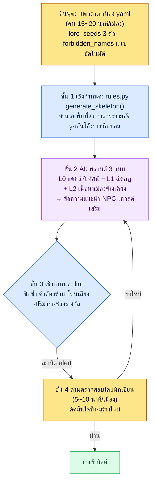

# 6.2 city_hunting_generator — สร้างเมือง 30 แห่งภายใน 4 สัปดาห์

> ผู้อ่านหลัก: นักออกแบบเกม MMORPG ที่รับผิดชอบการผลิตเนื้อหาจำนวนมาก (ทีมขนาดกลาง 10–50 คน)
> ฉบับย่อสำหรับผู้อ่านที่ทำคนเดียว/เป็นงานอดิเรก: §6.2.10 「ถ้าทำคนเดียวก็แค่เท่านี้」

ผมยังจำการคำนวณในวันแรกที่ได้รับตารางเวลาซึ่งบอกว่าต้องมีเมือง 30 แห่งก่อนเปิดตัว เมืองหนึ่งประกอบด้วยข้อความแนะนำ 5–10 บรรทัด พื้นที่ล่า 3–5 จุด NPC 5–10 คนกับเควสต์เสริม 2–3 อันต่อพื้นที่ล่าแต่ละจุด ไอเทมพิเศษประจำถิ่น 1–3 ชนิด และบอสประจำเมือง 1 ตัว ถ้าปั้นเมืองหนึ่งด้วยมือก็กินเวลา 1–2 สัปดาห์ ถ้า 30 แห่งก็เท่ากับให้นักเขียนหนึ่งคนทุ่มเวลา 6 เดือนเต็มไปกับเมืองเพียงอย่างเดียว

แต่ 6 เดือนนั้นไม่มี เวลาของนักเขียนถูกผูกไว้กับเควสต์หลักและตัวละครซิกเนเจอร์อยู่แล้ว และเมือง 30 แห่งต้องทำควบคู่ไปกับงานนั้น แรงกระตุ้นแรกที่ว่า "ก็ให้ AI สร้างเมือง 30 แห่งให้ก็ได้นี่" พังลงในไม่ช้า เพราะถ้าสั่งทั้งก้อน สิ่งที่ได้คือหมู่บ้านแฟนตาซีที่คล้ายกัน 30 แห่ง บทนี้จะดูว่าเครื่องมือ `city_hunting_generator` ที่ผมสร้างขึ้นแทนแรงกระตุ้นนั้นรวมสี่ขั้นตอน — อินพุต รูลบุ๊ก AI และการตรวจสอบ — เข้าเป็นหนึ่งรอบได้อย่างไร และเมื่อหมุนรอบนั้นจริงจนจบจริงสักครั้ง อะไรจะออกมาและอะไรจะถูกทิ้ง

> **บันทึกการใช้งานจริงของผู้เขียน**
> `city_hunting_generator` ในบทนี้คือการนำเครื่องมือจริงที่ผู้เขียนใช้งานอยู่ในโฟลเดอร์ R&D ของบริษัทมาทำให้เป็นนิรนาม ชื่อไฟล์ โครงสร้างโค้ด และรายการตรวจสอบนั้นยกมาจากเครื่องมือจริงอย่างซื่อตรง ส่วนชื่อเมือง (เช่น silvermark) และชื่อเฉพาะของบริษัทถูกแทนที่ใหม่เพื่อใช้ในหนังสือ เนื้อหาผลลัพธ์เป็นการเรียบเรียงใหม่จากเซสชันจริง

---

## 6.2.1 คนทำแค่เมตาดาตาและการตรวจสอบขั้นสุดท้ายเท่านั้น

ลำดับการทำงานทั้งหมดของเครื่องมือมีสี่ขั้น หัวใจอยู่ที่ขั้น 1 และขั้น 3 เป็นเชิงกำหนด (deterministic — รูลบุ๊ก) มีแต่ขั้น 2 เท่านั้นที่เป็น AI เมื่อรูลบุ๊กยึดทั้งโครงสร้างและการตรวจสอบไว้จากสองฝั่ง AI ที่อยู่ตรงกลางต่อให้ตอบต่างกันเล็กน้อยทุกครั้ง ความสอดคล้องระหว่างเมืองก็จะไม่สั่นคลอน คนเข้าไปเกี่ยวข้องเฉพาะอินพุตแรก (เมตาดาตา) และด่านสุดท้าย (การตรวจสอบ) เท่านั้น



ในภาพนี้ จุดที่มือคนแตะมีเพียงสองแห่ง ตำแหน่งบนสุดที่ใส่เมตาดาตาหนึ่งหน้าให้สะอาด และตำแหน่งล่างสุดที่ตัดสินเรื่องโทนเสียงและการเล่าเรื่องซึ่ง lint จับไม่ได้ ระหว่างนั้น การสร้างโครงที่น่าเบื่อและการผลิตเนื้อหาจำนวนมากให้รูลบุ๊กกับ AI หมุนไป การออกแบบที่ชี้ขาดคือ แม้ lint (ขั้น 3) จะพบการละเมิด ก็จะไม่ทิ้งโดยอัตโนมัติ แต่ส่ง alert ขึ้นไปยังด่านนักเขียน (ขั้น 4) เท่านั้น เหตุผลจะดูใน §6.2.5

---

## 6.2.2 อินพุต — เมตาดาตาเมืองหนึ่งหน้า

นักเขียนเขียนเมตาดาตาหนึ่งหน้าต่อหนึ่งเมือง เวลาที่ใช้คือ 15–20 นาที สั้นก็จริง แต่หนึ่งหน้านี้คืออินพุตทั้งหมดของสามขั้นถัดไป

```yaml
# city_021_silvermark.meta.yaml
city_id: city_021_silvermark
region: west
climate: cold_arid
dominant_faction: scholar_guild
cultural_tone: scholarly_strict
level_range: [25, 30]
lore_seeds:
  - เคยเป็นศูนย์กลางของการผนึกเวทมนตร์เมื่อ 100 ปีก่อน
  - สัญญาณแรกของการเสื่อมพลังผนึกถูกพบในเมืองนี้
  - ที่ตั้งสำนักงานใหญ่ของกิลด์นักปราชญ์
neighbors: [city_018, city_023]
# forbidden_names: (สคริปต์แนบให้อัตโนมัติ — นักเขียนไม่ต้องกรอก)
```

สล็อตที่สำคัญที่สุดคือ `lore_seeds` เหตุการณ์สำคัญ 3–5 อันเป็นตัวยึดตัวตนของเมือง ถ้าน้อยเกินไป AI จะคายเมืองแฟนตาซีทั่ว ๆ ไปออกมา ถ้ามากเกินไป เหตุการณ์ก็จะขัดแย้งกันเอง จากประสบการณ์ของผู้เขียน 3 อันเสถียรที่สุด

`forbidden_names` นักเขียนไม่ต้องเติม สคริปต์จะอ่านรายชื่อเมืองและตัวละครที่มีอยู่เดิมมาแนบเข้ากับเมตาดาตาโดยอัตโนมัติ เพราะเมื่อสะสมเมือง 30 แห่ง × NPC เฉลี่ย 50 คน การตรวจสอบความซ้ำของชื่อ 1,500 ชื่อด้วยหัวคนนั้นเป็นไปไม่ได้ จึงไม่ต้องเขียน "ทำให้ไม่ซ้ำกับ NPC เมืองอื่น" ด้วยมือทุกครั้ง

---

## 6.2.3 ขั้น 1 รูลบุ๊ก — ยึดโครงด้วยเชิงกำหนด

รูลบุ๊กรับเมตาดาตามาสร้างโครงสร้างของเมือง โค้ดเรียบง่าย

```python
# city_hunting_generator/rules.py (โครง)
def generate_skeleton(meta):
    region_rules = REGION_RULES[meta.region]
    hg_count = region_rules.hunting_grounds_range.sample()
    enemy_dist = ENEMY_RULES[meta.climate][meta.dominant_faction]

    skeleton = {
        "hunting_grounds": [
            {
                "id": f"{meta.city_id}_hg_{i}",
                "level": meta.level_range[0] + i,
                "enemy_types": enemy_dist.sample(k=3),
                "reward_curve": calc_reward(meta.level_range[0] + i),
                "npc_count": region_rules.npc_per_hg,
                "sidequest_count": region_rules.sidequest_per_hg,
            }
            for i in range(hg_count)
        ],
        "boss": {
            "id": f"{meta.city_id}_boss",
            "level": meta.level_range[1] + 2,
            "pattern": BOSS_PATTERNS[meta.region],
        },
    }
    return skeleton
```

ผลลัพธ์เป็นเชิงกำหนด ใส่เมตาดาตาเดียวกันก็ได้โครงเดียวกัน โค้ดรับประกันว่าเส้นโค้งรางวัลอยู่ในช่วงมาตรฐานตาม region·level หรือไม่ และการกระจายศัตรูตรงกับกฎ climate·faction หรือไม่ และการทดสอบถดถอย (regression test) ก็จับได้ ขั้นนี้ไม่มอบให้ AI เด็ดขาด เพราะถ้าให้ AI สุ่มเส้นโค้งรางวัลเป็นตัวเลขต่างกันทุกครั้งที่เรียก ความสมดุลระหว่างเมืองก็จะสั่นคลอนตรงนั้นทันที

เมื่อใส่เมตาดาตาของ silvermark `rules.py` จะคืนโครงเปล่ามาเป็นพื้นที่ล่า 4 จุด (`city_021_silvermark_hg_0`\~`hg_3`) แต่ละจุดมีสล็อต NPC 6 ช่อง·สล็อตเควสต์เสริม 3 ช่อง และบอสเลเวล 32 จำนวน 1 ตัว ยังไม่มีทั้งชื่อและเนื้อหา เป็นตารางของช่องที่ต้องเติม การเติมช่องเหล่านั้นคืองานของ AI ในขั้น 2

---

## 6.2.4 ขั้น 2 AI — สร้างเนื้อหาภาษาธรรมชาติ

หลังจากรูลบุ๊กสร้างโครงแล้ว AI ก็เติมเนื้อหาภาษาธรรมชาติลงไปบนนั้น ข้อความแนะนำเมือง ชื่อ·รูปลักษณ์·ภูมิหลังสั้น ๆ ของ NPC ซินอปซิสเควสต์เสริม และข้อความบรรยายรสชาติ (flavor text) ของไอเทมพิเศษประจำถิ่น ออกมาตรงนี้

รูปแบบการเรียกใช้คือโครงสร้าง 4 ชั้นของการฉีดบริบทตามเดิมเลย แคช L0 วิสัยทัศน์ (world_premise + tone_manifesto) ฉีด L1 กฎ (city_naming_rule + region_west_lore) แบบเลือกใส่ เพิ่ม L2 เนื้อหาข้างเคียง (รายชื่อ NPC ของเมืองอื่น) และต่อท้ายด้วยคำสั่งงานในตอนสุดท้าย พรอมต์ข้อความแนะนำเมืองอยู่ในรูปที่คัดลอกไปใช้ได้ทันที

```
[บริบท L0] world_premise + narrative_pillar + tone_manifesto  (แคช)
[บริบท L1] city_naming_rule, region_west_lore
[อินพุต] city_021_silvermark.meta.yaml + lore_seeds 3 ตัว

เขียนข้อความแนะนำเมืองนี้ให้ 6~8 บรรทัด สอด lore_seeds ทั้งสามอันเข้าไปอย่างเป็นธรรมชาติ
และตัดคำซ้ำซากแบบ RPG อย่าง "หมู่บ้านอันสงบสุข" ออก โทนต้องเป็นแบบนักปราชญ์และเข้มงวด ยับยั้งอารมณ์ความรู้สึก
เอาแต่เนื้อหา ไม่ต้องมีคำนำหรือคำอธิบายประกอบ
```

รูปแบบเดียวกันนี้ทำซ้ำในการเรียกผลิต NPC และเควสต์เสริมตามเดิม ต่างกันแค่บริบทและรูปแบบเอาต์พุตเท่านั้น การเรียก NPC จะมีสล็อต `forbidden_names` (ห้ามชื่อ NPC ซ้ำกับเมืองอื่น) ใส่เข้าไป และการเรียกเควสต์เสริมจะมีข้อจำกัด "ให้เลือก NPC ผู้มอบหมายงานจาก NPC ที่สร้างไว้ข้างบน" ใส่เข้าไป

แล้วจริง ๆ มันออกมาเป็นอะไร ลองหมุนจนจบสักหนึ่งครั้ง

---

## 6.2.5 หมุนหนึ่งรอบจนจบ — เอาต์พุต·การตรวจสอบ·การทิ้ง

ถ้าเขียนแบบนามธรรมว่า "AI เติมเนื้อหา" อย่างเดียว ก็ไม่อาจรู้ว่าเครื่องมือนี้คายอะไรออกมาจริง ๆ จึงขอตามรอบของเมือง silvermark หนึ่งเมืองตั้งแต่อินพุตจนถึงการทิ้งจนจบสักหนึ่งรอบ

> **[เอาต์พุตขั้น 2 AI — ข้อความแนะนำเมือง] (เรียบเรียงใหม่จากเซสชันจริง)**
>
> ซิลเวอร์มาร์กคือเมืองแห่งการผนึก เมื่อ 100 ปีก่อน นักปราชญ์เจ็ดคนได้สร้างวงผนึกไว้ใต้ดินที่นี่เพื่อสกัดการล้นทะลักของพลังเวทฝั่งตะวันตก และเมืองก็เติบโตขึ้นมาโดยวางหินทีละก้อนไว้บนวงผนึกนั้น หอระฆังของสำนักงานใหญ่กิลด์นักปราชญ์คือหอสังเกตการณ์ที่อ่านชีพจรของการผนึก ไม่ใช่ยอดหอที่มุ่งสู่เทพเจ้า ในช่วง 3 ปีหลัง มีข้อความหนึ่งบรรทัดถูกบันทึกซ้ำในรายงานการสังเกต "ชีพจรกำลังเย็นลง" สัญญาณแรกของการเสื่อมพลังผนึกสั่นไหวขึ้นเป็นครั้งแรกที่หน้าปัดของเมืองนี้ ไม่ใช่ที่อื่นใด นักปราชญ์ตามท้องถนนไม่พูดถึงมันด้วยเสียงดัง เพียงแต่วันที่ไฟบนหอระฆังไม่ดับตลอดทั้งคืนมีมากขึ้นเท่านั้นเอง

ตรงนี้ lore_seeds ทั้ง 3 อัน (ศูนย์กลางการผนึก·สัญญาณเสื่อมแรก·สำนักงานใหญ่กิลด์นักปราชญ์) ถูกใส่ลงในเนื้อหาครบ ไม่มีคำซ้ำซากแบบ "หมู่บ้านอันสงบสุขที่ต้อนรับนักผจญภัย" และโทน scholarly_strict (ยับยั้งอารมณ์ ใช้คำศัพท์เชิงสังเกต·บันทึก) ยังคงอยู่ นี่คือหน้าตาของเอาต์พุตที่ผ่านได้

ต่อจากนั้น รอบเดียวกันก็เติม 3 ช่องจาก 6 ช่องสล็อต NPC ของพื้นที่ล่า `hg_0`

> **[เอาต์พุตขั้น 2 AI — NPC 3 คน] (เรียบเรียงใหม่จากเซสชันจริง)**
>
> **1) โดเรน เวล (Doren Vale)** — ผู้ช่วยสังเกตการณ์หอระฆัง วัย 50 ปลาย ติดแว่นขยายทองเหลืองที่ตาข้างหนึ่งถาวร ทำงานบันทึกการสั่นสะเทือนละเอียดของชีพจรการผนึกมา 30 ปี พูดน้อย สื่อสารด้วยตัวเลขเท่านั้น *"วันนี้ 12.4 เมื่อวานนี้ 12.1 มันกำลังขึ้น ไม่ใช่เรื่องดี"*
>
> **2) มิรา คอสต์ (Mira Kost)** — บรรณารักษ์คลังเอกสารกิลด์ วัย 30 รอยหมึกที่นิ้วลบไม่ออก คอยรักษาต้นฉบับการออกแบบวงผนึกไว้ แต่เชื่อว่านักปราชญ์ที่อ่านแบบแปลนนั้นออกได้ตายไปหมดแล้ว ระแวงคนนอกอย่างมาก
>
> **3) เกรม (Grem)** — คนเฝ้าเตาไฟใต้หอระฆัง ไม่ทราบที่มา อายุไม่แน่ชัด งานเดียวคือไม่ปล่อยให้ไฟบนหอระฆังดับ และตอบคนที่ถามเรื่องการผนึกเพียงว่า "แค่ดูไฟก็พอ" *(ทำเครื่องหมายคลุมเครือ — AI รายงานเอง)*

ขอให้สังเกตว่า NPC คนที่สาม 'เกรม' ถูก AI ติด *เครื่องหมายคลุมเครือ* ให้เอง พรอมต์ที่ดีทำให้ AI สามารถพูดได้ว่า "อันนี้ผมยืนยันไม่ได้" ตอนนี้ lint ขั้น 3 จะตรวจเอาต์พุตชุดนี้

> **[เอาต์พุตขั้น 3 lint] (รูปแบบจริง)**
>
> ```
> [PASS] ตรวจปริมาณ: ข้อความแนะนำ 7 บรรทัด (เกณฑ์ 6~8)
> [PASS] ช่วงรางวัล: reward_curve ของ hg_0~hg_3 อยู่ในช่วงมาตรฐาน
> [WARN] ชื่อซ้ำ: "Mira Kost" — กับ "Mira Veldt" ของ city_014_riverhold
>        นามสกุล (Kost/Veldt) ต่างกันแต่ชื่อ (Mira) เหมือนกัน ชนกับ forbidden_names ใกล้เคียง
> [PASS] คำศัพท์ต้องห้าม: ละเมิด tone_manifesto 0 รายการ
> [WARN] ความสอดคล้องโทนเสียง: บทพูดของ "เกรม" voice_lint เชื่อมั่น 0.62 (ต่ำกว่าเกณฑ์ 0.70)
> ```

lint จับการละเมิดได้ 2 รายการ แต่ไม่ได้ทิ้งรายการใดโดยอัตโนมัติ เพียงส่งขึ้นด่านนักเขียนด้วย WARN เท่านั้น นี่คือหัวใจของการออกแบบที่บอกล่วงหน้าไว้ใน §6.2.1 ถ้ามอบสิทธิ์ปฏิเสธอัตโนมัติให้ตัวตรวจสอบด้วย นักเขียนก็จะกดสวิตช์นั้นลงภายในไม่ถึงหนึ่งสองเดือน เพราะเครื่องจะฆ่าแม้กระทั่งความแปรผันที่ตั้งใจไว้รวมไปด้วย และนักเขียนยังถูกพรากโอกาสที่จะกะเส้นแบ่งนั้นด้วยตัวเองด้วย ฉะนั้นจึงมอบงานคัดกรองตัวเลือกที่น่าสงสัยให้เครื่อง แต่การตัดสินใจครั้งสุดท้ายว่าจะเก็บหรือทิ้งตัวเลือกนั้นยังคงทิ้งไว้ในมือคน

> **[การตรวจสอบโดยนักเขียนขั้น 4 — การตัดสินและการทิ้ง]**
>
> นักเขียนจัดการ alert 2 รายการดังนี้
>
> - **Mira Kost** → เก็บไว้ ชื่อเหมือนกับ Mira Veldt ของ riverhold แต่คนละเมือง คนละนามสกุล ไม่มีโอกาสปรากฏพร้อมกัน ผ่านในฐานะความแปรผันที่ตั้งใจไว้ (แต่บันทึกแยกไว้ว่าจะให้กฎ forbidden_names เปลี่ยนจาก "ชื่อ+นามสกุลตรงกันทั้งหมด" เป็น "ชื่อชนกันเดี่ยว ๆ ก็ WARN" หรือไม่)
> - **เกรม** → **ทิ้ง** การที่ voice_lint เชื่อมั่นต่ำคือสัญญาณ อ่านอีกครั้งก็พบว่าตัวละครคนเฝ้าเตาไฟที่พูดว่า "แค่ดูไฟก็พอ" ขัดกับโทน scholarly_strict ของเมือง ถ้า NPC ในเมืองที่กิลด์นักปราชญ์ปกครองหลุดไปทางโทนลึกลับ ตัวตนของเมืองก็จะพร่าเลือน ทิ้งแล้วขอใหม่

หลังจากนักเขียนตัดสินใจทิ้งแล้ว การขอใหม่ก็หมุนหนึ่งรอบ "ทิ้งสล็อตเกรม สร้าง NPC คนเฝ้าเตาไฟที่เข้ากับโทนกิลด์นักปราชญ์ (สังเกต·บันทึก·เข้มงวด) ของพื้นที่ล่าเดียวกันใหม่ ห้ามใช้คำศัพท์เชิงลึกลับ" AI ตอบกลับมาเป็นคนแก่ที่บันทึกอุณหภูมิของเตาไฟบนหอระฆัง มองแม้แต่ไฟเป็นข้อมูล และเอาต์พุตนั้นผ่านด้วย voice_lint 0.81 หนึ่งรอบของ อินพุต → โครง → เนื้อหา → ตรวจสอบ → ทิ้ง → สร้างใหม่ ปิดลงตรงนี้

หนึ่งรอบนี้คือเกณฑ์ Show ของทั้งเล่ม ถ้าไม่เคยดูจนจบสักครั้งว่าเครื่องมือคายอะไร อะไรถูกจับ และคนฆ่าอะไร ประโยคที่ว่า "ผลิตจำนวนมากด้วย AI" ก็กลวงเปล่า

---

## 6.2.6 อัตราการทิ้งไม่ใช่ความล้มเหลวของเครื่องมือ แต่เป็นสัญญาณของด่าน

ในรอบข้างต้น NPC ถูกทิ้งไป 1 คน เมื่อมองทั้งเมือง การทิ้งจะสะสมมากขึ้น เวลาตรวจสอบเฉลี่ย 5–10 นาทีต่อเมือง อัตราการทิ้งของ NPC ประมาณ 20% และของเควสต์เสริมประมาณ 33%

ผมขอบอกที่มาของอัตราส่วนนี้อย่างซื่อตรง อัตราการทิ้งเป็นค่าที่นับเองขณะตรวจสอบเมือง 5 แห่งที่รวม silvermark ในช่วงเริ่มนำมาใช้โดยตรง NPC ทิ้งไป 6 คนจากที่ตรวจ 30 คน (20%) เควสต์เสริมทิ้งไป 5 อันจากที่ตรวจ 15 อัน (33%) เนื่องจากตัวอย่างมีเพียง 5 เมืองซึ่งเล็ก จึงควรอ่านมันเป็นค่าบ่งทิศ "หนึ่งในห้า หนึ่งในสาม" มากกว่าจะเป็นสัดส่วนประชากรที่แม่นยำ อัตราสะสมหลังจากตรวจครบทั้ง 30 เมืองอาจต่ำลงกว่านี้ หรือสูงขึ้นตามลักษณะของพื้นที่ล่าก็ได้

สิ่งสำคัญคืออัตราการทิ้ง 0% ไม่ใช่เป้าหมาย การทิ้ง 0% ใกล้เคียงกับสัญญาณว่าการตรวจสอบไหลผ่านไปอย่างเป็นพิธีการ เมื่อ NPC หนึ่งในห้าถูกทิ้งเพราะโทนไม่เข้ากัน และเควสต์เสริมหนึ่งในสามถูกสร้างใหม่เพราะไม่เกาะกับ lore_seeds นั่นคือตอนที่ด่านตรวจสอบทำงานจริง

---

## 6.2.7 การวัดผล — เมือง 30 แห่งใน 4\~5 สัปดาห์

เปรียบเทียบก่อนและหลังนำเครื่องมือมาใช้ ค่าเวลาด้านล่างเป็นค่าเฉลี่ยที่วัดจริงของเมืองช่วงแรกที่รวม silvermark ส่วนคอลัมน์ "ก่อนนำมาใช้" เป็นค่าประมาณของนักเขียนในช่วงทำมือก่อนมีเครื่องมือ ไม่มีตัวเลขที่กุขึ้น

| รายการ | ก่อนนำมาใช้ (ทำมือ) | หลังนำมาใช้ (วัดจริง) |
|---|---|---|
| เวลาเขียนเมือง 1 แห่ง | 1\~2 สัปดาห์ | ราว 30 นาที (เมตา 15 นาที + AI 5 นาที + ตรวจสอบ 8 นาที) |
| ระยะเวลารวมเมือง 30 แห่ง | ระดับนักเขียน 1 คน 6 เดือน | 4\~5 สัปดาห์ |
| อัตราการทิ้ง (NPC) | — (เขียนเองทั้งหมด) | ราว 20% (6 คนจาก 30 คน) |
| อัตราการทิ้ง (เควสต์เสริม) | — | ราว 33% (5 อันจาก 15 อัน) |
| เหตุไม่สอดคล้อง (ต่อเมือง) | แทบไม่มี | 0\~1 รายการ |

ดูแค่ตารางก็เหมือนตัวเลขเป็นทั้งหมด แต่ผลจริงออกมาจากช่องอื่น เมื่อเวลาของนักเขียนที่เกือบถูกผูกไว้กับการผลิตเมืองจำนวนมากถูกปลดปล่อย นักเขียนหนึ่งคนก็เพิ่มผลผลิตเควสต์หลักต่อไตรมาสได้มากขึ้นอย่างมาก (จำนวนเท่าที่แน่นอนต่างกันไปในแต่ละไตรมาส จึงไม่ฟันธง — ทิศทางคือ "ผลผลิตเควสต์หลักเพิ่มขึ้นอย่างชัดเจน") เครื่องมือผลิตจำนวนมากจึงทำงานเป็นเครื่องมือที่ปลดปล่อย ไม่ใช่ดูดกลืน เวลาของนักเขียน (คำเตือนใน §6.1.8 ที่ว่าถ้านักเขียนรู้สึกว่าตนกลายเป็น "ตัวตรวจสอบ" เครื่องมือก็จะถูกปฏิเสธ ใช้ได้ตรง ๆ)

---

## 6.2.8 เนื้อหาที่ไม่เข้า generator

แม้ขอบเขตการทำงานอัตโนมัติจะกว้างขึ้น แต่สิ่งต่อไปนี้วางไว้นอกเครื่องมือ

| เนื้อหา | เหตุผลที่วางไว้นอกเครื่องมือ |
|---|---|
| เนื้อหาเควสต์หลัก | ความสอดคล้องและความลึกของการเล่าเรื่องเชื่อมโยงตรงกับตัวตนของเกม |
| แพตเทิร์น·การจัดฉากบอส | รายละเอียดด้านภาพ·การโต้ตอบมีมาก มือดีไซเนอร์เร็วกว่า |
| ตัวละครหลักซิกเนเจอร์ | ต้องเขียน voice_profile แบบเต็ม จึงผลิตจำนวนมากไม่ได้ |
| ตอนจบแบบแยกสาย | เป็นพื้นที่ตัดสินใจโดยตรงของนักเขียน |
| เควสต์เสริมซิกเนเจอร์ของเมือง 1\~2 อัน | นักเขียนเลือกและสร้างเอง |

ข้อเท็จจริงที่ว่าผลิตจำนวนมากได้ ไม่ควรนำไปสู่การตัดสินใจที่ว่าต้องผลิตจำนวนมากโดยอัตโนมัติ อย่างที่เห็นในรอบ silvermark เครื่องมือผลิต NPC ได้ดีถึง 5 คนจาก 6 คน แต่ NPC ซิกเนเจอร์หนึ่งคนที่ต้องแบกความตึงเครียดหลักของเมืองนั้นที่ว่า 'การผนึกกำลังเย็นลง' นักเขียนปั้นด้วยมือเอง เมื่อขอบเขตของการทำงานอัตโนมัติชัดเจน เครื่องมือผลิตจำนวนมากก็กลับกลายเป็นเครื่องมือที่ปกป้องพื้นที่หัวใจนั้นแทน

---

## 6.2.9 ความล้มเหลวที่พบบ่อยห้าอย่าง

| แพตเทิร์นความล้มเหลว | ทำไมจึงล้มเหลว | วิธีแก้ |
|---|---|---|
| เขียน lore_seeds แค่ 1\~2 อัน | เอาต์พุต AI ถูกเกลี่ยเป็นค่าเฉลี่ย RPG ทั่วไป | บังคับให้มี 3 อันขึ้นไป (§6.2.2) |
| ขอ AI ผลิตทั้งก้อนโดยไม่มีรูลบุ๊ก | "สร้างเมือง 30 แห่งให้" → หมู่บ้านคล้ายกัน 30 แห่ง | ข้ามรูลบุ๊กขั้น 1 ไม่ได้ (§6.2.3) |
| พึ่งแต่การตรวจสอบของนักเขียนโดยไม่มี lint | ผู้ตรวจสอบเสียเวลาไปกับการจัดการการละเมิดกฎเล็ก ๆ น้อย ๆ | ตรวจสอบอัตโนมัติขั้นแรกก่อน (§6.2.5) |
| ตกหล่นการตรวจชื่อซ้ำ | ความซ้ำของชื่อ 1,500 คนเป็นไปไม่ได้ด้วยหัวคน | แนบ forbidden_names อัตโนมัติ (§6.2.2) |
| ไม่วัดความพึงพอใจของนักเขียน | ปริมาณงานเพิ่มขึ้น แต่ถ้าแย่งเวลาของนักเขียนไปก็จะถูกปฏิเสธ | รับประกันเวลาเนื้อหาหลักอย่างชัดเจน (§6.2.7) |

อย่างที่ห้าพลาดบ่อยที่สุด การที่นักเขียนจะตัดสินใจอย่างที่ทิ้งเกรมของ silvermark ได้อย่างมีความสุข นักเขียนต้องเหลือเวลาไว้ปั้นเองนอกเหนือจากการตรวจสอบงานผลิตจำนวนมาก ถ้าวัดแต่ปริมาณงานแล้วตัดการวัดเวลาของนักเขียนออก เครื่องมือก็จะสำเร็จในแง่ KPI แต่คนจะจากไป

---

## 6.2.10 ลองทำดู — หนึ่งขั้นที่ทำได้วันนี้

> **ถ้าทำคนเดียวก็แค่เท่านี้**: ไม่ต้องมีโค้ดรูลบุ๊กก็ได้ เลือกเมือง·พื้นที่ 1 แห่งจากเกมของคุณ (หรือเกมที่คุณชอบ) แล้วเขียนเมตาดาตาในรูปแบบ §6.2.2 ด้วยมือ (lore_seeds 3 อันคือหัวใจ) คัดลอกพรอมต์ข้อความแนะนำของ §6.2.4 ไปวางตามนั้นแล้วลองหมุนหนึ่งครั้ง จาก NPC ที่ออกมา ลองเลือกคนหนึ่งที่โทนไม่เข้าด้วยตัวเองแล้วโต้แย้งว่า "NPC คนนี้ขัดกับโทนของเมือง ทิ้งแล้วทำใหม่" คุณจะรู้สึกได้ด้วยตัวเองว่าด่านตรวจสอบคือกลุ่มของการตัดสินใจแบบไหน

ถ้าเป็นทีม ขอให้เริ่มด้วยหนึ่งขั้นต่อไปนี้ สร้างแบบฟอร์ม yaml เมตาดาตาหนึ่งหน้าและสคริปต์แนบ `forbidden_names` อัตโนมัติก่อน โครงรูลบุ๊ก (`generate_skeleton`) และ lint เป็นลำดับถัดไป แค่มีแบบฟอร์มอินพุตและการตรวจชื่อซ้ำสองอย่าง ก็ป้องกันความล้มเหลวที่พบบ่อยสองอย่างซึ่งทำให้การผลิตเนื้อหาด้วย AI พังลงเป็น "หมู่บ้านคล้ายกัน 30 แห่ง" ได้ก่อนแล้ว

---

## 6.2.11 ตัวอย่างบทถัดไป

ใน 6.3 จะกล่าวถึงไปป์ไลน์ NPC Persona/Squad ถ้า generator ของ 6.2 ผลิต NPC อย่างโดเรน·มิราเป็นรายตัว Persona/Squad จะมัด NPC เหล่านั้นเข้าเป็นกลุ่ม เป็นวิธีทำให้ NPC ห้าคนของพื้นที่ล่าหนึ่งจุดทำงานเป็นสังคมเล็ก ๆ ไม่ใช่กองตุ๊กตาที่ไม่เกี่ยวข้องกัน

---

### สรุปประเด็นสำคัญของบท
- ขั้น 1·3 เป็นรูลบุ๊ก (เชิงกำหนด) มีแต่ขั้น 2 ที่เป็น AI — คนทำแค่อินพุตและด่านตรวจสอบเท่านั้น
- ต้องดูเอาต์พุต·การตรวจสอบ·การทิ้งจนจบสักหนึ่งครั้ง "การผลิตจำนวนมากด้วย AI" จึงจะไม่กลวงเปล่า
- อัตราการทิ้ง 20·33% ไม่ใช่ความล้มเหลวของเครื่องมือ แต่เป็นสัญญาณว่าด่านทำงาน

### ตัวอย่างบทถัดไป
- 6.3 ไปป์ไลน์ NPC Persona/Squad
