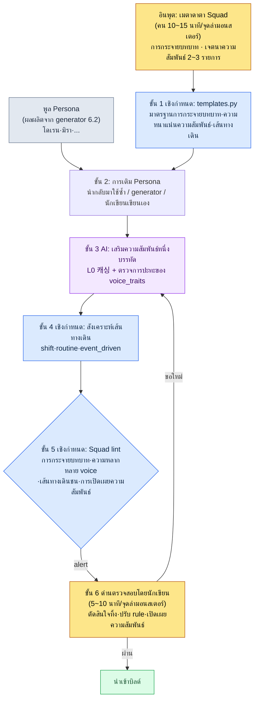

# 6.3 NPC Persona และ Squad — จากพิพิธภัณฑ์ตุ๊กตาสู่สังคมเล็ก ๆ

> ผู้อ่านหลัก: นักออกแบบเกม MMORPG ที่รับผิดชอบเนื้อหา NPC และจุดล่ามอนสเตอร์ (ทีมขนาดกลาง 10–50 คน)
> เวอร์ชันย่อสำหรับผู้อ่านคนเดียว/งานอดิเรก: §6.3.10 「ถ้าทำคนเดียว แค่นี้พอ」

ผู้เขียนมีความทรงจำของวันที่ใช้ generator ในหัวข้อ 6.2 ปั๊ม NPC ห้าตัวลงในจุดล่ามอนสเตอร์แห่งหนึ่งแล้วลองเปิดเข้าไปในเกมจริง ชื่อ รูปร่างหน้าตา และภูมิหลังสั้น ๆ ถูกเติมครบหมดแล้ว เหลือแค่กดพิกัดวางตำแหน่ง แต่พอลองเดินไปในจุดล่ามอนสเตอร์นั้นจริง ๆ มันกลับให้ความรู้สึกตายแปลก ๆ ห้าคนอยู่ในพื้นที่เดียวกันแต่ไม่เคยเอ่ยถึงกันสักครั้ง สองคนยืนซ้อนกันอยู่บนหินก้อนเดียวกัน ตรงนั้นต้องการคนที่รับบทพ่อค้า แต่ทั้งห้าคนกลับเป็นนักวิชาการหมด ทั้งโดเรนและมิราต่างก็เป็น NPC ที่ดูปกติดีเมื่อแยกเป็นรายตัว แต่พอเอามามัดรวมกัน มันก็กลายเป็นแค่กองตุ๊กตา

นี่คือสภาพ "พิพิธภัณฑ์ตุ๊กตา" NPC แต่ละตัวสร้างเสร็จหมดแล้ว แต่ไม่ได้มีชีวิตในฐานะกลุ่ม บทนี้ว่าด้วยไปป์ไลน์ที่มัดห้าคนนั้นให้กลายเป็นสังคมเล็ก ๆ การแยกแกนหลักคือ Persona และ Squad ถ้าเปรียบเป็นออฟฟิศ Persona คือนามบัตรของพนักงานแต่ละคน ส่วน Squad คือผังองค์กรของทีมหนึ่ง ต่อให้กองนามบัตรไว้ 50 ใบ แต่ถ้าไม่มีผังองค์กร บริษัทก็เดินไม่ได้ และกระดูกสันหลังของบทนี้คือขั้นตอนสุดท้าย นั่นคือจุดที่เราตรวจสอบร่วมกับ AI จนจบหนึ่งรอบว่ากลุ่มที่มัดรวมกันแล้ว "พูดและขยับเหมือนคนที่รู้จักกัน" หรือไม่

> **บันทึกการใช้งานจริงของผู้เขียน**
> ไปป์ไลน์ Squad ในบทนี้เป็นการนำเครื่องมือ NPC Persona/Squad ที่ผู้เขียนใช้งานอยู่ในโฟลเดอร์ R&D ของบริษัทมาทำให้ไม่ระบุตัวตน โครงสร้าง yaml รายการตรวจสอบ และค่าขีดแบ่ง voice_lint ถ่ายทอดมาจากเครื่องมือจริงอย่างซื่อตรง ส่วนชื่อเมืองและชื่อ NPC เปลี่ยนให้เป็นเวอร์ชันสำหรับหนังสือเหมือนกับในหัวข้อ 6.2 เนื้อหาผลลัพธ์เป็นการเรียบเรียงใหม่จากเซสชันจริง

---

## 6.3.1 Persona คือนามบัตร, Squad คือผังองค์กร

Persona คืออัตลักษณ์ของ NPC แต่ละตัว บรรจุชื่อ รูปร่างหน้าตา voice_profile และบทบาท สิ่งที่ generator ในหัวข้อ 6.2 สร้างขึ้นก็คือ Persona โดเรน เวล และมิรา คอสต์ ต่างเป็น Persona หนึ่งตัว

Squad คือหน่วยที่มัด Persona เหล่านั้นเข้าเป็นกลุ่ม โดยนิยามว่าในจุดล่ามอนสเตอร์แห่งหนึ่ง ห้าคนกระจายตัวด้วยบทบาทอะไร มีความสัมพันธ์กันอย่างไร และเคลื่อนไหวอย่างไร

| หน่วย | สิ่งที่บรรจุ | ผู้สร้าง |
|---|---|---|
| Persona | ชื่อ·รูปร่างหน้าตา·voice_profile·บทบาท | generator (6.2) |
| Squad | การกระจายบทบาท·ความสัมพันธ์·เส้นทางเดิน | ไปป์ไลน์ Squad (บทนี้) |

ถ้าไม่แยกสองสิ่งนี้ออกจากกัน จะมีสองอย่างที่ตันพร้อมกัน ถ้าปั๊มแต่ Persona ก็จะกลายเป็นพิพิธภัณฑ์ตุ๊กตา แต่ถ้าพยายามเริ่มจาก Squad ก็จะไม่มี Persona ให้เติม เมื่อแยกออกจากกันแล้ว การดำเนินงานของแต่ละหน่วยจะเรียบง่ายขึ้น แต่การแยกไม่ได้หมายถึงการตัดขาด หัวใจคือการวางเส้นทางสำหรับการนำกลับมาใช้ซ้ำและการตรวจสอบไว้ระหว่างสองหน่วย และนี่คือเนื้อหาหลักของบทนี้

การแยกแกน Persona→Squad นี้ไม่ใช่แค่การจัดระเบียบ แต่เปิดทางไปได้ไกลกว่านั้น กลุ่ม NPC ต้องถูกทำให้เป็นรูปแบบมาตรฐานด้วยบทบาท ความสัมพันธ์ และค่าตัวเลขเสียก่อน ภายหลังสถานะของโลก (การสะสมพฤติกรรมของผู้เล่น) จึงจะสามารถสั่นค่าตัวเลขของ NPC ได้ และค่าตัวเลขนั้นก็กลายเป็นเงื่อนไขการเกิดเควสต์ ไปจนถึงการตอบสนองแบบพลวัตได้ บทนี้แตะแค่ทางเข้าของการประยุกต์เชิงก้าวหน้านั้น และในแนวทางหลักจะกล่าวถึงเพียง "การปั๊มแบบอนุรักษ์นิยมที่มีคนตรวจสอบ" เท่านั้น

---

## 6.3.2 อินพุต — เมตาดาตา Squad หนึ่งหน้า

โครงร่าง Squad เริ่มต้นจากเมตาดาตาหนึ่งหน้าต่อจุดล่ามอนสเตอร์หนึ่งจุด เป็นแนวคิดเดียวกับเมตาดาตาเมืองในหัวข้อ 6.2 คนจับเฉพาะการกระจายบทบาทและเจตนาด้านความสัมพันธ์เท่านั้น ส่วนงานเติมเนื้อหาให้ rulebook และ AI ทำ

```yaml
# city_021_hg_3.squad.yaml
squad_id: city_021_hg_3_squad
hunting_ground: city_021_silvermark_hg_3
type: hunting_ground_residents
size: 5
roles:
  - role: quest_giver
    count: 1
    voice_traits: [authoritative, scholarly]
  - role: lore_keeper
    count: 1
    voice_traits: [scholarly, withdrawn]
  - role: merchant
    count: 1
    voice_traits: [practical, dry]
  - role: bystander
    count: 2
    voice_traits: [varied]
relationships:
  - between: [quest_giver, lore_keeper]
    type: mentor_and_former_student
  - between: [merchant, bystander_1]
    type: regular_customer
movement_pattern: stationary_with_shifts
```

สล็อตที่สำคัญที่สุดคือ `relationships` ถ้าความสัมพันธ์เป็น 0 รายการ ห้าคนก็จะเป็นคนแปลกหน้าต่อกันจนจบ แต่ถ้าความสัมพันธ์มากเกินไป (ห้าคนมีตั้งแต่ห้ารายการขึ้นไป) ผู้ใช้จะต้องจำเยอะจนกลับกลายเป็นว่ามันจมหายไป จากประสบการณ์ของผู้เขียน Squad ห้าคนที่มีความสัมพันธ์หลัก 2–3 รายการเป็นช่วงที่เสถียรที่สุด ส่วน `voice_traits` คือกลไกที่จับให้ห้าคนมีน้ำเสียงต่างกัน ถ้าเติม `scholarly` ให้ทั้งห้าคน ก็จะติดที่ขั้นตอนตรวจสอบเพราะ voice ถูกปรับให้เท่ากันหมด

---

## 6.3.3 ขั้น 1·2 — โครงร่าง rulebook และการเติม Persona

rulebook จับมาตรฐานของโครงร่าง Squad ก่อนเป็นอันดับแรก ค่าเริ่มต้นของขนาด การกระจายบทบาท ความหนาแน่นของความสัมพันธ์ และรูปแบบเส้นทางเดิน ตามแต่ละ region·type ของจุดล่ามอนสเตอร์ถูกป้อนไว้ในโค้ดแล้ว

```python
# npc_squad/templates.py (발췌)
SQUAD_TEMPLATES = {
    ("west", "hunting_ground_residents"): {
        "size_range": (4, 6),
        "role_distribution": {
            "quest_giver": 1,
            "merchant": 1,
            "lore_keeper": (0, 1),
            "bystander": (1, 3),
        },
        "relationship_density": 2,        # จำนวนความสัมพันธ์ที่แนะนำ
        "movement_pattern": "stationary_with_shifts",
    },
    ("east", "outpost_squad"): {
        "size_range": (3, 4),
        "role_distribution": {
            "commander": 1,
            "scout": 1,
            "support": (1, 2),
        },
        "relationship_density": 1,
        "movement_pattern": "patrol_loop",
    },
}
```

ขั้นตอนนี้เป็นเชิงกำหนด (deterministic) Squad ผู้อยู่อาศัยฝั่งตะวันตกที่มี quest_giver ครบทั้งห้าคนเป็นเรื่องที่เป็นไปไม่ได้ในระดับโค้ด ถ้าการกระจายบทบาทออกนอก rule ก็จะถูกหยุดทันทีตรงนั้น

ถัดมาคือการเติม Persona ลงในแต่ละสล็อต มีอยู่สามทาง ถ้ามี Persona ในพูลที่เข้ากับสล็อต ก็นำกลับมาใช้ซ้ำ (น้ำหนักการปรากฏตัว +1) ถ้าไม่มีก็สร้างใหม่ด้วย generator ในหัวข้อ 6.2 และถ้าเป็นตัวละครหลักของเควสต์หลัก นักเขียนก็เขียนเองโดยตรง Squad hg_3 ของ silvermark เติม quest_giver·lore_keeper ด้วยมิราและโดเรนที่ปั๊มไว้แล้วในหัวข้อ 6.2 แล้วดึง merchant กับ bystander อีกสองคนมาใหม่ ถึงตรงนี้เหมือนกับรอบ generator ของหัวข้อ 6.2 งานจริง ๆ ของบทนี้คือสิ่งที่ตามมา นั่นคือจุดที่ตรวจสอบว่ากลุ่มที่มัดรวมกันแล้วทำงานเหมือนกลุ่มจริง ๆ หรือไม่

---

## 6.3.4 ทำหนึ่งรอบให้จบ — เสริมความสัมพันธ์·เส้นทางเดิน·ตรวจสอบความสอดคล้อง

ถ้าเขียนเพียงนามธรรมว่า "AI เสริมความสัมพันธ์" ก็จะไม่รู้ว่าไปป์ไลน์นี้คายอะไรออกมา เราจะตามรอบครึ่งหลังของ Squad silvermark hg_3 หนึ่งหน่วยให้จบสักครั้ง ตั้งแต่การสร้างข้อความความสัมพันธ์ไปจนถึงการทิ้งและการขอใหม่

### ขั้น 3 — AI เสริมความสัมพันธ์

แท็กความสัมพันธ์ที่ป้อนไว้ในโครงร่าง Squad (`mentor_and_former_student`) เป็นนามธรรม จึงมองไม่เห็นในเกม การเปลี่ยนสิ่งนี้ให้เป็นคำบรรยายหนึ่งบรรทัดแล้วฝังลงในบทพูดของ NPC และอีเวนต์คือขั้น 3 พรอมต์อยู่ในรูปที่สามารถคัดลอกไปใช้ได้ทันที

```
[L0 컨텍스트] world_premise + tone_manifesto  (캐싱)
[L1 컨텍스트] city_021_silvermark.lore (สมาคมนักวิชาการครอบครอง, scholarly_strict)
[Persona 1] quest_giver — มิรา คอสต์, บรรณารักษ์คลังเอกสารสมาคม, วัย 30 ปลาย ๆ, รอยหมึกเปื้อน
[Persona 2] lore_keeper — โดเรน เวล, ผู้ช่วยสังเกตการณ์หอระฆัง, วัย 50, สนทนาด้วยตัวเลขเท่านั้น
[관계 태그] mentor_and_former_student

ช่วยบรรยายความสัมพันธ์ของสองคนนี้ (อาจารย์–อดีตลูกศิษย์) เป็นภูมิหลังสำหรับใช้ในบทพูดในเกม แค่ 1–2 บรรทัด
โดเรนคือตัวเลข มิราคือเอกสาร — ให้สำนวนการพูดของทั้งสองไม่ปะทะกัน โทนเป็นแบบนักวิชาการเคร่งครัด
ตัดถ้อยคำซ้ำซากอย่างความลึกลับหรือ "เพื่อนเก่า" ออก เอาเฉพาะเนื้อความ
```

> **[ขั้น 3 ผลลัพธ์ AI — ความสัมพันธ์หนึ่งบรรทัด] (เรียบเรียงใหม่จากเซสชันจริง)**
>
> โดเรนสอนวิธีเขียนสัญลักษณ์ของบันทึกการสังเกตการณ์แท่นผนึกให้มิราเมื่อ 20 ปีก่อน ทุกวันนี้สถานะกลับด้าน โดเรนเป็นคนวัดค่าตัวเลข แล้วมิราเป็นคนคัดลงสมุดบัญชีของคลังเอกสาร ทั้งสองจะถกเถียงกันสั้น ๆ ทุกวันอังคารเรื่องช่องหนึ่งที่ค่าจากการสังเกตการณ์ไม่ตรงกับสมุดบัญชี

ผลลัพธ์นี้ดี `mentor_and_former_student` ถูกทำให้เป็นรูปธรรม "ตัวเลข" ของโดเรนกับ "เอกสาร" ของมิราถูกมัดเข้าด้วยกันในฉากเดียว (การคัดค่าตัวเลขลงสมุดบัญชี) โดยไม่ปะทะกัน และโทน scholarly_strict ก็ยังคงอยู่ พรอมต์เดียวกันนี้นำมาทำซ้ำกับความสัมพันธ์ `regular_customer` ของ merchant–bystander_1 ด้วย

### ขั้น 4 — สังเคราะห์เส้นทางเดิน

ถ้า NPC ยืนอยู่ที่เดียวทั้งวัน มันก็กลายเป็นตุ๊กตาอีกครั้ง rulebook เป็นตัวเติมรูปแบบเส้นทางเดิน stationary คือยืนตรึงที่เดียว (ยาม·บอส) stationary_with_shifts คือเปลี่ยนตำแหน่งเล็กน้อยทุก 8 ชั่วโมง (ทั่วไป) routine_loop คืออิงตารางเวลา (ผู้อยู่อาศัย) event_driven คือเคลื่อนที่เฉพาะตอนถูกทริกเกอร์ (NPC เควสต์) ขั้นตอนนี้เป็นเชิงกำหนดจึงไม่เรียก AI

### ขั้น 5 — lint ความสอดคล้องของ Squad (ด่านตรวจสอบของไปป์ไลน์นี้)

ตอนนี้เราตรวจว่าห้าคนที่มัดรวมกันแล้วทำงานเหมือนกลุ่มจริง ๆ หรือไม่ ถ้า lint ในหัวข้อ 6.2 ดู NPC รายตัว lint ตัวนี้ดูความสอดคล้องของกลุ่ม

> **[ขั้น 5 ผลลัพธ์ Squad lint] (รูปแบบจริง)**
>
> ```
> [PASS] การกระจายบทบาท: quest_giver 1 · lore_keeper 1 · merchant 1 · bystander 2 (ตรงตาม rule)
> [PASS] ความหนาแน่นความสัมพันธ์: 2 รายการ (แนะนำ 2, ตรงตาม)
> [WARN] ความหลากหลายของ voice: สาย scholarly 3/5 — quest_giver·lore_keeper·bystander_2
>        มีค่าความคล้ายเชิงโคไซน์ของ voice_profile 0.83 (เกินขีด 0.80) เสี่ยงถูกปรับให้เท่ากัน
> [WARN] เส้นทางเดินชนกัน: ช่วง 14:00~16:00 พิกัดของ merchant·bystander_1 ซ้อนทับในรัศมี 1.5m
> [FAIL] การเปิดเผยความสัมพันธ์: นิยามความสัมพันธ์ไว้ 2 รายการ แต่ในบทพูดของทั้งห้าคนไม่มีการเอ่ยถึงสมาชิกคนอื่นเลยสักครั้ง
>        ความสัมพันธ์มีอยู่แค่ในข้อมูล — การมองเห็นในเกมเป็น 0
> ```

lint จับได้สามรายการ ทั้งสามไม่ถูกทิ้งโดยอัตโนมัติ แต่ยกขึ้นด่านตรวจสอบ — เครื่องเป็นคนคัดผู้ต้องสงสัย แต่คนเป็นคนตัดสินว่าจะฆ่าหรือไว้ชีวิต ซึ่งเป็นการออกแบบแบบเดียวกับ §6.2.5

> **[ขั้น 6 การตรวจสอบโดยนักเขียน — การตัดสินและการทิ้ง]**
>
> นักเขียนจัดการ alert ทั้งสามรายการดังนี้
>
> - **voice ถูกปรับให้เท่ากัน (WARN)** → ทิ้ง bystander_2 ต่อให้เป็นเมืองนักวิชาการ ถ้าทั้งห้าคนพูดสำนวนนักวิชาการหมด จุดล่ามอนสเตอร์ก็จะจืดชืด จึงขอสร้าง bystander_2 ใหม่เป็นคนงานเบ็ดเตล็ดโทน `practical, dry` (การที่ quest_giver·lore_keeper เป็นนักวิชาการทั้งคู่เป็นอัตลักษณ์ของเมือง จึงคงไว้)
> - **เส้นทางเดินชนกัน (WARN)** → ปรับ rule เลื่อนออฟเซ็ตเริ่มต้น shift ของ merchant ออกไป +2 ชั่วโมง เพื่อแก้การซ้อนทับตอน 14:00 ปรับเฉพาะพารามิเตอร์เส้นทางเดินโดยไม่เรียก AI
> - **การเปิดเผยความสัมพันธ์เป็น 0 (FAIL)** → รายการที่สำคัญที่สุด นิยามความสัมพันธ์ไว้ตั้งสองรายการ แต่ถ้าในเกมไม่ปรากฏให้เห็นสักครั้ง ข้อมูลนั้นก็เป็นข้อมูลที่ตายแล้ว นักเขียนตัดสินใจเลือกความสัมพันธ์หลัก 1 รายการ (โดเรน–มิรา) แล้วฝังลงในบทพูด

สามรายการ สองรายการถูกปิดด้วย rule และการสร้างใหม่ ส่วน FAIL รายการสุดท้ายคือหัวใจของไปป์ไลน์นี้ นักเขียนขอเพิ่มกิ่งบทสนทนาของโดเรนหนึ่งบรรทัด

```
ช่วยแทรกบทพูดของโดเรนหนึ่งบรรทัดที่ความสัมพันธ์กับมิราปรากฏออกมาแบบหลุดลอย ๆ
อย่าเป็นเชิงอธิบาย ให้เป็นแบบกิ่งก้านข้าง ๆ โทนนักวิชาการ เอาบทพูดแค่บรรทัดเดียว
```

> **[ผลลัพธ์จากการขอใหม่]**
>
> *"แบบแปลนนั่นอยู่ในคลังเอกสาร ไปถามมิราดู ...เมื่อ 20 ปีก่อนข้านี่แหละที่สอนวิธีอ่านให้คนนั้น เดี๋ยวนี้มันกลับตาลปัตรเสียแล้ว"*

ขณะที่บรรทัดนี้เข้าไป ความสัมพันธ์ของ NPC สองตัวก็ย้ายจากชีตข้อมูลมาสู่หน้าจอเกม หนึ่งรอบของ อินพุต (เมตา Squad) → โครงร่าง → การเติม Persona → การเสริมความสัมพันธ์ → เส้นทางเดิน → การตรวจสอบความสอดคล้อง → การตัดสินใจทิ้ง·เปิดเผย ปิดลงที่ตรงนี้

หนึ่งรอบนี้คือเกณฑ์ Show ของบทนี้ ประโยคที่ว่า "มัด NPC ให้เป็นสังคมด้วย Squad" จะกลวงเปล่า หากไม่ได้เห็นฉากที่คนปิด FAIL การเปิดเผยความสัมพันธ์ที่เป็น 0 ด้วยบทพูดหนึ่งบรรทัดแม้สักครั้ง

---

## 6.3.5 ภาพรวมทั้งหมดของ Persona→Squad

ขอใส่รอบข้างต้นไว้เป็นภาพเดียว หัวใจคือ ขั้น 1·2·4·5 เป็นเชิงกำหนด (rulebook·lint) และมีเพียงขั้น 3 เท่านั้นที่เป็น AI อีกทั้งมือของคนแตะแค่ที่อินพุตบนสุดและด่านตรวจสอบล่างสุดเท่านั้น



จุดที่มือคนแตะมีแค่สองแห่ง จุดที่จับเจตนาบทบาท·ความสัมพันธ์ที่บนสุด กับจุดที่ตัดสินโทน·การเล่าเรื่องที่ lint จับไม่ได้ที่ล่างสุด ส่วนระหว่างนั้น โครงร่าง·เส้นทางเดิน·การตรวจสอบเป็นงานของ rulebook ส่วนเนื้อความความสัมพันธ์ AI เป็นตัวรัน

---

## 6.3.6 สามกลไกที่ทำให้ความสัมพันธ์มองเห็นในเกม

รายการ `การเปิดเผยความสัมพันธ์` ของ lint ขั้น 5 เป็นรายการที่ FAIL บ่อยที่สุด เพราะความสัมพันธ์มีชีวิตอยู่แค่ในข้อมูล กลไกที่ดึงความสัมพันธ์ออกมาสู่ในเกมมีอยู่สามอย่าง

หนึ่ง **การอ้างอิงในบทพูด** เหมือนบทพูดของโดเรนใน §6.3.4 ที่ NPC เอ่ยถึงสมาชิกคนอื่นหนึ่งบรรทัด ถูกที่สุดและได้ผลมากที่สุด

สอง **การตัดกันของเส้นทางเดิน** ฉากที่โดเรนกับมิราอยู่ในคลังเอกสารด้วยกันทุกวันอังคารถูกสังเกตเห็นในเกม ถ้าผู้ใช้บังเอิญเห็นก็จะรู้ทันว่า "สองคนนั้นเกี่ยวพันกันหรือเปล่า" ถ้าเส้นทางเดินขั้น 4 กับความสัมพันธ์สอดคล้องกัน มันก็ออกมาเองตามธรรมชาติ

สาม **เงื่อนไขกิ่ง** ถ้าปฏิเสธคำขอของ quest_giver ค่าความพอใจของ lore_keeper ก็จะลดลงไปด้วย กลไกที่สามนี้คือทางเข้าของการประยุกต์เชิงก้าวหน้าที่กล่าวไว้ใน §6.3.1 — จุดที่ความสัมพันธ์ก้าวข้ามการบรรยายแบบเรียบ ๆ ไปสู่การส่งผลต่อสถานะของเกม

ไม่จำเป็นต้องใช้ทั้งสามกลไก แค่ความสัมพันธ์หลัก 2–3 รายการใน Squad ห้าคนถูกเปิดเผยด้วยกลไกที่หนึ่งและสอง ความรู้สึกของจุดล่ามอนสเตอร์ก็เปลี่ยนไปอย่างมาก ถ้ามากเกินไปผู้ใช้ก็จะต้องจำเยอะ นักเขียนเลือกความสัมพันธ์ที่จะเปิดเผยในขั้นตรวจสอบแล้วแทรกเข้าไป ที่เหลือก็ทิ้งไว้เป็นแค่ข้อมูล

---

## 6.3.7 การวัดผล — อย่างซื่อตรง

เปรียบเทียบก่อนและหลังนำเครื่องมือมาใช้ ไม่ใช้ตัวเลขที่ปรุงแต่ง เวลาและสัดส่วนเป็นค่าที่นับจากการตรวจสอบจุดล่ามอนสเตอร์ช่วงแรกหลายแห่งด้วยตนเอง รวมถึง silvermark ส่วนคอลัมน์ "ก่อนนำมาใช้" เป็นการประมาณของผู้เขียนในช่วงที่ทำด้วยมือ

| รายการ | ก่อนนำมาใช้ (ทำมือ·ประมาณ) | หลังนำมาใช้ (วัดจริง) |
|---|---|---|
| มัด Squad ของจุดล่ามอนสเตอร์ 1 จุด | ประมาณ 3\~4 ชั่วโมง | ประมาณ 25 นาที (เมตา 12 นาที + AI 5 นาที + ตรวจสอบ 8 นาที) |
| จำนวนการเปิดเผยความสัมพันธ์ (บทพูด·เส้นทางเดิน) | 0\~1 รายการต่อจุดล่ามอนสเตอร์ | เปิดเผย 1\~2 รายการจากความสัมพันธ์หลัก 2\~3 |
| เส้นทางเดินชน (2 คนขึ้นไปพิกัดเดียวกัน) | 2\~3 รายการต่อจุดล่ามอนสเตอร์ | กัน lint ไว้ล่วงหน้า, 0\~1 รายการ |
| ทิ้งเพราะ voice ถูกปรับให้เท่ากัน | — (ไม่มีการตรวจ) | สร้างใหม่ 0\~1 คนจาก 5 คน |

เนื่องจากตัวอย่างมีเพียงจุดล่ามอนสเตอร์ไม่กี่แห่งซึ่งน้อย จึงควรอ่านเป็นค่าทิศทางมากกว่าสัดส่วนประชากรที่แม่นยำ การเปลี่ยนแปลงที่ใหญ่ที่สุดไม่อยู่ในตาราง เพราะ FAIL `การเปิดเผยความสัมพันธ์` ของ lint บังคับยื่นใส่หน้านักเขียนว่า "จุดล่ามอนสเตอร์นี้ ไม่เห็นความสัมพันธ์เลยสักอย่าง" การที่ผลผลิตปั๊มออกวางขายในสภาพพิพิธภัณฑ์ตุ๊กตาจึงลดลงในเชิงโครงสร้าง ประเด็นที่ว่าการทิ้ง 0%·การเปิดเผย 0 รายการไม่ใช่เป้าหมาย (§6.2.6) ก็เป็นเช่นเดียวกันที่นี่ Squad ดูดซับงานมัดส่วนใหญ่ไป แต่ต้องเหลือเวลาให้นักเขียนได้ปั้นหัวใจอย่างบทพูดบรรทัดสุดท้ายของโดเรนด้วยตัวเองด้วย

---

## 6.3.8 พูล Persona — เมื่อคนเดียวกันปรากฏในหลายเมือง

เมื่อ Squad เสถียรแล้ว สิ่งที่ตามมาเองตามธรรมชาติคือพูล Persona Persona เดียวกันสามารถปรากฏในหลายเมืองได้ การที่ NPC สังกัดสมาคมนักวิชาการถูกพบเจอในเมืองสามสี่แห่งกลับเป็นเรื่องธรรมชาติ ไม่ใช่ทำให้โลกดูแคบ แต่ทำให้ดูเชื่อมโยงกัน

```yaml
persona_pool:
  - id: persona_doren_vale
    voice_traits: [terse, numeric]
    appearance_count: 3
    appearance_cities: [city_021, city_018, city_023]
    signature: false
  - id: persona_mira_kost
    voice_traits: [scholarly, withdrawn]
    appearance_count: 2
    signature: false
```

สัดส่วนการนำกลับมาใช้ซ้ำมีช่วงที่ดีต่อสุขภาพอยู่

| สัดส่วนการนำกลับมาใช้ซ้ำ | สภาพ |
|---|---|
| ต่ำกว่า 20% | ปริมาณ NPC พุ่ง, ภาระในการจดจำ |
| 30\~50% | ช่วงการดำเนินงานที่ดีต่อสุขภาพ |
| 70% ขึ้นไป | NPC น่าเบื่อ, ความหลากหลายเสียหาย |

แต่ถ้าให้ NPC ตัวหนึ่งปรากฏในเมืองมากเกินไป ก็จะกลายเป็น "คนนี้โผล่มาอีกแล้ว" เมืองที่ Persona หนึ่งตัวปรากฏได้มากที่สุดกำหนดเพดานไว้ที่ 5 แห่ง ห้องบอส·ตัวละครซิกเนเจอร์ห้ามนำกลับมาใช้ซ้ำ (`signature: true`) ตั้งแต่การปรากฏครั้งที่สองของ Persona เดียวกัน บังคับให้มีการแปรผันทางสายตา (แสง·พร็อพ) ช่วง 30\~50% นี้ไม่ใช่ค่าตัวเลขที่แม่นยำ แต่เป็นแนวทางการดำเนินงาน — ต้องปรับตามขนาดทีม·เกม

> **[ป้ายชี้ทิศ — ถ้ามองพูลเปอร์โซนาเป็นการกระจายตัว (ตอนนี้ยังเร็วเกินไป)]** ถ้าเป็นทีมที่พูลใหญ่ขึ้นถึงหลายร้อย NPC ก็มีทิศทางที่ก้าวไปอีกก้าว — เป็นป้ายชี้ทิศที่อยู่ตำแหน่งเดียวกับหัวข้อ 'เวกเตอร์เชิงมิติ' ใน §8.2.7 (ไม่ใช่ใบสั่งยา — สัญชาตญาณเชิงแนวคิดอยู่ในภาคผนวก M) voice_lint ใน §6.3.4 ดู 'ความใกล้' ของ Persona สองตัวด้วยค่าความคล้ายเชิงโคไซน์ (ค่าอย่าง 0.83) อยู่แล้ว ถ้านำ embedding เดียวกันนี้ขึ้นทั้งพูล ก็จะวินิจฉัยความน่าเบื่อได้ด้วยความหนาแน่นของการกระจายแทนความรู้สึกของนักเขียน — สภาพที่ 'สำนวนนักวิชาการกระจุกอยู่มุมเดียวกันเป็นกอง' จะเห็นเป็นความหนาแน่นของจุดในบริเวณนั้น เมื่อนั้นแทนที่จะปั๊ม 'นักวิชาการคล้าย ๆ กันอีกตัว' ลงในบริเวณความหนาแน่นต่ำ ก็จะเปิดทางให้เติมการแปรผันที่ประมาณค่าระหว่าง Persona สองตัวที่ใกล้กันเข้ามาเพื่อเติมความหลากหลาย แต่มีจุดที่ต้องระวังสองข้อในลมหายใจเดียวกัน Persona ที่ได้จากการประมาณค่ามักกลายเป็น 'ค่ากลางที่ตายแล้ว' ซึ่งเอา NPC สองตัวมาผสมกันอย่างขัดเขิน สุดท้ายคนต้องมาชุบชีวิต voice ขึ้นใหม่อยู่ดี และสัดส่วนความน่าเบื่อข้างต้น (30\~50%) ไม่ใช่ค่าที่แม่นยำ แต่เป็นแนวทางการดำเนินงาน พอแปลงมันเป็นระยะ embedding เมื่อใด ความหลวมก็มีความเสี่ยงที่จะแอบแฝงตัวให้ดูเหมือนแม่นยำ — ค่าระยะทางเป็นสัญญาณที่ช่วยการตัดสินของนักเขียน ไม่ใช่ตัวการตัดสินเอง

---

## 6.3.9 ความล้มเหลวที่พบบ่อยหกแบบ

| รูปแบบความล้มเหลว | ทำไมจึงล้มเหลว | วิธีแก้ |
|---|---|---|
| ปั๊มแต่ Persona แล้วเมิน Squad | มี NPC ครบ 50 ตัวแต่จุดล่ามอนสเตอร์ตาย | นำ rulebook โครงร่าง Squad มาใช้ (§6.3.3) |
| สร้างอิสระโดยไม่มี rule การกระจายบทบาท | การกระจายผิดเพี้ยนอย่างพ่อค้าห้าคน นักวิชาการ 0 คน | บังคับ role_distribution (§6.3.3) |
| มีแต่แท็กความสัมพันธ์ ขาดคำบรรยายหนึ่งบรรทัด | ความสัมพันธ์เป็นนามธรรมจึงมองไม่เห็นในเกม | ขั้น 3 AI เสริมความสัมพันธ์ (§6.3.4) |
| ไม่มีการตรวจการเปิดเผยความสัมพันธ์ | นิยามความสัมพันธ์ไว้แต่เปิดเผยในบทพูด·เส้นทางเดิน 0 รายการ | lint `การเปิดเผยความสัมพันธ์` ขั้น 5 (§6.3.4) |
| ขาดการตรวจเส้นทางเดินชน | 2 คนอยู่ที่เดียวกันในเวลาเดียวกัน พบบ่อยหลังออกเกม | ตรวจพิกัด·ช่วงเวลาอัตโนมัติ (§6.3.4) |
| สัดส่วนการนำกลับมาใช้ซ้ำ 0% หรือ 70%+ | 0% คือปริมาณพุ่ง, 70%+ คือน่าเบื่อ | ดำเนินงานพูล + เพดานการปรากฏ (§6.3.8) |

แบบที่สี่ถูกมองข้ามบ่อยที่สุด การนิยามความสัมพันธ์กับการทำให้ความสัมพันธ์มองเห็นในเกมเป็นคนละงาน และถ้าไม่ตรวจ อย่างหลังก็มักจะหายไปแทบทุกครั้ง ถ้า lint ไม่ได้ยื่นการเปิดเผยความสัมพันธ์ 0 รายการเป็น FAIL ใส่ใน silvermark hg_3 โดเรนกับมิราก็คงเป็นอาจารย์–ลูกศิษย์กันแค่ในชีตข้อมูลเท่านั้น

---

## 6.3.10 ลองทำดู — หนึ่งขั้นที่ทำได้วันนี้

> **ถ้าทำคนเดียว แค่นี้พอ**: ไม่ต้องมี rulebook หรือ lint ก็ได้ ลองเลือก NPC 3–5 ตัวที่อยู่ในสถานที่หนึ่งของเกมตัวเอง (หรือเกมที่คุณชอบ) แล้วเขียนบทบาทและความสัมพันธ์ 2 รายการลงมือด้วยตัวเองตามรูปแบบใน §6.3.2 จากนั้นแปะพรอมต์เสริมความสัมพันธ์ใน §6.3.4 ลงไปตรง ๆ เพื่อรับคำบรรยายหนึ่งบรรทัด และสุดท้ายลองถามตัวเองดู — "ความสัมพันธ์นี้ตอนนี้เห็นได้ที่บทพูดตรงไหนของเกม" ถ้าไม่มีสักที่ นั่นแหละคือ FAIL `การเปิดเผยความสัมพันธ์ 0` ของ lint ถ้าลองแทรกสมาชิกคนอื่นลงในบทพูดของ NPC ตัวหนึ่งหนึ่งบรรทัดเพื่อปิด FAIL นั้นด้วยมือ คุณจะเข้าใจถึงเนื้อตัวว่าการตรวจสอบ Squad เป็นงานที่จับอะไร

ถ้าเป็นทีม ให้เริ่มจากหนึ่งขั้นต่อไปนี้ สร้างฟอร์ม yaml เมตาดาตา Squad หนึ่งหน้า และเริ่มจาก **`การเปิดเผยความสัมพันธ์` ของ lint ขั้น 5 หนึ่งบรรทัด** ก่อน (grep ว่าในข้อความบทพูดของ NPC แต่ละตัวมีชื่อ·บทบาทของสมาชิกคนอื่นปรากฏหรือไม่) การตรวจการกระจายบทบาท·การตรวจเส้นทางเดินชนเป็นเรื่องถัดไป แค่มีการตรวจการเปิดเผยความสัมพันธ์เพียงอย่างเดียว ก็กันความล้มเหลวที่พบบ่อยที่สุด คือการที่จุดล่ามอนสเตอร์ที่ปั๊มออกมาวางขายในสภาพพิพิธภัณฑ์ตุ๊กตาได้ก่อนแล้ว

ถ้าสรุปเป็น setup → prompt → verify — **setup**: นิยามบทบาท·ความสัมพันธ์ลงใน yaml เมตา Squad แล้วจับโครงร่างด้วย templates.py **prompt**: รับความสัมพันธ์หนึ่งบรรทัดตามรูปแบบ §6.3.4 โดยบังคับห้าม voice_traits ปะทะกันและห้ามถ้อยคำซ้ำซาก **verify**: รัน lint ขั้น 5 เพื่อยืนยัน FAIL `การเปิดเผยความสัมพันธ์` แล้วฝังความสัมพันธ์หลัก 1 รายการลงในบทพูดเพื่อปิดด้วยตัวเอง

---

### สรุปประเด็นสำคัญของบท
- Persona คือนามบัตร, Squad คือผังองค์กร — ต้องแยกออกจากกัน พิพิธภัณฑ์ตุ๊กตาจึงจะกลายเป็นสังคม
- ต้องดูการเสริมความสัมพันธ์·เส้นทางเดิน·การตรวจสอบความสอดคล้องให้จบสักครั้ง คำว่า "มัดให้เป็นสังคม" จึงจะไม่กลวงเปล่า
- การที่คนปิด FAIL `การเปิดเผยความสัมพันธ์ 0` ด้วยบทพูดหนึ่งบรรทัด คือหัวใจของไปป์ไลน์นี้

### ตัวอย่างบทถัดไป
- 6.4 เวิร์กโฟลว์การปั๊มเนื้อหา — มัดการสร้าง Persona·Squad·เมืองเข้าด้วยกันเป็นรอบ 1 สัปดาห์
