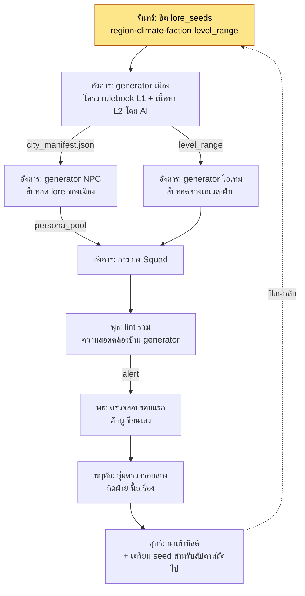

# 6.4 เวิร์กโฟลว์การผลิตเนื้อหาจำนวนมาก — ร้อย generator หลายตัวเข้าเป็นไลน์เดียว

ในสัปดาห์ที่ผมทำเครื่องมือทั้งสามตัวเสร็จ ผมนั่งลงในที่เดียวแล้วรัน generator เมือง รัน generator NPC และรัน generator ไอเทม ทั้งสามตัวทำงานได้ดีในแบบของมันเอง เมืองออกมา 7 แห่ง NPC ออกมา 110 ตัว และอาวุธออกมา 60 ชิ้น แต่อีกไม่กี่วันต่อมา ตอนนั่งตรวจสอบเนื้อหา ผมจึงรู้ว่าตัวเองเหยียบกับดักเดิมไปถึงสามครั้ง

เมือง `port_harman` ถูกสร้างขึ้นเป็น "หมู่บ้านประมงที่ล่มสลาย" แต่เพอร์โซนาของ NPC ที่ถูกวางไว้ในเมืองนั้นกลับเป็น "พ่อค้าผู้มั่งคั่งแห่งเมืองท่าการค้าที่รุ่งเรือง" เป็นเพราะ generator เมืองกับ generator NPC มอง lore_seeds คนละชุดกัน ส่วน generator อาวุธก็เอาอาวุธในตำนานระดับเลเวล 40 ไปวางขายในร้านค้า ทั้งที่เลเวลแนะนำของเมืองนั้นคือ 12–18 เครื่องมือทั้งสามตัวต่างทำถูกในแบบของตัวเอง แต่กลับผิดเพราะไม่ได้ถูกร้อยเข้าด้วยกัน

บทนี้ไม่ใช่เรื่องของการสร้างเครื่องมือตัวเดียว แต่เป็นเรื่องของการ **ร้อย** generator เมืองในหัวข้อ 6.2, NPC Squad ในหัวข้อ 6.3 และ generator ไอเทม **เข้าเป็นไลน์การผลิตเดียว** เมื่อมีเครื่องมือสามตัว กับดักก็ไม่ได้มีแค่สาม แต่จะเกิดใหม่ขึ้นในรอยต่อระหว่างเครื่องมือด้วย

---

## 6.4.1 มุมมองแบบไลน์การผลิต

ถ้ารัน generator เมือง NPC และไอเทม แยกกันคนละที กระบวนการ ผลลัพธ์ของเครื่องมือแต่ละตัวจะไม่ตรงกับอินพุตของเครื่องมือตัวอื่น ทางแก้ไม่ใช่การทำให้เครื่องมือฉลาดขึ้น แต่คือ **การตรึงเมตาดาตาที่ใช้ร่วมกันไว้ที่ต้นน้ำเพียงครั้งเดียว แล้วจัดเรียงเครื่องมือทั้งหลายให้เข้าแถวอยู่ใต้มัน** หาก generator เมืองในหัวข้อ 6.2 บทที่ 2 คือต้นแบบของเครื่องมือเดี่ยว บทนี้ก็คืองานที่ลดสถานะเครื่องมือตัวนั้นลงมาเป็นเพียงสถานีหนึ่งในไลน์

ทั้งไลน์ไหลไปเช่นนี้



หัวใจอยู่ที่ลูกศรชื่อ `city_manifest.json` ขณะที่ generator เมืองสร้างเมือง มันจะหย่อนอัตลักษณ์ของเมืองนั้น (ว่าเป็นหมู่บ้านประมงที่ล่มสลายหรือเมืองท่าการค้าที่รุ่งเรือง) ออกมาเป็น manifest แล้ว generator NPC กับ generator ไอเทมก็ **รับ manifest นั้นเป็นอินพุต** กับดักที่ผมเหยียบตอนนั้นก็เพราะไม่มีลูกศรเส้นนี้ การร้อยเครื่องมือเข้าด้วยกันก็คือการสอดสัญญาหนึ่งบรรทัดนี้เข้าไประหว่างเครื่องมือ

---

## 6.4.2 สัญญาหนึ่งบรรทัดที่ร้อยเครื่องมือเข้าด้วยกัน — manifest

ทุกครั้งที่ generator เมืองสร้างเมืองขึ้นมาหนึ่งแห่ง มันจะคายไฟล์ `city_manifest.json` ออกมาด้วย รูปแบบจริงของไฟล์นี้เป็นเช่นนี้ และไฟล์นี้เองที่กลายเป็นอินพุตของ generator NPC และไอเทม

```json
{
  "city_id": "port_harman",
  "display_name": "ท่าฮาร์มาน",
  "lore_seeds": ["หมู่บ้านประมงที่ล่มสลาย", "เสียงสะท้อนของการค้าครั้งเก่า", "ขาดแคลนเกลือ"],
  "region": "ชายฝั่งตอนใต้",
  "dominant_faction": "กิลด์ชาวประมง",
  "level_range": [12, 18],
  "tone": "เสื่อมถอย·ดื้อรั้น",
  "forbidden_names": ["ฮารัน", "ฮาร์เมน"],
  "neighbors": ["salt_marsh", "old_pier"]
}
```

generator NPC สืบทอด `lore_seeds` และ `tone` มาสร้าง "ผู้คนดื้อรั้นแห่งหมู่บ้านประมงที่ล่มสลาย" generator ไอเทมสืบทอด `level_range` มาแล้ววางขายเฉพาะอาวุธเลเวล 12–18 ส่วน `forbidden_names` คือชื่อที่เมืองข้างเคียงใช้ไปแล้ว ทั้งสองฝ่ายจึงหลีกเลี่ยง เครื่องมือทั้งสามตัวมองสัญญาฉบับเดียวกัน

พรอมต์ที่ผมป้อนให้ Claude ตอนสร้าง manifest นี้เป็นดังนี้ เนื่องจากเป็นการเรียกครั้งเดียวที่สำคัญที่สุดในการร้อยต้นน้ำของไลน์การผลิต ผมจึงคัดลอกมาเต็มทั้งฉบับ

> เธอคือเครื่องเขียน manifest ของ generator เมือง MMORPG จงรับเมตาดาตาของผู้เขียนด้านล่างแล้วสร้าง city_manifest.json
>
> อินพุตจากผู้เขียน:
> - city_id: port_harman
> - lore_seeds: หมู่บ้านประมงที่ล่มสลาย, เสียงสะท้อนของการค้าครั้งเก่า, ขาดแคลนเกลือ
> - region: ชายฝั่งตอนใต้
> - level_range: 12-18
>
> กฎ:
> 1. ให้อนุมาน dominant_faction จาก lore_seeds แต่ต้องไม่ซ้ำกับฝ่ายของเมืองข้างเคียง (salt_marsh, old_pier) ฝ่ายของเมืองข้างเคียงคือ [สหกรณ์นาเกลือ, กลุ่มลักลอบค้า]
> 2. ใน forbidden_names ให้ใส่ชื่อ NPC/สถานที่ที่ถูกใช้ไปแล้วในเมืองข้างเคียง รายการที่ให้มา: [ฮารัน, ฮาร์เมน]
> 3. tone ต้องไม่เกินสองคำ และต้องไม่ขัดแย้งกับ lore_seeds
> 4. จงแยกแสดงค่าที่อนุมานเองกับค่าที่ผู้เขียนระบุไว้อย่างชัดเจน

ผลลัพธ์ดิบจาก Claude เป็นเช่นนี้ ผมคัดลอกมาตามจริงโดยไม่สรุปย่อ มีอยู่จุดหนึ่งที่ฝ่าฝืนกฎ

> ```json
> {
>   "city_id": "port_harman",
>   "display_name": "ท่าฮาร์มาน",
>   "lore_seeds": ["หมู่บ้านประมงที่ล่มสลาย", "เสียงสะท้อนของการค้าครั้งเก่า", "ขาดแคลนเกลือ"],
>   "region": "ชายฝั่งตอนใต้",
>   "dominant_faction": "กลุ่มลักลอบค้า",   // ← อนุมาน: ขาดแคลนเกลือ + การค้าครั้งเก่า = การลักลอบค้า
>   "level_range": [12, 18],
>   "tone": "เสื่อมถอย·โลภ",
>   "forbidden_names": ["ฮารัน", "ฮาร์เมน"],
>   "neighbors": ["salt_marsh", "old_pier"]
> }
> ```
> (ค่าที่อนุมาน: dominant_faction, tone, display_name / ค่าที่ผู้เขียนระบุ: ที่เหลือ)
> ข้อควรระวัง: ผมเลือก dominant_faction เป็น "กลุ่มลักลอบค้า" แต่ตามกฎข้อ 1 เมืองข้างเคียง old_pier เป็น "กลุ่มลักลอบค้า" อยู่แล้ว จึงเป็นการฝ่าฝืนกฎ ขอเสนอ "กิลด์ชาวประมง" เป็นตัวเลือกทดแทน

สิ่งสำคัญตรงนี้คือ AI รายงานการฝ่าฝืนกฎด้วยตัวเอง "กลุ่มลักลอบค้า" เป็นการอนุมานที่น่าสนใจเมื่อมองจาก lore_seeds (ขาดแคลนเกลือ·การค้าครั้งเก่า) แต่ **ในระดับของไลน์การผลิตแล้วมันชนกัน** เพราะเมืองข้างเคียงเป็นกลุ่มลักลอบค้าอยู่ก่อนแล้ว ผมจึงรับข้อเสนอของ AI แล้วแก้ `dominant_faction` เป็น "กิลด์ชาวประมง" และแก้ `tone` เป็น "เสื่อมถอย·ดื้อรั้น" คำว่า "โลภ" เป็นคำที่ออกมาจากสมมติฐานกลุ่มลักลอบค้า จึงไม่เข้ากับกิลด์ชาวประมง

การตรวจสอบ·ปฏิเสธ·กำหนดใหม่เพียงครั้งเดียวนี้คอยปกป้องต้นน้ำของไลน์ ถ้า manifest ผิด NPC ทั้ง 110 ตัวและอาวุธทั้ง 60 ชิ้นที่อยู่ใต้มันก็จะถูกสร้างขึ้นบนสมมติฐานที่ผิดทั้งหมด ใช้เวลา 5 นาทีที่ต้นน้ำ จะประหยัดเวลา 3 ชั่วโมงที่ปลายน้ำ

---

## 6.4.3 lint รวม — ตรวจรอยต่อระหว่างเครื่องมือ

lint ของ generator เดี่ยวมองเฉพาะผลลัพธ์ของตัวเอง lint ของเมืองดูว่าเมืองทำตาม rulebook หรือไม่ lint ของ NPC ดูว่าเพอร์โซนารักษาความสอดคล้องของ voice ไว้หรือไม่ แต่กับดักที่ผมเหยียบตอนแรกอยู่ใน **รอยต่อระหว่างเครื่องมือ ไม่ใช่ภายในเครื่องมือแต่ละตัว** ดังนั้นไลน์จึงต้องการอีกหนึ่งชั้นที่อยู่เหนือ lint เดี่ยว นั่นคือ lint รวมที่อ่านข้อมูลของเมือง·NPC·ไอเทมไปพร้อมกันแล้วตรวจสอบแบบไขว้

รายการที่ lint รวมจับได้จริงเป็นเช่นนี้

| การตรวจ | เปรียบเทียบอะไร | สิ่งที่พลาดไปตอนนั้น |
|---|---|---|
| ความสอดคล้องของ lore | city.lore_seeds ↔ npc.persona | หมู่บ้านประมงแต่เป็นพ่อค้าผู้มั่งคั่ง |
| ความสอดคล้องของช่วงเลเวล | city.level_range ↔ item.required_level | อาวุธเลเวล 40 ในเมืองเลเวล 12–18 |
| การชนกันของฝ่าย | city.faction ↔ neighbor.faction | สองเมืองที่เป็นกลุ่มลักลอบค้าอยู่ติดกัน |
| ชื่อซ้ำ | พูลชื่อทั้งหมดของ city·npc·item | ไม่ได้เก็บ forbidden_names |

ส่วนหนึ่งของผลลัพธ์จริงตอนรัน lint รวมนี้เป็นดังนี้ มันไม่ได้ทิ้งผลลัพธ์อัตโนมัติ แต่เพียงแสดง alert ขึ้นมาเพื่อให้คนเป็นผู้ตัดสิน

> ```
> [lint รวม] ตรวจสอบไลน์ port_harman — 3 alert
>
> ALERT-1 (ความสอดคล้องของ lore) port_harman
>   city.lore_seeds = ["หมู่บ้านประมงที่ล่มสลาย", ...]
>   npc[merchant_04].persona = "พ่อค้าผู้มั่งคั่งแห่งเมืองท่าการค้าที่รุ่งเรือง"
>   → อาจขัดแย้งกัน ต้องยืนยันว่าเป็นความเบี่ยงเบนที่ตั้งใจหรือไม่
>
> ALERT-2 (ความสอดคล้องของช่วงเลเวล) port_harman
>   city.level_range = [12,18]
>   item[blade_legend_07].required_level = 40
>   → เกินช่วงเลเวลแนะนำไป 28 ทบทวนการวางในร้านค้าใหม่
>
> ALERT-3 (ชื่อซ้ำ) — ข้อมูล
>   npc[fisher_02].name = "ฮารัน"
>   city.forbidden_names = ["ฮารัน", ...]
>   → ชนกับ forbidden_names แนะนำให้สร้างชื่อ NPC ใหม่
> ```

พอเห็น ALERT-1 ผมก็ลังเลอยู่ครู่หนึ่ง การที่ NPC เป็น "พ่อค้าผู้มั่งคั่งแห่งเมืองท่าการค้าที่รุ่งเรือง" ก็ไม่ได้ผิดเสมอไป ถ้าเป็นเมืองที่ **เคยรุ่งเรืองแต่ตอนนี้ล่มสลายไปแล้ว** "พ่อค้าที่เคยร่ำรวย แต่ตอนนี้ยากจน" ก็กลับเป็นเรื่องเล่าที่ดีเสียด้วยซ้ำ ดังนั้นผมจึงตัดสิน ALERT-1 ว่าเป็น "ความเบี่ยงเบนที่ตั้งใจ" แทนที่จะทิ้ง แล้วขอแก้เพอร์โซนาของ NPC หนึ่งบรรทัดเป็น "พ่อค้าชราที่ยังยึดเหนี่ยวร่องรอยของเมืองท่าการค้าที่เคยรุ่งเรือง" ส่วน ALERT-2 เป็นความผิดพลาดที่ชัดเจน ผมจึงเอาอาวุธออก และ ALERT-3 ก็แค่สร้างชื่อใหม่

ไม่ใช่ lint อัตโนมัติที่หยุดความผิดพลาดได้ แต่ lint อัตโนมัติ **ดึงความผิดพลาดมาวางไว้ตรงหน้าคน** ส่วนการตัดสินเป็นหน้าที่ของคน นี่คือหัวใจของ L2 (rulebook + AI ช่วย) ที่พูดถึงในหัวข้อ 6.1 AI สร้างโครงและ alert ส่วนคนเป็นผู้ตัดสินครั้งสุดท้าย การคัดแยกสิ่งที่ "ดูเหมือนผิดแต่เป็นเรื่องเล่าที่ดี" อย่าง ALERT-1 เป็นสิ่งที่ rulebook ทำไม่ได้

---

## 6.4.4 หมุนไลน์ด้วยรอบหนึ่งสัปดาห์

เมื่อร้อยเครื่องมือเข้าด้วยกันแล้วก็ต้องมีจังหวะ ไลน์หมุนเป็นรอบหนึ่งสัปดาห์ได้เสถียรที่สุด หนึ่งสัปดาห์สั้นพอที่งานตรวจสอบจะไม่ระเบิดทับถม และยาวพอที่การป้อนกลับจะไม่ล่าช้า อีกทั้งยังพอดีกับปฏิทินบนโต๊ะของผมหนึ่งช่อง

| วัน | สถานีของไลน์ | เวลาของผู้เขียน |
|---|---|---|
| จันทร์ | เขียนชีต lore_seeds (ต้นน้ำของ manifest) | ครึ่งวัน (5–7 เมือง × 15–20 นาที) |
| อังคาร | รัน generator เมือง→NPC→ไอเทม ต่อเนื่องกัน | ผู้เขียนไม่ต้องแทรกแซง |
| พุธ | lint รวม + ตรวจสอบรอบแรก (ตัวเอง) | 1 ชั่วโมง (5–10 นาที/เมือง) |
| พฤหัส | สุ่มตรวจรอบสอง (ลีดฝ่ายเนื้อเรื่อง) | 2–3 นาที/เมือง |
| ศุกร์ | นำเข้าบิลด์ + เตรียม seed สำหรับสัปดาห์ถัดไป | สั้น |

วันอังคารคือหัวใจของไลน์ พอ generator เมืองหย่อน manifest ออกมา generator NPC ก็คาบมันไป generator ไอเทมก็คาบไป แล้ว Squad ก็วางตำแหน่งจนจบ ห่วงโซ่นี้หมุนอยู่เบื้องหลังโดยไม่ต้องอาศัยการแทรกแซงของผู้เขียน ระหว่างนั้นผู้เขียนก็ไปเขียนเควสต์หลัก (L0 ทำมือล้วน) ผลตอบแทนที่แท้จริงของการร้อยเครื่องมืออยู่ตรงนี้ ถ้าเครื่องมือแยกกัน ผู้เขียนต้องลงมือถึงสามครั้งในวันอังคาร แต่ถ้าร้อยเข้าด้วยกันก็ไม่ต้องลงมือเลยสักครั้ง

ผู้เขียนคนเดียวผลิตเมือง 5–7 แห่งต่อสัปดาห์ พร้อม NPC·อาวุธที่ผูกติดมาด้วย 4 สัปดาห์ก็ได้เมือง 20–28 แห่ง เป้าหมาย 30 แห่งบรรลุได้ใน 6 สัปดาห์

---

## 6.4.5 ความสมบูรณ์ของไลน์ — สี่ตัวชี้วัดที่ดูทุกสัปดาห์

ความสมบูรณ์ของไลน์ดูจากตัวเลข ไม่ใช่ความรู้สึก นี่คือสี่ตัวชี้วัดที่ถูกรวบรวมโดยอัตโนมัติทุกสัปดาห์

| ตัวชี้วัด | ช่วงปกติ | สัญญาณเมื่อเบี่ยงเบน |
|---|---|---|
| อัตราผ่าน lint รวม | 80–95% | ต่ำกว่า 60% แสดงว่าต้นน้ำ manifest พัง |
| การชนกันข้าม generator | 3–5 ครั้ง/เมือง | 10 ครั้งขึ้นไป แสดงว่าสัญญาระหว่าง generator แตก |
| อัตราทิ้งจากการตรวจสอบโดยมนุษย์ | 10–20% | 30% ขึ้นไป แสดงว่าพารามิเตอร์การผลิตผิด |
| เวลาต่อรอบของผู้เขียนคนเดียว | 5 วัน | 7 วันขึ้นไป แสดงว่าภาระทางความคิดมากเกินไป |

ตัวชี้วัดที่เป็นแบบไลน์มากที่สุดคือตัวที่สอง **จำนวนการชนกันข้าม generator** เมื่อใช้เครื่องมือเดี่ยวตัวเดียว ตัวเลขนี้ไม่มีอยู่ หากตัวเลขนี้พุ่งเกิน 10 ครั้งขึ้นมาทันที ก็ไม่ใช่ว่าเครื่องมือตัวใดตัวหนึ่งพัง แต่คือ **สัญญา (manifest) ระหว่างเครื่องมือแตก** มักจะระเบิดตอนที่เปลี่ยน schema ของ manifest ใน generator เมือง แต่ generator NPC ยังอ่าน schema เก่าอยู่ ถ้าไม่มีตัวชี้วัดนี้ ก็จะมองไม่เห็นความผิดพลาดนั้นจนกระทั่งปล่อยเกม

สี่ตัวชี้วัดนี้ถูกป้อนเข้าสู่การทบทวนรายไตรมาสทุกสัปดาห์ ถ้าแนวโน้มแย่ลง ก็ลดจำนวนเมืองที่ผลิตในสัปดาห์ถัดไปจาก 5–7 แห่งลงเหลือ 3–5 แห่ง แล้วหาสาเหตุ

---

## 6.4.6 สามความผิดพลาดที่ทำให้ไลน์ล่ม

เมื่อร้อยเครื่องมือหลายตัวเข้าด้วยกัน ก็จะเกิดความผิดพลาดที่เครื่องมือเดี่ยวไม่มี ผมขอบันทึกสามอย่างที่พบบ่อยไว้

**หนึ่ง ความผิดพลาดจากสัญญาไม่ตรงกัน** เพิ่มฟิลด์ใหม่ลงใน manifest ของ generator เมือง แต่ generator NPC ไม่รู้จักฟิลด์นั้น ตัวชี้วัดการชนกันแบบไขว้พุ่งสูง เมื่อพัฒนาเครื่องมือแยกกัน ก็ง่ายที่จะอัปเดตเพียงฝ่ายเดียว ทางรับมือคือใส่ฟิลด์ `version` ลงใน schema ของ manifest แล้วให้ generator ปลายน้ำแสดง alert ทันทีเมื่อเวอร์ชันไม่ตรงกัน ไม่ใช่การไล่บี้คน แต่เป็นการบังคับใช้สัญญา

**สอง ความผิดพลาดจากต้นน้ำปนเปื้อน** ถ้า manifest ถูกสร้างขึ้นบนสมมติฐานที่ผิด (เช่น "กลุ่มลักลอบค้า" ในหัวข้อ §6.4.2) ทุกอย่างที่อยู่ใต้มันก็จะปนเปื้อนตามไปด้วย อัตราทิ้งจากการตรวจสอบโดยมนุษย์เกิน 30% แต่พอดูผลลัพธ์ที่ถูกทิ้ง คุณภาพของ NPC แต่ละตัวกลับดีปกติ แต่ละตัวดีปกติ แต่สมมติฐานผิด ทางรับมือคือใส่การตรวจสอบเพิ่มอีกหนึ่งขั้นในช่วงการสร้าง manifest ตรวจต้นน้ำ 1 ชิ้นย่อมดีกว่าตรวจปลายน้ำ 110 ชิ้น

**สาม ความผิดพลาดจากโมเดลดริฟต์** LLM ถูกอัปเดตอัตโนมัติจนคุณลักษณะของผลลัพธ์เปลี่ยนไป generator ทั้งสามตัวคือเมือง·NPC·ไอเทม สั่นพร้อมกัน ให้ตรวจสอบการเปลี่ยนแปลงในช่วง 1 สัปดาห์ล่าสุด วิเคราะห์ตัวอย่างที่ถูกทิ้ง 5 ชิ้น แล้วปรับพรอมต์หรือ context หลังจากเฝ้าติดตาม 1 สัปดาห์จึงยืนยันการกลับสู่สภาพเดิม

ทางรับมือร่วมของทั้งสามความผิดพลาดเหมือนกัน **ไม่กล่าวโทษคน แต่เสริมความแข็งแกร่งของสัญญา** ถ้าสาเหตุคือผู้เขียนเขียน lore_seeds มาเพียงบรรทัดเดียว แทนที่จะพูดว่า "เขียนมาสามบรรทัดสิ" ก็เพิ่มการตรวจสอบแบบบังคับลงใน lint ของ manifest แต่นั่นไม่ได้แปลว่าความรับผิดชอบของคนเป็น 0 นอกเหนือจากการเสริมความแข็งแกร่งของระบบแล้ว รูปแบบของความผิดพลาดยังถูกแบ่งปันกันในการทบทวนด้วย

---

## 6.4.7 เวลาของผู้เขียนไปอยู่ที่ไหน

จุดมุ่งหมายที่แท้จริงของการร้อยไลน์ไม่ใช่การกำจัดผู้เขียน แต่คือการทำให้ผู้เขียนได้ทุ่มเทกับงานชิ้นซิกเนเจอร์ ผมขอวาดไว้ในหนึ่งภาพว่าเวลาของผู้เขียนกระจัดกระจายไปอย่างไรเมื่อเครื่องมือแยกกัน และมารวมกันอย่างไรหลังจากร้อยเข้าด้วยกัน

<svg viewBox="0 0 640 250" xmlns="http://www.w3.org/2000/svg" font-family="sans-serif" font-size="13">
  <text x="160" y="20" text-anchor="middle" font-weight="bold">ก่อนนำมาใช้ (เครื่องมือแยกกัน)</text>
  <text x="480" y="20" text-anchor="middle" font-weight="bold">หลังนำมาใช้ (ไลน์รวม)</text>
  <!-- before bars -->
  <rect x="40" y="40" width="180" height="28" fill="#1d4ed8"/>
  <text x="50" y="59" fill="#fff">เควสต์หลัก 30%</text>
  <rect x="40" y="72" width="120" height="28" fill="#2563eb"/>
  <text x="50" y="91" fill="#fff">ซิกเนเจอร์ 20%</text>
  <rect x="40" y="104" width="180" height="28" fill="#9ca3af"/>
  <text x="50" y="123" fill="#fff">ตรวจสอบเนื้อหาเสริมที่ผลิตมาก 30%</text>
  <rect x="40" y="136" width="90" height="28" fill="#9ca3af"/>
  <text x="50" y="155" fill="#fff">NPC ที่ผลิตมาก 15%</text>
  <rect x="40" y="168" width="30" height="28" fill="#d1d5db"/>
  <text x="76" y="187" fill="#374151">การให้บริการ 5%</text>
  <!-- after bars -->
  <rect x="360" y="40" width="280" height="28" fill="#1d4ed8"/>
  <text x="370" y="59" fill="#fff">เควสต์หลัก 50%</text>
  <rect x="360" y="72" width="170" height="28" fill="#2563eb"/>
  <text x="370" y="91" fill="#fff">ซิกเนเจอร์ 30%</text>
  <rect x="360" y="104" width="85" height="28" fill="#9ca3af"/>
  <text x="370" y="123" fill="#fff">ตรวจสอบ 15%</text>
  <rect x="360" y="136" width="30" height="28" fill="#9ca3af"/>
  <text x="396" y="155" fill="#374151">NPC 5%</text>
  <text x="360" y="187" fill="#374151" font-size="12">การให้บริการ 0% — ไลน์ดูดซับไป</text>
  <text x="40" y="225" fill="#b45309" font-size="12">หลัก+ซิกเนเจอร์ 50% →</text>
  <text x="360" y="225" fill="#b45309" font-size="12">หลัก+ซิกเนเจอร์ 80%</text>
</svg>

เวลาของผู้เขียน 80% มารวมกันที่งานหลักและงานซิกเนเจอร์ แต่การกระจายนี้ไม่ได้คงอยู่ได้เอง พอนำไลน์มาใช้ เวลาของผู้เขียนมักจะไหลไปที่งานตรวจสอบจนหมด ดังนั้นจึงวัดการกระจายเวลาทุกเดือน และถ้างานหลักตกลงต่ำกว่า 50% ก็ลดจำนวนเมืองที่ผลิตเพื่อฟื้นเวลาของงานหลักกลับมา การกระจายเวลาเป็นสิ่งที่ต้องรักษาด้วยนโยบาย

---

## 6.4.8 ขยายไลน์ไปสู่เนื้อหาแบบอื่น

เมื่อไลน์เมือง·NPC·ไอเทมเสถียรแล้ว ก็ขยายโครงเดียวกันนี้ไปสู่ดันเจี้ยน·สมุดภาพ·อีเวนต์ Live Ops หัวใจคือ **การไม่สร้างรูปแบบใหม่** สิ่งล่อใจที่ว่า "ดันเจี้ยนต่างจากเมือง จึงต้องใช้โครงสร้างที่ต่างออกไป" มาเยือนอยู่เสมอ แต่โครงของไลน์ (manifest ที่ใช้ร่วมกัน → ห่วงโซ่ generator → lint รวม → การตรวจสอบโดยมนุษย์) เหมือนกันทุกประการ เพียงสลับเปลี่ยนรูปแบบเมตาดาตาอินพุตกับ rulebook ของโดเมนเท่านั้น

ถ้าเป็นดันเจี้ยน ก็จะมีฟิลด์อย่าง `boss_pattern`·`encounter_flow` เพิ่มเข้ามาใน `dungeon_manifest.json` และมีกฎโดเมนอย่างเส้นทางเดินของบอสติดเข้าไปใน lint รวมอีกหนึ่งบรรทัด โครงเหมือนเดิม เปลี่ยนแค่กฎ ถ้ารักษาโครงเดิมไว้ ผู้เขียนก็ไม่ต้องเรียนรู้เครื่องมือใหม่อีก และโครงสร้างพื้นฐานของ lint รวมก็ถูกนำกลับมาใช้ซ้ำได้ทันที แต่นี่ไม่ได้แปลว่าให้ละเลยความเฉพาะตัวของโดเมน ดันเจี้ยนจำเป็นต้องมีกฎเส้นทางเดินที่เมืองไม่มีอย่างแน่นอน

---

## 6.4.9 ผลการเดินเครื่อง 6 เดือน

นี่คือผลของการเดินไลน์รวมนี้ในโปรเจกต์ของผมเป็นเวลา 6 เดือน เทียบกับช่วงที่รัน generator เมือง·NPC·ไอเทม แยกกัน ตัวเลขสัมบูรณ์ด้านล่างเป็น **การประมาณของผู้เขียน (ยังไม่ได้ตรวจสอบ)** ไม่ใช่การรวบรวมที่แม่นยำ แต่ทิศทางและสัดส่วนเป็นไปตามแนวโน้มที่วัดได้จริง

| ตัวชี้วัด | ช่วงเครื่องมือแยกกัน | หลังรวมไลน์ |
|---|---|---|
| เมืองที่ผลิต (6 สัปดาห์) | 18 แห่ง | 28 แห่ง |
| จำนวนครั้งที่ผู้เขียนแทรกแซงในวันอังคาร | 3 ครั้ง/เมือง | 0 ครั้ง |
| การชนกันข้าม generator (พบหลังปล่อยเกม) | 8–12 ครั้ง/ไตรมาส | 2–4 ครั้ง/ไตรมาส |
| เควสต์หลักของผู้เขียนคนเดียวต่อไตรมาส | 3 อัน | 8 อัน |
| เวลาตรวจสอบต้นน้ำ / เวลาตรวจสอบปลายน้ำ | 0 / 3 ชั่วโมง | 5 นาที / 1 ชั่วโมง |

การเปลี่ยนแปลงที่สำคัญที่สุดคือบรรทัดสุดท้าย ตอนที่เครื่องมือแยกกัน การตรวจสอบต้นน้ำเป็น 0 และการตรวจสอบปลายน้ำเป็น 3 ชั่วโมง พอร้อยไลน์เข้าด้วยกันแล้วตรวจสอบ manifest ที่ต้นน้ำ 5 นาทีที่ต้นน้ำก็ลบ 2 ชั่วโมงที่ปลายน้ำออกไป และเมื่อความผิดพลาดไม่รั่วออกมาตามรอยต่อระหว่างเครื่องมือ ความผิดพลาดด้านความสอดคล้องหลังปล่อยเกมก็ลดจาก 8–12 ครั้ง/ไตรมาส เหลือ 2–4 ครั้ง

และการแลกเปลี่ยน (trade-off) ก็ชัดเจนขึ้น แต่ก่อนมีการถกเถียงนามธรรมว่า "การผลิตจำนวนมากอันตราย" วนเวียนอยู่ทุกไตรมาส แต่ตอนนี้ตัดสินใจกันบนการเปรียบเทียบที่เป็นรูปธรรมว่า "การชนกัน -8 ครั้ง / เควสต์หลัก +5 อัน"

---

## 6.4.10 เจ็ดความล้มเหลวที่พบบ่อย

1) กรณีที่ไม่ร้อยเครื่องมือเข้าด้วยกัน แต่รันแยกกัน กับดักเกิดในรอยต่อระหว่างเครื่องมือ ไม่ใช่ภายในเครื่องมือ

2) กรณีที่เชื่อม generator เข้าด้วยกันโดยไม่มี manifest ถ้าไม่มีสัญญาที่ใช้ร่วมกัน ปลายน้ำก็จะไม่ตรงกับต้นน้ำ

3) กรณีที่แทนที่ lint รวมด้วย lint เดี่ยว lint เดี่ยวมองการชนกันแบบไขว้ไม่เห็น

4) กรณีที่บีบรอบจาก 5 วันเหลือ 3 วัน 5 วันคือมาร์จินความปลอดภัยของการตรวจสอบ

5) กรณีที่ไม่ตรวจสอบต้นน้ำ (manifest) แต่ไปตรวจสอบปลายน้ำ จงดูต้นน้ำ 1 ชิ้นแทนปลายน้ำ 110 ชิ้น

6) กรณีที่โยนความผิดพลาดให้เป็นความรับผิดชอบของคนเพียงอย่างเดียว คำตอบคือการเสริมความแข็งแกร่งของสัญญา·การทำให้กฎเป็นอัตโนมัติ

7) กรณีที่ "ไม่ใช้" หลังจากมีไลน์แล้ว การบังคับใช้รอบหนึ่งสัปดาห์สำคัญพอ ๆ กับตัวเครื่องมือ

---

## ลองทำดู

**setup** จงเตรียม generator เมือง (6.2) และ generator NPC (6.3) ให้พร้อม แล้วกำหนด schema ของ `city_manifest.json` ที่ทั้งสองจะใช้ร่วมกันขึ้นมาหนึ่งชุด ฟิลด์อย่างน้อยควรมี `lore_seeds·region·faction·level_range·forbidden_names·tone·version`

**prompt** จงใช้พรอมต์เครื่องเขียน manifest จากในเนื้อหาด้านบนตามนั้นเลย หัวใจอยู่ที่สองกฎสุดท้าย "อย่าให้ซ้ำกับฝ่ายของเมืองข้างเคียง" (ป้องกันการชนกันแบบไขว้) และ "จงแยกแสดงค่าที่อนุมานกับค่าที่ระบุไว้" (ความเป็นไปได้ในการตรวจสอบ) เมื่อสร้างเมืองให้หย่อน manifest ออกมา แล้วเชื่อมให้ generator NPC·ไอเทมรับ manifest นั้นเป็นอินพุต

**verify** จงรัน lint รวมหนึ่งครั้ง มันจะตรวจสอบสี่อย่างแบบไขว้กัน ได้แก่ ความสอดคล้องของ lore·ความสอดคล้องของช่วงเลเวล·การชนกันของฝ่าย·ชื่อซ้ำ ถ้า alert ขึ้นมา อย่าทิ้งอัตโนมัติ แต่ให้คนเป็นผู้ตัดสิน การคัดแยกสิ่งที่ "ดูเหมือนผิดแต่เป็นเรื่องเล่าที่ดี" (พ่อค้าชราแห่งเมืองท่าการค้าที่ล่มสลาย) เป็นหน้าที่ของคน

**ฉบับย่อสำหรับคนเดียว** แม้จะมีเครื่องมือแค่สองตัวคือเมือง·NPC ไลน์ก็ยังตั้งขึ้นได้ เพียงเขียน lore_seeds·level_range·forbidden_names ของแต่ละเมืองลงในสเปรดชีตหนึ่งใบ แล้วก๊อปปี้ทั้งแถวนั้นไปแปะลงในพรอมต์ของ generator NPC ก็ทำหน้าที่เป็น manifest ได้แล้ว lint รวมแม้จะมีแค่บรรทัดเดียวสำหรับความสอดคล้องของ lore ระหว่างเมือง-NPC ก็ป้องกันกับดักนั้นได้ ไม่ต้องมีโครงสร้างพื้นฐานยิ่งใหญ่ เพียงมีหลักการเดียวว่า "สอดสัญญาหนึ่งบรรทัดเข้าไประหว่างเครื่องมือ" ไลน์ก็เริ่มต้นได้

---

### สรุปประเด็นสำคัญของบท
- กับดักเกิดในรอยต่อระหว่างเครื่องมือ ไม่ใช่ภายในเครื่องมือ จงร้อยรอยต่อนั้นเข้าด้วยกันด้วย manifest
- lint รวมไม่ใช่เครื่องทิ้งผลลัพธ์ แต่เป็นกลไกที่ดึงความผิดพลาดมาวางไว้ตรงหน้าคน
- การตรวจสอบต้นน้ำ 5 นาที ลบการตรวจสอบปลายน้ำ 2 ชั่วโมง จงสกัดกั้นจากด้านบน
