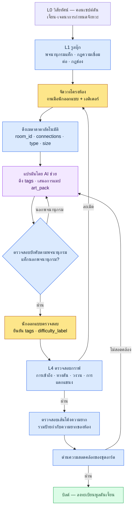

# 7.1 มาสเตอร์การออกแบบเลเวลแบบโพรซีเดอรัล

ทางออกของห้องหมายเลข 47 ในดันเจี้ยนถูกปิดตาย บิลด์ผ่าน QA ก็ผ่าน ภาพหน้าจอที่ผู้เล่นยืนหันหน้าเข้ากำแพงตรงหน้าห้องบอสพอดีถูกโพสต์ลงชุมชนในวันที่สามหลังเปิดให้บริการจริง ห้องนั้นเกิดจากการคัดลอกห้องที่ทำด้วยมือเมื่อสองอัปเดตก่อนมาวาง และในระหว่างการคัดลอกนั้น ทางเดินด้านตะวันออกทางหนึ่งเหลือไว้แต่ภาพ โดยไม่มีข้อมูลการเชื่อมต่อ ไม่มีใครตรวจสอบสิ่งนั้นเลย เพราะไม่มีเครื่องมือที่จะตรวจสอบ

บทนี้คือเรื่องราวของการสร้างโครงสร้างที่ทำให้อุบัติเหตุแบบนั้นถูกสกัดกั้นโดยอัตโนมัติตั้งแต่ขั้นบิลด์ หัวใจไม่ได้อยู่ที่ฝีมือในการวาดพื้นที่ แต่อยู่ที่วิธีบริหารข้อมูลที่ผูกอยู่กับพื้นที่นั้นด้วยกฎ

---

ที่ทำงานของการออกแบบเลเวลใกล้เคียงกับห้องเขียนแบบ แบบแปลนแต่ละแผ่นออกมาจากมือคน แต่ความสอดคล้อง การนำกลับมาใช้ และการตรวจสอบระหว่างแบบแปลนนั้น ถูกกำหนดด้วยกฎการบริหารตู้เก็บแบบแปลน ดันเจี้ยนหนึ่งห้องที่วาดด้วยมือนั้นใครก็ทำได้ แต่การบริหารดันเจี้ยน 100 อันให้มีเส้นโค้งความยากที่สอดคล้องกันและเป็นกราฟที่ไม่มีทางตันนั้น ไม่ใช่ปัญหาของฝีมือ แต่เป็นปัญหาของระบบ

ในโปรเจกต์ A ที่ผู้เขียนทำงานในตำแหน่ง Design Director (MMORPG ที่เจาะตลาดในประเทศ + เอเชียตะวันออกเฉียงใต้, ทีมขนาดกลาง (10\~50 คน), เน้นมือถือเป็นหลัก) ระบบนี้มีชื่อว่าเอกสารหนึ่งฉบับชื่อ `Procedural_Level_Design_Master` บทนี้พูดถึงว่าเอกสารฉบับนั้นรวมอะไรไว้ด้วยกัน AI เข้ามาแตะถึงไหน และหยุดตรงไหน ประสบการณ์การนำทีมออกแบบเกม RPG roguelite บนมือถือที่สร้างดันเจี้ยนขึ้นใหม่ทุกรอบการเล่น และการบริหารพื้นที่แบบโพรซีเดอรัลด้วยกฎ คือพื้นฐานที่รองรับบทนี้อยู่

## 7.1.1 สองทางแยก — จะสร้างพื้นที่ หรือจะบริหารเมตาดาตาของพื้นที่

การทำเลเวลให้เป็นอัตโนมัติแยกออกเป็นสองทิศทาง ทางหนึ่งคือการสร้างตัวพื้นที่เองแบบโพรซีเดอรัล PCG (Procedural Content Generation) แบบดั้งเดิม เช่น BSP partitioning (Binary Space Partitioning, เทคนิคคลาสสิกที่แบ่งพื้นที่ออกเป็นสองส่วนเท่า ๆ กันแบบเรียกซ้ำเพื่อจัดวางห้อง), wave function collapse, drunken walk grid อยู่ในกลุ่มนี้ อีกทางหนึ่งคือการบริหารเมตาดาตาของพื้นที่ — แท็กห้อง, ความเชื่อมต่อ, ป้ายกำกับความยาก, ช่องสำหรับเหตุการณ์

PCG แบบดั้งเดิมแข็งแกร่งในแบบแรก ในแนวเกมที่ "แผนที่ใหม่ทุกรอบ" คือหัวใจของความเป็นเกม อย่าง roguelike หรือ sandbox แบบแรกคือคำตอบที่ถูกต้อง แต่ MMORPG ต่างออกไป ผู้เล่นเดินดันเจี้ยนเดิมหลายสิบรอบ เดินจนเส้นทางขึ้นใจ ดันเจี้ยนจึงต้องเป็นพื้นที่ตายตัวที่ขัดเกลาด้วยมือ และที่ที่การทำให้เป็นอัตโนมัติจะเข้ามาได้นั้นไม่ใช่ตัวพื้นที่เอง แต่เป็น **เมตาดาตาที่ทำให้พื้นที่นั้นบริหารจัดการได้**

ทำไมเมตาดาตาจึงเป็นกระดูกสันหลังของการบริหาร เห็นชัดเมื่อมองทีละผลผลิต

| ผลผลิต | ถ้าไม่มีเมตาดาตา |
|---|---|
| พูลดันเจี้ยนหลายสิบอัน | ค้นไม่ได้ว่าห้องไหนอยู่ที่ใด, นำกลับมาใช้ไม่ได้ |
| การตรวจสอบเส้นโค้งความยาก | ไม่มีป้ายกำกับความยากรายห้องจึงวาดเส้นโค้งไม่ได้ |
| การจัดวางตำแหน่งเควสต์·บอสอัตโนมัติ | ไม่มีเมตาช่องเหตุการณ์จึงต้องป้อนพิกัดด้วยมือ |
| การซิงค์กับทีมอาร์ต | ไม่มีการแมป type ห้อง → ชุดอาร์ต จึงเกิดความไม่สอดคล้องทางภาพ |
| การวัดเส้นทางเดิน·เวลาที่ผู้เล่นอยู่ในห้อง | ทำ telemetry ที่อิงจากห้อง ID ไม่ได้ |

ดันเจี้ยนที่ไม่มีเมตาดาตานั้นบิลด์ได้ แต่บริหารไม่ได้ เหมือนห้องสมุดที่มีหนังสือเต็มแต่ไม่มีดัชนี นี่คือเหตุผลที่บทนี้มุ่งเน้นไปที่ "การบริหารเมตาดาตาของพื้นที่"

## 7.1.2 เอกสารมาสเตอร์รวมอะไรไว้ด้วยกัน

`Procedural_Level_Design_Master` มัดมาตรฐานสี่อย่างไว้ในเอกสารฉบับเดียว ได้แก่ แบบฟอร์มเมตาดาตาห้อง, พจนานุกรมแท็กห้อง, กฎความเชื่อมต่อ และเช็กลิสต์การตรวจสอบ ลองดูก่อนว่าเกิดอะไรขึ้นเมื่อทั้งสี่อย่างนี้กระจัดกระจาย ถ้านักออกแบบห้าคนต่างอ้างอิงแบบฟอร์มจากไฟล์คนละไฟล์ ฟิลด์ `type` คนหนึ่งจะเขียน `combat` คนหนึ่งเขียน `Combat` อีกคนเขียน `battle_room` การค้นหาพัง สถิติพัง และสุดท้ายการทำงานอัตโนมัติก็พัง

มาตรฐานสี่อย่างนี้เมื่อจัดเรียงตาม Layer แล้ว ตำแหน่งของแต่ละอย่างชัดเจน แบบฟอร์ม·พจนานุกรม·กฎอยู่ในรูลบุ๊ก (L1) ที่ควบคุมการสร้าง, เนื้อหาห้องที่สร้างขึ้นอยู่ในคอนเทนต์ (L2), ค่าในชีตอยู่ในข้อมูล (L3), และการตรวจสอบอยู่ในด่านบิลด์·QA (L4)

<svg viewBox="0 0 720 300" xmlns="http://www.w3.org/2000/svg" font-family="sans-serif" font-size="13">
  <rect x="20" y="20" width="680" height="44" rx="6" fill="#1e3a5f" stroke="#0f1f33"/>
  <text x="36" y="40" fill="#fff" font-weight="bold">L0 วิสัยทัศน์</text>
  <text x="120" y="40" fill="#cfe2ff">คอนเซปต์เลเวล·เจตนาการกำหนดจังหวะ (จุดยึดที่ไม่เปลี่ยน, ฉีดเข้าทุกครั้งที่สร้าง·ตรวจสอบ)</text>
  <text x="120" y="56" fill="#9fc0e8" font-size="11">— โทน art_pack, เจตนาความยาก</text>

  <rect x="20" y="76" width="680" height="44" rx="6" fill="#2a5d3a" stroke="#173a22"/>
  <text x="36" y="96" fill="#fff" font-weight="bold">L1 ระบบ</text>
  <text x="120" y="96" fill="#d6f5df">รูลบุ๊ก — แบบฟอร์มเมตาห้อง · พจนานุกรมแท็ก · กฎความเชื่อมต่อ</text>
  <text x="120" y="112" fill="#a8dcb8" font-size="11">— ที่ที่เอกสาร Master มัดรวมไว้</text>

  <rect x="20" y="132" width="680" height="44" rx="6" fill="#5d4a2a" stroke="#3a2e17"/>
  <text x="36" y="152" fill="#fff" font-weight="bold">L2 คอนเทนต์</text>
  <text x="120" y="152" fill="#f5e6cf">เนื้อหาห้องที่ติดเมตาดาตาแล้ว (พื้นที่ที่สร้าง·ขัดเกลาแล้ว)</text>

  <rect x="20" y="188" width="680" height="44" rx="6" fill="#4a2a5d" stroke="#2e173a"/>
  <text x="36" y="208" fill="#fff" font-weight="bold">L3 ข้อมูล</text>
  <text x="120" y="208" fill="#ead6f5">ขนาดห้อง·ชีตการเชื่อมต่อ·ช่องเหตุการณ์ ID·ข้อมูลศัตรู</text>

  <rect x="20" y="244" width="680" height="44" rx="6" fill="#5d2a2a" stroke="#3a1717"/>
  <text x="36" y="264" fill="#fff" font-weight="bold">L4 บิลด์·QA</text>
  <text x="120" y="264" fill="#f5d6d6">ตรวจสอบกราฟ · ตรวจสอบเส้นโค้งความยาก · ด่านความสอดคล้องของชุดอาร์ต</text>
</svg>

การที่เอกสารมาสเตอร์รวมมาตรฐานสี่อย่างไว้ด้วยกันนั้นไม่ได้หมายความว่า "ยัดเนื้อหาทั้งหมดไว้ในไฟล์เดียว" แต่หมายความว่า "รวมกฎไว้ในตำแหน่ง L1" ด้วยเหตุนี้ การทำงานอัตโนมัติที่จะกล่าวถึงข้างหน้าจึงสามารถวางทับอยู่บนขอบเขตของ Layer ได้ (จะเกิดอะไรขึ้นเมื่อการแบ่งแยกพังทลาย จะกล่าวถึงใน 7.1.11)

## 7.1.3 แบบฟอร์มเมตาดาตาห้อง — ตำแหน่งอินพุตที่การทำงานอัตโนมัติเข้ามาเกาะ

ห้องหนึ่งเป็นไปตามแบบฟอร์มต่อไปนี้ แบบฟอร์มนี้คืออินเทอร์เฟซอินพุตของการทำงานอัตโนมัติ

```yaml
room_id: dungeon_021_room_07
dungeon: dungeon_021_silvermark_library
type: combat_room          # combat / puzzle / lore / safe / boss
size: medium               # small / medium / large
difficulty_label: hard_for_level_28
tags: [scholar_theme, vertical_layout, water_hazard]
connections:
  - target_room: dungeon_021_room_06
    type: door
    direction: south
  - target_room: dungeon_021_room_08
    type: passage
    direction: east
event_slots:
  - slot: enemy_spawn_1
    constraints: [scholar_enemy, level_28]
  - slot: lore_object_1
    constraints: [scholar_lore]
movement_complexity: 4     # 1~5
estimated_clear_time_sec: 90
art_pack: scholar_library_v2
```

แต่ละฟิลด์มีปลายทางการบริโภคอัตโนมัติอย่างน้อยหนึ่งแห่ง `type` ใช้ในสถิติพูลดันเจี้ยนและการคำนวณความยาก, `tags` ใช้ในการค้นหา·การนำกลับมาใช้·การแมปชุดอาร์ต, `connections` ใช้ในการตรวจสอบกราฟ (การตรวจหาทางตัน), `event_slots` ใช้ในการจัดวางเควสต์·บอสอัตโนมัติ ฟิลด์ที่ไม่มีปลายทางการบริโภคจะไม่ใส่ไว้ในแบบฟอร์ม เพราะเพิ่มแต่ต้นทุนการป้อนข้อมูลโดยไม่มีคุณค่า

## 7.1.4 พจนานุกรมแท็กห้อง — เล็กและเป็นอิสระต่อกัน (orthogonal)

แท็กคือคีย์การค้นหาของเมตาดาตา ถ้าแพร่ขยายไม่จำกัด การค้นหาจะพัง ถ้าติดป้าย 200 อันในลิ้นชัก จะหาไม่เจอว่าอะไรอยู่ตรงไหน ด้วยเหตุนี้จึงบริหารด้วย 5 หมวด × ประมาณ 6 enum ต่อหมวด รวมแล้วประมาณ 30 อัน

| หมวด | จำนวน enum | ตัวอย่าง |
|---|---|---|
| theme | 8 | scholar_theme, ruins_theme, forest_theme … |
| layout | 5 | vertical_layout, horizontal_corridor, open_arena … |
| hazard | 6 | water_hazard, fire_hazard, falling_hazard … |
| interaction | 4 | puzzle_required, lever_activation … |
| narrative | 7 | flashback_trigger, dialogue_zone … |

ห้องหนึ่งไม่ใส่แท็กเกิน 5 อัน ปกติคือ 3\~4 อัน การจะเพิ่มแท็กใหม่ต้องผ่านด่านสี่ขั้น คือ ต้องเป็นตัวเลือกที่จะใช้ตั้งแต่ 5 ห้องขึ้นไปต่ออัปเดต, ต้องไม่สามารถแสดงได้ด้วยการรวมแท็กเดิม, การนำไปใช้ค้นหา·แมปชุดอาร์ตต้องชัดเจน, และต้องยังคงใช้อยู่ 5 ห้องแม้ผ่านการใช้งานไปแล้ว 1 เดือน เงื่อนไขข้อสุดท้ายคือหัวใจ ถ้าแท็กที่สร้างขึ้นชั่วคราวถูกใช้ครั้งเดียวแล้วทิ้ง พจนานุกรมก็จะปนเปื้อน

## 7.1.5 ไปป์ไลน์เลเวลแบบโพรซีเดอรัล — จากรูลบุ๊กถึงการตรวจสอบ

มาตรฐานทั้งหมดที่ผ่านมาเชื่อมต่อกันเป็นกระแสเดียวอย่างไร เส้นเชื่อมต่อนั้นคือโครงกระดูกที่บทนี้รองรับอยู่ เป็นไปป์ไลน์ที่เริ่มจากรูลบุ๊ก ผ่านการแปรผันโดย AI ช่วย แล้วจบที่การตรวจสอบของ guardrail



ขอชี้ลักษณะสามอย่างของไปป์ไลน์นี้ไว้ ประการแรก รูลบุ๊ก (L1) อยู่ต้นน้ำของการสร้างทั้งหมด ประการที่สอง AI แปรผันได้เฉพาะภายในพจนานุกรมที่รูลบุ๊กกำหนดไว้เท่านั้น — ด่าน F ส่งผลลัพธ์ที่อยู่นอกพจนานุกรมกลับคืน ประการที่สาม การตรวจสอบ (H·I·J) ถูกตรึงไว้เป็นด่านก่อนบิลด์ ดังนั้นการละเมิดจึงถูกสกัดด้วยโค้ด ไม่ขึ้นอยู่กับความใส่ใจของคน อุบัติเหตุห้องหมายเลข 47 เกิดขึ้นเพราะไม่มีด่าน H

## 7.1.6 กฎความเชื่อมต่อ — guardrail ที่ตรวจสอบด้วยกราฟ

ฟิลด์ `connections` ในเมตาห้องทำให้ทั้งดันเจี้ยนกลายเป็นกราฟแบบมีทิศทาง เมื่อกลายเป็นกราฟ การตรวจสอบก็เป็นอัตโนมัติ

| การตรวจสอบ | การจัดการเมื่อละเมิด |
|---|---|
| ห้องเริ่มต้น → ห้องบอส เข้าถึงได้ | สกัดด้วยการทำให้บิลด์ล้มเหลว |
| ทางตัน (ทางออก 1 ทาง + non-safe_room) | alert — ให้นักออกแบบตรวจสอบ |
| ความสอดคล้องของการเชื่อมต่อสองทิศทาง (มี A→B แต่ไม่มี B→A) | แก้ไขอัตโนมัติ |
| ความยาววงวน — ลูปสั้น 2\~3 ห้อง | alert |
| ความกว้างการแตกแขนง — แตกแขนงพร้อมกันตั้งแต่ 4 ทางขึ้นไป | ให้นักออกแบบตรวจสอบ |

สคริปต์การวัดมีรูปแบบดังต่อไปนี้ เป็น wrapper บาง ๆ ที่ห่อคำศัพท์ของดันเจี้ยนไว้บนอัลกอริทึมกราฟมาตรฐาน (เส้นทางยาวที่สุด·ดีกรีออกเฉลี่ย·การนับลูป·เส้นทางสั้นที่สุด)

```python
# level_graph_metrics.py
def measure(dungeon):
    graph = build_graph(dungeon.rooms)
    return {
        "depth":            longest_path_length(graph),
        "branching_factor": avg_out_degree(graph),
        "loop_count":       count_loops(graph),
        "dead_ends":        count_dead_ends(graph),
        "boss_reachability": shortest_path(graph.start, graph.boss),
    }
```

ตัวชี้วัดทั้งห้าถูกแสดงผลในรูปแบบที่เปรียบเทียบกับดันเจี้ยนอื่นได้ ใช้เป็นตัวชี้วัดความหลากหลายของพูลดันเจี้ยน แต่การที่ตัวชี้วัดหลากหลายก็ไม่ได้แปลว่าดันเจี้ยนสนุก ตัวชี้วัดมีไว้สกัดอุบัติเหตุ ไม่ได้มีไว้รับประกันความสนุก ทางตัน 0 รายการไม่ได้รับประกันความสนุก ความสนุกมาจากอินไซต์ของนักออกแบบ และการตรวจสอบกราฟเพียงรองพื้นไว้ไม่ให้อินไซต์นั้นถูกอุบัติเหตุกลบหายไปเท่านั้น

## 7.1.7 บันทึกเซสชันจริง — มอบการดึง tags ให้ AI, ปฏิเสธ, แล้วขอใหม่

ส่วนหนึ่งของการทำงานอัตโนมัติที่คนอยากปล่อยมือมากที่สุดคือการป้อน `tags` การติดแท็กห้อง 100 ห้องนั้นน่าเบื่อ และเมื่อดูแค่ภาพหน้าจอห้อง คนก็สับสนได้เหมือนกัน งานที่ทำซ้ำและมีเกณฑ์การตัดสินชัดเจนแบบนี้แหละคือตำแหน่งที่ดีที่ AI จะรองรับการร่างเบื้องต้น หัวข้อนี้จะกางเวิร์กโฟลว์ที่เคยรันงานนั้นจริง — ทั้งพรอมต์, ผลลัพธ์ของ AI ที่ถูกปฏิเสธ, ไปจนถึงการขอใหม่ของคน — ออกมาโดยไม่มีการตกแต่ง

**พรอมต์ครั้งที่ 1:**

```
[อินพุต]
- ภาพหน้าจอห้อง: (แนบมา)
- พื้นที่ห้อง: 18m × 12m, ความสูงเพดาน 9m (โครงสร้างแนวตั้ง 2 ชั้น)
- ศัตรูที่จัดวาง: scholar_phantom × 3, water_elemental × 1
- type ห้องที่อยู่ติดกัน: lore_room (ด้านตะวันตก), combat_room (ด้านตะวันออก)
- ในห้องมีแอ่งน้ำตื้น

เลือกแท็ก 3~5 อันที่เหมาะกับห้องนี้จากพจนานุกรมด้านล่างเท่านั้น อย่าสร้างแท็กนอกพจนานุกรม
ตอบเฉพาะ enum ของแท็กคั่นด้วยคอมมา

[พจนานุกรมแท็ก 30 อัน]
theme: scholar_theme, ruins_theme, forest_theme, cave_theme,
       crypt_theme, swamp_theme, mechanical_theme, celestial_theme
layout: vertical_layout, horizontal_corridor, open_arena,
        maze_layout, bridge_layout
hazard: water_hazard, fire_hazard, falling_hazard,
        poison_hazard, crush_hazard, dark_hazard
interaction: puzzle_required, lever_activation, key_gate, hidden_passage
narrative: flashback_trigger, dialogue_zone, lore_object_zone,
           ambush_setup, ritual_site, vista_point, rest_anchor
```

**ผลลัพธ์ครั้งที่ 1 ของ Claude (แบบดิบ):**

```
scholar_theme, vertical_layout, water_hazard, ambush_setup, two_story_layout
```

ตรงนี้มีปัญหาสองอย่างปรากฏออกมาตามจริง อย่างแรกคือ `two_story_layout` เป็นแท็กที่ไม่มีในพจนานุกรม โมเดลถูกอินพุต "โครงสร้างแนวตั้ง 2 ชั้น" ดึงไป จึงสร้างคำที่อยู่นอกพจนานุกรมขึ้นมา อีกอย่างหนึ่งคือแท็กแตะเพดาน 5 อันแล้ว แต่ `vertical_layout` กับ `two_story_layout` มีความหมายซ้อนทับกัน เท่ากับใช้สองช่องในหมวด layout

**การตัดสินปฏิเสธของคน** `two_story_layout` เป็นการละเมิดการบังคับตามพจนานุกรม จึงเป็นเป้าหมายของการปฏิเสธอัตโนมัติ (ด่าน F ของไปป์ไลน์) ส่วน `ambush_setup` นั้นการตัดสินแยกเป็นสองทาง — มีศัตรูจัดวางอยู่ 3 ตัวก็จริง แต่จากภาพหน้าจอนั้นคลุมเครือว่าเป็นองค์ประกอบของการซุ่มโจมตี หรือเป็นเพียงห้องต่อสู้ธรรมดา มีความเป็นไปได้ว่าโมเดลตีความเกินจริง ห้องที่อยู่ติดกันทั้งสองเป็น lore/combat จึงมีพื้นฐานของทริกเกอร์การซุ่มโจมตีเชิงเนื้อเรื่องที่อ่อน ปฏิเสธ

**ขอใหม่ครั้งที่ 2:**

```
two_story_layout ไม่มีในพจนานุกรมและซ้อนกับ vertical_layout เอาออก
ambush_setup ก็เอาออก — มีศัตรูไม่ได้แปลว่าซุ่มโจมตี
// (เจตนา: แท็ก narrative ใช้เฉพาะเมื่อมีการระบุเจตนาเชิงเนื้อเรื่อง การต่อสู้ธรรมดาแสดงด้วย type อยู่แล้ว)
ไม่ต้องฝืนเติมช่องว่างก็ได้ 3~4 อันคือปกติ ติดแท็กให้ใหม่
```

**ผลลัพธ์ครั้งที่ 2 ของ Claude:**

```
scholar_theme, vertical_layout, water_hazard
```

คราวนี้ลดเหลือ 3 อัน, ทั้งหมดอยู่ในพจนานุกรม, และไม่มีการซ้ำหมวด คนยอมรับผลลัพธ์นี้ `tags: [scholar_theme, vertical_layout, water_hazard]` ของแบบฟอร์มห้องจึงถูกยืนยันเช่นนี้

บทเรียนของบันทึกเซสชันจริงนี้มีสองบรรทัด ประการแรก AI overfit กับรายละเอียดหนึ่งของอินพุต ("2 ชั้น") แล้วออกไปนอกพจนานุกรม — ด่านบังคับตามพจนานุกรมต้องจับสิ่งนี้ที่ระดับโค้ด ประการที่สอง AI มีแนวโน้มจะพยายามเติมช่องว่าง — ถ้าไม่ระบุชัดว่า "ไม่ต้องฝืนเติม" มันจะพยายามถมทั้ง 5 ช่องให้เต็ม ความล้มเหลวทั้งสองนี้พบบ่อย และวิธีรักษาทั้งสองจะมีเสถียรภาพได้ต่อเมื่อถูกบังคับจากรูลบุ๊ก (พจนานุกรม + เพดาน) ไม่ใช่จากพรอมต์

## 7.1.8 การผลิตเมตาดาตาจำนวนมาก — ใครเติมและใครตรวจสอบ

ถ้านักออกแบบเติมเมตาห้อง 1 ห้องด้วยมือ จะใช้เวลา 5\~10 นาที ดันเจี้ยน 1 อัน (20\~30 ห้อง) ก็ 2\~5 ชั่วโมง ดันเจี้ยน 100 อันก็ 200\~500 ชั่วโมง (การประมาณของผู้เขียน ยังไม่ได้ตรวจสอบ — ค่าสูงสุดที่คำนวณจากเวลาป้อนข้อมูลเฉลี่ยต่อห้อง × จำนวนห้อง) ถ้าเติมด้วยมือทั้งหมด นักออกแบบก็จะกลายเป็นทาสการป้อนเมตาดาตา

ด้วยเหตุนี้จึงแบ่งผู้รับผิดชอบการเติมตามแต่ละพื้นที่

| พื้นที่ | ผู้รับผิดชอบการเติม |
|---|---|
| room_id · dungeon · connections | เอดิเตอร์ดึงอัตโนมัติ (L3) |
| type · size | จำแนกอัตโนมัติจากพื้นที่ห้อง·จำนวนการเชื่อมต่อ |
| tags | AI ช่วย + นักออกแบบตรวจสอบ (7.1.7) |
| event_slots | รูลบุ๊กตาม type ห้อง |
| difficulty_label | คำนวณอัตโนมัติจากการรวมข้อมูลศัตรูในห้อง |
| art_pack | แมปจาก type ห้อง · theme ดันเจี้ยน |

สิ่งที่นักออกแบบยืนยันด้วยมือมีเพียงการตรวจสอบ `tags` และการอนุมัติขั้นสุดท้ายของ `difficulty_label` เท่านั้น ที่เหลือเครื่องมือเติม คนตรวจสอบ จุดประสงค์ของการทำงานอัตโนมัติคือการดึงนักออกแบบออกจากการป้อนข้อมูล แล้วส่งกลับไปยังการตัดสินเรื่องการกำหนดจังหวะ·ห้องซิกเนเจอร์·นโยบายการนำกลับมาใช้

## 7.1.9 การนำห้องกลับมาใช้และกับดักของมัน

ผลที่ใหญ่ที่สุดของมาตรฐานมาสเตอร์คือการนำห้องกลับมาใช้ ถ้ามีห้องที่ค้นหาได้ด้วยแท็ก 30 ห้อง ก็สร้างดันเจี้ยน 5\~10 อันได้จากการผสมผสาน แต่เมื่ออัตราการนำกลับมาใช้สูงขึ้น ดันเจี้ยนจะน่าเบื่อ ด้วยเหตุนี้จึงวาง guardrail ไว้คู่กับการนำกลับมาใช้

| guardrail | คำนิยาม |
|---|---|
| ห้องหนึ่งปรากฏในดันเจี้ยนได้สูงสุด 5 อัน | ติดตามความถี่การปรากฏอัตโนมัติ |
| บังคับแปรผันทางภาพเมื่อปรากฏครั้งที่สอง | เปลี่ยนแสง·พร็อพ |
| ห้ามนำห้องบอส·ห้องซิกเนเจอร์กลับมาใช้ | บังคับด้วย flag |
| ติดตามฟีดแบ็กเชิงลบของห้องที่นำกลับมาใช้ | telemetry ผู้เล่น |

การนำกลับมาใช้เป็นวิธีลดต้นทุน ไม่ใช่จุดประสงค์ พอตั้งอัตราการนำกลับมาใช้เป็น KPI เมื่อใด ประสบการณ์ผู้เล่นก็จะจืดชืดลง ถ้า 0% (ทุกห้องใหม่หมด) ต้นทุนการผลิตจำนวนมากจะระเบิด และถ้าเกิน 70% ดันเจี้ยนจะแยกแยะจากกันไม่ออก จากประสบการณ์ ช่วง 30\~40% คือจุดสมดุลระหว่างต้นทุนกับความหลากหลาย (เป็นการสังเกตเชิงทิศทาง ค่าเกณฑ์ที่แม่นยำต่างกันไปตามแต่ละโปรเจกต์)

## 7.1.10 ความล้มเหลวที่พบบ่อยและวิธีรักษา

| รูปแบบ | วิธีรักษา |
|---|---|
| 5 คนตีความแบบฟอร์มเมตาเป็น 5 แบบ | รวม L1 ด้วยเอกสาร Master |
| แท็กเพิ่มเป็น 50\~100 อัน | พจนานุกรม 30 อัน + ด่าน 4 ขั้น |
| บิลด์โดยไม่ตรวจสอบทางตัน | ใช้การตรวจสอบกราฟเป็นด่านบิลด์ |
| นักออกแบบทำเมตาทั้งหมดด้วยมือ | เอดิเตอร์ดึง + AI ช่วย |
| AI สร้างแท็กนอกพจนานุกรม | ปฏิเสธอัตโนมัติด้วยด่านบังคับตามพจนานุกรม |
| การนำกลับมาใช้ 0% หรือ 70%+ | ช่วง 30\~40% + guardrail การแปรผัน |

## 7.1.11 การแยก Layer คือเงื่อนไขเบื้องต้นของการสร้างเลเวลแบบโพรซีเดอรัล

โครงสร้างของ 7.1.2\~7.1.6 ที่คลี่ออกด้วยรูลบุ๊ก·การสร้าง·การตรวจสอบที่ผ่านมาทั้งหมดนั้นเอง คือผลผลิตของการแยก Layer ข้อเสนอทั่วไปที่ว่าการแยก Layer คือเงื่อนไขเบื้องต้นของการสร้างแบบโพรซีเดอรัล·การทำงานอัตโนมัติ (L0 จุดยึด → L1 รูลบุ๊ก → L2 เนื้อหา → L3 ค่าตัวเลข → L4 ด่าน, ถ้าเป็นก้อนเดียวการสร้างจะพังทลาย) ได้กล่าวถึงใน §6.6 แล้ว ตรงนี้นำสิ่งนั้นมาประยุกต์ใช้กับการบริหารเมตาดาตาเลเวล

ถ้าไม่มีการแบ่งแยกนี้ การจัดวางห้อง·BSP·การกำหนดจังหวะ·ทริกเกอร์เชิงเนื้อเรื่องจะปนกันในไฟล์เดียว และทุกครั้งที่ขยับห้องหนึ่งช่อง เจตนาการกำหนดจังหวะ·ช่องเหตุการณ์·กราฟความเชื่อมต่อก็จะพังพร้อมกัน เป็นสถานการณ์ที่ห้องเขียนแบบ·โกดังวัสดุ·ห้องตรวจสอบกองรวมกันบนโต๊ะตัวเดียว พอดึงแบบแปลนออกหนึ่งแผ่น ใบส่งของวัสดุและตารางตรวจสอบก็หลุดออกมาด้วย ด้วยเหตุนี้ การที่ AI ช่วยใน 7.1.7 ทำงานได้ก็เป็นเพราะ Layer เช่นกัน ห้อง ID·ความเชื่อมต่อถูกเติมจากเอดิเตอร์ (ดึงอัตโนมัติ L3), แท็กจาก AI (บังคับตามพจนานุกรม L1), difficulty_label จากการรวม (L3→L4) การทำงานอัตโนมัติวางทับอยู่บนขอบเขตของ Layer ถ้าวางทับอยู่บนก้อนเดียว อุบัติเหตุจะระเบิดขึ้นภายในอัปเดตแรก และตัวเครื่องมือเองก็จะถูกทิ้ง

แต่นี่ไม่ได้หมายความว่าต้องมีลิ้นชักห้าช่องครบสมบูรณ์ตั้งแต่แรก หลักการคือ แบ่งแยกแบบค่อยเป็นค่อยไป อินเทอร์เฟซให้แคบ ในอัปเดตแรก แค่แยกรูลบุ๊ก L1 (พจนานุกรมแท็ก + กฎความเชื่อมต่อ) กับชีต L3 (ชีตเมตาห้อง) ก็เกิดที่ให้การทำงานอัตโนมัติเข้ามาได้แล้ว เจตนาการกำหนดจังหวะ L0 และด่านตรวจสอบ L4 ค่อยเติมขณะผ่านแต่ละอัปเดต เมื่อมาตรฐานเป็นหนึ่งเดียวจึงเกิดที่ให้การทำงานอัตโนมัติเข้ามา และยิ่งการทำงานอัตโนมัติเข้ามามากเท่าใด นักออกแบบก็ยิ่งมุ่งไปที่การตัดสินเรื่องการกำหนดจังหวะ·ซิกเนเจอร์·การนำกลับมาใช้ แทนที่จะทำงานมือทีละห้อง

---

### สรุปประเด็นสำคัญของบท

- ที่ใหม่ของการทำเลเวลให้เป็นอัตโนมัติไม่ได้อยู่ที่ตัวพื้นที่เอง แต่อยู่ที่การบริหารเมตาดาตาของพื้นที่
- การตรวจสอบต้องตรึงไว้ด้วยด่านบิลด์ ไม่ใช่ความใส่ใจของคน อุบัติเหตุจึงจะไม่รั่วไหลไปถึงไลฟ์
- อนุญาตให้ AI แปรผันได้เฉพาะภายในพจนานุกรมที่รูลบุ๊กกำหนด และปฏิเสธผลลัพธ์นอกพจนานุกรมด้วยโค้ด

---

## ลองทำดู

**setup.** เลือกดันเจี้ยนหนึ่งอัน แล้วสร้างชีต YAML ที่มีเพียงสี่ฟิลด์ `room_id · type · connections · tags` ต่อแต่ละห้อง ส่วนแท็ก ให้ตรึงพจนานุกรม 5 หมวดประมาณ 30 enum ลงบนกระดาษหนึ่งแผ่นก่อน

**prompt.** ใส่ภาพหน้าจอห้อง + พื้นที่ + ชนิดศัตรู + type ห้องที่อยู่ติดกัน แล้วขอด้วย "เลือกแท็ก 3\~5 อันจากพจนานุกรมนี้เท่านั้น ห้ามแท็กนอกพจนานุกรม ไม่ต้องเติมช่องว่าง" (พรอมต์ 7.1.7 ตามเดิม)

**verify.** (1) ถ้าผลลัพธ์ของ AI มีแท็กนอกพจนานุกรม ให้ปฏิเสธและขอใหม่ (2) สร้างกราฟจาก `connections` แล้วตรวจสอบการเข้าถึงจากเริ่มต้น→บอสและทางตัน — ถ้ามีการละเมิดแม้แต่อันเดียว ให้ทำเครื่องหมายว่าห้องนั้นบิลด์ไม่ได้

### ฉบับย่อสำหรับคนเดียว

ถ้าคุณเป็นนักพัฒนาคนเดียวที่ไม่มีโครงสร้างพื้นฐานของเครื่องมือ ให้เริ่มเอกสารมาสเตอร์ด้วยมาร์กดาวน์หนึ่งแผ่น พจนานุกรมแท็ก 30 บรรทัด, กฎความเชื่อมต่อ 5 บรรทัด, เช็กลิสต์การตรวจสอบ 5 บรรทัด ก็เพียงพอ สำหรับการตรวจสอบกราฟ ถ้ามีห้องไม่เกิน 10 ห้อง แค่วาดลูกศรลงบนกระดาษแล้วตรวจดูทางตันด้วยตาเปล่า ก็ได้ผล 80% ของประสิทธิภาพ หัวใจไม่ได้อยู่ที่เครื่องมือ แต่อยู่ที่นิสัยของการ "ติดข้อมูลให้กับห้อง แล้วตรวจสอบข้อมูลนั้นด้วยกฎ" เอง เครื่องมือค่อยเพิ่มเข้ามาเมื่อห้องเกิน 50 ห้องจนตรวจด้วยมือเริ่มหนักเกินไป

### ตัวอย่างบทถัดไป

- 7.2 เอดิเตอร์ BehaviorTree — บริหารทรีพฤติกรรม AI ซึ่งเป็นพื้นที่ข้างเคียงของเลเวล โดยอิงจากรูลบุ๊ก·เมตาดาตา
