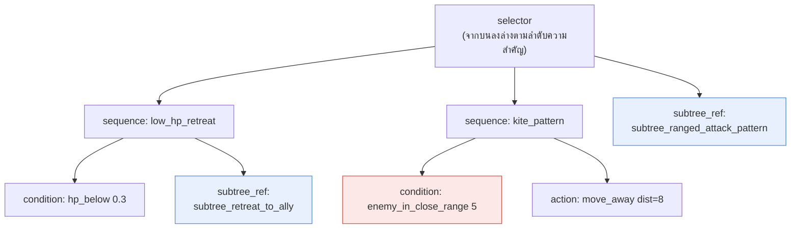
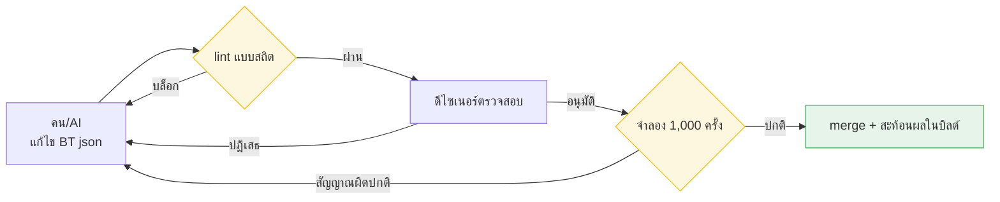

# 7.2 เอดิเตอร์ BehaviorTree — บันทึกเซสชันจริงที่คนกับ AI ร่วมกันแก้ไขและตรวจสอบ BT json

จอมเวทฝึกหัดตัวหนึ่งวิ่งเข้าประชิดผู้เล่นแล้วฟันดาบใส่ มันคือ NPC ที่ออกแบบให้เป็นผู้ร่ายเวทระยะไกล HP บางเหมือนกระดาษ ถ้าโดนระยะประชิดแค่ครั้งเดียวก็ตาย แต่มันกลับไม่คิดจะถอยห่าง บันทึกการบิลด์ไม่มีข้อผิดพลาดใด ๆ เปิด BehaviorTree ในเอดิเตอร์ขึ้นมาดูอีกครั้ง โหนดก็ยังเชื่อมต่อกันเรียบร้อยดี หลังจากเพ่งดูอยู่ชั่วโมงหนึ่งจึงพบสาเหตุ เงื่อนไขระยะของกิ่งถอยถูกใส่ค่าเป็น `0.5` ไม่ใช่ `5` ทั้งที่มันควรหนีเมื่อศัตรูเข้ามาในระยะ 5 เมตร แต่กลับเป็น 0.5 เมตร — นั่นคือกิ่งถอยจะไม่ทำงานเลยจนกว่าจะเกือบจ่อหน้ากัน

มันคือตัวเลขเพียงตัวเดียว ในเอดิเตอร์โหนดแบบกราฟิก ตัวเลขนั้นจะมองเห็นได้ก็ต่อเมื่อกางแผงด้านในของโหนดออกมาเท่านั้น และไม่ถูกบันทึกไว้ในประวัติการเปลี่ยนแปลง ไม่มีวิธีตามรอยว่าใครเปลี่ยนค่านั้นเมื่อไหร่ นับแต่วันนั้นเป็นต้นมา โปรเจกต์ A ของผู้เขียนเริ่มจัดการ BehaviorTree ด้วย json ไม่ใช่กราฟิก บทนี้คือบันทึกหนึ่งรอบของการที่คนกับ AI ร่วมกันแก้ไข json นั้น และให้เครื่องตรวจสอบโดยอัตโนมัติ

---

## 7.2.1 จุดที่ BT (BehaviorTree, ต้นไม้พฤติกรรม) หลุดมือไป

BehaviorTree คือโครงสร้างมาตรฐานโดยพฤตินัยที่ใช้นิยามการต่อสู้ การเคลื่อนที่ และการตอบสนองของ NPC ฝ่ายศัตรู ตัวเลือก (selector) จะลองกิ่งต่าง ๆ ตามลำดับความสำคัญ ส่วนลำดับ (sequence) จะร้อยเงื่อนไขกับแอ็กชันเข้าด้วยกันตามลำดับ ตัวโครงสร้างเองนั้นเรียบง่าย ปัญหาอยู่ที่ขนาด

ในโปรเจกต์ A ของผู้เขียน BT ของ NPC ศัตรูหนึ่งตัวประกอบด้วยโหนดราว 50\~200 โหนด และ NPC ที่เปิดให้บริการมีมากกว่า 100 ตัว เมื่อคูณกันแล้ว จำนวนโหนด BT ทั้งหมดจะอยู่ในหลักหมื่น ที่ขนาดเท่านี้ จะมาถึงจุดที่คนตอบคำถามอย่าง "ถ้าเปลี่ยนแพตเทิร์นถอยนี้ NPC ตัวไหนจะได้รับผลกระทบบ้าง" ไม่ได้อีกต่อไป มันก็เหมือนกับมีสมุดร้อยเล่มกางอยู่บนโต๊ะ พอแก้บรรทัดหนึ่งในเล่มแรก ก็ต้องคอยกวาดสายตาตามว่าผลจะลามไปที่ไหนในอีกเก้าสิบเก้าเล่มที่เหลือ

สิ่งที่ผู้เขียนเรียกร้องตอนย้ายจาก BT แบบกราฟิกมาเป็น json มีอยู่สี่อย่าง

<svg viewBox="0 0 720 250" xmlns="http://www.w3.org/2000/svg" font-family="sans-serif">
  <rect x="0" y="0" width="720" height="250" fill="#fafafa" stroke="#ddd"/>
  <rect x="30" y="30" width="300" height="80" rx="8" fill="#e8f0fe" stroke="#4285f4"/>
  <text x="180" y="58" text-anchor="middle" font-size="15" font-weight="bold" fill="#1a73e8">บันทึกเป็นข้อความ (json)</text>
  <text x="180" y="82" text-anchor="middle" font-size="12" fill="#444">ตามรอยการเปลี่ยนแปลงถึงระดับบรรทัดด้วย git diff</text>
  <text x="180" y="100" text-anchor="middle" font-size="12" fill="#444">เหตุ "ตัวเลขเพียงตัวเดียว" เหลือไว้ในประวัติ</text>

  <rect x="390" y="30" width="300" height="80" rx="8" fill="#e6f4ea" stroke="#34a853"/>
  <text x="540" y="58" text-anchor="middle" font-size="15" font-weight="bold" fill="#188038">ทำเมทาดาตาของโหนดให้เป็นมาตรฐาน</text>
  <text x="540" y="82" text-anchor="middle" font-size="12" fill="#444">ค้นหา·ใช้ซ้ำด้วย category·tags</text>
  <text x="540" y="100" text-anchor="middle" font-size="12" fill="#444">"หา BT ที่คล้ายกัน" เป็นการสืบค้นบรรทัดเดียว</text>

  <rect x="30" y="140" width="300" height="80" rx="8" fill="#fef7e0" stroke="#fbbc04"/>
  <text x="180" y="168" text-anchor="middle" font-size="15" font-weight="bold" fill="#b06000">อ้างอิง subtree (ใช้ซ้ำด้วยการอ้างอิง)</text>
  <text x="180" y="192" text-anchor="middle" font-size="12" fill="#444">แพตเทิร์นร่วม 1 ชุดที่ BT หลายตัวใช้ร่วมกัน</text>
  <text x="180" y="210" text-anchor="middle" font-size="12" fill="#444">แก้ที่เดียวแทนการก๊อบวาง → สะท้อนผลทั้งหมด</text>

  <rect x="390" y="140" width="300" height="80" rx="8" fill="#fce8e6" stroke="#ea4335"/>
  <text x="540" y="168" text-anchor="middle" font-size="15" font-weight="bold" fill="#c5221f">มองเห็นผลกระทบของการแก้ไขโดยอัตโนมัติ</text>
  <text x="540" y="192" text-anchor="middle" font-size="12" fill="#444">การแก้ subtree ไปกระทบ BT ตัวไหนบ้าง</text>
  <text x="540" y="210" text-anchor="middle" font-size="12" fill="#444">สคริปต์คำนวณให้แทนการคาดเดาของคน</text>
</svg>

เอดิเตอร์ BT ในตัวของเอนจินเกมเชิงพาณิชย์นั้นผสานรวมได้สะดวกและดีบักเชิงภาพได้แข็งแรง เพียงแต่มันมักถูกบันทึกเป็นแอสเซตแบบไบนารี (binary) จึงอ่อนเรื่อง diff ของข้อความและการตามรอยผลกระทบของการเปลี่ยนแปลง เนื่องจากโปรเจกต์ A ของผู้เขียนตั้งสมมติฐานว่าเป็นเกมไลฟ์ที่มี BT เปิดให้บริการเกิน 100 ตัว จึงเลือกทางพัฒนาฟอร์แมต BT แบบ json และเอดิเตอร์ขึ้นเองต่างหาก ขอชี้ให้ชัด นี่ไม่ใช่คำตอบที่ถูกของทุกทีม ถ้า BT ที่เปิดให้บริการมีไม่ถึง 50 ตัว การใช้เอดิเตอร์ในตัวของเอนจินไปเลยมักจะถูกกว่าเสมอ เหตุผลรองรับการพัฒนาเองจะกล่าวถึงอีกครั้งตอนท้ายบทนี้

---

## 7.2.2 BT json — แปลงพฤติกรรมของศัตรูหนึ่งตัวเป็นข้อความ

ก่อนอื่นมาดูหน้าตาของผลลัพธ์กัน ด้านล่างคือ BT บางส่วนของ NPC แบบสนับสนุนระยะไกลแห่งกิลด์นักปราชญ์ แก่นมีสองอย่าง คือทุกพฤติกรรมเป็นข้อความ git จึงตามรอยได้ทีละบรรทัด และแพตเทิร์นร่วมถูกอ้างอิงด้วย `subtree_ref`

```json
{
  "bt_id": "bt_scholar_archer_v3",
  "category": "ranged_combatant",
  "tags": ["scholar_faction", "ranged", "support"],
  "description": "แบบสนับสนุนระยะไกลแห่งกิลด์นักปราชญ์ รักษาระยะ + ถอยเป็นลำดับแรก",
  "root": {
    "type": "selector",
    "children": [
      {
        "type": "sequence",
        "name": "low_hp_retreat",
        "children": [
          {"type": "condition", "fn": "hp_below", "param": 0.3},
          {"type": "subtree_ref", "id": "subtree_retreat_to_ally"}
        ]
      },
      {
        "type": "sequence",
        "name": "kite_pattern",
        "children": [
          {"type": "condition", "fn": "enemy_in_close_range", "param": 5},
          {"type": "action", "fn": "move_away", "param": {"distance": 8}}
        ]
      },
      {"type": "subtree_ref", "id": "subtree_ranged_attack_pattern"}
    ]
  }
}
```

หากกางต้นไม้นี้ออกมาเป็นภาพ จะเป็นโครงสร้างที่ตัวเลือกลองกิ่งทั้งสามจากบนลงล่าง ขอให้สังเกตว่าบั๊กในตอนต้นบท — `param` ของ `enemy_in_close_range` เป็น `5` หรือ `0.5` — กลายเป็นบรรทัดเดียวที่มองเห็นได้ในพริบตาเมื่ออยู่ใน json



| องค์ประกอบ | บทบาท |
|---|---|
| `bt_id` | คีย์สำหรับ git diff·ตามรอยการเปลี่ยนแปลง |
| `category`·`tags` | หน่วยสำหรับค้นหา·ใช้ซ้ำ |
| `subtree_ref` | อ้างอิงแพตเทิร์นร่วม (แก้ที่เดียว → อัปเดต BT หลายตัว) |
| `description` | ใช้แชร์ให้ดีไซเนอร์·นักเขียนเนื้อเรื่อง |

`enemy_in_close_range 5` ที่ระบายสีแดงไว้คือโหนดที่กินเวลาคนไปหนึ่งชั่วโมงในตอนต้นบท เมื่ออยู่ใน json มันถูกจับได้ในการรีวิวโค้ดเพียงครั้งเดียว

---

## 7.2.3 ไลบรารี subtree — อ้างอิงแทนการก๊อบวาง

ในพฤติกรรมของศัตรูที่มีมากกว่า 100 ตัว มีก้อนที่เกิดซ้ำ ๆ อยู่ เช่น "ถอยไปหลังพันธมิตร" "ถอยไปหลังที่กำบัง" "แพตเทิร์นโจมตีระยะไกล" ถ้าก๊อบสิ่งเหล่านี้ใส่ลงในทุก BT พอจะแก้ลอจิกถอยเพียงตัวเดียว ก็ต้องไล่หาแก้ด้วยมือเป็นร้อยจุด ดังนั้นแพตเทิร์นร่วมจึงถูกแยกออกไปเป็นไฟล์ subtree ต่างหาก แล้วอ้างอิงด้วย `subtree_ref` เท่านั้น

```
subtree_library/
├── retreat_patterns/
│   ├── subtree_retreat_to_ally.json
│   ├── subtree_retreat_to_cover.json
│   └── subtree_retreat_random.json
├── attack_patterns/
│   ├── subtree_ranged_attack_pattern.json
│   ├── subtree_melee_combo.json
│   └── subtree_aoe_attack.json
└── reaction_patterns/
    ├── subtree_react_to_ally_death.json
    └── subtree_react_to_player_taunt.json
```

ทำเช่นนี้แล้ว คำถามอย่าง "ถ้าแก้ subtree นี้ ใครจะได้รับผลกระทบบ้าง" จะไม่ใช่การคาดเดาของคน แต่เป็นผลลัพธ์ของสคริปต์ ตัวตามรอยผลกระทบนั้นเรียบง่าย คือเปิด BT ทุกตัวขึ้นมาดู แล้วเก็บ `bt_id` ของ BT ที่อ้างอิง subtree นั้น

```python
# bt_impact_tracker.py
import json, glob

def has_subtree_ref(node, target_id):
    if isinstance(node, dict):
        if node.get("type") == "subtree_ref" and node.get("id") == target_id:
            return True
        for child in node.get("children", []):
            if has_subtree_ref(child, target_id):
                return True
    return False

def find_affected_bts(subtree_id):
    affected = []
    for bt_file in glob.glob("bts/*.json"):
        bt = json.load(open(bt_file, encoding="utf-8"))
        if has_subtree_ref(bt["root"], subtree_id):
            affected.append(bt["bt_id"])
    return affected

# วิธีใช้
affected = find_affected_bts("subtree_ranged_attack_pattern")
# → ["bt_scholar_archer_v3", "bt_ranger_v2", "bt_sniper_v1", ...]
```

ในโปรเจกต์ A ของผู้เขียน ฟังก์ชันนี้ถูกผูกไว้กับขั้นตอนคำขอเปลี่ยนแปลง (Pull Request) เมื่อมีใครไปแตะไฟล์ subtree รายการ BT ที่ได้รับผลกระทบจะถูกแปะเป็นคอมเมนต์ใน PR โดยอัตโนมัติ ผู้รีวิวจะได้เห็นข้อเท็จจริงที่ว่า "แก้แพตเทิร์นถอยไปบรรทัดเดียว แต่ศัตรูระยะไกล 12 ตัวเปลี่ยนหมด" ก่อนที่จะ merge

---

## 7.2.4 บันทึกเซสชันจริง — หนึ่งรอบที่ AI เขียนร่าง BT ใหม่

จากตรงนี้ไปคือช่วงที่มีน้ำหนักมากที่สุดของบทนี้ ผู้เขียนมอบหมายให้ AI ร่าง BT ของ NPC ศัตรูตัวใหม่ "จอมเวทฝึกหัด" แล้วนำหนึ่งรอบของการที่คนตรวจสอบ·ปฏิเสธ·ขอใหม่ต่อผลลัพธ์นั้น มาวางไว้ตามจริงโดยไม่ขัดเกลา การไม่ย่อให้ลื่นไหลมีเหตุผลของมัน เพราะว่า AI ทำอะไรผิดอย่างไรในผลลัพธ์ครั้งแรก ลายเส้นของความล้มเหลวนั้นแหละคือทั้งหมดที่บทนี้ต้องการสื่อ

### Step 1 — พรอมต์ที่คนโยนเข้าไป (ฉบับเต็ม)

```
[คอนเซปต์ NPC ศัตรู]
จอมเวทฝึกหัดแห่งกิลด์นักปราชญ์ HP ต่ำ ดาเมจเวทมนตร์สูง
หลบระยะประชิดเป็นลำดับแรก ถอยไปหลังพันธมิตรแล้วค่อยโจมตีด้วยเวทมนตร์

[category] ranged_combatant

[BT อ้างอิง] bt_scholar_archer_v3
(โครงสร้างคล้ายกัน เพียงแต่เปลี่ยนจากโจมตีด้วยธนูเป็นโจมตีด้วยเวทมนตร์)

[enum ฟังก์ชันที่นิยามไว้]
condition: hp_below, enemy_in_close_range, ally_nearby, mana_below
action: move_away, cast_spell, retreat, wait
subtree_ref id (รายการที่ใช้ได้):
- subtree_retreat_to_ally
- subtree_ranged_attack_pattern   # อิงธนู ไม่ใช่สำหรับเวทมนตร์
- subtree_magic_attack_pattern

ช่วยเขียนเฉพาะ json ของโหนด root ของ BT ตามคอนเซปต์นี้ ใช้ subtree_ref ให้มากที่สุดและโหนดตรง ๆ ให้น้อยที่สุด
ฟังก์ชันให้อยู่ภายใน enum ข้างบนเท่านั้น อย่าเพิ่มพฤติกรรมที่ไม่มีในคอนเซปต์ ไม่ต้องอธิบาย เอาแค่ json
```

### Step 2 — ผลลัพธ์ครั้งที่ 1 ของ Claude (วางตามจริงโดยไม่ปรุงแต่ง)

```json
{
  "bt_id": "bt_scholar_apprentice_v1",
  "category": "ranged_combatant",
  "tags": ["scholar_faction", "magic", "fragile"],
  "description": "จอมเวทฝึกหัดแห่งกิลด์นักปราชญ์ หลบระยะประชิด + ถอยไปหลังพันธมิตร + โจมตีด้วยเวทมนตร์",
  "root": {
    "type": "selector",
    "children": [
      {
        "type": "sequence",
        "name": "low_hp_retreat",
        "children": [
          {"type": "condition", "fn": "hp_below", "param": 0.4},
          {"type": "subtree_ref", "id": "subtree_retreat_to_ally"}
        ]
      },
      {
        "type": "sequence",
        "name": "avoid_melee",
        "children": [
          {"type": "condition", "fn": "enemy_in_close_range", "param": 6},
          {"type": "action", "fn": "move_away", "param": {"distance": 10}}
        ]
      },
      {
        "type": "sequence",
        "name": "mana_recover",
        "children": [
          {"type": "condition", "fn": "mana_below", "param": 0.2},
          {"type": "action", "fn": "wait", "param": {"frames": 120}}
        ]
      },
      {"type": "subtree_ref", "id": "subtree_ranged_attack_pattern"}
    ]
  }
}
```

### Step 3 — การตรวจสอบ·ปฏิเสธของคน

รับผลลัพธ์มาแล้วเอาเข้า lint (จะกล่าวถึงในหัวข้อถัดไป) และอ่านด้วยตา มีสามจุดที่ติด

1. **กิ่งสุดท้ายผิด** `subtree_ranged_attack_pattern` คือแพตเทิร์นโจมตีที่อิงธนู ทั้งที่เขียนหมายเหตุไว้ใน enum ว่า "ไม่ใช่สำหรับเวทมนตร์" แล้ว AI ก็ยังหยิบแพตเทิร์นธนูที่ชื่อคล้ายกันมา จอมเวทฝึกหัดต้องใช้ `subtree_magic_attack_pattern` — **ปฏิเสธ**

2. **เพิ่มพฤติกรรมที่ไม่มีในคอนเซปต์** กิ่ง `mana_recover` (`mana_below` → `wait 120frame`) เป็นพฤติกรรมที่ไม่มีในคอนเซปต์แม้แต่บรรทัดเดียว ทั้งที่ตอกย้ำไว้ในพรอมต์แล้วว่า "ห้ามเพิ่มพฤติกรรมที่ไม่ได้ระบุ" แต่ดูเหมือน AI จะตัดสินว่า "เป็นจอมเวทก็ต้องจัดการมานาเป็นเรื่องธรรมดา" แล้วยัดมันเข้าไป ดูสมเหตุสมผลก็จริงแต่เป็นการละเมิดสเปก — **ปฏิเสธ**

3. **ค่าเกณฑ์การถอยน่าสงสัย** `hp_below 0.4` เริ่มถอยเร็วกว่า BT อ้างอิง (`0.3`) จอมเวทฝึกหัดอ่อนแอกว่าก็จริง จึงอาจเป็นความตั้งใจ เพียงแต่ AI ไม่เคยให้เหตุผล จึงเป็นเรื่องที่ดีไซเนอร์ต้องตัดสิน — **พักไว้ ให้ดีไซเนอร์ยืนยัน**

### Step 4 — การขอใหม่ของคน

```
ช่วยแก้แค่สามจุด กิ่งสุดท้าย subtree_ranged_attack_pattern เป็นแพตเทิร์นธนู
ให้เปลี่ยนเป็น subtree_magic_attack_pattern และกิ่ง mana_recover ไม่มีในคอนเซปต์ ให้ลบทิ้งทั้งก้อน
hp_below 0.4 ให้ย้อนกลับไปเป็นค่าของ BT อ้างอิง (0.3) — ถ้ามีเหตุผลที่จะใช้ 0.4 ก็ใส่ไว้ใน description สักบรรทัด
ที่เหลือคงเดิม เอาแค่ json
```

### Step 5 — ผลลัพธ์ครั้งที่ 2 ของ Claude (ฉบับแก้ไข)

```json
{
  "bt_id": "bt_scholar_apprentice_v1",
  "category": "ranged_combatant",
  "tags": ["scholar_faction", "magic", "fragile"],
  "description": "จอมเวทฝึกหัดแห่งกิลด์นักปราชญ์ หลบระยะประชิด + ถอยไปหลังพันธมิตร + โจมตีด้วยเวทมนตร์ HP ต่ำจึงคงค่าเกณฑ์การถอย 0.3 ไว้ (เท่ากับ archer)",
  "root": {
    "type": "selector",
    "children": [
      {
        "type": "sequence",
        "name": "low_hp_retreat",
        "children": [
          {"type": "condition", "fn": "hp_below", "param": 0.3},
          {"type": "subtree_ref", "id": "subtree_retreat_to_ally"}
        ]
      },
      {
        "type": "sequence",
        "name": "avoid_melee",
        "children": [
          {"type": "condition", "fn": "enemy_in_close_range", "param": 6},
          {"type": "action", "fn": "move_away", "param": {"distance": 10}}
        ]
      },
      {"type": "subtree_ref", "id": "subtree_magic_attack_pattern"}
    ]
  }
}
```

ผลลัพธ์ครั้งที่ 2 ผ่าน lint และในการตรวจสอบของดีไซเนอร์ได้ปรับระยะ `6` ของ `avoid_melee` ให้ลงมาหนึ่งขั้นเป็น `5` ให้เท่ากับ archer ก่อนส่งต่อไปยังด่านจำลอง (simulation gate) สิ่งที่ได้เรียนรู้จากตรงนี้ชัดเจน AI เติมโครงร่างของ BT ได้เร็ว แต่เกือบทุกครั้งจะก่อสองความผิดพลาด คือ "ดึง subtree ที่ผิดซึ่งชื่อคล้ายกันเข้ามา" และ "ยัดพฤติกรรมเพิ่มที่ดูสมเหตุสมผลโดยไม่มีในสเปก" สองความผิดพลาดนี้จับได้ด้วยตาคนและด่าน lint เท่านั้น ฉะนั้นผลลัพธ์ของ AI จึงเป็นร่าง ไม่ใช่ฉบับสุดท้าย

---

## 7.2.5 lint อัตโนมัติ — เครื่องจับสิ่งที่คนมองข้ามได้ก่อน

BT เชื่อมโยงโดยตรงกับประสบการณ์ของผู้ใช้ ถ้าเหตุที่ศัตรูไม่ยอมหนีทั้งที่อยู่จ่อหน้าหลุดออกไปจนถึงตอนวางจำหน่าย มันจะย้อนกลับมาเป็นคะแนนรีวิว ดังนั้นก่อน merge เครื่องจะตรวจก่อน

| การตรวจ | เมื่อพบการละเมิด |
|---|---|
| โหนดที่เข้าไม่ถึง | alert (กิ่งที่ตัวเลือกไม่มีวันแตะถึงเลย) |
| ความเสี่ยงลูปไม่รู้จบ | บล็อก (sequence ที่วนซ้ำโดยไม่มีเงื่อนไขออก) |
| เป้าหมายของ `subtree_ref` ไม่มีอยู่จริง | บล็อก |
| ฟังก์ชันแอ็กชัน·เงื่อนไขอยู่นอก enum | บล็อก |
| จำนวนโหนดพุ่งสูง (>500) | alert (แนะนำให้แบ่ง BT) |
| ความแปรปรวนของเวลาตอบสนองของ BT ภายใน category เดียวกัน | alert (สงสัยว่าการปรับสมดุลถอยหลัง) |

ข้อสุดท้ายคือจุดพิเศษของ lint นี้ ถ้า BT ห้าตัวที่ถูกจัดเป็น `ranged_combatant` เดียวกัน มีเวลาตอบสนองเฉลี่ยในการจำลองห่างกันมาก นั่นคือสัญญาณว่ามีใครทำลายสมดุลของตัวหนึ่งโดยไม่รู้ตัว มันคือกลไกที่จับ "บรรยากาศ" ซึ่งการตรวจแบบสถิต (static) จับไม่ได้ ด้วยสถิติ

ถัดจาก lint แบบสถิตคือการตรวจสอบด้วยการจำลอง รัน BT ในตัวจำลอง 1,000 ครั้งโดยไม่ต้องบิลด์เกมจริงแล้วดึงสถิติออกมา

| การวัด | ช่วงปกติ |
|---|---|
| เวลารอดเฉลี่ย (เมื่อสู้กับผู้เล่นมาตรฐาน) | ค่าเกณฑ์ตาม category |
| ความหลากหลายของแพตเทิร์นโจมตี (เอนโทรปี) | 0.6 ขึ้นไป |
| สัดส่วนพฤติกรรมถอย·เข้าหา | ค่าเกณฑ์ตาม category |
| frame เฉลี่ยที่ใช้ต่อพฤติกรรมหนึ่งครั้ง | ไม่เกิน 60 frame |

โดยไม่ต้องบิลด์ก็ดู "ว่า BT นี้ตายเร็วเกินไปหรือไม่" "วนทำพฤติกรรมเดียวซ้ำ ๆ หรือไม่" ได้ภายใน 5\~10 นาที ถ้ามีสัญญาณผิดปกติขึ้นมา ก็แก้ json แล้วรันจำลองอีกครั้ง การที่รอบนี้หดจากหน่วยวันลงมาเหลือหน่วยนาที คือกำไรที่แท้จริงของการทำให้เป็น json



---

## 7.2.6 การวัดผล — อะไรลดลงบ้าง

วางสภาพก่อน·หลังการนำมาใช้ในโปรเจกต์ A ของผู้เขียนเป็นตาราง ตัวเลขสัมบูรณ์จะต่างกันไปตามขนาดทีม·แนวเกม จึงเป็นการประมาณของผู้เขียน (ยังไม่ได้ตรวจสอบ) เพียงแต่ทิศทางและสัดส่วนเป็นไปตามที่สังเกตได้จริงจากการให้บริการ

| รายการ | ก่อนนำมาใช้ (BT ในตัวเอนจินโดยตรง) | หลังนำมาใช้ (json + เอดิเตอร์) |
|---|---|---|
| เขียน BT ของศัตรูใหม่ 1 ตัว | 1\~2 วัน | 2\~4 ชั่วโมง |
| ทำความเข้าใจผลกระทบของการแก้ BT | พึ่งการประมาณ·ประสบการณ์ | อัตโนมัติ (รายการผลกระทบของ subtree) |
| ตรวจสอบหลังการแก้ | ต้องบิลด์จริง | จำลอง 5\~10 นาที |
| ให้บริการ NPC ศัตรู 100 ตัว | ดีไซเนอร์ 3 คนเต็มเวลา | ดีไซเนอร์ 1\~2 คน |
| เหตุ BT หลังวางจำหน่าย (พฤติกรรมผิดปกติ) | 10\~15 ครั้งต่อกิ่ง (ประมาณโดยผู้เขียน) | 2\~4 ครั้งต่อกิ่ง (ประมาณโดยผู้เขียน) |

สิ่งที่มีความหมายที่สุดคือสองบรรทัดสุดท้ายขยับไปพร้อมกัน โดยปกติถ้าลดคน คุณภาพจะตก แต่ที่นี่จำนวนดีไซเนอร์ลดลงพร้อมกับเหตุก็ลดลงด้วย เพราะเครื่องเข้ามาแบกผลกระทบของการเปลี่ยนแปลงและการตรวจสอบที่คนเคยตามรอยด้วยมือเอาไว้ คุณค่าของการทำให้อัตโนมัติอยู่ที่ "ลดลงพร้อมกับดีขึ้นไปด้วย" นี้ มากกว่าความ "เร็วขึ้น"

---

## 7.2.7 พัฒนาเอง หรือหยิบยืมมาใช้

ถ้าอ่านบทนี้แล้วสรุปว่า "เราก็มาทำเอดิเตอร์ json BT กันเถอะ" จะเป็นเรื่องลำบาก ที่โปรเจกต์ A ของผู้เขียนเลือกพัฒนาเองเป็นเพราะเงื่อนไขเฉพาะหลายอย่างลงตัวพอดี

| ตัวเลือก | ข้อดี / ข้อเสีย |
|---|---|
| ใช้ BT ในตัวของเอนจินไปเลย | ผสานรวมง่าย / อ่อนเรื่องการแปลง json·diff |
| หยิบยืมไลบรารี BT ภายนอกมาใช้ | ได้เปรียบเรื่องมาตรฐาน / เส้นโค้งการเรียนรู้·ปรับแต่งมีขีดจำกัด |
| เอดิเตอร์ json BT + รันไทม์ที่พัฒนาเอง | อิสระ·ตามรอยได้สูงสุด / ต้นทุนพัฒนาสูง |

เหตุผลที่โปรเจกต์ A เลือกข้อ 3 มีสี่อย่าง

- การตามรอยด้วย diff·git เป็นสิ่งจำเป็น — BT ในตัวเป็นแอสเซตแบบไบนารี จึงตามรอยเหตุ "ตัวเลขเพียงตัวเดียว" ในตอนต้นบทไม่ได้
- การอ้างอิง subtree และการตามรอยผลกระทบอัตโนมัติเป็นแกนหลักของการให้บริการ — เป็นฟังก์ชันที่เครื่องมือ BT มาตรฐานอ่อนแอ
- ต้องรันการตรวจสอบด้วยการจำลองในรันไทม์ที่แยกออกจากบิลด์
- ตั้งสมมติฐานให้ AI ช่วยเขียน — ฐานข้อความ (json) เป็นมิตรกับโมเดลภาษาขนาดใหญ่ (LLM, Large Language Model) อย่างท่วมท้น

ต้นทุนพัฒนาคือ 1\~2 เดือน จะคุ้มทุนก็ต่อเมื่อ BT ที่เปิดให้บริการแตะ 100\~300 ตัว และมีระยะการให้บริการแบบไลฟ์ที่ยาวนาน ที่ขนาด 30\~50 ตัว คืนทุนไม่ได้ หมายความว่าผลตอบแทนการลงทุน (ROI, Return On Investment) ของการพัฒนาเอง จะออกมาก็ต่อเมื่อทั้งขนาดและระยะการให้บริการได้รับการรับประกันทั้งสองอย่างเท่านั้น ถ้าเป็นทีมเล็ก ควรหยิบเอาแค่หลักการจากบทนี้ไป คือ "บันทึกเป็น json" "อ้างอิงด้วย subtree" "ผลลัพธ์ AI ต้องผ่านด่าน lint + ตรวจสอบ" แล้วใช้เครื่องมือโดยวางทับบนเอดิเตอร์ในตัวหรือไลบรารีภายนอกจะถูกต้องกว่า

---

## 7.2.8 ความล้มเหลวที่พบบ่อย

| แพตเทิร์น | ทางแก้ |
|---|---|
| จัดการ BT เป็นแอสเซตแบบไบนารีอย่างเดียว | บันทึกเป็น json เพื่อให้ตามรอยด้วย git ได้ |
| ก๊อบวางแพตเทิร์นเดียวกันในทุก BT โดยไม่มี subtree | แยกออกเป็นไลบรารี subtree แล้วอ้างอิง |
| ตามรอยผลกระทบของ BT ด้วยมือ | ผูกสคริปต์วิเคราะห์ผลกระทบเข้ากับ PR |
| ตรวจสอบเฉพาะในบิลด์จริงโดยไม่มีการจำลอง | ใช้งานตัวจำลองที่แยกออกจากบิลด์ |
| ใช้ BT ที่ AI ออกมาโดยไม่ตรวจสอบ | ให้ผ่านด่านสามชั้น lint + ดีไซเนอร์ + จำลอง |
| ไม่วัด ROI ของการพัฒนาเอง | พัฒนาเองเฉพาะเมื่อมีมากกว่า 100 ตัว·ให้บริการแบบไลฟ์ |

---

### สรุปประเด็นสำคัญของบท

- ต้องบันทึก BT เป็น json เหตุ "ตัวเลขเพียงตัวเดียว" จึงจะเหลืออยู่ใน git diff และถูกตามรอยได้
- การอ้างอิง subtree และการตามรอยผลกระทบอัตโนมัติช่วยกันนรกของการก๊อบวางในการให้บริการ 100 ตัว
- AI เติมโครงร่าง BT ได้เร็ว แต่การอ้างอิงที่ผิดและพฤติกรรมนอกสเปกนั้นคนเป็นผู้จับ

---

## ลองทำดู

นี่คือรอบขั้นต่ำที่ทีมเล็กลองทำได้วันนี้

**setup** — ลองเขียน BT ของ NPC ศัตรูที่กำลังเปิดให้บริการอยู่หนึ่งตัวเป็น json ด้วยมือ (`bt_id`, `category`, `tags`, `root`) แยกก้อนแพตเทิร์นถอย·โจมตีร่วมหนึ่งก้อนออกมาเป็น `subtree_library/` แล้วอ้างอิงด้วย `subtree_ref`

**prompt** — มอบหมายศัตรูตัวใหม่ที่คล้ายกันให้ AI ใช้โครงร่างพรอมต์ของบันทึกเซสชันจริงข้างต้น (คอนเซปต์ + category + BT อ้างอิง + enum ฟังก์ชันที่ใช้ได้ + "ห้ามเพิ่มพฤติกรรมที่ไม่ได้ระบุ" + "เอาแค่ json") ตามนั้นได้เลย

**verify** — ให้นำผลลัพธ์ของ AI ผ่านสามด่านนี้ก่อนเท่านั้นจึงค่อย merge คือ (1) lint ที่กรองฟังก์ชันนอก enum·subtree ที่ไม่มีอยู่จริง (2) ตาคน (3) การจำลองหรือการตรวจสอบสั้น ๆ ในเกม ต้องตรวจให้แน่ใจว่า AI ยัด "subtree ที่ผิดซึ่งชื่อคล้ายกัน" และ "พฤติกรรมนอกสเปกที่ดูสมเหตุสมผล" เข้ามาหรือไม่

### ฉบับย่อสำหรับคนเดียว

ถ้าไม่มีกำลังจะสร้างเอดิเตอร์ เครื่องมือก็แค่โปรแกรมแก้ไขข้อความกับ git และ `bt_impact_tracker.py` ความยาว 30 บรรทัดหนึ่งไฟล์ก็เพียงพอ ส่งออก BT ที่เขียนด้วยเอดิเตอร์ในตัวเป็น json สักครั้งแล้วเอาขึ้น git แยกเฉพาะ subtree ออกเป็นไฟล์ต่างหากแล้วอ้างอิง ถ้าผูกสคริปต์ตามรอยผลกระทบไว้กับ commit hook แม้อยู่คนเดียวก็เห็น "ว่าถ้าแก้แพตเทิร์นถอยนี้แล้วศัตรูตัวไหนจะเปลี่ยน" เป็นผลลัพธ์ ไม่ใช่การประมาณ ลำพังนิสัยเพียงข้อเดียวนี้ ก็ทำให้ "ตัวเลขเพียงตัวเดียวกินเวลาหนึ่งชั่วโมง" ในตอนต้นบท ลดลงเหลือการรีวิวโค้ดเพียงบรรทัดเดียว

---

### ตัวอย่างบทถัดไป

- 7.3 ไลบรารีแพตเทิร์นดันเจี้ยน·สนาม — ผสานเมทาดาตาของห้องกับแพตเทิร์น subtree เพื่อมัดรวมเลเวลเป็นหน่วยของการให้บริการ
