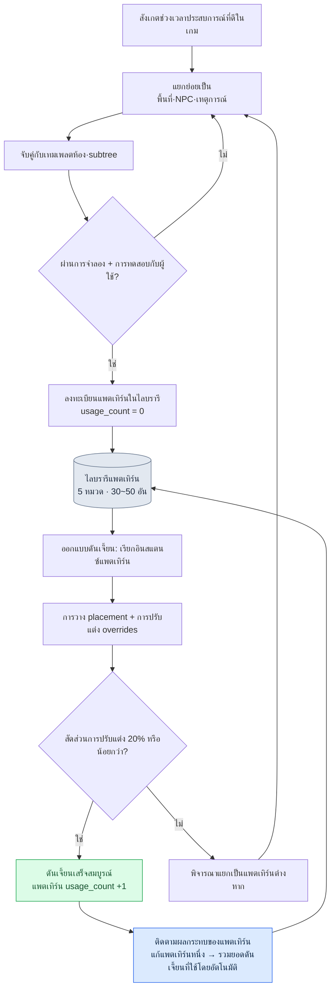

# 7.3 ไลบรารีแพตเทิร์นของดันเจี้ยนและสนาม

ในที่ประชุมรีวิวดันเจี้ยน นักออกแบบเลเวล (Level Design) คนใหม่ได้นำดันเจี้ยนของตนเองหนึ่งห้องขึ้นจอ ทางเดินแคบ ศัตรูที่เคลื่อนเร็วไล่ตามมาจากด้านหลัง การตัดสินใจหลบหลีกที่จุดแยกทาง มันเป็นดันเจี้ยนที่ทำมาดี ปัญหาคือมันแตกต่างเพียงเล็กน้อยจากที่เราเคยทำมาแล้วในดันเจี้ยนอีกสิบเอ็ดห้อง ความเร็วในการไล่ตามของศัตรู จังหวะที่กับดักทำงาน ช่วงเวลาที่จุดแยกทางปรากฏ ไม่มีสิ่งใดเหมือนกันเลย คนใหม่เชื่อว่าตนได้สร้างประสบการณ์ที่ใช้ชื่อเดียวกันคือ "ดันเจี้ยนไล่ล่า" แต่ความรู้สึกที่ผู้ใช้ได้รับนั้นต่างกันไปในแต่ละดันเจี้ยน

สิ่งที่เราตัดสินใจในวันนั้นเรียบง่าย เราจะนิยามประสบการณ์ที่เรียกว่า "การไล่ล่าในทางเดิน" ให้แม่นยำสักครั้งหนึ่ง แล้วตรึงนิยามนั้นเป็นกฎไว้ คราวหน้าเมื่อมีใครจะสร้างดันเจี้ยนไล่ล่า เขาจะไม่เริ่มร่างจากศูนย์ แต่จะดึงนิยามที่ถูกตรึงไว้นั้นออกมาใช้ นี่คือจุดเริ่มต้นของไลบรารีแพตเทิร์น

หากห้อง (room) เป็นหน่วยของพื้นที่ และ BehaviorTree เป็นหน่วยของพฤติกรรม แพตเทิร์นก็คือหน่วยปฏิบัติการที่มัดพื้นที่ พฤติกรรม และเหตุการณ์เข้าด้วยกันเป็นหนึ่งเดียว เมื่อแพตเทิร์นหนึ่งถูกนำกลับมาใช้ซ้ำในดันเจี้ยนหลายห้อง ภาระในการผลิตจำนวนมากก็ลดลง และที่สำคัญกว่านั้นคือ ประสบการณ์ที่ผู้ใช้ได้รับจะมีความสอดคล้องกันระหว่างดันเจี้ยนต่าง ๆ

---

## 7.3.1 แพตเทิร์นในฐานะหน่วยปฏิบัติการ

ลองนึกถึงสูตรอาหารในตำราทำอาหารก็จะเข้าใจได้แม่นยำ สูตรหนึ่งหน้าจะมีวัตถุดิบ ลำดับการปรุง ความแรงของไฟ และภาพอาหารที่ทำเสร็จอยู่ด้วยกัน แม้ร้านอาหารจะเปลี่ยนไป หากทำตามสูตรเดียวกันก็จะได้รสชาติเดียวกัน เพียงแต่อนุญาตให้มีการปรับแต่งเล็กน้อยในแต่ละร้านได้ แพตเทิร์นก็เช่นกัน พื้นที่ (ห้อง) พฤติกรรม (BT subtree) เหตุการณ์ (event) ผลลัพธ์ (รางวัล/ระดับความยาก) และคำอธิบายเจตนาของนักออกแบบ ทั้งหมดนี้รวมอยู่เป็นชุดเดียวกัน

<svg viewBox="0 0 720 250" xmlns="http://www.w3.org/2000/svg" font-family="sans-serif" font-size="13">
  <rect x="10" y="10" width="700" height="230" fill="#fafafa" stroke="#ccc"/>
  <text x="360" y="35" text-anchor="middle" font-size="15" font-weight="bold">แพตเทิร์น = ชุดขององค์ประกอบห้าอย่าง</text>
  <rect x="40" y="60" width="120" height="60" rx="6" fill="#e3f0ff" stroke="#5a8fd0"/>
  <text x="100" y="85" text-anchor="middle" font-weight="bold">พื้นที่</text>
  <text x="100" y="105" text-anchor="middle" font-size="11">เมตาห้อง 1~3 อัน</text>
  <rect x="180" y="60" width="120" height="60" rx="6" fill="#e9f7e9" stroke="#6aa86a"/>
  <text x="240" y="85" text-anchor="middle" font-weight="bold">พฤติกรรม</text>
  <text x="240" y="105" text-anchor="middle" font-size="11">BT subtree 1~2 อัน</text>
  <rect x="320" y="60" width="120" height="60" rx="6" fill="#fdf3e0" stroke="#d0a05a"/>
  <text x="380" y="85" text-anchor="middle" font-weight="bold">เหตุการณ์</text>
  <text x="380" y="105" text-anchor="middle" font-size="11">ช่อง event</text>
  <rect x="460" y="60" width="120" height="60" rx="6" fill="#fde9ec" stroke="#d05a6e"/>
  <text x="520" y="85" text-anchor="middle" font-weight="bold">ผลลัพธ์</text>
  <text x="520" y="105" text-anchor="middle" font-size="11">กฎรางวัล/ความยาก</text>
  <rect x="600" y="60" width="90" height="60" rx="6" fill="#f0e9fd" stroke="#8a5ad0"/>
  <text x="645" y="85" text-anchor="middle" font-weight="bold">เจตนา</text>
  <text x="645" y="105" text-anchor="middle" font-size="11">คำอธิบาย</text>
  <text x="360" y="160" text-anchor="middle" font-size="13" font-style="italic">"แพตเทิร์นไล่ล่าในทางเดิน" = ทางเดินแคบ + BT ศัตรูเร็ว + event กับดัก + รางวัลการหลบหลีก</text>
  <line x1="100" y1="180" x2="620" y2="180" stroke="#999" stroke-width="1"/>
  <text x="360" y="210" text-anchor="middle" font-size="12">→ เมื่อตรวจสอบครั้งเดียว ก็สร้างประสบการณ์เดียวกันซ้ำในดันเจี้ยน 5~10 แห่ง</text>
</svg>

เมื่อแพตเทิร์นหนึ่งถูกนิยามแล้ว ก็สามารถสร้างประสบการณ์เดียวกันได้อย่างสอดคล้องในทุกดันเจี้ยน เหมือนสูตรที่ตรวจสอบครั้งเดียวแล้วให้รสชาติเดียวกันในหลายร้าน เพียงแต่สูตรเดียวกันนั้นก็ยังให้มีการปรับแต่งเล็กน้อยในแต่ละร้านได้ การจัดการการปรับแต่งนี้อย่างไรคือครึ่งหนึ่งของการบริหารแพตเทิร์น overrides ที่จะกล่าวถึงต่อไปคือตำแหน่งของเรื่องนี้

---

## 7.3.2 กระแสการประกอบแพตเทิร์น

หัวใจของไลบรารีแพตเทิร์นคือการตรึงแพตเทิร์นเป็น rulebook (กฎ/คู่มือกฎ) ไว้ แล้วนำมาประกอบกันเพื่อสร้างดันเจี้ยน นักออกแบบไม่ได้ร่างดันเจี้ยนจากจอเปล่า แต่เลือกแพตเทิร์นที่ตรวจสอบแล้วมาวางและปรับแต่งเพียงบางส่วน



ครึ่งซ้ายของกระแสนี้ (สังเกต→แยกย่อย→จับคู่→ตรวจสอบ→ลงทะเบียน) คือกระบวนการสร้างแพตเทิร์น ส่วนครึ่งขวา (เรียกใช้→วาง/ปรับแต่ง→ทำให้เสร็จ→ติดตาม) คือกระบวนการบริโภคแพตเทิร์น งานสร้างเกิดขึ้นไม่บ่อย ส่วนงานบริโภคเกิดขึ้นบ่อยครั้ง เมื่อไลบรารีถูกบริหารดี ความไม่สมมาตรนี้จะนำไปสู่ประสิทธิภาพในการผลิตจำนวนมาก

---

## 7.3.3 ห้าหมวดพื้นฐาน

โปรเจกต์ A ของผู้เขียนเป็นเกมแนวแอ็กชัน RPG จึงจัดหมวดแพตเทิร์นไว้ห้าหมวด การจัดหมวดนี้ขึ้นอยู่กับแนวเกม หากเป็นเกมสยองขวัญ สัดส่วนของการซุ่มโจมตีและจังหวะของเนื้อเรื่องก็จะต่างไป และหากเป็นเกมปริศนา การต่อสู้ที่ใช้สภาพแวดล้อมก็จะมาเป็นศูนย์กลาง อย่ายึดติดกับการจัดหมวดเองเป็นสรณะ ควรกำหนดก่อนว่าประสบการณ์หลักของเกมตนเองคืออะไร แล้วจึงจับหมวดหมู่

| หมวด | ประสบการณ์หลัก | ตัวอย่าง |
|---|---|---|
| pursuit | ไล่ล่า·หลบหนี | ไล่ล่าในทางเดิน, หลบหนีในหุบเขา |
| ambush | ซุ่มโจมตี·จู่โจม | ซุ่มโจมตีเมื่อเข้าห้อง, ซุ่มโจมตีในมุมอับสายตา |
| puzzle_combat | การต่อสู้ที่ใช้สภาพแวดล้อม | คันโยก·กับดัก + การต่อสู้ |
| boss_phase | เฟสบอส | แพตเทิร์นเฟสบอส 1\~3 |
| narrative_beat | จังหวะเนื้อเรื่อง | ทริกเกอร์ภาพย้อนอดีต, การปรากฏตัวของเพื่อนร่วมทาง |

ภายในห้าหมวด แพตเทิร์นจะคงไว้ราว ๆ สามสิบถึงห้าสิบอัน ตัวเลขนี้มีเหตุผล หากแพตเทิร์นเกินร้อยอัน นักออกแบบจะไม่สามารถจดจำไลบรารีทั้งหมดไว้ในหัวได้ ในวินาทีนั้นไลบรารีก็จะกลายเป็นคลังที่ใช้เวลาในการค้นหา และนักออกแบบก็จะเลือกที่จะร่างใหม่เสียมากกว่า เมื่อไลบรารีเริ่มถูกเมิน เป้าหมายเดิมคือความสอดคล้องก็พังทลาย ดังนั้นการบริหารเพดานจำนวนแพตเทิร์นอย่างมีสติจึงสำคัญพอ ๆ กับการออกแบบหมวดหมู่

---

## 7.3.4 รูปแบบที่ใช้ตรึงแพตเทิร์น

แพตเทิร์นหนึ่งถูกตรึงไว้ด้วยไฟล์ YAML หนึ่งหน้า ด้านล่างนี้คือรูปแบบที่ใช้จริงในโปรเจกต์ A ที่นำมาทำให้ไม่ระบุตัวตน (anonymize) แม้จะปิดบังชื่อทรัพย์สินเฉพาะของบริษัทและหมายเลขดันเจี้ยนไว้ แต่โครงสร้างฟิลด์และวิธีบริหารยังคงเดิม

```yaml
---
pattern_id: pattern_corridor_pursuit_v2
category: pursuit
description: ศัตรูเร็วไล่ตามจากด้านหลังในทางเดินแคบ ผู้เล่นตัดสินใจหลบหลีกที่จุดแยกทาง
tags: [horizontal_corridor, scholar_theme_compatible]
rooms:
  - room_template: corridor_long
    size: medium
    connections_required: 2
  - room_template: junction_3way
    size: small
    connections_required: 3
npc_behaviors:
  - subtree_ref: subtree_aggressive_chase
    count: 2
  - subtree_ref: subtree_ranged_support
    count: 1
events:
  - type: trap_activation
    trigger: room_1_midpoint
  - type: enemy_spawn
    trigger: room_1_entry
difficulty_modifier: 1.2   # ภาระ 1.2 เท่าเมื่อเทียบกับห้องทั่วไป
reward_modifier: 1.3
clear_time_estimate_sec: 60
art_pack_compatible: [scholar_library, generic_dungeon]
narrative_slots:
  - slot: dialogue_during_chase
    constraints: [short_dialogue, fear_emotion]
usage_count: 12            # ใช้ในดันเจี้ยน 12 แห่ง
last_modified: 2026-05-18
deprecated: false
---
```

ไฟล์นี้นิยามส่วนหนึ่งของดันเจี้ยนสิบสองห้องพร้อมกัน น้ำหนักของบรรทัดเดียวที่ว่า `usage_count: 12` มาจากตรงนั้น หมายความว่าหากแก้แพตเทิร์นนี้ ดันเจี้ยนสิบสองห้องจะได้รับผลกระทบพร้อมกัน ดังนั้นการแตะต้องไฟล์แพตเทิร์นจึงมีน้ำหนักต่างจากการแก้ห้องเพียงห้องเดียว

การอ้างอิงอย่าง `subtree_aggressive_chase` หรือ `subtree_ranged_support` ชี้ตรงไปยัง subtree ที่นิยามไว้ในเอดิเตอร์ BehaviorTree ของหัวข้อ 7.2 หัวใจคือการที่แพตเทิร์นไม่ได้บรรจุ BT ไว้โดยตรง แต่อ้างอิงเท่านั้น เมื่อแก้ BT แพตเทิร์นทุกอันที่อ้างอิง BT นั้นจะตามมาโดยอัตโนมัติ พื้นที่ (เทมเพลตห้อง) และพฤติกรรม (subtree) ถูกบริหารในไลบรารีของแต่ละฝ่าย และแพตเทิร์นทำหน้าที่เป็นเพียงตารางประกอบที่ร้อยทั้งสองเข้าด้วยกัน ค่าตัวเลขอย่าง `clear_time_estimate_sec` หรือ `difficulty_modifier` เป็นเพียงค่าปฏิบัติการของสภาพแวดล้อมของผู้เขียน ไม่ใช่ค่าคงที่สากล ต้องวัดด้วยตนเองจากการจำลองและการทดสอบกับผู้ใช้ของเกมตนเองแล้วจึงเติมลงไป

---

## 7.3.5 การสร้างอินสแตนซ์แพตเทิร์นในดันเจี้ยน

เมื่อออกแบบดันเจี้ยน เราไม่ได้ร่างแพตเทิร์นจากศูนย์ แต่เรียกใช้จากไลบรารี ระบุว่าจะวางไว้ที่ไหน และทับส่วนที่จะทำให้ต่างเฉพาะในดันเจี้ยนนี้ด้วย overrides

```yaml
---
dungeon_id: dungeon_021_silvermark_library
pattern_instances:
  - instance: corridor_pursuit_1
    pattern_id: pattern_corridor_pursuit_v2
    placement:
      - room_id: dungeon_021_room_03
        as: corridor_long
      - room_id: dungeon_021_room_04
        as: junction_3way
    overrides:
      - field: npc_behaviors.0.subtree_ref
        value: subtree_scholar_chase   # ตัวแปรธีมนักวิชาการ
      - field: events.0.trigger
        value: room_1_2nd_third         # ปรับตำแหน่งทริกเกอร์เล็กน้อย
---
```

ตรงนี้ ดันเจี้ยน 021 ใช้แพตเทิร์น "ไล่ล่าในทางเดิน" ตามเดิม เพียงแต่เปลี่ยนศัตรูที่ไล่ตามจากศัตรูทั่วไปเป็นตัวแปรธีมนักวิชาการ และเลื่อนตำแหน่งที่กับดักทำงานจากกลางทางเดินไปด้านหลังเล็กน้อย แพตเทิร์น 80% ยังคงเดิม ปรับแต่งเพียง 20%

สัดส่วนนี้มีหลักฐานที่มาจากประสบการณ์ปฏิบัติการ หากปรับแต่งน้อยเกินไป (ใกล้ 0%) ดันเจี้ยนต่าง ๆ จะดูจำเจราวกับลอกกันมา หากปรับแต่งมากเกินไป (เกิน 50%) มันก็ไม่ใช่แพตเทิร์นเดียวกันอีกต่อไป กลับไปสู่สถานการณ์เดียวกับดันเจี้ยนที่คนใหม่นำมา คือเชื่อว่าเรียกแพตเทิร์นเดียวกันมา แต่ประสบการณ์จริงต่างกันโดยสิ้นเชิง ดังนั้นเราจึงตั้งกฎปฏิบัติการไว้ หาก overrides ของอินสแตนซ์หนึ่งเกินครึ่งหนึ่งของฟิลด์แพตเทิร์น นั่นไม่ใช่การปรับแต่ง แต่เป็นสัญญาณของแพตเทิร์นใหม่ ถึงเวลาแยกเป็นแพตเทิร์นต่างหากแล้ว

---

## 7.3.6 แก้บรรทัดเดียวแล้วตรงไหนสั่นคลอน

หากแก้ `pattern_corridor_pursuit_v2` ดันเจี้ยนสิบสองห้องจะได้รับผลกระทบ หากคนติดตามเรื่องนี้ด้วยมือ ก็จะพลาดไปหนึ่งหรือสองห้องอย่างแน่นอน ดังนั้นเราจึงตั้งเครื่องมือเล็ก ๆ ที่ไล่ดูความสัมพันธ์ระหว่างแพตเทิร์นกับดันเจี้ยนโดยอัตโนมัติไว้

```python
# pattern_impact.py
import json
from glob import glob

def find_dungeons_using(pattern_id):
    affected = []
    for d in glob("dungeons/*.json"):
        dungeon = json.load(open(d, encoding="utf-8"))
        for inst in dungeon.get("pattern_instances", []):
            if inst["pattern_id"] == pattern_id:
                affected.append({
                    "dungeon": dungeon["dungeon_id"],
                    "instance": inst["instance"],
                    "has_overrides": bool(inst.get("overrides")),
                })
    return affected
```

หัวใจของรายการที่ฟังก์ชันนี้ส่งคืนมาคือแฟล็ก `has_overrides` ดันเจี้ยนที่ไม่มี overrides ใช้แพตเทิร์นตามเดิม จึงปลอดภัยที่จะอัปเดตโดยอัตโนมัติ ส่วนดันเจี้ยนที่มี overrides การปรับแต่งเฉพาะของดันเจี้ยนนั้นอาจขัดแย้งกับการแก้แพตเทิร์นได้ จึงต้องมีการตรวจสอบโดยมนุษย์เพิ่มเติม

แทนที่จะให้คนต้องรู้สึกถึงน้ำหนักของการแก้ทีละจุด เครื่องมือจะรายงานภายในห้านาทีว่า "การแก้ครั้งนี้กระทบดันเจี้ยน 12 แห่ง โดยในจำนวนนั้น 4 ห้องมีการปรับแต่งจึงต้องดูด้วยตา" คุณค่าที่แท้จริงของเครื่องมือนี้คือการลดความกลัวต่อการเปลี่ยนแพตเทิร์น หากมองไม่เห็นขอบเขตผลกระทบ นักออกแบบก็จะไม่ยอมแก้แพตเทิร์นเลย และไลบรารีก็จะกลายเป็นน้ำนิ่ง

---

## 7.3.7 แพตเทิร์นถือกำเนิดอย่างไร และตำแหน่งของ AI

ตรงนี้ผู้เขียนจะรับมือกับคำถามที่ได้รับบ่อยที่สุดตรง ๆ "ให้ AI เขียนแพตเทิร์นเลยไม่ได้หรือ"

คำตอบชัดเจน ไม่ได้ การเขียนแพตเทิร์นหนึ่งอันมีอินไซต์ของนักออกแบบเป็นกระดูกสันหลัง ประสบการณ์ไล่ล่าที่ดีคืออะไร ทำไมจุดแยกทางต้องอยู่ตรงนั้น ทำไมกับดักต้องทำงานที่จุด 2/3 ไม่ใช่กลางทางเดินความตึงเครียดจึงจะมีชีวิต — นี่คือวิจารณญาณของคนที่ได้สัมผัสเกมจริงและเห็นปฏิกิริยาของผู้ใช้ หากให้ AI ร่างแพตเทิร์นจากศูนย์ แพตเทิร์นทั้งหมดจะลู่เข้าสู่รูปแบบที่ราบเรียบและกลาง ๆ ไลบรารีจะเต็มไปด้วย "แพตเทิร์นที่ไม่ผิด" แต่ "แพตเทิร์นที่น่าจดจำ" จะหายไป

แต่นั่นก็ไม่ได้แปลว่า AI ไม่มีอะไรให้ทำ ในห้าขั้นตอนของการเขียนแพตเทิร์น มีสองจุดที่ AI เป็นตัวช่วยอันทรงพลัง

| ขั้นตอน | ผลผลิต | บทบาทของ AI |
|---|---|---|
| 1. สังเกตช่วงเวลาประสบการณ์ที่ดีในเกม | โน้ต | นักออกแบบโดยลำพัง |
| 2. แยกย่อยช่วงเวลานั้นเป็นพื้นที่·NPC·เหตุการณ์ | yaml ฉบับร่าง | นักออกแบบโดยลำพัง |
| 3. จับคู่กับเทมเพลตห้อง·subtree ที่มีอยู่ | การจับคู่ผู้สมัคร | AI ช่วย (แนะนำผู้สมัคร) |
| 4. การจำลอง + การทดสอบกับผู้ใช้ | การตรวจสอบ | AI ช่วย (รันการจำลอง) |
| 5. ลงทะเบียนในไลบรารี | usage_count = 0 | นักออกแบบโดยลำพัง |

ขั้นที่ 3 คือหัวใจของการช่วยเหลือโดย AI เมื่อนักออกแบบเขียนฉบับร่างว่า "ศัตรูเร็วไล่ตามจากด้านหลังในทางเดินแคบ" การที่คนต้องไล่ค้นเองทั้งหมดว่าอะไรเหมาะกับเจตนานี้ จากเทมเพลตห้องและไลบรารี subtree ที่สะสมไว้นับสิบ ๆ อันแล้วนั้นไม่มีประสิทธิภาพ ตรงนี้เราให้ AI แนะนำผู้สมัครการจับคู่ ด้านล่างนี้คือพรอมต์ที่ใช้จริงที่นำมาทำให้ไม่ระบุตัวตน

```
[อินพุต]
- yaml ฉบับร่างแพตเทิร์นของนักออกแบบ (แนบด้านล่าง)
- ไลบรารีเทมเพลตห้อง (ชื่อ + แท็ก + รายการขนาด)
- ไลบรารี subtree (ชื่อ + รายการสรุปพฤติกรรม)

ช่วยเลือกและแนะนำเทมเพลตห้องกับ subtree ที่จะใช้สร้างแพตเทิร์นนี้จากไลบรารีให้หน่อย
อย่างละ 2~3 อัน พร้อมความเหมาะสม 1~5 คะแนน และเหตุผลหนึ่งบรรทัดอ้างอิงเกณฑ์แท็ก·ขนาด
สิ่งที่ไม่มีในไลบรารีอย่ากุขึ้นมา ให้แนะนำเท่านั้น ถ้าทั้งหมดต่ำกว่า 3 คะแนน ให้บอกว่าจำเป็นต้องเขียนใหม่
```

ผลลัพธ์ที่ Claude ส่งคืนมาจริงต่อพรอมต์นี้เป็นดังนี้ เพื่อให้เห็นชัดว่าตรงไหนลังเลและตรงไหนฟันธง ผู้เขียนถ่ายทอดมาโดยไม่แตะแม้แต่ตัวอักษรเดียว

```
ผู้สมัครเทมเพลตห้อง:
1. corridor_long  (ความเหมาะสม 5)
   เหตุผล: แท็ก horizontal_corridor ตรงกัน, size medium สอดคล้องกับเจตนา "ทางเดินแคบ"
2. corridor_narrow_short  (ความเหมาะสม 3)
   เหตุผล: แคบก็จริงแต่ความยาวสั้น จึงยากที่จะมีระยะไล่ล่าเพียงพอ พื้นที่วางจุดแยกทางไม่พอ
3. hall_wide  (ความเหมาะสม 1)
   เหตุผล: ห้องโถงกว้างตรงข้ามกับเจตนา "ทางเดินแคบ" ความกดดันจากการไล่ล่าไม่มีชีวิต

ผู้สมัคร subtree:
1. subtree_aggressive_chase  (ความเหมาะสม 5)
   เหตุผล: นิยามพฤติกรรมไล่ตามจากด้านหลังไว้ มีน้ำหนักความเร็วในการเคลื่อนที่
2. subtree_ranged_support  (ความเหมาะสม 3)
   เหตุผล: ตัวมันเองไม่ใช่การไล่ล่า แต่วางได้ 1 ตัวเพื่อช่วยกดดัน
3. subtree_patrol_basic  (ความเหมาะสม 2)
   เหตุผล: พฤติกรรมลาดตระเวนไม่ตรงกับเจตนาไล่ล่า ไม่มีโหนดเปลี่ยนเป็นการไล่ล่าหลังทริกเกอร์

เทมเพลตห้องจุดแยกทาง (junction):
ไม่พบรายการในไลบรารีที่ตอบสนองเงื่อนไขจุดแยก 3way + ขนาด small พร้อมกัน
junction_3way ใกล้เคียงที่สุด แต่แท็ก size ว่างอยู่ จึงไม่สามารถ
ยืนยันความเหมาะสมได้ จำเป็นต้องให้นักออกแบบตรวจสอบ
```

ย่อหน้าสุดท้ายคือส่วนที่มีค่าที่สุดในผลลัพธ์นี้ AI บอกว่า "ไม่แน่ใจ" เกี่ยวกับเทมเพลตห้องจุดแยกทาง และไม่ได้กุคำตอบที่ไม่มีอยู่ขึ้นมา นักออกแบบได้รับรายงานนี้แล้วก็พบความจริงว่าแท็ก size ของ `junction_3way` ว่างอยู่จริง ๆ จึงเริ่มเติมเมตาดาตานั้นก่อน หาก AI เพิกเฉยต่อแท็กที่ว่างแล้วให้ความเหมาะสม 5 นักออกแบบก็คงเลือกใช้ตามเดิมด้วยความเชื่อมั่นที่ผิดพลาด

นี่คือรูปแบบที่ถูกต้องของการช่วยเหลือโดย AI AI กางผู้สมัครออกมาและแสดงความไม่แน่นอน ส่วนการเลือกและความรับผิดชอบยังคงอยู่ที่นักออกแบบ หากผลการจับคู่มีความเหมาะสมต่ำทั้งหมด เมื่อนั้นก็จะเกิดงานต่างหากในการเขียนเทมเพลตใหม่ และการเขียนนั้นก็กลับมาเป็นงานของคนอีกครั้ง

> **[ป้ายชี้ทิศ — หากลองบีบอัดแพตเทิร์นเป็น 'เวกเตอร์ประสบการณ์' (ยังเร็วเกินไป)]** โปรดอ่านในฐานะแนวโน้มการวิจัย ไม่ใช่ใบสั่งยา §7.3.1 เรียกแพตเทิร์นว่า 'สูตรอาหาร' อยู่แล้ว แพตเทิร์นหนึ่งใกล้เคียงกับค่าพิกัดที่เมตาห้อง·subtree พฤติกรรม·event·difficulty/reward_modifier·clear_time เป็นชุดเดียวกัน หากบีบอัดชุดนี้เป็น 'เวกเตอร์ประสบการณ์' เมื่อความเหมาะสมต่ำทั้งหมด ก็จับพื้นที่ว่างของปริภูมิที่บีบอัดเป็นจุดที่จะเขียนใหม่ แทนที่จะไล่ค้นกระแสข้างต้นทีละอัน และการตัดสิน deprecated ของ §7.3.8 ก็สามารถเสริมด้วยระยะพิกัดของความซ้ำซ้อนที่อยู่ใกล้กันได้ แต่มีเงื่อนไขสามข้อกำกับ difficulty/reward_modifier เป็นค่าปฏิบัติการของผู้เขียนตามที่ §7.3.4 บอกไว้ สเกลของแกนจึงต่างกันไปในแต่ละเกม จึงไม่สามารถยกปริภูมิที่บีบอัดไปใช้ตามเดิมได้ การประมาณค่า (interpolation) เป็นเพียงการ 'ชี้ป้าย' ช่องว่าง ไม่ใช่การ 'สร้าง' แพตเทิร์น และการเขียนแพตเทิร์นจริงบนป้ายนั้นก็ยังไม่ข้ามหลักการของหัวข้อนี้ที่ว่าอินไซต์ของนักออกแบบคือกระดูกสันหลัง แนวคิดนี้อยู่ตำแหน่งเดียวกับการบีบอัดเวกเตอร์มิติของ §8.2.7 และสัญชาตญาณเชิงแนวคิดอยู่ในภาคผนวก M — ขอเก็บไว้เป็นพื้นที่ที่ทีมซึ่งสะสมรากฐานเพียงพอแล้วจะหันมามองในอีกไม่กี่ปีข้างหน้า

---

## 7.3.8 การเก็บกวาดแพตเทิร์นที่ไม่ได้ใช้

ไลบรารีนั้นเก็บกวาดให้ว่างยากกว่าเติมให้เต็ม เมื่อบริหารไปสักหนึ่งปี แพตเทิร์นที่สร้างไว้แต่แทบไม่ได้ใช้ก็จะสะสม หากปล่อยไว้ ต้นทุนในการค้นหาในไลบรารีจะสูงขึ้น และเมื่อนักออกแบบเลือกแพตเทิร์น ก็ต้องไล่ดูตัวเลือกที่ตายแล้วด้วย ดังนั้นจึงเก็บกวาดเป็นระยะ

| เงื่อนไข | การจัดการ |
|---|---|
| usage_count เพิ่ม 0 ใน 6 เดือน | จัดเป็นผู้สมัคร deprecated |
| ตัดสินใจยกเลิกในที่ประชุมพิจารณา | ทำเครื่องหมาย `deprecated: true` |
| ดันเจี้ยนที่ใช้อยู่เดิม | คงไว้ตามเดิม (การเก็บรักษาเชิงประวัติ) |
| ดันเจี้ยนใหม่ | ห้ามใช้แพตเทิร์นนั้น |

หัวใจคือการยกเลิกไม่ใช่การลบ ดันเจี้ยนที่ใช้แพตเทิร์นนั้นอยู่แล้วก็คงไว้ตามเดิม เพราะการแตะต้องดันเจี้ยนที่กำลังทำงานอยู่ในบริการที่เปิดให้บริการจริง (Live) นั้นอันตรายกว่าการห้ามแพตเทิร์นใหม่ `deprecated: true` เป็นเพียงป้ายว่า "นับจากนี้อย่าใช้ใหม่" ไม่ใช่คำสั่งให้ลบอดีต

เหมือนหยิบเครื่องมือที่ไม่ได้ใช้ในลิ้นชักโต๊ะออกมาจัดทุกไตรมาส ไลบรารีก็ตั้งกำหนดการเก็บกวาดหนึ่งครั้งต่อไตรมาสไว้ หากไม่มีกำหนดการนี้ ไลบรารีจะพองตัวไปในทิศทางเดียวเท่านั้น และในวินาทีหนึ่งก็จะกลายเป็นคลังที่นักออกแบบเมิน

---

## 7.3.9 การวัดผลอย่างซื่อตรง

นี่คือความเปลี่ยนแปลงที่สังเกตได้จากการบริหารไลบรารีแพตเทิร์นมาหนึ่งปีในโปรเจกต์ A ของผู้เขียน ค่าตัวเลขเวลาในตารางด้านล่างเป็นการประมาณของผู้เขียน (ยังไม่ได้ตรวจสอบ) มีเพียงทิศทางและสัดส่วนเชิงสัมพัทธ์เท่านั้นที่ถูกสังเกตจริง

| รายการ | ก่อนนำมาใช้ | หลังนำมาใช้ | หมายเหตุ |
|---|---|---|---|
| เวลาออกแบบดันเจี้ยน 1 แห่ง | ราว 2 สัปดาห์ | ราว 1 สัปดาห์ | การประมาณของผู้เขียน ทิศทางชัดเจน |
| ความสอดคล้องของประสบการณ์ระหว่างดันเจี้ยน | กระจายมาก | เสถียร | อิงการประเมินของผู้ใช้ เชิงคุณภาพ |
| ค่าเฉลี่ยดันเจี้ยนที่ใช้ต่อแพตเทิร์น 1 อัน | — | ราว 8 ห้อง | ตัวชี้วัดหลักของประสิทธิภาพการผลิตจำนวนมาก |
| การอนบอร์ดดิงนักออกแบบใหม่ | ราว 2 เดือน | ราว 3 สัปดาห์ | การประมาณของผู้เขียน ผลที่รู้สึกได้มากที่สุด |
| การจับผลกระทบของการเปลี่ยนแพตเทิร์น | ทำมือ 1\~2 วัน | รายงานอัตโนมัติ 5 นาที | ผลของการนำ pattern_impact.py มาใช้ |

ความเปลี่ยนแปลงที่น่าประทับใจที่สุดคือบรรทัดรองสุดท้าย การอนบอร์ดดิงคนใหม่ ไลบรารีแพตเทิร์นทำหน้าที่เป็นตำราออกแบบโดยไม่ได้ตั้งใจ เมื่อคนใหม่สามารถอ่านและเข้าใจ "ประสบการณ์ไล่ล่าของเกมนี้ทำกันแบบนี้" จากไฟล์แพตเทิร์นหน้าเดียว เวลาที่รุ่นพี่ต้องนั่งติดข้าง ๆ คอยอธิบายก็ลดลงมาก ปัญหาดันเจี้ยนที่ต่างกันไปคนละทิศซึ่งคนใหม่นำมาในตอนแรก ก็คลี่คลายได้ด้วยตัวไลบรารีเอง

ตัวเลข "ค่าเฉลี่ยดันเจี้ยนที่ใช้ต่อแพตเทิร์น 1 อันราว 8 ห้อง" ก็คือการนำแพตเทิร์นเดียวกันมาใช้ซ้ำแปดครั้ง และนี่คือมาตรวัดประสิทธิภาพการผลิตจำนวนมากอย่างซื่อตรง เพียงแต่ค่า 8 นี้ขึ้นอยู่กับขนาดดันเจี้ยนและการออกแบบแพตเทิร์นของเกมของผู้เขียน ในเกมที่มีดันเจี้ยนน้อยหรือต้องการคอนเซ็ปต์ต่างกันทุกครั้ง ค่านี้จะเล็กลงมาก

---

## 7.3.10 การตัดสินใจที่จะไม่สร้างไลบรารี

สุดท้าย ต้องพูดเรื่องที่พลิกทั้งบทนี้ลงจึงจะซื่อตรง ไลบรารีแพตเทิร์นไม่ใช่ยาครอบจักรวาล มีสภาพแวดล้อมที่ต้นทุนในการสร้างและบริหารไลบรารีไม่คุ้มทุนอย่างชัดเจน

| เงื่อนไข | คำแนะนำ |
|---|---|
| ดันเจี้ยนต่ำกว่า 5 ห้อง | ทำด้วยมือก็พอ ไม่จำเป็นต้องมีไลบรารี |
| นักออกแบบ 1 คน | ในหัวคือไลบรารี |
| เปิดตัวครั้งเดียว ไม่มีการให้บริการต่อ (Live) | โอกาสนำกลับมาใช้ซ้ำมีน้อย |
| คอนเซ็ปต์ต่างกันโดยสิ้นเชิงทุกครั้ง | สัดส่วนการใช้ซ้ำต่ำ ROI ไม่คุ้มทุน |

ROI (Return on Investment ผลตอบแทนเทียบกับการลงทุน) ของไลบรารีจะคุ้มทุนเมื่อมีสามเงื่อนไขครบพร้อมกัน คือ มีการให้บริการต่อ (Live Ops) นักออกแบบตั้งแต่สามคนขึ้นไป และดันเจี้ยนเกินยี่สิบห้อง MMORPG ที่ให้บริการแบบ Live เป็นเป้าหมายการประยุกต์ใช้ทั่วไปก็ด้วยเหตุนี้ หากโปรเจกต์ของตนเองเข้ากับบรรทัดใดในตารางข้างต้น ก่อนจะสร้างไลบรารีต้องหยุดและคิดใหม่ เครื่องมือมีคุณค่าเฉพาะเมื่อมีปัญหา และสำหรับโปรเจกต์ที่มีดันเจี้ยนห้าห้อง ไลบรารีแพตเทิร์นมีต้นทุนมากกว่าปัญหา

---

## 7.3.11 ความล้มเหลวที่พบบ่อยและการแก้ไข

| อาการ | การแก้ไข |
|---|---|
| แพตเทิร์นเกิน 100 อันจนนักออกแบบจำไม่ได้ | จัดให้เหลือ 30\~50 อัน เก็บกวาด deprecated ทุกไตรมาส |
| ติดตามผลกระทบของแพตเทิร์นด้วยมือ (เกิดการตกหล่น) | เครื่องมือติดตามอัตโนมัติอย่าง pattern_impact.py |
| overrides เกิน 80% (ไม่ใช่การใช้ซ้ำจริง) | ปรับแต่งมากเกินไป → แยกเป็นแพตเทิร์นต่างหาก |
| มอบหมายการเขียนแพตเทิร์นให้ AI ทั้งดุ้น | การเขียนคืออินไซต์ของนักออกแบบ AI ช่วยแค่ขั้นที่ 3·4 |
| ไม่วัด usage_count | รวมยอดอัตโนมัติ + พิจารณาในการทบทวนรายไตรมาส |
| ไม่อธิบายไลบรารีให้คนใหม่ | รวมการพาทัวร์ไลบรารีไว้ในเอกสารอนบอร์ดดิง |

บรรทัดที่สองและบรรทัดที่สี่ของตารางนี้คือสิ่งที่ฉุดรั้งบ่อยที่สุด หากไม่ทำให้การติดตามผลกระทบเป็นอัตโนมัติ นักออกแบบจะกลัวการแก้แพตเทิร์นจนไลบรารีแข็งตัว และหากมอบหมายการเขียนให้ AI ไลบรารีก็จะลู่เข้าสู่ค่าเฉลี่ย ความล้มเหลวทั้งสองฆ่าชีวิตของไลบรารี นั่นคือ "การนำประสบการณ์ที่ตรวจสอบแล้วกลับมาใช้ซ้ำ"

---

## 7.3.12 ปิดท้ายส่วนที่ 7

ส่วนที่ 7 ได้ก่อร่างสาขาเลเวลขึ้นเป็นสามชั้น ใน 7.1 ได้วางมาตรฐานของเมตาดาตาห้อง·แท็ก·และความเชื่อมโยง (พื้นที่) ใน 7.2 ได้กล่าวถึงเอดิเตอร์ BehaviorTree บนฐาน JSON·subtree·และการจำลอง (พฤติกรรม) และในบทนี้ได้มาถึงไลบรารีแพตเทิร์นที่มัดทั้งสองเข้ากับเหตุการณ์เพื่อนำกลับมาใช้ซ้ำ (หน่วยปฏิบัติการ) จากการบริหารที่ดูแลพื้นที่และพฤติกรรมแยกกัน ปัญหาที่การตัดสินใจในตำแหน่งเดียวกันสั่นคลอนเป็นรูปแบบต่าง ๆ ทุกสัปดาห์ การแก้ปัญหานั้นด้วยการตรึงเป็นกฎในชุดที่เรียกว่าแพตเทิร์น คือเส้นแกนหลักของส่วนที่ 7 ทั้งหมด

กระแสนี้สอดประสานพอดีกับการออกแบบ Layer แบบบูรณาการ วิสัยทัศน์ของโทนพื้นที่ทั้งเกมอยู่ด้านบน ใต้ลงมาคือระบบที่เป็นกฎการสร้างเลเวลและกฎ BT ห้อง·BT·และไลบรารีแพตเทิร์นก่อตัวเป็นชั้นเนื้อหา อินสแตนซ์ดันเจี้ยนและสถิติการใช้แพตเทิร์นสะสมเป็นข้อมูล และ lint·การจำลอง·เทเลเมตรีของผู้ใช้ตรวจสอบสิ่งเหล่านี้ในขั้นบิลด์·QA ไลบรารีแพตเทิร์นเป็นกระดูกสันหลังของชั้นเนื้อหาในห้าชั้นนี้ ขณะเดียวกันก็เป็นข้อต่อที่ด้านบนทำตามกฎของระบบ และด้านล่างสร้างสถิติข้อมูล

---

### สรุปประเด็นสำคัญของบท
- แพตเทิร์นคือหน่วยปฏิบัติการที่มัดพื้นที่·พฤติกรรม·เหตุการณ์เข้าด้วยกัน หากดูแลทั้งสามแยกกัน ประสบการณ์เดียวกันจะสั่นคลอนต่างกันทุกสัปดาห์
- การใช้ซ้ำ 80% + ปรับแต่ง 20% คือสัดส่วนที่แนะนำ และหากปรับแต่งเกินครึ่ง นั่นคือสัญญาณของแพตเทิร์นใหม่
- การเขียนแพตเทิร์นเป็นตำแหน่งของอินไซต์นักออกแบบ AI ช่วยแค่การแนะนำผู้สมัครการจับคู่และช่วยจำลองเท่านั้น

### ตัวอย่างบทถัดไป
- 8.1 การบริหาร CombatBalance · CombatFormula — การแยกเอกสารสองฉบับของการออกแบบบาลานซ์

---

## ลองทำดู — ตรึงแพตเทิร์นไล่ล่าหนึ่งอัน

### setup
1. สร้างไดเรกทอรีสองอันคือ `patterns/` และ `dungeons/` ในโฟลเดอร์งาน
2. เตรียมไฟล์ที่เขียนรายการชื่อเทมเพลตห้องและรายการชื่อ subtree อย่างละหนึ่งบรรทัดต่อข้อความ (หากไม่มีไลบรารี จะเริ่มด้วยชื่อสมมุติอย่างละ 5 อันก็ได้)
3. บันทึก `pattern_impact.py` จากเนื้อหาข้างต้นไว้ตามเดิม

### prompt
นักออกแบบเขียน yaml ฉบับร่างแพตเทิร์นด้วยตนเอง (ส่วนนี้เป็นหน้าที่ของคน) จากนั้นมอบหมายให้ AI ทำเฉพาะการจับคู่ ใช้พรอมต์การจับคู่จากเนื้อหาตามเดิม แต่แนบฉบับร่างของตนเองและรายการไลบรารีทั้งสองในอินพุต อย่าตกบรรทัดข้อจำกัดหลักสองบรรทัด

```
- อย่ากุเทมเพลตใหม่ที่ไม่มีในไลบรารีขึ้นมา ให้แนะนำเท่านั้น
- หากความเหมาะสมต่ำกว่า 3 ทั้งหมด ให้ระบุชัดเจนว่าจำเป็นต้องเขียนใหม่
```

### verify
1. ตรวจทีละบรรทัดว่า AI ไม่ได้กุชื่อเทมเพลตที่ไม่มีในไลบรารีขึ้นมา
2. ดูว่าคะแนนความเหมาะสมมีเหตุผลอ้างอิงเกณฑ์แท็ก·ขนาดแนบมาด้วยหรือไม่ อย่าเชื่อคะแนนที่ไม่มีเหตุผล
3. หลังจากสร้างอินสแตนซ์แพตเทิร์นในดันเจี้ยน 2 แห่งขึ้นไปแล้ว รัน `find_dungeons_using("pattern_...")` เพื่อตรวจว่าจับดันเจี้ยนสองห้องนั้นได้ถูกต้อง

### ฉบับย่อสำหรับคนเดียว
หากทำเกมเล็ก ๆ คนเดียว ระบบไลบรารีก็เกินความจำเป็น แทนที่จะทำอย่างนั้น เพียงเลือกช่วงดันเจี้ยนที่ชอบที่สุดสักช่วงหนึ่งแล้วเขียนประสบการณ์นั้นลง yaml หนึ่งหน้าไว้ก็เพียงพอ เมื่อจะสร้างดันเจี้ยนถัดไป ก็เปิดหน้านั้นมาคัดลอกและแก้เพียง 20% แก่นแท้ของไลบรารีแพตเทิร์น — การนำประสบการณ์ที่ตรวจสอบแล้วกลับมาใช้ซ้ำ — ทำงานได้แม้ในไฟล์เพียงหน้าเดียว เมื่อขนาดใหญ่ขึ้น เมื่อนั้นค่อยเพิ่มหมวดหมู่และเครื่องมือติดตามเข้าไป
