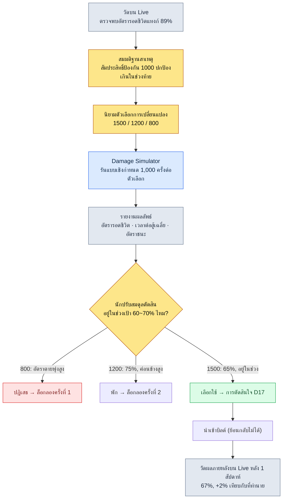

# 8.1 สูตรปรับสมดุลการต่อสู้ — ที่ทางของรูลบุ๊กแบบเชิงกำหนด

> **เป้าหมายการเรียนรู้ของบทนี้** (ระดับความยาก 🟡 ภาคปฏิบัติ · ความรู้พื้นฐานที่ต้องมี: การบวกลบคูณหาร · การคำนวณตาราง): แยกการปรับสมดุลการต่อสู้ออกเป็นที่ทางของสูตรกับที่ทางของค่าตัวเลข แล้วใช้คุณสมบัติสองอย่างคือความเป็นเชิงกำหนด (determinism) และความสามารถในการสืบย้อน เป็นเกณฑ์แยกแยะว่าควรมอบหมายงานให้ AI ได้ถึงไหน และตรงไหนที่มนุษย์ต้องล็อกไว้ด้วยรูลบุ๊ก

ตีสองของเช้ามืด มีการแจ้งเตือนขึ้นมาว่าอัตราการรอดชีวิตของอาชีพแทงก์บนเซิร์ฟเวอร์ Live แตะ 89% ไม่มีแทงก์คนไหนที่ตีบอสไม่จบ แต่แทงก์ที่ไม่ตายเลยกลับมีมากเกินไป ผมเปิดชีตข้อมูลขึ้นมาเพื่อหาร่องรอยว่าใครเข้าไปแตะอะไร เห็นค่าสัมประสิทธิ์การป้องกันบรรทัดหนึ่ง `DEF / (DEF + 1000)` ตัวเลข 1000 นี้ ลดจาก 1200 มาเป็น 1000 เมื่อไหร่ ด้วยมือของใคร และอ้างอิงจากอะไร ไม่มีจุดไหนในชีตที่เขียนบันทึกไว้เลย การสืบย้อนจึงเริ่มต้นขึ้น — ต้องไล่ดูล็อกแชต ไล่ดูประวัติบิลด์ และสุดท้ายต้องไปถึงความทรงจำของนักปรับสมดุลที่ลาออกไปเมื่อสามปีก่อนจึงจะจบ

ฉากนี้เป็นสิ่งที่ทุกคนที่เคยดูแลการปรับสมดุลการต่อสู้ต้องเคยเจอสักครั้ง และสาเหตุที่แท้จริงของฉากนี้ไม่ได้อยู่ที่ตัวเลข 1000 นั้นผิด แต่อยู่ที่ตัวเลขนั้นอาศัยอยู่ในที่ทางของ **สูตร** ทว่ากลับไม่มี **ประวัติ** การเปลี่ยนแปลงสูตรอยู่ที่ไหนเลย สูตรปรับสมดุลการต่อสู้คือพื้นที่ที่ต้องเป็นเชิงกำหนดที่สุดในเกม และเป็นพื้นที่ที่ต้องสืบย้อนได้มากที่สุด การที่คุณสมบัติสองอย่างนี้กลายเป็นเหตุผลว่าทำไมจึงไม่ควรนำ AI เข้ามาอยู่ในที่ทางนี้ คือกระดูกสันหลังของบทนี้

> **หนึ่งบรรทัดสำหรับผู้ที่ไม่ได้เรียนสายนี้** z-score · การจำลอง · เส้นโค้งในส่วนนี้จะดูแปลกตาก็ไม่เป็นไร สิ่งเดียวที่ขอให้นำกลับไปคือสิ่งนี้ — **"กฎ (สูตร) ที่ต้องให้ผลลัพธ์เดิมเสมอเมื่อใส่อินพุตเดิม จะไม่นำ AI เข้ามา"** การแยกแยะระหว่างที่ทางที่ต้องการความเป็นเชิงกำหนดกับที่ทางที่ต้องการการสำรวจนี้ ย้ายไปใช้ได้ตรง ๆ กับทุกสายงานที่จัดการ 'กฎที่ผิดไม่ได้' เช่น ระเบียบบัญชี · ตรรกะการชำระเงิน · ข้อสัญญา ส่วนตัวสูตรเอง ค่อย ๆ ดูจาก 8.1.2 เป็นต้นไปก็ได้

---

## 8.1.1 สูตรคือรูลบุ๊ก

เมื่อทำงานออกแบบเกมมานาน จะจับเอกสารได้สองชนิด เอกสารที่เปลี่ยนบ่อย กับเอกสารที่แทบไม่เปลี่ยน ในการปรับสมดุลการต่อสู้ ฝั่งที่แทบไม่เปลี่ยนคือสูตร "คำนวณดาเมจอย่างไร" จะแตะปีละหนึ่งถึงสองครั้งต่อไตรมาส ส่วน "พลังโจมตีของตัวละครนี้เท่าไหร่" จะแตะห้าถึงหกครั้งต่อสัปดาห์ ถ้านำสองกระแสที่มีความถี่ต่างกันมามัดรวมไว้ในไฟล์เดียวกัน กระดาษที่เปิดปิดนาน ๆ ครั้งจะฉีกขาดด้วยมือที่เปิดปิดบ่อย ๆ

ในโปรเจกต์ A ที่ผู้เขียนดูแลอยู่ การปรับสมดุลการต่อสู้ถูกแยกออกเป็นสองที่ทาง คือที่ทางของสูตร (ในที่นี้เรียกว่า `CombatFormula`) และที่ทางของค่าตัวเลข (`CombatBalance`) ขออ้างอิงบรรทัดหนึ่งที่อาศัยอยู่ในที่ทางของสูตรมาตรง ๆ

```
final_damage = base_damage × dmg_multiplier × (1 − defense_factor) × variation

  base_damage    = skill_base × ATK × skill_coeff
  defense_factor = DEF / (DEF + 1000)
  variation      = uniform(0.95, 1.05)
```

สูตรนี้คือรูลบุ๊ก ลองนึกถึงคู่มือกฎของบอร์ดเกม คู่มือกฎเขียนว่า "เคลื่อนที่ได้เท่ากับแต้มที่ทอยลูกเต๋าออกมา" ไม่ได้เขียนว่า "ตานี้ถ้าโชคดีจะเดินได้ไกลกว่านิดหน่อยก็ได้" อินพุตเดิมต้องให้เอาต์พุตเดิมเสมอ นี่คือความเป็นเชิงกำหนด (determinism) ใส่พลังโจมตี 180 พลังป้องกัน 80 สัมประสิทธิ์สกิล 2.1 ไม่ว่าจะคำนวณเมื่อไหร่ ที่ไหน กี่ครั้ง ก็ต้องได้ดาเมจเดียวกัน หากอินพุตเดิมแล้วได้เอาต์พุตต่างกัน นั่นไม่ใช่เครื่องมือปรับสมดุล แต่เป็นเครื่องพนัน

ความเป็นเชิงกำหนดอันเป็นคุณสมบัติเดียวนี้ คือเหตุผลแรกว่าทำไมจึงไม่ควรนำ AI เข้ามาอยู่ในที่ทางนี้ เดี๋ยวจะกลับมาดูอีกครั้ง ก่อนอื่นมาดูกันว่าสูตรควรมีหน้าตาเป็นรูลบุ๊กอย่างไร

พื้นที่หลักของสูตรการต่อสู้ไม่ได้จบที่ดาเมจบรรทัดเดียว อย่างน้อยมีสามบรรทัดที่อาศัยอยู่รวมเป็นชุดเดียวกัน

```
# ดาเมจ
final_damage = base_damage × dmg_multiplier × (1 − defense_factor) × variation

# คริติคอล
crit_damage  = final_damage × crit_multiplier
crit_chance  = base_crit + (LUK × 0.1)            # เพดาน 50%

# การฟื้นฟู
heal         = base_heal × healing_power × (1 − sickness_factor)
```

การเขียนสามบรรทัดนี้เป็นบล็อกโค้ดแทนภาษาธรรมชาตินั้นมีเหตุผล ภาษาธรรมชาติทิ้งช่องว่างให้ตีความ ประโยค "ยิ่งพลังป้องกันสูง ดาเมจยิ่งลด" ไม่ได้บอกว่าลดแบบเชิงเส้น ลดแบบเส้นโค้ง หรือหยุดตรงไหน แต่ `DEF / (DEF + 1000)` อ่านได้แบบเดียวเท่านั้น หน้าที่ของรูลบุ๊กคือทำให้ช่องว่างของการตีความเป็น 0

---

## 8.1.2 เส้นโค้งเป็นตัวกำหนดความเป็นเชิงกำหนด

ในสัมประสิทธิ์การป้องกัน `DEF / (DEF + 1000)` บรรทัดเดียวนี้ มีปรัชญาการปรับสมดุลทั้งหมดของเกมนี้อยู่ ลองวาดบรรทัดนี้เป็นกราฟจะเห็นว่าทำไมจึงเป็นเช่นนั้น แกนนอนคือพลังป้องกัน แกนตั้งคือสัดส่วนที่ลดดาเมจที่ได้รับ

<svg viewBox="0 0 640 320" xmlns="http://www.w3.org/2000/svg" font-family="sans-serif">
  <rect x="0" y="0" width="640" height="320" fill="#ffffff"/>
  <!-- axes -->
  <line x1="70" y1="270" x2="610" y2="270" stroke="#333" stroke-width="1.5"/>
  <line x1="70" y1="270" x2="70" y2="30" stroke="#333" stroke-width="1.5"/>
  <!-- y gridlines -->
  <line x1="70" y1="150" x2="610" y2="150" stroke="#e0e0e0" stroke-width="1"/>
  <text x="40" y="275" font-size="12" fill="#666">0%</text>
  <text x="34" y="155" font-size="12" fill="#666">50%</text>
  <text x="34" y="55" font-size="12" fill="#666" >~91%</text>
  <text x="300" y="300" font-size="13" fill="#333">พลังป้องกัน DEF →</text>
  <!-- x ticks -->
  <text x="60" y="288" font-size="11" fill="#666">0</text>
  <text x="190" y="288" font-size="11" fill="#666">1000</text>
  <text x="320" y="288" font-size="11" fill="#666">2500</text>
  <text x="470" y="288" font-size="11" fill="#666">5000</text>
  <text x="585" y="288" font-size="11" fill="#666">10000</text>
  <!-- DEF/(DEF+1000) curve: x in [0,10000] mapped to [70,610]; y reduction in [0, ~0.909] mapped to [270, 50] -->
  <path d="M70,270 C 110,180 160,140 200,135 C 280,124 360,98 470,78 C 540,66 580,58 610,52"
        fill="none" stroke="#c0392b" stroke-width="2.5"/>
  <!-- diminishing-return marker at DEF=1000 (50%) -->
  <circle cx="200" cy="135" r="4" fill="#c0392b"/>
  <line x1="200" y1="135" x2="200" y2="270" stroke="#c0392b" stroke-width="1" stroke-dasharray="4 3"/>
  <text x="208" y="128" font-size="11" fill="#c0392b">เมื่อ DEF=1000 ดาเมจลด 50%</text>
  <!-- linear ghost for contrast -->
  <line x1="70" y1="270" x2="430" y2="50" stroke="#95a5a6" stroke-width="1.5" stroke-dasharray="5 4"/>
  <text x="430" y="48" font-size="11" fill="#95a5a6">(ถ้าเป็นเชิงเส้น — ไม่เลือกใช้)</text>
  <text x="120" y="240" font-size="11" fill="#c0392b">ช่วงต้นชัน</text>
  <text x="470" y="100" font-size="11" fill="#c0392b">ช่วงท้ายราบ (ผลตอบแทนลดน้อยถอยลง)</text>
</svg>

เส้นโค้งนี้ค่อย ๆ แนบเข้ากับเส้นกำกับ (asymptote) อย่างช้า ๆ ที่พลังป้องกัน 1000 จะลดดาเมจลงครึ่งหนึ่งพอดี และหลังจากนั้นไม่ว่าจะเพิ่มขึ้นเท่าไรก็ไม่มีวันแตะ 100% การที่ไร้เทียมทานเป็นไปไม่ได้ ก็อยู่ในบรรทัดเดียวนี้ ถ้าเป็นเชิงเส้นแบบเส้นประสีเทา ที่พลังป้องกัน 1000 จะกันดาเมจได้หมด และเหนือกว่านั้นจะข้ามไปสู่พื้นที่ที่เป็นไปไม่ได้ คือดาเมจติดลบ (ยิ่งโดนตียิ่งฟื้นพลังชีวิต) จึงไม่เลือกใช้เชิงเส้น

ตรงนี้ลองกลับไปที่เหตุการณ์ตีสองของเช้ามืด สมมติว่ามีคนเพิ่ม 1000 นี้เป็น 1200 เส้นโค้งทั้งเส้นจะถูกดันไปทางขวา ด้วยพลังป้องกันเท่าเดิมจะกันดาเมจได้น้อยลง ดังนั้นแทงก์ทั้งเกมจะอ่อนลง และดาเมจต่อชั่วโมงของดีลเลอร์จะสูงขึ้น **ค่าคงที่ในสูตรเพียงตัวเดียวเขย่าเกมทั้งเกม** ขนาดของผลกระทบต่างจากการเปลี่ยนค่าตัวเลขหนึ่งตัว (พลังโจมตีของตัวละครบางตัว) ความต่างนี้คือเหตุผลที่ต้องวางสูตรกับค่าตัวเลขไว้คนละที่ทาง และเป็นเหตุผลที่การเปลี่ยนแปลงสูตรต้องมีประวัติติดตามมาด้วยเสมอ

---

## 8.1.3 การเปลี่ยนแปลงสูตรต้องมีประวัติติดตามมา

เหตุผลเดียวที่การสืบย้อนตีสองของเช้ามืดเป็นนรกก็คือ ไม่มีประวัติการเปลี่ยนแปลง ในโปรเจกต์ A การเปลี่ยนแปลงสูตรไม่ใช่งานแก้โค้ดหนึ่งบรรทัด แต่เป็น **งานบันทึกการตัดสินใจหนึ่งครั้ง** ข้าง ๆ สูตรจะมีเอกสารแยกชื่อ `CombatFormula_Decisions` ติดตามอยู่ และในนั้นจะเขียนแบบนี้

```markdown
## การตัดสินใจ D17 (2026-04-22)
- การเปลี่ยนแปลง: เปลี่ยน defense_factor จาก DEF/(DEF+1000) → DEF/(DEF+1500)
- เหตุผล: ในช่วงเลเวลสูง (LV40+) อัตราการรอดชีวิตของแทงก์อยู่ที่ 89% (วัดจาก Live) เป็นสาเหตุที่ทำให้การสู้บอสยืดเยื้อ
- ลองครั้งที่ 1: จำลองด้วย 800 → อัตราการตายของแทงก์พุ่งสูง เข้าบอสไม่ถึง 1 นาทีก็ถูกล้างหลายครั้ง → ย้อนกลับ
- ลองครั้งที่ 2: จำลองด้วย 1200 → อัตราการรอดชีวิต 75% → ดีแต่สูงกว่าเป้า (60~70%)
- ลองครั้งที่ 3: เลือกใช้ 1500 → อัตราการรอดชีวิตจากการจำลอง 65% (อยู่ในช่วงเป้าหมาย)
- atom ที่ได้รับผลกระทบ: combat_defense_formula, combat_tank_class_balance
- การวัดผลภายหลัง (1 สัปดาห์): อัตราการรอดชีวิตบน Live 67% (เทียบกับที่จำลองทำนายไว้ 65% คือ +2%, อยู่ในช่วง)
```

บันทึกหนึ่งครั้งนี้ตอบคำถาม "ทำไมถึงกลายเป็นแบบนี้" ของอีกหกเดือนข้างหน้าได้ ที่สำคัญกว่าคือการที่ลองครั้งที่ 1 และลองครั้งที่ 2 ยังคงอยู่ ถ้ามีการบันทึกว่าทำไม 800 ถึงไม่ได้ ทำไม 1200 ถึงไม่ถูกเลือก คนถัดไปก็จะไม่ทำผิดซ้ำแบบเดิม เมื่อนักปรับสมดุลคนใหม่เข้าทีม ชุดล็อกการตัดสินใจชุดนี้จะกลายเป็นเอกสารสำหรับการเรียนรู้งานเริ่มต้น (onboarding) ที่ดีที่สุด

ตรงนี้มีสิ่งหนึ่งที่ต้องพูดอย่างตรงไปตรงมา ค่าตัวเลขจากการจำลองในลองครั้งที่ 1·2·3 ข้างต้น (อัตราการตาย, อัตราการรอดชีวิต 75%, 65%) เป็น **ค่าประมาณของผู้เขียน (ยังไม่ได้ตรวจสอบ)** เพื่อแสดงให้เห็นกระแสการดำเนินงาน เกมแต่ละเกมจริง ๆ มีทั้งเส้นโค้งและช่วงเป้าหมายต่างกัน แต่ **โครงสร้าง** ที่ว่า "การเปลี่ยนแปลงมาพร้อมการลอง การลองมาพร้อมหลักฐานจากการจำลอง และหลังจากเลือกใช้แล้วก็มาพร้อมการวัดผลภายหลัง" นั้นเป็นไปตามการดำเนินงานจริงทุกประการ ในโครงสร้างนี้ ถ้ามีช่องไหนว่างแม้แต่ช่องเดียว ช่องที่ว่างนั้นจะกลายเป็นการสืบย้อนตีสองของเช้ามืดที่ย้อนกลับมา

เมื่อมองที่ทางทั้งสาม คือสูตร ค่าตัวเลข และประวัติ พร้อมกันในภาพเดียว จะเป็นดังนี้

<svg viewBox="0 0 660 280" xmlns="http://www.w3.org/2000/svg" font-family="sans-serif">
  <rect x="0" y="0" width="660" height="280" fill="#ffffff"/>
  <!-- CombatFormula -->
  <rect x="30" y="40" width="180" height="120" rx="8" fill="#fdecea" stroke="#c0392b" stroke-width="1.5"/>
  <text x="120" y="66" font-size="14" text-anchor="middle" fill="#c0392b" font-weight="bold">CombatFormula</text>
  <text x="120" y="88" font-size="11" text-anchor="middle" fill="#333">สูตร (รูลบุ๊ก)</text>
  <text x="120" y="110" font-size="11" text-anchor="middle" fill="#666">เปลี่ยน 1~2 ครั้ง/ไตรมาส</text>
  <text x="120" y="130" font-size="11" text-anchor="middle" fill="#666">เชิงกำหนด · ห้าม AI</text>
  <text x="120" y="150" font-size="11" text-anchor="middle" fill="#666">ผลกระทบ: ทั้งเกม</text>
  <!-- CombatBalance -->
  <rect x="240" y="40" width="180" height="120" rx="8" fill="#eaf2fb" stroke="#2c6fbb" stroke-width="1.5"/>
  <text x="330" y="66" font-size="14" text-anchor="middle" fill="#2c6fbb" font-weight="bold">CombatBalance</text>
  <text x="330" y="88" font-size="11" text-anchor="middle" fill="#333">ค่าตัวเลข (ชีต)</text>
  <text x="330" y="110" font-size="11" text-anchor="middle" fill="#666">เปลี่ยน 5~10 ครั้ง/สัปดาห์</text>
  <text x="330" y="130" font-size="11" text-anchor="middle" fill="#666">ผ่านด่านการจำลอง</text>
  <text x="330" y="150" font-size="11" text-anchor="middle" fill="#666">ผลกระทบ: ตัวละครนั้น</text>
  <!-- Decisions -->
  <rect x="450" y="40" width="180" height="120" rx="8" fill="#eafaf1" stroke="#27865a" stroke-width="1.5"/>
  <text x="540" y="66" font-size="14" text-anchor="middle" fill="#27865a" font-weight="bold">_Decisions</text>
  <text x="540" y="88" font-size="11" text-anchor="middle" fill="#333">ประวัติการตัดสินใจ (ล็อก)</text>
  <text x="540" y="110" font-size="11" text-anchor="middle" fill="#666">1 รายการต่อการเปลี่ยนแปลง</text>
  <text x="540" y="130" font-size="11" text-anchor="middle" fill="#666">เหตุผล · การลอง · วัดผลภายหลัง</text>
  <text x="540" y="150" font-size="11" text-anchor="middle" fill="#666">เอกสาร onboarding หลัก</text>
  <!-- arrows -->
  <line x1="210" y1="100" x2="240" y2="100" stroke="#888" stroke-width="1.5" marker-end="url(#ah)"/>
  <line x1="120" y1="160" x2="120" y2="200" stroke="#27865a" stroke-width="1.5" marker-end="url(#ah)"/>
  <line x1="540" y1="160" x2="540" y2="200" stroke="#27865a" stroke-width="1.5" stroke-dasharray="4 3"/>
  <path d="M120,205 L540,205" stroke="#27865a" stroke-width="1.5" fill="none"/>
  <path d="M540,205 L540,162" stroke="#27865a" stroke-width="1.5" fill="none" marker-end="url(#ah)"/>
  <text x="225" y="225" font-size="11" text-anchor="middle" fill="#27865a">เปลี่ยนสูตร 1 ครั้ง → ล็อกการตัดสินใจ 1 รายการ (แนบเหตุผล · การลอง · วัดผลภายหลัง)</text>
  <defs>
    <marker id="ah" markerWidth="8" markerHeight="8" refX="6" refY="3" orient="auto">
      <path d="M0,0 L6,3 L0,6 Z" fill="#888"/>
    </marker>
  </defs>
</svg>

---

## 8.1.4 กระแสจริงของการเปลี่ยนสูตรหนึ่งครั้ง

ทีนี้ลองไล่ดูตั้งแต่ต้นว่า D17 ถูกตัดสินใจขึ้นมาอย่างไร นี่คือวิธีที่รูลบุ๊กแบบเชิงกำหนดเคลื่อนไหวในงานจริง



ในกระแสนี้ต้องดูบทบาทของตัวจำลองให้แม่นยำ `Damage Simulator` รันตัวเลือกทั้งสามตัว ตัวละ 1,000 ครั้ง ในที่นี้ 1,000 ครั้งไม่ได้หมายถึงการทำซ้ำอินพุตเดิม 1,000 ครั้ง เพราะ `variation = uniform(0.95, 1.05)` ในสูตรซึ่งเป็นตัวเลขสุ่ม ±5% และความน่าจะเป็นคริติคอลซึ่งเป็นตัวเลขสุ่มอีกตัวหนึ่ง ทำให้ผลของแต่ละรอบแต่ละรอบต่างกัน รัน 1,000 รอบเพื่อดู **การกระจาย (distribution)** ดูอัตราการรอดชีวิตเฉลี่ย กรณีเลวร้ายที่สุด และการกระจัดกระจายของเวลาต่อสู้

ประเด็นสำคัญคือ ตัวจำลองตัวนี้เองก็ต้องเป็นเชิงกำหนด ถ้าให้ค่าตั้งต้นตัวเลขสุ่ม (seed) เดียวกัน 1,000 รอบต้องทำซ้ำได้โดยไม่ผิดแม้แต่ตัวอักษรเดียว เช่นนั้นแล้วบรรทัดหนึ่งของ D17 ที่ว่า "ใช้ 1500 ได้ 65%" จึงจะทำซ้ำได้เหมือนกันและตรวจสอบได้แม้ในอีกหกเดือนข้างหน้า ถ้าตัวจำลองให้ผลต่างกันทุกครั้ง ล็อกการตัดสินใจก็จะกลายเป็นคำโกหก

ผู้เขียนสร้างตัวจำลองดาเมจตัวนี้ครั้งแรกในปี 2008 ตอนนั้นเป็นแมโคร Excel และตอนนี้ในโปรเจกต์ A มันถูกหุ้มเป็นสกิล `balance-sim` ตลอด 18 ปีที่ผ่านมาเปลือกนอกของเครื่องมือเปลี่ยนไป แต่รูลบุ๊กที่อยู่ข้างในไม่เคยเป็นเชิงความน่าจะเป็นแม้แต่ครั้งเดียว นี่คือหัวใจสำคัญ

---

## 8.1.5 ทำไม AI จึงถูกห้ามเด็ดขาดในเส้นโค้งรางวัลและในสูตร

ทีนี้มาถึงสิ่งที่บทนี้อยากพูดที่สุด ในยุคที่ AI เข้ามาในแทบทุกที่ทางของการออกแบบเกม มีที่ทางเดียวที่ห้ามนำเข้ามาเด็ดขาด นั่นคือสูตรการต่อสู้และเส้นโค้งรางวัล อันเป็นแกนกลางของความเป็นเชิงกำหนด

LLM (โมเดลภาษาขนาดใหญ่) นั้นเป็นเชิงความน่าจะเป็นโดยเนื้อแท้ ตอบคำถามเดิมต่างกันเล็กน้อยทุกครั้ง นั่นเป็นต้นกำเนิดของพลังในการสร้างข้อความและไอเดียที่ดี แต่เป็นภัยร้ายแรงต่อที่ทางของรูลบุ๊ก ถ้าให้ LLM ตอบ "ตัวละครที่มีพลังป้องกัน 80 จะรับดาเมจเท่าไหร่" วันนี้อาจตอบ 92 พรุ่งนี้อาจตอบ 94 เปรียบเสมือนคู่มือกฎของบอร์ดเกมที่เปลี่ยนความหมายของแต้มลูกเต๋าทุกครั้งที่เปิดหน้าใหม่

เส้นโค้งรางวัลยิ่งอันตรายกว่า "ค่าประสบการณ์ที่ต้องใช้ตอนเลื่อนจากเลเวล 30 ไป 31" เมื่อกำหนดครั้งเดียวก็กำกับความเร็วการเล่นของคนหลายแสนคนพร้อมกัน หากมีความสั่นไหวเพียง ±2% เข้ามา ผู้เล่นบางคนล่ามอนสเตอร์เดียวกันก็ยังเติบโตช้ากว่าคนข้าง ๆ ความเสมอภาคพังทลาย ความเป็นเชิงกำหนดเป็นคำเดียวกับความเป็นธรรม ดังนั้นเส้นโค้งรางวัลจึงให้คนกำหนดด้วยมือ ป้อนลงในชีต และไม่มอบให้ความน่าจะเป็นอีก

แต่ก็ไม่ได้หมายความว่าให้ไล่ AI ออกจากพื้นที่การปรับสมดุลทั้งหมด เส้นแบ่งคือหัวใจสำคัญ

| พื้นที่ | AI | เหตุผล |
|---|---|---|
| การคำนวณสูตรดาเมจ · การฟื้นฟู | ห้ามเด็ดขาด | แกนเชิงกำหนด หากอินพุตเดิม = เอาต์พุตเดิม พังไป จะกลายเป็นเครื่องพนัน |
| เส้นโค้งรางวัล · ค่าประสบการณ์ | ห้ามเด็ดขาด | กำกับการเล่นของคนหลายแสนพร้อมกัน หากสั่นไหว ความเป็นธรรมพังทลาย |
| การคำนวณภายในตัวจำลอง | ห้ามเด็ดขาด | หากทำซ้ำไม่ได้ ล็อกการตัดสินใจจะกลายเป็นคำโกหก |
| การตรวจจับรูปแบบผิดปกติในผลการจำลอง | ทำได้ | ตรวจจับด้วย z-score ว่า "ตัวละครนี้อยู่นอกปกติ" จากผลลัพธ์ 1,000 รายการ |
| การสำรวจตัวเลือกการเปลี่ยนแปลง | ทำได้ | การสำรวจแบบจำกัด เช่น "เสนอตัวเลือก 5 ตัวในช่วง base_atk ±10%" |
| การร่างล็อกการตัดสินใจ | ทำได้ | เนื้อหาการประชุม → ร่างรายการ Decisions (ให้คนตรวจสอบ) |
| การสรุปรายงานการวัดผลภายหลัง | ทำได้ | สรุปข้อมูล Live เป็นภาษาธรรมชาติ |

เส้นแบ่งชัดเจน **AI อาศัยอยู่ได้แค่ภายนอกแกนเชิงกำหนดเท่านั้น** ฝั่งในที่คำนวณและจำลองคือรูลบุ๊ก ส่วนฝั่งนอกที่วิเคราะห์ เสนอแนะ และเรียบเรียงเป็นข้อความ คือที่ทางของ AI เมื่อข้ามเส้นนี้สักครั้ง อินพุตเดิมจะเริ่มให้ผลต่างกัน และนับจากวินาทีนั้นเครื่องมือปรับสมดุลก็จะสูญเสียความน่าเชื่อถือ

เส้นแบ่งนี้เป็นโครงสร้างเดียวกับระบบเศรษฐกิจที่จะดูใน 8.2 ในเศรษฐกิจก็เช่นกัน สูตรการผลิตและการบริโภคทรัพยากรเป็นเชิงกำหนด ส่วนการตรวจจับรูปแบบเงินเฟ้อเป็นที่ทางของ AI พื้นที่การปรับสมดุลทั้งหมดเคลื่อนไหวด้วยโครงร่างเดียวกัน

---

## 8.1.6 ไปอีกหนึ่งก้าว — การประยุกต์เชิงรุกด้วยการเสนอตัวเลือกผ่าน z-score

ที่ผ่านมาเป็นการประยุกต์แบบอนุรักษ์นิยม ที่คนสร้างตัวเลือกแล้วการจำลองเป็นตัวตรวจสอบ ถ้าไปอีกก้าว เครื่องมือสามารถทำแม้กระทั่งงานสร้างตัวเลือกแทนได้ แต่รูลบุ๊กยังคงเป็นของคนและของความเป็นเชิงกำหนดเช่นเดิม

จุดเริ่มต้นคือการตรวจจับรูปแบบผิดปกติ ดูการกระจายของอัตราชนะ · อัตรารอดชีวิตของแต่ละตัวละครจากผลการจำลอง 1,000 รอบ แล้ววัดด้วย z-score ว่าเบี่ยงเบนจากค่าเฉลี่ยไปกี่เท่าของส่วนเบี่ยงเบนมาตรฐาน ตัวละครที่ z เกิน 2 จะถูกทำเครื่องหมายอัตโนมัติว่า "อยู่นอกช่วงปกติ" แทงก์ของตีสองเช้ามืดก็คงติดการตรวจจับนี้

เพื่อให้การตรวจจับนำไปสู่การเสนอตัวเลือก ต้องมีอีกสองอย่าง อย่างแรกคือ **การนิยามพื้นที่การเปลี่ยนแปลง** วางช่องอย่าง `tunable_range` ในชีต CombatBalance เพื่อระบุว่า "ค่าตัวเลขนี้ปรับได้ในช่วงไหน" อย่างที่สองคือ **การทำงานคู่ขนานของการจำลอง** หากต้องการรันตัวเลือก 10 ตัว × 1,000 รอบ = 10,000 รอบ ภายในเวลาของด่านบิลด์ ต้องมีโครงสร้างพื้นฐานแบบคู่ขนาน

เมื่อสามอย่างนี้ (การตรวจจับด้วย z-score · การนิยามพื้นที่การเปลี่ยนแปลง · การทำงานคู่ขนานของการจำลอง) พร้อม การตัดสินใจที่เหลืออยู่ในมือนักปรับสมดุลก็แคบลงเหลือเพียงอย่างเดียว คือ "จะเลือกตัวเลือกไหน" งานสร้างตัวเลือกจาก 0 กับงานเลือกจากห้าตัวนั้น มีภาระต่างกัน ในที่นี้ก็เช่นกัน สิ่งที่ AI แตะได้มีแค่การเสนอตัวเลือกและการตีความรายงาน ส่วนการคำนวณฝั่งในตัวจำลองและการตัดสินใจเลือกใช้เป็นที่ทางของความเป็นเชิงกำหนดและของคน

สุดท้ายขอย้ำเรื่องความสามารถในการย้อนกลับ ทั้งการแก้ชีตและการรันการจำลองล้วนย้อนกลับได้ จึงย้อนคืนได้ตามใจ ที่ทางเดียวที่ย้อนกลับไม่ได้คือการนำเข้าบิลด์ ค่าตัวเลขที่ออกไปบน Live เมื่อผู้เล่นได้เห็นแล้วก็จะกลายเป็นปฏิกิริยาของชุมชนค้างไว้ ต่อให้ย้อนกลับก็ลบร่องรอยไม่ออก ดังนั้นการตรวจสอบทั้งหมดจึงจบลงก่อนการนำเข้าบิลด์ ในขั้นที่ยังย้อนกลับได้

---

## ลองทำดู — จัดการการเปลี่ยนสูตรหนึ่งครั้งอย่างปลอดภัย

**setup.** แยกสูตรการต่อสู้ออกจากคำอธิบายภาษาธรรมชาติ แล้วสร้างเอกสาร `CombatFormula` ที่เขียนเป็นบล็อกโค้ดเท่านั้น พร้อมเอกสารล็อก `CombatFormula_Decisions` เปล่า ๆ ไว้ข้าง ๆ ส่วนค่าตัวเลขให้แยกออกเป็นชีตต่างหาก (`CombatBalance`)

**prompt.** ใช้ AI เฉพาะกับ **การวิเคราะห์ · การร่าง** เท่านั้น ไม่ใช่การเปลี่ยนสูตร ตัวอย่างเช่น ให้ CSV ผลการจำลองไป แล้วขอแบบนี้

```
จากผลการจำลอง 1,000 ครั้งที่แนบมา ช่วยคำนวณ z-score ของอัตราชนะแยกตามตัวละคร
แล้วจัดตัวละครที่ z>2 เป็นตาราง สำหรับแต่ละตัวละคร
ช่วยประมาณพร้อมเหตุผลว่าค่าตัวเลขใด (พลังโจมตี/พลังป้องกัน/สัมประสิทธิ์สกิล)
มีโอกาสสูงที่จะเป็นสาเหตุของความผิดปกติ อย่าแก้ตัวเลขเอง — เสนอแค่ตัวเลือกเท่านั้น
```

**verify.** อย่าเชื่อตัวเลือกที่ AI เสนอมาทั้งดุ้น ป้อนค่าตัวเลขของตัวเลือกลงในชีต `CombatBalance` โดยตรง แล้วใช้ `Damage Simulator` (หรือ `balance-sim`) ให้ seed เดียวกันแล้วรัน 1,000 ครั้งใหม่ ตรวจสอบสองอย่าง (1) ผลการจำลองอยู่ในช่วงเป้าหมายไหม (2) รันด้วย seed เดียวกันอีกครั้งแล้วทำซ้ำได้โดยไม่ผิดแม้แต่ตัวอักษรเดียวไหม ถ้าผ่านทั้งสองข้อจึงเลือกใช้ และทันทีที่เลือกใช้ ให้เขียนเหตุผล · การลอง (รวมตัวเลือกที่ถูกปฏิเสธ) · ค่าที่ทำนายไว้ลงใน `_Decisions` แล้วหลังนำเข้าบิลด์ 1 สัปดาห์ ให้เพิ่มค่าที่วัดจาก Live ลงในล็อกนั้น

### ฉบับย่อสำหรับคนเดียว

แม้จะเป็นการพัฒนาคนเดียวที่ไม่มีทั้งทีมและตัวจำลอง โครงร่างก็ทำงานเหมือนกันทุกประการ ให้บันทึกสูตรเป็นบล็อกโค้ดไว้ในคอมเมนต์ของโค้ดหรือใน `.md` แยกหนึ่งหน้า แล้ววาง `## ประวัติการเปลี่ยนแปลง` ไว้ล่างสุดของไฟล์นั้น ถ้าเปลี่ยนค่าคงที่ของสูตรแม้แต่ตัวเดียว ให้เขียนวันที่ · เหตุผล · ค่าก่อนเปลี่ยน ลงไปหนึ่งบรรทัด ตัวจำลองใช้ลูป Python 30 บรรทัดก็พอแล้ว ตรึง seed ตัวเลขสุ่มไว้ ใส่ค่าตัวเลขของตัวละครลงในสูตร รัน 1,000 ครั้ง แล้วต่อให้พิมพ์ออกมาแค่อัตราชนะเฉลี่ย ก็ก้าวข้ามจาก "เปลี่ยนด้วยความรู้สึก" ไปสู่ "เปลี่ยนด้วยหลักฐาน" ได้ ส่วน AI ให้ใช้แค่ในงานอ่าน CSV ผลลัพธ์นั้นแล้วสรุปว่า "ตัวละครไหนผิดปกติ" เท่านั้น มีเพียงเรื่องเดียวที่ไม่ว่าจะขนาดเท่าไรก็อย่าทำ คือการให้ LLM คำนวณสูตรหนึ่งบรรทัด

---

### สรุปประเด็นสำคัญของบท

- สูตรการต่อสู้คือรูลบุ๊กที่ให้เอาต์พุตเดิมเมื่อใส่อินพุตเดิม และวินาทีที่ความเป็นเชิงกำหนดนั้นพังลง เครื่องมือปรับสมดุลก็จะกลายเป็นเครื่องพนัน
- การเปลี่ยนแปลงสูตรต้องมีประวัติการตัดสินใจที่บรรจุเหตุผล · การลอง · การวัดผลภายหลัง ติดตามมาด้วยเสมอ จึงจะตอบคำถาม "ทำไมถึงกลายเป็นแบบนี้" ของอีกหกเดือนข้างหน้าได้
- AI อาศัยอยู่ได้แค่ภายนอกแกนเชิงกำหนด (การตรวจจับความผิดปกติ · การเสนอตัวเลือก · รายงาน) เท่านั้น และจะไม่เข้ามาในการคำนวณสูตรและเส้นโค้งรางวัลเด็ดขาด
