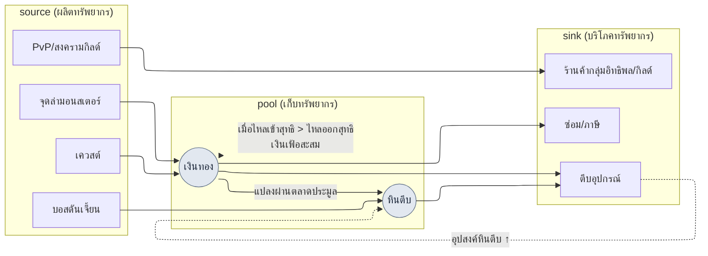

# 8.2 สร้างโมเดลเศรษฐกิจด้วย Machinations — จับเงินเฟ้อด้วยซิมูเลชันแทนการประชุม

> ผู้อ่านกลุ่มหลัก: นักออกแบบบาลานซ์/ระบบของ MMORPG ที่รับผิดชอบเศรษฐกิจในเกมที่ให้บริการจริง (ทีมขนาดกลาง 10\~50 คน)
> ฉบับย่อสำหรับผู้อ่านคนเดียว/มือสมัครเล่น: §8.2.10 「ถ้าทำคนเดียวก็แค่นี้พอ」

ครั้งแรกที่ผมรู้ว่าเงินทอง (gold) เริ่มรั่วไม่ใช่จากใบเรียกเก็บเงิน แต่จากตลาดประมูล สองเดือนหลังเปิดให้บริการ ราคาหินตีบ (강화석) ค่อย ๆ ขยับขึ้น แล้วอีกหนึ่งเดือนต่อมาก็พุ่งขึ้นเป็นสองเท่า ผมนัดประชุมเพื่อตามหาสาเหตุ แต่สิ่งที่ออกมาจากห้องประชุมล้วนเป็น "ความรู้สึก" ทั้งสิ้น บางคนบอกว่ารางวัลจากดันเจี้ยนใหม่มากเกินไป บางคนบอกว่าเป็นเพราะประสิทธิภาพของจุดล่ามอนสเตอร์สูงขึ้น บางคนก็บอกแค่ว่าผู้เล่นเลเวลสูงเพิ่มจำนวนขึ้น ทุกข้อฟังดูสมเหตุสมผล และด้วยเหตุนั้นเองจึงไม่มีอะไรถูกตัดสินใจสักอย่าง เผาเวลาไปหนึ่งชั่วโมงกับการคาดเดา แล้วจบลงที่ "เอาเป็นว่าสัปดาห์หน้ามาดูข้อมูลเพิ่มกัน"

ปัญหาอยู่ที่ทรัพยากรไม่ได้มีแค่ชนิดเดียว เงินทอง·หินตีบ·ค่าชื่อเสียง·เกียรติยศ·หินวิญญาณ ต่างก็มี source (ทางที่ไหลเข้า) และ sink (ทางที่ไหลออก) ของตัวเอง และทางเหล่านั้นต่างป้อนซึ่งกันและกัน บอสที่ดรอปหินตีบก็ดรอปเงินทองด้วย อุปกรณ์ที่ซื้อด้วยเงินทองก็เผาหินตีบไป เมื่อทรัพยากร 5 ชนิดพันกันด้วยกระแสไหลหลายสิบเส้น เครื่องคิดเลขในหัวก็ไม่อาจคำนวณแม้แต่สมดุลรายสัปดาห์ของทรัพยากรเพียงชนิดเดียวออกมาได้อย่างซื่อตรง บทนี้ว่าด้วยการย้ายความพันกันนั้นไปเป็น **โมเดลโหนดของ Machinations** และวิธีทำให้การตัดสินใจเปลี่ยนแปลงเศรษฐกิจผ่าน **ด่านซิมูเลชัน (simulation gate)** แทนการคาดเดาในที่ประชุม ทฤษฎีทั่วไปของการออกแบบเศรษฐกิจมีในหนังสือเล่มอื่นอย่างเพียงพออยู่แล้ว บทนี้จึงโฟกัสเฉพาะ *จุดที่นำทฤษฎีนั้นไปรันด้วยเวิร์กโฟลว์ AI* เท่านั้น

> **บันทึกจากการให้บริการจริงของผู้เขียน**
> กรณีศึกษาในบทนี้นำมาจากเอกสารโครงการนำร่องด้านเศรษฐกิจ (`Economy_Machinations_Pilot`) ที่ผู้เขียนกำลังดำเนินอยู่ในโฟลเดอร์ R&D ของบริษัท และพื้นที่ทำงานวิจัยด้านเศรษฐกิจ โดยทำให้เป็นนิรนาม (anonymized) แล้ว ชนิดของทรัพยากร·โครงสร้าง source/sink·4 ขั้นของ Pilot ถ่ายทอดมาจากการให้บริการจริงอย่างซื่อตรง ส่วนชื่อเฉพาะของบริษัท·ตัวเลขจริงนั้นถูกแทนที่ด้วยค่าสำหรับหนังสือ หรือเขียนไว้เพียงในรูปอัตราส่วน·ทิศทาง เนื้อหาผลลัพธ์ของ AI เป็นการเรียบเรียงใหม่จากเซสชันจริง

---

## 8.2.1 เศรษฐกิจไม่ใช่ 'ทรัพยากร 5 ชนิด' แต่เป็น 'กระแสไหลหลายสิบเส้น'

ถ้าเขียนทรัพยากรเศรษฐกิจลงในตาราง มันมีแค่ห้าบรรทัด ดูเรียบง่าย กับดักไม่ได้อยู่ที่ทรัพยากร แต่อยู่ที่จำนวนของ **กระแสไหล** ที่เชื่อมทรัพยากรเข้าด้วยกัน

| ทรัพยากร | source (ไหลเข้า) | sink (ไหลออก) |
|---|---|---|
| เงินทอง | ล่ามอนสเตอร์, รางวัลเควสต์, ขายในตลาดประมูล | ซื้ออุปกรณ์, ตีบ, ซ่อม, ภาษี |
| หินตีบ | บอสดันเจี้ยน, อีเวนต์ | ตีบอุปกรณ์, สังเคราะห์ |
| ค่าชื่อเสียง | ไซด์เควสต์ | ร้านค้าของกลุ่มอิทธิพล, เปลี่ยนอาชีพ |
| เกียรติยศ | PvP, สงครามกิลด์ | ร้านค้า PvP, สิ่งปลูกสร้างกิลด์ |
| หินวิญญาณ | สังหารบอส | ชุบชีวิตตัวละคร, เรียนสกิล |

ทรัพยากรมี 5 ชนิด แต่ source·sink รวมกันแล้วยี่สิบกว่าเส้น ยิ่งไปกว่านั้นทรัพยากรยังแปลงข้ามกันเองได้ (ตลาดประมูลที่ซื้อหินตีบด้วยเงินทองนั้นเป็นทั้ง sink ของเงินทองและ source ของหินตีบ) ทันทีที่กระแสไหลป้อนซึ่งกันและกัน คำถามอย่าง "ถ้าปล่อยเงินทองเพิ่มอีก 5% ราคาหินตีบจะเป็นยังไง" ก็ไม่อาจตอบได้ด้วยการมองทรัพยากรเพียงชนิดเดียว นี่คือจุดที่บาลานซ์ตัวละคร (8.1) กับบาลานซ์เศรษฐกิจต่างกันอย่างชี้ขาด บาลานซ์ตัวละครปิดจบได้ด้วยสมการบรรทัดเดียว แต่เศรษฐกิจเป็น **ระบบพลวัตที่สะสมไปตามเวลา** ดังนั้นต่อให้สมดุลรายสัปดาห์ใกล้ศูนย์ พอสะสมไป 26 สัปดาห์ ตลาดประมูลก็พังลงได้

ดังนั้นแก่นแท้ของงานเศรษฐกิจไม่ใช่ "การเลือกตัวเลขให้ดี" แต่เป็น **"การมองด้วยซิมูเลชันว่ากระแสไหลจะสะสมไปตามเวลาอย่างไร"** และงานสร้าง·แก้ไขโมเดลซิมูเลชันนั้นด้วยมือก็น่าเบื่อ และทุกครั้งที่ทำก็มักมีอะไรหล่นหาย งานร่างที่ทำซ้ำ ๆ และตกหล่นง่าย แต่การตรวจสอบต้องให้มนุษย์กุมไว้แน่น — งานลักษณะนี้คือจุดที่เส้นแบ่งงานระหว่าง AI กับมนุษย์ถูกขีดได้สะอาดที่สุด

ก่อนอื่น ขอวางโครงของวัฏจักรเศรษฐกิจที่บทนี้ครอบคลุมไว้เป็นภาพหนึ่งภาพ



เส้นประคือหัวใจของบทนี้ sink ของการตีบดึงอุปสงค์หินตีบขึ้น จึงดันราคาหินตีบ (`UP -.-> S`) และเมื่อการไหลเข้าสุทธิของเงินทองเกินการไหลออกสุทธิ ส่วนเกินนั้นก็สะสมเข้าพูล (pool) ทุกสัปดาห์ กลายเป็นเงินเฟ้อที่พอกพูน เส้นประสองเส้นนี้ตามรอยด้วยการคำนวณมือไม่ได้ จึงต้องมีโมเดล

---

## 8.2.2 Machinations — เครื่องมือย้ายเศรษฐกิจไปเป็นกราฟโหนด

Machinations คือเครื่องมือที่วาดกระแสไหลของเศรษฐกิจเป็นกราฟโหนด แล้วรันซิมูเลชันบนกราฟนั้น เป็นจุดที่ย้าย mermaid ของ §8.2.1 ไปเป็นโมเดลที่รันได้จริง

| โหนด | บทบาท | ในภาพข้างบน |
|---|---|---|
| Pool | ที่เก็บทรัพยากร | เงินทอง·หินตีบ |
| Source | ผลิตทรัพยากร | ล่ามอนสเตอร์·เควสต์·บอส |
| Drain | บริโภคทรัพยากร | ตีบ·ซ่อม·ร้านค้า |
| Converter | แปลงทรัพยากร | ตลาดประมูล (เงินทอง→หินตีบ) |
| Trigger | จุดกระตุ้นแบบมีเงื่อนไข | อีเวนต์·รางวัลเลื่อนขั้น |

เมื่อสร้างโมเดลเศรษฐกิจด้วยโหนดเหล่านี้แล้วรันซิมูเลชัน 1,000 ครั้ง สิ่งที่ได้ไม่ใช่ผลลัพธ์เดี่ยว ๆ แต่เป็นการแจกแจง (distribution) ลักษณะอย่าง "หลัง 26 สัปดาห์ ราคาเงินทองมัธยฐาน +X%, ผู้เล่นกลุ่มบน 10% อยู่ที่ +Y%" อย่างไรก็ตาม Machinations ไม่ได้ครอบจักรวาล และตัวการนำมาใช้เองก็มีต้นทุน

| ข้อจำกัด | วิธีรับมือ |
|---|---|
| รันแยกจากโค้ดเกม จึงเกิดความไม่สอดคล้องของการซิงค์ | ปรับเทียบรายเดือน/รายไตรมาสด้วย telemetry จริง (§8.2.6) |
| กราฟโหนดยิ่งใหญ่ ความอ่านง่ายยิ่งพัง | แบ่งเป็นซับกราฟตามทรัพยากร เริ่มจากทรัพยากรเดียวก่อน (§8.2.4) |
| ซิมเป็นโมเดลผู้เล่นที่ลดทอนความซับซ้อน | ปรับเทียบด้วยการแจกแจงพฤติกรรมจริง ตั้งเกณฑ์ความคลาดเคลื่อน |
| การตีความผลลัพธ์ขึ้นกับความรู้เชิงโดเมน | ทำให้ด่านที่เชื่อมตัวเลขซิม → การตัดสินใจ เป็นมาตรฐาน (§8.2.5) |

ดังนั้น Machinations ไม่ใช่เครื่องมือที่นำมาใช้แบบไม่มีเงื่อนไข มันคุ้มค่าเมื่อสามเงื่อนไข — **ทรัพยากร 5 ชนิดขึ้นไป + กระแสแปลงทรัพยากร + การให้บริการเกม (Live Ops)** — มาทับซ้อนกัน เศรษฐกิจอย่างง่ายที่มีทรัพยากร 2\~3 ชนิดใช้ Excel ก็เพียงพอ ในกรณีนั้นการนำ Machinations มาใช้จะทำให้ภาระการดูแลมาถึงก่อนผลที่ได้

---

## 8.2.3 [บันทึกเซสชันจริง (worked transcript)] ร่างโมเดลทรัพยากรเดี่ยว 'เงินทอง' ด้วย AI

ลำพังคำอธิบายเครื่องมือเพียงอย่างเดียวไม่อาจรู้ได้ว่ามันคายอะไรออกมาจริง ๆ เราจะตามหนึ่งรอบของการย้าย 'เงินทอง' เพียงตัวเดียวไปเป็นโมเดล Machinations ตั้งแต่พรอมต์ที่ป้อนเข้าไปจนถึงการที่มนุษย์ปฏิเสธ จนจบ พรอมต์ที่ป้อนสามารถคัดลอกไปใช้ได้ตรง ๆ ส่วนผลลัพธ์เป็นการเรียบเรียงใหม่จากเซสชันจริง

### ขั้นที่ 1 — อินพุต: ทำกระแสไหลของเงินทองให้เป็นตารางที่เครื่องอ่านได้

ก่อนอื่น ดึง source·sink ของเงินทองจากชีตข้อมูลออกมาทำเป็นตาราง ไม่ใช่การเขียนใหม่ แต่เป็นการสกัด (extract)

```yaml
# gold_flows.yaml — กระแสไหลของทรัพยากรเดี่ยว 'เงินทอง' (คัดจากชีตข้อมูลปัจจุบัน)
resource: gold
sources:
  - id: hunting        # ดรอปจากจุดล่ามอนสเตอร์
    trigger: per_kill
    note: เส้นโค้งดรอปตามช่วงเลเวลใช้กฎ reward_curve
  - id: quest_reward   # รางวัลเควสต์
    trigger: per_complete
  - id: market_sell    # ขายในตลาดประมูล
    trigger: per_trade
sinks:
  - id: gear_buy       # ซื้ออุปกรณ์
  - id: enhance        # ค่าตีบ
  - id: repair         # ซ่อม
  - id: tax            # ภาษีตลาดประมูล (เป็น sink และเป็นหัวใจของการดูดเงินทองกลับคืน)
# การแจกแจงพฤติกรรมผู้เล่น (จำนวนครั้งล่าต่อชั่วโมง·อัตราทำเควสต์สำเร็จ) ยังว่างอยู่ → ให้แสดงไว้ถ้า AI ตั้งสมมติฐาน
```

### ขั้นที่ 2 — พรอมต์: ให้สร้างโมเดล แต่บังคับสมมติฐานและรูปแบบ

```
ไฟล์แนบ gold_flows.yaml คือทรัพยากรเดี่ยว 'เงินทอง' ที่มี source 3 ตัว·sink 4 ตัว
จงสร้างร่างข้อกำหนดโหนด (node spec) สำหรับย้ายสิ่งนี้ไปเป็นโมเดล Machinations

กฎ:
1) จำแนกแต่ละกระแสไหลตามชนิดโหนด (Source/Drain/Pool/Converter)
2) เสนอสูตรของ 'อัตราไหลที่คาดหวังต่อผู้เล่น 1 คน อิงรายสัปดาห์' ให้แต่ละโหนด
   โดยหากต้องใช้สมมติฐานพฤติกรรมผู้เล่น (จำนวนครั้งล่าต่อชั่วโมง·อัตราทำเควสต์สำเร็จ ฯลฯ)
   จงระบุสมมติฐานนั้นไว้เป็นบรรทัดแยกต่างหากว่า '★สมมติฐาน' อย่าซ่อนสมมติฐานไว้ในเนื้อหา
3) แยกการไหลเข้ารวมของ source กับการไหลออกรวมของ sink เพื่อคำนวณสมดุลสุทธิ (net) รายสัปดาห์
4) สะท้อนว่าภาษีตลาดประมูล (tax) เป็น sink เดียวที่กำจัดเงินทองออกจากเศรษฐกิจอย่างถาวร
   และแยกแยะว่า sink อื่น (ตีบ·ซ่อม) เป็นเพียงการที่เงินทองเคลื่อนไปยัง NPC
   ไม่ใช่การดูดกลับคืน
5) สมมติฐานที่เจ้า 'ไม่มั่นใจ' จงทำเครื่องหมาย ★ แยกไว้ แล้วส่งต่อให้มนุษย์ตัดสินใจ

รูปแบบผลลัพธ์: ตาราง (โหนด | ชนิด | สูตรอัตราไหลรายสัปดาห์ | สมมติฐาน | ระดับความมั่นใจ) ห้ามมีคำอธิบายอื่น
```

ในพรอมต์นี้ สิ่งที่เขียนยาวจริง ๆ ไม่ใช่คำสั่งให้สร้างโมเดล แต่เป็นกฎว่าจะเขียนสมมติฐานไว้ที่ไหนและอย่างไร ในการสร้างโมเดลเศรษฐกิจ ถ้าปล่อยให้ AI อิสระ มันจะคายตัวเลขที่ดูสมเหตุสมผลออกมาโดยซ่อนสมมติฐานเอาไว้ แล้วต่อให้โมเดลผิด ก็ไม่อาจชี้ได้ว่า *ผิดตรงไหน* **การให้มันดึงสมมติฐานพฤติกรรมผู้เล่นออกมานอกเนื้อหาแล้วตั้งไว้เป็นบรรทัดแยก** — น้ำหนักทั้งหมดของคำขอนี้อยู่ตรงนั้น สมมติฐานต้องมองเห็นได้จึงจะตรวจสอบได้

### ขั้นที่ 3 — ผลลัพธ์ของ Claude (เรียบเรียงใหม่, คัดบางส่วน)

```
| โหนด          | ชนิด      | สูตรอัตราไหลรายสัปดาห์                  | สมมติฐาน          | ความมั่นใจ |
|--------------|-----------|----------------------------------------|------------------|-------|
| hunting      | Source    | สังหารต่อชม. × ดรอปเฉลี่ย × ชม.เล่นรายสัปดาห์ | ★สัปดาห์ละ 15h, สังหาร 80/h| กลาง  |
| quest_reward | Source    | จำนวนเดลี่เควสต์ × รางวัล × 7 × อัตราสำเร็จ | ★อัตราสำเร็จ 0.7  | กลาง  |
| market_sell  | Source    | (โอนระหว่างผู้เล่น — ไม่ใช่เพิ่มสุทธิ)   | เพิ่มต่อเศรษฐกิจสุทธิ 0 | สูง   |
| gear_buy     | Drain     | ความถี่ซื้อ × ราคาเฉลี่ย                  | ★สัปดาห์ละ 1.2 ครั้ง | ต่ำ   |
| enhance      | Drain     | ครั้งที่ตีบ × ค่าใช้จ่ายต่อครั้ง          | ★สัปดาห์ละ 8 ครั้ง | กลาง  |
| repair       | Drain     | เวลาล่า × อัตราค่าซ่อม                     |                  | สูง   |
| tax          | Drain     | ยอดซื้อขาย × อัตราภาษี (★sink ดูดถาวรเพียงตัวเดียว) | ★อัตราภาษี 5%   | สูง   |
| ── สมดุลสุทธิ | net       | Σsource − Σsink ≈ +(เป็นบวกที่เกณฑ์กิจกรรมกลาง) | เมื่อรวมสมมติฐานข้างบน | ★ต่ำ |

★คำเตือนสมมติฐาน: market_sell เป็นการเคลื่อนเงินทองระหว่างผู้เล่น↔ผู้เล่น จึงเพิ่มต่อปริมาณรวมของเศรษฐกิจ 0
ถ้าบวกมันเป็น source จะนับเงินเฟ้อซ้ำซ้อน ต้องจัดการแยกในโมเดล
★จุดที่ไม่มั่นใจ: ความถี่ของ gear_buy (สัปดาห์ละ 1.2 ครั้ง) เป็นการเดา หากไม่มี telemetry การซื้อจริง
sink อาจถูกประเมินต่ำ/สูงเกินไป → ต้องให้มนุษย์ตัดสินใจ
```

สิ่งที่มีค่าที่สุดในผลลัพธ์ไม่ใช่ตาราง แต่เป็น **สองบรรทัดล่างสุด คือ "★คำเตือนสมมติฐาน" และ "★จุดที่ไม่มั่นใจ"** AI รายงานจุดอ่อนของโมเดลตัวเองออกมาเองสองจุด พรอมต์ที่ดีคือพรอมต์ที่ทำให้ AI พูดว่า "สมมติฐานนี้ผมไม่กล้าเชื่อ"

### ขั้นที่ 4 — การตรวจสอบและการปฏิเสธ (ที่ของมนุษย์)

จะเอาผลลัพธ์นี้ใส่เข้าโมเดลตรง ๆ ไม่ได้ หนึ่งในสอง ★ ที่ AI รายงานเป็นข้อบกพร่องที่ทำลายโมเดลจริง ๆ

ทีแรก AI จำแนก `market_sell` (ขายในตลาดประมูล) เป็น Source แต่การขายในตลาดประมูลเป็น **การโอนเงินทองของผู้เล่น A ไปยังผู้เล่น B** ไม่ใช่การที่เงินทองเกิดขึ้นใหม่ในเศรษฐกิจ ถ้าบวกสิ่งนี้เข้าการไหลเข้าของ source ก็จะนับเงินเฟ้อซ้ำซ้อน AI ชี้ด้วย ★คำเตือนสมมติฐานเองอยู่ก็จริง แต่ในเนื้อตารางก็ยังทิ้ง `market_sell` ไว้ในช่อง Source อยู่ดี — รายงานแล้วแต่ไม่ถอดออกจากโมเดล เป็นผลลัพธ์ที่ถูกแค่ครึ่งเดียว นี่ยังเป็นข้อบกพร่องของข้อมูลฝั่งมนุษย์ด้วย ที่อินพุต yaml ไม่ได้ระบุลักษณะของ `market_sell` (โอนระหว่างผู้เล่น vs สร้างใหม่)

จึงร้องขอใหม่

```
market_sell เป็นการโอนเงินทองระหว่างผู้เล่น↔ผู้เล่น จึงไม่ใช่ source ต่อปริมาณรวมของเศรษฐกิจ (แก้ส่วนที่
อินพุตตกหล่น) จงเอาโหนดนี้ออกจากการรวม source และให้สะท้อนเข้าโมเดลเพียงในฐานะ 'sink ที่ภาษีตลาดประมูล (tax)
ดูดส่วนหนึ่งของยอดโอนกลับคืนอย่างถาวร' เท่านั้น คำนวณสมดุลสุทธิใหม่
แล้วแสดงผลกระทบของการตัด market_sell ออกที่มีต่อ net เป็นหนึ่งบรรทัด
```

AI ตอบกลับด้วยโมเดลที่เอา `market_sell` ออกจาก source แล้วเหลือไว้แต่ภาษีในฐานะ sink ผลคือสมดุลสุทธิ (net) ต่ำลงกว่าที่ประเมินไว้ครั้งแรก — เผยให้เห็นว่าตอนที่ใส่การขายในตลาดประมูลเป็น source ผิด ๆ นั้น เรากำลังประเมินเงินเฟ้อสูงเกินจริงอยู่ **การไป-กลับเพียงครั้งเดียวนี้คือหัวใจ** ถ้ามนุษย์สร้างเองด้วยมือตั้งแต่ต้นก็กินเวลาครึ่งวันและตัวเองก็จับความผิดพลาดในการจำแนกโหนดได้ยาก แต่ร่างจาก AI + บังคับ "ระบุสมมติฐาน" + ปฏิเสธ 1 ครั้ง ใช้เวลาไม่ถึงหนึ่งชั่วโมง และด้วยโครงสร้างที่มนุษย์เป็นผู้ตัดสิน ★ ที่ AI รายงาน ข้อบกพร่องอย่างการนับซ้ำซ้อนจึงถูกดักก่อนเข้าโมเดล (การประมาณของผู้เขียน ยังไม่ได้ตรวจสอบ — เวลาที่ประหยัดได้ขึ้นกับทีม·จำนวนทรัพยากร จึงควรอ่านเป็นความต่างเชิงโครงสร้างระหว่าง "ทำเองด้วยมือตั้งแต่ต้น" กับ "ร่าง+ตรวจสอบ" มากกว่าค่าสัมบูรณ์)

---

## 8.2.4 ทีละทรัพยากร — นำเข้าด้วย Pilot 4 ขั้น

ต่อให้โมเดลเงินทองหนึ่งตัวปิดจบแล้ว ก็อย่าเอาทรัพยากรทั้งหมดมาสร้างโมเดลทีเดียว การให้บริการของผู้เขียนเองก็ไม่ได้ใส่ทั้งหมดเข้าไปในคราวเดียว แต่เดินตาม 4 ขั้น คือเริ่มจากทรัพยากรเดี่ยว ผ่านการตรวจสอบ·ปรับเทียบ แล้วจึงขยาย

| ขั้น | ขอบเขต | ด่านหลัก |
|---|---|---|
| 1. สร้างโมเดลทรัพยากรเดี่ยว (เงินทอง) | source 3·sink 4, เซสชัน §8.2.3 | จำแนกโหนด·ระบุสมมติฐาน |
| 2. เปรียบเทียบซิม vs จริง | net รายสัปดาห์ของซิม vs telemetry รายสัปดาห์ | ผ่านเกณฑ์ความคลาดเคลื่อนหรือไม่ |
| 3. ปรับเทียบความแม่นยำของโมเดล | สะท้อนการแจกแจงพฤติกรรมผู้เล่น (กิจกรรมต่ำ/กลาง/สูง) | วัดความคลาดเคลื่อนซ้ำตาม segment |
| 4. ขยายทรัพยากร (5 ชนิด) | เพิ่มหินตีบ·ค่าชื่อเสียง·เกียรติยศ·หินวิญญาณ ทีละขั้น | ตรวจสอบกระแสแปลง (ตลาดประมูล) |

การตรวจสอบด้วยการเปรียบเทียบในขั้นที่ 2 คือหัวใจของ 4 ขั้นนี้ ถ้าซิมกับจริงไม่ตรงกัน สิ่งที่ผิดไม่ใช่เกม แต่เป็นโมเดล ถ้าตัดสินใจด้วยโมเดลที่ผิด การตัดสินใจนั้นก็จะย้อนกลับมาเป็นอุบัติเหตุในระบบที่ให้บริการจริง ดังนั้นการขยาย (ขั้นที่ 4) จะทำได้ก็ต่อเมื่อผ่านการตรวจสอบของขั้นที่ 2·3 แล้วเสมอ ถ้าลำดับนี้พังลง คือข้ามการตรวจสอบทรัพยากรเดี่ยวแล้วยัด 5 ชนิดเข้าไปพร้อมกัน ก็จะไม่อาจแยกชี้ได้แม้แต่ว่าโมเดลของทรัพยากรชนิดไหนผิด

---

## 8.2.5 ด่านซิม — ตั้งแผงกั้นไว้หน้าการตัดสินใจเปลี่ยนแปลงเศรษฐกิจ

เมื่อโมเดลผ่านการตรวจสอบ คราวนี้ก็ตั้ง **ด่านซิม (simulation gate)** ไว้หน้าการตัดสินใจเปลี่ยนแปลงทุกอย่างที่ส่งผลต่อเศรษฐกิจ เป็นจุดที่เปลี่ยนการตัดสินใจที่เคยปล่อยผ่านด้วย "ความรู้สึก" ในที่ประชุม ให้กลายเป็นการผ่านด่านซิม

| ชนิดการตัดสินใจ | ภาระซิม |
|---|---|
| เพิ่ม source·sink ใหม่ | บังคับ |
| เปลี่ยนอัตราแปลงทรัพยากร (อัตราแลกเปลี่ยนตลาดประมูล ฯลฯ) | บังคับ |
| ออกแบบรางวัลดันเจี้ยน·อีเวนต์ใหม่ | บังคับ |
| เปลี่ยนราคา (±10% ขึ้นไป) | บังคับ |
| ตรวจสอบประสิทธิภาพอาชีพใหม่ | บังคับ |
| เปลี่ยน UI ฯลฯ ที่ไม่เกี่ยวกับเศรษฐกิจ | ยกเว้น |

เราจะลองทำให้เห็นว่าด่านทำงานจริงอย่างไร โดยปล่อยการตัดสินใจหนึ่งให้ผ่านบนโมเดลเงินทองที่ตรวจสอบแล้วใน §8.2.3

> **[ด่านซิม — การตัดสินใจเรื่องรางวัลอีเวนต์] (เรียบเรียงใหม่จากรูปแบบจริง)**
>
> ```
> [ข้อเสนอเปลี่ยน] อีเวนต์สุดสัปดาห์: รางวัลล็อกอินรายวัน +500 เงินทอง
> [ด่าน]          เพิ่ม source ใหม่ → ซิมบังคับ
> [ผลซิม 1000 ครั้ง]
>   - สมดุลสุทธิเงินทองรายสัปดาห์: +6,900 → +10,400 (+50%)
>   - เมื่อสะสม 26 สัปดาห์ ราคาเงินทองมัธยฐาน ~+28% (เตือนเงินเฟ้อ: เกิน ±10%)
>   - ผู้เล่นกิจกรรมสูงกลุ่มบน 10%: ~+41% (ความเหวี่ยงของ segment สูง)
> [คำตัดสิน]      FAIL — เกินช่วงเสถียร (±10%/ระยะยาว)
> [ข้อปรับแก้]    ติด sink พร้อมกันให้กับ source ของอีเวนต์: ร้านค้าเฉพาะอีเวนต์ (ดูดเงินทองกลับ)
>                ซิมใหม่ → สะสม 26 สัปดาห์ +9% (PASS)
> ```

ค่าของด่านอยู่ที่สองบรรทัดสุดท้าย ถ้าการตัดสินใจ "ปล่อยรางวัล +500 กันเถอะ" เป็นการคาดเดาในที่ประชุม มันก็คงผ่านด้วย "น่าจะโอเค" ด่านซิมแปลงการตัดสินใจนั้นให้เห็นเป็นเงินเฟ้อ +28% ใน 26 สัปดาห์ และยังบังคับการปรับแก้ไปถึงขั้นว่า **ถ้าจะเพิ่ม source ก็ติด sink ไปพร้อมกัน** การตัดสินการเปลี่ยนแปลงเศรษฐกิจด้วยการผ่าน/ไม่ผ่านซิมแทนการคาดเดา — นี่คือทั้งหมดของด่าน

ตรงนี้ขอชี้กับดักหนึ่งที่ตกบ่อย คือความเหวี่ยงของ segment ต่อให้เกณฑ์ผู้เล่นกิจกรรมกลางอยู่ที่ +28% แต่กลุ่มบน 10% อยู่ที่ +41% เพราะกลุ่มผู้เล่นที่หาเงินทองได้มากที่สุดสะสมเงินเฟ้อเร็วที่สุด ดังนั้นซิมจึงต้องไม่ดูแค่ค่าเฉลี่ย แต่ต้องรันแยกตาม segment ถ้าดูแค่ค่าเฉลี่ยก็จะพลาดการพังของราคาที่มาจากผู้เล่นกิจกรรมสูง

---

## 8.2.6 โมเดลวิวัฒนาการทุกเดือนด้วย telemetry หลังเปิดให้บริการ

ด่านซิมจะได้รับความเชื่อถือก็ต่อเมื่อโมเดลไม่หลุดออกจากเกมจริง เกมเปลี่ยนทุกสัปดาห์ โมเดลจึงต้องปรับเทียบตามไปด้วย หลังเปิดให้บริการ เราจะตรวจสอบโมเดลด้วย telemetry จริงทุกเดือน (ในช่วงที่มีการเปลี่ยนแปลงน้อยก็รายไตรมาส)

```
วัฏจักรปรับเทียบโมเดล (รายเดือน)
─────────────────────────────────
1. ดึง telemetry ผู้เล่นจริง 1 เดือน (รวมยอดกระแสไหลตามทรัพยากร)
2. คำนวณอัตราไหลจริงของ source·sink ตาม segment (กิจกรรมต่ำ/กลาง/สูง)
3. เปรียบเทียบกับซิม Machinations เป็นรายรายการ
4. รายการที่ความคลาดเคลื่อน >15% = ปรับพารามิเตอร์โมเดล (★สมมติฐานของรายการนั้นผิด)
5. หลังปรับ ซิมใหม่ → ใช้เป็นโมเดลฐานของด่านในเดือนถัดไป
```

หัวใจคือข้อ 4 รายการที่ความคลาดเคลื่อนสูงก็คือสัญญาณว่า "สมมติฐานที่ไม่มั่นใจ" ที่ AI ทำเครื่องหมาย ★ ไว้ใน §8.2.3 นั้นไม่ตรงกับความจริง เช่น ถ้าความถี่ `gear_buy` ที่ AI เดาไว้ (สัปดาห์ละ 1.2 ครั้ง) วัดจริงได้สัปดาห์ละ 2 ครั้ง ก็เปลี่ยนสมมติฐานนั้นเป็นค่าจาก telemetry ถ้าหยุดการปรับเทียบนี้ โมเดลก็จะค่อย ๆ ห่างออกจากเกม แล้วซิมในด่านของไตรมาสใดไตรมาสหนึ่งก็จะก่ออุบัติเหตุ "ปล่อยผ่านไปแล้วแต่ที่จริงเงินเฟ้อมา" ขึ้น ในวินาทีนั้นความเชื่อถือของตัวซิมเองก็พังลงในภายหลัง การปรับเทียบไม่ใช่งานพ่วงของการให้บริการ แต่เป็นวัฏจักรประจำที่ทำให้ด่านมีชีวิตอยู่

---

## 8.2.7 การประยุกต์เชิงก้าวหน้า — ตรวจจับรูปแบบผิดปกติ·นิยามปริภูมิการเปลี่ยนแปลง·รันซิมขนาน

มาถึงตรงนี้คือ 'การประยุกต์เชิงอนุรักษ์' ของการสร้างโมเดลเศรษฐกิจ มนุษย์เป็นผู้เสนอการเปลี่ยนแปลง ตรวจสอบด้วยโมเดล แล้วตัดสินใจด้วยผลลัพธ์ ถ้าก้าวต่อไปอีกหนึ่งก้าว สามแกนของการประยุกต์เชิงก้าวหน้าที่เห็นใน 8.1.6 — ตรวจจับด้วย z-score · นิยามปริภูมิการเปลี่ยนแปลง · รันซิมขนาน — ก็เปิดออกแบบเดียวกันบนโครงสร้างพื้นฐานเศรษฐกิจนี้เช่นกัน

**ข้อแรก ตรวจจับรูปแบบผิดปกติ** แทนที่จะให้มนุษย์เปรียบเทียบความคลาดเคลื่อนในวัฏจักรปรับเทียบรายเดือน (§8.2.6) ด้วยตา ให้โค้ดเป็นฝ่ายคัดรายการที่ค่าเบี่ยงเบนระหว่างโมเดล-ค่าวัดจริงเกินเกณฑ์ขึ้นมาก่อน การรู้ว่าราคาหินตีบกลายเป็นสองเท่าไม่ใช่จากการมองตลาดประมูล แต่ alert ที่ว่า "อัตราไหลของ source หินตีบเบี่ยง +30% เทียบกับโมเดล" มาถึงก่อนการประชุม

**ข้อสอง นิยามปริภูมิการเปลี่ยนแปลง** ไม่ใช่ทวิภาคว่า "ปล่อยรางวัล +500 หรือไม่ปล่อย" แต่ถ้านิยามช่วงรางวัล (0\~+1000) และช่วง sink พร้อมกันให้เป็นปริภูมิการเปลี่ยนแปลงไว้ ก็จะสามารถค้นหาคู่ผสมที่ทำให้เงินเฟ้ออยู่ใน ±10% ภายในปริภูมินั้นได้ มนุษย์กำหนด "จากตรงไหนถึงตรงไหน" ส่วนการค้นหาคู่ผสมที่ดีที่สุดภายในนั้นก็ทำให้เป็นอัตโนมัติ

**ข้อสาม รันซิมขนาน** แทนที่จะรันข้อเสนอเปลี่ยนหนึ่งข้อ 1,000 ครั้ง ก็รันผู้สมัครหลายสิบตัวภายในปริภูมิการเปลี่ยนแปลงขนานกันตัวละ 1,000 ครั้ง เพื่อเปรียบเทียบการแจกแจงในคราวเดียว จุดที่เคยถกทีละข้อในห้องประชุม ก็เปลี่ยนเป็นการเปรียบเทียบผลซิมของเมทริกซ์ผู้สมัคร

แนวคิดร่วมคือการย้ายจุดที่มนุษย์เคย *เสนอ* การเปลี่ยนแปลง ไปเป็นจุดที่โค้ด *ค้นหา* ปริภูมิการเปลี่ยนแปลง แต่ทั้งนี้เป็นเรื่องหลังจากที่การประยุกต์เชิงอนุรักษ์ (§8.2.3\~8.2.6) หมุนอย่างมั่นคงและโมเดลผ่านการตรวจสอบด้วย telemetry แล้ว ถ้าค้นหาปริภูมิการเปลี่ยนแปลงโดยอัตโนมัติด้วยโมเดลที่ยังไม่ผ่านการตรวจสอบ โมเดลที่ผิดก็จะนำเสนอค่าที่ดีที่สุดที่ผิด ๆ ออกมาอย่างมั่นใจ

> **[การประยุกต์เชิงก้าวกระโดด — บีบอัดเศรษฐกิจเป็น 'เวกเตอร์เชิงมิติ' แล้วค้นหา] (ยังเร็วเกินไปในตอนนี้)**
>
> เป็นพื้นที่ที่ก้าวต่อจากการประยุกต์เชิงก้าวหน้าไปอีกหนึ่งก้าว ขอให้อ่านเป็นแนวโน้มงานวิจัย ไม่ใช่การฟันธง (หากเพิ่งเจอเวกเตอร์เชิงมิติ·เอ็มเบดดิงเป็นครั้งแรก ลองดู 'แผนที่' หนึ่งภาพในภาคผนวก M ก่อน แล้วข้างล่างจะอ่านง่ายขึ้น — 'ป้ายบอกทาง' ทั้งห้าของหนังสือเล่มนี้ล้วนหมุนอยู่บนภาพนั้น) โมเดลเศรษฐกิจที่มาถึงตรงนี้เป็นระบบความซับซ้อนสูง ที่ทรัพยากร 5 ชนิดพันกันด้วยกระแสไหลหลายสิบเส้น และการค้นหาปริภูมิการเปลี่ยนแปลงใน §8.2.7 ก็คือวิธีที่สุดท้ายแล้วก็จับกระแสไหลหลายสิบเส้นนั้นมาเป็นพารามิเตอร์ทีละตัวแล้วหมุน ความคิดเชิงก้าวกระโดดคือ **บีบอัดความซับซ้อนนี้เองให้เป็นเวกเตอร์เชิงมิติ** แล้วค้นหาคำตอบบนปริภูมิที่บีบอัดนั้น
>
> อุปมาหนึ่งที่ดูห่างไกลกลับเป็นเบาะแส สูตรอาหารปรุง ซึ่งมักถูกยกเป็นพื้นที่เชิงคุณภาพที่จับต้องไม่ได้ ในงานวิจัยหนึ่ง (Epicure — Radzikowski·Chen, 2026, arXiv:2605.22391 · เดโม epicure.kaikaku.ai) ได้คัดวัตถุดิบมาตรฐาน 1,790 ชนิด จากสูตรอาหาร 4.14 ล้านสูตรจาก 11 แหล่ง แล้วบีบอัดความสัมพันธ์ระหว่างวัตถุดิบเป็นเวกเตอร์หลายร้อยมิติ แก่นคือ ต่อให้ "รสชาติ" เป็นเป้าหมายเชิงคุณภาพ แต่ถ้าแปลงความสัมพันธ์ระหว่างวัตถุดิบให้เป็นพิกัด สูตรที่คล้ายกันก็จะมารวมตัวกันใกล้ ๆ ในปริภูมิเวกเตอร์ และสามารถ interpolate ระหว่างนั้นเพื่อค้นหาคู่ผสมใหม่ได้ — Epicure เองก็แสดงการค้นหาแบบ interpolate ที่หมุนวัตถุดิบหนึ่งไปในทิศของวงอาหารหนึ่งบนปริภูมิที่บีบอัดนี้ เพื่อหาวัตถุดิบที่สมนัยกัน
>
> เศรษฐกิจก็หลักการเดียวกัน ถ้าแทนสถานะเศรษฐกิจด้วยเวกเตอร์ที่ตั้งให้ source·sink·กระแสแปลง แต่ละอย่างเป็นมิติ "เศรษฐกิจที่เสถียรภายในเงินเฟ้อ ±10%" ก็จะถูกจับเป็นพื้นที่หนึ่งของปริภูมินั้น แล้วแทนที่จะเอาข้อเสนอเปลี่ยนไปเข้าซิมทีละข้อ ก็เปิดทางให้ค้นหาคำตอบโดยตรงในหรือใกล้พื้นที่เสถียรนั้น เป็นความเป็นไปได้ที่ซิมขนานของ §8.2.7 ที่เคยรันผู้สมัครทีละตัวเพื่อเปรียบเทียบ จะถูกย่นเหลือการค้นหาบนปริภูมิที่บีบอัดเพียงครั้งเดียว
>
> ทำไม "ยังเร็วเกินไปในตอนนี้" ข้อแรก การกำหนดว่าจะตั้งอะไรเป็นมิติ (กระแสไหนเป็นอิสระ กระแสไหนเป็นตาม) ก็เป็นโจทย์ยากเชิงโดเมนอยู่ในตัวเอง ข้อสอง การบีบอัดโดยเนื้อแท้คือการทิ้งสารสนเทศ จึงอาจเกิดอุบัติเหตุในระบบจริงในมิติที่ทิ้งไป ข้อสาม ทั้งหมดนี้มีความหมายก็ต่อเมื่อการตรวจสอบ telemetry ของการประยุกต์เชิงอนุรักษ์ (§8.2.6) แน่นหนา — ถ้าโมเดลก่อนบีบอัดหลุดออกจากเกมอยู่แล้ว การบีบอัดก็เพียงบีบความคลาดเคลื่อนนั้นเข้าไปอย่างเรียบร้อยด้วย ดังนั้นหัวข้อนี้จึงไม่ใช่ใบสั่งยา แต่เป็น **ป้ายบอกทาง** สิ่งที่ต้องทำตอนนี้คือหมุนการประยุกต์เชิงอนุรักษ์อย่างซื่อตรง ส่วนเวกเตอร์เชิงมิตินั้นปล่อยไว้เป็นพื้นที่วิจัยที่ทีมซึ่งสั่งสมรากฐานเพียงพอแล้วจะหันมามองในอีกไม่กี่ปีข้างหน้า

---

## 8.2.8 การวัดผล — จุดที่การประชุมกลายเป็นซิม

เปรียบเทียบก่อนและหลังนำเครื่องมือมาใช้ เวลา·ความถี่ข้างล่างนี้บรรจุทิศทางที่สัมผัสได้จากการให้บริการช่วงแรกของการนำมาใช้ จึงควรอ่านว่ามันขยับไปทางไหนมากกว่าจะอ่านเป็นค่าสัมบูรณ์ที่แม่นยำ

| รายการ | ก่อนนำมาใช้ (ประชุม·คำนวณมือ) | หลังนำมาใช้ (ด่านซิม) |
|---|---|---|
| ตัดสินใจเปลี่ยนเศรษฐกิจ → นำไปใช้ | 2\~4 สัปดาห์ (วนคาดเดา·ถกซ้ำ) | 1\~3 วัน (ตรวจสอบด้วยซิม 1 ครั้ง) |
| อุบัติเหตุเงินเฟ้อ | 1\~2 ครั้งต่อไตรมาส (พบหลังเกิดเหตุ) | 0\~1 ครั้งต่อไตรมาส (ด่านสกัดล่วงหน้า) |
| ความถี่เพิ่ม source·sink | 1\~2 ครั้งต่อไตรมาส (อนุรักษ์เพราะกลัว) | 1\~2 ครั้งต่อเดือน (ซิมรับประกันความปลอดภัย) |
| ความถี่ประชุมเรื่องเศรษฐกิจ | 3\~4 ครั้งต่อสัปดาห์ | 1\~2 ครั้งต่อสัปดาห์ |

ความหมายของบรรทัดสุดท้ายใหญ่กว่าตัวเลขในตาราง ความถี่ประชุมที่ลดลงเป็นเพราะซิมูเลชันเข้ามาแทนที่การถกเถียง พอ "ผมว่าหินตีบน่าจะเงินเฟ้อนะ" กลายเป็น "ผลซิม 26 สัปดาห์ +28%" จุดที่เคยเถียงกันชั่วโมงหนึ่งเรื่องการคาดเดาก็จบลงด้วยการแชร์ผลลัพธ์ 5 นาที นี่ตรงกับแนวคิดที่ตรึงเป็นกฎไว้ในการทบทวนของระบบของผู้เขียน (atom `automation_signal_value_over_time_savings` — คุณค่าของการทำงานอัตโนมัติไม่ใช่การประหยัดเวลา แต่คือการเปิดเผยสัญญาณ) อย่างแม่นยำ ผลผลิตที่แท้จริงของด่านซิมไม่ใช่เวลาที่ประหยัดได้ แต่คือการทำให้ตัวเลขเข้ามาแทนที่จุดที่การคาดเดาเคยครองในที่ประชุม

แต่มีสิ่งหนึ่งที่ขอวางไว้อย่างซื่อตรง "1\~2 ครั้งต่อไตรมาส → 0\~1 ครั้ง" ในตารางไม่ใช่ค่าวัดที่แม่นยำ แต่เป็นทิศทางที่สัมผัสได้จากการให้บริการ อุบัติเหตุเงินเฟ้อมีจำนวนนับเปลี่ยนไปตามนิยาม (จะถือว่าราคาเหวี่ยง ±กี่ % เป็นอุบัติเหตุ) ดังนั้นจึงควรอ่านเป็นการเปลี่ยนเชิงโครงสร้างว่า "ย้ายจากการพบหลังเกิดเหตุไปเป็นการสกัดล่วงหน้า" มากกว่าจำนวนครั้งสัมบูรณ์

---

## 8.2.9 ความล้มเหลวที่พบบ่อย

| รูปแบบ | ทำไมจึงล้มเหลว | วิธีรับมือ |
|---|---|---|
| สร้างโมเดลทรัพยากรทั้งหมดในคราวเดียว | แยกไม่ได้ว่าโมเดลของทรัพยากรไหนผิด | เริ่มจาก Pilot ทรัพยากรเดี่ยว (§8.2.4) |
| รับสมมติฐานของโมเดล AI โดยไม่ตรวจสอบ | ข้อบกพร่องอย่างการนับซ้ำซ้อนของตลาดประมูลเข้าไปตรง ๆ | บังคับระบุสมมติฐาน + มนุษย์ปฏิเสธ (§8.2.3) |
| เปลี่ยนเศรษฐกิจโดยไม่มีด่านซิม | ต้นทุนกอบกู้เงินเฟ้อหลังเกิดเหตุมหาศาล | นิยามรายการซิมที่บังคับ (§8.2.5) |
| ซิมแค่ค่าเฉลี่ย เพิกเฉย segment | พลาดการพังของราคาที่มาจากผู้เล่นกิจกรรมสูง | ซิมแยกตาม segment (§8.2.5) |
| ไม่ปรับเทียบด้วย telemetry หลังเปิดให้บริการ | โมเดลห่างจากเกม ความเชื่อถือของด่านพัง | วัฏจักรปรับเทียบราย เดือน/ไตรมาส (§8.2.6) |
| ค้นหาปริภูมิการเปลี่ยนแปลงอัตโนมัติด้วยโมเดลที่ยังไม่ตรวจสอบ | โมเดลที่ผิดคายค่าที่ดีที่สุดที่ผิดออกมาอย่างมั่นใจ | ก้าวหน้าหลังจากการประยุกต์เชิงอนุรักษ์เสถียรแล้ว (§8.2.7) |

ข้อที่สองคือสิ่งที่พลาดบ่อยที่สุด เหมือนการนับซ้ำซ้อนของตลาดประมูลที่เห็นใน §8.2.3 AI คายโมเดลที่ดูสมเหตุสมผลออกมาอย่างมั่นใจ แต่จุดอ่อนของสมมติฐานตัวเองนั้นเพียงรายงานด้วย ★ แล้วก็ทิ้งข้อบกพร่องไว้ในเนื้อหา ถ้ามนุษย์ไม่ตัดสิน ★ นั้น โมเดลที่ผิดก็จะถูกปล่อยผ่าน และการตัดสินใจซิมทั้งหมดที่อยู่บนนั้นก็จะผิดไปด้วยกัน

---

## 8.2.10 ลองทำดู — หนึ่งขั้นที่ทำได้วันนี้

> **ถ้าทำคนเดียวก็แค่นี้พอ**: ไม่ต้องมีทั้ง Machinations และ telemetry ก็ได้ เลือกทรัพยากรหนึ่งของเกมตัวเอง (หรือเกมที่ชอบ) เขียน source·sink ลงกระดาษ แล้ววางพรอมต์ของ §8.2.3 ลงไปตรง ๆ เพื่อรับร่างโมเดลสมดุลสุทธิรายสัปดาห์ดู ลองเลือกสมมติฐานหนึ่งข้อที่ AI ระบุไว้ด้วย ★ แล้วโต้แย้งว่า "สมมติฐานนี้ผมไม่เชื่อ จงยกเหตุผลมาใหม่" คุณจะรู้สึกถึงเข้าไปในร่างกายว่าโมเดลเศรษฐกิจคือมัดของสมมติฐานชุดไหนกันแน่ — และถ้าสมมติฐานหนึ่งข้อนั้นผิด ข้อสรุปจะพลิกกลับไปอย่างไร

ถ้าทำเป็นทีม เริ่มด้วยขั้นถัดไปหนึ่งขั้นนี้ เลือก **ทรัพยากรที่เป็นปัญหามากที่สุดเพียงตัวเดียว** (มักเป็นเงินทองหรือหินตีบ) ไม่ใช่ทรัพยากรทั้งหมด แล้วตั้งแค่โมเดลทรัพยากรเดี่ยวของ §8.2.3 ก่อน จากนั้นวางด่านซิมของ §8.2.5 ไว้กับการตัดสินใจเปลี่ยนเศรษฐกิจชนิดหนึ่ง (เช่น รางวัลอีเวนต์) แค่ทรัพยากร 1 ตัว + การตัดสินใจ 1 ชนิด ก็เปลี่ยนจุดที่เคยเถียงกันเรื่องการคาดเดาในที่ประชุมให้เป็นตัวเลขหนึ่งบรรทัดได้แล้ว

สรุปเป็น setup → prompt → verify คือ — **setup**: สกัด source·sink ของทรัพยากรที่เป็นปัญหาหนึ่งตัวออกมาเป็น yaml **prompt**: รับร่างโมเดลโหนดในรูปแบบ §8.2.3 โดยบังคับให้ระบุสมมติฐานพฤติกรรมผู้เล่นด้วย ★ **verify**: ให้มนุษย์ปฏิเสธ·ร้องขอใหม่ด้วยตัวเองต่อสมมติฐาน ★ ที่ AI รายงานและการจำแนกโหนด (โดยเฉพาะการโอนระหว่างผู้เล่น vs การสร้างใหม่)

---

### สรุปประเด็นสำคัญของบท
- เศรษฐกิจไม่ใช่ทรัพยากร 5 ชนิด แต่เป็นกระแสไหลหลายสิบเส้นที่สะสมไปตามเวลา จึงต้องมีซิม
- ร่างโมเดลของ AI บังคับให้ระบุสมมติฐาน แล้วให้มนุษย์ปฏิเสธสมมติฐานนั้น
- การเปลี่ยนเศรษฐกิจตัดสินด้วยการผ่าน/ไม่ผ่านของด่านซิม ไม่ใช่การคาดเดาในที่ประชุม

### ตัวอย่างบทถัดไป
- 8.3 Damage Simulator (2008\~) — เครื่องมือซิมที่มีอายุ 18 ปี ถูกนำกลับมาใช้ใหม่ในยุค AI อย่างไร
