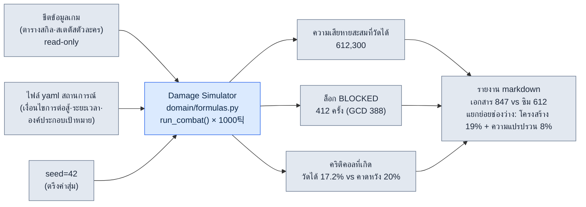

# 8.3 Damage Simulator — วันที่ DPS ในเอกสารกับผลลัพธ์จากการจำลองแยกทางกัน

เช้ามืดวันหนึ่งในปี 2008 ผมนั่งตรวจเลขชุดเดิมซ้ำสามรอบอยู่หน้าไฟล์ Excel แผ่นเดียว ในเอกสารออกแบบเขียนไว้ว่าตัวละครดาบตัวหนึ่งสร้างความเสียหายต่อวินาทีได้ **847** แต่ตัววันนั้นเองที่ผมรันซิมูเลเตอร์เป็นครั้งแรก โดยใส่ตัวละครตัวเดิมด้วยสเปกเดียวกันทุกอย่าง มันกลับให้ค่าออกมา **612** ห่างกัน 27% หนึ่งในสองค่านี้โกหก และตอนนั้นผมยังไม่รู้ว่าฝั่งไหนคือคำโกหก

DPS ในเอกสารคือคำสัญญาบนกระดาษ เป็นเลขคณิตของความเสียหายต่อสกิลหนึ่งครั้งคูณกับความถี่ในการปล่อยสกิล ส่วน DPS จากซิมูเลเตอร์คือผลที่ได้จากการเอาคำสัญญานั้นไปฟันจริง 1,000 ครั้ง คูลดาวน์ทับซ้อนกัน เวลาถูกท่าร่ายสกิลกินไป คริติคอลไม่ออกตามค่าคาดหวัง — แรงเสียดทานที่กระดาษไม่รู้จักเข้ามาแทรก ช่องว่าง 27% นี้แหละคือที่ทางที่ทำให้นักออกแบบสายปรับสมดุลมีกินมีใช้ ถ้าเชื่อกระดาษ พอเกมออกแล้วก็ได้ร้องไห้

บทนี้คือเรื่องราวของเครื่องมือชิ้นหนึ่ง Damage Simulator ที่ผมสร้างขึ้นในปี 2008 และไม่เคยวางมือจากมันมาจนถึงทุกวันนี้ ผมจะพาไล่ดูว่าผมตามรอยจุดที่เอกสารกับผลลัพธ์แยกทางกันอย่างแม่นยำได้อย่างไร และอีก 18 ปีต่อมาผมเอา AI มาช่วยในการตามรอยนั้นอย่างไร โดยติดตามผ่านบันทึกเซสชันจริง (worked transcript) จริงหนึ่งครั้ง

---

## 8.3.1 ทำไม DPS ในเอกสารถึงโกหกอยู่เสมอ

ก่อนอื่นมาแกะดูตัวตนของ 612 กับ 847 นั้นกัน นักออกแบบรุ่นน้องที่เขียนเอกสารฉบับนี้ (ต่อไปจะเรียกว่าทีมเมเบอร์ A) ไม่ได้ทำอะไรผิดเลย เขาคูณตามที่ตารางสกิลระบุไว้ทุกประการ

การคำนวณ DPS ตามเอกสารหน้าตาเป็นแบบนี้ สมมติว่าตัวละครหนึ่งมีสามสกิล

| สกิล | ความเสียหายต่อครั้ง | คูลดาวน์ | เวลาร่าย |
|---|---|---|---|
| ฟันขวาง | 320 | 3.0s | 0.6s |
| แทง | 540 | 6.0s | 0.9s |
| ตีปกติ | 180 | 1.2s | 0.4s |

การคำนวณในเอกสารของทีมเมเบอร์ A ตั้งอยู่บนสมมติฐานในอุดมคติว่า "ใช้แต่ละสกิลทุกครั้งที่คูลดาวน์หมดโดยไม่พลาดเลย" ฟันขวางสร้าง 320 ทุก 3 วินาที แทงสร้าง 540 ทุก 6 วินาที และตีปกติเข้ามาเติมช่วงเวลาที่ว่าง พอคิดเป็นเลขคณิตก็ได้ออกมาสวยงามที่ 847 บนกระดาษนั้นตัวละครราวกับมีหลายมือ ท่าร่ายสกิลจึงไม่ขวางกันเอง

เหตุผลที่ซิมูเลเตอร์ให้ค่า 612 มีเพียงข้อเดียวคือมันมีมือเดียว ระหว่างที่กำลังร่ายสกิลแทงที่ใช้เวลา 0.9 วินาที ต่อให้คูลดาวน์ของฟันขวางหมดก็ใช้ไม่ได้ การที่ท่าร่ายสกิลกินกันเองแบบนี้คือ **การชนกันของ global cooldown** ซึ่งในเอกสารไม่มี กระดาษคือสุญญากาศที่ไม่มีแรงเสียดทาน ส่วนซิมคือสนามรบที่มีแรงเสียดทาน ความจริงข้อแรกที่ผมเรียนรู้จากการทำงานนี้มา 24 ปีคือสิ่งนี้ — DPS ในเอกสารคือเพดานสูงสุด ไม่ใช่ค่าที่วัดได้จริง และผู้เล่นเล่นเกมด้วยค่าที่วัดได้จริง ไม่ใช่ด้วยเพดานสูงสุด

---

## 8.3.2 บันทึกเซสชันจริง — สอบถามที่มาของ 612 จาก AI

ผมในปี 2008 อุดช่องว่าง 27% นี้ด้วยมือ ไล่อ่านล็อกของซิมทีละบรรทัดด้วยตา แล้วนับว่าสกิลถูกบล็อกที่เฟรมไหน ใช้เวลาครึ่งวัน ผ่านมา 18 ปี ตอนนี้ผมโยนล็อกชุดเดียวกันนั้นให้ Claude ข้างล่างนี้คือเนื้อหาเต็มของเซสชันหนึ่งที่ผมรันจริง ผมไม่สรุปย่อ และใส่ความพยายามครั้งแรกที่พลาดเป้าลงไปตามจริง — เพราะการพลาดเป้านั้นคือครึ่งหนึ่งของวิธีใช้เครื่องมือชิ้นนี้

พรอมต์ที่ผมโยนไปเป็นแบบนี้

> ที่แนบมาคือบางส่วนของล็อกการต่อสู้ 1,000 ติกของตัวละครเดี่ยวจาก Damage Simulator (`damage_sim/`, Python) ของเรา ตามเอกสาร DPS ของตัวละครนี้คือ 847 แต่ผลจากซิมออกมาเป็น 612 จงหาสาเหตุของช่องว่าง 27% จากในล็อก รูปแบบของล็อกคือ `[tick] event skill=SKILL state=STATE` อย่าเดา ให้อ้างเฉพาะหลักฐานที่มีอยู่ในล็อกเท่านั้น ถ้าหลักฐานไม่พอ ให้บอกว่าไม่พอ
>
> ```
> [0.0] cast skill=แทง state=START
> [0.9] cast skill=แทง state=HIT dmg=540
> [0.9] cast skill=ฟันขวาง state=BLOCKED reason=GCD
> [1.5] cast skill=ตีปกติ state=HIT dmg=180
> [1.9] cast skill=ตีปกติ state=BLOCKED reason=GCD
> [3.0] cast skill=ฟันขวาง state=HIT dmg=320
> [3.6] cast skill=ตีปกติ state=HIT dmg=180
> ... (994 lines omitted)
> [997.2] cast skill=แทง state=HIT dmg=540
> ```

ผลลัพธ์ดิบของ Claude เป็นแบบนี้ (ไม่ได้ขัดเกลา)

> ข้อเท็จจริงที่ยืนยันได้จากล็อก:
>
> 1. อีเวนต์ `state=BLOCKED reason=GCD` ปรากฏซ้ำ ๆ ที่ `[0.9]` ฟันขวางถูกบล็อก และที่ `[1.9]` ตีปกติถูกบล็อกด้วยเหตุ GCD (global cooldown)
> 2. ก่อนที่การร่ายสกิลแทง (0.0→0.9, 0.9 วินาที) จะจบลง สกิลอื่นไม่สามารถปล่อยได้ ดูเหมือนเป็นโครงสร้างที่เวลาร่ายเข้าครอบครอง GCD
> 3. ดังนั้นสมมติฐานในเอกสารที่ว่า "ปล่อยทุกสกิลทุกครั้งที่คูลดาวน์หมด" จึงพังลง ในความเป็นจริงท่าร่ายสกิลชนกันเอง ทำให้การปล่อยบางส่วนตกหล่นไป
>
> อย่างไรก็ตาม ล็อกที่ให้มามีเพียง 7 บรรทัดจากทั้งหมด 1,000 บรรทัด **ไม่สามารถสรุปได้จาก 7 บรรทัดนี้ว่าช่องว่าง 27% ที่แม่นยำนั้นอธิบายได้ด้วยการชนกันของ GCD เพียงอย่างเดียวหรือไม่** ต้องรวมยอดจำนวนครั้งที่เกิดอีเวนต์ BLOCKED ทั้งหมด และความเสียหายรวมที่ตกหล่นไปเพราะมัน จึงจะตรวจสอบ 27% ได้ ถ้าให้ยอดรวม BLOCKED ของล็อกทั้งหมดมา ผมจะยืนยันเชิงปริมาณให้

การที่หยุดตรงนี้คือเรื่องสำคัญ AI **ชี้** สาเหตุได้ แต่ **พิสูจน์** 27% ไม่ได้ และมันบอกข้อจำกัดของตัวเองออกมา ในจุดที่นักออกแบบสายกระดาษคงจบการประชุมด้วยประโยค "เป็นเพราะ GCD นี่เอง" เครื่องมือกลับยืนยันว่า "จาก 7 บรรทัดยังไม่รู้" ผมพิจารณาแล้วว่าข้อเรียกร้องนั้นชอบธรรม — นี่แหละคือการตรวจสอบโดยมนุษย์ ผมจึงดึงยอดรวม BLOCKED ของล็อกทั้งหมดออกมาแล้วโยนกลับไปอีกครั้ง

> นี่คือยอดรวมของทั้ง 1,000 ติก BLOCKED รวม 412 ครั้ง ในจำนวนนั้นเป็นเหตุ GCD 388 ครั้ง เป็นเหตุคูลดาวน์ยังไม่พร้อม 24 ครั้ง ความเสียหายที่ประมาณว่าตกหล่นไปเพราะ BLOCKED เมื่อแปลงเป็นค่าฟันขวางอยู่ที่ราว 19,800 ตลอดการต่อสู้ 1,000 ติก (= วินาที) ความเสียหายที่เอกสารคาดหวังคือ 847,000 ส่วนความเสียหายสะสมที่ซิมวัดได้จริงคือ 612,300 จงทบทวนช่องว่าง 27% ใหม่ด้วยตัวเลขชุดนี้

ผลลัพธ์ครั้งที่สองของ Claude

> ขอตรวจสอบด้วยยอดรวม
>
> - สะสมที่เอกสารคาดหวัง: 847,000
> - สะสมที่ซิมวัดได้จริง: 612,300
> - ช่องว่าง: 234,700 (27.7%)
>
> องค์ประกอบของช่องว่างนี้:
> - ตกหล่นโดยตรงจากการชนของ GCD (388 ครั้ง): ที่ประมาณว่าราว 19,800 นั้นเป็นค่าที่แปลงเป็นฟันขวาง แต่ต้องบวกค่าเสียโอกาส (opportunity cost) ที่ช่องตกหล่นนั้นเคยจะใส่สกิลที่ความเสียหายสูงกว่าได้เข้าไปด้วย หากแปลงช่องที่ตกหล่นเป็นค่าความเสียหายเฉลี่ย ส่วนที่ตกหล่นจะมากกว่า 19,800
> - แต่ทั้ง 234,700 อธิบายได้ด้วย BLOCKED อย่างเดียวไม่ได้ **การตีความช่องว่างที่เหลือจะต่างกันไปขึ้นกับว่าค่า 847 ในเอกสารเป็น "ค่าที่รวมค่าคาดหวังของคริติคอลเฉลี่ยไว้แล้ว" หรือเป็น "ค่าพื้นฐานที่ไม่รวมคริติคอล"** หากบอกสมมติฐานเรื่องคริติคอลของ 847 ในเอกสารมา ผมจะแยกย่อยช่องว่างที่เหลือให้

หยุดอีกครั้ง และก็หยุดในจุดที่ถูกต้องอีกครั้ง ว่า 847 ในเอกสารคำนวณคริติคอลไว้อย่างไร — นี่คือข้อมูลที่ไม่มีในล็อก และอยู่แต่ในหัวของทีมเมเบอร์ A เท่านั้น AI รู้ขอบเขตของข้อมูลที่ตัวเองมี พอผมไปตรวจดูก็พบว่า 847 ในเอกสารเป็นค่าที่นำคริติคอลโอกาส 20% คูณ 1.5 เท่ามาทำให้เรียบเป็นค่าคาดหวังแล้วใส่ลงไป ส่วนซิมเป็นการรันหนึ่งรอบหลังตรึง seed ที่จำนวนครั้งคริติคอลจริงออกมาต่ำกว่าค่าคาดหวัง พูดอีกอย่างคือช่องว่าง 27% เป็นค่าที่ผสมระหว่าง **การชนของ GCD (เชิงโครงสร้าง · เกิดซ้ำได้)** กับ **ความแปรปรวนของคริติคอล (เชิงสถิติ · ดวงของรอบนี้รอบเดียว)**

การแยกย่อยนี้แหละคือบทสรุป ส่วนที่เป็นการชนของ GCD คือปัญหาจริงที่ต้องแก้ด้วยการออกแบบ ส่วนที่เป็นความแปรปรวนของคริติคอลคือสัญญาณรบกวนที่จะหายไปเองเมื่อเปลี่ยน seed แล้วเฉลี่ยจาก 1,000 รอบ ถ้าเอาทั้งสองส่วนมาปนกันแล้วบัฟด้วยเหตุผลว่า "ตัวละครอ่อน" ตัวละครที่ปกติดีในค่าเฉลี่ย 1,000 รอบจะกลายเป็นแกร่งเกินไป สิ่งที่สร้างการแยกแยะนี้ขึ้นมา — ที่กระดาษไม่รู้ ซิมรอบเดียวก็ไม่รู้ และ **AI ลำพังก็ไม่รู้** — คือการตรวจสอบโดยมนุษย์ที่เอายอดรวมจากล็อกและสมมติฐานที่ซ่อนอยู่ในเอกสารมาประกบกัน

---

## 8.3.3 อินพุตหนึ่งชุดกลายเป็นเอาต์พุตหนึ่งชุด — การผ่าซิม

ลองคลี่ดูอินพุต-เอาต์พุตของเครื่องมือที่เซสชันเมื่อกี้ส่องดูออกมาเป็นชุดเดียวกัน สุดท้ายแล้วซิมูเลเตอร์ก็คือฟังก์ชันที่ซื่อตรง อินพุตเดียวกันให้เอาต์พุตเดียวกัน อินพุตมารวมกันจากสามสาย



หัวใจของภาพนี้คือลูกศรเป็นทิศทางเดียว ชีตข้อมูลเกมถูกซิมูเลเตอร์ **อ่านอย่างเดียว** ซิมไม่เคยแก้เขียนข้อมูลทับ กฎที่กันเหตุได้มากที่สุดตลอด 18 ปีคือทิศทางของลูกศรเส้นนี้เส้นเดียว ถ้าซิมเริ่มคัดลอกข้อมูลเก็บไว้ในตัวเอง พอวันรุ่งขึ้นข้อมูลเกมเปลี่ยน ซิมก็จะจำลองโลกของเมื่อวาน แล้วถ้าเอารายงานที่ออกมาแบบนั้นไปประชุม ทั้งวงประชุมก็จะถกเถียงกันบนโลกของเมื่อวาน

อินพุตหนึ่งชุดที่เป็นรูปธรรม (ไฟล์ yaml สถานการณ์) หน้าตาเป็นแบบนี้

```yaml
# scenarios/single_dps_check.yaml
scenario: single_target_dps
duration_ticks: 1000      # สมมติ 1 ติก = 0.1s, การต่อสู้ 100 วินาที
seed: 42                  # เชิงกำหนด — อินพุตเดียวกันเอาต์พุตเดียวกัน
actor:
  char_id: K_004          # อ่านจากชีตข้อมูลเกม
  skill_rotation: optimal # เมื่อ GCD ชน ให้ความเสียหายคาดหวังสูงสุดมาก่อน
target:
  defense: 1200
  hp: infinite            # ดัมมีเลือดไม่จำกัดสำหรับวัด DPS
report:
  compare_to_spec: 847    # ใส่ DPS เอกสารเพื่อแยกย่อยช่องว่างอัตโนมัติ
```

และเอาต์พุตหนึ่งชุด (ตัดมาบางส่วนจากรายงาน) เป็นแบบนี้

```markdown
# Damage Simulator Report — K_004 single DPS
อินพุต: scenarios/single_dps_check.yaml | seed=42 | data rev. 2026-06-05

## เทียบกับเอกสาร
- DPS เอกสาร:       847   (รวมการทำให้เรียบของค่าคาดหวังคริติคอล 20%·1.5x)
- DPS ที่ซิมวัดได้:  612   (seed นี้ 1 รอบ)
- ช่องว่าง:            -27.7%

## แยกย่อยช่องว่าง
- เชิงโครงสร้าง (การชน GCD, เกิดซ้ำได้):   -19.2%  ← เป้าหมายการทบทวนการออกแบบ
- เชิงสถิติ (ความแปรปรวนคริติคอล, รอบนี้): -8.5%  ← คาดว่าหายไปเมื่อเฉลี่ย 1000 รอบ

## ตรวจสอบการเกิดซ้ำ
- รัน seed=42 ซ้ำ 3 ครั้ง → 612,300 / 612,300 / 612,300 (ตรงกัน)
- เฉลี่ย DPS 1000 รอบจาก seed 0~999 → 731 (หลังหักความแปรปรวนคริติคอล)
```

ลองดูบรรทัดสุดท้าย ค่าเฉลี่ยจากการรัน 1,000 รอบด้วย seed 0\~999 คือ 731 ช่องว่าง 116 (13.7%) ระหว่างเอกสาร 847 กับค่าเฉลี่ย 1,000 รอบ 731 นั่นแหละคือขนาดของ **ปัญหาเชิงโครงสร้างที่แท้จริง** ที่ชื่อว่าการชนของ GCD ค่าที่ควรเป็นอินพุตของการประชุมออกแบบคือ 731 นี้ ไม่ใช่ 612 ของรอบเดียว ไม่ใช่ 847 ของกระดาษ และไม่ใช่ 612 ของรอบที่ดวงไม่ดี แต่เป็น 731 ที่ 1,000 รอบเห็นพ้องกัน การได้ตัวเลขนี้มากำในมือนี่แหละคืองานของนักออกแบบสายปรับสมดุล

---

## 8.3.4 มือของปี 2008 และมือของปี 2026

เครื่องมือชิ้นนี้มีอายุ 18 ปี แต่ไม่ได้มีชีวิตอยู่ด้วยโค้ดชุดเดิม ไม้แขวนยังเป็นไม้เดิม เปลี่ยนแต่เสื้อมาห้าครั้ง ไม้แขวนคือตรรกะของรายงานข้างบน — ขั้นตอนการแยกดูเอกสารกับค่าที่วัดได้จริง แยกย่อยช่องว่างออกเป็นโครงสร้างกับความแปรปรวน แล้วตรวจสอบด้วยการเกิดซ้ำ ขั้นตอนนี้เหมือนกันทุกตัวอักษร ทั้งใน Excel VBA (ภาษามาโครของ Excel) ปี 2008 และใน Python ปี 2026

| ช่วงเวลา | เสื้อ (เทคโนโลยี) | ไม้แขวน (ขั้นตอนที่ไม่เปลี่ยน) |
|---|---|---|
| 2008\~2011 | Excel VBA, 1:1 | แยกย่อยช่องว่างเทียบเอกสาร |
| 2012\~2016 | C# console, N:N | 〃 |
| 2017\~2020 | Python + Web | 〃 |
| 2021\~2024 | Python + ML | 〃 (+ สะท้อนการกระจายตัวของผู้เล่น) |
| 2025\~ | Python + LLM ช่วย | 〃 (+ สอบถามล็อก·สร้างสมมติฐาน) |

เคล็ดที่ทำให้ผ่านการเปลี่ยนเสื้อห้าครั้งมาได้ถูกสลักไว้ในโครงสร้างโฟลเดอร์

```
damage_sim/
├── domain/          # ไม้แขวน — เหมือนเดิมมา 18 ปี
│   ├── formulas.py      # สูตรความเสียหาย·ตัดสินการชน GCD
│   └── metrics.py       # ตรรกะแยกย่อยช่องว่าง
├── adapters/        # ข้อมูลเกมแบบ read-only
│   └── excel_reader.py
├── runners/         # เสื้อ — เปลี่ยนทุกครั้งที่เทคโนโลยีเปลี่ยน
│   └── cli_runner.py
└── reporters/       # เสื้อ — รูปแบบการออกรายงาน
    └── markdown_report.py
```

พอเทคโนโลยีเปลี่ยน ก็เขียนแค่ `runners/` กับ `reporters/` ขึ้นใหม่ ส่วนตรรกะแยกย่อยช่องว่างใน `domain/` ยังคงรอดมาเป็นสินทรัพย์ 18 ปีตามเดิม สูตรตัดสินการชน GCD ที่ผมเขียนด้วยเซลล์ Excel ในปี 2008 ตอนนี้ยังรันอยู่ใน `formulas.py` โดยเปลี่ยนแค่ลายเซ็นของฟังก์ชัน ที่ว่าการตอกเครื่องมือไว้กับเทคโนโลยีเดียวเท่ากับให้มันแก่ตายไปพร้อมเทคโนโลยีนั้น ผมเรียนรู้มาจากการส่งเครื่องมือที่ตายไปแล้วหลายชิ้น

LLM ที่ผมเอามาต่อในปี 2025 ไม่ใช่ไม้แขวนอันใหม่ แต่เป็นมือใหม่ อย่างที่เห็นในเซสชันก่อนหน้า AI คือมือที่ **อ่านล็อกและตั้งสมมติฐาน** การตามรอยล็อกที่เคยใช้เวลาครึ่งวันลดเหลือไม่กี่นาที แต่ไม่แตะต้องไม้แขวน — สิ่งที่ **ตัดสิน** ว่าช่องว่างเป็น 27% หรือไม่ คริติคอลออกกี่เปอร์เซ็นต์ ยังคงเป็นคอร์เชิงกำหนดที่ตรึง seed ไว้ ทันทีที่ปล่อยให้ LLM เข้าไปอยู่ในที่ตรงนั้น การตรวจสอบแบบ regression จะทำไม่ได้ แล้วเครื่องมือก็ตาย

---

## 8.3.5 คอร์เชิงกำหนดกับสิ่งที่อยู่นอกมัน — จะขีดเส้นตรงไหน

ถ้าในเครื่องมือปรับสมดุลต้องขีดเส้นได้เพียงเส้นเดียว ผมจะขีดที่ขอบของคอร์เชิงกำหนด ด้านในต้องรับประกันแกร่งดั่งเหล็กว่าอินพุตเดียวกันให้เอาต์พุตเดียวกัน ส่วนด้านนอกจะให้คนหรือ AI โยนสมมติฐานได้อย่างอิสระ

ด้านใน (เชิงกำหนด — ห้าม AI):
- สูตรความเสียหาย, การตัดสินการชน GCD, การเกิดคริติคอล, การรวมยอดสะสม
- รันด้วย `seed=42` สามครั้งต้องได้ 612,300 เหมือนกันทั้งสามครั้ง ถ้าข้อนี้พังก็เทียบรายงานของเมื่อวานกับรายงานของวันนี้ไม่ได้

ด้านนอก (สมมติฐาน·การตีความ — ยินดีต้อนรับ AI):
- การสอบถามสาเหตุอย่าง "ทำไมอัตราชนะของการจับคู่ตัวละครชุดนี้ถึงผิดปกติ"
- หาแพตเทิร์น BLOCKED ในล็อก, ร่างรายงานภาษาธรรมชาติ, ร่างไฟล์ yaml สถานการณ์

บันทึกเซสชันจริงก่อนหน้านี้เคลื่อนไหวอยู่บนเส้นนี้พอดี AI ตั้งสมมติฐานว่า "การชน GCD คือสาเหตุ" ขึ้นมาอย่างรวดเร็วจากด้านนอก แต่ตัวเลข 27% และตัวเลข 612 เป็นค่าที่คอร์เชิงกำหนดคำนวณไว้จนถึงที่สุด AI เพียงรับค่านั้นมาตีความเท่านั้น และมันหยุดถึงสองครั้งด้วยคำว่า "ข้อมูลเท่านี้สรุปไม่ได้" — โดยเรียกร้องข้อมูลที่คอร์เชิงกำหนดให้ไม่ได้ (สมมติฐานคริติคอลของเอกสาร) การหยุดนี้คือเครื่องหมายของเครื่องมือที่ดี คือการไม่เข้าใจผิดว่าสมมติฐานเท่ากับการวินิจฉัย

มีเรื่องหนึ่งที่ผมขอบอกตามตรงเกี่ยวกับตัวเลข ตัวเลขเฉพาะอย่าง 847·612·731·412 ครั้ง ในบทนี้เป็นค่าตัวอย่างที่ประกอบขึ้นเพื่อการอธิบาย แต่ **ทิศทาง** ที่ว่า DPS ในเอกสารออกมาสูงกว่าค่าที่ซิมวัดได้จริงเสมอ **โครงสร้าง** ที่ว่าช่องว่างนั้นแยกย่อยออกเป็นการชนเชิงโครงสร้างกับความแปรปรวนเชิงสถิติ และ **หลักการ** ที่ว่าการตรึง seed เป็นเงื่อนไขตั้งต้นของการตรวจสอบ regression ล้วนเป็นสิ่งที่ผมยืนยันซ้ำจากการใช้งานจริงตลอด 18 ปีตั้งแต่ปี 2008 ขนาดของอัตราส่วนต่างกันไปในแต่ละโปรเจกต์ แต่ทิศทางกับโครงสร้างไม่เคยเปลี่ยน

---

## ลองทำดู — แยกย่อยช่องว่างเทียบเอกสาร 1 ครั้ง

**setup.** เลือกตัวละครหนึ่งตัวจากข้อมูลเกม แล้วหาตารางสกิล (ความเสียหาย·คูลดาวน์·เวลาร่าย) กับ DPS เอกสารมาให้พร้อม ถ้าไม่มีซิมูเลเตอร์ ให้เขียนสคริปต์ขั้นต่ำที่รันการต่อสู้กับเป้าหมายเดี่ยว 1,000 ติก หัวใจมีข้อเดียวคือต้องรับ `seed` เป็นอาร์กิวเมนต์เพื่อตรึงค่าได้

**prompt.** โยนล็อกของซิม (รวมอีเวนต์ BLOCKED) พร้อมกับ DPS เอกสารไปด้วยกัน

> ที่แนบมาคือล็อกการต่อสู้ 1,000 ติกของตัวละคร 1 ตัว และยอดรวม BLOCKED DPS เอกสารคือ [N] แต่ผลจากซิมคือ [M] จงแยกย่อยสาเหตุของช่องว่างด้วยหลักฐานจากล็อกเท่านั้น แยกสาเหตุเชิงโครงสร้าง (การชนที่เกิดซ้ำ) ออกจากสาเหตุเชิงสถิติ (ความแปรปรวนของรอบนี้) ถ้าหลักฐานไม่พอ ให้บอกว่าไม่พอ และชี้ว่าต้องการอะไรเพิ่ม

**verify.** เอาสาเหตุเชิงโครงสร้างที่ AI ชี้ไปตรวจสอบด้วยค่าเฉลี่ย 1,000 รอบโดยเปลี่ยน seed ถ้าช่องว่างยังเหลืออยู่แม้ในค่าเฉลี่ยก็คือปัญหาเชิงโครงสร้างจริง ถ้าหายไปก็เป็นสัญญาณรบกวนจากความแปรปรวน ถ้า AI หยุดด้วยคำว่า "สรุปไม่ได้" นั่นไม่ใช่ความล้มเหลวแต่เป็นเรื่องปกติ — ในจุดที่มันหยุด มนุษย์เข้าไปเติมสมมติฐานที่ซ่อนอยู่ในเอกสาร

### ฉบับย่อสำหรับคนเดียว

ถ้าคุณเป็นนักพัฒนาคนเดียวที่ไม่มีทั้งซิมูเลเตอร์และ ML ก็รันขั้นตอนเดียวกันได้ด้วย Excel แผ่นเดียวกับ AI เท่านั้น เขียนตารางสกิลลงในชีต แล้วสร้างซิม 1,000 แถวที่ใช้ `RAND()` ทอยคริติคอลในคอลัมน์หนึ่ง เนื่องจากตรึง seed ไม่ได้ ให้กด `F9` คำนวณใหม่ 100 ครั้งแล้วหาค่าเฉลี่ยด้วยมือ จากนั้นโยนช่องว่างระหว่างค่าเฉลี่ยนั้นกับ DPS เอกสารให้ AI โดยบอกว่า "ช่วยแยกออกเป็นสาเหตุเชิงโครงสร้างกับสาเหตุความแปรปรวน" เครื่องมือจะเล็กก็จริง แต่ไม้แขวน — การแยกย่อยช่องว่างเทียบเอกสาร, การแยกโครงสร้างออกจากความแปรปรวน, การตรวจสอบการเกิดซ้ำ — ยังตั้งอยู่เหมือนเดิมทุกประการ

---

### สรุปประเด็นสำคัญของบท
- DPS เอกสารคือเพดานสูงสุดที่ไม่มีแรงเสียดทาน ส่วนค่าที่วัดได้จริงซึ่งผู้เล่นเจอนั้นซิมจะหาเจอด้วยค่าเฉลี่ย 1,000 รอบ
- ช่องว่างระหว่างเอกสารกับซิมต้องแยกออกเป็นการชนเชิงโครงสร้างกับความแปรปรวนเชิงสถิติ จึงจะเห็นปัญหาการออกแบบที่แท้จริง
- ด้านในของคอร์เชิงกำหนดห้าม AI ส่วนด้านนอกที่เป็นสมมติฐาน·การตีความนั้นยินดีต้อนรับ AI ในฐานะมือใหม่

### ตัวอย่างบทถัดไป
- 8.4 การจำลองปรับสมดุลโดยมี AI ช่วย — ตำแหน่งต่าง ๆ ที่อัตโนมัติงานรอบ ๆ ได้โดยยังรักษาคอร์เชิงกำหนดไว้
