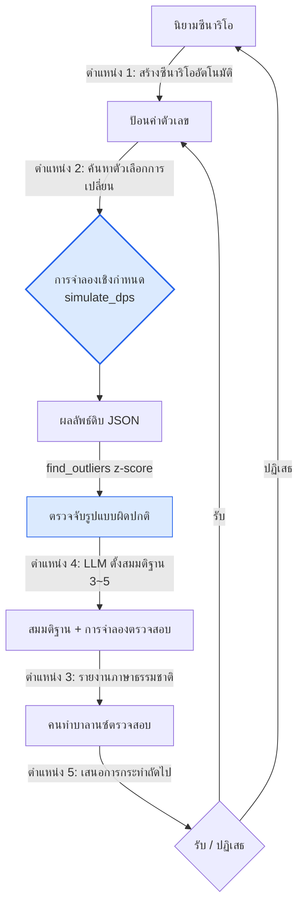

# 8.4 การจำลองสมดุลด้วยความช่วยเหลือของ AI

บ่ายวันศุกร์ เวลาสี่โมง การจำลอง PvP 5:5 อัตโนมัติของอัลฟาบิลด์จำนวน 1,200 แมตช์ก็จบลง ผลลัพธ์ JSON มีขนาด 4 เมกะไบต์ ที่ไหนสักแห่งในนั้นมีบรรทัดหนึ่งบันทึกไว้ว่า "อัตราชนะของทีม A 92%" ทั้งที่อัตราชนะเฉลี่ยอยู่ที่ 52% ผมใช้เวลา 40 นาทีในการตามหาบรรทัดนั้น และจนกระทั่งเลิกงานก็ยังหาสาเหตุไม่ได้ว่าทำไมถึงเป็นเช่นนั้น

การปรับสมดุลเป็นดินแดนของความเป็นเชิงกำหนด (deterministic) ใส่อินพุตเดียวกันลงในสูตรเดียวกัน ผลที่ได้ก็คือดาเมจเดียวกันเสมอ ด้วยเหตุนี้ตัวจำลองดาเมจจึงต้องเป็นโค้ด และเส้นโค้งรางวัลก็ต้องให้มนุษย์ลากด้วยมือ — ตรงนี้คือที่ที่ AI ไม่ควรย่างเข้ามา แต่ *รอบ ๆ* แกนเชิงกำหนดนั้น กล่าวคือการตามหาบรรทัดแปลก ๆ จากผลลัพธ์ 1,200 แมตช์ การตั้งสมมติฐานว่าทำไม การคัดกรองตัวเลือกว่าควรเปลี่ยนอะไร และการนำตัวเลือกเหล่านั้นกลับไปเข้าการจำลองอีกครั้ง — งานรอบ ๆ เหล่านี้แหละที่กินเวลาส่วนใหญ่ในวันหนึ่งของคนทำบาลานซ์ บทนี้คือเรื่องของการนำ AI มาประกบไว้รอบ ๆ นั้น โดยไม่แตะแกนแม้แต่นิดเดียว

## 8.4.1 แกนคือโค้ด รอบ ๆ คือแรงงานของมนุษย์

ตัวจำลองดาเมจรุ่นปี 2008 ที่เห็นในหัวข้อ 8.3 — ตัวที่แกนเชิงกำหนดรอดมาได้ทั้งที่เปลี่ยนเอนจินและเปลี่ยนบริษัทมาแล้วสามครั้ง — คือจุดเริ่มต้นของบทนี้ คุณสมบัติที่ว่าอินพุตเดียวกันได้เอาต์พุตเดียวกัน นั่นคือความเชื่อถือทั้งหมดของเครื่องมือปรับสมดุล หากรันบิลด์เดียวกันสองครั้งแล้วได้อัตราชนะต่างกัน เครื่องมือนั้นต้องถูกทิ้ง

เพราะฉะนั้นเมื่อวาดโครงของงานปรับสมดุลออกมา ก็จะได้รูปที่มีก้อนเชิงกำหนดอยู่ตรงกลาง และมีงานมือของมนุษย์ห้อยอยู่ที่ทางเข้าและทางออกของมัน ด้านล่างคือการแยกโครงนั้นออกมา — โดยใช้สีแบ่งดินแดนเชิงกำหนด (สีน้ำเงิน) ออกจากดินแดนที่มนุษย์และ AI เข้ามาแทรก (สีส้ม)

<svg viewBox="0 0 720 300" xmlns="http://www.w3.org/2000/svg" font-family="sans-serif" font-size="13">
  <rect x="0" y="0" width="720" height="300" fill="#fbfbfd"/>
  <!-- 결정론 코어 -->
  <rect x="270" y="110" width="180" height="80" rx="8" fill="#dbeafe" stroke="#2563eb" stroke-width="2"/>
  <text x="360" y="142" text-anchor="middle" fill="#1e3a8a" font-weight="bold">การจำลองเชิงกำหนด</text>
  <text x="360" y="162" text-anchor="middle" fill="#1e3a8a" font-size="11">simulate_dps()</text>
  <text x="360" y="178" text-anchor="middle" fill="#1e3a8a" font-size="11">อินพุต=เอาต์พุต, ห้าม AI</text>
  <!-- 입구: 시나리오/변경 -->
  <rect x="30" y="40" width="170" height="50" rx="6" fill="#ffedd5" stroke="#ea580c" stroke-width="1.5"/>
  <text x="115" y="60" text-anchor="middle" fill="#9a3412" font-size="11" font-weight="bold">ตำแหน่ง 1 สร้างซีนาริโอ</text>
  <text x="115" y="78" text-anchor="middle" fill="#9a3412" font-size="11">ตำแหน่ง 2 ค้นหาตัวเลือกการเปลี่ยน</text>
  <!-- 출구: 보고/이상/행동 -->
  <rect x="520" y="40" width="170" height="50" rx="6" fill="#ffedd5" stroke="#ea580c" stroke-width="1.5"/>
  <text x="605" y="58" text-anchor="middle" fill="#9a3412" font-size="11" font-weight="bold">ตำแหน่ง 3 รายงาน</text>
  <text x="605" y="74" text-anchor="middle" fill="#9a3412" font-size="11">ตำแหน่ง 4 ตีความความผิดปกติ</text>
  <text x="605" y="89" text-anchor="middle" fill="#9a3412" font-size="11">ตำแหน่ง 5 เสนอการกระทำ</text>
  <!-- 사람 -->
  <rect x="290" y="230" width="140" height="44" rx="6" fill="#ffedd5" stroke="#ea580c" stroke-width="1.5"/>
  <text x="360" y="257" text-anchor="middle" fill="#9a3412" font-weight="bold">คนทำบาลานซ์ (รับ/ปฏิเสธ)</text>
  <!-- 화살표 -->
  <line x1="200" y1="65" x2="285" y2="120" stroke="#94a3b8" stroke-width="1.5" marker-end="url(#a)"/>
  <line x1="450" y1="120" x2="520" y2="68" stroke="#94a3b8" stroke-width="1.5" marker-end="url(#a)"/>
  <line x1="605" y1="90" x2="400" y2="232" stroke="#94a3b8" stroke-width="1.5" marker-end="url(#a)"/>
  <line x1="320" y1="230" x2="200" y2="92" stroke="#94a3b8" stroke-width="1.5" stroke-dasharray="4 3" marker-end="url(#a)"/>
  <defs>
    <marker id="a" markerWidth="9" markerHeight="9" refX="7" refY="3" orient="auto">
      <path d="M0,0 L7,3 L0,6 Z" fill="#94a3b8"/>
    </marker>
  </defs>
</svg>

กล่องสีน้ำเงินกลางภาพเพียงกล่องเดียวคือโค้ด กล่องสีส้มอีกห้ากล่องที่เหลือล้วนเป็นแรงงานของมนุษย์ทั้งสิ้น ทั้งการตัดสิน การตีความ และการเขียน และที่ที่ AI เข้าไปได้ก็มีเพียงห้าจุดนี้เท่านั้น ทันทีที่สั่ง LLM ว่า "ช่วยคำนวณ DPS ของตัวละครนี้ที" ความเป็นเชิงไม่กำหนด (non-deterministic) ที่อินพุตเดียวกันได้ตัวเลขต่างกันก็จะรั่วเข้าสู่แกน และเครื่องมือนั้นจะสูญเสียความเชื่อถือไปภายในไม่ถึง 18 วัน

ดังนั้นกระดูกสันหลังของบทนี้จึงเรียบง่าย รักษาแกนให้เป็นโค้ดจนถึงที่สุด แล้วประกบ AI ไว้ที่ห้าจุดของทางเข้าและทางออก โดยเริ่มจากฝั่งทางออกที่ใช้แรงมือมากที่สุดก่อน — งานตามหาบรรทัดแปลก ๆ จากผลลัพธ์ 1,200 แมตช์ แล้วตั้งสมมติฐาน — แล้วค่อยทำให้เป็นอัตโนมัติ

## 8.4.2 บันทึกเซสชันจริง (worked transcript): ตามรอยบรรทัดอัตราชนะ 92%

กลับไปที่ 92% ในตอนต้นกันอีกครั้ง คราวนี้แทนที่คนจะเดินวนหา 40 นาที ตัวตรวจจับเชิงกำหนดจะคัดบรรทัดนั้นออกมา LLM ตั้งสมมติฐาน และการจำลองตรวจสอบอีกครั้ง — เราจะตามรอบหนึ่งวงตั้งแต่ต้นจนจบ โดยไม่ย่อ และคงผลลัพธ์ดิบที่เครื่องมือคายออกมาจริงไว้ตามเดิม

### ขั้นที่ 1 — การตรวจจับความผิดปกติเป็นงานของโค้ด (z-score)

การคัดแมตช์ที่ "ผิดปกติ" จาก 1,200 แมตช์นั้นไม่ใช่ LLM ทำ แต่เป็นสถิติ คำนวณค่าเฉลี่ยและส่วนเบี่ยงเบนมาตรฐานของแต่ละตัวชี้วัด แล้วแบ่งด้วยว่าห่างจากค่าเฉลี่ยกี่ส่วนเบี่ยงเบนมาตรฐาน (z-score) หากเกินค่าขีดแบ่งก็เป็น outlier นี่คือเชิงกำหนด ไม่มีช่องให้อาการหลอน (hallucination) เข้าแทรก

```python
def find_outliers(results, threshold=2.5):
    # results: ลิสต์ของดิกชันนารี {ชื่อตัวชี้วัด: ค่า} ต่อหนึ่งแมตช์จำลอง
    means, stds = compute_per_metric(results)   # ค่าเฉลี่ยและส่วนเบี่ยงเบนมาตรฐานต่อตัวชี้วัด
    outliers = []
    for r in results:
        for metric, value in r.items():
            if stds[metric] == 0:               # ความแปรปรวน 0 → เทียบไม่ได้, ข้าม
                continue
            z = abs(value - means[metric]) / stds[metric]
            if z > threshold:
                outliers.append((r["scenario_id"], metric, value, round(z, 2)))
    return sorted(outliers, key=lambda x: -x[3])  # เรียงจาก z มากไปน้อย
```

เมื่อรันแล้วจะได้ผลดังนี้ — จาก 1,200 แมตช์ ที่เกินค่าขีดแบ่ง 2.5 มีเพียง 3 รายการ

```
[("pvp_5v5_S0417", "team_a_winrate", 0.92, 4.1),
 ("pvp_5v5_S0417", "match_duration",  41.0, 2.9),
 ("pvp_5v5_S0822", "team_b_winrate", 0.18, 2.6)]
```

บรรทัดแรกที่ z มากที่สุด คืออัตราชนะ 0.92 (z=4.1) ของซีนาริโอ `pvp_5v5_S0417` นั่นคือบรรทัดเดียวกับที่ผมเดินวนหา 40 นาทีในตอนต้น แทนที่คนจะต้องเอาตาไล่ JSON ขนาด 4 เมกะ สถิติช่วยบีบให้เหลือ 3 รายการ ถึงตรงนี้คือแกน จากนี้ไปคือ AI

### ขั้นที่ 2 — LLM ตั้งสมมติฐาน (ห้ามวินิจฉัยฟันธง)

คราวนี้ส่งบรรทัดนั้นให้ LLM แต่ไม่ใช่ "ช่วยวินิจฉัยสาเหตุที" LLM เพียงโยน *สมมติฐานสาเหตุที่เป็นไปได้* ออกมาสองสามข้อด้วยความรู้เชิงโดเมน ส่วนอันไหนคือของจริงนั้นให้การจำลองเป็นผู้ตัดสินอีกครั้ง พรอมต์เต็มมีดังนี้

```
[outlier]
ซีนาริโอ: pvp_5v5_S0417 — PvP 5:5
องค์ประกอบทีม A: [refgame_archer_07, refgame_archer_07, refgame_archer_07,
            refgame_hybrid_21, refgame_hybrid_21]
ตัวชี้วัด: team_a_winrate 0.92 (ค่าเฉลี่ยรวม 0.52, z = 4.1)
ตัวชี้วัดประกอบ: match_duration 41.0s (ค่าเฉลี่ย 28s, z = 2.9)

[ข้อมูลที่เกี่ยวข้อง]
- refgame_archer_07: สนับสนุนระยะไกล, สกิล "ตราหมาย" — ดีบัฟเพิ่มดาเมจที่เป้าหมายได้รับ +12%
- refgame_hybrid_21: ดีลเลอร์ผสมประชิด/ระยะไกล, สกิล "ไล่ล่า" — เพิ่มความเร็วเคลื่อนที่ +20% เมื่อไล่ล่าเป้าหมายที่ติดดีบัฟ
- ตัวละครสองตัวนี้แทบไม่เคยถูกจัดอยู่ทีมเดียวกัน (ความถี่ของการจับคู่อยู่ท้าย 5%)

คำขอ:
จงเสนอสมมติฐานสาเหตุที่เป็นไปได้ของ outlier นี้ 3~5 ข้อ
- แต่ละสมมติฐานมีการจำลองเพิ่ม 1 บรรทัดสำหรับตรวจสอบ
- ห้ามวินิจฉัยฟันธง ให้เป็นสมมติฐานระดับ "อาจจะ~" เท่านั้น

รูปแบบการตอบ: ลิสต์มีหมายเลข ไม่มีคำนำและคำลงท้าย มีแต่สมมติฐาน
```

ขอคัดผลลัพธ์ดิบของ Claude มาตามเดิม (ไม่ย่อ ไม่จัดเรียง)

```
1. ดีบัฟ "ตราหมาย" กับบัฟความเร็วเคลื่อนที่ "ไล่ล่า" อาจสะสมแบบคูณกัน
   archer_07 จำนวน 3 ตัวปูตราหมายเต็มพื้นที่ → hybrid_21 ไล่ล่าได้ไม่ขาดสาย
   ก่อเป็นลูปป้อนกลับเชิงบวกขึ้นมา
   ตรวจสอบ: เปลี่ยน hybrid_21 เป็นดีลเลอร์ประชิดทั่วไปแล้วจำลองซีนาริโอเดิมซ้ำ

2. ดีบัฟตราหมาย +12% อาจถูกตั้งค่าผิดให้ซ้อนกันได้ (stackable)
   archer_07 จำนวน 3 ตัวอาจสะสมได้ถึง +36%
   ตรวจสอบ: บังคับ max_stack ของตราหมายเป็น 1 แล้วจำลองซ้ำ

3. ใน 5:5 องค์ประกอบระยะไกล 3 + แบบไล่ล่า 2 อาจเป็นโครงสร้างที่
   ปิดทางเข้าของฝ่ายตรงข้ามด้วยความเหนือกว่าด้านระยะโจมตีล้วน ๆ (ไม่เกี่ยวซินเนอร์จี, ตัวองค์ประกอบเองแข็งแกร่ง)
   ตรวจสอบ: ลดผลของดีบัฟตราหมายเป็น 0% แล้วจำลององค์ประกอบเดิมซ้ำ

4. เมื่อดูจาก match_duration ที่ยาวกว่าค่าเฉลี่ย (41s) อาจไม่ใช่ทีม A ชนะเร็ว
   แต่เป็นโครงสร้าง "ไม่แพ้ ทนไว้ แล้วพลิกกลับในช่วงท้าย"
   กรณีนี้สาเหตุอาจเป็นค่าสเกลลิงช่วงท้ายมากกว่าอัตราชนะ
   ตรวจสอบ: ดึงเฉพาะเส้นโค้งดาเมจสะสม ณ จุด 60 วินาทีมาเทียบต่างหาก

5. (ความน่าจะเป็นต่ำ) อคติของซีดจำลอง — เฉพาะซีด S0417 ที่อาจให้ทีม A
   ออกก่อนซ้ำ ๆ มีความเป็นไปได้ว่าเป็นสิ่งแปลกปลอมทางสถิติ (artifact)
   ตรวจสอบ: จำลององค์ประกอบเดิมด้วยซีด 50 ตัวแล้วตรวจความแปรปรวนของอัตราชนะ
```

การหยุดตรงนี้สำคัญ การที่สมมติฐานข้อที่ห้าทิ้งความสงสัยในตัวเองไว้ว่า "อันนี้อาจเป็นแค่อคติของซีดก็ได้" — นี่คือเอาต์พุตที่ดี หาก LLM ฟันธงว่า "สาเหตุคือบั๊กการซ้อนตราหมาย" กลับต้องสงสัยเอาต์พุตนั้น ในงานปรับสมดุล หน้าที่ของ LLM ไม่ใช่การวินิจฉัย แต่คือ *การบีบพื้นที่การค้นหาให้แคบลง*

### ขั้นที่ 3 — นำตัวเลือกการเปลี่ยนเข้าการจำลอง (ขนานกัน)

สมมติฐานทั้งห้ามีการจำลองสำหรับตรวจสอบห้อยติดมาข้อละหนึ่งบรรทัด สิ่งนี้ไม่ใช่ให้คนรันทีละข้อ แต่รวมตัวเลือกการเปลี่ยนแล้วโยนเข้าไปแบบขนาน แกนหลักอย่าง `simulate_dps` มีรูปร่างที่รันได้จริงดังนี้ — คือแก่นของฟังก์ชันเชิงกำหนดที่เก่าแก่ 18 ปีนั้น

```python
def simulate_dps(attacker, target, formula, ticks=600, seed=0):
    """จำลองการต่อสู้หนึ่งคู่แบบเชิงกำหนด ถ้า (อินพุต, seed) เดียวกันก็ได้เอาต์พุตเดียวกัน"""
    rng = Rng(seed)                     # ตรึงซีด → ทำซ้ำได้
    hp = target.hp
    total_damage = 0.0
    for t in range(ticks):              # สมมติ 1 tick = 0.1 วินาที
        # ค่าสัมประสิทธิ์ป้องกัน: สูตรเชิงกำหนด (LLM ไม่เป็นคนสร้าง)
        def_factor = target.defense / (target.defense + formula.def_const)
        raw = attacker.atk * (1 - def_factor)
        # คริติคอล: อิงซีด → ถ้า seed เดียวกันก็ได้จังหวะคริเดียวกัน
        if rng.roll() < attacker.crit_rate:
            raw *= attacker.crit_mult
        # ดีบัฟ (เช่นตราหมาย) ถูกป้อนเข้ามาจาก formula แบบเชิงกำหนด
        raw *= formula.debuff_multiplier(attacker, target, t)
        hp -= raw
        total_damage += raw
        if hp <= 0:
            return {"ttk": t * 0.1, "dps": total_damage / ((t + 1) * 0.1)}
    return {"ttk": None, "dps": total_damage / (ticks * 0.1)}  # ฆ่าไม่ลงในเวลา


def run_candidates(base_scenario, candidates, seeds=range(50)):
    """จำลองตัวเลือกการเปลี่ยนต่อสมมติฐานแบบขนาน 50 ซีด เก็บความแปรปรวนของ winrate กลับมาด้วย"""
    out = {}
    for name, patch in candidates.items():           # patch = เขียนทับ formula บางส่วน
        scen = base_scenario.with_patch(patch)
        wins = [simulate_match(scen, formula=scen.formula, seed=s) for s in seeds]
        out[name] = {
            "winrate": mean(w["team_a_won"] for w in wins),
            "winrate_std": pstdev(w["team_a_won"] for w in wins),  # สำหรับตรวจสอบสมมติฐาน 5
        }
    return out
```

ย้ายสมมติฐานเข้าดิกชันนารี `candidates` แล้วรันรวดเดียว

```python
candidates = {
    "ฐาน(ไม่เปลี่ยน)":        {},
    "สมมติฐาน1_เปลี่ยนhybrid":      {"team_a[3:5]": "refgame_melee_03"},
    "สมมติฐาน2_ตราหมาย_max_stack1": {"skill.ตราหมาย.max_stack": 1},
    "สมมติฐาน3_ตราหมาย_ผล0":      {"skill.ตราหมาย.debuff": 0.0},
    "สมมติฐาน5_ตรวจการกระจายซีด":    {},  # องค์ประกอบเดิม, ต่างแค่ seeds 50 ตัว
}
result = run_candidates(scenario_S0417, candidates, seeds=range(50))
```

ผลลัพธ์ (เอาต์พุตในรูปแบบการรันจริง):

```
ฐาน(ไม่เปลี่ยน)        winrate=0.91  std=0.04   ← ไม่ใช่อคติของซีด (ปฏิเสธสมมติฐาน5)
สมมติฐาน1_เปลี่ยนhybrid      winrate=0.74  std=0.06
สมมติฐาน2_ตราหมาย_max_stack1 winrate=0.63  std=0.05   ← ตกลงมากที่สุด
สมมติฐาน3_ตราหมาย_ผล0       winrate=0.55  std=0.05   ← กลับมาใกล้ค่าเฉลี่ย
```

ลำดับที่อ่านก็คือการวินิจฉัยนั่นเอง รันฐานด้วย 50 ซีดอีกครั้งก็ยังได้อัตราชนะ 0.91 ความแปรปรวน 0.04 — สมมติฐาน 5 (อคติของซีด) ถูกปฏิเสธ พอลดผลของตราหมายเป็น 0 ก็ตกมาที่ 0.55 ใกล้ค่าเฉลี่ย — สาเหตุคือสายดีบัฟตราหมายใช่แล้ว และเมื่อมัด max_stack เป็น 1 อัตราชนะตกลงมากที่สุดถึง 0.63 ดังนั้นแก่นจึงเป็น **สมมติฐาน 2 — ดีบัฟตราหมายซ้อนกันจน archer_07 จำนวน 3 ตัวสะสมได้ถึง +36%** จากห้าตัวเลือกที่ LLM โยนมา คนไม่ได้ตรวจสอบครบทั้งห้า แต่สถิติรันเพียงสามก็ตัดสินได้

### ขั้นที่ 4 — มนุษย์เป็นผู้รับ และบันทึกการตัดสินนั้น

ตรงนี้สิ่งที่ LLM ทำไม่ใช่การ *พูด* ว่า "การซ้อนตราหมายคือบั๊ก" แต่เป็นแค่การ *นำสมมติฐานนั้นขึ้นไปอยู่ในรายการตัวเลือก* เท่านั้น การรับนั้นคนทำบาลานซ์ที่ดูผลการจำลองเป็นผู้ทำ — "ตรึง max_stack ของตราหมายไว้ที่ 1 อัตราชนะขององค์ประกอบ archer_07 เดี่ยวยังอยู่ที่ 0.63 ซึ่งสูงกว่าค่าเฉลี่ย (0.52) อยู่ ดังนั้นในบิลด์ถัดไปจะปรับค่าดีบัฟตราหมายจาก 12%→9% เพิ่มเติมแล้ววัดผลใหม่"

การตัดสินนี้มนุษย์เป็นผู้ลงมือ และเหตุผลของมัน (ตรวจจับ z=4.1 → 5 สมมติฐาน → 3 การจำลอง → ยืนยันสมมติฐาน 2) ถูกบันทึกไว้เป็นหนึ่งบรรทัด แกนเชิงกำหนดเป็นโค้ดจนถึงที่สุด ส่วน LLM เพียงแค่เปลี่ยนการเดินวนหา 40 นาทีให้กลายเป็นสมมติฐานห้าบรรทัดเท่านั้น มันไม่ได้ก้าวเข้าไปในแกนแม้แต่ก้าวเดียว

## 8.4.3 ห้าตำแหน่ง และวงจร

บันทึกเซสชันจริงข้างต้นที่จริงแล้วเป็นการเหยียบสามในห้าตำแหน่ง (ตรวจจับความผิดปกติ ค้นหาการเปลี่ยน และตีความความผิดปกติ) พร้อมกัน เมื่อคลี่ห้าตำแหน่งออกเป็นวงจรก็จะหมุนแบบนี้



โหนดสีน้ำเงินสองโหนด (การจำลอง, การตรวจจับ z-score) เท่านั้นที่เป็นเชิงกำหนด ป้ายกำกับบนลูกศรที่เหลือ — ตำแหน่ง 1·2·3·4·5 — คือจุดที่ AI เข้าประกบ ทุกครั้งที่วงจรหมุนครบรอบ การเปลี่ยนที่ถูกรับมาก็จะกลับเข้าไปเป็นการป้อนค่าตัวเลขแล้วเข้าการจำลองครั้งถัดไป หากคนหมุนลูปนี้ด้วยมือ หนึ่งรอบกินเวลาหนึ่งวัน แต่ถ้าหมุนด้วยความช่วยเหลือของ AI ก็ใช้เวลาไม่กี่ชั่วโมง

ขอชี้ห้าตำแหน่งทีละจุดสั้น ๆ

**ตำแหน่ง 1 — สร้างซีนาริโออัตโนมัติ** ให้คอนเซ็ปต์หนึ่งบรรทัดอย่าง "ศึกยึดพื้นที่ 3:3 ยึดธง 3 อันภายใน 1 นาทีคือชนะ เกิดใหม่ 10 วินาที" พร้อม yaml ซีนาริโอเดิมหนึ่งหรือสองไฟล์ LLM ก็จะเติม yaml ซีนาริโอใหม่ด้วยสกีมาเดียวกัน คนทำบาลานซ์ตรวจสอบแค่ "มันใส่กฎที่ไม่มีในคอนเซ็ปต์เข้ามาเองหรือเปล่า" จาก 1\~2 ชั่วโมงที่เคยเขียน yaml จากกระดาษเปล่าก็ลดเหลือตรวจสอบ 15 นาที

**ตำแหน่ง 2 — ค้นหาตัวเลือกการเปลี่ยน** ดิกชันนารี `candidates` ในบันทึกเซสชันจริงข้างต้นก็คือสิ่งนี้ ต่อคำถาม "ถ้าจะเพิ่มอัตรารอดของแทงก์ +49% ต้องไปแตะตรงไหน" LLM โยนตัวเลือกออกมาห้าข้อ (base_def +50, ปรับ def_const ฯลฯ) แล้วเอาตัวเลือกทั้งหมดเข้าการจำลองเพื่อเลือกอันที่มีผลข้างเคียงน้อยที่สุด ตัวเลือกคือสมมติฐาน การรับคือการจำลอง นี่คือจุดที่ต้องจัดการอย่างระมัดระวังที่สุด — เพราะตัวเลือกที่ผิดจะกินเวลาตรวจสอบ

**ตำแหน่ง 3 — รายงานภาษาธรรมชาติ** ดึงตัวชี้วัดจาก raw JSON ของการจำลองด้วยสคริปต์ (เชิงกำหนด) แล้วส่งเฉพาะตัวชี้วัดนั้น + บริบทการเปลี่ยนให้ LLM เขียน "หนึ่งหน้าที่จะถือเข้าประชุม" การเปลี่ยนแปลงสำคัญ 3\~5 บรรทัด, ตัวละครที่ได้รับผลกระทบ TOP 5, มาตรการต่อเนื่อง 2\~3 ข้อ ตอกย้ำว่าห้ามใช้ตัวเลขนอกเหนือจากตัวชี้วัดที่ให้ไป จากการจัดระเบียบ raw 30 นาทีก็กลายเป็นตรวจสอบ 5 นาที

**ตำแหน่ง 4 — ตีความความผิดปกติ** ขั้นที่ 2\~3 ข้างต้นคือสิ่งนี้ LLM แปะสมมติฐาน 3\~5 ข้อให้กับ outlier ที่ z-score คัดมา การห้ามวินิจฉัยฟันธงคือเส้นชีวิตของตำแหน่งนี้

**ตำแหน่ง 5 — เสนอการกระทำถัดไป** เมื่อวิเคราะห์เสร็จก็ทำ "มาตรการทันทีในบิลด์นี้ / ติดตาม 1 สัปดาห์ / ตัวเลือกทบทวนใหม่หลัง 1 สัปดาห์" เป็นเช็กลิสต์พร้อมลำดับความสำคัญ มันเป็นตาข่ายนิรภัยที่ป้องกันไม่ให้คนทำบาลานซ์ลืมการตัดสินใจ ไม่ได้มาแทนการตัดสินใจเอง

## 8.4.4 เริ่มจากตรงไหน และไปถึงแค่ไหน

การเปิดทั้งห้าตำแหน่งพร้อมกันคือความล้มเหลวที่พบบ่อยที่สุด ให้เปิดจากฝั่งทางออกที่ผลมากและความเสี่ยงน้อยก่อน

<svg viewBox="0 0 720 330" xmlns="http://www.w3.org/2000/svg" font-family="sans-serif" font-size="12">
  <rect x="0" y="0" width="720" height="330" fill="#fbfbfd"/>
  <text x="360" y="26" text-anchor="middle" font-weight="bold" font-size="14" fill="#0f172a">เมทริกซ์ ROI ↔ ความเสี่ยงในการนำมาใช้ (ขวาบน = ก่อน)</text>
  <!-- 축 -->
  <line x1="90" y1="290" x2="680" y2="290" stroke="#475569" stroke-width="1.5"/>
  <line x1="90" y1="290" x2="90" y2="50" stroke="#475569" stroke-width="1.5"/>
  <text x="680" y="308" text-anchor="end" fill="#475569">ROI สูง →</text>
  <text x="78" y="55" text-anchor="end" fill="#475569" transform="rotate(-90 78 55)">ความเสี่ยงต่ำ ↑</text>
  <!-- 점들: x=ROI, y=안전(위로 갈수록 안전) -->
  <!-- 위치3 보고서: ROI 매우높음, 위험 낮음 -->
  <circle cx="600" cy="100" r="26" fill="#bbf7d0" stroke="#16a34a" stroke-width="2"/>
  <text x="600" y="98" text-anchor="middle" fill="#14532d" font-weight="bold">ตำแหน่ง3</text>
  <text x="600" y="113" text-anchor="middle" fill="#14532d" font-size="10">รายงาน ①</text>
  <!-- 위치4 이상해석: ROI 높음, 위험 보통 -->
  <circle cx="520" cy="150" r="26" fill="#bbf7d0" stroke="#16a34a" stroke-width="2"/>
  <text x="520" y="148" text-anchor="middle" fill="#14532d" font-weight="bold">ตำแหน่ง4</text>
  <text x="520" y="163" text-anchor="middle" fill="#14532d" font-size="10">ตีความความผิดปกติ ②</text>
  <!-- 위치1 시나리오: ROI 높음, 위험 낮음 -->
  <circle cx="470" cy="110" r="26" fill="#fde68a" stroke="#d97706" stroke-width="2"/>
  <text x="470" y="108" text-anchor="middle" fill="#78350f" font-weight="bold">ตำแหน่ง1</text>
  <text x="470" y="123" text-anchor="middle" fill="#78350f" font-size="10">ซีนาริโอ ③</text>
  <!-- 위치5 행동제안: ROI 보통, 위험 낮음 -->
  <circle cx="350" cy="120" r="26" fill="#fde68a" stroke="#d97706" stroke-width="2"/>
  <text x="350" y="118" text-anchor="middle" fill="#78350f" font-weight="bold">ตำแหน่ง5</text>
  <text x="350" y="133" text-anchor="middle" fill="#78350f" font-size="10">เสนอการกระทำ ④</text>
  <!-- 위치2 변경제안: ROI 보통, 위험 높음 -->
  <circle cx="300" cy="235" r="26" fill="#fecaca" stroke="#dc2626" stroke-width="2"/>
  <text x="300" y="233" text-anchor="middle" fill="#7f1d1d" font-weight="bold">ตำแหน่ง2</text>
  <text x="300" y="248" text-anchor="middle" fill="#7f1d1d" font-size="10">เสนอการเปลี่ยน ⑤</text>
  <text x="300" y="278" text-anchor="middle" fill="#991b1b" font-size="10">ระมัดระวังที่สุด, ทีหลังสุด</text>
</svg>

ตัวเลขในวงกลม (①\~⑤) คือลำดับการนำมาใช้ **ตำแหน่ง 3 (รายงาน)** และ **ตำแหน่ง 4 (ตีความความผิดปกติ)** อยู่ขวาบน — จุดที่ ROI (Return on Investment, ผลตอบแทนเทียบกับการลงทุน) สูงและความเสี่ยงต่ำ — จึงเปิดก่อน เพียงเดินสองตัวนี้ ปริมาณงานที่ประมวลได้ก็เพิ่มขึ้น 2\~3 เท่า และผลของการนำมาใช้กว่า 70% ก็ถูกเก็บกลับมาจากตรงนี้ **ตำแหน่ง 2 (เสนอการเปลี่ยน)** อยู่จุดสีแดงขวาล่าง ตัวเลือกที่ผิดอาจกินเวลาตรวจสอบ จึงต้องเปิดอย่างระมัดระวังที่สุดเป็นลำดับสุดท้าย ทุกทีมก็ไม่จำเป็นต้องเปิดครบทั้งห้า — เพียงตำแหน่ง 3 และ 4 ก็ทำให้วันหนึ่งของคนทำบาลานซ์คนเดียวเปลี่ยนไปแล้ว

ความรู้สึกตามจริงของระยะเวลาในการนำมาใช้เป็นแบบนี้ (เป็นการประมาณของผู้เขียน ยังไม่ได้ตรวจสอบ — แปรผันอย่างมากตามขนาดทีมและความสุกของเครื่องมือ) ตำแหน่ง 3 ใช้ 1\~2 สัปดาห์, เพิ่มตำแหน่ง 4 อีก 2 สัปดาห์, เพิ่มตำแหน่ง 1 อีกหนึ่งเดือน, เพิ่มตำแหน่ง 5 อีก 2 สัปดาห์, ส่วนตำแหน่ง 2 อยู่ท้ายสุด 1\~2 เดือน นี่คืออีกสำนวนหนึ่งของคำที่ว่าอย่าเปิดทั้งหมดในคราวเดียว

## 8.4.5 ผลและต้นทุน และกับดักที่พบบ่อยที่สุด

ในโปรเจกต์ A ของผู้เขียน หลังจากเปิดทั้งห้าตำแหน่งตลอด 6 เดือน การเปลี่ยนแปลงเป็นดังนี้ **ตัวเลขสัมบูรณ์เป็นการประมาณของผู้เขียน (ยังไม่ได้ตรวจสอบ) ให้เชื่อเฉพาะทิศทางและสัดส่วน** — ตัวคูณแปรผันอย่างมากตามสภาพแวดล้อม

| รายการ | ก่อนนำมาใช้ | หลังนำมาใช้ (ทิศทาง) |
|---|---|---|
| รอบการจำลองต่อสัปดาห์ของคนทำบาลานซ์ 1 คน | 5\~7 รายการ | 25\~35 รายการ (ราว 5 เท่า) |
| การเขียนรายงาน (ต่อรายการ) | 30\~40 นาที | ตรวจสอบ 5 นาที |
| การเขียนซีนาริโอ (ต่อรายการ) | 1\~2 ชั่วโมง | ตรวจสอบ 15 นาที |
| พบ outlier → วินิจฉัย | 1\~2 วัน | 4\~6 ชั่วโมง |
| ผลการวัด → ตัดสินใจเปลี่ยนครั้งถัดไป | 2\~3 วัน | 1 วัน |

สิ่งสำคัญตรงนี้ไม่ใช่ตัวคูณ แต่คือ *เวลาย้ายไปที่ไหน* เวลาของมนุษย์ขยับจากการจัดระเบียบข้อมูลดิบไปสู่การตัดสินใจ ไม่ใช่ว่าจำนวนคนทำบาลานซ์ลดลง แต่ขอบเขตเกมที่คนคนเดียวจัดการได้นั้นกว้างขึ้น หากอ่านปริมาณงาน 5 เท่าว่าเป็นการลดกำลังคน ความหมายของการนำมาใช้ก็จะไหลไปผิดทิศ

ต้นทุนนั้นน้อย เมื่อนำการแคชพรอมต์ (prompt caching) มาใช้ ต้นทุน LLM ต่อเดือนของทั้งห้าตำแหน่งอยู่ที่ราว $75 โดยประมาณ (เป็นการประมาณของผู้เขียน) และไม่เกิน 1/100 ของค่าจ้างคนทำบาลานซ์ 1 คน ดังนั้นตัวแปรตัดสินที่แท้จริงของการนำมาใช้จึงไม่ใช่ต้นทุน LLM แต่คือ *ภาระการตรวจสอบ* มีเวลาให้คนอ่านและกรองสมมติฐานกับรายงานที่ AI โยนมาหรือไม่ — นั่นคือเกณฑ์ในการเปิดหรือปิด

สุดท้าย ขอทิ้งกับดักไม่กี่อย่างที่เกิดซ้ำในที่เดิมตลอด 18 ปีไว้พร้อมใบสั่งยา

- **มอบหมายการจำลองเชิงกำหนดให้ LLM** → การจำลองคือโค้ด LLM อยู่แค่ทางเข้าและทางออก หากความเป็นเชิงไม่กำหนดรั่วเข้าแกน เครื่องมือจะตาย
- **เชื่อรายงานของ AI โดยไม่มี raw** → เก็บ raw JSON ไว้ด้วยกันเสมอ และหากสงสัยแม้แต่บรรทัดเดียวก็ลงไปตรวจที่ raw
- **ใส่ซีนาริโอเข้าการจำลองโดยไม่ตรวจสอบ** → ด่านตรวจสอบ yaml ละไม่ได้ หากรัน 1,200 แมตช์ทั้งที่มีกฎที่ไม่มีในคอนเซ็ปต์แทรกอยู่ 1,200 แมตช์นั้นก็ไร้ความหมายทั้งยวง
- **รับข้อเสนอการเปลี่ยนของ LLM โดยไม่ผ่านการจำลอง** → ทุกตัวเลือกเป็นแค่สมมติฐาน รับได้เฉพาะหลังจากตรวจสอบด้วย `run_candidates` แล้วเท่านั้น
- **รับเอาต์พุตที่ LLM ฟันธงว่า "สาเหตุคือ X" มาตรง ๆ** → การวินิจฉัยฟันธงคือสัญญาณให้สงสัย เอาต์พุตที่ดีคือ "อาจเป็น X ได้ + วิธีตรวจสอบ"

ที่ที่ของ AI ในงานปรับสมดุลนั้นชัดเจน อยู่นอกแกนเชิงกำหนด ห้าตำแหน่งที่คนเคยเดินวนหา รักษาแกนให้เป็นโค้ดจนถึงที่สุด แล้วเพียงปลดเปลื้องงานมือรอบ ๆ มันออก — นี่คือวิธีที่ตัวจำลองอายุ 18 ปีจะรอดมาได้แม้ในยุค AI

---

### สรุปประเด็นสำคัญของบท
- ประกบ AI ไว้เพียงห้าตำแหน่งนอกแกนการจำลองเชิงกำหนด และไม่ก้าวเข้าไปในแกนแม้แต่ก้าวเดียว
- การตรวจจับความผิดปกติคือโค้ด z-score, สมมติฐานคือ LLM, การวินิจฉัยคือการจำลองอีกครั้ง — การรับนั้นมนุษย์เป็นผู้ทำ
- เปิดจากรายงานและการตีความความผิดปกติที่ ROI สูงก่อน ส่วนข้อเสนอการเปลี่ยนเปิดอย่างระมัดระวังที่สุดเป็นลำดับสุดท้าย

### ลองทำดูหนึ่งบรรทัด (ฉบับย่อสำหรับคนเดียว)
- **setup**: เพียงสองฟังก์ชัน `simulate_dps` และ `find_outliers` จงตรึงซีดเพื่อให้มั่นใจว่าทำซ้ำได้
- **prompt**: outlier ที่ z มากที่สุดหนึ่งรายการ → "สมมติฐานที่เป็นไปได้ 3\~5 ข้อ + การจำลองตรวจสอบ 1 บรรทัดต่อข้อ, ห้ามวินิจฉัยฟันธง"
- **verify**: จำลองตัวเลือกการเปลี่ยนต่อสมมติฐานแบบขนาน 50 ซีดด้วย `run_candidates` → ตัวเลือกที่ทำให้กลับมาใกล้ค่าเฉลี่ยคือสาเหตุ จงให้คนเป็นผู้รับ และบันทึกเหตุผลไว้หนึ่งบรรทัด

### ตัวอย่างบทถัดไป
- 9.1 การออกแบบ UX/UI — เมื่อความแม่นยำของการตัดสินย้ายไปยังสาขาอื่น
