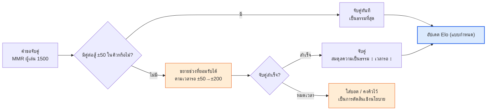
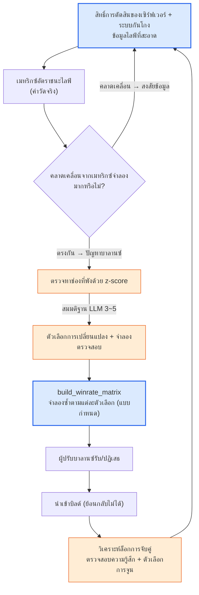

# 8.5 บาลานซ์ PvP·การแข่งขัน — เมทริกซ์อัตราชนะ·แมตช์เมกกิง·สิทธิ์การตัดสินของเซิร์ฟเวอร์

ตลอดสี่บทที่ผ่านมาในส่วนนี้ เราต่อสู้กับศัตรูเพียงตัวเดียวมาโดยตลอด บอสหนึ่งตัวถูกล้มลงได้ในกี่วินาที แทงก์รอดอยู่ได้ 89% หรือไม่ ทองรั่วไหลหรือเปล่า ทั้งหมดล้วนเป็นเรื่องของดาเมจ·การเอาตัวรอด·บัญชีรายรับรายจ่ายที่มุ่งไปยัง**เป้าหมายเดียว** แต่ใน PvP ศัตรูคือมนุษย์ มนุษย์ไม่ได้เคลื่อนไหวตามแพตเทิร์นที่กำหนดไว้แบบบอส อาชีพเดียวกันก็ยังเล่นด้วยฝีมือที่ต่างกัน และที่สำคัญที่สุดคือ *ต่างฝ่ายต่างจ้องจุดอ่อนของกันและกัน* นี่คือเหตุผลที่ว่าทำไมแม้บาลานซ์ฝั่ง PvE จะลึกซึ้งเพียงใด PvP ก็มักจะว่างเปล่าไปทั้งดุ้น เส้นโค้ง DPS (ดาเมจต่อวินาที) ต่อเป้าหมายเดียวนั้น 8.1\~8.4 ได้กล่าวถึงจนครบถ้วนแล้ว แต่ตาข่ายของความสัมพันธ์แบบ "กรรไกรชนะกระดาษ" นั้นเรายังไม่เคยวาดสักครั้ง

บทนี้จะมาเติมเต็มช่องว่างนั้น สิ่งที่จะกล่าวถึงมีสามอย่าง — **เมทริกซ์อัตราชนะ** ที่บรรจุความสัมพันธ์ระหว่างคลาส·การจัดทีม **แมตช์เมกกิง/MMR** ที่กำหนดว่าใครจะเจอกับใคร และ **สิทธิ์การตัดสินของเซิร์ฟเวอร์·ระบบกันโกง** ที่สามารถทำให้ตัวเลขทั้งหมดนั้นกลายเป็นเรื่องเท็จได้ และเส้นแบ่งที่ทอดผ่านส่วนนี้ทั้งหมดก็ยังคงเดิมในที่นี้ด้วย สูตรการต่อสู้เป็นแบบกำหนด (deterministic) ส่วนการจับคู่และการตรวจหาความสัมพันธ์ของอาชีพเป็น AI ช่วย ไม่คลาดเคลื่อนไปแม้แต่ก้าวเดียว

---

## 8.5.1 สิ่งเดียวที่ทำให้ PvP ต่างจาก PvE

ใน PvE ความแข็งแกร่งของตัวละครคือ**ค่าสัมบูรณ์** ถ้านักดาบมี DPS 800 ก็คือ 800 และบอสก็รับ 800 นั้นไปตรง ๆ แต่ใน PvP ความแข็งแกร่งเป็นแบบ**สัมพัทธ์** ค่า 800 ของนักดาบเพียงพอต่อนักธนู แต่อาจถูกหั่นลงเหลือ 560 จนไม่พอสำหรับทหารโล่ที่ลดความเสียหายที่ตนได้รับลง 30% ความแข็งแกร่งของตัวละครเดียวกันเปลี่ยนไป *ตามว่าคู่ต่อสู้เป็นใคร* สิ่งเดียวนี้เองที่ทำให้บาลานซ์ PvP กลายเป็นปัญหาที่ต่างจาก PvE โดยพื้นฐาน

ด้วยเหตุนี้ หน่วยของบาลานซ์ PvP จึงไม่ใช่ตัวเลขของตัวละครหนึ่งตัว แต่เป็น**ความสัมพันธ์ของหนึ่งคู่** อัตราชนะของ "นักดาบ vs นักธนู" และอัตราชนะของ "นักดาบ vs ทหารโล่" ต่างก็มีอยู่แยกกัน และเมื่อรวบรวมความสัมพันธ์เหล่านี้ทั้งหมดเข้าด้วยกันก็จะกลายเป็นตารางหนึ่งตาราง ทั้งแกนนอนและแกนตั้งบรรจุรายชื่อคลาสชุดเดียวกัน และในแต่ละช่องจะเขียน "ความน่าจะเป็นที่แถวจะชนะคอลัมน์" ไว้ นี่คือ**เมทริกซ์อัตราชนะ** ถ้า PvE มีเส้นโค้ง DPS แล้ว PvP ก็มีเมทริกซ์นี้

<svg viewBox="0 0 660 300" xmlns="http://www.w3.org/2000/svg" font-family="sans-serif" font-size="13">
  <rect x="0" y="0" width="660" height="300" fill="#ffffff"/>
  <text x="330" y="28" text-anchor="middle" font-weight="bold" font-size="14" fill="#0f172a">PvE คือค่าสัมบูรณ์ PvP คือความสัมพันธ์</text>
  <!-- PvE side -->
  <rect x="30" y="60" width="120" height="60" rx="8" fill="#eaf2fb" stroke="#2c6fbb" stroke-width="1.5"/>
  <text x="90" y="86" text-anchor="middle" fill="#2c6fbb" font-weight="bold">นักดาบ</text>
  <text x="90" y="106" text-anchor="middle" fill="#333" font-size="11">DPS 800</text>
  <line x1="150" y1="90" x2="210" y2="90" stroke="#888" stroke-width="1.5" marker-end="url(#ph)"/>
  <rect x="210" y="60" width="120" height="60" rx="8" fill="#f3f4f6" stroke="#6b7280" stroke-width="1.5"/>
  <text x="270" y="86" text-anchor="middle" fill="#374151" font-weight="bold">บอส</text>
  <text x="270" y="106" text-anchor="middle" fill="#333" font-size="11">รับ 800 ตรง ๆ</text>
  <text x="180" y="150" text-anchor="middle" fill="#2c6fbb" font-size="11">PvE: ความแข็งแกร่ง = ค่าสัมบูรณ์</text>
  <!-- PvP side -->
  <rect x="30" y="190" width="120" height="50" rx="8" fill="#fdecea" stroke="#c0392b" stroke-width="1.5"/>
  <text x="90" y="220" text-anchor="middle" fill="#c0392b" font-weight="bold">นักดาบ 800</text>
  <line x1="150" y1="200" x2="210" y2="200" stroke="#16a34a" stroke-width="1.5" marker-end="url(#ph)"/>
  <rect x="210" y="180" width="120" height="34" rx="6" fill="#dcfce7" stroke="#16a34a" stroke-width="1.2"/>
  <text x="270" y="202" text-anchor="middle" fill="#14532d" font-size="11">นักธนู → 800 (ใช้ได้)</text>
  <line x1="150" y1="215" x2="210" y2="232" stroke="#dc2626" stroke-width="1.5" marker-end="url(#ph)"/>
  <rect x="210" y="222" width="120" height="34" rx="6" fill="#fee2e2" stroke="#dc2626" stroke-width="1.2"/>
  <text x="270" y="244" text-anchor="middle" fill="#7f1d1d" font-size="11">ทหารโล่ → 560 (ไม่พอ)</text>
  <text x="200" y="284" text-anchor="middle" fill="#c0392b" font-size="11">PvP: ความแข็งแกร่ง = เปลี่ยนตามคู่ต่อสู้</text>
  <!-- matrix hint -->
  <rect x="400" y="60" width="230" height="196" rx="8" fill="#fbfbfd" stroke="#94a3b8" stroke-width="1.2"/>
  <text x="515" y="84" text-anchor="middle" fill="#0f172a" font-size="12" font-weight="bold">→ เมทริกซ์อัตราชนะ</text>
  <text x="515" y="106" text-anchor="middle" fill="#475569" font-size="11">ความน่าจะเป็นที่แถวชนะคอลัมน์</text>
  <text x="430" y="140" fill="#475569" font-size="11" font-family="monospace">       นักธนู โล่  เมจ</text>
  <text x="430" y="162" fill="#16a34a" font-size="11" font-family="monospace">นักดาบ .58  .42  .50</text>
  <text x="430" y="184" fill="#475569" font-size="11" font-family="monospace">นักธนู --   .55  .47</text>
  <text x="430" y="206" fill="#475569" font-size="11" font-family="monospace">โล่     --   --   .61</text>
  <text x="515" y="238" text-anchor="middle" fill="#94a3b8" font-size="10">(ตัวเลขเป็นตัวอย่าง — ไม่ใช่ค่าวัดจริง)</text>
  <defs>
    <marker id="ph" markerWidth="8" markerHeight="8" refX="6" refY="3" orient="auto">
      <path d="M0,0 L6,3 L0,6 Z" fill="#888"/>
    </marker>
  </defs>
</svg>

วิธีอ่านตารางทางขวานั้นเรียบง่าย ถ้าช่อง "นักดาบ vs ทหารโล่" เป็น 0.42 หมายความว่าความน่าจะเป็นที่นักดาบจะชนะทหารโล่คือ 42% นั่นคือทหารโล่เป็นฝ่ายได้เปรียบในความสัมพันธ์นี้ ถ้าทุกช่องใกล้เคียง 0.50 ก็จะเป็นความสมดุลที่สมบูรณ์แบบ แต่เกมแบบนั้นไม่สนุก ต้องมี**ความสัมพันธ์ที่หมุนวน** เหมือนเป่ายิ้งฉุบ การเลือกอาชีพจึงจะมีความหมาย ปัญหาจะเกิดเมื่อวงหมุนนั้นขาดตรงจุดใดจุดหนึ่ง จนเกิดช่องที่คลาสหนึ่งชนะทุกคลาส ถ้าแทงก์เมื่อตีสองคืออุบัติเหตุของ PvE แล้ว "ทหารโล่ vs ทุกอาชีพ อัตราชนะเกิน 60%" ก็คืออุบัติเหตุของ PvP

ตรงนี้มีสิ่งที่ต้องตอกย้ำไว้ก่อน ตัวเลขที่เติมในช่องเหล่านี้ (0.58, 0.42 ฯลฯ) ล้วนเป็น**ตัวอย่าง ไม่ใช่ค่าวัดจริง** แต่ละเกมมีจำนวนอาชีพ สกิล และเส้นสมดุลเป้าหมายที่ต่างกัน สิ่งที่ควรเชื่อถือในบทนี้ไม่ใช่ตัวเลข แต่เป็นโครงสร้างที่ว่า *เติมเมทริกซ์อย่างไร ตรวจสอบอย่างไร และ AI เข้าไปแนบกับจุดใดของการตรวจสอบนั้น*

---

## 8.5.2 สิ่งที่เติมเมทริกซ์คือการจำลอง ส่วนสิ่งที่อ่านมันคือ AI

การเติมหนึ่งช่องของเมทริกซ์อัตราชนะนั้นใช้เครื่องมือเดียวกับการจำลองแบบกำหนดที่เห็นใน 8.4 อย่างแม่นยำ เมื่อจำลองอัตโนมัติ "นักดาบ vs นักธนู" 1,000 ตา แล้วนับว่านักดาบชนะกี่ตา นั่นคืออัตราชนะของช่องนั้น ถ้ามีอาชีพ N อาชีพ ช่องก็จะมี N×N ช่อง และเมื่อรันแต่ละช่องช่องละ 1,000 ตา ตารางหนึ่งตารางก็จะถูกเติมจนเต็ม การจำลองนี้เป็นโค้ดไปจนสุดทาง — ถ้าให้ seed เดียวกัน ก็ต้องได้เมทริกซ์เดียวกันที่ทำซ้ำได้โดยไม่ผิดเพี้ยนแม้แต่ตัวเดียว เพราะอย่างนั้นคำพูดที่ว่า "บิลด์นี้ทหารโล่แข็งขึ้น" จึงจะไม่เป็นเรื่องเท็จ

ตรงนี้มีกับดักเฉพาะของ PvP อยู่หนึ่งอย่าง ในการจำลอง PvE ศัตรู (บอส) เป็นแพตเทิร์นตายตัว แต่ในการจำลอง PvP **คู่ต่อสู้ก็ต้องเลือกพฤติกรรมด้วย** จำเป็นต้องมีบอต (bot policy) ที่กำหนดว่านักดาบจะสู้อย่างไรอยู่ทั้งสองฝั่ง และถ้าบอตนี้โง่ เมทริกซ์ทั้งหมดก็จะกลายเป็นเรื่องเท็จ — ถ้าเอาบอตที่คอนโทรลห่วยมาชนกัน ก็จะได้เมทริกซ์ที่ "อาชีพที่ใช้สกิลแบบสะเปะสะปะ" เป็นฝ่ายชนะ ทั้งที่ในมือของผู้เล่นที่ชำนาญจริงผลอาจตรงกันข้ามได้ ด้วยเหตุนี้ เมทริกซ์ PvP จึงต้องมีหมายเหตุกำกับเสมอว่า "บอตนี้เลียนแบบการเล่นในระดับใด" โดยปกติบอตจะเขียนด้วยฮิวริสติก (พอคูลดาวน์ครบก็ใช้ พอ HP ต่ำกว่า 30% ก็ถอย ฯลฯ) และตัวฮิวริสติกนี้เองก็เป็นแบบกำหนด

เมื่อถ่ายแก่นของนโยบายบอตออกมาเป็นรูปแบบที่รันได้จริง ก็จะได้ออกมาเป็นแบบนี้ — เป็นฟังก์ชันที่เลือกพฤติกรรมเดียวกันเมื่ออินพุตเหมือนกัน โดยไม่มีช่องว่างให้อาการหลอน (hallucination) แทรกเข้ามา

```python
def bot_decide(me, enemy, cooldowns, t):
    """นโยบายบอตแบบกำหนด สถานะเดียวกันได้พฤติกรรมเดียวกัน LLM ไม่ได้เป็นคนสร้าง"""
    # 1) เอาตัวรอดก่อน: ถ้า HP ต่ำกว่า 30% ให้หลบ/ถอย
    if me.hp_ratio < 0.30 and cooldowns["escape"] <= 0:
        return Action("escape")
    # 2) สกิลแก้ทาง: ถ้าศัตรูไม่ได้ภูมิคุ้มกันดีบัฟ ให้ติดมาร์กก่อน
    if cooldowns["mark"] <= 0 and not enemy.has("debuff_immune"):
        return Action("mark", target=enemy)
    # 3) จัดการระยะ: ถ้าศัตรูประชิดเข้ามา ให้ถอยออกห่าง (อาชีพระยะไกล)
    if me.is_ranged and dist(me, enemy) < me.kite_range:
        return Action("reposition")
    # 4) อื่น ๆ: สกิลดาเมจสูงสุดที่คูลดาวน์ครบแล้ว
    return best_ready_damage_skill(me, cooldowns)


def simulate_pvp_match(class_a, class_b, formula, seed=0):
    """จำลองหนึ่งตาแบบ 1:1 เชิงกำหนด ดาเมจใช้สูตรของ 8.1 ตรง ๆ"""
    rng = Rng(seed)
    a, b = spawn(class_a), spawn(class_b)
    for t in range(MAX_TICKS):
        for me, foe in ((a, b), (b, a)):
            act = bot_decide(me, foe, me.cooldowns, t)
            apply_action(act, me, foe, formula, rng)   # formula = สูตรดาเมจแบบกำหนด
        if a.hp <= 0 or b.hp <= 0:
            break
    return {"winner": "a" if b.hp <= 0 else "b" if a.hp <= 0 else "draw",
            "duration": t * TICK}
```

สิ่งที่เติมเมทริกซ์ทั้งแผ่นจนเต็มก็คือลูปด้านนอกที่รันฟังก์ชันนี้ 1,000 ครั้งต่อหนึ่งช่อง

```python
def build_winrate_matrix(classes, formula, n=1000):
    matrix = {}
    for ca in classes:
        for cb in classes:
            if ca == cb:
                continue
            wins = sum(
                simulate_pvp_match(ca, cb, formula, seed=s)["winner"] == "a"
                for s in range(n)
            )
            matrix[(ca, cb)] = wins / n          # สัดส่วนที่ ca ชนะ cb
    return matrix
```

ถึงตรงนี้คือแกนกลาง เป็นโค้ดไปจนสุดทาง AI ไม่ได้เข้ามาแนบที่จุด *สร้าง* ตารางนี้ แต่แนบที่จุด *อ่าน* มัน ถ้า N เป็น 8 ช่องก็มี 56 ช่อง การที่คนต้องกวาดสายตาดูอัตราชนะ 56 ค่าเพื่อหาว่า "ตรงไหนพัง" ก็เป็นงานหนักแบบเดียวกับ JSON ขนาด 4 เมกะไบต์ตอนตีสอง ส่วนการเลือกช่องที่ผิดปกตินั้น การตรวจหาด้วย z-score ของ 8.4 ทำได้ตรง ๆ

```python
def find_broken_cells(matrix, low=0.40, high=0.60):
    """คัดช่องที่เบนออกจากเส้นสมดุล (0.5) มากเชิงกำหนด"""
    broken = []
    for (ca, cb), wr in matrix.items():
        if wr > high or wr < low:
            broken.append((ca, cb, round(wr, 2)))
    return sorted(broken, key=lambda x: abs(x[2] - 0.5), reverse=True)
```

เมื่อการตรวจหาคัดช่องให้แคบลงแล้ว ก็ส่งช่องนั้นต่อให้ LLM แต่มีระเบียบวินัยเดียวกับ 8.4 — **ห้ามวินิจฉัยฟันธง ให้แค่สมมติฐานและการจำลองเพื่อตรวจสอบเท่านั้น** ตัวอย่างเช่น ให้หนึ่งบรรทัด "ทหารโล่ vs เมจ 0.68 (z สูงสุด)" แล้วร้องขอแบบนี้

```
[ช่องที่พัง]
ทหารโล่ → เมจ อัตราชนะ 0.68 (เส้นสมดุล 0.50, z สูงสุดในเมทริกซ์)
ข้อมูลเสริม: ระยะเวลาเฉลี่ยของแมตช์นี้ 38s (ค่าเฉลี่ยรวม 22s)

[ข้อมูลที่เกี่ยวข้อง]
- ทหารโล่: พาสซีฟ "กำแพงเหล็ก" รับดาเมจ -30%, สกิลปิดปาก "ทุบโล่" (2 วินาที)
- เมจ: 70% ของดาเมจทั้งหมดกระจุกอยู่ในสกิลที่ต้องร่าย 1.5 วินาที
- ความถี่ในการเจอกันของสองอาชีพนี้อยู่อันดับต้นในคิวที่วัดจริง (คู่ยอดนิยม)

คำขอ: สมมติฐานสาเหตุที่เป็นไปได้ของการพังทลายในความสัมพันธ์นี้ 3~5 ข้อ + การจำลองตรวจสอบของแต่ละข้อ 1 บรรทัด
ห้ามวินิจฉัยฟันธง ให้แค่ระดับ "อาจเป็นไปได้ว่า~" เท่านั้น
```

LLM จะทำได้แค่โยนสมมติฐานที่ช่วยจำกัดพื้นที่การค้นหาให้แคบลง เช่น "อาจเป็นฟีดแบ็กเชิงบวกที่กำแพงเหล็ก -30% กับการปิดปาก 2 วินาทีซ้อนทับกัน จนเมจตายโดยไม่ได้ใส่สกิลร่ายหลักได้แม้แต่ครั้งเดียว / ตรวจสอบ: ลดระยะเวลาปิดปากเหลือ 1 วินาที แล้วจำลองช่องเดิมซ้ำ" ส่วนว่าอะไรคือของจริงนั้น ตัดสินด้วยการรัน `build_winrate_matrix` อีกครั้งตามแต่ละตัวเลือก การที่ LLM ดึงเอาเบาะแสที่ว่าระยะเวลาแมตช์เป็น 1.7 เท่าของค่าเฉลี่ยมาร้อยเข้ากับสมมติฐานด้วย — การเชื่อมโยงที่คนกวาดดู 56 ช่องแล้วพลาดได้ง่ายนั้น คือเวลาที่ AI ทำให้ได้คืน ณ จุดนี้

---

## 8.5.3 แมตช์เมกกิง: อีกหนึ่งบาลานซ์ที่บังหน้าความสัมพันธ์ของอาชีพ

ต่อให้ปรับเมทริกซ์อัตราชนะให้ลงตัวสมบูรณ์แบบ สาเหตุที่แท้จริงที่ผู้เล่นรู้สึกว่า "แพ้" ก็ยังอยู่ที่อื่น นั่นคือ **เจอกับใคร** ถ้าผู้เล่นที่มีฝีมือ 1500 ไปเจอผู้เล่นฝีมือ 2200 ต่อให้ความสัมพันธ์ของอาชีพเป็น 5:5 ผลก็ถูกกำหนดไว้แล้ว เพราะอย่างนั้นแมตช์เมกกิงจึงไม่ใช่แค่ฟังก์ชันของเซิร์ฟเวอร์ แต่เป็น**ส่วนหนึ่งของบาลานซ์** ถ้าเมทริกซ์รับผิดชอบความเป็นธรรมระหว่างอาชีพ แมตช์เมกกิงก็รับผิดชอบความเป็นธรรมระหว่างฝีมือ

เกมแข่งขันส่วนใหญ่มี MMR (Matchmaking Rating, คะแนนแมตช์เมกกิง) เป็นคะแนนซ่อนที่ชนะแล้วขึ้น แพ้แล้วลง และจับคู่ผู้ที่มีคะแนนใกล้เคียงกันเข้าด้วยกัน การอัปเดตคะแนนเป็นสูตรแบบกำหนด — Elo ถูกใช้กันแพร่หลายที่สุด และเป็นมาตรฐานสาธารณะ จึงเป็นหนึ่งในไม่กี่สูตรที่หนังสือเล่มนี้อ้างอิงได้

```
# Elo: สูตรอัปเดตมาตรฐานสาธารณะ (ไม่ใช่ค่าที่กุขึ้น)
expected_a = 1 / (1 + 10 ** ((rating_b - rating_a) / 400))
new_rating_a = rating_a + K * (score_a - expected_a)
#   score_a: ชนะได้ 1 แพ้ได้ 0
#   K: ค่าคงที่ความแรงของการอัปเดต (ค่าที่เกมเป็นผู้กำหนด ปกติเลือกในช่วง 16~40)
#   400, 10: ค่าคงที่ที่ตรึงอยู่ในนิยามของ Elo
```

ตัวสูตรนี้เองเป็นแบบกำหนด ไม่ใช่จุดที่ AI จะเข้าไป แต่ในแมตช์เมกกิงมี *ความตึงเครียด* หนึ่งอย่างที่แก้ไม่ตกด้วยสูตรแบบกำหนดเพียงอย่างเดียว นั่นคือการแลกเปลี่ยนระหว่าง **ความเป็นธรรม ↔ เวลารอคอย** ถ้าจับคู่เฉพาะคู่ต่อสู้ที่คะแนนเท่ากันเป๊ะ แมตช์ก็จะเป็นธรรม แต่ถ้าไม่มีคู่ต่อสู้แบบนั้นอยู่ในคิว ผู้เล่นก็ต้องรอ 10 นาที ถ้ายอมให้คะแนนต่างกันได้มากขึ้น ก็จะจับคู่ได้เร็วแต่แมตช์ก็จะไม่เป็นธรรม ยิ่งเป็นช่วงเวลาดึก อาชีพที่ไม่นิยม หรือช่วงคะแนนสูง ความตึงเครียดนี้ก็ยิ่งรุนแรง



มีแต่โหนดสีน้ำเงิน (อัปเดต Elo) เท่านั้นที่เป็นแบบกำหนด โหนดสีส้ม — จะขยายช่วงที่ยอมรับได้เมื่อไรและเท่าไร จะทำอะไรเมื่อหมดเวลา — คือจุดที่ AI ช่วยเข้าถึง แต่ในที่นี้ AI ก็ไม่ได้เป็นผู้ตัดสิน *การจับคู่แบบเรียลไทม์* นั่นเป็นลอจิกของเซิร์ฟเวอร์ที่ต้องรวดเร็วและทำซ้ำได้ จึงเป็นที่ของโค้ดอิงกฎ สิ่งที่ AI เข้ามาแนบคือ**การวิเคราะห์เพื่อจูน**กฎเหล่านั้น เป็นงานสรุปว่า "ในล็อกการจับคู่สัปดาห์ที่แล้ว คุณภาพแมตช์ (ความแปรปรวนของอัตราชนะ·เวลารอคอย) ของช่วงคะแนน·ช่วงเวลา·อาชีพใดที่แย่" และเสนอตัวเลือกว่า "ถ้าเปลี่ยนเส้นโค้งช่วงที่ยอมรับได้อย่างไร เวลารอคอยของช่วงใดจะลดลง" ตำแหน่ง 3 (รายงาน)·ตำแหน่ง 4 (ตีความความผิดปกติ)·ตำแหน่ง 2 (ค้นหาตัวเลือกการเปลี่ยนแปลง) ของ 8.4 ย้ายเวทีมาอยู่ที่ล็อกการจับคู่เท่านั้นเอง

ขอชี้จุดที่แมตช์เมกกิงเกี่ยวพันกับเมทริกซ์อัตราชนะไว้ด้วย ถ้าอัลกอริทึมการจับคู่ไม่คำนึงถึงอาชีพแล้วจับเฉพาะคะแนนให้ตรงกัน ช่องความสัมพันธ์ที่พังก็จะถูกเปิดโปงออกมาตรง ๆ ถ้าช่องที่ทหารโล่ชนะเมจ 68% ยังคงอยู่ แล้วการจับคู่มักจับสองอาชีพนี้มาเจอกันบ่อย ความรู้สึกพ่ายแพ้ที่ผู้เล่นเมจสัมผัสได้ก็จะสะสมมากกว่าตัวเลขในเมทริกซ์เสียอีก ด้วยเหตุนี้ การตรวจสอบเมทริกซ์กับการวิเคราะห์ล็อกการจับคู่จึงไม่ได้แยกกันหมุน แต่เป็น *ทางเข้าและทางออกของวงจรเดียวกัน* — แก้ช่องที่พังในเมทริกซ์ แล้วยืนยันในล็อกการจับคู่ว่าช่องนั้นถูกจับมาเจอกันจริงมากน้อยเพียงใด

---

## 8.5.4 สิทธิ์การตัดสินของเซิร์ฟเวอร์: ข้อตั้งต้นของบาลานซ์

ทุกเรื่องที่กล่าวมาจนถึงตอนนี้ — เมทริกซ์ MMR การจำลอง — ล้วนวางอยู่บนสมมติฐานหนึ่งอย่างโดยปริยาย นั่นคือ **ผลลัพธ์ที่ผู้เล่นรายงานเป็นความจริง** ใน PvE เรื่องนี้แทบไม่เป็นปัญหา เล่นล้มบอสคนเดียวจะไปหลอกใคร แต่ใน PvP มีคู่ต่อสู้ ชนะแล้วคะแนนขึ้น ดังนั้นจึง **เกิดแรงจูงใจที่จะโกง** เมื่อปรากฏไคลเอนต์ที่ปลอมแปลงดาเมจ ปลอมแปลงตำแหน่ง และเพิกเฉยต่อคูลดาวน์ขึ้นมา สูตรแบบกำหนดของ 8.1 ก็เป็นแบบกำหนดอยู่แค่บนกระดาษเท่านั้น บนเซิร์ฟเวอร์จริง นักดาบของใครบางคนกำลังใส่ดาเมจแรงกว่าสูตรเป็นสองเท่าอยู่

ด้วยเหตุนี้ กฎบาลานซ์ข้อแรกของเกมแข่งขันจึงมาก่อนเมทริกซ์ **อย่าให้ไคลเอนต์เป็นผู้กำหนดผลลัพธ์** การคำนวณดาเมจ การตัดสินคูลดาวน์ การตัดสินการเข้าเป้า — การคำนวณทุกอย่างที่แตะถึงบาลานซ์ เซิร์ฟเวอร์เป็นผู้ถือสิทธิ์การตัดสิน ไคลเอนต์ส่งมาแค่อินพุต (จะเคลื่อนที่ไปที่ใด ใช้สกิลใด) ส่วนว่าอินพุตนั้นตรงกับสูตรหรือไม่ คูลดาวน์ครบหรือยัง อยู่ในระยะหรือไม่ เซิร์ฟเวอร์เป็นผู้ตรวจสอบซ้ำทั้งหมด "ดาเมจ 999" ที่ไคลเอนต์ส่งมาเซิร์ฟเวอร์จะเพิกเฉย และนำมาใช้แค่ค่าที่เซิร์ฟเวอร์คำนวณด้วยสูตรเท่านั้น

<svg viewBox="0 0 680 270" xmlns="http://www.w3.org/2000/svg" font-family="sans-serif" font-size="12">
  <rect x="0" y="0" width="680" height="270" fill="#ffffff"/>
  <text x="340" y="26" text-anchor="middle" font-weight="bold" font-size="14" fill="#0f172a">สิทธิ์การตัดสินของเซิร์ฟเวอร์ = ผู้บังคับใช้สูตรบาลานซ์เพียงผู้เดียว</text>
  <!-- client -->
  <rect x="40" y="80" width="160" height="110" rx="8" fill="#fdecea" stroke="#c0392b" stroke-width="1.5"/>
  <text x="120" y="106" text-anchor="middle" fill="#c0392b" font-weight="bold">ไคลเอนต์</text>
  <text x="120" y="128" text-anchor="middle" fill="#333">ส่งแค่อินพุต</text>
  <text x="120" y="148" text-anchor="middle" fill="#666" font-size="11">"ใช้สกิล1, พิกัด(x,y)"</text>
  <text x="120" y="170" text-anchor="middle" fill="#991b1b" font-size="11">กำหนดผลลัพธ์ไม่ได้</text>
  <!-- arrow -->
  <line x1="200" y1="120" x2="290" y2="120" stroke="#888" stroke-width="1.5" marker-end="url(#sh)"/>
  <text x="245" y="112" text-anchor="middle" fill="#666" font-size="10">อินพุต</text>
  <line x1="290" y1="155" x2="200" y2="155" stroke="#16a34a" stroke-width="1.5" marker-end="url(#sh)"/>
  <text x="245" y="172" text-anchor="middle" fill="#16a34a" font-size="10">ผลลัพธ์ที่ตรวจสอบแล้ว</text>
  <!-- server -->
  <rect x="290" y="70" width="200" height="130" rx="8" fill="#dbeafe" stroke="#2563eb" stroke-width="2"/>
  <text x="390" y="96" text-anchor="middle" fill="#1e3a8a" font-weight="bold">เซิร์ฟเวอร์ (สิทธิ์ตัดสิน)</text>
  <text x="390" y="118" text-anchor="middle" fill="#1e3a8a" font-size="11">ตรวจคูลดาวน์/ระยะ</text>
  <text x="390" y="138" text-anchor="middle" fill="#1e3a8a" font-size="11">ดาเมจ = สูตร(8.1)</text>
  <text x="390" y="158" text-anchor="middle" fill="#1e3a8a" font-size="11">แบบกำหนด · บังคับใช้</text>
  <text x="390" y="184" text-anchor="middle" fill="#1e40af" font-size="11">เพิกเฉย "ดาเมจ 999"</text>
  <!-- anticheat / logs -->
  <rect x="540" y="80" width="110" height="110" rx="8" fill="#ffedd5" stroke="#ea580c" stroke-width="1.5"/>
  <text x="595" y="106" text-anchor="middle" fill="#9a3412" font-weight="bold" font-size="12">ล็อกความผิดปกติ</text>
  <text x="595" y="128" text-anchor="middle" fill="#9a3412" font-size="11">อินพุตที่เป็นไปไม่ได้</text>
  <text x="595" y="146" text-anchor="middle" fill="#9a3412" font-size="11">ตรวจหาแพตเทิร์น</text>
  <text x="595" y="170" text-anchor="middle" fill="#9a3412" font-size="11">AI ช่วยได้</text>
  <line x1="490" y1="135" x2="540" y2="135" stroke="#888" stroke-width="1.5" marker-end="url(#sh)"/>
  <defs>
    <marker id="sh" markerWidth="8" markerHeight="8" refX="6" refY="3" orient="auto">
      <path d="M0,0 L6,3 L0,6 Z" fill="#888"/>
    </marker>
  </defs>
</svg>

ถ้าสิทธิ์การตัดสินของเซิร์ฟเวอร์พังลง งานบาลานซ์ทั้งหมดก็จะกลายเป็นเรื่องเท็จ ต่อให้ปรับเมทริกซ์อัตราชนะให้ลงตัวอย่างประณีตเพียงใด ถ้าในเซิร์ฟเวอร์จริงมีอาชีพหนึ่งปลอมแปลงดาเมจ เมทริกซ์นั้นก็เป็นเพียงคำสัญญาบนกระดาษ ด้วยเหตุนี้ ระบบกันโกงจึงไม่ใช่งานความปลอดภัยที่แยกต่างหาก แต่เป็น**ปัญหาความน่าเชื่อถือของข้อมูลบาลานซ์** เมื่ออัตราชนะในเซิร์ฟเวอร์จริงคลาดเคลื่อนจากเมทริกซ์จำลองมาก สิ่งแรกที่ควรสงสัยไม่ใช่ "สูตรผิดหรือเปล่า" แต่ควรเป็น "ข้อมูลนี้สะอาดหรือเปล่า"

ตรงนี้ที่ของ AI ก็ชัดเจนขึ้นอีกครั้ง ตัวการตัดสินว่าโกง — "ทำให้อินพุตนี้เป็นโมฆะ" — เป็นงานของกฎแบบกำหนด อินพุตที่เคลื่อนที่ 30 เมตรในเวลา 0.1 วินาทีนั้นเป็นไปไม่ได้ทางกายภาพ จึงสกัดด้วยกฎ อินพุตเดียวกันต้องได้คำตัดสินเดียวกัน และต้องไม่ทำให้เกิดการแบนที่ไม่เป็นธรรม จึงวาง LLM เชิงความน่าจะเป็นไว้ตรงนี้ไม่ได้ ในทางกลับกัน **งานคัดแพตเทิร์นผิดปกติออกมาเป็น *ตัวเลือก*** คือจุดที่ AI ช่วยเข้าถึง รวบรวมตัวเลือกจากล็อกเซิร์ฟเวอร์ เช่น "การกระจายอัตราการเข้าเป้าของบัญชีนี้เบนออกจากการกระจายของมนุษย์ไป z เท่านี้" "กลุ่มบัญชีนี้ใช้แพตเทิร์นผิดปกติแบบเดียวกันร่วมกัน" แล้วยกขึ้นให้มนุษย์ตรวจสอบ เมื่อย้ายตารางของ 8.1 มายัง PvP เส้นแบ่งก็จะเป็นแบบนี้

| พื้นที่ | AI | เหตุผล |
|---|---|---|
| การตัดสินดาเมจ·การเข้าเป้า·คูลดาวน์ของเซิร์ฟเวอร์ | ห้ามเด็ดขาด | แกนกลางแบบกำหนด ถ้าอินพุตเดียวกัน=คำตัดสินเดียวกันแตกหัก ความเป็นธรรมก็พังทลาย |
| การอัปเดตคะแนน Elo/MMR | ห้ามเด็ดขาด | สูตรแบบกำหนดมาตรฐานสาธารณะ ถ้าสั่นคลอนอันดับก็จะเป็นเท็จ |
| ตัวการตัดสินสกัดการโกง (แบน) เอง | ห้ามเด็ดขาด | การแบนที่ไม่เป็นธรรมเกิดไม่ได้ หลักฐานเดียวกัน=คำตัดสินเดียวกัน |
| การจำลองเมทริกซ์อัตราชนะ | ห้ามเด็ดขาด | ถ้าทำซ้ำไม่ได้ คำว่า "อาชีพแข็งขึ้น" ก็จะเป็นเท็จ |
| การตรวจหา·ตีความช่องความสัมพันธ์ที่พัง | ทำได้ | คัดช่องด้วย z-score และ LLM ตั้งสมมติฐาน (ห้ามวินิจฉัยฟันธง) |
| การวิเคราะห์คุณภาพล็อกการจับคู่·ตัวเลือกการจูน | ทำได้ | เสนอตัวเลือกการเปลี่ยนแปลงของการแลกเปลี่ยนเวลารอ/ความเป็นธรรม (ตรวจสอบด้วยการจำลอง) |
| การคัดตัวเลือกแพตเทิร์นที่ต้องสงสัยว่าโกง | ทำได้ | เฉพาะตัวเลือกที่จะยกขึ้นให้มนุษย์ตรวจสอบ การตัดสินใจแบนเป็นเรื่องของมนุษย์·กฎ |

เส้นแบ่งไม่ต่างจาก 8.1 แม้แต่ตัวอักษรเดียว **AI อาศัยอยู่นอกแกนกลางแบบกำหนดเท่านั้น** ด้านในที่บังคับใช้ — ดาเมจ คะแนน แบน — คือรูลบุ๊ก ส่วนด้านนอกที่ตรวจหา ตีความ และดันตัวเลือกขึ้นมา คือที่ของ AI

---

## 8.5.5 ผูกรวมเป็นวงจรเดียว

สามหัวข้อ — เมทริกซ์ การจับคู่ สิทธิ์การตัดสินของเซิร์ฟเวอร์ — ไม่ใช่งานสามชิ้นที่หมุนแยกกัน แต่เป็นสามช่วงของวงจรบาลานซ์การแข่งขันหนึ่งวงจร สิทธิ์การตัดสินของเซิร์ฟเวอร์รับประกันข้อมูลที่สะอาด ใช้ข้อมูลนั้นตรวจสอบเมทริกซ์ ใช้ล็อกการจับคู่ยืนยันว่าผลการตรวจสอบนั้นถูกสัมผัสในคิวจริงอย่างไร แล้วตรวจสอบตัวเลือกด้วยการจำลองอีกครั้งเพื่อนำไปใส่ในบิลด์



โหนดสีน้ำเงิน (สิทธิ์การตัดสินของเซิร์ฟเวอร์, การคำนวณจำลองซ้ำ) คือแบบกำหนด ส่วนโหนดสีส้ม (การตรวจหา·สมมติฐาน·วิเคราะห์การจับคู่) คือ AI ช่วย ความล้มเหลวที่พบบ่อยที่สุดในวงจรนี้คือการข้ามแยก C ไป เมื่อเมทริกซ์ไลฟ์คลาดเคลื่อนจากการจำลองแล้วลงมือแก้สูตรในทันที จริง ๆ แล้วก็จะกลายเป็นการไล่ตามข้อมูลที่ปนเปื้อนจากการโกง แล้วเนิร์ฟอาชีพที่ไม่ได้มีปัญหาอะไร แยกหนึ่งแยกที่สงสัยความสะอาดของข้อมูลก่อนนี้ ทำหน้าที่เดียวกับ "ประวัติการเปลี่ยนแปลง" ของ 8.1 ในบริบท PvP — ถ้าลืม ตีสองก็จะหวนกลับมา

สุดท้าย ขอทิ้งกับดักของบาลานซ์ PvP จากประสบการณ์ 18 ปีไว้สองสามข้อพร้อมแนวทางแก้

- **นโยบายบอตโง่แต่กลับเชื่อเมทริกซ์** → ระบุระดับของบอตไว้เสมอ และถ้าทำได้ ให้แก้ค่าด้วยอัตราชนะที่วัดจริงในไลฟ์ เมทริกซ์จากบอตให้บอกแค่ *ทิศทาง* ส่วนค่าสัมบูรณ์ให้ใช้ค่าวัดจริง
- **จับคู่โดยดูแต่คะแนนแล้วเพิกเฉยต่อความสัมพันธ์ของอาชีพ** → ถ้าช่องที่พังยังคงอยู่ การจับคู่ก็จะเปิดโปงช่องนั้น ผูกการตรวจสอบเมทริกซ์กับการวิเคราะห์การจับคู่เข้าเป็นวงจรเดียวกัน
- **มองว่าความคลาดเคลื่อนของอัตราชนะในไลฟ์เป็นความผิดของสูตรในทันที** → ให้สงสัยความสะอาดของข้อมูล (โกง·บั๊ก) ก่อน ถ้าเนิร์ฟด้วยข้อมูลที่ปนเปื้อน อาชีพที่ไม่ได้มีปัญหาก็จะพังไปด้วย
- **มอบหมายการตรวจหาการโกงให้ LLM** → การตัดสินแบนเป็นกฎแบบกำหนด LLM ทำได้แค่ *คัดตัวเลือก* เท่านั้น การแบนที่ไม่เป็นธรรมย้อนคืนไม่ได้
- **ตั้งเป้าอัตราชนะ 0.50 แล้วปรับทุกช่องให้เรียบเสมอกัน** → ความสมดุลที่สมบูรณ์ฆ่าความหมายของการเลือกอาชีพ เป้าหมายคือ *ความสัมพันธ์ที่หมุนวน* ไม่ใช่ทุกช่องเท่ากับ 0.50

ที่ของ AI ใน PvP เหมือนกับใน PvE การตรวจหา·ตีความ·ตัวเลือกที่อยู่นอกแกนกลางแบบกำหนด — ดาเมจ คะแนน แบน การจำลอง แกนกลางปกป้องด้วยโค้ดและสิทธิ์การตัดสินของเซิร์ฟเวอร์ และทุ่นแรงเฉพาะงานมือที่คนเคยกวาดดู 56 ช่องและหลงทางอยู่ในล็อกการจับคู่เท่านั้น — บทนี้คือหลักฐานชิ้นสุดท้ายว่าส่วนนี้ทั้งหมดขับเคลื่อนด้วยโครงร่างเดียว

---

## ลองทำดู — ตรวจสอบเมทริกซ์อัตราชนะหนึ่งแผ่น

**setup** สร้าง `simulate_pvp_match` ที่ขยาย `simulate_dps` ของ 8.4 มาเป็น 1:1 และ `bot_decide` (ฮิวริสติกแบบกำหนด) ที่ใช้รันบอตทั้งสองฝั่ง เริ่มจากตรึง seed เพื่อตรวจว่าเมทริกซ์เดียวกันทำซ้ำได้หรือไม่ก่อน ดาเมจต้องนำสูตรของ 8.1 มาใช้ตรง ๆ เสมอ และบันทึกระดับการเล่นที่บอตเลียนแบบไว้หนึ่งบรรทัด

**prompt** หลังจากใช้ `find_broken_cells` คัดช่องที่อยู่นอกเส้นสมดุล (0.40\~0.60) แล้ว ส่งให้ LLM เพียงช่องเดียวที่ z สูงสุด

```
สำหรับช่องที่พังที่แนบมา (ทหารโล่ vs เมจ 0.68, ระยะเวลาแมตช์ 38s/เฉลี่ย 22s)
ช่วยเสนอสมมติฐานสาเหตุที่เป็นไปได้ 3~5 ข้อ และการจำลองซ้ำเพื่อตรวจสอบของแต่ละข้อ 1 บรรทัด
ข้อมูลสกิล·พาสซีฟที่เกี่ยวข้องแนบไว้ด้านล่าง ห้ามวินิจฉัยฟันธง — ให้แค่ "อาจเป็นไปได้ว่า~"
อย่าแก้ตัวเลขโดยตรง ให้เสนอแค่ตัวเลือกเท่านั้น
```

**verify** อย่าเชื่อสมมติฐานของ AI ตรง ๆ นำตัวเลือกการเปลี่ยนแปลงของแต่ละสมมติฐานใส่ลงใน `build_winrate_matrix` แล้วจำลองซ้ำด้วย seed เดียวกัน และตรวจสอบไปพร้อมกันว่าช่องนั้นกลับมาใกล้ 0.50 ขณะที่ *ไม่ทำให้ช่องอื่นพัง* หรือไม่ (การเปลี่ยน PvP มักจะแก้ช่องหนึ่งแล้วทำช่องข้าง ๆ พังได้ง่าย) รับเฉพาะตัวเลือกที่ตรงทั้งสองเงื่อนไข และเหมือน 8.1 ให้บันทึกเหตุผล·ตัวเลือกที่ปฏิเสธ·ค่าที่คาดการณ์ไว้ในล็อกการตัดสินใจ หลังนำเข้าบิลด์ 1 สัปดาห์ ให้เพิ่มอัตราชนะที่วัดจริงในไลฟ์ลงในล็อกนั้น

### ฉบับย่อสำหรับคนเดียว

ต่อให้เป็นโปรโตไทป์คนเดียวที่มีแค่สองอาชีพและไม่มีเซิร์ฟเวอร์ โครงร่างก็เหมือนกัน เมทริกซ์ขนาด 2×2 ก็เพียงพอ และการจำลองก็แค่เพิ่มนโยบายบอตหนึ่งบรรทัด (พอคูลดาวน์ครบก็ใช้สกิลดาเมจสูงสุด) ลงในลูป 30 บรรทัดของ 8.1 สิทธิ์การตัดสินของเซิร์ฟเวอร์ก็แค่ยึดหลัก "ไม่ให้ไคลเอนต์กำหนดผลลัพธ์ได้" ไว้ในโครงสร้างโค้ด ส่วนระบบกันโกงเต็มรูปแบบยังไม่จำเป็นจนกว่าจะมีผู้เล่น MMR ก็ละไว้ก่อนตอนแรก แล้วรัน 1,000 ตาเพื่อตรวจแค่ว่าเมทริกซ์เอนไปข้างใดข้างหนึ่งเกิน 60% หรือไม่ AI ใช้แค่อ่านผลนั้นแล้วสรุปว่า "แมตช์ไหนพัง และเพราะอะไรได้บ้าง" เท่านั้น เส้นเดียวที่ต้องยึดไม่ว่าขนาดเล็กใหญ่ — ดาเมจและการแพ้ชนะให้โค้ดและเซิร์ฟเวอร์เป็นผู้กำหนด และไม่มอบหมายให้ LLM เด็ดขาด

---

### สรุปประเด็นสำคัญของบท

- ใน PvP ความแข็งแกร่งไม่ใช่ค่าสัมบูรณ์ แต่เป็นความสัมพันธ์ หน่วยไม่ใช่ตัวเลขของตัวละครหนึ่งตัว แต่เป็นช่องหนึ่งช่องของเมทริกซ์อัตราชนะ และเป้าหมายไม่ใช่ทุกช่องเท่ากับ 0.50 แต่เป็นความสัมพันธ์ที่หมุนวน
- สิ่งที่เติมเมทริกซ์คือการจำลองแบบกำหนด ส่วนการคัดช่องที่พังและตั้งสมมติฐานคือ z-score กับ AI การแลกเปลี่ยนความเป็นธรรม↔เวลารอของแมตช์เมกกิงและแพตเทิร์นการโกงก็อยู่ในเส้นแบ่งเดียวกัน — การบังคับใช้คือโค้ด·เซิร์ฟเวอร์ การตรวจหา·ตัวเลือกคือ AI
- สิทธิ์การตัดสินของเซิร์ฟเวอร์คือข้อตั้งต้นของบาลานซ์ ถ้าอัตราชนะในไลฟ์คลาดเคลื่อนจากการจำลอง ให้สงสัยความสะอาดของข้อมูลก่อนสูตร

### ตัวอย่างบทถัดไป
- 9.1 การออกแบบ UX/UI — เมื่อความแม่นยำของการตัดสินใจย้ายไปยังสาขาอื่น
