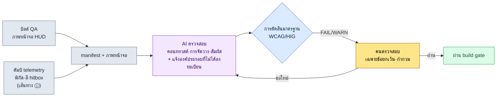

# 9.1 นำภาพหน้าจอ HUD เข้าสู่ lint — จุดที่ AI จับการหลุดสายตาและคอนทราสต์ที่ไม่ผ่านเกณฑ์

> ผู้อ่านกลุ่มแรก: นักออกแบบ UX ที่รับผิดชอบ HUD และ UI (ทีมขนาดกลาง 10\~50 คน)
> เวอร์ชันย่อสำหรับผู้อ่านที่ทำคนเดียว/เป็นงานอดิเรก: §9.1.8 「ถ้าทำคนเดียวก็แค่นี้พอ」

ในวันที่นำการแจ้งเตือนดีบัฟตัวใหม่ขึ้นไปวางบน HUD ในบิลด์ QA ดีไซเนอร์บอกว่า "เห็นชัดดี" แต่วันรุ่งขึ้นบนกระดานข้อความของผู้ใช้กลับมีโพสต์ว่า "ตายเพราะมองไม่เห็นดีบัฟ" การแจ้งเตือนนั้นลอยอยู่กลางจอ เป็นตัวอักษรสีเหลืองจางบนพื้นหลังสีเทา บนจอมอนิเตอร์ของดีไซเนอร์มันมองเห็น แต่บนโทรศัพท์ 6 นิ้วที่เอฟเฟกต์การระเบิดระหว่างการต่อสู้ปกคลุมทั้งจอ มันมองไม่เห็น ปัญหาคือนี่ไม่ใช่ครั้งแรก ทุกบิลด์ ทุกหน้าจอ อุบัติเหตุชนิดเดียวกันนี้เกิดซ้ำภายใต้คำว่า "ครั้งนี้คงไม่เป็นไรหรอก"

บทนี้มุ่งไปที่งานชิ้นเดียวที่ตัดวงจรการเกิดซ้ำนั้น นั่นคือ **lint gate ที่รับภาพหน้าจอ HUD ที่เสร็จสมบูรณ์หนึ่งภาพเป็นอินพุต แล้วตรวจจับโดยอัตโนมัติว่าองค์ประกอบ P0 หลุดออกจากพื้นที่ที่สายตาไปถึง (แถบสถานะด้านบน · มุมแอ็กชันซ้าย-ขวาล่าง) หรือไม่ และคอนทราสต์ของตัวอักษรเกินเกณฑ์ความอ่านออกหรือไม่** หลักการทั่วไปของการออกแบบ HUD อย่างตารางลำดับความสำคัญ · กระแสสายตา · การแยกตามแพลตฟอร์ม มีอยู่ในหนังสือเล่มอื่นอย่างเพียงพอแล้ว ดังนั้นบทนี้จึงใช้เนื้อที่ไปกับ *ลูปการตรวจสอบที่บังคับใช้หลักการเหล่านั้นโดยอัตโนมัติในทุกบิลด์* เท่านั้น แก่นคือการทำให้ AI มองหน้าจอแล้วพูดออกมาเป็นพิกัดและตัวเลขว่า "ตัวอักษรนี้มีคอนทราสต์ 2.0:1 จึงไม่ถึง WCAG 4.5:1" เราแทนที่การเถียงกันว่า "ก็เห็นชัดดีนี่นา" ด้วยโค้ดและมาตรฐาน

---

## 9.1.1 เกณฑ์การตรวจสอบไม่ใช่ 'ความรู้สึก' แต่เป็นมาตรฐานสาธารณะ

เหตุที่การตรวจสอบ HUD ได้ข้อสรุปต่างกันไปในแต่ละคนทุกครั้ง ก็เพราะเกณฑ์เป็นเรื่องอัตวิสัยอย่าง "เห็นชัด/ไม่ชัด" โชคดีที่ความอ่านออกและการเข้าถึง (accessibility) ส่วนใหญ่นั้น องค์กรมาตรฐานได้ตรึงไว้เป็นตัวเลขเรียบร้อยแล้ว เราไม่จำเป็นต้องกุขึ้นเอง

| รายการตรวจสอบ | เกณฑ์มาตรฐาน (แหล่งอ้างอิง) | การตัดสินอัตโนมัติ |
|---|---|---|
| คอนทราสต์ตัวอักษรทั่วไป | ตั้งแต่ 4.5:1 ขึ้นไป (WCAG 2.1 SC 1.4.3) | ทำได้ — คำนวณจากค่าสีพื้นหน้า·พื้นหลัง |
| คอนทราสต์ตัวอักษรขนาดใหญ่ (18pt+) | ตั้งแต่ 3:1 ขึ้นไป (WCAG 2.1 SC 1.4.3) | ทำได้ |
| คอนทราสต์องค์ประกอบที่ไม่ใช่ตัวอักษร (ไอคอน·เกจ) | ตั้งแต่ 3:1 ขึ้นไป (WCAG 2.1 SC 1.4.11) | ทำได้ |
| ขนาดต่ำสุดของพื้นที่สัมผัส | 44×44 pt (Apple HIG) / 48×48 dp (Material) | ทำได้ — จากขนาดองค์ประกอบ |
| พื้นที่ที่นิ้วโป้งเอื้อมถึง | เมื่อ **จับแนวนอนสองมือ** มุมล่างซ้าย·ขวาเป็นโซน 'ง่าย' (นิ้วโป้งซ้าย=เคลื่อนที่, นิ้วโป้งขวา=สกิล) เป็นโมเดล thumb-zone ที่ใช้กันทั่วในวงการ | บางส่วน — ใช้กฎเชิงพื้นที่ |

มีเพียงบรรทัดสุดท้าย (พื้นที่ที่นิ้วโป้งเอื้อมถึง) เท่านั้นที่ไม่ใช่เส้นผ่านเชิงปริมาณ แต่เป็นโมเดลที่ใช้กันทั่วในวงการ ส่วนสี่บรรทัดบนเป็นเส้นผ่านที่ W3C · Apple · Google เปิดเผยไว้ คอนทราสต์นั้นชัดเจนเป็นพิเศษ WCAG เปิดเผยถึงขั้นสูตรคำนวณว่าให้คิดความสว่างสัมพัทธ์ (relative luminance) ของสองสีจาก `(L1+0.05)/(L2+0.05)` เมื่อนำคอนทราสต์ของตัวอักษรสีเหลืองจาง (#D4C84A) บนพื้นหลังสีเทา (#888) ใส่ลงในสูตรนี้ จะได้ประมาณ 2.0:1 — ไม่ถึง 4.5:1 กล่าวคือไม่ผ่านอย่างชัดเจนตามมาตรฐาน นี่คือจุดที่ข้อโต้แย้ง "บนจอมอนิเตอร์ของดีไซเนอร์มันก็เห็น" ใช้ไม่ได้

ตรงนี้ขอทำสิ่งหนึ่งให้ชัด หน้าจอบนมือถือของ MMORPG · RPG นั้น **แนวนอน (landscape) คือมาตรฐาน** เหตุผลคือปริมาณข้อมูลและการควบคุม ที่ขนาดนิ้วเท่ากัน หากจับเป็นแนวนอน ข้อมูลที่แสดงตลอดเวลาในหนึ่งหน้าจอจะมากกว่าแนวตั้ง และยังควบคุมซ้าย (เคลื่อนที่)·ขวา (สกิล) พร้อมกันด้วยนิ้วโป้งสองมือได้ การจับแนวตั้งมือเดียวเหมาะกับเกมพัซเซิลแคชวลและเกม idle แต่ไม่เหมาะกับ MMORPG ที่มีข้อมูลพร้อมกันมากและต้องควบคุมสองมือ ด้วยเหตุนี้ การตัดสินเรื่องสายตาและการจัดวางทั้งหมดในบทนี้จึงตั้งอยู่บนสมมติฐานของการจับแนวนอนสองมือ หน้าจอแบ่งออกเป็น แถบสถานะแนวนอนด้านบน · มุมแอ็กชันล่างสองมุมซ้ายขวา · พื้นที่เกมตรงกลางระหว่างทั้งสอง และแถบช่องล่างกลาง (ของใช้สิ้นเปลือง · ไอเทมอัตโนมัติ · ควิกสล็อต) ที่อยู่ใต้พื้นที่เกม

ห้าบรรทัดนี้คือ **rulebook สำหรับการตรวจสอบ** ที่เราจะมอบให้ AI ในบทนี้ การที่จะพูดได้ว่า "ข้อความดีบัฟมีคอนทราสต์ 2.0:1 จึงละเมิด SC 1.4.3" แทนที่จะเป็น "ดีบัฟดูเหมือนจะมองไม่ค่อยเห็น" เท่านั้น จึงจะทำให้ไม่ว่าคนตรวจหรือ AI ตรวจ ก็ได้ผลตัดสินเดียวกัน

เมื่อวางเกณฑ์ของแพลตฟอร์ม PC ไว้เคียงกัน จุดเริ่มของการตรวจสอบก็ชัดขึ้น โปรเจกต์ A เป็นแบบมือถือมาก่อน + PC เป็นตัวเสริม ดังนั้นจึงวางเกณฑ์ทั้งสองไว้ใน rulebook

| เกณฑ์ | PC (แพลตฟอร์มเสริม) | มือถือ (แพลตฟอร์มหลัก, แนวนอน) |
|---|---|---|
| หน้าจอ·อินพุต | 27 นิ้ว+ / เมาส์แม่นยำ 1px · hover · ปุ่มลัด | 6.x นิ้วแนวนอน / นิ้วโป้งสองมือ ไม่มี hover |
| ข้อมูลที่แสดงตลอดเวลาพร้อมกัน | รับได้ 30\~50 ชนิด | จำกัดที่ 12\~16 ชนิด (การประมาณของผู้เขียน ยังไม่ได้ตรวจสอบ) |
| ระยะที่สายตา·การควบคุมเอื้อมถึง | ทั่วทั้งหน้าจอ (เคอร์เซอร์ไปถึงได้ทุกที่) | เฉพาะแถบสถานะด้านบน + มุมล่างซ้าย·ขวา + แถบช่องล่างกลางที่เป็นโซน 'ง่าย' |
| ความแม่นยำ | คลิก 1px | พื้นที่สัมผัสต่ำสุด 44pt (HIG) |
| ความเสี่ยงหลักของการตรวจสอบ | ภาระทางการรับรู้จากข้อมูลที่แน่นเกินไป | หน้าจอแคบ + นิ้วบัง + ถูกกลบที่ตรงกลาง |

PC มีความแม่นยำของเมาส์ · ทูลทิปแบบ hover · จอใหญ่ จึงต่อให้แสดงข้อมูลมากสายตาและการควบคุมก็ยังเอื้อมถึง ส่วนมือถือเพราะเป็นแนวนอนจึงดีกว่าแนวตั้ง แต่ก็รับได้ไม่เท่า PC อีกทั้งองค์ประกอบที่ต้องกดถูกผูกไว้ที่มุมนิ้วโป้งสองข้าง และเพราะไม่มี hover ข้อมูล P0 จึงต้องแสดงตลอดเวลา ด้วยเหตุนี้ แก่นของการตรวจสอบ HUD บนมือถือจึงไม่ใช่ "สวยไหม" แต่เป็น **"P0 อยู่ในตำแหน่งที่สายตาเอื้อมถึง (ด้านบน · สองมุม) และตัวอักษรเกินคอนทราสต์มาตรฐานหรือไม่"** การตรึงสิ่งนี้ไว้เป็นมาตรฐานเพื่อไม่ให้ผลตัดสินสั่นคลอนต่างกันไปในแต่ละคน คือหน้าที่ของบทนี้

---

## 9.1.2 [บันทึกเซสชันจริง (worked transcript)] นำภาพหน้าจอ HUD หนึ่งภาพเข้าสู่ lint

จะแสดงให้เห็นว่าจริง ๆ แล้วรันอย่างไรหนึ่งรอบจนจบ ด้านล่างคือการจำลองเซสชันการตรวจสอบ HUD การต่อสู้ของโปรเจกต์ของผู้เขียน (MMORPG แบบมือถือมาก่อน ต่อไปจะเรียกว่า "โปรเจกต์ A") อย่างซื่อตรง พรอมต์อินพุตสามารถคัดลอกไปใช้ได้ตามนั้น ส่วนผลลัพธ์เป็นการเรียบเรียงเซสชันจริงขึ้นใหม่

### ขั้นที่ 1 — อินพุต: โยนภาพหน้าจอ + manifest ขององค์ประกอบไปพร้อมกัน

ถ้าโยนแค่ภาพหน้าจอ AI จะ "เดา" หน้าจอเอา ดังนั้นจึงใส่พิกัด·สี·การจัดประเภทขององค์ประกอบที่บิลด์รู้อยู่แล้วไปด้วยในรูปของ manifest นี่ไม่ใช่การเขียนขึ้นใหม่ แต่แค่ดึงออกมาจากผลผลิตของบิลด์ก็พอ (ความจริงของวิธีการดึงนั้นจะเปรียบเทียบอย่างซื่อตรงใน §9.1.4)

```yaml
# hud_capture_manifest.yaml — แนบไปกับภาพหน้าจอบิลด์ QA
screen: { w_pt: 844, h_pt: 390 }   # 6.x นิ้วแนวนอน, หน่วย pt (จับแนวนอน)
elements:
  - id: hp_bar        # แถบพลังชีวิต
    class: P0
    rect_pt: [12, 18, 150, 16]      # x, y, w, h — บนซ้าย
    fg: "#FF5A5A"  ; bg: "#1A1A1A"
  - id: skill_slot_1  # ช่องสกิล (นิ้วโป้งขวา)
    class: P0
    rect_pt: [760, 300, 40, 40]     # ← มุมล่างขวา, สังเกตขนาด
    fg: "#FFFFFF"  ; bg: "#202830"
  - id: debuff_alert  # การแจ้งเตือนดีบัฟ (เพิ่มเมื่อวาน)
    class: P0
    rect_pt: [400, 180, 70, 24]     # ← กลางจอ, สังเกตตำแหน่ง
    fg: "#D4C84A"  ; bg: "#888888"   # ← สังเกตคอนทราสต์
  - id: minimap
    class: P1
    rect_pt: [744, 20, 80, 80]       # บนขวา
    fg: "#A0C0FF"  ; bg: "#101820"
```

### ขั้นที่ 2 — พรอมต์: สั่งให้ตรวจสอบ แต่บังคับมาตรฐานและรูปแบบ

```
ภาพหน้าจอที่แนบมาคือ HUD การต่อสู้ของโปรเจกต์ A (จับแนวนอนสองมือ) ส่วน yaml คือพิกัด·สี·การจัดประเภทของแต่ละองค์ประกอบบนหน้าจอนั้น ช่วยเทียบสองอย่างนี้แล้วตรวจสอบให้หน่อย
คอนทราสต์ให้คำนวณ WCAG จาก fg/bg แล้วเขียนค่าตัวเลขมาด้วย — ตัวอักษร 4.5:1, ไอคอน·ตัวอักษรใหญ่ 3:1 ถ้าไม่ถึงให้ FAIL
ถ้า P0 หลุดออกจากแถบสถานะด้านบนหรือมุมล่างซ้าย·ขวา ไปลอยอยู่กลางจอ ให้ WARN (ตรงกลางจะถูกเอฟเฟกต์การต่อสู้กลบ)
ถ้าองค์ประกอบที่ต้องควบคุมต่ำกว่า 44pt หรือหลุดออกจากมุมนิ้วโป้ง·แถบช่องล่างกลาง ให้ FAIL
ถ้ามีอะไรที่ไม่อยู่ใน manifest แต่เห็นบนหน้าจอ ให้แจ้งแยกต่างหาก และสิ่งที่ไม่มั่นใจให้แยกเป็น 'กำกวม' แล้วส่งมาให้ฉัน
ให้มาเป็นตารางอย่างเดียว (องค์ประกอบ|การตรวจ|ค่าที่วัดได้|ผลตัดสิน|หมายเหตุ) ตัดคำอธิบายออก
// (เจตนา: P0=ข้อมูลที่ต้องหาเจอภายใน 0.5 วินาที / ของใช้สิ้นเปลือง·อัตโนมัติ·ควิกสล็อตอยู่ล่างกลางถือว่าปกติ)
```

จุดสำคัญคือบรรทัดที่ใช้ไปกับ "จะให้ output กฎเหล่านั้นออกมาอย่างไร" มีมากกว่าตัวกฎการตรวจสอบเสียอีก ถ้าให้อิสระแก่ AI มันจะคายคำชมออกมาอย่าง "โดยรวมเรียบร้อยดีนะ" ดังนั้นจึงตรึง **สูตรคำนวณ (คอนทราสต์ WCAG), เส้นผ่าน (4.5:1·44pt), รูปแบบ output (ตาราง), หน้าที่ระบุค่าที่วัดได้ และทางออก "ถ้าไม่มั่นใจให้ส่งต่อให้คน"** ไว้ล่วงหน้า ตะปูห้าตัวนี้เปลี่ยนคำชมให้กลายเป็นค่าที่วัดได้

### ขั้นที่ 3 — ผลลัพธ์ของ Claude (เรียบเรียงใหม่, ผลลัพธ์ดิบ)

```
| องค์ประกอบ    | การตรวจ | ค่าที่วัดได้                | ผลตัดสิน | หมายเหตุ                            |
|-------------|------|--------------------------|------|----------------------------------|
| hp_bar      | คอนทราสต์ | #FF5A5A/#1A1A1A = 5.7:1   | PASS | เกจที่ไม่ใช่ตัวอักษร, ผ่าน 3:1        |
| hp_bar      | การจัดวาง | บนซ้าย (12,18)            | PASS | แถบสถานะด้านบน P0                  |
| skill_slot_1| สัมผัส | 40×40 pt, มุมล่างขวา      | FAIL | ไม่ถึง HIG 44pt, ขาด 4pt (มุม OK)  |
| skill_slot_1| การจัดวาง | ล่างขวา (760,300)         | PASS | มุมที่นิ้วโป้งขวาเอื้อมถึง            |
| debuff_alert| คอนทราสต์ | #D4C84A/#888888 = 2.0:1   | FAIL | ตัวอักษรทั่วไปไม่ถึง 4.5:1 (SC 1.4.3) |
| debuff_alert| การจัดวาง | บริเวณกลางจอ (400,180)    | WARN | เป็น P0 แต่อยู่ตรงกลาง — ถูกเอฟเฟกต์การต่อสู้กลบ |
| minimap     | คอนทราสต์ | #A0C0FF/#101820 = 9.8:1   | PASS |                                  |
| minimap     | การจัดวาง | บนขวา (744,20)            | PASS | P1, อนุญาตด้านขวาของแถบสถานะด้านบน |

แจ้งเพิ่มเติม:
- ใน manifest มี 4 ชนิด แต่ที่มุมล่างซ้ายของภาพหน้าจอมีไอคอนกะพริบสีเหลือง
  อีกหนึ่งอัน (ประมาณพิกัด ~70,330) สงสัยว่าตกหล่นจาก manifest (กำกวม —
  จากหน้าจอเพียงอย่างเดียวไม่สามารถฟันธงได้ว่าเป็นองค์ประกอบอะไร)

สรุป: FAIL 2 รายการ (skill_slot_1 สัมผัส, debuff_alert คอนทราสต์), WARN 1 รายการ
(debuff_alert การจัดวาง), กำกวม 1 รายการ (ไอคอนที่ไม่ได้ลงทะเบียน)
```

ส่วนที่มีค่ามากที่สุดในผลลัพธ์ไม่ใช่ตารางผ่าน/ไม่ผ่าน แต่เป็น **"แจ้งเพิ่มเติม" และ "กำกวม" ที่อยู่ล่างสุด** จุดที่ AI จับไอคอนกะพริบที่ไม่มีใน manifest ได้จากหน้าจอ แล้วบอกว่ามันฟันธงเองไม่ได้ว่าคืออะไรจึงส่งต่อให้คน พรอมต์ที่ดีทำให้ AI สามารถพูดได้ว่า "เรื่องนี้ผมไม่รู้"

### ขั้นที่ 4 — การตรวจสอบและการยับยั้ง (ที่ของคน)

จะรับผลลัพธ์นี้มาตามนั้นไม่ได้ ตัวการตรวจสอบของ AI เองก็ต้องให้คนตรวจสอบอีกครั้ง จริง ๆ แล้วในเซสชันนี้มีหนึ่งรายการที่ถูกคนพลิกกลับด้วยมือ

คอนทราสต์ FAIL และการจัดวาง WARN ของ `debuff_alert` นั้นถูกต้อง สีเหลืองจางบนพื้นหลังสีเทาคือการละเมิดมาตรฐานตามที่เห็นใน §9.1.1 และการวางการแจ้งเตือน P0 ไว้กลางจอแนวนอนก็เป็นความผิดพลาดแบบฉบับที่ถูกเอฟเฟกต์การต่อสู้กลบ ถึงตรงนี้ AI ถูกต้อง

ปัญหาคือสัมผัส FAIL ของ `skill_slot_1` AI เชื่อ `40×40 pt` ใน manifest ตามนั้นแล้วตัดสินว่า "ไม่ถึง 44pt" แต่ในบิลด์จริง ช่องนี้แม้จะมีขนาดเชิงภาพ 40pt แต่ **hitbox สัมผัสถูกขยายออกไปรอบด้านด้านละ 6pt** ทำให้พื้นที่แตะจริงคือ 52pt `rect_pt` ของ manifest บรรจุเพียง *สี่เหลี่ยมที่วาดออกมา* ไม่ได้บรรจุ *hitbox* — กล่าวคือเป็นข้อบกพร่องของข้อมูลอินพุต ไม่ใช่การตัดสินผิดของ AI AI ตัดสินอย่างถูกต้องภายในข้อมูลที่ได้รับ (การตัดสินตำแหน่งมุมก็ถูกต้อง) และคนรู้สถานการณ์ของบิลด์ที่โค้ดไม่รู้ (การขยาย hitbox) FAIL นี้ถูกคนยับยั้ง

ดังนั้นจึงทำสองอย่างพร้อมกัน แก้สคริปต์ดึง manifest ให้ดึง hitbox ออกมาด้วย (แก้ข้อบกพร่องของข้อมูล) และขอ AI ใหม่

```
skill_slot_1 ขนาดเชิงภาพคือ 40pt แต่ hitbox ถูกขยายรอบด้านด้านละ 6pt ทำให้พื้นที่แตะจริงเป็น 52pt (เพิ่ม hit_rect ใน manifest แล้ว) ช่วยดูเรื่องสัมผัสใหม่ด้วยเกณฑ์นี้
ส่วน debuff_alert FAIL/WARN ให้คงไว้เหมือนเดิม แล้วเสนอชุดสีที่เกิน 4.5:1 มา 3 ชุด (คงโทนเหลือง พื้นหลังให้เข้ม) และให้พิกัดสำหรับย้ายจากตรงกลางไปด้านขวาของแถบสถานะด้านบนมาหนึ่งอันด้วย
```

AI แก้ `skill_slot_1` เป็น PASS โดยใช้เกณฑ์ hitbox 52pt และเพื่อคอนทราสต์ของดีบัฟ ก็ปูพื้นหลังให้เข้มเป็น #2A2A00 ทำให้ได้ 7.8:1 พร้อมเสนอชุดสี 3 แบบ และให้พิกัดสำหรับย้ายการแจ้งเตือนไปด้านขวาของแถบสถานะด้านบน (ราว 600,18) มาด้วย จบในการไปกลับครั้งเดียว **ถ้ากวาดสายตาดูหน้าจอด้วยตาทุกบิลด์ อุบัติเหตุเดิมก็เกิดซ้ำ แต่ถ้านำภาพหน้าจอ+manifest เข้าสู่ lint การละเมิดเรื่องคอนทราสต์·การจัดวาง·สัมผัสก็จะตกลงมาเป็นตัวเลข และคนก็ตัดสินเฉพาะข้อยกเว้นที่โค้ดไม่รู้ (hitbox) และความกำกวม (ไอคอนที่ไม่ได้ลงทะเบียน) เท่านั้น** (การตรวจสอบ 1 หน้าจอด้วยมือใช้เวลาสิบกว่านาที ด้วยลูปนี้ใช้เวลาไม่กี่นาที — เป็นสมมติฐานที่ผู้เขียนประมาณการ ยังไม่ได้ตรวจสอบ ควรอ่านในแง่ความต่างเชิงโครงสร้างระหว่าง "กวาดด้วยตา" กับ "วัดด้วยมาตรฐาน" มากกว่าเวลาสัมบูรณ์)

---

## 9.1.3 สายตา·การจัดวาง HUD แนวนอน — ทำไมตรงกลางจึงอันตราย

เหตุที่ `debuff_alert` ได้ WARN ในเซสชันข้างต้น และควรวางข้อมูล P0 ไว้ตรงไหน หากเก็บไว้เป็นภาพหนึ่งภาพ การตัดสินการจัดวางทั้งหมดหลังจากนี้จะเร็วขึ้น บนโทรศัพท์ที่จับแนวนอน หน้าจอแบ่งออกเป็นสี่ตำแหน่ง **แถบสถานะแนวนอนด้านบน** (อ่านอย่างเดียว สายตาไปถึงก่อนแต่นิ้วไปไม่ถึง), **มุมล่างสองมุมซ้าย·ขวา** (ที่ควบคุมที่นิ้วโป้งสองมือเอื้อมถึง — นิ้วโป้งซ้าย=เคลื่อนที่, นิ้วโป้งขวา=สกิล), **พื้นที่เกมตรงกลาง** ระหว่างทั้งสอง (ที่ที่การต่อสู้เกิดขึ้น), และ **แถบช่องล่างกลาง** ใต้พื้นที่เกม (ที่วางของใช้สิ้นเปลือง·ไอเทมอัตโนมัติ และควิกสล็อต·ช่องสกิล) ด้านล่างนี้ สีเขียว·สีเหลืองอำพันคือพื้นที่ที่ P0 และช่องปลอดภัย ส่วนสีแดงคือกลางเกมที่การแจ้งเตือน P0 จะถูกกลบ

<svg viewBox="0 0 660 340" xmlns="http://www.w3.org/2000/svg" role="img" aria-label="โซนสายตาและแผนผังการจัดวาง P0/P1 ของ HUD มือถือแนวนอน">
  <!-- ขอบนอกของโทรศัพท์ (แนวนอน) -->
  <rect x="20" y="30" width="620" height="280" rx="30" ry="30" fill="#0f1117" stroke="#3a3f4b" stroke-width="3"/>
  <rect x="34" y="44" width="592" height="252" rx="14" ry="14" fill="#11151d"/>
  <!-- แถบสถานะด้านบน (เขียว — สายตาอันดับ 1, อ่านอย่างเดียว) -->
  <rect x="34" y="44" width="592" height="56" fill="#14532d" opacity="0.55"/>
  <path d="M44 52 H616" fill="none" stroke="#22c55e" stroke-width="2.5" stroke-dasharray="6 4"/>
  <text x="330" y="92" fill="#bbf7d0" font-family="sans-serif" font-size="12" text-anchor="middle" font-weight="bold">แถบสถานะแนวนอนด้านบน — สายตาอันดับ 1 (HP · MP · เป้าหมาย, อ่านอย่างเดียว)</text>
  <!-- พื้นที่อันตรายตรงกลาง (แดง): พื้นที่เกม, วาง P0 จะถูกเอฟเฟกต์กลบ -->
  <rect x="180" y="100" width="300" height="138" fill="#7f1d1d" opacity="0.4"/>
  <text x="330" y="158" fill="#fecaca" font-family="sans-serif" font-size="13" text-anchor="middle">ตรงกลาง — พื้นที่เกม (เอฟเฟกต์ถาโถม)</text>
  <text x="330" y="178" fill="#fecaca" font-family="sans-serif" font-size="11" text-anchor="middle">วางการแจ้งเตือน P0 จะถูกกลบ — จุดที่ debuff_alert ติด</text>
  <!-- แถบช่องล่างกลาง (เหลืองอำพัน — ของใช้สิ้นเปลือง·ควิกสล็อต·อัตโนมัติ, ใต้พื้นที่เกม) -->
  <text x="330" y="240" fill="#b45309" font-family="sans-serif" font-size="11" text-anchor="middle" font-weight="bold">ล่างกลาง — ของใช้สิ้นเปลือง·ควิกสล็อต·อัตโนมัติ</text>
  <rect x="248" y="248" width="164" height="42" rx="8" fill="#f59e0b" opacity="0.5" stroke="#f59e0b" stroke-width="2" stroke-dasharray="5 4"/>
  <circle cx="298" cy="270" r="11" fill="#fbbf24"/><text x="298" y="274" fill="#000" font-size="8" text-anchor="middle">โพชัน</text>
  <circle cx="330" cy="270" r="11" fill="#fbbf24"/><text x="330" y="274" fill="#000" font-size="8" text-anchor="middle">อัตโนมัติ</text>
  <circle cx="362" cy="270" r="11" fill="#fbbf24"/><text x="362" y="274" fill="#000" font-size="8" text-anchor="middle">ช่อง</text>
  <!-- มุมนิ้วโป้งล่างซ้าย (เขียว) -->
  <path d="M34 296 L34 146 A150 150 0 0 1 184 296 Z" fill="#14532d" opacity="0.7"/>
  <path d="M34 146 A150 150 0 0 1 184 296" fill="none" stroke="#22c55e" stroke-width="2.5" stroke-dasharray="5 4"/>
  <text x="92" y="254" fill="#bbf7d0" font-family="sans-serif" font-size="13" text-anchor="middle" font-weight="bold">นิ้วโป้งซ้าย</text>
  <text x="92" y="274" fill="#bbf7d0" font-family="sans-serif" font-size="12" text-anchor="middle">เคลื่อนที่</text>
  <!-- มุมนิ้วโป้งล่างขวา (เขียว) -->
  <path d="M626 296 L626 146 A150 150 0 0 0 476 296 Z" fill="#14532d" opacity="0.7"/>
  <path d="M626 146 A150 150 0 0 0 476 296" fill="none" stroke="#22c55e" stroke-width="2.5" stroke-dasharray="5 4"/>
  <text x="568" y="254" fill="#bbf7d0" font-family="sans-serif" font-size="13" text-anchor="middle" font-weight="bold">นิ้วโป้งขวา</text>
  <text x="568" y="274" fill="#bbf7d0" font-family="sans-serif" font-size="12" text-anchor="middle">สกิล</text>
  <!-- จุดองค์ประกอบจริง -->
  <rect x="60" y="60" width="60" height="10" rx="3" fill="#ef4444"/><text x="90" y="68" fill="#fff" font-size="8" text-anchor="middle">HP</text>
  <rect x="60" y="78" width="60" height="10" rx="3" fill="#3b82f6"/><text x="90" y="86" fill="#fff" font-size="8" text-anchor="middle">MP</text>
  <rect x="300" y="56" width="44" height="20" rx="4" fill="#0ea5e9" opacity="0.8"/><text x="322" y="70" fill="#fff" font-size="8" text-anchor="middle">เป้าหมาย</text>
  <rect x="560" y="54" width="48" height="40" rx="6" fill="#0ea5e9" opacity="0.7"/><text x="584" y="78" fill="#fff" font-size="8" text-anchor="middle">แมป P1</text>
  <circle cx="330" cy="204" r="13" fill="#facc15" opacity="0.5"/><text x="330" y="208" fill="#000" font-size="6" text-anchor="middle">ดีบัฟ?</text>
  <circle cx="92" cy="220" r="17" fill="#22c55e"/><text x="92" y="224" fill="#000" font-size="9" text-anchor="middle">เคลื่อนที่</text>
  <circle cx="556" cy="222" r="14" fill="#22c55e"/><text x="556" y="226" fill="#000" font-size="9" text-anchor="middle">สกิล</text>
  <circle cx="592" cy="210" r="13" fill="#22c55e"/><text x="592" y="214" fill="#000" font-size="9" text-anchor="middle">สกิล</text>
  <circle cx="600" cy="272" r="12" fill="#22c55e"/><text x="600" y="276" fill="#000" font-size="8" text-anchor="middle">สกิล</text>
</svg>

กฎนั้นเรียบง่าย **วางข้อมูล P0 (HP·MP·การแจ้งเตือนสำคัญ) ไว้ในสีเขียว (แถบสถานะแนวนอนด้านบน หรือมุมล่างสองข้าง)** เพราะเป็นทางผ่านที่สายตาไปถึงก่อนหรือที่นิ้วโป้งวนเวียนอยู่ตลอด ในทางกลับกัน **กลางเกม (สีแดง) คือที่ที่การต่อสู้เกิดขึ้นเอง** หากวางการแจ้งเตือน P0 ไว้ตรงนี้ ทันทีที่เอฟเฟกต์ปกคลุมหน้าจอ ข้อมูลก็จะถูกกลบ มีข้อควรระวังหนึ่ง — กลางเกมกับ **ล่างกลาง** ไม่เหมือนกัน กลางเกมอันตราย แต่ **แถบช่องล่างกลาง (สีเหลืองอำพัน) ที่อยู่ใต้ลงมาคือที่อยู่ของของใช้สิ้นเปลือง·ไอเทมอัตโนมัติ และควิกสล็อต·ช่องสกิล** วางไว้ระหว่างนิ้วโป้งสองข้างเพื่อจะมองเห็นในพริบตาว่าตัวเองใช้อะไรหรืออะไรถูกใช้ไปโดยอัตโนมัติ และ **ข้อมูลที่อ่านอย่างเดียว (HP/MP/พลังชีวิตของเป้าหมาย) อยู่ด้านบน**, **องค์ประกอบที่ต้องกด (เคลื่อนที่·สกิล) อยู่ที่มุมล่างสองข้าง**, **ของใช้สิ้นเปลือง·ช่องอยู่ล่างกลาง** — สามอย่างนี้คือโซนนิ้ว·สายตา เหตุที่การแจ้งเตือนดีบัฟใน §9.1.2 ได้ WARN อธิบายได้ด้วยภาพนี้ภาพเดียว — เพราะวาง P0 ที่ต้องเห็นภายใน 0.5 วินาที ไว้ที่กลางเกมซึ่งมองเห็นยากที่สุดเสียได้ การย้ายไปด้านขวาของแถบสถานะด้านบนในแผนแก้ไข ก็คือการย้ายกลับเข้าสีเขียวของภาพนี้อย่างพอดิบพอดี

---

## 9.1.4 จะดึงพิกัดออกมาอย่างไร — ความซื่อตรงในการอิมพลีเมนต์

lint ในบทนี้ตั้งอยู่บนสมมติฐานว่า "พิกัด·สีของแต่ละองค์ประกอบ" เข้ามาอย่างสะอาด แต่ในความเป็นจริง การที่จะดึงพิกัดนั้น *จากที่ไหน อย่างไร* ต่างหากที่เป็นทางแยกที่สมจริงที่สุด เพราะเป็นจุดที่หนังสือมักพูดอ้อม ๆ จึงขอเปรียบเทียบสามเส้นทางอย่างซื่อตรง คำตอบไม่ได้มีหนึ่งเดียว แต่แยกไปตามสถานการณ์ของทีม

| เส้นทาง | ทำอะไร | จุดแข็ง | จุดอ่อน / ความจริง |
|---|---|---|---|
| ① ล็อก telemetry ในเกม | ให้บิลด์ดัมป์พิกัด·ขนาด·สีของวิดเจ็ตที่เฟรมเวิร์ก UI วาดออกมาโดยตรง | พิกัด **แม่นยำ** (ไม่ใช่การประมาณ) ออกมาถึง hitbox·anchor | ต้องฝัง hook สำหรับดัมป์ลงในโค้ด UI ต้องอาศัยความร่วมมือกับโปรแกรมเมอร์ ทำครั้งเดียวแล้วเชื่อถือได้มากที่สุด |
| ② vision API สำเร็จรูป | ใส่ภาพหน้าจอเข้า OCR·API ตรวจจับวัตถุ แล้วดึงพิกัดข้อความ·กล่อง | ไม่ต้องแก้บิลด์ ใช้ได้แม้กับภาพหน้าจอภายนอก | พิกัดเป็น **ค่าประมาณ** องค์ประกอบที่ไม่ใช่ตัวอักษรอย่างเกจ·ไอคอนจัดประเภทได้อ่อน การส่งออกภายนอก = เสี่ยงบิลด์ที่ยังไม่เปิดเผยรั่ว |
| ③ อิมพลีเมนต์เอง (วิเคราะห์พิกเซล) | อ่านภาพหน้าจอเองแล้วดึงขอบสี·กล่องด้วยฮิวริสติก | พึ่งพา dependency น้อยที่สุด เพียงพอสำหรับคำนวณคอนทราสต์สี | ไม่รู้ *ความหมาย* ขององค์ประกอบ (อันนี้เป็น P0 ไหม) ต้องเทียบกับ manifest ถึงจะใช้ได้ มีภาระการดูแลรักษา |

ความสัมพันธ์ของสามเส้นทางนี้อธิบาย worked transcript ของบทนี้ได้ตรง ๆ เหตุที่ใน §9.1.2 **การตรวจคอนทราสต์แม่นยำ ก็เพราะค่าสี (fg/bg) เข้ามาอย่างแม่นยำผ่าน ①·③** และ **เหตุที่สัมผัส FAIL ถูกคนพลิกกลับด้วยมือ ก็เพราะ hitbox ตกหล่นไปจาก manifest** (②·③ มองไม่เห็น hitbox มีแต่ ① ที่เห็น) กล่าวคือ *คอนทราสต์* จับได้ด้วยพิกเซลเพียงอย่างเดียว แต่ *hitbox สัมผัส* จับไม่ได้หากไม่มี ① telemetry ต้องรู้ขีดจำกัดนี้ก่อนเริ่ม เส้นแบ่งว่าจะเชื่อผลตรวจสอบของ AI ได้ถึงไหนจึงจะชัด

ตัวเลือกของโปรเจกต์ของผู้เขียนคือโครงสร้างที่ใช้ **① telemetry เป็นฉบับหลัก ส่วน AI เป็นผู้ตรวจสอบที่เทียบภาพหน้าจอ+manifest จาก telemetry** AI จับสิ่งที่เห็นแต่บนหน้าจอแต่ไม่มีใน manifest (ไอคอนกะพริบที่ไม่ได้ลงทะเบียนใน §9.1.2) และคนจับสิ่งที่มีใน manifest แต่ผิดไปจากหน้าจอ หากใช้อย่างใดอย่างหนึ่งเพียงอย่างเดียว ก็จะมีมุมอับเหลืออยู่ทั้งสองฝั่ง



ที่ที่มือของคนเอื้อมไปถึงมีเพียงสองแห่ง จุดที่ใส่ดัมป์ telemetry เข้าไปอย่างสะอาด (หัวสุด) และจุดที่ตัดสินข้อยกเว้น (hitbox)·ความกำกวม (องค์ประกอบที่ไม่ได้ลงทะเบียน) ที่โค้ด·มาตรฐานจับไม่ได้ (ท้ายสุด) ส่วนการคำนวณคอนทราสต์ที่น่าเบื่อและการเทียบการจัดวางที่อยู่ระหว่างนั้น AI และมาตรฐานเป็นผู้รัน

---

## 9.1.5 เปลี่ยน rulebook เป็นโค้ด — gate อัตโนมัติสำหรับคอนทราสต์·สัมผัส·มุม

ถ้า AI คำนวณเลขใหม่ทุกครั้งที่ตรวจสอบ ก็สิ้นเปลืองทั้งโทเค็นและเวลา รายการที่ **ตกลงมาเป็นแบบ deterministic อย่างคอนทราสต์·สัมผัส·การเอื้อมถึงมุม ให้โค้ดตีก่อน** AI เข้าไปจัดการเฉพาะสิ่งที่โค้ดจับไม่ได้ (การตีความความหมายของหน้าจอ, องค์ประกอบที่ไม่ได้ลงทะเบียน) ทั้งสองไม่ใช่การแข่งขัน แต่เป็นการแบ่งหน้าที่กัน

```python
# hud_lint.py — ตรวจสอบ manifest ของ HUD ตามมาตรฐาน (โครงร่าง)
# อินพุต: manifest จาก telemetry (rect/hit_rect/fg/bg/class/interactive ของแต่ละองค์ประกอบ)
# เอาต์พุต: รายการการละเมิด WCAG/HIG + การเอื้อมถึงสองมือ

def _luminance(hex_color):           # ความสว่างสัมพัทธ์ตาม WCAG
    r, g, b = (int(hex_color[i:i+2], 16) / 255 for i in (1, 3, 5))
    f = lambda c: c/12.92 if c <= 0.03928 else ((c+0.055)/1.055) ** 2.4
    R, G, B = f(r), f(g), f(b)
    return 0.2126*R + 0.7152*G + 0.0722*B

def contrast_ratio(fg, bg):          # คอนทราสต์ตาม WCAG
    L1, L2 = sorted((_luminance(fg), _luminance(bg)), reverse=True)
    return (L1 + 0.05) / (L2 + 0.05)

def in_thumb_corner(e, w, h):
    """เป็นมุมล่างซ้าย·ขวาที่นิ้วโป้งสองมือของการจับแนวนอนเอื้อมถึงหรือไม่"""
    x, y = e["hit_rect"][0] / w, e["hit_rect"][1] / h
    bottom = y > 0.55
    left_corner  = bottom and x < 0.30   # นิ้วโป้งซ้าย = เคลื่อนที่
    right_corner = bottom and x > 0.70   # นิ้วโป้งขวา = สกิล
    return left_corner or right_corner

def lint(elements, screen_w, screen_h):
    issues = []
    for e in elements:
        # กฎ A: คอนทราสต์ (ตัวอักษร 4.5:1 / ไม่ใช่ตัวอักษร·ตัวอักษรใหญ่ 3:1)
        need = 4.5 if e["kind"] == "text" else 3.0
        cr = contrast_ratio(e["fg"], e["bg"])
        if cr < need:
            issues.append(f"[A] {e['id']}: คอนทราสต์ {cr:.1f}:1 < {need}:1 (WCAG SC 1.4.3)")
        # กฎ B: พื้นที่สัมผัส — ใช้เกณฑ์ hitbox (ไม่ใช่ขนาดเชิงภาพ)
        if e.get("interactive"):
            tap = min(e["hit_rect"][2], e["hit_rect"][3])   # ← hit_rect ไม่ใช่ rect
            if tap < 44:
                issues.append(f"[B] {e['id']}: แตะ {tap}pt < 44pt (HIG)")
            # กฎ C: องค์ประกอบที่ต้องควบคุมต้องอยู่ที่มุมนิ้วโป้งสองมือ (ล่างซ้าย·ขวา)
            if not in_thumb_corner(e, screen_w, screen_h):
                issues.append(f"[C] {e['id']}: องค์ประกอบที่ต้องควบคุมถูกวางนอกมุมนิ้วโป้งสองมือ "
                              f"(x={e['hit_rect'][0]}, y={e['hit_rect'][1]})")
    return issues
```

โค้ดนี้ยุติการเถียงกันในที่ประชุมว่า "ตัวอักษรนี้มันมองไม่ค่อยเห็นนะ ใช่ไหม" เมื่อโค้ด output ออกมาว่า `[A] debuff_alert: คอนทราสต์ 2.0:1 < 4.5:1 (WCAG SC 1.4.3)` ก็ไม่มีอะไรให้ถกเถียง แก้ก็จบ สองบรรทัดที่ควรสังเกตคือ กฎ B มอง `hit_rect` ไม่ใช่ `rect` และกฎ C ปล่อยให้องค์ประกอบที่ต้องควบคุมผ่านได้เฉพาะที่มุมล่างสองมุมซ้าย·ขวา — บทเรียนที่คนพลิกกลับ AI ใน §9.1.2 (hitbox) และขีดจำกัดการเอื้อมถึงของการจับแนวนอนสองมือ เข้าไปอยู่ในโค้ดด้วยกัน จุดสำคัญของการตัดสินแนวนอนคือ การมองมุมนิ้วโป้งซ้าย (เคลื่อนที่)·นิ้วโป้งขวา (สกิล) สองมุมแยกกัน ไม่ใช่เกณฑ์ 'ส่วนโค้งนิ้วโป้ง' เดียว ข้อยกเว้นที่คนจับได้ครั้งหนึ่ง ต่อจากนั้นโค้ดจะเป็นผู้จับ ด้วยเหตุนี้จึงเหลือบทบาทแคบ ๆ ให้ AI ว่า "นอกจากสิ่งที่โค้ดประมวลผลเป็น PASS แล้ว ให้แจ้งความผิดปกติที่เห็นได้แต่บนหน้าจอเท่านั้น (องค์ประกอบที่ไม่ได้ลงทะเบียน·การซ้อนทับเชิงภาพ·การตัดขาด)" สิ่งที่จับได้แบบ deterministic ให้โค้ด, สิ่งที่ต้องตีความความหมายของหน้าจอให้ AI, ข้อยกเว้นที่รู้สถานการณ์ของบิลด์ให้คน — การแบ่งหน้าที่นี้คือแก่น

---

## 9.1.6 แหล่งที่มาของตัวเลขในบทนี้

ตัวเลขที่ปรากฏในบทนี้มีแหล่งที่มาเพียงสามแหล่ง คอนทราสต์ 4.5:1·สัมผัส 44pt·48dp เป็นค่าทางการของ WCAG SC 1.4.3·HIG·Material และการที่ตัวอักษร #D4C84A บนพื้นหลัง #888 ได้ประมาณ 2.0:1 ก็เป็นค่าที่คำนวณจากการใส่ค่าสีลงในสูตรนั้น (§9.1.1·§9.1.5) "การตรวจสอบ 1 หน้าจอด้วยมือใช้เวลาสิบกว่านาที ด้วยลูปใช้เวลาไม่กี่นาที"·"ข้อมูลที่แสดงตลอดเวลาแนวนอน 12\~16 ชนิด" เป็นการประมาณของผู้เขียนที่ยังไม่ได้ตรวจสอบ จึงระบุไว้เช่นนั้นในเนื้อหา ส่วนที่เหลือ (จำนวนคอนทราสต์ FAIL ต่อบิลด์, จำนวน hitbox สัมผัสที่ไม่ถึงเกณฑ์, จำนวนการหลุดออกจากมุมนิ้วโป้ง, อัตราการแตะผิดของ telemetry) เป็นค่าที่นับได้โดยตรงจากบิลด์ล็อก ส่วนตัวชี้วัดผลลัพธ์ที่ไม่สามารถฟันธงสาเหตุได้ด้วย HUD เพียงอย่างเดียวอย่างจำนวนคำร้องเรียนของผู้ใช้ ไม่ได้นำขึ้นเป็น KPI

---

## 9.1.7 ความล้มเหลวที่พบบ่อย

| รูปแบบ | ทำไมจึงล้มเหลว | วิธีแก้ |
|---|---|---|
| ตรวจสอบด้วยตาบนจอมอนิเตอร์ของดีไซเนอร์ | ขาดเงื่อนไข 6 นิ้ว·เอฟเฟกต์การต่อสู้ อุบัติเหตุคอนทราสต์จึงเกิดซ้ำ | ทำ lint ภาพหน้าจอเป็น build gate (§9.1.2) |
| โยนแค่ภาพหน้าจอให้ AI แล้วบอก "ช่วยตรวจดู" | เดาพิกัดแล้วตัดสินแบบประมาณ เชื่อถือไม่ได้ | แนบ manifest จาก telemetry (§9.1.4) |
| ตัดสินพื้นที่สัมผัสด้วยขนาดเชิงภาพ | พลาดการขยาย hitbox ทำให้ปุ่มที่ปกติได้ FAIL | ตรวจด้วยเกณฑ์ `hit_rect` (§9.1.5) |
| วางการแจ้งเตือน P0 ไว้กลางจอ | ถูกเอฟเฟกต์การต่อสู้กลบ "ตายเพราะมองไม่เห็น" | ย้ายไปแถบสถานะด้านบน·สองมุม (§9.1.3) |
| วางปุ่มควบคุมไว้กลางจอด้านซ้าย·ด้านบน | ในการจับแนวนอนสองมือ นิ้วโป้งเอื้อมไม่ถึง | ย้ายไปมุมล่างซ้าย·ขวา (§9.1.5 กฎ C) |
| ออกแบบบนสมมติฐานการจับแนวตั้งมือเดียว | MMORPG ใช้แนวนอนสองมือเป็นมาตรฐาน ข้อมูล·การควบคุมไม่เข้ากัน | เปลี่ยนไปแนวนอนสองมือ (§9.1.1) |
| ถกเถียงคอนทราสต์ด้วย "เห็น/ไม่เห็น" | ข้อสรุปต่างกันไปในแต่ละคน | ใช้ค่าคำนวณ WCAG 4.5:1 (§9.1.1) |

ข้อที่สี่เกิดซ้ำบ่อยที่สุด เมื่อต้องรีบนำการแจ้งเตือนใหม่ขึ้นไปวาง พื้นที่ว่างมีแต่กลางจอ จึงวางไว้ตรงนั้น — และตรงกลางนั้นก็คือที่ที่เกมเกิดขึ้นพอดี

---

## 9.1.8 ลองทำดู — หนึ่งขั้นที่ทำได้วันนี้

> **ถ้าทำคนเดียวก็แค่นี้พอ**: ไม่มีทั้ง telemetry และ manifest ก็ได้ ถ่ายภาพหน้าจอ HUD แนวนอนของเกมตัวเอง (หรือเกมที่คุณชอบ) มาหนึ่งภาพ เลือกตัวอักษร·ไอคอนที่เล็กที่สุดสองสามอัน ดูดสีพื้นหน้า/พื้นหลังด้วยเครื่องมือดูดสี (spoid) แล้วจดด้วยมือ จากนั้นแปะพรอมต์จาก §9.1.2 แล้วลองรันสักครั้ง เมื่อเลือกค่าคอนทราสต์ที่ AI คำนวณมาสักหนึ่งค่า แล้วลองตรวจคำนวณซ้ำเองด้วยเครื่องคำนวณคอนทราสต์ WCAG ออนไลน์ คุณจะรู้สึกได้ด้วยตัวเองว่า "เห็น/ไม่เห็น" กลายเป็นตัวเลขได้อย่างไร ถ้ามี P0 ที่ AI วางไว้กลางจอ ลองโต้แย้งกลับว่า "ดูอีกทีสิว่าทำไมตรงกลางถึงอันตราย"

ถ้าเป็นทีม ให้เริ่มด้วยขั้นถัดไปหนึ่งขั้น ตกลงกับโปรแกรมเมอร์เรื่อง telemetry hook (เส้นทาง ①) ที่ดัมป์พิกัด·สี·hitbox ของวิดเจ็ตจากเฟรมเวิร์ก UI ก่อน แล้วใส่ฟังก์ชัน `contrast_ratio` ฟังก์ชันเดียวจาก §9.1.5 ลงในบิลด์ การคำนวณคอนทราสต์เป็นสูตรมาตรฐานจึงไม่มีข้อโต้แย้ง และเพียงมีฟังก์ชันเดียว คอนทราสต์ FAIL ในทุกบิลด์ก็จะตกลงมาเป็นตัวเลข จากนั้นเมื่อเพิ่ม `in_thumb_corner` เข้าไป โค้ดก็จะจับการหลุดออกจากมุมขององค์ประกอบที่ต้องควบคุมแบบแนวนอนสองมือได้ด้วย ส่วนการตีความอย่างการจัดวาง·องค์ประกอบที่ไม่ได้ลงทะเบียน ก็เพิ่ม AI ทับลงบนนั้นได้

---

### สรุปประเด็นสำคัญของบท
- เกณฑ์การตรวจสอบ HUD ไม่ใช่ความรู้สึก แต่เป็นมาตรฐานสาธารณะ (WCAG 4.5:1·HIG 44pt)
- นำภาพหน้าจอ+manifest จาก telemetry เข้าสู่ AI เพื่อตรวจจับคอนทราสต์·การจัดวาง·องค์ประกอบที่ไม่ได้ลงทะเบียน
- ในการจับแนวนอนสองมือ องค์ประกอบที่ต้องกดอยู่ที่มุมล่างสองข้าง ข้อมูลที่อ่านอยู่ที่แถบสถานะด้านบน — ตรงกลางจะถูกกลบ

### ตัวอย่างบทถัดไป
- 9.2 ช่องสกิล 4 คอลัมน์หรือ 8 คอลัมน์ — กรณีศึกษาการแก้ปัญหาด้วยการวัด ว่าการตัดสินใจหนึ่งส่งผลพร้อมกันต่อการรับรู้·การต่อสู้·แพลตฟอร์ม·พื้นที่อย่างไร
