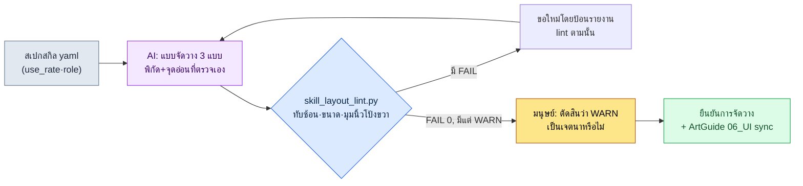

# 9.2 การจัดเรียงปุ่มสกิล — ให้ AI ร่างแบบจัดวาง 3 แบบ แล้วให้ lint คัดทิ้ง

> ผู้อ่านหลัก: นักออกแบบ UX และนักออกแบบการต่อสู้ของเกมแอ็กชัน/MMORPG ที่เน้นมือถือเป็นหลัก (ทีมขนาดกลาง)
> ฉบับย่อสำหรับผู้อ่านคนเดียว/มือสมัครเล่น: §9.2.7 «ถ้าทำคนเดียวก็แค่นี้พอ»

สกิล 6 อย่างของอาชีพใหม่ จะวางไว้ตรงไหนของจอมือถือและวางอย่างไร เมื่อคำถามนี้ขึ้นมาในที่ประชุม 30 นาทีแรกก็ดำเนินไปเหมือนเดิมเสมอ มีคนหนึ่งวาดวงกลมหกวงบนไวต์บอร์ด อีกคนบอกว่า «ตรงนั้นนิ้วโป้งเอื้อมไม่ถึง» แล้วก็มีอีกคนรับว่า «ถ้าเลื่อนขึ้นไป มินิแมปก็จะถูกบัง» ทั้งสามคนพูดถูกหมด แต่ก็ไม่ได้ข้อสรุป พอประชุมครั้งต่อไปไวต์บอร์ดแผ่นเดิมก็ถูกวาดขึ้นมาอีก

ปัญหาคืองานวาดแบบจัดวางกับงานตรวจว่าแบบนั้นทำตามกฎหรือไม่ ปะปนกันอยู่ในหัวของคนคนเดียว คนที่วาดมักคัดทิ้งสิ่งที่ตัวเองวาดไม่ค่อยลง บทนี้แยกสองสิ่งนั้นออกจากกัน **งานน่าเบื่อที่ต้องร่างแบบจัดวางหลาย ๆ แบบ ยกให้ AI ทำ ส่วนเรื่องที่ว่าแบบนั้นละเมิดกฎเรื่องการทับซ้อน มุมนิ้วโป้ง และขนาดพื้นที่สัมผัสหรือไม่ ให้โค้ดเป็นคนคัดทิ้ง** มนุษย์มายืนอยู่แค่ตำแหน่งที่เลือกแบบใดแบบหนึ่งจาก «ความรู้สึกของเกม» ในบรรดาแบบที่โค้ดผ่านให้แล้วเท่านั้น ถ้า §9.1 เป็นการตั้ง rulebook ให้ HUD ทั้งหน้าจอ บทนี้ก็เป็นหนึ่งรอบที่นำ rulebook นั้นไปใช้จนสุดทางกับก้อนเดียวที่มือสัมผัสมากที่สุด นั่นคือปุ่มสกิล

---

## 9.2.1 เหตุผลที่ปุ่มสกิลยาก — มันไม่ใช่ «ข้อมูลที่อ่าน» แต่เป็น «ข้อมูลที่กด»

องค์ประกอบส่วนใหญ่บน HUD เป็นการอ่านเพียงอย่างเดียว ไม่มีใครกดแถบ HP ดังนั้นในภาพมุมนิ้วโป้งของ §9.1 จึงวาง HP, MP และพลังชีวิตของเป้าหมายไว้ในพื้นที่อ่านด้านบนที่มือเอื้อมไม่ถึงได้ ปุ่มสกิลตรงกันข้ามเลย ต้องกดให้ถูกต้องในระดับ 0.1 วินาที และระหว่างการต่อสู้สายตาจับอยู่ที่ศัตรู นิ้วจึงหาตำแหน่งด้วย *ความจำ* ตำแหน่งคลาดเคลื่อนไปนิดเดียวก็เกิดการกดผิด (mistap) ตรงนั้นทันที

MMORPG บนมือถือใช้การจับสองมือแนวนอนเป็นมาตรฐาน องค์ประกอบที่กดจะวางไว้ที่มุมล่างทั้งสองข้าง ส่วนของใช้/ช่องไอเทมจะวางไว้ตรงกลางด้านล่าง (เหตุผลว่าทำไมแนวนอนจึงเป็นมาตรฐาน และสามพื้นที่นั้นคืออะไร อธิบายไว้ใน §9.1) ในมาตรฐานนั้นสกิลแทบทั้งหมดจะถูกวางไว้ที่ **คลัสเตอร์มุมขวาล่างที่นิ้วโป้งขวาเอื้อมถึง** (นิ้วโป้งซ้ายถูกผูกไว้กับการเคลื่อนที่ที่มุมซ้ายล่าง) มีการแบ่งแยกอยู่อย่างหนึ่ง — สกิลแบบแอ็กทีฟที่กดในระดับ 0.1 วินาทีจะอยู่ที่คลัสเตอร์ขวาล่างนี้ แต่ของใช้ ไอเทมอัตโนมัติ และช่องด่วน (quick slot) จะวางแยกไว้ที่แถบช่องตรงกลางด้านล่างระหว่างนิ้วโป้งสองข้าง บทนี้กล่าวถึงเฉพาะปุ่มสกิลแบบแอ็กทีฟ และการตัดสินพิกัดทั้งหมดตั้งอยู่บนสมมติฐานการจับสองมือแนวนอน

ดังนั้นการจัดวางปุ่มสกิลจึงถูกผูกเข้ากับกฎเชิงกำหนด (deterministic) สามข้อพร้อมกัน — พื้นที่สัมผัสขั้นต่ำ (HIG 44pt), ระยะห่างระหว่างปุ่มที่อยู่ติดกัน (Material 8dp), การเอื้อมถึงของนิ้วโป้ง (สกิลอยู่ที่มุมขวาล่างของนิ้วโป้งขวา) ทั้งสามข้อนี้เป็นรายการที่ตัดสินได้ด้วยพิกัดและขนาด ซึ่งมีอยู่แล้วใน rulebook ที่ตั้งไว้ใน §9.1.1 ดังนั้นค่าตามมาตรฐานสาธารณะจึงเป็นไปตาม rulebook นั้น (พื้นที่สัมผัส 44pt และระยะห่าง 8dp เป็นค่าที่ได้รับการรับรอง ส่วนมุมนิ้วโป้งขวาเป็นโมเดลที่วงการใช้กันทั่วไปเท่านั้น) ทั้งสามข้อนี้กลายเป็น **อินพุตชั้นแรกของ lint** ที่จะคัดแบบจัดวางของ AI ทิ้งในบทนี้ ถ้าโค้ดบอกว่า «skill_3 มีขนาด 40pt จึงต่ำกว่า HIG 44pt» แทนที่จะเป็น «ปุ่มนี้เล็กไปหรือเปล่า» 30 นาทีหน้าไวต์บอร์ดก็หายไป

เมื่อวางเกณฑ์ของแพลตฟอร์มไว้เคียงกับ PC จุดเริ่มต้นของการจัดวางก็ชัดเจน PC เน้นความแม่นยำและจำนวนมาก ส่วนมือถือแนวนอนจำกัดอยู่ที่มุมของสองมือ (ตารางเปรียบเทียบทั้งหมดดูได้ที่ rulebook §9.1) เมื่อแยกดูเฉพาะการป้อนสกิลความแตกต่างก็ชัดเจน — PC ใช้ปุ่มลัดในการสั่งสกิล จะวางสกิลไว้ตรงไหนของจอก็ได้เพราะนิ้วอยู่ที่คีย์บอร์ด การเอื้อมถึงจึงไม่เป็นปัญหา และมีช่องได้หลายช่อง ส่วนมือถือแนวนอนไม่มีทั้งโฮเวอร์และปุ่มลัด จึงต้องวางสกิลที่ **มุมขวาล่างที่นิ้วโป้งขวาเอื้อมถึง** ตามลำดับความถี่ (จำกัดการแสดงพร้อมกันที่ 6\~8 ปุ่ม) และวางสกิลที่ใช้บ่อยที่สุดไว้ด้านในของมุม (ตำแหน่งที่เอื้อมถึงดีที่สุด) ดังนั้นแก่นแท้ของการจัดวางสกิลบนมือถือจึงไม่ใช่ «การจัดเรียงให้สวยงาม» แต่เป็น **«การจัดวางตามลำดับความสำคัญด้วยความถี่ภายในมุมนิ้วโป้งขวา + การตรวจสอบด้วย rulebook»** และงานวาดแบบหลาย ๆ แบบ ถ้าให้คนทำด้วยมือก็น่าเบื่อ และทุกครั้งที่ทำเกณฑ์ก็แกว่ง งานซ้ำ ๆ ที่น่าเบื่อและแปรปรวน — เป็นตำแหน่งที่ AI ทำได้โดยไม่เหนื่อยล้าเหมือนมนุษย์

---

## 9.2.2 [บันทึกเซสชันจริง] การจัดวางสกิล 6 อย่างของอาชีพใหม่ — ให้ AI ร่าง 3 แบบ

แสดงหนึ่งรอบของการจัดวางสกิลแอ็กทีฟ 6 อย่างของอาชีพใหม่ «หมอผี» บนมือถือ ตั้งแต่อินพุตจนถึงการทิ้งจนสุดทาง ด้านล่างนี้คือการจำลองเซสชันงาน UI สกิลใหม่ของโปรเจกต์ของผู้เขียน (MMORPG ที่เน้นมือถือเป็นหลัก ต่อไปนี้เรียกว่า «โปรเจกต์ A») อย่างซื่อตรง อินพุตและพรอมต์สามารถคัดลอกไปใช้ได้ตามนั้น ส่วนผลลัพธ์เป็นการเรียบเรียงใหม่จากเซสชันจริง

### ขั้นที่ 1 — อินพุต: ทำสเปกสกิลให้เป็นตารางที่เครื่องอ่านได้

ทำความถี่การใช้และลักษณะพื้นฐานของสกิล 6 อย่างเป็น yaml ความถี่การใช้เป็นค่าที่ดึงมาจากบันทึกการต่อสู้ในชีตข้อมูล จึงไม่ใช่การกุขึ้นใหม่

```yaml
# skill_set_shaman.yaml — สกิลแอ็กทีฟ 6 ชนิดของอาชีพใหม่ «หมอผี»
screen: { w: 2400, h: 1080, dpr: 3 }   # อิงจอแนวนอน 6.x นิ้ว, pt = px / dpr
skills:
  - id: s1_quickbolt    # การโจมตีพื้นฐาน, ใช้บ่อยที่สุด
    use_rate: 0.41      # สัดส่วนการใช้ระหว่างต่อสู้ (ดึงจากบันทึก)
    role: spam          # กดรัว
  - id: s2_hex          # ดีบัฟ, ใช้บ่อย
    use_rate: 0.22
    role: core
  - id: s3_totem        # แบบติดตั้ง, ปานกลาง
    use_rate: 0.14
    role: core
  - id: s4_heal         # ฟื้นฟู, นาน ๆ ครั้งแต่เร่งด่วน
    use_rate: 0.11
    role: panic         # ใช้ทันทีเมื่อฉุกเฉิน
  - id: s5_curse        # ดีบัฟวงกว้าง, นาน ๆ ครั้ง
    use_rate: 0.08
    role: situational
  - id: s6_ultimate     # ท่าไม้ตาย, ไม่ค่อยใช้
    use_rate: 0.04
    role: burst
```

ช่องสำคัญคือ `use_rate` และ `role` ทั้ง `s1_quickbolt` (41%) ที่กดบ่อยที่สุด และ `s4_heal` (panic) ที่ต้องหาให้เจอภายใน 0.2 วินาทีเมื่อฉุกเฉิน ต้องอยู่ในตำแหน่งที่นิ้วโป้งขวาเอื้อมถึงดีที่สุด (ด้านในของมุมขวาล่าง) ส่วน `s6_ultimate` (4%) ที่ไม่ค่อยใช้ จะอยู่ขอบมุมไกลออกไปหน่อยก็ได้ ลำดับความสำคัญนี้คืออินพุตทั้งหมดสำหรับการจัดวางของ AI ในขั้นถัดไป

### ขั้นที่ 2 — พรอมต์: บังคับให้ทำ 3 แบบ และรับพิกัดเป็นตัวเลข

```
yaml ที่แนบมานี้คือสกิลแอ็กทีฟ 6 ชนิดของอาชีพใหม่ ช่วยทำแบบจัดวางปุ่มสกิลบนหน้าจอจับสองมือแนวนอนมา 3 แบบ ให้วางสกิลไว้ที่มุมขวาล่างที่นิ้วโป้งขวาเอื้อมถึง (มือซ้ายผูกอยู่กับการเคลื่อนที่ที่มุมซ้ายล่าง)
สามแบบให้ใช้ปรัชญาต่างกัน — เช่น มุมรูปพัด, กริด 2 แถว, แบบถ่วงน้ำหนักด้วยความถี่ แต่ละปุ่มให้ค่า x,y,w,h เป็น px (หน้าจอ 2400x1080, dpr 3, pt=px/3)
สกิลที่ใช้บ่อยหรือ role=panic ให้อยู่ด้านในของมุมที่นิ้วโป้งขวาเอื้อมถึงดี พื้นที่สัมผัสตั้งแต่ 132px (44pt) ขึ้นไป ระยะห่างที่อยู่ติดกันตั้งแต่ 24px (8dp) ขึ้นไป
แต่ละแบบให้เขียนเจตนาการออกแบบหนึ่งบรรทัด พร้อมจุดอ่อนที่นายเห็นมาหนึ่งข้อด้วยทุกครั้ง — แบบที่ไม่มีจุดอ่อนไม่ได้ ในแต่ละแบบให้เฉพาะ (ปรัชญาการจัดเรียง|ตารางพิกัด|เจตนาการออกแบบ|จุดอ่อนที่ตรวจเอง) เท่านั้น ตัดคำอธิบายออก
```

ในพรอมต์นี้ ส่วนที่ทุ่มเทยิ่งกว่าคำสั่งจัดวางคือตรงที่บังคับรูปแบบผลลัพธ์และการแจ้งจุดอ่อน ถ้าไม่รับพิกัดเป็นตัวเลขก็รัน lint ไม่ได้ จึงตอกย้ำให้ออกเป็น px และให้ออก «จุดอ่อน 1 ข้อของแบบนี้» มาด้วย เพื่อให้ AI พูดถึงข้อจำกัดของตัวเองก่อน ถ้าสั่งลอย ๆ ว่า «ทำ UI สวย ๆ ให้หน่อย» ก็จะได้การจัดวางเฉลี่ยของเกม RPG มือถือทั่วไป ออกมาเป็นคำพูดอย่างเดียวโดยไม่มีรูป

### ขั้นที่ 3 — ผลลัพธ์ของ Claude (เรียบเรียงใหม่จากเซสชันจริง, คัดมาบางส่วน)

```
== แบบ A: มุมขวาล่างทรงพัด ==
ปรัชญาการจัดเรียง: เรียง 6 ปุ่มเป็นรูปพัดรอบแกนหมุนของนิ้วโป้งขวา ตามลำดับความถี่จากในออกนอก
| id          | x    | y   | w   | h   | pt   |
|-------------|------|-----|-----|-----|------|
| s1_quickbolt| 2160 | 912 | 168 | 168 | 56pt |
| s2_hex      | 2016 | 852 | 132 | 132 | 44pt |
| s3_totem    | 2052 | 996 | 132 | 132 | 44pt |
| s4_heal     | 1884 | 924 | 132 | 132 | 44pt |
| s5_curse    | 1920 | 780 | 120 | 120 | 40pt |
| s6_ultimate | 1788 | 840 | 120 | 120 | 40pt |
เจตนาการออกแบบ: วาง s1 ที่ใช้บ่อยให้ใหญ่ที่สุดและเอื้อมถึงง่ายที่สุดไว้ด้านในของมุมขวาล่าง
จุดอ่อนที่ตรวจเอง: s5,s6 ขนาด 40pt อาจต่ำกว่า HIG ส่วนนอกของพัดนิ้วโป้งขวาเอื้อมถึงคลุมเครือ

== แบบ B: กริด 2 แถว (2x3) ==
ปรัชญาการจัดเรียง: ตาราง 2 แถว x 3 คอลัมน์ที่มุมขวาล่าง เน้นการจัดเรียงเชิงสายตา
| id          | x    | y   | w   | h   |
|-------------|------|-----|-----|-----|
| s1_quickbolt| 2208 | 912 | 132 | 132 |
| s2_hex      | 2052 | 912 | 132 | 132 |
| s3_totem    | 1896 | 912 | 132 | 132 |
| s4_heal     | 2208 | 756 | 132 | 132 |
| s5_curse    | 2052 | 756 | 132 | 132 |
| s6_ultimate | 1896 | 756 | 132 | 132 |
เจตนาการออกแบบ: ทุกปุ่มขนาดเท่ากัน การจัดเรียงเรียบร้อยสะอาดตา
จุดอ่อนที่ตรวจเอง: แถวบน (s4,s5,s6, y=756) อยู่ที่ขอบบนของมุมนิ้วโป้งขวา การเอื้อมถึงจึงคลุมเครือ
         s4 สกิลฟื้นฟูฉุกเฉินอยู่แถวบน อาจหาช้าเมื่อฉุกเฉิน

== แบบ C: พัดถ่วงน้ำหนักด้วยความถี่ ==
ปรัชญาการจัดเรียง: วาง s1 เป็นวงกลมใหญ่ตรงกลาง ที่เหลือพันรอบแกนหมุนนิ้วโป้งขวาตามลำดับความถี่
| id          | x    | y   | w   | h   |
|-------------|------|-----|-----|-----|
| s1_quickbolt| 2184 | 900 | 180 | 180 |
| s2_hex      | 2028 | 852 | 144 | 144 |
| s3_totem    | 2052 | 996 | 132 | 132 |
| s4_heal     | 1908 | 912 | 144 | 144 |
| s5_curse    | 1932 | 792 | 120 | 120 |
| s6_ultimate | 1812 | 972 | 120 | 120 |
เจตนาการออกแบบ: ให้มือเข้าหา s1 ตามธรรมชาติ และขยาย s4 ฉุกเฉินให้ใหญ่ไว้ด้านในของมุม
จุดอ่อนที่ตรวจเอง: เป็นทรงพัดทำให้ระยะห่างระหว่างปุ่มไม่สม่ำเสมอ กังวลว่า s2-s5, s4-s6 จะชนกันเพราะอยู่ใกล้
```

จุดสำคัญของผลลัพธ์นี้คือทั้งสามแบบล้วนแจ้งจุดอ่อนที่ตรวจเอง A บอกว่า «กังวลว่า 40pt ต่ำกว่า HIG» B บอกว่า «สกิลฟื้นฟูฉุกเฉินอยู่แถวบน» C บอกว่า «กังวลว่าจะชนกันเพราะอยู่ใกล้» AI ชี้จุดอ่อนของภาพที่ตัวเองวาดก่อน แต่นี่เป็นเพียงการแจ้งเอง การตัดสินจริงเป็นหน้าที่ของโค้ด

### ขั้นที่ 4 — lint: โค้ดคัดทั้งสามแบบทิ้ง

ถ้าเปรียบเทียบสามแบบด้วยตา ก็จะเริ่มศึกรสนิยมอีกว่า «B ดูเรียบร้อยกว่านะ» จึงป้อนทั้งสามแบบเข้า `skill_layout_lint.py` ของ §9.2.3 ตามนั้น ผลออกมาเป็นแบบนี้

```
[แบบ A] มุมขวาล่างทรงพัด
  [FAIL] B-size  : s5_curse 40pt < 44pt (ต่ำกว่า HIG)
  [FAIL] B-size  : s6_ultimate 40pt < 44pt (ต่ำกว่า HIG)
  [WARN] C-corner: s6_ultimate x=1788 — ขอบซ้ายของมุม นิ้วโป้งขวาเอื้อมถึง 'ปานกลาง'
  → ผ่าน 4/6, ละเมิดร้ายแรง 2

[แบบ B] กริด 2 แถว (2x3)
  [FAIL] C-corner: s4_heal     y=756 (0.70h) ไม่ต่ำกว่า 0.55h → อยู่เหนือมุมนิ้วโป้งขวา
  [FAIL] C-corner: s5_curse    y=756 (0.70h) ไม่ต่ำกว่า 0.55h → อยู่เหนือมุมนิ้วโป้งขวา
  [WARN] role    : s4_heal(panic) y=756 — สกิลฉุกเฉินอยู่แถวบน
  → ผ่าน 4/6, ละเมิดร้ายแรง 2

[แบบ C] พัดถ่วงน้ำหนักด้วยความถี่
  [FAIL] A-overlap: s2_hex ∩ s5_curse ระยะห่าง 18px < 24px (ต่ำกว่า 8dp)
  [FAIL] A-overlap: s4_heal ∩ s6_ultimate ระยะห่าง 12px < 24px (ต่ำกว่า 8dp)
  → ผ่าน 4/6, ละเมิดร้ายแรง 2
```

ทั้งสามแบบตกหมด ที่น่าสนใจคือการแจ้งเองกับการตัดสินของ lint ทับซ้อนกันแทบทั้งหมด ตรงที่ AI บอกว่า «จุดอ่อน» ก็เกิดการละเมิดจริง แต่การแจ้งเองเป็นแค่ «ความกังวล» ส่วน lint เป็นตัวเลขว่า «s2_hex กับ s5_curse ระยะห่าง 18px» ไม่มีอะไรให้ถกในที่ประชุม

ในขั้นนี้มีการตัดสินใจสำคัญอยู่ข้อหนึ่ง แม้สามแบบจะตกหมดก็ไม่ย้อนกลับไปเริ่มใหม่ **แต่นำรายงาน lint แปะลงในพรอมต์ถัดไปตามนั้นแล้วขอใหม่**

### ขั้นที่ 5 — ขอใหม่: ป้อนรายงาน lint ตามนั้น

```
นี่คือผล lint ของสามแบบที่แปะมาตามนั้น (รายงานด้านบน) จากในนี้ ช่วยเลือกแบบที่แก้การละเมิดได้ง่ายที่สุดมาแบบเดียว แล้วทำแบบแก้ไขที่ทำให้ FAIL เป็น 0 ทั้งหมดมาแบบเดียว
ทุกปุ่มต้องตั้งแต่ 132px (44pt) ขึ้นไป ระยะห่างตั้งแต่ 24px (8dp) ขึ้นไป ส่วน s4_heal(panic) ให้อยู่ในตำแหน่งที่เอื้อมถึงดีรองจาก s1 ภายในมุมนิ้วโป้งขวา
ให้เฉพาะตารางพิกัด แล้วเขียนทีละบรรทัดว่า FAIL ข้อไหนถูกแก้อย่างไร
// (เจตนา: ด้านในของมุม = x>70% ของแนวนอน(1680), y>55% ของแนวตั้ง(594))
```

AI เลือกแบบ A (มุมทรงพัด) เพราะการละเมิดเป็นแค่ «สองปุ่มขนาดต่ำไป» จึงลงมือแก้น้อยที่สุด มันขยาย s5·s6 ที่ตกเพราะเล็กให้เป็น 132px และดันเส้นโค้งของพัดเข้าด้านในมุมเล็กน้อยตามขนาดที่โตขึ้น เพื่อให้ได้ระยะห่าง แล้วออกแบบแก้ไขมา

```
== แบบ A' (แก้ไข) ==
| id          | x    | y   | w   | h   | pt   |
|-------------|------|-----|-----|-----|------|
| s1_quickbolt| 2160 | 900 | 168 | 168 | 56pt |
| s2_hex      | 2010 | 846 | 132 | 132 | 44pt |
| s3_totem    | 2046 | 990 | 132 | 132 | 44pt |
| s4_heal     | 1872 | 918 | 144 | 144 | 48pt |
| s5_curse    | 1908 | 774 | 132 | 132 | 44pt |
| s6_ultimate | 1740 | 858 | 132 | 132 | 44pt |
แก้ไข: B-size s5 40→44pt / B-size s6 40→44pt /
     C-corner s6 x=1740(0.725w)·y=858(0.79h) คงอยู่ด้านในมุม →
     role: ขยาย s4_heal เป็น 144px เพื่อเสริมการระบุยามฉุกเฉิน
```

ป้อนแบบ A' เข้า `skill_layout_lint.py` อีกครั้ง

```
[แบบ A'] มุมขวาล่างทรงพัด (แก้ไข)
  [PASS] B-size  : ทุกปุ่ม ≥ 44pt
  [PASS] A-overlap: ระยะห่างต่ำสุด 30px ≥ 24px
  [PASS] C-corner : ทุกปุ่มควบคุมอยู่ในมุมนิ้วโป้งขวา (x≥1680, y≥594)
  [WARN] C-corner : s6_ultimate x=1740 — ขอบซ้ายสุดของมุม การเอื้อมถึง 'ปานกลาง'
  → ผ่าน 6/6, ละเมิดร้ายแรง 0, WARN 1
```

FAIL เป็น 0 แล้ว WARN ที่เหลือ 1 ข้อ (`s6_ultimate` อยู่ขอบซ้ายสุดของมุม นิ้วโป้งขวาเอื้อมถึงไม่ใช่ 'ง่าย' แต่ 'ปานกลาง') โค้ดไม่ฆ่าทิ้งโดยอัตโนมัติ แต่ส่งให้มนุษย์ และ WARN นี้ที่จริงเป็น **การออกแบบโดยเจตนา** s6 เป็นท่าไม้ตายที่มีความถี่การใช้ 4% ใช้นาน ๆ ครั้งที่สุด ตำแหน่งด้านในสุดของมุมจึงควรยกให้ s1 ที่ใช้บ่อย แล้ววาง s6 ไว้ที่ขอบจึงถูกต้อง มนุษย์ตัดสินว่า «WARN นี้คือเจตนา» แล้วผ่านให้ หนึ่งรอบของ อินพุต → สร้าง 3 แบบ → lint → ตกหมด → ขอใหม่ → ผ่าน ปิดลงตรงนี้

หนึ่งรอบนี้คือเกณฑ์ Show ของบทนี้ ถ้าไม่ดูจนสุดทางว่า AI วาดอะไร, lint คัดอะไรทิ้ง, มนุษย์ปล่อย WARN ตัวไหนให้รอด ประโยคที่ว่า «ออกแบบ UI ด้วย AI แล้ว» ก็กลวงเปล่า

---

## 9.2.3 ทำ lint ให้เป็นโค้ด — การทับซ้อน · มุมนิ้วโป้ง · ขนาดตาม HIG

หัวใจของรอบข้างต้นคือโค้ดราว 30 บรรทัดที่คัดกฎสามข้อทิ้ง สามรายการในตารางของ §9.2.1 กลายเป็นสามฟังก์ชันตามนั้น

```python
# skill_layout_lint.py — ตรวจสอบการจัดเรียงปุ่มสกิล (โครงสร้าง)
# อินพุต: รายการพิกัดปุ่มที่ AI ออกมา [{id, x, y, w, h, role, use_rate}]
# เอาต์พุต: รายการละเมิด A-overlap / B-size / C-corner
# สมมติฐาน: จับสองมือแนวนอน วางสกิลไว้ที่มุมขวาล่างที่นิ้วโป้งขวาเอื้อมถึง

MIN_TAP_PX    = 132    # HIG 44pt * dpr 3 = 132px
MIN_GAP_PX    = 24     # Material 8dp * dpr 3 = 24px
RIGHT_CORNER_X = 0.70  # ขวาของแนวนอน 0.70 = มุมนิ้วโป้งขวา
BOTTOM_Y       = 0.55  # ล่างของแนวตั้ง 0.55 = มุมด้านล่าง

def in_right_thumb_corner(b, w, h):
    """ในการจับแนวนอน นี่คือมุมขวาล่างที่นิ้วโป้งขวาเอื้อมถึงหรือไม่
    (นิ้วโป้งซ้าย=เคลื่อนที่ที่มุมซ้ายล่าง, นิ้วโป้งขวา=สกิลที่มุมขวาล่าง)"""
    rx, ry = b["x"] / w, b["y"] / h
    return rx > RIGHT_CORNER_X and ry > BOTTOM_Y

def lint(buttons, screen_w, screen_h):
    issues = []
    # กฎ B: ขนาดพื้นที่สัมผัสขั้นต่ำ (HIG 44pt)
    for b in buttons:
        side = min(b["w"], b["h"])
        if side < MIN_TAP_PX:
            issues.append(f"[FAIL] B-size : {b['id']} {side//3}pt "
                          f"< 44pt (ต่ำกว่า HIG)")
    # กฎ A: การทับซ้อน/ระยะห่างของปุ่มที่อยู่ติดกัน (ระยะของขอบสองด้านที่ใกล้ที่สุด)
    for i, a in enumerate(buttons):
        for c in buttons[i+1:]:
            gap = edge_gap(a, c)          # ระยะห่างต่ำสุดของสี่เหลี่ยมสองอัน (px)
            if gap < MIN_GAP_PX:
                issues.append(f"[FAIL] A-overlap: {a['id']} ∩ {c['id']} "
                              f"ระยะห่าง {gap}px < {MIN_GAP_PX}px (ต่ำกว่า 8dp)")
    # กฎ C: องค์ประกอบควบคุมต้องอยู่ในมุมนิ้วโป้งขวา panic ยิ่งอยู่ด้านในของมุมยิ่งดี
    for b in buttons:
        rx, ry = b["x"] / screen_w, b["y"] / screen_h
        if not in_right_thumb_corner(b, screen_w, screen_h):
            issues.append(f"[FAIL] C-corner: {b['id']} "
                          f"x={b['x']}({rx:.2f}w) y={b['y']}({ry:.2f}h) "
                          f"→ นอกมุมนิ้วโป้งขวา")
        elif b.get("role") == "panic" and rx < 0.78:
            issues.append(f"[WARN] role   : {b['id']}(panic) "
                          f"สกิลฉุกเฉินอยู่ใกล้ขอบด้านในของมุม")
    return issues
```

โค้ดนี้ลบล้างคำพูดเชิงรสนิยมในที่ประชุมที่ว่า «แบบ B สวยกว่านะ» ความสวยเป็นเรื่องที่ค่อยมาว่ากันหลังจาก lint ผ่านแล้ว แบบที่ lint พ่น `[FAIL]` ออกมา จะสวยหรือไม่ก็เข้าบิลด์ไม่ได้ นี่คือการนำเกต lint ของ HUD ที่ตั้งไว้ใน §9.1.1 ไปใช้จนสุดทางกับก้อนที่ยุ่งยากที่สุดอย่างปุ่มสกิล — การแบ่งหน้าที่ที่ว่าเรื่องที่ตัดสินได้ด้วยพิกัดและขนาดให้โค้ดทำ ส่วนการตัดสินว่า «WARN นี้คือเจตนาหรือไม่» ให้มนุษย์ทำ ก็เป็นจริงตามนั้นที่นี่เช่นกัน

เมื่อมองรอบทั้งหมดในภาพเดียวจะเป็นแบบนี้



ตำแหน่งที่มือมนุษย์สัมผัสมีเพียงสองจุด คือต้นทางสุดที่ใส่สเปกอินพุตให้สะอาด และปลายทางสุดที่ตัดสิน WARN ที่ lint ฆ่าไม่ได้ ส่วนการสร้าง 3 แบบและตรวจพิกัดที่น่าเบื่อระหว่างนั้น AI กับ lint เป็นคนหมุนให้

---

## 9.2.4 บันทึกอัตราการผ่าน — ดูสมรรถนะของเครื่องมือเป็นตัวเลข

ถ้าดึงแบบจัดวางออกมาครั้งเดียวแล้วจบ ก็ไม่รู้ว่าเครื่องมือนี้ทำงานดีหรือไม่ จึงบันทึกผล lint ลงในล็อกทุกครั้ง ค่าที่บันทึกง่ายมาก — **แบบที่ AI ออกมาผ่าน lint รอบแรกกี่ข้อ (อัตราผ่านรอบแรก) และขอใหม่กี่ครั้งจึงถึง FAIL 0 (จำนวนรอบไป-กลับ)**

ตัวเลขด้านล่างเป็นค่าจริงที่นับเองจากการจัดทำ UI สกิลของอาชีพใหม่ 3 ชนิด (หมอผีและอีก 2 ชนิด) ด้วยรอบนี้ เนื่องจากตัวอย่างเป็นอาชีพ 3 ชนิด (เซสชันจัดวาง 9 ครั้ง) ซึ่งน้อย จึงควรอ่านเป็นค่าบอกทิศทาง ไม่ใช่ค่าประชากรที่แม่นยำ ไม่มีตัวเลขที่ปรุงแต่ง

| รายการ | ค่าจริง | หมายเหตุ |
|---|---|---|
| แบบจัดวางแรกของ AI ที่ผ่าน lint รอบแรก | 1 ใน 9 ครั้ง | อีก 8 ครั้งมี FAIL ตั้งแต่ 1 ข้อขึ้นไป |
| จำนวน FAIL เฉลี่ยตอนผ่านครั้งแรก | 1.8 ข้อต่อแบบ | ส่วนใหญ่ขนาดต่ำไปหรืออยู่นอกมุมนิ้วโป้งขวา |
| จำนวนรอบไป-กลับเฉลี่ยจนถึง FAIL 0 | 1.4 ครั้ง | วิธีป้อนรายงาน lint ซ้ำ |
| ประเภท FAIL ที่พบบ่อยที่สุด | B-size (ขนาดต่ำไป) | รองลงมาคือ C-corner (มุมนิ้วโป้งขวา) |

บรรทัดที่สำคัญที่สุดคือบรรทัดแรก **แบบที่ AI ออกมาครั้งแรก ผ่าน lint ไม่ได้ 8 ใน 9 ครั้ง** นี่ไม่ใช่ความล้มเหลวของเครื่องมือนี้ แต่เป็นสัญญาณของการทำงานปกติ ถ้าให้ AI ออกพิกัดอย่างอิสระ มันจะละเมิด HIG 44pt บ่อย ๆ lint จับได้ทุกครั้ง พอป้อนรายงานกลับเข้าไป ก็เป็น 0 ภายในรอบไป-กลับ 1\~2 ครั้ง ถ้าอัตราผ่านรอบแรกเป็น 100% นั่นแปลว่า lint หลวมเกินไป ไม่ได้แปลว่า AI สมบูรณ์แบบ

ล็อกอัตราการผ่านนี้ยังเป็นเกณฑ์ในการตัดสินว่าจะรัดกฎ lint ให้แน่นหรือคลายลง ถ้า FAIL ประเภทใดถูกมือมนุษย์ปล่อยให้รอดทุกครั้งโดยอ้างว่า «ที่จริงเป็นเจตนา» กฎข้อนั้นก็เข้มเกินไป ในทางกลับกัน ถ้าหลังเปิดตัวมีคำร้องเรียนเรื่องการกดผิดเข้ามาแต่ lint ผ่านให้ กฎข้อนั้นก็หลวมไป

---

## 9.2.5 ทำแบบที่ยืนยันเป็นภาพ — SVG การจัดเรียงปุ่ม

เมื่อนำแบบ A' ที่ผ่าน lint ใน §9.2.2 มาวาดตามพิกัดเดิม จะได้ตามด้านล่าง ตัวเลขในตารางมีรูปร่างอย่างไรบนหน้าจอจริง ต้องดูเป็นภาพจึงจะจับต้องได้ ในท่าจับโทรศัพท์แนวนอนด้วยสองมือ นิ้วโป้งซ้ายสัมผัสมุมซ้ายล่าง (เคลื่อนที่) นิ้วโป้งขวาสัมผัสมุมขวาล่าง (คลัสเตอร์สกิล) ขนาดของวงกลมแปรผันตามพื้นที่สัมผัส (pt) และสีคือระดับความยากของการเอื้อมถึงด้วยนิ้วโป้ง (เขียวง่าย / เหลืองปานกลาง)

<svg viewBox="0 0 660 340" xmlns="http://www.w3.org/2000/svg" role="img" aria-label="SVG แบบยืนยันการจัดวางคลัสเตอร์ปุ่มสกิล 6 ปุ่มของหมอผีที่มุมขวาล่าง (จอแนวนอน)">
  <!-- โครงนอกโทรศัพท์ (แนวนอน) -->
  <rect x="20" y="30" width="620" height="280" rx="30" ry="30" fill="#0f1117" stroke="#3a3f4b" stroke-width="3"/>
  <rect x="34" y="44" width="592" height="252" rx="14" ry="14" fill="#11151d"/>
  <!-- แถบสถานะด้านบน (แดง — อ่านอย่างเดียว) -->
  <rect x="34" y="44" width="592" height="56" fill="#7f1d1d" opacity="0.42"/>
  <text x="330" y="92" fill="#fecaca" font-family="sans-serif" font-size="12" text-anchor="middle">ด้านบน — แสดงสถานะเท่านั้น (HP · MP · เป้าหมาย, อ่านอย่างเดียว)</text>
  <!-- หน้าจอเกมตรงกลาง -->
  <text x="300" y="190" fill="#5b6675" font-family="sans-serif" font-size="13" text-anchor="middle">หน้าจอเกม (ที่ที่เกิดการต่อสู้)</text>
  <!-- มุมนิ้วโป้งซ้ายล่าง (เขียว, เคลื่อนที่) -->
  <path d="M34 296 L34 156 A140 140 0 0 1 174 296 Z" fill="#14532d" opacity="0.55"/>
  <path d="M34 156 A140 140 0 0 1 174 296" fill="none" stroke="#22c55e" stroke-width="2" stroke-dasharray="5 4" opacity="0.7"/>
  <circle cx="90" cy="240" r="18" fill="#166534" stroke="#22c55e" stroke-width="2"/>
  <text x="90" y="238" fill="#bbf7d0" font-size="9" text-anchor="middle" font-weight="bold">เคลื่อนที่</text>
  <text x="90" y="249" fill="#86efac" font-size="6" text-anchor="middle">โป้งซ้าย</text>
  <!-- มุมนิ้วโป้งขวาล่าง (เส้นประเขียว, คลัสเตอร์สกิล) -->
  <path d="M626 296 L626 156 A140 140 0 0 0 486 296 Z" fill="#14532d" opacity="0.30"/>
  <path d="M626 156 A140 140 0 0 0 486 296" fill="none" stroke="#22c55e" stroke-width="1.5" stroke-dasharray="5 4" opacity="0.7"/>
  <text x="556" y="138" fill="#86efac" font-family="sans-serif" font-size="10" text-anchor="middle">มุม 'ง่าย' ของโป้งขวา ↘</text>
  <!-- จุดข้อมูลอ่านด้านบน (อ้างอิง) -->
  <circle cx="70" cy="72" r="8" fill="#7f1d1d"/><text x="70" y="76" fill="#fecaca" font-size="8" text-anchor="middle">HP</text>
  <circle cx="120" cy="72" r="8" fill="#7f1d1d"/><text x="120" y="76" fill="#fecaca" font-size="8" text-anchor="middle">MP</text>
  <circle cx="330" cy="68" r="8" fill="#7f1d1d"/><text x="330" y="72" fill="#fecaca" font-size="7" text-anchor="middle">เป้าหมาย</text>
  <circle cx="588" cy="72" r="8" fill="#7f1d1d"/><text x="588" y="76" fill="#fecaca" font-size="8" text-anchor="middle">แมป</text>
  <!-- ปุ่มสกิล 6 ปุ่ม: คลัสเตอร์มุมขวาล่าง ขนาด=แปรผันตาม pt, s1 ใหญ่สุดอยู่ด้านในของมุม -->
  <!-- s1 56pt ใหญ่สุดเขียว, อยู่ด้านในสุดของมุม (โป้งขวาเอื้อมถึงดี) -->
  <circle cx="590" cy="248" r="22" fill="#14532d" stroke="#22c55e" stroke-width="2.5"/>
  <text x="590" y="246" fill="#bbf7d0" font-size="10" text-anchor="middle" font-weight="bold">s1</text>
  <text x="590" y="257" fill="#86efac" font-size="7" text-anchor="middle">56pt</text>
  <!-- s2 44pt -->
  <circle cx="552" cy="234" r="17" fill="#166534" stroke="#22c55e" stroke-width="2"/>
  <text x="552" y="232" fill="#bbf7d0" font-size="9" text-anchor="middle">s2</text>
  <text x="552" y="242" fill="#86efac" font-size="6" text-anchor="middle">44</text>
  <!-- s3 44pt -->
  <circle cx="562" cy="276" r="17" fill="#166534" stroke="#22c55e" stroke-width="2"/>
  <text x="562" y="274" fill="#bbf7d0" font-size="9" text-anchor="middle">s3</text>
  <text x="562" y="284" fill="#86efac" font-size="6" text-anchor="middle">44</text>
  <!-- s4 heal 48pt, เน้น panic -->
  <circle cx="516" cy="256" r="19" fill="#166534" stroke="#facc15" stroke-width="3"/>
  <text x="516" y="254" fill="#fef08a" font-size="9" text-anchor="middle" font-weight="bold">s4</text>
  <text x="516" y="264" fill="#fde68a" font-size="6" text-anchor="middle">ฉุกเฉิน</text>
  <!-- s5 44pt -->
  <circle cx="524" cy="218" r="17" fill="#166534" stroke="#22c55e" stroke-width="2"/>
  <text x="524" y="216" fill="#bbf7d0" font-size="9" text-anchor="middle">s5</text>
  <text x="524" y="226" fill="#86efac" font-size="6" text-anchor="middle">44</text>
  <!-- s6 44pt, WARN เหลือง(ปานกลาง), ขอบซ้ายสุดของมุม -->
  <circle cx="486" cy="240" r="17" fill="#3f3f1a" stroke="#f59e0b" stroke-width="2.5"/>
  <text x="486" y="238" fill="#fde68a" font-size="9" text-anchor="middle">s6</text>
  <text x="486" y="248" fill="#fbbf24" font-size="6" text-anchor="middle">ปานกลาง</text>
  <!-- คำอธิบายสัญลักษณ์ -->
  <circle cx="70" cy="285" r="5" fill="#166534" stroke="#22c55e"/><text x="80" y="288" fill="#86efac" font-size="8" text-anchor="start">ง่าย</text>
  <circle cx="150" cy="285" r="5" fill="#3f3f1a" stroke="#f59e0b"/><text x="160" y="288" fill="#fbbf24" font-size="8" text-anchor="start">ปานกลาง(s6=ท่าไม้ตายที่นาน ๆ ใช้, เจตนา)</text>
</svg>

เมื่อดูเป็นภาพก็เข้าใจ WARN สุดท้ายของรายงาน lint ได้ในแวบเดียว มีเพียง `s6_ultimate` (เหลือง) ที่อยู่ขอบซ้ายสุดของมุมขวาล่าง ตำแหน่งที่นิ้วโป้งขวาเอื้อมถึง 'ปานกลาง' แต่ s6 เป็นท่าไม้ตายที่มีความถี่การใช้ 4% การวางไว้ที่ขอบมุมจึงถูกต้อง ส่วน s1 (เขียว, ใหญ่สุด 56pt) ที่ใช้บ่อยที่สุดอยู่ที่มุมขวาล่างด้านในที่นิ้วโป้งขวาเอื้อมถึงดีที่สุด และ s4 สกิลฟื้นฟูฉุกเฉิน (ขอบสีเหลือง) ขยายขนาดให้ใหญ่ขึ้นเพื่อให้มือหาเจอเร็วยามฉุกเฉิน นิ้วโป้งซ้ายถูกผูกไว้กับ «การเคลื่อนที่» ที่มุมซ้ายล่าง สกิลจึงรวมกันอยู่ที่มุมขวาทั้งหมด ตารางพิกัดหนึ่งใบตรงกับภาพหนึ่งใบเป๊ะ ๆ — นั่นคือเหตุผลที่รับพิกัดมาเป็นตัวเลข

---

## 9.2.6 ความล้มเหลวที่พบบ่อย

| รูปแบบ | ทำไมจึงล้มเหลว | วิธีรับมือ |
|---|---|---|
| วาดแต่วงกลมบนไวต์บอร์ดแล้วประชุม | ไม่มีพิกัดจึง lint ไม่ได้ ศึกรสนิยมวนซ้ำ | รับพิกัดเป็น px แล้วป้อนเข้า lint (§9.2.2) |
| โยนงานทั้งดุ้น «AI ทำ UI สกิลสวย ๆ ให้หน่อย» | ไม่มี rulebook ก็ได้การจัดวางเฉลี่ยของ RPG ทั่วไป | พรอมต์บังคับ 3 แบบ+พิกัด+จุดอ่อนที่ตรวจเอง |
| จัดวางบนสมมติฐานจับมือเดียวแนวตั้ง | MMORPG ใช้สองมือแนวนอนเป็นมาตรฐาน สกิลอยู่ที่มุมนิ้วโป้งขวา | lint โดยอิงจอแนวนอน 2400x1080, มุมขวาล่าง |
| เปรียบเทียบแบบจัดวางด้วยตาเปล่า | พลาดเรื่องต่ำกว่า HIG·การทับซ้อนทุกครั้ง | ตัดสินอัตโนมัติด้วย `skill_layout_lint.py` |
| แบบแรกผ่าน lint → วางใจว่าเครื่องมือดีแล้ว | อาจเป็นสัญญาณว่า lint หลวม | ตรวจการรัดกฎด้วยล็อกอัตราการผ่าน (§9.2.4) |
| ให้โค้ดบล็อกแม้กระทั่ง WARN อัตโนมัติ | ฆ่าทิ้งแม้แต่การจัดวางที่ตั้งใจ (ท่าไม้ตายที่นาน ๆ ใช้) | WARN ให้มนุษย์เป็นคนตัดสิน (§9.2.3) |

ข้อที่ห้าพลาดบ่อยที่สุด ถ้าแบบแรกของ AI ผ่านทุกครั้งก็รู้สึกดี แต่นั่นมักแปลว่ากฎ lint หลวม การตก 8 ใน 9 ครั้งคือสถานะที่สุขภาพดี

---

## 9.2.7 ลองทำดู — หนึ่งขั้นที่ทำได้วันนี้

> **ถ้าทำคนเดียวก็แค่นี้พอ**: ไม่ต้องมีโค้ด lint ก็ได้ เลือกสกิล 4\~6 อย่างของเกมตัวเอง (หรือเกมที่ชอบ) แล้วเขียนสเปกในรูปแบบของ §9.2.1 ด้วยมือ (use_rate ใส่แค่ลำดับความถี่คร่าว ๆ) แล้วแปะพรอมต์ของ §9.2.2 ตามนั้นเพื่อรับ 3 แบบมา จากนั้นแทนตลับเมตร ให้จำแค่ «44pt = 132px» ไว้ในหัว แล้วหาปุ่มที่ต่ำกว่า 132px ในตารางพิกัดที่ AI ออกมา วงกลมด้วยมือ และสมมติว่าเป็นจอแนวนอน ลองชี้ดูด้วยว่ามีสกิลที่หลุดออกนอกมุมขวาล่าง (ขวาของแนวนอน 70% + ล่างของแนวตั้ง 55%) หรือไม่ หนึ่งครั้งนั้นจะทำให้รู้ด้วยตัวเองว่า lint ทำงานอะไร

ถ้าเป็นทีมก็เริ่มด้วยขั้นต่อไปนี้ ตรึงสามฟังก์ชันของ `skill_layout_lint.py` ใน §9.2.3 (ขนาด·ระยะห่าง·มุมนิ้วโป้งขวา) เป็นโค้ดไว้ก่อน สามฟังก์ชันก็พอ เมื่อมี rulebook ไม่ว่าจะเป็นแบบจัดวางของ AI หรือแบบของนักออกแบบ ก็วัดด้วยเส้นเดียวกันได้ และเฉพาะแบบที่ผ่าน lint เท่านั้นจึงจะส่งต่อไปยัง `96_ArtGuide/06_UI/` ของทีมอาร์ต แล้ว sync อัตโนมัติผ่านเส้นทาง `_convert_md_to_html.py` → `_SyncToArtRepo.bat` ก่อนที่พิกัดที่ยืนยันจะถึงทีมอาร์ต งานสุดท้ายของมนุษย์มีเพียงการตัดสิน WARN หนึ่งข้อว่า «นี่คือเจตนา» เท่านั้น

---

### สรุปประเด็นสำคัญของบท
- ปุ่มสกิลคือ «ข้อมูลที่กด» แค่พิกัดคลาดเคลื่อนตำแหน่งเดียวก็เกิดการกดผิด
- MMORPG บนมือถือคือการจับสองมือแนวนอน — วางสกิลไว้ที่คลัสเตอร์มุมขวาล่างของนิ้วโป้งขวา
- AI ร่าง 3 แบบ และ lint คัดทิ้งเรื่องการทับซ้อน·ขนาด·มุมนิ้วโป้งขวา (HIG 44pt)
- การที่แบบแรกของ AI ตก 8 ใน 9 ครั้งคือสัญญาณของ lint ที่สุขภาพดี

### ตัวอย่างบทถัดไป
- 9.3 การทำงานร่วมกับ ArtGuide/06_UI — มาตรฐานการทำงานร่วมที่ส่งต่อการตัดสินใจ UI ที่ยืนยันแล้วไปยังทีมอาร์ตที่ไม่ใช่นักออกแบบ ด้วยการ sync อัตโนมัติ md→html
