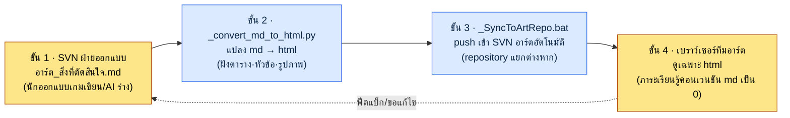

# 9.3 ArtGuide/06_UI การทำงานร่วมกัน — นักออกแบบเกมเขียนด้วย md ส่วนทีมอาร์ตดูเฉพาะ html

> ผู้อ่านหลัก: นักออกแบบ UX·UI ที่ทำงานร่วมกับสายงานที่ไม่ใช่นักออกแบบ (ทีมอาร์ต) ทุกวัน (ทีมขนาดกลาง)
> ฉบับย่อสำหรับผู้อ่านคนเดียว/งานอดิเรก: §9.3.8 「ถ้าทำคนเดียวก็แค่นี้พอ」

เมื่อนักออกแบบเกมจัดระเบียบสิ่งที่ตัดสินใจเรื่อง UI ไว้ในรูปแบบ Markdown งานจะเรียบร้อยขึ้น มีการควบคุมเวอร์ชัน เห็น diff และโยนให้ AI ได้ทันที ปัญหาคือทีมอาร์ตไม่อ่าน Markdown พูดให้ตรงกว่านั้นคือ ไม่มีเหตุผลที่จะต้องอ่าน ถ้าบอกนักออกแบบอาร์ตว่า "ช่วยดึงไฟล์ `아트_결정사항.md` จาก SVN มาดูหน่อย" ครึ่งหนึ่งยังไม่ได้ติดตั้ง SVN client ส่วนอีกครึ่งที่เหลือมองหน้าจอที่เปิดด้วย Notepad ซึ่งหัวข้อ `##` กับไวยากรณ์ตารางพังหมด แล้วถามว่า "อันนี้ดูยังไง"

วิธีแก้ที่ผิดตรงนี้คือ "มาสอน Markdown ให้ทีมอาร์ตกันเถอะ" เวลาของนักออกแบบอาร์ตควรใช้ไปกับการดันพิกเซล เวลาที่ใช้ไปกับการเรียนรู้คอนเวนชัน Markdown การ check out จาก SVN และวิธีดู diff ล้วนเป็นการสูญเสียทั้งหมด วิธีแก้ที่ถูกคือ **ทำให้ฝั่งนักออกแบบเกมเป็นผู้อัตโนมัติการแปลงและการส่งต่อ เพื่อทำให้ภาระการเรียนรู้ของทีมอาร์ตเป็น 0** นักออกแบบเกมเขียนด้วย md สคริปต์แปลงเป็น html สคริปต์อีกตัวดันเข้าไปยัง repository ของอาร์ต และทีมอาร์ตดูเฉพาะ html ในเบราว์เซอร์ บทนี้จะรันไปป์ไลน์นั้นจริงให้จบครบหนึ่งรอบ — ตั้งแต่จุดที่ดึงร่างสิ่งที่ตัดสินใจออกมาด้วย AI การอัตโนมัติการแปลงและการส่งต่อ ไปจนถึงสิ่งที่มนุษย์ปฏิเสธ

---

## 9.3.1 จุดที่การทำงานร่วมกันพังจริง ๆ คือ 'ฟอร์แมต'

หนังสือจำนวนมากสรุปสาเหตุที่การทำงานร่วมกันระหว่างฝ่ายออกแบบกับอาร์ตพังว่าเป็น "อำนาจการตัดสินใจที่คลุมเครือ" ใครเป็นคนกำหนดสี ใครเป็นคนกำหนดฟังก์ชัน การแบ่งหน้าที่นั้นก็สำคัญ แต่ต่อให้วาดตารางแบ่งหน้าที่ได้ดีแค่ไหน **ถ้าทีมอาร์ตอ่านตารางแบ่งหน้าที่นั้นไม่ได้** ก็จะไม่เกิดอะไรขึ้นเลย จุดที่เกิดอุบัติเหตุบ่อยกว่าในงานจริงไม่ใช่อำนาจการตัดสินใจ แต่เป็นฟอร์แมตการส่งต่อ

ในโปรเจกต์ของผู้เขียน (MMORPG ที่เน้นมือถือเป็นหลัก ต่อจากนี้เรียก "โปรเจกต์ A") อุบัติเหตุที่เกิดซ้ำจริงเป็นแบบนี้

| อุบัติเหตุ | สาเหตุที่ผิวเผิน | สาเหตุที่แท้จริง |
|---|---|---|
| อาร์ตทำงานด้วยสิ่งที่ตัดสินใจเวอร์ชันเก่า | "ไม่ได้รับเวอร์ชันล่าสุดนี่นา" | การส่งต่อเป็นแบบมือ (แนบเมล) จึงตกหล่น |
| ตารางสิ่งที่ตัดสินใจดูพัง | "อันนี้ทำไมเป็นแบบนี้" | เปิด md ด้วย Notepad |
| "สิ่งที่ตัดสินใจนั้นจดไว้ที่ไหน" | ส่งต่อด้วยปากเปล่า | ฉบับจริง (canonical) กระจัดกระจายอยู่ในแชต |

อุบัติเหตุทั้งสามไม่ใช่ปัญหาเรื่องอำนาจการตัดสินใจ มันเกิดเพราะ **เอกสารฉบับจริงไม่ได้ถูกส่งต่อในฟอร์แมตที่ทีมอาร์ตอ่าน ไม่ได้ส่งแบบอัตโนมัติ และไม่ได้อยู่ในสถานะล่าสุดเสมอ** ดังนั้นเครื่องมือของบทนี้จึงไม่ใช่ตารางแบ่งหน้าที่ แต่เป็นไปป์ไลน์การส่งต่อ เพราะการแบ่งหน้าที่ตกลงครั้งเดียวก็จบ แต่การส่งต่อเกิดขึ้นทุกครั้งที่การตัดสินใจเปลี่ยน

เริ่มจากดูโครงสร้างโฟลเดอร์จริงก่อน อาร์ตไกด์ของโปรเจกต์ A แบ่งเป็น 7 โดเมนภายใต้ `workspace/96_ArtGuide/`

```
96_ArtGuide/
├── 00_Common/      # ส่วนกลาง (สไตล์·พาเลตต์สี·เกณฑ์การจัดแสง)
├── 01_Character/
├── 02_Animation/
├── 03_Monster/
├── 04_NPC/
├── 05_VFX/
├── 06_UI/          # ← พื้นที่ที่บทนี้พูดถึง
└── 07_Env/
```

และในโฟลเดอร์นี้มีไฟล์สำหรับการทำงานสองตัวอยู่ด้วยกัน คือ `_convert_md_to_html.py` กับ `_SyncToArtRepo.bat` สองไฟล์นี้คือกระดูกสันหลังของบทนี้

---

## 9.3.2 ไปป์ไลน์ sync 4 ขั้น — จาก md ของนักออกแบบเกมถึงเบราว์เซอร์ของทีมอาร์ต

ภาพรวมทั้งหมดมีสี่ขั้น แก่นคือ **มนุษย์ (นักออกแบบเกม) แตะแค่ md ในขั้นที่ 1 ส่วนอีก 3 ขั้นที่เหลือสคริปต์รันทั้งหมด** ทีมอาร์ตดูเฉพาะ html ในขั้นที่ 4 ไม่จำเป็นต้องรู้ด้วยซ้ำว่ามี md อยู่



จะระบุให้ชัดว่าแต่ละขั้นทำอะไรกันแน่

**ขั้น 1 (นักออกแบบเกม, มนุษย์)** — เขียนสิ่งที่ตัดสินใจลงใน `06_UI/아트_결정사항.md` ด้วย Markdown วิธีสอด AI เข้าตรงจุดนี้คือกระดูกสันหลังของ §9.3.4 สิ่งที่ตัดสินใจเป็นรายการอย่างเช่น "สี primary ของปุ่มคือ #3A7BD5", "เป้าการแตะขั้นต่ำ 44pt"

**ขั้น 2 (`_convert_md_to_html.py`, อัตโนมัติ)** — แปลง md เป็น html ไม่ใช่การแปลงธรรมดา แต่เรนเดอร์ตารางให้ทีมอาร์ตดูง่าย ฝังการอ้างอิงรูปภาพ `` แบบอินไลน์ และใส่สารบัญให้ ผลลัพธ์คือ html แบบสมบูรณ์ในตัวเองที่นักออกแบบอาร์ตเปิดได้ด้วยการดับเบิลคลิกครั้งเดียวในเบราว์เซอร์

**ขั้น 3 (`_SyncToArtRepo.bat`, อัตโนมัติ)** — push html ที่แปลงแล้วเข้าไปยัง **SVN repository แยกต่างหากของทีมอาร์ต** แก่นคือ repository ของฝ่ายออกแบบและ repository ของอาร์ตถูกแยกออกจากกัน ทีมอาร์ตดูแค่ repository ของตัวเองก็พอ ไม่จำเป็นต้องรู้สิทธิ์เข้าถึงหรือโครงสร้างของ repository ฝ่ายออกแบบ

**ขั้น 4 (ทีมอาร์ต, มนุษย์)** — นักออกแบบอาร์ตเปิด html ที่ซิงค์มาในเบราว์เซอร์จาก repository ของตัวเอง ไม่จำเป็นต้องเรียนทั้งไวยากรณ์ Markdown คำสั่ง SVN และวิธีดู diff การที่ **ภาระการเรียนรู้คอนเวนชัน md เป็น 0** คือทั้งเป้าหมายการออกแบบและเกณฑ์ความสำเร็จของไปป์ไลน์นี้

ฟีดแบ็กย้อนจากขั้น 4 กลับมาขั้น 1 เมื่ออาร์ตบอกว่า "สิ่งที่ตัดสินใจอันนี้แปลก ๆ" นักออกแบบเกมก็แก้ md แล้วขั้น 2\~3 รันอัตโนมัติอีกครั้ง อาร์ตแค่เปิด html ที่อัปเดตแล้วใหม่ก็พอ

---

## 9.3.3 ทำไมต้องอัตโนมัติการแปลงและการส่งต่อ — ความไม่สมมาตรของภาระการเรียนรู้

ตรงนี้จะหยุดสักครั้งแล้วระบุเจตนาการออกแบบให้ชัด การเปลี่ยน md เป็น html ในตัวมันเองเป็นเรื่องเล็กน้อย การออกแบบที่แท้จริงอยู่ที่การตัดสินว่า **ใครจะแบกภาระการเรียนรู้ของใคร**

ทางเลือกมีสองแยก

<svg viewBox="0 0 640 300" xmlns="http://www.w3.org/2000/svg" role="img" aria-label="เปรียบเทียบสองวิธีกระจายภาระการเรียนรู้ — แบบที่ทีมอาร์ตเรียน md กับแบบที่นักออกแบบเกมแบกการอัตโนมัติ">
  <!-- ซ้าย: แบบที่ผิด -->
  <rect x="20" y="20" width="280" height="260" rx="10" fill="#1a1014" stroke="#7f1d1d" stroke-width="2"/>
  <text x="160" y="48" fill="#fecaca" font-family="sans-serif" font-size="15" text-anchor="middle" font-weight="bold">แบบ A — ทีมอาร์ตเรียน md</text>
  <rect x="50" y="70" width="100" height="44" rx="6" fill="#3a1518" stroke="#b91c1c"/>
  <text x="100" y="97" fill="#fca5a5" font-family="sans-serif" font-size="12" text-anchor="middle">นักออกแบบเกม</text>
  <text x="100" y="135" fill="#fca5a5" font-family="sans-serif" font-size="11" text-anchor="middle">เขียนแค่ md</text>
  <line x1="150" y1="92" x2="190" y2="92" stroke="#b91c1c" stroke-width="2" marker-end="url(#arrowR)"/>
  <rect x="190" y="70" width="100" height="44" rx="6" fill="#3a1518" stroke="#b91c1c"/>
  <text x="240" y="91" fill="#fca5a5" font-family="sans-serif" font-size="12" text-anchor="middle">อาร์ต 5 คน</text>
  <text x="240" y="107" fill="#fca5a5" font-family="sans-serif" font-size="10" text-anchor="middle">×เรียน SVN·md</text>
  <text x="160" y="170" fill="#fda4af" font-family="sans-serif" font-size="11" text-anchor="middle">ต้นทุนเรียนรู้ = เขียน 1 ครั้ง ×</text>
  <text x="160" y="188" fill="#fda4af" font-family="sans-serif" font-size="11" text-anchor="middle">คูณด้วยจำนวนคนอาร์ต</text>
  <text x="160" y="222" fill="#f87171" font-family="sans-serif" font-size="12" text-anchor="middle" font-weight="bold">ภาระกัดกินเวลางาน</text>
  <text x="160" y="240" fill="#f87171" font-family="sans-serif" font-size="12" text-anchor="middle" font-weight="bold">ดันพิกเซล → ถูกปฏิเสธ</text>
  <!-- ขวา: แบบที่เลือกใช้ -->
  <rect x="340" y="20" width="280" height="260" rx="10" fill="#0d1512" stroke="#15803d" stroke-width="2"/>
  <text x="480" y="48" fill="#bbf7d0" font-family="sans-serif" font-size="15" text-anchor="middle" font-weight="bold">แบบ B — นักออกแบบเกมอัตโนมัติ</text>
  <rect x="370" y="70" width="100" height="44" rx="6" fill="#0f2417" stroke="#16a34a"/>
  <text x="420" y="91" fill="#86efac" font-family="sans-serif" font-size="12" text-anchor="middle">นักออกแบบเกม</text>
  <text x="420" y="107" fill="#86efac" font-family="sans-serif" font-size="10" text-anchor="middle">md+สคริปต์ 1 ครั้ง</text>
  <line x1="470" y1="92" x2="510" y2="92" stroke="#16a34a" stroke-width="2" marker-end="url(#arrowG)"/>
  <rect x="510" y="70" width="100" height="44" rx="6" fill="#0f2417" stroke="#16a34a"/>
  <text x="560" y="91" fill="#86efac" font-family="sans-serif" font-size="12" text-anchor="middle">อาร์ต 5 คน</text>
  <text x="560" y="107" fill="#86efac" font-family="sans-serif" font-size="10" text-anchor="middle">ดับเบิลคลิก html</text>
  <text x="480" y="170" fill="#86efac" font-family="sans-serif" font-size="11" text-anchor="middle">ต้นทุนเรียนรู้ = นักออกแบบเกม 1 ครั้ง</text>
  <text x="480" y="188" fill="#86efac" font-family="sans-serif" font-size="11" text-anchor="middle">(ภาระอาร์ต 0)</text>
  <text x="480" y="222" fill="#4ade80" font-family="sans-serif" font-size="12" text-anchor="middle" font-weight="bold">อาร์ตโฟกัสที่พิกเซลอย่างเดียว</text>
  <text x="480" y="240" fill="#4ade80" font-family="sans-serif" font-size="12" text-anchor="middle" font-weight="bold">→ ใช้ต่อเนื่อง</text>
  <defs>
    <marker id="arrowR" markerWidth="8" markerHeight="8" refX="6" refY="3" orient="auto"><path d="M0,0 L6,3 L0,6 Z" fill="#b91c1c"/></marker>
    <marker id="arrowG" markerWidth="8" markerHeight="8" refX="6" refY="3" orient="auto"><path d="M0,0 L6,3 L0,6 Z" fill="#16a34a"/></marker>
  </defs>
</svg>

แก่นคือความไม่สมมาตร แบบ A ต้นทุนการเรียนรู้ถูกคูณด้วยจำนวนคนอาร์ต และต้นทุนนั้นเกิดซ้ำกับพนักงานใหม่ทุกคน ส่วนแบบ B นักออกแบบเกมเขียนสคริปต์ครั้งเดียวก็จบ และต้นทุนส่วนเพิ่มฝั่งอาร์ตเป็น 0 **การโยนภาระไปยังฝั่งที่อัตโนมัติได้ ไม่ใช่ฝั่งที่มีคนเยอะ** — นี่คือหลักการข้อ 1 ของเครื่องมือทำงานร่วมกันกับสายงานที่ไม่ใช่นักออกแบบ ถ้าหลักการนี้พัง คือถ้าเครื่องมือทำงานร่วมกันบังคับให้สายงานอีกฝ่ายต้องเรียนรู้สิ่งใหม่ เครื่องมือนั้นจะ "ไม่มีใครใช้" ภายในหนึ่งถึงสองไตรมาส

---

## 9.3.4 [บันทึกเซสชันจริง (worked transcript)] ดึงร่างสิ่งที่ตัดสินใจเรื่อง UI ด้วย AI

ในขั้น 1 บอกว่านักออกแบบเกมเขียน md แต่จะแสดงจุดที่ดึงร่าง md นั้นออกมาด้วย AI ให้ครบหนึ่งรอบ เมื่อการประชุมตัดสินใจจบลง จะเหลือบันทึกกระจัดกระจาย (แชต·รูปถ่ายไวต์บอร์ด·ข้อตกลงด้วยปากเปล่า) งานจัดระเบียบสิ่งเหล่านี้ให้เป็น md ฉบับจริงของสิ่งที่ตัดสินใจนั้นน่าเบื่อ และฟอร์แมตแกว่งทุกครั้ง เป็นงานที่เหมาะกับ AI พอดี แต่แก่นคือเส้นแบ่งที่ว่า **การตัดสินใจเองเป็นหน้าที่ของมนุษย์ ส่วน AI แค่จัดระเบียบการตัดสินใจให้เข้าฟอร์แมตที่กำหนดเท่านั้น**

### ขั้นที่ 1 — อินพุต: บันทึกการประชุมแบบดิบ

```
[บันทึกการประชุมตัดสินใจ UI — เกี่ยวกับสล็อตสกิล 06_UI, แบบดิบ]
- ตกลงว่าจะเพิ่มขนาดปุ่มสล็อตสกิล เพราะบนมือถือมันเล็ก
- สีให้อาร์ตเป็นคนกำหนด แต่โทน primary ให้คงโทนสีน้ำเงิน
- ตกลงว่าสถานะสล็อตไม่พร้อมใช้ (คูลดาวน์) แสดงเป็นสีเทา + ตัวเลขซ้อนทับ
- หลายภาษา... ชื่อสกิลยาวขึ้นจะทำยังไงดี ขอพักไว้ก่อน
- อ้อ แล้วก็ให้กดค้าง (long press) แล้วขึ้นคำอธิบายสกิล (อันนี้เป็นฟังก์ชัน ฝ่ายออกแบบยืนยันแล้ว)
```

### ขั้นที่ 2 — พรอมต์: บังคับแยกสิ่งที่ตัดสินใจ/พักไว้/ผู้รับผิดชอบ

```
ไฟล์แนบคือบันทึกการประชุมตัดสินใจ UI แบบดิบ ช่วยจัดระเบียบเป็น Markdown สิ่งที่ตัดสินใจเพื่อส่งให้ทีมอาร์ตหน่อย
จัดประเภทแต่ละรายการเป็น [ยืนยัน]/[พักไว้]/[อาร์ตตัดสิน] (ยืนยัน=ฝ่ายออกแบบกำหนดและอาร์ตทำตาม, พักไว้=ยังไม่ตัดสิน+เหตุผล, อาร์ตตัดสิน=เป็นการแสดงผลทางภาพจึงให้อาร์ตกำหนด·ฝ่ายออกแบบให้แค่ข้อจำกัด) แล้วแนบเหตุผล/ข้อจำกัดบรรทัดละหนึ่ง — ถ้าในบันทึกไม่มีเหตุผล ให้เขียนตามตรงว่า 'ไม่ได้ระบุเหตุผล' อย่าเติมด้วยการคาดเดา
สิ่งที่ตรวจสอบได้ด้วยมาตรฐานสาธารณะอย่างขนาดการแตะ ให้ระบุมาตรฐาน ส่วนรายการที่ไม่มีในบันทึก ห้ามกุขึ้นใหม่เด็ดขาด
ตารางใช้ |รายการ|ประเภท|การตัดสิน/ข้อจำกัด|เหตุผล|ตรวจสอบได้หรือไม่| รวม frontmatter (title, layer: L1) แล้วให้มาเป็นฉบับเต็ม
```

จุดศูนย์ถ่วงของพรอมต์นี้ไม่ได้อยู่ที่งานจัดระเบียบ แต่อยู่ที่การบังคับจัดประเภทและการห้ามกุขึ้น เมื่อสั่งให้ AI จัดระเบียบสิ่งที่ตัดสินใจ มันจะเติม "best practice" ที่ไม่มีในบันทึกเข้ามาอย่างเอื้อเฟื้อ ส่วนที่เติมเข้ามานั้นทีมอาร์ตจะอ่านว่าเป็น "สิ่งที่ฝ่ายออกแบบยืนยันแล้ว" ดังนั้นจึงตอกหมุดสามตัว คือ **การจัดประเภท [ยืนยัน]/[พักไว้]/[อาร์ตตัดสิน] เหตุผลเป็นข้อบังคับ และ "ถ้าไม่มีในบันทึกอย่ากุขึ้น"**

### ขั้นที่ 3 — ผลลัพธ์ดิบของ Claude (เรียบเรียงใหม่จากเซสชันจริง)

```markdown
---
title: 06_UI สิ่งที่ตัดสินใจ — สล็อตสกิล
layer: L1
---

# 06_UI สิ่งที่ตัดสินใจ — สล็อตสกิล

| รายการ | ประเภท | การตัดสิน/ข้อจำกัด | เหตุผล | ตรวจสอบได้ |
|---|---|---|---|---|
| ขนาดปุ่มสล็อตสกิล | [ยืนยัน] | ขั้นต่ำ 44×44 pt ขึ้นไป | เป้าการแตะบนมือถือ, Apple HIG แนะนำ 44pt | ✅ พิกัด·ขนาด |
| โทน primary | [อาร์ตตัดสิน] | คงโทนสีน้ำเงิน (ข้อจำกัด), ค่าที่แม่นยำให้อาร์ต | บันทึก: "โทน primary คงโทนสีน้ำเงิน" | △ ค่าสี |
| การแสดงสถานะคูลดาวน์ | [ยืนยัน] | โอเวอร์เลย์สีเทา + ตัวเลขที่เหลือ | ข้อตกลงในที่ประชุม | ◯ ตรวจสอบด้วยสายตา |
| ความยาวชื่อสกิลหลายภาษา | [พักไว้] | ประชุมภายหลัง | บันทึก: "ขอพักไว้ก่อน" — ภาษาที่ยาว (เยอรมัน·รัสเซีย) ยังไม่ได้ตรวจสอบ | — |
| คำอธิบายสกิลแบบกดค้าง | [ยืนยัน] | กดค้าง → แสดงทูลทิป | ฟังก์ชันยืนยันแล้ว (พื้นที่ฝ่ายออกแบบ) | ◯ ตรวจสอบการทำงาน |
| ระยะห่างระหว่างสล็อต | [ยืนยัน] | แนะนำขั้นต่ำ 8 dp | ไม่ได้ระบุเหตุผล — ไม่มีในบันทึก, อ้างอิงค่าแนะนำของ Material | ✅ |
```

### ขั้นที่ 4 — การตรวจสอบและการปฏิเสธ (พื้นที่ของมนุษย์)

จะอัปโหลดผลลัพธ์นี้เป็นฉบับจริงตรง ๆ ไม่ได้ มีบรรทัดหนึ่งที่ติดขัด

บรรทัดสุดท้าย `ระยะห่างระหว่างสล็อต | แนะนำขั้นต่ำ 8 dp` เมื่อกลับไปดูบันทึก เรื่องระยะห่าง **ไม่เคยถูกพูดถึง** ในที่ประชุม AI ตัดสินว่า "เป็น UI มือถือก็ต้องมีเกณฑ์ระยะห่างด้วยสิ" แล้วเติมค่าแนะนำของ Material Design เข้ามาอย่างเอื้อเฟื้อ นี่คือการละเมิดกฎข้อ 5 ("ห้ามกุรายการที่ไม่มีในบันทึก") แม้ AI จะเขียนตามตรงว่า `ไม่ได้ระบุเหตุผล` แต่ก็ไม่ควรสร้างรายการนั้นขึ้นมาตั้งแต่แรก ถ้าบรรทัดนี้ไปถึงทีมอาร์ต มันจะถูกอ่านว่า "ฝ่ายออกแบบยืนยันระยะห่าง 8dp แล้ว"

ดังนั้นจึงสั่งใหม่

```
'ระยะห่างระหว่างสล็อต' ไม่มีในบันทึกการประชุม เป็นสิ่งที่คุณเติมเข้ามาเอง ช่วยเอาออกจากตาราง
สิ่งที่ไม่มีในบันทึกแต่ดูเหมือนจำเป็นต้องตัดสิน ให้ใส่ไว้เป็นเพียงรายการเสนอที่ '## ค้างอยู่ — วาระประชุมครั้งหน้า' ด้านล่างสุด ไม่ใช่ในตาราง และในตารางสิ่งที่ตัดสินใจให้เหลือเฉพาะรายการที่มีอยู่จริงในบันทึกเท่านั้น
```

AI เอารายการระยะห่างออกจากตาราง แล้วแยก "วาระประชุมครั้งหน้า: เกณฑ์ระยะห่างระหว่างสล็อต (ปัจจุบันยังไม่กำหนด), การจัดการความยาวชื่อสกิลหลายภาษา" เป็นรายการเสนอไว้ด้านล่างสุด ตอนนี้ในตารางสิ่งที่ตัดสินใจเหลือแต่สิ่งที่ตัดสินใจจริงในที่ประชุม ส่วนรายการเสนอที่สมเหตุสมผลซึ่ง AI นึกขึ้นมาถูกลดระดับจาก "ยืนยัน" เป็น "วาระ" เหตุผลที่การแยกนี้สำคัญคือ ในเอกสารที่ทีมอาร์ตได้รับ **ถ้าสิ่งที่ยืนยันแล้วกับสิ่งที่ยังถกกันอยู่ปะปนกัน อาร์ตจะเข้าใจว่าสิ่งที่ยังไม่กำหนดเป็นสิ่งที่ยืนยันแล้วและเริ่มงาน**

ด้วยการไป-กลับครั้งเดียวนี้ ขั้น 1 (md) ก็เสร็จสมบูรณ์ ตอนนี้พ้นมือมนุษย์แล้วส่งต่อไปยังการอัตโนมัติขั้น 2\~3

---

## 9.3.5 การอัตโนมัติขั้น 2\~3 — การแปลงและการส่งต่อ มนุษย์ไม่ต้องแตะ

md ที่เสร็จแล้วตอนนี้สคริปต์จัดการต่อ โครงของสคริปต์แปลงนั้นเรียบง่าย

```python
# _convert_md_to_html.py (โครง)
# อินพุต: 06_UI/*.md (นักออกแบบเกมเขียนสิ่งที่ตัดสินใจ)
# เอาต์พุต: ไฟล์ .html ชื่อเดียวกัน (ไฟล์สมบูรณ์ในตัวเองที่ทีมอาร์ตเปิดในเบราว์เซอร์)

def convert(md_path):
    md_text = read(md_path)
    front, body = split_frontmatter(md_text)          # ดึง title·layer
    html_body = markdown_to_html(body, extensions=[
        "tables",        # เรนเดอร์ตาราง (แก้ตารางพังที่อาร์ตเคยเห็นใน Notepad)
        "fenced_code",
    ])
    html_body = embed_images_inline(html_body, base_dir=md_path.parent)
    # ↑ ฝังการอ้างอิงอย่าง  แบบอินไลน์ →
    #   อาร์ตไม่ต้องรับไฟล์รูปภาพแยกต่างหาก
    toc = build_toc(html_body)                         # สร้างสารบัญอัตโนมัติ
    return render_template(title=front["title"], toc=toc, body=html_body)
```

แก่นตรงนี้คือการแปลงไม่ใช่แค่ md→html ธรรมดา แต่ทำเพิ่มอีกสามอย่าง **เรนเดอร์ตารางให้ถูกต้อง** (ตาราง `|---|` พังที่อาร์ตเคยเห็นใน Notepad หายไป), **ฝังรูปภาพแบบอินไลน์** (อาร์ตไม่ต้องรับไฟล์รูปภาพแยก), และ **ใส่สารบัญอัตโนมัติ** (ต่อให้สิ่งที่ตัดสินใจยาวขึ้น อาร์ตก็กระโดดไปยังรายการที่ต้องการได้) สามอย่างนี้ทำให้ "ดูแค่ html ก็พอ" เป็นจริงได้

สคริปต์ส่งต่อถูกมัดรวมแบบนี้

```bat
REM _SyncToArtRepo.bat (โครง)
REM 1) แปลง md ทั้งหมดของ 06_UI เป็น html
python _convert_md_to_html.py 06_UI\*.md

REM 2) คัดลอก html ที่แปลงแล้วไปยัง working copy ของ SVN อาร์ต
xcopy 06_UI\*.html %ART_REPO%\UI\ /Y

REM 3) commit·push เข้า SVN อาร์ตอัตโนมัติ (repository แยกต่างหาก)
svn add %ART_REPO%\UI\*.html --force
svn commit %ART_REPO%\UI -m "[auto] อัปเดตสิ่งที่ตัดสินใจ 06_UI"
```

สิ่งที่นักออกแบบเกมทำคือดับเบิลคลิก `_SyncToArtRepo.bat` ครั้งเดียว (หรือผูกฮุกให้รันอัตโนมัติเมื่อ commit สิ่งที่ตัดสินใจ) จากนั้นการแปลง·คัดลอก·push เข้า repository อาร์ตจะรันรวดเดียว ทีมอาร์ตอัปเดต repository ของตัวเองก็จะมี html ล่าสุดมาแล้ว

> **AI เข้าไปได้แค่ไหน** — โค้ดการอัตโนมัติขั้น 2\~3 นี้จะให้ AI เขียนก็ได้ "ช่วยเขียนสคริปต์ที่รับโฟลเดอร์ md แปลงเป็น html พร้อมตาราง·รูปภาพ แล้ว push เข้า SVN แยกต่างหากหน่อย" เป็นพื้นที่ที่ AI ทำได้ดี แต่ **จะกำหนดให้การตัดสินใจไหนเป็นสิ่งที่ยืนยัน อะไรจะโยนให้เป็นอาร์ตตัดสิน** (§9.3.4) จะไม่มอบหมายให้ AI โค้ดคือ AI การตัดสินใจคือมนุษย์ — การแบ่งหน้าที่ที่ย้ำตลอดทั้งเล่มก็เป็นเช่นนี้ตรงนี้เหมือนกัน

---

## 9.3.6 พรอมต์รูปภาพก็เขียน 'เจตนาการออกแบบ' ก่อน

กรณีตัวอย่างที่ AI ถูกใช้ผิดในการทำงานร่วมกันกับอาร์ตคือพรอมต์รูปภาพ เมื่อนักออกแบบเกมให้เรเฟอเรนซ์แก่ทีมอาร์ต หรือต้องการแสดงภาพคอนเซปต์อย่างรวดเร็ว จะใช้ AI สร้างรูปภาพ ความผิดพลาดที่พบบ่อยตอนนี้คือเริ่มเขียนจากการบรรยายผลลัพธ์ ("ปุ่มกลมสีน้ำเงิน, เอฟเฟกต์เรืองแสง, 4K")

หนึ่งในหลักการการทำงานร่วมกันของผู้เขียนคือ `image_prompt_design_intent_first` — **พรอมต์รูปภาพก็เขียนเจตนาการออกแบบก่อน ไม่ใช่บรรยายผลลัพธ์**

| วิธี | พรอมต์ | ปัญหา/ผล |
|---|---|---|
| ผลลัพธ์ก่อน (แย่) | "ปุ่มกลมสีน้ำเงิน, เรืองแสง, 4K, UI เกม" | อาร์ตถาม "ทำไมสีน้ำเงิน?" ไม่ได้ เจตนาระเหยหาย |
| เจตนาก่อน (ดี) | "ปุ่มสกิลที่บอกสถานะพร้อมใช้/คูลดาวน์ได้อย่างเข้าใจง่าย ใช้งานได้=ดึงดูดสายตาให้อยากกดทันที, คูลดาวน์=ยับยั้ง โทนเป็น primary สีน้ำเงิน" | อาร์ตดูเจตนาแล้วเสนอแนวทางภาพที่ดีกว่ากลับมาได้ |

ความต่างคือสิ่งที่ทีมอาร์ตทำได้เมื่อได้รับพรอมต์ ถ้าได้รับแค่การบรรยายผลลัพธ์ อาร์ตจะวาดตามนั้นหรือไม่ก็เพิกเฉย มีแค่สองทาง **ถ้าได้รับเจตนาการออกแบบ อาร์ตจะเสนอแนวทางภาพของตัวเองที่ตอบเจตนานั้นได้ดีกว่า** นี่คือวิธีที่นักออกแบบเกมให้ทิศทางโดยไม่ล้ำเข้าไปในพื้นที่การตัดสินใจของอาร์ต ([อาร์ตตัดสิน] ใน §9.3.4) นักออกแบบเกมให้ "เพื่ออะไร" ส่วนอาร์ตกำหนด "ให้ดูเป็นอย่างไร"

ดังนั้นเมื่อใส่เรเฟอเรนซ์รูปภาพลงใน md สิ่งที่ตัดสินใจของ §9.3.4 ก็เขียนแคปชันไม่ใช่ "ปุ่มสีน้ำเงิน" แต่เป็น "สล็อตที่มีจุดประสงค์เพื่อแยกสถานะคูลดาวน์ — การแสดงผลที่แม่นยำเป็นอาร์ตตัดสิน" เนื่องจากสคริปต์แปลงฝังแคปชันนี้ทั้งดุ้นลงใน html อาร์ตจึงได้รับทั้งรูปภาพและเจตนาไปพร้อมกัน

---

## 9.3.7 การวัด — อะไรที่นับได้อย่างซื่อสัตย์

มีสิ่งเย้ายวนให้เขียนผลของไปป์ไลน์นี้เป็นตัวเลขอย่าง "อุบัติเหตุการทำงานร่วมกันลดลง 70%" ตัวเลขแบบนั้นถ้าไม่ได้รับการตรวจสอบจะบั่นทอนความน่าเชื่อถือของหนังสือ จะแยกแยะอย่างซื่อสัตย์

**สิ่งที่ตรวจสอบได้ด้วยมาตรฐานสาธารณะ** — มาตรฐานสาธารณะที่อยู่ในสิ่งที่ตัดสินใจอย่างการแตะ 44pt·ระยะห่าง 8dp·คอนทราสต์ 4.5:1 เป็นไปตาม rulebook ใน §9.1 ไม่ใช่ตัวเลขที่กุขึ้น แต่เป็นค่าที่อ้างอิงมาตรง ๆ และตรวจสอบอัตโนมัติได้ด้วย lint

**ตัวชี้วัดเชิงปฏิบัติการที่วัดได้** — สิ่งที่ไปป์ไลน์นี้นับได้จริงคือสิ่งเหล่านี้ จำนวนอุบัติเหตุที่อาร์ตทำงานด้วยเวอร์ชันเก่า (ถ้าการส่งต่อเป็นอัตโนมัติจะเข้าใกล้ 0), เวลาที่พนักงานใหม่ของทีมอาร์ตใช้กว่าจะเปิดดูสิ่งที่ตัดสินใจครั้งแรก (ถ้าดับเบิลคลิก html ก็เป็นหน่วยนาที), ความล่าช้ากว่าการเปลี่ยนการตัดสินใจจะสะท้อนเข้า repository อาร์ต (เวลารันสคริปต์) สามอย่างนี้ไม่ใช่ "ความรู้สึก" แต่นับได้ด้วยล็อก·การสังเกต

**การประมาณของผู้เขียน (สมมติฐานที่ยังไม่ได้ตรวจสอบ)** — ทิศทางที่ว่า "ตกหล่นน้อยลงกว่าตอนส่งต่อด้วยเมลแบบมือ" นั้นชัดเจน แต่อัตราการลดที่แม่นยำไม่ได้บันทึกตัวอย่างไว้ต่างหาก จึงไม่ฟันธง อ่านเป็น **ทิศทาง** ดีกว่าค่าสัมบูรณ์ คือ ถ้าการส่งต่อขึ้นอยู่กับมือมนุษย์ ในสัปดาห์ที่ยุ่งจะต้องมีการตกหล่นแน่นอน แต่ถ้าการส่งต่อเป็นสคริปต์ การตกหล่นจะหายไปเชิงโครงสร้าง

---

## 9.3.8 ลองทำดู — หนึ่งขั้นที่ทำได้วันนี้

> **ถ้าทำคนเดียวก็แค่นี้พอ**: ไม่ต้องมีทั้งทีมอาร์ตและ SVN ลองสมมติว่าคุณส่งต่อการตัดสินใจ UI ให้อาร์ตเอาต์ซอร์สที่คุณจ้าง หรือเพื่อนที่ทำงานร่วมกัน ใช้พรอมต์ของ §9.3.4 ตรง ๆ แล้วลองดึง md หนึ่งหน้าที่จัดประเภทการตัดสินใจ UI กระจัดกระจายในหัวของคุณเป็น [ยืนยัน]/[พักไว้]/[อาร์ตตัดสิน] ออกมาด้วย AI แล้วลองหารายการหนึ่งที่ AI "เติมเข้ามาอย่างเอื้อเฟื้อ" (สิ่งที่ไม่มีในบันทึก) แล้วโต้กลับว่า "อันนี้ฉันไม่เคยกำหนด เอาออก" คุณจะสัมผัสด้วยตัวเองว่าเส้นแบ่งระหว่างมนุษย์กับ AI ในการจัดระเบียบการตัดสินใจอยู่ตรงไหน การแปลงใช้แพ็กเกจ `markdown` แค่บรรทัดเดียว `python -m markdown decision.md > decision.html` ก็พอ

ถ้าเป็นทีม เริ่มจากขั้นเดียวต่อไปนี้ อย่าเพิ่งเขียนการซิงค์สองทางใหญ่โต ใส่ **การแปลงหนึ่งบรรทัด + การส่งต่อหนึ่งบรรทัด** ก่อน สคริปต์แปลงที่เปลี่ยน md สิ่งที่ตัดสินใจเป็น html (แค่การเรนเดอร์ตาราง·ฝังรูปภาพของ §9.3.5) และหนึ่งบรรทัดที่คัดลอก html นั้นไปยังตำแหน่งที่อาร์ตดู (ไดรฟ์ที่แชร์หรือ repository แยกก็ได้) แค่มีสองบรรทัดนี้ อุบัติเหตุที่พบบ่อยที่สุดอย่าง "อาร์ตเจอตารางพังตอนเปิด md ใน Notepad" ก็หายไป ตารางแบ่งหน้าที่·การจัดระเบียบอำนาจการตัดสินใจค่อยมาทีหลัง

สรุปเป็น setup → prompt → verify ได้แบบนี้

| ขั้น | สิ่งที่ต้องทำ |
|---|---|
| setup | ใส่ `_convert_md_to_html.py` (แปลง) + การส่งต่อหนึ่งบรรทัด (คัดลอก/push) ก่อน |
| prompt | จัดระเบียบบันทึกการประชุมเป็น md [ยืนยัน]/[พักไว้]/[อาร์ตตัดสิน] ด้วยพรอมต์ §9.3.4 |
| verify | ปฏิเสธรายการที่ AI กุขึ้น (ที่ไม่มีในบันทึก) → รันการแปลง·ส่งต่ออัตโนมัติ → อาร์ตตรวจแค่ html |

---

### สรุปประเด็นสำคัญของบท
- จุดที่การทำงานร่วมกันพังจริง ๆ ไม่ใช่อำนาจการตัดสินใจ แต่เป็นฟอร์แมตการส่งต่อ
- นักออกแบบเกมเขียนด้วย md สคริปต์ส่งต่อเป็น html — ภาระการเรียนรู้ของอาร์ตเป็น 0
- การจัดระเบียบการตัดสินใจเป็นร่างของ AI การปฏิเสธรายการที่กุขึ้นเป็นของมนุษย์ — โค้ดคือ AI การตัดสินใจคือมนุษย์

### ตัวอย่างบทถัดไป
- 10.1 สรุปรวม atom integrity_check — ขยายการตรวจสอบ UI ไปสู่การตรวจสอบข้อมูลเกมทั้งหมด
