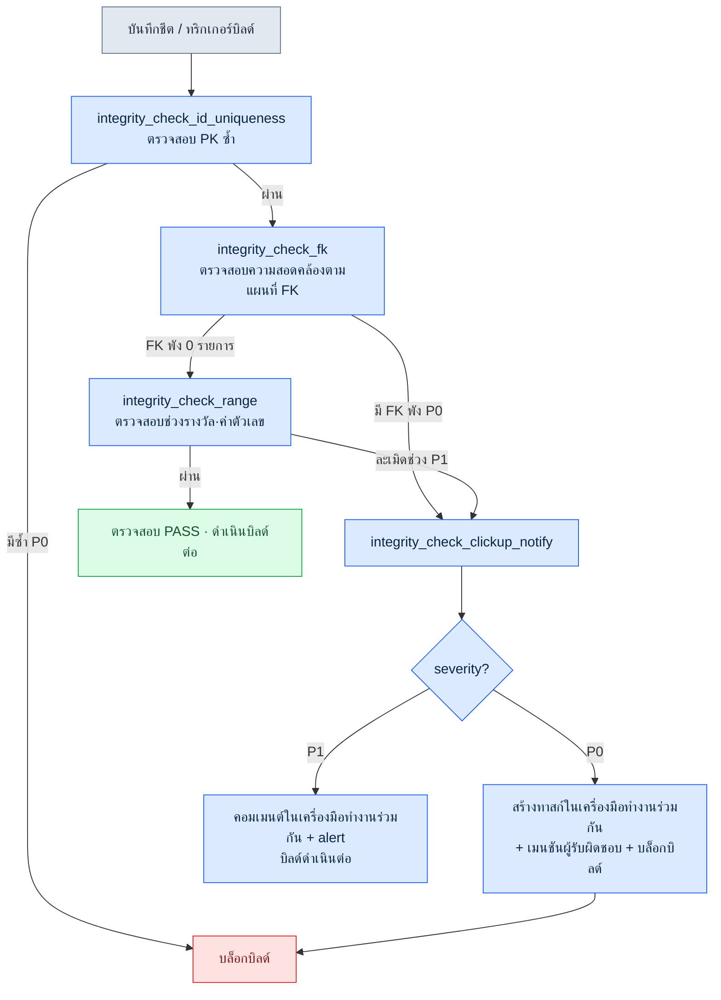

# 10.1 atom ตรวจสอบความสอดคล้อง — cascade ที่รักษา FK ของ 30 ชีต

หกโมงสี่สิบนาทีเย็นวันศุกร์ เป็นวันที่ตัดสินใจใส่เควสต์ใหม่ 12 ชนิดลงในบิลด์ภายในของบริษัทในวันจันทร์สัปดาห์หน้า ผมเพิ่มแถวใหม่ลงใน `quest_table` เติมแถวที่สอดคล้องกันลงในชีตรางวัล แล้วเชื่อมบทพูดของ NPC เข้ากับชีตไดอะล็อก สามชีต ประมาณ 50 แถว ผมไล่ตรวจด้วยตาสองรอบแล้วก็ดูเหมือนจะไม่มีปัญหา

เช้าวันจันทร์บิลด์พัง `reward_id` ที่เควสต์ใหม่หนึ่งรายการอ้างถึงนั้นไม่มีอยู่ในชีตรางวัล ตอนเย็นวันศุกร์ผมลบแถวรางวัลแถวหนึ่งแล้วเพิ่มกลับเข้าไปใหม่ และพิมพ์ id ผิดไปตัวหนึ่ง — จาก `rwd_q318` กลายเป็น `rwd_q381` เป็นพิมพ์ผิดชนิดที่ตามนุษย์ไม่มีทางจับได้เลย สองชีตนี้อยู่คนละโฟลเดอร์ คนละคนแก้ คนละเวลา เมื่อมี 50 แถวก็ยังจับด้วยตาได้ แต่เมื่อชีตกว่า 30 ชีตเริ่มอ้างถึงกันด้วยคีย์นอก (FK) ตามนุษย์ก็ไม่ใช่เครื่องมือตรวจสอบอีกต่อไป

บทนี้จะแสดง atom ตรวจสอบชนิดหนึ่งที่จับพิมพ์ผิดแบบนั้นได้ก่อนที่บิลด์จะพัง — `integrity_check_fk` — ซึ่งตรวจสอบความสอดคล้องของ FK ในชีตกว่า 30 ชีต และเมื่อพังก็จะแจ้งไปยังผู้รับผิดชอบผ่านเครื่องมือทำงานร่วมกัน (SaaS ที่จัดการงานและกำหนดการ — โปรเจกต์นี้ใช้ ClickUp ส่วน JIRA และ Redmine ก็อยู่ในตำแหน่งเดียวกัน) ผมจะแสดงผ่านการไล่ตามเซสชันจริงเซสชันหนึ่งที่ผมรันมาเอง

ผมเข้าวงการนี้ครั้งแรกด้วยงานหาบรรทัดที่ผิดเพี้ยนในสิ่งที่คนอื่นทำขึ้นมา งานแรกของผมคือ QA และการตรวจสอบเกมแบบเล่นคนเดียว และตอนนั้นมือกับตาคือเครื่องมือตรวจสอบเพียงอย่างเดียว เวลาผ่านไปกว่า 20 ปี ตอนนี้ผมส่งงานแบบเดียวกันนั้นให้โค้ดทำ — ในตำแหน่งที่ตามนุษย์เลิกเป็นเครื่องมือตรวจสอบไปแล้ว

---

## 10.1.1 สิ่งที่การตรวจสอบต้องจับให้ได้ — โครงสร้างของ FK ที่พัง

ก่อนอื่นมาดูภาพว่าตรวจสอบอะไรกันแน่ ชีตข้อมูลเกมก็เหมือนฐานข้อมูลเชิงสัมพันธ์ คอลัมน์หนึ่งของชีตหนึ่งชี้ไปยังคีย์หลักของอีกชีตหนึ่ง หากลูกศรนี้ขาด เกมจะตายตอนรันไทม์ หรือที่แย่กว่านั้นคือแสดงค่าว่างออกมาอย่างเงียบ ๆ

<svg viewBox="0 0 640 260" xmlns="http://www.w3.org/2000/svg" font-family="sans-serif" font-size="13">
  <rect x="20" y="30" width="150" height="90" rx="6" fill="#eef4ff" stroke="#3b6fb6" stroke-width="1.5"/>
  <text x="95" y="50" text-anchor="middle" font-weight="bold">quest_table</text>
  <line x1="20" y1="60" x2="170" y2="60" stroke="#3b6fb6"/>
  <text x="32" y="78">quest_id (PK)</text>
  <text x="32" y="98" fill="#c0392b">reward_id (FK)</text>
  <text x="32" y="116" fill="#c0392b">npc_id (FK)</text>

  <rect x="250" y="20" width="150" height="60" rx="6" fill="#eafbe7" stroke="#3a9d3a" stroke-width="1.5"/>
  <text x="325" y="40" text-anchor="middle" font-weight="bold">reward_table</text>
  <line x1="250" y1="50" x2="400" y2="50" stroke="#3a9d3a"/>
  <text x="262" y="68">reward_id (PK)</text>

  <rect x="250" y="150" width="150" height="60" rx="6" fill="#eafbe7" stroke="#3a9d3a" stroke-width="1.5"/>
  <text x="325" y="170" text-anchor="middle" font-weight="bold">npc_table</text>
  <line x1="250" y1="180" x2="400" y2="180" stroke="#3a9d3a"/>
  <text x="262" y="198">npc_id (PK)</text>

  <line x1="170" y1="93" x2="250" y2="55" stroke="#3a9d3a" stroke-width="2" marker-end="url(#ok)"/>
  <line x1="170" y1="111" x2="250" y2="175" stroke="#c0392b" stroke-width="2" stroke-dasharray="6 4" marker-end="url(#bad)"/>
  <text x="430" y="120" fill="#c0392b" font-weight="bold">npc_id 'npc_307' →</text>
  <text x="430" y="140" fill="#c0392b">ไม่มีใน npc_table (FK ที่พัง)</text>

  <defs>
    <marker id="ok" markerWidth="8" markerHeight="8" refX="6" refY="4" orient="auto"><path d="M0,0 L8,4 L0,8 Z" fill="#3a9d3a"/></marker>
    <marker id="bad" markerWidth="8" markerHeight="8" refX="6" refY="4" orient="auto"><path d="M0,0 L8,4 L0,8 Z" fill="#c0392b"/></marker>
  </defs>
</svg>

เส้นทึบสีเขียวคือการอ้างอิงที่ยังมีชีวิต ค่าที่ `quest_table.reward_id` ชี้ไปนั้นมีอยู่จริงใน `reward_table.reward_id` เส้นประสีแดงคือการอ้างอิงที่ตายแล้ว — `npc_id` ของเควสต์หนึ่งชี้ไปยัง id ที่ไม่มีอยู่ใน `npc_table` สิ่งที่ `integrity_check_fk` จับได้คือเส้นประสีแดงนี้

ชีตข้อมูลของโปรเจกต์ A มีการอ้างอิงเช่นนี้ไม่ใช่แค่หนึ่งหรือสองแห่ง ชีตกว่า 30 ชีตชี้ถึงกัน และหากวาดลูกศร FK ทั้งหมดออกมาก็จะใส่ลงในหน้าเดียวไม่ได้ การให้คนไล่ตามด้วยมือทุกครั้งจึงเป็นไปไม่ได้

---

## 10.1.2 หนึ่งเซสชัน — กระบวนการทั้งหมดที่การตรวจสอบจับ FK ที่พังได้

จากตรงนี้ไปคือเซสชันที่ผมรันมาจริง ผมจะไม่สรุปย่อ แต่จะบันทึกทั้งพรอมต์เต็ม ผลลัพธ์ดิบ และส่วนที่ผมปฏิเสธแล้วร้องขอใหม่ ไว้ตามจริงทั้งหมด

### ขั้นที่ 1 — ให้อ่านชีตแล้วดึงคอลัมน์ที่อาจเป็น FK ออกมา

ก่อนอื่นผมให้ตัวตรวจสอบสร้างแผนที่ FK ที่ว่า "คอลัมน์ไหนชี้ไปยังชีตไหน" ขึ้นมาก่อน เนื่องจากการให้คนลงทะเบียน FK ของ 30 ชีตทีละรายการนั้นไม่สมจริง ผมจึงให้มันอนุมานคอลัมน์ที่อาจเป็น FK โดยอัตโนมัติด้วยกฎการตั้งชื่อคอลัมน์ของชีตข้อมูลจำเพาะ (`*_id` ชี้ไปยังชีตที่มีชื่อเดียวกัน) พรอมต์เต็มที่ผมป้อนเข้าไปมีดังนี้

> อ่านชีตข้อมูลจำเพาะที่แนบมา (แท็บ `$스키마`) แล้วอนุมานคอลัมน์ที่ดูเหมือนเป็นคีย์นอก (FK) ในทุกชีตข้อมูล กฎ: (1) ชื่อคอลัมน์อยู่ในรูป `xxx_id` และ (2) หากในชีต `xxx_table` หรือ `xxx_list` มีคอลัมน์ PK (Primary Key หรือคีย์หลัก) ชื่อเดียวกันอยู่ ให้ถือว่าเป็นคอลัมน์ที่อาจเป็น FK ส่งผลการอนุมานออกมาเป็น JSON ในรูปลิสต์ `{source_sheet, source_column, target_sheet, target_column, confidence}` สิ่งที่ฟันธงด้วยกฎไม่ได้ ให้แสดง confidence เป็น low และเขียนเหตุผลกำกับไว้

ผลลัพธ์ดิบบางส่วนจาก Claude (ผมคัดลอกมาตามจริงรวมถึงรายการที่กำกวมด้วย):

```json
[
  {"source_sheet":"quest_table","source_column":"reward_id",
   "target_sheet":"reward_table","target_column":"reward_id","confidence":"high"},
  {"source_sheet":"quest_table","source_column":"npc_id",
   "target_sheet":"npc_table","target_column":"npc_id","confidence":"high"},
  {"source_sheet":"quest_table","source_column":"prev_quest_id",
   "target_sheet":"quest_table","target_column":"quest_id","confidence":"medium",
   "note":"ชื่อไม่ใช่ quest_id แต่เป็น prev_quest_id จึงไม่เข้ากฎ สันนิษฐานว่าเป็นการอ้างอิงตัวเองในชีตเดียวกัน ต้องให้คนยืนยัน"},
  {"source_sheet":"reward_table","source_column":"item_id",
   "target_sheet":"item_table","target_column":"item_id","confidence":"high"},
  {"source_sheet":"dialogue_table","source_column":"speaker_id",
   "target_sheet":"npc_table","target_column":"npc_id","confidence":"low",
   "note":"ไม่ชัดว่า speaker_id ชี้ไปยัง npc_id หรือ player ดูเหมือนมีแถวที่ speaker เป็น 'player' อยู่ด้วย ฟันธงไม่ได้"}
]
```

ตรงนี้ผมไม่ได้ปล่อยให้สองรายการผ่านไปเฉย ๆ `prev_quest_id` (การอ้างอิงตัวเอง) ผมรับมาเป็นเป้าหมายการตรวจสอบ แต่เติมข้อยกเว้นด้วยตัวเองว่า "ค่าว่าง (เควสต์แรก) ไม่ถือเป็นการละเมิด" ส่วน `dialogue_table.speaker_id` ผมปฏิเสธ — เพราะมีแถวที่ `speaker` เป็น `'player'` อยู่จริง หากนำมันมาตรวจสอบเป็น FK บทพูดของผู้เล่นทั้งหมดจะถูกจับเป็นการละเมิดเท็จ

การปฏิเสธนี้สำคัญ หากนำแผนที่ FK ที่อนุมานอัตโนมัติมาใช้โดยไม่ผ่านการตรวจสอบ ในการรันครั้งแรกจะมีการละเมิดเท็จหลายร้อยรายการทะลักออกมา ต้องให้คนกรองสักครั้งก่อน การตรวจสอบจึงจะได้รับความเชื่อถือ

### ขั้นที่ 2 — นิยาม atom ตรวจสอบด้วยแผนที่ FK ที่ผ่านการตรวจสอบแล้ว

ผมตรึงแผนที่ FK ที่กรองแล้วไว้เป็นอินพุตของ atom `integrity_check_fk` รูปแบบของ atom มีดังนี้ นี่คือฉบับเต็มของ atom ตรวจสอบหนึ่งตัวที่ใช้งานจริงในโปรเจกต์ A

```yaml
---
name: integrity_check_fk
description: ตรวจสอบว่าค่าในทุกคอลัมน์ source มีอยู่ใน PK ของชีต target ตามแผนที่ FK ที่ลงทะเบียนไว้
type: integrity_check
category: data
priority: P0          # FK ที่พังจะบล็อกบิลด์
execution_time:
  - on_save           # เฉพาะชีตนั้นเมื่อบันทึกชีต
  - on_build          # FK ทั้งหมดเมื่อบิลด์
  - nightly           # ทั้งหมด + รายงาน ทุกเที่ยงคืน
input:
  fk_map: fk_map.reviewed.json   # แผนที่ที่คนตรวจสอบแล้วในขั้นที่ 1~2
output_format: violation_list
on_violation:
  - notify: clickup           # แจ้ง ClickUp เมื่อล้มเหลว
related_atoms:
  - integrity_check_clickup_notify
  - integrity_check_id_uniqueness
---
```

ตัวตรรกะการตรวจสอบเองไม่ยาว เป็นการตรวจสอบความเป็นสมาชิกของเซต ว่าค่าแต่ละค่าของชีต source มีอยู่ในเซต PK ของชีต target หรือไม่

```python
def check_fk(fk_map, sheets):
    violations = []
    for fk in fk_map:
        pk_set = {r[fk["target_column"]] for r in sheets[fk["target_sheet"]]}
        for i, row in enumerate(sheets[fk["source_sheet"]]):
            val = row[fk["source_column"]]
            if val in ("", None):          # FK ว่างเป็นข้อยกเว้น (กฎที่กำหนดไว้ในขั้นที่ 1)
                continue
            if val not in pk_set:
                violations.append({
                    "fk": f'{fk["source_sheet"]}.{fk["source_column"]}',
                    "row": i + 2,          # เฮดเดอร์ 1 บรรทัด + 1-index
                    "value": val,
                    "target": fk["target_sheet"],
                    "severity": fk.get("severity", "P0"),
                })
    return violations
```

### ขั้นที่ 3 — รันการตรวจสอบ แล้วจับ FK ที่พังจริง

ผมรันการตรวจสอบกับชีตทั้ง 30 ชีตด้วยแผนที่ที่ตรวจสอบแล้ว ผลลัพธ์เป็น `violation_list` มาตรฐาน ต่อไปนี้คือผลที่ออกมาจริงในวันนั้น (id และชื่อชีตปกปิดตัวตน ส่วนจำนวนการละเมิดและโครงสร้างเป็นของจริง)

```json
{
  "check": "integrity_check_fk",
  "executed_at": "2026-05-18 09:14:02",
  "input_files": 31,
  "violations": [
    {"fk": "quest_table.reward_id", "row": 318, "value": "rwd_q381",
     "target": "reward_table", "severity": "P0",
     "message": "reward_id 'rwd_q381' ไม่มีใน reward_table สันนิษฐานว่าพิมพ์ผิดจาก 'rwd_q318'"},
    {"fk": "quest_table.prev_quest_id", "row": 502, "value": "q_0500",
     "target": "quest_table", "severity": "P0",
     "message": "prev_quest_id 'q_0500' ไม่มีใน quest_table สันนิษฐานว่าการเขียนไม่ตรงกัน (เติม 0 นำหน้า) จาก 'q_500'"}
  ],
  "summary": {"fk_checked": 23, "rows_scanned": 4117, "violations": 2, "passed": 4115}
}
```

พิมพ์ผิดของเย็นวันศุกร์ (`rwd_q381`) ถูกจับได้ในบรรทัดแรก รายการที่สองเป็นปัญหาอื่นที่ผมไม่รู้มาก่อน `prev_quest_id` ของเควสต์หนึ่งเป็น `q_0500` แต่ id เควสต์จริงคือ `q_500` เป็นความไม่ตรงกันในการเขียนที่มีการเติม 0 นำหน้า ตามนุษย์ดูเหมือนเหมือนกัน แต่ในฐานะสตริงคือคนละค่า และเกมจะหาเควสต์ก่อนหน้าไม่เจอจึงปล่อยเควสต์นั้นไว้ในสถานะล็อก เป็นข้อบกพร่องชนิดที่หากปล่อยออกไปแล้วผู้เล่นจะส่งคำถามเข้ามา

ข้อความ "สันนิษฐานว่าพิมพ์ผิด" และ "สันนิษฐานว่าเติม 0 นำหน้า" ในฟิลด์ `message` คือส่วนที่ผมให้ตัวตรวจสอบไม่หยุดแค่ความล้มเหลวของความเป็นสมาชิก แต่เสนอค่า PK ที่ใกล้เคียงที่สุด (อิงระยะแก้ไข) มาด้วย ช่วยลดเวลาที่คนต้องไล่ตามว่า "ทำไมอันนี้ถึงพัง" แต่การสันนิษฐานนี้เป็นเพียงคำใบ้เท่านั้น ค่าที่จะแก้จริงให้คนเป็นผู้ตัดสิน

---

## 10.1.3 เมื่อพัง — cascade จนถึงการแจ้งผ่านเครื่องมือทำงานร่วมกัน

มาถึงตรงนี้คือการทำงานของการตรวจสอบหนึ่งตัว แต่ถึงการตรวจสอบจะจับการละเมิดได้ หากไม่มีใครเห็นก็ไม่มีความหมาย หัวใจอยู่ที่กระบวนการที่การละเมิดไปถึงผู้รับผิดชอบทันที ในโปรเจกต์ A กระบวนการนี้มี atom แยกต่างหากชื่อ `integrity_check_clickup_notify` รับผิดชอบ (ในเมตาดาตา JIT มีคะแนนอิมแพ็ก 294.93 ซึ่งเป็นหนึ่งใน atom ที่ได้รับการประเมินสูงสุดในกลุ่ม atom ตรวจสอบ — หมายความว่าการทำให้ความล้มเหลวด้านความสอดคล้องไปถึงคนนั้นสำคัญพอ ๆ กับตัวการตรวจสอบเอง)

cascade ทั้งหมดมีดังนี้ atom ตรวจสอบจะทำงานตามลำดับ และเมื่อมีการละเมิด P0 เกิดขึ้นในขั้นใด ก็จะไหลไปยัง atom แจ้งเตือน



ใน cascade นี้มีการตัดสินใจเชิงออกแบบสองอย่างฝังอยู่

ข้อแรก **การตรวจสอบ PK ซ้ำมาก่อนการตรวจสอบ FK** การตรวจสอบ FK ตั้งอยู่บนสมมติฐานว่า PK ของชีต target นั้นไม่ซ้ำกัน หาก PK ซ้ำกัน คำถามที่ว่า "ค่านี้มีอยู่ในเซต PK หรือไม่" ก็ไร้ความหมายในตัวเอง ดังนั้นผมจึงระบุ `related_atoms: integrity_check_id_uniqueness` ไว้ใน atom ของ `integrity_check_fk` และตรึงลำดับไว้ใน cascade หากการตรวจสอบที่ขึ้นต่อกันล้มเหลว การตรวจสอบ FK จะถูกข้ามไป — เพราะรันไปก็ได้แต่ผลที่ผิดเท่านั้น

ข้อสอง **ความเข้มของการแจ้งเตือนแยกตาม severity** P0 (FK ที่พัง) จะสร้างทาสก์ในเครื่องมือทำงานร่วมกัน เมนชันผู้รับผิดชอบที่ลงทะเบียนไว้ในแผนที่ FK (หากเป็น `reward_table` ก็คือผู้รับผิดชอบรางวัล) และบล็อกบิลด์ ส่วน P1 (ค่าตัวเลขรางวัลหลุดจากช่วงที่แนะนำ — ไม่ใช่ว่าผิด แต่เป็นกรณีที่ต้องตรวจทาน) จะเหลือไว้แค่คอมเมนต์และ alert แล้วปล่อยให้บิลด์ผ่าน หากทำให้ทุกการละเมิดเป็นการบล็อกบิลด์ ในไม่ช้าคนก็จะเรียนรู้วิธีเพิกเฉยต่อการบล็อกบิลด์ การบล็อกใช้เฉพาะกับสิ่งที่ต้องห้ามจริง ๆ เท่านั้น

เนื้อหาของทาสก์ที่ถูกสร้างขึ้นจริงในเครื่องมือทำงานร่วมกัน คือรูปแบบที่หนึ่งรายการของ `violation_list` ถูกแปลงมาตามนั้นเลย

```
[P0] integrity_check_fk ละเมิด — บิลด์ถูกบล็อก
ชีต: quest_table  |  คอลัมน์: reward_id  |  แถว: 318
ค่า 'rwd_q381' ไม่มีใน reward_table
ตัวเลือกที่ใกล้เคียงที่สุด: 'rwd_q318' (ระยะแก้ไข 1)
ผู้รับผิดชอบ: @보상_담당  |  ตรวจพบ: 2026-05-18 09:14  |  บิลด์: nightly-0042
```

ตั้งแต่ผลการตรวจสอบจนไปถึงกล่องจดหมายของคน ไม่มีมือเข้าไปแทรกแม้แต่ครั้งเดียว ตรวจสอบ → จัดประเภท → สร้างทาสก์ → เมนชัน เป็นไปป์ไลน์เดียวกัน เหตุผลที่ทำได้เช่นนี้คือ `violation_list` เป็นรูปแบบเอาต์พุตมาตรฐาน ไม่ว่า atom ตรวจสอบตัวไหนจะจับได้ โครงสร้างเอาต์พุตก็เหมือนกัน atom แจ้งเตือนตัวเดียวจึงรับผลของการตรวจสอบทั้งหมดมาประมวลผลได้

---

## 10.1.4 การปฏิบัติงานที่ลดการละเมิดเท็จ — เก็บหลักฐานการตรวจสอบไว้

เมื่อเปิดการตรวจสอบครั้งแรก จะมีการละเมิดเท็จออกมาแน่นอน `speaker_id` ในขั้นที่ 1 คือตัวอย่าง หากปล่อยทิ้งไว้ คนจะเรียนรู้ว่ารายงานการละเมิด "ยังไงส่วนใหญ่ก็เป็นเท็จ ไม่ดูก็ได้" — เป็นเส้นทางที่พบบ่อยที่สุดที่ทำให้ความเชื่อถือในตัวตรวจสอบพังทลาย

ในโปรเจกต์ A เราป้องกันเรื่องนี้ด้วยหลักการชื่อ `human_review_attestation_evidence_mandatory` เมื่อตัดสินว่าเป็นการละเมิดเท็จและทำการยกเว้น **ต้องเก็บไว้เป็นหลักฐานว่าใคร·เมื่อใด·เพราะอะไรจึงตัดสินเช่นนั้น** ในไฟล์แผนที่ FK (`fk_map.reviewed.json`) แต่ละรายการข้อยกเว้นจะมีสิ่งต่อไปนี้แนบมาด้วย

```json
{
  "source_sheet": "dialogue_table", "source_column": "speaker_id",
  "excluded": true,
  "review": {
    "by": "이민수", "at": "2026-05-18",
    "reason": "speaker_id มีค่าเป็น npc_id หรือลิเทอรัล 'player' ไม่เหมาะกับการตรวจสอบ FK เดี่ยว",
    "follow_up": "พิจารณานำกลับมาใช้ด้วยการตรวจสอบแบบแยกสาขา หลังเพิ่มคอลัมน์ speaker_type"
  }
}
```

หากไม่มีหลักฐานนี้ เมื่อข้อสงสัยที่ว่า "ทำไมคอลัมน์นี้ถึงไม่ตรวจสอบ" ผุดขึ้นมาอีกครั้งในภายหลัง ก็จะไม่มีหลักฐานให้ตอบได้ แล้วก็จะนำกลับเข้าการตรวจสอบอีก และเห็นการละเมิดเท็จหลายร้อยรายการอีก หลักฐานการตรวจสอบช่วยไม่ให้เกิดข้อถกเถียงเดิมซ้ำอีก

---

## ลองทำดู — ตั้งการตรวจสอบความสอดคล้อง FK ขึ้นมาเป็นครั้งแรก

นี่คือขั้นตอนขั้นต่ำสำหรับผู้อ่านที่ต้องการนำการตรวจสอบ FK เข้ามาใช้กับชีตข้อมูลของตัวเอง

**setup** รวบรวมโฟลเดอร์ชีตข้อมูล และข้อมูลจำเพาะของคอลัมน์ (คอลัมน์ไหนเป็น PK และคอลัมน์ไหนเป็น FK) ไว้ที่เดียวกัน หากไม่มีข้อมูลจำเพาะ ก็สามารถเริ่มได้ด้วยกฎชื่อคอลัมน์ (`*_id`) เพียงอย่างเดียว

**prompt** ป้อนสิ่งต่อไปนี้ให้ตัวตรวจสอบ

> อนุมานคอลัมน์ที่อาจเป็น FK จากชีตข้อมูลเหล่านี้ หากคอลัมน์ `xxx_id` ชี้ไปยัง PK ชื่อเดียวกันใน `xxx_table` ให้ถือว่าเป็น FK ส่งผลออกมาเป็น JSON `{source_sheet, source_column, target_sheet, target_column, confidence}` และสิ่งที่ฟันธงด้วยกฎไม่ได้ ให้แสดง confidence เป็น low และเขียนเหตุผลกำกับไว้

**verify** แผนที่ FK ที่ส่งออกมา **ต้องให้คนตรวจสอบทีละบรรทัดเสมอ** การอ้างอิงตัวเอง (`prev_*`) การปนของลิเทอรัล (เช่น `'player'`) และการอ้างอิงหลายรูป (คอลัมน์ที่ชี้ไปยังคนละชีตตามสถานการณ์) นั้นการอนุมานอัตโนมัติมักผิดบ่อย รันการตรวจสอบด้วยแผนที่ที่กรองแล้ว และจัดประเภทการละเมิดที่ออกมาในการรันครั้งแรกทีละรายการว่า "พังจริง / ละเมิดเท็จ" การละเมิดเท็จให้ทำการยกเว้น แต่เก็บเหตุผลไว้ในไฟล์

เมื่อผ่านสามขั้นตอนนี้ เหตุการณ์ที่พิมพ์ผิดตัวเดียวของเย็นวันศุกร์ทำให้บิลด์วันจันทร์พังก็จะหายไป การตรวจสอบจะจับพิมพ์ผิดนั้นได้ใน nightly ของเช้ามืดวันเสาร์ และก่อนเข้างานวันจันทร์ ทาสก์หนึ่งในเครื่องมือทำงานร่วมกันก็จะรอผู้รับผิดชอบอยู่

**ฉบับย่อสำหรับคนเดียว** แม้จะทำงานคนเดียวและไม่มีเครื่องมือทำงานร่วมกัน การตรวจสอบนี้ก็ยังมีความหมาย เขียนแผนที่ FK ด้วยมือสัก 10 บรรทัด แล้วรันฟังก์ชันไพทอนข้างต้นเพียงตัวเดียว ก็จับการอ้างอิงที่พังได้ การแจ้งเตือนใช้เอาต์พุตคอนโซลหรือไฟล์ข้อความก็พอ หัวใจไม่ได้อยู่ที่ช่องทางการแจ้งเตือน แต่อยู่ที่ตัวกระบวนการที่ว่า "เครื่องจับข้อผิดพลาดการอ้างอิงที่ตามนุษย์จับไม่ได้ แล้วทำให้ไปถึงคน"

---

### สรุปประเด็นสำคัญของบท
- ความสอดคล้องของ FK เมื่อชีตเกิน 30 ชีตจะจับด้วยตามนุษย์ไม่ได้ และการตรวจสอบความเป็นสมาชิกของเซตหนึ่งตัวจะทำงานนั้นแทน
- แผนที่ FK ที่อนุมานอัตโนมัติต้องให้คนตรวจสอบเสมอ และการกรองการละเมิดเท็จออกพร้อมเก็บเหตุผลไว้เป็นหลักฐาน คือหัวใจของความเชื่อถือในตัวตรวจสอบ
- คุณค่าของการตรวจสอบไม่ได้จบที่การจับการละเมิด แต่สมบูรณ์เมื่อไปถึงผู้รับผิดชอบผ่าน cascade การแจ้งเตือนของเครื่องมือทำงานร่วมกัน

### ตัวอย่างบทถัดไป
- 10.2 เซนเซอร์ความสอดคล้องของการตัดสินใจ 3-layer — ก้าวข้ามความสมบูรณ์ของข้อมูล ไปสู่การตรวจสอบที่ซับซ้อนยิ่งขึ้นที่จับความผิดเพี้ยนระหว่างการตัดสินใจกับการตัดสินใจ การตัดสินใจกับข้อมูล และการตัดสินใจกับผู้ใช้
