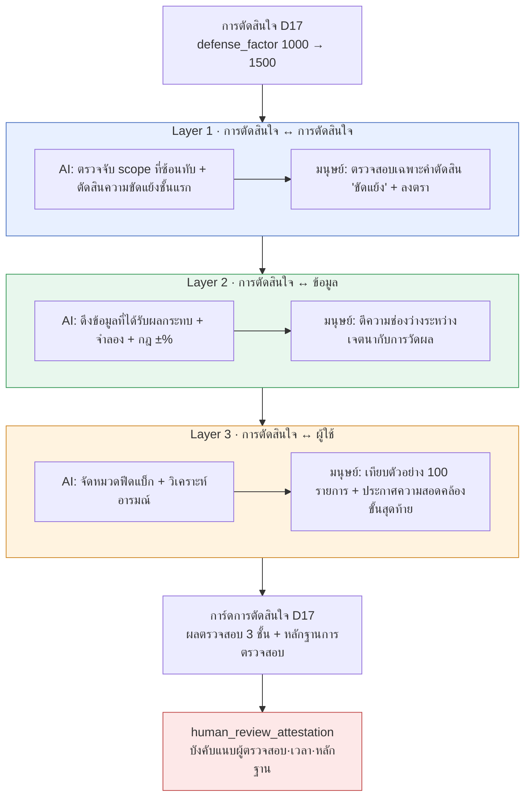

# 10.2 เซนเซอร์ตรวจสอบการตัดสินใจแบบ 3 ชั้น (3-layer) — ที่ทางของหลักฐานการตรวจสอบโดยมนุษย์

ห้าทุ่มของคืนหนึ่ง งาน nightly เสียบการ์ดเข้ามาในเครื่องมือทำงานร่วมกันใบหนึ่ง หัวข้อคือ `[integrity] D17 부합 측정 미수행 7일 경과` มันคือการแจ้งเตือนว่าการตัดสินใจหนึ่งซึ่งถูกนำมาใช้ครบหนึ่งสัปดาห์แล้ว ยังคงค้างอยู่ในบิลด์โดยที่ไม่มีใครตรวจสอบว่า "มันทำงานตามเจตนาจริงหรือไม่" ข้อมูลนั้นไม่มีปัญหา ทั้งรูปแบบของชีต ทั้ง FK ทั้ง enum ผ่านหมด แต่ตัวการตัดสินใจกลับยังไม่ได้รับการตรวจสอบ

ช่องว่างนี้คือจุดตั้งต้นของบทนี้ แม้ข้อมูลจะสมบูรณ์ไร้ที่ติ การตัดสินใจก็ยังผิดได้ และที่ทางที่จะจับความผิดนั้นได้อยู่คนละแห่งกับการตรวจสอบข้อมูล การแบ่งที่ทางนั้นออกเป็นสามชั้น แล้วระบุให้ชัดว่าในแต่ละชั้น AI ช่วยได้ถึงไหน และมนุษย์ลงตราประทับตรงจุดใด — นั่นคือเซนเซอร์ตรวจสอบการตัดสินใจแบบ 3 ชั้น

---

## 10.2.1 ข้อมูลผ่าน แต่การตัดสินใจยังผิดได้

`check` cascade รันการตรวจสอบสี่ชนิดพร้อมกันในครั้งเดียว — doc-audit (ความสอดคล้องของเอกสาร), data-qa (คุณภาพข้อมูล), integrity (ความครบถ้วนสมบูรณ์), link (การอ้างอิงข้ามที่ขาด) เมื่อทั้งสี่อย่างนี้ผ่าน หมายความว่า "ข้อมูลไม่มีปัญหา" แต่บนข้อมูลที่ไม่มีปัญหานั้น การตัดสินใจที่ผิดก็ยังวางทับลงไปได้

แม้ชีตของรางวัลจะสมบูรณ์แบบในเชิงรูปแบบ แต่ถ้าตัวเลขนั้นก่อให้เกิดเงินเฟ้อ; แม้ FK จะไม่ซ้ำกัน แต่ถ้าสองเควสต์ครอบครอง NPC ตัวเดียวกันในเวลาเดียวกัน; แม้ voice จะสอดคล้องกัน แต่ถ้าการตั้งค่าความสัมพันธ์ของตัวละครสองตัวขัดแย้งกัน — การตรวจสอบข้อมูลก็ผ่านทั้งหมด แต่การตัดสินใจผิดทั้งหมด การตรวจสอบข้อมูลดูที่ "ช่องถูกเติมแล้วหรือยัง" ส่วนการตรวจสอบการตัดสินใจดูที่ "ค่านั้นเข้ากันกับการตัดสินใจอื่น กับข้อมูลอื่น และกับผู้ใช้จริงหรือไม่" หากเทียบกับงานบัญชี อย่างแรกคือการตรวจรูปแบบใบสำคัญ ส่วนอย่างหลังคือการตรวจสอบความสอดคล้องของงบการเงิน

ด้วยเหตุนี้ การตรวจสอบการตัดสินใจจึงมี **เซนเซอร์ที่แยกออกมา** ต่างหากจากการตรวจสอบข้อมูล ถ้าผูกรวมไว้ในการตรวจสอบเดียว ผลลัพธ์จะถูกบีบให้เหลือเพียงบรรทัดเดียวว่า "ผ่าน/ไม่ผ่าน" และเมื่อไม่ผ่านก็จะตีความได้คลุมเครือว่าเป็นปัญหาของข้อมูลหรือปัญหาของการตัดสินใจ เมื่อแยกออกจากกัน ความรับผิดชอบจะชัดเจน

---

## 10.2.2 สามชั้น สามจังหวะเวลา และผู้ตรวจสอบสามชนิด

หัวใจของเซนเซอร์ 3 ชั้นคือการแยก **มิติ** ของการตรวจสอบออกเป็นสามส่วน แต่ละชั้นต่างกันทั้งสิ่งที่มอง จังหวะเวลาที่ทำงาน และการแบ่งบทบาทระหว่าง AI กับมนุษย์



ทั้งสามชั้น ตราประทับสุดท้ายเป็นมนุษย์ที่ลง — ตราประทับนั้นคือหลักฐานที่ atom `human_review_attestation_evidence_mandatory` บังคับไว้ ว่าแต่ละชั้นมองอะไร และใครลงตราตรงไหน จะดูทีละชั้นด้านล่างนี้

---

## 10.2.3 Layer 1 — AI คัดกรอง ส่วนมนุษย์ตรวจสอบเฉพาะ 'ความขัดแย้ง'

นี่คือชั้นที่ตรวจว่าการตัดสินใจใหม่ชนกับการตัดสินใจเดิมหรือไม่ จำนวนคู่ของการตัดสินใจเพิ่มขึ้นตามกำลังสองของจำนวนการตัดสินใจ ดังนั้นถ้ามี 200 การตัดสินใจ ก็จะได้ราว 20,000 คู่ มนุษย์ดูด้วยมือทั้งหมดไม่ไหว ด้วยเหตุนี้ AI จึงรันตัวกรองชั้นแรกให้

```python
# decision_conflict_check.py — เซนเซอร์ Layer 1
def check_new_decision(new_decision, existing_decisions):
    conflicts = []
    for existing in existing_decisions:
        if has_overlap(new_decision.scope, existing.scope):   # ชั้นแรกเชิงกลไก: อินเตอร์เซกชันของ scope
            verdict = llm_judge(new_decision, existing)        # AI ชั้นสอง: ขัดแย้ง/เสริม/ไม่เกี่ยว
            if verdict.label == "모순":
                conflicts.append({
                    "with": existing.id,
                    "label": verdict.label,
                    "reason": verdict.reason,
                    "needs_human_review": True,                # ธงให้มนุษย์ตรวจสอบ
                })
    return conflicts
```

`has_overlap` คือตัวกรองชั้นแรกเชิงกลไก scope เป็นพื้นที่ของ atom (`combat`·`narrative`·`economy` ฯลฯ) จึงคำนวณอินเตอร์เซกชันได้แม่นยำ คู่ที่ไม่ซ้อนทับกันจะถูกทิ้งทันที โดยทั่วไป 20,000 คู่จะลดเหลือราวหลายสิบคู่ และมีเพียงหลายสิบคู่นั้นเท่านั้นที่ AI ดู

### บันทึกเซสชันจริงฉบับสมบูรณ์ (worked transcript) — การตัดสินความขัดแย้งของ Layer 1

ตรงนี้จะแสดงให้เห็นจนจบว่าจริง ๆ แล้วมีอะไรเดินเข้าออกบ้าง โดยไม่สรุปย่อ และคงผลลัพธ์ที่กำกวมไว้ตามเดิม

**① พรอมต์ที่มนุษย์ส่ง (ฉบับเต็ม)**

```
판단해 보세요. 다음 두 결정이 모순되는지.

[결정 A] (2026-03-XX) เกตเวย์ของการตัดสินใจ: รวมคูลดาวน์รวม (global cooldown) ของการต่อสู้ทุกสกิลเป็น 0.5 วินาที
[결정 B] (2026-04-XX) สกิลสายฟื้นฟูได้รับการยกเว้นไม่ใช้คูลดาวน์รวม (global cooldown)

รูปแบบคำตัดสิน (ใช้รูปแบบนี้เท่านั้น ห้ามพูดอย่างอื่น):
- label: ขัดแย้ง | เสริม | ไม่เกี่ยว
- reason: หนึ่งบรรทัด
- confidence: 0.0~1.0

อย่าเดา หากหลักฐานอ่อน ให้ลด confidence ลง
```

**② ผลลัพธ์ดิบจาก Claude (ไม่ผ่านการแต่ง)**

```
- label: เสริม
- reason: การตัดสินใจ B มีโครงสร้างเป็นการเพิ่มข้อยกเว้นที่ระบุชัดเจนว่า "สายฟื้นฟู" ให้กับกฎรวม 0.5 วินาทีที่การตัดสินใจ A กำหนดไว้ จึงเป็นการจำกัดให้แคบลงโดยไม่พลิกกฎ
- confidence: 0.74
```

**③ การตรวจสอบ / การปฏิเสธของมนุษย์**

คำตัดสินคือ "เสริม" ด้วย confidence 0.74 ตามกฎแล้ว 'เสริม·ไม่เกี่ยว' จะผ่านอัตโนมัติ แต่ถ้า confidence ต่ำกว่า 0.8 มนุษย์ต้องตรวจสอบอย่างน้อยหนึ่งบรรทัด ผู้ตรวจสอบซึ่งเป็นสมาชิกทีม A อ่านต้นฉบับของการตัดสินใจ B อีกครั้งและพบสิ่งหนึ่ง — การตัดสินใจ B มีเงื่อนไขแนบมาว่า "แต่สกิลฟื้นฟูก็มีคูลดาวน์ของตัวเอง 1.2 วินาที" AI ได้รับเพียงบรรทัดที่สรุปย่อมาแล้ว จึงไม่ได้รับเงื่อนไขนี้เป็นอินพุต สมาชิกทีม A จึงดำเนินการแบบ **ยอมรับแต่เสริม** คำตัดสินของ AI และบันทึกไว้ว่า "อินพุตที่ AI เห็นนั้นไม่ครบถ้วน"

**④ การร้องขอใหม่ (หลังเสริมอินพุต)**

```
[เงื่อนไขเพิ่มเติม] การตัดสินใจ B มีเงื่อนไขแนบมาว่า "สกิลฟื้นฟูได้รับการยกเว้นคูลดาวน์รวม
แต่มีคูลดาวน์ของตัวเอง 1.2 วินาที" กรุณาตัดสินใหม่โดยรวมเงื่อนไขนี้เข้าไปด้วย
```

```
- label: เสริม
- reason: คูลดาวน์ของตัวเอง 1.2 วินาทียาวกว่าคูลดาวน์รวม 0.5 วินาที ดังนั้นแม้สกิลฟื้นฟูจะได้รับ
  การยกเว้น กลับยิ่งมีช่วงห่างที่ยาวกว่า ไม่ขัดกับเจตนาของ A (ป้องกันการสแปม) จึงเสริมกันชัดเจนขึ้น
- confidence: 0.91
```

คำตัดสินยังคงเป็น "เสริม" เหมือนเดิม แต่หลักฐานแน่นขึ้นและ confidence เพิ่มจาก 0.74 เป็น 0.91 สมาชิกทีม A ลงตราประทับ ณ จุดนี้ หัวใจไม่ได้อยู่ที่ผลลัพธ์ แต่อยู่ที่ **การบันทึกกระบวนการ** — คำตัดสินชั้นแรกของ AI, การที่มนุษย์พบอินพุตที่ขาดหาย, การร้องขอใหม่หลังเสริม, และการตรวจสอบขั้นสุดท้าย สี่ขั้นตอนนี้จะถูกป้อนเข้าช่องหลักฐาน Layer 1 ของการ์ดการตัดสินใจตามนั้นเลย

หลักการของบันทึกเซสชันนี้มีเพียงข้อเดียว **แม้แต่คำตัดสิน 'เสริม·ไม่เกี่ยว' ของ AI ก็จะไม่ปล่อยให้ผ่านโดยไม่มีเงื่อนไข** ไม่ใช่ว่า AI ผิด แต่ข้อมูลที่ AI ได้รับนั้นไม่ครบถ้วน และผู้ที่จะพบสิ่งนั้นคือมนุษย์ที่รู้ต้นฉบับของการตัดสินใจ

จังหวะการตรวจสอบมีสามจุด คือ ทันทีเมื่อเพิ่มการตัดสินใจใหม่ + alert, ตรวจสอบก่อนเลื่อนขั้นเมื่อ pending atom เลื่อนขั้น, และตรวจซ้ำทุกคู่ใน nightly

---

## 10.2.4 Layer 2 — AI ทำเกือบทั้งหมด ส่วนมนุษย์ตีความช่องว่าง

นี่คือชั้นที่วัดว่าการตัดสินใจสะท้อนลงในข้อมูลอย่างไร และสอดคล้องกับเจตนาหรือไม่ เป็นชั้นที่ทำให้เป็นอัตโนมัติได้ง่ายที่สุดและแม่นยำที่สุด หากมีตัวจำลอง (simulator) และชีตข้อมูลอยู่แล้ว ก็เพียงใส่กฎการตรวจสอบเข้าไปก็พอ

หากยกการตัดสินใจ `D17` (defense_factor 1000→1500) เป็นตัวอย่าง เซนเซอร์จะดึงชีต `CombatBalance` ผลการจำลองอัตโนมัติ และข้อมูลตัวละครที่ได้รับผลกระทบ มาโดยอัตโนมัติ แล้วเปรียบเทียบเจตนา (อัตราการรอดของแทงค์ +49%) กับผลวัด (จำลอง +52%) กฎตัดสินความสอดคล้องเป็นเชิงปริมาณ

| ส่วนต่างของผลวัดเทียบกับเจตนา | การจัดการ | ใคร |
|---|---|---|
| ภายใน ±10% | สอดคล้อง (ผ่านอัตโนมัติ) | AI |
| ±10\~25% | alert · ทบทวนใหม่ | มนุษย์ตีความ |
| เกิน ±25% | ละเมิด · มีหน้าที่ทบทวนการตัดสินใจใหม่ | มนุษย์ตัดสิน |

ตรงนี้ บทบาทของมนุษย์ไม่ใช่ "AI บอกว่าสอดคล้องก็เลยผ่าน" **การตีความช่วง alert และช่วงละเมิด** ต่างหากที่เป็นงานของมนุษย์ การจำลองของ D17 ได้ +52% ซึ่งอยู่ภายใน ±10% จึงสอดคล้องอัตโนมัติ แต่การจำลองเดียวกันนั้นพ่นผลข้างเคียงออกมาหนึ่งอย่าง — ตัวละครไฮบริด `K_021` แข็งแกร่งขึ้น +28% นอกเหนือเจตนา เนื่องจากไม่ใช่เจตนาโดยตรงของ D17 มันจึงไม่ติดกฎความสอดคล้อง การจับช่วงที่ "กฎผ่าน แต่ในสายตามนุษย์คืออุบัติเหตุ" นี้ คือเหตุผลที่มนุษย์ยังต้องมีอยู่ใน Layer 2

อัตราการทำอัตโนมัติของชั้นนี้สูงที่สุดที่ราว 95% ที่ยังเหลืออีก 5% ก็เพราะการตีความนี้นี่เอง การที่ตัวเลขผ่านกฎ กับการที่ตัวเลขนั้นถูกต้องสำหรับเกม เป็นคำถามคนละข้อกัน

---

## 10.2.5 Layer 3 — AI จัดหมวด ส่วนมนุษย์ประกาศความสอดคล้องขั้นสุดท้าย

ยากที่สุดในสามชั้น เป็นการดูว่าการตัดสินใจส่งผลต่อผู้ใช้จริงตามเจตนาหรือไม่ โดยรับอินพุตเป็นตัวชี้วัดที่วัดได้จริงหลังปล่อยบิลด์ราว 1\~2 สัปดาห์ (เวลารอดเฉลี่ยของแทงค์, อัตราชนะ PvP 5:5 ที่มีแทงค์รวมอยู่) และฟีดแบ็กภาษาธรรมชาติ (ฟอรัม·SNS)

จุดเด่นของชั้นนี้คือ ฟีดแบ็กภาษาธรรมชาติกลายมาเป็นอินพุตของการตรวจสอบ AI จะจัดหมวดและให้คะแนนอารมณ์ของฟอรัมราว 200 รายการ และ SNS ราว 1,500 รายการ

```
[การจัดหมวดฟีดแบ็กโดย AI — เก็บรวบรวม 1 สัปดาห์ที่เกี่ยวกับแทงค์]
   เชิงบวก 62%   เชิงลบ 23% ("แทงค์แข็งเกินไป" เป็นเสียงส่วนใหญ่)   ไม่เกี่ยว 15%
```

ถ้าหยุดตรงนี้ก็เป็นกับดัก การจัดหมวดอารมณ์ของ AI จะแม่นยำลดลงเมื่อภาษาเกาหลีกับภาษาอังกฤษปนกัน ("탱커 강해졌다 ㅋㅋ" เป็นเชิงบวกหรือเป็นการประชด คำตัดสินจะแกว่ง) ด้วยเหตุนี้ จึงกำหนดเป็นกฎการให้บริการว่า **ทุกไตรมาส มนุษย์จะจัดหมวดตัวอย่าง 100 รายการด้วยตนเองเพื่อเทียบกับผลของ AI** ถ้าค่าความคลาดเคลื่อนในการเทียบสูงเกินเกณฑ์ ก็จะไม่เชื่อถือการจัดหมวดในไตรมาสนั้น และมนุษย์จะจัดหมวดใหม่ทั้งหมด

การประกาศความสอดคล้องขั้นสุดท้ายเป็นหน้าที่ของมนุษย์ กรณีของ D17 ผลวัดจริง +44% (คาดการณ์จากจำลอง +52%, คลาดเคลื่อน 8% — อยู่ในช่วงปกติ) และฟีดแบ็กเป็นเชิงบวกเหนือกว่า AI เป็นผู้สรุปและเสนออินพุตว่า "เชิงบวกเหนือกว่า + อยู่ในช่วงเจตนา" ขึ้นมา แต่ **ผู้ที่ลงตราว่าสอดคล้องคือมนุษย์** อัตราการทำอัตโนมัติราว 70% มนุษย์ 30% เฉพาะชั้นนี้เท่านั้นที่การทำอัตโนมัติเต็มรูปแบบเป็นไปไม่ได้ตั้งแต่ต้น เพราะเครื่องจักรไม่อาจตัดสินความหมายของผู้ใช้ได้จนถึงที่สุด

---

## 10.2.6 หลักฐานการตรวจสอบโดยมนุษย์ไม่ใช่ทางเลือก แต่เป็นการบังคับ

หากตราประทับสุดท้ายของทั้งสามชั้นคือมนุษย์ แล้วถ้าไม่มี **หลักฐานว่าตราประทับนั้นถูกลงจริง** ระบบทั้งระบบก็พังลง จะป้องกันอย่างไรในกรณีที่พูดว่าตรวจสอบแล้วทั้งที่ไม่ได้ตรวจ ในโปรเจกต์ A นั้น atom `human_review_attestation_evidence_mandatory` บังคับเรื่องนี้

กฎของ atom นี้เรียบง่ายและไม่มีการประนีประนอม **ไม่ว่าชั้นใดของการ์ดการตัดสินใจ หากเกิด 'คำตัดสินของ AI → การตรวจสอบโดยมนุษย์' ขึ้น จะต้องแนบรหัสผู้ตรวจสอบ, เวลาที่ตรวจสอบ, และหลักฐานการตรวจสอบ (อย่างน้อยหนึ่งในจำนวน บันทึกเสริม, เหตุผลการปฏิเสธ, ผลการเทียบตัวอย่าง) เข้ากับการ์ด หากช่องหลักฐานว่างเปล่า การ์ดนั้นจะไม่สามารถเลื่อนขั้นเป็น "ตรวจสอบเสร็จสมบูรณ์" ได้**

หากหลักฐานว่างเปล่า atom `integrity_check_clickup_notify` จะทำงาน เมื่อตรวจพบความล้มเหลวด้านความสอดคล้อง — ในที่นี้คือ "มีตราประทับการตรวจสอบ แต่ไม่มีหลักฐาน" — มันจะสร้างการ์ดในเครื่องมือทำงานร่วมกันทันที การ์ดห้าทุ่มในฉากแรกของบทนี้ก็คือกลไกนี้นี่เอง

atom สองตัวนี้จับคู่กันสร้าง "การตรวจสอบของการตรวจสอบ" ขึ้น เซนเซอร์ 3 ชั้นตรวจสอบการตัดสินใจ, attestation atom ตรวจสอบว่ามนุษย์ทำการตรวจสอบนั้นจริงหรือไม่, และ notify atom จับการขาดหลักฐานแล้วแจ้งเตือน แม้การช่วยเหลือของ AI จะกว้างขวาง แต่ **ช่องสุดท้ายของความรับผิดชอบจะถูกเติมด้วยชื่อของมนุษย์ที่ทิ้งหลักฐานไว้**

---

## 10.2.7 การ์ดการตัดสินใจ — ที่ที่การตรวจสอบและหลักฐานมารวมกันในใบเดียว

หน่วยที่ผลของทั้งสามชั้นและหลักฐานการตรวจสอบมารวมกันคือการ์ดการตัดสินใจ การ์ดหนึ่งใบคือหน่วยที่สมบูรณ์ของการตัดสินใจหนึ่งเรื่อง และไหลไปเป็นอินพุตของการทบทวนรายไตรมาส ด้านล่างคือโครงสร้างของการ์ด D17

<svg viewBox="0 0 720 430" xmlns="http://www.w3.org/2000/svg" font-family="sans-serif" font-size="13">
  <rect x="10" y="10" width="700" height="410" rx="10" fill="#fafbfc" stroke="#888"/>
  <text x="30" y="40" font-size="16" font-weight="bold">การ์ดการตัดสินใจ D17</text>
  <text x="30" y="62" fill="#555">เปลี่ยน: defense_factor 1000 → 1500   ·   นำมาใช้ 2026-03-XX</text>
  <line x1="30" y1="74" x2="690" y2="74" stroke="#ccc"/>

  <rect x="30" y="86" width="660" height="86" rx="6" fill="#e8f0ff" stroke="#4a72c0"/>
  <text x="42" y="106" font-weight="bold" fill="#2a4a90">Layer 1 · ความสอดคล้องของการตัดสินใจ</text>
  <text x="42" y="126">✓ ไม่มีการตัดสินใจที่ขัดแย้ง   ·   เสริมกันกับ 7 การตัดสินใจใกล้เคียง</text>
  <text x="42" y="146" fill="#b03a3a">หลักฐาน: สมาชิกทีม A, 2026-03-XX 14:20, บันทึกเสริมอินพุตที่ขาด 1 รายการ</text>
  <text x="42" y="164" fill="#777" font-size="11">คำตัดสินชั้นแรกของ AI → ตรวจสอบโดยมนุษย์ (confidence 0.74 → หลังเสริม 0.91)</text>

  <rect x="30" y="180" width="660" height="78" rx="6" fill="#e8f7ed" stroke="#3a9a5a"/>
  <text x="42" y="200" font-weight="bold" fill="#1f6a3a">Layer 2 · ความสอดคล้องกับข้อมูล</text>
  <text x="42" y="220">✓ จำลอง +52% เทียบเจตนา +49% (สอดคล้อง, ภายใน ±10%)</text>
  <text x="42" y="240" fill="#c07a1a">⚠ ไฮบริด K_021 +28% นอกเหนือเจตนา — การตีความของมนุษย์: ต้องมีการตัดสินใจตามมา</text>

  <rect x="30" y="266" width="660" height="78" rx="6" fill="#fff3e0" stroke="#d08a2a"/>
  <text x="42" y="286" font-weight="bold" fill="#9a5a10">Layer 3 · ความสอดคล้องกับผู้ใช้</text>
  <text x="42" y="306">✓ วัดจริง +44% เทียบจำลอง +52% (คลาดเคลื่อน 8%, ปกติ)   ·   ฟีดแบ็กเชิงบวกเหนือกว่า</text>
  <text x="42" y="326" fill="#b03a3a">หลักฐาน: เทียบตัวอย่างรายไตรมาส 100 รายการโดยมนุษย์เสร็จสมบูรณ์, อัตราตรงกันของ AI 88%</text>

  <rect x="30" y="352" width="660" height="52" rx="6" fill="#fde8e8" stroke="#c04a4a"/>
  <text x="42" y="374" font-weight="bold" fill="#a02020">รวม: ✓ สอดคล้อง (ลงทะเบียนการตัดสินใจตามมาเรื่องผลข้างเคียง K_021 ในเครื่องมือทำงานร่วมกัน)</text>
  <text x="42" y="394" fill="#777" font-size="11">การตรวจสอบ attestation: ยืนยันว่าทั้ง 3 ชั้นแนบหลักฐานการตรวจสอบครบ → อนุญาตให้เลื่อนขั้นการ์ด</text>
</svg>

บรรทัดสีแดงคือหัวใจ หากแถว "หลักฐาน:" ของแต่ละชั้นว่างเปล่า attestation atom จะขัดขวางการเลื่อนขั้นของการ์ด และ notify atom จะแจ้งไปยังเครื่องมือทำงานร่วมกัน หกเดือนต่อมา หากใครสักคนถามว่า "ทำไมตั้ง defense_factor เป็น 1500" การ์ดใบเดียวนี้จะตอบได้หมดทั้งเจตนา การวัดผล ผลวัดจริง ไปจนถึงผู้ตรวจสอบ การ์ดการตัดสินใจทำงานบนกระแสเมตาดาตาเดียวกันกับ atom ติดตามการตัดสินใจในส่วนที่ 18

---

## 10.2.8 อัตราการทำอัตโนมัติและลำดับการนำมาใช้

ทั้งสามชั้นมีระดับการทำอัตโนมัติต่างกัน (ราว 80%·95%·70% ตามลำดับ ตามที่เห็นในหัวข้อก่อนหน้า) ทั้งสามต่างเป็นกึ่งอัตโนมัติและตราประทับสุดท้ายทั้งสามเป็นมนุษย์ แต่ปริมาณงานของมนุษย์โดยรวมลดลงมากกว่า 80%

การนำมาใช้เริ่มจาก Layer 2 หากมีตัวจำลองและชีตข้อมูลอยู่แล้ว ก็เพียงเพิ่มกฎการตรวจสอบเข้าไป ใช้เวลาราว 1\~2 เดือนก็เห็นผล ต่อมาคือ Layer 1 (โครงสร้างพื้นฐานน้อยแต่ผลใหญ่, เพิ่มอีกราว 1 เดือน) และสุดท้ายคือ Layer 3 (โครงสร้างพื้นฐานใหญ่ที่สุดและผลก็ใหญ่ด้วย, เพิ่มอีกราว 2\~3 เดือน) การพยายามติด Layer 3 ตั้งแต่ต้นแล้วล่มกลางทางคือความล้มเหลวที่พบบ่อย

> **เกี่ยวกับการระบุตัวเลข**: อัตราการทำอัตโนมัติข้างต้นและสัดส่วนผลลัพธ์ด้านล่างเป็น **การประมาณของผู้เขียน (ยังไม่ได้ตรวจสอบ)** ซึ่งอ้างอิงจากการสังเกตการให้บริการในโปรเจกต์ของผู้เขียน ไม่ใช่ค่าที่วัดอย่างละเอียด จึงควรอ่านเป็นทิศทางและสัดส่วนคร่าว ๆ ส่วนเกณฑ์ ±10%/±25% ของกฎความสอดคล้องเป็นกฎการให้บริการจริง และชื่อ atom (`integrity_check_clickup_notify`, `human_review_attestation_evidence_mandatory`) เป็น atom ที่มีอยู่จริง

ความเปลี่ยนแปลงก่อนและหลังการนำมาใช้ หากสรุปเป็นทิศทางก็เป็นเช่นนี้ อุบัติเหตุการตัดสินใจขัดแย้งต่อไตรมาสลดจากหลายรายการเหลือเกือบ 0 รายการ, อัตราการวัดความสอดคล้อง 1 สัปดาห์หลังการตัดสินใจเพิ่มจากส่วนน้อยเป็นเกือบทั้งหมด, อัตราการพบผลข้างเคียงก่อนเกิดอุบัติเหตุเพิ่มจากต่ำกว่าครึ่งเป็นเกือบทั้งหมด ความเปลี่ยนแปลงที่มีความหมายที่สุดคือความสามารถในการติดตาม (traceability) — สัดส่วนที่สามารถย้อนกลับไปทบทวนภูมิหลังของการตัดสินใจหลังจากผ่านไปนานแล้ว เปลี่ยนจากส่วนน้อยเป็นเกือบทั้งหมด เพราะการ์ดการตัดสินใจเก็บรักษาประวัติการตัดสินใจของเกมไว้

---

## 10.2.9 ความล้มเหลวที่พบบ่อย

| รูปแบบ | ทางแก้ |
|---|---|
| ให้บริการเฉพาะ Layer 1 (ตรวจเฉพาะความขัดแย้ง) | เพิ่ม Layer 2·3 เพื่อเติมมิติ |
| นำ Layer 3 มาใช้ตั้งแต่ต้น | เริ่มจาก Layer 2 ไล่ตามลำดับโครงสร้างพื้นฐานเล็กไปใหญ่ |
| ยอมรับคำตัดสิน 'เสริม·ไม่เกี่ยว' ของ AI อย่างไม่วิพากษ์ | เกณฑ์ confidence + การตรวจสอบตัวอย่างโดยมนุษย์ |
| ลงเฉพาะตราประทับการตรวจสอบแต่ไม่แนบหลักฐาน | attestation atom ขัดขวางการเลื่อนขั้น |
| เพิกเฉยต่อการแจ้งเตือนหลักฐานที่ขาด | ถือการ์ดในเครื่องมือทำงานร่วมกันของ notify atom ว่ายังไม่เสร็จ |
| เชื่อการจัดหมวดฟีดแบ็กผู้ใช้โดย AI อย่างสนิทใจ | เทียบตัวอย่างรายไตรมาส 100 รายการโดยมนุษย์ |

---

### สรุปประเด็นสำคัญของบท

- ความครบถ้วนของข้อมูลกับความสอดคล้องของการตัดสินใจเป็นเซนเซอร์คนละตัว หากผูกรวมไว้ในการตรวจสอบเดียว การตีความความล้มเหลวจะคลุมเครือ
- ทั้งสามชั้น AI ช่วยเหลือ แต่ตราประทับสุดท้ายมนุษย์เป็นผู้ลง ต่างกันเพียงมิติ ส่วนหลักการเหมือนกัน
- หากหลักฐานการตรวจสอบว่างเปล่า การ์ดจะเลื่อนขั้นไม่ได้ attestation atom ทำการตรวจสอบของการตรวจสอบ

---

### ลองทำดู — ฉบับย่อสำหรับคนเดียว

**setup.** รวบรวมบันทึกการตัดสินใจไว้ในไฟล์เดียว (รหัสการตัดสินใจ·scope·เจตนา·วันที่นำมาใช้) กำหนด scope ให้ตายตัวเป็น enum เช่น `combat`·`narrative`·`economy` หากไม่มีตัวจำลอง Layer 2 จะเริ่มจาก "เทียบชีตข้อมูลที่เกี่ยวข้องด้วยมือ" ก็ได้

**prompt.** ทุกครั้งที่มีการตัดสินใจใหม่ ให้ถาม AI ทีละคู่เทียบกับการตัดสินใจเดิม ตรึงรูปแบบไว้
```
판단해 보세요. 다음 두 결정이 모순되는지.
[결정 A] ...
[결정 B] ...
ออกเฉพาะรูปแบบ: label(ขัดแย้ง|เสริม|ไม่เกี่ยว) / reason หนึ่งบรรทัด / confidence 0.0~1.0
ห้ามเดา หากหลักฐานอ่อน ให้ลด confidence
```

**verify.** คำตัดสิน 'ขัดแย้ง' และคำตัดสินที่ confidence ต่ำกว่า 0.8 มนุษย์ต้องอ่านต้นฉบับของการตัดสินใจอีกครั้งและตรวจสอบ เมื่อตรวจสอบแล้ว ต้องทิ้ง **ชื่อผู้ตรวจสอบ·เวลา·บันทึก (อย่างใดอย่างหนึ่งใน เสริม/ปฏิเสธ/เทียบ)** ไว้ในการ์ดการตัดสินใจเสมอ หากช่องหลักฐานว่างเปล่า อย่าเลื่อนการ์ดนั้นเป็น "ตรวจสอบเสร็จสมบูรณ์" — บรรทัดนี้คือ attestation atom ฉบับคนเดียว แม้จะให้บริการคนเดียว ก็จงทิ้งหลักฐานไว้เพื่อตัวเราในอีกหกเดือนข้างหน้า
