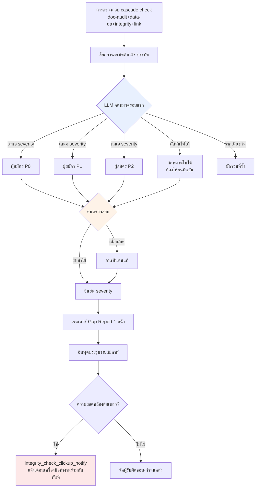

# 10.3 Alpha Gap Report — จัดหมวดหมู่ช่องว่างด้วยภาษาธรรมชาติ แล้วให้คนจัดลำดับความสำคัญ

เช้าวันจันทร์ เวลา 9 นาฬิกา 12 นาที การตรวจสอบ cascade ครั้งแรกของสัปดาห์ที่อัลฟาบิลด์เพิ่งขึ้นไปนั้นจบลง เมื่อ `check` รันตัวตรวจสอบทั้งสี่ชนิด (doc-audit·data-qa·integrity·link, 10.2) รวดเดียวแล้วหยุด ตัวเลขที่ปรากฏบนคอนโซลเป็นแบบนี้ **ผู้สมัครการละเมิด 47 รายการ** ในจำนวนนั้นมี P0 กี่รายการ ต้องดูอะไรก่อน ใครต้องลงมือแก้ — ไม่มีบรรทัดใดในทั้ง 47 บรรทัดนั้นเขียนเอาไว้เลย

ตัวตรวจสอบรู้แค่ข้อเท็จจริงว่า "ผิด" แต่ตัดสินไม่ได้ว่า "สิ่งนี้กั้นการเปิดตัวไหม หรือดูสัปดาห์หน้าก็ยังได้" คอขวดที่แท้จริงในช่วงท้ายของอัลฟาไม่ใช่เพราะตัวตรวจสอบไม่พอ แต่อยู่ตรงที่คนต้องนั่งจัดหมวดหมู่ 47 บรรทัดที่ตัวตรวจสอบอาเจียนออกมาจนหมดเช้าไปทั้งเช้า บทนี้ยกหนึ่งรอบของวงจรจริง (worked cycle) มาทั้งดุ้น — รอบที่ LLM จัดหมวดหมู่ 47 บรรทัดนั้นด้วยภาษาธรรมชาติ แล้วคนรับการจัดหมวดนั้นมาจัดลำดับความสำคัญ

---

## 10.3.1 ผลการตรวจสอบไม่ใช่การตัดสินใจ

ในหัวข้อ 10.1 เราสร้าง atom สำหรับการตรวจสอบราว 30 กว่าชนิด และในหัวข้อ 10.2 เราสร้างโครงสร้างที่กรองการตัดสินใจผ่านเซนเซอร์ 3 ชั้น (3-layer) สิ่งที่สองหัวข้อนั้นสร้างขึ้นมาคือ **ล็อก** ล็อกไม่ใช่การตัดสินใจ ระหว่างล็อกกับการตัดสินใจมีช่องว่างที่คนเคยต้องเอามือมาถม

<svg viewBox="0 0 720 230" xmlns="http://www.w3.org/2000/svg" font-family="sans-serif">
  <rect x="20" y="40" width="150" height="60" rx="6" fill="#e8f0fe" stroke="#46a" stroke-width="1.5"/>
  <text x="95" y="65" text-anchor="middle" font-size="13" font-weight="bold">การตรวจสอบ cascade</text>
  <text x="95" y="84" text-anchor="middle" font-size="11" fill="#555">อัตโนมัติ · ล็อก 47 บรรทัด</text>

  <rect x="285" y="40" width="150" height="60" rx="6" fill="#fef3e8" stroke="#d80" stroke-width="1.5"/>
  <text x="360" y="60" text-anchor="middle" font-size="13" font-weight="bold">ช่องว่าง</text>
  <text x="360" y="78" text-anchor="middle" font-size="11" fill="#a00">คนเอามือ</text>
  <text x="360" y="93" text-anchor="middle" font-size="11" fill="#a00">จัดหมวด·จัดลำดับ</text>

  <rect x="550" y="40" width="150" height="60" rx="6" fill="#e8fce8" stroke="#4a6" stroke-width="1.5"/>
  <text x="625" y="65" text-anchor="middle" font-size="13" font-weight="bold">การตัดสินใจรายสัปดาห์</text>
  <text x="625" y="84" text-anchor="middle" font-size="11" fill="#555">ผู้รับผิดชอบ·กำหนดส่ง·เกต</text>

  <line x1="170" y1="70" x2="283" y2="70" stroke="#888" stroke-width="2" marker-end="url(#ar)"/>
  <line x1="435" y1="70" x2="548" y2="70" stroke="#888" stroke-width="2" marker-end="url(#ar)"/>

  <text x="360" y="150" text-anchor="middle" font-size="12" fill="#a00" font-weight="bold">← เช้าหายไปในช่องว่างนี้</text>
  <text x="360" y="180" text-anchor="middle" font-size="12" fill="#2a6">Gap Report = LLM จัดหมวด, คนจัดลำดับ</text>

  <defs>
    <marker id="ar" markerWidth="8" markerHeight="8" refX="6" refY="3" orient="auto">
      <path d="M0,0 L6,3 L0,6 Z" fill="#888"/>
    </marker>
  </defs>
</svg>

เหตุผลที่ช่องว่างนี้แพงในช่วงท้ายของอัลฟานั้นเรียบง่าย ตัวตรวจสอบรันได้หลายสิบครั้งต่อชั่วโมง แต่งานที่คนต้องอ่าน 47 บรรทัดแล้วจัดหมวดว่า "q_142 เป็นทางตันจึงกั้นการเปิดตัว ส่วน voice_lint 412 รอให้นักเขียนตัดสิน" นั้นต้องทำใหม่ทุกครั้ง การโยนแรงงานจัดหมวดนั้นให้โมเดลภาษาธรรมชาติคือจุดเริ่มต้นของ Gap Report

---

## 10.3.2 บันทึกเซสชันจริง (worked transcript) — ส่ง 47 บรรทัดให้ LLM

ด้านล่างคือเซสชันจริงในเช้าวันจันทร์นั้น ที่นำล็อกดิบของการตรวจสอบ cascade มาวางลง Claude ตรง ๆ แล้วขอให้จัดหมวดหมู่ ผู้เขียนยกมาโดยไม่สรุปย่อ และคงทั้งจุดที่โมเดลชี้ผิดและจุดที่คนปฏิเสธไว้ตามเดิม นี่คือกระดูกสันหลังของบทนี้

### ① พรอมต์ (ฉบับเต็ม)

````text
ด้านล่างคือผู้สมัครการละเมิดที่การตรวจสอบ cascade รายสัปดาห์ของอัลฟาบิลด์ (doc-audit/data-qa/integrity/link) อาเจียนออกมารวมกัน ช่วยจัดหมวดหมู่ให้เพื่อใช้ในประชุมรายสัปดาห์ที
จัดแต่ละรายการเป็น P0 (กั้นการเปิดตัว)/P1 (ตรวจทบทวน)/P2 (เฝ้าสังเกต) พร้อมเหตุผลหนึ่งบรรทัดต่อรายการ — ถ้าเป็นการเดาให้เขียนว่า "ประมาณการ" ด้วย ส่วน severity อย่าฟันธงเอง ให้ "เสนอ" เท่านั้น การยืนยันเป็นหน้าที่ผม
อันที่ออกมาจากรากเดียวกันก็มัดรวมให้ และช่วยแนะนำสายงานที่รับผิดชอบ (เลเวล/เนื้อเรื่อง/บาลานซ์/UI/ดาตา) ด้วย อันที่ตัดสินไม่ได้ ให้แยกออกมาตรง ๆ ว่า "จัดหมวดไม่ได้ ต้องให้คนยืนยัน"

[ล็อกดิบ]
INTEGRITY  q_142    quest_graph: node 'end_021' has no outgoing edge (dead-end), zone=dungeon_021
INTEGRITY  q_158    quest_graph: reward node references item_id 'it_9920' not in item table
DATA-QA    reward_curve  dungeon_017 reward_exp delta +35.2% vs sibling median (threshold 25%)
DATA-QA    reward_curve  dungeon_017 reward_gold delta +31.0% vs sibling median
DOC-AUDIT  voice_lint    dialogue_id_412 contains banned term (refgame slang leak)
DOC-AUDIT  voice_lint    dialogue_id_511 tone drift: formality score 0.31 (npc 'elder' expects >0.7)
DOC-AUDIT  voice_lint    dialogue_id_512 tone drift: formality score 0.29
DOC-AUDIT  voice_lint    dialogue_id_513 tone drift: formality score 0.33
DATA-QA    loc_overflow  ui_btn_enhance EN string 24 chars > slot 18 (overflow 6)
DATA-QA    loc_overflow  ui_btn_enhance TH string overflow 11
LINK       doc_link      gdd_dungeon_021.md -> [reward_table] target moved (404)
INTEGRITY  k_skill       skill 'k_017_charge' cooldown 0.0 (suspicious, min expected 0.5)
... (ทั้งหมด 47 บรรทัด ที่เหลือเป็นแพทเทิร์นแบบเดียวกัน — แนบมาครบโดยไม่ตัดทอน)
````

### ② ผลลัพธ์ดิบจาก Claude (ไม่ได้สรุป·ไม่ได้เรียบเรียง)

````text
จัดหมวดหมู่ล็อกดิบเรียบร้อยแล้ว severity เป็น "ข้อเสนอ" ของผม การยืนยันขั้นสุดท้ายต้องให้คนทำ

## ผู้สมัคร P0 (อาจกั้นการเปิดตัว — ต้องให้คนยืนยัน)

1. [q_142] quest_graph dead-end (dungeon_021)
   เหตุผล: โหนดสิ้นสุดที่ไม่มีเอดจ์ทางออก → ผู้เล่นติดค้างระหว่างทำเควสต์
   ทางตันคือเดินต่อไม่ได้ จึงเป็นผู้สมัคร P0 (เหตุผลยืนยันชัดเจน)
   แนะนำผู้รับผิดชอบ: เลเวล/เนื้อเรื่อง

2. [q_158] reward node อ้างถึง item_id 'it_9920' ที่ไม่มีอยู่
   เหตุผล: ตอนจ่ายรางวัลจะเกิดการอ้างอิง NULL → อาจแครชหรือไม่จ่ายรางวัล
   ผู้สมัคร P0 แต่ item_id อาจยังไม่ได้กรอก (อยู่ระหว่างทำงาน) ก็ได้
   ดังนั้นว่าเป็น "ดาตายังไม่เสร็จ" หรือ "พิมพ์ผิด" ต้องให้คนยืนยัน
   แนะนำผู้รับผิดชอบ: ดาตา

3. [voice_lint dialogue_id_412] คำต้องห้าม (คำเฉพาะของเกมอื่น refgame หลุดมา)
   เหตุผล: ถ้าคำเฉพาะของเกมอื่นค้างอยู่ในบทพูด จะมีความเสี่ยงทางกฎหมาย·แบรนด์
   ผู้สมัคร P0 (คำต้องห้ามมักกั้นโดยไม่มีเงื่อนไข)
   แนะนำผู้รับผิดชอบ: เนื้อเรื่อง

## ผู้สมัคร P1 (ตัดสินหลังตรวจทบทวน)

4. [reward_curve dungeon_017] exp +35.2% / gold +31.0% (เกินค่ามัธยฐานของพี่น้องทั้งคู่)
   ※ มัดสองบรรทัดเป็น 1 รายการ — ความผิดปกติของเส้นโค้งรางวัลในดันเจี้ยนเดียวกัน
   เหตุผล: เกินค่าเกณฑ์ (25%) ก็จริง แต่อาจเป็น "โบนัสดันเจี้ยนยากตามตั้งใจ" ก็ได้
   ว่าตั้งใจบาลานซ์หรือพลาด ตัดสินจากดาตาอย่างเดียวไม่ได้ → P1
   แนะนำผู้รับผิดชอบ: บาลานซ์

5. [voice_lint 511·512·513] tone drift 3 รายการ (formality 0.29~0.33, NPC elder คาด >0.7)
   ※ มัดสามบรรทัดเป็น 1 รายการ — บทพูดต่อเนื่องของ NPC 'elder' ตัวเดียวกันที่หลุดโทน
   เหตุผล: NPC ตัวเดียวกันหลุดเป็นภาษาไม่สุภาพต่อเนื่อง → น่าจะเป็นงาน
   ที่นักเขียนคนเดียวทำในเซสชันเดียว แนะนำให้มัดดูรวม ไม่ใช่ทีละอัน
   ประมาณการ: อาจเป็นการเปลี่ยนตัวละครตามตั้งใจ (ฉากโกรธ ฯลฯ) ก็ได้ จึงรอนักเขียนตัดสิน P1
   แนะนำผู้รับผิดชอบ: เนื้อเรื่อง

6. [loc_overflow ui_btn_enhance] EN เกิน 6 ตัวอักษร / TH เกิน 11 ตัวอักษร
   ※ 2 บรรทัด 1 รายการ การล้นหลายภาษาของปุ่มเดียวกัน
   เหตุผล: ตัวอักษรขาดเป็นความเสียหายต่อ UX แต่ไม่ใช่แครช ต้องขยายสล็อตหรือย่อคำแปล P1
   แนะนำผู้รับผิดชอบ: UI

## ผู้สมัคร P2 (เฝ้าสังเกต)

7. [doc_link gdd_dungeon_021.md -> reward_table 404]
   เหตุผล: ลิงก์ภายในเอกสารเสีย ไม่กระทบเกมบิลด์ เป็นปัญหาความสอดคล้องของเอกสาร P2
   แนะนำผู้รับผิดชอบ: ดาตา (เจ้าของเอกสาร)

## จัดหมวดไม่ได้ — ต้องให้คนยืนยัน

8. [k_017_charge cooldown 0.0]
   เหตุผล: cooldown 0.0 จะเป็น "สกิลแบบพาสซีฟตามตั้งใจ" หรือ "ลืมกรอกค่า"
   ถ้าไม่รู้เจตนาการออกแบบสกิลก็ตัดสินไม่ได้ ตัวตรวจสอบ integrity สงสัย
   ค่าที่ต่ำกว่า 0.5 แต่ผมไม่รู้เจตนาการออกแบบของสกิลนี้
   → ผู้รับผิดชอบบาลานซ์ต้องยืนยันด้วยตนเอง

(ที่เหลืออีก 39 บรรทัดก็จัดเข้าหนึ่งใน 7 แพทเทิร์นข้างต้น — ในคำตอบนี้กางเฉพาะตัวแทน)
````

### ③ การตรวจสอบและการปฏิเสธของคน (ยกมาตามเดิม)

จากตรงนี้ไปคือหัวใจ ผู้เขียนไม่ได้รับการจัดหมวดของ LLM มาใช้ทั้งดุ้น นี่คือส่วนที่ผู้เขียนตรวจทบทวนเองก่อนประชุมแล้วลงปากกาแดง

- **ยก q_158 ข้อ 2 จากผู้สมัคร P0 → ยืนยันเป็น P0** โมเดลลังเลว่า "อาจเป็นดาตาที่ยังไม่เสร็จ" แต่พอตรวจดูแล้ว `it_9920` เป็นไอเทมที่ถูกลบไปเมื่อสองสัปดาห์ก่อน ไม่ใช่ยังไม่เสร็จ แต่เป็นการอ้างอิงที่ขาด ยืนยันกั้นการเปิดตัว
- **ลด voice_lint 412 ข้อ 3 จาก P0 ลงเป็น P1** โมเดลฟันธงว่า "คำต้องห้ามกั้นโดยไม่มีเงื่อนไข" แต่บทพูดนั้นเป็นฉากที่ NPC ตั้งใจยกสำนวนเก่ามาอ้างถึง จึงจัดการด้วยการเพิ่มเคสยกเว้นในพจนานุกรมคำต้องห้าม **เป็นความผิดพลาดแบบฉบับที่โมเดลใช้แต่กฎโดยไม่รู้บริบท**
- **รับการมัดรวม tone drift ข้อ 5 ไว้** สมมติฐานการมัดที่ว่า "เป็นงานในเซสชันเดียวของนักเขียนคนเดียวกัน" นั้นแม่นยำ การโยน 3 รายการให้นักเขียนคนเดียวรวดเดียวเป็นการถูกต้อง
- **ยอมรับการตัดสิน "จัดหมวดไม่ได้" ของโมเดลในข้อ 8 cooldown 0.0 ตามเดิม** จุดที่โมเดลไม่ดื้อว่ารู้ในสิ่งที่ตนไม่รู้นั้นดี ส่งปิงไปหาผู้รับผิดชอบบาลานซ์

ลำพังการที่โมเดลบีบให้เหลือ 7 มัดนั้นก็ใหญ่แล้ว ถ้าคนนั่งจัดหมวด 47 บรรทัดตั้งแต่ต้นเองเช้าก็คงหายไป แต่ **ในผู้สมัคร P0 จำนวน 3 รายการ คนลดระดับ 1 รายการ (412) และในผู้สมัคร P1 1 รายการ (158) คนเลื่อนระดับขึ้น** การจัดหมวด 60% ถูก ส่วน 30% ที่แพงคนเป็นคนแก้ อัตราส่วนนี้คือเส้นแบ่งของ "LLM แปรรูป การตัดสินใจเป็นของคน" อย่างแม่นยำ

### ④ การร้องขอใหม่ — ส่งผลที่คนแก้แล้วกลับไปให้โมเดลอีกครั้ง

````text
ดีแล้ว ในการจัดหมวดของคุณ ผมเปลี่ยนสองอัน
- q_158: ยืนยัน P0 (it_9920 เป็นไอเทมที่ถูกลบไปแล้ว เป็นการอ้างอิงที่ขาด)
- voice_lint_412: ลดเป็น P1 (อ้างถึงสำนวนเก่าตามตั้งใจ เพิ่มยกเว้นในพจนานุกรมคำต้องห้าม)
นำสองอันนี้ไปสะท้อนแล้วเรนเดอร์ Gap Report 1 หน้าสำหรับประชุมรายสัปดาห์เป็นมาร์กดาวน์ที เรียงลำดับ สรุป→P0→P1→P2→แนวโน้ม
ตัวเลขแนวโน้มผมจะให้เอง — สัปดาห์ที่แล้ว P0 5 รายการ, P1 22 รายการ, ผลบวกลวง 12%
````

โมเดลรับอินพุตนี้แล้วเอาต์พุต 1 หน้าตามรูปแบบรายงานในหัวข้อ §ด้านล่างนี้ออกมาตามเดิม สองบรรทัดที่คนแก้ถูกสะท้อนอย่างแม่นยำ และตัวเลขแนวโน้มก็ใช้ค่าที่คนให้มาตามเดิม (ไม่ได้กุขึ้นเอง) การไป-กลับนี้คือทั้งหมดที่ทำให้ Gap Report หนึ่งฉบับเกิดขึ้น

---

## 10.3.3 ขั้นตอนการจัดหมวดช่องว่าง — เส้นแบ่งระหว่างอัตโนมัติกับคน

หากกลั่นทรานสคริปต์ข้างต้นออกมาเป็นขั้นตอน จะได้แบบนี้ จุดสำคัญคือจุดแยกที่หนาทั้งหมดอยู่ที่คน



กล่องที่ LLM แตะมีแค่กล่องสีฟ้ากล่องเดียว severity ทุกตัวถูกยืนยันที่สีส้ม (คนตรวจสอบ) และที่สีแดงความสอดคล้องที่ล้มเหลวจะกระเด็นไปยังเครื่องมือทำงานร่วมกันทันที การตรวจสอบ·การตัดสิน·การยืนยันทั้งหมดเป็นหน้าที่ของคนและ atom ส่วนโมเดลรับเฉพาะการจัดหมวดครั้งแรกเพียงครั้งเดียว

---

## 10.3.4 เมื่อความสอดคล้องแตก จะไม่รอประชุม

ที่ปลายของขั้นตอนการจัดหมวด มี atom ชื่อ `integrity_check_clickup_notify` (10.1) ติดอยู่ atom นี้แยกจากขั้นตอนการสร้างรายงาน — **ในวินาทีที่การตรวจสอบความสอดคล้องล้มเหลว มันจะไม่รอประชุม แต่โยนการ์ดลงเครื่องมือทำงานร่วมกันทันที** หาก Gap Report เป็นจังหวะรายสัปดาห์ atom นี้ก็เป็นการแทรก (interrupt) ที่ตัดเข้ามาทำลายจังหวะนั้น

การละเมิดที่อาจทำให้ตัวบิลด์พังได้ อย่าง q_158 (อ้างถึงไอเทมที่ถูกลบ) นั้นรอจนถึงประชุมวันจันทร์ไม่ได้ ในวินาทีที่ cascade จับมันได้ จะมี "สงสัย P0: q_158 อ้างอิงขาด" สร้างขึ้นอัตโนมัติในเครื่องมือทำงานร่วมกันและจัดให้ผู้รับผิดชอบดาตา Gap Report คือฉากหลังที่รวบรวมการแทรกเหล่านั้นกลับมาในหน่วยสัปดาห์แล้วแสดงเป็นแนวโน้มอีกครั้ง สองชั้นนี้ต้องหมุนไปด้วยกัน "เรื่องด่วนทันที ภาพรวมทั้งหมดรายสัปดาห์" สองจังหวะนี้จึงจะเข้ากัน

---

## 10.3.5 เก็บหลักฐานการตรวจสอบโดยมนุษย์ไว้

ข้อเท็จจริงที่ว่าคนตรวจสอบการจัดหมวดของ LLM แล้วนั้น **ถ้าเหลือเป็นแค่คำพูดก็จะระเหยหายไป** ดังนั้นในขั้นการตรวจสอบโดยมนุษย์จึงมี atom ชื่อ `human_review_attestation_evidence_mandatory` (10.2) คล้องอยู่ — การตรวจสอบโดยมนุษย์ต้องมีหลักฐานเป็นข้อบังคับ

ทรานสคริปต์ขั้นตอน ③ ข้างต้น — การตัดสินที่ลดระดับ 412 และเลื่อนระดับ 158 นั้น — จะถูกป้อนเข้าไปในส่วนท้ายของรายงาน เป็น ID ผู้ตรวจสอบ·ไทม์สแตมป์ และรายการ "รายการที่เปลี่ยน" ในไตรมาสหน้าหากมีใครถามว่า "ทำไม 412 ถึงออกไปในการเปิดตัว" บันทึกที่ว่า "ในการตรวจสอบ 2026-W21 ตัดสินว่าเป็นการอ้างถึงสำนวนเก่าตามตั้งใจ เพิ่มยกเว้นในพจนานุกรมคำต้องห้าม" จะเป็นคำตอบ ถ้าไม่มีสิ่งนี้ การจัดหมวดของ LLM ก็จะแยกไม่ออกจากเอาต์พุตอัตโนมัติที่ไม่เคยถูกตรวจสอบ

---

## 10.3.6 รูปแบบรายงาน — ไม่เกินหนึ่งหน้า

1 หน้าที่โมเดลเรนเดอร์ออกมาเป็นผลของการร้องขอใหม่ ④ มีหน้าตาแบบนี้ การจัดหมวดของทรานสคริปต์ข้างต้นไหลเข้ามาตามเดิม

```markdown
# Alpha Gap Report — 2026-W21

## สรุป
- การตรวจสอบ cascade ผู้สมัครการละเมิด 47 รายการ → จัดเป็น 7 มัด
- ยืนยัน P0 3 รายการ / P1 4 รายการ / P2 1 รายการ / จัดหมวดไม่ได้ 1 รายการ
- กั้นการเปิดตัว: q_142 (ทางตัน), q_158 (อ้างอิงขาด)
- การเปลี่ยนจากการตรวจสอบโดยมนุษย์: voice_412 ลดระดับ (P0→P1), q_158 เลื่อนระดับ (P1→P0)

## P0 — ลงมือทันที (คนยืนยัน)
| ID | การละเมิด | สายงาน | หมายเหตุ |
|---|---|---|---|
| q_142 | dungeon_021 ทางตัน | เลเวล/เนื้อเรื่อง | LLM·คน ตรงกัน |
| q_158 | อ้างถึง it_9920 ที่ถูกลบ | ดาตา | คนเลื่อนระดับ |

## P1 — ตัดสินหลังตรวจทบทวน
- reward_curve dungeon_017: exp+35%/gold+31% (บาลานซ์, รอยืนยันเจตนา)
- voice 511·512·513: elder หลุดโทน 3 รายการมัดรวม (เนื้อเรื่อง, นักเขียนตัดสิน)
- voice_412: อ้างถึงสำนวนเก่า (เนื้อเรื่อง, จัดการยกเว้นคำต้องห้ามแล้ว)
- loc_overflow ui_btn_enhance: EN/TH ขาด (UI)

## P2 — เฝ้าสังเกต
- doc_link 404 (ความสอดคล้องเอกสาร, ไม่กระทบบิลด์)

## จัดหมวดไม่ได้ — ต้องให้คนยืนยัน
- k_017_charge cooldown 0.0 (บาลานซ์, ไม่ทราบเจตนาการออกแบบ)

## แนวโน้ม (เทียบสัปดาห์ที่แล้ว)
- P0: 3 รายการ (สัปดาห์ที่แล้ว 5 รายการ)
- P1: 4 มัด (สัปดาห์ที่แล้ว 22 รายการ — เปลี่ยนวิธีนับเป็นการจัดหมวดแบบมัด)
- ผลบวกลวง: คนแก้ 2/8 = 25% (สัปดาห์ที่แล้ว 12%, ↑ — กลุ่มตัวอย่างเล็กลงหลังมัดรวม)

---
ตรวจสอบ: อี มินซู / 2026-W21 / เปลี่ยน 2 รายการ (หลักฐาน: §ล็อกการตรวจสอบ)
```

ดูจุดที่ไม่ปกปิดว่าอัตราผลบวกลวงของแนวโน้ม **สูงขึ้น** เป็น 25% กลุ่มตัวอย่างเล็กลงเหลือ 8 และคนแก้ไป 2 ในเชิงเลขคณิตจึงเป็น 25% รายงานไม่กุตัวเลขขึ้นเพื่อให้ดูดี ถ้าเทียบดิบ ๆ กับ 12% ของสัปดาห์ที่แล้วก็ดูเหมือนแย่ลง แต่บริบทที่ว่ากลุ่มตัวอย่างเปลี่ยนไปเพราะวิธีจัดหมวดเปลี่ยนเป็นแบบมัดนั้นแนบมาเป็นหนึ่งบรรทัด หลักการที่ว่าไม่สรุปผลด้วยอัตราของสัปดาห์เดียวทำงานอยู่ตรงนี้

---

## 10.3.7 การวัดผล — แรงงานจัดหมวดหายไปไหน

ผู้เขียนเปรียบเทียบก่อนและหลังนำการจัดหมวดแบบ worked ของ Gap Report เข้ามาในโปรเจกต์ A ในจำนวนตัวเลขด้านล่าง อัตราการประมวลผล·เวลานั้นเป็นค่าวัดจริงที่ดึงจากบันทึกการประชุมและไทม์สแตมป์ของเครื่องมือทำงานร่วมกัน ส่วนอัตราผลบวกลวงของตัวตรวจสอบนั้นกลุ่มตัวอย่างแกว่งทุกสัปดาห์ ผู้เขียนจึงระบุ **เฉพาะทิศทาง**

| รายการ | ก่อนนำเข้า | หลังนำเข้า | เหตุผล |
|---|---|---|---|
| เวลาจัดหมวดรอบแรก 47 บรรทัด | คน \~40 นาที | LLM 1 รอบ + คนตรวจทบทวน \~12 นาที | ล็อกงานก่อนประชุม (วัดจริง) |
| ผลการตรวจสอบ → สะท้อนเป็นการตัดสินใจ | บางส่วนเท่านั้น | ส่วนใหญ่ | เทียบบันทึกการประชุม (วัดจริง, ไม่ได้รวบรวม % แน่นอน) |
| เวลาเฉลี่ยในการแก้ P0 | 3\~5 วัน | 1\~2 วัน | ไทม์สแตมป์การ์ดสร้าง→เสร็จในเครื่องมือทำงานร่วมกัน (วัดจริง) |
| อัตราคนแก้การจัดหมวดของ LLM | — | อิง W21 2/8 | การประมาณของผู้เขียน (ยังไม่ได้ตรวจสอบ, แปรปรวนทุกสัปดาห์) |
| ความล่าช้าในการรับรู้ความสอดคล้องล้มเหลว | รอจนถึงประชุม | ทันที (atom แจ้งเตือน) | ผลของการนำ clickup_notify เข้ามา (ทิศทาง) |

มีเหตุผลที่ไม่ได้เขียนอัตราการแก้ 2/8 เป็นเหมือนการอวด นั่นเป็นแค่กลุ่มตัวอย่างของสัปดาห์เดียว และบางสัปดาห์โมเดลก็ชี้ผิดถึงห้ารายการ **ผลได้ที่แน่นอนคือแรงงานจัดหมวดลดจาก 40 นาทีเหลือ 12 นาที ส่วนความแม่นยำของการจัดหมวดของโมเดลเองนั้นแกว่งทุกสัปดาห์** — ที่เร็วขึ้นไม่ใช่เพราะไว้ใจโมเดล แต่เพราะมันแปรรูปให้อยู่ในรูปที่คนตรวจสอบได้ภายใน 12 นาที

---

## 10.3.8 ความล้มเหลวที่พบบ่อย

| แพทเทิร์น | วิธีรับมือ |
|---|---|
| คนนั่งจัดหมวด 47 บรรทัดด้วยมือทุกครั้ง | LLM จัดหมวดรอบแรก → แบ่งงานด้วยการให้คนตรวจสอบ |
| ยืนยัน severity ของ LLM ตามเดิม | severity คือ "ข้อเสนอ" การยืนยันเป็นของคน (ขั้น ③) |
| นับการละเมิดจากรากเดียวกันแยกทีละอัน | ระบุการขอมัดรวมในพรอมต์ |
| ข้อเท็จจริงการตรวจสอบเหลือเป็นแค่คำพูด | บังคับหลักฐานด้วย atom human_review_attestation |
| ความสอดคล้องล้มเหลวที่ด่วนกลับต้องรอจนถึงประชุม | แจ้งเตือนทันทีด้วย atom clickup_notify |
| โมเดลกุตัวเลขแนวโน้มขึ้นเอง | แนวโน้มให้คนป้อน โมเดลแค่เรนเดอร์ (ขั้น ④) |
| รายงานยาวจนในประชุมไม่มีใครดู | บังคับ 1 หน้า เก็บล็อกต้นฉบับแยกไว้ |

---

## สรุปประเด็นสำคัญของบท

- **ตัวตรวจสอบรู้ว่าอะไรผิด แต่ไม่รู้ว่าต้องเริ่มจากอะไร — โยนการจัดหมวดนั้นให้ LLM แล้วให้คนจัดลำดับความสำคัญ**
- **severity ของ LLM เป็นเพียงข้อเสนอ การยืนยันที่ลดระดับ·เลื่อนระดับ P0 เหลือไว้ได้เฉพาะในรูปหลักฐานการตรวจสอบโดยมนุษย์เท่านั้น**
- **ความสอดคล้องล้มเหลวที่ด่วน atom จะแจ้งเตือนทันที ส่วนภาพรวมทั้งหมด Gap Report รายสัปดาห์จะฉายเป็นแนวโน้ม**

---

## ลองทำดู

**setup**
1. รวบรวมเอาต์พุตของการตรวจสอบ cascade (หรือมัดของ lint·ตัวตรวจสอบความสอดคล้องที่คุณมี) มาไว้ในไฟล์เดียว
2. ให้ทีมตกลงเกณฑ์ severity 3 ระดับ (P0 กั้น / P1 ตรวจทบทวน / P2 เฝ้าสังเกต) คนละหนึ่งบรรทัด
3. สร้างเทมเพลตที่ป้อน ID ผู้ตรวจสอบ·ไทม์สแตมป์ลงในส่วนท้ายของรายงาน

**prompt**
````text
ด้านล่างคือเอาต์พุตการตรวจสอบรายสัปดาห์ ช่วยจัดหมวดหมู่ให้เพื่อใช้ในประชุมรายสัปดาห์ที severity (P0/P1/P2) ให้ใส่เหตุผลหนึ่งบรรทัดแล้ว "เสนอ" เท่านั้น (ถ้าเป็นการเดาให้เขียน "ประมาณการ") การยืนยันผมจะทำเอง อันที่ละเมิดจากรากเดียวกันให้มัดรวม และช่วยแนะนำสายงานที่รับผิดชอบ (ไม่ใช่ชื่อคน) ด้วย อันที่ตัดสินไม่ได้ ให้แยกออกมาตรง ๆ ว่า "จัดหมวดไม่ได้"
[วางล็อกดิบ]
````

**verify**
1. ให้คนตรวจสอบผู้สมัคร P0 ทุกรายการทีละอัน แล้วบันทึกการลด/เลื่อนระดับ (ขั้น ③)
2. ตรวจสอบว่ารายการที่โมเดลมัดรวมมาจากรากเดียวกันจริงไหม โดยย้อนรอยกลับเพียงอันเดียว
3. ตรวจในส่วนท้ายว่าตัวเลขแนวโน้มเป็นค่าที่ออกมาจากมือคน (โมเดลไม่ได้เติมเข้าไปเอง)

### ฉบับย่อสำหรับคนเดียว

ถ้าทำงานคนเดียว atom·เครื่องมือทำงานร่วมกัน·ประชุมรายสัปดาห์ไม่มีก็ได้ วางเอาต์พุตของตัวตรวจสอบเป็นข้อความ แล้วใช้พรอมต์ข้างต้นรับแค่การจัดหมวด จากนั้นตรวจสอบผู้สมัคร P0 เพียง 3 รายการด้วยตาตนเอง แล้วจัดการทันทีตรงนั้น การปล่อยการจัดหมวดให้โมเดล แล้ว **จำกัดรายการที่ต้องตรวจสอบให้เหลือเฉพาะ P0** — สิ่งเดียวนั้นช่วยประหยัดเวลาได้มากที่สุดในระดับคนเดียว รายงาน 1 หน้าจะแทนด้วยโน้ตในโน้ตชันหนึ่งหน้าก็ได้
