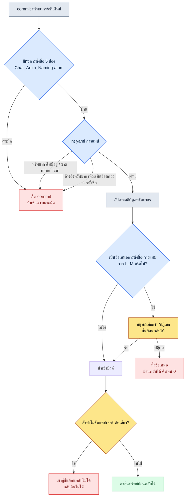

# 11.1 ข้อตกลงการตั้งชื่อและการแมประหว่างสกิลกับอาร์ต

สองวันก่อนปิดสปรินต์ อาร์ติสต์ฝ่ายต่อสู้โยนคลิปวิดีโอสั้น ๆ มาในแชตภายในทีม เป็นคอมโบ 3 ตีของคลาสนักรบ (Musa) ตัวใหม่ ตีที่ 1 และตีที่ 2 มีเสียงดาบหวือกระหึ่ม แต่ตีที่ 3 กลับเงียบสนิท ไม่มีเสียง อาร์ติสต์ยืนยันว่าใส่เสียงครบแล้ว ส่วนคนทำเสียงก็ยืนยันว่าส่งไฟล์ครบแล้ว ทั้งคู่ไม่ได้โกหก ไฟล์เสียงอยู่ในรีโพจริง ในชื่อ `combo3_swing_final_real.wav` แต่ชื่อที่โค้ดของเกมตามหาคือ `sfx_K012_combo3_swing.wav` ไม่ตรงกันแม้แต่ตัวอักษรเดียว

การไล่หาต้นเหตุของอุบัติเหตุ "เสียงหาย" ครั้งนี้กินเวลาบ่ายวันนั้นไปทั้งวัน นี่ไม่ใช่ปัญหาของคลิปเดียวหรือเสียงเดียว ตราบใดที่คนยังตั้งชื่อได้อย่างอิสระ อุบัติเหตุแบบนี้จะเกิดใหม่อีกหลายสิบครั้งในทุกไตรมาส บทนี้คือเรื่องราวของการเปลี่ยนอิสระนั้นให้กลายเป็นกฎ

> **คำถามที่บทนี้ตอบ**
> - ทำไมในระดับทรัพยากร 1 หมื่นชิ้น การตั้งชื่อจึงไม่ใช่อิสระ แต่เป็นกฎ
> - เมื่อบังคับใช้ข้อตกลงการตั้งชื่อด้วย atom และตรวจสอบอัตโนมัติด้วย lint จะปิดช่องโหว่อะไรได้บ้าง
> - บันทึกเซสชันจริง (worked transcript) ที่ AI ร่างการแมประหว่างอนิเมชัน·VFX·เสียง·ไอคอนของสกิลหนึ่ง แล้วมนุษย์เป็นผู้เลือกรับ

> **หนึ่งบรรทัดสำหรับผู้อ่านนอกสายงาน** ทรัพยากร 1 หมื่นชิ้นหรือรูปแบบการตั้งชื่อไฟล์ fbx ดูเหมือนเป็นเรื่องเฉพาะของวงการเกม แต่สิ่งเดียวที่คุณควรนำกลับไปนั้นไม่จำกัดโดเมน — **"ทันทีที่ตั้งชื่อได้อย่างอิสระ การค้นหา·การทำงานอัตโนมัติ·การเชื่อมโยงก็ถูกล็อกไปพร้อมกัน"** เมื่อสเกลใหญ่ขึ้น การตั้งชื่อต้องไม่ใช่เรื่องรสนิยมแต่ต้องเป็นกฎ และหลักการที่ว่า "มีเพียงชื่อที่กลายเป็นกฎแล้วเท่านั้นที่โค้ดจะค้นหาและนำมาใช้โดยอัตโนมัติได้" นั้นใช้ได้กับงานทุกชนิดที่ต้องจัดการเอกสาร·สินทรัพย์·เรกคอร์ดลูกค้า

---

## 11.1.1 สเกลที่เรียกว่าทรัพยากร 1 หมื่นชิ้น

โปรเจกต์ A ที่ผู้เขียนกำกับอยู่เป็น MMORPG ที่ให้ความสำคัญกับมือถือเป็นหลัก ขนาดโดยประมาณของทรัพยากรอนิเมชันตัวละครเป็นดังตารางด้านล่าง จำนวนคลาสของผู้เล่นและจำนวนชนิดของศัตรู NPC เป็นตัวเลขจากการให้บริการจริง ส่วนจำนวนคลิปและค่าประมาณรวมเป็นการประมาณของผู้เขียน (ยังไม่ได้ตรวจสอบ)

| ทรัพยากร | จำนวน |
|---|---|
| คลาสตัวละครผู้เล่น | 6 |
| ชนิดของศัตรู NPC | 80\~100 |
| คลิปเฉลี่ยต่อตัวละคร 1 ตัว | 100\~150 (การประมาณของผู้เขียน) |
| ค่าประมาณคลิปทั้งหมด | ประมาณ 10,000\~15,000 (การประมาณของผู้เขียน) |

หนึ่งหมื่นชิ้น นี่ก็เหมือนลิ้นชัก 1 หมื่นช่อง การยืนหา "ท่าโจมตีอยู่ลิ้นชักไหนนะ" ต่อหน้าลิ้นชัก 1 หมื่นช่องที่ไม่มีป้ายกำกับ คือการเอาความจำของคนไปเดิมพัน และการเดิมพันนั้นต้องแพ้แน่นอน ถ้าหาไม่เจอ ผลลัพธ์จะมีอยู่สองทาง คือเวลาทำงานเพิ่มเป็นสองเท่า หรือเพราะหาไม่เจอจึงสร้างท่าเดิมขึ้นมาใหม่ ทางหลังแย่กว่า เพราะนอกจากทรัพยากรจะพองตัวขึ้นแล้ว ภายหลังท่าเดียวกันสองชุดยังจะลอยอยู่ในระบบโดยต่างกันเพียงเล็กน้อยอีกด้วย

ถ้าชื่อเป็นพื้นที่อิสระ สิ่งที่ถูกล็อกไม่ได้มีแค่การค้นหาเท่านั้น การกำหนดเส้นทางอัตโนมัติที่ "โค้ดค้นหาไฟล์อนิเมชันจากสกิล ID ให้เองโดยอัตโนมัติ" ก็ถูกล็อกไปด้วย ถ้าอ่านกฎออกมาจากชื่อไม่ได้ โค้ดก็ต้องถือตารางแมปที่เขียนด้วยมือว่าสกิลแต่ละตัวจะใช้ไฟล์ใด และตารางนั้นต้องเพิ่มด้วยมือทุกครั้งที่มีตัวละครใหม่เข้ามา

---

## 11.1.2 รูปแบบการตั้งชื่อ 5 ช่อง — ตรึงเป็นกฎด้วย atom

ชื่อไฟล์อนิเมชันของโปรเจกต์ A ถูกตรึงไว้เป็นห้าช่อง

```
<role>_<id>_<category>_<action>_<variant>.fbx

char_K001_idle_default_v1.fbx
char_K001_locomotion_walk_forward.fbx
char_K001_combat_attack_combo1_v2.fbx
char_K001_react_hit_heavy.fbx
enemy_E021_combat_skill_aoe_v1.fbx
```

ทั้งห้าช่องล้วนเป็นไปตาม enum ที่กำหนดไว้ ช่องเดียวที่อนุญาตให้กรอกอิสระคือ `id` และแม้แต่ช่องนั้นก็ยังถูกผูกด้วยรูปแบบ `[A-Z]\d{3}`

| ช่อง | จำนวน enum | ตัวอย่าง |
|---|---|---|
| role | 4 | char, enemy, pet, mount |
| id | รูปแบบตายตัว | K001, E021, P003, M005 |
| category | 8 | idle, locomotion, combat, react, death, social, cinematic, system |
| action | 10\~30 ต่อหมวด | walk, run, attack, skill_aoe, hit_heavy |
| variant | รูปแบบตายตัว | default, v1, v2, _short, _long |

หัวใจตรงนี้ไม่ใช่ตัวรูปแบบ แต่คือ "จะป้อนรูปแบบไว้ที่ไหน" ถ้าเขียนข้อตกลงการตั้งชื่อไว้ในหน้าเอกสารวิกิหน้าหนึ่ง มันก็คือป้ายกำกับที่ไม่มีใครอ่าน ผู้เขียนสร้างข้อตกลงนี้ให้เป็น atom ซึ่งเป็นแหล่งความจริงเดียว (single source of truth) ในชื่อ `Char_Anim_Naming_Convention` แล้วทำให้ทั้งคน·ทั้ง lint·ทั้ง LLM มองมาที่ atom เดียวนี้เท่านั้น ทันทีที่รูปแบบถูกตรึงเป็น atom แทนที่จะเป็นเอกสาร การตั้งชื่อก็เปลี่ยนสภาพจาก "ข้อแนะนำ" ไปเป็น "ด่านที่ต้องผ่าน"

จุดอ่อนคือ enum ของช่อง `action` เพิ่มได้ไม่จำกัด จึงต้องบริหารจัดการ action มาตรฐานของแต่ละหมวดด้วยพจนานุกรม

```yaml
combat:
  - attack_basic
  - attack_combo1
  - attack_combo2
  - skill_<skill_id>
  - parry
  - dodge_forward
  - dodge_back
react:
  - hit_light
  - hit_heavy
  - knockback
  - stagger
  - stun
locomotion:
  - idle
  - walk_forward
  - run_forward
  - sprint
  - jump_start
  - jump_loop
  - jump_land
```

จะใส่ action ใหม่ลงพจนานุกรมหรือไม่นั้น ตัดสินด้วยกระบวนการ มีตัวละครตั้งแต่ 3 ตัวขึ้นไปต่อไตรมาสที่จะใช้ได้หรือไม่ ด้วย action ที่มีอยู่แล้วแสดงออกไม่ได้จริง ๆ หรือไม่ หมวดชัดเจนหรือไม่ และที่สำคัญที่สุด — ดูดซับเข้าไปใน variant ไม่ได้จริงหรือ ถ้าจัดการด้วย variant ได้ ก็จะไม่เพิ่ม action ถ้าพจนานุกรม action ยังคงอยู่ในราว 100 รายการ ก็เป็นสัญญาณว่าการบริหารจัดการแข็งแรงดี แต่จะไม่ถือว่านี่เป็นเพดานเด็ดขาด ถ้าแนวเกมใหม่หรือคลาสใหม่เข้ามา ก็อาจเพิ่มทีเดียว 30\~40 รายการได้ สิ่งที่ต้องกั้นไม่ใช่ตัวเลข แต่คือการขยายพันธุ์อย่างไร้การควบคุม

---

## 11.1.3 lint กั้นไม่ให้ commit

เมื่อป้อนรูปแบบเป็น atom แล้ว ก็ต้องมีตัวตรวจสอบที่บังคับใช้ atom นั้นโดยอัตโนมัติ คนจะมานั่งตรวจ 5 ช่องด้วยตาทุกครั้งไม่ได้ ด้านล่างคือกระดูกสันหลังของ lint ตัวนั้น

```python
# anim_naming_lint.py
import re, yaml

NAMING_PATTERN = re.compile(
    r"^(?P<role>char|enemy|pet|mount)_"
    r"(?P<id>[A-Z]\d{3})_"
    r"(?P<category>idle|locomotion|combat|react|death|social|cinematic|system)_"
    r"(?P<action>[a-z_]+?)"
    r"(?:_(?P<variant>v\d+|short|long|light|heavy|left|right|forward|back))?"
    r"\.fbx$"
)

ACTION_DICT = yaml.safe_load(open("char_anim_naming_convention.yaml"))

def check(filename):
    m = NAMING_PATTERN.match(filename)
    if not m:
        return f"ละเมิดกฎการตั้งชื่อ (ไม่ตรงรูปแบบ 5 ช่อง): {filename}"

    category, action = m.group("category"), m.group("action")
    # รูปแบบ skill_<id> เป็น action แบบไดนามิก จึงตรวจเฉพาะ prefix
    base = "skill" if action.startswith("skill_") else action
    if base not in ACTION_DICT.get(category, []):
        return f"action อยู่นอก enum ({category}): {action}"

    return None
```

ทันทีที่ fbx ใหม่เข้าสู่รีโพ การตรวจนี้จะทำงาน ถ้าละเมิด commit จะถูกกั้น สิ่งที่สำคัญตรงนี้คือ "ไม่โยนความผิดของการละเมิดให้เป็นความรับผิดชอบของคน" แทนที่จะตำหนิอาร์ติสต์ที่ก่ออุบัติเหตุเสียงหาย เราโยนความรับผิดชอบไปที่เครื่องมือในทำนองที่ว่า "ชื่อนั้นไม่ควร commit ได้ตั้งแต่แรก" คนผิดพลาดได้ และเครื่องมือก็กั้นความผิดพลาดนั้นไว้ นี่คือท่าทีพื้นฐานของระบบการตั้งชื่อ

เมื่อบังคับการตั้งชื่อได้ สิ่งที่ได้กลับมาเป็นการตอบแทนคือการกำหนดเส้นทางอัตโนมัติที่ถูกปลดล็อก

```python
def play_skill_animation(character, skill_id):
    anim_path = f"char_{character.id}_combat_skill_{skill_id}.fbx"
    if not exists(anim_path):
        anim_path = f"char_{character.id}_combat_skill_default.fbx"  # fallback
    play(anim_path)
```

ตารางแมปที่เขียนด้วยมือหายไป ต่อให้มีตัวละครใหม่หรือสกิลใหม่เข้ามา ขอเพียงเพิ่มไฟล์อนิเมชันตามข้อตกลง โค้ดก็ไม่ต้องเปลี่ยนแม้แต่บรรทัดเดียว ถ้าย้อนกลับไปที่อุบัติเหตุเสียงหาย — สมมติว่าไฟล์เสียงนั้นเข้ามาได้เฉพาะในชื่อตามข้อตกลงคือ `sfx_K012_combo3_swing.wav` เท่านั้น — ตั้งแต่แรก `combo3_swing_final_real.wav` ก็จะถูกตีกลับตั้งแต่ขั้น commit และบ่ายวันนั้นก็จะยังรอดอยู่ทั้งวัน

ช่อง variant คือแผ่นนิรภัยที่ปกป้อง action enum เวอร์ชันของท่าเดียวกัน (v1, v2) ความยาว (_short, _long) ความแรง (_light, _heavy) ทิศทาง (_forward, _back) ทั้งหมดถูกดูดซับเข้า variant เพื่อรับไว้ แทนที่จะแตก action ออกเป็นย่อย ๆ และโค้ดของเกมก็สามารถเลือกใช้ variant นั้นตามบริบทได้

```python
def select_variant(base_action, context):
    if context.distance < 3:
        return f"{base_action}_short"
    if context.distance > 10:
        return f"{base_action}_long"
    return base_action
```

ข้อตกลงการตั้งชื่อจึงกลายเป็นจุดแตกแขนงของโค้ดไปในตัว

---

## 11.1.4 สกิลหนึ่งกับทรัพยากรสิบชิ้น — yaml การแมป

ถ้าการตั้งชื่อคือ L1 การแมปที่เชื่อมสกิลกับทรัพยากรก็คือ L2 สกิล 1 ตัวมักลากตามมาด้วยอนิเมชัน 2\~3 ชิ้น, VFX 1\~3 ชิ้น, เสียง 2\~5 ชิ้น, ไอคอน UI 1 ชิ้น เฉลี่ยแล้วก็ราวทรัพยากร 10 ชิ้น ถ้ามีสกิล 200 ตัว เป้าหมายการแมปก็ราว 2,000 ชิ้น การจัดการสเกลขนาดนี้ด้วยหัวคนเป็นไปไม่ได้ จึงวาง yaml หนึ่งแผ่นต่อสกิลหนึ่งตัว แล้วผูกให้ทรัพยากรของสกิลนั้นถูกอ่านได้จากแผ่นนั้นแผ่นเดียวเท่านั้น

```yaml
---
skill_id: skill_K001_combo1
description: K001 คอมโบ 1 (3 ตีต่อเนื่อง)
type: melee_combo
animations:
  - clip: char_K001_combat_attack_combo1_v2.fbx
    role: main
    bone_alignment: spine_03
vfx:
  - asset: vfx_K001_combo1_slash.vfx
    socket: weapon_tip
    timing_ms: [0, 150, 300]
  - asset: vfx_hit_blood_light.vfx
    socket: target
    timing_ms: [150]
sound:
  - asset: sfx_K001_combo1_swing.wav
    volume: 0.8
    timing_ms: 0
  - asset: sfx_hit_metal_light.wav
    volume: 0.6
    timing_ms: 150
ui_icon: icon_skill_K001_combo1.png
ui_tooltip_key: skill_K001_combo1_tooltip
verified: true
---
```

แผ่นนี้แผ่นเดียวคือทรัพยากรทั้งหมดของสกิลหนึ่งตัว และเส้นทางทรัพยากรทุกตัวภายใน yaml นี้ล้วนเป็นไปตามข้อตกลง 5 ช่องของ 11.1 ถ้า lint การตั้งชื่อพังลง การแมปนี้ก็พังตามไปด้วย สองชั้นนี้ทำงานเป็นคู่กัน

เมื่อการแมปมารวมอยู่ที่เดียว การไล่ติดตามผลกระทบก็ถูกปลดล็อกโดยอัตโนมัติ เมื่อจะรื้อ VFX สักตัวใหม่ ก็ไม่ต้องเอามือไล่ค้นว่ามันกระทบสกิลไหนบ้าง

```python
def find_skills_using(asset):
    affected = []
    for path in glob("skills/*.yaml"):
        skill = yaml.safe_load(open(path))
        for cat in ("vfx", "sound", "animations"):
            for entry in skill.get(cat, []):
                if entry.get("asset") == asset or entry.get("clip") == asset:
                    affected.append(skill["skill_id"])
    return affected

# find_skills_using("vfx_hit_blood_light.vfx")
# → ["skill_K001_combo1", "skill_K005_combo2", "skill_E021_attack_basic", ...]
```

รายชื่อสกิลที่ได้รับผลกระทบจะถูกแนบเข้าวาระประชุมเรื่องเปลี่ยนทรัพยากรโดยอัตโนมัติ ก่อนที่คำถามว่า "ถ้าเปลี่ยนตัวนี้แล้วจะกระทบที่ไหนบ้าง" จะถูกถาม คำตอบก็วางอยู่ข้างบันทึกการประชุมเรียบร้อยแล้ว

การแมปก็มี lint ติดมาด้วย ไฟล์ทรัพยากรทุกตัวมีอยู่จริงหรือไม่, animations.main กับ ui_icon มีอย่างละหนึ่งหรือไม่, timing_ms อยู่ภายในความยาวอนิเมชันหรือไม่ และ — เส้นทางทรัพยากรทุกตัวผ่านข้อตกลงการตั้งชื่อ 11.1 หรือไม่ รายการสุดท้ายคือตะปูที่ตรึงสองชั้นเข้าด้วยกัน มันจะทำงานอัตโนมัติตอนบิลด์

---

## 11.1.5 กระแสการตรวจสอบการตั้งชื่อ·การแมป

จะสรุปเป็นกระแสว่า lint การตั้งชื่อและ lint การแมปที่ผ่านมาเชื่อมเข้าเป็นเกตเดียวได้อย่างไร



ขอให้สังเกตว่าที่ปลายของกระแสนี้มีเส้นแบ่งระหว่างย้อนกลับได้กับย้อนกลับไม่ได้ ตั้งแต่การแก้ yaml, ข้อเสนอจาก LLM ไปจนถึงคีย์เฟรม ล้วนย้อนกลับได้ทั้งหมด ถ้าไม่ถูกใจก็ทิ้งไปเสีย และต้นทุนแทบเป็น 0 แต่ทันทีที่ก้าวข้ามไปสู่การถ่ายโมชันแคปเจอร์, การอัดเสียงนักพากย์, การคัดเลือกซิกเนเจอร์วอยซ์ มันจะเปลี่ยนเป็นย้อนกลับไม่ได้ เพราะมีการจองนักแสดงและสตูดิโอ, บูธอัดเสียง, สัญญา, การรับรู้ของตลาดเข้ามาเกี่ยวข้อง ดังนั้นการตัดสินใจเรื่องการตั้งชื่อ·การแมป·เพอร์โซนาทั้งหมดต้องจบลงก่อนถึงขั้นย้อนกลับไม่ได้ คือภายในพื้นที่ย้อนกลับได้ที่ประกอบด้วย yaml, ข้อเสนอ LLM และคีย์เฟรม

---

## 11.1.6 บันทึกเซสชันจริง — ให้ AI ร่างการแมปของสกิลใหม่

ถึงตรงนี้คือระบบ และตอนนี้จะแสดงให้เห็นว่า AI เข้ามาตรงไหนตามเซสชันจริง เป็นฉากที่ให้ LLM ร่างการแมปทรัพยากรของสกิลไฟใหม่ `skill_K012_flame_burst`

**พรอมต์ (ฉบับเต็ม):**

```
ต่อไปนี้คือข้อตกลงการตั้งชื่ออนิเมชันตัวละครของโปรเจกต์เรา (atom), สถิติพูลทรัพยากรที่มีอยู่,
และ yaml ของสกิลที่คล้ายกันหนึ่งรายการ

[ข้อตกลงการตั้งชื่อ]
<role>_<id>_<category>_<action>_<variant>.fbx
role: char|enemy|pet|mount / category: idle|locomotion|combat|react|death|social|cinematic|system

[ทรัพยากรที่ใช้มากสุดในพูล TOP]
sfx_hit_metal_light.wav (47 สกิล), vfx_dust_kickup.vfx (38 สกิล),
vfx_fire_burst_med.vfx (22 สกิล), sfx_fire_whoosh.wav (19 สกิล)

[yaml สกิลที่คล้ายกัน]
skill_id: skill_K005_fire_slash / type: melee_fire
animations: [char_K005_combat_attack_fire_v1.fbx]
vfx: [vfx_K005_fire_slash.vfx, vfx_fire_burst_med.vfx]
sound: [sfx_K005_fire_swing.wav, sfx_fire_whoosh.wav]

สกิลใหม่: skill_K012_flame_burst (นักรบ K012, ระเบิดไฟแบบพื้นที่, 1 ตี)
จงเขียนร่าง yaml การแมปของสกิลนี้ ใช้ทรัพยากรจากพูลที่มีอยู่ให้มากที่สุด
และทรัพยากรที่ต้องสร้างใหม่ให้ติดแท็ก [NEW] กำกับไว้
```

**ผลลัพธ์ดิบจาก Claude (ไม่มีการสรุป·เรียบเรียง):**

```yaml
skill_id: skill_K012_flame_burst
description: นักรบ K012 ระเบิดไฟแบบพื้นที่ (1 ตี)
type: aoe_fire
animations:
  - clip: char_K012_combat_skill_flame_burst_v1.fbx   # [NEW] ต้องมีโมชันใหม่
    role: main
    bone_alignment: spine_03
vfx:
  - asset: vfx_fire_burst_med.vfx     # ใช้ซ้ำ (พูล 22 สกิล)
    socket: ground
    timing_ms: [200]
  - asset: vfx_K012_flame_ring.vfx    # [NEW] ของใหม่สำหรับแสดงขอบเขตพื้นที่
    socket: ground
    timing_ms: [200, 350]
sound:
  - asset: sfx_fire_whoosh.wav        # ใช้ซ้ำ (พูล 19 สกิล)
    volume: 0.8
    timing_ms: 0
  - asset: sfx_explosion_low.wav      # [NEW] เสียงระเบิดของใหม่ (คาดเดา)
    volume: 0.9
    timing_ms: 200
ui_icon: icon_skill_K012_flame_burst.png   # [NEW]
ui_tooltip_key: skill_K012_flame_burst_tooltip
verified: false
```

> หมายเหตุ: ใน `char_K012_combat_skill_flame_burst_v1.fbx` ค่า action เป็น
> `skill_flame_burst` แต่ตามข้อตกลงการตั้งชื่อ skill action ควรเป็นรูปแบบ
> `skill_<skill_id>` จึงต้องตรวจสอบ เนื่องจากไม่ได้ระบุชัดในข้อตกลงว่าจะใช้
> `skill_K012` หรือ `skill_flame_burst` จึงได้คาดเดาไว้

**การตรวจสอบ/ปฏิเสธโดยมนุษย์:**

หมายเหตุท้ายชี้จุดอ่อนได้ตรงเป๊ะ ไม่ใช่ว่า LLM ไม่รู้ แต่เพราะใน atom ของข้อตกลงเขียนรูปแบบของช่องนั้นไว้อย่างคลุมเครือ ในความเป็นจริง ข้อตกลงของโปรเจกต์ A ใช้รูปแบบ `skill_<skill_id>` ดังนั้นชื่อไฟล์ที่ถูกต้องคือ `char_K012_combat_skill_K012_v1.fbx` ส่วน `skill_flame_burst` ที่ LLM สร้างขึ้น — ปฏิเสธ และ `sfx_explosion_low.wav` ที่ติดแท็ก [NEW] ไว้นั้น เมื่อกลับไปดูพูลทรัพยากรอีกครั้ง พบว่า `sfx_impact_heavy.wav` ถูกใช้เป็นเสียงระเบิดอยู่แล้วใน 47 สกิล สาเหตุที่พลาดเพราะสถิติพูลที่ให้ LLM ไปนั้นมีแค่ TOP 4 จึงเปลี่ยนจากสร้างใหม่เป็นใช้ซ้ำแทน

**การร้องขอใหม่:**

```
แก้สองข้อแล้วเขียนใหม่
1. รูปแบบ skill action คือ skill_<skill_id> ถ้าเป็นสกิล K012 action ก็คือ skill_K012
2. ในพูลทรัพยากรมี sfx_impact_heavy.wav (47 สกิล, เสียงระเบิด/เสียงกระแทก) อยู่แล้ว
   แทนที่จะสร้าง sfx_explosion_low.wav ใหม่ จงใช้ตัวนี้ซ้ำ
สถิติพูลทั้งหมดเป็นดังนี้ [แนบทั้งหมด 38 ชนิด]
```

ในรอบเดียวนี้ สิ่งที่ LLM ทำคือ "ร่างที่พอดูได้" และสิ่งที่คนทำคือ "พบจุดคลุมเครือของข้อตกลง·พบจุดที่พูลตกหล่น·ตัดสินใจใช้ซ้ำ" LLM มีแนวโน้มจะปั๊มแท็ก [NEW] ให้ทรัพยากรใหม่ง่ายเกินไป การตัดสินใจเรื่องใช้ซ้ำจึงต้องอยู่ในมือคนจนถึงที่สุด แต่กระนั้น การร่าง yaml จากศูนย์บนหน้าจอเปล่า กับการได้ร่างที่พร้อมเลือกรับ·ปฏิเสธมาแก้ มีภาระงานต่างกัน

---

## 11.1.7 จากอนุรักษนิยมสู่ก้าวหน้า — ขั้นที่คนเพียงเลือกรับ

บันทึกข้างต้นนั่นแหละคือฉากหนึ่งของการประยุกต์แบบก้าวหน้า การบริหารจัดการการตั้งชื่อ·การแมปแบ่งเป็นสองขั้น

ในขั้นอนุรักษนิยม คนเป็นผู้ให้ชื่อและร่างการแมป ส่วนระบบอัตโนมัติรับผิดชอบเพียงการตรวจสอบ (lint) และการไล่ติดตาม (`find_skills_using`) เท่านั้น ปัจจุบันการบริหารจัดการตัวละคร·ทรัพยากรของ MMORPG ส่วนใหญ่อยู่ตรงนี้ ในขั้นก้าวหน้า LLM เป็นผู้ออกข้อเสนอตั้งแต่ร่างการตั้งชื่อ, ร่างการแมป ไปจนถึงการสร้างเพอร์โซนา NPC และการตัดสินใจที่เหลืออยู่ในมือคนก็แคบลงเหลือเพียงข้อเดียวคือ "จะเลือกรับข้อเสนอไหน"

เพื่อให้ขั้นก้าวหน้าตั้งตัวได้ ต้องมีสามอย่างพร้อม อย่างแรกคือเอนจิน lint ของข้อตกลงการตั้งชื่อ ข้อเสนอการตั้งชื่อที่ LLM ออกมาก็ต้องผ่าน lint 5 ช่องเหมือนกับที่คนร่างไว้เป๊ะ ๆ จึงจะถูกเลือกรับได้ ที่ `skill_flame_burst` ของ LLM ในบันทึกข้างต้นถูกปฏิเสธก็เพราะเกตนี้ อย่างที่สองคือเครื่องสร้างเพอร์โซนา NPC อัตโนมัติ ถ้าแยกชิ้นส่วน yaml ของตัวละครออกเป็นสามแกนคือ voice_profile·anim_set·skill_set ไว้ LLM ก็จะรับคำบรรยายอย่าง "นักรบวัย 50, รอบคอบ, โทนเสียงต่ำ" แล้วเสนอข้อเสนอของทั้งสามแกนแยกออกมาได้ การร่างสามแกนของ NPC 100 ตัวจากศูนย์ กับการเลือกจากข้อเสนอสองสามตัวต่อเพอร์โซนา มีภาระต่างกัน อย่างที่สามคือเครื่องสร้างข้อเสนอการแมป ทิศทางย้อนกลับของ `find_skills_using` — คือการค้นหา "ทรัพยากรที่มีอยู่ซึ่งเข้ากับสกิลใหม่นี้" ผูกเข้ากับสถิติพูลทรัพยากร เพื่อเสนอข้อเสนอการใช้ซ้ำแยกตามช่อง เป็นผลสองทางที่ทั้งลดต้นทุนการสร้างใหม่และเพิ่มอัตราการใช้ซ้ำ

ทั้งสามองค์ประกอบล้วนทำงานบนโครงสร้างพื้นฐานเดียวกัน (yaml·lint·สถิติพูลทรัพยากร) มันจะเดินได้ก็ต่อเมื่อข้อตกลงการตั้งชื่อกับ yaml การแมปถูกจัดเรียงให้เป็นแหล่งความจริงเดียวเท่านั้น ถ้าการจัดเรียงพังลง อินพุตที่จะป้อนให้ LLM ก็ไม่มีตั้งแต่ต้น

ควรหมายเหตุไว้ว่าทั้งสามองค์ประกอบนี้ในเชิงทฤษฎีเป็นไปได้ตั้งแต่ยุค 2010 แล้ว สิ่งที่ติดขัดมีอยู่สามจุด คือเข้าใจไม่ได้ว่าท่านั้นคืออะไรจากภาษาธรรมชาติ จึงออกข้อเสนอ 5 ช่องไม่ได้, การแยก voice·anim·skill ออกมาผูกกันเป็นพื้นที่ของสัญชาตญาณมนุษย์, และการค้นหา "VFX ที่ให้ความรู้สึกคล้ายกัน" ด้วยคำบรรยายแบบข้อความนั้นทำได้ยาก หลังปี 2023 ด้วยพัฒนาการของ LLM ทั้งสามจุดเข้าสู่พื้นที่ที่ช่วยเสริมได้ วิสัยทัศน์การทำให้ทรัพยากรตัวละครก้าวหน้าซึ่งเคยอยู่บนกระดาษเท่านั้น ส่วนใหญ่ก็ขยับเข้าสู่ขั้นนำไปใช้งานจริงแล้ว

---

## 11.1.8 การวัดผล — ก่อนและหลังนำมาใช้

นี่คือการเปรียบเทียบก่อนและหลังโปรเจกต์ A นำการตั้งชื่อ·การแมปมาใช้ เวลาค้นหาและระยะเวลาออนบอร์ดเป็นทิศทางที่ผู้เขียนรู้สึก·บันทึกได้จริง ส่วนรายการที่เป็นอัตราส่วนเป็นค่าวัดจริงที่รวบรวมจากการทบทวนรายไตรมาส ขอแจ้งว่าค่าสัมบูรณ์บางส่วนเป็นการประมาณของผู้เขียน (ยังไม่ได้ตรวจสอบ)

| รายการ | ก่อนนำมาใช้ | หลังนำมาใช้ |
|---|---|---|
| เวลาค้นหาท่า (แอนิเมเตอร์) | 5\~10 นาที | 30 วินาที |
| อัตราการสร้างซ้ำซ้อน | 12\~15% | 1\~2% |
| การแก้โค้ดกำหนดเส้นทางของตัวละครใหม่ | 50\~100 บรรทัด | 0 บรรทัด |
| อุบัติเหตุทรัพยากรสกิลใหม่ตกหล่น | 5\~8 ครั้งต่อไตรมาส | 0\~1 ครั้ง |
| ทรัพยากรไม่ถูกใช้สะสม (สัดส่วนในไลบรารี) | ประมาณ 30% | ประมาณ 8% |
| การออนบอร์ดแอนิเมเตอร์ใหม่ | 2 สัปดาห์ | 3 วัน |

รายการสุดท้ายเป็นผลที่เงียบที่สุดแต่ใหญ่ที่สุด atom ข้อตกลงการตั้งชื่อตัวเดียวกลายเป็นไกด์ออนบอร์ดไปในตัว แค่ประโยคเดียวกับแอนิเมเตอร์ใหม่ว่า "ตั้งชื่อด้วย 5 ช่องนี้ และถ้า lint กั้นก็ฟัง lint" ก็ทำงานวันแรกได้

---

## 11.1.9 ความล้มเหลวที่พบบ่อย

| รูปแบบ | วิธีรับมือ |
|---|---|
| วางข้อตกลงการตั้งชื่อไว้เป็นแค่เอกสารวิกิ | ตรึงเป็นกฎด้วย atom เดียว + บังคับด้วย lint |
| enum ของ action ขยายพันธุ์ไม่จำกัด | พจนานุกรม + กระบวนการเพิ่มรายการใหม่ |
| commit โดยไม่ตรวจสอบการตั้งชื่อ | กั้น commit ด้วย lint อัตโนมัติ |
| ตารางแมปฮาร์ดโค้ดในโค้ด | กำหนดเส้นทางอัตโนมัติบนพื้นฐานการตั้งชื่อ |
| แตก action เป็นย่อย ๆ โดยไม่มี variant | ดูดซับด้วยช่อง variant |
| การแมปทรัพยากรกระจัดกระจายในโค้ด·ชีต·เอกสาร | รวมเป็น yaml ไฟล์เดียว |
| เลือกรับข้อเสนอการแมปจาก LLM โดยไม่ตรวจสอบ | lint การตั้งชื่อ + คนตัดสินการใช้ซ้ำ |
| โยนการละเมิดการตั้งชื่อให้เป็นความรับผิดชอบของคน | เสริม lint, โยนความรับผิดชอบไปที่เครื่องมือ |

---

### สรุปประเด็นสำคัญของบท
- ในระดับทรัพยากร 1 หมื่นชิ้น ชื่อไม่ใช่อิสระของผู้สร้างสรรค์ แต่เป็นด่านที่ต้องผ่าน
- เมื่อป้อนข้อตกลงการตั้งชื่อเป็น atom และบังคับด้วย lint การกำหนดเส้นทางอัตโนมัติและการแมปก็ถูกปลดล็อก
- LLM ออกร่างการตั้งชื่อ·การแมป ส่วนคนตัดสินเพียงการเลือกรับ·การใช้ซ้ำ

### ลองทำดู

**setup** — กำหนดชื่อไฟล์อนิเมชันเป็น 5 ช่อง `<role>_<id>_<category>_<action>_<variant>.fbx` และรวบรวมพจนานุกรม action ของแต่ละหมวดไว้ใน yaml ไฟล์เดียว ประกาศให้ yaml นี้เป็นแหล่งความจริงเดียวของทีม

**prompt** — ให้ LLM "[yaml ข้อตกลงการตั้งชื่อ] + [สถิติพูลทรัพยากร] + [yaml สกิลที่คล้ายกัน 1 รายการ]" แล้วขอร่าง yaml การแมปของสกิลใหม่ ระบุให้แยกทรัพยากรที่ใช้ซ้ำกับทรัพยากรที่ต้องสร้างใหม่ (แท็ก [NEW]) ออกจากกัน

**verify** — นำเส้นทางทรัพยากรทุกตัวจากผลลัพธ์ของ LLM ผ่าน lint การตั้งชื่อ (`anim_naming_lint.py` ข้างต้น) ถ้าไม่ผ่านให้ปฏิเสธ ในบรรดาข้อเสนอที่ผ่าน ตัวที่ติดแท็ก [NEW] ให้คนเป็นผู้ตัดสินว่าใช้ซ้ำได้หรือไม่ โดยกลับไปค้นพูลทรัพยากรอีกครั้ง

### ฉบับย่อสำหรับคนเดียว
- แทนที่จะใช้ atom ให้เขียนข้อตกลง 5 ช่องและพจนานุกรม action ไว้ในหน้า README หน้าเดียว
- ผูก lint ด้วยไฟล์ `anim_naming_lint.py` ไฟล์เดียวใน git pre-commit hook
- ถ้าสกิลยังมีน้อย ให้เริ่มจากสเปรดชีตหนึ่งแผ่น (แถวสกิล × คอลัมน์ทรัพยากร) แทน yaml การแมป แล้วย้ายไปเป็น yaml ตอนที่เกิน 200 ตัว
- ร่างการแมปจาก LLM ใช้โมเดลฟรี/ราคาถูกก็เพียงพอ หัวใจคือคนเป็นผู้ถือ lint และการตัดสินใจเรื่องการใช้ซ้ำ

### ตัวอย่างบทถัดไป
- 11.2 ระบบเพ็ต·พาหนะ — การแปรเปลี่ยนในพื้นที่ที่หากยกรูปแบบของตัวละครมาทั้งดุ้นจะกลายเป็นการลงทุนเกินจำเป็น โดยใช้โครงสร้างเทมเพลต+อินสแตนซ์ที่แชร์กัน 90% ให้ AI ปั๊มอินสแตนซ์ออกมาและ lint เป็นผู้ตรวจสอบ
