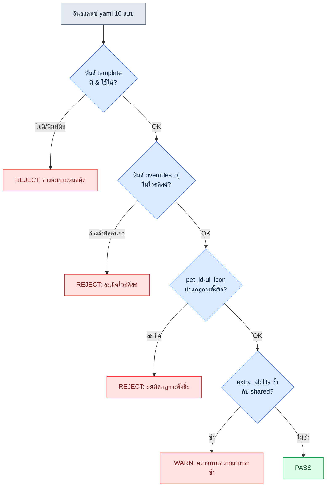

# 11.2 ระบบเพ็ตและพาหนะ — จากเทมเพลต 1 แบบสู่อินสแตนซ์ 50 แบบ

เมื่อเริ่มประชุมออกแบบ รายชื่อเพ็ตจะถูกหยิบขึ้นมาก่อน หมาป่าสิบสองสายพันธุ์ แมวแปดสายพันธุ์ นกห้าสายพันธุ์ ไม่มีใครพูดว่า "งั้นเรามาสร้างทีละตัวกันเถอะ" เพราะต่างจากตัวละคร เพ็ตนั้นตั้งต้นด้วยสมมติฐานว่า 'จะปั๊มออกมา 50 แบบ' อยู่แล้ว คำถามจึงไม่ใช่ "จะทำสายพันธุ์หนึ่งให้ดีได้อย่างไร" แต่เริ่มที่ "โครงร่างที่สร้างไว้ครั้งเดียวจะให้กี่สายพันธุ์ใช้ร่วมกัน"

ตัวละครนั้นแต่ละแบบเป็นตัวตนเฉพาะตัวสำหรับผู้ใช้ เราจึงทุ่มเทกับมันทีละแบบ ในทางกลับกัน เพ็ตและพาหนะส่วนใหญ่เป็น 'การแปรผันที่เปลี่ยนแค่สีและความสามารถบนโครงร่างเดียวกัน' ดังนั้นตั้งแต่เริ่มออกแบบเราจึงวางกฎการตั้งชื่อ เทมเพลต และ lint ให้พร้อม เพื่อปูสายการผลิตแบบปั๊มจำนวนมาก หากตั้งใจสร้างสายพันธุ์หนึ่งอย่างประณีตแล้วปล่อยให้มันถูกคัดลอกเป็นสิบสองชุด หมาป่าสิบสองตัวที่ต่างกันแค่สีก็จะมีคลิปแอนิเมชันชุดเดียวกันถูกใส่แยกกันทีละชุด จนโฟลเดอร์พองเป็น 4 กิกะไบต์ นั่นไม่ใช่การปั๊มจำนวนมาก แต่เป็นผลของการไม่ได้ปั๊มต่างหาก หัวใจไม่ได้อยู่ที่ 'สร้างให้ดีแค่ไหน' แต่อยู่ที่ 'สร้างให้น้อยแค่ไหนและใช้ร่วมกันให้มากแค่ไหน'

ด้วยเหตุนี้ บทนี้จึงนิยามเทมเพลตเพ็ตสายหมาป่าหนึ่งแบบด้วย yaml แล้วให้ AI ปั๊มอินสแตนซ์ที่สืบทอดโครงร่างนั้น จากนั้นตรวจสอบด้วย lint และวัดว่าถูกทิ้งกี่เปอร์เซ็นต์ โดยตามจังหวะนี้ไปจนจบ

## 11.2.1 การแยกเทมเพลตออกจากอินสแตนซ์

ทั้งสามอย่างมีโครงสร้างทรัพยากรคล้ายกัน แต่มีน้ำหนักการรับรู้ของผู้ใช้ต่างกัน ตัวละครคือตัวผู้ใช้เองที่ใช้เวลาในเกมร่วมกันถึง 100% เพ็ตคือเพื่อนที่อยู่ข้างกาย ใช้เวลาด้วยกัน 50\~70% ส่วนพาหนะคือเครื่องมือที่หยิบออกมาเฉพาะตอนเดินทาง อยู่ที่ 10\~20% ยิ่งน้ำหนักการรับรู้ต่ำ ผู้ใช้ก็ยิ่งสังเกตรายละเอียดน้อยลง การทุ่มเทกับพาหนะเท่ากับที่ทุ่มให้ตัวละคร ก็เหมือนการบริหารโต๊ะที่นั่งทุกวันกับเก้าอี้พับที่กางเป็นครั้งคราวด้วยงบประมาณเท่ากัน

ด้วยเหตุนี้ เพ็ตและพาหนะจึงดำเนินงานด้วยโครงสร้าง 'เทมเพลต-อินสแตนซ์' เราสร้าง **เทมเพลต** หนึ่งแบบที่บรรจุโครงร่าง การเคลื่อนไหว และความสามารถพื้นฐาน แล้ววาง **อินสแตนซ์** ที่เปลี่ยนแค่สี ไอคอน และความสามารถเล็กน้อยซ้อนทับลงไป อินสแตนซ์ใช้ทรัพยากรของเทมเพลตร่วมกันถึง 90% ดังนั้นสิ่งที่สร้างใหม่จริง ๆ มีเพียง 10% ที่เหลือ การแยกส่วนนี้เมื่อเขียนเป็นภาพได้ดังนี้

<svg viewBox="0 0 720 300" xmlns="http://www.w3.org/2000/svg" font-family="sans-serif" font-size="13">
  <rect x="20" y="20" width="200" height="260" rx="8" fill="#eef3fb" stroke="#3b6ea5" stroke-width="2"/>
  <text x="120" y="45" text-anchor="middle" font-weight="bold" fill="#1f3b5c">เทมเพลต (1 แบบ)</text>
  <text x="120" y="68" text-anchor="middle" fill="#1f3b5c">pet_template_canine</text>
  <rect x="40" y="85" width="160" height="28" rx="4" fill="#fff" stroke="#3b6ea5"/>
  <text x="120" y="104" text-anchor="middle">โครงร่าง skeleton</text>
  <rect x="40" y="120" width="160" height="28" rx="4" fill="#fff" stroke="#3b6ea5"/>
  <text x="120" y="139" text-anchor="middle">แอนิเมชันร่วม 4 ชุด</text>
  <rect x="40" y="155" width="160" height="28" rx="4" fill="#fff" stroke="#3b6ea5"/>
  <text x="120" y="174" text-anchor="middle">ความสามารถร่วม 2 ชุด</text>
  <rect x="40" y="190" width="160" height="28" rx="4" fill="#fff" stroke="#3b6ea5"/>
  <text x="120" y="209" text-anchor="middle">BT พื้นฐาน</text>
  <text x="120" y="250" text-anchor="middle" fill="#888" font-size="11">ทรัพยากร 90% (ผลิตครั้งเดียว)</text>

  <line x1="220" y1="150" x2="300" y2="80" stroke="#888" stroke-width="1.5"/>
  <line x1="220" y1="150" x2="300" y2="150" stroke="#888" stroke-width="1.5"/>
  <line x1="220" y1="150" x2="300" y2="220" stroke="#888" stroke-width="1.5"/>

  <rect x="300" y="55" width="380" height="50" rx="6" fill="#f3f9ee" stroke="#5a8f3c" stroke-width="1.5"/>
  <text x="315" y="78" font-weight="bold" fill="#2f5320">pet_P003 (หมาป่าสีเทา)</text>
  <text x="315" y="96" fill="#555" font-size="11">override: skin=gray, icon, ความสามารถ 1 ชุด</text>

  <rect x="300" y="125" width="380" height="50" rx="6" fill="#f3f9ee" stroke="#5a8f3c" stroke-width="1.5"/>
  <text x="315" y="148" font-weight="bold" fill="#2f5320">pet_P004 (หมาป่าสีดำ)</text>
  <text x="315" y="166" fill="#555" font-size="11">override: skin=black, icon, ความสามารถ 1 ชุด</text>

  <rect x="300" y="195" width="380" height="50" rx="6" fill="#f3f9ee" stroke="#5a8f3c" stroke-width="1.5"/>
  <text x="315" y="218" font-weight="bold" fill="#2f5320">pet_P005 (หมาป่าหิมะ) … ถึง P012</text>
  <text x="315" y="236" fill="#555" font-size="11">override: skin=snow, icon, ความสามารถ 1 ชุด — ทรัพยากรใหม่แค่ 10%</text>
</svg>

เมื่อสร้างก้อนเทมเพลตด้านซ้ายเสร็จครั้งเดียว อินสแตนซ์ด้านขวาก็เพียงแค่สลับสี ไอคอน และความสามารถหนึ่งบรรทัดเท่านั้น 'โฟลเดอร์ 4 กิกะไบต์' ที่กล่าวไปข้างต้น คือภาพที่เกิดขึ้นเมื่อละเลยการแยกส่วนนี้จนทรัพยากร 90% ถูกคัดลอกซ้ำสิบสองครั้ง

## 11.2.2 การตั้งชื่อและแบบฟอร์มทรัพยากร — ลดลงหนึ่งช่องจากตัวละคร

กฎการตั้งชื่อของเพ็ตและพาหนะคือรูปแบบที่ตัดออกหนึ่งช่องจากการตั้งชื่อตัวละครในหัวข้อ 11.1 ตัวละครใช้ห้าช่อง `char_<id>_<category>_<action>_<variant>` แต่เพ็ตและพาหนะละ variant ไป ใช้สี่ช่อง หาก variant จำเป็น ก็ผนวกเข้าไว้ใน action

```
pet_<id>_<category>_<action>.fbx
mount_<id>_<category>_<action>.fbx

ตัวอย่าง:
pet_P003_idle_default.fbx
pet_P003_combat_bite.fbx
mount_M005_locomotion_run.fbx
```

yaml การแมปทรัพยากรก็ทำให้เบาลงด้วยการตัดช่อง vfx และ sound ออกจากแบบฟอร์มของตัวละคร อินสแตนซ์ที่แบกช่องเหล่านี้ไว้ทั้งก้อนจะกลายเป็นแบบฟอร์มที่เต็มไปด้วยช่องว่างเปล่า ทำให้ lint ขึ้นเตือนเปล่า ๆ ทุกครั้ง

ทีนี้เข้าเรื่องหลัก เรามานิยามเทมเพลตสายหมาป่าหนึ่งแบบ แล้วปั๊มอินสแตนซ์ออกมาจากเทมเพลตนั้นกัน

## 11.2.3 บันทึกเซสชันจริง (worked transcript): เทมเพลต 1 แบบ → ปั๊มอินสแตนซ์ → lint → อัตราการทิ้ง

### ขั้นที่ 1 — เขียนเทมเพลต yaml ด้วยมือ

ก่อนจะให้ AI ปั๊มจำนวนมาก คนจะลงมือกำหนดเทมเพลตหนึ่งแบบด้วยมือก่อน เทมเพลตแบบเดียวนี้จะกลายเป็นเกณฑ์คุณภาพของอินสแตนซ์อีกหลายสิบแบบ จึงไม่นำมาทำอัตโนมัติ เทมเพลตสายหมาป่า (canine) วางไว้ดังนี้

```yaml
# pet_template_canine.yaml
template_id: pet_template_canine
skeleton: skel_quadruped_medium      # โครงร่างร่วมสำหรับสัตว์สี่ขาขนาดกลาง
shared_animations:
  - clip: pet_template_canine_idle_default.fbx
  - clip: pet_template_canine_locomotion_walk.fbx
  - clip: pet_template_canine_locomotion_run.fbx
  - clip: pet_template_canine_combat_bite.fbx
shared_abilities:
  - id: pet_template_canine_passive_speed
    description: ความเร็วเคลื่อนที่ของเพื่อนร่วมทาง +3%
  - id: pet_template_canine_active_bite
    description: กัดเป้าหมายเดี่ยว, คูลดาวน์ 12s
bt_ref: bt_pet_canine_default        # BT พื้นฐานสำหรับการติดตาม + ช่วยในการต่อสู้
instance_overridable:                # ไวต์ลิสต์ของฟิลด์ที่อินสแตนซ์เปลี่ยนได้
  - visual_skin
  - ui_icon
  - ui_tooltip_key
  - extra_ability                    # อนุญาตเพิ่มความสามารถได้สูงสุด 1 ชุดต่ออินสแตนซ์
```

ตรงนี้ `instance_overridable` คืออุปกรณ์หลัก มันตรึงฟิลด์ที่อินสแตนซ์แตะต้องได้ไว้เป็นไวต์ลิสต์ หาก AI ขณะปั๊มจำนวนมากพยายามเปลี่ยนโครงร่างหรือแอนิเมชันร่วมตามใจชอบ นั่นคือการแตะฟิลด์ที่ไม่อยู่ในรายการนี้ lint จึงจับได้ การนิยาม 'สิ่งที่เปลี่ยนได้' ก่อนคือเข็มขัดนิรภัยของการปั๊มจำนวนมาก

### ขั้นที่ 2 — ขอให้ AI ปั๊มอินสแตนซ์ (พรอมต์ฉบับเต็ม)

ต่อไปนี้คือพรอมต์ฉบับเต็มที่ใช้ปั๊มอินสแตนซ์ 10 แบบ ผมขอแสดงตามเดิมโดยไม่ย่อ

```
[พรอมต์]
คุณคือผู้ช่วยที่ช่วยเขียนข้อมูลเพ็ต โดยอิงตามเทมเพลตด้านล่าง
จงสร้าง yaml ของอินสแตนซ์เพ็ตสายหมาป่า 10 แบบ

[เทมเพลต] pet_template_canine.yaml
(วาง yaml ฉบับเต็มข้างต้นลงไป)

[กฎ]
1. แต่ละอินสแตนซ์ต้องระบุ template: pet_template_canine เสมอ
2. ใน overrides ให้ใส่เฉพาะฟิลด์ในไวต์ลิสต์ instance_overridable
   ฟิลด์ที่ไม่อยู่ในไวต์ลิสต์ (skeleton, shared_animations ฯลฯ) ห้ามแตะเด็ดขาด
3. visual_skin ต้องเป็นการแปรผันตามธรรมชาติของหมาป่า (สี ลวดลาย ขนาด)
4. extra_ability สูงสุด 1 ชุดต่ออินสแตนซ์ เลือกอย่างใดอย่างหนึ่งระหว่าง passive หรือ active
   ผลของมันต้องไม่ซ้ำซ้อนกับ shared_abilities ที่มีอยู่
5. ui_icon, ui_tooltip_key ให้เป็นไปตามกฎการตั้งชื่อที่อิงกับ pet_id
6. กำหนด pet_id เป็น pet_P003 ~ pet_P012

ผลลัพธ์ให้มีเฉพาะบล็อก yaml 10 บล็อกเท่านั้น ห้ามแนบประโยคอธิบาย
```

กฎข้อ 2 จับคู่กับไวต์ลิสต์ของขั้นที่ 1 ส่วน "ต้องไม่ซ้ำซ้อน" ในกฎข้อ 4 คือข้อจำกัดที่กันไม่ให้ AI คัดลอกความสามารถแบบมักง่าย หากไม่ตั้งข้อจำกัดเหล่านี้ ดังที่จะเห็นต่อไป AI จะลู่เข้าหาตัวเลือกที่ปลอดภัยที่สุด (คัดลอกความสามารถเดิมมาแปะ)

### ขั้นที่ 3 — ผลลัพธ์ดิบของ Claude (ไม่มีการย่อ/ดัดแปลง)

จากผลลัพธ์ที่ AI พ่นออกมา ผมคัดมาตามเดิมโดยมีทั้งที่สำเร็จ ล้มเหลว และก้ำกึ่งปะปนกัน ไม่ได้เกลาให้เรียบร้อย

```yaml
# ผลลัพธ์ 1 — ปกติ
pet_id: pet_P003
template: pet_template_canine
overrides:
  visual_skin: wolf_gray
  ui_icon: icon_pet_P003.png
  ui_tooltip_key: pet_P003_tooltip
  extra_ability:
    id: pet_P003_active_howl
    description: ลดความเร็วเคลื่อนที่ของศัตรู -20% เป็นเวลา 5 วินาที, คูลดาวน์ 30s

# ผลลัพธ์ 2 — ปกติ
pet_id: pet_P004
template: pet_template_canine
overrides:
  visual_skin: wolf_black
  ui_icon: icon_pet_P004.png
  ui_tooltip_key: pet_P004_tooltip
  extra_ability:
    id: pet_P004_passive_crit
    description: โอกาสคริติคอลของเพื่อนร่วมทาง +2%

# ผลลัพธ์ 5 — ก้ำกึ่ง (ความสามารถซ้ำกับความสามารถร่วมโดยพฤตินัย)
pet_id: pet_P007
template: pet_template_canine
overrides:
  visual_skin: wolf_brown
  ui_icon: icon_pet_P007.png
  ui_tooltip_key: pet_P007_tooltip
  extra_ability:
    id: pet_P007_passive_speed_boost
    description: ความเร็วเคลื่อนที่ของเพื่อนร่วมทาง +3%   # ← ผลเหมือนกับ passive_speed ของ shared

# ผลลัพธ์ 8 — ล้มเหลว (ล่วงล้ำฟิลด์นอกไวต์ลิสต์)
pet_id: pet_P010
template: pet_template_canine
overrides:
  visual_skin: wolf_white
  ui_icon: icon_pet_P010.png
  shared_animations:                 # ← ไม่อยู่ในไวต์ลิสต์ overridable
    - clip: pet_P010_combat_pounce.fbx
  extra_ability:
    id: pet_P010_active_pounce
    description: โจมตีพุ่งกระโจน, คูลดาวน์ 20s

# ผลลัพธ์ 9 — ล้มเหลว (ละเมิดกฎการตั้งชื่อ)
pet_id: P011                          # ← ขาดคำนำหน้า 'pet_'
template: pet_template_canine
overrides:
  visual_skin: wolf_silver
  ui_icon: pet11_icon.png            # ← ละเมิดกฎ icon_pet_P011.png
  ui_tooltip_key: pet_P011_tooltip
  extra_ability:
    id: pet_P011_passive_dodge
    description: การหลบหลีกของเพื่อนร่วมทาง +1%
```

ใน 10 แบบ ที่ปกติคือ P003·P004·P005·P006·P008·P012 หกแบบ ที่ก้ำกึ่งเพราะความสามารถซ้ำคือ P007 หนึ่งแบบ และที่ล้มเหลวเพราะล่วงล้ำไวต์ลิสต์และละเมิดการตั้งชื่อคือ P009·P010·P011 สามแบบ ทั้งที่ตั้งกฎข้อ 4 ไว้แล้ว AI ก็ยังลอกความสามารถร่วมมาใน P007 (ตัวเลือกที่ปลอดภัยที่สุด) และทั้งที่ตั้งกฎข้อ 2 ไว้แล้ว ก็ยังแตะแอนิเมชันโครงร่างใน P010 ถึงจะระบุข้อจำกัดชัดเจน ผลผลิตจากการปั๊มจำนวนมากก็ยังมีสัดส่วนหนึ่งที่หลุดออกมา นี่คือความเป็นจริง ขั้นตอนถัดไปจึงจำเป็น

### ขั้นที่ 4 — ตรวจสอบด้วย lint

แทนที่คนจะนั่งดู 10 แบบทีละตัวด้วยสายตา เราจะรัน lint กฎ lint ดึงมาจากไวต์ลิสต์ของเทมเพลตในขั้นที่ 1 และกฎการตั้งชื่อจากหัวข้อ 11.1 โดยตรง รายการที่ตรวจมีสี่อย่าง



หากอินสแตนซ์แต่ละแบบผ่านครบทั้งสี่ด่าน ก็เป็น PASS หากติดกลางทางก็ตกเป็น REJECT หรือ WARN เมื่อสรุปผลการตรวจสอบจริงเป็นตารางได้ดังนี้

| pet_id | template | ไวต์ลิสต์ | การตั้งชื่อ | ความสามารถซ้ำ | ผลตัดสิน |
|---|---|---|---|---|---|
| pet_P003 | OK | OK | OK | ไม่ซ้ำ | PASS |
| pet_P004 | OK | OK | OK | ไม่ซ้ำ | PASS |
| pet_P005 | OK | OK | OK | ไม่ซ้ำ | PASS |
| pet_P006 | OK | OK | OK | ไม่ซ้ำ | PASS |
| pet_P007 | OK | OK | OK | **ซ้ำ** | WARN |
| pet_P008 | OK | OK | OK | ไม่ซ้ำ | PASS |
| pet_P009 | OK | OK | **ละเมิด** | — | REJECT |
| pet_P010 | OK | **ล่วงล้ำ** | — | — | REJECT |
| P011 | OK | OK | **ละเมิด** | — | REJECT |
| pet_P012 | OK | OK | OK | ไม่ซ้ำ | PASS |

PASS 6, WARN 1, REJECT 3 ตัว WARN สามารถกู้กลับมาได้ด้วยการเปลี่ยนความสามารถหนึ่งบรรทัด (P007) ส่วน REJECT 3 แบบนั้นทิ้งไป

### ขั้นที่ 5 — การวัดอัตราการทิ้งและการขอใหม่

**อัตราการทิ้ง** ของหนึ่งรอบนี้คือ REJECT 3 / ทั้งหมด 10 = **30%** หากนับรวม WARN เป็น 'สิ่งที่ต้องแก้' ด้วย อัตราการแก้ไขก็เป็น 40% ตัวเลขนี้คือดัชนีสุขภาพของสายการผลิตแบบปั๊มจำนวนมาก หากอัตราการทิ้งเป็น 30% นั่นหมายความว่าเพื่อให้ได้เพ็ต 50 แบบ ต้องสร้างประมาณ 72 แบบ (50 / 0.7 ≈ 71.4) เพราะการสร้างนั้นต้นทุนต่ำ การเผื่อเกินขนาดนี้จึงรับไหว แต่หากอัตราการทิ้งไม่ลดลงแม้ทำซ้ำหลายรอบ นั่นคือสัญญาณว่าข้อจำกัดของพรอมต์ยังไม่พอ

ด้วยเหตุนี้ เราจึงป้อนเหตุผลของการทิ้งกลับเข้าไปในพรอมต์ ผมรวบรวมเหตุผลของ REJECT 3 แบบ (ขาดการตั้งชื่อ ล่วงล้ำไวต์ลิสต์ ละเมิดกฎไอคอน) แล้วเติมเข้าในการขอใหม่ทีละบรรทัด

```
[กฎเพิ่มเติมในการขอใหม่]
7. pet_id ต้องขึ้นต้นด้วยคำนำหน้า 'pet_' เสมอ (แบตช์ก่อนหน้า P011 ขาดไป)
8. ui_icon ต้องเป็นรูปแบบ icon_<pet_id>.png โดยไม่มีข้อยกเว้น (ห้ามแปรรูปแบบเช่น pet11_icon.png)
9. ห้ามใส่ shared_animations / skeleton / bt_ref ลงใน overrides เด็ดขาด
   หากต้องการเปลี่ยนการเคลื่อนไหว ให้แสดงผ่าน extra_ability เท่านั้น (กรณี P010)
```

หลังเติมสามบรรทัดนี้แล้วรันแบตช์ถัดไป 10 แบบ REJECT ลดจาก 3 เหลือ 1 อัตราการทิ้ง 30% → 10% การป้อนกลับที่ยกระดับเหตุผลของการทิ้งให้กลายเป็นกฎนี้ คือกลไกที่ดึงคุณภาพของการปั๊มจำนวนมากให้สูงขึ้นทุกรอบ คนไม่ต้องตรวจสอบ 50 แบบทุกครั้ง แต่ทำเพียงงานเดียวคือย้ายเหตุผลของการทิ้งไปเป็นกฎหนึ่งบรรทัด

## 11.2.4 พาหนะ — ใช้ร่วมแม้กระทั่งโครงร่าง เหลือเกือบแต่ข้อมูลล้วน

พาหนะเรียบง่ายกว่าเพ็ตไปอีกขั้น ไม่มีทั้งสกิลและ BT (BehaviorTree, ต้นไม้พฤติกรรม) มีแต่ข้อมูลอย่างพารามิเตอร์การเคลื่อนที่และเงื่อนไขว่าต่อสู้ได้หรือไม่ ดังนั้นอินสแตนซ์พาหนะจึงเป็นแถวหนึ่งในตารางโดยพฤตินัย

```yaml
# อินสแตนซ์ที่อิงจาก mount_template_equine.yaml
mount_id: mount_M005
template: mount_template_equine
overrides:
  visual_skin: horse_white
  movement:
    run_speed: 7.0
    sprint_speed: 12.0
  combat:
    allow_combat: false       # ใช้ขณะต่อสู้ไม่ได้
    dismount_on_damage: true
  ui_icon: icon_mount_M005.png
```

lint ของการปั๊มพาหนะสั้นกว่า นอกจากการตั้งชื่อ การอ้างอิงเทมเพลต และไวต์ลิสต์แล้ว เพียงตรวจ 'พารามิเตอร์ movement อยู่ในช่วงที่อนุญาตหรือไม่' (เช่น sprint_speed มากกว่า walk_speed หรือไม่ ไม่เกินเพดานหรือไม่) ก็พอ เป็นการใช้สายการผลิตที่สร้างไว้กับเพ็ตตามเดิม เพียงแต่ลดจำนวนด่านลง การเพิ่มฟังก์ชันต่อสู้ให้พาหนะต้องระมัดระวัง ทันทีที่เปิด allow_combat เป็น true ความซับซ้อนของเกมจะเพิ่มเป็นสองเท่า และต้องตรวจสอบความขัดแย้งกับระบบเพ็ตและตัวละครใหม่ทั้งหมด

## 11.2.5 การวัด — การทำให้เรียบง่ายไม่ได้ลดทอนประสบการณ์

ผมเปรียบเทียบกรณีที่นำรูปแบบของตัวละครมาใช้กับเพ็ตและพาหนะเต็มรูปแบบ กับกรณีที่ทำให้เรียบง่ายด้วยเทมเพลต-อินสแตนซ์ ในโปรเจกต์ A ของผู้เขียน ในจำนวนค่าด้านล่าง จำนวนเวลาและทรัพยากรเป็นการประมาณของผู้เขียน (ยังไม่ได้ตรวจสอบ) ส่วนอัตราการทิ้งและอัตราการใช้ทรัพยากรร่วมเป็นสัดส่วนที่อิงทิศทางจากการวัดจริง

| รายการ | ใช้เต็มรูปแบบ | เทมเพลต-อินสแตนซ์ |
|---|---|---|
| เวลาทำงานทรัพยากรเพ็ต 1 แบบ | 1\~2 สัปดาห์ (การประมาณของผู้เขียน) | 3\~5 วัน (การประมาณของผู้เขียน) |
| จำนวนทรัพยากรในไลบรารีเพ็ต | ประมาณ 2,000 (การประมาณของผู้เขียน) | ประมาณ 600 (ลดลง 70%) |
| สัดส่วนทรัพยากรใหม่ต่ออินสแตนซ์ 1 แบบ | 100% | ประมาณ 10% |
| อัตราการทิ้งในการปั๊มแบตช์แรก | — | 30% (ทิศทางจากการวัดจริง) |
| อัตราการทิ้งหลังป้อนกลับ | — | 10% (ทิศทางจากการวัดจริง) |
| ความรู้สึกของผู้ใช้ (ความหลากหลายของเพ็ต) | เป็นเกณฑ์ | แทบไม่ต่างกัน |

> **ตัวอย่างและการวัด.** ตารางข้างต้นเป็นการสังเกตเพ็ต 1 สายในโปรเจกต์เดียว (โปรเจกต์ A) ในสภาพแวดล้อมของผู้เขียน (n=1 สาย) '70%' และ 'ประมาณ 10%' ไม่ใช่การวัดอิสระ แต่เป็น **สัดส่วนทางคณิตศาสตร์** ที่ได้จากจำนวนทรัพยากรที่ประมาณไว้ในแถวเดียวกัน (ประมาณ 2,000 → ประมาณ 600) ดังนั้นเมื่อค่าสัมบูรณ์ด้านหน้าเป็นเพียงการประมาณ ก็ต้องอ่านเปอร์เซ็นต์นี้เป็นการประมาณด้วยเช่นกัน อัตราการทิ้ง 30% และ 10% เป็น **ทิศทางจากการวัดจริง** ที่ได้จากรอบการปั๊มเดียวตั้งแต่แบตช์แรกถึงการป้อนกลับ และไม่ใช่ตัวอย่างจากการวัดซ้ำ อย่านำไปอ้างเป็นหลักฐานการลดต้นทุนของทีมคุณ แต่จงวัดด้วยตัวเองในสายงานของคุณด้วยวิธีเดียวกัน

แถวสุดท้ายคือบทสรุปของทั้งบท แม้จะใช้ทรัพยากรร่วมกัน 90% วัดอัตราการทิ้ง และปั๊มจำนวนมาก ความหลากหลายของเพ็ตที่ผู้ใช้รู้สึกก็แทบไม่ต่างจากการสร้างเต็มรูปแบบ โฟลเดอร์ 4 กิกะไบต์ที่กล่าวไปข้างต้น คือต้นทุนที่ต้องจ่ายเมื่อคัดลอกทรัพยากรสิบสองชุดให้กับรายละเอียดที่ผู้ใช้แยกแยะไม่ออกในที่สุด หากปูสมมติฐานของการปั๊มจำนวนมากไว้ สิ่งที่ลดลงคือต้นทุนการดำเนินงาน ไม่ใช่ประสบการณ์

## 11.2.6 กับดักของการดำเนินงาน

| กับดัก | วิธีรับมือ |
|---|---|
| ย้ายระบบตัวละครมาใช้กับเพ็ตและพาหนะทั้งดุ้น | ตัดช่อง variant·vfx·sound เหลือการแปรผันสี่ช่อง |
| คัดลอกเพ็ตที่โครงร่างเดียวกันเป็นทรัพยากรอิสระ | เทมเพลต 1 แบบ + อินสแตนซ์ บังคับใช้ร่วมด้วยไวต์ลิสต์ |
| คอมมิตผลผลิตจาก AI โดยไม่ตรวจสอบ | lint 4 ด่าน + วัดอัตราการทิ้ง |
| อัตราการทิ้งไม่ลดลงในแต่ละรอบ | ยกระดับเหตุผลของการทิ้งเป็นกฎของพรอมต์ (ป้อนกลับ) |
| ให้สกิลระดับตัวละครแก่เพ็ต | จำกัด extra_ability สูงสุด 1 ชุดต่ออินสแตนซ์ |
| ให้ฟังก์ชันต่อสู้แก่พาหนะ | allow_combat ต้องระมัดระวัง เตรียมรับความซับซ้อน ×2 |

## 11.2.7 ที่ของ AI และที่ของคน

เพ็ตและพาหนะส่งผลต่อประสบการณ์ผู้ใช้น้อย AI จึงมีอิสระมากกว่าตัวละคร การจับคู่คอนเซปต์เข้ากับเทมเพลตที่เหมาะสม การเสนอความสามารถที่เป็นไปได้ และการปั๊ม yaml ของอินสแตนซ์ ล้วนเป็นงานที่ AI ทำได้รวดเร็ว เพียงแต่หากอิสระมากแล้วตัดการตรวจสอบทิ้ง ของเสีย 30% ที่เห็นข้างต้นก็จะปนเข้าไปในบิลด์ตามเดิม ที่ของคนมีสองอย่าง หนึ่งคือกำหนดเทมเพลตหนึ่งแบบด้วยมือเพื่อตรึงเกณฑ์คุณภาพ สองคืออ่านว่าอะไรถูกคัดออกเพราะอะไร แล้วขัดเกลาข้อจำกัดให้แบตช์ถัดไปหลุดน้อยลง การแบ่งงานที่ AI เติมปริมาณ ส่วนคนกุมเส้นฐานและการปรับแก้นั้น คือสิ่งที่ทำให้ระบบนี้เดินหน้าได้

---

### สรุปประเด็นสำคัญของบท
- เพ็ตและพาหนะไม่ใช่ระบบที่สร้างให้ดี แต่เป็นระบบที่สร้างให้น้อยและใช้ร่วมกันให้มาก
- ป้อนเทมเพลต 1 แบบด้วยมือ ส่วนอินสแตนซ์ให้ AI ปั๊มภายในไวต์ลิสต์
- เมื่อวัดอัตราการทิ้งและป้อนเหตุผลของมันกลับเข้าเป็นกฎของพรอมต์ คุณภาพก็จะสูงขึ้นทุกรอบ

### ตัวอย่างบทถัดไป
- 12.1 การกำกับอาร์ต (Art Directing) — วิธีที่นักออกแบบเกมทำงานร่วมและตรวจสอบงานอาร์ต

---

## ลองทำดู

**setup**
1. กำหนดโครงร่างร่วม แอนิเมชันร่วม 4 ชุด และความสามารถร่วม 2 ชุดของเพ็ตหนึ่งสาย (เช่น หมาป่า) แล้วบันทึกเป็น `pet_template_<สาย>.yaml`
2. ระบุไวต์ลิสต์ `instance_overridable` (ฟิลด์ที่เปลี่ยนได้) ลงในเทมเพลต
3. เตรียม lint 4 ด่าน (การอ้างอิงเทมเพลต / ไวต์ลิสต์ / กฎการตั้งชื่อ / ความสามารถซ้ำ) ด้วยสคริปต์

**prompt**
4. แนบ yaml ฉบับเต็มของเทมเพลต + กฎการปั๊ม (ห้ามใส่ฟิลด์นอกไวต์ลิสต์ ห้ามความสามารถซ้ำ กฎการตั้งชื่อ) แล้วขออินสแตนซ์ 10 แบบ
5. ตรึงรูปแบบผลลัพธ์เป็น "เฉพาะบล็อก yaml ห้ามอธิบาย"

**verify**
6. รัน lint เพื่อจำแนก PASS / WARN / REJECT แล้วคำนวณอัตราการทิ้ง
7. รวบรวมเหตุผลของ REJECT แล้วเติมเป็นกฎทีละบรรทัดลงในพรอมต์ จากนั้นรันแบตช์ถัดไป ตรวจสอบว่าอัตราการทิ้งลดลงหรือไม่

## 11.2.8 ฉบับย่อสำหรับคนเดียว
หากเป็นเกมที่ทำคนเดียว ก็ไม่จำเป็นต้องมีสคริปต์ lint ก็ได้ ลองเขียน yaml เทมเพลตของเพ็ตหนึ่งสายด้วยมือหนึ่งฉบับ แล้วขอ AI ว่า "จากเทมเพลตนี้ ให้สร้างอินสแตนซ์ 5 แบบที่เปลี่ยนแค่สี ไอคอน และความสามารถ ห้ามแตะโครงร่างและแอนิเมชันร่วมเด็ดขาด" จากนั้นกวาดสายตาดู 5 แบบที่ได้มา ทิ้งเฉพาะตัวที่แตะโครงร่างหรือฝ่าฝืนกฎการตั้งชื่อ แล้วเติมเหตุผลที่ทิ้งลงในคำขอครั้งถัดไปหนึ่งบรรทัด ขอเพียงมีเทมเพลต 1.1 และ 'การป้อนกลับเหตุผลที่ทิ้ง' หัวใจของบทนี้ก็ทำงานได้แม้ไม่มีเครื่องมือ
