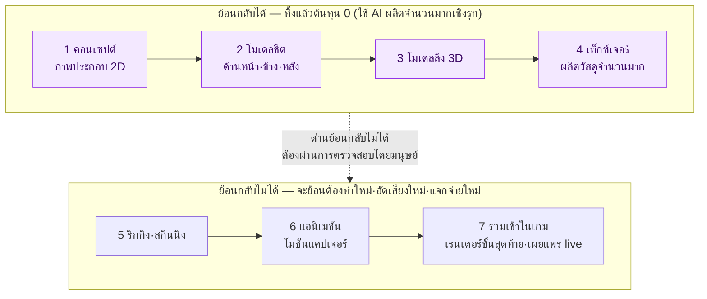
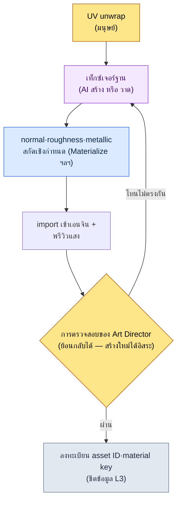

# 12.1 ไปป์ไลน์อาร์ตแอสเซต AI — ผลิตจำนวนมากในขั้นที่ย้อนกลับได้ และหยุดไว้หน้าด่านที่ย้อนกลับไม่ได้

> ผู้อ่านหลัก: นักออกแบบเกม (Game Designer) และ Art Director ที่ทำงานร่วมกับทีมอาร์ต (ทีมขนาดกลาง 10–50 คน)
> ฉบับย่อสำหรับผู้อ่านคนเดียว/งานอดิเรก: §12.1.8 「ถ้าทำคนเดียวก็แค่นี้พอ」

ผมยังจำวันที่เอาคอนเซปต์อาร์ต 100 ภาพที่ผลิตด้วย AI ไปติดบนผนังห้องประชุมได้ ในบรรดา 100 ภาพที่พิมพ์ออกมาภายใน 30 วินาที Art Director เลือกไว้เพียง 3 ภาพ ส่วนอีก 97 ภาพถูกทิ้งตรงนั้นทันที บางคนเรียกสิ่งนี้ว่า "ความสูญเปล่า 97%" แต่ถ้าวาดด้วยมือ ศิลปินคงต้องใช้เวลา 2 สัปดาห์กว่าจะไปถึง 3 ภาพนั้น สิ่งที่นับว่าเป็นความสูญเปล่าจึงถูกพลิกกลับด้านไปแล้ว

สิ่งที่บทนี้กล่าวถึงคือวิธีเปลี่ยนการพลิกด้านนั้นให้กลายเป็นการให้บริการในเชิงปฏิบัติ แก่นของมันมีเพียงบรรทัดเดียว **อาร์ต AI ให้ผลิตจำนวนมากได้อย่างเต็มที่ในขั้นที่ย้อนกลับได้ (การสำรวจคอนเซปต์·เท็กซ์เจอร์) แต่หน้าขั้นที่ย้อนกลับไม่ได้ (เรนเดอร์ขั้นสุดท้าย·โมชันแคปเจอร์·การนำเข้าบิลด์) ให้วางด่านที่มนุษย์เฝ้าไว้** ที่ที่ทิ้งได้ก็ทิ้งไป 99 ภาพ ส่วนที่ที่ย้อนกลับไม่ได้ก็ไม่ปล่อยให้ผ่านไปแม้แต่ภาพเดียวโดยไม่ตรวจ วิธีใช้เครื่องมืออาร์ตนั้นมีอยู่มากเพียงพอในหนังสือเล่มอื่นแล้ว บทนี้จึงโฟกัสเฉพาะที่ *ตำแหน่งที่จะเสียบเครื่องมือเหล่านั้นเข้าไปในไปป์ไลน์ของนักออกแบบเกมอย่างปลอดภัย* เท่านั้น

---

## 12.1.1 ในไปป์ไลน์อาร์ตมีเส้นที่ย้อนกลับได้

เส้นทางที่อาร์ตแอสเซตเดินทางจากคอนเซปต์ไปจนถึงในเกมมี 7 ขั้น หากย้ายสายงานแอสเซตตัวละครของโปรเจกต์ของผู้เขียน (ต่อไปนี้เรียกว่า "โปรเจกต์ A") มาตรงๆ จะได้ดังนี้ สิ่งสำคัญไม่ใช่จำนวนขั้น แต่เป็น **เส้นแบ่งระหว่างย้อนกลับได้/ย้อนกลับไม่ได้** ที่พาดผ่านตรงกลาง



สี่ขั้นทางซ้าย (คอนเซปต์\~เท็กซ์เจอร์) คือขั้นที่ **ย้อนกลับได้** ต่อให้ผลิตคอนเซปต์ 100 ภาพแล้วทิ้งไป 97 ภาพ สิ่งที่เสียไปก็มีเพียงต้นทุนโทเค็นเท่านั้น และต่อให้สร้างเท็กซ์เจอร์ใหม่ห้าครั้งก็แค่เขียนทับไฟล์เดิมก็จบ ช่วงนี้จึงเป็นตำแหน่งที่ AI การผลิตจำนวนมากให้ ROI (Return on Investment, ผลตอบแทนเทียบกับเงินลงทุน) สูงที่สุด เครื่องมือผลิตจำนวนมากมี Stable Diffusion (SDXL)/ComfyUI ที่โฮสต์ด้วยตนเองเป็นแกนหลัก เหตุผลคือการปกป้อง IP — รันบนเครื่องโลคอลโดยไม่อัปโหลดทรัพย์สินขึ้นบริการปิดภายนอก และสามารถควบคุมความสอดคล้องของบุคคลคนเดียวกันในการสร้างซ้ำทุกครั้งได้ด้วย LoRA ที่ปรับแต่ง (fine-tuning) ด้วยตัวละคร และ ControlNet ส่วนเครื่องมือแบบปิด (เช่น Midjourney) ใช้แบบจำกัดเฉพาะตอนวางมูดบอร์ดเริ่มต้นให้เร็วเท่านั้น แล้วการผลิตจำนวนมากจริงที่ต้องการความสอดคล้อง·การควบคุมการทำซ้ำ จะดึงกลับมาทำใน SD/ComfyUI

สามขั้นทางขวา (ตั้งแต่ริกกิงเป็นต้นไป) คือขั้นที่ **ย้อนกลับไม่ได้** โมชันแคปเจอร์ต้องผูกกับตารางสตูดิโอ·นักแสดง และเมื่อเรนเดอร์ขั้นสุดท้ายขึ้นบิลด์และเผยแพร่ live แล้ว ความทรงจำของผู้เล่นและปฏิกิริยาของคอมมิวนิตีก็จะตามมา เมื่อข้ามไปแล้วครั้งหนึ่ง ต้นทุนการย้อนกลับจะมากกว่าต้นทุนการสร้าง เพราะฉะนั้นบนเส้นแบ่งจึงตั้ง **ด่านที่มนุษย์เฝ้า** ไว้ ต่อให้ AI ผลิตจำนวนมากในช่วงย้อนกลับได้มากเพียงใด แอสเซตที่จะข้ามไปยังช่วงย้อนกลับไม่ได้ก็มีแต่ที่ผ่านการตรวจสอบโดยมนุษย์แล้วเท่านั้น

ภาพหนึ่งภาพนี้คือโครงของบทนี้ คำถามที่ว่า "จะใช้ AI ในงานอาร์ตมากแค่ไหน" แท้จริงแล้วคือคำถามที่ว่า "งานนี้อยู่ฝั่งไหนของเส้นแบ่ง"

---

## 12.1.2 [บันทึกเซสชันจริง (worked transcript)] ผลิตคอนเซปต์หนึ่งชิ้นตั้งแต่การผลิตจำนวนมากจนถึงการทิ้งและขอใหม่

ผมจะแสดงขั้นแรกของช่วงย้อนกลับได้ คือการผลิตคอนเซปต์จำนวนมาก ให้เห็นครบหนึ่งรอบ ถ้าเขียนแค่เชิงนามธรรมว่า "AI ผลิตคอนเซปต์" ก็จะไม่รู้ว่าอะไรออกมาจริงๆ และอะไรถูกทิ้ง ด้านล่างคือการจำลองเซสชันที่ผลิตคอนเซปต์ NPC อาวุโสของกิลด์นักวิชาการในโปรเจกต์ A อย่างซื่อตรง พรอมต์สามารถคัดลอกไปใช้ได้เลย และผลลัพธ์เป็นการเรียบเรียงใหม่จากเซสชันจริง

### ขั้นที่ 1 — อินพุต: ระบุเจตนาออกแบบก่อนเป็นอันดับแรก

ตรงนี้มีตำแหน่งที่คนผิดพลาดบ่อยที่สุด คือการเริ่มพรอมต์ด้วย "คำบรรยายภาพ" หลักการที่ atom จากฟีดแบ็กของบริษัท `image_prompt_design_intent_first` ตรึงเป็นกฎไว้นั้นตรงกันข้าม — **พรอมต์รูปภาพก็ต้องเอาเจตนาออกแบบขึ้นก่อน** ไม่ใช่การไล่เรียงคำคุณศัพท์เรื่องรูปลักษณ์ แต่ต้องเอาสิ่งที่ว่าตัวละครนี้แบกหน้าที่·เนื้อเรื่องอะไรในเกมขึ้นไว้ด้านหน้า

```yaml
# concept_brief_scholar_senior.yaml — อินพุตสำหรับผลิตคอนเซปต์จำนวนมาก
asset_id: npc_scholar_senior_01
role: นักวิชาการอาวุโสของกิลด์ — บุคคลแรกที่สังเกตเห็นการอ่อนกำลังของผนึก
function: NPC ปล่อยเควสต์หลัก (แหล่งข้อมูลที่ผู้เล่นต้องไว้วางใจ)
narrative_seed:
  - คนที่บันทึกชีพจรของผนึกในหอระฆังมา 30 ปี
  - ซ่อนอารมณ์ไว้หลังตัวเลข (โทน scholarly_strict)
style_anchor: semi-realistic, painted, แฟนตาซีเอเชียตะวันออก   # ตรึงไว้ที่วิสัยทัศน์ L0
forbidden: สไตล์ anime · เสื้อผ้าสมัยใหม่ · เสื้อคลุมจอมเวทแฟนตาซีทั่วไป
```

`function` และ `narrative_seed` ต้องมาก่อนรูปลักษณ์ อินพุตต้องถือ "ทำไมตัวละครนี้จึงต้องมีหน้าตาแบบนี้" ไว้ จึงจะตัดสินได้ว่า "ทำไมอันนี้ถึงดีกว่า" จากผลการผลิตจำนวนมาก

### ขั้นที่ 2 — พรอมต์: ผลิตจำนวนมากแต่บังคับรูปแบบและข้อห้าม

```
จาก concept_brief ที่แนบมา ให้สร้างข้อเสนอทิศทางคอนเซปต์ตัวละคร 6 แบบ
นี่เป็นการผลิตจำนวนมากเพื่อการสำรวจ — ไม่ใช่ผลงานขั้นสุดท้าย แต่เป็นตัวเลือกที่ Art Director จะเลือก

กฎ:
1) แปล function และ narrative_seed ให้เป็นภาพ ห้ามแค่ทำให้สวยอย่างเดียว
   (เช่น "ซ่อนอารมณ์ไว้หลังตัวเลข" → แสดงออกผ่านสีหน้า·พร็อพ·ท่าทางอย่างไร)
2) ห้ามออกนอก style_anchor รายการ forbidden ห้ามเด็ดขาด
3) ทั้ง 6 แบบต้องแตกต่างกันให้เพียงพอ ภาพ 6 แบบที่ต่างกันเพียงเล็กน้อยไม่มีคุณค่าในการสำรวจ
4) แต่ละแบบให้แนบเหตุผลของเจตนาหนึ่งบรรทัด (ทำไมทิศทางนี้จึงเข้ากับ function)
5) แบบใดที่เจ้าสงสัยว่า 'อาจขัดกับ style_anchor' ให้ทำเครื่องหมายแยกไว้

รูปแบบผลลัพธ์: (เลขแบบ | ภาพหลัก | เหตุผลของเจตนา | สงสัยว่าขัด) ห้ามอธิบายนอกเหนือจากนี้
```

ในพรอมต์นี้ สัดส่วนของคำบรรยายภาพแทบไม่มีเลย ส่วนใหญ่ถูกใช้ไปกับการล็อกรูปแบบผลลัพธ์และตรึงข้อห้ามไว้ เพราะถ้าให้อิสระแก่ AI มันจะถดถอยกลับสู่ค่าเฉลี่ยของข้อมูลฝึก — จอมเวทแฟนตาซีทั่วไป **หน้าที่แปลเจตนา การตรึง style_anchor การบังคับความหลากหลายของ 6 แบบ และทางออกที่ว่า "ถ้าขัดให้แจ้ง"** คือสลักสี่ตัวที่กั้นการถดถอยนี้ไว้

### ขั้นที่ 3 — ผลลัพธ์ของ Claude (เรียบเรียงใหม่, ตัดตอน)

```
| แบบ | ภาพหลัก                              | เหตุผลของเจตนา                    | ขัด |
|----|--------------------------------------|-----------------------------------|------|
| 1  | ติดแว่นขยายทองเหลืองถาวร, นิ้วเปื้อนหมึก | การสังเกตคือตัวตน — เครื่องมือกลายเป็นร่างกาย |      |
| 2  | นักวิชาการแก่ไร้สีหน้า, มือถือม้วนตารางตัวเลข | ซ่อนอารมณ์ไว้หลังตัวเลข = ไร้สีหน้า+บันทึก |    |
| 3  | ฉากหลังหอระฆัง, แสงชีพจรผนึกที่เย็นลงด้านหลัง | พื้นที่ทำงานอธิบายตัวบุคคล         |      |
| 4  | เสื้อคลุมปักดาวหรูหรา, มือถือลูกแก้วพลังเวท     | เน้นความสง่างาม                    | ★    |
| 5  | ตาข้างหนึ่งเป็นตาเทียม, ร่องรอยของการสังเกตทั้งชีวิต | ราคาทางร่างกายของหน้าที่ 30 ปี        |      |
| 6  | นักวิชาการหนุ่มเรียบร้อย, เน้นความหล่อ        | ให้ความน่าชอบมาก่อน                | ★    |
```

สิ่งที่มีค่าที่สุดในผลลัพธ์ไม่ใช่ตาราง แต่เป็น **สองบรรทัดที่มีเครื่องหมาย ★** แบบที่ 4 (เสื้อคลุมจอมเวทหรูหรา, ลูกแก้วพลังเวท) และแบบที่ 6 (เน้นความหล่อ) AI แจ้งเองว่า "อาจขัดกับ style_anchor·forbidden" ถ้าไม่มีทางออกของกฎข้อ 5 สองแบบนี้คงปะปนเข้ามาในตารางด้วยหน้าตาเหมือนกับอีกสี่แบบ การทำให้ AI ยกมือชี้ตำแหน่งที่น่าสงสัยด้วยตัวเอง — นั่นคือสิ่งที่แบ่งการผลิตจำนวนมากแบบอิสระออกจากการผลิตจำนวนมากแบบควบคุม

### ขั้นที่ 4 — การตรวจสอบและการปฏิเสธ (ตำแหน่งของมนุษย์)

เราไม่รับผลลัพธ์นี้มาตรงๆ Art Director เอา brief มาตรวจ 6 แบบหนึ่งครั้ง ในเซสชันนี้จริงๆ การตัดสินแบ่งออกมาดังนี้

- **ทิ้งแบบที่ 4** ตามที่ AI แจ้ง "เสื้อคลุมปักดาวที่ถือลูกแก้วพลังเวท" ละเมิด `forbidden: เสื้อคลุมจอมเวทแฟนตาซีทั่วไป` ตรงๆ ตัวละครนี้ไม่ใช่คนที่ใช้เวทมนตร์ แต่เป็นคนที่ *สังเกต·บันทึก* พลังเวท แปล function ผิด
- **ทิ้งแบบที่ 6** การเน้นความหล่อขัดกับ `narrative_seed: ราคาทางร่างกายของหน้าที่ 30 ปี` พลังโน้มน้าวของ NPC ตัวนี้มาจากการสึกกร่อนของ "คนที่ทำมานาน" ใบหน้าหนุ่มสะอาดสะอ้านบั่นทอนเนื้อเรื่อง
- **เลือกแบบที่ 1·5, พักไว้แบบที่ 2·3** แบบที่ 1 (แว่นขยายกลายเป็นร่างกาย) และแบบที่ 5 (ตาเทียม) ติดเข้ากับเจตนาที่ว่า "เครื่องมือ·หน้าที่สร้างตัวบุคคล" ได้พอดี

ตรงนี้การทิ้ง 2 แบบไม่ใช่ความสูญเสีย ถ้าวาดด้วยมือ คงต้องใช้เวลาหลายวันกว่าจะรู้ว่าสองทิศทางนี้ผิด แต่การผลิตจำนวนมากคลี่ 6 แบบออกพร้อมกันแล้วคัดออกได้ภายในหนึ่งชั่วโมง

### ขั้นที่ 5 — ขอใหม่

```
รวมทิศทางของแบบที่ 1 (แว่นขยายกลายเป็นร่างกาย) และแบบที่ 5 (ตาเทียม) เข้าด้วยกัน
- รวมแว่นขยายทองเหลือง + ตาเทียมข้างหนึ่งไว้ในบุคคลคนเดียว
- การกดอารมณ์ (scholarly_strict): สีหน้าว่างเปล่า บอกเล่าหน้าที่ผ่านพร็อพเท่านั้น
- ยืนยัน forbidden อีกครั้ง: เสื้อคลุมจอมเวท·ลูกแก้วพลังเวท·การเน้นความหล่อ ห้ามทั้งหมด
นี่เป็นขั้นการสร้าง 'ตัวเลือกขั้นสุดท้าย 1 แบบ' ที่ Art Director จะส่งต่อไปปรับแต่งด้วยมือ
```

AI ตอบกลับมาด้วยทิศทางเดียวที่รวมแว่นขยายและตาเทียมไว้ในนักวิชาการแก่คนหนึ่ง และภาพหนึ่งภาพนั้นก็ส่งต่อไปยังโต๊ะของคอนเซปต์อาร์ทิสต์เพื่อปิดงานด้วยมือ หนึ่งรอบของ **ผลิตจำนวนมาก (6 แบบ) → ทิ้ง (2 แบบ) → ลู่เข้า (1 แบบ) → ปิดงานด้วยมนุษย์** ปิดลงที่นี่ สิ่งที่ AI สร้างไม่ใช่แอสเซตขั้นสุดท้าย แต่เป็นความกว้างของตัวเลือกที่ Art Director จะเลือก

หนึ่งรอบนี้คือเกณฑ์ Show ของหนังสือทั้งเล่ม ถ้าไม่ได้ดูสักครั้งจนจบว่า AI พ่นอะไรออกมา อะไรถูกทิ้ง และมนุษย์ปิดงานอะไร ประโยคที่ว่า "ผลิตคอนเซปต์จำนวนมากด้วย AI" ก็เป็นเพียงความว่างเปล่า

---

## 12.1.3 อัตราการทิ้งสูงคือสัญญาณว่าการสำรวจลึก

ในเซสชันข้างต้น มี 2 แบบจาก 6 แบบที่ถูกทิ้ง หากมองทั้งสายงานคอนเซปต์ การทิ้งจะสะสมมากกว่านั้นมาก จาก 100 ภาพที่ติดบนผนังห้องประชุม ที่ถูกเลือกมี 3 ภาพ

ผมจะจัดการกับอัตราส่วนนี้อย่างซื่อตรง นี่เป็นค่าเชิงทิศทางที่นับเองจากเซสชันคอนเซปต์ช่วงเริ่มนำมาใช้ไม่กี่เซสชัน ไม่ใช่อัตราส่วนของประชากรที่แม่นยำ (การประมาณของผู้เขียน ยังไม่ได้ตรวจสอบ — แกว่งมากตามบุคลิกตัวละคร·คุณภาพ brief) เพราะฉะนั้นจึงควรอ่านในทิศทางที่ว่า **"ทิ้งได้อย่างอิสระกว่าตอนทำด้วยมือมาก"** ไม่ใช่ "กี่ % กันแน่"

สิ่งสำคัญคืออัตราการทิ้ง 0% ไม่ใช่เป้าหมาย ถ้ากระดาษหนึ่งแผ่นแพง ก็จะขัดเกลาแผ่นเดียวจนสุด ถ้ากระดาษ 100 แผ่นพิมพ์ออกใน 30 วินาที ต่อให้ทิ้งไป 99 แผ่นก็ไม่เป็นภาระ และความกว้างของการสำรวจก็จะกว้างขึ้นตามนั้น **อัตราการทิ้งที่สูงขึ้นคือสัญญาณว่าความลึกของการสำรวจกำลังลึกขึ้น** การให้บริการที่พยายามลดอัตราการทิ้งเอง — เช่น แรงกดดันที่ว่า "ของที่ AI ผลิตออกมา ถ้าพอใช้ได้ก็เอาไปใช้เถอะ" — บั่นทอนคุณค่าของการสำรวจไปพร้อมกัน เหตุที่ §12.1.2 ทิ้งแบบที่ 4·6 ได้โดยไม่ลังเล ก็เพราะต้นทุนการทิ้งเป็น 0

---

## 12.1.4 ผลิตเท็กซ์เจอร์จำนวนมาก — ตำแหน่งที่สองของช่วงย้อนกลับได้

อีกตำแหน่งหนึ่งที่ ROI สูงในช่วงย้อนกลับได้ร่วมกับคอนเซปต์ คือเท็กซ์เจอร์ เป็นขั้นการสร้างวัสดุที่จะใส่ลงบนโมเดล 3D ซึ่งตรงนี้ก็แบ่งช่องที่ AI เข้าไปกับช่องที่ deterministic (เชิงกำหนด) รับผิดชอบอย่างชัดเจน



ที่ AI เข้าไปมีเพียงช่อง **เท็กซ์เจอร์ฐาน** ช่องเดียว แมป PBR อย่าง normal·roughness·metallic ไม่ปล่อยให้ AI พ่นออกมาต่างกันทุกครั้ง แต่ให้เครื่องมือสกัดเชิงกำหนดรับผิดชอบ เพราะจากเท็กซ์เจอร์ฐานเดียวกันต้องได้แมปเดียวกัน วัสดุจึงจะสอดคล้อง นี่คือการแบ่งหน้าที่แบบเดียวกับที่เครื่องกำเนิดเมืองใน §6.2 ไม่ปล่อยเส้นโค้งรางวัลให้ AI แต่ให้ rulebook (กฎ/คู่มือกฎ) จับไว้ — **สิ่งที่รับประกันได้ด้วยเชิงกำหนดให้โค้ดทำ สิ่งที่ต้องสำรวจให้ AI ทำ**

แม้แต่เท็กซ์เจอร์ฐานเองก็ไม่ใช่ว่า AI เหมาะกับทุกแอสเซต ในตำแหน่งที่รายละเอียดเล็กน้อยกำหนดตัวตนของเกม เช่น ใบหน้าตัวละคร มือมนุษย์ยังคงมาก่อน เพราะฉะนั้นเมื่อด่านตรวจสอบจับ "โทนไม่ตรงกัน" ได้ จึงไม่ใช่การทิ้งอัตโนมัติ แต่ย้อนกลับไปสร้างใหม่ ทั้งหมดถึงตรงนี้คือฝั่งซ้ายของเส้นแบ่ง — ช่วงย้อนกลับได้ที่ต่อให้หมุนซ้ำกี่ครั้งก็ไม่เสียอะไร

---

## 12.1.5 ด่านย้อนกลับไม่ได้ — การตรวจสอบความสอดคล้องและ visual regression

ก่อนข้ามเส้นแบ่งทันที เราตรวจว่าแอสเซตที่ผลิตจำนวนมากในช่วงย้อนกลับได้ขัดกับผลรวมของทั้งเกมหรือไม่ ตรงนี้เป็นตำแหน่งที่รั่วถ้าใช้แต่ตามนุษย์ โค้ดจึงตรวจเป็นด่านแรก

```python
# visual_regression.py — ตรวจจับการเปลี่ยนแปลงนอกเหนือเจตนาเมื่อสลับแอสเซต (โครง)
# อินพุต: asset ID + ภาพเรนเดอร์เงื่อนไขเดียวกันก่อน/หลังการสลับ
# เอาต์พุต: ระดับการเปลี่ยนแปลง (alert ไปยังด่านตรวจสอบโดยมนุษย์)

def compare_renders(asset_id, before_png, after_png, threshold=(1.0, 5.0)):
    diff = pixel_diff(before_png, after_png)   # นอร์มัลไลซ์ 0~100
    if diff > threshold[1]:
        return ("BLOCK", f"{asset_id}: เปลี่ยนแปลงมาก {diff:.1f}% — ห้ามเข้าช่วงย้อนกลับไม่ได้ก่อนตรวจสอบ")
    elif diff > threshold[0]:
        return ("WARN",  f"{asset_id}: เปลี่ยนแปลงเล็กน้อย {diff:.1f}% — ต้องยืนยันเจตนา")
    else:
        return ("PASS",  f"{asset_id}: ไม่มีการเปลี่ยนแปลง")
```

30 บรรทัดนี้จับอุบัติเหตุที่ว่า "พอเปลี่ยนเท็กซ์เจอร์หนึ่งภาพ เงาของตัวละครอื่นกลับพัง" ได้ *ก่อน* เข้าช่วงย้อนกลับไม่ได้ การออกแบบที่สำคัญคือ `BLOCK` ไม่ใช่การทิ้งอัตโนมัติ แต่ **เป็นเพียงการส่ง alert ไปยังด่านตรวจสอบ** — ถ้าโค้ดฆ่าแม้แต่การเปลี่ยนแปลงที่ตั้งใจ (รีดีไซน์) ทิ้งไป ศิลปินจะบอกว่า "ปิดมันซะ" ภายในหนึ่งสองไตรมาส ตัวเลือกที่น่าสงสัยให้เครื่องคัดออก แต่จะข้ามไปสู่ช่วงย้อนกลับไม่ได้หรือไม่ มนุษย์เป็นผู้ตัดสิน

อีกสิ่งที่การตรวจสอบจับคือ **ความสอดคล้องของสไตล์** ผลลัพธ์ของ AI ต่างกันเล็กน้อยทุกครั้ง ดังนั้นมนุษย์จึงดูเป็นครั้งสุดท้ายว่าคอนเซปต์·เท็กซ์เจอร์ที่ผลิตจำนวนมากยังรักษาเนื้อสัมผัสของเกมไว้หรือไม่ มีแต่สิ่งที่ผ่านด่านนี้เท่านั้นที่จะข้ามไปยังขั้นย้อนกลับไม่ได้คือ ริกกิง·โมชันแคปเจอร์·เรนเดอร์ขั้นสุดท้าย เพราะเมื่อแคปเจอร์โมชันและขึ้นบิลด์ครั้งหนึ่งแล้ว อุบัติเหตุเรื่องความสอดคล้องจะแก้ได้ด้วยการทำใหม่·อัดเสียงใหม่·แจกจ่ายใหม่เท่านั้น

---

## 12.1.6 ทีมอาร์ตได้รับแต่การตัดสินใจเท่านั้น — md→html→sync

ต่อให้นักออกแบบเกมผลิตคอนเซปต์·เท็กซ์เจอร์จำนวนมากด้วย AI ทีมอาร์ตที่วาดภาพจริงก็เป็นองค์กรแยกต่างหาก แก่นของการทำงานร่วมกันตรงนี้คือการทำให้ **ทีมอาร์ตไม่จำเป็นต้องเรียนรู้เครื่องมือ·ธรรมเนียมของทีมออกแบบ** อาร์ตไกด์ของโปรเจกต์ A (`96_ArtGuide/`) แก้เรื่องนี้ด้วยการทำอัตโนมัติ

สิ่งที่ตัดสินใจเรื่องอาร์ต ทีมออกแบบเขียนเป็น md แล้ว `_convert_md_to_html.py` แปลงเป็น html จากนั้น `_SyncToArtRepo.bat` push ไปยัง repository อาร์ตแยกต่างหาก ทีมอาร์ตดูเฉพาะ html จาก repo นั้น — ไม่ต้องรู้ทั้งธรรมเนียม md และ SVN ของทีมออกแบบ (แผนภาพไปป์ไลน์อยู่ที่ §12.2.4)

และเอกสารการตัดสินใจนี้แบ่งออกเป็น 7 โดเมน (`00_Common`·`01_Character`\~`07_Env`) แต่ละโดเมนถือกฎสไตล์ของตัวเองแล้วมารวมกันที่ด่านรวม นี่คือ ArtGuide 7 พื้นที่ที่จะกล่าวถึงในบทถัดไป (12.2) แต่ถ้าพูดเฉพาะแก่นไว้ก่อนก็เป็นดังนี้ — **ถ้าแบ่ง rulebook สไตล์ออกเป็นลิ้นชัก 7 ช่องแทนที่จะเป็นช่องเดียว พรอมต์ผลิตจำนวนมากของ AI จะถูกหยิบออกจากลิ้นชัก ไม่ใช่ประกอบขึ้นใหม่ในหัวศิลปินทุกครั้ง** `style_anchor`·`forbidden` ใน §12.1.2 ก็คืออินพุตที่ออกมาจากลิ้นชักนั้นเอง rulebook ต้องแยกออกจากกัน ผลการผลิตจำนวนมากจึงจะไม่ถดถอยกลับสู่ค่าเฉลี่ยแฟนตาซีทั่วไป

แต่นั่นก็ไม่ได้หมายความว่าทุกเกมต้องมีครบ 7 พื้นที่ ถ้าเป็นแนวแคชวล แค่สองช่องคือตัวละคร·สภาพแวดล้อมก็เพียงพอ แบ่งทีละน้อย ส่วนอินเทอร์เฟซให้แคบไว้

---

## 12.1.7 วิธีจัดการตัวเลขและความเสี่ยงอย่างซื่อตรง

ตัวเลขในบทนี้มีเพียงสามชนิด (1) **ทิศทาง·อัตราส่วน** — "ผลิต 100 ภาพ เลือก 3 ภาพ" เป็นค่าเชิงทิศทางบนพื้นฐานประสบการณ์ของผู้เขียน (ยังไม่ได้ตรวจสอบ) จึงไม่อ่านเป็นค่าสัมบูรณ์ แต่อ่านในทิศทางที่ว่า "ในช่วงย้อนกลับได้ ต้นทุนการทิ้งลู่เข้าสู่ 0" (2) **ค่าที่วัดได้** — อัตราการเปลี่ยนแปลงของ visual regression (`diff %`), จำนวนอุบัติเหตุเรื่องความสอดคล้อง, จำนวนการประมวลผล BLOCK เป็นสิ่งที่ `visual_regression.py` พ่นออกมาเป็นตัวเลข จึงพูดในที่ประชุมด้วยตัวเลขแทน "ความรู้สึก" ได้ ในทางกลับกัน "อัตราการคงอยู่ (Retention) เพิ่มขึ้น" ไม่ได้ถูกกำหนดด้วยอาร์ตเพียงอย่างเดียว จึงไม่ฟันธงความเป็นเหตุเป็นผล

(3) **ความเสี่ยงให้อยู่ในต้นทุนการให้บริการ** ความเสี่ยงสามอย่างของอาร์ต AI — ลิขสิทธิ์ของข้อมูลฝึก, ความเสียหายต่อความสอดคล้องของสไตล์, งานของศิลปิน — ไม่ได้อยู่นอกการคำนวณ ROI แต่อยู่ข้างใน นโยบายของผู้เขียนคือใช้ AI เชิงรุกในช่วงย้อนกลับได้ ส่วนแอสเซตขั้นสุดท้ายที่ข้ามไปสู่ช่วงย้อนกลับไม่ได้คือการปรับแต่งด้วยมือ และตั้งหลักการให้สัดส่วนผลลัพธ์ AI ของแอสเซตที่เข้าบิลด์โดยตรงเป็น 0 แต่นี่ก็เป็นเพียงนโยบายหนึ่งเท่านั้น — มีทีมที่ใช้เฉพาะโมเดลที่ระบุไลเซนส์ชัดเจนแล้วนำ AI ไปใช้จนถึงแอสเซตขั้นสุดท้ายก็มี นโยบายด้านกฎหมายต่างกันไปในแต่ละบริษัท และหนังสือเล่มนี้ไม่ได้เสนอคำตอบที่ถูกต้อง แต่เสนอวิธีลากเส้นแบ่ง

ในบรรดาความเสี่ยงสามอย่าง สิ่งที่มองข้ามบ่อยที่สุดคือข้อสาม ถ้าไม่ตั้ง AI ไว้ในฐานะ "ตัวช่วยที่ขยายความกว้างของการสำรวจเพื่อเพิ่มสิทธิ์ตัดสินใจของศิลปิน" แต่ตั้งเป็น "เครื่องผลิตจำนวนมากที่มาแทนศิลปิน" เครื่องมือต่อให้สำเร็จในแง่ KPI ก็จะถูกองค์กรปฏิเสธ นี่ก็เป็นตำแหน่งที่ feedback atom `design_intent_vs_automation_boundary` (เจตนาออกแบบ vs ขอบเขตการทำอัตโนมัติ) ตรึงเป็นกฎไว้ด้วย

---

## 12.1.8 ความล้มเหลวที่พบบ่อย

| รูปแบบ | ทำไมจึงล้มเหลว | วิธีแก้ |
|---|---|---|
| นำคอนเซปต์ AI ไปบิลด์เป็นแอสเซตขั้นสุดท้ายโดยตรง | ผ่านขั้นย้อนกลับไม่ได้โดยไม่มีการตรวจสอบโดยมนุษย์ | ด่านหน้าเส้นแบ่ง (§12.1.1) |
| เริ่มพรอมต์ด้วยคำบรรยายรูปลักษณ์ | แปล function ผิด — ถดถอยกลับสู่จอมเวทหล่อ | เจตนาออกแบบก่อน (§12.1.2, `image_prompt_design_intent_first`) |
| 6 แบบที่ผลิตต่างกันเพียงเล็กน้อย | ไม่มีคุณค่าในการสำรวจ ไม่มีอะไรให้ทิ้ง | บังคับความหลากหลาย (§12.1.2) |
| พยายามลดอัตราการทิ้ง | บั่นทอนความลึกของการสำรวจไปด้วย | มองการทิ้งในช่วงย้อนกลับได้เป็นสัญญาณ (§12.1.3) |
| สร้างแมป PBR ของเท็กซ์เจอร์ด้วย AI ด้วย | ความสอดคล้องของวัสดุแกว่งทุกการเรียก | แยกการสกัดเชิงกำหนด (§12.1.4) |
| สลับแอสเซตโดยไม่มี visual regression | การเปลี่ยนแปลงนอกเจตนารั่วเข้าสู่ช่วงย้อนกลับไม่ได้ | ด่าน `visual_regression.py` (§12.1.5) |

---

## 12.1.9 ลองทำดู — หนึ่งขั้นที่ทำได้วันนี้

> **ถ้าทำคนเดียวก็แค่นี้พอ**: ไม่ต้องมีทั้งทีมอาร์ตและชีตข้อมูล เลือก NPC หนึ่งตัวจากเกมของคุณ (หรือเกมที่คุณชอบ) แล้วเขียน `function` และ `narrative_seed` ในรูปแบบ `concept_brief` ของ §12.1.2 *ก่อนรูปลักษณ์* จากนั้นแปะพรอมต์ผลิต 6 แบบไปตรงๆ แล้วลองรันหนึ่งครั้ง ลองเลือกแบบหนึ่งที่ขัดกับเจตนาจาก 6 แบบที่ออกมา แล้วโต้แย้งว่า "อันนี้แปล function ผิด ทิ้งแล้วทำใหม่" คุณจะรู้สึกได้ด้วยตัวเองว่าการทิ้งในช่วงย้อนกลับได้ไม่ใช่ความสูญเสีย แต่เป็นการสำรวจ

ถ้าเป็นทีม ให้เริ่มด้วยขั้นต่อไปนี้หนึ่งขั้น **ลากเส้นแบ่งย้อนกลับได้/ย้อนกลับไม่ได้อย่างชัดเจนหนึ่งเส้น** ในไปป์ไลน์ (§12.1.1) ตกลงกันว่าถึงขั้นไหนคือ "ทิ้งได้ก็ 0" และจากตรงไหนคือ "ย้อนกลับแล้วแพง" แล้ววางด่านตรวจสอบโดยมนุษย์ไว้บนเส้นแบ่งนั้น เมื่อลากเส้นแบ่งแล้ว การถกเถียงที่ว่า "จะใช้ AI ถึงไหน" ที่เริ่มจากศูนย์ทุกครั้ง จะเปลี่ยนเป็นการตัดสินครั้งเดียวว่า "งานนี้อยู่ฝั่งไหนของเส้นแบ่ง"

หากสรุปเป็น setup → prompt → verify — **setup**: นิยามเส้นแบ่งย้อนกลับได้/ย้อนกลับไม่ได้และด่านตรวจสอบในไปป์ไลน์ **prompt**: ป้อนเจตนาออกแบบก่อนในรูปแบบ §12.1.2 แล้วผลิต 6 แบบโดยบังคับข้อห้าม·ความหลากหลาย·การแจ้งเตือน **verify**: เลือกการแปล function ผิด 1 แบบในช่วงย้อนกลับได้ด้วยตัวเอง ปิดหนึ่งรอบด้วยการทิ้ง·ขอใหม่ และก่อนเข้าช่วงย้อนกลับไม่ได้ ให้ตรวจการเปลี่ยนแปลงนอกเจตนาด้วย `visual_regression.py`

---

### สรุปประเด็นสำคัญของบท
- ในช่วงย้อนกลับได้ (คอนเซปต์·เท็กซ์เจอร์) ผลิตจำนวนมาก หน้าด่านย้อนกลับไม่ได้ มนุษย์ตรวจสอบ
- อัตราการทิ้งที่สูงขึ้นคือสัญญาณว่าการสำรวจลึกขึ้น ไม่ใช่ความล้มเหลวของเครื่องมือ
- พรอมต์รูปภาพก็ต้องป้อนเจตนาออกแบบก่อน ไม่ใช่รูปลักษณ์

### ตัวอย่างบทถัดไป
- 12.2 ArtGuide 7 พื้นที่ — แบ่ง rulebook สไตล์เป็นลิ้นชัก 7 ช่องเพื่อรักษาความสอดคล้องของการผลิตจำนวนมาก

---
