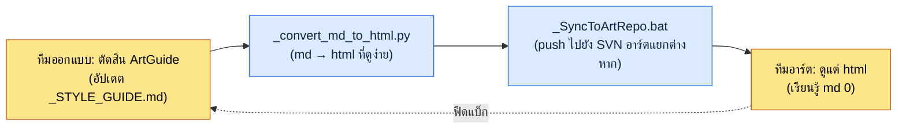

# 12.2 7 พื้นที่ของ ArtGuide (ตัวละคร·แอนิเมชัน·มอนสเตอร์·NPC·VFX·UI·สภาพแวดล้อม)

รีวิวรวมของวันพฤหัสบดี ตอนที่เราเอาแอสเซตใหม่เจ็ดชิ้นมาแปะไว้บนหน้าจอเดียวกันแล้วมองดู เราทุกคนหัวเราะออกมาพร้อมกัน ตัวละครนักปราชญ์มีเงาทึบที่ขรึมในโทนสีเทา แต่ VFX ของสกิลที่ระเบิดอยู่ข้าง ๆ กลับเป็นสีชมพูสะท้อนแสง ทั้งสองอย่างเป็นการตัดสินใจที่สมบูรณ์แบบในพื้นที่ของแต่ละฝ่าย Character Director ทำตาม `_STYLE_GUIDE.md` ของตัวเองอย่างเคร่งครัด และ VFX Artist ก็ทำตามข้อกำหนดของผมที่ว่า "ให้เด่นสะดุดตา" อย่างซื่อสัตย์ ไม่มีใครทำผิดเลย แต่พอวางไว้บนหน้าจอเดียวกันแล้ว มันเหมือนเกมสองเกมกำลังตีกันอยู่

ภาพนี้คือเหตุผลที่ต้องแบ่ง ArtGuide ออกเป็น 7 พื้นที่ และในขณะเดียวกันก็เป็นเหตุผลที่ต้องนำ 7 พื้นที่นั้นกลับมารวมกันอีกครั้ง ArtGuide คือรัฐธรรมนูญด้านภาพของเกม เมื่อแบ่งเป็นพื้นที่ ผู้กำกับแต่ละสาขาจะมีอำนาจปกครองตนเองและการตัดสินใจจะเร็วขึ้น แต่ถ้าไม่นำกลับมารวมกันด้วยรีวิวรวม อุบัติเหตุแบบสีชมพูสะท้อนแสงข้างต้นจะสะสมขึ้นทุกไตรมาส นักออกแบบเกมจะลงมือแตะที่จุดใดของสมดุลนี้ คือสาระทั้งหมดของบทนี้

---

## 12.2.1 แอสเซตหนึ่งภาพ: โครงสร้างจริงของ 7 พื้นที่

ในรีพอซิทอรีออกแบบของโปรเจกต์ A (MMORPG ที่เน้นมือถือก่อนในโทนแฟนตาซีตะวันออก) ซึ่งผู้เขียนทำงานในตำแหน่งผู้กำกับ มีโฟลเดอร์ชื่อ `96_ArtGuide/` เลข `96` ใส่ไว้เพื่อให้ Art Guide มาอยู่เกือบท้ายสุดตามกฎการเรียงลำดับของรีพอซิทอรี และข้างใต้นั้นแตกออกเป็นเจ็ดโดเมน นี่ไม่ใช่ "โฟลเดอร์อาร์ตของโปรเจกต์" แบบนามธรรม แต่ด้านล่างคือโครงสร้างย่อยจริงของโฟลเดอร์นั้น

<svg viewBox="0 0 760 360" xmlns="http://www.w3.org/2000/svg" font-family="sans-serif" font-size="13">
  <rect x="300" y="10" width="160" height="40" rx="6" fill="#2c3e50"/>
  <text x="380" y="35" fill="#fff" text-anchor="middle" font-size="14">96_ArtGuide/</text>
  <line x1="380" y1="50" x2="380" y2="70" stroke="#888" stroke-width="1.5"/>
  <line x1="70" y1="70" x2="690" y2="70" stroke="#888" stroke-width="1.5"/>
  <!-- 7 domain boxes -->
  <g>
    <rect x="20" y="70" width="100" height="70" rx="5" fill="#e8f0fe" stroke="#4285f4"/>
    <text x="70" y="92" text-anchor="middle" font-weight="bold">00_Common</text>
    <text x="70" y="112" text-anchor="middle" font-size="11">ข้อตกลงร่วม</text>
    <text x="70" y="128" text-anchor="middle" font-size="11">พาเลต·กฎ</text>
  </g>
  <g>
    <rect x="130" y="70" width="100" height="70" rx="5" fill="#fce8e6" stroke="#ea4335"/>
    <text x="180" y="92" text-anchor="middle" font-weight="bold">01_Character</text>
    <text x="180" y="112" text-anchor="middle" font-size="11">ตัวละคร</text>
    <text x="180" y="128" text-anchor="middle" font-size="11">ผู้เล่น</text>
  </g>
  <g>
    <rect x="240" y="70" width="100" height="70" rx="5" fill="#e6f4ea" stroke="#34a853"/>
    <text x="290" y="92" text-anchor="middle" font-weight="bold">02_Animation</text>
    <text x="290" y="112" text-anchor="middle" font-size="11">แอนิเมชัน</text>
    <text x="290" y="128" text-anchor="middle" font-size="11">ทั้งหมด</text>
  </g>
  <g>
    <rect x="350" y="70" width="100" height="70" rx="5" fill="#fef7e0" stroke="#fbbc04"/>
    <text x="400" y="92" text-anchor="middle" font-weight="bold">03_Monster</text>
    <text x="400" y="112" text-anchor="middle" font-size="11">วิชวล</text>
    <text x="400" y="128" text-anchor="middle" font-size="11">NPC ศัตรู</text>
  </g>
  <g>
    <rect x="460" y="70" width="100" height="70" rx="5" fill="#e8f0fe" stroke="#4285f4"/>
    <text x="510" y="92" text-anchor="middle" font-weight="bold">04_NPC</text>
    <text x="510" y="112" text-anchor="middle" font-size="11">NPC มิตร</text>
    <text x="510" y="128" text-anchor="middle" font-size="11">ความสัมพันธ์·voice</text>
  </g>
  <g>
    <rect x="570" y="70" width="100" height="70" rx="5" fill="#fce8e6" stroke="#ea4335"/>
    <text x="620" y="92" text-anchor="middle" font-weight="bold">05_VFX</text>
    <text x="620" y="112" text-anchor="middle" font-size="11">เอฟเฟกต์ภาพ</text>
    <text x="620" y="128" text-anchor="middle" font-size="11">สกิล·การจัดฉาก</text>
  </g>
  <g>
    <rect x="680" y="70" width="70" height="70" rx="5" fill="#e6f4ea" stroke="#34a853"/>
    <text x="715" y="92" text-anchor="middle" font-weight="bold" font-size="11">06_UI</text>
    <text x="715" y="112" text-anchor="middle" font-size="10">หน้าจอ·HUD</text>
    <text x="715" y="128" text-anchor="middle" font-size="10">(9.3)</text>
  </g>
  <!-- 07 on second row -->
  <line x1="380" y1="140" x2="380" y2="170" stroke="#888" stroke-width="1"/>
  <g>
    <rect x="300" y="170" width="160" height="60" rx="5" fill="#fef7e0" stroke="#fbbc04"/>
    <text x="380" y="195" text-anchor="middle" font-weight="bold">07_Environment</text>
    <text x="380" y="216" text-anchor="middle" font-size="11">ฉาก·พร็อพ·แลนด์มาร์ก</text>
  </g>
  <!-- footer note -->
  <text x="380" y="280" text-anchor="middle" font-size="12" fill="#555">แต่ละโดเมน = ผู้กำกับ/ซีเนียร์ 1 คนปกครองตนเอง + _STYLE_GUIDE.md ของแต่ละโดเมน (รัฐธรรมนูญ)</text>
  <text x="380" y="305" text-anchor="middle" font-size="12" fill="#555">00_Common = ข้อตกลงระดับบนร่วมที่ครอบเจ็ดโดเมน (สี·วัสดุ·โทนยุคสมัย)</text>
</svg>

แก่นของแผนภาพมีสองอย่าง หนึ่ง เจ็ดโดเมนวางเรียงกันอย่างเท่าเทียมและมีอำนาจปกครองตนเอง ลองนึกถึงสำนักงานที่มีห้องทำงานเจ็ดห้องเรียงกันอยู่บนชั้นเดียวกัน ผู้รับผิดชอบของแต่ละห้องถือสิทธิ์ตัดสินใจในห้องนั้น แต่เมื่อเจอกันที่ทางเดินก็ต้องไม่สูญเสียความรู้สึกว่าเป็นเกมเดียวกัน สอง เหนือขึ้นไปมี `00_Common` วางทับอยู่ ข้อตกลงร่วมที่ทั้งเจ็ดห้องต้องทำตาม นั่นคือพาเลตสีรวม มาตรฐานวัสดุ และโทนยุคสมัย ทั้งหมดอยู่ตรงนี้ ส่วน `06_UI` เป็นโดเมนเดียวกับมาตรฐานการทำงานร่วมด้าน UI ที่กล่าวถึงในหัวข้อ 9.1.3 ดังนั้นในบทนี้จะเพียงขีดเส้นเขตแดนไว้แล้วผ่านไป

## 12.2.2 ความลึกที่มือของนักออกแบบเกมเข้าถึงต่างกันในแต่ละพื้นที่

นักออกแบบเกมไม่ได้เข้าไปแทรกแซงในเจ็ดโดเมนด้วยความเข้มเท่ากัน หลักการที่ว่านักออกแบบเกมเป็นผู้ตัดสินเจตนาและเรื่องราว ส่วนอาร์ตเป็นผู้ตัดสินด้านภาพนั้นเหมือนกันในทุกโดเมน แต่เจตนาจะลากด้านภาพไปได้ไกลแค่ไหนนั้นต่างกันในแต่ละโดเมน

| พื้นที่ | การมีส่วนร่วมของนักออกแบบเกม | เส้นที่นักออกแบบเกมไม่ควรล้ำ |
|---|---|---|
| 01_Character | สูง | ถึงคอนเซปต์·บุคลิก·ฝักฝ่าย·บทบาท แต่ไม่ใช่สัดส่วนใบหน้า·ลายเส้นพู่กัน |
| 02_Animation | ปานกลาง | ถึง "ชนิด·การตอบสนอง" ของโมชันสกิล แต่ไม่ใช่การจับจังหวะเฟรม |
| 03_Monster | สูง | ถึงคอนเซปต์ศัตรู·ฝักฝ่าย·ระบบนิเวศ แต่ไม่ใช่รายละเอียดลายเกล็ด |
| 04_NPC | สูง | ถึงบทบาท·ความสัมพันธ์·voice_profile แต่ไม่ใช่งานปักบนเสื้อผ้า |
| 05_VFX | ต่ำ | ถึง "ยิงช้า, ระเบิดใหญ่, สีม่วง" แต่ไม่ใช่จำนวนพาร์ติเคิล |
| 06_UI | สูง | ถึงโครงสร้างข้อมูล·ลำดับความสำคัญ (9.3) แต่ไม่ใช่ระยะห่างระดับพิกเซล |
| 07_Environment | ปานกลาง | ถึงบรรยากาศ·เจตนาของแลนด์มาร์ก แต่ไม่ใช่จำนวนพอลิกอนของต้นไม้ |

ช่องขวาคือเนื้อหาจริงของตารางนี้ แม้แต่ในโดเมนที่เขียนว่าการมีส่วนร่วม "สูง" ก็ยังมีเส้นที่นักออกแบบเกมล้ำไม่ได้ คอนเซปต์ตัวละครต้องลากให้แรง แต่ถ้าแตะไปถึงสัดส่วนใบหน้าด้วย ในวินาทีนั้นอำนาจปกครองตนเองของ Character Director ก็พังลง และเส้นแบ่งระหว่างสูงกับต่ำเองก็สั่นไหวไปตามแนวเกม ถ้าเป็นเกมสยองขวัญ VFX คือแก่นของความน่ากลัว การมีส่วนร่วมของนักออกแบบเกมจึงสูงขึ้น ถ้าเป็นเกมพัซเซิลแบบแคชวล การมีส่วนร่วมด้านตัวละครกลับลดลง ตารางข้างต้นเป็นเกณฑ์ตามแนวเกมของโปรเจกต์ A ไม่ใช่กฎสากล

## 12.2.3 รัฐธรรมนูญของโดเมน: _STYLE_GUIDE.md

แต่ละโดเมนดำเนินงานด้วยชุดเอกสารมาตรฐาน ลองดูองค์ประกอบไฟล์จริงของโดเมน `01_Character/`

```
01_Character/
├── _STYLE_GUIDE.md          — สไตล์รวมของตัวละคร (รัฐธรรมนูญ)
├── _COLOR_PALETTE.md        — ไกด์สี·วัสดุ
├── _PROPORTION_REFERENCE.md — กฎสัดส่วน·เงาทึบ
├── _DO_AND_DONT.md          — อนุญาต·ห้าม
├── individual/              — ชีตของตัวละครแต่ละตัว
│   ├── K_001_director.md
│   ├── K_007_scholar.md
│   └── ...
└── _REVIEW_LOG.md           — ประวัติการตรวจสอบ
```

`_STYLE_GUIDE.md` คือรัฐธรรมนูญของโดเมน ชีตตัวละครรายตัว (`individual/`) ล้วนแปรผันอยู่บนรัฐธรรมนูญนี้ ถ้ารัฐธรรมนูญสั่นไหว ตัวละครทุกตัวข้างใต้ก็สั่นไหว ดังนั้นไฟล์เพียงแผ่นเดียวนี้จึงเป็นเอกสารที่ถูกตรวจสอบบ่อยที่สุดในโดเมน โครงมีดังนี้

```markdown
---
title: 01_Character Style Guide
layer: L1
---

## 1. โทน
- บรรยากาศแฟนตาซีเกาหลีก่อนการปฏิวัติอุตสาหกรรมในศตวรรษที่ 19
- สัดส่วนสมจริง (7~7.5 หัว, ห้ามดีฟอร์เม)

## 2. สี
- ความอิ่มตัว: ปานกลาง (ราว 60~70% ของภาพถ่ายจริง)
- พาเลตหลัก: สืบทอดจาก 00_Common
- สีแอ็กเซนต์ของแต่ละตัวละคร (1~2 สี)

## 3. กฎเครื่องแต่งกาย
- แยกเครื่องแต่งกายตามฝักฝ่าย (นักปราชญ์ → สีเทา + แอ็กเซนต์สีม่วง)
- รายละเอียดเครื่องแต่งกายตามอาชีพ·ชนชั้น

## 4. DO
- ระบุตัวตนได้ว่าใครเป็นใครจากเงาทึบเพียงอย่างเดียวที่ระยะ 5m
- แสดงอัตลักษณ์ของฝักฝ่ายด้วยภาพ

## 5. DON'T
- สไตล์อนิเมะญี่ปุ่น
- องค์ประกอบที่ไม่ใช่ละครย้อนยุค (เครื่องแต่งกาย·พร็อพสมัยใหม่)
- ความอิ่มตัวมากเกินไป
```

ตรงนี้มีบรรทัดหนึ่งที่สำคัญ "พาเลตหลัก: สืบทอดจาก 00_Common" ในหัวข้อ `## 2. สี` เป็นการระบุชัดว่าโดเมนตัวละครไม่ได้กำหนดสีด้วยตัวเอง แต่รับมรดกจากข้อตกลงร่วมระดับบน บรรทัดเดียวนี้คือกลไกที่ปิดกั้นอุบัติเหตุสีชมพูสะท้อนแสงในบทนำเชิงโครงสร้าง หาก `_STYLE_GUIDE.md` ของทุกโดเมนสืบทอด `00_Common` อย่างน้อยในเรื่องสี การปะทะของสีก็จะถูกตัดออกตั้งแต่ขั้นรัฐธรรมนูญ

## 12.2.4 จะดึงคนที่ไม่ใช่นักออกแบบเกมเข้ามาทำงานร่วมได้อย่างไร

ตรงนี้คือปัญหาที่เป็นรูปธรรมที่สุดที่โปรเจกต์ A ชนเข้าจริง ทีมอาร์ตไม่อ่าน Markdown พูดให้ตรงคือ ต้องไม่บังคับให้พวกเขาอ่าน ต้นทุนในการฝึกให้อาร์ติสต์เรียนรู้ git diff, frontmatter และลำดับชั้นของหัวข้อ Markdown แทบจะมากกว่าประสิทธิภาพการทำงานร่วมที่ได้จากการเรียนรู้นั้นเสมอ ในวินาทีที่ยื่นเครื่องมือของทีมออกแบบให้ทีมอาร์ตตรง ๆ การทำงานร่วมกลับช้าลง

ดังนั้นไปป์ไลน์ของโปรเจกต์ A จึงสรุปได้ด้วยบรรทัดเดียวว่า "ทีมออกแบบตัดสินด้วย md ส่วนทีมอาร์ตดูแต่ html"



แก่นคือแอสเซตอัตโนมัติสองตัว `_convert_md_to_html.py` แปลงไกด์ Markdown ของโดเมนให้เป็น html ที่อาร์ติสต์อ่านได้สบายผ่านเบราว์เซอร์ พาเลตสีถูกเรนเดอร์เป็นชิปสีจริง ส่วน DO/DON'T เรนเดอร์เป็นภาพเปรียบเทียบ `_SyncToArtRepo.bat` ดันไฟล์ html นั้นเข้าไปยัง**รีพอซิทอรีเฉพาะอาร์ตแยกต่างหาก** ไม่ใช่รีพอซิทอรีออกแบบ เหตุผลของการแยกรีพอซิทอรีนั้นเรียบง่าย ถ้าอาร์ติสต์รับเฉพาะรีพอซิทอรีของตัวเอง ก็จะไม่ถูกเปิดเผยต่อประวัติ md ภายในของทีมออกแบบ ฉบับร่างที่กำลังทำอยู่ และกระบวนการตัดสินใจของโดเมนอื่น สิ่งที่อาร์ติสต์เห็นมีเพียงผลลัพธ์ที่อ่านง่ายของการตัดสินใจที่สรุปแล้วเท่านั้น ต้นทุนการเรียนรู้ Markdown จึงลดลงเหลือ 0

ในโครงสร้างนี้นักออกแบบเกมได้รับความรับผิดชอบเพิ่มมาหนึ่งอย่าง เมื่ออัปเดต md แล้วต้องรันขั้นตอนแปลง·ซิงค์เสมอ ถ้าอัปเดตอย่างเดียวแล้วลืมซิงค์ ทีมอาร์ตก็จะวาดภาพวันนี้ด้วยการตัดสินใจของเมื่อวาน ถ้าช่องว่างหนึ่งช่องระหว่างการตัดสินใจกับการส่งต่อนี้ว่างอยู่ ทั้งการปกครองตนเองและการรวมก็ไร้ความหมาย

## 12.2.5 พรอมต์ของภาพก็เป็นการตัดสินใจ: เจตนาในการออกแบบมาก่อน

ในแนวเดียวกับการทำงานร่วมกับคนที่ไม่ใช่นักออกแบบเกม เมื่อใช้ generative AI ในขั้นคอนเซปต์ มีหลักการหนึ่งที่นักออกแบบเกมต้องยึด ในชื่อข้อตกลงภายในของโปรเจกต์ A คือ `image_prompt_design_intent_first` แปลออกมาก็คือ "พรอมต์ของภาพก็เขียนเจตนาในการออกแบบก่อน"

เมื่อสำรวจคอนเซปต์ด้วยภาพที่สร้างขึ้น ความล้มเหลวที่พบบ่อยคือพรอมต์ถูกเติมด้วยการบรรยายรูปลักษณ์ภายนอกของผลลัพธ์เพียงอย่างเดียว เช่น "ชายเอเชียวัย 50 สวมเสื้อคลุมสีเทา สีหน้าสงบนิ่ง สไตล์ภาพถ่ายจริง" พรอมต์นี้สร้างภาพได้ก็จริง แต่ไม่ได้บรรจุ**ว่าทำไมต้องเป็นเช่นนั้น** ดังนั้นเมื่อ Art Director จะแปรผันภาพนั้นจึงหลงทาง หลักการเจตนาในการออกแบบมาก่อนบังคับให้มีบล็อกเจตนาวางอยู่หน้าพรอมต์

```
[เจตนาในการออกแบบ]
- บทบาท: เสาหลักทางจิตวิญญาณของฝักฝ่ายนักปราชญ์, เมนเทอร์คนแรกของผู้เล่น
- สิ่งที่ต้องอ่านออก: เงาทึบแบบ "ปัญญาชน·ไม่ใช่สายรบ" แม้ที่ระยะ 5m
- สัญญาณฝักฝ่าย: นักปราชญ์ = สีเทา + แอ็กเซนต์สีม่วง (สืบทอดจาก 00_Common)
- ข้อห้าม: พกอาวุธ, เกราะหรูหรา (จะถูกอ่านผิดเป็นสายรบ)

[พรอมต์]
ชายเอเชียวัย 50 เป็นนักปราชญ์ในเสื้อคลุมสีเทา แอ็กเซนต์สายผูกเสื้อสีม่วง,
ไม่มีอาวุธ, สีหน้าสงบนิ่งและมีความรู้ลึกซึ้ง, แฟนตาซีเกาหลีก่อนศตวรรษที่ 19,
สัดส่วนสมจริง 7.5 หัว, ความอิ่มตัวปานกลาง, ...
```

เมื่อบล็อกเจตนาอยู่เหนือพรอมต์ ภาพนั้นก็กลายเป็นส่วนหนึ่งของการตัดสินใจ เมื่อคนถัดไปดึงท่าทางอื่นของตัวละครเดียวกัน เขาจะไม่ได้ลอกรูปลักษณ์ภายนอก แต่ตอบสนองเจตนาอีกครั้ง แม้ตอนที่ภาพไม่ถูกใจแล้วทิ้งไป ก็ยังถกเถียงกันได้ว่า "เจตนาข้อใดที่ไม่ถูกอ่านออก" พรอมต์ที่เขียนแต่รูปลักษณ์ภายนอกจะจบลงด้วย "รสนิยมของฉันชอบอันนี้มากกว่า" ไม่ได้ทิ้งหลักฐานไว้ให้ตรวจสอบ แต่พรอมต์ที่เจตนามาก่อนจะทิ้งบันทึกให้พิจารณาได้ว่าอะไรถูกเติมเต็มและอะไรขาดหาย

ตรงนี้การเลือกเครื่องมือเข้ามาเกี่ยวพันกับหลักการเจตนามาก่อน หากต้องการสร้าง "ท่าทางอื่นของตัวละครเดียวกัน" ซ้ำ ๆ ตามเจตนา ลำพังพรอมต์อย่างเดียวไม่พอ การแบ่งงานเครื่องมือของโปรเจกต์ A เหมือนกับ §12.1.1 — งานผลิตหลักใช้ SD (SDXL)/ComfyUI ที่โฮสต์เอง โดยติด LoRA ของตัวละคร (ตรึงใบหน้า·เครื่องแต่งกาย) และ ControlNet (ท่าทาง·เงาทึบ) เพื่อรักษา "การระบุตัวตนได้ที่ระยะ 5m" ที่บล็อกเจตนาเรียกร้องไว้แม้ท่าทางจะเปลี่ยน และปกป้อง IP ไปพร้อมกัน ส่วนเครื่องมือแบบปิด (เช่น Midjourney) ใช้แค่ในขั้นมูดบอร์ดเริ่มต้นเท่านั้น

## 12.2.6 บันทึกเซสชันจริง (worked transcript): หนึ่งรอบของการระบุคอนเซปต์ตัวละคร

เพื่อดูว่าการปกครองตนเองของโดเมนและการมีส่วนร่วมของนักออกแบบเกมหมุนไปจริงอย่างไร เราจะตามหนึ่งรอบของ `01_Character` ตั้งแต่ต้นจนจบ ต่อไปนี้คือการเรียบเรียงใหม่จากงานจริงที่ผู้เขียนมอบหมายให้ AI ร่างการระบุคอนเซปต์ของตัวละครนักปราชญ์ (`K_007_scholar`) เราจะไม่สรุปย่อ แต่ใส่ทั้งผลลัพธ์ที่ดูแปร่ง ๆ และการปฏิเสธของผู้เขียนไว้ตามเดิม

**① พรอมต์ที่ผู้เขียนโยนให้ AI (ฉบับเต็ม)**

```
คุณคือนักเขียนผู้ช่วยคอนเซปต์ตัวละครของโปรเจกต์เรา จงปฏิบัติตามข้อตกลงด้านล่าง
แล้วเขียนร่างเอกสารระบุคอนเซปต์ของ K_007_scholar เป็น Markdown

ข้อตกลง:
- ปฏิบัติตาม 01_Character/_STYLE_GUIDE.md: แฟนตาซีเกาหลีก่อนศตวรรษที่ 19, 7~7.5 หัว,
  ความอิ่มตัวปานกลาง, ห้ามสไตล์อนิเมะญี่ปุ่น
- สีให้สืบทอดจากพาเลต 00_Common และแอ็กเซนต์ของฝักฝ่ายนักปราชญ์เป็นสีม่วง
- ต้องมี voice_profile 5 รายการ (น้ำเสียง/คำติดปาก/คำต้องห้าม/อารมณ์ค่าเริ่มต้น/คำเรียกความสัมพันธ์) ครบถ้วน
- ตัดสินแค่ถึงคอนเซปต์·บุคลิก·ฝักฝ่าย·บทบาทเท่านั้น ส่วนรายละเอียดด้านภาพอย่างสัดส่วนใบหน้า
  หรือลายเส้นพู่กันให้เว้นว่างไว้ (เป็นพื้นที่ปกครองตนเองของ Character Director)
- เอาต์พุตเป็นรูปแบบชีตตัวละคร individual/
```

**② ผลลัพธ์ดิบของ Claude (รวมจุดที่ล้มเหลว ไม่แก้ไข)**

```markdown
# K_007 นักปราชญ์ (Scholar)

## บทบาท
เสาหลักทางจิตวิญญาณของฝักฝ่ายนักปราชญ์และเมนเทอร์คนแรกของผู้เล่น

## รูปลักษณ์
- สูง 180cm, 7.5 หัว, รูปร่างผอม
- หนวดเครางามขาว, ริ้วรอยลึก, แววตาเฉียบคม
- เสื้อคลุมสีเทาพร้อมสายผูกเสื้อสีม่วง
- ★ แนะนำ: ดวงตาประกายสีทองอ่อน ๆ เพื่อเน้นความลึกลับ

## บุคลิก
รอบรู้แต่ไม่หยิ่งผยอง เข้มงวดกับศิษย์แต่อบอุ่น

## voice_profile
- น้ำเสียง: ช้าและสงบนิ่ง
- คำติดปาก: "...เป็นเช่นนั้นแล" ลากท้ายประโยคให้ยาว
- อารมณ์ค่าเริ่มต้น: สงบนิ่ง
- คำเรียกความสัมพันธ์: เรียกผู้เล่นว่า "สหายหนุ่ม"
```

**③ การตรวจสอบ·การปฏิเสธของผู้เขียน (ตรงไหนผิดและเพราะอะไร)**

ในเอาต์พุตมีข้อบกพร่องสองจุด จุดแรก "★ แนะนำ: ดวงตาประกายสีทอง" ในหัวข้อ `## รูปลักษณ์` นี่คือการก้าวล้ำอำนาจอย่างชัดเจน สีดวงตาเป็นรายละเอียดด้านภาพซึ่งเป็นพื้นที่ปกครองตนเองของ Character Director แต่ AI กลับตอกหมุดมันลงในขั้นคอนเซปต์ ถ้าปล่อยไว้ตามนั้น ผู้กำกับก็จะอย่างใดอย่างหนึ่ง คือพับการตัดสินของตัวเองเพราะ "ฝ่ายออกแบบกำหนดมาแล้ว" หรือไม่ก็เพิกเฉยแล้วเกิดการปะทะกัน จุดที่สอง `voice_profile` มีแค่ 4 รายการ ไม่ใช่ 5 รายการ "คำต้องห้าม" หายไปทั้งยวง การที่ตัวละครเมนเทอร์จะไม่พูดคำใดเด็ดขาดนั้นสำคัญพอ ๆ กับบุคลิก แต่ AI กลับตกหล่นไป

**④ การร้องขอใหม่ (แก้เฉพาะสองจุดอย่างแม่นยำ)**

```
แก้แค่สองอย่าง
1. ลบบรรทัดแนะนำ "ดวงตาสีทอง" ออกจาก ## รูปลักษณ์ สีดวงตาเป็นพื้นที่ตัดสินใจ
   ของ Character Director หัวข้อรูปลักษณ์ให้เขียนแค่ถึงเงาทึบ·รูปร่าง·สีฝักฝ่าย
   ส่วนสี·วัสดุรายละเอียดให้เว้นว่างไว้เป็น "(Character Director ตัดสิน)"
2. เพิ่มรายการ "คำต้องห้าม" ที่หายไปใน voice_profile จงระบุคำที่ในฐานะ
   เมนเทอร์นักปราชญ์จะไม่พูด (คำหยาบ, มุกตลกหยาบคาย, คำสมัยใหม่)
```

บทเรียนของรอบนี้ไม่ใช่เครื่องมือ แต่เป็นเส้นเขตแดน AI ให้ร่างที่ดูดีอย่างรวดเร็ว แต่ก็ก้าวข้ามเส้นที่นักออกแบบเกมไม่ควรล้ำ (รายละเอียดด้านภาพ) แทน และตกหล่นสิ่งที่ต้องใส่ให้แน่ (คำต้องห้าม) เกณฑ์การตรวจสอบไม่ใช่ "เขียนดีหรือไม่" แต่เป็น "รักษาเส้นเขตแดนของการปกครองตนเองของโดเมนหรือไม่" ตราบใดที่ยังใช้ AI กับคอนเซปต์ตัวละคร การตรวจสอบเส้นเขตแดนนี้คนต้องถือไว้ในมือจนถึงที่สุด

## 12.2.7 จะนำความสอดคล้องระหว่างพื้นที่กลับมารวมกันอีกครั้งได้อย่างไร

เมื่อเจ็ดโดเมนมีอำนาจปกครองตนเอง ความไม่ลงรอยระหว่างโดเมนก็เกิดขึ้นเหมือนสีชมพูสะท้อนแสงในบทนำ รูปแบบที่ออกมาบ่อยนั้นมีกำหนดไว้แน่นอน

| ประเภทความไม่ลงรอย | ตัวอย่างจริง |
|---|---|
| ความต่างของโทนตัวละคร-สภาพแวดล้อม | ตัวละครขรึม แต่ฉากหลังหรูหราจนไปกันคนละทาง |
| การปะทะของสีตัวละคร-VFX | ตัวละครโทนสีเทา แต่ VFX สกิลเป็นสีชมพูสะท้อนแสง |
| เส้นแบ่ง NPC-Monster คลุมเครือ | เป็น NPC มิตร แต่ถูกอ่านว่าน่าคุกคามเหมือนมอนสเตอร์ |
| สีสันของ UI-ตัวละครไม่ลงรอย | UI โทนเย็น แต่ตัวละครโทนอุ่น |

กลไกที่จับความไม่ลงรอยนี้คือรีวิวรวมสัปดาห์ละ 1 ครั้ง ขั้นตอนเรียบง่าย

```
รีวิวรวม ArtGuide สัปดาห์ละ 1 ครั้ง (วันพฤหัสบดี)
─────────────────────────────────
1. สุ่มดึงแอสเซตใหม่ของสัปดาห์นั้น 5~10 ชิ้น
2. จัดวางไว้บนหน้าจอเดียวกัน (จำลองในเกม)
3. ผู้กำกับเจ็ดโดเมน + Game Director ตรวจสอบพร้อมกัน
4. พบความไม่ลงรอย → เสริม _STYLE_GUIDE ของโดเมนนั้น
   หรือเสริมข้อตกลงระดับบน 00_Common
```

แก่นอยู่ที่ข้อ 3 และข้อ 4 นั่นคือ การตรวจสอบนั้นผู้กำกับโดเมนทำ**พร้อมกัน** และความไม่ลงรอยที่พบไม่ได้แก้ด้วยการซ่อมแอสเซตแต่ละชิ้นแล้วจบ แต่นำกลับคืนสู่เอกสารไกด์ อุบัติเหตุสีชมพูสะท้อนแสงในบทนำ ถ้าแค่เปลี่ยนแอสเซตชิ้นนั้นเป็นสีเทาแล้วจบ สัปดาห์ถัดไปก็จะเกิดซ้ำเหมือนเดิม แทนที่จะทำเช่นนั้น หากเพิ่มข้อตกลงใน `00_Common` ว่า "ความอิ่มตัวของ VFX สกิลต้องอยู่ภายใน +20% ของความอิ่มตัวพาเลตตัวละคร" อุบัติเหตุแบบเดียวกันก็จะถูกปิดเชิงโครงสร้าง รอบนี้ที่สะสมเดือนละ 4 ครั้งคือการ์ดเรลเดียวที่ป้องกันไม่ให้การปกครองตนเองแข็งตัวเป็นไซโล

## 12.2.8 การปกครองตนเองไม่ใช่การกระจายความรับผิดชอบ แต่เป็นการจัดสรรเวลาการตัดสินใจใหม่

หากสรุปการเปลี่ยนแปลงที่การแบ่ง 7 พื้นที่นำมาจากประสบการณ์การดำเนินงานของโปรเจกต์ A ได้ดังนี้ ในตัวเลขด้านล่าง จำนวนวันของรอบและเวลานั้นเป็น**การประมาณของผู้เขียน (ยังไม่ได้ตรวจสอบ)** ที่อิงประสบการณ์การดำเนินงานของผู้เขียน ไม่ใช่ค่าที่วัดอย่างแม่นยำ จึงควรอ่านเพียงเป็นทิศทางและสัดส่วนคร่าว ๆ ของก่อนและหลังการแบ่งเท่านั้น

| รายการ | ก่อนแบ่ง | หลังแบ่ง | ลักษณะ |
|---|---|---|---|
| รอบการตัดสินด้านอาร์ต | 1\~2 สัปดาห์ | 3\~5 วัน | การประมาณของผู้เขียน (ยังไม่ได้ตรวจสอบ) |
| อุบัติเหตุความสอดคล้องระหว่างพื้นที่ | หลายเคสต่อไตรมาส | ลดลงอย่างเห็นได้ชัด | ทิศทางเท่านั้น |
| เวลาตรวจสอบอาร์ตของ Game Director | หลายชั่วโมงต่อสัปดาห์ | ลดลงมาก | ทิศทางเท่านั้น |
| การออนบอร์ดผู้กำกับพื้นที่ใหม่ | หลายเดือน | ราว 1 เดือน | การประมาณของผู้เขียน (ยังไม่ได้ตรวจสอบ) |
| อัตราการทิ้งแอสเซตอาร์ต | สูง | ลดลง | ทิศทางเท่านั้น |

ถ้าอ่านตารางอย่างซื่อสัตย์ สิ่งที่ยืนยันได้มีเพียงข้อเท็จจริงว่าทุกรายการขยับไปในทิศทางเดียวกันเท่านั้น ผลที่ชัดเจนที่สุดคือเวลาของ Game Director ถูกเรียกคืน ในโครงสร้างที่ไม่มีการปกครองตนเอง การตัดสินด้านอาร์ตทุกอย่างต้องผ่านโต๊ะของ Game Director เพียงคนเดียว เป็นโครงสร้างที่กระดาษกองอยู่บนโต๊ะตัวเดียว พอแบ่งเป็น 7 พื้นที่ กระดาษก็กระจายไปยังเจ็ดโต๊ะ ปริมาณกระดาษรวมเท่าเดิม แต่ไม่มีโต๊ะไหนถล่มลง

ตรงนี้ต้องตัดความเข้าใจผิดที่พบบ่อยที่สุดออกไป การปกครองตนเองไม่ใช่การกระจายความรับผิดชอบ แต่เป็นการจัดสรรเวลาใหม่ การที่ผู้กำกับโดเมนตัดสินพื้นที่ของตัวเองไม่ได้หมายความว่าความรับผิดชอบด้านภาพของทั้งเกมแตกกระจายเป็นเจ็ดเสี่ยง ในรีวิวรวม เจ็ดคนนั้นมารวมตัวกัน ณ ที่เดียวกันอีกครั้ง และความรับผิดชอบด้านภาพสูงสุดก็ยังรวมศูนย์ที่คนเพียงคนเดียวเหมือนเดิม ในวินาทีที่นำการปกครองตนเองมาเป็นข้ออ้างในการเลี่ยงความรับผิดชอบ — วินาทีที่ "นั่นมันนอกโดเมนของฉัน" กลายเป็นคำติดปาก — สีชมพูสะท้อนแสงในบทนำก็จะเข้าไปอยู่ในบิลด์โดยไม่เป็นปัญหาของใครเลย

และมีข้อแม้หนึ่ง การปกครองตนเอง 7 พื้นที่เป็นฟังก์ชันของขนาด ในทีมขนาดเล็ก (\~10 คน) มันกลับเป็นการ over-engineering ถ้าอยู่ในขั้นที่ผู้กำกับคนเดียวสวมหมวกห้าใบ ไกด์โดเมนเจ็ดแผ่นก็ไม่จำเป็น มีไกด์รวมแผ่นเดียวก็พอ การปกครองตนเองจะเริ่มคุ้มค่าก็ต่อเมื่อโต๊ะเริ่มไม่พอเท่านั้น

## 12.2.9 ความล้มเหลวที่พบบ่อยและวิธีแก้

| รูปแบบ | วิธีแก้ |
|---|---|
| รวมการตัดสินทุกอย่างไว้ที่ Game Director โดยไม่แบ่งพื้นที่ | นำการปกครองตนเอง 7 พื้นที่มาใช้ (แต่เริ่มจากขนาดกลาง (10\~50 คน)) |
| ไม่มี _STYLE_GUIDE ของโดเมน | บังคับให้เขียนรัฐธรรมนูญของแต่ละโดเมนเป็นเกต |
| ไม่มีการตรวจสอบรวมระหว่างพื้นที่ | รีวิวรวมสัปดาห์ละ 1 ครั้ง + นำกลับคืนสู่ไกด์ |
| นักออกแบบเกมตัดสินถึงรายละเอียดด้านภาพ | ระบุแค่ถึงเจตนา·เรื่องราว ส่วนรายละเอียดเป็นของผู้กำกับ |
| การปกครองตนเองแข็งตัวเป็นไซโล | นำกลับคืนสู่ 00_Common ในรีวิวรวม |
| ลืมซิงค์หลังอัปเดต md | ทำให้เป็นนิสัย `_convert_md_to_html.py` → `_SyncToArtRepo.bat` |
| พรอมต์ของภาพมีแต่การบรรยายรูปลักษณ์ภายนอก | นำบล็อกเจตนาในการออกแบบมาก่อน (`image_prompt_design_intent_first`) |

---

### สรุปประเด็นสำคัญของบท
- สมดุลระหว่างการปกครองตนเอง 7 พื้นที่กับรีวิวรวมสัปดาห์ละ 1 ครั้งคือตัวเนื้อแท้ของ ArtGuide
- นักออกแบบเกมรับผิดชอบถึงเจตนา·เรื่องราว ส่วนรายละเอียดด้านภาพเป็นพื้นที่ปกครองตนเองของผู้กำกับโดเมน
- การปกครองตนเองไม่ใช่การกระจายความรับผิดชอบ แต่เป็นการจัดสรรเวลาการตัดสินใจใหม่

### ตัวอย่างบทถัดไป
- 12.3 การไหลจากเอกสารออกแบบ → คอนเซปต์ → แอสเซตในเกม

---

## ลองทำดู

**setup** — เริ่มจากโดเมนเดียวที่ใช้แรงมากที่สุด (มักเป็น `01_Character`) ก่อน สร้าง `_STYLE_GUIDE.md` (รัฐธรรมนูญ), `_COLOR_PALETTE.md`, `_DO_AND_DONT.md`, `individual/` ไว้ในโฟลเดอร์โดเมน ในหัวข้อสีให้ใส่บรรทัด "พาเลตหลัก: สืบทอดจาก 00_Common" ไว้ให้แน่นอน

**prompt** — เมื่อร่างชีตแอสเซตรายตัวด้วย AI ให้ระบุในพรอมต์ว่า (1) ข้อตกลงของ `_STYLE_GUIDE.md` ของโดเมนนั้น (2) "ตัดสินแค่ถึงคอนเซปต์·เรื่องราว ส่วนรายละเอียดด้านภาพให้เว้นว่างไว้เป็น '(Director ตัดสิน)'" (3) รายการบังคับที่ขาดไม่ได้ (เช่น voice_profile 5 รายการ) ถ้าเป็นพรอมต์ของภาพ ให้เขียนบล็อก `[เจตนาในการออกแบบ]` ไว้เหนือการบรรยายรูปลักษณ์ภายนอกก่อน

**verify** — เมื่อได้เอาต์พุตมา ให้ตรวจสอบด้วย "รักษาเส้นเขตแดนของการปกครองตนเองของโดเมนหรือไม่" ไม่ใช่ "เขียนดีหรือไม่" ดูแค่สองอย่าง ① AI ไม่ได้ตัดสินรายละเอียดด้านภาพที่นักออกแบบเกมไม่ควรล้ำแทนใช่ไหม ② ไม่มีรายการบังคับขาดหายไปใช่ไหม จากนั้นชี้เฉพาะจุดที่ผิดเพี้ยนแล้วร้องขอใหม่ ทุกวันพฤหัสบดี รวบรวมแอสเซตใหม่ 5\~10 ชิ้นไว้บนหน้าจอเดียวแล้วดูพร้อมกับผู้กำกับโดเมน ความไม่ลงรอยให้นำกลับคืนสู่เอกสารไกด์ (`00_Common` หรือ `_STYLE_GUIDE` ของโดเมน) ไม่ใช่ตัวแอสเซต

**ฉบับย่อสำหรับคนเดียว** — ถ้าเป็นเกมที่ทำคนเดียว อย่าสร้างเจ็ดโดเมน รวมพาเลตสี·โทนยุคสมัย·DO/DON'T ไว้ใน `00_Common` แผ่นเดียว แล้วแบ่งส่วนตัวละคร·สภาพแวดล้อม·VFX ไว้ในนั้นด้วยหัวข้อเท่านั้น เมื่อมอบหมายแอสเซตให้ AI ก็แปะแผ่นเดียวนั้นลงในพรอมต์ทั้งแผ่น แล้วสั่งไปพร้อมกันว่า "ถ้ามีจุดที่ขัดกับไกด์นี้ให้ทำเครื่องหมายไว้" รีวิวรวมก็ทำคนเดียวสัปดาห์ละครั้ง เป็นพิธีกรรม 5 นาทีที่เอาสิ่งที่ทำในสัปดาห์นั้นมาวางบนหน้าจอเดียวแล้วดู ก็เพียงพอ เพียงแต่ไม่มีคนให้แบ่งการปกครองตนเองเท่านั้น ส่วนโครงที่เป็นรัฐธรรมนูญหนึ่งแผ่นกับการจัดเรียงสัปดาห์ละ 1 ครั้งนั้น ในทีมคนเดียวก็คุ้มค่าเช่นเดียวกัน
