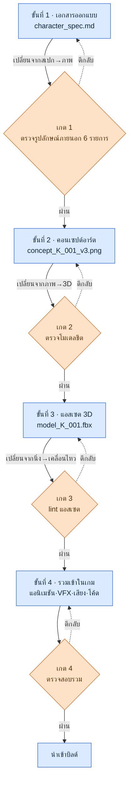
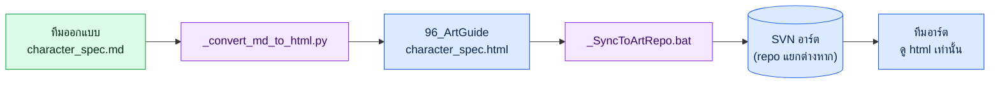

# 12.3 จากเอกสารออกแบบ → คอนเซปต์ → แอสเซตในเกม

ช่วงท้ายสปรินต์ คอนเซปต์อาร์ติสต์โยนภาพร่างตัวละครหนึ่งใบมาทางแชตภายในทีม "นี่คือซีเนียร์ของกิลด์นักปราชญ์ใช่ไหม" คนในภาพเป็นชายวัย 30 กว่าสวมเกราะหนัง แต่ในเอกสารออกแบบระบุไว้ว่าเป็นหญิงวัย 40 กว่าสวมชุดคลุมนักปราชญ์สีเทา เมื่อย้อนรอยว่าความคลาดเคลื่อนเกิดขึ้นตรงไหน พบว่าข้อมูลที่คอนเซปต์อาร์ติสต์ได้รับคือเอกสารออกแบบเวอร์ชันเมื่อสองเดือนก่อน และในช่วงนั้นแนวทางรูปลักษณ์ภายนอกถูกแก้ไขไปแล้วถึงสองครั้ง คนเดียวที่รู้ว่ามีการแก้ไขคือตัวนักออกแบบเกมเอง

อุบัติเหตุนี้ไม่ใช่ปัญหาทางเทคนิค แต่เป็นปัญหาของกระแสการส่งต่อ (flow) กว่าเอกสารออกแบบหนึ่งหน้าจะกลายเป็นแอสเซตในเกมต้องใช้เวลาเฉลี่ย 4\~8 สัปดาห์ ในช่วงนั้นข้อมูลของตัวละครหนึ่งตัวจะถูกส่งผ่านจากมือสู่มือ จากหัวของนักออกแบบเกมไปยังคอนเซปต์อาร์ติสต์ ไปยังโมเดลเลอร์ และไปยังแอนิเมเตอร์ ทุกครั้งที่ส่งต่อ รูปแบบอาจคลาดเคลื่อนได้ และหากรับงานที่คลาดเคลื่อนมาทั้งอย่างนั้น ผู้รับก็จะเติมช่องว่างด้วยการเดา การเดานั้นจะย้อนกลับมาเป็นข้อความหนึ่งบรรทัดในแชตอีกสองเดือนถัดมา

บทนี้ว่าด้วยวิธีวางกระแสการส่งต่อจากมือสู่มือนั้นไว้บนระบบ แทนที่จะฝากไว้กับความทรงจำของคนคนเดียว

---

## 12.3.1 จากมือสู่มือ — 4 ขั้นตอนกับจุดเปลี่ยน

ในโปรเจกต์ A เส้นทางที่แอสเซตตัวละครไหลผ่านมีอยู่สี่ขั้นตอน สิ่งสำคัญไม่ใช่ตัวขั้นตอนเอง แต่เป็นจุดเปลี่ยนระหว่างขั้นตอนหนึ่งกับอีกขั้นตอนหนึ่ง อุบัติเหตุไม่ได้เกิดขึ้นภายในขั้นตอน แต่ระเบิดในช่วงเวลาที่ส่งต่อแอสเซตจากขั้นตอนหนึ่งไปยังขั้นตอนถัดไป

แทนที่จะอธิบายกระแสนี้ด้วยตัวอักษร ควรวาดเป็นแผนภาพ และตลอด 24 ส่วนของหนังสือเล่มนี้ ผู้เขียนใช้วิธีขอโค้ด mermaid จาก Claude มาเรนเดอร์แทนการวาดกล่องด้วยมือ บทนี้นำผลลัพธ์ที่ได้จากการประยุกต์เทคนิคนั้นมาใส่ไว้ในเนื้อหา เท่ากับเป็นการพิสูจน์เทคนิคของตัวเองด้วยเนื้อหาของตัวเอง ด้านล่างคือผลลัพธ์ที่ขอจาก Claude ว่า "ช่วยวาดกระแส 4 ขั้นตอนของ spec→asset ให้เห็นเกตจุดเปลี่ยนเป็น mermaid" แล้วนำมาเรนเดอร์ตามเดิม



ที่จุดเปลี่ยนทั้งสาม (สเปก→ภาพ, ภาพ→3D, นิ่ง→เคลื่อนไหว) มีเกตยืนอยู่ เกตคือช่องตรวจสอบที่คอยตรวจรูปแบบของเอกสารก่อนจะส่งต่อให้แผนกถัดไป หากรูปแบบไม่ตรงก็จะถูกตีกลับ (เส้นประ) ให้ย้อนไปยังขั้นตอนก่อนหน้า หากรับเอกสารที่รูปแบบไม่ตรงเข้ามา แผนกถัดไปก็จะเติมช่องว่างด้วยการเดา อุบัติเหตุจากแชตเกิดขึ้นเมื่อไม่มีเกต 1

ข้อดีของ mermaid เผยให้เห็นในภาพนี้ เมื่อต้องเพิ่มเกตอีกหนึ่งจุดหรือสลับลำดับขั้นตอน ไม่ต้องวาดกล่องใหม่ เพียงแก้ตัวอักษรหนึ่งบรรทัดก็พอ เพราะแผนภาพเป็นตัวอักษร มันจึงกลายเป็นสิ่งที่อยู่ภายใต้การจัดการเวอร์ชัน และถูก commit ไปพร้อมกับเอกสารออกแบบ

---

## 12.3.2 ขั้นที่ 1 — เอกสารออกแบบคือรากของอินพุตทั้งหมด

จุดเริ่มต้นของกระแสคือเอกสารสเปก Markdown หนึ่งหน้า เอกสารนี้เป็นอินพุตของทั้งสามขั้นตอนที่ตามมา หากตรงนี้มีช่องว่าง ช่องว่างนั้นไม่ได้หายไป แต่ถูกผลักไปยังขั้นตอนถัดไปและกลายเป็นการเดา

ด้านล่างคือแบบฟอร์ม `character_spec` ที่ใช้เขียนจริง ฟิลด์ `related_atoms` คือสิ่งที่เชื่อมสเปกนี้เข้ากับระบบ JIT atom (ดูส่วนที่ 11)

```markdown
---
title: สเปกตัวละครซีเนียร์กิลด์นักปราชญ์ K_001
type: character_spec
layer: L2
related_atoms: [character_K_001, voice_profile_K_001]
status: draft
---

## 1. อัตลักษณ์
- ชื่อ: (TBD)
- บทบาท: ซีเนียร์ของกิลด์นักปราชญ์, NPC หลัก, เป็นเพื่อนร่วมทางได้
- ฝ่าย: scholar_guild
- บุคลิก: นักปราชญ์_เคร่งครัด, มีอำนาจแต่ยุติธรรม

## 2. แนวทางรูปลักษณ์ภายนอก
- อายุ: 40 กว่า
- เพศ: หญิง
- รูปร่าง: ใหญ่กว่าค่าเฉลี่ยเล็กน้อย (ราว 170cm)
- เครื่องแต่งกาย: สีเทา + แต้มสีม่วง, ชุดคลุมนักปราชญ์, แว่นตา

## 3. สีหน้า·ท่าทาง
- ปกติ: สงบนิ่ง, มุมปากลดลง
- เมื่อโกรธ: เงียบ + ตัดสายตา
- เศร้า: เปลี่ยนเรื่อง, สีหน้าเปลี่ยนแปลงเพียงเล็กน้อย

## 4. บทบาทในเกม
- ปรากฏในเควสต์หลัก chapter 1·5·12
- ออกเควสต์เสริม 8 รายการ
- ร่วมเป็นเพื่อนร่วมทาง chapter 7

## 5. เสียง·บทพูด
- voice_profile: scholar_K_001
- บทพูดตัวแทน 3 ประโยค:
  - "เรื่องนั้นเป็นเรื่องที่ไม่มีบันทึกอยู่ใช่ไหม"
  - "อย่าตัดสินด้วยอารมณ์ ข้อมูลต้องมาก่อน"
  - "...เป็นทางเลือกของคุณสินะ เข้าใจแล้ว"

## 6. ข้อมูลอ้างอิง
- ภาพนักปราชญ์จริง 5 คน (ตรวจสอบทางกฎหมายเรียบร้อย)
- อ้างอิงโทนตัวละครจาก refgame
```

รูปลักษณ์ภายนอก 6 รายการ (อายุ·เพศ·รูปร่าง·เครื่องแต่งกายในส่วนที่ 2 และสีหน้า·ท่าทางในส่วนที่ 3) กลายเป็นเช็กลิสต์ของเกต 1 สองบรรทัดที่ว่า "หญิงวัย 40 กว่า / ชุดคลุมสีเทา" ซึ่งเป็นต้นเหตุของอุบัติเหตุจากแชต ก็คือส่วนนี้นั่นเอง หากเกต 1 ทำงาน ก็จะมีการตรวจสอบว่ารูปลักษณ์ภายนอก 6 รายการในข้อมูลที่คอนเซปต์อาร์ติสต์ได้รับนั้นตรงกับเอกสารออกแบบฉบับปัจจุบันหรือไม่ ก่อนจะส่งต่อ

### บันทึกเซสชันจริง (worked transcript) — การโต้ตอบหนึ่งรอบเพื่อเติมช่องว่างในเอกสารออกแบบ

แทนที่จะเติมเอกสารสเปกด้วยมือทั้งหมดจากศูนย์ ผู้เขียนกำหนดเพียงอัตลักษณ์และบทบาทไว้ก่อน แล้วให้ Claude ร่างรูปลักษณ์ภายนอก·สีหน้ามาให้ ด้านล่างคือบันทึกเต็มของการโต้ตอบหนึ่งรอบจริง โดยไม่ได้สรุปย่อ

**พรอมต์ (ฉบับเต็ม):**

> อัตลักษณ์·บทบาทของตัวละครด้านล่างนี้เป็นที่ยืนยันแล้ว จงใช้สิ่งนี้เป็นพื้นฐานเพื่อเติมร่างของ "2. แนวทางรูปลักษณ์ภายนอก" และ "3. สีหน้า·ท่าทาง" ใน character_spec
> - บทบาท: ซีเนียร์ของกิลด์นักปราชญ์, NPC หลัก, เป็นเพื่อนร่วมทางได้
> - บุคลิก: นักปราชญ์_เคร่งครัด, มีอำนาจแต่ยุติธรรม
> - ฝ่าย: scholar_guild
> ข้อจำกัด: โทนแบบ refgame (แฟนตาซีตะวันออก, ความอิ่มสีต่ำ) รูปลักษณ์ภายนอกต้องแยกแยะออกจาก NPC หลักตัวอื่นได้ด้วยเงาเงียบ (silhouette) เพียงอย่างเดียว สีหน้าให้เป็นแบบเก็บกดที่ไม่เผยความโกรธ·ความเศร้าออกมาตรง ๆ

**ผลลัพธ์ดิบของ Claude (ตามเดิม ไม่ได้ขัดเกลา):**

> ## 2. แนวทางรูปลักษณ์ภายนอก
> - อายุ: ปลาย 40
> - เพศ: หญิง
> - รูปร่าง: ค่อนข้างผอม, ราว 165cm (※ จำเป็นต้องยืนยันว่าจะสื่อ "ความมีอำนาจ" ผ่านความสูงหรือผ่านท่าทาง — ผมแนะนำให้สื่อผ่านท่าทาง)
> - เครื่องแต่งกาย: ชุดนักปราชญ์สีกรมท่าเข้ม, ปักด้ายเงิน (※ ผมไม่ทราบพาเลตต์สีของฝ่าย scholar_guild มีสีตัวแทนแยกต่างหากหรือไม่)
>
> ## 3. สีหน้า·ท่าทาง
> - ปกติ: ยืนตรงเชิดคางขึ้นเล็กน้อย, สายตาอยู่สูงกว่าคู่สนทนาเล็กน้อย
> - เมื่อโกรธ: พูดน้อยลงและน้ำเสียงเย็นชาลงเท่านั้น
> - เศร้า: แทนที่ด้วยการมองออกไปนอกหน้าต่าง, สีหน้าแทบไม่เปลี่ยน
>
> อีกข้อหนึ่ง: หากเป็น "เพื่อนร่วมทางได้" ก็น่าจะต้องมีสีหน้าระหว่างต่อสู้ด้วย แต่นั่นอยู่นอกขอบเขตของสเปกนี้หรือเปล่า

**การตรวจสอบ·ปฏิเสธโดยมนุษย์:**

ผลลัพธ์นี้รับมาเพียงครึ่งเดียว ส่วนสีหน้า·ท่าทางรับมาเกือบทั้งหมด — เพราะจับข้อจำกัดเรื่องแบบเก็บกดได้อย่างแม่นยำ และ "แทนความเศร้าด้วยการมองออกนอกหน้าต่าง" เป็นรายละเอียดที่ดีซึ่งไม่มีในเอกสารออกแบบ ส่วนรูปลักษณ์ภายนอกถูกปฏิเสธ ด้วยสองเหตุผล หนึ่ง รูปร่างถูกกำหนดเป็น "ค่อนข้างผอม, 165cm" แต่เอกสารออกแบบที่ยืนยันแล้วระบุว่า "ใหญ่กว่าค่าเฉลี่ยเล็กน้อย, 170cm" Claude ได้รับเพียงอัตลักษณ์·บทบาทจึงไม่อาจรู้รูปร่างได้ และเป็นการเดา — นี่คือการเดาที่เกตควรสกัดไว้พอดี สอง เครื่องแต่งกายสีกรมท่าตรงกับโทน refgame ก็จริง แต่ขัดกับสีตัวแทนของฝ่าย scholar_guild ในเกมเรา (สีเทา+ม่วง) คำถามที่ Claude โยนมา ("มีสีตัวแทนของฝ่ายแยกต่างหากหรือไม่") ได้ชี้ความขัดแย้งนี้ไว้ล่วงหน้าพอดี

**การขอใหม่:**

> ดี สีหน้า·ท่าทางรับไว้ ส่วนรูปลักษณ์ภายนอกให้ตรึงเป็นค่าต่อไปนี้แล้วเรียบเรียงใหม่: รูปร่าง = ใหญ่กว่าค่าเฉลี่ยเล็กน้อย 170cm, เครื่องแต่งกาย = ชุดคลุมนักปราชญ์สีเทา + แต้มสีม่วง (สีตัวแทนของ scholar_guild), สวมแว่นตา สีหน้าระหว่างต่อสู้อยู่นอกขอบเขตของสเปกนี้ จึงตัดออก

สิ่งที่ได้เรียนรู้จากการโต้ตอบหนึ่งรอบนี้คือ จุดที่ Claude เติมช่องว่างด้วยการเดา ก็คือช่องว่างของเอกสารออกแบบนั่นเอง เมื่อพบค่าที่ไม่รู้ Claude แยกออกเป็นสองทาง สีของฝ่ายและสีหน้าระหว่างต่อสู้นั้นมันยกขึ้นเป็นคำถามว่า "เรื่องนี้ไม่รู้" และคำถามนั้นได้ชี้จุดที่ขาดหายไปก่อนเช็กลิสต์ของเกตเสียอีก ในทางกลับกัน รูปร่างกลับถูกถมด้วยตัวเลขที่ดูสมเหตุสมผลโดยไม่มีการระบุว่าไม่รู้ ตราบใดที่ยังมีอย่างหลังอยู่ การตรวจสอบที่มนุษย์เทียบกับเอกสารออกแบบที่ยืนยันแล้วทีละบรรทัดก็เป็นสิ่งที่ละเว้นไม่ได้

---

## 12.3.3 ขั้นที่ 2 — คอนเซปต์อาร์ต และเกต 1

เอกสารออกแบบที่ยืนยันแล้วถูกส่งต่อไปยังคอนเซปต์อาร์ติสต์ กระแสการทำงานเหมือนกับเวิร์กโฟลว์คอนเซปต์ใน §12.1.2 คือใช้ AI ผลิตหลายสิบถึงหลายร้อยภาพ, คัดสรร (curate) ให้เหลือกำมือเดียว, ขัดเกลา 1\~3 แบบด้วยมือ แล้วจึงสร้างโมเดลชีต (ด้านหน้า·ด้านข้าง·ด้านหลัง)

หัวใจคือเกต 1 ที่ตั้งอยู่ตอนปลายของขั้นตอนนี้ ก่อนโมเดลชีตจะส่งต่อไปยังขั้นที่ 3 (3D) จะตรวจห้ารายการต่อไปนี้

| รายการ | เกณฑ์ตรวจสอบ |
|---|---|
| ตรงกับรูปลักษณ์ภายนอก 6 รายการในเอกสารออกแบบ | เครื่องแต่งกาย·รูปร่าง·อายุ·เพศ·สีหน้า·ท่าทาง ตรงกับเอกสารออกแบบฉบับปัจจุบัน |
| แยกเงาเงียบระหว่าง NPC หลัก | จำแนกจากตัวละครอื่นได้ด้วย silhouette เพียงอย่างเดียว |
| เป็นไปตาม ArtGuide `01_Character/_STYLE_GUIDE` | ไม่ละเมิดสไตล์ไกด์ของโดเมน |
| ไม่ขัดแย้งกับ voice_profile | ความประทับใจทางสายตาไม่ขัดกับความประทับใจทางเสียง |
| ระบุตัวได้เมื่อย่อขนาด | แม้ย่อเป็นขนาด UI·มินิแมป ก็ยังจำได้ว่าเป็นใคร |

ตรงนี้ atom `image_prompt_design_intent_first` ทำงาน เวลาคอนเซปต์อาร์ติสต์เขียนพรอมต์ ก็ไม่ได้เริ่มจากการไล่เรียงคำบรรยายรูปลักษณ์ภายนอกอย่าง "นักปราชญ์หญิงในชุดคลุมสีเทา" แต่เริ่มจากเจตนาในการออกแบบของเอกสารออกแบบก่อน ("มีอำนาจแต่ยุติธรรม", "นักปราชญ์ที่เก็บกดอารมณ์") หากกุมเพียงคีย์เวิร์ดรูปลักษณ์ภายนอกแล้วผลิตหลายร้อยภาพ ก็จะได้ภาพกองพะเนินที่สีเสื้อตรงแต่แววตาไม่ใช่นักปราชญ์ — การวางเจตนาไว้ข้างหน้าสุดก็เพื่อลดกองภาพที่ "รูปลักษณ์ตรงแต่ความประทับใจคลาดเคลื่อน" นั้นลงล่วงหน้า เครื่องมือผลิตเหมือนกับ §12.1.1·§12.2.5 — คือนำ SD (SDXL)/ComfyUI ที่โฮสต์เอง มาคล้องเข้ากับ character LoRA (ตรึงใบหน้า·เครื่องแต่งกาย) และ ControlNet (ตรึงท่าโพส·เงาเงียบ) เพื่อให้แม้จะดึงตัวละครคนเดียวกันออกมาในท่าโพสต่าง ๆ เป็นร้อยภาพ ใบหน้าก็ไม่พังทลาย

รายการแรกของเกต 1 ที่ว่า "ตรงกับรูปลักษณ์ภายนอก 6 รายการในเอกสารออกแบบ" คือกลอนประตูโดยตรงที่สกัดอุบัติเหตุจากแชต เพราะมีการเทียบกับเอกสารออกแบบฉบับปัจจุบันก่อนที่ภาพร่างคอนเซปต์จะแข็งตัวเป็นโมเดลชีต ความคลาดเคลื่อนจากการทำงานโดยถือเวอร์ชันเมื่อสองเดือนก่อนจึงถูกดักไว้ตรงจุดนี้

---

## 12.3.4 ร่วมงานกับผู้ที่ไม่ใช่นักออกแบบเกม — md ให้ทีมออกแบบเท่านั้น, ทีมอาร์ตดู html เท่านั้น

ตรงนี้ต้องชี้ให้เห็นความไม่สมมาตรเชิงปฏิบัติการอย่างหนึ่ง เอกสารสเปกที่เห็นมาจนถึงตอนนี้ล้วนเป็น Markdown แต่คอนเซปต์อาร์ติสต์และโมเดลเลอร์ 3D ไม่ได้มาทำงานในบริษัทเกมเพื่ออ่าน Markdown ด้วยเหตุนี้ โปรเจกต์ A จึงใช้ไปป์ไลน์การแปลงทิศทางเดียว ("ทีมออกแบบตัดสินใจด้วย md, ทีมอาร์ตดู html เท่านั้น") ที่เห็นใน §12.2.4 กับกระแส spec→asset นี้ตามเดิม โดยแปลงการตัดสินใจ md ของทีมออกแบบเป็น html แล้วผลักเข้า SVN ของอาร์ตที่แยกต่างหาก ส่วนทีมอาร์ตดูแต่ html — ต้นทุนการเรียนรู้ md จึงเป็น 0



`_convert_md_to_html.py` แปลง md เป็น html ที่อ่านง่าย และ `_SyncToArtRepo.bat` push ผลลัพธ์นั้นไปยัง SVN อาร์ต ไม่ใช่ SVN ออกแบบ เหตุผลที่แยกสอง repo เหมือนกับหลักการแยก PC — คือการปกป้องไม่ให้กระแสการทำงานของฝ่ายหนึ่งไปเขียนทับอีกฝ่าย การแปลงเป็นทิศทางเดียวจากออกแบบ → อาร์ตเสมอ และแม้ทีมอาร์ตจะแก้ html ก็ไม่ไหลย้อนกลับมาเป็น md ของฝ่ายออกแบบ

ปลายทางของการแปลงนั้น คือ `96_ArtGuide` แบ่งออกเป็น 7 โดเมน (`00_Common`·`01_Character`\~`07_Env`) แต่ละโดเมนปกครองตนเองด้วย `_STYLE_GUIDE` ของตัวเอง โดยมี `00_Common` มัดข้อตกลงร่วมของทุกโดเมน (ช่วงความอิ่มสี·การตั้งชื่อ·ความละเอียด) ไว้ (แผนภาพโครงสร้างดู §12.2.1) รายการตรวจที่สามของเกต 1 ก็คือการเป็นไปตาม `01_Character/_STYLE_GUIDE` นี้นั่นเอง

---

## 12.3.5 ขั้นที่ 3 — แอสเซต 3D และ lint อัตโนมัติ

เมื่อโมเดลชีตส่งต่อไปยังขั้น 3D จะผ่าน 8 กระบวนการ: โมเดลลิงไฮโพลี → รีโทโพโลยี (โลว์โพลีสำหรับใช้ในเกม) → UV unwrap → เท็กซ์เจอร์ → ริกกิง·สกินนิง → ทดสอบท่าโพส → ตรวจสอบ ขั้นตอนนี้เป็นช่วงที่ AI อ่อนที่สุด เนื่องจากโมเดลสร้าง 3D ยังให้รีโทโพโลยี·UV ระดับคุณภาพเกมไม่ได้ คนและเครื่องมือแบบดั้งเดิมจึงเป็นตัวเอก

แทนนั้น ขั้นตอนนี้มีเกต 3 หรือก็คือ lint แอสเซตอัตโนมัติ กำกับอยู่ แทนที่คนจะนับจำนวนพอลิกอนทุกครั้ง การตรวจสอบจะเกิดขึ้นอัตโนมัติในชั่วขณะที่ commit แอสเซต

| รายการตรวจ | เงื่อนไขผ่าน |
|---|---|
| จำนวนพอลิกอน | ช่วงมาตรฐานต่อตัวละคร (เกณฑ์ที่ผู้เขียนใช้คือ 40,000\~80,000) |
| ความละเอียดเท็กซ์เจอร์ | มาตรฐาน 2048×2048 |
| ประสิทธิภาพ UV unwrap | ใช้พื้นที่ตั้งแต่ 80% ขึ้นไป |
| จำนวนกระดูก (bone) | เป็นไปตามชุดกระดูกมาตรฐาน |
| กฎการตั้งชื่อแอสเซต | เป็นไปตามคอนเวนชันการตั้งชื่อในส่วนที่ 11 |

หากตรวจพบการละเมิด ระบบจะแจ้งเตือนไปยัง 3D อาร์ติสต์ที่เกี่ยวข้อง เป็นการย้ายการตรวจสอบที่เคยพึ่งสายตาของคนไปเป็นเชิงกำหนด (deterministic) รายการอย่างจำนวนพอลิกอน·ความละเอียดนั้นถูกผิดชัดเจน จึงไม่ใช่หน้าที่ของ AI หรือคน แต่เป็นของสคริปต์ lint

ตรงนี้มีขั้นตอนที่ย้อนกลับไม่ได้ (irreversible) ขั้นหนึ่งปรากฏขึ้น คือกระบวนการเรนเดอร์ที่อบ (bake) เท็กซ์เจอร์ เท็กซ์เจอร์ที่เบกแล้วครั้งหนึ่งไม่อาจย้อนกลับได้ ดังนั้นก่อนเรนเดอร์ทันที เกต 3 จะทำงานอีกหนึ่งครั้ง การจับโมชัน (motion capture) ในขั้นที่ 4 ก็ย้อนกลับไม่ได้เช่นกัน — เซสชันจับโมชันไม่อาจย้อนกลับได้จนกว่าจะเรียกนักแสดงและอุปกรณ์กลับมาอีกครั้ง เกตที่อยู่หน้าขั้นตอนซึ่งย้อนกลับไม่ได้จึงดำเนินการอย่างเข้มงวดกว่าเกตอื่น

---

## 12.3.6 ขั้นที่ 4 — รวมเข้าในเกมและการตรวจสอบรวม

แอนิเมชัน·VFX·เสียง·โค้ดถูกรวมเข้ากับแอสเซต 3D และปรากฏในเกมเป็นครั้งแรก เป็นขั้นที่ทุกสาขามารวมกันในที่เดียว และเกต 4 (ตรวจสอบรวม) คือกลอนประตูบานสุดท้าย

| รายการตรวจสอบ | ผู้รับผิดชอบ |
|---|---|
| ตรงกับเจตนาของเอกสารออกแบบ | นักออกแบบเกม |
| โทนวิชวล·ความสอดคล้อง | อาร์ตไดเรกเตอร์ |
| ความเป็นธรรมชาติของแอนิเมชัน | แอนิเมชันไดเรกเตอร์ |
| ระบุตัวได้ในเกม | เกมไดเรกเตอร์ |
| ประสิทธิภาพ (ภาระเฟรม) | เทคอาร์ต |

ต่อตัวละครหนึ่งตัว 5 คนใช้เวลาดูราว 30 นาที\~1 ชั่วโมง lint ของขั้นตอนนี้คือ การแมประหว่างแอสเซตกับรีซอร์ส (`Skill_Art_Resource_Mapping`) ที่รันอัตโนมัติ เพื่อตรวจว่ารีซอร์สที่ผูกอยู่จริงในเกมตรงกับรีซอร์สที่เอกสารออกแบบชี้ไว้หรือไม่ ในขั้นรวม บทบาทของ AI จำกัดอยู่ที่ regression test เชิงภาพและการทำ lint อัตโนมัติ — ไม่ใช่การตัดสินว่าจะแสดงอะไร แต่เป็นงานเชิงกำหนดที่เทียบเฟรมของเมื่อวานกับวันนี้ทีละพิกเซลว่าต่างกันโดยไม่ได้ตั้งใจหรือไม่

---

## 12.3.7 เมื่อการเปลี่ยนแปลงไปกระทบขั้นตอนหนึ่ง ปลายน้ำทั้งหมดก็สั่นคลอน

อุบัติเหตุจากแชตในต้นบทนี้ ที่จริงคือสองอุบัติเหตุที่ซ้อนทับกัน หนึ่งคือการไม่มีเกต 1 (ข้อมูลที่คลาดเคลื่อนผ่านไปได้) อีกหนึ่งคือการไม่มีการติดตามการเปลี่ยนแปลง (ข้อเท็จจริงที่ว่าแนวทางรูปลักษณ์ภายนอกถูกแก้สองครั้งไม่ได้แพร่ไปยังปลายน้ำ) สิ่งที่สกัดอุบัติเหตุที่สองได้คือการติดตามผลกระทบของการเปลี่ยนแปลง

หากข้อมูลขั้นตอนใดของตัวละครหนึ่งตัวเปลี่ยน ข้อมูลทั้งหมดที่อยู่ปลายน้ำของมันก็จะได้รับผลกระทบ หากให้คนคำนวณด้วยมือทุกครั้ง ก็ต้องตกหล่นแน่นอน ด้วยเหตุนี้จึงตั้งเครื่องมือที่ดูตำแหน่งในเชนแล้วกวาดข้อมูลปลายน้ำออกมาโดยอัตโนมัติ

```python
# spec_change_impact.py
# เมื่อจุดใดจุดหนึ่งของเชนเปลี่ยน ให้รวบรวมแอสเซตที่อยู่ปลายน้ำ (downstream) ของมันทั้งหมด

CHAIN = ["spec", "concept", "model", "texture", "rig", "anim", "vfx", "ingame"]

def find_downstream_artifacts(spec_id, changed_field):
    artifacts = []
    chain_position = get_chain_position(changed_field)   # เช่น: "รูปลักษณ์.เครื่องแต่งกาย" → "spec"(0)
    for stage in CHAIN[chain_position + 1:]:              # ปลายน้ำของ spec ทั้งหมด
        artifacts.extend(get_artifacts(spec_id, stage))
    return artifacts

# การใช้งาน: ถ้าเครื่องแต่งกายของ K_001 เปลี่ยน?
changed = find_downstream_artifacts("K_001", "รูปลักษณ์.เครื่องแต่งกาย")
# → ["concept_K_001_v3.png", "model_K_001.fbx",
#     "texture_K_001_diffuse.png", "rig_K_001.fbx", ...]
```

หาก `changed_field` เป็น `"รูปลักษณ์.เครื่องแต่งกาย"` ตำแหน่งในเชนคือลำดับที่ 0 (spec) และปลายน้ำของมันคือ concept·model·texture·rig ทั้งหมดจะถูกจับเข้าในรายการที่ได้รับผลกระทบ รายการนี้จะถูกส่งไปยังผู้รับผิดชอบในรูปการแจ้งเตือนอัตโนมัติ หากเทียบกับแฟ้มเซ็นอนุมัติบนโต๊ะ ในชั่วขณะที่แก้แฟ้มลำดับที่ 1 ธงแดงจะถูกปักลงบนแฟ้มลำดับที่ 2\~8 โดยอัตโนมัติ และแฟ้มที่ติดธงจะถูกส่งกลับเข้าคิวตรวจสอบอีกครั้ง อุบัติเหตุจากแชตเกิดขึ้นเพราะไม่มีธงนี้นี่เอง — ลำดับที่ 1 (รูปลักษณ์ในเอกสารออกแบบ) เปลี่ยนถึงสองครั้ง แต่ลำดับที่ 2 (คอนเซปต์) ไม่มีธงปักลงไป

---

## 12.3.8 การวัดผล — ผลของการทำมาตรฐาน 4 ขั้นตอน

ด้านล่างคือการเปรียบเทียบก่อน·หลังการทำมาตรฐานในโปรเจกต์ A ที่ผู้เขียนดำเนินการ เวลาและจำนวนเชิงสัมบูรณ์เป็นการประมาณของผู้เขียน (ยังไม่ได้ตรวจสอบ) สิ่งที่เชื่อถือได้คือทิศทางและสัดส่วนโดยคร่าว

| รายการ | ก่อนทำมาตรฐาน | หลังทำมาตรฐาน | ทิศทาง |
|---|---|---|---|
| ตัวละคร 1 ตัว (เอกสารออกแบบ→ในเกม) | 8\~12 สัปดาห์ | 4\~6 สัปดาห์ | ราวครึ่งหนึ่ง |
| อุบัติเหตุจากการเดาระหว่างขั้น | 10\~15 ครั้งต่อไตรมาส | 2\~3 ครั้งต่อไตรมาส | ลดลงมาก |
| อุบัติเหตุจากการตกหล่นการเปลี่ยนแปลง | 8\~10 ครั้งต่อไตรมาส | 1\~2 ครั้งต่อไตรมาส | ลดลงมาก |
| เวลาตรวจสอบรวม (ต่อตัวละคร) | กระจาย·ซ้ำ (รวม 4\~6 ชั่วโมง) | จดจ่อ 30 นาที\~1 ชั่วโมง | รวมศูนย์ |
| การ onboard ดีไซเนอร์ตัวละครคนใหม่ | ราว 2 เดือน | ราว 1 เดือน | ราวครึ่งหนึ่ง |

วงจรของตัวละครลดลงราวครึ่งหนึ่ง แต่อย่าเข้าใจตัวเลขนี้ผิด การทำมาตรฐานไม่ใช่สายพานที่ปั๊มตัวละครทุกตัวออกมาด้วยความเร็วเท่ากัน ตัวละครหลักยังคงใช้เวลาเกือบ 8 สัปดาห์ ส่วนตัวประกอบจบใน 4 สัปดาห์ สิ่งที่การทำมาตรฐานทำไม่ใช่การทำให้ความเร็วสม่ำเสมอ แต่คือการทำให้คงความต่างของเวลาในแต่ละขั้นไว้ได้อย่างไม่สั่นคลอน หากมาตรฐานไหลไปเป็นการควบคุม มันจะย้อนกลับมาเป็นอุบัติเหตุที่ตัดทอนเวลาสร้างสรรค์ของนักเขียน — จุดประสงค์ของการทำมาตรฐานคือการขจัดการเดาและการตกหล่น ไม่ใช่การบีบอัดเวลา

---

## 12.3.9 ตำแหน่งของ AI ในแต่ละขั้น

| ขั้น | บทบาทของ AI | ความเข้มข้น |
|---|---|---|
| 1. เอกสารออกแบบ | ช่วยร่าง, ถามจุดที่ขาดหาย (นักออกแบบเกมตรวจสอบ) | เข้ม |
| 2. คอนเซปต์ | ผลิตด้วย Stable Diffusion (SDXL)·ComfyUI (LoRA·ControlNet), พรอมต์ LLM | เข้ม |
| 3. 3D | โมเดลสร้างยังไม่สุก, คน·เครื่องมือดั้งเดิมเป็นตัวเอก | อ่อน |
| 4. รวม | regression เชิงภาพ·ทำ lint อัตโนมัติ | เชิงกำหนด |

AI เข้มในขั้นที่ 1·2, ขั้นที่ 3 คนรับผิดชอบ, ขั้นที่ 4 เครื่องมือเชิงกำหนดรับหน้าที่ เมื่อการแบ่งนี้ลงตัว ความรับผิดชอบของแต่ละขั้นก็ชัดเจน — แค่ไหนคือร่างของ AI และจากตรงไหนคือการตัดสินใจของคน จะไม่สับสนเมื่ออยู่หน้าเกต

---

## 12.3.10 ความล้มเหลวที่พบบ่อยและวิธีรับมือ

| รูปแบบ | วิธีรับมือ |
|---|---|
| เอกสารออกแบบขาดรูปลักษณ์·สีหน้า 6 รายการ | ตรวจบังคับในขั้นที่ 1, ให้ AI ถามจุดที่ขาดหาย |
| ข้ามเกตในขั้นคอนเซปต์ | บังคับเทียบรูปลักษณ์ภายนอก 6 รายการก่อนโมเดลชีตแข็งตัว |
| คำนวณผลกระทบการเปลี่ยนแปลงด้วยมือ | ติดตามอัตโนมัติด้วย spec_change_impact |
| ทำการตรวจสอบรวมทีเดียวตอนท้าย | กระจายเกตในแต่ละขั้น |
| บิลด์โดยไม่มี lint แอสเซต | สกัดอัตโนมัติด้วยเกต 3 |
| บังคับบีบอัดทุกตัวละครให้เสร็จใน 4 สัปดาห์ | คงความต่างของเวลาในแต่ละขั้นไว้ |

บรรทัดแรกสุดและบรรทัดที่สามคือวิธีรับมือโดยตรงต่ออุบัติเหตุจากแชตในต้นบทนี้

---

### สรุปประเด็นสำคัญของบท
- อุบัติเหตุไม่ได้ระเบิดภายในขั้นตอน แต่ที่จุดเปลี่ยนระหว่างขั้นตอน — เกตคอยเฝ้าจุดนั้น
- ช่องว่างในเอกสารออกแบบไม่หายไป แต่ถูกผลักไปปลายน้ำและกลายเป็นการเดา
- การติดตามผลกระทบของการเปลี่ยนแปลงโดยอัตโนมัติคือกันชน (guardrail) ที่ใหญ่ที่สุดในการสกัดอุบัติเหตุจากการตกหล่น

### ตัวอย่างบทถัดไป
- 13.1 วิเคราะห์ FAQ·เมตาเกม — จุดเริ่มต้นของข้อมูล·KPI

---

## ลองทำดู — สร้างกระแส spec→asset ขั้นต่ำ

**setup**
1. สร้างแบบฟอร์ม `character_spec.md` หนึ่งฟอร์ม (6 ส่วน: อัตลักษณ์·รูปลักษณ์ภายนอก 6 รายการ·สีหน้า·บทบาท·เสียง·อ้างอิง รวมฟิลด์ `related_atoms` ด้วย)
2. ตั้งสคริปต์แปลง md→html (ประเภท `_convert_md_to_html.py`) ไว้ และแชร์ให้ทีมอาร์ตเฉพาะ html
3. ติดเช็กลิสต์เกตไว้ที่จุดเปลี่ยน 4 จุด (รูปลักษณ์ภายนอก 6 รายการ / โมเดลชีต / lint แอสเซต / ตรวจสอบรวม)

**prompt**
> อัตลักษณ์·บทบาทของ character_spec ด้านล่างเป็นที่ยืนยันแล้ว จงเติมร่าง "แนวทางรูปลักษณ์ภายนอก" และ "สีหน้า·ท่าทาง" โดยค่าที่ไม่รู้อย่าเดา แต่ให้ทำเครื่องหมายเป็นคำถาม ข้อจำกัด: โทนแบบ refgame, แยกแยะได้ด้วยเงาเงียบเพียงอย่างเดียว, สีหน้าแบบเก็บกด

**verify**
1. เทียบค่าที่ AI เดา (โดยเฉพาะรูปร่าง·สี) กับเอกสารออกแบบที่ยืนยันแล้วทีละบรรทัด — หากคลาดเคลื่อนให้ปฏิเสธแล้วขอใหม่ด้วยค่าที่ตรึงไว้
2. ให้เช็กลิสต์ 5 รายการของเกต 1 ผ่านก่อนส่งต่อเป็นโมเดลชีต
3. ลองเปลี่ยนรูปลักษณ์ภายนอกหนึ่งบรรทัดดูโดยตั้งใจ แล้วตรวจว่า `spec_change_impact` คายรายการแอสเซตปลายน้ำออกมาถูกต้องหรือไม่

### ฉบับย่อสำหรับคนเดียว
หากทำงานคนเดียว ไปป์ไลน์การแปลง·SVN อาร์ต·การตรวจสอบ 5 คนนั้นมากเกินไป เก็บไว้แค่สองอย่างขั้นต่ำ (1) แบบฟอร์ม `character_spec.md` หนึ่งฟอร์ม — รูปลักษณ์ภายนอก 6 รายการบังคับ, ห้ามมีช่องว่าง (2) นิสัยจดบันทึก "ไฟล์ปลายน้ำที่การเปลี่ยนแปลงนี้ไปกระทบ" ด้วยมือเป็นหนึ่งบรรทัดที่ท้ายสุดของเอกสารสเปกทุกครั้งที่เปลี่ยนรูปลักษณ์ภายนอก แม้ไม่มีเครื่องมือ หนึ่งบรรทัดนั้นก็สกัดอุบัติเหตุจากการตกหล่นการเปลี่ยนแปลงได้
