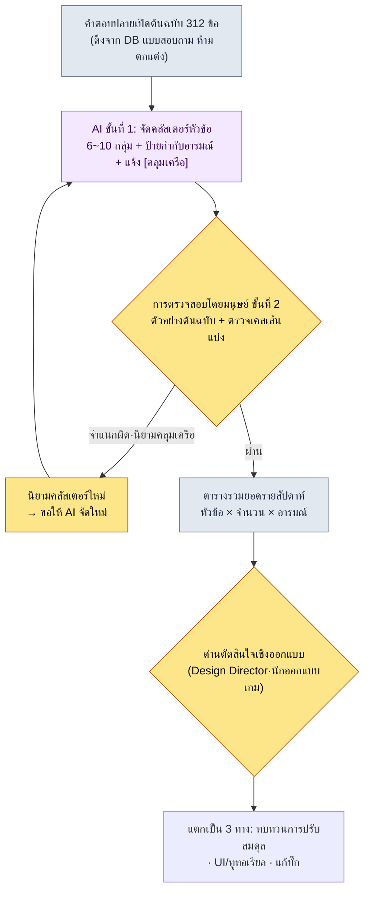
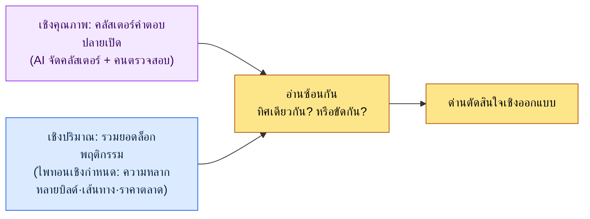

# 13.1 เปลี่ยนคำตอบปลายเปิดหลายร้อยข้อให้เป็นหัวข้อ — การจัดกลุ่มให้ AI ทำ การวินิจฉัยให้คนทำ

> ผู้อ่านหลัก: นักออกแบบเกม (Game Designer) MMORPG ที่ต้องอ่านฟีดแบ็กผู้เล่นและเมตาเกม (ทีมขนาดกลาง 10–50 คน)
> ฉบับย่อสำหรับผู้อ่านคนเดียว/งานอดิเรก: §13.1.8 「ถ้าทำคนเดียว เท่านี้ก็พอ」

ผู้เขียนยังจำหน้าจอเช้าวันถัดจากที่ปล่อยอัปเดตออกไปได้ดี ในช่องคำตอบปลายเปิดของแบบสอบถามในเกมมีข้อความสะสมอยู่ 312 ข้อ มีตั้งแต่ประโยคสั้น ๆ บรรทัดเดียวไปจนถึงความโกรธยาวห้าบรรทัดปนเปกันไป ไม่มีใครในทีมออกแบบอ่านทั้ง 312 ข้อนั้นจบ พูดให้ถูกคืออ่านไม่ไหว ต่อให้อ่านก็เข้าประชุมไปด้วยความรู้สึกแค่ระดับ "ดูเหมือนมีคนบ่นว่าการตีบวกโหดเยอะนะ" และความรู้สึกนั้นก็เป็นภาพลวงที่สร้างขึ้นจากความเห็นที่เสียงดังที่สุดเพียง 5 ข้อ ไม่มีใครรู้เลยว่าจริง ๆ แล้ว 312 ข้อนั้นกำลังบอกอะไร

บทนี้ว่าด้วยวิธีทำให้เราพูดได้ว่า "อะไรกี่ข้อ" โดยที่คนไม่ต้องอ่านทั้ง 312 ข้อนั้นเอง หัวใจมีสองอย่าง อย่างแรก งานจำแนกที่น่าเบื่ออย่างการ **จัดคำตอบปลายเปิดหลายร้อยข้อเข้าเป็นหัวข้อแล้วติดป้ายกำกับอารมณ์** นั้นให้ AI ทำ อย่างที่สอง อย่าเชื่อคลัสเตอร์ของ AI ทั้งดุ้น แต่ให้คน **จับการจำแนกผิดสักหนึ่งข้อมาใช้สิทธิ์ยับยั้งแล้วขอใหม่** หลักการทั่วไปของการวิเคราะห์ FAQ และเมตาเกมนั้นมีในหนังสือเล่มอื่นอยู่แล้ว บทนี้จึงโฟกัสเฉพาะ *จุดที่นำการวิเคราะห์นั้นมารันด้วยกระบวนการทำงานแบบ AI* เท่านั้น

---

## 13.1.1 คำตอบปลายเปิดไม่ใช่ 'ข้อมูลสำหรับอ่าน' แต่เป็น 'ข้อมูลสำหรับจำแนก'

FAQ และคำตอบปลายเปิดคือกระจกที่สะท้อนความต่างระหว่างเกมที่นักออกแบบตั้งใจกับเกมที่ผู้ใช้ประสบจริง ถ้าคำถามเดียวกันเข้ามาที่เคาน์เตอร์ประชาสัมพันธ์วันละ 30 ครั้ง สิ่งที่ต้องทำไม่ใช่เพิ่มคนรับเรื่อง แต่ต้องออกแบบป้ายแนะนำใหม่ ปัญหาคือการนับ "30 ครั้ง" นั้นเอง คำตอบปลายเปิดไม่ใช่ล็อกที่มีรูปแบบตายตัว `GROUP BY` จึงใช้ไม่ได้ "การตีบวกแพงเกินไป" กับ "ทรัพยากรไม่พอเลยอัปเกรดไม่ไหว" เป็นหัวข้อเดียวกัน แต่ตัวอักษรต่างกัน ถ้าให้คนจัดกลุ่มด้วยสายตา 312 ข้อก็กินเวลาสองสามชั่วโมง และเกณฑ์การจัดกลุ่มก็คลอนแคลนต่างกันไปในแต่ละคน

ตรงนี้คือที่ที่ AI เข้ามาเสียบได้ การจำแนกคำตอบปลายเปิดเป็นงานที่ (1) ปริมาณเยอะ (2) น่าเบื่อ และ (3) ต้องอาศัยการตัดสินความหมายของภาษาธรรมชาติ — กล่าวคือเป็นงานที่โค้ดเชิงกำหนด (deterministic) ทำไม่ได้ และถ้าให้คนทำก็แพง แต่มีเรื่องหนึ่งที่ต้องตรึงเป็นกฎไว้ก่อนปล่อย **สิ่งที่ AI สร้างขึ้นคือคลัสเตอร์หัวข้อ (สมมติฐาน) ไม่ใช่การวินิจฉัยที่ยืนยันแล้ว** "ไม่พอใจการตีบวก 38%" เป็นแค่ผลที่ AI ติดป้ายให้เท่านั้น มันต้องไม่นำไปสู่การตัดสินใจว่า "ให้เนิร์ฟการตีบวก" โดยตรง หลักการที่ร้อยทะลุทั้งส่วนที่ 13 ก็เป็นแบบเดิมตรงนี้ — การนิยาม KPI และการวินิจฉัยขั้นสุดท้ายเป็นของคน ส่วนการจัดกลุ่มภาษาธรรมชาติและการติดป้ายกำกับขั้นแรกเป็นของ AI

คุณค่าที่แท้จริงของการทำให้เป็นอัตโนมัติก็อยู่ตรงจุดนี้ การทำให้การจำแนกเป็นอัตโนมัตินั้น แทนที่จะทำให้การวิเคราะห์เองเร็วขึ้น สิ่งที่เป็นหัวใจคือ **สัญญาณที่ชื่อว่า 312 ข้อนั้นจะมาถึงบนโต๊ะในรูปที่ถูกจำแนกแล้วทุกเช้าของแต่ละสัปดาห์** คุณค่าของการทำให้เป็นอัตโนมัติไม่ใช่การประหยัดเวลา แต่เป็นการเปิดเผยสัญญาณ (แนวคิดการบริหารทีม `automation_signal_value_over_time_savings`) เปรียบได้กับความต่างระหว่างจดหมายที่เอาแต่กองอยู่ในตู้กับจดหมายที่ถูกจำแนกและส่งไปยังแผนกที่เกี่ยวข้องทุกวัน

---

## 13.1.2 [บันทึกเซสชันจริง (worked transcript)] คำตอบปลายเปิด 312 ข้อ → คลัสเตอร์หัวข้อ

ผู้เขียนจะแสดงให้เห็นจนจบหนึ่งรอบว่าจริง ๆ แล้วรันอย่างไร ด้านล่างนี้เป็นการจำลองเซสชันที่นำคำตอบปลายเปิดจากแบบสอบถามในเกมของโปรเจกต์ของผู้เขียน (MMORPG ที่เน้นมือถือก่อน ต่อไปเรียกว่า "โปรเจกต์ A") มาจัดคลัสเตอร์หัวข้ออย่างซื่อตรง พรอมต์ที่ป้อนเข้าไปสามารถคัดลอกไปใช้ได้ตามนั้น และผลลัพธ์คือการเรียบเรียงใหม่จากเซสชันจริง

### ขั้นที่ 1 — อินพุต: โยนคำตอบปลายเปิดเข้าไปตามนั้น (โดยไม่แปรรูป)

ก่อนอื่นดึงคำตอบปลายเปิดต้นฉบับออกมาในรูปที่เครื่องอ่านได้ ส่วนนี้แค่ดึงจาก DB ของแบบสอบถามก็พอ ไม่ใช่การเขียนใหม่ สิ่งสำคัญคือต้องใส่ **โดยไม่ตกแต่งให้สวยหรือสรุปย่อ ใส่ทั้งคำผิด คำหยาบ และคำตอบคำเดียวลงไปแบบดิบ ๆ ตามต้นฉบับ** ความแม่นยำของการจำแนกจะสูงขึ้นเมื่อต้นฉบับยิ่งดิบ

```jsonl
# survey_freetext_2026-W21.jsonl (ตัวอย่าง 6 ข้อจาก 312 ข้อ)
{"id": 0041, "text": "ค่าตีบวกบ้าไปแล้ว ฮึ่ม จะไป +10 แต่ทรัพยากรไม่พอสักที"}
{"id": 0088, "text": "แพตเทิร์นบอสสนุกดีแต่รางวัลขี้เหนียวเกินไป"}
{"id": 0102, "text": "จับคู่สงครามกิลด์นานมาก รอเกิน 5 นาที"}
{"id": 0156, "text": "ไม่เติมเงินก็ตีบวกไม่ได้ นี่มันเกมเหรอ"}
{"id": 0203, "text": "บรรยากาศดันเจี้ยนใหม่ดีนะ เพลงก็เพราะ"}
{"id": 0274, "text": "ทำไมรางวัลในเมลไม่มา? น่าจะบั๊ก"}
```

### ขั้นที่ 2 — พรอมต์: สั่งให้จัดคลัสเตอร์ พร้อมบังคับให้มีหมวดหมู่ เหตุผล และการแจ้งความคลุมเครือ

```
นำ survey_freetext_2026-W21.jsonl ที่แนบมา (คำตอบปลายเปิดจากแบบสอบถาม 312 ข้อ) มาจัด
เป็นหัวข้อ 6~10 กลุ่ม และติดป้ายกำกับเชิงลบ/กลาง/บวกให้แต่ละคำตอบ อย่าซอยย่อยเกินไป คำตอบหนึ่ง
ใส่ได้แค่คลัสเตอร์เดียวเท่านั้น ถ้าไม่เข้าพวกให้ไปอยู่อื่น ๆ แต่ละคลัสเตอร์ให้ออกเป็นตารางบอกจำนวน·สัดส่วน·อารมณ์หลัก·ต้นฉบับตัวแทน 1 ข้อ
ส่วนข้อที่ไม่มั่นใจในการจัดเข้ากลุ่ม อย่าฝืนยัด แต่แยกออกมาเป็นรายการ [คลุมเครือ] พร้อมเหตุผลบรรทัดละข้อ
ตัดคำอธิบายออก เอาแค่ (ก) นิยามคลัสเตอร์ (ข) ตารางรวมยอด (ค) รายการ [คลุมเครือ] เท่านั้น
```

ในพรอมต์นี้ ประโยคที่สั่งให้จำแนกมีแค่สองบรรทัดแรก ที่เหลือล้วนเป็นข้อจำกัดที่ขังรูปทรงของผลลัพธ์ไว้ ถ้าให้อิสระแก่ AI มันจะซอยคลัสเตอร์เป็น 20 กลุ่ม หรือยัดทุกคำตอบเข้าที่ใดที่หนึ่งแบบฝืน ๆ สิ่งที่ขวางสิ่งนั้นไว้คือสี่บรรทัด — **เพดานจำนวนคลัสเตอร์ (6\~10), การจัดเข้ากลุ่มได้กลุ่มเดียว, การกำกับอารมณ์ 3 ประเภท และทางออกที่ว่า "ถ้าไม่มั่นใจให้แยกไปไว้ที่ [คลุมเครือ]"** ความแม่นยำของการจำแนกออกมาจากรั้วนี้

### ขั้นที่ 3 — ผลลัพธ์ของ Claude (เรียบเรียงใหม่ ตัวอย่าง)

```
(ก) นิยามคลัสเตอร์
C1 ค่าตีบวก/การเติบโต  — บ่นว่าการตีบวก·การหาทรัพยากรหนักเกินไป
C2 แรงกดดันการเติมเงิน  — รับรู้ว่าคนไม่เติม/เติมน้อยถูกกีดกันจากการเติบโต
C3 รางวัลคอนเทนต์ไม่พอ — ความเห็นว่ารางวัลขี้เหนียวเทียบกับการเล่นบอส·ดันเจี้ยน
C4 จับคู่/เวลารอ        — บ่นว่าจับคู่สงครามกิลด์·การรอนาน
C5 ชมคอนเทนต์          — ปฏิกิริยาเชิงบวกต่อดันเจี้ยนใหม่·การจัดฉาก·เพลง
C6 บั๊ก/รางวัลตกหล่น   — แจ้งรางวัลไม่ได้รับ·ข้อผิดพลาด
อื่น ๆ                — รายข้อที่ไม่เข้ากับ 6 กลุ่มข้างต้น

(ข) ตารางรวมยอด
| คลัสเตอร์ | จำนวน | สัดส่วน | อารมณ์หลัก | ต้นฉบับตัวแทน                                  |
|----------|------|------|----------|--------------------------------------------|
| C1 ค่าตีบวก | 71 | 23%  | ลบ     | "ค่าตีบวกบ้าไปแล้ว ฮึ่ม จะไป +10 แต่ทรัพยากรไม่พอสักที" |
| C2 กดดันเติมเงิน | 58 | 19%  | ลบ     | "ไม่เติมเงินก็ตีบวกไม่ได้ นี่มันเกมเหรอ"        |
| C3 รางวัลไม่พอ | 49 | 16%  | ลบ     | "แพตเทิร์นบอสสนุกดีแต่รางวัลขี้เหนียวเกินไป"        |
| C4 จับคู่รอ | 34 | 11%  | ลบ     | "จับคู่สงครามกิลด์นานมาก รอเกิน 5 นาที"      |
| C5 ชมคอนเทนต์| 41 | 13%  | บวก     | "บรรยากาศดันเจี้ยนใหม่ดีนะ เพลงก็เพราะ"          |
| C6 บั๊กการจ่าย | 28 | 9%   | ลบ     | "ทำไมรางวัลในเมลไม่มา? น่าจะบั๊ก"                |
| อื่น ๆ       | 31 | 10%  | ผสม     | (รายข้อจำนวนมาก)                                 |

(ค) รายการ [คลุมเครือ] (4 ข้อ)
- id 0088 "แพตเทิร์นบอสสนุกดีแต่รางวัลขี้เหนียวเกินไป"
  → จัดเข้า C3 (รางวัลไม่พอ) แต่ครึ่งแรกซ้อนทับกับ C5 (ชม) ด้วย เป็นคำตอบเชิงซ้อน
- id 0156 "ไม่เติมเงินก็ตีบวกไม่ได้" → อยู่เส้นแบ่งระหว่าง C1 กับ C2 ส่งไป C2
- (อีก 2 ข้อ)
```

ส่วนที่มีคุณค่าที่สุดในผลลัพธ์ไม่ใช่ตารางรวมยอด แต่เป็น **รายการ [คลุมเครือ] ที่อยู่ล่างสุด** เป็นจุดที่ AI แจ้งความไม่แน่นอนของการจัดกลุ่มของตัวเองและส่งต่อให้คน พรอมต์ที่ดีคือพรอมต์ที่ทำให้ AI พูดได้ว่า "ข้อนี้ผมไม่มั่นใจ"

### ขั้นที่ 4 — การตรวจสอบและการใช้สิทธิ์ยับยั้ง (ที่ของคน)

ห้ามนำผลลัพธ์นี้ขึ้นรายงานทั้งดุ้น คนต้องลงมือพิมพ์ตัวอย่างต้นฉบับเอง จริง ๆ แล้วในเซสชันนี้มีอยู่หนึ่งข้อที่สะดุด

ขณะที่ผู้เขียนกางคำตอบ 58 ข้อของ C2 (แรงกดดันการเติมเงิน) ออกมาไล่ดูต้นฉบับ `id 0156 "ไม่เติมเงินก็ตีบวกไม่ได้ นี่มันเกมเหรอ"` ก็สะดุดตา AI ส่งข้อนี้ไป C2 (แรงกดดันการเติมเงิน) แต่ความเจ็บปวดขั้นแรกของประโยคนี้ไม่ใช่ "การเติมเงิน" แต่คือ **"ตีบวกไม่ได้"** — กล่าวคือ C1 (ค่าตีบวก) ผู้ใช้ติดกำแพงการตีบวก และชี้ว่าต้นเหตุของกำแพงนั้นคือการเติมเงิน ไม่ใช่ว่าการเติมเงินเองคือแก่นของความไม่พอใจ ที่ C1 กับ C2 อยู่ติดกันจนสับสนนั้นเป็นเรื่องจริง แต่ถ้านับข้อนี้เป็น C2 สัญญาณ "ค่าตีบวก" จะดูเล็กกว่า 23% และเส้นโค้งการตีบวกที่ควรต้องแก้จริง ๆ จะถูกเบียดตกลำดับความสำคัญ นี่คือเคสเส้นแบ่งที่การจำแนกผิดเพียงข้อเดียวอาจเปลี่ยนทิศทางของการตัดสินใจได้

ดังนั้นจึงใช้สิทธิ์ยับยั้งแล้วขอใหม่

```
เส้นแบ่งระหว่าง C1 (ค่าตีบวก) กับ C2 (แรงกดดันเติมเงิน) ชวนสับสนนะ ถ้าความเจ็บปวดขั้นแรกคือ 'ตัวกำแพงการเติบโตเอง' ให้เป็น C1
ถ้าเป็น 'ความเหลื่อมล้ำที่ว่าไม่เติมเงินก็ถูกกีดกัน' ให้จัดใหม่เป็น C2 ส่วน id 0156 แก่นคือ "ตีบวกไม่ได้"
ฉะนั้นเป็น C1 ใช้เกณฑ์นี้จัดข้อที่คาบเส้นแบ่งใหม่ทั้งหมด แล้วบอกมาแค่จำนวนข้อที่เปลี่ยนไป
```

AI ลากเส้นแบ่งใหม่ และย้าย 9 ข้อที่อยู่ใน C2 ไปยัง C1 ผลคือ C1 เปลี่ยนจาก 71→80 ข้อ (26%) และ C2 จาก 58→49 ข้อ (16%) **ภาพที่ว่าค่าตีบวกเป็นหัวข้อเดี่ยวที่ใหญ่ที่สุดยังเหมือนเดิม แต่ขนาดของมันชัดขึ้นจาก 23% เป็น 26%** เพียงเดินทางไปกลับครั้งเดียว เค้าโครงของสัญญาณก็คมชัดขึ้น จำนวนข้อที่จัดใหม่ (9 ข้อ) และการเปลี่ยนแปลงของสัดส่วนนี้คือค่าที่นับจริงในเซสชันนี้ (กลุ่มตัวอย่าง 312 ข้อ สัปดาห์เดียว)

ตรงนี้ขอชี้ให้ชัดอย่างหนึ่ง สิ่งที่คนใช้สิทธิ์ยับยั้งไม่ใช่เพราะ "AI ผิด" การจัดเข้า C2 ก็ตีความได้อยู่ สิ่งที่คนทำคือ **ทำให้นิยามคลัสเตอร์ (=นิยาม KPI) คมขึ้นแล้วป้อนกลับให้ AI** นิยามเป็นของคน ส่วนแรงงานในการไล่อ่าน 312 ข้อใหม่ตามนิยามนั้นเป็นของ AI

---

## 13.1.3 ไปป์ไลน์ — จากคำตอบปลายเปิดไปจนถึงด่านตัดสินใจ

ถ้านำเซสชันข้างต้นมารันอัตโนมัติทุกสัปดาห์ก็จะกลายเป็นไปป์ไลน์ มีแค่สองจุดที่มือคนแตะ จุดที่ลากนิยามคลัสเตอร์ให้คม (ต้นทาง) และด่านที่เชื่อมผลการจำแนกไปสู่การตัดสินใจ (ปลายทาง) ส่วนการจัดกลุ่ม 312 ข้อและการติดป้ายกำกับที่อยู่ตรงกลางนั้น AI เป็นคนรัน



การออกแบบที่ชี้ขาดคือ ขั้นที่ 2 (การตรวจสอบโดยมนุษย์) จะไม่ปล่อยให้ผลลัพธ์ของ AI ผ่านโดยอัตโนมัติ ถ้าทำให้เป็นแบบผ่านอัตโนมัติ เส้นแบ่งที่ AI ลากผิดไปครั้งหนึ่งจะบิดเบือนสัญญาณไปในทิศทางเดียวกันทุกสัปดาห์ ผู้สมัครที่น่าสงสัย (รายการคลุมเครือ) ให้ AI คัดออกมา แต่จะแก้นิยามคลัสเตอร์หรือไม่นั้นคนเป็นคนตัดสิน และตารางรวมยอดไม่ใช่การตัดสินใจในตัวมันเอง แต่เป็นเพียง **อินพุตของด่านตัดสินใจ** เท่านั้น "C1 ค่าตีบวก 26%" เป็นสัญญาณที่ทำให้ Design Director หันไปดูเส้นโค้งการตีบวก ไม่ใช่ทริกเกอร์เนิร์ฟอัตโนมัติ

---

## 13.1.4 เมตาเกม — ซ้อนคำตอบปลายเปิดกับล็อกพฤติกรรมเข้าด้วยกัน

ถ้าคำตอบปลายเปิดคือ "สิ่งที่ผู้ใช้พูด" เมตาเกมก็คือ "สิ่งที่ผู้ใช้ทำจริง" เมื่อปล่อยออกไปแล้ว วิธีเล่นที่นักออกแบบไม่ได้ตั้งใจจะลงหลักปักฐานขึ้นมา นั่นคือเมตาเกม เช่น เมตาบิลด์ (การกระจุกตัวของชุดสกิลบางชุด) เมตาเส้นทาง (เส้นทางล่ามอนสเตอร์ที่นิยม) เมตาการซื้อขาย (ข้อตกลงราคาในหมู่ผู้เล่นที่ต่างจากราคาทางการ) เป็นต้น ต่างจากคำตอบปลายเปิดตรงที่สิ่งเหล่านี้ **วัดเชิงปริมาณได้ด้วยล็อกพฤติกรรม** และรวมยอดด้วยโค้ดเชิงกำหนด (ไพทอน) ไม่ใช่ที่ที่ AI จะเข้ามาแทรก

หัวใจคือการ **ซ้อน** ทั้งสองอย่างเข้าด้วยกัน ในเซสชันข้างต้น ความไม่พอใจ C1 (ค่าตีบวก) ใหญ่ที่สุดที่ 26% ตอนนี้ถ้าในล็อกพฤติกรรม ดัชนีความหลากหลายของบิลด์ (ระดับการกระจุกตัวของชุดสกิลยอดนิยม) ลดลงในสัปดาห์เดียวกัน สัญญาณสองตัวที่ว่า "ทั้งคำพูดและพฤติกรรมกำลังหลอมรวมไปสู่บิลด์เดียว·เส้นทางการเติบโตเดียว" ก็ชี้ไปในทิศเดียวกัน เมื่อปริมาณกับคุณภาพสอดคล้องกัน ความมั่นใจในการตัดสินใจก็เกิดขึ้น ในทางกลับกัน ถ้าคำตอบปลายเปิดเงียบสงบแต่ล็อกพฤติกรรมกลับเทไปที่บิลด์เดียว นั่นอาจเป็นสัญญาณเสี่ยงว่าผู้ใช้รู้สึกอึดอัดแต่ไม่พูด (=ใกล้จะเลิกเล่นแบบเงียบ ๆ)



ตรงนี้การแบ่งงานก็ชัดเจน การรวมยอดล็อกพฤติกรรมเป็นงานของ **โค้ด ไม่ใช่ AI** เพราะส่วนแบ่งบิลด์หรือราคาตลาดเป็นค่าเชิงกำหนดที่ต้องไม่ให้คำตอบเปลี่ยนทุกครั้งที่เรียก AI ใช้เฉพาะกับการจัดกลุ่มข้อความไร้รูปแบบอย่างคำตอบปลายเปิดเท่านั้น ส่วน KPI เชิงปริมาณนั้นโค้ดเป็นตัวตรึงเป็นกฎ

---

## 13.1.5 ที่มาของตัวเลขในบทนี้

สัดส่วนในบทนี้เป็นไปตามหลักการของ「คำสัญญาหนึ่งข้อ」ในบทนำ ตัวเลข "C1 23%→26%, จัดใหม่ 9 ข้อ" ใน §13.1.2 เป็นค่าที่นับจริงจากกลุ่มตัวอย่าง 312 ข้อ (สัปดาห์เดียว) จึงต้องอ่านไม่ใช่ในฐานะค่าสัมบูรณ์ แต่ในฐานะ *ทิศทาง* ที่ว่า "ค่าตีบวกเป็นหัวข้อเดี่ยวที่ใหญ่ที่สุด" ไม่ฟันธงความเป็นเหตุเป็นผล — ไม่มีตารางทำนองว่า "พอวิเคราะห์ FAQ แล้วอัตราการคงอยู่ (Retention) สูงขึ้น" แต่กระบวนการทำงานนี้วัดได้จริงสามอย่าง ได้แก่ จำนวนข้อที่จำแนกผิดซึ่งคนพลิกกลับในการตรวจสอบคลัสเตอร์ (ถ้าเป็น 0 ก็เป็นสัญญาณว่าการตรวจสอบเป็นแค่พิธีกรรม) เวลาที่ใช้จนได้รวมยอดรายสัปดาห์ และความสอดคล้องของสัญญาณเชิงปริมาณกับเชิงคุณภาพ

---

## 13.1.6 การทิ้งและขอใหม่ไม่ใช่ความล้มเหลวของเครื่องมือ แต่เป็นสัญญาณของด่านตรวจ

ใน §13.1.2 คนพลิกการจัดเข้า C2 จำนวน 9 ข้อ ถ้ารันการตรวจสอบทุกสัปดาห์ การพลิกแบบนี้จะออกมาครั้งละ 0\~ไม่กี่ข้อทุกครั้ง สิ่งสำคัญคือ **การพลิก 0 ข้อไม่ใช่เป้าหมาย** ถ้าไม่มีข้อใดถูกพลิกเลยในการตรวจสอบ ก็เป็นหนึ่งในสองอย่าง — AI สมบูรณ์แบบ (เกิดได้ยาก) หรือผู้ตรวจสอบไม่ได้ดูต้นฉบับแล้วประทับตราเฉย ๆ อย่างหลังพบบ่อยอย่างท่วมท้น

เมื่อมีเคสเส้นแบ่งหนึ่งถึงสองข้อสะดุดทุกสัปดาห์ และนิยามคลัสเตอร์ค่อย ๆ คมขึ้นจากเคสนั้น ด่านตรวจสอบจึงทำงานจริง นี่คือรูปธรรมของหลักการทั่วไปที่ว่าคนต้องตรวจสอบความแม่นยำของการจำแนกของ AI ด้วยการสุ่มตัวอย่างเป็นระยะ การจำแนกผิดที่ผู้ใช้ประเภทเดียวกันกระจัดกระจายไปคนละหัวข้อนั้น ถ้าเชื่อแต่การจำแนกอัตโนมัติโดยไม่ตรวจสอบ มันจะสะสมทุกสัปดาห์

---

## 13.1.7 ความล้มเหลวที่พบบ่อย

| รูปแบบ | ทำไมจึงล้มเหลว | วิธีแก้ |
|---|---|---|
| คนไล่ดูคำตอบปลายเปิดด้วยสายตาเท่านั้น | ภาพลวงที่ 5 ข้อเสียงดังเป็นตัวแทนของ 312 ข้อ | จำแนกทั้งหมดด้วยการจัดคลัสเตอร์ของ AI (§13.1.2) |
| มอบให้ทั้งดุ้น "AI ช่วยวิเคราะห์ฟีดแบ็กผู้ใช้ที" | คลัสเตอร์ถูกซอยเป็น 20 กลุ่มหรือถูกจัดเข้าแบบฝืน | บังคับเพดานจำนวนคลัสเตอร์·จัดได้กลุ่มเดียว·[คลุมเครือ] |
| ดูตารางรวมยอดของ AI โดยไม่ตรวจสอบ | การจำแนกผิดที่เส้นแบ่งเปลี่ยนทิศทางการตัดสินใจ | ตัวอย่างต้นฉบับ + ตรวจเคสเส้นแบ่งเอง |
| เอาสัดส่วนรวมยอดเชื่อมต่อการตัดสินใจตรง ๆ | กลายเป็นทริกเกอร์อัตโนมัติ "ไม่พอใจ 26% ก็เนิร์ฟ" | ตารางรวมยอดเป็นแค่อินพุตของด่านตัดสินใจ |
| ดูแต่เชิงคุณภาพ ละเลยล็อกพฤติกรรม | พลาดการเลิกเล่นแบบเงียบที่ไม่มีคำพูด | อ่านซ้อนเชิงปริมาณ (โค้ด)·เชิงคุณภาพ (AI) (§13.1.4) |
| สั่งให้ AI รวมยอด KPI เชิงปริมาณ | ตัวเลขเปลี่ยนทุกครั้งที่เรียกจนการปรับสมดุลคลอนแคลน | การรวมยอดบิลด์·ราคาตลาดให้โค้ดเชิงกำหนดทำ |

ข้อที่สามพลาดบ่อยที่สุด ตารางรวมยอดดูเรียบร้อยจนชวนเชื่อทั้งดุ้น แต่เหมือนกับ id 0156 เพียงข้อเดียว การจำแนกผิดที่เส้นแบ่งเพียงข้อเดียวอาจเปลี่ยนลำดับความสำคัญได้ทั้งหมด การตรวจสอบไม่ใช่การอ่าน 312 ข้อใหม่ แต่เป็นการ **ยืนยันเฉพาะเคสเส้นแบ่งของสองถึงสามคลัสเตอร์ที่ใหญ่ที่สุด** ด้วยต้นฉบับ

---

## 13.1.8 ลองทำดู — หนึ่งขั้นที่ทำได้วันนี้

> **ถ้าทำคนเดียว เท่านี้ก็พอ**: ไม่มี DB แบบสอบถามก็ได้ ลองรวบรวมรีวิวในสโตร์·โพสต์ชุมชนของเกมตัวเอง (หรือเกมที่ชอบ) มาเป็นข้อความสัก 30\~50 ข้อ แล้วเอาพรอมต์ใน §13.1.2 มาแปะแล้วรันดูสักครั้ง ในบรรดาคลัสเตอร์ที่ออกมา ลองเลือกการจัดเข้ากลุ่มสักข้อที่รู้สึกว่า "อันนี้มันแปลก ๆ นะ" แล้วโต้แย้งว่า "ความเจ็บปวดขั้นแรกของคำตอบนี้คือหัวข้ออื่น จงลากนิยามใหม่แล้วจัดใหม่" คุณจะได้สัมผัสด้วยตัวเองว่าการจัดคลัสเตอร์เป็นมัดรวมของการตัดสินใจแบบใดบ้าง

ถ้าเป็นทีม ลองเริ่มด้วยขั้นถัดไปนี้ ดึงคำตอบปลายเปิดของหนึ่งสัปดาห์ออกมาเป็น `survey_freetext_YYYY-Www.jsonl` โดยไม่ตกแต่ง แล้วเอาพรอมต์ใน §13.1.2 มารันสักครั้ง จากนั้นยืนยันเฉพาะเคสเส้นแบ่งของสองคลัสเตอร์ที่ใหญ่ที่สุดด้วยต้นฉบับ ถ้าลากนิยามคลัสเตอร์ให้คมไว้สักครั้ง หลังจากนั้นรวมยอดรายสัปดาห์ที่ทำซ้ำได้ด้วยพรอมต์เดียวกันทุกสัปดาห์ก็จะสะสมขึ้นมาเองโดยอัตโนมัติ

---

### สรุปประเด็นสำคัญของบท
- คำตอบปลายเปิดไม่ใช่ข้อมูลสำหรับอ่าน แต่เป็นข้อมูลที่จำแนกทั้งหมดด้วย AI
- นิยามคลัสเตอร์ (=นิยาม KPI) เป็นของคน ส่วนการจัดกลุ่ม 312 ข้อเป็นของ AI
- การพลิก 0 ข้อในการตรวจสอบคือสัญญาณว่าแค่ประทับตราเฉย ๆ

### ตัวอย่างบทถัดไป
- 13.2 การนิยาม·ติดตาม KPI — ตารางวินิจฉัยที่ย่อเหลือ 5\~7 ตัว และหลุมพรางของการวัด
