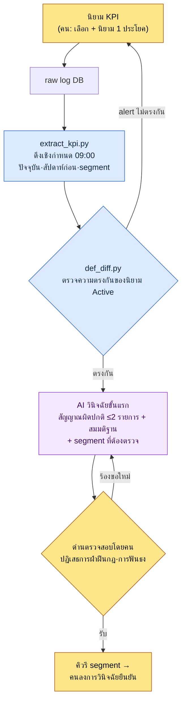

# 13.2 การนิยามและติดตาม KPI — นิยามให้คนทำ การวินิจฉัยสัญญาณผิดปกติให้ AI ทำ

> ผู้อ่านกลุ่มหลัก: นักออกแบบเกมฝ่าย Live Ops/ข้อมูล ที่รับผิดชอบตัวชี้วัดด้านการให้บริการ (ทีมขนาดกลาง 10–50 คน)
> ฉบับย่อสำหรับผู้อ่านที่ทำคนเดียว/ทำเป็นงานอดิเรก: §13.2.8 「ถ้าทำคนเดียวก็แค่เท่านี้」

ทุกเช้าวันจันทร์มีฉากเดิมเกิดขึ้นซ้ำ ๆ ฝ่ายข้อมูลส่งภาพแคปแดชบอร์ดประจำวันมา เราเอาขึ้นจอประชุม แล้วก็มีใครสักคนพูดว่า "DAU (Daily Active Users หรือผู้ใช้ที่ใช้งานรายวัน) ดูเหมือนจะลดลงนิดหน่อยนะครับ" จากนั้นก็มีอีกคนรับว่า "นั่นเพราะสัปดาห์ที่แล้วมีการปิดปรับปรุงเซิร์ฟเวอร์ครับ" ตัวเลขอยู่ตรงนั้นแล้ว แต่การที่คนต้องประมวลในหัวว่าตัวเลขนั้นเป็น **สัญญาณผิดปกติหรือเป็นเพียงสัญญาณรบกวน (noise)** กลับเริ่มต้นใหม่ตั้งแต่ศูนย์ทุกสัปดาห์ และคำตัดสินนั้นก็แตกต่างกันไปตามแต่ละคนที่พูด

ผู้เขียนขอเขียนข้อสรุปของบทนี้ไว้ก่อน สิ่งที่คนต้องทำใน KPI มีเพียงสองอย่างคือ **การนิยามว่าจะใช้อะไรเป็น KPI** กับ **การตัดสินว่าจะเลื่อนสัญญาณผิดปกติที่ AI ยกขึ้นมาให้กลายเป็นการวินิจฉัยที่ยืนยันแล้ว หรือจะปฏิเสธมัน** สองอย่างที่อยู่คั่นกลาง — งานดึงตัวเลขจาก raw log ในเวลาเดิมทุกวัน กับงานร่างคำบรรยายภาษาธรรมชาติว่าเทียบกับสัปดาห์ก่อนแล้วอะไรสั่นไหวบ้าง — แต่ละอย่างให้โค้ดเชิงกำหนด (deterministic) และ AI รับไป ทฤษฎีทั่วไปของการนิยาม KPI (ลดให้เหลือ 5–7 ตัว ระวังกฎของ Goodhart) มีในหนังสือเล่มอื่นอย่างเพียงพอแล้ว บทนี้จึงโฟกัสเฉพาะ *จุดที่นำนิยามนั้นไปเดินด้วยเวิร์กโฟลว์ AI* เท่านั้น

---

## 13.2.1 การนิยาม KPI เป็นที่ของคน — แต่หลังจากนั้นไม่ใช่

ในการดำเนินงาน KPI มีการตัดสินใจที่มีเพียงคนเท่านั้นทำได้อยู่สองอย่าง อย่างแรกคือ **จะใช้อะไรเป็น KPI** อย่างที่สองคือ **การตอกนิยามของ KPI แต่ละตัวให้แน่นด้วยประโยคเดียว** สองอย่างนี้เป็นการตัดสินคุณค่าของเกม จึงมอบหมายให้ AI ไม่ได้ การตัดสินใจว่า "ถือว่า Active คือการเล่นตั้งแต่ 5 นาทีขึ้นไป" บรรจุไว้ด้วยมุมมองว่าเกมมองอะไรว่าเป็นสุขภาพที่ดี

ปัญหาคือ เมื่อนิยามนี้สั่นไหวเพียงครั้งเดียว ตัวเลขทั้งหมดที่อยู่บนนิยามนั้นก็สั่นไหวตามไปด้วย หากฝั่งหนึ่งจับ "Active User" เป็น *การล็อกอิน 1 ครั้ง* แต่อีกฝั่งจับเป็น *10 นาที + ล่ามอนสเตอร์ 1 ครั้ง* DAU ก็คลาดเคลื่อนกันทั้งก้อน ด้วยเหตุนี้ งานรักษา **ความสอดคล้องของนิยาม** จึงสำคัญยิ่งกว่าตัวนิยามเอง และกินงานดำเนินงานไปครึ่งหนึ่ง และการตรวจสอบความสอดคล้องนั้นต้องเป็นโค้ดที่ทำ ไม่ใช่หัวคน (§13.2.5)

งานที่เกิดขึ้นหลังจากตอกนิยามแน่นแล้ว ไม่ใช่ที่ของคน การดึงตัวเลขในเวลาเดิมทุกวัน การร่างขั้นแรกเพื่อกวาดดูความเปลี่ยนแปลงเทียบสัปดาห์ก่อนแล้วจดสัญญาณผิดปกติที่น่าสงสัย — สองอย่างนี้เกิดซ้ำทุกวัน และถ้าคนทำ เกณฑ์ก็จะสั่นไหวไปวัน ๆ ซึ่งเป็นงานชนิดที่ควรส่งต่อให้เครื่องและโมเดลอย่างแม่นยำ การดึงตัวเลขส่งต่อให้โค้ดเชิงกำหนด การวินิจฉัยขั้นแรกส่งต่อให้ AI ส่วนคนรับเอาตัวเลือกที่ AI ยกขึ้นมาแล้วตัดสินเพียงว่า **จะยืนยันหรือจะปฏิเสธ** เท่านั้น

| ขั้นตอน | ใครทำ | ทำไมต้องที่นั่น |
|---|---|---|
| การเลือกและนิยาม KPI | คน | การตัดสินคุณค่าของเกม มอบหมายไม่ได้ |
| การดึง raw ประจำวัน | โค้ด (เชิงกำหนด) | อินพุตเดิม → ตัวเลขเดิม ตรวจสอบแบบ regression ได้ |
| การร่างขั้นแรกของสัญญาณผิดปกติเทียบสัปดาห์ก่อน | AI | การสรุปด้วยภาษาธรรมชาติเหมาะกับ AI แต่แค่ระดับ 'สมมติฐาน' เท่านั้น |
| การวินิจฉัยยืนยัน·การสั่งตรวจ segment | คน | เลื่อน/ปฏิเสธสมมติฐานของ AI เป็นที่ของความรับผิดชอบ |

การแบ่งงานนี้คือโครงของทั้งบทนี้ ด้านล่างเราจะลองเดินหนึ่งรอบให้จบ

---

## 13.2.2 [บันทึกเซสชันจริง (worked transcript)] raw แดชบอร์ดประจำวัน → ร่างสัญญาณผิดปกติอัตโนมัติ

จะแสดงให้เห็นว่ามันเดินอย่างไรจริง ๆ หนึ่งรอบตั้งแต่อินพุตจนถึงการตัดสินของคนให้จบ ด้านล่างคือการนำเซสชันวินิจฉัย KPI ประจำวันของโปรเจกต์ของผู้เขียน (MMORPG ที่เน้นมือถือเป็นหลัก ต่อจากนี้เรียก "โปรเจกต์ A") มาทำให้ไม่ระบุตัวตนแล้วจำลองขึ้นใหม่ สคีมาของ raw log โครงสร้างของโค้ดดึงข้อมูล และพรอมต์ ล้วนถ่ายมาจากเครื่องมือจริง ส่วนตัวเลขเป็นค่าตัวอย่างเพื่อแสดงรูปแบบ ไม่ใช่ KPI ที่วัดจริง

### ขั้นที่ 1 — อินพุต: ตัวเลข raw ที่การดึงเชิงกำหนดคายออกมา

ก่อนอื่นโค้ดดึง KPI จาก log DB ทุกวันเวลา 09:00 AI ไม่ได้สร้างตัวเลขเหล่านี้ขึ้นมา — แค่รับมาเท่านั้น ผลการดึงเป็น JSON ที่วางเทียบกับวันเดียวกันของสัปดาห์ก่อน

```json
// kpi_daily_2026-06-05.json — ผลผลิตของ extract_kpi.py (อินพุตของ LLM)
{
  "date": "2026-06-05",
  "compare_to": "2026-05-29",   // วันเดียวกันของสัปดาห์ก่อน (ศุกร์)
  "active_def": "min10_hunt1", // ID นิยาม Active ที่ใช้
  "L0": {
    "ltv_12m_est":   {"v": 0,    "prev": 0,    "delta_pct": null},
    "d30_retention": {"v": 0,    "prev": 0,    "delta_pct": null}
  },
  "L1": {
    "dau":            {"v": 0, "prev": 0, "delta_pct": -0.0},
    "session_len_min":{"v": 0, "prev": 0, "delta_pct": -0.0},
    "sessions_per_u": {"v": 0, "prev": 0, "delta_pct": 0.0},
    "d7_retention":   {"v": 0, "prev": 0, "delta_pct": 0.0}
  },
  "segments": {
    "dau_by_platform": {"ios": 0, "aos": 0},
    "dau_by_region":   {"kr": 0, "sea": 0},
    "dau_by_newbie":   {"d0_7": 0, "d8plus": 0}
  }
}
```

ค่าถูกเว้นว่างไว้เป็น 0 ประเด็นสำคัญคือโครงสร้าง KPI แต่ละตัวมีค่าปัจจุบัน·ค่าสัปดาห์ก่อน·อัตราการเปลี่ยนแปลงติดมาด้วย และล่างสุดมี **การแยกย่อยตาม segment** (แพลตฟอร์ม·ภูมิภาค·ผู้ใช้ใหม่/เก่า) แนบมาพร้อมกัน หากจะให้ AI ไปไกลกว่าแค่ "DAU ลดลง" จนถึงขั้น "ตรวจดูว่าลดลงที่ segment ไหน" การแยกย่อยนี้ต้องอยู่ในอินพุต

### ขั้นที่ 2 — พรอมต์: บังคับรูปแบบ·หลักฐาน·'ห้ามวินิจฉัยยืนยัน'

```
ไฟล์แนบ kpi_daily_2026-06-05.json คือ KPI ประจำวันที่ดึงอัตโนมัติเวลา 09:00 และ compare_to เป็น
วันเดียวกันของสัปดาห์ก่อน เลือกจาก L0~L1 เฉพาะรายการที่ดูเป็นสัญญาณผิดปกติมากที่สุด 2 รายการ
เกณฑ์คือการเปลี่ยนแปลงเทียบสัปดาห์ก่อนที่เกินช่วงผันผวนปกติของวันนั้น ถ้าไม่รู้ช่วงผันผวนปกติ
อย่ากุขึ้นมา ให้เขียนว่า 'ไม่ทราบ' แล้วตัดออก แต่ละตัวเลือกให้เขียนตัวชี้วัด·ช่วงการเปลี่ยนแปลง·
สมมติฐานสาเหตุที่คาด 1~2 ข้อ·segment ที่ต้องตรวจ แต่สาเหตุต้องเขียนเป็น 'สมมติฐาน' เท่านั้น
ห้ามฟันธงเหมือนเป็นเรื่องยืนยันแล้ว เหตุการณ์·แพตช์ที่ไม่มีอยู่ใน log ห้ามฟันธง segment ให้ชี้
ได้เฉพาะภายใน segments ที่แนบมาเท่านั้น ถ้าไม่มีเลยให้เขียนแค่ '0 รายการ ไม่มีอะไรผิดปกติ'
เอาต์พุตให้แต่ละตัวเลือก 5 บรรทัด (ตัวชี้วัด/การเปลี่ยนแปลง/สมมติฐาน/segment ที่ตรวจ/ระดับความมั่นใจ สูงกลางต่ำ) ตัดความเรียงร้อยแก้วออก
```

ลักษณะของพรอมต์นี้คือ กฎห้าบรรทัดเกือบทั้งหมดเป็นข้อห้าม หากให้อิสระ AI จะแต่งการวินิจฉัย KPI ให้สวยหรูเป็นเรื่องเล่าที่ยืนยันแล้ว (เช่นฟันธงเหตุการณ์ที่ไม่มีใน log ว่า "DAU ลดลงเพราะอีเวนต์เช็กอินสิ้นสุด") ด้วยเหตุนี้จึงตอก **ห้ามวินิจฉัยยืนยัน·เขียนเป็นสมมติฐานเท่านั้น·segment ชี้ได้เฉพาะภายในอินพุต·ไม่รู้ก็บอกว่าไม่รู้** ลงเป็นตะปู เพื่อขีดเส้นที่ AI ห้ามข้ามไว้ก่อน

### ขั้นที่ 3 — เอาต์พุตของ Claude (ผลลัพธ์ดิบ ตัดมาบางส่วน)

ด้านล่างคือการเรียบเรียงรูปที่ LLM คายออกมาจริง ๆ ขึ้นใหม่ ไม่ย่อ·ไม่แต่งเติม และคงไว้แม้กระทั่งส่วนที่ตัวเลือกที่สามแอบฝ่าฝืนกฎ ไว้ตามเดิม

```
[ตัวเลือกสัญญาณผิดปกติ — 2 รายการ]

ตัวเลือกที่ 1
- ตัวชี้วัด: session_len_min (ความยาวเซสชันเฉลี่ย)
- การเปลี่ยนแปลง: ลดลงเทียบศุกร์สัปดาห์ก่อน (delta_pct ติดลบ) เป็นการเปลี่ยนแปลงเชิงลบที่ใหญ่ที่สุดใน L1
- สมมติฐาน: (a) เป็นไปได้ว่าเซสชันของผู้ใช้ใหม่ที่เข้ามา (d0_7) สั้น จึงดึงค่าเฉลี่ยลง
        (b) เป็นไปได้ว่าบางบิลด์บน iOS ทำให้เซสชันจบก่อนเวลา
- segment ที่ต้องตรวจ: dau_by_newbie (d0_7 vs d8plus) แยกความยาวเซสชัน,
                dau_by_platform (ios vs aos)
- ระดับความมั่นใจ: กลาง

ตัวเลือกที่ 2
- ตัวชี้วัด: d7_retention
- การเปลี่ยนแปลง: เพิ่มขึ้นเล็กน้อยเทียบสัปดาห์ก่อน (เป็นบวก) แต่ขนาดสัมบูรณ์เล็ก
- สมมติฐาน: อาจเป็นสัญญาณรบกวน ไม่มีข้อมูลช่วงผันผวนปกติของวันนั้น จึงฟันธงว่าผิดปกติหรือไม่ไม่ได้
- segment ที่ต้องตรวจ: dau_by_newbie (d0_7) retention ตาม cohort
- ระดับความมั่นใจ: ต่ำ

[หมายเหตุ] การสิ้นสุดอีเวนต์เช็กอินช่วงล่าสุดดูเหมือนจะเป็นสาเหตุของความยาวเซสชันที่ลดลง
```

สองตัวเลือกแรกของเอาต์พุตทำตามกฎ เขียนสมมติฐานเป็นสมมติฐาน ชี้ segment ภายในอินพุต และตัวเลือกที่ 2 ก็ลดระดับความมั่นใจของตัวเองลงเป็น 'ต่ำ' โดยบอกว่า "ไม่มีข้อมูลช่วงผันผวนปกติ จึงฟันธงไม่ได้" นี่คือหน้าตาของเอาต์พุตที่ดี — AI แจ้งขีดจำกัดของตัวเองออกมา

ปัญหาอยู่ที่บรรทัด `[หมายเหตุ]` ล่างสุดบรรทัดเดียว **มันฟันธง "การสิ้นสุดอีเวนต์เช็กอิน" ที่ไม่มีใน log ว่าเป็นสาเหตุ** เป็นการฝ่าฝืนกฎข้อ 3 บรรทัดนี้จะถูกจับได้ในขั้นถัดไป

### ขั้นที่ 4 — การตรวจสอบและการปฏิเสธ (ที่ของคน)

ตรวจสามอย่าง

อย่างแรก **การฝ่าฝืนกฎ** บรรทัด `[หมายเหตุ]` ฟันธงเหตุการณ์ที่ไม่มีใน JSON อินพุตเหมือนเป็นเรื่องจริง ปฏิทินอีเวนต์ไม่ได้อยู่ในอินพุตนี้ จึงเป็นข้อมูลที่ AI ไม่อาจรู้ได้ บรรทัดนี้ **ปฏิเสธ**

อย่างที่สอง **รับตัวเลือกที่ 1** ความยาวเซสชันที่ลดลงมีอยู่จริง และสองแนวทางที่ AI เสนอ (cohort ผู้ใช้ใหม่ / บิลด์ iOS) สามารถตรวจสอบได้จริงด้วย segment ในอินพุต รับมาได้ แต่มันยังเป็น **สัญญาณผิดปกติ ไม่ใช่สาเหตุที่ยืนยันแล้ว** สิ่งที่คนต้องทำคือรันคิวรี segment เพื่อแยกว่าเป็นข้อใดในสองข้อ

อย่างที่สาม **พักตัวเลือกที่ 2 ไว้** AI เองบอกว่า "ฟันธงไม่ได้" และขนาดสัมบูรณ์เล็ก ก่อนจะเพิ่มช่วงผันผวนปกติของวันนั้น (ส่วนเบี่ยงเบนมาตรฐานแยกตามวัน) เข้าไปในโค้ดดึงข้อมูล ก็ถือเป็นสัญญาณรบกวนไว้ก่อน อันนี้เป็น **การบ้านของฝั่งโค้ด** — การที่ AI แจ้งว่า "ไม่ทราบช่วงผันผวนปกติ" ที่จริงคือการชี้ไปยังจุดบกพร่องของข้อมูลอินพุต

จึงร้องขอใหม่

```
บรรทัด [หมายเหตุ] ล่างสุดฟันธงอีเวนต์เช็กอินที่ไม่มีในอินพุต ลบทิ้งให้หน่อย เก็บไว้แค่ตัวเลือกที่ 1
แล้วเขียนใหม่ โดยแยกความยาวเซสชันที่ลดลงเป็น d0_7/d8plus × ios/aos แบบ 2x2 ให้เป็นแอ็กชันบรรทัดเดียว
ว่า "ตรวจดูว่าช่องไหนลดลงมากที่สุด" อย่าฟันธงสาเหตุ เอาแค่แอ็กชันการตรวจ
```

จบในการไปกลับครั้งเดียวนี้ AI ลบบรรทัด `[หมายเหตุ]` ทิ้ง แล้วตอบใหม่เป็นแอ็กชันการตรวจบรรทัดเดียวว่า "ดูความยาวเซสชันของช่อง d0_7 × iOS ก่อน" เอาต์พุตนั้นผ่านกฎ และคน — เมื่อรันคิวรีนั้นแล้วยืนยันว่าช่อง cohort iOS ผู้ใช้ใหม่ลดลงมากที่สุดจริง ๆ — ถึงตอนนั้นจึงค่อยลง **การวินิจฉัยที่ยืนยันแล้ว** ว่า "การหลุดออกจากเซสชัน onboarding ของ iOS ผู้ใช้ใหม่" คนเป็นผู้ลงการวินิจฉัยจนถึงที่สุด

> **ประเด็นสำคัญ**: AI รู้แค่ "ต้องดูตรงไหน" เท่านั้น ส่วน "อะไรคือสาเหตุ" คนเป็นผู้ยืนยันหลังจากแยก segment ตรวจดูแล้ว หากพรอมต์ไม่บังคับเส้นแบ่งนี้ AI จะข้ามไปเป็นเรื่องเล่าที่ยืนยันแล้วอันดูสวยหรูทุกครั้ง

---

## 13.2.3 ไปป์ไลน์ KPI — เห็นในภาพเดียว

หากตรึงรอบข้างต้นไว้เป็นภาพ การวินิจฉัยประจำวันทั้งหมดต่อจากนั้นก็จะเดินทางเดิม จะเห็นในภาพเดียวว่าจุดที่มือคนแตะมีเพียงสองที่ปลายทั้งสองข้าง (นิยาม·ยืนยัน) เท่านั้น



สีของสามแนวทางต่างกัน **กลุ่มสีน้ำเงิน (การดึง·diff นิยาม) เป็นเชิงกำหนด** จึงรับประกันผลลัพธ์เดิมต่ออินพุตเดิม **มีเพียงช่อง AI ตรงกลางช่องเดียวที่ไม่เป็นเชิงกำหนด** จึงให้โค้ดช่วยประคองทั้งสองข้าง **การวินิจฉัยยืนยันที่ปลายสุดเป็นของคน** จุดที่บรรทัด `[หมายเหตุ]` ถูกจับได้ใน §13.2.2 ก็คือ 'F ด่านตรวจสอบโดยคน' นั่นเอง

---

## 13.2.4 สี่กับดักของการนิยาม KPI — สิ่งที่ทำให้นิยามสั่นไหว

ก่อนส่งการวินิจฉัยขั้นแรกให้ AI นิยามที่คนต้องตอกให้แน่นมีกับดักอยู่สี่ข้อ หากไม่รู้กับดัก JSON อินพุตของ §13.2.2 เองก็จะมีความหมายต่างกันทุกวัน

**กับดัก 1 — นิยามของ Active** "Active User" เป็น *การล็อกอิน 1 ครั้ง* หรือ *5 นาทีขึ้นไป* หรือ *10 นาที + ล่า 1 ครั้ง* DAU จะต่างกันเป็นเท่าตัว ตรึงนิยามไว้เป็น ID (`min10_hunt1`) แล้วแนบใส่ JSON อินพุตไปด้วย (ฟิลด์ `active_def` ในขั้นที่ 1 ของ §13.2.2) หาก ID นี้ต่างกันในแต่ละคิวรี diff ของ §13.2.5 จะจับได้

**กับดัก 2 — จุดเวลาที่วัด Retention** "retention 7 วัน" นั้น 7 วันคือ *วันที่ 7 พอดีหลังสมัคร* หรือ *วันใดก็ได้ภายใน 7 วัน* หรือ *วันที่ 8* ค่าจะต่างกัน เป็นพื้นที่ที่มาตรฐานอุตสาหกรรมสั่นไหว จึงไม่มีทางอื่นนอกจากเขียนนิยามของตัวเองให้ชัดเจนเป็นลายลักษณ์อักษรแล้วรักษาความสอดคล้องไว้

**กับดัก 3 — การจัดการ Outlier** ผู้ใช้ที่ใช้งานสูงส่วนน้อยกลุ่มบนสุดดึงค่าเฉลี่ยให้สูงขึ้น ด้วยเหตุนี้ L0\~L1 จึงดู **ค่ามัธยฐาน** ควบคู่ไปกับค่าเฉลี่ย หลายครั้งการเปลี่ยนแปลงของการกระจายตัวมีความหมายมากกว่าการเปลี่ยนแปลงของค่าเฉลี่ย หากให้เฉพาะค่าเฉลี่ยในพรอมต์วินิจฉัยของ AI AI ก็จะดูแต่ค่าเฉลี่ยแล้วพลาดการเลื่อนของการกระจายตัวไป

**กับดัก 4 — จุดเวลาที่วัด** ค่าที่วัดตอนเช้า·บ่าย·เช้ามืดต่างกัน การทำงานอัตโนมัติด้านดำเนินงานตั้ง **การดึงในเวลาเดิม 09:00 ทุกวัน** เป็นมาตรฐาน (ขั้นที่ 1 ของ §13.2.2) หากเวลาสั่นไหว การเปรียบเทียบเทียบสัปดาห์ก่อนก็จะพังทลาย

จุดร่วมของสี่กับดักนี้คือ *นิยามสั่นไหว ไม่ใช่ค่าสั่นไหว* ด้วยเหตุนี้ อุบัติเหตุที่อันตรายที่สุดจึงไม่ใช่ "DAU ลดลง" แต่เป็น "DAU ของเมื่อวานกับวันนี้คำนวณด้วย **นิยามที่ต่างกัน**" สายตาคนแทบจับไม่ได้ ต้องจับด้วยโค้ด

---

## 13.2.5 จับความไม่ตรงกันของนิยาม Active ด้วยโค้ด — def_diff

อุบัติเหตุ KPI ที่เงียบที่สุดคือสองคิวรีคำนวณชื่อเดียวกัน (`DAU`) ด้วยนิยามที่ต่างกัน คิวรีแดชบอร์ดนับ DAU ด้วย `min10_hunt1` แต่คิวรีรายงานการตลาดนับด้วย `login1` ในประชุมเดียวกันสองคนก็เอา DAU ที่ต่างกันมาแล้วระแวงกันและกัน เป็นงานที่คนไล่เทียบ SQL ทีละบรรทัดเพื่อจับไม่ได้ จึงดึงนิยามออกมาเป็นเมตาดาตา แล้วให้โค้ดทำ diff

```python
# def_diff.py — การตรวจความสอดคล้องของนิยาม KPI (โครงร่าง)
# สมมติฐาน: แต่ละคิวรีประกาศ ID นิยาม Active ที่ตัวเองใช้ไว้เป็น meta
#   เช่น  -- @active_def: min10_hunt1  ในส่วนหัวของ dashboard.sql

CANON = {                      # นิยามฉบับจริง (คนตอกให้แน่นครั้งเดียว)
    "DAU":          "min10_hunt1",
    "d7_retention": "signup_plus7_exact",
}

def parse_active_def(sql_path):
    # อ่าน -- @active_def: <id> จากส่วนหัวคอมเมนต์ SQL
    for line in open(sql_path, encoding="utf-8"):
        if line.strip().startswith("-- @active_def:"):
            return line.split(":", 1)[1].strip()
    return None  # การไม่ประกาศก็เป็นอุบัติเหตุเช่นกัน

def diff(query_registry):
    issues = []
    for kpi, sql_path in query_registry.items():
        declared = parse_active_def(sql_path)
        canon = CANON.get(kpi)
        if declared is None:
            issues.append(f"[MISS] {kpi}: {sql_path} ไม่มีการประกาศนิยาม")
        elif declared != canon:
            issues.append(
                f"[DIFF] {kpi}: {sql_path} คำนวณด้วย '{declared}' แต่ "
                f"ฉบับจริงคือ '{canon}' ชื่อเดียวกันนิยามต่างกัน — เปรียบเทียบไม่ได้"
            )
    return issues
```

30 บรรทัดนี้กำจัดประชุมที่ถามว่า "ทำไม DAU ของคุณกับ DAU ของผมต่างกันล่ะ" หากโค้ดคายออกมาว่า `[DIFF] DAU: marketing_report.sql คำนวณด้วย 'login1' แต่ฉบับจริงคือ 'min10_hunt1'` ก็ไม่มีอะไรให้ถกเถียง มีแค่สองทางคือแก้คิวรีหรือเปลี่ยนฉบับจริง เมื่อนิยามถูกตรวจด้วยโค้ด ก็เกิดการรับประกันว่าการวินิจฉัยของ AI ใน §13.2.2 เดินอยู่ **บนนิยามเดียวกันเสมอ** การวินิจฉัยของ AI ที่วางอยู่บนนิยามที่สั่นไหวคือเรื่องไร้สาระอันดูสวยหรู

การตรวจนี้เป็นเชิงกำหนด จึงผูกเข้ากับ CI มันรันอัตโนมัติทุกครั้งที่ commit คิวรี เป็นพื้นที่ที่ไม่มอบหมายให้ AI เด็ดขาด — ความตรงกันของนิยามไม่ใช่การตัดสิน แต่เป็นการเปรียบเทียบ หากโมเดลที่ไม่เป็นเชิงกำหนดเข้ามาเกี่ยว อุบัติเหตุจะยิ่งเพิ่ม

---

## 13.2.6 คุณค่าของการทำงานอัตโนมัติไม่ใช่การประหยัดเวลา แต่คือการเปิดเผยสัญญาณ

เมื่อวางไปป์ไลน์นี้ สิ่งที่นึกถึงเป็นข้อภาคภูมิใจอันดับแรกคือ "เวลาวินิจฉัยลดลง" แต่คุณค่าจริงอยู่ที่อื่น ในแนวคิดการดำเนินงานทีมของผู้เขียนมีบรรทัดหนึ่งชื่อ `automation_signal_value_over_time_savings` — **คุณค่าของการทำงานอัตโนมัติไม่ได้อยู่ที่เวลาที่ประหยัดได้ แต่อยู่ที่สัญญาณที่ถูกเปิดเผย**

ก่อนการทำ KPI อัตโนมัติ สัญญาณอย่างความยาวเซสชันที่ลดลงจะเห็นได้ก็ต่อเมื่อมีใครบังเอิญไปเพ่งดูกราฟ หลังการทำอัตโนมัติ ทุกวันเวลา 09:00 "สัญญาณผิดปกติ 2 รายการเทียบสัปดาห์ก่อน" จะมาวางบนโต๊ะเป็นภาษาธรรมชาติ สิ่งที่ลดลงคือเวลาวิเคราะห์ แต่สิ่งที่เปลี่ยนไปคือ **รับรู้สัญญาณนั้นภายในกี่วัน** สิ่งที่ต้องบังเอิญเห็นถึงจะเห็น ถูกบังคับให้เปิดเผยทุกวัน

ด้วยเหตุนี้ ความสำเร็จของเครื่องมือนี้จึงไม่วัดด้วย "วินิจฉัยใช้เวลาน้อยลงกี่นาที" แต่วัดด้วย **เวลาจนถึงการรับรู้สัญญาณผิดปกติครั้งแรก (สัญญาณ → การรับรู้)** หากทิศทางนี้พังลง — กล่าวคือ หากสรุปของ AI เคาะแค่ "ไม่มีอะไรผิดปกติ" ทุกวันจนไม่มีใครอ่าน — เครื่องมือก็เท่ากับประหยัดเวลาแต่ฆ่าสัญญาณ และจะกลายเป็นของไร้ประโยชน์ภายในหนึ่งถึงสองไตรมาส

---

## 13.2.7 ที่มาของตัวเลขในบทนี้

ตัวเลขในบทนี้เป็นไปตามหลักการของ「คำสัญญาหนึ่งข้อ」ในบทนำ ตัวเลข KPI ที่ปรากฏ (DAU·อัตราการเปลี่ยนแปลงความยาวเซสชัน) ทั้งหมดเป็นค่าตัวอย่างเพื่อแสดงรูปแบบ ไม่ใช่ค่าที่วัดจริง — อ่านเป็น *โครงสร้าง* ไม่ใช่ค่าสัมบูรณ์ นิยาม KPI (Active·Retention) ไม่มีมาตรฐานเดียวที่อุตสาหกรรมเห็นพ้องกัน ข้อสรุปจึงเป็น "เขียนนิยามของตัวเองให้ชัดเจนเป็นลายลักษณ์อักษร" (§13.2.4) สิ่งที่วัดได้จริงมีสามอย่าง: จำนวนความไม่ตรงกันของนิยามที่ `def_diff` จับได้ (เป้า 0) สัดส่วนของตัวเลือกวินิจฉัย AI ที่คนปฏิเสธ และเวลาจนถึงการรับรู้สัญญาณผิดปกติ ในทางกลับกัน ความเป็นเหตุเป็นผลอย่าง "retention เพิ่มขึ้นเพราะการทำ KPI อัตโนมัติ" จะไม่ฟันธง

---

## 13.2.8 ลองทำดู — หนึ่งขั้นที่ทำได้วันนี้

> **ถ้าทำคนเดียวก็แค่เท่านี้**: ไม่มี log DB ก็ได้ ในเกมของคุณ (หรือเกมที่คุณชอบ) ลองเลือก KPI ที่จะดูทุกวันแค่ 3 ตัวพอ แล้วเขียนนิยามตัวละหนึ่งประโยค (เช่น "Active = เริ่มเล่นแม้แต่ตาเดียว") จากนั้นจดค่าของเมื่อวาน·วันนี้ด้วยมือสองบรรทัด แล้วแปะพรอมต์ของ §13.2.2 ลองสั่ง AI ว่า "เขียนตัวเลือกสัญญาณผิดปกติเป็นสมมติฐานเท่านั้น ห้ามวินิจฉัยยืนยัน" หากลองหาบรรทัดที่ AI แอบฟันธง แล้วโต้กลับว่า "นั่นเป็นเรื่องที่ไม่มีใน log ตัดออก" คุณก็จะเข้าใจถึงเนื้อถึงตัวว่าที่ของคนในการวินิจฉัย KPI อยู่ตรงไหน

ถ้าเป็นทีม เริ่มด้วยหนึ่งขั้นถัดไปนี้ กำหนด KPI 5\~8 ตัว แล้วสร้างข้อตกลงที่จะใส่ `-- @active_def: <id>` หนึ่งบรรทัดในส่วนหัว SQL ของแต่ละคิวรีก่อน จากนั้นผูกโครงร่างของ `def_diff.py` ใน §13.2.5 (dict ฉบับจริง + parse ส่วนหัว + diff) เข้ากับ CI ไปป์ไลน์วินิจฉัย AI ค่อยตามมาทีหลัง แค่มีการตรวจความตรงกันของนิยามอย่างเดียว ก็กันอุบัติเหตุที่เงียบที่สุดอย่าง "DAU ของคุณกับ DAU ของผมต่างกัน" ได้ก่อนแล้ว

---

## 13.2.9 ความล้มเหลวที่พบบ่อย

| รูปแบบ | ทำไมถึงล้มเหลว | วิธีแก้ |
|---|---|---|
| แดชบอร์ดที่เรียง KPI ไว้ 30 ตัว | หาสีแดงไม่เจอ จนไม่ดูทุกวัน | บีบ L0\~L1 ให้เหลือ 5\~8 ตัว |
| นิยาม Active ต่างกันในแต่ละคิวรี | ชื่อเดียวกันตัวเลขต่างกัน → ประชุมไม่ไว้ใจกัน | ด่าน CI ของ `def_diff.py` (§13.2.5) |
| มอบหมายทั้งก้อนให้ AI ว่า "วินิจฉัยสาเหตุให้หน่อย" | ฟันธงเหตุการณ์ที่ไม่มีใน log | เป็นสมมติฐานเท่านั้น·segment เฉพาะภายในอินพุต (§13.2.2) |
| รับการวินิจฉัยของ AI โดยไม่วิพากษ์ | เรื่องเล่าที่ยืนยันแล้วอันดูสวยหรูเล็ดลอดเข้ามาเป็นอินพุตของการตัดสินใจ | ปฏิเสธการฟันธงที่ด่านตรวจสอบโดยคน |
| ให้แต่ค่าเฉลี่ยเป็นอินพุต | ทั้ง AI ทั้งคนพลาดการเลื่อนของการกระจายตัว | แนบค่ามัธยฐาน·การแยกย่อย segment ไปด้วย (§13.2.4) |
| ประเมินการทำงานอัตโนมัติด้วย 'การประหยัดเวลา' อย่างเดียว | แม้สรุปเคาะแค่ "ไม่มีอะไรผิดปกติ" ก็ผ่าน | วัดด้วยเวลาการรับรู้สัญญาณ (§13.2.6) |

ข้อที่สี่พลาดบ่อยที่สุด สรุปของ AI ลื่นไหลจนอยากเชื่อไปตามนั้นเลย เหมือนบรรทัด `[หมายเหตุ]` ใน §13.2.2 หากการฟันธงที่ลื่นไหลหนึ่งบรรทัดไม่ถูกปฏิเสธแล้วผ่านไป สาเหตุปลอมนั้นก็จะกลายเป็นอินพุตของการตัดสินใจในไตรมาสถัดไป ที่ของคนไม่ได้อยู่ที่การเขียนสรุป แต่อยู่ที่การปฏิเสธการฟันธงของสรุป

---

### สรุปประเด็นสำคัญของบท
- การนิยาม KPI และการวินิจฉัยยืนยันเป็นของคน ส่วนการดึงและการวินิจฉัยขั้นแรกเป็นของโค้ด·AI
- การวินิจฉัยของ AI มีแค่ระดับ 'สมมติฐาน' เท่านั้น — การฟันธงสาเหตุที่ไม่มีใน log ให้ปฏิเสธ
- ชื่อเดียวกันนิยามต่างกันคืออุบัติเหตุที่เงียบที่สุด def_diff จับด้วยโค้ด

### ตัวอย่างบทถัดไป
- 13.3 การตัดสินใจที่ขับเคลื่อนด้วยข้อมูล — จุดแข็งและกับดักของข้อมูล
