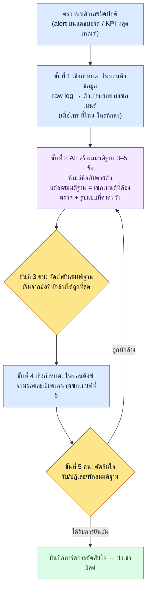

# 13.3 จากตัวเลขผิดปกติสู่การตัดสินใจ — AI ตั้งสมมติฐาน คนเป็นผู้ตัดสินใจ

> ผู้อ่านหลัก: ผู้ดูแลข้อมูลและ Design Director ที่อ่าน KPI แล้วตัดสินใจรายไตรมาส (ทีมขนาดกลาง 10–50 คน)
> ฉบับย่อสำหรับผู้อ่านคนเดียว/งานอดิเรก: §13.3.9 「ถ้าทำคนเดียว เท่านี้ก็พอ」

ผมเคยเห็นเส้นสีแดงเส้นหนึ่งบนแดชบอร์ดในเช้าวันจันทร์ อัตราการคงอยู่ (Retention) 30 วันหักลงอย่างเห็นได้ชัดเมื่อเทียบกับสัปดาห์ก่อน คนที่มารวมตัวกันในห้องประชุมต่างคนต่างเสนอสาเหตุคนละหนึ่งอย่าง บางคนชี้ไปที่จุดล่าสัตว์ใหม่ที่เพิ่งแพตช์สัปดาห์ก่อน บางคนชี้ไปที่ซีซันใหม่ของเกมคู่แข่ง บางคนพูดแค่ว่า "ปัจจัยตามฤดูกาล" ทุกข้อฟังดูมีเหตุผล ปัญหาคือจนหมดบ่ายวันนั้น เรายังตกลงกันไม่ได้แม้แต่ว่าเราควรตรวจสอบอะไร มีสมมติฐานห้าข้อ แต่เซกเมนต์ที่จะตรวจสอบกลับยังไม่มีการกำหนดแม้แต่ข้อเดียว

บทนี้ว่าด้วยวิธียุติเช้าแบบนั้น แก่นมีอยู่บรรทัดเดียว **เมื่อเห็นตัวเลขผิดปกติ จะไม่ให้ AI วินิจฉัยเป็นข้อสรุปตายตัว แต่ให้ตั้งสมมติฐานที่ตรวจสอบได้ 3–5 ข้อ** AI ไม่ฟันธงว่า "อัตราการคงอยู่ลดลงเพราะ X" แต่จะเสนอการออกแบบการตรวจสอบในรูป "ถ้าเป็น X เซกเมนต์นี้จะแสดงผลออกมาแบบนี้" ส่วนการตัดสินใจเป็นของคน เรื่องทั่วไปของ data-driven นั้นมีในหนังสือเล่มอื่นมากพออยู่แล้ว บทนี้จึงเน้นเฉพาะ *จุดที่นำเรื่องทั่วไปนั้นมาเดินด้วยเวิร์กโฟลว์ AI* เท่านั้น

---

## 13.3.1 การนิยาม KPI เป็นของคน การช่วยตีความเป็นของ AI

ก่อนอื่นขอตอกหมุดเส้นแบ่งให้ชัด ทั้งบทนี้ตั้งอยู่บนประโยคเดียว **คนเป็นผู้กำหนดว่าจะนิยาม KPI เป็นอะไร ส่วน AI ช่วยแค่งานเดียวคือกางสมมติฐานอย่างรวดเร็วว่าทำไม KPI นั้นถึงสั่นไหวเมื่อมันสั่นไหว**

ถ้าเส้นแบ่งนี้พังลง data-driven เองก็พังตาม หากปล่อยให้ AI นิยาม KPI "สิ่งที่วัดง่าย" จะกลายเป็น KPI และหากปล่อยให้ AI วินิจฉัยด้วย ประโยคฟันธงที่ฟังดูเข้าท่าจะข้ามการตรวจสอบของคนแล้วพุ่งตรงไปเป็นการตัดสินใจ ดังนั้นจึงเปิดช่องให้ AI เพียงช่วงเดียวเท่านั้น — ช่วงหลังจากจับความผิดปกติได้แล้ว ก่อนที่คนจะตัดสินใจ ระหว่างนั้นคือช่วงของการกาง "จะสงสัยอะไรและจะยืนยันอะไร"

การแบ่งงานนี้ใช้กระดูกสันหลังเดียวกับบทก่อนหน้าในส่วนที่ 13 ไพทอนดึง raw log ออกมาแบบเชิงกำหนด (deterministic) (13.1) คนตรึงการนิยาม KPI และลำดับชั้นให้นิ่ง (13.2) ส่วนในบทนี้ AI รับเฉพาะ *การช่วยตีความ* บนพื้นนั้นเมื่อจับความผิดปกติได้ การดึงเป็นเชิงกำหนด การนิยามเป็นของคน การช่วยตีความเป็นของ AI การที่ทั้งสามไม่ปะปนกันคือกลไกนิรภัยของทั้งพาร์ตนี้

โปรเจกต์ของผู้เขียน (MMORPG ที่เน้นมือถือก่อน ต่อไปเรียก "โปรเจกต์ A") มีล็อกจริงรองรับการช่วยเหลือนี้อยู่ ใต้โฟลเดอร์หน่วยความจำของทีมมี `_economy_log/` (ล็อกความคุ้มค่าเชิงโทเค็นและเวลา) `_scores_latest.json` (แคชคะแนนตัวชี้วัด) `_roi_report.md` (รายงาน ROI (Return on Investment, ผลตอบแทนเทียบกับการลงทุน)) บันทึกเซสชันจริง (worked transcript) ของบทนี้รับสัญญาณผิดปกติที่ดึงจากล็อกเหล่านี้มาเป็นอินพุต

---

## 13.3.2 ลูปการตัดสินใจ — ช่องที่ AI เข้าไปอยู่มีเพียงช่องเดียว

ก่อนอื่นขอตรึงลูปทั้งหมดที่ตัวเลขผิดปกติหนึ่งตัวนำไปสู่การตัดสินใจไว้เป็นภาพ ในภาพนี้ช่องที่ AI เข้าไปอยู่มีเพียงช่องเดียวคือ "การสร้างสมมติฐาน" เท่านั้น ทั้งช่องก่อนหน้า (การดึงข้อมูล) และช่องถัดไป (การตรวจสอบและการตัดสินใจ) ล้วนเป็นที่ของคนและโค้ด



จุดที่มือของคนเข้าไปแตะมีอยู่สามแห่ง จุดที่นิยามว่าอะไรคือความผิดปกติ (แห่งแรกสุด ซึ่งจบไปแล้วใน 13.2) จุดที่เลือกว่าจะตรวจสมมติฐานข้อไหนก่อน (ขั้นที่ 3) และจุดที่ตัดสินใจขั้นสุดท้าย (ขั้นที่ 5) ส่วนการรวมยอดล็อกอันน่าเบื่อระหว่างนั้นเป็นงานของไพทอน และการกางสมมติฐานอย่างรวดเร็วเป็นงานของ AI **ในลูปนี้ไม่มีช่องที่ AI วินิจฉัยตายตัว** สมมติฐานมีไว้เพื่อถูกหักล้าง และถ้าถูกหักล้างก็ย้อนกลับไปขั้นที่ 2

---

## 13.3.3 [บันทึกเซสชันจริง] อัตราการคงอยู่ลดลง — รับสมมติฐาน 3–5 ข้อ

ขอแสดงให้เห็นจริงว่าเดินหนึ่งรอบจนจบได้อย่างไร ด้านล่างคือเซสชันที่เรียบเรียงใหม่จากเหตุการณ์อัตราการคงอยู่ลดลงในเช้าวันจันทร์ข้างต้น พรอมต์อินพุตคัดลอกไปใช้ได้ตามเดิม และเอาต์พุตเรียบเรียงใหม่ให้ตรงกับเซสชันจริง

### ขั้นที่ 1 — อินพุต: โยนสัญญาณผิดปกติที่ไพทอนดึงมาตามเดิม

ก่อนอื่น คนจะไม่โยนความรู้สึกว่า "อัตราการคงอยู่ลดลง" เข้าไป แต่จะโยนตารางตัวเลขแยกตามเซกเมนต์ที่ไพทอนดึงมาแบบเชิงกำหนด ตารางนี้ไม่ได้เขียนขึ้นใหม่ แต่ดึงมาจาก `_economy_log`/ล็อกอีเวนต์เท่านั้น

```python
# retention_break_extract.py (โครงร่าง) — แยกเซกเมนต์ของช่วงผิดปกติ
# อินพุต: ล็อกอัตราการคงอยู่ของโคฮอร์ตรายวัน
# เอาต์พุต: เซกเมนต์ไหนหักลงเท่าไร (ตารางสำหรับป้อน LLM)
def extract_break(rows, kpi="d30_retention", baseline_weeks=4):
    base = mean([r[kpi] for r in rows if r.week < target_week][-baseline_weeks:])
    cur  = [r for r in rows if r.week == target_week]
    return [
        {"segment": s.name,
         "baseline": round(base_by_seg[s.name], 3),
         "current":  round(s.value, 3),
         "delta_pct": round((s.value/base_by_seg[s.name]-1)*100, 1),
         "n": s.sample_size}          # จำนวนตัวอย่าง — ถ้าน้อยความเชื่อมั่นต่ำ ส่งไปด้วยกัน
        for s in cur
    ]
```

ตารางที่สคริปต์นี้คายออกมาคืออินพุตชุดแรกที่จะส่งให้ AI แก่นอยู่ที่การส่งจำนวนตัวอย่าง (`n`) ไปด้วยกัน เพื่อไม่ให้ AI เข้าใจผิดว่าความผันผวนของเซกเมนต์ที่มีตัวอย่างน้อยเป็นสาเหตุ คนตัวเตือนนั้นต้องถือไว้โดยข้อมูล ไม่ใช่โดยคน

```
# retention_break_2026Q2W3.txt (ผลการดึงข้อมูล, ตัดมาบางส่วน)
segment                baseline  current  delta_pct      n
ใหม่(ภายใน7วันแรก)        0.41     0.31      -24.4%     8,200
กลับมา(หลังหยุดเล่น30วัน+)  0.28     0.27       -3.6%     1,100
จ่ายเงิน(เสียเงิน)         0.62     0.60       -3.2%     2,400
ไม่จ่ายเงิน              0.34     0.25      -26.5%    14,900
จุดล่าใหม่_เล่น            0.39     0.22      -43.6%     3,050
จุดล่าใหม่_ไม่เล่น         0.40     0.38       -5.0%    11,200
```

### ขั้นที่ 2 — พรอมต์: ห้ามวินิจฉัย บังคับให้ตั้งสมมติฐานและออกแบบการตรวจสอบ

```
ไฟล์ retention_break_2026Q2W3.txt ที่แนบมาคือความเปลี่ยนแปลงของอัตราการคงอยู่ d30
แยกตามเซกเมนต์ที่ไพทอนดึงมา (baseline=ค่าเฉลี่ย 4 สัปดาห์ก่อนหน้า, current=สัปดาห์นี้,
n=จำนวนตัวอย่าง) เซกเมนต์ไม่จ่ายเงินและจุดล่าใหม่_เล่นหายไปเยอะ อย่าวินิจฉัยสาเหตุ
ขอแค่ตั้งสมมติฐานที่ตรวจสอบได้ 3–5 ข้อ แต่ละสมมติฐานให้สี่บรรทัดนี้ —
สมมติฐานหนึ่งประโยค / เซกเมนต์ที่จะตรวจ (จะซอยย่อยอย่างไร) / รูปแบบที่จะเห็นถ้าถูก /
เงื่อนไขหักล้างที่จะแสดงว่าผิด เซกเมนต์ที่ตัวอย่างน้อย (n<2000) อย่าใช้เป็นหลักฐานหลัก
ถ้าจะใช้ให้ระบุข้อจำกัด เรียงสมมติฐานตามลำดับที่หักล้างได้ถูกที่สุดก่อน และสิ่งที่
แยกแยะด้วยข้อมูลไม่ได้ให้ทำเครื่องหมาย 'ต้องอาศัยวิจารณญาณของคน' แยกไว้ เอาต์พุต
เอาแค่รายการการ์ดสมมติฐาน ตัดคำบรรยายออก
```

ในพรอมต์นี้ไม่มีคำว่า "ค้นหาสาเหตุ" แม้แต่บรรทัดเดียว แต่ระบุไว้แค่โครงที่สมมติฐานต้องมีและเส้นที่ห้ามข้าม ถ้าให้อิสระแก่ AI มันจะคายประโยคฟันธงที่ฟังดูเข้าท่าออกมาว่า "น่าจะเป็นเพราะความยากของจุดล่าใหม่" และพอประโยคนั้นถูกบันทึกในรายงานการประชุม มันก็กลายเป็นการตัดสินใจโดยไม่ผ่านการตรวจสอบ กลไกที่กันเรื่องนี้คือสี่อย่าง — **ห้ามฟันธง บังคับให้แต่ละสมมติฐานมีเซกเมนต์ที่ต้องตรวจ รูปแบบที่คาดหวัง และเงื่อนไขหักล้าง เรียงตามต้นทุนการหักล้าง และ "สิ่งที่แยกแยะไม่ได้ส่งให้คน"** เป็นกลไกที่เปลี่ยนเอาต์พุตจากการวินิจฉัยให้เป็นการออกแบบการตรวจสอบ

### ขั้นที่ 3 — เอาต์พุตของ Claude (ผลลัพธ์ดิบ, เรียบเรียงใหม่)

```
[สมมติฐาน 1] (ต้นทุนหักล้างต่ำสุด)
สมมติฐาน: ความยากของจุดล่าใหม่กลายเป็นกำแพงกั้นผู้เล่นใหม่ที่ไม่จ่ายเงิน ทำให้เลิกเล่นภายใน 7 วันมากขึ้น
เซกเมนต์ที่จะตรวจ: ซอยเซกเมนต์จุดล่าใหม่_เล่นใหม่ออกเป็นช่วง 'จำนวนการตายครั้งแรก' (0~2 / 3~5 / 6+)
รูปแบบที่คาดหวัง: ถ้าสมมติฐานถูก อัตราการเลิกเล่น d7→d30 ในช่วงตายครั้งแรก 6+ ต้องพุ่งขึ้น
เงื่อนไขหักล้าง: ถ้าไม่มีความสัมพันธ์เชิงเดียว (monotonic) ระหว่างจำนวนการตายกับอัตราการเลิกเล่น ให้ปฏิเสธ

[สมมติฐาน 2]
สมมติฐาน: สาเหตุไม่ใช่ตัวจุดล่าใหม่เอง แต่เป็นความเปลี่ยนแปลงอื่น (เส้นรางวัล/UI) ที่ผูกมากับแพตช์เดียวกัน
เซกเมนต์ที่จะตรวจ: อัตราการคงอยู่ของผู้เล่นที่ไม่เล่นจุดล่าใหม่แต่เข้าเกมหลังแพตช์
รูปแบบที่คาดหวัง: ถ้าเซกเมนต์ไม่เล่นก็ลดลงตามไปด้วย แสดงว่าจุดล่าไม่ใช่ตัวการ
เงื่อนไขหักล้าง: ถ้าเซกเมนต์ไม่เล่นคงที่ตาม baseline (ระดับ -5%) ให้ปฏิเสธสมมติฐานนี้ แล้วโน้มไปทางสมมติฐาน 1

[สมมติฐาน 3]
สมมติฐาน: ปัจจัยภายนอก (ซีซันใหม่ของเกมคู่แข่ง) ทำให้กลุ่มไม่จ่ายเงินเลิกเล่นในภาพรวม และจุดล่าไม่เกี่ยว
เซกเมนต์ที่จะตรวจ: ตารางไขว้ 2×2 ระหว่างจ่ายเงิน/ไม่จ่ายเงิน × เล่นจุดล่าใหม่หรือไม่
รูปแบบที่คาดหวัง: ถ้าเป็นปัจจัยภายนอก กลุ่มไม่จ่ายเงินจะลดลงอย่างสม่ำเสมอโดยไม่เกี่ยวกับการเล่นจุดล่า
เงื่อนไขหักล้าง: ถ้าการลดลงกระจุกที่จุดล่าใหม่_เล่น สมมติฐานปัจจัยภายนอกก็อ่อนลง

[สมมติฐาน 4] (ต้องอาศัยวิจารณญาณของคน)
สมมติฐาน: ปัญหาอยู่ที่การวัดเอง — นิยามโคฮอร์ต/การเก็บล็อกของสัปดาห์นี้มีการเปลี่ยนแปลง
เซกเมนต์ที่จะตรวจ: (แยกแยะด้วยข้อมูลไม่ได้) ต้องให้คนยืนยันว่ามีการเปลี่ยน schema ของ telemetry มาพร้อมแพตช์หรือไม่
รูปแบบที่คาดหวัง: ถ้ามีการเปลี่ยน schema การลดลงอาจไม่ใช่ของจริง แต่เป็น artifact จากการวัด
เงื่อนไขหักล้าง: ถ้ายืนยันว่าไพป์ไลน์ล็อกไม่เปลี่ยน ให้ปฏิเสธ

หมายเหตุ: เซกเมนต์ 'กลับมา' (n=1,100) มีตัวอย่างน้อย จึงไม่ถือ -3.6% เป็นสัญญาณ
```

ส่วนที่มีค่ามากที่สุดในเอาต์พุตนี้คือสมมติฐาน 4 เป็นจุดที่ AI แจ้งข้อจำกัดของตัวเองว่า "อันนี้แยกแยะด้วยข้อมูลไม่ได้ ให้คนยืนยันว่ามีการเปลี่ยน schema ของ telemetry หรือไม่" พรอมต์ที่ดีทำให้ AI พูดได้ว่า "ไม่รู้" และบรรทัดสุดท้าย — การที่มันคัดเซกเมนต์ที่มีตัวอย่าง 1,100 ออกจากสัญญาณด้วยตัวเอง — คือร่องรอยที่กฎข้อ 3 ทำงาน

### ขั้นที่ 4 — การตรวจสอบและการตัดสินใจ (ที่ของคนและไพทอน)

อย่านำการ์ดสมมติฐานนี้ไปเป็นการตัดสินใจตามนั้น คนจัดลำดับความสำคัญ แล้วไพทอนรวมยอดอีกครั้ง

สมมติฐาน 2 มีต้นทุนหักล้างถูกที่สุด เซกเมนต์จุดล่าใหม่_ไม่เล่นมีอยู่ในตารางขั้นที่ 1 อยู่แล้ว — `-5.0%` คงที่ตาม baseline กล่าวคือผู้เล่นที่ไม่ได้เล่นจุดล่ายังปกติดี **สมมติฐาน 2 จึงถูกปฏิเสธทันที และในขณะเดียวกันสมมติฐาน 3 (ปัจจัยภายนอกทำให้ลดลงภาพรวม) ก็อ่อนลงด้วย** เพราะถ้าเป็นปัจจัยภายนอก กลุ่มไม่เล่นก็ต้องลดลงไปด้วย การลดลงกระจุกอยู่ที่ผู้เล่นที่ *เล่น* จุดล่าใหม่

จึงแคบลงมาที่สมมติฐาน 1 แล้วรันไพทอนซ้ำ ผลของการซอยจุดล่าใหม่_เล่นตามจำนวนการตายครั้งแรกพบว่าในช่วงที่ตาย 6 ครั้งขึ้นไป การเลิกเล่น d30 โดดเด่นชัด (ทิศทาง: ตายยิ่งมากยิ่งเลิกเล่นชันขึ้น เป็นความสัมพันธ์เชิงเดียว — ค่าที่แม่นยำวัดด้วย telemetry ของบิลด์ ตรงนี้บอกแค่ทิศทาง) ตรงกับรูปแบบที่คาดหวังของสมมติฐาน 1

ที่เหลือคือสมมติฐาน 4 คนตรวจ Patch Note (แพตช์โน้ต) แล้ว — schema ของ telemetry ไม่เปลี่ยน ตัดความเป็นไปได้เรื่อง artifact จากการวัดออก ถึงตรงนี้วัตถุดิบสำหรับการตัดสินใจก็พร้อมแล้ว

> **[ขั้นที่ 5 การตัดสินใจของคน — การ์ดการตัดสินใจ]**
>
> - **รับ**: ความยากช่วงต้นของจุดล่าใหม่ (ความถี่การตายครั้งแรก) คือตัวขับเคลื่อนหลักของการเลิกเล่นในกลุ่มผู้เล่นใหม่ที่ไม่จ่ายเงิน บิลด์ถัดไปทำ A/B ลดความหนาแน่นศัตรู/พลังชีวิตในช่วงเลเวล 1–5
> - **ปฏิเสธ**: สมมติฐานปัจจัยภายนอก (สมมติฐาน 3) สมมติฐาน artifact จากการวัด (สมมติฐาน 4)
> - **พัก**: เส้นรางวัล (ส่วนที่เหลือของสมมติฐาน 2) — ถ้าหลังปรับความยากจุดล่าแล้วการลดลงยังเหลืออยู่ ค่อยจุดประเด็นใหม่
> - **บันทึกบทบาทของ AI**: วินิจฉัย 0 ครั้ง ให้สมมติฐาน 4 ข้อ + การออกแบบการตรวจสอบ การตัดสินใจเป็นของคน

อินพุต (สัญญาณผิดปกติ) → การดึงข้อมูล → สมมติฐาน → การตรวจสอบ → การตัดสินใจ หนึ่งรอบปิดลงตรงนี้ AI ไม่เคยพูดสักครั้งว่า "สาเหตุคืออันนี้" มันแค่ปูทางให้ไปตรวจสอบ นี่คือเกณฑ์ Show ของบทนี้ — ประโยคที่ว่า "AI วิเคราะห์ข้อมูล" จะกลวงเปล่า ถ้าไม่ได้ดูจนจบสักครั้งว่าตั้งสมมติฐานอะไร อะไรถูกหักล้าง และคนตัดสินใจอะไร

---

## 13.3.4 ทำไมจึงห้าม 'การวินิจฉัยตายตัว'

ความต่างระหว่างการสร้างสมมติฐานกับการวินิจฉัยตายตัวดูเหมือนเล็กน้อย แต่มันแบ่งความปลอดภัยของการตัดสินใจ พอเอาสองอย่างมาวางเทียบกัน ความต่างก็ชัด

| | การวินิจฉัยตายตัว (ห้าม) | การสร้างสมมติฐาน (วิธีของบทนี้) |
|---|---|---|
| เอาต์พุตของ AI | "สาเหตุที่อัตราการคงอยู่ลดคือความยากของจุดล่าใหม่" | "สมมติฐานความยาก — ดูช่วงตายครั้งแรก 6+ แบบนี้คือถูก แบบนั้นคือผิด" |
| การกระทำถัดไปของคน | รับมาจดแล้วตัดสินใจตามนั้น | ลองหักล้างจากสมมติฐานที่ถูกที่สุดก่อน |
| เมื่อผิด | การตัดสินใจที่ผิดพุ่งตรงเข้าบิลด์ | ถูกปฏิเสธในขั้นตรวจสอบ ต้นทุน 0 |
| ความรับผิดชอบ | "AI ทำเอง" (ความรับผิดชอบระเหย) | คนเลือกสมมติฐานแล้วตัดสินใจ (ความรับผิดชอบชัด) |

อันตรายที่แท้จริงของการวินิจฉัยตายตัวไม่ใช่เรื่องความแม่นยำ แต่คือ **การทำให้ข้ามการตรวจสอบ** ประโยคเดียวที่ฟังดูเข้าท่าทำให้ความสงสัยในห้องประชุมสงบลง ในทางกลับกัน การ์ดสมมติฐานคือการบ้านในตัวเองว่า "ให้ไปยืนยันสิ่งนี้" จึงมีโครงสร้างที่ข้ามไปเป็นการตัดสินใจไม่ได้หากไม่ตรวจสอบ เหตุผลที่วาง AI ไว้เป็นเครื่องสร้างสมมติฐาน ไม่ใช่เครื่องวินิจฉัย อยู่ตรงนี้

---

## 13.3.5 การเตือนล่วงหน้าแบบ Goodhart — AI ชี้การบิดเบือน KPI ก่อน

หลุมพรางที่ลึกที่สุดของ data-driven คือกฎของ Goodhart *"เมื่อใดที่ตัวชี้วัดกลายเป็นเป้าหมาย ตัวชี้วัดนั้นจะไม่ใช่ตัวชี้วัดที่ดีอีกต่อไป"* ถ้าตั้ง DAU (ผู้ใช้ที่ใช้งานรายวัน) เป็นเป้า มันจะพอง DAU ด้วยการแจ้งเตือนแบบเทียม ๆ แล้วอัตราการคงอยู่ระยะยาวก็จะถูกเฉือนลง ปัญหาคือการบิดเบือนนี้มักเผยเป็นผลข้างเคียงออกมา **หลังจากตัดสินใจไปนานแล้ว**

จึงส่ง AI เข้าไปก่อนอีกหนึ่งช่อง ก่อนที่จะนำข้อตัดสินใจเข้าบิลด์ ให้ AI ลอง "ถ้าตั้ง KPI นี้เป็นเป้าหมาย มันจะถูกเล่นเกม (gamed) ได้อย่างไร" ก่อน นี่ไม่ใช่การวินิจฉัย แต่เป็น *เรดทีม* — สั่งให้จงใจหาช่องโหว่ของการตัดสินใจของเราเอง

> **[พรอมต์เตือนล่วงหน้าแบบ Goodhart]**
>
> เป้าหมาย KPI ไตรมาสนี้คืออัตราการคงอยู่ d7 +5%p และร่างวิธีบรรลุคือเสริมรางวัลเข้าเล่น
> ต่อเนื่อง 7 วันแบบหนัก ให้นายเป็นเรดทีมของการตัดสินใจนี้ แล้วยกฉากการบิดเบือนแบบ
> Goodhart ที่อาจเกิดถ้าตั้ง KPI นี้เป็นเป้าหมายมา 3 ฉาก พร้อมตัวชี้วัดยามที่จะพังไปด้วยในแต่ละฉาก
> และเซกเมนต์มอนิเตอร์ที่จะจับการบิดเบือนได้แต่เนิ่น ๆ ทำเป็นตาราง อย่าฟันธง ให้อยู่ในรูป 'อาจเป็นแบบนี้'

สิ่งที่ AI เสนอออกมาไม่ใช่คำพยากรณ์ตายตัว แต่เป็นรายการจุดที่ต้องสงสัย คัดเฉพาะแก่นมาได้ดังนี้

| ฉากการบิดเบือนแบบ Goodhart (สมมติฐาน) | ตัวชี้วัดยามที่จะพังไปด้วย | การมอนิเตอร์แต่เนิ่น ๆ |
|---|---|---|
| แค่เช็กชื่อเข้าเล่นแต่ไม่เล่นคอนเทนต์หลัก | จำนวนการต่อสู้ต่อเซสชัน·อัตราการเข้าจุดล่า | เตือนเมื่ออัตราการคงอยู่ d7 ↑ พร้อมจำนวนการต่อสู้ ↓ พร้อมกัน |
| เงินเฟ้อรางวัลทำให้เศรษฐกิจล่ม | สัดส่วน sink/source ของทรัพยากร, ราคาไอเทมในตลาด | ติดตามช่อง sink-source ของ `_economy_log` ที่ถ่างกว้างขึ้น |
| หน้าผาเลิกเล่นทันทีหลังรางวัลเข้าเล่นจบ | อัตราการคงอยู่ d8\~d14 (ทันทีหลังรางวัลหมด) | อย่าดูแค่ d7 ให้จับคู่กับ d14 |

ค่าของตารางนี้ไม่ใช่คำตอบที่ถูก แต่คือ **การจับคู่ตัวชี้วัดยามไว้ล่วงหน้าก่อนตัดสินใจ** ถ้าจะตั้งอัตราการคงอยู่ d7 เป็นเป้า ก็เอา "จำนวนการต่อสู้" และ "อัตราการคงอยู่ d14" ที่ AI ชี้ขึ้นมาแสดงบนหน้าจอเดียวกันแล้วดู เช่นนั้นแล้ว เมื่อ d7 ขึ้นแต่จำนวนการต่อสู้ลดตามไปด้วย — ขณะที่การบิดเบือนแบบ Goodhart เริ่มต้นนั้นเอง — ผลข้างเคียงจะถูกจับได้ก่อนที่จะสะสมจนถึงปลายไตรมาส นิสัยการผูก KPI เข้ากับตัวชี้วัดยามแทนที่จะตั้ง KPI เดียวเป็นเป้า คือวิธีทำให้ "ความสมดุลของ KPI 5–7 ตัว" ที่กำหนดไว้ใน 13.2 ทำงานจริงในขั้นตัดสินใจ

ขอชี้ไว้ตรงนี้สักหน่อย ค่าที่ AI สร้างขึ้นในเรดทีมนี้ไม่ใช่ "การประหยัดเวลา" เวลาที่คนใช้นึกถึงสามฉากนี้ก็ไม่ได้นาน ค่าที่แท้จริงคือ **การเผยสัญญาณการบิดเบือนตรงจุดที่กำลังตัดสินใจ** — ผลของสัญญาณที่ดึงตัวชี้วัดยามที่ปกติไม่ได้ดูขึ้นมาบนโต๊ะตัดสินใจ ค่าของการทำงานอัตโนมัติไม่ได้อยู่ที่การประหยัดเวลา แต่อยู่ที่การทำให้สัญญาณที่ปกติมองไม่เห็นกลายเป็นเห็นได้ (แนวคิดหน่วยความจำทีมของโปรเจกต์ A `automation_signal_value_over_time_savings`)

---

## 13.3.6 น้ำหนักของสมมติฐาน AI ต่างกันตามแต่ละการตัดสินใจ

การสร้างสมมติฐานไม่ได้มีประโยชน์เท่ากันกับทุกการตัดสินใจ ระดับความเชื่อสมมติฐาน AI จะต่างกันตามขอบเขตเวลาของการตัดสินใจและความหนาแน่นของข้อมูล

| ประเภทการตัดสินใจ | ความหนาแน่นของข้อมูล | ตำแหน่งของสมมติฐาน AI |
|---|---|---|
| เปลี่ยนตัวเลขการปรับสมดุลสกิล | สูง (มีซิม·ล็อกมาก) | เดินลูปสมมติฐาน→ตรวจสอบ→ตัดสินใจตามเดิม AI ช่วยได้แรง |
| เปลี่ยนคอมโพเนนต์ UI | สูง (ทำ A/B ได้) | เหมือนกัน สมมติฐาน AI ใช้ได้ |
| จะออกคอนเทนต์ใหม่หรือไม่ | กลาง (อ้างได้แค่คอนเทนต์ใกล้เคียง) | สมมติฐานเป็นแค่ข้อมูลอ้างอิง น้ำหนักการตัดสินใจเอนมาทางคน |
| วิสัยทัศน์ระยะยาว·แนวใหม่ | ต่ำ (ไม่มีแบบอย่าง) | ลูปเองหมุนไม่ได้ — คนตัดสินใจ AI แค่แจกแจงความเสี่ยง |

กฎนั้นง่าย **การตัดสินใจที่ข้อมูลยิ่งหนา ยิ่งเดินลูปของ §13.3.2 ตามเดิม การตัดสินใจที่ข้อมูลยิ่งบาง บทบาทของ AI ยิ่งลดจากเครื่องสร้างสมมติฐานลงมาเป็นเครื่องเขียนเช็กลิสต์ความเสี่ยง** เหตุที่ความพยายามคลี่คลายวิสัยทัศน์ระยะยาวด้วยข้อมูลนั้นอันตราย ก็เพราะในจุดที่ไม่มีข้อมูลอนาคต ถ้า AI กุสมมติฐานที่ฟังดูเข้าท่าขึ้นมาด้วยข้อมูลอดีต สมมติฐานนั้นจะดึงวิสัยทัศน์กลับไปสู่อดีต การตัดสินใจในพื้นที่ที่ไม่มีข้อมูลไม่ใช่สิ่งที่จะหลีกเลี่ยงหรือโยนให้ AI แต่ปล่อยไว้เป็นจุดที่คนรับผิดชอบตัดสินใจเอง

> **[ป้ายบอกทาง — ถ้าจะวางพิกัดหัวข้อ·โคฮอร์ตด้วย embedding (ตอนนี้ยังเร็วเกินไป)]**
>
> ขอให้อ่านในฐานะแนวโน้มงานวิจัย ไม่ใช่ใบสั่งยา ในสองจุดของส่วนที่ 13 ความคิดเรื่อง embedding เดียวกันเปิดออก จุดหนึ่งคือคำตอบปลายเปิดใน §13.1 — ถ้าจัดกลุ่มภาษาธรรมชาติแบบไม่มีโครงด้วย embedding ระดับประโยค ก็จะวางพิกัดเคสขอบเขต [กำกวม] ของ §13.1.2 ในรูป 'ระยะห่างระหว่างศูนย์กลางสองหัวข้อ' และทำเครื่องหมายคำตอบที่ไกลจากทุกศูนย์กลางว่าเป็น 'หัวข้อใหม่ที่โผล่ขึ้น' ได้ อีกจุดคือล็อกพฤติกรรมใน §13.1.4 — ถ้า embed ล็อกการเล่น ก็จะเผย 'โคฮอร์ตที่ผุดขึ้น (emergent cohort)' ซึ่งไม่มีใครนิยามไว้ล่วงหน้า ออกมาเป็นกลุ่มก้อนในปริภูมิเวกเตอร์ ('แผนที่' ของภาคผนวก M) แล้วเปิดทางป้อนเป็นตัวเลือก 'เซกเมนต์ที่จะตรวจ' ของลูปสมมติฐาน §13.3 (เป็นจุดที่เจาะข้อจำกัด 'เซกเมนต์ที่คนนิยามไว้ล่วงหน้า' ที่ §13.3.3 ตั้งเป็นเงื่อนไขไปได้หนึ่งช่อง) แต่กลุ่มก้อนเป็นเพียงสมมติฐาน ไม่ใช่สาเหตุ กลุ่มเล็กไม่ใช่สัญญาณ (เป็นจุดเดียวกับคำเตือนเรื่องตัวอย่างใน §13.3.3) และการติดป้ายชื่อให้กลุ่มก้อนยังเป็นงานของคน (§13.1.1) เหนือสิ่งอื่นใด อุบัติเหตุไลฟ์อาจเกิดในมิติที่การบีบอัดทิ้งไป ดังนั้นความคิดนี้จึงวางไว้ในจุดเดียวกันเป๊ะกับเบาะแส 'เวกเตอร์มิติ' ของ §8.2.7 ในพาร์ตเศรษฐกิจ (สัญชาตญาณของแนวคิดอยู่ในภาคผนวก M) — บนผืนดิน telemetry เดียวกัน ด้วยความยับยั้งชั่งใจเดียวกัน มันเป็นเพียงป้ายบอกทางที่ทีมซึ่งวาง telemetry ไว้แน่นหนาจะหันมามองในอีกไม่กี่ปีข้างหน้า สิ่งที่ต้องทำตอนนี้คือเดินลูปของ §13.3.2 อย่างซื่อตรง

---

## 13.3.7 ที่มาของตัวเลขในบทนี้

ตัวเลขในบทนี้เป็นไปตามหลักการของบทนำ「หนึ่งสัญญา」 กฎของ Goodhart เป็นข้อความสาธารณะที่ชาลส์ กู๊ดฮาร์ตวางรูปเป็นทางการในปี 1975 และ `_economy_log`·`_roi_report.md`·`_scores_latest.json` ของโปรเจกต์ A เป็นผลผลิตหน่วยความจำทีมที่มีอยู่จริง อีกทั้งกฎ `integrity_check_clickup_notify` ที่แจ้งผ่าน ClickUp เมื่อการตรวจความสอดคล้องล้มเหลว เป็น atom ที่ใช้งานจริงด้วยคะแนน 294.93 (ภาคผนวก A.3.6·A.3.1) ใน §13.3.3 ยืนยันด้วยการตรวจสอบสมมติฐานเฉพาะ *ทิศทาง* ว่า "ในช่วงตายครั้งแรก 6+ การเลิกเล่นชันขึ้น" เท่านั้น ส่วนค่าสัมบูรณ์ปล่อยให้ telemetry ของบิลด์เป็นผู้วัด ตารางเซกเมนต์ (baseline 0.41 ฯลฯ) เป็น *ตัวอย่างที่จัดขึ้น* เพื่อแสดงรูปแบบของเวิร์กโฟลว์ ไม่ใช่ค่าวัดจริงที่เปิดเผยของไตรมาสใดไตรมาสหนึ่ง — สิ่งที่ต้องจำไม่ใช่ตัวเลข แต่เป็นโครงสร้าง

---

## 13.3.8 ความล้มเหลวที่พบบ่อย

| รูปแบบ | ทำไมจึงล้มเหลว | วิธีแก้ |
|---|---|---|
| ถาม AI ว่า "สาเหตุคืออะไร" | ประโยคฟันธงที่ฟังดูเข้าท่าถูกตัดสินใจโดยไม่ตรวจสอบ | ห้ามวินิจฉัย บังคับสมมติฐาน 3–5 ข้อ + เงื่อนไขหักล้าง (§13.3.3) |
| ถือความผันผวนของเซกเมนต์ตัวอย่างน้อยเป็นสัญญาณ | เข้าใจผิดว่า noise เป็นสาเหตุ | ส่ง `n` ไปด้วยกันในขั้นดึงข้อมูลและระบุเกณฑ์ |
| ตั้ง KPI เดียวเป็นเป้าแล้วพุ่งตรง | การบิดเบือนแบบ Goodhart ระเบิดที่ปลายไตรมาส | ก่อนตัดสินใจทำเรดทีม AI + คู่ตัวชี้วัดยาม (§13.3.5) |
| ตัดสินใจระยะยาวที่ไม่มีข้อมูลด้วยข้อมูล | สมมติฐานอดีตลากวิสัยทัศน์อนาคตลงมา | แบ่งบทบาท AI ตามความหนาแน่นของข้อมูล (§13.3.6) |
| รับสมมติฐานแล้วรับเอามาใช้โดยไม่ตรวจสอบ | สมมติฐานปลอมตัวเป็นข้อสรุป | หักล้างจากสมมติฐานที่ถูกที่สุดก่อน ใช้เซกเมนต์ที่ไม่เล่นให้เป็นประโยชน์ |

ข้อที่สามระเบิดช้าที่สุด อัตราการคงอยู่ d7 ขึ้น การตัดสินใจดูเหมือนสำเร็จ แต่สองเดือนต่อมาหน้าผา d14 และการลดลงของจำนวนการต่อสู้มาพร้อมกัน เวลา 30 นาทีที่รันเรดทีม AI หนึ่งครั้ง *ก่อน* ตัดสินใจ ซื้อสองเดือนนั้นไว้ได้

---

## 13.3.9 ลองทำดู — หนึ่งก้าวที่ทำได้วันนี้

> **ถ้าทำคนเดียว เท่านี้ก็พอ**: ไม่จำเป็นต้องมีไพป์ไลน์ล็อกก็ได้ เลือกตัวเลขหนึ่งตัวที่เพิ่งหักลงจากเกมของคุณเอง (หรือจากตัวชี้วัดสาธารณะของเกมที่คุณชอบดู) แล้วโยนตัวเลขนั้นให้ AI โดยไม่ขอว่า "บอกสาเหตุที" แต่ขอว่า "ห้ามวินิจฉัยตายตัว ขอสมมติฐานที่ตรวจสอบได้ 3 ข้อพร้อมเงื่อนไขหักล้าง" จากนั้นเลือกสมมติฐานที่ยืนยันได้ถูกที่สุดมาหนึ่งข้อ แล้วลองซอยข้อมูลจริงดูสักครั้ง คุณจะสัมผัสได้ด้วยตัวเองว่า 'การรับการวินิจฉัย' กับ 'การตรวจสอบสมมติฐาน' ต่างกันแค่ไหนในแง่ความปลอดภัยของการตัดสินใจ

ถ้าเป็นทีม ลองเริ่มด้วยหนึ่งก้าวถัดไปนี้ เพิ่มหนึ่งบรรทัดให้สคริปต์ดึงตัวเลขผิดปกติ **ส่งจำนวนตัวอย่าง (`n`) ออกมาพร้อมกันเสมอ** เมื่อมันดึงตัวเลขแยกตามเซกเมนต์ (`retention_break_extract.py` ของ §13.3.3) และเมื่อกำหนดเป้าหมาย KPI ครั้งถัดไป ลองรันพรอมต์เรดทีม Goodhart ของ §13.3.5 สักครั้ง แล้วป้อนคู่ตัวชี้วัดยามหนึ่งคู่ลงในการ์ดการตัดสินใจ มีแค่สองอย่างนี้ "AI วินิจฉัยสาเหตุแล้ว" ก็จะเปลี่ยนเป็น "AI กางสมมติฐานแล้วคนตรวจสอบจนตัดสินใจได้"

---

### สรุปประเด็นสำคัญของบท
- สั่ง AI ให้ตั้งสมมติฐานที่ตรวจสอบได้ 3–5 ข้อ ไม่ใช่การวินิจฉัยตายตัว
- บังคับให้แต่ละสมมติฐานมีเซกเมนต์ที่จะตรวจ·รูปแบบที่คาดหวัง·เงื่อนไขหักล้าง
- ก่อนตัดสินใจ ใช้เรดทีม Goodhart จับคู่ตัวชี้วัดยามไว้ล่วงหน้า

### ตัวอย่างบทถัดไป
- 14.1 จาก HUD บน PC 30 ชนิดสู่ 10 ชนิดบนมือถือ — จุดเริ่มของการตัดสินใจแยกตามแพลตฟอร์ม
