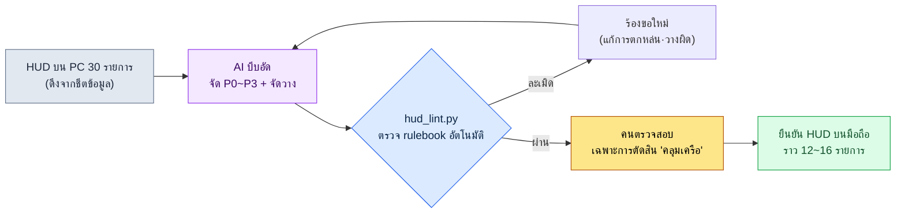

# 14.1 จาก HUD บน PC 30 รายการสู่ 10 รายการบนมือถือ — เปลี่ยนข้อจำกัดให้เป็น rulebook เปลี่ยนการบีบอัดให้ AI ทำ

> ผู้อ่านหลัก: นักออกแบบ UX และนักออกแบบระบบของโปรเจกต์ที่ให้มือถือมาก่อน (ทีมขนาดกลาง 10–50 คน)
> ฉบับย่อสำหรับผู้อ่านที่ทำคนเดียว/เป็นงานอดิเรก: §14.1.7 「ถ้าทำคนเดียวแค่นี้พอ」

ผู้เขียนยังจำวันที่นำ HUD การต่อสู้ซึ่งทำงานได้ดีบนบิลด์ PC มาแสดงบนความละเอียดของมือถือเป็นครั้งแรกได้ ครึ่งหนึ่งของหน้าจอถูกปกคลุมไปด้วยเกจ ไอคอน มินิแมป และตัวติดตามเควสต์ ขณะที่ตัวละครกลับมองไม่เห็น แต่ละองค์ประกอบดูเหมือนจำเป็นไปเสียทั้งหมด ปัญหาคือคำถามที่ว่า "จะตัดอะไรออก" กลับกลายเป็นการถกเถียงที่เริ่มต้นใหม่ตั้งแต่ศูนย์ทุกครั้งที่ประชุม บางคนอยากเก็บมินิแมปไว้ บางคนอยากเก็บแชตไว้ เพราะเหตุผลคือ "ความรู้สึก" ข้อสรุปจึงต่างกันไปทุกครั้ง

บทนี้ว่าด้วยวิธียุติการถกเถียงนั้น แก่นมีสองข้อ ข้อแรก เปลี่ยนข้อจำกัดของมือถือจาก "ความรู้สึก" ให้เป็น **rulebook ที่ตรวจสอบได้** ข้อสอง มอบงานบีบอัดที่ทั้งน่าเบื่อและซ้ำซากอย่าง "การลด 30 รายการบน PC ให้เหลือ 10 รายการบนมือถือ" ให้ AI ทำ ส่วนคนทำเพียง **การตรวจสอบที่จับการละเมิด rulebook** เท่านั้น ความรู้ทั่วไปเกี่ยวกับ UX บนมือถือมีอยู่ในหนังสือเล่มอื่นอย่างเพียงพอแล้ว บทนี้จึงโฟกัสเฉพาะ *จุดที่นำความรู้นั้นมารันด้วยขั้นตอนการทำงานของ AI* เท่านั้น

---

## 14.1.1 ข้อจำกัดของมือถือไม่ใช่ 'ข้อควรระวัง' แต่เป็น 'rulebook'

หนังสือที่ไล่เรียงข้อจำกัดของมือถือเป็นตารางมีอยู่มาก เรื่องที่ว่าหน้าจอเล็ก นิ้วหนา เซสชันสั้น และแบตเตอรี่หมดไว ทุกข้อล้วนถูกต้อง แต่ต่อให้ท่องจากตารางได้ พอถึงการประชุมก็ยังตอบคำถามที่ว่า "แล้วปุ่มนี้ใช้ได้หรือไม่" ไม่ได้อยู่ดี ข้อจำกัดต้องถูกเปลี่ยนให้เป็น **เกณฑ์ผ่าน/ไม่ผ่านที่เป็นตัวเลข** ทั้ง AI และคนจึงจะขีดเส้นเดียวกันได้

โชคดีที่ข้อจำกัดด้านอินพุตของมือถือจำนวนมากถูกบริษัทแพลตฟอร์มตรึงไว้เป็นไกด์ไลน์สาธารณะอยู่แล้ว มาตรฐานสาธารณะอย่างพื้นที่สัมผัส 44pt (HIG) · 48dp (Material) · คอนทราสต์ 4.5:1 (WCAG) · ระยะห่าง 8dp นั้นให้ยึดตาม rulebook ใน §9.1 และในที่นี้จะวางไว้แบบอินไลน์เฉพาะ **พื้นที่สัมผัสขั้นต่ำ 44pt (HIG)** ที่ lint ของบทนี้ใช้โดยตรงเท่านั้น เป็นตัวเลขที่ไม่จำเป็นต้องกุขึ้นมา เมื่อพูดได้ว่า "ปุ่มนี้คือ 38pt จึงต่ำกว่า HIG 44pt" แทนที่จะเป็น "ปุ่มดูเหมือนจะเล็กไปหน่อย" ไม่ว่าคนจะถอนตัวออกไปหรือ AI จะถอนตัวออกไป ผลการตัดสินก็จะออกมาเหมือนกัน

ตรงนี้ขอเพิ่มอีกหนึ่งบรรทัด — MMORPG บนมือถือใช้การจับแนวนอนสองมือเป็นมาตรฐาน องค์ประกอบที่ต้องกดวางไว้ที่มุมล่างทั้งสองข้าง ส่วนของไอเทมที่ใช้สิ้นเปลือง/สล็อตวางไว้ที่กลางล่าง (เหตุผลว่าทำไมแนวนอนจึงเป็นมาตรฐาน และโมเดลสามพื้นที่คืออะไรนั้นกล่าวไว้ใน §9.1) การตัดสินตำแหน่งทั้งหมดในบทนี้ตั้งอยู่บนสมมติฐานการจับแนวนอนสองมือนั้น

เมื่อวางเกณฑ์ของแพลตฟอร์มเทียบเคียงกับ PC จุดเริ่มต้นของการบีบอัดก็จะชัดเจน PC แม่นยำและรับได้จำนวนมาก (รับได้ 30–50 รายการ) ส่วนแนวนอนบนมือถือถูกจำกัดอยู่ที่มุมสำหรับสองมือ จึงมีขีดจำกัดอยู่ที่ 12–16 รายการ (ตารางเปรียบเทียบทั้งหมดดู rulebook §9.1 — การประมาณของผู้เขียน ยังไม่ได้ตรวจสอบ) ดังนั้นแก่นของงานบนมือถือจึงไม่ใช่ "การออกแบบ" แต่เป็น **"การบีบอัดตามลำดับความสำคัญจาก 30–50 รายการบน PC ให้เหลือ 12–16 รายการบนแนวนอนของมือถือ"** และการบีบอัดนี้หากทำด้วยมือก็ทั้งน่าเบื่อ ทั้งทำให้เส้นเกณฑ์สั่นคลอนทุกครั้งที่ทำ — เพราะเป็นงานที่นำกฎเดียวกันมาใช้ซ้ำโดยไม่เหน็ดเหนื่อย จึงเข้ากันได้พอดีกับการแบ่งงานที่ AI ร่างเบื้องต้นและคนตรวจสอบ

---

## 14.1.2 [บันทึกเซสชันจริง (worked transcript)] HUD บน PC 30 รายการ → การบีบอัดตามลำดับความสำคัญบนมือถือ

จะแสดงให้เห็นหนึ่งรอบเต็มว่าจริง ๆ แล้วรันกันอย่างไร ด้านล่างนี้คือการจำลองเซสชันบีบอัด HUD การต่อสู้ของโปรเจกต์ของผู้เขียน (MMORPG ที่ให้มือถือมาก่อน ต่อไปจะเรียกว่า "โปรเจกต์ A") อย่างซื่อตรง พรอมต์ที่เป็นอินพุตสามารถคัดลอกไปใช้ได้ตามนั้น และผลลัพธ์เป็นการเรียบเรียงเซสชันจริงขึ้นใหม่

### ขั้นที่ 1 — อินพุต: โยนข้อกำหนด HUD บน PC เข้าไปตามนั้น

ก่อนอื่นทำรายการองค์ประกอบ HUD บน PC ให้เป็นตารางที่เครื่องอ่านได้ ตรงนี้มีอยู่ในชีตข้อมูลอยู่แล้ว จึงไม่ใช่การเขียนใหม่ แค่ดึงออกมาก็พอ

```yaml
# hud_pc_inventory.yaml — HUD บนบิลด์ PC ปัจจุบัน (คัดบางส่วน 12 จาก 30 รายการ)
- id: hp_bar          # แถบพลังชีวิต
  현재위치: 좌상단
  상시노출: true
  조작가능: false
- id: mp_bar          # แถบมานา
  현재위치: 좌상단
  상시노출: true
  조작가능: false
- id: skill_slots     # ช่องสกิล 12 ช่อง
  현재위치: 하단중앙
  상시노출: true
  조작가능: true
- id: minimap         # มินิแมป
  현재위치: 우상단
  상시노출: true
  조작가능: true
- id: quest_tracker   # ตัวติดตามเควสต์
  현재위치: 우측
  상시노출: true
  조작가능: false
- id: chat            # หน้าต่างแชต
  현재위치: 좌하단
  상시노출: true
  조작가능: true
# ... buff_bar, party_frame, target_frame, exp_bar, currency, mail_alert ...
```

### ขั้นที่ 2 — พรอมต์: ตรึงรูปแบบการจัดประเภทและเหตุผลหนึ่งบรรทัด

```
ช่วยบีบอัด hud_pc_inventory.yaml (HUD บนบิลด์ PC ปัจจุบัน 30 รายการ) ที่แนบมา ตามลำดับ
ความสำคัญ โดยอิงเกณฑ์การจับแนวนอนบนมือถือแบบใช้สองมือ จัดแต่ละองค์ประกอบเป็น P0
(จำเป็นต้องแสดงตลอดเวลาระหว่างต่อสู้) ถึง P3 (ตัดออกหรือแสดงตามสถานการณ์) และผลรวมของ
สิ่งที่แสดงตลอดเวลา (P0~P1) ต้องไม่เกิน 16 รายการ องค์ประกอบที่สั่งการได้ (조작가능:true)
ให้เสนอตำแหน่งไว้ที่มุมที่นิ้วโป้งสองข้างเอื้อมถึง (ซ้ายล่าง=เคลื่อนที่ ขวาล่าง=สกิล) แต่ละ
การจัดประเภทต้องแนบเหตุผลหนึ่งบรรทัดเสมอ และสิ่งที่คลุมเครืออย่าฝืนตัดสิน ให้ทำเครื่องหมาย
แยกไว้แล้วส่งต่อให้คน เอาต์พุตเอาแค่ตาราง (องค์ประกอบ | ประเภท | พื้นที่วาง | เหตุผล | คลุมเครือหรือไม่)
ตัดคำอธิบายออก
```

ในพรอมต์นี้คำสั่งที่ให้บีบอัดมีอยู่เพียงบรรทัดเดียว ส่วนเนื้อความที่เหลือทั้งหมดล้วนเป็นรั้วที่กักเอาต์พุตไว้ ขอให้สังเกตจุดนี้ หากให้อิสระแก่ AI มันจะคายค่าเฉลี่ยของ RPG ทั่วไปออกมา ดังนั้นจึงป้อน **เกณฑ์การจัดประเภท (P0\~P1 ≤ 16 รายการ) · รูปแบบเอาต์พุต (ตาราง) · ข้อบังคับเรื่องเหตุผล และทางออกที่ว่า "ถ้าคลุมเครือให้ส่งต่อให้คน"** ไว้ล่วงหน้า คุณภาพของการบีบอัดถูกกำหนดด้วยรั้วทั้งสี่นี้

### ขั้นที่ 3 — เอาต์พุตของ Claude (เรียบเรียงใหม่ คัดบางส่วน)

```
| องค์ประกอบ   | ประเภท | พื้นที่วาง       | เหตุผล                                  | คลุมเครือ |
|------------|------|--------------|----------------------------------------|------|
| hp_bar     | P0   | ตรึงด้านบน    | เกี่ยวกับการตายโดยตรง ต้องเช็กทุก 0.5 วินาที |      |
| skill_slots| P0   | ขวาล่าง(โป้งขวา) | แกนการสั่งการ ต้องอยู่มุมที่โป้งขวาเอื้อมถึง  |      |
| mp_bar     | P0   | ตรึงด้านบน    | ตัดสินว่าใช้สกิลได้หรือไม่ จำเป็นตลอดเวลา    |      |
| target_frame| P0  | กลางบน        | เช็กพลังชีวิตเป้าหมาย เป็นแกนการตัดสินรบ    |      |
| minimap    | P1   | ขวาบนย่อขนาด  | ใช้ดูทิศทาง ระหว่างรบย่อ/โปร่งแสงได้        |      |
| buff_bar   | P1   | ใต้ hp_bar    | เช็กบัฟหมดอายุ ย่อไอคอนได้                |      |
| quest_tracker| P2 | สลับเมนู      | ระหว่างรบไม่จำเป็น ยามปกติสลับแสดง         |      |
| chat       | P2   | แท็บซ้ายล่าง   | ระหว่างรบซ่อนอัตโนมัติ แตะเพื่อกาง          | ★    |
| party_frame| P1   | ซ้ายย่อขนาด    | เมื่อเล่นเป็นปาร์ตี้เลื่อนเป็น P0 (มีเงื่อนไข)  | ★    |
| mail_alert | P3   | คอนเท็กซ์      | แสดงชั่วครู่เฉพาะตอนได้รับ               |      |
| exp_bar    | P3   | ล่างสุดของจอ 1px| คุณค่าข้อมูลต่ำ เส้นบาง ๆ ก็เพียงพอ        |      |
| currency   | P2   | ในเมนู        | ระหว่างรบไม่จำเป็น                       |      |

ผลรวมที่แสดงตลอดเวลา (P0+P1): 7 รายการ (ผ่านกฎ 2: ≤16)
รายการคลุมเครือ 2 รายการ (chat, party_frame) ต้องให้คนตัดสิน:
- chat: ถ้าเป็นเกมที่สัดส่วนโซเชียลสูง พิจารณาเลื่อนเป็น P1
- party_frame: การจัดประเภทแยกออกตามคอนเท็กซ์เดี่ยว/ปาร์ตี้
```

ส่วนที่มีค่ามากที่สุดในเอาต์พุตไม่ใช่ตาราง แต่เป็น **สองบรรทัดล่างสุด คือ "รายการคลุมเครือ 2 รายการ"** จุดที่ AI แจ้งขีดจำกัดของตัวเองและส่งการตัดสินต่อให้คน เมื่อเปิดทางออกไว้ในพรอมต์ AI จะปักธงไว้ที่จุดที่มันไม่รู้ แทนที่จะฝืนกุคำตอบขึ้นมา

### ขั้นที่ 4 — การตรวจสอบและการปฏิเสธ (พื้นที่ของคน)

จะรับเอาต์พุตนี้มาดื้อ ๆ ไม่ได้ ต้องเอา rulebook ฟาดเสียทีหนึ่ง และในเซสชันนี้ก็มีหนึ่งรายการที่ถูกจับได้จริง

AI วาง `party_frame` ไว้แบบ "ซ้ายย่อขนาด" แต่ในการจับแนวนอน กลางซ้ายของหน้าจอเป็นพื้นที่ที่นิ้วโป้งทั้งสองข้างเอื้อมไม่ถึง (มือซ้ายผูกอยู่กับการเคลื่อนที่ที่ซ้ายล่าง มือขวาผูกอยู่กับสกิลที่ขวาล่าง) ทว่าเฟรมปาร์ตี้เป็น **องค์ประกอบที่สั่งการได้** ที่ต้องคลิก (เล็งเป้าสมาชิกปาร์ตี้) นี่คือการละเมิดกฎ 3 ("องค์ประกอบที่สั่งการได้ต้องอยู่ที่มุมที่นิ้วโป้งสองข้างเอื้อมถึงง่าย") AI พลาดแฟล็ก `조작가능` ของ party_frame ไป เหตุเพราะในอินพุต yaml ช่อง `조작가능` ของ party_frame เว้นว่างไว้ — กล่าวคือเป็นข้อบกพร่องของข้อมูลฝั่งคนเอง

จึงร้องขอใหม่

```
party_frame เป็นองค์ประกอบที่สั่งการได้ ต้องคลิกเพื่อเล็งเป้าสมาชิกปาร์ตี้ (เมื่อกี้ตกหล่นไปจาก
อินพุต) องค์ประกอบที่สั่งการได้ต้องวางไว้ที่มุมที่นิ้วโป้งเอื้อมถึง ช่วยจัดตำแหน่งใหม่ด้วยกฎนี้
และเสนอแยกกรณีตอนเล่นเดี่ยวกับตอนเล่นปาร์ตี้
```

จบลงด้วยการไป-กลับเพียงครั้งเดียวนี้ AI ตอบใหม่ว่าตอนเล่นเดี่ยวให้ "ซ่อน" และตอนเล่นปาร์ตี้ให้ "เลื่อนเป็นขวาล่าง (ง่าย)" และการตัดสินนั้นก็ผ่าน rulebook **หากคนทำการบีบอัด 30 รายการตั้งแต่ต้นจะใช้เวลาครึ่งวัน แต่ถ้าใช้ร่างเบื้องต้นของ AI + การตรวจสอบด้วย rulebook + การไป-กลับ 1 ครั้ง ก็อยู่ในราวหนึ่งชั่วโมง** (การประมาณของผู้เขียน — เวลาที่ประหยัดได้แม่นยำเพียงใดขึ้นอยู่กับทีมและจำนวนองค์ประกอบ จึงควรอ่านในแง่ความต่างเชิงโครงสร้างระหว่าง "ทำด้วยมือตั้งแต่ต้น" กับ "ร่าง+ตรวจสอบ" มากกว่าค่าสัมบูรณ์)

---

## 14.1.3 พื้นที่นิ้วมือ — มุมทั้งสองข้างและกลางล่าง

หากตรึง "พื้นที่นิ้วมือ" ที่ปรากฏซ้ำในเซสชันข้างต้นไว้ด้วยภาพสักครั้ง การตัดสินตำแหน่งทุกอย่างหลังจากนั้นก็จะเร็วขึ้น เมื่อถือโทรศัพท์ในแนวนอน ด้านล่างที่นิ้วเอื้อมถึงและสายตามักจ้องไปบ่อยจะแบ่งออกเป็นสามที่ นิ้วโป้งซ้ายเอื้อมถึงมุมซ้ายล่าง (เคลื่อนที่) นิ้วโป้งขวาเอื้อมถึงมุมขวาล่าง (สกิล) และ **กลางล่างระหว่างนิ้วโป้งสองข้าง** เป็นที่วางไอเทมใช้สิ้นเปลือง ไอเทมอัตโนมัติ และช่องสกิล แม้ไม่ใช่การสั่งการแบบ twitch แต่ก็เป็นพื้นที่ชำเลือง (glance) สำคัญที่มองเห็นสิ่งที่ตัวเองใช้หรือถูกใช้อัตโนมัติได้ในพริบตาและกดได้เป็นครั้งคราว การสั่งการและสล็อต P0 เป็นสีเขียว ส่วนด้านบนและกลางด้านบนที่นิ้วเอื้อมไม่ถึงและทำได้แค่อ่านเป็นสีแดง

<svg viewBox="0 0 660 340" xmlns="http://www.w3.org/2000/svg" role="img" aria-label="ผังพื้นที่ที่นิ้วโป้งสองข้างเอื้อมถึงบนหน้าจอมือถือแนวนอน">
  <!-- 폰 외곽 (가로) -->
  <rect x="20" y="30" width="620" height="280" rx="30" ry="30" fill="#0f1117" stroke="#3a3f4b" stroke-width="3"/>
  <rect x="34" y="44" width="592" height="252" rx="14" ry="14" fill="#11151d"/>
  <!-- 상단 상태 band (빨강 — 어려움) -->
  <rect x="34" y="44" width="592" height="62" fill="#7f1d1d" opacity="0.42"/>
  <text x="330" y="80" fill="#fecaca" font-family="sans-serif" font-size="13" text-anchor="middle">ยาก — ด้านบน·กลาง (สำหรับแสดงสถานะเท่านั้น: HP · MP · เป้าหมาย อ่านอย่างเดียว)</text>
  <!-- 중앙 게임 화면 -->
  <text x="330" y="205" fill="#5b6675" font-family="sans-serif" font-size="14" text-anchor="middle">หน้าจอเกม (ที่ที่การต่อสู้เกิดขึ้น)</text>
  <!-- 좌하단 엄지 코너 (초록) -->
  <path d="M34 296 L34 146 A150 150 0 0 1 184 296 Z" fill="#14532d" opacity="0.7"/>
  <path d="M34 146 A150 150 0 0 1 184 296" fill="none" stroke="#22c55e" stroke-width="2.5" stroke-dasharray="5 4"/>
  <text x="92" y="250" fill="#bbf7d0" font-family="sans-serif" font-size="13" text-anchor="middle" font-weight="bold">โป้งซ้าย</text>
  <text x="92" y="270" fill="#bbf7d0" font-family="sans-serif" font-size="12" text-anchor="middle">เคลื่อนที่</text>
  <!-- 우하단 엄지 코너 (초록) -->
  <path d="M626 296 L626 146 A150 150 0 0 0 476 296 Z" fill="#14532d" opacity="0.7"/>
  <path d="M626 146 A150 150 0 0 0 476 296" fill="none" stroke="#22c55e" stroke-width="2.5" stroke-dasharray="5 4"/>
  <text x="568" y="250" fill="#bbf7d0" font-family="sans-serif" font-size="13" text-anchor="middle" font-weight="bold">โป้งขวา</text>
  <text x="568" y="270" fill="#bbf7d0" font-family="sans-serif" font-size="12" text-anchor="middle">สกิล</text>
  <!-- 중앙 하단 슬롯대 (앰버 — 소비·퀵슬롯·자동 아이템) -->
  <text x="330" y="238" fill="#b45309" font-family="sans-serif" font-size="12" text-anchor="middle" font-weight="bold">กลางล่าง — สิ้นเปลือง·ควิกสล็อต·อัตโนมัติ</text>
  <rect x="256" y="248" width="148" height="44" rx="8" fill="#f59e0b" opacity="0.45" stroke="#f59e0b" stroke-width="2" stroke-dasharray="5 4"/>
  <circle cx="295" cy="270" r="12" fill="#fbbf24"/><text x="295" y="274" fill="#000" font-size="8" text-anchor="middle">โพชั่น</text>
  <circle cx="330" cy="270" r="12" fill="#fbbf24"/><text x="330" y="274" fill="#000" font-size="8" text-anchor="middle">อัตโนมัติ</text>
  <circle cx="365" cy="270" r="12" fill="#fbbf24"/><text x="365" y="274" fill="#000" font-size="8" text-anchor="middle">สล็อต</text>
  <!-- HUD 점 예시 -->
  <circle cx="70" cy="72" r="9" fill="#ef4444"/><text x="70" y="76" fill="#fff" font-size="9" text-anchor="middle">HP</text>
  <circle cx="125" cy="72" r="9" fill="#ef4444"/><text x="125" y="76" fill="#fff" font-size="9" text-anchor="middle">MP</text>
  <circle cx="330" cy="60" r="9" fill="#ef4444"/><text x="330" y="64" fill="#fff" font-size="8" text-anchor="middle">เป้าหมาย</text>
  <circle cx="588" cy="72" r="10" fill="#ef4444"/><text x="588" y="76" fill="#fff" font-size="8" text-anchor="middle">แมป</text>
  <circle cx="92" cy="232" r="17" fill="#22c55e"/><text x="92" y="236" fill="#000" font-size="9" text-anchor="middle">เคลื่อนที่</text>
  <circle cx="556" cy="240" r="14" fill="#22c55e"/><text x="556" y="244" fill="#000" font-size="9" text-anchor="middle">สกิล</text>
  <circle cx="592" cy="210" r="13" fill="#22c55e"/><text x="592" y="214" fill="#000" font-size="9" text-anchor="middle">สกิล</text>
  <circle cx="582" cy="272" r="12" fill="#22c55e"/><text x="582" y="276" fill="#000" font-size="8" text-anchor="middle">สกิล</text>
</svg>

กฎนั้นเรียบง่าย **ข้อมูลที่อ่านอย่างเดียว (HP/MP/พลังชีวิตเป้าหมาย) วางไว้ที่สีแดง (ด้านบน·กลางด้านบน) ก็ได้ เพราะไม่มีโอกาสที่นิ้วจะไปแตะ** ในทางกลับกัน **องค์ประกอบที่ต้องกดต้องอยู่ภายในพื้นที่นิ้วมือ (เขียว·เหลืองอำพัน)** — การเคลื่อนที่และสกิลอยู่ที่มุมล่างทั้งสองข้าง ไอเทมสิ้นเปลือง·ไอเทมอัตโนมัติ และควิกสล็อต·ช่องสกิลอยู่ที่กลางล่าง ทั้งสามที่ล้วนเป็นจุดที่นิ้วเอื้อมถึงและสายตาไปบ่อย เหตุผลที่ party_frame ถูกจับใน §14.1.2 อธิบายได้ด้วยภาพแผ่นเดียวนี้ — เพราะนำองค์ประกอบที่ต้องกดไปวางไว้ที่กลางซ้าย (พื้นที่อ่าน) แทนที่จะเป็นพื้นที่นิ้วมือ

---

## 14.1.4 เปลี่ยน rulebook เป็นโค้ด — lint ตรวจแบบจัดวางอัตโนมัติ

หากตรวจด้วยตาทุกครั้งว่าแบบบีบอัดทำตาม rulebook หรือไม่ ก็จะพลาดอีก ในห้ากฎของ §14.1.1 สิ่งที่ตัดสินได้ด้วยพิกัด·ขนาดให้โค้ดเป็นผู้ตรวจ คนใช้เวลาเฉพาะกับการตัดสิน "คลุมเครือ" ที่โค้ดจับไม่ได้เท่านั้น

```python
# hud_lint.py — การตรวจสอบแบบจัดวาง HUD บนมือถือ (โครงสร้าง)
# อินพุต: แบบจัดวางที่ AI เสนอ (พิกัด·ขนาด·สั่งการได้·ประเภท ของแต่ละองค์ประกอบ)
# เอาต์พุต: รายการการละเมิด rulebook

MIN_TAP_PT = 44       # พื้นที่สัมผัสขั้นต่ำของ Apple HIG (pt)

def in_action_zone(e, w, h):
    """พื้นที่ที่นิ้วเอื้อมถึงในการจับแนวนอน: มุมล่างซ้าย·ขวา + แถบสล็อตกลางล่าง"""
    x, y = e["x"] / w, e["y"] / h
    bottom = y > 0.55
    left_corner  = bottom and x < 0.30                 # โป้งซ้าย = เคลื่อนที่
    right_corner = bottom and x > 0.70                 # โป้งขวา = สกิล
    center_slot  = (y > 0.72) and (0.35 <= x <= 0.65)  # กลางล่าง = สิ้นเปลือง·ควิกสล็อต
    return left_corner or right_corner or center_slot

def lint(elements, screen_w, screen_h):
    issues = []
    for e in elements:
        # กฎ A: องค์ประกอบสั่งการ/สล็อตต้องอยู่ในพื้นที่นิ้วมือ (มุมทั้งสอง + กลางล่าง)
        if e["조작가능"] and not in_action_zone(e, screen_w, screen_h):
            issues.append(f"[A] {e['id']}: องค์ประกอบสั่งการ·สล็อตถูกวางนอกพื้นที่นิ้วมือ "
                          f"(x={e['x']}, y={e['y']})")
        # กฎ B: ขนาดต่ำสุดของพื้นที่สัมผัส (HIG 44pt)
        if e["조작가능"] and min(e["w"], e["h"]) < MIN_TAP_PT:
            issues.append(f"[B] {e['id']}: พื้นที่สัมผัส {min(e['w'], e['h'])}pt "
                          f"< {MIN_TAP_PT}pt (ต่ำกว่า HIG)")
    # กฎ C: ปริมาณรวมที่แสดงตลอดเวลาของ P0/P1
    onscreen = [e for e in elements if e["분류"] in ("P0", "P1")]
    if len(onscreen) > 16:
        issues.append(f"[C] แสดงตลอดเวลา {len(onscreen)} รายการ > 16 รายการ (แน่นเกินไป)")
    return issues
```

มี 30 บรรทัดนี้แล้ว ในการประชุมคำถามที่ว่า "ปุ่มนี้เล็กไปไหม?" จะกลายเป็นวัตถุของการตัดสิน ไม่ใช่ประเด็นถกเถียง เมื่อโค้ดพิมพ์ออกมาว่า `[B] skill_slots: พื้นที่สัมผัส 40pt < 44pt (ต่ำกว่า HIG)` ก็ไม่จำเป็นต้องรวบรวมความเห็น แก้เลยก็พอ นี่คือการย้าย lint gate ที่กล่าวไว้ใน 9.1 (HUD) มาสู่มิติของมือถือ — การแบ่งงานที่ว่าสิ่งที่จับได้แบบ deterministic ให้โค้ด ส่วนสิ่งที่เป็น non-deterministic และต้องใช้การตัดสินให้คน ก็ตั้งอยู่ได้เหมือนเดิมบนมือถือเช่นกัน

เมื่อมองทั้งวงจรในภาพเดียวจะได้ดังนี้



ที่ที่มือคนสัมผัสมีเพียงสองแห่ง คือที่ที่ป้อนข้อมูลอินพุตให้สะอาด (หน้าสุด) และที่ที่ตัดสินคลุมเครือที่ rulebook จับไม่ได้ (หลังสุด) ส่วนการบีบอัด 30 รายการที่น่าเบื่อระหว่างนั้น AI และ lint เป็นผู้รัน

---

## 14.1.5 แหล่งที่มาของตัวเลขในบทนี้

จะบันทึกเพียงสั้น ๆ ถึงแหล่งที่มาของตัวเลขที่ปรากฏในบทนี้ (หลักการเรื่องตัวเลขของทั้งเล่มดูที่คำนำ 「คำสัญญาหนึ่งข้อ」) พื้นที่สัมผัส 44pt (HIG) · 48dp (Material) · คอนทราสต์ 4.5:1 (WCAG) เป็นมาตรฐานทางการของแพลตฟอร์ม ส่วน "ข้อมูลที่แสดงตลอดเวลา 8\~12 รายการ" และ "บีบอัดจากครึ่งวัน→หนึ่งชั่วโมง" เป็นการประมาณบนพื้นฐานประสบการณ์ของผู้เขียน (ยังไม่ได้ตรวจสอบ) จึงควรอ่านในแง่ *ทิศทาง* มากกว่าค่าสัมบูรณ์ ตัวชี้วัดที่วัดได้จริงใน HUD บนมือถือคือจำนวนการละเมิด rulebook (lint 0) จำนวนองค์ประกอบที่แสดงตลอดเวลา (เป้าหมาย ≤12) และอัตราการแตะพลาด (telemetry) ส่วนตัวชี้วัดผลลัพธ์อย่างอัตราการคงอยู่ (Retention) ไม่ได้ถูกกำหนดด้วย HUD เพียงอย่างเดียว จึงไม่ฟันธงความเป็นเหตุเป็นผล

---

## 14.1.6 ความล้มเหลวที่พบบ่อย

| รูปแบบ | ทำไมจึงล้มเหลว | วิธีแก้ |
|---|---|---|
| ย่อ HUD บน PC มาแปะตรง ๆ | 30 รายการปกคลุมหน้าจอ 6 นิ้วจนมองเกมไม่เห็น | เซสชันบีบอัด §14.1.2 |
| "เอไอ ช่วยทำ UI มือถือให้หน่อย" มอบหมายแบบเหมาทั้งก้อน | ไม่มี rulebook ก็ได้แค่ค่าเฉลี่ยของ RPG ทั่วไป | ป้อน rulebook (§14.1.1) ลงในพรอมต์ก่อน |
| ตรวจแบบบีบอัดด้วยตาเปล่าอย่างเดียว | พลาดการละเมิดขนาดสัมผัส·โซนนิ้วโป้งทุกครั้ง | ตรวจอัตโนมัติด้วย `hud_lint.py` |
| ประชุม "เอาอันนี้ออกเถอะ" โดยไม่มีเหตุผล | ข้อสรุปเปลี่ยนไปทุกครั้ง | บังคับใช้ P0\~P3 + เหตุผลหนึ่งบรรทัด |

---

## 14.1.7 ลองทำดู — หนึ่งขั้นที่ทำได้วันนี้

> **ถ้าทำคนเดียวแค่นี้พอ**: ไม่ต้องมีชีตข้อมูลก็ได้ ลองเขียนองค์ประกอบ HUD บน PC ของเกมตัวเอง (หรือเกมที่ชอบ) ด้วยมือสัก 10\~15 รายการให้เป็น yaml แล้วแปะพรอมต์ของ §14.1.2 ลงไปตามนั้นแล้วรันดูสักครั้ง ลองหาสักหนึ่งรายการที่คุณไม่เห็นด้วยกับการจัดประเภทของ AI แล้วโต้กลับว่า "ให้เหตุผลมาใหม่" คุณจะได้สัมผัสด้วยตัวเองว่าการบีบอัดคือกลุ่มก้อนของการตัดสินแบบไหน

ถ้าเป็นทีมให้เริ่มจากหนึ่งขั้นถัดไปนี้ ดึงรายการองค์ประกอบ HUD ปัจจุบันออกมาเป็น `hud_pc_inventory.yaml` (มีอยู่ในชีตข้อมูลอยู่แล้ว) แล้วตรึงกฎสามบรรทัด (ขนาดสัมผัส·โซนนิ้วโป้ง·ปริมาณรวม) ของ `hud_lint.py` ใน §14.1.4 ให้เป็นโค้ดก่อน เมื่อมี rulebook แล้ว ไม่ว่าจะเป็นแบบบีบอัดของ AI หรือแบบร่างของคน ก็วัดด้วยเส้นเดียวกันได้

---

### สรุปประเด็นสำคัญของบท
- ข้อจำกัดของมือถือไม่ใช่ตารางที่ต้องท่องจำ แต่ให้เปลี่ยนเป็น rulebook ที่ lint ได้ (HIG 44pt · WCAG 4.5:1)
- การบีบอัดจาก 30 รายการ→10 รายการให้ AI การตรวจการละเมิด rulebook ให้โค้ด เหลือเฉพาะการตัดสินที่คลุมเครือให้คน
- องค์ประกอบที่ต้องกดอยู่ภายในมุมล่างทั้งสองข้าง ข้อมูลที่อ่านอยู่ด้านบน — บรรทัดเดียวนี้กำหนดการจัดวาง

### ตัวอย่างบทถัดไป
- 14.2 จัดการความต่างของแต่ละแพลตฟอร์ม (iOS/Android/PC) แบบแยกสาขาด้วย AI
