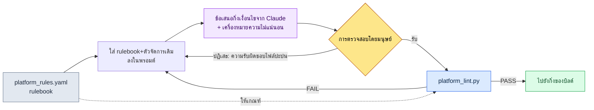

# 14.2 ความแตกต่างระหว่างแพลตฟอร์ม (iOS / Android / PC)

ในวันที่นำอัลฟาบิลด์ขึ้น PC เป็นครั้งแรก มีภาพหน้าจอภาพหนึ่งถูกโพสต์ลงในแชนเนลแชตภายในทีมออกแบบ จอยสติ๊กเสมือนที่บนมือถือเคยเต็มขอบล่างของหน้าจอ กลับลอยอยู่กลางจอมอนิเตอร์ขนาด 27 นิ้วเท่าฝ่ามือ มีคนหนึ่งเขียนต่อท้ายไว้บรรทัดเดียวว่า "อันนี้จะจับด้วยเมาส์ยังไง" ตรรกะแกนกลาง (core logic) ยังคงปกติดี ทั้งระบบต่อสู้ ทั้งกระเป๋าไอเทม ทั้งเควสต์ ก็ทำงานได้เหมือนเดิมทุกอย่าง สิ่งเดียวที่พังคือจุดที่ตรึงอินพุตและหน้าจอไว้บนสมมติฐานของมือถือ

หากนำเกมเดียวกันออกไปยังสามที่คือ iOS·Android·PC ดูเหมือนภาระการดำเนินงานจะกลายเป็น ×3 แต่ในความเป็นจริงไม่ได้เป็นเช่นนั้น ตรรกะแกนกลางมีเพียง 1 ชุด แล้วมีเลเยอร์ปรับตัวตามแพลตฟอร์ม (platform adaptation layer) มาเกาะอยู่เป็น ×3 ปัญหาคือ "ตรงไหนคือ core และตรงไหนเริ่มเป็นเลเยอร์ปรับตัว" เป็นสิ่งที่คนตัดสินทีละจุดได้ยาก กิ่งเงื่อนไขที่ทำงานบน iOS ได้แต่พังเฉพาะ Android, การแมปคีย์ที่มีความหมายเฉพาะบน PC — ความแตกต่างเหล่านี้ไม่ได้เข้าหัวได้หมด ดังนั้นแก่นของบทนี้คือเวิร์กโฟลว์ที่ **กำหนดข้อจำกัดของแพลตฟอร์มให้เป็นลายลักษณ์อักษรในรูปของ rulebook (กฎ/คู่มือกฎ)** แล้วให้ AI สร้างข้อเสนอกิ่งเงื่อนไขโดยอ้างอิงจาก rulebook นั้น และในขั้นสุดท้ายให้ **lint จับการละเมิดกฎ**

---

## 14.2.1 สามแพลตฟอร์มต่างกันตรงไหน

ก่อนอื่นมาดูภูมิประเทศของความแตกต่างกัน ด้านล่างคือตารางข้อจำกัดของแพลตฟอร์มที่จัดทำไว้ระหว่างพิจารณาการออกตัวเสริมบน PC ในโปรเจกต์ A (เกม MMORPG แบบมือถือเป็นหลักที่ผู้เขียนเข้าร่วมในฐานะ Design Director) ในบรรดาตัวเลข ค่าที่อ้างอิงจากมาตรฐานสาธารณะได้ระบุแหล่งที่มาไว้ด้วย ส่วนค่าอื่นเป็นค่าที่ตกลงกันภายในโปรเจกต์

| ขอบเขต | iOS | Android | PC |
|---|---|---|---|
| อินพุต | ทัช | ทัช (+คีย์บอร์ดบางส่วน) | คีย์บอร์ด·เมาส์·เกมแพด |
| ขนาดเป้าทัชต่ำสุด | 44pt (Apple HIG) | 48dp (Material) | คลิก — ไม่เกี่ยว |
| หน้าจอ | 4.7\~6.7 นิ้ว | 4.5\~7 นิ้ว (ผันแปรมาก) | 21\~32 นิ้ว |
| การชำระเงิน | App Store | Google Play | ของตนเอง·Steam |
| การแจ้งเตือน | APNs | FCM | OS·ของตนเอง |
| การจัดเก็บ | iCloud | Google Drive·ของตนเอง | Steam Cloud·ของตนเอง |
| รอบการเปลี่ยน OS | 1\~2 ปี | 1 ปี (แตกเป็นเสี่ยงมาก) | 5\~10 ปี |

iOS กับ Android มี *API* ของการชำระเงิน·การจัดเก็บ·การแจ้งเตือนที่ต่างกัน แต่หน้าจอและการควบคุมที่ผู้ใช้เห็นแทบจะเหมือนกัน ส่วน PC นั้นอินพุต·หน้าจอ·เอฟเฟกต์ทางสายตาต่างกันทั้งยวง ดังนั้นภาระการดำเนินงานจึงไม่ได้เป็น ×3 อย่างที่สัญชาตญาณบอก แต่ใกล้เคียง ×2 มากกว่า — เพราะระยะห่างระหว่าง iOS กับ Android นั้นสั้น

สิ่งที่สำคัญตรงนี้ไม่ใช่ตัวตารางเอง แต่คือการเปลี่ยนตารางนี้จาก **เอกสารที่คนอ่าน ให้กลายเป็น rulebook ที่เครื่องอ่าน** เพื่อให้ AI ใช้เป็นฐานในการสร้างข้อเสนอกิ่งเงื่อนไข และให้ lint จับการละเมิดได้

---

## 14.2.2 เส้นที่แบ่ง core ออกจากเลเยอร์แพลตฟอร์ม

โครงสร้างโฟลเดอร์ของโปรเจกต์ A เป็นรูปแบบที่นำเลเยอร์ปรับตัวตามแพลตฟอร์ม 3 ชุดมาเกาะกับ core 1 ชุด

```
game/
├── core/                  — ตรรกะเกม (ไม่ขึ้นกับแพลตฟอร์ม)
│   ├── combat/  inventory/  narrative/  ...
├── platform/              — เลเยอร์ปรับตัวตามแพลตฟอร์ม
│   ├── ios/      → input/  payment/  notification/
│   ├── android/  → input/  payment/  notification/
│   └── pc/       → input/  payment/  ui/
└── shared/                — ใช้ร่วมทั้งสองฝั่ง (ยูทิล·เรนเดอริง)
```

กฎมีเพียงข้อเดียว **core จะไม่เรียก platform ด้วยชื่อ** ทันทีที่ core มีประโยคอย่าง `if platform == "ios"` การแยกเลเยอร์ก็พังลง ยกตัวอย่างเรื่องอินพุต core รู้แค่เจตนาว่า "ใช้สกิล 1" (`InputIntent.SKILL_1`) เท่านั้น ส่วนการที่จะดึงเจตนานั้นมาจากพิกัดทัชหรือจากคีย์บอร์ดปุ่ม `1` เป็นความรับผิดชอบของเลเยอร์ platform แต่ละชุด

เมื่อขีดเส้นนี้ไว้ ขั้นถัดไปก็เป็นไปได้ เวลาเพิ่มแพลตฟอร์มใหม่ ไม่ต้องไปแตะ core แค่เติมโฟลเดอร์หนึ่งโฟลเดอร์ใต้ `platform/` ก็พอ ด้านล่างคือภาพที่แสดงในหน้าเดียวว่าเส้นนี้แยกออกจากกันอย่างไรในความเป็นจริง

<svg viewBox="0 0 720 360" xmlns="http://www.w3.org/2000/svg" font-family="sans-serif" font-size="13">
  <rect x="0" y="0" width="720" height="360" fill="#fbfbfd"/>
  <!-- core -->
  <rect x="270" y="20" width="180" height="70" rx="8" fill="#1d3557" />
  <text x="360" y="50" fill="#fff" text-anchor="middle" font-weight="bold">core/</text>
  <text x="360" y="70" fill="#cdd9e8" text-anchor="middle" font-size="11">ตรรกะเกม · ไม่ขึ้นกับแพลตฟอร์ม</text>
  <text x="360" y="84" fill="#cdd9e8" text-anchor="middle" font-size="11">InputIntent · PaymentInterface</text>
  <!-- arrows down -->
  <line x1="360" y1="90" x2="130" y2="150" stroke="#888" stroke-width="1.5" marker-end="url(#a)"/>
  <line x1="360" y1="90" x2="360" y2="150" stroke="#888" stroke-width="1.5" marker-end="url(#a)"/>
  <line x1="360" y1="90" x2="590" y2="150" stroke="#888" stroke-width="1.5" marker-end="url(#a)"/>
  <defs>
    <marker id="a" markerWidth="8" markerHeight="8" refX="6" refY="3" orient="auto">
      <path d="M0,0 L6,3 L0,6 Z" fill="#888"/>
    </marker>
  </defs>
  <!-- platform boxes -->
  <g>
    <rect x="40" y="150" width="180" height="120" rx="8" fill="#e8f0f8" stroke="#1d3557"/>
    <text x="130" y="173" text-anchor="middle" font-weight="bold" fill="#1d3557">platform/ios</text>
    <text x="130" y="196" text-anchor="middle" font-size="11">touch → intent</text>
    <text x="130" y="214" text-anchor="middle" font-size="11">StoreKit · APNs</text>
    <text x="130" y="232" text-anchor="middle" font-size="11">เป้า ≥ 44pt</text>
    <text x="130" y="256" text-anchor="middle" font-size="10" fill="#777">จัดเก็บที่ iCloud</text>
  </g>
  <g>
    <rect x="270" y="150" width="180" height="120" rx="8" fill="#e8f0f8" stroke="#1d3557"/>
    <text x="360" y="173" text-anchor="middle" font-weight="bold" fill="#1d3557">platform/android</text>
    <text x="360" y="196" text-anchor="middle" font-size="11">touch → intent</text>
    <text x="360" y="214" text-anchor="middle" font-size="11">Play Billing · FCM</text>
    <text x="360" y="232" text-anchor="middle" font-size="11">เป้า ≥ 48dp</text>
    <text x="360" y="256" text-anchor="middle" font-size="10" fill="#777">รับมือการแตกเป็นเสี่ยง</text>
  </g>
  <g>
    <rect x="500" y="150" width="180" height="120" rx="8" fill="#f8efe8" stroke="#9a4f1d"/>
    <text x="590" y="173" text-anchor="middle" font-weight="bold" fill="#9a4f1d">platform/pc</text>
    <text x="590" y="196" text-anchor="middle" font-size="11">key/mouse → intent</text>
    <text x="590" y="214" text-anchor="middle" font-size="11">Steam · การแจ้งเตือนจาก OS</text>
    <text x="590" y="232" text-anchor="middle" font-size="11">เกมแพด · UI แมปคีย์</text>
    <text x="590" y="256" text-anchor="middle" font-size="10" fill="#777">ความละเอียดหลากหลาย</text>
  </g>
  <!-- shared -->
  <rect x="270" y="300" width="180" height="44" rx="8" fill="#ddd" />
  <text x="360" y="327" text-anchor="middle" fill="#333">shared/ — ยูทิล·เรนเดอริง</text>
  <text x="360" y="290" text-anchor="middle" font-size="10" fill="#9a4f1d">PC ต่างทั้งยวงทั้งอินพุต·หน้าจอ·สายตา (สีส้ม)</text>
</svg>

กล่อง iOS กับ Android เป็นโทนสีน้ำเงินเดียวกัน มีเพียง PC ที่เป็นสีส้ม — แสดงขนาดของความแตกต่างด้วยสี ความไม่สมมาตรของภาระการดำเนินงานมองเห็นได้ในแวบเดียวตรงนี้

---

## 14.2.3 rulebook: ทำให้เครื่องอ่านความแตกต่างได้

จุดเปลี่ยนสำคัญอยู่ตรงนี้ หากเขียนข้อจำกัดของแพลตฟอร์มไว้ในเอกสารร้อยแก้ว คนก็จะลืม แทนที่จะทำเช่นนั้น ให้รวบรวมไว้ใน **ไฟล์ rulebook แบบประกาศ (declarative)** ไฟล์เดียว นี่คือส่วนที่ตัดมาจาก `platform_rules.yaml` ที่ใช้ในโปรเจกต์ A (คัดเฉพาะกฎหลักจากไฟล์จริงมาเพื่อบทนี้)

```yaml
# platform/platform_rules.yaml
targets:
  ios:
    min_touch_pt: 44          # Apple HIG
    contrast_ratio: 4.5       # WCAG SC1.4.3
    gamepad: optional         # มาตรฐาน iOS 17+
    forbidden_in_core: ["import platform.ios", "StoreKit", "APNs"]
  android:
    min_touch_dp: 48          # Material
    contrast_ratio: 4.5
    forbidden_in_core: ["import platform.android", "BillingClient", "FCM"]
  pc:
    min_target_px: 24         # WCAG SC2.5.8 (พอยน์เตอร์)
    input: ["keyboard", "mouse", "gamepad"]
    forbidden_in_core: ["import platform.pc", "SteamAPI"]
required_intents: ["MOVE_FORWARD", "ATTACK", "SKILL_1", "SKILL_2"]
```

ไฟล์นี้ทำสามอย่างพร้อมกัน (1) เป็น **สเปก** ที่ AI อ่านตอนสร้างข้อเสนอกิ่งเงื่อนไข (2) เป็น **เกณฑ์** ที่ lint ใช้ตรวจสอบ (3) เป็น **แหล่งข้อมูลเดียว (single source)** ที่คนบันทึกข้อตกลงไว้ `forbidden_in_core` สำคัญเป็นพิเศษ — เพราะเป็นรายการโทเค็นที่ห้ามปรากฏในโฟลเดอร์ core เด็ดขาด จึงเป็นฐานในการจับการรุกล้ำข้ามเลเยอร์ได้แบบกลไก

---

## 14.2.4 บันทึกเซสชันจริง (worked transcript): rulebook → ข้อเสนอกิ่งเงื่อนไขจาก AI → การตรวจสอบ

ตอนนี้มาตามงานจริงตั้งแต่ต้นจนจบ สถานการณ์เป็นเช่นนี้ ระหว่างเตรียมการออกตัวเสริมบน PC ต้องแยกตัวจัดการอินพุต (input handler) ที่เคยมีแต่บนมือถือออกมาเป็นเวอร์ชันสำหรับ PC โดยอ้างอิงจาก rulebook ขอร่างอแดปเตอร์อินพุต PC จาก Claude ตรวจสอบด้วย lint แล้ววนหนึ่งรอบจนถึงการปฏิเสธ·ขอใหม่

### 1) พรอมต์ (ฉบับเต็ม)

> ด้านล่างคือส่วนที่ตัดมาจาก rulebook แพลตฟอร์มของโปรเจกต์เรา และตัวจัดการอินพุต iOS เดิม
>
> [วาง platform_rules.yaml ส่วนที่ตัดมาด้านบน]
>
> ```python
> # platform/ios/input/touch_handler.py
> from core.input.input_intent import InputIntent
>
> def map_touch_to_intent(touch_event):
>     if touch_event.location in skill_button_1_area:
>         return InputIntent.SKILL_1
>     if touch_event.is_drag_up:
>         return InputIntent.MOVE_FORWARD
>     return None
> ```
>
> ช่วยสร้างร่าง `platform/pc/input/keyboard_handler.py` โดยอ้างอิงจากอันนี้ ข้อจำกัด: (1) ให้ import core ได้ แต่ห้าม import platform.ios/android เด็ดขาด (2) ต้องแมป `required_intents` ครบทั้ง 4 ตัว (3) ให้แยกการแมปคีย์ออกเป็น dict เพื่อให้ผู้ใช้เปลี่ยนได้ ส่วนไหนที่ไม่มั่นใจช่วยทำเครื่องหมายไว้ด้วย

### 2) ผลลัพธ์ดิบของ Claude (โดยไม่สรุปหรือเรียบเรียง)

> นี่คือร่าง ได้แยกการแมปคีย์ออกมาเป็น dict ที่ด้านบนของโมดูลเพื่อให้ผู้ใช้ปรับแต่งเองได้
>
> ```python
> # platform/pc/input/keyboard_handler.py
> from core.input.input_intent import InputIntent
>
> DEFAULT_KEYMAP = {
>     "w": InputIntent.MOVE_FORWARD,
>     "1": InputIntent.SKILL_1,
>     "2": InputIntent.SKILL_2,
>     # สมมติว่า ATTACK ใช้คลิกซ้ายของเมาส์ — ไม่ได้กำหนดค่าเริ่มต้นบนคีย์บอร์ด
> }
>
> def map_keyboard_to_intent(key_event, keymap=DEFAULT_KEYMAP):
>     return keymap.get(key_event.key.lower())
>
> def map_mouse_to_intent(mouse_event):
>     if mouse_event.button == "left":
>         return InputIntent.ATTACK
>     return None
> ```
>
> ⚠️ ส่วนที่ไม่มั่นใจ: ใน `required_intents` มี ATTACK อยู่ แต่ผมแมปสิ่งนี้ไปที่ **เมาส์** ไม่ใช่คีย์บอร์ด เนื่องจากไม่มีข้อกำหนดชัดเจนว่า `required_intents` ใน rulebook หมายถึง "แมปได้โดยไม่เกี่ยงอุปกรณ์อินพุตก็ถือว่าผ่าน" หรือ "ต้องจัดการให้ครบภายในตัวจัดการตัวเดียว" ผมจึงสมมติเป็นกรณีแรก ถ้าเป็นกรณีหลัง lint อาจจับว่า ATTACK ขาดหายไปได้

### 3) การตรวจสอบ/การปฏิเสธโดยมนุษย์

จุด ⚠️ ที่ Claude ชี้ไว้ตรงนี้คือกับดักพอดี lint ของเรา (`platform_lint.py`) ตรวจการครบถ้วนของ `required_intents` ในระดับ **แพลตฟอร์ม** ไม่ใช่ระดับ **ไฟล์** ของตัวจัดการ ถึงแม้ ATTACK จะไม่มีใน `keyboard_handler.py` แต่ถ้ามีอยู่ในฝั่ง `mouse_handler` ก็ถือว่าผ่าน ทว่าผลลัพธ์ที่ Claude สร้างออกมานั้นใส่การแมปเมาส์ไว้ในไฟล์ `keyboard_handler.py` รวมกันไปเลย — ความรับผิดชอบของไฟล์จึงปะปนกัน โครงสร้างจะผ่านก็จริง แต่ละเมิดกฎโฟลเดอร์ของเรา (แยกไฟล์ตามอุปกรณ์อินพุต) **ปฏิเสธ**

เหตุผลของการปฏิเสธชัดเจนในสองบรรทัด (1) ให้แยกการแมปเมาส์ออกเป็น `mouse_handler.py` ต่างหาก (2) ให้วาง `Space` เป็น fallback เพื่อให้ใช้ ATTACK บนคีย์บอร์ดได้ด้วย

### 4) ขอใหม่ → ผ่าน lint

หลังขอใหม่ ได้เวอร์ชันที่แยกแล้วมา จึงนำมารันผ่าน `platform_lint.py` lint อ่าน rulebook แล้วตรวจสิ่งต่อไปนี้

```
$ python platform_lint.py platform/pc/
[core-leak]    PASS  — โฟลเดอร์ core/ มีโทเค็น forbidden 0 รายการ
[intent-cover] PASS  — pc: MOVE_FORWARD, ATTACK, SKILL_1, SKILL_2 (4/4)
[touch-target] SKIP  — pc มี min_target_px=24 (ตรวจแยกที่เลเยอร์ UI)
[no-cross-import] PASS — platform.pc ไม่อ้างอิง platform.ios/android
```

การที่ `intent-cover` ออกมา 4/4 คือหัวใจ ว่าร่างที่ AI สร้างขึ้นเป็นไปตามเกณฑ์ของ rulebook หรือไม่ ถูกชี้ขาดด้วยสคริปต์ ไม่ใช่ด้วยสายตาคน บรรทัดเดียวนี้แทนที่งานที่คนต้องคอยตรวจคำนวณในหัวทุกครั้งในการดำเนินงานหลายแพลตฟอร์ม

หากบีบอัดวงรอบนี้ให้เป็นภาพ จะได้ดังนี้



จุดที่ rulebook ป้อนเกณฑ์ให้ **ทั้งสองฝั่ง** คือพรอมต์และ lint คือศูนย์กลางของโครงสร้างนี้ AI สร้าง คนตัดสิน และ lint ชี้ขาด — สามบทบาทมองที่ rulebook เดียวกัน

---

## 14.2.5 กิ่งของบิลด์: core เดียวกัน ประกอบต่างกัน

เมื่อตัวจัดการพร้อมแล้ว บิลด์ก็เป็นเพียงการประกอบอย่างเรียบง่าย core กับ shared คงที่ เปลี่ยนเฉพาะโฟลเดอร์ platform หนึ่งโฟลเดอร์

```
[core/ + shared/ + platform/ios/]      → บิลด์ iOS
[core/ + shared/ + platform/android/]  → บิลด์ Android
[core/ + shared/ + platform/pc/]       → บิลด์ PC
```

ใน CI ให้รันทั้งสามตัวนี้ **แบบขนาน ไม่ใช่ตามลำดับ** และรัน `platform_lint.py` อัตโนมัติทันทีหลังแต่ละบิลด์ ถ้ารันตามลำดับ เวลาบิลด์จะกลายเป็น 3 เท่า และถ้าตัด lint ออก การละเมิดกฎจะรอดมาจนถึงขั้นการเผยแพร่ บิลด์แบบขนาน + lint อัตโนมัติ สองสิ่งนี้คือเงื่อนไขขั้นต่ำของ CI แบบหลายแพลตฟอร์ม

เนื่องจากรอบการออกตัวต่างกันในแต่ละแพลตฟอร์ม จึงไม่ได้เผยแพร่พร้อมกันเพียงเพราะบิลด์ผ่าน การตรวจสอบของ iOS โดยปกติใช้เวลา 1\~3 วัน จึงระมัดระวังกับการออกตัวบ่อย ๆ ส่วน Android สะท้อนผลภายในไม่กี่ชั่วโมงจึงออกได้ถี่กว่า และ Steam อยู่ที่ราว 1\~2 วัน แม้จะเป็นการเปลี่ยนแปลงเดียวกัน iOS ก็เป็นตัวที่ออกช้าที่สุด ดังนั้นกำหนดการของฮอตฟิกซ์จึงคำนวณย้อนกลับโดยยึด iOS เป็นเกณฑ์เสมอ

---

## 14.2.6 ความแปรผันของ UI: ร่วม 80 · แปรผัน 15 · เฉพาะ 5

ใต้โค้ดลงไป หน้าจอก็แยกตัวเช่นกัน จากประสบการณ์ การกระจายที่แนะนำคือคอมโพเนนต์ร่วม 80% ความแปรผันตามแพลตฟอร์ม (ต่างกันแค่ขนาด·ตำแหน่ง) 15% และเฉพาะแพลตฟอร์ม 5% ทว่าอัตราส่วนนี้ผันแปรไปตามแนวเกม — ถ้าเป็นเกมพัซเซิลแคชวล ส่วนร่วมจะขึ้นไปถึง 90% และ MMORPG จะมีความแปรผันเพิ่มขึ้นเพราะความต่างของอินพุต

คอมโพเนนต์เฉพาะคือจุดที่ดึงเสน่ห์ของแพลตฟอร์มออกมา จึงไม่ใช่ว่าการทำให้เป็นส่วนร่วมเสมอไปคือคำตอบ สิ่งที่มีความหมายเฉพาะบนแพลตฟอร์มนั้น ๆ อย่างจอยสติ๊กเสมือน·การสั่นของมือถือ หรือ UI แมปคีย์·การตั้งค่าเกมแพดของ PC จะอยู่ตรงนี้ ทว่าหากเฉพาะแพลตฟอร์มเกิน 30% นั่นไม่ใช่เสน่ห์ แต่เป็นสัญญาณของภาระการดำเนินงาน — หากตั้งคำเตือน `platform-specific-ratio` ไว้ใน lint ถึงคนจะลืม บิลด์ก็จะคอยชี้ให้

มาถึงตรงนี้ก็เป็นเส้นขีดจำกัดของการที่ AI เข้ามาช่วยด้วยเช่นกัน ความแตกต่างของแพลตฟอร์มส่วนใหญ่เป็นขอบเขตของกฎเชิงกำหนด (deterministic) AI จึงถูกใช้ในการ **สร้าง** ข้อเสนอกิ่งเงื่อนไขที่เป็นไปตาม rulebook มากกว่าจะให้สำรวจตัวเลือกอย่างอิสระ การแนะนำการแมปอินพุต การแปลงแบบร่าง Figma เป็นความแปรผันตามแพลตฟอร์ม และการปรับข้อความให้เข้ากับหลายภาษา×หลายแพลตฟอร์ม เป็นจุดที่ AI ช่วยเติมได้จริง และผลลัพธ์นั้นต้องผ่าน lint เสมอ ก่อนจะก้าวไปสู่การทำงานอัตโนมัติแบบก้าวหน้า การมาตรฐานของอแดปเตอร์ต้องมาก่อน

---

## 14.2.7 คุณค่าของการแยก — และกับดักที่พบบ่อย

ผลที่ใหญ่ที่สุดของการแยกเลเยอร์คือ **ความเร็วในการเพิ่มแพลตฟอร์มใหม่** หากนำ PC มาเกาะโดยกองประโยค if ลงในโค้ดเบสเดียว ก็แทบจะเทียบเท่าต้นทุนในการสร้างเกมใหม่ แต่หากไม่แตะ core แค่เติม `platform/pc/` เวลานั้นก็ลดลงอย่างมาก อัตราที่การเพิ่มแพลตฟอร์มใหม่เร็วขึ้นนั้นต่างกันไปในแต่ละโปรเจกต์ จึงไม่ขอฟันธงตัวคูณที่ชัดเจน — เพียงแต่ในการพิจารณาภายในของเรา ประเมินว่ากำหนดการเพิ่ม PC แบบเสริมลดลงเหลือไม่ถึงครึ่งเมื่อเทียบกับสมมติฐานโค้ดเบสเดียว (การประมาณของผู้เขียน ยังไม่ได้ตรวจสอบ) ผลพลอยได้คือเหตุขัดข้องเฉพาะแพลตฟอร์มถูกแยกออกจากกัน และความน่าเชื่อถือของการเปลี่ยน core สูงขึ้น (แก้ที่เดียวก็สะท้อนผลอย่างสอดคล้องในทั้งสามบิลด์)

กับดักที่มักเหยียบและวิธีรับมือมีดังนี้

| กับดัก | วิธีรับมือ |
|---|---|
| กิ่งเงื่อนไข `if platform == ...` ใน core บานปลาย | สกัดด้วย lint `forbidden_in_core` แยกออกเป็นอแดปเตอร์ |
| ตรวจข้อเสนอกิ่งเงื่อนไขของ AI ด้วยสายตาคนเท่านั้น | ชี้ขาด intent-cover ด้วย `platform_lint.py` |
| ยัดการแมปอุปกรณ์อินพุตไว้ในไฟล์เดียว | แยกตัวจัดการตามอุปกรณ์ (keyboard/mouse) |
| คอมโพเนนต์เฉพาะ 30%+ | คำเตือน `platform-specific-ratio` พิจารณาทำเป็นส่วนร่วม |
| เผยแพร่ 3 แพลตฟอร์มพร้อมกันทันทีที่บิลด์ผ่าน | คำนวณย้อนกลับโดยยึด iOS ตามความต่างของรอบการออกตัว |

จุดร่วมของกับดักคือ "พยายามกันด้วยความทรงจำของคน" หากเขียนลงใน rulebook และดักด้วย lint ถึงคนจะลืม บิลด์ก็จะจำให้

---

### สรุปประเด็นสำคัญของบท
- ข้อจำกัดของแพลตฟอร์มต้องกำหนดเป็นลายลักษณ์อักษรในไฟล์ rulebook ไม่ใช่ร้อยแก้ว AI กับ lint จึงจะมองที่เกณฑ์เดียวกัน
- AI สร้างข้อเสนอกิ่งเงื่อนไขโดยอ้างอิงจาก rulebook คนตัดสิน และ lint ชี้ขาดความครบถ้วน
- ภาระการดำเนินงานไม่ได้เป็น ×3 แต่เป็น ×2 — เพราะระยะระหว่าง iOS·Android สั้น และมีเพียง PC ที่ไกล

### ตัวอย่างบทถัดไป
- 14.3 การออกแบบอินพุตทัช / เมาส์ — ความต่างเชิงแก่นของสองอินพุต

---

## ลองทำดู

**setup.** สร้าง `platform/platform_rules.yaml` ในโปรเจกต์ แล้วเขียน `min_touch`, `contrast_ratio`, `forbidden_in_core`, `required_intents` แยกตามแพลตฟอร์มดังส่วนที่ตัดมาด้านบน อย่ากุตัวเลขขึ้นมาเอง แต่ให้นำมาจากมาตรฐานสาธารณะ (มาตรฐานสาธารณะอย่างทัช 44pt·48dp·คอนทราสต์ 4.5:1 ให้ยึดตาม rulebook ใน §9.1; เป้าพอยน์เตอร์ PC 24px คือ WCAG SC2.5.8)

**prompt.** ใส่ส่วนที่ตัดจาก rulebook + ตัวจัดการของแพลตฟอร์มหนึ่งที่มีอยู่เดิมไปด้วยกัน แล้วร้องขอเช่นนี้ "ช่วยสร้างร่างตัวจัดการ `platform/<แพลตฟอร์มใหม่>/input/` โดยรักษา rulebook นี้ ห้ามใส่โทเค็น `forbidden_in_core` เด็ดขาด แมป `required_intents` ให้ครบทุกตัว และทำเครื่องหมาย ⚠️ ในส่วนที่ไม่มั่นใจ"

**verify.** รัน `platform_lint.py` (สคริปต์ยาว 40 บรรทัดก็เพียงพอ) ที่อ่าน rulebook แล้วตรวจสิ่งต่อไปนี้ (1) โทเค็น `forbidden_in_core` ในโฟลเดอร์ core 0 รายการ (2) แมป `required_intents` ครบทุกตัวตามแต่ละแพลตฟอร์ม (3) ไม่มี cross-import ระหว่างโฟลเดอร์ platform หากมีแม้แต่ FAIL เดียว ให้ย้อนกลับไปที่พรอมต์ เขียนเหตุผลของการปฏิเสธแล้วขอใหม่

### ฉบับย่อสำหรับคนเดียว
หากทำงานคนเดียวและไม่มี CI สำหรับบิลด์ ให้ลด rulebook จาก YAML เหลือเป็นเช็กลิสต์มาร์กดาวน์หน้าเดียว สามบรรทัดอย่าง "เป้า ≥44pt, ห้าม import แพลตฟอร์มใน core, แมปเจตนา 4 ตัว" ก็พอ แทนสคริปต์ lint ให้ส่งผลงานไปให้ AI แล้วสั่งว่า "ช่วยตัดสินเช็กลิสต์ 3 ข้อนี้ทีละข้อว่าผ่าน/ไม่ผ่าน" ก็จะทำหน้าที่แทนการตรวจคำนวณของคนได้ หัวใจไม่ได้อยู่ที่ขนาดของเครื่องมือ — แต่อยู่ที่การเขียนเกณฑ์ไว้นอกหัว และแยกการสร้างออกจากการตรวจสอบ
