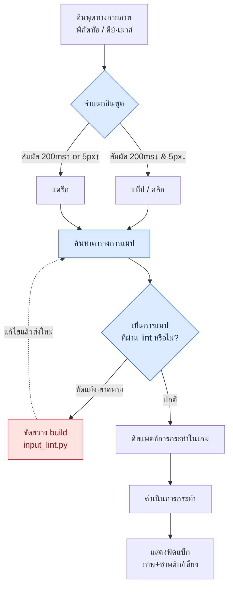

# 14.3 การออกแบบอินพุตแบบทัช / เมาส์

สมาชิกทีม B ที่เพิ่งได้รับ QA build มา ถือโทรศัพท์ด้วยมือเดียวพลางขมวดคิ้ว "กดสกิลสามครั้ง แต่ออกแค่สองครั้งเองครับ" เมื่อมองเข้าไปที่หน้าจอก็พบว่า ในจังหวะที่นิ้วโป้งกดปุ่มสกิลนั้น นิ้วเดียวกันนั้นได้บัง 1/3 ของพื้นที่ข้างปุ่มเอาไว้ มันเป็นปัญหาที่ไม่เคยเกิดขึ้นแม้แต่ครั้งเดียวเมื่อทดสอบด้วยเมาส์ เพราะเมาส์ไม่มีนิ้ว

ภาพนี้สรุปแก่นแท้ของทัชและเมาส์ได้ในบรรทัดเดียว ทั้งสองอย่างเป็นอินพุตแบบ "ชี้ไปยังจุดหนึ่ง" เหมือนกัน แต่อันหนึ่งเครื่องมือที่ใช้ชี้นั้นบังหน้าจอ ส่วนอีกอันไม่บัง เหตุผลที่ต้องคลี่คลายการกระทำเดียวกันให้แตกต่างกันในสองอินพุตเริ่มต้นจากตรงนี้ ในบทนี้เราจะเริ่มจากการสรุปความแตกต่างของสองอินพุตก่อน จากนั้นจะติดตามแกนหลักของบันทึกเซสชันจริง (worked transcript) หนึ่งเส้นจนจบ ซึ่งเป็นกระบวนการรับข้อเสนอการแมปอินพุตจาก AI แล้วตรวจสอบความขัดแย้ง (conflict) และการเข้าถึง (reachability) ด้วยตนเอง

---

## 14.3.1 ความแตกต่างเชิงแก่นแท้ของสองอินพุต

ทั้งความหนาของนิ้ว การบังสายตา ขีดจำกัดของมัลติทัช และความแม่นยำ ล้วนแตกต่างกันทั้งหมด ก่อนจะตรึงเป็นกฎด้วยตาราง เรามาจับสัมผัสด้วยภาพหนึ่งภาพกันก่อน เคอร์เซอร์เมาส์คือปลายปากกาขนาด 1 พิกเซล ส่วนนิ้วคือตราประทับที่มีเส้นผ่านศูนย์กลางเกือบ 1 เซนติเมตร ปลายปากกาเขียนตัวอักษรได้ แต่ครั้งละหนึ่งตัว ตราประทับประทับได้เร็ว แต่เขียนตัวอักษรไม่ได้ และในขณะที่ประทับลงไปก็มองไม่เห็นกระดาษ

| คุณสมบัติ | ทัช | เมาส์ |
|---|---|---|
| ความแม่นยำ | ประมาณ 7\~10mm (พื้นที่สัมผัสของนิ้ว) | หน่วย 1px |
| การบังสายตา | นิ้วบังบริเวณรอบจุดสัมผัส | ไม่มี |
| โฮเวอร์ได้ | แทบเป็นไปไม่ได้ (สัมผัส = อินพุต) | อิสระ (เคลื่อนที่ ≠ อินพุต) |
| อินพุตพร้อมกัน | มัลติทัช 2\~10 จุด | ซ้าย·ขวา·กลาง·ล้อ |
| แยกแดร็ก/แท็ป | ต้องอนุมานจากเวลา·ระยะทาง | คลิก/แดร็กชัดเจน |
| ฟีดแบ็กแบบฮาพติก | ได้ | แทบไม่มี |

ในที่นี้ สองบรรทัดที่ส่งผลต่อการออกแบบมากที่สุดคือ "การบังสายตา" และ "โฮเวอร์" การบังสายตาบังคับว่าจะต้องแสดงผลลัพธ์ไว้ตรงไหน ส่วนการไม่มีโฮเวอร์หมายความว่าบนมือถือ ช่องทางข้อมูลหนึ่งช่องที่เรียกว่าทูลทิป (tooltip) หายไปทั้งช่อง อีกสี่บรรทัดที่เหลือนั้นใกล้เคียงกับรายละเอียดที่แตกแขนงออกมาจากสองบรรทัดนี้

มาตรฐานสาธารณะตอกตรึงความแตกต่างนี้ไว้เป็นตัวเลข — มาตรฐานสาธารณะอย่างทัช 44pt (HIG)·48dp (Material)·คอนทราสต์ 4.5:1·เป้าหมายทัช 24 พิกเซล CSS (WCAG SC2.5.8) เป็นไปตามรูลบุ๊ก §9.1 ตัวเลขเหล่านี้ไม่ใช่รสนิยม แต่เป็นผลผลิตของร่างกายมนุษย์และการวัด ดังนั้นไม้บรรทัดที่จะนำมาวัดเมื่อตรวจสอบการแมปก็คือมาตรฐานเหล่านี้ในที่สุด

## 14.3.2 การแมปตามการกระทำในเกม

เมื่อคลี่คลายสามการกระทำ คือ เคลื่อนที่·โจมตี·สกิล ด้วยสองอินพุต ก็จะแยกออกได้ดังนี้ การที่หนึ่งการกระทำมีวิธีอย่างละสามแบบ ไม่ได้หมายความว่าไม่มีคำตอบที่ถูกต้อง แต่หมายความว่าอัตลักษณ์ของเกมเป็นตัวบังคับการเลือก

- เคลื่อนที่ — ทัช: ⓐจอยสติ๊กเสมือน (ฝั่งซ้าย) ⓑแท็ปหน้าจอ→เคลื่อนที่อัตโนมัติ ⓒแดร็ก→หมุนกล้อง / เมาส์: ⓐWASD ⓑคลิก→เคลื่อนที่อัตโนมัติ ⓒเคลื่อนเมาส์→มุมมอง
- โจมตี — ทัช: ⓐแท็ปปุ่มโจมตี ⓑแท็ปศัตรู→โจมตีอัตโนมัติ ⓒสไวป์→คอมโบ / เมาส์: ⓐคลิกซ้าย ⓑคลิกศัตรู→โจมตีอัตโนมัติ ⓒกดรัว→คอมโบ
- สกิล — ทัช: ⓐแท็ปสล็อต ⓑกดสล็อตค้างเพื่อเล็ง ⓒเจสเจอร์ / เมาส์: ⓐปุ่ม 1\~8 ⓑปุ่ม+เมาส์เล็ง ⓒมาโคร

โปรเจกต์ A (MMORPG ที่ให้มือถือมาก่อน) ที่ผู้เขียนทำอยู่ ในส่วนของการเคลื่อนที่ มือถือเลือกใช้แบบไฮบริด ⓐ+ⓑ (ใช้จอยสติ๊กควบคู่กับเคลื่อนที่อัตโนมัติ) ส่วน PC เลือกใช้ WASD+เคลื่อนที่อัตโนมัติ การโจมตี มือถือใช้ ⓑ+ⓐ (แท็ปศัตรูแล้วกดปุ่ม) ส่วน PC เลือกใช้ ⓐ·ⓑ ได้อย่างอิสระ สกิล มือถือใช้ ⓐ หรือเมื่อทาร์เก็ตติงก็ใช้ ⓑ ส่วน PC วางการเล็งด้วยเมาส์ทับลงบนปุ่ม 1\~8 การที่เกมเดียวกัน การกระทำเดียวกัน แต่ออกมาเป็นตารางการแมปสองแผ่น คือสาระทั้งหมดของบทนี้

ปัญหาอยู่ที่ว่ายิ่งตารางการแมปยาวขึ้น ความขัดแย้งก็ยิ่งซ่อนตัว จะเกิดอะไรขึ้นหากการกดสล็อตค้าง (เล็งสกิล) กับการแดร็กหน้าจอ (หมุนกล้อง) มาทับซ้อนกันในพื้นที่เดียวกัน หากปุ่ม 1\~8 ถูกจองไว้สำหรับสกิลแล้ว แต่มีคนเสนอให้คีย์ลัดของอินเวนทอรีเป็น 1 ด้วยล่ะ การกวาดสายตาดูตารางด้วยตามนุษย์นั้นพลาดได้ ดังนั้นจึงจำเป็นต้องมีเวิร์กโฟลว์ที่รับข้อเสนอการแมปจาก AI แต่มอบหมายการตรวจสอบให้กับเครื่องมือ

## 14.3.3 บันทึกเซสชันจริง — ข้อเสนอการแมปจาก AI และการตรวจสอบด้วย lint

จากตรงนี้ไปคือแกนหลักของบทนี้ เราจะยกกระบวนการทั้งวงจรหนึ่งรอบมาตรงๆ ตั้งแต่รับข้อเสนอร่างการแมปคีย์บอร์ด/เมาส์ของ PC จาก Claude จากนั้นมนุษย์ตรวจสอบผลลัพธ์นั้น รัน lint ตรวจความขัดแย้ง·การเข้าถึงเพื่อปฏิเสธ แล้วร้องขอใหม่ เราจะไม่สรุปย่อ ในผลลัพธ์ดิบมีความผิดพลาดปนอยู่ด้วย และสิ่งที่เราต้องการเห็นคือกระบวนการในการจับความผิดพลาดนั้น

### พรอมต์ (ฉบับเต็ม)

> คุณคือผู้ออกแบบการแมปอินพุตของ PC MMORPG จงเสนอ JSON ที่แมปรายการการกระทำด้านล่างลงบนคีย์บอร์ด/เมาส์
>
> การกระทำ: เคลื่อนที่ (หน้าหลังซ้ายขวา), วิ่ง, กระโดด, โจมตีพื้นฐาน, สกิล1\~8, อินเวนทอรี, แผนที่, หน้าต่างตัวละคร, เมนู, สลับล็อกมุมมอง, ซูมเข้า/ซูมออก, เมนูบริบท (การกระทำเสริม), สลับเคลื่อนที่อัตโนมัติ
>
> ข้อจำกัด:
> - ทำตามธรรมเนียมของวงการ (เคลื่อนที่ด้วย WASD, เมนูด้วย ESC เป็นต้น)
> - อย่าวางสองการกระทำซ้อนทับลงบนคีย์/ปุ่มทางกายภาพเดียวกัน
> - แต่ละรายการมีฟิลด์ `action`, `input`, `note`
> ผลลัพธ์เป็น JSON array เท่านั้น

### ผลลัพธ์ดิบจาก Claude (ตามจริง ไม่แตะต้อง)

```json
[
  {"action": "move_forward",  "input": "W",      "note": "เคลื่อนที่มาตรฐาน"},
  {"action": "move_back",     "input": "S",      "note": "เคลื่อนที่มาตรฐาน"},
  {"action": "move_left",     "input": "A",      "note": "เคลื่อนที่มาตรฐาน"},
  {"action": "move_right",    "input": "D",      "note": "เคลื่อนที่มาตรฐาน"},
  {"action": "run",           "input": "Shift",  "note": "วิ่งระหว่างที่กดค้าง"},
  {"action": "jump",          "input": "Space",  "note": "มาตรฐาน"},
  {"action": "attack_basic",  "input": "Mouse1", "note": "การกระทำหลักด้วยคลิกซ้าย"},
  {"action": "skill_1",       "input": "1",      "note": ""},
  {"action": "skill_2",       "input": "2",      "note": ""},
  {"action": "skill_3",       "input": "3",      "note": ""},
  {"action": "skill_4",       "input": "4",      "note": ""},
  {"action": "skill_5",       "input": "5",      "note": ""},
  {"action": "skill_6",       "input": "6",      "note": ""},
  {"action": "skill_7",       "input": "7",      "note": ""},
  {"action": "skill_8",       "input": "8",      "note": ""},
  {"action": "inventory",     "input": "I",      "note": "ยก Tab ให้การสลับเป้าหมาย"},
  {"action": "map",           "input": "M",      "note": ""},
  {"action": "character",     "input": "C",      "note": ""},
  {"action": "menu",          "input": "Escape", "note": "มาตรฐาน"},
  {"action": "cam_lock",      "input": "Mouse3", "note": "สลับล็อกมุมมองด้วยคลิกล้อ"},
  {"action": "zoom_in",       "input": "WheelUp",   "note": ""},
  {"action": "zoom_out",      "input": "WheelDown", "note": ""},
  {"action": "context_menu",  "input": "Mouse2", "note": "การกระทำเสริมด้วยคลิกขวา"},
  {"action": "auto_move",     "input": "Mouse2", "note": "เคลื่อนที่อัตโนมัติด้วยดับเบิลคลิกขวา"}
]
```

ผลลัพธ์ดูสะอาดตา เพราะเช่นนั้นจึงอันตราย ดูสองบรรทัดล่างสุด `context_menu` และ `auto_move` ถูกจองไว้บน `Mouse2` (คลิกขวา) ทั้งคู่ ทั้งที่ในข้อจำกัดได้ระบุไว้ชัดเจนว่า "อย่าวางสองการกระทำซ้อนทับบนคีย์เดียว" แต่โมเดลก็ยังซ้อนทับลงไป โดยแปะข้อแก้ตัวว่า "แยกแยะได้ด้วยดับเบิลคลิก" ลงในฟิลด์ `note` นี่คือเหตุผลที่ห้ามนำผลลัพธ์ของ AI ใส่เข้าไปใน build ตรงๆ เมื่อมนุษย์กวาดสายตาดูตาราง ก็มักจะพลาดความขัดแย้งระหว่างบรรทัดที่ 22 และ 23 จากทั้งหมด 23 บรรทัดได้ง่าย และโมเดลก็หาเหตุผลให้กับความขัดแย้งของตัวเอง

เพราะเช่นนั้นเราจึงมอบหมายการตรวจสอบให้กับโค้ดแทนสายตา เรารัน lint เล็กๆ ที่ตรวจสอบความขัดแย้ง (อินพุตเดียวกันซ้ำ) และการเข้าถึง (การกระทำที่จำเป็นขาดหาย, อยู่นอกมุมที่นิ้วโป้งสองข้างเอื้อมถึง)

```python
# input_lint.py — ตรวจสอบความขัดแย้ง·การเข้าถึงของการแมปอินพุต
import json, sys
from collections import defaultdict

REQUIRED = {"move_forward","move_back","move_left","move_right",
            "attack_basic","menu","inventory","map"}

def lint(mapping):
    errors, warns = [], []
    seen = defaultdict(list)
    for m in mapping:
        seen[m["input"]].append(m["action"])
    # 1) ความขัดแย้ง: มีการกระทำตั้งแต่ 2 รายการบนอินพุตเดียวกัน
    for inp, acts in seen.items():
        if len(acts) > 1:
            errors.append(f"CONFLICT  {inp} <- {', '.join(acts)}")
    # 2) การเข้าถึง: การกระทำที่จำเป็นขาดหาย
    actions = {m["action"] for m in mapping}
    for r in sorted(REQUIRED - actions):
        errors.append(f"MISSING   required action '{r}'")
    # 3) เตือนเมื่อ note ว่าง (ไม่ได้ระบุเจตนาการออกแบบ)
    for m in mapping:
        if not m["note"].strip():
            warns.append(f"NO_NOTE   {m['action']} ({m['input']})")
    return errors, warns

data = json.load(open(sys.argv[1], encoding="utf-8"))
errs, warns = lint(data)
for e in errs:  print("[ERROR]", e)
for w in warns: print("[WARN] ", w)
print(f"\n=> {len(errs)} error(s), {len(warns)} warning(s)")
sys.exit(1 if errs else 0)
```

เมื่อบันทึก JSON ข้างต้นเป็น `claude_map.json` แล้วรัน lint ผลลัพธ์จริงเป็นดังนี้

```
[ERROR] CONFLICT  Mouse2 <- context_menu, auto_move
[WARN]  NO_NOTE   skill_1 (1)
[WARN]  NO_NOTE   skill_2 (2)
[WARN]  NO_NOTE   skill_3 (3)
... (skill_4~8 เหมือนกัน)

=> 1 error(s), 8 warning(s)
```

lint จับความขัดแย้งเพียงหนึ่งเดียวที่ตามนุษย์พลาดไปได้อย่างแม่นยำ การตรวจการเข้าถึงผ่าน (มีการกระทำที่จำเป็นครบทั้ง 8 รายการ) `note` ว่าง 8 รายการเป็นเพียงคำเตือนและไม่ขัดขวาง build แต่ก็เผยให้เห็นหนี้ของการไม่ได้ระบุเจตนาการออกแบบ ทีนี้เราก็ถือเหตุผลในการปฏิเสธส่งกลับไปยังโมเดล

### การปฏิเสธของมนุษย์ + การร้องขอใหม่

> จากผล lint `Mouse2` มี context_menu กับ auto_move ทับซ้อนกัน จึงปฏิเสธ การแยกด้วยดับเบิลคลิกทำให้เกิดดีเลย์ที่คลิกขวา และจะทำงานผิดพลาดระหว่างการต่อสู้ จงแยก auto_move ออกไปเป็นอินพุตต่างหาก อีกทั้ง note ของ skill_1\~8 ว่างเปล่า — จงเติมว่าแต่ละสล็อตเป็นสกิลตระกูลใดให้บรรทัดละหนึ่งบรรทัด

### ผลลัพธ์ใหม่จาก Claude (ตัดมาเฉพาะส่วนที่แก้ความขัดแย้ง)

```json
  {"action": "context_menu", "input": "Mouse2",      "note": "คลิกขวา = การกระทำเสริม/บริบทโดยลำพัง"},
  {"action": "auto_move",    "input": "Numpad0",     "note": "สลับเคลื่อนที่อัตโนมัติ, แยกออกจากคีย์การต่อสู้ทางกายภาพ"},
  ...
  {"action": "skill_1", "input": "1", "note": "ท่าหลักระยะประชิด"},
  {"action": "skill_8", "input": "8", "note": "ท่าหลบฉุกเฉิน/ท่าเอาตัวรอด — นิ้วก้อยเอื้อมถึงเป็นขีดจำกัด จึงพิจารณาย้ายไป Q"}
```

บรรทัดสุดท้ายของผลลัพธ์ใหม่น่าสนใจ โมเดลรายงานปัญหาการเข้าถึงด้วยตัวเองว่า "ปุ่ม 8 เป็นขีดจำกัดที่นิ้วก้อยเอื้อมถึง" นี่เป็นหัวข้อเดียวกันเป๊ะกับการตรวจสอบการเข้าถึงที่เราจะกล่าวถึงในหัวข้อถัดไป เมื่อรัน lint อีกครั้งก็ผ่านด้วย `0 error(s)` แก่นสำคัญคือสิ่งนี้ AI สร้างร่าง 23 บรรทัดได้อย่างรวดเร็ว แต่ความถูกต้องตามกฎของร่างนั้นได้รับการรับประกันโดยกฎที่มนุษย์นิยาม (เซต REQUIRED, นิยามความขัดแย้ง) และโดยโค้ด ข้อเสนอมาจากโมเดล การตัดสินมาจากเครื่องมือ การตัดสินใจมาจากมนุษย์

## 14.3.4 การไหลของอินพุต — จากการแมปจนไปถึงหน้าจอ

หากวาดเส้นทางที่อินพุตทางกายภาพหนึ่งครั้งถูกแปลงเป็นการกระทำในเกมไว้ ก็จะเห็นว่า lint ข้างต้นแทรกอยู่ที่จุดใด



อินพุตทางกายภาพที่เข้ามาจากมุมบนซ้ายจะถูกจำแนกก่อนว่าเป็นแท็ปหรือแดร็ก (ตามเกณฑ์ 200ms/5px ของหัวข้อถัดไป) อินพุตที่ถูกจำแนกแล้วจะค้นหาตารางการแมป โดยจุดสำคัญของภาพนี้คือ ตารางนั้นต้องผ่าน `input_lint.py` ก่อนที่จะเข้าไปใน build หากมีความขัดแย้งหรือขาดหาย ก็จะไปถึงขั้นตอนดิสแพตช์ไม่ได้และถูกขัดขวาง การตรวจสอบการแมปต้องจบที่ build gate ก่อนถึงรันไทม์

## 14.3.5 หลัก 5 ข้อของการออกแบบทัช

ทีนี้สมมติว่าการแมปผ่านแล้ว เราจะออกแบบพื้นผิวที่การแมปนั้นมาบรรจบกับนิ้ว

**หลักข้อ 1 — พื้นที่ทัชขั้นต่ำ** Apple HIG 44pt, Material 48dp คือขีดล่าง บนหน้าจอ HD หากตั้งไว้ที่ราว 100px (200px ในสภาพแวดล้อมเรตินา 2 เท่า) ก็จะตอบสนองทั้งสองมาตรฐานได้พร้อมกัน หากต่ำกว่านี้ลงไป "กดสามครั้งออกสองครั้ง" ในบทนำข้างต้นก็จะปรากฏออกมาเป็นสถิติ

**หลักข้อ 2 — พื้นที่เอื้อมของนิ้วโป้ง** MMORPG บนมือถือใช้การจับสองมือในแนวนอนเป็นมาตรฐาน องค์ประกอบที่ต้องกดวางไว้ที่มุมล่างทั้งสองข้าง·ของบริโภค/สล็อตวางไว้ตรงกลางด้านล่าง (พื้นฐานของโมเดลสามพื้นที่อยู่ที่ §9.1) การกระทำ P0 (ซ้าย=เคลื่อนที่, ขวา=โจมตี·สกิล) วางไว้ภายในสองมุมล่างซ้าย·ขวา ส่วนข้อมูลที่ไม่ค่อยได้มองวางไว้ด้านบนนอกขีดจำกัดที่เอื้อมถึง ประเด็นสำคัญในการออกแบบอินพุตคือ แม้รวมสองมุมเข้าด้วยกันก็ยังไม่ถึงครึ่งหน้าจอ SVG ถัดไปแสดงพื้นที่เอื้อมของนิ้วโป้งสองมือและแถบสล็อตตรงกลางด้านล่างในโหมดแนวนอน

<svg viewBox="0 0 420 240" xmlns="http://www.w3.org/2000/svg" role="img" aria-label="พื้นที่เอื้อมของนิ้วโป้งสองมือในโหมดแนวนอน">
  <rect x="10" y="10" width="400" height="220" rx="14" fill="#f7f7fa" stroke="#333" stroke-width="2"/>
  <!-- ฝั่งซ้าย รูปพัดของนิ้วโป้ง -->
  <path d="M 30 230 A 150 150 0 0 1 180 80 L 30 80 Z" fill="#3a7bd5" opacity="0.20"/>
  <path d="M 30 230 A 95 95 0 0 1 125 135 L 30 135 Z" fill="#3a7bd5" opacity="0.40"/>
  <!-- ฝั่งขวา รูปพัดของนิ้วโป้ง -->
  <path d="M 390 230 A 150 150 0 0 0 240 80 L 390 80 Z" fill="#d5533a" opacity="0.20"/>
  <path d="M 390 230 A 95 95 0 0 0 295 135 L 390 135 Z" fill="#d5533a" opacity="0.40"/>
  <!-- พื้นที่สี่เหลี่ยมตรงกลางด้านบน -->
  <rect x="150" y="22" width="120" height="50" rx="6" fill="#999" opacity="0.18"/>
  <text x="210" y="52" font-size="12" text-anchor="middle" fill="#444">ด้านบน = นอกพื้นที่เอื้อม (แสดงข้อมูล)</text>
  <!-- แถบสล็อตตรงกลางด้านล่าง (สีอำพัน — ของบริโภค·ควิกสล็อต) -->
  <rect x="160" y="178" width="100" height="36" rx="6" fill="#f59e0b" opacity="0.35" stroke="#f59e0b" stroke-width="1.5" stroke-dasharray="4 3"/>
  <text x="210" y="200" font-size="10" text-anchor="middle" fill="#92400e">กลางล่าง = ของบริโภค·ควิกสล็อต</text>
  <text x="78" y="205" font-size="12" text-anchor="middle" fill="#1c4a8a">โป้งซ้าย</text>
  <text x="342" y="205" font-size="12" text-anchor="middle" fill="#8a2a1c">โป้งขวา</text>
  <text x="78" y="160" font-size="10" text-anchor="middle" fill="#1c4a8a">สบาย</text>
  <text x="342" y="160" font-size="10" text-anchor="middle" fill="#8a2a1c">สบาย</text>
  <text x="210" y="225" font-size="11" text-anchor="middle" fill="#555">พื้นที่เข้ม = วางปุ่ม P0 / พื้นที่จาง = ขีดจำกัดที่เอื้อมถึง</text>
</svg>

รูปพัดสีเข้มคือจุดที่นิ้วโป้งเอื้อมถึงได้โดยไม่ฝืน รูปพัดสีจางคือขีดจำกัดที่ต้องเหยียดมือไปจึงจะถึง หาก "ขีดจำกัดของนิ้วก้อยที่ปุ่ม 8" ที่โมเดลรายงานในผลลัพธ์ใหม่ที่ 14.3.3 เป็นฉบับ PC ความผิดพลาดที่ฉบับมือถือทำคือการวางปุ่ม P0 ไว้ในพื้นที่สีจางนี้พอดี

**หลักข้อ 3 — หลีกเลี่ยงการบังสายตา** นิ้วไม่ได้บังแค่จุดสัมผัส แต่มือทั้งมือยังคลุมบังหน้าจอเหนือจุดนั้นขึ้นไป เมื่อแท็ปสกิลที่มุมล่างขวา มุมล่างขวาประมาณ 1/4 ก็จะมองไม่เห็น เพราะเช่นนั้นผลลัพธ์ของการกระทำ (ตัวเลขดาเมจ, การเปลี่ยนสถานะ) จึงต้องแสดงในพื้นที่ที่นิ้วเอื้อมไม่ถึง มือที่กุมจอยสติ๊กฝั่งซ้ายจะรุกล้ำตำแหน่งของตัวละครและมินิแมป จึงย้ายมินิแมปไปไว้มุมบนขวา

**หลักข้อ 4 — แยกแดร็ก/แท็ป** ทัชต่างจากเมาส์ตรงที่ต้องอนุมานเจตนาของผู้ใช้จากเวลาและระยะทาง เราจะรวมให้เป็นเกณฑ์เดียวกันทั้งเกม — ตัวอย่างเช่น หากสัมผัสภายใน 200ms และเคลื่อนภายใน 5px ถือเป็นแท็ป มากกว่านั้นถือเป็นแดร็ก หากสองตัวเลขนี้กระท่อนกระแท่น ความล้มเหลวของเจตนาอย่าง "ตั้งใจจะแท็ปแต่ตัวละครกลิ้ง" ก็จะสะสมขึ้น จุดแยกในไดอะแกรม mermaid ข้างต้นคือการตัดสินนี้พอดี

**หลักข้อ 5 — ฮาพติก** การสั่นเป็นช่องทางเดียวที่ส่งถึงผู้ใช้ได้แม้ไม่มองหน้าจอ แต่หากให้การสั่นกับทุกอินพุตก็จะกลายเป็นสัญญาณรบกวน แท็ปทั่วไปไม่สั่น, ใช้สกิลสั่นสั้น, การกระทำเสี่ยงอย่างยืนยันการชำระเงินสั่นแรง, สังหารศัตรูสั่นแผ่วเบา — บริหารให้อยู่ภายใน 4\~5 แบบ

## 14.3.6 หลัก 5 ข้อของการออกแบบเมาส์

เมาส์ได้เพลิดเพลินกับความหรูหราสามอย่างที่ทัชไม่มี นั่นคือ โฮเวอร์, ปุ่มหลายปุ่ม, และความแม่นยำของเคอร์เซอร์

**หลักข้อ 1 — โฮเวอร์** เมาส์ชี้ได้โดยไม่ต้องกด เมื่อวางเมาส์ลงบนสล็อตสกิล ทูลทิปชื่อ·คูลดาวน์·คำอธิบายก็จะปรากฏ และเมื่อคลิกจึงจะใช้งาน ทัชไม่มีสถานะกึ่งกลางนี้ ดังนั้นโฮเวอร์จึงเป็นช่องทางที่ PC สามารถวางข้อมูลเพิ่มได้ แต่ต้องตระหนักไว้ล่วงหน้าตั้งแต่ขั้นตอนการแมปที่ 14.3.3 ว่าข้อมูลที่พึ่งพาแต่โฮเวอร์อย่างเดียวจะไม่มีที่ไปในฉบับมือถือ

**หลักข้อ 2 — ปุ่มหลายปุ่ม** คลิกซ้ายคือการกระทำหลัก, คลิกขวาคือเสริม/บริบท, คลิกล้อคือรีเซ็ตมุมมอง, ล้อคือซูม ความขัดแย้งที่ lint ข้างต้นจับได้ก็คือกรณีที่วางสองการกระทำซ้อนกันบนคลิกขวานี้พอดี การพยายามเติมให้เต็มเพราะมีปุ่มเยอะกลับสร้างความขัดแย้งขึ้น

**หลักข้อ 3 — มาตรฐานคีย์บอร์ด** ESC=เมนู, M=แผนที่, 1\~8=สกิล, WASD=เคลื่อนที่, Shift=วิ่ง, Space=กระโดด ผู้ใช้ต้องเดาได้โดยไม่ต้องเรียนรู้ คีย์ที่เบี่ยงออกจากมาตรฐานก็ให้ระบุเหตุผลที่สมควรลงใน `note` ดังตัวอย่างการตัดสินใจที่ 14.3.3 ที่ยก Tab ให้การสลับเป้าหมายแทนอินเวนทอรี

**หลักข้อ 4 — การควบคุมมุมมอง** หมุนมุมมองด้วยการแดร็กเมาส์ แต่ให้สลับโหมดเกมที่ล็อกเคอร์เซอร์ไว้ที่หน้าจอกับโหมด UI ที่ปลดเคอร์เซอร์อย่างชัดเจน หากการสลับนี้คลุมเครือ ก็จะเกิดความสับสนแบบปิดเมนูแล้วเคอร์เซอร์หายไป

**หลักข้อ 5 — ขอบเขตอนุญาตมาโคร·อัตโนมัติ** การอนุญาตให้โจมตีอัตโนมัติ·เคลื่อนที่อัตโนมัติได้ถึงไหนเป็นเรื่องของอัตลักษณ์เกม หากปล่อยมากเกินไป PC ก็จะกลายเป็นหน้าจอมาโคร และหากปิดกั้นแบบไม่มีเงื่อนไข กำแพงการเข้าถึงของผู้ใช้ที่ข้ามมาจากมือถือก็จะสูงขึ้น คำตอบคือการเลือกจุดใดจุดหนึ่งในสเปกตรัมให้เข้ากับสีสันของเกม ไม่ใช่สุดขั้วทั้งสองด้าน

## 14.3.7 ส่วนร่วมของทั้งสองฝั่ง — รวมฟีดแบ็กอินพุตให้เป็นหนึ่ง

หลักการต่างกันไปตามแต่ละแพลตฟอร์ม แต่ "ความรู้สึก" ที่ผู้ใช้ได้รับจากการกระทำเดียวกันต้องเหมือนกันแม้แพลตฟอร์มจะเปลี่ยนไป อย่าทำให้ผู้ใช้ที่ข้ามจากมือถือมาสู่ PC ต้องเรียนรู้ความหมายของการสว่างขึ้นของปุ่มใหม่อีกครั้ง

| สถานการณ์ | ทัช | เมาส์ |
|---|---|---|
| รับรู้อินพุต | ปุ่มสว่าง + ฮาพติกสั้น | ปุ่มสว่าง + เสียงคลิก |
| อินพุตล้มเหลว | ปุ่มสั่น + ฮาพติก | ปุ่มสั่น + เสียงเตือน |
| คูลดาวน์ดำเนินอยู่ | เกจวงกลม | เกจวงกลม |
| ฟื้นพร้อมใช้งาน | สว่าง + ฮาพติก | สว่าง + เสียง |

ช่องทางภาพ (สว่าง·สั่น·เกจ) เหมือนกันทั้งสองฝั่ง มีเพียงช่องทางเสริมเท่านั้นที่แยกเป็นฮาพติก↔เสียงให้เข้ากับแพลตฟอร์ม ความสอดคล้องนี้ช่วยลดต้นทุนการเรียนรู้ของผู้ใช้ข้ามแพลตฟอร์มลงครึ่งหนึ่ง

## 14.3.8 ความล้มเหลวที่พบบ่อยและการแก้

| รูปแบบ | การแก้ |
|---|---|
| ปุ่มต่ำกว่าขีดล่างมาตรฐาน (44pt/48dp) | บังคับให้อยู่ราว 100px |
| แสดงผลลัพธ์ในพื้นที่ที่นิ้วบัง | ย้ายไปพื้นที่ที่ไม่ถูกบัง |
| ใช้ฮาพติกพร่ำเพรื่อ | ภายใน 4\~5 แบบ |
| ซ้อนสองการกระทำบนคลิกขวา | ขัดขวางความขัดแย้งด้วย lint แล้วแยก |
| ยกข้อมูลเฉพาะโฮเวอร์ไปไว้บนมือถือตรงๆ | มือถือใช้ช่องทางทดแทนเป็นแท็ป/แท็ปค้าง |
| ตรึงการแมปคีย์ตายตัว | อนุญาตให้ผู้ใช้ปรับแต่งเอง |
| บังคับให้การแมปเหมือนกันทั้งสองแพลตฟอร์ม | ใช้การแมปที่เป็นธรรมชาติตามแต่ละแพลตฟอร์ม |

บรรทัดที่สี่ของตารางนี้คือบทสรุปของบันทึกเซสชันจริงที่ 14.3.3 ความขัดแย้งของคลิกขวานั้นแทบทุกครั้งจะถูกพลาดเมื่อกวาดสายตาดูตารางด้วยตามนุษย์ และแทบทุกครั้งจะถูกจับได้หากแขวน lint ไว้ที่ build gate

---

### สรุปประเด็นสำคัญของบท
- ทัชคือตราประทับที่นิ้วบังหน้าจอ เมาส์คือปลายปากกาที่ไม่บัง — หากยก UX ของฝั่งหนึ่งไปวางตรงๆ ก็จะขัดกับมือ
- การแมปอินพุตให้ AI เสนอ แต่ความขัดแย้ง·การเข้าถึงให้ lint ตัดสิน — ตามนุษย์พลาดความขัดแย้งหนึ่งบรรทัดจากทั้งหมด 23 บรรทัด
- ช่องทางภาพของฟีดแบ็กรวมเป็นหนึ่งทั้งสองแพลตฟอร์ม มีเพียงช่องทางเสริมที่แยกเป็นฮาพติก↔เสียง

### ตัวอย่างบทถัดไป
- 15.1 Live Ops — วงจรที่เกมมีชีวิตอยู่ต่อหลังเปิดตัว

---

### ลองทำดู (setup → prompt → verify)

1. **setup** — จัดรายการการกระทำและข้อจำกัดไว้ในไฟล์เดียว (เคลื่อนที่·โจมตี·สกิล·UI·มุมมอง) วาง `input_lint.py` ข้างต้นไว้ในโปรเจกต์ เปลี่ยนเซต `REQUIRED` ให้เป็นการกระทำที่จำเป็นของเกมคุณเอง
2. **prompt** — ใช้พรอมต์ฉบับเต็มที่ 14.3.3 ตรงๆ โดยเปลี่ยนแค่รายการการกระทำ กำหนดให้รับผลลัพธ์เป็น JSON array เท่านั้น
3. **verify** — รัน JSON ที่ได้ด้วย `python input_lint.py claude_map.json` ระบุเหตุผลในการปฏิเสธ (อินพุตที่ขัดแย้ง·การกระทำที่ขาดหาย) เพื่อร้องขอใหม่จนกว่า ERROR จะเป็น 0 ส่วน WARN (note ว่าง) ให้บันทึกแยกไว้เป็นหนี้ของการไม่ได้ระบุเจตนาการออกแบบ

### ฉบับย่อสำหรับคนเดียว
หากเป็นเกมเล็กๆ ที่ทำคนเดียว ก็ลดเครื่องมือลง หากการกระทำมีไม่เกิน 10 อย่าง lint 20 บรรทัดที่เหลือไว้แค่สองอย่างคือเซต `REQUIRED` และการตรวจสอบ "อินพุตเดียวกันซ้ำ" ก็เพียงพอ รับการแมปจาก AI กรองแค่ความขัดแย้งด้วยมินิ lint นี้ แล้วลองกดบนเครื่องจริงสักครั้งว่านิ้วโป้ง (หรือนิ้วก้อย) เอื้อมถึงหรือไม่ ข้อเสนอจากโมเดล, การตัดสินความขัดแย้งจากโค้ด, การตัดสินการเอื้อมถึงจากมือของคุณเอง — เพียงรักษาสามอย่างนี้ไว้ก็ใช้ได้ไม่ว่าจะขนาดเท่าใด
