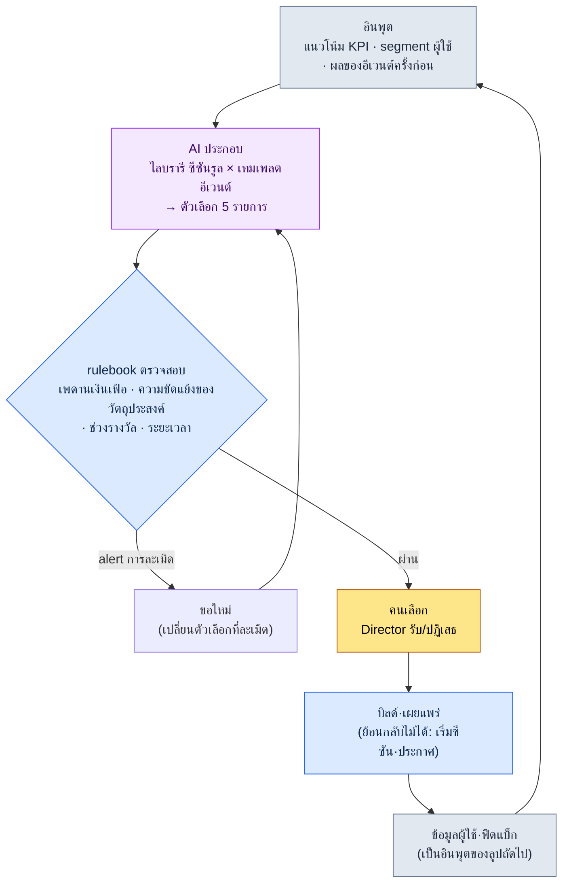

# 15.1 ภาพรวมการให้บริการเกม (Live Ops) — AI ประกอบตัวเลือกอีเวนต์ rulebook คัดกรอง และคนเลือก

> ผู้อ่านหลัก: นักออกแบบเกม (Game Designer) ที่รับผิดชอบการให้บริการเกม (Live Ops) หลังเปิดตัวเป็นครั้งแรก (ทีมขนาดกลาง 10\~50 คน)
> ฉบับย่อสำหรับผู้อ่านคนเดียว/มือสมัครเล่น: §15.1.7 「ถ้าทำคนเดียว เท่านี้ก็พอ」
>
> **ข้อตั้งต้น**: ผู้เขียนเคยผ่านการให้บริการเกม (Live Ops) ของเกมมือถือ MMORPG ที่เปิดตัวระดับโลก รวมถึงระบบเศรษฐกิจ P2E (Play To Earn) ด้วย แล้วนำประสบการณ์นั้นมาผสมกับเวิร์กโฟลว์ AI ก่อนเปิดตัวของโปรเจกต์ปัจจุบันในการเขียนบทนี้ บันทึกเซสชันจริง (worked transcript) คือผลของการรันรูปแบบ "อินพุต → AI ประกอบ → rulebook ตรวจสอบ → คนเลือก" ในรูปแบบของการให้บริการเกม (Live Ops) จริงหนึ่งครั้ง สิ่งที่เป็นการประมาณและการสังเกตได้ระบุไว้ชัดเจนว่าเป็นการประมาณหรือการสังเกต และไม่ได้ใส่ตาราง KPI ที่กุขึ้น

เช้าวันถัดจากเปิดตัว ออฟฟิศจะต่างไปจากช่วงก่อนเปิดตัว แม้มายล์สโตนจะจบลงแล้ว งานกลับไม่ได้ลดลง ตรงกันข้าม หน่วยของงานยิ่งย่อยลงเท่านั้น กำหนดการที่เคยจัดเป็นรายไตรมาสถูกซอยลงเป็นหน่วยสัปดาห์ วัน และชั่วโมง แล้วทุกสัปดาห์ก็มีคำถามเดิมวกกลับเข้ามาในห้องประชุม "สุดสัปดาห์นี้จะรันอีเวนต์อะไรดี"

หากคำถามนี้เริ่มต้นใหม่จากกระดาษเปล่าทุกสัปดาห์ ทีมให้บริการเกม (Live Ops) ก็จะหมดแรงในไม่ช้า บทนี้กล่าวถึงวิธีดึงคำถามนั้นออกจากกระดาษเปล่า แก่นมีสองข้อ ข้อแรก แทนที่จะคิดอีเวนต์และซีซันขึ้นใหม่ทุกครั้ง ให้สะสมไว้เป็น **ไลบรารีของรูปแบบที่ผ่านการตรวจสอบแล้ว** ข้อสอง งานร่างต้นฉบับที่น่าเบื่ออย่าง "ประกอบรูปแบบเหล่านั้นเป็นตัวเลือก 5 รายการสำหรับสัปดาห์หน้า" ให้ AI ทำ ส่วนคนตัดสินใจแค่ว่า **จะรับตัวเลือกใดในบรรดาตัวเลือกที่ผ่านการตรวจสอบของ rulebook** ภาระงานของการสร้างจากศูนย์กับการเลือกจาก 5 รายการนั้นต่างกัน

---

## 15.1.1 การให้บริการเกม (Live Ops) ไม่ใช่ 'ความรู้สึก' แต่เป็น 'ลูป'

มีหนังสือจำนวนมากให้ท่องจำวงจรมาตรฐานของการให้บริการเกม (Live Ops) เป็นตาราง เรื่องที่ว่ารายงานในวันจันทร์ เตรียมงานในวันอังคารพุธ และปล่อยในวันศุกร์ ทั้งหมดถูกต้อง แต่การท่องแค่ตารางไม่ทำให้เห็นว่าการตัดสินใจที่วกกลับมาทุกสัปดาห์อย่าง "อีเวนต์สัปดาห์นี้" ถูกตัดสินอย่างไร แก่นแท้ของการให้บริการเกม (Live Ops) ไม่ใช่ตารางเวลา แต่เป็น **ลูปปิด** — หนึ่งรอบที่ตัวเลือกถูกสร้างขึ้น ผ่านการตรวจสอบ คนเลือก ออกไปเป็นบิลด์ แล้วข้อมูลผู้ใช้กลับมาเป็นอินพุตของตัวเลือกถัดไป

บนลูปนี้ แกนทั้ง 4 ของการให้บริการเกม (Live Ops) (เนื้อหา·อีเวนต์·การปรับสมดุล·CS) หมุนด้วยความเร็วของตนเอง เนื้อหาเป็นหน่วยเดือนถึงไตรมาส อีเวนต์เป็นหน่วยสัปดาห์ถึงเดือน การปรับสมดุลเป็นหน่วยสัปดาห์ถึงสองสัปดาห์ และ CS เป็นหน่วยวันและชั่วโมง หากแกนทั้ง 4 หมุนแยกกัน แม้จะดูข้อมูลผู้ใช้ชุดเดียวกัน การตัดสินใจก็จะออกมาต่างกันทุกสัปดาห์ ด้วยเหตุนี้ เป้าหมายของบทนี้คือการมัดแกนทั้ง 4 เข้าเป็นลูปเดียว แล้วทำให้ช่องหนึ่งของลูปนั้น (การสร้างตัวเลือกอีเวนต์) อยู่ในรูปแบบที่ AI รันได้



ที่ที่มือของคนเข้าไปถึงมีเพียงสองจุด จุดบนสุดที่ใส่อินพุต (KPI·segment·ผลในอดีต) ให้สะอาด และจุดที่ตัดสินว่าจะปล่อยตัวเลือกใดในบรรดาตัวเลือกที่ผ่านการตรวจสอบ ส่วนงานน่าเบื่อระหว่างนั้นอย่าง "คิดตัวเลือกประกอบ 5 รายการ" และ "คัดกรองการละเมิดรูล" ให้ AI และ rulebook รัน และบรรทัดล่างสุดหนึ่งบรรทัด — ข้อที่ว่าข้อมูลผู้ใช้ซึ่งสร้างจากอีเวนต์ที่ออกไปเป็นบิลด์จะกลับมาเป็นอินพุตอีกครั้ง — คือสิ่งที่ทำให้ลูปนี้เป็นการให้บริการเกม (Live Ops) อย่างแท้จริง การออกแบบก่อนเปิดตัวพอออกไปครั้งหนึ่งก็จบ แต่ในการให้บริการเกม (Live Ops) ผลลัพธ์จะกลายเป็นอินพุตถัดไป

รายละเอียดของสองไลบรารีที่เข้าสู่ลูปนี้ (ซีซันรูล·เทมเพลตอีเวนต์) อยู่ใน §15.2 ส่วนช่องสุดท้าย (การจัดประเภทฟีดแบ็กผู้ใช้อัตโนมัติ) อยู่ใน §15.3 บทนี้มุ่งเน้นที่การเดินลูปให้ครบหนึ่งรอบจนจบ

---

## 15.1.2 [บันทึกเซสชันจริง (worked transcript)] ประกอบตัวเลือกอีเวนต์ 5 รายการ → rulebook ตรวจสอบ → คนเลือก

ในที่นี้จะแสดงหนึ่งรอบจริงจนจบว่ารันอย่างไร ด้านล่างคือการจำลองเซสชันที่ผู้เขียนนำรูปแบบ "ประกอบไลบรารี → rulebook ตรวจสอบ → คนเลือก" ซึ่งได้ตรวจสอบในเครื่องมือเนื้อหาก่อนเปิดตัว มาย้ายลงในรูปแบบของการให้บริการเกม (Live Ops) (ซีซันรูล + เทมเพลตอีเวนต์) แล้วรันจริงหนึ่งครั้ง พรอมต์อินพุตคัดลอกไปใช้ได้ตามนั้น ส่วนเอาต์พุตเป็นการเรียบเรียงเซสชันนั้นขึ้นใหม่

### ขั้นที่ 1 — อินพุต: โยนไลบรารีและสถานการณ์ปัจจุบันเข้าไปตามนั้น

ก่อนอื่นวางวัตถุดิบสองอย่างของการประกอบไว้ในรูปแบบที่เครื่องอ่านได้ คือ ไลบรารีเทมเพลตอีเวนต์ (รูปแบบที่ผ่านการตรวจสอบแล้ว) ไลบรารีซีซันรูล และสถานการณ์ปัจจุบันของสัปดาห์นี้ (KPI·segment) ไลบรารีเมื่อสร้างไว้ครั้งหนึ่งแล้วก็นำกลับมาใช้ได้ทุกสัปดาห์

```yaml
# event_templates.yaml — ไลบรารีเทมเพลตอีเวนต์ที่ผ่านการตรวจสอบแล้ว (คัดมาแสดง 4 จาก 9 รายการ)
- id: tpl_attendance      # รางวัลเช็กชื่อ
  목적: [ผู้เล่นใหม่, ดึงผู้เล่นหลับกลับ]
  기간_권장: 7~14일
  보상등급: ต่ำ~กลาง
- id: tpl_coop_raid       # เรดแบบร่วมมือ
  목적: [กระตุ้นผู้เล่นเดิม, คอมมูนิตี้]
  기간_권장: 3~7일
  보상등급: กลาง~สูง
- id: tpl_pvp_season      # ซีซันแข่งขัน
  목적: [คอมมูนิตี้, กระตุ้นผู้เล่นเดิม]
  기간_권장: 14~28일
  보상등급: สูง
- id: tpl_limited_package # แพ็กเกจจำกัด
  목적: [รายได้]
  기간_권장: 3~7일
  보상등급: สูง (ผูกกับการชำระเงิน)

# season_rules.yaml — ชิ้นส่วนซีซันรูล (คัดมาแสดง)
season_inflation_cap: อีเวนต์รางวัลระดับ 'สูง' ต่อไตรมาส ≤ 3 ครั้ง
purpose_conflict_rule: ห้ามอีเวนต์วัตถุประสงค์ [รายได้] 2 รายการพร้อมกันในสัปดาห์เดียว
overlap_rule: ห้ามอีเวนต์รางวัล 'สูง' 2 รายการพร้อมกัน (ความล้า·เงินเฟ้อ)

# current_state.yaml — สถานการณ์สัปดาห์นี้
주차: 2026-W23
직전2주_매출이벤트: 1 ครั้ง (สะสมไตรมาสระดับ 'สูง' 2 ครั้ง)
DAU_추이: ลดลงอย่างค่อยเป็นค่อยไป (4 สัปดาห์ที่ผ่านมา -6%, ตามการสังเกตในวงการอยู่ในช่วง 'เฝ้าระวัง')
주요_segment: สัดส่วนกลุ่มผู้เล่นหลับ ที่มีโอกาสกลับมา เพิ่มขึ้น
다가오는_외부일정: ไม่มี
```

### ขั้นที่ 2 — พรอมต์: สั่งให้ประกอบ แต่บังคับรูปแบบและรูล

```
ใช้ yaml ของเทมเพลต·ซีซันรูล·สถานการณ์สัปดาห์นี้ที่แนบมา ประกอบเป็นตัวเลือกอีเวนต์สำหรับสัปดาห์หน้าแค่ 5 รายการ
อย่าสร้างกลไกใหม่ ใช้เพียงการประกอบเทมเพลตที่แนบมาเท่านั้น ระบุเองว่าละเมิดซีซันรูลหรือไม่
และแนบเหตุผลคนละหนึ่งบรรทัดว่าทำไมแต่ละตัวเลือกจึงเหมาะกับสัญญาณตอนนี้ (DAU ลดลง·ผู้เล่นหลับกลับมา)
กระจายไม่ให้วัตถุประสงค์เอนไปทางรายได้อย่างเดียว และตัวที่กำกวมให้ทำเครื่องหมายส่งกลับมาให้ฉัน
ทำเป็นตารางเท่านั้น ช่องคือ ตัวเลือก·การประกอบเทมเพลต·วัตถุประสงค์หลัก·ระยะเวลา·การละเมิดรูล·เหตุผล·กำกวม
```

ขอให้สังเกตว่าในกฎห้าบรรทัดนั้น ไม่มีบรรทัดใดบอกว่า "จะสร้างอะไร" ทั้งหมดเป็นข้อจำกัดว่า "ภายในกรอบใด ตอบโดยอ้างอะไรเป็นเหตุผล" เพราะหากให้อิสระแก่ AI มันจะคายอีเวนต์เฉลี่ยของ RPG ทั่วไปออกมา **จำกัดวัตถุดิบให้อยู่ในไลบรารี (กฎ 1) บังคับให้ตรวจสอบซีซันรูลด้วยตนเอง (กฎ 2) บังคับให้มีเหตุผลตอบสนองต่อสัญญาณปัจจุบัน (กฎ 3) กระจายวัตถุประสงค์ (กฎ 4) และทางออกที่ว่า "ถ้ากำกวมให้ส่งต่อให้คน" (กฎ 5)** — ห้าบรรทัดนี้รวมกันเป็นการกำหนดไม่ใช่รูปร่างของตัวเลือก แต่เป็นคุณสมบัติของตัวเลือก

### ขั้นที่ 3 — เอาต์พุตของ Claude (เรียบเรียงใหม่, คัดมาแสดง)

ด้านล่างคือเอาต์พุตดิบที่ไม่ได้ย่อ มีการละเมิดรูลและการแจ้งความกำกวมปะปนกัน

```
| 후보 | 템플릿조합              | 주목적     | 기간  | 룰위반 | 근거                                       | 애매 |
|-----|------------------------|-----------|-------|--------|--------------------------------------------|------|
| C1  | tpl_attendance         | ดึงผู้เล่นหลับกลับ | 10일  | ไม่มี  | ตอบโจทย์โดยตรงต่อสัดส่วนกลุ่มหลับที่กลับมาเพิ่มขึ้น รางวัล 'กลาง' | -    |
| C2  | tpl_coop_raid          | กระตุ้นผู้เล่นเดิม | 5일   | ไม่มี  | สร้างแรงจูงใจล็อกอินช่วง DAU ลด กระตุ้นคอมมูนิตี้     | -    |
| C3  | tpl_attendance+tpl_coop_raid | ดึงผู้เล่นหลับกลับ+กระตุ้น | 7일 | ไม่มี | เช็กชื่อดึงกลับ + เรดยึดผู้เล่นไว้ ซินเนอร์จีเมื่อรวม | -  |
| C4  | tpl_pvp_season         | คอมมูนิตี้ | 21일  | ไม่มี  | ซีซันยาวดันเส้นโค้งการคงอยู่ขึ้นทั้งเส้น       | ★    |
| C5  | tpl_limited_package    | รายได้     | 5일   | ★ละเมิด | สะสมไตรมาสระดับ 'สูง' 2 ครั้ง → เพิ่มอีกจะใกล้/เกินเพดาน | -    |

ผลการตรวจสอบรูล:
- C5: เสี่ยงละเมิด season_inflation_cap อีเวนต์รางวัลระดับ 'สูง' ไตรมาสนี้
  มีแล้ว 2 ครั้ง หาก C5 เพิ่มอีกจะเป็น 3 ครั้งซึ่งติดขอบเพดาน การผลักดันรายได้
  ในช่วง DAU ลดอาจเพิ่มความล้าของผู้ใช้ และยังสวนทางกับสัญญาณด้วย
- C4: ไม่มีการละเมิดรูล แต่ซีซัน PvP 21 วันไม่ใช่แค่สัปดาห์นี้สัปดาห์เดียว
  แต่กินเวลา 3 สัปดาห์ ต้องใช้การตัดสินเชิงนโยบายปฏิบัติการว่าเหมาะเป็น
  'ตัวเลือกสัปดาห์นี้' หรือไม่ → ทำเครื่องหมายกำกวม
- C1·C2·C3 ผ่านรูล สอดคล้องกับสัญญาณปัจจุบัน (หลับ·DAU)
```

ส่วนที่มีคุณค่าที่สุดในเอาต์พุตไม่ใช่ตาราง แต่เป็น **สามบรรทัดผลการตรวจสอบรูลที่ล่างสุด** AI จับการละเมิดเงินเฟ้อของ C5 ได้เองและทำเครื่องหมายไว้ ส่วน C4 บอกว่า "ไม่ใช่การละเมิด แต่ความเห็นแตก" แล้วส่งต่อให้คน พรอมต์ที่ดีทำให้ AI สามารถแจ้งขีดจำกัดของตนเองและส่งลูกต่อให้คนได้

### ขั้นที่ 4 — การตรวจสอบและการเลือก (ที่ที่เป็นของคน)

อย่ารับเอาต์พุตนี้มาตามนั้น ตีด้วย rulebook อีกครั้งหนึ่ง แล้วจึงให้คนเลือก ในเซสชันนี้มีสองเรื่องที่แยกทางกันจริง

ก่อนอื่น **C5 คือการปฏิเสธ** AI ทำเครื่องหมายการละเมิดเงินเฟ้อไว้แล้ว และโค้ด rulebook (§15.1.3) ก็ตัดสินแบบเดียวกัน มันติดเพดานระดับ 'สูง' ของไตรมาส และในช่วง DAU ลด การผลักดันรายได้สวนทางกับสัญญาณปัจจุบัน ไม่มีอะไรให้ถกเถียง ตัดออก

ถัดมาคือ **C4 (ซีซัน PvP 21 วัน)** เป็นจุดที่ AI ส่งต่อด้วย "กำกวม" ไม่มีการละเมิดรูล แต่นี่ไม่ใช่ "อีเวนต์สัปดาห์นี้" แต่เป็น "การตัดสินใจเรื่องซีซัน" ไม่ใช่ประเด็นที่จะตัดสินทันทีในลูปขนาดหนึ่งสัปดาห์ แต่ต้องยกขึ้นไปยังการประชุมรวมซีซัน ดังนั้นจึงพักไว้จากตัวเลือกของสัปดาห์นี้ และแยกออกไปเป็นวาระของปฏิทินซีซันต่างหาก

ในบรรดา C1·C2·C3 ที่เหลือ Director เป็นผู้เลือก ตัวที่เข้ากับสัญญาณปัจจุบัน (สัดส่วนกลุ่มผู้เล่นหลับที่มีโอกาสกลับมาเพิ่มขึ้น + DAU ลดลงอย่างค่อยเป็นค่อยไป) ได้ดีที่สุดคือ **C3 (เช็กชื่อ+เรดร่วมมือ รวมกัน)** ซินเนอร์จีของการดึงกลุ่มหลับเข้ามาด้วยการเช็กชื่อ แล้วยึดผู้ใช้ที่ดึงเข้ามาไว้ด้วยเรด สอดคล้องกับสัญญาณของสัปดาห์นี้ ส่วน C1·C2 เก็บไว้ในพูลตัวเลือกของสัปดาห์หน้า

ยังมีตัวเลือกอีกหนึ่งที่ยังไม่จบ ณ จุดนี้ เมื่อตัดสินรับ C3 แล้ว ระยะเวลา 7 วันไปทับกับวันปิดปรับปรุงเซิร์ฟเวอร์ตามรอบที่กำลังจะมาถึงหนึ่งวัน จึงมีการขอใหม่หนึ่งรอบ

```
รับ C3 แต่วันสุดท้ายในช่วง 7 วันไปทับกับวันปิดปรับปรุงตามรอบ
ปรับระยะเวลาแล้วเสนอใหม่ เพื่อไม่ให้การปิดปรับปรุงไปตัดการเข้าร่วมช่วงท้ายของอีเวนต์
คงปริมาณรางวัลรวมไว้เท่าเดิม ขยับเฉพาะกำหนดการให้เร็วขึ้น
```

AI ตอบกลับมาใหม่โดยเลื่อนวันเริ่มต้นให้เร็วขึ้นหนึ่งวันเพื่อให้จบก่อนการปิดปรับปรุง และการปรับนั้นผ่าน rulebook หนึ่งรอบของ อินพุต → AI ประกอบ → rulebook ตรวจสอบ → คนเลือก → การปรับกำหนดการใหม่ ปิดลงที่นี่

หนึ่งรอบนี้คือเกณฑ์ Show ของทั้งเล่มนี้ หากไม่เคยดูจนจบสักครั้งว่า AI ประกอบอะไร rulebook คัดกรองอะไร คนเลือกอะไรและปฏิเสธอะไร ประโยคที่ว่า "ดึงตัวเลือกอีเวนต์ด้วย AI" ก็จะกลวงเปล่า

---

## 15.1.3 ทำ rulebook เป็นโค้ด — ตรวจสอบตัวเลือกอัตโนมัติ

หากดูด้วยตาทุกสัปดาห์ว่าตัวเลือกรักษาซีซันรูลไว้หรือไม่ ก็จะพลาดอีก ในบรรดาสามรูลของ §15.1.2 สิ่งที่ตัดสินได้ด้วยตัวเลขให้โค้ดเป็นผู้ตรวจ คนใช้เวลาเฉพาะกับ "กำกวม" และ "การเลือก" ที่โค้ดจับไม่ได้เท่านั้น

```python
# event_lint.py — ตรวจสอบตัวเลือกอีเวนต์สำหรับสัปดาห์หน้า (โครงร่าง)
# อินพุต: รายการตัวเลือกที่ AI ประกอบ + ซีซันรูล + สถานะสะสมไตรมาส
# เอาต์พุต: รายการการละเมิดรูล (ไม่ใช่การปฏิเสธอัตโนมัติ แต่เป็น alert)

def lint(candidates, season, quarter_state):
    issues = []
    high_used = quarter_state["high_reward_count"]  # จำนวนสะสมระดับ 'สูง' ในไตรมาส
    for c in candidates:
        # กฎ A: เพดานเงินเฟ้อ (ระดับ 'สูง' ต่อไตรมาส ≤ 3)
        if c["보상등급"] == "고" and high_used + 1 > season["inflation_cap"]:
            issues.append(f"[A] {c['id']}: เพิ่มระดับ 'สูง' จะเกินเพดานไตรมาส "
                          f"{season['inflation_cap']}회 초과 (현재 {high_used})")
        # กฎ B: ห้ามวัตถุประสงค์ [รายได้] 2 รายการในสัปดาห์เดียวกัน
    sales = [c for c in candidates if "매출" in c["목적"]]
    if len(sales) > 1:
        issues.append(f"[B] [매출] 목적 후보 {len(sales)}개 동시 → 1개로 제한")
        # กฎ C: วัตถุประสงค์เอนเอียง (ถ้าวัตถุประสงค์หนึ่งเกินครึ่งใน 5 รายการ = กระจายไม่พอ)
    from collections import Counter
    top = Counter(c["주목적"] for c in candidates).most_common(1)[0]
    if top[1] > len(candidates) // 2:
        issues.append(f"[C] 목적 '{top[0]}' {top[1]}개 쏠림 (분산 부족)")
    return issues
```

โค้ดนี้สรุปการเถียงกันไปมาในที่ประชุมอย่าง "รางวัลนี้แรงเกินไปหรือเปล่า" ให้จบด้วยตัวเลขหนึ่งบรรทัด หากโค้ดพิมพ์ออกมาว่า `[A] tpl_limited_package: '고'등급 추가 시 분기 한도 3회 초과 (현재 2)` ก็ไม่มีอะไรให้ถกเถียง ตัดออกก็พอ นี่คือการย้าย lint gate ที่กล่าวถึงใน §14.1 (HUD บนมือถือ) มาสู่ระดับการให้บริการเกม (Live Ops) — การแบ่งงานที่ว่าสิ่งที่จับได้ด้วยความเป็นเชิงกำหนด (deterministic) ให้โค้ดทำ ส่วนสิ่งที่ต้องใช้การตัดสินให้คนรับ ตั้งอยู่ได้เช่นเดิมในงานปฏิบัติการด้วย

แต่มีสิ่งหนึ่งที่ต่างออกไป lint นี้แม้พบการละเมิด ก็ **ไม่ทิ้งตัวเลือกโดยอัตโนมัติ** มันแค่ยก alert ขึ้นมาเท่านั้น เป็นการออกแบบแบบเดียวกับที่เห็นใน §6.2 (เครื่องสร้างเมือง) หากติดการตรวจสอบแบบปฏิเสธอัตโนมัติ เครื่องจะฆ่าแม้กระทั่งการดัดแปลงที่ตั้งใจไว้ (เช่น การตัดสินใจของแคมเปญที่จงใจใส่อีเวนต์รายได้ทั้งที่รู้ถึงเพดานไตรมาส) ให้เครื่องดึงตัวเลือกที่น่าสงสัยออกมา แต่จะฆ่าหรือไว้ชีวิตให้ Director เป็นผู้ตัดสิน การปฏิเสธ C5 ใน §15.1.2 ก็ไม่ใช่ lint เป็นผู้ฆ่า แต่เป็นการตัดสินใจที่คนกำหนดหลังเห็น alert ของ lint

---

## 15.1.4 ก่อนเปิดตัวกับหลังเปิดตัว — อะไรเปลี่ยนไป

จุดที่ลูปข้างต้นต่างจากลูปการออกแบบก่อนเปิดตัวอย่างชี้ขาดมีสองข้อ แทนที่จะนำมาเรียงเป็นตาราง ขอชี้เพียงสองข้อนี้อย่างแม่นยำ

ข้อแรก **ผลลัพธ์กลายเป็นอินพุตถัดไป** ก่อนเปิดตัว เมื่อเขียนเอกสารออกแบบเกม (GDD) แล้ว ทุกอย่างไหลทิศทางเดียวไปจนถึงบิลด์ ในการให้บริการเกม (Live Ops) ข้อมูลผู้ใช้ที่อีเวนต์สัปดาห์นี้สร้างขึ้น (อัตราการเข้าร่วม·การเลิกเล่น·รายได้·ฟีดแบ็ก) จะกลับมาเป็นอินพุต (`current_state.yaml`) ของการประกอบตัวเลือกในสัปดาห์หน้า ลูกศรล่างสุดของลูปใน §15.1.1 คือการวกกลับนั้น ดังนั้น KPI ของการให้บริการเกม (Live Ops) จึงไม่ใช่ "ทายให้ถูกครั้งเดียว" แต่เป็น "ปรับตามสัญญาณทุกสัปดาห์"

ข้อสอง **ต้นทุนการทดลองเล็กลง แต่จุดที่ย้อนกลับไม่ได้กลับยิ่งคมขึ้น** หากก่อนเปิดตัว การตัดสินใจครั้งหนึ่งกำหนดชะตาของทั้งไตรมาส ในช่วงไลฟ์เราลองรันอีเวนต์ขนาดหนึ่งสัปดาห์ ถ้าไม่เข้าก็เปลี่ยนในสัปดาห์หน้า การทดลองที่ย้อนกลับ (rollback) ได้เพิ่มขึ้น แต่ **การเริ่มซีซันและการประกาศอีเวนต์เป็นสิ่งที่ย้อนกลับไม่ได้** หลักการ "การอัดเสียง·การคัดเลือกนักพากย์ = ขั้นที่ย้อนกลับไม่ได้" ที่กล่าวถึงใน §5.4.5 ทำงานเช่นเดิม ซีซันรูล·รางวัลที่ผู้ใช้เห็นไปแล้ว แม้จะ "ยกเลิก" ก็ทิ้งร่องรอยไว้ในการรับรู้ของคอมมูนิตี้ ดังนั้นการตรวจสอบทั้งหมดของลูปใน §15.1.1 (AI ประกอบ·rulebook·คนเลือก) ต้องจบในขั้นที่ย้อนกลับได้ **ก่อน** เข้าสู่ช่องที่ย้อนกลับไม่ได้อย่างบิลด์·ประกาศ การที่ดึง C4 (ซีซัน 21 วัน) ออกจากการตัดสินทันทีในสัปดาห์นี้แล้วยกขึ้นไปประชุมซีซันก็เป็นหลักการนี้ — ยิ่งจุดที่ย้อนกลับไม่ได้เป็นการตัดสินใจใหญ่เท่าใด ยิ่งต้องผ่านการพิจารณาในขั้นที่ย้อนกลับได้นานขึ้น

สองข้อนี้ทำให้การให้บริการเกม (Live Ops) กลายเป็นงานที่ต่างจากการออกแบบก่อนเปิดตัว ส่วนที่เหลือ (หน่วยเวลาจากไตรมาส→สัปดาห์ ฟีดแบ็กจากเบตา→เรียลไทม์) เป็นสิ่งที่แตกแขนงมาจากสองแกนนี้

---

## 15.1.5 จากการประยุกต์แบบอนุรักษ์นิยมสู่การประยุกต์แบบก้าวหน้า

บันทึกเซสชันจริง (worked transcript) ของ §15.1.2 เป็นหนึ่งฉากของการประยุกต์แบบก้าวหน้า AI ประกอบตัวเลือก ส่วนคนกำหนดการรับ แต่ไม่ใช่ว่าทุกทีมจะมาถึงจุดนี้ได้ตั้งแต่แรก มันมีขั้น

ใน **การประยุกต์แบบอนุรักษ์นิยม** คนเป็นผู้เสนอตัวเลือก ทีมปฏิบัติการวางแผนอีเวนต์เองในการประชุมวันจันทร์ เขียนซีซันรูลด้วยมือ และจัดประเภทฟีดแบ็กผู้ใช้แบบแมนนวล อัตโนมัติรับเฉพาะการวัด (แดชบอร์ด KPI) และการตรวจถดถอย (regression test) ของบิลด์เท่านั้น ตามการสังเกตในวงการ ปัจจุบันการให้บริการเกม MMORPG ไลฟ์ส่วนใหญ่ใกล้เคียงกับขั้นนี้

ใน **การประยุกต์แบบก้าวหน้า** AI ร่างต้นฉบับให้ทั้ง "การเสนอตัวเลือกอีเวนต์" และ "การจัดประเภทฟีดแบ็ก" §15.1.2 คือฉากของอย่างแรก ส่วนอย่างหลัง (การจัดกลุ่มฟีดแบ็กอัตโนมัติ) ดูได้ใน §15.3 การตัดสินใจของคนแคบลงเหลือเพียงการตัดสินใจระดับเมตา (meta) อย่าง "จะรับตัวเลือกใด" "จะรับฟีดแบ็กที่ AI จัดประเภทมาอย่างไร"

เพื่อให้การประยุกต์แบบก้าวหน้าตั้งหลักได้ ต้องพร้อมสามอย่าง คือ **ไลบรารี** ที่เทมเพลตอีเวนต์·ซีซันรูลถูกแยกและสะสมไว้เป็นหน่วยที่ประกอบใหม่ได้ (`event_templates.yaml` ของ §15.1.2 คือเมล็ดพันธุ์นั้น) **เครื่องสร้างตัวเลือก** ที่รับสัญญาณปัจจุบันเป็นอินพุตแล้วออกตัวเลือกในรูปร่างของร่างต้นฉบับ (พรอมต์ของ §15.1.2) และ **การจัดกลุ่ม (clustering)** ที่จัดประเภทฟีดแบ็กที่ไหลเข้ามาโดยอัตโนมัติ (§15.3) ข้อที่สามอย่างนี้เป็นโครงร่างเดียวกับ §5.3.12 (โลก BT (BehaviorTree, ทรีพฤติกรรม)·คลาวด์เควสต์)·§8.1.8 (การปรับสมดุลแบบก้าวหน้า) คือสารที่สอดคล้องตลอดเล่มนี้ — แม้สาขาจะต่างกัน แต่โครงสร้าง "สะสมชิ้นส่วนที่ผ่านการตรวจสอบไว้เป็นไลบรารี AI ออกตัวเลือกประกอบ แล้วคนเป็นผู้รับ" นั้นเหมือนกัน

ในที่นี้ขอทำให้ชัดเจนสักข้อหนึ่ง แนวคิดอย่างไลบรารี·เครื่องสร้างตัวเลือก·การจัดกลุ่ม ในเชิงทฤษฎีเป็นไปได้ตั้งแต่ทศวรรษ 2010 แล้ว สิ่งที่ติดขัดคือ AI ในตอนนั้นเขียน **ภาษาธรรมชาติที่ผู้ใช้จะอ่าน** อย่างประกาศอีเวนต์·คำอธิบายรูลไม่ได้ และสรุป·จัดประเภทฟีดแบ็กวันละหลายร้อยถึงหลายพันรายการด้วยภาษาธรรมชาติไม่ได้ หลังจาก LLM พัฒนาขึ้น (2023\~) กำแพงสองด้านนั้นต่ำลง ทำให้การปฏิบัติการแบบก้าวหน้าซึ่งเคยอยู่แค่บนกระดาษส่วนมากเข้าสู่อาณาเขตที่เป็นจริงได้

---

## 15.1.6 ความล้มเหลวที่พบบ่อย

| รูปแบบ | ทำไมจึงล้มเหลว | วิธีแก้ |
|---|---|---|
| วางแผนอีเวนต์จากกระดาษเปล่าทุกสัปดาห์ | ทีมปฏิบัติการหมดแรงในไม่ช้า คุณภาพตัวเลือกแกว่งตามสภาพร่างกาย | สะสมไว้เป็นไลบรารีเทมเพลตอีเวนต์ (§15.1.2) |
| มอบหมายทั้งดุ้นว่า "AI เอ๋ย ช่วยทำอีเวนต์ให้หน่อย" | หากไม่มีไลบรารี·รูล จะได้เพียงค่าเฉลี่ยของ RPG ทั่วไป | จำกัดวัตถุดิบ + บังคับตรวจสอบซีซันรูลด้วยตนเอง (§15.1.2) |
| ตรวจตัวเลือกด้วยตาเปล่าเท่านั้น | พลาดเงินเฟ้อ·การเอนเอียงของวัตถุประสงค์ทุกสัปดาห์ | ตรวจสอบอัตโนมัติด้วย `event_lint.py` (§15.1.3) |
| ทำ lint เป็นแบบปฏิเสธอัตโนมัติ | เครื่องฆ่าแม้กระทั่งการตัดสินใจของแคมเปญที่ตั้งใจ | ให้แค่ alert การรับให้ Director ตัดสิน (§15.1.3) |
| ตัดสินการตัดสินใจที่ย้อนกลับไม่ได้ทันทีในลูปรายสัปดาห์ | rollback หลังประกาศซีซันทิ้งร่องรอยไว้ในคอมมูนิตี้ | แยกการตัดสินใจใหญ่ออกไปยังการประชุมซีซัน (§15.1.4) |
| ไล่ตาม KPI เดียว (DAU·รายได้) เท่านั้น | ความล้าของผู้ใช้สะสม รับตัวเลือกที่สวนทางกับสัญญาณ | ใส่สัญญาณหลายแกนใน current_state (§15.1.2) |

---

## 15.1.7 ลองทำดู — หนึ่งขั้นที่ทำได้วันนี้

ลองทำเพียงหนึ่งขั้นตามลำดับ **setup → prompt → verify**

- **setup**: เขียนรูปแบบอีเวนต์ที่ผ่านการตรวจสอบแล้วของเกมตนเอง (หรือเกมที่เคยให้บริการ) 4\~5 รูปแบบลงในรูปแบบ `event_templates.yaml` ด้วยมือ (เฉพาะวัตถุประสงค์·ระยะเวลา·ระดับรางวัล) ซีซันรูลแค่สามบรรทัดบรรทัดละหนึ่งข้อก็พอ — เพดานเงินเฟ้อ ห้ามวัตถุประสงค์ขัดกัน ห้ามซ้ำซ้อน
- **prompt**: วางพรอมต์ของ §15.1.2 ไปตามนั้น แล้วเติมสถานการณ์สัปดาห์นี้ (ทิศทาง KPI·segment หลัก) ลงใน `current_state.yaml` แล้วรันหนึ่งครั้ง
- **verify**: เลือกตัวเลือกที่ละเมิดรูล 1 รายการในบรรดาตัวเลือก 5 รายการที่ได้มาด้วยตนเอง แล้วลองโต้แย้งว่า "ตัวนี้ติดเพดานเงินเฟ้อ ตัดออกแล้วทำใหม่" เมื่อเห็นว่า AI เปลี่ยนอย่างไร คุณจะรู้สึกได้ด้วยตัวเองว่าการประกอบอีเวนต์เป็นกลุ่มของการตัดสินแบบใด

> **ถ้าทำคนเดียว เท่านี้ก็พอ**: ไม่ต้องมี yaml ไลบรารี ไม่ต้องมีโค้ด lint ลองนึกถึงอีเวนต์ไตรมาสที่แล้วของเกมที่ชอบสัก 5\~6 รายการ แล้วเขียนลงสามช่อง "วัตถุประสงค์·ระยะเวลา·รางวัล" เพียงเท่านั้นก็จะเห็นว่าเกมนั้นไม่ได้คิดจากกระดาษเปล่าทุกสัปดาห์ แต่นำรูปแบบมาหมุนใช้ซ้ำ ตารางนั้นแหละคือไลบรารีเทมเพลตแรกของคุณ

หากเป็นทีม ขอให้เริ่มด้วยหนึ่งขั้นถัดไปนี้ รวบรวมอีเวนต์ของ 1\~2 ไตรมาสที่ผ่านมา แล้วทำให้เป็นมาตรฐานในรูปแบบ `event_templates.yaml` (เฉพาะรูปแบบที่ผ่านการตรวจสอบแล้ว) และนำซีซันรูลสามบรรทัดใส่ลงในโค้ด `event_lint.py` ไว้ก่อน เมื่อมีไลบรารีและรูล ไม่ว่าจะเป็นตัวเลือกที่ AI ประกอบหรือร่างของคน ก็วัดได้ด้วยเส้นเดียวกัน

---

### สรุปประเด็นสำคัญของบท
- การให้บริการเกม (Live Ops) ไม่ใช่ตารางเวลา แต่เป็นลูปปิด — ผลลัพธ์กลายเป็นอินพุตถัดไป
- การประกอบตัวเลือกอีเวนต์เป็นของ AI การละเมิดรูลเป็นของ lint การรับเป็นของ Director
- การเริ่มซีซัน·ประกาศย้อนกลับไม่ได้ — การตรวจสอบทั้งหมดต้องจบในขั้นที่ย้อนกลับได้ก่อนหน้านั้น

### ตัวอย่างบทถัดไป
- 15.2 การให้บริการอีเวนต์·ซีซัน — จะสะสมไลบรารีเทมเพลตและซีซันรูลอย่างไร
